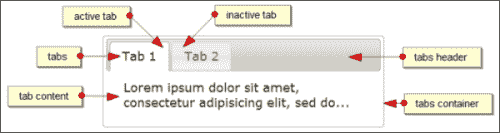
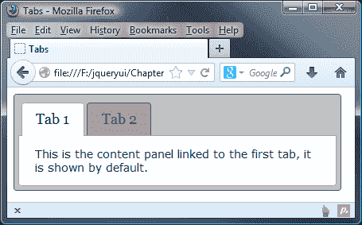
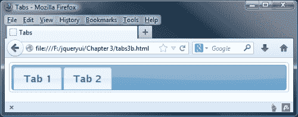
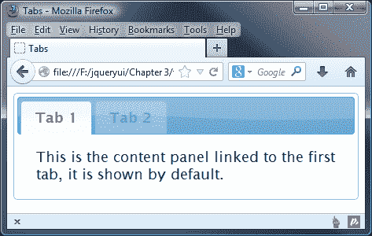
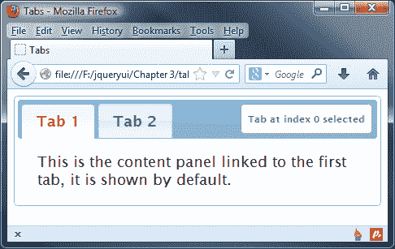
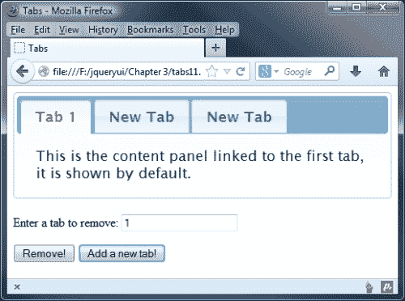
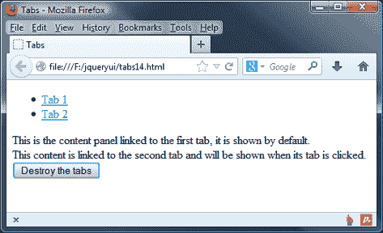
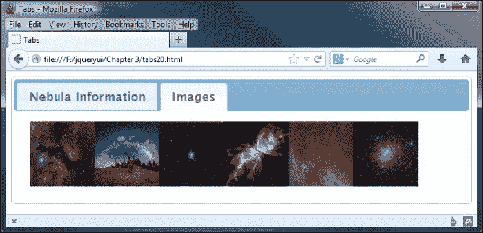

# 三、使用选项卡小部件

现在我们已经正式介绍了 jQueryUI 库、CSS 框架和一些工具，接下来我们可以开始查看库中包含的各个组件。在接下来的七章中，我们将介绍小部件。这些是一组具有视觉吸引力、高度可配置的用户界面小部件。

UI 选项卡小部件用于在一组不同元素之间切换可见性，每个元素都包含可以通过单击其选项卡标题访问的内容。每个内容面板都有自己的选项卡。选项卡标题通常显示在小部件的顶部，尽管可以重新定位它们，使其显示在小部件的底部。

选项卡的结构使其水平排列，而内容部分除活动面板外均设置为`display: none`。单击选项卡将高亮显示该选项卡并显示其关联的内容面板，同时确保隐藏所有其他内容面板。一次只能打开一个内容面板。选项卡可以配置为不打开任何内容面板。

在本章中，我们将研究以下主题：

*   小部件的默认实现
*   CSS 框架如何针对选项卡小部件
*   如何将自定义样式应用于一组选项卡
*   使用选项卡的选项配置选项卡
*   用于内容面板更改的内置转换效果
*   使用选项卡的方法控制选项卡
*   由选项卡定义的自定义事件
*   AJAX 选项卡

以下屏幕截图标记了一组 jQuery UI 选项卡所包含的不同元素：



# 实现一个标签小部件

选项卡所基于的底层 HTML 元素的结构相当严格，小部件需要一定数量的元素才能工作。必须从列表元素（有序或无序）创建选项卡，并且每个列表项必须包含一个`<a>`元素。每个链接都需要有一个与链接的`href`属性关联的指定`id`对应的元素。在第一个示例之后，我们将澄清这些元素的确切结构。

在文本编辑器中的新文件中，创建以下页面：

```js
<!DOCTYPE html>
<html>
<head>
  <meta charset="utf-8">
  <title>Tabs</title>
  <link rel="stylesheet" href="development-bundle/themes/base/jquery.ui.all.css">
  <script src="js/jquery-2.0.3.js"></script>
  <script src="development-bundle/ui/jquery.ui.core.js"> </script>
  <script src="development-bundle/ui/jquery.ui.widget.js"> </script>
  <script src="development-bundle/ui/jquery.ui.tabs.js"> </script>
  <script>
    $(document).ready(function($){
    $("#myTabs").tabs();
 });
  </script>  
</head>
<body>
  <div id="myTabs">
    <ul>
      <li><a href="#a">Tab 1</a></li>
      <li><a href="#b">Tab 2</a></li>
    </ul>
    <div id="a">This is the content panel linked to the first tab, it is shown by default.</div>
    <div id="b">This content is linked to the second tab and will be shown when its tab is clicked.</div>
  </div>
</body>
</html>
```

将代码保存为`tabs1.html`在您的`jqueryui`工作文件夹中。让我们回顾一下使用了什么。默认选项卡小部件配置需要以下脚本和 CSS 资源：

*   `jquery.ui.all.css`
*   `jquery-2.0.3.js`
*   `jquery.ui.core.js`
*   `jquery.ui.widget.js`
*   `jquery.ui.tabs.js`

选项卡小部件通常由几个以特定方式排列的标准 HTML 元素构成：

*   外部容器元素，在其上调用 tabs 方法
*   列表元素（`<ul>`或`<ol>`）
*   每个选项卡的`<li>`元素中的`<a>`元素
*   每个选项卡的内容面板的元素

### 注

这些元素既可以硬编码到页面中，也可以动态添加，也可以两者混合，具体取决于需求。

外部容器中的列表和锚元素构成可单击的选项卡标题，用于显示与选项卡关联的内容部分。链接的`href`属性应设置为片段标识符，前缀为`#`。它应该与构成与其关联的内容部分的元素的`id`属性相匹配。

每个选项卡的内容部分都是使用`<div>`元素创建的。`id`属性是必需的，将由其对应的`<a>`元素作为目标。在本例中，我们使用了`<div>`元素作为每个选项卡的内容面板，但也可以使用其他元素，只要提供了相关配置并且生成的 HTML 有效。`panelTemplate`和`tabTemplate`配置选项可用于更改用于构建小部件的元素（有关更多信息，请参阅本章后面的*配置*部分）。

在结束标记之前，我们在`<head>`部分链接到了图书馆的几个`<script>`资源。可以使用`document.ready()`命令在`<head>`部分加载脚本，也可以在样式表和页面元素之后的末尾加载脚本。最后加载它们是一种经过验证的技术，可以提高页面的外观加载时间，但这究竟能为性能带来多大好处还存在争议。

首先将链接到 jQuery 后，我们链接到所有组件所需的`jquery.ui.core.js`文件（特效除外，特效有自己的核心文件）和`jquery.ui.widget.js`文件。然后我们链接到组件的源文件，在本例中为`jquery.ui.tabs.js`。

从库中取出三个必需的脚本文件后，我们可以转到自定义的`<script>`元素，在其中添加创建选项卡的代码。我们将用于创建选项卡的代码封装在 jQuery 的`DOMReady`语句中；这确保代码仅在页面元素已加载并准备好进行操作时执行。我们还通过 jQuery 对象（`$`来帮助避免与其他基于 JavaScript 的库发生冲突。

在`DOMReady`函数中，我们只需在 jQuery 对象上调用`tabs()`小部件方法，表示我们的 tabs 容器元素（带有`myTabs`的`id`的`<ul>`。当我们在浏览器中运行此文件时，我们应该看到本章第一个屏幕截图中显示的选项卡（当然没有注释）。

# 设置 Tabs 小部件的样式

使用 Firefox 的 Firebug（或另一个通用 DOM 浏览器），我们可以看到各种各样的类名被添加到不同的底层 HTML 元素中。让我们简要回顾一下这些类名，看看它们如何影响小部件的整体外观。在外部容器`<div>`中添加以下类名：

<colgroup><col style="text-align: left"> <col style="text-align: left"></colgroup> 
| 

类名

 | 

意图

 |
| --- | --- |
| `ui-tabs` | 允许应用选项卡特定的结构 CSS。 |
| `ui-widget` | 设置嵌套元素继承的通用字体样式。 |
| `ui-widget-content` | 提供特定于主题的样式。 |
| `ui-corner-all` | 将圆角应用于容器。 |

容器中的第一个元素是`<ul>`元素。此元素接收以下类名：

<colgroup><col style="text-align: left"> <col style="text-align: left"></colgroup> 
| 

类名

 | 

意图

 |
| --- | --- |
| `ui-tabs-nav` | 允许应用选项卡特定的结构 CSS。 |
| `ui-helper-reset` | 中和应用于`<ul>`元素的浏览器特定样式。 |
| `ui-helper-clearfi` | 应用清除修复，因为此元素具有浮动的子元素。 |
| `ui-widget-header` | 提供特定于主题的样式。 |
| `ui-corner-all` | 应用圆角。 |

构成`tab`标题一部分的单个`<li>`元素具有以下类名：

<colgroup><col style="text-align: left"> <col style="text-align: left"></colgroup> 
| 

类名

 | 

意图

 |
| --- | --- |
| `ui-state-default` | 将标准、非活动、非选定、非悬停状态应用于选项卡标题。 |
| `ui-corner-top` | 将圆角应用于元素的上边缘。 |
| `ui-tabs-selected` | 此仅适用于活动选项卡。在默认实现的页面加载上，这将是第一个选项卡。选择其他选项卡将从当前选定的选项卡中删除此类，并将其应用于新选定的选项卡。 |
| `ui-state-active` | 将主题特定样式应用于当前选定的选项卡。与上一个类名一样，此类名将添加到当前选定的选项卡中。之所以有两个类名，是因为`ui-tabs-selected`提供了功能 CSS，`ui-state-active`提供了视觉和装饰样式。 |

每个`<li>`中的`<a>`元素没有给出任何类名，但它们仍然具有框架应用于它们的结构和主题特定样式。

最后，保存每个选项卡内容的面板元素具有以下类名：

<colgroup><col style="text-align: left"> <col style="text-align: left"></colgroup> 
| 

类名

 | 

意图

 |
| --- | --- |
| `ui-tabs-panel` | 将结构 CSS 应用于内容面板。 |
| `ui-widget-content` | 应用特定于主题的样式。 |
| `ui-corner-bottom` | 将圆角应用于内容面板的底边。 |

所有这些类都由库自动添加到底层 HTML 元素中。在编码页面或添加基本标记时，我们不需要手动添加它们。

# 将自定义主题应用于选项卡

在下一个示例中，我们可以看到如何更改选项卡的基本外观。我们可以使用自己的样式规则覆盖纯粹用于显示目的的任何规则，以便快速轻松地进行自定义，而无需更改与选项卡功能或结构相关的规则。

在文本编辑器的新文件中，创建以下非常小的样式表：

```js
#myTabs { min-width: 400px; padding: 5px; border: 1px solid #636363; background: #c2c2c2 none; }
.ui-widget-header { border: 0; background: #c2c2c2 none; font-family: Georgia; }
#myTabs .ui-widget-content { border: 1px solid #aaa; background: #fff none; font-size: 80%; }
.ui-state-default, .ui-widget-content .ui-state-default { border: 1px solid #636363; background: #a2a2a2 none; }
.ui-state-active, .ui-widget-content .ui-state-active { border: 1px solid #aaa; background: #fff none; }
```

这就是我们所需要的。将文件另存为`css`文件夹中的`tabsTheme.css`。如果将类名与前几页上的表进行比较，您将看到我们正在覆盖特定于主题的样式。因为我们覆盖了主题文件，所以我们需要满足或超过`theme.css`中选择器的特殊性。这就是为什么我们有时针对多个选择器。

在本例中，我们覆盖了`jquery.ui.tabs.css`中的一些规则。我们需要使用来自`jquery.ui.theme.css`（`.ui-widget-content`的选择器）以及容器元素的 ID 选择器，以击败双类选择器`.ui-tabs .ui-tabs-panel`。

在`tabs1.html`的`<head>`中添加以下对此新样式表的引用，并将文件重新保存为`tabs2.html`：

```js
<link rel="stylesheet" href="css/tabsTheme.css">
```

### 注

确保我们刚刚创建的自定义样式表出现在`jquery.ui.tabs.css`文件之后，因为如果样式表没有以正确的顺序链接，我们试图覆盖的规则将不会被自定义主题文件覆盖。

如果我们在浏览器中查看新页面，它应显示在以下屏幕截图中：



我们新的主题与默认的平滑度（如第一个屏幕截图所示）没有显著不同，但我们可以看到它是多么容易，并且只需要很少的代码就可以改变小部件的外观以适应其环境。

# 配置 Tabs 小部件

库中的每个不同组件都有一系列选项，用于控制默认情况下启用的小部件功能。可以将对象文本或对象引用传递给`tabs()`小部件方法来配置这些选项。

下表显示了配置非默认行为的可用选项：

<colgroup><col style="text-align: left"> <col style="text-align: left"> <col style="text-align: left"></colgroup> 
| 

选项

 | 

默认值

 | 

过去…

 |
| --- | --- | --- |
| `active` | `0` | 指示哪个面板是打开的。 |
| `collapsible` | `false` | 如果单击了活动选项卡，则允许取消选中该选项卡，以便隐藏所有内容面板，并且仅显示选项卡标题。 |
| `disabled` | `false` | 在页面加载时禁用小部件。我们还可以传递一组选项卡索引（从零开始），以便禁用特定的选项卡。 |
| `event` | `"click"` | 指定触发内容面板显示的事件。 |
| `heightStyle` | `content` | 控制选项卡小部件和每个面板的高度。可能的值为`auto`、`fill,`和`content`。 |
| `hide` | `null` | 控制是否或如何设置面板隐藏的动画。 |
| `show` | `null` | 控制是否或如何设置面板显示的动画。 |

# 使用标签

Tabs 小部件提供了许多选项，我们可以使用这些选项执行操作，例如选择或禁用选项卡，或者添加过渡效果。在接下来的几个示例中，我们将从选择选项卡开始，了解其中的一些选项。

## 选择一个选项卡

让我们看看如何使用这些可配置属性。例如，让我们配置小部件，以便在页面加载时显示第二个选项卡。移除`tabs2.html`的`<head>`中`tabsTheme.css`的链接，并更改最终的`<script>`元素，使其显示如下：

```js
<script>
 $(document).ready(function($){
 var tabOpts = {
 active: 1
 };
 $("#myTabs").tabs(tabOpts);
 })
</script>
```

另存为`tabs3.html`。不同的选项卡及其关联的内容面板由从零开始的数字索引表示。默认情况下，指定要打开的不同选项卡与提供其索引号作为`active`属性的值一样简单。现在加载页面时，默认选择第二个选项卡。

除了更改所选择的选项卡外，我们还可以通过在`active`属性之外为`collapsible`提供一个值来指定最初不应选择任何选项卡。将`<script>`元素从`tabs4.html`更改为如下所示：

```js
<script>
 $(document).ready(function($){
 var tabOpts = {
 active: false,
 collapsible: true
 };
 $("#myTabs").tabs(tabOpts); 
})
</script>
```

这将导致小部件在页面加载时显示如下：



## 禁用选项卡

您可能希望在满足特定条件之前禁用特定选项卡。这可以通过操纵选项卡的`disabled`属性轻松实现。将`tabs4.html`中的`tabOpts`配置对象更改为：

```js
var tabOpts = {
 disabled: [1]
};
```

将此保存为`tabs5.html`在您的`jqueryui`文件夹中。在本例中，我们删除了`active`属性，并将第二个选项卡的索引添加到禁用的数组中。我们还可以将其他选项卡的索引添加到此数组中，并用逗号分隔，以默认禁用多个选项卡。

当页面加载到浏览器中时，第二个选项卡应用了类名`ui-widget-disabled`，并将从`ui.theme.css`中拾取禁用的样式。它不会以任何方式响应鼠标交互，如以下屏幕截图所示：



## 添加过渡效应

我们可以使用 show 属性轻松添加吸引人的过渡效果。在打开或关闭选项卡时显示这些选项。此选项是使用配置对象内的另一个对象文字（或数组）配置的，它启用一个或多个效果。例如，我们可以使用以下配置对象启用淡入效果：

```js
var tabOpts = {
 show: { effect: "toggle", duration: "slow" }
};
```

将此文件另存为您的`jqueryui`文件夹中的`tabs6.html`。我们创建的 show 对象有两个属性。第一个属性是更改选项卡时要使用的动画。为了使用淡入淡出的动画，我们指定了`effect`，因为这是调整的内容。切换效果只会反转其当前设置。如果当前可见，则使其不可见，反之亦然。您可以使用任意一种效果选项，如`toggle`、`fadeIn,`或`slideDown`；我们将在[第 14 章](14.html "Chapter 14. UI Effects")、*UI 效果*中详细介绍效果。

第二个属性`duration`指定动画发生的速度。此属性的值为`slow`或`fast`，分别对应于`200`和`600`毫秒。任何其他字符串将导致默认持续时间为`400`毫秒。我们还可以提供一个整数，表示动画应该运行的毫秒数。

当我们运行该文件时，我们可以看到选项卡内容随着选项卡的关闭而慢慢淡出，而随着新选项卡的打开而淡入。两个动画都发生在单个选项卡交互期间。例如，要仅显示一次动画，当选项卡关闭时，我们需要将`show`对象嵌套在数组中。更改`tabs6.html`中的配置对象，使其显示如下：

```js
var tabOpts = {
 show: [{ opacity: "toggle", duration: "slow" }, null]
};
```

当前打开的内容面板的关闭效果包含在数组第一项中的对象中，新选项卡的打开动画是第二项。通过将 null 指定为数组中的第二项，我们可以在选择新选项卡时禁用打开动画。另存为`tabs7.html`并在浏览器中查看结果。

我们还可以为打开和关闭动画指定不同的动画和速度，方法是添加另一个对象作为第二个数组项，而不是`null`。

## 折叠标签

默认情况下单击当前活动的选项卡时，不会发生任何事情。但是我们可以改变这一点，使当前打开的内容面板在选择其选项卡标题时关闭。更改`tabs7.html`中的配置对象，使其显示如下：

```js
var tabOpts = {
 collapsible: true
};
```

将此版本另存为`tabs8.html`。此选项允许关闭所有内容面板，就像我们之前为`selected`属性提供 null 时一样。点击停用的选项卡将选择该选项卡并显示其相关内容面板。再次单击同一选项卡将关闭它，缩小小部件，以便只有选项卡标题可见。

# 处理选项卡事件

Tabs 小部件定义了一系列有用的选项，允许您在检测到小部件公开的某些事件时添加回调函数以执行不同的操作。下表列出了能够在事件上接受可执行函数的配置选项：

<colgroup><col style="text-align: left"> <col style="text-align: left"></colgroup> 
| 

事件

 | 

当。。。

 |
| --- | --- |
| `add` | 将添加一个新选项卡。 |
| `disable` | 选项卡被禁用。 |
| `enable` | 选项卡已启用。 |
| `load` | 选项卡的远程数据已加载。 |
| `remove` | 一个选项卡被移除。 |
| `select` | 选择一个选项卡。 |
| `show` | 将显示一个选项卡。 |

库的每个组件都有回调选项（如上表中的选项），这些选项经过调整以查找任何访问者交互中的关键时刻。我们在这些回调中使用的任何函数通常在更改发生之前执行。因此，您可以从回调中返回 false 并防止操作发生。

在我们的下一个示例中，我们将看看使用标准的非绑定技术对所选的特定选项卡做出反应是多么容易。更改`tabs8.html`中的最后一个`<script>`元素，使其显示如下：

```js
$(document).ready(function($){
 var handleSelect = function(e, tab) {
 $("<p></p>", {
 text: "Tab at index " + tab.newTab.index() + " selected", 
 "class": "status-message ui-corner-all"
 }).appendTo(".ui-tabs-nav", "#myTabs").fadeOut(5000, function() {
 $(this).remove();
 });
 },
 tabOpts = {
 beforeActivate: handleSelect
 }
 $("#myTabs").tabs(tabOpts);
});
```

将此文件另存为`tabs9.html`。我们还需要一点 CSS 来完成这个例子。在我们刚刚创建的页面的`<head>`中，添加以下`<link>`元素：

```js
<link rel="stylesheet" href="css/tabSelect.css">
```

然后在文本编辑器的新页面中，添加以下代码：

```js
.status-message { padding:11px 8px 10px; margin:0; border:1px solid #aaa; position: absolute; right: 10px; top: 9px; font-size: 11px; background-color: #fff; }
.ui-widget-header { color: #2e6e9e; font-weight: bold; }
```

将此文件另存为`css`文件夹中的`tabSelect.css`。在本例中，我们链接到生产环境中的多个 CSS 文件；您可能需要考虑将 CSS 合并到一个文件中，以最小化 CSS HTTP 请求。虽然这将有助于提高大型站点的性能，但它的代价是无法插入替换的 jQuery UI CSS 文件，因为您将丢失添加的任何自定义项。

在本例中，我们使用了`beforeActivate`回调，在 jQuery 中使用`<p>`标记创建了一个新元素，尽管其原理与选项卡触发的任何其他自定义事件相同。回调函数的名称作为配置对象中的`beforeActivate`属性的值提供。

当小部件执行回调函数时，它会自动将两个参数传递给我们定义的回调函数。这些是原始事件对象和自定义对象，其中包含所选选项卡中的有用属性。

要找出单击了哪些选项卡，我们可以查看第二个对象的`index()`属性（记住这些是从零开始的索引）。这将与一些解释性文本一起添加到我们动态创建并附加到小部件标题的段落元素中：



每当选择一个选项卡时，前面的段落就会消失。请注意，事件是在更改发生之前触发的。

## 对事件的约束

使用每个组件公开的事件回调是处理交互的标准方式。但是，除了上表中列出的回调之外，我们还可以钩住每个组件在不同时间触发的另一组事件。

我们可以使用标准 jQuery`on()`方法将事件处理程序绑定到自定义事件，由 Tabs 小部件触发，与绑定到标准 DOM 事件（如单击）的方式相同。

以下表列出了选项卡小部件的自定义绑定事件及其触发器：

<colgroup><col style="text-align: left"> <col style="text-align: left"></colgroup> 
| 

事件

 | 

当。。。

 |
| --- | --- |
| `tabsselect` | 选择一个选项卡。 |
| `tabsload` | 已加载远程选项卡。 |
| `tabsshow` | 将显示一个选项卡。 |
| `tabsadd` | 已将选项卡添加到界面中。 |
| `tabsremove` | 已从界面中删除选项卡。 |
| `tabsdisable` | 选项卡已被禁用。 |
| `tabsenable` | 已启用选项卡。 |

前三个事件按照它们在表中出现的事件顺序连续触发。如果没有远程选项卡，则按该顺序触发`tabsbeforeactivate`和`tabsactivate`。这些事件可以在操作发生之前或之后触发，具体取决于使用的事件。

让我们看看这类事件的实际使用情况；将`tabs8.html`中的最终`<script>`元素更改为以下内容：

```js
<script>
 $(document).ready(function($){
 $("#myTabs").tabs();
 $("#myTabs").on("tabsbeforeactivate", function(e, tab) {
 alert("The tab at index " + tab.newTab.index() + " was selected");
 });
 });
</script>
```

将此更改另存为`tabs10.html`。以这种方式绑定到`tabsbeforeactivate`会产生与前面示例相同的结果，使用`select`回调函数。与上次一样，警报应在新选项卡激活之前出现。

所有小部件公开的所有事件都可以通过`on()`方法使用，只需在事件名称前加上小部件名称。

### 注

尽管每个回调名称都是使用 camelCase 格式拼写的，但每个事件名称都必须用小写字母书写。

# 使用 tab 方式

Tabs 小部件包含许多不同的方法，这意味着它有一组丰富的行为。它还支持高级功能的实现，允许我们以编程方式使用它。让我们看看下表中列出的方法：

<colgroup><col style="text-align: left"> <col style="text-align: left"></colgroup> 
| 

方法

 | 

曾经

 |
| --- | --- |
| `destroy` | 完全移除 tabs 小部件。 |
| `disable` | 禁用所有选项卡。 |
| `enable` | 启用所有选项卡。 |
| `load` | 重新加载 AJAX 选项卡的内容，指定选项卡的索引号。 |
| `option` | 在小部件初始化后获取或设置任何属性。 |
| `widget` | 返回调用`tabs()`小部件方法的元素。 |

# 启用和禁用选项卡

我们可以使用`enable`或`disable`方法以编程方式启用或禁用特定选项卡。这将有效地打开最初禁用的任何选项卡或禁用当前处于活动状态的选项卡。

让我们使用`enable`方法打开一个选项卡，我们在前面的示例中默认禁用了该选项卡。直接在`tabs5.html`中选项卡小部件的现有标记之后添加以下新的`<button>`元素：

```js
<button type="button" id="enable">Enable</button>
<button type="button" id="disable">Disable</button>
```

接下来，更改最后的`<script>`元素，使其显示如下：

```js
<script>
$(document).ready(function($){
 $("#myTabs").tabs({
 disabled: [1]
 });
 $("#enable").click(function() {
 $("#myTabs").tabs("enable", 1);
 });
 $("#disable").click(function() {
 $("#myTabs").tabs("disable", 1);
 });
});
</script>
```

将更改后的文件保存为`tabs11.html`。在页面上，我们添加了两个新的`<button>`元素，一个用于启用已禁用选项卡，另一个用于再次禁用它。

在 JavaScript 中，我们使用**启用**按钮的`click`事件调用`tabs()`小部件方法。为了这样做，我们将字符串`enable`作为第一个参数传递给`tabs()`方法。此外，我们将要启用的选项卡的索引号作为第二个参数传递。jQueryUI 中的所有方法都是以这种方式调用的。我们指定要调用的方法的名称作为小部件方法的第一个参数。`disable`方法的使用方式与相同。不要忘记，为了启用或禁用整个小部件，我们可以在没有附加参数的情况下使用这两种方法。

# 添加和移除卡舌

除了通过编程方式启用和禁用选项卡外，我们还可以删除它们或动态添加全新的选项卡。在`tabs11.html`中，删除现有的`<button>`元素并添加以下内容：

```js
<label>Enter a tab to remove:</label>
<input for="indexNum" id="indexNum">
<button type="button" id="remove">Remove!</button>
<button type="button" id="add">Add a new tab!</button>
```

然后将最后的

```js
<script>
  $(document).ready(function($){
 $("#myTabs").tabs();
 $("#remove").click(function() {
 var indexTab = parseInt($("#indexNum").val(), 10);
 var tab = $("#myTabs").find(".ui-tabs-nav li:eq(" + indexTab + ")").remove();
 $("#myTabs").tabs("refresh");
 });
 $("#add").click(function() {
 $("<li><a href='remoteTab.txt'>New Tab</a></li>") .appendTo("#myTabs .ui-tabs-nav");
 $("#myTabs").tabs("refresh");
 });
  });
</script>
```

我们还需要提供一些内容，这些内容将在新文件中远程加载到选项卡中，添加`Remote tab content!`，并将其保存为`remoteTab.txt`。

另存为`tabs12.html`-若要预览此示例，您需要使用本地 Web 服务器进行查看，例如**WAMP**（适用于 Windows）或**MAMP**（苹果 Mac）。如果使用文件系统访问，演示将无法工作。

在页面上，我们添加了一个新的说明性的`<label>`、一个`<input>`和一个`<button>`，用于指定要删除的选项卡。我们还添加了第二个`<button>`，用于添加新选项卡。

在`<script>`中，我们的新函数的第一个使用`remove`方法处理移除选项卡。此方法使用 jQuery 的`:eq()`函数查找要删除的选项卡的索引。在使用`refresh`方法更新选项卡实例之前，我们获取文本框中输入的值，并使用索引确定要删除的选项卡。

### 注

jQuery 的`val()`方法返回的数据是字符串格式的，所以我们将调用封装在 JavaScript`parseInt`函数中进行转换。

`add`方法在小部件中添加了一个新选项卡，使用类似的过程工作。在这里，我们创建一个列表项的实例，然后使用 jQuery 的`appendTo()`方法将其添加到现有选项卡并更新它们。在本例中，我们指定在`remoteTab.txt`文件中找到的内容应添加为新选项卡的内容。或者，我们还可以指定新选项卡应插入的位置的索引号作为第四个参数。如果未提供索引，则新选项卡将添加为最后一个选项卡。

添加或删除一些选项卡后，页面应显示如下内容：



# 模拟咔哒声

有时，您可能希望以编程方式选择特定选项卡并显示其内容。这可能是访问者进行其他交互的结果。

我们可以使用`option`方法来实现这一点，这与单击选项卡的动作完全类似。更改`tabs12.html`中的最后一个`<script>`块，使其显示如下：

```js
<script>
  $(document).ready(function($){
    $("#myTabs").tabs();
    $("#remove").click(function() {
      var indexTab = parseInt($("#indexNum").val(), 10);
      var tab = $( "#myTabs" ).find(".ui-tabs-nav li:eq(" + indexTab + ")").remove();
      $("#myTabs").tabs("refresh");
    });
    $("#add").click(function() {
      $("<li><a href='remoteTab.txt'>New Tab</a></li>").appendTo("#myTabs .ui-tabs-nav");
      $("#myTabs").tabs("refresh");
 var tabCount = $("#myTabs ul li").length;
 $("#myTabs").tabs("option", "active", tabCount - 1);
    });
 });
</script>  
```

将此保存为`tabs13.html`在您的`jqueryui`文件夹中。现在，当添加新选项卡时，它将自动被选中。`option`方法需要两个附加参数：第一个是要使用的选项的名称，第二个是要设置为活动的选项卡的 ID。

由于我们添加的选项卡默认（虽然可以更改）是界面中的最后一个选项卡，并且选项卡索引是零基的，所以我们只需使用`length`方法返回选项卡的数量，然后从这个数字中减去 1 即可得到索引。结果被传递到`option`方法。

有趣的是，选择新添加的选项卡可以立即修复或至少隐藏上一个示例中的额外空间问题。

# 销毁标签

如前面所示，我们可以很容易地添加选项卡，但有时您可能需要完全销毁一组选项卡。这可以通过使用`destroy`方法实现，这是 jQuery UI 中所有小部件的通用方法。让我们看看它是如何工作的。在`tabs13.html`中，在现有`<br>`之后立即移除现有标记，并添加一个新的`<button>`，如下所示：

```js
<br>
<button type="button" id="destroy">Destroy the tabs</button>

```

接下来，将最后的`<script>`元素更改为：

```js
<script>
 $(document).ready(function($){
 $("#myTabs").tabs();
 $("#destroy").click(function() {
 $("#myTabs").tabs("destroy");
 });
 });
</script> 

```

将此文件另存为`tabs14.html`。我们点击按钮调用的`destroy`方法完全删除了 Tabs 小部件，将底层 HTML 返回到其原始状态。单击按钮后，您将看到标准 HTML 列表元素和每个选项卡中的文本，类似于以下屏幕截图：



### 注

如果标签被销毁，只有页面中硬编码的原始标签才会保留，而不是使用`add`方法添加的标签。

# 获取和设置选项

与方法`destroy`方法一样，`option`方法被库中发现的所有不同组件暴露。此方法用于在 getter 和 setter 模式下使用可配置选项和函数。让我们看一个基本的例子；在`tabs9.html`中的 Tabs 小部件后添加以下`<button>`：

```js
<button type="button" id="show">Show Selected!</button>
```

然后更改最后的`<script>`元素，使其如下所示：

```js
<script>
$(document).ready(function($){
 $("#myTabs").tabs();
 $("#show").click(function() {
 $("<p></p>", {
 text: "Tab at index " + $("#myTabs").tabs("option", "active") + " is active"
 }).appendTo(".ui-tabs-nav").fadeOut(5000);
 });
});
</script>
```

我们还需要调整所示文本的位置，因此删除现有代码中指向`tabSelect.css`的链接，并在`<head>`部分添加以下内容：

```js
  <style type="text/css">
    ul.ui-tabs-nav p { margin-top: 2px; margin-left: 210px;}
  </style>
```

将此文件另存为`tabs15.html`。页面上的`<button>`已更改，因此显示当前活动的选项卡。我们所要做的就是将所选选项卡的索引添加到状态栏消息中，就像我们在前面的示例中所做的那样。我们通过传递字符串`active`作为第二个参数来获得`active`选项。任何选项的任何值都可以通过这种方式访问。

### 注

**链接 UI 方式**

链接小部件方法（与其他 UI 方法或核心 jQuery 方法）是可能的，因为与基础 jQuery 库中的方法一样，它们几乎总是返回 jQuery`($)`对象。请注意，在使用返回数据的 getter 方法（如`length`方法）时，这是不可能的。

要触发 setter 模式，我们可以提供第三个参数，其中包含要设置的选项的新值。因此，要更改`active`选项的值，为了更改显示的选项卡，我们可以使用以下 HTML，为此，请更改`tabs15.html`底部的 HTML，如图所示：

```js
<br>
<label for="newIndex">Enter a tab index to activate</label>
<input id="newIndex" type="text">
<button type="button2" id="set">Change Selected</button>

```

接下来，附加 click 处理程序，如图所示：

```js
<script>
  $(document).ready(function($){
    $("#myTabs").tabs();
 $("#set").click(function() {
 $("#myTabs").tabs("option", "active", parseInt($("#newIndex").val()));
 });
  });
</script>
```

另存为`tabs16.html`。新页面包含一个`<label>`、一个`<input>`以及一个`<button>`，用于获取`active`选项应设置为的索引号。单击按钮时，我们的代码将检索`<input>`的值，并使用它更改所选索引。通过提供新值，我们将该方法置于 setter 模式。

当我们在浏览器中运行此页面时，我们应该看到我们可以通过输入其索引号为`1`并点击**更改所选**按钮切换到第二个选项卡。

# 使用 AJAX 选项卡

我们看到了如何使用`add`方法向小部件动态添加 AJAX 选项卡，但我们也可以使用底层 HTML 向选项卡添加远程内容。在本例中，我们希望显示远程内容的选项卡始终可用，而不仅仅是在单击按钮之后。此示例也只能在安装和配置了 PHP 的完整 web 服务器上正常工作，例如 WAMP（PC）或 MAMP（Mac）。

将以下新的

```js
<li><a href="remoteTab.txt">AJAX Tab</a></li>
```

我们还应该从最后一个示例中删除`<button>`。

最后一个`<script>`元素可以用来调用`tabs`方法；不需要其他配置：

```js
$("#myTabs").tabs();
```

另存为`tabs17.html`。我们所做的只是使用基础标记中`<a>`元素的`href`属性指定远程文件的路径（与我们在前面的示例中使用的相同），从中创建选项卡。

与静态选项卡不同，我们不需要一个与链接的`href`匹配的`id`对应的`<div>`元素。选项卡内容所需的其他元素将由小部件自动生成。

如果使用 DOM 资源管理器，可以看到我们添加到“远程”选项卡链接的文件路径已被删除。相反，生成了一个新的片段标识符，并将其设置为`href`。新的片段也被添加为新标签的`id`（当然减去`#`符号），因此标签标题仍然显示标签。

除了从外部文件加载数据外，还可以从 URL 加载数据。当使用查询字符串或 web 服务从数据库检索内容时，这非常有用。与 AJAX 选项卡相关的方法包括`load`和`url`方法。`load`方法用于加载和重新加载 AJAX 选项卡的内容，这对于刷新频繁更改的内容非常有用。

### 注

tabs 小部件的 AJAX 功能中没有内置跨域支持。因此，除非使用其他 PHP 或其他服务器脚本语言作为代理，否则您可能希望使用**JavaScript 对象****符号**（**JSON**）结构化数据和 jQuery 的 JSONP 功能。文件和 URL 应与运行小部件的页面位于同一域下。

# 更改远程选项卡内容的 URL

`url`方法用于更改 AJAX 选项卡从中检索其内容的 URL。让我们看一下这两种方法的一个简单示例。还有许多与 AJAX 功能相关的属性。

在`tabs17.html`中的 Tabs 小部件后添加以下新的`<select>`元素：

```js
<select id="fileChooser">
  <option value="remoteTab1.txt">remoteTab1</option>
  <option value="remoteTab2.txt">remoteTab2</option>
</select>
```

然后将最终的`<script>`元素更改为以下内容：

```js
<script>
  $(document).ready(function($){
    $("#myTabs").tabs();
    $("#fileChooser").change(function() {
      $("#myTabs").tabs("option", "active", "2");
      $("#myTabs").find("ul>li a").attr("href", $(this).val());
      $("#myTabs").tabs("load", "active");
    });
  });
</script>
```

将新文件另存为`tabs18.html`。我们在页面中添加了一个简单的`<select>`元素，让您选择要在 AJAX 选项卡中显示的内容。在 JavaScript 中，我们为`<select>`设置了一个更改处理程序，并指定了一个匿名函数，以便在每次检测到事件时执行。

此功能首先设置活动选项卡；在本例中，ID 为 2 的 AJAX 选项卡使用 jQuery 的`find()`方法设置选项卡面板的`href`属性，然后使用`load()`方法将内容插入选项卡。

我们还需要第二个本地内容文件。更改`remoteTab1.txt`文件中的文本并将其重新保存为`remoteTab2.txt`。

在浏览器中运行新文件，使用`<select>`下拉菜单选择第二个远程文件，然后切换到远程选项卡。应显示第二个文本文件的内容。

# 显示通过 JSONP 获取的数据

对于最后一个示例，让我们为最后一个选项卡示例引入一些外部内容。如果我们使用 Tabs 小部件，结合标准 jQuery 库`getJSON`方法，我们可以绕过跨域排除策略，从另一个域拉入提要，显示在选项卡中。在`tabs19.html`中，更改 Tabs 小部件，使其显示如下：

```js
<div id="myTabs">
 <ul>
 <li><a href="#a"><span>Nebula Information</span></a></li>
 <li><a href="#flickr"><span>Images</span></a></li>
 </ul>
 <div id="a">
 <p>A nebulae is an interstellar cloud of dust, hydrogen gas, and plasma. It is the first stage of a star's cycle. In these regions the formations of gas, dust, and other materials clump together to form larger masses, which attract further matter, and eventually will become big enough to form stars. The remaining materials are then believed to form planets and other planetary system objects. Many nebulae form from the gravitational collapse of diffused gas in the interstellar medium or ISM. As the material collapses under its own weight, massive stars may form in the center, and their ultraviolet radiation ionizes the surrounding gas, making it visible at optical wavelengths.</p>
 </div>
 <div id="flickr"></div>
</div>
```

接下来，将最终`<script>`更改为以下内容：

```js
<script>
  $(document).ready(function($){
    var img = $("", {
      height: 100,
      width: 100
    }),
  tabOpts = {
  beforeActivate: function(event, ui) { 
    $('#myTabs a[href="#flickr"]').parent().index() != -1 ? getData() : null;
    function getData() {
      $("#flickr").empty();
      $.getJSON("http://api.flickr.com/services/feeds/photos_public.gne?tags=nebula&format=json&jsoncallback=?", function(data) {
          $.each(data.items, function(i,item){
            img.clone().attr("src", item.media.m) .appendTo("#flickr");
            if (i == 5) {
              return false;
            }
          });
        });
      }
    }
  };
  $("#myTabs").tabs(tabOpts);
});
</script>
```

将文件保存为`tabs19.html`在您的`jqueryui`文件夹中。我们首先创建一个新的``元素并将其存储在变量中。我们还创建了一个配置对象，并向其添加了`select`事件选项。每次选择一个选项卡时，我们设置为该选项值的函数将检查是否选择了`id`为`flickr`的选项卡。如果是，则使用 jQuery`getJSON`方法从[检索图像提要 http://www.flickr.com](http://www.flickr.com) 。

返回数据后，首先清空**Flickr**选项卡的内容以防止图像的累积，然后使用 jQuery 的`each()`工具方法迭代返回的 JSON 中的每个对象，并创建存储图像的克隆。

图像的每个新副本都使用来自当前提要对象的信息设置了其`src`属性，然后添加到空的**Flickr**选项卡。一旦对提要中中的六个对象进行了迭代，我们就退出 jQuery 的`each`方法。就这么简单。

当我们查看页面并选择**图像**选项卡时，在短暂延迟后，我们将看到六个新图像，如以下屏幕截图所示：



# 总结

Tabs 小部件是一种很好的节省页面空间的方法，它可以通过访问者的简单点击输入来组织相关（甚至完全不相关）的内容部分，这些内容可以显示或隐藏。它还为您的站点提供了一种交互性的氛围，有助于提高使用它的页面的整体功能和吸引力。

让我们回顾一下本章所涵盖的内容。我们首先研究了如何使用一点底层 HTML 和一行 jQuery 风格的 JavaScript 实现默认选项卡小部件。

然后我们看到了为 Tabs 小部件添加我们自己的基本样式是多么容易，从而改变了它的外观，而不是行为。我们已经知道，除此之外，我们还可以使用预先设计的主题，或者使用 ThemeRoller 创建一个全新的主题。

然后，我们继续研究选项卡 API 公开的一组可配置选项。通过这些，我们可以启用或禁用小部件支持的不同选项，例如是否通过单击或其他事件选择选项卡，以及在呈现小部件时是否禁用某些选项卡。

我们花了一些时间来研究如何使用一系列预定义的回调选项，以便在检测到不同事件时执行任意代码。我们还看到 jQuery`on()`方法可以在必要时侦听相同的事件。

根据可配置选项，我们介绍了一系列方法，可以使用这些方法以编程方式使选项卡执行不同的操作，例如模拟单击选项卡、启用或禁用选项卡以及添加或删除选项卡。

我们简要介绍了 Tabs 小部件支持的一些更高级的功能，如 AJAX 选项卡，以及使用 JSONP 获取信息。这两种技术都易于使用，可以为任何实现增加价值。

在下一章中，我们将继续看**手风琴**小部件，它与 Tabs 小部件一样，用于将内容分组到相关部分，一次显示一个。