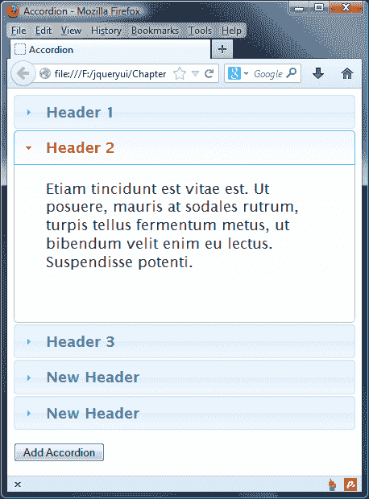

# 四、手风琴小部件

手风琴小部件是另一个 UI 小部件，它允许您将内容分组到单独的面板中，这些面板可以通过访问者交互打开或关闭。因此，它的大部分内容最初是隐藏在视图中的，就像我们在上一章中看到的 tabs 小部件一样。

每个容器都有一个与之关联的 heading 元素，用于打开容器并显示内容。单击标题时，其内容将滑入其下方的视图（带有动画）。当前可见的内容是隐藏的，而每当我们单击手风琴标题时，新内容就会显示出来。

在本章中，我们将介绍以下主题：

*   手风琴小部件的结构
*   手风琴的默认实现
*   添加自定义样式
*   使用可配置选项设置不同的行为
*   使用控制手风琴的方法
*   内置的动画类型
*   定制手风琴活动

accordion 小部件是一个强大且高度可配置的小部件，它允许您通过在任何时候只显示单个内容面板来节省网页空间。

以下屏幕截图显示了手风琴小部件的示例：


我们的访客很容易使用，我们也很容易实现。它有一系列可配置的选项，可用于自定义其外观和行为，并公开了一系列允许您以编程方式控制它的方法。它还附带了一组丰富的交互事件，我们可以使用这些事件来连接访客和小部件之间的关键交互。

accordion 容器元素的高度将自动设置，以便有空间显示除标题外最高的内容面板。此外，默认情况下，小部件的大小将保持不变，这样当内容面板打开或关闭时，它不会将页面上的其他元素推到一边。

# 构建手风琴小部件

让我们花点时间来熟悉手风琴的基本标记。在外部容器中是一系列链接。这些链接是手风琴中的标题，每个标题都有一个相应的内容面板，单击标题时会打开该面板。

值得记住的是，在使用 accordion 小部件时，一次只能打开一个内容面板。在文本编辑器的空白页中，创建以下页面：

```js
<!DOCTYPE html>
<html>
<head>
  <meta charset="utf-8">
  <title>Accordion</title>  
  <link rel="stylesheet" href="development-bundle/themes/redmond/jquery.ui.all.css">
  <script src="js/jquery-2.0.3.js"></script>
  <script src="development-bundle/ui/jquery.ui.core.js"></script>
  <script src="development-bundle/ui/jquery.ui.widget.js"> </script>  
  <script src="development-bundle/ui/jquery.ui.accordion.js"> </script>
  <script>
    $(document).ready(function($) {
      $("#myAccordion").accordion();
    });
  </script>
</head>
<body>
  <div id="myAccordion">
    <h2><a href="#">Header 1</a></h2>
    <div>Lorem ipsum dolor sit amet, consectetuer adipiscing elit. Aenean sollicitudin. Sed interdum pulvinar justo.
    Nam iaculis volutpat ligula. Integer vitae felis quis diam laoreet ullamcorper.</div>

    <h2><a href="#">Header 2</a></h2>
    <div>Etiam tincidunt est vitae est. Ut posuere, mauris at sodales rutrum, turpis tellus fermentum metus, ut
    bibendum velit enim eu lectus. Suspendisse potenti.</div>

    <h2><a href="#">Header 3</a></h2>
    <div>Donec at dolor ac metus pharetra aliquam. Suspendisse purus. Fusce tempor ultrices libero. Sed
    quis nunc. Pellentesque tincidunt viverra felis. Integer elit mauris, egestas ultricies, gravida vitae,
    feugiat a, tellus.</div>
  </div>
</body>
</html>
```

在`jqueryui`文件夹中将文件另存为`accordion1.html`，并在浏览器中试用。小部件应该像在本章开头的屏幕截图中一样出现，完全剥皮并准备好采取行动。

以下列表显示了小部件所需的依赖项：

*   `jquery.ui.all.css`
*   `jquery-2.0.3.js`
*   `jquery.ui.core.js`
*   `jquery.ui.widget.js`
*   `jquery.ui.accordion.js`

正如我们在 tabs 小部件中看到的，每个小部件都有自己的源文件（尽管它可能依赖于其他部件来提供功能）；必须以正确的顺序引用这些内容，小部件才能正常工作。jQuery 库必须始终首先出现，然后是`jquery.ui.core.js`文件。之后，必须遵循包含所需依赖项的文件。在引用小部件的 on 脚本文件之前，这些文件应该存在。如果文件加载顺序不正确，库组件将无法正常工作。

手风琴所需的底层标记是灵活的，小部件可以从各种不同的结构中构造。在本例中，手风琴标题由包裹在`<h2>`元素中的链接构成，内容面板是简单的`<div>`元素。

为了使手风琴正常工作，每个内容面板应直接出现在其相应的标题后面。小部件的所有元素都包含在一个`<div>`容器中，该容器以`accordion()`小部件方法为目标。

从库中获取所需的脚本依赖项后，我们使用一个自定义的`<script>`块将底层标记转换为 accordion。

为了初始化小部件，我们使用一个简单的 ID 选择器`$("#myAccordion")`，指定包含小部件标记的元素，然后在选择器后面链接`accordion()`小部件方法以创建手风琴。

在本例中，我们使用空片段（`#`作为选项卡标题元素中`href`属性的值，例如：

```js
<h2><a href="#">Header 1</a></h2>
```

您应该注意，在默认实现中单击标题时，不会遵循为 accordion 标题提供的任何 URL。

与我们在上一章中看到的 tabs 小部件类似，转换为 accordion 的底层标记在小部件初始化时添加了一系列类名。

组成小部件的许多不同元素都具有`role`和`aria-`属性。

### 注

**可访问的富互联网应用****ARIA**是 W3C 的一项建议，旨在确保富互联网应用仍然可以访问辅助技术。

最初隐藏在视图之外的手风琴面板被赋予了`aria-expanded = "false"`属性，以确保屏幕阅读器不会丢弃或无法访问使用`display: none`隐藏的内容。这使得手风琴小部件非常容易访问；它可以避免读者不必要地浏览大量可能隐藏的内容，并告诉用户他们也可以展开或折叠面板，具体取决于和`aria-expanded`属性的当前值。

# 手风琴造型

ThemeRoller 是选择或创建手风琴小部件主题的推荐工具，但有时我们可能希望大大改变小部件的外观和样式，超出 ThemeRoller 的可能范围。在这种情况下，我们可以在我们的示例中为自己的手风琴设计样式，我们将展平样式效果，添加边框，并删除手风琴小部件中某些元素的角。

在文本编辑器的新文件中添加以下代码：

```js
#myAccordion { width: 400px; border: 1px solid #636363; padding-bottom: 1px; }
#myAccordion .ui-state-active { background: #fff; } 
.ui-accordion-header { border: 1px solid #fff; font-family:
  Georgia; background: #e2e2e2 none; }
.ui-widget-content { font-size: 70%; border: none; }
.ui-corner-all { border-radius: 0; }
.ui-accordion .ui-accordion-header { margin: 0 0 -1px; } 
```

将此文件另存为 css 文件夹中的`accordionTheme.css`，并在`accordion1.html`的`<head>`元素中的 jQuery UI 样式表后链接到该文件：

```js
<link rel="stylesheet" href="css/accordionTheme.css">
```

将新文件另存为`jqueryui`文件夹中的`accordion2.html`，并在浏览器中查看。它应该如下所示：


从前面的屏幕截图中可以看到，我们已经禁用了由主题文件添加的内置圆角，并设置了可选字体、背景颜色和边框颜色。我们没有对小部件做太多更改，但是我们没有使用太多的样式规则。以这种方式继续覆盖规则以构建更复杂的自定义主题是很容易的。

# 配置手风琴

手风琴具有一系列可配置选项，允许我们更改小部件的默认行为。下表列出了可用选项及其默认值，并简要说明了其用法：

<colgroup><col style="text-align: left"> <col style="text-align: left"> <col style="text-align: left"></colgroup> 
| 

选项

 | 

默认值

 | 

使用

 |
| --- | --- | --- |
| `active` | `first child` (the first panel is open) | Sets the active heading on page load. |
| `animate` | `{}` | 控制面板的动画。 |
| `collapsible` | `false` | 允许同时关闭所有内容面板。 |
| `disabled` | `false` | 禁用小部件。 |
| `event` | `"click"` | 指定触发抽屉打开的标题上的事件。 |
| `header` | `"> li >:first-child,> :not(li):even"` | 设置标题元素的选择器。尽管看起来很复杂，但这是一个标准的 jQuery 选择器，它只针对每个奇数`<li>`元素中的第一个子元素。 |
| `heightStyle` | `"auto"` | 控制手风琴和每个面板的高度 |
| `icons` | `'header': 'ui-icontriangle-1-e', 'headerSelected': 'uiicon- triangle-1-s'` | 指定标题元素和所选状态的图标。 |

# 更改触发事件

大多数选项都是不言自明的，它们接受的值通常是布尔值、字符串或元素选择器。让我们使用其中的一些，以便我们可以探索它们的功能。更改`accordion2.html`中的最后一个`<script>`元素，使其显示如下：

```js
<script>
  $(document).ready(function($) {
 var accOpts = {
 event:"mouseover"
 }
    $("#myAccordion").accordion(accOpts);
  });
</script>
```

我们不再需要在`accordion2.html`中添加自定义样式表，因此继续并从代码中删除以下行：

```js
  <link rel="stylesheet" href="css/accordionTheme.css">
```

将这些更改保存为`accordion3.html`。首先，我们创建一个名为`accOpts`的新对象文本，其中包含`event`键和`mouseover`值，这是我们希望用来触发手风琴面板打开的事件。我们将此对象作为参数传递给`accordion()`方法，它覆盖小部件的默认选项，即`click`。

`mouseover`事件通常用作替代触发事件。也可以使用其他事件，例如，我们可以将`keydown`设置为事件，但为了使其工作，我们希望打开的手风琴面板必须已经聚焦。您应该注意，您还可以在小部件方法中使用内联对象设置选项，而无需创建单独的对象。使用以下代码同样有效，并且通常是首选的编码方式，我们将在本书的其余部分使用：

```js
<script>
  $(function() {
 $("#myAccordion").accordion({ 
 event: "mouseover" 
 });
  });
</script>
```

# 更改默认活动标头

默认情况下，当小部件在其内容面板打开的情况下呈现时，将选择手风琴的第一个标题。我们可以使用`active`选项更改页面加载时选择的标题。更改`accordion3.html`中的配置`<script>`块，使其显示如下：

```js
  <script>
    $(document).ready(function($) {
      $("#myAccordion").accordion({
        active: 2
      });
    });
  </script>
```

将此版本另存为`accordion4.html`。我们将`active`选项设置为整数`2`以默认打开第三个内容面板，并且与我们在上一章中看到的选项卡标题类似，accordion 的标题使用基于零的索引。除了整数之外，该选项还接受 jQuery 选择器或原始 DOM 元素。

我们还可以使用的布尔值`false`来配置手风琴，这样默认情况下就不会打开任何内容面板。再次将配置对象更改为以下内容：

```js
  <script>
    $(document).ready(function($) {
      $("#myAccordion").accordion({
 collapsible: true, 
 active: false
      });
    });
  </script>
```

### 注

如果您使用`active: false`选项，如图所示，您还必须包括`collapsible`选项，该选项必须设置为 true 才能使`active`正常工作。

另存为`accordion5.html`。现在，当页面加载时，所有内容面板都将从视图中隐藏：


手风琴将保持关闭状态，直到选择其中一个标题，除非单击活动标题，否则该标题将保持打开状态；此时，其关联的内容面板将关闭。对于可用性，最好避免在同一个实现中同时配置此选项和`mouseover`事件选项，因为即使用户无意中将鼠标移离并移回打开的面板，打开的面板也会关闭。

# 填充其容器的高度

如果设置了`heightStyle`选项，将强制手风琴达到其容器的全高。到目前为止，在我们的示例中，手风琴的容器一直是页面的主体，主体的高度将仅是其最大元素的高度。我们需要使用一个具有固定高度的新容器元素来查看此选项的操作。

在`accordion5.html`的`<head>`元素中，添加以下`<style>`元素：

```js
<style>
  #container { height: 600px; width: 400px; }
</style>
```

然后将 accordion 的所有底层标记包装到一个新的容器元素中，如下所示：

```js
<div id="container">
  <div id="myAccordion">
    <h2><a href="#">Header 1</a></h2>
    <div>Lorem ipsum dolor sit amet, consectetuer adipiscing   elit. Aenean sollicitudin. Sed interdum pulvinar justo. Nam iaculis volutpat ligula. Integer vitae felis quis diam laoreet ullam corper.</div>
    <h2><a href="#">Header 2</a></h2>
    <div>Etiam tincidunt est vitae est. Ut posuere, mauris at 
sodales rutrum, turpis tellus fermentum metus, ut bibendum 
velit enim eu lectus. Suspendisse potenti.</div>
     <h2><a href="#">Header 3</a></h2>
     <div>Donec at dolor ac metus pharetra aliquam. Suspendisse purus. Fusce tempor ultrices libero. Sed quis nunc. Pellentesque tincidunt viverra felis. Integer elit mauris, egestas ultricies, gravida vitae, feugiat a, tellus.</div>
  </div>
</div>

```

最后，将配置`<script>`更改为使用`heightStyle`选项：

```js
  <script>
    $(document).ready(function($) {
      $("#myAccordion").accordion({
 heightStyle: "fill" 
      });
    });
  </script>
```

将更改保存为`accordion6.html`。使用页面`<head>`元素中指定的 CSS 为新容器指定了固定的高度和宽度。

### 注

在大多数情况下，您需要创建一个单独的样式表。出于我们的目的，只需一个选择器和两条规则，在 HTML 文件中使用样式标记是最方便的。

`heightStyle`选项强制手风琴占据其容器的整个高度，自然限制容器的宽度也会减少小部件的宽度。此页面应显示如下：


# 使用手风琴动画

手风琴小部件附带默认启用的内置幻灯片动画，到目前为止，它已经出现在我们的所有示例中。禁用此动画就像提供`false`和`animate`选项的值一样简单。从`accordion6.html`页面的`<head>`元素中移除`<style>`标签，移除附加容器`<div>`，然后更改配置对象，使其显示如下：

```js
  <script>
    $(document).ready(function($) {
      $("#myAccordion").accordion({
 animate: false
      });
    });
  </script>
```

另存为`accordion7.html`。这将导致每个内容面板立即打开，而不是在单击标题时滑动打开。

小部件中还内置了另一个动画`EaseOutBounce`动画。但是，要使用此备用动画，我们需要添加到`jquery.ui.effect.js`文件的链接。

直接在`<head>`元素顶部`jquery.ui.accordion.js`链接之后，添加以下代码行：

```js
<script src="development-bundle/ui/jquery.ui.effect.js"></script>
```

现在，更改我们自定义`<script>`元素中的配置对象，使其显示如下：

```js
  <script>
    $(document).ready(function($) {
      $("#myAccordion").accordion({
 animate: {
 duration: 600,
 down: {
 easing: "easeOutBounce",
 duration: 1000
 }
 }
      });
    });
  </script>
```

将这些更改另存为`accordion8.html`。尽管手风琴面板的关闭方式与前面的示例中完全相同，但当它们打开时，会在动画结束时反弹几次。这是一个让动画更有趣的好方法，正如我们在本例中看到的，它很容易使用。

除了两个预配置的动画外，我们还可以使用`jquery.ui.effect.js`文件中定义的任何不同的缓和效果，包括以下内容：

*   `easeInQuad`
*   `easeInCubic`
*   `easeInQuart`
*   `easeInQuint`
*   `easeInSine`
*   `easeInExpo`
*   `easeInCirc`
*   `easeInElastic`
*   `easeInBack`
*   `easeInBounce`

`easeOut`和`easeInOut`对应物对这些缓解方法进行了补充。完整列表见`jquery.ui.effect.js`文件，或参考[第 14 章](14.html "Chapter 14. UI Effects")、*UI 效果*中的缓和表。

### 注

请参见 jQuery UI 演示站点，了解[上手风琴效果的一些优秀示例 http://jqueryui.com/accordion/](http://jqueryui.com/accordion/) 。这些效果可以应用于任何可以设置动画的小部件，如手风琴、选项卡、对话框或日期选择器。

缓和效果不会更改基础动画，它仍然基于幻灯片动画。但它们确实改变了动画的进程。例如，我们可以通过在配置对象中使用`easeInOutBounce`放松效果，使内容面板在动画的开始和结束时反弹：

```js
<script>
  $(document).ready(function($) {
    $("#myAccordion").accordion({
      animate: {
        duration: 600,
        down: {
 easing: "easeInOutBounce",
          duration: 1000
        }
      }
    });
  });
</script>
```

将此文件另存为`accordion9.html`并在浏览器中查看。大多数缓和效果都是相反的，例如，我们可以使用`easeInBounce`缓和效果在动画开始时使内容面板反弹，而不是使内容面板在动画结束时反弹。

另一个对动画有影响的选项是`heightStyle`属性，它在每个动画之后重置`height`和`overflow`样式。请记住，默认启用动画，但此选项不启用。将`accordion9.html`中的配置对象更改为：

```js
$(document).ready(function($) {
  $("#myAccordion").accordion({
 heightStyle: "content",
    animate: {
      duration: 600,
      down: {
 easing: "easeOutBounce",
        duration: 1000
      }
    }
  });
});
```

另存为`accordion10.html`。现在，当页面运行时，手风琴将不会保持固定大小；它的大小取决于每个面板中的内容量。在本例中，这并没有多大区别，但当使用动态内容时，该属性实际上是自己的，当面板内容频繁更改时，我们可能并不总是知道每个面板中有多少内容。

# 列出手风琴项目

手风琴公开了三个自定义事件，如下表所示：

<colgroup><col style="text-align: left"> <col style="text-align: left"></colgroup> 
| 

事件

 | 

触发时…

 |
| --- | --- |
| `activate` | 活动标头已更改。 |
| `beforeActivate` | 活动标头即将更改 |
| `create` | 小部件已创建 |

每次更改活动标题（及其相关内容面板）时，都会触发`activate`事件。它会在内容面板的打开动画结束时触发，或者如果动画被禁用，则会立即触发（但仍在活动面板更改之后）。

一旦选择了新标题，即在打开动画之前（或在活动面板更改之前，如果动画被禁用），就会触发`beforeActivate`事件。小部件初始化后，`create`事件立即触发。

# 使用变更事件

让我们看看如何在手风琴实现中使用这些事件。在`accordion10.html`中，更改配置对象，使其显示如下：

```js
$(document).ready(function($) {
  var statustext;
  $("#myAccordion").accordion({
    activate: function(e, ui) {
      $(".notify").remove();
      Statustext = $("<div />", {
        "class": "notify",
         text: [
           ui.newHeader.find("a").text(), "was activated,",
           ui.oldHeader.find("a").text(), "was closed"
         ].join(" ")
      });
      statusText.insertAfter("#myAccordion").fadeOut(2000, function(){
        $(this).remove();
      });
    }
  });
});
```

另存为`accordion11.html`。在本例中，我们使用`activate`配置选项指定一个匿名回调函数，该函数在每次更改活动面板时执行。此函数将自动接收两个对象作为参数。第一个对象是`event`对象，它包含原始浏览器`event`对象。

第二个参数是一个对象，它包含有关小部件的有用信息，例如激活的头元素（`ui.newHeader`）和停用的头元素（`ui.oldHeader`）。第二个对象是 jQuery 对象，因此我们可以直接对其调用 jQuery 方法。

在本例中，我们向下导航到标题中的`<a>`元素，并在信息框中显示其文本内容，该信息框附加到页面上，然后在短时间间隔后通过淡入淡出的动画删除。

作为参考，`ui`对象还以`ui.newPanel`和`ui.oldPanel`属性的形式提供内容面板的信息。

一旦标题被激活并显示其内容面板，将生成通知：


# 配置 beforeActivate 事件

`beforeActivate`事件也可以以完全相同的方式使用，我们使用此事件指定的任何回调函数也会接收要使用的`e`和`ui`对象。

将配置对象从上一个示例更改为如下所示：

```js
$(document).ready(function($) {
  var statusText;
  $("#myAccordion").accordion({
 beforeActivate: function(e, ui) {
      statusText = $("<div />", {
        "class": "notify",
        text: [ui.newHeader.find("a").text(),
          "was activated,", ui.oldHeader.find("a").text(),
          "was closed"].join(" ");
      });
      statusText.insertAfter("#myAccordion")
        .fadeOut(2000, function() {
          $(this).remove();
      });
    }
  });
});
```

另存为`accordion12.html`。更改的只是配置对象的目标属性。当我们运行页面时，我们会发现所有内容都与之前完全相同，只是我们的通知是在内容面板动画之前而不是之后生成的。

标准 jQuery`on()`方法也有事件，如`accordionactivate`和`accordionbeforeactivate`，因此我们可以指定一个回调函数在 accordion 配置之外执行。以这种方式使用事件处理程序允许我们精确地响应特定事件而触发它，而不是当页面呈现在屏幕上时。

作为一个例子，让我们为刚刚创建的演示重新编写脚本块，以使用`accordionbeforeactivate`事件处理程序。如果您想改用这种格式，只需用下面的脚本替换`accordion12.html`中的`<script>`块即可–您可以看到代码中突出显示的主要更改：

```js
<script>
  $(document).ready(function($) {
    var statusText;
    $("#myAccordion").accordion();

 $(document).on( "accordionbeforeactivate", function(e, ui) {
      statusText = $("<div />", {
        "class": "notify",
        text: [ui.newHeader.find("a").text(), "was activated, ", ui.oldHeader.find("a").text(), "was closed"].join(" ")
      });
      statusText.insertAfter("#myAccordion")
        .fadeOut(2000, function() {
        $(this).remove();
      });
 });
  });
</script>
```

在本例中，我们将`beforeActivate`事件处理程序从对 Accordion 的主配置调用中移到了它自己的事件处理程序中。这里，我们将事件处理程序绑定到文档对象；我们同样可以将它绑定到一个对象，例如页面上的按钮或超链接。

# 讲解手风琴演奏方法

手风琴包括一系列方法，允许您以编程方式控制和操纵小部件的行为。有些方法对于库的每个组件都是通用的，例如每个小部件使用的`destroy`方法。下表列出了 accordion 小部件的唯一方法：

<colgroup><col style="text-align: left"> <col style="text-align: left"></colgroup> 
| 

方法

 | 

使用

 |
| --- | --- |
| `refresh` | 重新计算手风琴面板的高度；结果取决于内容和`heightStyle`选项 |

## 割台激活

`option`方法可用于以编程方式显示或隐藏不同的抽屉。我们可以使用一个文本框和一个新按钮轻松地测试这种方法。在`accordion12.html`中，在手风琴后直接添加以下新标记：

```js
<label for="activateChoice">Enter a header index to activate   </label>
<input id="activateChoice">
<button type="button" id="activate">Activate</button>
```

现在更改`<script>`元素，使其显示如下：

```js
<script>
  $(document).ready(function($) {
    var drawer = parseInt($("#activateChoice").val(), 10);

 $("#myAccordion").accordion();
 $("#activate").click(function() {
 $("#myAccordion").accordion("option", "active", drawer);
 });
  });
</script>
```

将新文件另存为`accordion13.html`。`option`方法需要另外两个参数。它希望收到要使用的选项的名称，以及要激活的头元素的索引（从零开始）编号。在本例中，我们通过返回文本输入的值来获取要激活的标题。我们使用 JavaScript 的`parseInt()`函数将其转换为整数，因为`val()`jQuery 方法返回字符串。

如果指定了不存在的索引号，则不会发生任何。如果未指定索引，则将激活第一个标头。如果指定的值不是整数，则不会发生任何事情；脚本将无声地失败，没有任何错误，手风琴将继续正常工作。

# 添加或删除面板

在版本 1.10 之前，更改手风琴中面板数量的唯一方法是销毁它并重新初始化一个新实例。尽管这样做有效，但并不是一种令人满意的实现任何更改的方式，考虑到这一点，jQuery 团队已经努力引入了一种新方法，使其与其他小部件保持一致，这些小部件不需要重新创建就可以更改任何配置的选项。让我们使用输入按钮来测试这个方法，以创建新的面板。

在`accordion13.html`中，将手风琴正下方的标记更改为以下代码：

```js
<p>
 <button type="button" id="addAccordion">Add Accordion</button>
</p>
```

更改`<script>`块，使其显示如下：

```js
<script>
  $(document).ready(function($) {
    $("#myAccordion").accordion();
 $('#addAccordion').click( function() {
 var newDiv = "<h2><a ref='#'>New Header</a></h2><div>New Content</div>";
 $("#myAccordion").append(newDiv).accordion("refresh"); 
 });
  });
</script>
```

将新文件另存为`accordion14.html`。在本例中，我们为一个新的 accordion 面板创建了额外的标记内容，并将其分配给`newDiv`变量。我们将其附加到 myAccordion`<div>`，然后使用 accordion 的`refresh`方法刷新。这不需要任何参数。

### 注

我们已经为每个 accordion 面板指定了标记中要使用的默认文本。只要保持相同的标记，就可以很容易地将其修改为包含所需的任何文本。

当页面加载时，我们可以点击**添加手风琴**添加任意数量的新手风琴面板，如截图所示：



然而，如果我们需要删除一个手风琴面板，这需要更多的工作，标记分为两部分（标题和面板），因此我们必须分别删除这两部分。更改手风琴正下方的标记：

```js
<p>  
  <label>Enter a tab to remove:</label>
  <input for="indexNum" id="indexNum">
  <button type="button" id="remove">Remove!</button>
</p>
```

现在将`<script>`块更改如下：

```js
<script>
  $(document).ready(function($) {
    function removeDrawer(removeIndex) {
      $("#myAccordion").find("h2").eq(removeIndex).remove();
      $("#myAccordion").find("div").eq(removeIndex).remove();
      $("#myAccordion").accordion("refresh");   
    }
    $("#myAccordion").accordion();
    $("#remove").click(function(event, ui) {
      var removeIndex = $("#indexNum").val();
      removeDrawer(removeIndex);
    });
  });
</script>
```

将新文件保存为`accordion15.html`；页面加载后，输入`1`并点击**删除**删除中间标题及其面板：


在本例中，我们通过返回文本输入的值来获取要删除的手风琴。如果指定了不存在的索引号，则不会发生任何事情。

然后我们使用`eq()`找到要移除的标题和面板，基于给定的值，一旦找到，它们就会被移除。最后一个阶段是`refresh`手风琴，这样就可以选择新的标题和面板。

# 调整手风琴面板的尺寸

在`accordion10.html`中更改手风琴小部件的基础标记，使第三个标题指向远程文本文件，第三个面板为空。标题元素还应被赋予一个`id`属性：

```js
<div id="myAccordion">
  <h2><a href="#">Header 1</a></h2>
  <div>Lorem ipsum dolor sit amet, consectetuer adipiscing elit. Aenean sollicitudin. Sed interdum pulvinar justo. Nam iaculis volutpat ligula. Integer vitae felis quis diam laoreet ullamcorper.</div>
  <h2><a href="#">Header 2</a></h2>
  <div>Etiam tincidunt est vitae est. Ut posuere, mauris at sodales rutrum, turpis tellus fermentum metus, ut bibendum velit enim eu lectus. Suspendisse poten-ti.</div>
 <h2 id="remote"><a href="remoteAccordion.txt">Remote</a></h2>
 <div></div>
</div>
```

您将在代码中看到，我们引用了一个文本文件，它将承载我们的远程内容。在编辑器中的新文件中，添加一些虚拟文本，并使用名称`remoteAccordion.txt`保存。（此文件的副本随本书附带的代码下载一起提供）。

然后更改最后的`<script>`元素，使其显示如下：

```js
$(document).ready(function($) {
  $("#myAccordion").accordion({
    beforeActivate: function(e, ui) {
      if (ui.newHeader.attr("id") === "remote") {
        $.get(ui.newHeader.find("a").attr("href"),
        function(data) {
          ui.newHeader.next().text(data);
        });
      }
    },
    activate: function(e, ui) {      
      ui.newHeader.closest("#myAccordion").accordion("refresh");
    }
  });
});
```

将此文件另存为`accordion16.html`。要正确查看此示例，您需要安装一个本地 web 服务器，例如 WAMP（用于 PC）或 MAMP（Mac），否则将无法呈现`remoteAccordion.txt`文件的内容。

在我们的配置对象中，我们使用`beforeActivate`事件来检查元素的`id`是否与我们提供给远程手风琴标题的`id`匹配。

如果是，我们使用 jQuery 的`get()`方法获取`<a>`元素的`href`属性中指定的文本文件的内容。如果请求成功返回，我们将文本文件的内容添加到标题后面的空面板中。这一切都发生在面板打开之前。

然后，在面板打开后，我们使用`activate`事件调用手风琴上的`refresh`方法。

当我们在浏览器中运行页面时，远程文本文件的内容应足以在内容面板中显示滚动条。调用`refresh`方法允许小部件重新调整自身，以便它可以包含所有新添加的内容，而无需显示滚动条。

您将从代码中看到，我们在两个地方使用了`newHeader`属性；一个是作为加载内容的一部分，另一个是在添加内容后刷新面板。让我们探讨一下这一点，因为这是我们如何在任何手风琴中访问内容的关键部分。

`ui`对象包含四个属性，允许我们访问添加到页面的任何手风琴的标题或面板中的内容。详情如下:

<colgroup><col style="text-align: left"> <col style="text-align: left"></colgroup> 
| 

标题

 | 

访问…

 |
| --- | --- |
| `ui.newHeader` | 刚刚激活的标题 |
| `ui.oldHeader` | 刚刚停用的标题 |
| `ui.newPanel` | 刚刚启动的面板 |
| `ui.oldPanel` | 刚刚停用的面板 |

一旦我们引用了相关的面板或标题，我们就可以自由地处理内容了。

# 手风琴互操作性

手风琴小部件是否与库中的其他小部件配合良好？让我们来看看手风琴是否可以与前一章的小部件——选项卡小部件相结合。

更改手风琴的基础标记，以便第三个内容面板现在包含一组选项卡的标记，并且第三个标题不再指向远程文本文件：

```js
<div id="myAccordion">
  <h2><a href="#">Header 1</a></h2>
  <div>Lorem ipsum dolor sit amet, consectetuer adipiscing elit. Aenean sollicitudin. Sed interdum pulvinar justo.Nam iaculis volutpat ligula. Integer vitae felis quis diam laoreet ullamcorper.</div>
  <h2><a href="#">Header 2</a></h2>
  <div>Etiam tincidunt est vitae est. Ut posuere, mauris at sodales rutrum, turpis tellus fermentum metus, ut bibendum velit enim eu lectus. Suspendisse potenti.</div>
  <h2><a href="#">Header 3</a></h2>
  <div>
 <div id="myTabs">
 <ul>
 <li><a href="#0"><span>Tab 1</span></a></li>
 <li><a href="#1"><span>Tab 2</span></a></li>
 </ul>
 <div id="0">This is the content panel linked to the first tab, it is shown by default.</div>
 <div id="1">This content is linked to the second tab and will be shown when its tab is clicked.</div>
 </div>
  </div>
</div>
```

我们还应该在手风琴的源文件之后链接到 tabs 小部件的源文件；在代码中对`jquery.ui.widget.js`的调用下方添加此行：

```js
<script src="development-bundle/ui/jquery.ui.tabs.js"></script>  
```

接下来，更改最后的`<script>`元素，使其显示如下：

```js
  <script>
    $(document).ready(function($) {
 $("#myAccordion").accordion();
 $("#myTabs").tabs();
    });
  </script>
```

将此文件另存为`accordion17.html`。我们对这个文件所做的只是在 accordion 的一个内容面板中添加一个简单的选项卡结构。在页面末尾的`<script>`元素中，我们只调用 accordion 和 tab 的小部件方法。不需要额外或特殊配置。

激活第三个手风琴标题时，页面应显示如下：


这些小部件反过来是兼容的；也就是说，我们可以在选项卡的内容面板中使用手风琴，而不会产生任何不利影响。

## 使用多个手风琴

我们已经看到了如何轻松地将与页面上的其他小部件一起使用。在同一页上使用多个手风琴怎么样？这同样不是问题；我们可以在同一页上有多个手风琴，只要我们正确配置对手风琴的调用。

在文本编辑器中，在`accordion1.html`中现有块的正下方添加以下标记：

```js
  <p>
  <div class="myAccordion two">
    <h2><a href="#">Header 1</a></h2>
    <div>Lorem ipsum dolor sit amet, consectetuer adipiscing elit. Aenean sollicitudin. Sed interdum pulvinar justo. Nam iaculis volutpat ligula. Integer vitae felis quis diam laoreet ullamcorper.
    </div>
    <h2><a href="#">Header 2</a></h2>
    <div>Etiam tincidunt est vitae est. Ut posuere, mauris at sodales rutrum, turpis tellus fermentum metus, ut bibendum velit enim eu lectus. Suspendisse potenti.
</div>
    <h2><a href="#">Header 3</a></h2>
    <div>Donec at dolor ac metus pharetra aliquam. Suspendisse purus. Fusce tempor ultrices libero. Sed quis nunc. Pellentesque tincidunt viverra felis. Integer elit mauris, egestas ultricies, gravida vitae,
    feugiat a, tellus.</div>
  </div>  
```

我们需要在代码中考虑第二个 accordion 小部件，因此调整`<script>`块如下：

```js
  <script>
    $(document).ready(function($) {
 $(".myAccordion").accordion();
 $( ".two" ).accordion( "option", "icons", { "header": "ui-icon-plus", "activeHeader": "ui-icon-minus" } ); 
    });
  </script>
```

将文件另存为`accordion18.html`。如果我们在浏览器中预览结果，您应该会看到如下内容：


我们所做的只是复制第一个手风琴的现有标记；诀窍在于我们如何在脚本中启动第二个手风琴功能。

在本书中，我们使用选择器 ID 来启动手风琴；这是完美的，尤其是当页面上只有一个手风琴时。如果我们在同一个页面上（甚至在同一个网站上）有多个手风琴，这可能会变得很笨拙，因为我们不必要地重复代码。

我们可以通过切换到使用类来解决这个问题，代替选择器 ID，accordion 可以很容易地使用这两种方法中的任何一种。在示例中，我们为两个手风琴指定了`.myAccordion`类名。然后，我们使用它在脚本中启动对`.accordion()`的调用。这允许我们在多个手风琴中共享公共功能，而无需重复代码。

如果我们需要覆盖这些手风琴中的一个或多个的配置，我们可以通过向标记中添加第二个单独的类来实现，在本例中，我们希望将第二个手风琴更改为使用**+**和**-**图标来代替箭头。

为了实现这一点，第二个手风琴被分配了`.myAccordion .two`类。然后将第二个类用作调用第二个`accordion()`实例的基础；这将覆盖原始配置，但仅适用于分配了附加`.two`类的手风琴。然后，我们可以通过在 accordion 的标记中添加第二个类，将这一原则扩展到任何其他应该具有与第一个不同功能的 accordion。

# 总结

我们首先了解了手风琴的功能以及 CSS 框架是如何针对它的。然后，我们继续研究可用于更改手风琴行为的可配置选项，例如指定默认打开的替代标题，或设置触发打开内容抽屉的事件。

除了可配置选项外，我们还看到手风琴公开了几个自定义事件。使用它们，我们可以在配置期间指定回调函数，或者在配置之后绑定回调函数以执行附加功能，以响应小部件发生的不同情况。

接下来，我们研究了手风琴的默认动画，以及如何使用缓和效果为内容面板的打开设置动画。我们看到，要使用非标准动画或缓和效果，`jquery.ui.effect.js`文件需要与必要的自定义效果文件一起包含。

除了查看这些选项外，我们还看到有一系列方法可以在 accordion 上调用，使其以编程方式完成任务。在下一章中，我们将使用 dialog 小部件，它允许我们创建一个灵活的、高度可配置的覆盖，它浮动在页面上方并显示我们指定的任何内容。