# 五、对话框

传统上，显示简短消息或向访问者提问的方式是使用 JavaScript 的原生对话框（如`alert`或`confirm`），或者打开一个预定义大小的新网页，样式类似于对话框。

不幸的是，我相信您也知道，这两种方法对我们作为开发人员来说都不是特别灵活的，也不是特别吸引我们的访问者。对于他们解决的每个问题，通常都会引入几个新问题。

对话框小部件允许我们显示消息、补充内容（如图像或文本）甚至交互式内容（如表单）。在对话框中添加简单的**Ok**和**Cancel**按钮也很容易，并为它们定义回调函数，以便对被点击做出反应；对话框也可以是模态的或非模态的。

在本章中，我们将介绍以下主题：

*   创建基本对话框
*   使用对话框选项
*   模式
*   启用内置动画
*   向对话框中添加按钮
*   使用对话框回调
*   以编程方式控制对话框

以下屏幕截图显示了一个对话框小部件及其组成的不同元素：

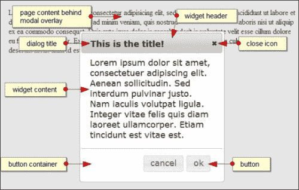

# 创建基本对话框

一个对话框有很多内置的默认行为，但是很少有方法需要通过编程来控制它，这使得成为一个易于使用的小部件，它也是高度可配置和强大的。

生成小部件很简单，并且需要最小的底层标记结构。以下页面包含实现对话框小部件所需的最低标记：

```js
<!DOCTYPE html>
<html>
<head>
  <meta charset="utf-8">
  <title>Dialog</title>
  <link rel="stylesheet" href="development-bundle/themes/redmond/jquery.ui.all.css">
  <script src="js/jquery-2.0.3.js"></script>
  <script src="development-bundle/ui/jquery.ui.core.js"></script>
  <script src="development-bundle/ui/jquery.ui.widget.js"> </script>
  <script src="development-bundle/ui/jquery.ui.position.js"> </script>
  <script src="development-bundle/ui/jquery.ui.dialog.js"> </script>
  <script src="development-bundle/ui/jquery.ui.button.js"> </script>
  <script>
    $(document).ready(function($){
      $("#myDialog").dialog();
    });
  </script>
</head>
<body>
  <div id="myDialog" title="This is the title!">
  Lorem ipsum dolor sit amet, consectetuer adipiscing elit.
Aenean sollicitudin. Sed interdum pulvinar justo. Nam iaculis volutpat ligula. Integer vitae felis quis diam laoreet ullamcorper. Etiam tincidunt est vitae est.
  </div>
</body>
</html>
```

将此文件另存为`jqueryui`项目文件夹中的`dialog1.html`。要使用该对话框，需要以下依赖项：

*   `jquery.ui.all.css`
*   `jquery.ui.core.js`
*   `jquery.ui.widget.js`
*   `jquery.ui.position.js`
*   `jquery.ui.dialog.js`
*   `jquery.ui.button.js`

或者，我们还可以包括以下文件，以使对话框可拖动和调整大小：

*   `jquery.ui.mouse.js`
*   `jquery.ui.draggable.js`
*   `jquery.ui.resizable.js`

对话框小部件的初始化方式与其他小部件相同，我们已经通过调用小部件的 plugin 方法查看了这些小部件。

在浏览器中运行此页面时，应该会看到默认对话框小部件，如以下屏幕截图所示：

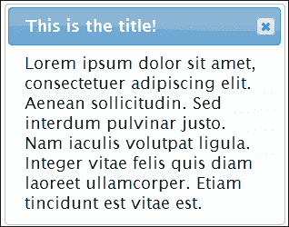

与我们前面介绍的小部件一样，CSS 框架中的各种类名被添加到小部件中的不同元素中，为它们各自的元素提供适当的样式，并且需要的任何附加元素都是动态创建的。

第一个示例中的对话框在大小和位置上都是固定的，并且将定位在视口的中心。我们可以轻松地使小部件可拖动、可调整大小或两者兼而有之。我们所需要做的就是包括可拖动和可调整大小的组件的源文件，以及鼠标工具，以及在`<head>`末尾的其他`<script>`资源。

在对话框的源文件之前，页面中是否包含可拖动和可调整大小的文件并不重要。它们可以在之前或之后出现，小部件仍将继承这些行为。所需的任何样式（如对话框左下角显示的调整大小指示器）都将自动从主 CSS 文件中选取。

直接在`dialog1.html`中的`</head>`结束标记之前添加以下三个`<script>`元素：

```js
<script src="development-bundle/ui/jquery.ui.mouse.js">
</script>
<script src="development-bundle/ui/jquery.ui.draggable.js">
</script>
<script src="development-bundle/ui/jquery.ui.resizable.js">
</script>
```

将此保存为`dialog2.html`并在浏览器中查看。对话框现在应该是可拖动的，并且可以移动到视口的任何部分，但如果小部件移动到边缘，则不会导致它滚动。

对话框的大小也可以通过点击并按住任意一个角并拖动来调整，小部件可以变大或变小。如果对话框比视口大，则会导致窗口滚动。

# 列出对话框选项

可以在对话框的小部件方法中使用 option 对象来配置各种对话框选项。让我们看看可用的选项：

<colgroup><col style="text-align: left"> <col style="text-align: left"> <col style="text-align: left"></colgroup> 
| 

选项

 | 

默认值

 | 

描述

 |
| --- | --- | --- |
| `appendTo` | `"body"` | 确定对话框（以及叠加，如果是模态）应附加到哪个元素。 |
| `autoOpen` | `true` | 当设置为`true`时，调用`dialog()`方法后立即显示对话框。 |
| `buttons` | `{}` | 提供包含要与对话框一起使用的按钮的对象。每个键都成为`<button>`元素上的文本，每个值都是一个回调函数，在点击按钮时执行。 |
| `closeOnEscape` | `true` | 如果设置为`true`，当按下*Esc*键时，对话框将关闭。 |
| `dialogClass` | `""` | 在对话框上设置额外的类名，以用于主题化。 |
| `draggable` | `true` | 使对话框可拖动（需要使用`jquery.ui.draggable.js`。 |
| `height` | `auto` | 设置对话框的起始高度。 |
| `hide` | `null` | 设置对话框关闭时使用的效果。 |
| `maxHeight` | `false` | 设置对话框的最大高度。 |
| `maxWidth` | `false` | 设置对话框的最大宽度。 |
| `minHeight` | `150` | 设置对话框的最小高度。 |
| `minWidth` | `150` | 设置对话框的最小宽度。 |
| `modal` | `false` | 在对话框打开时启用模态。 |
| `position` | `center` | 设置对话框在视口中的起始位置。它可以接受一个字符串、一个字符串数组或一个包含从视口使用的顶部和左侧偏移的对话框精确坐标的数组（需要使用`jquery.ui.position.js`。 |
| `resizable` | `true` | 使对话框可调整大小（也需要`jquery.ui.resizable.js`）。 |
| `show` | `null` | 设置打开对话框时要使用的效果。 |
| `title` | `""` | 替代方法是在小部件的底层容器元素上指定 title 属性。 |
| `width` | `300` | 设置对话框的起始宽度。 |

如您所见，在实现该对话框时，我们可以使用多种可配置选项。这些选项中有许多是基于布尔值、数字或字符串的，因此很容易在代码中获取和设置它们。

## 显示对话框

到目前为止，在我们的示例中，对话框在页面加载后立即显示。`autoOpen`选项默认设置为`true`，因此对话框一经初始化就会显示。

我们可以更改此选项，以便在发生其他事件时打开对话框，例如通过将`autoOpen`选项设置为`false`来单击按钮。将`dialog2.html`底部的最终`<script>`元素更改为以下元素：

```js
<script>
  $(document).ready(function($){
 $("#myDialog").dialog({
 autoOpen: false 
 });
  });
</script>
```

另存为`dialog3.html`。小部件仍在创建中；底层标记从页面中移除，转换为小部件，然后重新结束到`<body>`的末尾。它将保持隐藏状态，直到对其调用`open`方法。我们将在本章稍后讨论`open`方法时回到这个选项。

## 设置对话框标题

选项表显示了一个`title`选项，我们可以用它来控制标题在小部件上的显示方式；如果`draggable`属性设置为`false`，则可以选择此选项。虽然可以直接在代码中设置，但在配置选项中设置要容易得多，因为这使我们能够更好地控制标题在小部件中的显示方式。

默认情况下，对话框小部件的标题文本将以纯文本显示；我们可以通过在`.ui-dialog-title`类中添加自定义样式来覆盖此选项。

在您的浏览器中，更改`dialog3.html`中对话框的`<script>`块，如下所示：

```js
<script>
  $(document).ready(function($){
 $("#myDialog").dialog({
      draggable: false, 
      open: function() {
        $(".ui-dialog-title").addClass("customtitle");
      }
    });
  });
</script>
```

将文件另存为`dialog4.html`。现在，我们可以在对话框的标题栏中添加一些样式–在一个单独的文件中添加以下代码，并在链接到 jQuery UI 样式表后将其保存为`dialogOverrides.css`：

```js
.customtitle { color: #800080; }
```

如果我们在浏览器中预览结果，您可以清楚地看到标题现在以不同的颜色显示：

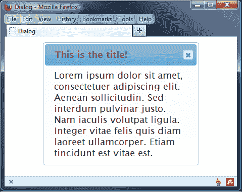

要查看对代码的影响，我们可以使用诸如 Firebug 之类的 DOM 检查器查看脚本是如何覆盖基本代码的：

```js
<span id="ui-id-1" class="ui-dialog-title customtitle">This is the title!</span>
```

我们可以在样式表中手动设置对话框元素的样式，但这需要反复试验；使用 jQuery 简单地添加一个新类要容易得多，这样我们就可以随心所欲地设计它了！

### 提示

如果没有为`title`属性提供值，则将使用对话框源元素上的属性。

## 配置模态选项

对话最重要的资产之一是情态。此功能可在对话框打开时创建覆盖对话框下方基础页面的覆盖。对话框一关闭，覆盖层即被删除。对话框打开时，任何基本页面内容都不能在任何情况下进行操作。

此功能的好处在于，它可以确保在底层页面再次交互之前关闭对话框，并为访问者提供一个清晰的视觉指示器，在他们继续之前，必须与对话框进行交互。

将`dialog4.html`中的配置对象更改为：

```js
    $(document).ready(function($){
      $("#myDialog").dialog({
        modal: true
      });
    });
```

此文件可另存为`dialog5.html`。下面的屏幕截图显示了模式效果（您可能希望在页面中添加一些虚假内容以充分了解模式的效果）：

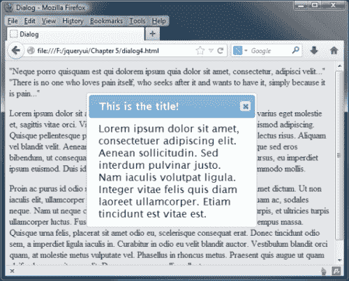

添加模态时只需要一个属性，即`modal`选项。在浏览器中查看页面时，将立即看到模式效果。用于创建覆盖的重复背景图像完全由 CSS 框架设置样式，因此通过**ThemeRoller**工具完全可设置主题。如果需要，我们也可以使用自己的图像。类名`ui-widget-overlay`被添加到覆盖中，因此如果需要定制，这是要覆盖的选择器。

# 添加按钮

`button`选项接受一个对象文字，该文字用于指定对话框上应存在的不同`<button>`元素。每对`property: value`代表一个按钮。让我们在对话框中添加几个`<button>`元素。

修改`dialog5.html`中的最后一个`<script>`元素，使其显示如下：

```js
<script>
  $(document).ready(function($){
    $("#myDialog").dialog({
 buttons: { Ok: function() { }, Cancel: function() { } },
 draggable: false
    });
  });
</script>
```

将文件另存为`dialog6.html`。`buttons`对象中每个属性的键是将形成`<button>`标签的文本，该值是单击按钮时要执行的回调函数的名称。`buttons`选项可以采用对象（如本例中所示）或对象数组。在本例中，`execute()`和`cancel()`函数什么都不做；我们将很快回到这个示例并填充它们。

下面的屏幕截图显示了我们新的`<button>`元素的显示方式：

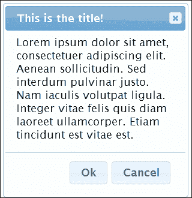

小部件将把我们的新按钮添加到对话框底部自己的容器中，如果对话框调整了大小，这个容器将保留其原始尺寸。`<button>`元素完全可设置主题，并将根据使用的主题进行样式设置。

## 向对话框按钮添加图标

到目前为止，关闭对话框通常意味着必须点击标题栏中的十字图标——这一点很好，但并没有给我们提供任何机会从浏览我们网站或在线应用的人那里获得响应。

在上一个示例中添加按钮有助于消除这一限制，并允许我们接受最终用户的不同响应——我们可以通过添加图标进一步实现这一点，为按钮提供视觉支持。

在文本编辑器中，将`dialog6.html`中的`<script>`块更改如下：

```js
<script>
  $(document).ready(function($){
    $("#myDialog").dialog({
 buttons: [ { 
 text: "Ok",
 icons: { primary: "ui-icon-check", secondary: "ui-icon-circle-check" },
 click: function() { }
 }, {
 text: "Cancel",
 icons: { primary: "ui-icon-closethick", secondary: "ui-icon-circle-close" },
 click: function() { }
 } ],
      draggable: false
    });
  });
</script>
```

另存为`dialog7.html`。在这里，我们使用按钮选项来指定文本、图标以及单击按钮时应采取的操作。您会注意到，与前面的示例相比，我们还使用了不同的方法来指定每个选项。两者都同样有效；我们需要在添加图标时使用此方法，否则您可能会发现您有没有文本显示的按钮！

如果在浏览器中预览结果，现在可以在对话框底部看到添加图标的按钮：

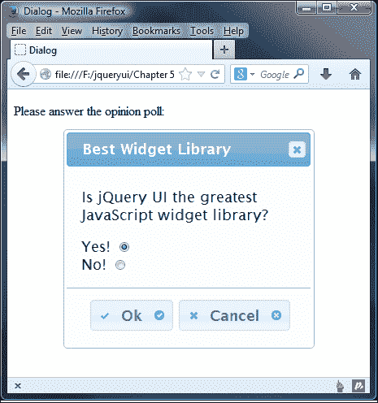

图标将根据使用的主题进行样式设置。在我们的示例中，我们指定了主图标和次图标；前者位于按钮文本的左侧，而后者位于右侧。根据您的要求，您可能只需要在应用或网站中指定其中一个。

# 启用对话框动画

该对话框为我们提供了一种内置效果，可以应用于小部件的打开或关闭（或两个）阶段。中只有一个效果我们可以使用，这是规模效应的实现（我们将在[第 13 章](13.html "Chapter 13. Selecting and Sorting with jQuery UI")、*使用 jQuery UI 进行选择和排序*中详细介绍）。将`dialog7.html`中的最终`<script>`元素更改为以下元素：

```js
<script>
  $(document).ready(function($){
    $("#myDialog").dialog({
 show: true,
 hide: true
    });
  });
</script>
```

另存为`dialog8.html`。我们将`hide`和`show`选项都设置为布尔值`true`。此启用内置效果，逐渐减小对话框的大小和不透明度，直到它优雅地消失。以下屏幕截图显示了运动中的效果：

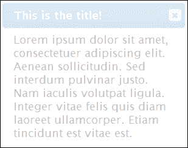

我们可以使用布尔值单独启用或禁用显示或隐藏动画，如本例所示。我们还可以通过提供指定要使用的效果名称的字符串来指定要使用的动画类型：

```js
<script>
  $(document).ready(function($){
    $("#myDialog").dialog({
      show: {effect: "fadeIn", duration: 1000},
      hide: {effect: "fadeOut", duration: 1000}
    });
  });
</script>
```

我们甚至可以更进一步，使用一些效果，如反弹或爆炸，虽然这些应该只在适当的情况下添加！稍后我们将在[第 14 章](14.html "Chapter 14. UI Effects")、*UI 效果*中介绍效果在 jQuery UI 中的使用。您也可以在[中查看更多详细信息 http://api.jqueryui.com/category/effects/](http://api.jqueryui.com/category/effects/) 。

# 配置对话框的尺寸

有几个选项与对话框的大小以及可以调整大小的最小和最大大小有关。我们可以将所有这些选项都添加到下一个示例中，因为它们都是相关的，以避免单独查看它们。将`dialog8.html`中的配置对象更改为：

```js
$("#myDialog").dialog({
 width: 500,
 height: 300,
 minWidth: 150,
 minHeight: 150,
 maxWidth: 600,
 maxHeight: 450
});
```

将此文件另存为`dialog9.html`。这些选项对小部件的影响很简单；`width`和`height`选项定义对话框首次打开时的大小，`min-`和`max-`选项分别定义对话框大小。

### 提示

另外，如果对话框太小，辅助技术和键盘用户可能会发现内容难以导航。有一个可用性原则坚持对话框应该始终是不可调整大小的，而窗口应该始终是可调整大小的。

虽然我不认为这是一个黑白的，花岗岩规则，它可能是明智的保持小，信息，基于文本的对话框在一个固定的大小，同时允许对话框内容更丰富，由图像和文本组成的大小可以调整。我们将在[第 12 章](12.html "Chapter 12. The Resizable Component")*可调整大小的组件*中介绍如何将调整大小句柄添加到任何合适的元素（如对话框）。

# 设置对话框的 z 索引顺序

对话框将显示在任何现有页面内容的上方。我们可以使用 CSS 更改其 z 索引设置，或者通过使用`appendTo`选项确保其正确附加到其父元素来更改，以防我们需要稍微提高它以覆盖我们现有的内容。但是如果页面上有两个对话框呢？我们需要为每个对话框分别定义`zIndex`吗？如何考虑焦点？

让我们看看是否可以通过另一个例子来回答这些问题；更改`dialog7.html`的`<body>`标签，使其上有两个对话框：

```js
<div id="dialog1" title="Dialog 1">
  Lorem ipsum dolor sit amet, consectetuer adipiscing elit.
Aenean sollicitudin. Sed interdum pulvinar justo. Nam aculis
volutpat ligula. Integer vitae felis quis diam laoreet ullamcorper. Etiam tincidunt est vitae est.
</div>
<div id="dialog2" title="Dialog 2">
  Lorem ipsum dolor sit amet, consectetuer adipiscing elit. Aenean sollicitudin. Sed interdum pulvinar justo. Nam iaculis volutpat ligula. Integer vitae felis quis diam laoreet ullamcorper. Etiam tincidunt est vitae est.
</div>
```

现在更改最后一个`<script>`元素，使其显示如下：

```js
<script>
  $(document).ready(function($){
 $("#dialog1, #dialog2").dialog();
  });
</script>
```

将此文件另存为`dialog10.html`。我们在页面中添加了另一个对话框，它基本上只是原始对话框的一个克隆，具有不同的`id`和`title`属性。在`<script>`中，我们只是在两个底层对话框容器上调用`widget`方法。

由于`widget`方法在第二个对话框上被称为最后一个，因此它接收焦点，第二个对话框将自动具有更高的 z 索引值。这意味着我们不需要担心单独配置它。对话框在基础标记中的显示顺序并不重要；小部件方法的顺序决定了每个对话框的 z 索引值。

### 提示

**覆盖 z-索引值**

如果您需要覆盖 z 索引值，您可以（也应该）使用 CSS 来实现这一点——您需要使用`!important`属性来覆盖现有值。

因为两个对话框都没有显式设置其位置，所以在加载示例页面时，只有第二个对话框可见。但是，这两个对话框都是可拖动的，我们可以通过拖动第二个对话框来对齐它们，使它们稍微重叠。如果我们单击第一个对话框，它将接收焦点，因此它将显示在第二个对话框的上方。

## 控制焦点

打开对话框时，接收焦点的元素由以下匹配项确定：

*   对话框中具有自动聚焦属性的第一个元素
*   对话框内容中的第一个`:tabbable`元素
*   对话框按钮平面中的第一个`:tabbable`元素
*   对话框的关闭按钮
*   对话本身

下面的代码摘录最能说明这一点，我们在`yes`单选按钮中添加了`autofocus`属性：

```js
  <div id="myDialog" title="Best Widget Library">
    <p>Is jQuery UI the greatest JavaScript widget library?</p>
    <label for="yes">Yes!</label>
 <input type="radio" autofocus="autofocus" id="yes" value="yes" name="question" checked="checked"><br>
    <label for="no">No!</label>
    <input type="radio" id="no" value="no" name="question">
  </div>
```

`yes`单选按钮将首先接收焦点；然后，我们可以从该元素切换到小部件中的其他元素。一旦对话框关闭，焦点将自动返回到打开对话框之前的元素。

# 处理对话框的事件回调

对话框小部件为我们提供了广泛的回调选项，我们可以使用这些选项在任何对话框交互中的不同点执行任意代码。下表列出了我们可用的选项：

<colgroup><col style="text-align: left"> <col style="text-align: left"></colgroup> 
| 

事件

 | 

描述

 |
| --- | --- |
| `beforeClose` | 当对话框即将关闭时触发此 |
| `close` | 当对话框关闭时触发 |
| `create` | 当对话框初始化时触发 |
| `drag` | 当拖动对话框时，会触发 |
| `dragStart` | 当对话框开始被拖动时，会触发 |
| `dragStop` | 当对话框停止拖动时，将触发 |
| `focus` | 当对话框接收到焦点时触发 |
| `open` | 当对话框打开时，将触发此操作 |
| `resize` | 调整对话框大小时，将触发此操作 |
| `resizeStart` | 当对话框开始调整大小时，将触发此操作 |
| `resizeStop` | 当对话框停止调整大小时，将触发此操作 |

其中一些回调仅在某些情况下可用，例如`drag`和`resize`回调，只有在包含可拖动和可调整大小的 jQuery UI 组件时才可用。在本章中我们将不讨论这些回调选项，因为它们将分别在[第 11 章](11.html "Chapter 11. Drag and Drop")、*拖放*和[第 12 章](12.html "Chapter 12. The Resizable Component")、*可调整大小的组件*中详细介绍。

其他回调，例如`beforeClose`、`create`、`open`、`close`和`focus`将在任何实现中可用。让我们看一个例子，其中我们使用了一些回调选项。

从`dialog10.html`中的页面中删除第二个对话框，并在第一个对话框之后直接添加以下新标记：

```js
<div id="status" class="ui-widget ui-dialog ui-corner-all ui-widget-content">
  <div class="ui-widget-header ui-dialog-titlebar ui-corner-all">Dialog Status</div>
  <div class="ui-widget-content ui-dialog-content"></div>
</div>
```

现在更改最后一个`<script>`元素，使其显示如下：

```js
<script>
  $(document).ready(function($){  
    $("#dialog1").dialog({
 open: function() {
 $("#status").children(":last").text("The dialog is open");
 },
 close: function() {
 $("#status").children(":last").text("The dialog is closed");
 },
 beforeClose: function() {
 if ($(".ui-dialog").css("width") > "300") {
 return false;
 }
 }
 });
  });
</script>
```

另存为`dialog11.html`。该页面包含一个新的状态框，用于报告对话框是打开的还是关闭的。我们已经给出了组成几个 CSS 框架类的状态框的元素，以使它们适合正在使用的主题。

我们的配置对象使用`open`、`close`和`beforeClose`选项来指定简单的回调函数。`open`和`close`回调只是相应地设置状态框的文本。点击对话框上的**关闭**按钮后（实际关闭前）触发的`beforeClose`回调用于确定是否关闭对话框。

我们使用一个简单的`if`语句来检查对话框的宽度；如果对话框宽度大于 300 像素，我们从回调返回`false`，对话框保持打开状态。当然，就可用性而言，这种行为通常是一个大禁忌，但它确实有助于强调我们如何使用`beforeClose`回调来防止对话框关闭。

当页面加载并显示对话框时，将执行`open`回调，状态框应显示一条消息。当对话框关闭时，如以下屏幕截图所示，将显示不同的消息：

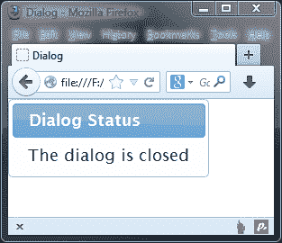

我需要澄清的一点是，对话框小部件只将单个对象（原始事件对象）传递给回调函数。它确实将第二个`ui`对象传递到处理函数中，尽管在这个版本的库中，这个对象不包含属性。

# 以编程方式控制对话框

该对话框直观且易于使用，与库中的其他组件一样，它附带了一系列方法，用于在小部件初始化后以编程方式控制小部件。我们可以在对话框中调用的方法的完整列表如下：

<colgroup><col style="text-align: left"> <col style="text-align: left"></colgroup> 
| 

方法

 | 

描述

 |
| --- | --- |
| `close` | 这用于关闭或隐藏对话框。 |
| `destroy` | 这用于永久禁用对话框。对话框的`destroy`方法的工作方式与我们目前看到的其他小部件略有不同。对话框的`destroy`方法不仅将底层 HTML 返回到其原始状态，还将其隐藏。 |
| `isOpen` | 这用于确定对话框是否打开。 |
| `moveToTop` | 这用于将指定的对话框移动到堆栈顶部。 |
| `open` | 这用于打开对话框。 |
| `option` | 这用于在对话框初始化后获取或设置任何可配置选项。 |
| `widget` | 这用于返回调用`dialog()`小部件方法的外部元素。 |

## 切换对话框

我们首先来看看打开小部件，这可以通过简单使用`open`方法来实现。我们再来看一下`dialog3.html`，其中`autoOpen`选项被设置为`false`，这样页面加载时对话框就不会打开。在页面中添加以下`<button>`：

```js
<button type="button" id="toggle">Toggle dialog!</button>
```

然后将以下单击处理程序添加到代码顶部的`<script>`块中：

```js
$("#toggle").click(function() {
  if(!$("#myDialog").dialog("isOpen")) {
    $("#myDialog").dialog("open");
  } else {
    $("#myDialog").dialog("close");
  }
});
```

将此文件另存为`dialog12.html`。在页面中，我们添加了一个简单的`<button>`，可以根据当前状态打开或关闭对话框。在`<script>`元素中，我们为`<button>`元素添加了一个点击处理程序，用于检查`isOpen`方法的返回值；感叹号的使用意味着我们正在查看对话框是否未打开。如果语句返回`true`，则对话框未打开，因此我们调用其`open`方法，否则调用`close`方法。

`open`和`close`方法都会触发任何适用的事件；例如，`#toggle`click handler 方法首先触发`beforeClose`事件，然后触发`close`事件。调用`close`方法类似于单击对话框上的关闭按钮。

# 从对话框中获取数据

因为小部件是底层页面的一部分，所以向它传递数据和从它传递数据都很简单。对话框可以被视为页面上的任何其他标准元素。让我们看一个基本的例子。

我们看了本章前面的一个例子，它在对话框中添加了一些`<button>`元素。该示例中的回调函数没有做任何事情，但下面的示例为我们提供了使用它们的机会。将`dialog8.html`中现有的对话框标记替换为以下内容：

```js
<div id="myDialog" title="Best Widget Library">
  <p>Is jQuery UI the greatest JavaScript widget library?</p>
  <label for="yes">Yes!</label>
  <input type="radio" id="yes" value="yes" name="question" checked="checked"><br>
  <label for="no">No!</label>
  <input type="radio" id="no" value="no" name="question">
</div>
```

现在将最后的`<script>`元素更改如下：

```js
<script>
$(document).ready(function($){
  var execute = function(){
 var answer = $("#myDialog").find("input:checked").val();
 $("<p>").text("Thanks for selecting " + answer).
 appendTo($("body"));
 $("#myDialog").dialog("close");
 }
 var cancel = function() {
 $("#myDialog").dialog("close");
 }
  $("#myDialog").dialog({
    buttons: {
      "Ok": execute,
      "Cancel": cancel
    }
  });
});
</script>
```

另存为`dialog13.html`。我们的对话框小部件现在包含一组单选按钮、一些`<label>`元素和一些文本。在本例中，我们将获得所选单选按钮的结果，然后在对话框关闭时对其进行处理。

我们通过填充`execute`函数来启动`<script>`元素，该函数将作为`Ok`属性的值附加到 buttons 对象中，稍后在脚本中。因此，每次单击**确定**按钮时，都会执行该命令。

在该功能中，我们使用`:checked`过滤器确定选择了哪个单选按钮。我们将`answer`变量的值设置为单选按钮的值，然后创建一条短消息，并将其附加到页面的`<body>`元素。映射到**取消**按钮的回调很简单；我们所做的就是使用`close`方法关闭对话框。

本例的要点是，从对话框获取数据与从页面上的任何其他元素获取数据一样简单。如果在浏览器中预览，首先会看到左侧的对话框；单击按钮会给出相应的响应，如以下屏幕截图所示：

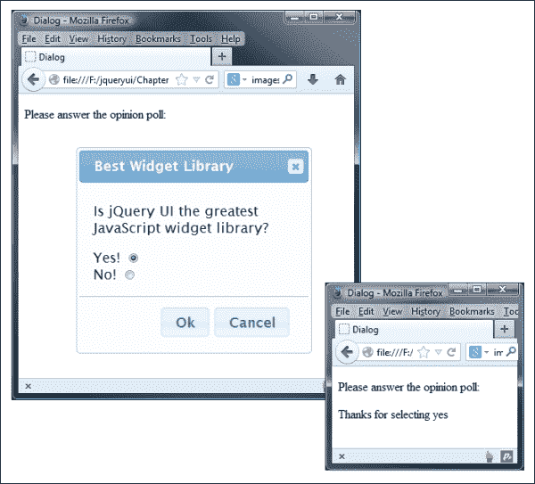

# 探索对话互操作性

在前面的章节中，我们组合了多个小部件，以便我们可以看到它们在一起工作得有多好，本章也不例外。我们可以很容易地将其他 UI 小部件放入对话框中，比如我们在上一章中看到的手风琴小部件。在文本编辑器中的新文件中，创建以下页面：

```js
<!DOCTYPE html>
<html>
<head>
  <meta charset="utf-8">
  <title>Dialog</title>
  <link rel="stylesheet" href="development-bundle/themes/redmond/jquery.ui.all.css">
  <script src="js/jquery-2.0.3.js"></script>
  <script src="development-bundle/ui/jquery.ui.core.js"></script>
  <script src="development-bundle/ui/jquery.ui.widget.js"></script>
  <script src="development-bundle/ui/jquery.ui.position.js"></script>
  <script src="development-bundle/ui/jquery.ui.dialog.js"></script>
  <script src="development-bundle/ui/jquery.ui.button.js"></script>
  <script src="development-bundle/ui/jquery.ui.accordion.js"> 
  </script>
  <script src="development-bundle/ui/jquery.ui.mouse.js"></script>
  <script src="development-bundle/ui/jquery.ui.draggable.js"></script>
  <script src="development-bundle/ui/jquery.ui.resizable.js"></script>
  <script>
    $(document).ready(function($){
      $("#myDialog").dialog();
         $("#myAccordion").accordion();
    });
  </script>
</head>
<body>
  <div id="myDialog" title="An Accordion Dialog">
    <div id="myAccordion">
      <h2><a href="#">Header 1</a></h2>
      <div>Lorem ipsum dolor sit amet, consectetuer adipiscing elit. Aenean sollicitudin.</div>
      <h2><a href="#">Header 2</a></h2>
      <div>Etiam tincidunt est vitae est. Ut posuere, mauris at so dales rutrum, turpis.</div>
      <h2><a href="#">Header 3</a></h2>
      <div>Donec at dolor ac metus pharetra aliquam. Suspendisse pu rus.</div>
    </div>
  </div>
</body>
</html>
```

将此文件另存为`dialog14.html`。accordion 小部件的底层标记被放置在对话框的 container 元素中，我们只需在`<script>`元素中调用每个组件的小部件方法。

### 提示

在这个例子中，我们使用了很多独立的`<script>`资源。值得记住的是，对于生产，我们应该使用组合和缩小的脚本文件，其中包含我们在下载生成器中选择的所有组件。

组合小部件应如下所示：

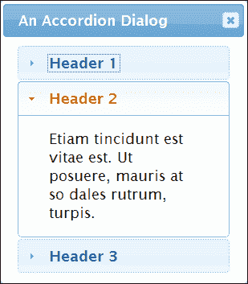

# 创建基于图像的动态对话框

对话框小部件背后的类是紧凑的，满足了一小部分特殊行为，其中大部分我们已经看过了。我们仍然可以通过一个动态对话框获得一些乐趣，该对话框根据触发它的元素加载不同的内容。

在文本编辑器的新页面中，添加以下代码：

```js
<!DOCTYPE html>
<html>
<head>
  <meta charset="utf-8">
  <title>Dialog</title>
  <link rel="stylesheet" href="development-bundle/themes/redmond/jquery.ui.all.css">
  <link rel="stylesheet" href="css/dialogTheme.css">
  <script src="js/jquery-2.0.3.js"></script>
  <script src="development-bundle/ui/jquery.ui.core.js"></script>
  <script src="development-bundle/ui/jquery.ui.widget.js"></script>
  <script src="development-bundle/ui/jquery.ui.position.js"></script>
  <script src="development-bundle/ui/jquery.ui.dialog.js"></script>
  <script src="development-bundle/ui/jquery.ui.button.js"></script>
  <script src="development-bundle/ui/jquery.ui.accordion.js"></script>
  <script src="development-bundle/ui/jquery.ui.mouse.js"></script>
  <script src="development-bundle/ui/jquery.ui.draggable.js"></script>
  <script src="development-bundle/ui/jquery.ui.resizable.js"></script>
</head>
<body>
   <div id="thumbs" class="ui-corner-all">
     <div class="ui-widget-header ui-corner-top">
       <h2>Some Common Flowers</h2>
       </div>
       <p>(click a thumbnail to view a full-size image)</p>
       <div class="thumb ui-helper-clearfix ui-widget-content">
         <a href="img/haFull.jpg" title="Helianthus annuus"></a>
         <h3>Helianthus annuus</h3>
         <p>Sunflowers (Helianthus annuus) are annual plants native to the Americas, that possess a large flowering head</p>
       </div>
       <div class="thumb ui-helper-clearfix ui-widget-content">
         <a href="img/lcFull.jpg" title="Lilium columbianum"> </a>
         <h3>Lilium columbianum</h3>
         <p>The Lilium columbianum is a lily native to western North America. It is also known as the Columbia Lily or Tiger Lily</p>
       </div>
         <div class="thumb ui-helper-clearfix ui-widget-content">
         <a href="img/msFull.jpg" title="Myosotis scorpioides"> </a>
         <h3>Myosotis scorpioides</h3>
         <p>The Myosotis scorpioides, or Forget-me-not, is a herbaceous perennial plant of the genus Myosotis.</p>
       </div>
       <div class="thumb ui-helper-clearfix ui-widget-content last">
         <a href="img/nnFull.jpg" title="Nelumbo nucifera"></a>
         <h3>Nelumbo nucifera</h3>
         <p>Nelumbo nucifera is known by a number of names including; Indian lotus, sacred lotus, bean of India, or simply lotus.</p>
       </div>
   </div>
   <div id="dialog"></div>
</body>
</html>
```

将此文件另存为`dialog15.html`。以下屏幕截图显示了在浏览器中预览时的结果：

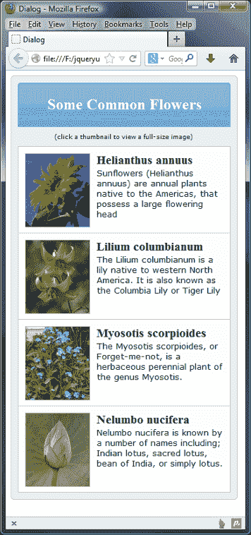

页面相对简单，我们有一个外部容器，它包含所有内容和一个元素，我们给它起了一个类名`ui-widget-header`。我们使用了后一种，以便从正在使用的主题中获取一些默认样式。

接下来，我们有一些解释性文本，后面是一系列容器。为这些容器提供了几个类名，其中一些是为了我们可以设置它们的样式，而另一些则是为了选择框架或主题样式（如`ui-helper-clearfix`）。

每个容器中都有一个图像，包裹在锚定、副标题和一些描述性文本中。在外部容器之后是空的`<div>`元素，用于创建对话框。在本例中，我们不使用可调整大小的功能。每个缩略图都被包装在一个锚点中，以便页面即使在禁用 JavaScript 的情况下也能正常工作。对话框小部件在这种情况下不会显示，但是访问者仍然能够看到每个图像的完整版本。在这种应用中，这种形式的渐进增强是必不可少的，因为我们可以随时查看内容。在对话框小部件的调用中添加可以增强访问者的整体视图，同时确保内容始终显示某些内容，即使禁用了 JavaScript！

现在直接在关闭`</head>`标记之前添加以下`<script>`块：

```js
<script>
  $(document).ready(function($){
    var filename, titleText, dialogOpts = {
      modal: true,
      width: 388,
      height: 470,
      autoOpen: false,
      open: function() {
        $("#dialog").empty();
        $("", { src: filename }).appendTo("#dialog");
        $("#dialog").dialog("option", "title", titleText);
      }
    };
    $("#dialog").dialog(dialogOpts);
    $("#thumbs").find("a").click(function(e) {
      e.preventDefault();
      filename = $(this).attr("href");
      titleText = $(this).attr("title");
      $("#dialog").dialog("open");
    });
  });
</script>
```

我们要做的第一件事是定义三个变量；第一个变量用于将路径添加到单击的缩略图的全尺寸图像，第二个变量用于存储图像标题以用作小部件标题的文本，第三个变量是对话框的配置对象。我们已经看到了整个配置选项的运行，所以我不会详细介绍其中的大部分。

在打开对话框之前直接调用的`open`回调，是我们将全尺寸图像添加到对话框中的地方。我们首先清空对话框，然后创建一个新的``元素，并将其`src`设置为`filename`变量的值。然后，新的``被附加到对话框的内部内容区域。

然后，我们使用`option`方法将 title 选项设置为`titleText`变量的值。一旦定义了`open`回调，我们将正常调用对话框的小部件方法。

我们可以使用包装器`<a>`元素作为触发器来打开对话框。在点击处理程序中，我们首先调用`e.preventDefault()`停止点击的默认操作，然后使用点击链接的`href`和`title`属性设置`filename`和`titleText`变量的内容。然后我们调用对话框的`open`方法来显示对话框，这反过来触发`open`选项中指定的回调函数。

### 提示

如果我们省略`e.preventDefault()`，这将覆盖对话框，浏览器将呈现每个图像，就像它是已单击的链接一样。

对于这个例子，我们还需要一个新的样式表。在文本编辑器的新页面中，添加以下代码：

```js
#thumbs { width:342px; padding: 10px 0 10px 10px; border:1px 
   solid #ccc; background-color:#eee; }
#thumbs p { width: 330px; font-family: Verdana; font-size: 9px; 
   text-align: center; }
.thumb { width: 310px; height: 114px; padding: 10px; 
   border:1px solid #ccc; border-bottom: none; }
.last { border-bottom: 1px solid #ccc; }
.thumb img { border: 1px solid #ccc; margin-right: 10px; 
   float: left; cursor: pointer; }
.thumb h3 { margin: 0; float: left; width:198px; }
#thumbs .thumb p { width: 310px; margin:0; font-family: 
   Verdana; font-size: 13px; text-align: left; }
#thumbs .ui-widget-header { width: 330px; text-align: center; }
```

在前面的示例中已经使用了许多这样的样式，但是为其他页面元素添加一些新规则可以让我们在真实环境中看到对话框。将此保存为`css`文件夹中的`dialogTheme.css`。在本例中，我们还使用了一些图像，这些图像可以在本书附带代码下载的`img`文件夹中找到。

现在，这将为我们提供上一个屏幕截图中看到的页面，当单击缩略图时，将显示相同图像的全尺寸版本：

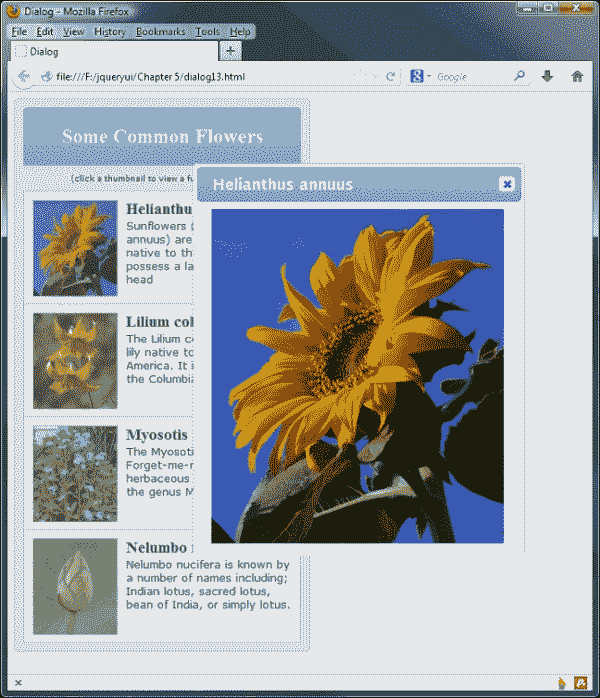

# 总结

对话框小部件是专门化的，用于在页面内容上方的浮动面板中显示消息或问题。高级功能（如拖动和调整大小）是直接内置的，只需为每个功能包含一个额外的脚本文件。其他功能，如出色的模态和叠加，易于配置。

我们从查看默认实现开始，它的配置与我们到目前为止看到的其他小部件一样简单。然后，我们检查了对话框 API 公开的可配置选项的范围。我们可以利用它们来启用或禁用内置行为，例如模态，或者设置小部件的维度。它还为我们提供了广泛的回调，允许我们在交互过程中钩住小部件触发的自定义事件。

然后，我们简单地看了一下对话框可以使用的内置打开和关闭效果，然后继续看我们可以调用的基本方法，以便使对话框执行一些操作，例如打开或关闭。

在下一章中，我们将继续研究滑块和进度条小部件，它们允许我们创建交互式表单小部件，用于从预定义的值范围中进行选择并在屏幕上显示结果。