# 六、滑块和进度条小部件

slider 组件允许我们实现一个引人入胜且易于使用的小部件，我们的访客应该会发现它具有吸引力且易于使用。它的基本功能很简单。滑块轨迹表示通过沿轨迹拖动控制柄选择的一系列值。

progressbar 小部件用于显示任意进程的完成百分比。它是一个简单易用的组件，具有非常紧凑的 API，可以为访问者提供出色的视觉反馈。

在本章中，我们将介绍以下主题：

*   默认的滑块实现
*   滑块的自定义样式
*   更改配置选项
*   创建垂直滑块
*   设置最小值、最大值和默认值
*   启用多个句柄和范围
*   滑块的内置事件回调
*   滑块法
*   progressbar 的默认实现
*   可配置选项
*   小部件公开的事件 API
*   progressbar 公开的唯一方法
*   progressbar 的一些真实示例

在我们卷起袖子开始制作滑块之前，让我们先看看它是由哪些不同的元素制成的。下图显示了一个典型的滑块小部件：

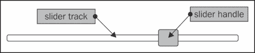

正如您所见，这是一个简单的小部件，由两个主要元素组成，**滑块****手柄**（有时称为拇指）、和**滑块**。

# 介绍滑块小部件

创建默认的基本滑块所需的代码并不比我们目前看到的任何其他小部件多。所需的底层 HTML 标记也是最小的。现在让我们创建一个基本的。在文本编辑器的新页面中，添加以下代码：

```js
<!DOCTYPE html>
<html>
<head>
  <meta charset="utf-8">
  <title>Slider</title>
  <link rel="stylesheet" href="development-bundle/themes/redmond/jquery.ui.all.css">
  <script src="js/jquery-2.0.3.js"></script>
  <script src="development-bundle/ui/jquery.ui.core.js"></script>
  <script src="development-bundle/ui/jquery.ui.widget.js"></script>
  <script src="development-bundle/ui/jquery.ui.mouse.js"></script>
  <script src="development-bundle/ui/jquery.ui.slider.js"></script>
  <script>
    $(document).ready(function($){
      $("#mySlider").slider();
    });
  </script>
</head>
<body>
  <div id="mySlider"></div>
</body>
</html>
```

将此文件另存为`slider1.html`并在浏览器中查看。页面上有一个简单的容器元素；这将由小部件转换为滑块轨迹。在代码的`<head>`部分的`<script>`中，我们选择这个元素，并在其上调用`slider`方法。小部件将自动创建用于滑块手柄的`<a>`元素。

当我们在浏览器中运行`slider1.html`文件时，应该会看到类似于上一张图的内容。我们已经为默认实现使用了多个库资源，包括以下文件：

*   `jquery.ui.all.css`
*   `jquery-2.0.3.js`
*   `jquery.ui.core.js`
*   `jquery.ui.widget.js`
*   `jquery.ui.mouse.js`
*   `jquery.ui.slider.js`

基本滑块的默认行为简单但有效。通过使用鼠标指针拖动拇指，或使用键盘上的左/下或右/上箭头键，可以沿 x 轴上轨迹的任何像素水平移动拇指。用左键单击轨迹上的任意位置将立即将手柄移动到该位置。

# 定制造型

由于其简单性，很容易为 slider 小部件创建自定义主题。使用 ThemeRoller 是主题化的一种方法：我们只需下载一个新主题，然后将其放入主题文件夹，并将代码中的引用更改为新主题的名称。与所有其他小部件一样，滑块将重新设置样式以使用新主题。

为了完全改变小部件的外观，我们可以轻松地创建自己的主题文件。在文本编辑器中创建以下样式表：

```js
.background-div {
  height: 50px; width: 217px; padding: 36px 0 0 24px;
  background:  url(../img/slider_outerbg.gif) no-repeat;
}
#mySlider {
  background: url(../img/slider_bg.gif) no-repeat; height: 23px;
  width: 184px; border: none; top: 4px; position: relative; 
  left: 4px;
 }
#mySlider .ui-slider-handle {
  width: 14px; height: 30px; top: -4px;
  background: url(../img/slider_handle.gif) no-repeat;
}
```

将此文件另存为`css`目录中的`sliderTheme.css`。在`slider1.html`中，在页面`<head>`中添加一个指向样式表的链接（在 jQuery UI 样式表之后），并将底层滑块元素包装在一个新容器中：

```js
<div class="background-div">
  <div id="mySlider"></div>
</div>

```

将此文件另存为`slider2.html`。只需使用最少的 CSS 和一些图像（这些可以在代码下载中找到），我们就可以轻松但显著地修改小部件的外观，如以下屏幕截图所示：

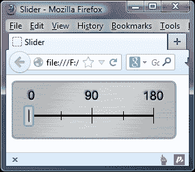

让我们把注意力转向如何配置 slider 小部件，使用它的一些选项。

# 配置基本滑块

其他功能，如垂直滑块、多个手柄和步进也可以使用对象文本进行配置，在滑块初始化时传递到小部件方法。下表列出了可与滑块小部件结合使用的选项：

<colgroup><col style="text-align: left"> <col style="text-align: left"> <col style="text-align: left"></colgroup> 
| 

选项

 | 

默认值

 | 

用法

 |
| --- | --- | --- |
| `animate` | `false` | 单击轨迹时，启用滑块手柄的平滑动画。 |
| `disabled` | `false` | 初始化时禁用小部件。 |
| `max` | `100` | 设置滑块的最大值。 |
| `min` | `0` | 设置滑块的最小值。 |
| `orientation` | `auto` | 设置滑块拇指沿其移动的轴。这可以接受垂直或水平的字符串。 |
| `range` | `false` | 在它们之间创建一个可样式化的元素范围。 |
| `step` | `1` | 设置手柄沿轨道移动的步距距离。最大值必须与提供的数字相等。 |
| `value` | `0` | 设置小部件初始化时滑块拇指的值。 |
| `values` | `null` | 接受值的数组。每个提供的整数将成为滑块句柄的值。 |

## 创建垂直滑块

要制作垂直滑块，只需将`orientation`选项设置为`vertical`；小部件将为我们完成剩下的工作。

在`slider1.html`中，更改最后的`<script>`元素，使其显示如下：

```js
<script>
  $(document).ready(function($){
 $("#mySlider").slider({
 orientation: "vertical"
 });
  });
</script>
```

将此文件另存为`slider3.html`。我们只需设置此单一选项即可将滑块置于`vertical`模式。启动页面时，我们看到滑块的操作与之前完全相同，只是它现在沿 y 轴移动，如以下屏幕截图所示：

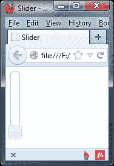

小部件的高度默认为`100px`，除非我们在样式表中为`.ui-slider-vertical`提供自己的 CSS 规则。

## 设置最大值和最小值

默认情况下，滑块的最小值为`0`，最大值为`100`，但我们可以使用`min`和`max`选项轻松更改这些值。将`slider3.html`中的配置对象更改为以下代码：

```js
$("#mySlider").slider({
 min: -50,
 max: 50
});
```

将此文件另存为`slider4.html`。我们只需指定要设置为起始值和结束值的整数。`value`和`values`方法是滑块独有的，用于获取或设置单个或多个句柄的值。默认情况下，当我们运行胡氏 ?? 时，当我们运行 ORT T5AY 文件时，滑块拇指将在轨道中间开始，在 Ty6 ?? 和 AUT7 之间。

在本例中，当滑块手柄处于最小值时，`value`方法将返回到`-50`，正如我们所期望的那样。为了证明这一点，我们可以调整`slider4.html`在警报中显示该值。在滑块配置对象的正下方添加以下代码：

```js
$("#getValue").click(function(){
  var value = $("#mySlider").slider("value");
  alert("Value of slider is " + value);
});
```

在`<body>`内的标记中，更改如下：

```js
  <div id="mySlider"></div>
<p>
<button id="getValue">Get value of slider</button>

```

如果我们现在尝试在浏览器中预览更改，当您将手柄移动到滑块的最左侧后，单击按钮时会出现一个警报。我们将在本章后面的*部分使用滑块方法*探讨`value`选项。

## 使用滑块小部件进行步进

`step`选项是指当滑块的手柄从轨迹上的最小位置移动到最大位置时，沿轨迹跳跃的步数和位置。了解此选项如何工作的最好方法是查看它的运行情况，因此将`slider4.html`中的配置对象更改为以下代码：

```js
$("#mySlider").slider({
 step: 25
});
```

将此文件另存为`slider5.html`。在本例中，我们将`step`选项设置为`25`。我们没有设置`min`或`max`选项，因此它们将分别采用`0`和`100`的默认值。因此，通过将`step`设置为`25`，我们的意思是轨道上的每一步都应该是轨道长度的四分之一，因为`100`（最大值）除以`25`（步长值）就是`4`。因此，手柄将沿着轨道从开始到结束分为四个步骤。

滑块的`max`值应该可以被我们设置为`step`选项的任何值等分；除此之外，我们可以自由使用任何我们想要的价值。`step`选项用于将访问者选择的值限制为一组预定义值中的一个。

如果我们将`step`选项的值（在本例中）设置为`27`而不是`25`，滑块仍会工作，但手柄沿轨迹移动的点将不相等。

## 设置滑块小部件的动画

滑块小部件带有一个内置动画，每当单击滑块轨迹时，该动画会将滑块手柄平滑地移动到新位置。默认情况下，此动画处于禁用状态，但我们可以通过将`animate`选项设置为`true`轻松启用它。更改`slider5.html`中的配置对象，如下所示：

```js
$("#mySlider").slider({
 animate: true
});
```

将此文件另存为`slider6.html`。这个简单的变化可以给滑块一个更抛光的感觉；单击轨迹时，滑块手柄不会立即移动到新位置，而是平滑地在那里滑动。

如果将`step`选项配置为`1`以外的值，并且启用了`animate`选项，则拇指将滑动到轨道上最近的步进标记处。这可能意味着滑块拇指移动超过单击的点。

## 设置滑块的值

当在配置对象中将设置为`true`时，`value`选项确定滑块拇指的起始值。根据我们希望滑块表示的内容，句柄的起始值可能不是`0`。如果我们希望从轨道的中间开始，而不是从起点开始，我们可以使用以下配置对象：

```js
$("#mySlider").slider({
 value: 50
});
```

将此文件另存为`slider7.html`。当文件加载到浏览器中时，我们会看到控制柄从轨迹的一半开始，而不是在开始处，就像我们之前设置`min`和`max`选项时一样。我们还可以在初始化后设置此选项，以编程方式设置新值。

## 使用多个手柄

我前面提到，滑块可能有多个手柄；可以使用`values`选项添加其他手柄。它接受一个数组，其中数组中的每个项都是句柄的起点。我们可以指定任意数量的项目，最多为`max`值（考虑步骤）：

```js
$("#mySlider").slider({
 values: [25, 75]
});
```

将此文件另存为`slider8.html`。这就是我们需要做的一切；我们不需要提供任何额外的底层标记。小部件为我们创建了两个新句柄，正如您将看到的，它们的功能与标准单个句柄完全相同。

以下屏幕截图显示了我们的双手柄滑块：

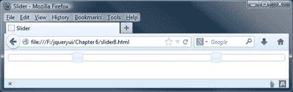

我们可以使用双手柄滑块为日程表创建时间窗口。旅游预订表就是一个很好的例子。通常，您会手动输入日期，这可能有点笨重。

相反，您可以使用双手柄滑块来选择日期；用户只需向左或向右滑动每个手柄即可更改日期窗口。然后，我们可以使用本章前面的*设置最小值和最大值*部分中描述的方法来获得每个滑块手柄的位置值。

### 提示

当一个滑块有两个或多个手柄时，每个手柄都可以通过另一个手柄移动而不会出现问题；如果需要防止发生这种情况，您可能需要考虑设置一个 Tyt0}。

## 使用范围选项

当使用多个手柄时，我们可以将`range`选项设置为`true`。这将在两个句柄之间添加一个样式的 range 元素。在`slider8.html`中，更改配置对象，使其如下所示：

```js
$("#mySlider").slider({
  values: [25, 75],
 range: true
});
```

将此文件另存为`slider9.html`。当页面加载时，我们应该看到一个样式化的`<div>`元素现在连接我们的两个句柄，如下面的屏幕截图所示：

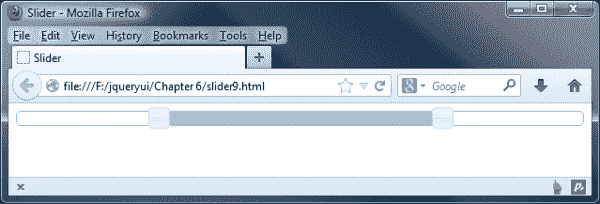

当使用两个控制柄和一个范围时，两个控制柄将无法在轨道上相互交叉。

最多可以将两个句柄与`range`选项结合使用，但我们也可以使用一个句柄将上一示例中的配置对象更改为以下内容：

```js
$("#mySlider").slider({
 range: "min"
});
```

将此文件另存为`slider10.html`。除了布尔值`true`之外，我们还可以提供字符串值`min`或`max`中的一个，但只能在使用单个句柄时提供。

在本例中，我们将其设置为`min`，因此当我们沿着轨迹移动滑块控制柄时，范围元素将从轨迹的起点延伸到滑块控制柄。如果我们将选项设置为`max`，则范围将从手柄延伸至轨道末端。

如果您想捕获标尺上句柄所在位置的值，我们可以使用`slide`事件处理程序来实现。在本例中，我们只需要获得一个值（因为我们只有一个句柄），但如果配置了第二个句柄，同样的原则也适用。

在`slider4.html`中，在滑块配置对象的正上方添加以下功能：

```js
function slideValues(event, ui){
  var val0 = $("#mySlider").slider("values", 0),
    endValue = parseInt(val0, 10);

  $("#rangeValues").text("Range: 0 - " + endValue);
}:
```

然后我们需要修改配置对象，以便在适当的时间调用我们的`slideValues`事件处理程序：

```js
$("#mySlider").slider({
  range: "min",
 slide: slideValues
});
```

因此我们可以在屏幕上显示结果，在`<body>`部分的现有标记下方添加此：

```js
<div id="rangeValues"></div>
```

然后，我们可以随心所欲地利用价值观；如果预览结果，您将看到右侧的值发生更改；左边的值将始终保持在`0`，因为这是我们代码中`min`选项的默认值。

# 使用滑块的事件 API

除了我们前面看到的选项外，还有另外五个选项用于定义在滑块交互过程中不同时间执行的函数。我们使用的任何回调函数都会自动传递标准事件对象和表示滑块的对象。下表列出了我们可以使用的事件选项：

<colgroup><col style="text-align: left"> <col style="text-align: left"></colgroup> 
| 

事件

 | 

当…

 |
| --- | --- |
| `change` | 滑块的手柄停止移动，其值发生变化。 |
| `create` | 已创建滑块 |
| `slide` | 滑块的手柄移动。 |
| `start` | 滑块的手柄开始移动。 |
| `stop` | 滑块的手柄停止移动。 |

连接到这些内置回调函数很容易。让我们把一个基本的例子放在一起看。更改`slider10.html`中的配置对象，使其显示如下：

```js
$("#mySlider").slider({
 start: function() {
 $("#tip").fadeOut(function() {
 $(this).remove();
 });
 },
 change: function(e, ui) {
 $("<div></div>", {
 "class": "ui-widget-header ui-corner-all",
 id: "tip",
 text: ui.value + "%",
 css: { left: e.pageX-35 }
 }).appendTo("#mySlider");
 }
});
```

将此文件另存为`slider11.html`。在本例中，我们使用了两个回调选项-`start`和`change`。在`start`函数中，我们选择 tooltip 元素（如果存在），并使用 jQuery 的`fadeOut()`方法将其淡出。一旦从视图中隐藏，它将从页面中删除。

每次滑块手柄值改变时，执行`change`功能；调用函数时，我们创建工具提示并将其附加到滑块。我们定位它，使其显示在滑块控制柄的中心上方，并给它一些框架类名，以便使用正在使用的主题对其进行样式设置。

在一些地方，我们使用传递给回调函数的第二个对象，即准备好的`ui`对象，它包含来自滑块的有用信息。在本例中，我们使用对象的`value`选项来获取滑块控制柄的新值。

对于这个例子，我们还需要一个非常小的定制样式表。在文本编辑器中，添加以下代码：

```js
#mySlider { margin: 60px auto 0; }
#tip { position: absolute; display: inline; padding: 5px 0; width: 50px; text-align: center; font: bold 11px Verdana; top: -40px }
```

将此文件保存为中的`css`文件夹中的`sliderTheme2.css`，并从`slider11.html`的`<head>`添加指向该文件的链接。显示时，我们的工具提示应显示如下屏幕截图所示：

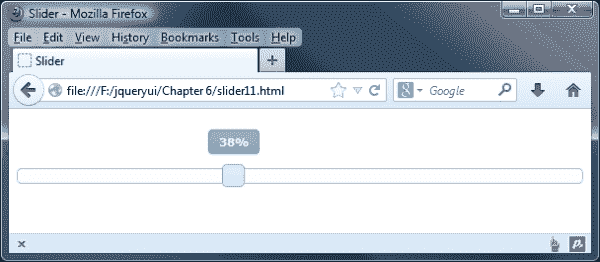

当所有事件选项一起使用时，事件将按以下顺序触发：

*   `create`
*   `start`
*   `slide`
*   `stop`
*   `change`

`slide`回调可能是一个相当密集的事件，因为在选择手柄时，每次鼠标移动都会触发它，但在某些情况下，它也可以通过回调函数返回`false`来防止滑动。当同时使用`stop`和`change` 回调时，`change`回调可能会覆盖`stop`回调。

与所有库组件一样，这些事件中的每一个都可以与 jQuery 的`on()`方法一起使用，方法是在事件名称前面加上`slider`，例如`sliderstart`。

## 采用滑块法

滑块是直观的，与库中的其他组件一样，它附带了一系列方法，用于在小部件初始化后以编程方式控制小部件。特定于滑块的方法如下表所示：

<colgroup><col style="text-align: left"> <col style="text-align: left"></colgroup> 
| 

方法

 | 

用法

 |
| --- | --- |
| `value` | 将单个滑块手柄设置为新值。这将自动将手柄移动到轨道上的新位置。此方法接受单个参数，该参数是表示新值的整数。 |
| `values` | 将指定的句柄设置为在使用多个句柄时将移动到新值。此方法与 value 方法相同，只是它接受两个参数：句柄的索引号后跟新值。 |

`destroy`、`disable`、`enable`、`option`和`widget`方法对于所有组件都是通用的，并且与我们期望的滑块工作方式相同。

正如我们在本章前面看到的，`value`和`values`方法是滑块独有的，可用于获取或设置单个或多个句柄的值。当然，我们也可以使用`option`方法来实现这一点，因此这两种方法只是满足常见实现需求的捷径。让我们来看看他们的行动。首先让我们看看如何使用`value`方法。

在`slider11.html`中，移除`<link>`至`sliderTheme2.css`并在页面中直接在滑块容器后面添加一个新的`<button>`元素：

```js
<p><button type="button" id="setMax">Set to max value</button></p>
```

现在，更改最后的`<script>`元素，使其如下所示：

```js
<script>
  $(document).ready(function($){
 $("#mySlider").slider();
 $("#setMax").click(function() {
 var maxVal = $("#mySlider").slider("option", "max");
 $("#mySlider").slider("value", maxVal);
 });
  });
</script>
```

将此文件另存为`slider12.html`。我们为新的`<button>`添加了一个点击处理程序；无论何时单击，此方法都将首先确定滑块的最大值，方法是将变量设置为`option`方法的结果，并指定`max`作为我们想要获得的选项。一旦得到了最大值，我们就调用`value` 方法，将保存最大值的变量作为第二个参数传入；我们的变量将用作新值。每当单击按钮时，滑块手柄将立即移动到轨迹的末端。

### 提示

**使用价值作为选项或方法**

在本章的许多示例中，我们提到了`value`（或`values`作为一种选项或方法。这可能有点令人困惑；将`value's`方法视为在代码中使用 value 选项作为 getter 的快捷方式。

使用多个句柄同样简单，但涉及的方法略有不同。

移除`slider12.html`中的`setMax`按钮，并在滑块元件后直接添加以下两个按钮：

```js
<p>
<button type="button" class="preset" id="low">Preset 1 (low) </button>
<button type="button" class="preset" id="high">Preset 2 (high) </button>
```

现在将`<head>`末尾的最后一个`<script>`元素更改为以下代码：

```js
<script>
  $(document).ready(function($){
 $("#mySlider").slider({ 
 values: [25, 75] 
 });

 $(".preset").click(function() {
 if (this.id === "low") {
 $("#mySlider").slider("values", 0, 0).slider("values", 1, 25);
 } else {
 $("#mySlider").slider("values", 0, 75).slider("values" , 
 1, 100);
 }
 });
  });
</script>
```

将此文件另存为`slider13.html`。要触发多个句柄，我们在配置对象中指定两个句柄的值。当页面上的两个`<button>`元素中的任何一个被点击时，我们计算出是点击了**预设 1**还是**预设 2**，然后根据点击的按钮将手柄设置为低值还是高值。

### 提示

还可以使用数组表示法设置滑块中的值；这将为所有句柄设置相同的值，而不管有多少句柄。

`values`方法接受两个参数。第一个参数是要更改的句柄的索引号，第二个参数是要将句柄设置为的值。以下屏幕截图显示了单击第二个按钮后页面的显示方式：

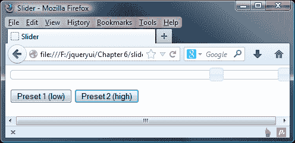

# 实际用途

一个 HTML5 元素是`<audio>`元素，它可能特别适合于 slider 小部件的实现。此元素将自动添加控件，使访问者能够播放、暂停和调整正在播放的媒体的音量。

但是，无法设置默认控件的样式；如果我们想改变它们的外观，我们需要创建自己的控件。当然，滑块小部件可以很好地替代默认音量控制。让我们看看如何添加一个，作为一个基础，您可以在自己的项目中进行进一步的研究。

在文本编辑器中创建以下新代码：

```js
<!DOCTYPE html>
<html>
<head>
  <meta charset="utf-8">
  <title>Slider</title>
  <link rel="stylesheet" href="development-bundle/themes/redmond/jquery.ui.all.css">
  <link rel="stylesheet" href="css/sliderTheme3.css">
  <script src="js/jquery-2.0.3.js"></script>
  <script src="development-bundle/ui/jquery.ui.core.js"></script>
  <script src="development-bundle/ui/jquery.ui.widget.js"></script>
  <script src="development-bundle/ui/jquery.ui.mouse.js"></script>
  <script src="development-bundle/ui/jquery.ui.slider.js"></script>
  <script>
    $(document).ready(function($){
      var audio = $("audio")[0];
      audio.volume = 0.5;
      audio.play();
      $("#volume").slider({
        value: 5,
        min: 0,
        max: 10,
        change: function() {
          var vol = $(this).slider("value") / 10;
          audio.volume = vol;
        }
      });
    });
  </script>
</head>
<body>
  <audio id="audio" controls="controls" src="uploads/prelude.mp3">
    Your browser does not support the <code>audio</code> element.
  </audio>
  <div id="volume"></div>
</body>
</html>
```

将此文件另存为`slider14.html`。我们还需要添加一些样式来调整显示。在文本编辑器的新页面中，添加以下内容，并将其另存为`sliderTheme3.css`：

```js
#volume { padding-top: 5px; }
#volume.ui-slider { width: 300px; }
.ui-slider-horizontal .ui-slider-handle { margin-left: -0.6em; top: -0.1em; }
```

别忘了在主页上添加指向`sliderTheme3.css`的链接：

```js
<link rel="stylesheet" href="css/sliderTheme3.css">
```

在`slider14.html`页面上，我们有`<audio>`标记，该标记的`src`属性设置为可从互联网档案中获得的音频剪辑。我们还有用于音量控制的空容器元素。

### 注

本例使用 Jan Morgenstern 为《大兔子》电影创建的一个音乐配乐文件；您可以下载，也可以在[下载收藏中的其他内容 https://archive.org/details/JanMorgenstern-BigBuckBunny](https://archive.org/details/JanMorgenstern-BigBuckBunny) 。

在脚本中，我们首先使用标准 jQuery 语法选择`<audio>`元素，然后从 jQuery 对象中检索实际的 DOM 元素，这样我们就可以从`<audio>`API 调用方法。

接下来，我们为滑块定义配置对象，并设置初始最小值和最大值。然后，我们使用`volume`属性方法为`change`事件添加一个处理程序，该事件用于更改当前播放的音频曲目的音量。无论何时更改滑块，我们都会得到一个新的滑块值，并通过将滑块值除以`10`将其转换为`volume`属性所需的格式。定义变量后，我们设置音频片段的音量，并立即使用`play()`方法播放该片段。

当我们在支持的浏览器中运行此示例时，我们可以暂停或播放音频剪辑；如果移动滑块手柄，则剪辑的体积应增大或减小，如以下屏幕截图所示：

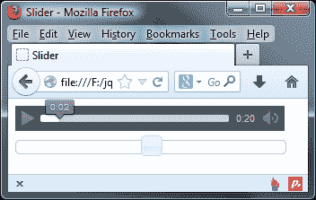

# 创建颜色滑块

滑块小部件的一个有趣实现是颜色滑块，它在某些应用中非常有用。让我们把我们对这个小部件的了解应用到实践中，以生成一个基本的颜色选择工具。以下屏幕截图显示了我们将制作的页面：

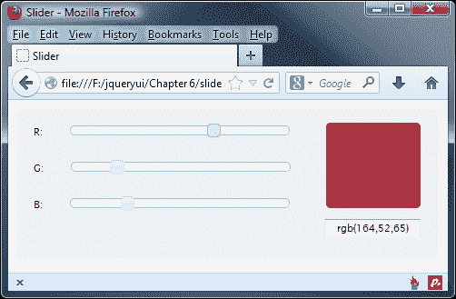

在文本编辑器中，将`slider1.html`中的`<body>`标记更改为以下代码：

```js
<div id="container" class="ui-widget ui-corner-all ui-widget-content ui-helper-clearfix">
  <label>R:</label>
  <div id="rSlider"></div><br>
  <label>G:</label>
  <div id="gSlider"></div><br>
  <label>B:</label>
  <div id="bSlider"></div>
  <div id="colorBox" class="ui-corner-all ui-widget-content"></div>
  <label for="output" id="outputLabel">Color value:</label>
  <input id="output" type="text" value="rgb(255,255,255)">
</div>
```

现在让我们为演示添加`script`功能，继续删除最后一个`<script>`元素的内容，并添加以下代码：

```js
<script>
  $(document).ready(function($){
    $("#rSlider, #gSlider, #bSlider").slider({
      min:0,
      max: 255,
      value: 255,
      slide: function() {
        var r = $("#rSlider").slider("value"),
        g = $("#gSlider").slider("value"),
        b = $("#bSlider").slider("value");
        var rgbString = ["rgb(", r, ",", g, ",", b, ")"].join("");
        $("#colorBox").css({
          backgroundColor: rgbString
        });
        $("#output").val(rgbString);
      }
    });
  });
</script>
```

将此文件另存为`slider15.html`。页面本身非常简单。我们有一些元素主要用于显示颜色滑块的不同组件，以及将转换为滑块小部件的单个容器元素。我们的颜色选择器使用三个滑块，每个 RGB 通道一个。

我们还需要一些 CSS 来完成小部件的整体外观。在文本编辑器的新页面中，创建以下样式表：

```js
#container { width: 426px; height: 146px; padding: 20px 20px 0; position: relative; font-size: 11px; background: #eee; }
#container label { float: left; text-align: right; margin: 0 30px 26px 0; clear: left; }
.ui-slider { width: 240px; float: left; }
.ui-slider-handle { width: 15px; height: 27px; }
#colorBox { width: 104px; height: 94px; float: right; margin: -83px 0 0 0; background: #fff; }
#container #outputLabel { float: right; margin: -14px 34px 0 0; }
#output { width: 100px; text-align: center; float: right; clear: both; margin-top: -17px; }
```

将此文件另存为`css`文件夹中的`colorSliderTheme.css`；在调用 jQuery UI 样式表之后，不要忘记在主文件中立即添加指向此的链接：

```js
<link rel="stylesheet" href="css/colorSliderTheme.css">
```

在我们的代码中，我们从 CSS 框架中给出容器和颜色框元素的类名，这样我们就可以利用圆角等效果，从而减少我们自己编写 CSS 所需的数量。

将注意力转向 JavaScript 代码，首先设置配置对象。由于 RGB 颜色值的范围从`0`到`255`，我们将`max`选项设置为`255`，并将`value`选项设置为`255`，以便小部件句柄在正确的位置启动（加载页面时，颜色框将具有白色背景）。

`slide`回调是操作发生的地方。每次移动句柄时，我们都会使用`value`方法更新`r`、`g`和`b`变量，然后根据变量的值构造一个新的 RGB 字符串。这是必要的，因为我们不能将变量直接传递到 jQuery 的`css()`方法中。我们还更新了`<input>`字段中的值。

当我们运行这个例子时，我们应该发现一切都按预期进行。一旦我们开始移动任何滑块手柄，颜色框开始改变颜色，`<input>`更新。

### 注

一旦选择控制柄，每次鼠标移动都会触发滑动事件；这是一个潜在的密集型事件，可能会导致旧浏览器或速度较慢的计算机出现问题。因此，在生产环境中使用时，应注意将事件处理程序中的任何不必要操作保持在最低限度。

# 介绍 progressbar 小部件

小部件由两个嵌套的`<div>`元素组成，一个外部`<div>`容器和一个内部`<div>`容器，用于突出显示当前的进度。下图显示了完成 50%的进度条：

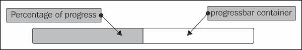

让我们来看看最基本的进度条实现。在文本编辑器的新文件中，创建以下代码：

```js
<!DOCTYPE html>
<html>
<head>
  <meta charset="utf-8">
  <title>Progressbar</title>
  <link rel="stylesheet" href="development-bundle/themes/redmond/jquery.ui.all.css">
  <script src="js/jquery-2.0.3.js"></script>
  <script src="development-bundle/ui/jquery.ui.core.js"></script>
  <script src="development-bundle/ui/jquery.ui.widget.js"></script>
  <script src="development-bundle/ui/jquery.ui.progressbar.js"></script>
  <script>
    $(document).ready(function($){
      $("#myProgressbar").progressbar();
    });
  </script>
</head>
<body>
  <div id="myProgressbar"></div>
</body>
</html>
```

将此文件另存为`jqueryui`项目文件夹中的`progressbar1.html`。如果没有配置，progressbar 当然是空的。我们的示例应该像第一个屏幕截图一样出现，但没有显示任何进度（容器是空的）。

进度条取决于以下组件：

*   `jquery.ui.all.css`
*   `jquery-2.0.3.js`
*   `jquery-ui.core.js`
*   `jquery-ui.progressbar.js`

我们在页面上只需要一个简单的容器元素。在本例中，我们使用了`<div>`元素，但也可以使用其他块级元素，例如`<p>`。小部件将在初始化时向指定的容器元素添加一个嵌套的`<div>`元素，该元素表示 progressbar 的值。

这个小部件和其他一些小部件一样，比如 accordion，将自然地填充其容器的宽度。其他同样以类似方式工作的小部件包括选项卡、手风琴、滑块和菜单，它们都同样需要某种形式的容器来限制它们在屏幕上的大小。组件为容器和内部`<div>`元素提供了一系列属性和类名。类名从使用中的`theme`文件中获取样式，并且组件已经完全就绪。准备好 ThemeRoller 意味着您选择的主题可以很容易地用另一个 jQuery ThemeRoller 主题进行更改，并且小部件仍然可以正常工作，而不需要对样式进行任何更改。

添加到小部件的附加属性与 ARIA 兼容，使访问者可以使用辅助技术完全访问小部件。**ARIA**（**可访问的富互联网应用**）定义了使那些使用辅助技术（如屏幕阅读器）的人更可访问 web 内容的方法。所有 jQuery 小部件都对 ARIA 有不同程度的支持，包括 progressbar；这是通过使用代码中出现的其他标记来实现的，例如这些（在以下代码中突出显示）：

```js
<div id="myProgressbar" class="ui-progressbar ui-widget ui-widget-content ui-corner-all" role="progressbar" aria-valuemin="0" aria-valuemax="100" aria-valuenow="20">

```

这些有助于将代码转换为辅助技术能够理解的内容；如果没有它们，代码将被有效地隐藏，这将影响最终用户看到或听到的内容。

## 列出 progressbar 的选项

撰写本文时，progressbar 有三个配置选项：

<colgroup><col style="text-align: left"> <col style="text-align: left"> <col style="text-align: left"></colgroup> 
| 

选项

 | 

默认值

 | 

用法

 |
| --- | --- | --- |
| `disabled` | `false` | 禁用小部件 |
| `Max` | `100` | progressbar 的最大值 |
| `Value` | `0` | 设置小部件的值（以百分比为单位） |

## 设置进度条的值

更改`progressbar1.html`中最后的`<script>`元素，使其显示如下：

```js
<script>
  $(document).ready(function($){
     $("#myProgressbar").progressbar({
       value: 50
    });
  });
</script>
```

将此文件另存为`progressbar2.html`。`value`选项接受一个整数，并将小部件内部`<div>`的宽度设置为相应的百分比。此更改将使小部件显示在本章第一个屏幕截图中，进度栏半满。

## progressbar 的事件 API

progressbar 公开三个自定义事件，如下表所示：

<colgroup><col style="text-align: left"> <col style="text-align: left"></colgroup> 
| 

事件

 | 

当…

 |
| --- | --- |
| `create` | 小部件已初始化 |
| `change` | 小部件的值发生变化 |
| `complete` | 小部件的值达到 100% |

与其他小部件一样，我们可以在配置对象中提供一个匿名回调函数作为这些事件的值，并且组件将在每次事件触发时自动为我们调用该函数。

要查看此事件的实际情况，请在`progressbar2.html`中的页面中添加以下：

```js
<p><button id="increase">Increase by 10%</button>
```

接下来，将最后的`<script>`块更改为以下内容：

```js
<script>
  $(document).ready(function($){
    var progress = $("#myProgressbar"),
      progressOpts = {
        change: function() {
          var val = $(this).progressbar("option", "value");
          if (!$("#value").length) {
          $("<span />", { text: val + "%", id: "value"}).appendTo(progress);
      } else {
        $("#value").text(val + "%");
      }
    }
  };
    progress.progressbar(progressOpts);
    $("#increase").click(function() {
      var currentVal = progress.progressbar("option", "value"),
    newVal = currentVal + 10;
    progress.progressbar("option", "value", newVal);
    });
  });
</script>
```

将此文件另存为`progressbar3.html`。我们还需要为 progressbar 添加一些样式，因此将以下内容添加到新文件中，并将其保存为`progressIncrease.css`：

```js
#value { margin-top: -28px; margin-right: 10px; float: right; }
```

别忘了从我们页面的`<head>`添加到新样式表的链接（在到标准 jQuery UI 样式表的链接之后）：

```js
<link rel="stylesheet" href="css/progressIncrease.css">
```

在我们的示例中，我们首先缓存 progressbar 的选择器，然后为`change`事件定义一个事件处理程序。在此回调函数中，我们首先获取 progressbar 的当前值，该值将与上次更新后的值相对应。我们可以在事件处理程序中使用`$(this)`选择 progressbar。

如果该值小于或等于 100（百分之），我们将检查页面上是否已经存在一个`id`为`value`的元素。如果元素不存在（即其值没有长度），我们将创建一个新的`<span>`元素，并将其文本设置为当前值。我们也给它一个`id`属性并定位它，使它出现在 progressbar 中。如果元素已经存在，我们只需将其文本更新为新值。

### 提示

**使用自动关闭快捷标签选择器**

您可能已经在代码中看到了`$("<span />")`的用法；这是 jQuery 用来生成标签完整版本的快捷方式；在本例中，它将封装在`<span>`…`</span>`标记中传递的任何内容。

我们还为添加到页面的按钮添加了一个单击处理程序。每当点击按钮时，我们首先在`getter`模式下使用`option`方法获取进度条的当前值。然后在`setter`模式下使用`option`方法将内部`<div>`的值增加`10`个百分点之前，我们将`10`添加到该值。将该值添加到`<span>`元素以指示进度。

以下屏幕截图显示了单击按钮的结果：

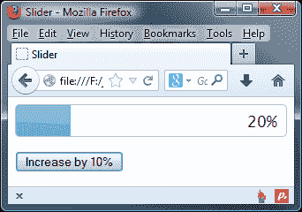

在本例中，每当点击**增加 10%**按钮时，我们手动设置 progressbar 的值；我们使用所有 UI 库组件通用的标准`option`方法来检索有关 progressbar 当前状态的信息。

不要忘记，与其他库组件一样，这个事件可以与 jQuery 的`on()`方法一起使用，方法是在事件名称前面加上小部件的名称，例如`progressbarchange`。

## 使用 progressbar 方法

除了所有库组件都公开的常用 API 方法，如`destroy`、`disable`、`enable`、`widget`、`option`，滑块 API 还公开了`value`方法，这是使用`option`方法设置进度条值的快捷方式。

我们可以使用`value`方法完成与上一个示例完全相同的操作，但代码更少。更改`progressbar3.html`中的最后一个`<script>`元素，如下所示：

```js
<script>
  $(document).ready(function($){
    var progress = $("#myProgressbar");
 progress.progressbar();
    $("#increase").click(function() {
      var currentVal = progress.progressbar("option", "value"), newVal = currentVal + 10;
 progress.progressbar("value", newVal);
 if (!$("#value").length) {
 $("<span />", { text: newVal + "%", id: "value" 
 }).appendTo(progress);
 } else {
 $("#value").text(newVal + "%");
 }
    });
  });
</script>
```

将此文件另存为`progressbar4.html`。在本例中，我们丢失了配置对象，因为它不是必需的。

使用`value`方法增加值的逻辑已移动到`<button>`元素的点击处理程序中。在事件处理程序中，我们获取`currentVal`的值，然后向其添加`10`，并将其分配给`newVal`。progressbar 小部件的`value`属性用新值更新；执行检查以查看百分比计数文本是否存在。如果没有（也就是说，`#value`的长度为零），那么我们将添加一个新实例，并使用更新后的图形显示在屏幕上。

不过，您会注意到，随着更新代码移动到事件处理程序中，这允许我们执行与前一个示例中相同的操作，但格式更加简洁。

## 增加不定支护

到目前为止，我们已经了解了如何控制 progressbar 在更新其结果时应该使用的百分比值。但是，在某些情况下，这并不总是可能实现，可以使用不确定选项。添加到 jQueryUI1.10 中，这允许那些无法更新值的实例，因为最终值未知。

让我们看看几个例子来比较设置已知值和不确定值之间的差异。在`progressbar4.html`中，将`<script>`元素更改为以下代码：

```js
<script>
  $(document).ready(function($){
 $("#myprogressbar").progressbar({ value: false });
 $("button").on("click", function(event) {
 var target = $(event.target), progressbar = $("#myprogressbar"), progressbarValue = progressbar.find(".ui-progressbar-value");
 if (target.is("#numButton")) { 
 progressbar.progressbar("option", { value: Math.floor(Math.random() * 100) });
 } else if (target.is("#falseButton")) {
 progressbar.progressbar("option", "value", false);
 }
 });
});
</script>
```

在代码的`<body>`元素中，将 HTML 更改为以下代码：

```js
<div id="myprogressbar"></div>
<p>
<button id="numButton">Random Value - Determinate</button>
<button id="falseButton">Indeterminate</button>
```

将此文件另存为`progressbar5.html`。以下屏幕截图显示点击**不确定**按钮的结果：

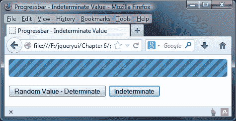

虽然很难在打印中看到它的实际效果，但上一个示例显示了一个 100%连续移动的 progressbar；点击**不确定**按钮，将值属性设置为`false`，告知进度条假设 100%为值。在本例中，自动设置为 100%表示我们正在取得进展。由于我们无法获得每个点的进度的准确数字，progressbar 小部件自动假设该值为 100%。

相比之下，如果我们知道 progressbar 应该使用的值，我们可以设置该值。点击**随机值-确定**按钮，显示设置该值的效果，如以下屏幕截图所示，方式与本章前面的示例类似：

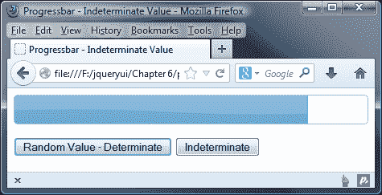

# 响应用户交互

在最基本的层面上，我们可以手动更新 progressbar 以响应用户交互。例如，我们可以指定一个向导样式的表单，它有几个步骤要完成。在本例中，我们将创建一个表单，如以下屏幕截图所示：

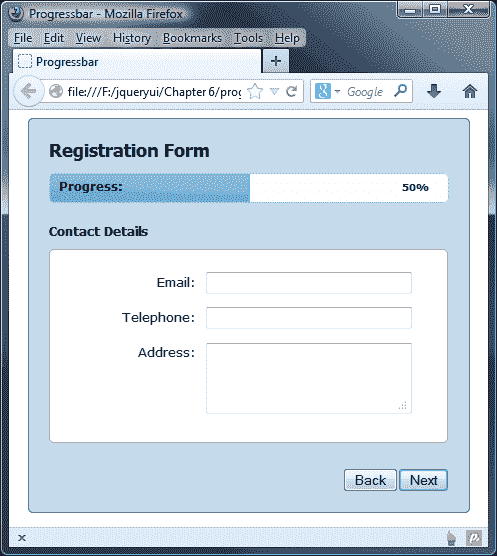

在每个步骤中，我们都可以手动增加 progressbar，让用户知道他们在整个过程中走了多远。在`progressbar5.html`中，将 progressbar 容器和按钮替换为以下代码：

```js
<div class="form-container ui-helper-clearfix ui-corner-all">
  <h1>Registration Form</h1>
  <p>Progress:</p>
  <div id="myProgressbar"></div>
  <label id="amount">0%</label>
  <form action="serverScript.php">>
    <div class="form-panel">
      <h2>Personal Details</h2>
      <fieldset class="ui-corner-all">
        <label for="name">Name:</label>
        <input id="name" type="text">
        <label for="dob">D.O.B:</label>
        <input id="dob" type="text">
        <label for="passwrd1">Choose password:</label>
        <input id="passwrd1" type="password">
        <label for="passwrd2">Confirm password:</label>
        <input id="passwrd2" type="password">
      </fieldset>
    </div>
    <div class="form-panel ui-helper-hidden">
      <h2>Contact Details</h2>
      <fieldset class="ui-corner-all">
        <label for="email">Email:</label>
        <input id="email" type="text">
        <label for="tel">Telephone:</label>
        <input id="tel" type="text">
        <label for="address">Address:</label>
        <textarea id="address" rows="3" cols="25"></textarea>
    </fieldset>
  </div>
  <div class="form-panel ui-helper-hidden">
    <h2>Registration Complete</h2>
    <fieldset class="ui-corner-all">
      <p>Thanks for registering!</p>
    </fieldset>
  </div>
  </form>	
  <button id="next">Next</button>
  <button id="back" disabled="disabled">Back</button>
</div>
```

将此文件另存为`progressbar6.html`。在`<head>`部分，我们添加了一个到框架主题文件的链接，正如我们在本章中对其他示例所做的那样，我们需要添加一个到自定义样式表的链接，稍后我们将添加该链接：

```js
<link rel="stylesheet" href="css/progressTheme.css">
```

页面的`<body>`元素包含一些布局元素和一些文本节点，但主要元素是 progressbar 和`<form>`的容器。使用`<div>`和`<fieldset>`元素将`<form>`部分分为几个不同的部分。这样做的原因是，我们可以隐藏表单的各个部分，使其看起来好像跨越了多个页面。

我们在 progressbar 旁边添加了一个段落和一个`<label>`参数。我们将定位这些，以便它们出现在小部件的中。该段落包含一个简单的文本字符串。标签将用于显示当前进度值。

外部容器有几个类名；首先，我们可以对元素应用一些自定义样式，但接下来的两个是针对 jQueryUICSS 框架的不同特性。`ui-helper-clearfix`类用于自动清除浮动元素，是减少额外和不必要清除`<div>`元素所造成的混乱的好方法。在创建自己的小部件时，不要忘记显式地使用此框架类和其他框架类。

### 提示

我们在[第 2 章](02.html "Chapter 2. The CSS Framework and Other Utilities")、*CSS 框架和其他工具*中介绍了一些核心 CSS 类；有关 CSS 框架 API 的更多详细信息，请访问[http://learn.jquery.com/jquery-ui/theming/api/](http://learn.jquery.com/jquery-ui/theming/api/) 。

`ui-corner-all`类使用几个专有的样式规则，为容器元素（以及 progressbar 本身，它自动拥有它们）和我们的`<fieldset>`元素提供圆角。现在大多数现代浏览器都支持这些功能。我们还有一个**下一个**按钮，用于在每个面板中向前移动，还有一个**后退**按钮，默认情况下被禁用。

我们在表单中使用 CSS 框架中的另一个类。当页面第一次加载时，需要隐藏几个面板；因此，我们可以使用`ui-helper-hidden`类来确保它们被设置为`display: none`。当我们想要显示它们时，我们所要做的就是删除这个类名。

现在让我们添加 JavaScript。更改页面底部的最后一个`<script>`元素，使其显示如下：

```js
$(document).ready(function($){
  var prog = $("#myProgressbar"), progressOpts = {
    change: function() {
      prog.next().text(prog.progressbar("value") + "%");
    }
  };
  prog.progressbar(progressOpts);
  $("#next, #back").click(function() {
    $("button").attr("disabled", true);
    if (this.id == "next") {
      prog.progressbar("option", "value",
      prog.progressbar("option", "value") + 50);
      $("form").find("div:visible").fadeOut().next()
        .fadeIn(function(){
        $("#back").attr("disabled", false);
        if (!$("form").find("div:last").is(":visible")) {
          $("#next").attr("disabled", false);
        }
      });
    } else {
      prog.progressbar("option", "value", prog.progressbar("option", "value") - 50);
      $("form").find("div:visible").not(".buttons").fadeOut() .prev().fadeIn(function() {
        $("#next").attr("disabled", false);
        if (!$("form").find("div:first").is(":visible")) {
          $("#back").attr("disabled", false);
        }
      });
    }
  });
});
```

我们首先缓存 progressbar 的选择器并定义配置对象，利用`change`事件指定匿名回调函数。每次触发事件时，我们将使用`value`方法获取 progressbar 的当前值，并将其设置为 progressbar 元素后面的`<label>`参数的文本。事件在更改发生后触发，因此我们获得的值将始终是新值。

一旦 progressbar 被初始化，我们为表单后面的按钮添加一个点击处理程序。在这个处理函数中，我们首先禁用这两个按钮，以防止表单在重复单击`<button>`时被破坏。然后，我们使用一个`if`语句来运行稍微不同的代码分支，具体取决于单击的按钮。

如果点击了**下一个**按钮，我们通过将`value`选项设置为当前值加`50`百分比，将进度条的值增加`50`百分比。然后淡出当前可见的面板，并淡入下一个面板。我们使用回调函数作为`fadeIn()`方法的参数，该方法将在动画结束后执行。

在该功能中，我们重新启用**后退**按钮（由于点击的是**下一个**，第一个面板不可能可见，因此应启用该按钮），并确定是否启用**下一个**按钮，如果最后一个面板不可见，则可以启用该按钮。

外部`if`语句的第二个分支处理被点击的**后退**按钮。在这种情况下，我们将 progressbar 减少`50`个百分点，启用**下一个**按钮，并检查**后退**按钮是否应启用。

这就是我们需要的所有 JavaScript。我们现在要做的就是添加一些基本的 CSS 来展示示例；在文本编辑器的新文件中添加以下代码：

```js
h1, h2 { font-family: Tahoma; font-size: 140%; margin-top: 0;}
h2 { margin: 20px 0 10px; font-size: 100%; text-align: left; }
p { margin: 0; font-size: 95%; position: absolute; left: 30px; top: 60px; font-weight: bold; }
#amount { position: absolute; right: 30px; top: 60px; font-	size: 80%; font-weight: bold; }
#thanks { text-align: center; }
#thanks p { margin-top: 48px; font-size: 160%; position: relative; left: 0; top: 0; }
form { height: 265px; position: relative; }
.form-container { width: 400px; margin: 0 auto; position: relative; font-family: Verdana; font-size: 80%; padding: 20px; background-color: #C5DBEC; border: 1px solid #2E6E9E; }
.form-panel { width: 400px; height: 241px; position: absolute; top: 0; left: 0; } 
fieldset { width: 397px; height: 170px; margin: 0 auto; 	padding: 22px 0 0; border: 1px solid #abadac; background-color: #ffffff; }
label { width: 146px; display: block; float: left; text-align: right; padding-top: 2px; margin-right: 10px; }input, textarea { float: left; width: 200px; margin-bottom: 13px; }
button { float: right; }
```

将此保存为`css`目录中的`progressTheme.css`。我们现在应该有一个带有有线进度条的工作页面。当我们运行页面时，我们会发现我们可以浏览表单的每个面板，progressbar 将相应地更新自己。

在本例中，我们仍然依赖于用户交互来设置 progressbar 的值，这是由浏览每个面板的访问者驱动的。

# 使用 progressbar 实现富上传

我们不需要依赖用户交互来增加 progressbar 的价值，从而完成指定的任务，我们可以依赖系统来更新它，只要有可用的东西可以用来准确地更新它。

在最后一个 progressbar 示例中，我们可以合并 HTML5 文件 API，以便异步上载文件，并且可以在上载文件时使用`onprogress`事件更新 progressbar。

### 提示

此时，您可能希望获得本书附带的代码下载副本，以便在学习示例的同时完成代码。

此示例仅在安装并配置了 PHP 的完整 web 服务器上才能正常工作。在本例中，我们将不讨论上传过程的服务器端部分；我们不关心文件上传后会发生什么，只关心在上传过程中根据从系统收到的反馈更新 progressbar。

更改`progressbar6.html`中的`<body>`，使其包含以下元素：

```js
<div id="container">
  <h1>HTML5 File Reader API</h1>
  <form id="upload" action="upload.php" method="POST" enctype="multipart/form-data">
    <fieldset>
      <legend>Image Upload</legend>
      <input type="hidden" id="MAX_FILE_SIZE" name="MAX_FILE_SIZE"value="300000" />
      <div>
        <label for="fileselect">Image to upload:</label>
        <input type="file" id="fileselect" name="fileselect[]"multiple="multiple" />
      </div>
      <div id="progress"></div>
    </fieldset>
  </form>
  <div id="messages"></div>
</div>
```

在页面上，我们有一个`file`类型的`<input>`元素，后面跟往常一样是 progressbar 的容器。接下来，让我们添加脚本；将`<head>`末尾的最后一个`<script>`元素更改为以下代码：

```js
$("document").ready(function($) {
  if (window.File && window.FileList && window.FileReader) {
    $("#fileselect").on("change", function(e) {
      var files = e.target.files || e.dataTransfer.files;
      for (var i = 0, f; f = files[i]; i++) {
        ParseFile(f);
        UploadFile(f);
      }
    });
  }
});
```

将此文件另存为`progressbar7.html`。将以下代码添加到新文档中，并将其保存为`uploads.js`：

```js
function ParseFile(file) {
  $("#messages").html(
    "<p>File information: <strong><br>" +
    "</strong> type: <strong>" + file.type + "<br>" +
    "</strong> size: <strong>" + file.size + 
    "</strong> bytes</p>"
  );

  if (file.type.indexOf("image") === 0) {
    var reader = new FileReader();
    reader.onload = function(e) {
      $("#messages").prepend(
        "<br>Image:<br><strong>" + file.name + "</strong><br />" +
        '</p>'
      );
    };
    reader.readAsDataURL(file);
  }
}

function UploadFile(file) {
  $("#progress").progressbar();
  var xhr = new XMLHttpRequest();
  xhr.upload.onprogress = function updateProgress(e) {
    var fileloaded = (e.loaded / e.total);
    $("#progress").progressbar("value", Math.round(fileloaded * 100));
  };

  xhr.upload.onload = function() {
    $("#progress").progressbar("value", 100);
  };

  xhr.open("POST", $("#upload").action, true);
  xhr.setRequestHeader("X_FILENAME", file.name);
  xhr.send(file);
}
```

最后，在文档的`<head>`元素的 jQuery UI 链接下方添加以下：

```js
<script type="text/javascript" src="js/uploads.js"></script>
```

首先在`progressbar7.html`中进行检查，确认浏览器是否支持文件 API；如果可以的话，我们会启动一个事件处理程序，在点击`fileselect`按钮后立即触发。

在变更处理程序中，我们获取所选文件的详细信息并将其保存到数组中；然后我们调用`ParseFile()`函数（在`uploads.js`中），首先启动输出消息，然后使用`FileReader()`加载并读取图像副本，并将图像副本输出到屏幕。同时，我们显示图像名称的详细信息。

接着转到`uploads.js`，我们接着讨论`UploadFile`函数，这就是真正的魔法发生的地方。我们首先启动 progressbar 的一个实例，给它一个`progress`ID，并使用`<div>`元素作为它的容器。然后，该代码设置一个`XMLHttpRequest()`实例并打开一个`POST`连接以上载该文件。在本例中，该文件实际上仅上载到服务器（或在本例中，您的 PC）上的测试文件夹，称为上载；此时，您将创建一个上载脚本，将文件重定向到远程服务器上的适当位置。

每次更新`XMLHttpRequest`参数时，触发`onprogress`事件处理程序更新进度条；我们计算总文件大小和上载内容之间的差异，然后将其转换为百分比，并使用该百分比更新 progressbar。上传完成后，我们启动`onload()`事件处理程序，以确保它显示 100%完成。

对于这个示例，我们还需要一些 CSS；在新文本文件中添加以下代码：

```js
body { font-family: "Segoe UI", Tahoma, Helvetica, Freesans, sans-serif; font-size: 90%; margin: 10px; color: #333; background-color: #fff; }
#container { margin-left: auto; margin-right: auto; width: 430px;  }
#messages { padding: 0 10px; margin: 1em 0; border: 1px solid #999; width: 400px; clear: both; height: 275px; }
#messages p { position: absolute; float: left; margin-left: 275px; width: 150px; }
#progress { margin-top: 3px; width: 390px; left: -2px; }
h1 { font-size: 1.5em; font-weight: normal; }
legend { font-weight: bold; color: #333; }
.preview { height: 60%; width: 60%; float: left; }
fieldset { width: 400px; }
```

此文件可作为`uploads.css`保存在`css`文件夹中。大多数样式只是定位各种元素并设置进度条的宽度。我们也不需要指向`progressTheme.css`的链接，因此也可以删除此链接。

当我们运行这个文件时，我们应该看到，一旦选择了一个文件，它将自动开始上传，progressbar 将开始填满。如果在本地测试，它将非常快，因此最好使用相当大的文件进行测试。

以下屏幕截图显示上传完成后的页面：

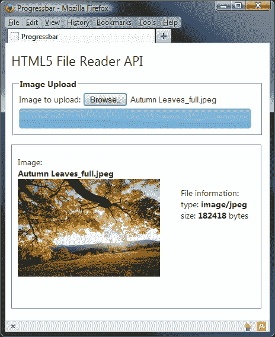

# 总结

在本章中，我们研究了两个界面小部件，它们都可以提供某种形式的视觉反馈，无论是作为操作的结果，还是设置特定的值。我们看到了它可以多么快速、轻松地在页面上放置一个滑块小部件，它只需要最少的底层标记和一行代码即可初始化。

我们探讨了可以设置的不同选项，以控制滑块的行为以及初始化后的配置方式，同时提供可用于在交互过程中的重要时间执行代码的回调。我们还介绍了一系列可用于以编程方式与滑块交互的方法，包括用于设置句柄值的方法，或在初始化后获取和设置配置选项的方法。

我们还研究了 progressbar 小部件，它具有一个紧凑的 API，在进程进行时提供基本的访问者反馈。然后，我们研究了在初始化之前或小部件使用后，可用于配置小部件的各种选项。我们还研究了可用于处理 progressbar 小部件的方法，以了解如何轻松地对正在进行的更改或小部件完成后作出反应。

我们还研究了 progressbar 如何包含对不确定进度指示器的支持，以便在无法准确确定流程的当前状态时使用。

在下一章中，我们将介绍 datepicker 小部件，它拥有库中任何小部件中最大、功能最丰富的 API，并包含完全国际化。