# 七、日期选择器小部件

jQueryUIDatePicker 小部件可能是 jQueryLibrary 中最精致、文档最丰富的小部件。它拥有最大的**应用编程接口**（**API**），并且可能提供了所有小部件中最多的功能。它不仅可以完全开箱即用，而且具有高度的可配置性和健壮性。

很简单，datepicker 小部件提供了一个界面，允许站点或应用的访问者选择日期。如果需要表单字段要求输入日期，则可以添加 datepicker 小部件。这意味着你的访问者可以使用一个吸引人的小部件，你可以按照你期望的格式获得日期。

在本节中，我们将研究以下主题：

*   默认的日期选择器实现
*   探索可配置选项
*   实现触发按钮
*   配置替代动画
*   `dateFormat`选项
*   易于本地化
*   多月日期选择器
*   数据范围选择
*   Datepicker 小部件的方法
*   将 AJAX 与日期选择器一起使用

datepicker 内置的其他功能包括自动打开和关闭动画，以及使用键盘导航小部件界面的功能。按住*Ctrl*键（或 Mac 上的命令键）时，可以使用键盘上的箭头选择新的日间单元格，然后使用返回键选择。

datepicker 很容易创建和配置，但它是一个复杂的小部件，由大量底层元素组成，如下图中的所示：

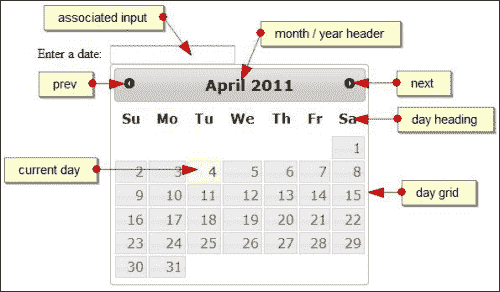

### 注

尽管存在这种复杂性，但我们只需一行代码就可以实现默认的 datepicker，就像我们到目前为止介绍的库中的其他小部件一样。

# 实现 datepicker 小部件

要创建默认的日期选择器，请在文本编辑器的新页面中添加以下代码：

```js
<!DOCTYPE html>
<html>
<head>
  <meta charset = "utf-8">
  <title>Datepicker</title>
  <link rel="stylesheet" href="development-bundle/themes/redmond/jquery.ui.all.css">
  <script src="js/jquery-2.0.3.js"></script>
  <script src="development-bundle/ui/jquery.ui.core.js"></script>
  <script src="development-bundle/ui/jquery.ui.widget.js"></script>  
<script src="development-bundle/ui/jquery.ui.datepicker.js"> </script>
  <script>  
    $(document).ready(function($){
      $("#date").datepicker();
    });
  </script>
</head> 
<body>
  <label for="date">Enter a date:</label>
  <input id="date" />
</body>
</html>
```

将其另存为`jqueryui`项目文件夹中的`datePicker1.html`。页面上只有一个`<label>`和一个标准文本`<input>`元素。我们不需要为 datepicker 小部件指定任何空容器元素，因为创建小部件所需的标记是由库自动添加的。

### 提示

尽管在`<input>`语句中使用 HTML5`type="date`属性可能很有诱惑力，但不建议这样做，因为这可能会导致冲突，因为它会在本地 HTML5 版本的同时显示两个 jQuery UI 日期选择器。

当您在浏览器中运行页面并关注`<input>`元素时，默认日期选择器应显示在输入下方。除了一个`<input>`元素外，日期选择器还可以附加到一个`<div>`元素。

除了看起来很棒之外，默认的日期选择器还带有许多内置功能。当日期选择器打开时，它将从零平滑地设置为全尺寸，并将自动设置为当前日期。选择一个日期将自动将日期添加到`<input>`并关闭日历（同样带有一个漂亮的动画）。

没有额外的配置和一行代码，我们现在有了一个完全可用且有吸引力的小部件，可以轻松地选择日期。如果你只想让人们选择一个日期，这就是你所需要的。默认日期选择器所需的源文件如下：

*   `jquery-2.0.3.js`
*   `jquery.ui.core.js`
*   `jquery.ui.widget.js`
*   `jquery.ui.datepicker.js`

## 使用内联日历选择日期

我们已经创建了一个基本日期选择器小部件，并将其链接到一个普通文本`<input>`框中。虽然这可以很好地工作，但在某些情况下，您可能不想使用普通的输入框，只需要显示页面中已打开的日历。

幸运的是，使用 datepicker 小部件很容易实现这一点。将 HTML 代码更改为使用`<div>`元素，如下代码所示：

```js
<body>
 Enter a date: <div id="date"></div>
</body>
```

如果我们在浏览器中预览结果，您会注意到输入文本框已消失，并且日历已完整显示：

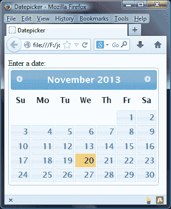

# 日期选择器的可配置选项

datepicker 有一个很大的范围的可配置选项（目前确切地说是 50 个）。下表列出了基本选项及其默认值，并简要说明了其用法：

<colgroup><col style="text-align: left"> <col style="text-align: left"> <col style="text-align: left"></colgroup> 
| 

选项

 | 

默认值

 | 

用法

 |
| --- | --- | --- |
| `altField` | `""` | 为备选`<input>`字段指定一个 CSS 选择器，所选日期也将添加到该字段中。 |
| `altFormat` | `""` | 指定为添加到替代`<input>`的日期指定替代格式。有关此选项所取值的说明，请参见后面章节中的`dateFormat`选项。 |
| `appendText` | `""` | 在日期选择器`<input>`后添加文本，显示所选日期的格式。 |
| `autoSize` | `false` | 自动设置`<input>`元素的宽度，使其能够根据指定的`dateFormat`容纳日期。 |
| `beforeShow` | `null` | 允许日期选择器配置对象在调用日期选择器之前更新它。 |
| `beforeShowDay` | `null` | 将日期作为参数，并返回值以指示日期是否可选、要添加到日期单元格的类名以及日期的（可选）弹出式工具提示。在 datepicker 中，每天都会在显示该函数之前调用该函数。 |
| `buttonImage` | `""` | 指定要用于触发器`<button>`的图像路径。 |
| `buttonImageOnly` | `false` | 设置为`true`以使用图像而不是触发按钮。 |
| `buttonText` | `"..."` | 提供要在触发器`<button>`上显示的文本（如果存在）。 |
| `calculateWeek` | `$.datepicker. iso8601Week` | 接受一个函数，用于计算指定日期的一年中的一周。 |
| `changeMonth` | `false` | 显示月份变化下拉列表。 |
| `changeYear` | `false` | 显示年变化下拉列表。 |
| `closeText` |   |  |
| `constrainInput` | `true` | 将元素约束为小部件指定的日期格式。 |
| `currentText` | `"Today"` | 要为当天链接显示的文本。此选项必须与`showButtonPanel`属性一起使用才能显示此按钮。 |
| `dateFormat` |   | 用于解析和显示日期的格式。本章后面的*更改日期格式*部分显示了完整的格式列表。 |
| `dayNames` | `[ "Sunday", "Monday", "Tuesday", "Wednesday", "Thursday", "Friday", "Saturday" ]` | 与`dateFormat`属性一起使用的长日名称列表。 |
| `dayNamesMin` | `[ "Su", "Mo", "Tu", "We", "Th", "Fr", "Sa" ]` | 一个数组，包含在 datepicker 小部件的列标题上显示的最小化日期名称。这可以本地化，我们将在本章后面看到。 |
| `dayNamesShort` | `[ "Sun", "Mon", "Tue", "Wed", "Thu", "Fri", "Sat" ]` | 缩写日期名称列表，用于小部件的`dateFormat`属性。 |
| `defaultDate` | `null` | 设置当日期选择器打开且`<input>`元素为空时将高亮显示的日期。 |
| `duration` | `"normal"` | 设置日期选择器打开的速度。 |
| `firstDay` | `0` | 设置一周的第一个天，从`0`开始为周日，一直到`6`结束为周六。 |
| `gotoCurrent` | `false` | 设置当前日期链接，将 datepicker 小部件移动到当前选择的日期，而不是今天。 |
| `hideIfNoPrevNext` | `false` | 在不需要时隐藏上一个/下一个链接，而不是禁用它们。 |
| `isRTL` | `false` | 控制所使用的语言是否从右向左绘制。 |
| `maxDate` | `null` | 设置可选择的最长日期。接受日期对象或相对数字。例如：`+7`或字符串，如`+6m`。 |
| `minDate` | `null` | 设置可选择的最短日期。接受数字、日期对象或字符串。 |
| `monthNames` | `Array of month names, for example [ "January", "February", "March"…]` | 设置月份名称的完整列表，用于小部件中的`dateFormat`属性。 |
| `monthNamesShort` | `Array of abbreviated month names, such as ["Jan", "Feb", "Mar"…]` | 根据`dateFormat`属性的指定，设置在 datepicker 小部件的每个月标题中使用的缩写月份名称列表。 |
| `navigationAsDateFormat` | `false` | 允许我们使用上一个、下一个和当前链接指定月份名称。 |
| `nextText` | `"Next"` | 设置要为下个月链接显示的文本。 |
| `numberOfMonths` | `1` | 设置单个 datepicker 小部件上显示的月数。 |
| `onChangeMonthYear` | `Function` | 当日期选择器移动到新的月份或年份时，称为。 |
| `onClose` | `Function` | 当 datepicker 小部件关闭时调用，无论是否选择了日期。 |
| `onSelect` | `Function` | 选择 datepicker 小部件时调用。 |
| `prevText` | `"Prev"` | 设置上个月链接要显示的文本。 |
| `selectOtherMonths` | `false` | 允许选择当前月份面板上显示的上个月或下个月的天数（参见`showOtherMonths`选项）。 |
| `shortYearCutoff` | `"+10"` | 使用年份表示法时确定当前世纪；低于这个数字的数字被认为是本世纪的数字。 |
| `showAnim` | `"show"` | 设置显示 datepicker 小部件时使用的动画。 |
| `showButtonPanel` | `false` | 显示 datepicker 小部件的按钮面板，包括关闭链接和当前链接。 |
| `showCurrentAtPos` | `0` | 设置当月在多月日期选择器中的位置 |
| `showOn` | `"focus"` | 设置触发显示日期选择器的事件。 |
| `showOptions` | `{}` | 一个对象文本，包含控制已配置动画的选项。 |
| `showOtherMonths` | `false` | 显示上个月和下个月的最后和第一天。 |
| `showWeek` | `false` | 显示一个列，显示一年中的一周。使用`calculateWeek`选项确定一周。 |
| `stepMonths` | `1` | 设置使用上一个链接和下一个链接导航的月数。 |
| `weekHeader` | `"Wk"` | 将文本设置为显示一年中的一周列标题。 |
| `yearRange` | `"-10:+10"` | 指定“年份”下拉列表中的年份范围。 |

我们将在本章中详细探讨其中一些选项。

## 使用基本选项

将`datepicker1.html`中最后的`<script>`元素更改为：

```js
<script>  
  $(document).ready(function($){
 $("#date").datepicker({
 appendText: "  (mm/dd/yy)",
 defaultDate: "+5",
 showOtherMonths: true
 });
  });
</script>
```

另存为`datePicker2.html`。以下屏幕截图显示了配置这些选项后小部件的外观：

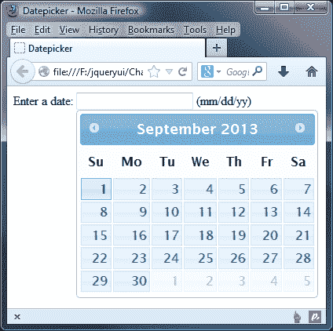

我们在本例中使用了许多选项，这仅仅是因为有太多的选项可用。在显示日期选择器之前，可以使用`appendText`选项更改初始页面的外观。这会在`<input>`字段后直接使用`<span>`元素添加指定的文本字符串，该字段与选择器关联。这有助于访问者澄清日期的格式。

出于样式化的目的，我们可以使用`.ui-datepicker-append`类名来定位新的`<span>`元素。

`defaultDate`选项设置哪个日期在最初打开时在日期选择器中突出显示，`<input>`元素为空。我们在本例中使用了相对的`+5`字符串，因此当 datepicker 小部件最初打开时，将选择距离当前日期五天的日期。按键盘上的*输入*键将选择突出显示的日期。

除了一个相对字符串外，我们还可以提供`null`作为`defaultDate`的值，将其设置为当前日期（主观上是今天），或标准 JavaScript 日期对象。

正如我们在前面的屏幕截图中所看到的，当前日期的 datepicker 小部件 date 的样式与用于显示默认日期的样式不同。这在主题之间会有所不同，但作为参考，当前日期以粗体显示，并带有浅色（橙色），而所选日期的边框比默认主题的正常日期更暗。

一旦选择了日期，datepicker 小部件的后续打开将显示所选日期作为默认日期，该日期同样具有不同的样式（带有 redmond 主题的预选日期将为浅蓝色）。

通过将`showOtherMonths`选项设置为`true`，我们将上一个和下一个月的灰显（不可选择）日期添加到位于日期网格开始和结束处的空方框中，在当前月份之前和之后。这些在上一个屏幕截图中可见，并以比可选日期更浅的颜色呈现。

# 最短和最长日期

默认情况下，日期选择器将无限向前或向后移动，没有上下边界。如果我们想将可选择的日期限制在特定范围内，我们可以使用`minDate`和`maxDate`选项轻松完成。将`datePicker2.html`中的配置对象更改为：

```js
$("#date").datepicker({
 minDate: new Date(),
 maxDate: "+10"
});
```

另存为`datePicker3.html`。在本例中，我们为`minDate`选项提供了一个标准的、未修改的 JavaScript 日期对象，它将最小日期设置为当前日期。这将使过去的任何日期都不可选择。

对于`maxDate`选项，我们使用`+10`的相对文本字符串，这将只选择当前日期和接下来的 10 个日期。您可以在以下屏幕截图中看到这些选项如何影响小部件的外观：

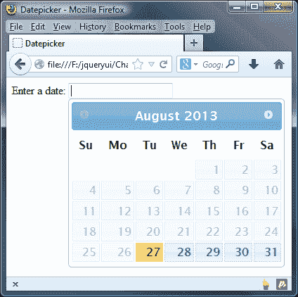

### 注

`minDate`和`maxDate`选项也可以采用`+6w`、`-10m`或`1y`等字符串，分别表示周、月和年。您可以在[找到有关如何设置这些选项的更多详细信息 http://api.jqueryui.com/datepicker/#option-minDate](http://api.jqueryui.com/datepicker/#option-minDate)和[http://api.jqueryui.com/datepicker/#option-maxDate](http://api.jqueryui.com/datepicker/#option-maxDate)。

# 更改日期选择器 UI 中的元素

datepicker API 公开了大量与在 datepicker 中添加或删除额外 UI 元素直接相关的选项。要显示允许访问者选择月份和年份的`<select>`元素，我们可以使用`changeMonth`和`changeYear`配置选项：

```js
$("#date").datepicker({
 changeMonth: true,
 changeYear: true
});
```

另存为`datePicker4.html`。使用月份和年份`<select>`元素，用户可以更快地导航到可能在过去或未来很远的日期。以下屏幕截图显示了启用这两个选项后小部件的显示方式：

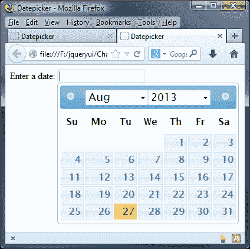

默认情况下，“年份”选择框将包括上一个和下一个 10 年，总范围为 20 年。我们可以使用上一个/下一个箭头链接导航到更远的地方，但如果我们事先知道访客可能在过去或未来选择非常远的日期，我们可以使用`yearRange`选项更改年份范围：

```js
$("#date").datepicker({
  changeMonth: true,
  changeYear: true,
 yearRange: "-25:+25"
});
```

另存为`datePicker5.html`。这一次，当我们运行页面时，我们会发现年份范围现在总共涵盖了 50 年。

我们可以对 datepicker 的 UI 进行的另一个更改是启用按钮面板，它将两个按钮添加到小部件的页脚。让我们看看它的实际行动。

更改`datepicker5.html`中的配置对象，使其显示如下：

```js
$("#date").datepicker({ showButtonPanel: true })
```

另存为`datePicker6.html`。添加到小部件底部的按钮与对话框小部件中的按钮完全相同，如以下屏幕截图所示：

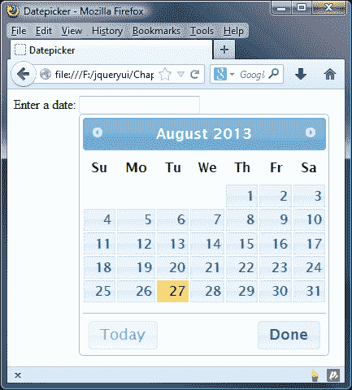

**今日**按钮将立即将日期选择器导航回显示当前日期的月份，而**完成**按钮将关闭小部件而不选择日期。

我们也可以通过`gotoCurrent`选项更改**今日**按钮，使其转到所选日期，而不是当前日期；我们可以通过将其添加到小部件的配置对象中来实现，如下所示：

```js
$("#date").datepicker({
  showButtonPanel: true,
 gotoCurrent: true 
});
```

如果您选择一个日期，然后滚动几个月，您可以通过点击**今天**按钮返回到所选日期。

## 增加触发按钮

默认情况下，当与之关联的`<input>`元素接收到焦点时，日期选择器打开。然而，我们可以很容易地改变这一点，这样当点击按钮时，日期选择器就会打开。最基本的`<button>`类型可以通过`showOn`选项启用。更改`datePicker6.html`中的配置对象，如下所示：

```js
$("#date").datepicker({ 
 showOn: "button" 
});
```

另存为`datePicker7.html`。在我们的配置对象中将`showOn`选项设置为`true`将自动在关联的`<input>`元素之后直接添加一个简单的`<button>`元素。我们也可以将此选项设置为两者，以便在聚焦`<input>`和单击`<button>`时打开。

日期选择器现在仅在点击`<button>`时打开，而不是在`<input>`聚焦时打开。此选项还接受字符串值“两者”，当聚焦`<input>`并单击`<button>`时，此字符串将打开小部件。新的`<button>`如下图所示：

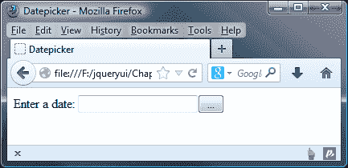

`<button>`（省略号）上显示的默认文本可以通过提供新字符串作为`buttonText`选项的值轻松更改；将以前的配置对象更改为：

```js
$("#date").datepicker({
  showOn: "button",
  buttonText: "Open Calendar"
});
```

另存为`datePicker8.html`。现在，`<button>`上的文本应该与我们设置为`buttonText`选项的值匹配：

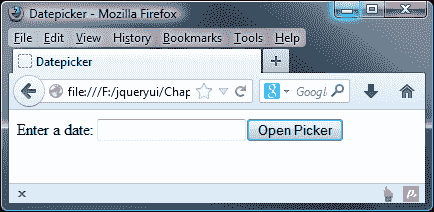

我们可以使用图像，而不是使用文本作为`<button>`元素的标签。这是使用`buttonImage`选项配置的：

```js
$("#date").datepicker({
  showOn: "button",
  buttonText: "Open Calendar",
 buttonImage: "img/cal.png"
});
```

另存为`datePicker9.html`。`buttonImage`选项的值是一个字符串，由我们希望在按钮上使用的图像路径组成。注意，在本例中，我们也设置了`buttonText`选项。原因是`buttonText`选项的值会自动用作``元素的`title`和`alt`属性，即添加到`<button>`中。

我们的触发按钮现在应如以下屏幕截图所示：

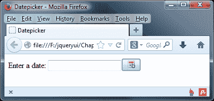

### 提示

在这个例子中，我们故意不在这一点上设计按钮的样式，而只专注于添加一个徽标。但是，您可以使用 jQuery UI 对其进行样式化，我们将在[第 8 章](08.html "Chapter 8. The Button and Autocomplete Widgets")、*按钮和自动补全小部件*中看到。

如果我们不想，我们根本不需要使用按钮；我们可以用``元素替换`<button>`元素。更改`datePicker9.html`中的配置对象，使其显示如下：

```js
$("#date").datepicker({
  showOn: "button",
  buttonImage: "img/date-picker/cal.png",
  buttonText: "Open Calendar",
 buttonImageOnly: true
});
```

另存为`datePicker10.html`。这将为您提供一个漂亮的“仅图像”按钮，如以下屏幕截图所示：

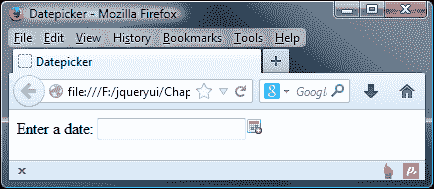

# 配置备选动画

datepicker 小部件带有一个吸引人的内置打开动画，使小部件看起来从零增长到全尺寸。其灵活的 API 还公开了与动画相关的几个选项。这些是`duration`、`showAnim`和`showOptions`配置选项。

我们可以设置的最简单的动画配置是小部件打开和关闭的速度。要做到这一点，我们所要做的就是更改`duration`选项的值。此选项需要一个简单的字符串，该字符串的值可以是`slow`、`normal`（默认值）或`fast`，也可以是表示持续时间（毫秒）的数字。

将`datePicker10.html`中的配置对象更改为：

```js
$("#date").datepicker({
 duration: "fast"
});
```

将此变体另存为`datePicker11.html`。在浏览器中运行此页面时，我们会发现打开动画的速度明显加快。

除了更改动画的速度外，我们还可以使用`showAnim`选项更改动画本身。使用的默认动画是一个简单的显示动画，但我们可以对此进行更改，使其使用库中包含的任何其他显示/隐藏效果（请参阅[第 14 章](14.html "Chapter 14. UI Effects")、*UI 效果*。将配置对象从上一示例更改为以下内容：

```js
$("#date").datepicker({
 showAnim: "drop",
 showOptions: {direction: "up"}
});
```

另存为`datePicker12.html`。我们还需要使用两种新的`<script>`资源来使用替代效果。这些是`jquery.ui.effect.js`和我们希望使用的效果的源文件，在本例中为`jquery.ui.effect-drop.js`。我们将在[第 14 章](14.html "Chapter 14. UI Effects")、*UI 效果*中更详细地介绍这两种效果，但它们对于本示例的运行至关重要。确保将以下内容直接添加到文件中，即日期选择器的源文件之后：

```js
<script src="development-bundle/ui/jquery.ui.datepicker.js">
</script>
<script src="development-bundle/ui/jquery.ui.effect.js"></script>
<script src="development-bundle/ui/jquery.ui.effect-drop.js"></script>

```

我们的简单配置对象使用`showAnim`选项将动画配置为拖放，并使用`showOptions`设置效果的`direction`选项，这是日期选择器绝对定位所必需的。当您现在运行这个示例时，日期选择器应该下降到位置，而不是打开。其他效果也可以以相同的方式实现。

## 显示多个月

到目前为止，我们所有的例子都关注单月日期选择器，一次只显示一个月。但是，如果我们希望使用两个配置选项，我们可以轻松地调整它以显示不同的月份数。删除`datePicker12.html`中配置对象之前的效果源文件，并更改配置对象，使其显示如下：

```js
$("#date").datepicker({
  numberOfMonths: 3
});
```

另存为`datePicker13.html`。`numberOfMonths`选项采用一个整数，表示我们希望在任何时候在小部件中显示的月份数。我们的日期选择器现在应该是这样的：

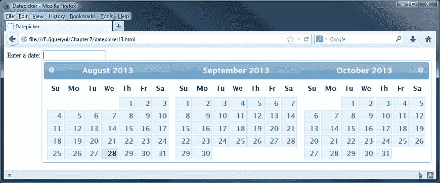

### 注

显示的月数没有上限；但是，小部件的性能会随着显示的每个月的增加而降低。在聚焦`<input>`和显示的小部件之间也有明显的延迟。

此外，各个月份面板并排浮动，由于其大小，它们很快将溢出视口，导致出现水平滚动条。但是，一旦使用滚动条，日期选择器就会关闭，使得超出屏幕边界的任何月份都无法使用。出于这些原因，最好将显示的月数保持在最低限度。

还有几个与多个月日期选择器相关的其他配置选项。`stepMonths`选项控制使用上一个或下一个链接时更改的月份数。

`stepMonths`的默认值是`1`，因此在我们前面的示例中，小部件首先显示当前月份，然后再显示两个月。每次点击**上一个**或**下一个**图标时；面板向左或向右移动一个空间。

如果我们将`stepMonths`设置为`3`，与显示的月数相同，每个月在单击上一个或下一个链接时会向左或向右移动三个空格，因此每次单击都会显示全新的面板。

`showCurrentAtPos`选项指定显示日期选择器时显示当前月份的位置。在前面的示例中，当前月份显示为第一个月面板。每个月面板都有一个以零为基础的索引号，所以如果我们希望当前月份处于小部件的中间，我们将把这个选项设置为 OutT1。

## 垂直显示日期选择器

在上一个示例中，指出，多个月的使用应保持在最低限度，因为如果日历过右，我们无法更改宽度的样式。

通过调整`numberofMonths`选项，我们可以在一定程度上缓解这种情况。它有两个属性：第一个是控制我们显示的月数，第二个是应该使用的列数。如果我们相应地从`datepicker13.html`中设置示例，那么当设置为在一列中显示两个月时，它会是这样的：

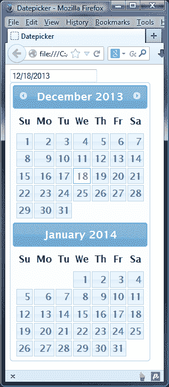

为了达到这个效果，我们只需将`datepicker13.html`中的配置对象修改如下：

```js
$("#date").datepicker({
 numberOfMonths: [2, 1]
});
```

您将看到 datepicker 现在只显示两个日历月，并且现在是垂直格式。然后我们可以使用一点 jQuery 来获取窗口的大小，并根据返回的大小设置`numberOfMonths`属性：

```js
function responsive(){
  var winWidth = $(window).width();
   if((winWidth < 991)&&(winWidth >= 768)) { 
    // tablet
    $("#date").datepicker("option", "numberOfMonths", [ 2, 1 ]);
  } else {
    //desktop
    $("#date").datepicker("option", "numberOfMonths", 2 );
  }
}
```

### 注

使用 CSS 手动实现同样的效果是不可能的；虽然大多数样式都可以更改，但容器宽度是硬编码到库中的，不能更改。

## 更改日期格式

`dateFormat`选项是我们为高级日期选择器区域设置配置提供的本地化选项之一。通过设置此选项，您可以使用各种速记参考快速轻松地设置所选日期的格式（如`<input>`中所示）。日期的格式可以是以下任意字符的组合（区分大小写）：

*   **d**：这是一个月的哪一天（如适用，为个位数）
*   **dd**：这是月份的第几天（两位数）
*   **m**：这是一年中的月份（适用时为个位数）
*   **mm**：这是一年中的月份（两位数）
*   **y**：这是年份（两位数）
*   **yy**：这是年份（四位数）
*   **D**：这是短日名称
*   **DD**：这是全天的名字
*   **M**：这是短月名
*   **MM**：这是长月份的名称
*   **“…”**：这是任何文本字符串
*   **@**：这是 UNIX 时间戳（自 1970 年 1 月 1 日起的毫秒）

我们可以使用这些速记代码快速配置首选的日期格式，如下例所示。将`datePicker13.html`中的配置对象更改为：

```js
$("#date").datepicker({
 dateFormat:"d MM yy"
});
```

将新文件另存为`datePicker14.html`。我们使用`dateFormat`选项为首选日期格式指定一个包含速记日期代码的字符串。我们设置的格式为月份的日期（如有可能，使用一位数字）加上`d`，月份的全名加上`MM`，四位数字年份加上`yy`。

当选择日期并将其添加到相关的`<input>`时，它们将采用配置对象中指定的格式，如以下屏幕截图所示：

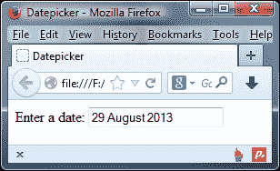

当使用字符串作为这个选项的值来配置日期时，我们还可以指定整个文本字符串。但是，如果我们这样做，并且字符串中的任何字母都是用作速记的字母，则需要使用单引号对它们进行转义。

例如，要将字符串`Selected:`添加到日期的开头，我们需要使用字符串`Selecte'd':`以避免将小写的`d`选作月份的短日格式：

```js
$("#date").datepicker({
 dateFormat:"Selecte'd': d MM yy"
});
```

将此更改另存为`datePicker15.html`。请注意，我们是如何通过将字符串`Selected`中的小写字母`d`用单引号括起来的。现在，当选择日期时，我们的文本字符串将作为格式化日期的前缀：

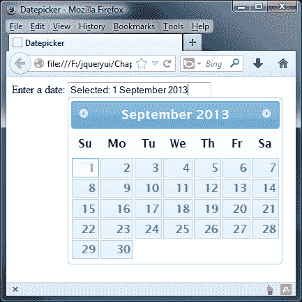

### 提示

**设置<输入>标签**的样式

您可能需要添加`width: 15em`作为输入框的样式，以便可以清楚地看到整个文本。我已将其添加到本书随附的下载中提供的代码文件中。

还有许多内置的预配置日期格式，与通用标准或 RFC 注释相对应。这些格式作为常量添加到组件中，可以通过`$.datepicker`对象访问。作为一个示例，让我们根据 ATOM 标准格式化日期：

```js
$("#date").datepicker({
 dateFormat: $.datepicker.ATOM
});
```

另存为`datePicker16.html`。在本例中选择日期时，`<input>`中输入的值应采用如下屏幕截图所示的格式：

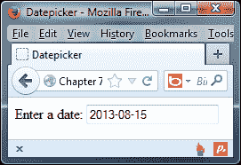

### 注

ATOM 格式或技术上已知的 RFC 3339/ISO 8601 是一种国际标准，旨在为日期和时间提供清晰的格式，以避免误解，尤其是在使用不同日期格式的国家之间传输数据时。

下表列出了一整套预定义的日期格式：

<colgroup><col style="text-align: left"> <col style="text-align: left"> <col style="text-align: left"></colgroup> 
| 

期权价值

 | 

速记

 | 

格式为…

 |
| --- | --- | --- |
| `$.datepicker.ATOM` | `"yy-mm-dd"` | **2013-07-25** |
| `$.datepicker.COOKIE` | `"D, dd M y"` | **2013 年 7 月 25 日星期三** |
| `$.datepicker.ISO_8601` | `"yy-mm-dd"` | **2013-07-25** |
| `$.datepicker.RFC_822` | `"D, d M y"` | **7 月 25 日星期三 11** |
| `$.datepicker.RFC_850` | `"DD, dd-M-y"` | **2011 年 7 月 25 日，星期三** |
| `$.datepicker.RFC_1036` | `"D, d M y"` | **7 月 25 日星期三 11** |
| `$.datepicker.RFC_1123` | `"D, d M yy"` | **2013 年 7 月 25 日星期三** |
| `$.datepicker.RFC_2822` | `"D, d M yy"` | **2013 年 7 月 25 日星期三** |
| `$.datepicker.RSS` | `"D, d M y"` | **周三，7 月 25 日 13** |
| `$.datepicker.TIMESTAMP` | `@ (UNIX timestamp)` | **1302649200000** |
| `$.datepicker.W3C` | `"yy-mm-dd"` | **2013-07-25** |

# 更新额外的输入元素

有时我们可能想用选择的日期更新两个`<input>`元素，也许是为了显示不同的日期格式。`altField`和`altFormat`选项可用于满足此要求。在`datepicker16.html`页面中添加第二个`<input>`元素，其`id`属性为`dateAltDisplay`，然后将配置对象更改为以下内容：

```js
$("#date").datepicker({
 altField: "#dateAltDisplay",
 altFormat: $.datepicker.TIMESTAMP
});
```

另存为`datePicker17.html`。`altField`选项接受标准 jQuery 选择器作为其值，并允许我们选择在更新主`<input>`时更新的附加`<input>`元素。`altFormat`选项可以接受与`dateFormat`选项相同的格式。以下屏幕截图显示了使用日期选择器选择日期后页面的显示方式：

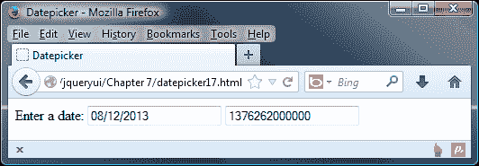

# 更改日期格式

在使用 datepicker 小部件时，您可能已经注意到通过`getDate`方法以编程方式返回的日期（请参见*日期拾取方法*部分）是默认的 GMT 日期和时间标准。为了更改 API 返回的日期格式，应使用`$.datepicker.formatDate()`实用方法。让我们来看看我们如何使用这个函数。

在`datePicker17.html`中，修改日期配置对象如下：

```js
      $("#date").datepicker({
 dateFormat: 'yy-mm-dd',
 onSelect: function(dateText, inst) {
 var d = new Date(dateText);
 var fmt2 = $.datepicker.formatDate("DD, d MM, yy", d);
 $("#selecteddate").html("Selected date: " + fmt2);
 }
      });
```

另存为`datePicker18.html`。我们需要添加一个额外的 CSS 样式规则，以便我们可以看到在小部件中选择日期的结果。将以下内容添加到我们文件的`<head>`中：

```js
<style type="text/css"> 
  #selecteddate { margin-top: 250px; } 
</style>
```

如果我们在浏览器中预览结果，您将看到初始`<input>`字段中使用的日期格式是使用配置对象中的`dateFormat`属性设置的；这被设置为`dd-mm-yy`。在`onSelect`事件处理程序中，我们使用`$.datepicker.formatDate`将所选日期更改为如下屏幕截图所示的日期：

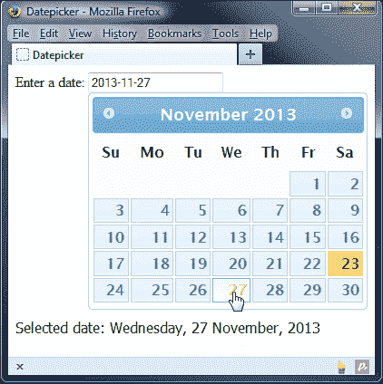

## 本地化日期选择器小部件

除了已经列出的选项外，还有一系列本地化选项。它们可用于提供自定义区域设置支持，以便显示日期选择器以及以其他语言显示的所有文本，或更改英语单词的默认值。

下表列出了专门用于本地化的选项：

<colgroup><col style="text-align: left"> <col style="text-align: left"> <col style="text-align: left"></colgroup> 
| 

选项

 | 

违约

 | 

用法

 |
| --- | --- | --- |
| `closeText` | `"Close"` | 文本显示在关闭按钮上。 |
| `currentText` | `"Today"` | 显示的当前日期链接的文本。 |
| `dateFormat` | `"mm/dd/yy"` | 添加到`<input>`时，所选日期应采用格式。 |
| `dayNames` | `["Sunday", "Monday","Tuesday",``"Wednesday", "Thursday", "Friday","Saturday"]` | 一周中天数的名称数组。 |
| `dayNamesMin` | `["Su", "Mo", "Tu","We", "Th", "Fr", "Sa"]` | 一周中的两个字母名称的数组。 |
| `dayNamesShort` | `["Sun", "Mon", "Tue", "Wed", "Thu", "Fri", "Sat"]` | 一周中天数的缩写名称数组。 |
| `firstDay` | `0` | 在日期选择器中指定天的第一列。 |
| `isRTL` | `false` | 将日历设置为从右向左格式。 |
| `monthNames` | `["January", "February",``"March", "April",``"May", "June", "July,``"August", "September",``"October", "November",``"December"]` | 月份名称的数组。 |
| `monthNamesShort` | `["Jan", "Feb", "Mar",``"Apr", "May", "Jun",``"Jul", "Aug", "Sep",``"Oct", "Nov", "Dec"]` | 缩写月份名称的数组。 |
| `nextText` | `"Next"` | 在下一个链接上显示到的文本。 |
| `prevText` | `"Prev"` | 要在上一个链接上显示的文本。 |
| `showMonthAfterYear` | `false` | 在小部件的标题中显示年后的个月。 |
| `yearSuffix` | `""` | 一个额外的文本字符串显示在月份标题中的年份之后。 |

已经提供了各种不同的翻译，并存放在`development-bundle/ui`目录的`i18n`文件夹中。每种语言的翻译都有自己的源文件，要更改默认语言，我们所要做的就是包含另一种语言的源文件。

在`datePicker17.html`中，直接在`jquery.ui.datepicker.js`链接后添加以下新的`<script>`元素：

```js
<script src="development-bundle/ui/i18n/jquery.ui.datepicker-fr.js">
</script>
```

删除配置对象的`altField`和`altFormat`属性：

```js
$("#date").datepicker();
```

另存为`datePicker19.html`并在浏览器中查看结果：

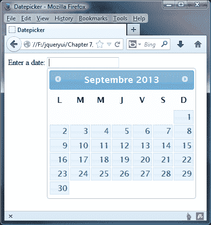

只需一个指向一个新资源的链接，我们就可以将 datepicker 中的所有可见文本更改为另一种语言，甚至不需要设置任何配置选项。如果我们想真正实现 datepicker 的国际化，甚至有一个包含我们可以使用的所有可选语言的汇总文件，这避免了需要包含多个语言文件。

在`datepicker19.html`中，将`<head>`中`jquery.ui.datepicker-fr.js`的链接更改为以下代码：

```js
<script src="development-bundle/ui/i18n/jquery-ui-i18n.js">
</script>
```

接下来，更改 datepicker 的配置对象，如下所示：

```js
$(document).ready(function($){
  $("#date").datepicker();
  $("#date").datepicker("option", $.datepicker.regional["ar"]); 
});
```

将文件另存为`datepicker20.html`。如果我们在浏览器中预览结果，您将看到它以阿拉伯语显示小部件。我们已经使用 datepicker 的 option 属性将`$.datepicker.regional`设置为`ar`，这是 jQuery UI 的阿拉伯语代码：

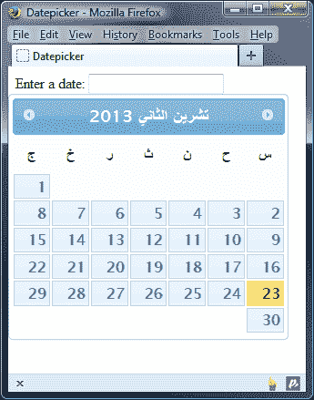

在本章后面的*动态本地化日期选择器*示例中，我们将重新讨论本地化汇总文件。

## 实施定制本地化

自定义本地化也非常易于实现。这可以使用标准的配置对象完成，该对象包含上表中选项的配置值。通过这种方式，可以实现未包括在汇总文件中的任何替代语言。

例如，要实现一个`Lolcat`日期选择器，删除`datePicker20.html`的现有配置对象，并添加以下代码：

```js
$("#date").datepicker({
  closeText: "Kthxbai",
  currentText: "Todai",
  nextText: "Fwd",
  prevText: "Bak",
  monthNames: ["January", "February", "March", "April", "Mai", "Jun", "July", "August", "Septembr", "Octobr", "Novembr", "Decembr"],
  monthNamesShort: ["Jan", "Feb", "Mar", "Apr", "Mai", "Jun", "Jul", "Aug", "Sep", "Oct", "Nov", "Dec"],
  dayNames: ["Sundai", "Mondai", "Tuesdai", "Wednesdai", "Thursdai", "Fridai", "Katurdai"],
  dayNamesShort: ["Sun", "Mon", "Tue", "Wed", "Thu", "Fri", "Kat"],
  dayNamesMin: ["Su", "Mo", "Tu", "We", "Th", "Fr", "Ka"],
  dateFormat: 'dd/mm/yy',
  firstDay: 1,
  isRTL: false,
  showButtonPanel: true
});
```

将此更改另存为`datePicker21.html`。大多数选项用于提供简单的字符串替换。但是，`monthNames`、`monthNamesShort`、`dayNames`、`dayNamesShort`和`dayNamesMin`选项需要阵列。

请注意，`dayNamesMin`选项和其他与日相关的数组应以`Sunday`开头（或本地化的等效数组）；在这里，我们使用`firstDay`选项将`Monday`设置为在本例中首先出现。我们的日期选择器现在应该如下所示：

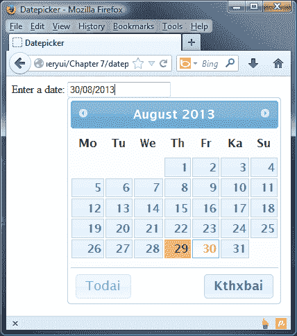

### 注

对于那些对 Lolcat 这个词感到好奇的人来说，这个词可以追溯到 2006 年，但它是基于二十世纪初创作的一系列图像。它被用来表示一系列猫的形象，这些形象有（尽管语法上不正确或特殊）的短语，旨在创造幽默。你可以在[了解更多关于这种独特幽默形式的信息 http://en.wikipedia.org/wiki/Lolcat](http://en.wikipedia.org/wiki/Lolcat) 。

## 实现回调

最后一组配置选项与小部件公开的事件模型相关。它由一系列回调函数组成，我们可以使用这些函数指定与日期选择器交互期间在不同点执行的代码。

下表列出了这些问题：

<colgroup><col style="text-align: left"> <col style="text-align: left"></colgroup> 
| 

事件

 | 

当…

 |
| --- | --- |
| `beforeShow` | 日期选择器即将打开。 |
| `beforeShowDay` | 每个单独的日期都在日期选择器中呈现。可用于确定是否应选择日期。 |
| `onChangeMonthYear` | 当前月或年发生变化。 |
| `onClose` | 日期选择器已关闭。 |
| `onSelect` | 选择了一个日期。 |

为了突出显示这些回调属性的有用性，我们可以扩展前面的国际化示例，创建一个页面，允许访问者选择在`i18n`汇总文件中找到的任何可用语言。

## 通过 rollup 动态定位日期选择器

在本书前面，我们简要介绍了如何使用汇总文件更改日期选择器显示的语言。这避免了需要引用多个语言文件，这有助于减少对服务器的 HTTP 请求；但缺点是 datepicker 小部件总是以硬编码到小部件属性中的语言显示。

但我们可以改变这一点。让我们来看看如何通过添加一个语言选择下拉菜单来使用 EnthT0.Enter 回调，它显示了选择哪个语言的 DeaPekEnter。

在`datePicker21.html`中，使用以下`<option>`元素向页面添加以下新的`<select>`框。为了简洁起见，我在这里只介绍了几个；您可以在本书附带的代码下载中看到完整列表：

```js
<select id="language">
<option id="en-GB">English</option>
<option id="ar">Arabic</option>
<option id="ar-DZ">Algerian Arabic</option>
<option id="az">Azerbaijani</option>
<option id="bg">Bulgarian</option>
<option id="bs">Bosnian</option>
<option id="ca">Catalan</option>
<option id="cs">Czech</option>
...
<option id="en-NZ">English/New Zealand</option>
<option id="en-US">English/United States</option>
<option id="eo">Esperanto</option>
<option id="es">Spanish</option>
<option id="et">Estonian</option>
<option id="zh-HK">Chinese</option>
<option id="zh-TW">Taiwanese</option>
</select>
```

接下来，链接到`i18n.js`汇总文件，如下所示：

```js
<script src="development-bundle/ui/i18n/jquery-ui-i18n.js">
</script>
```

现在更改最后一个`<script>`元素，使其显示如下：

```js
<script>  
  $(document).ready(function($){
 $("#date").datepicker({
 beforeShow: function() {
 var lang = $(":selected", $("#language")).attr("id");
 $.datepicker.setDefaults($.datepicker.regional[lang]);
 }
 });
 $.datepicker.setDefaults($.datepicker.regional['']);
  });
</script>
```

将此文件另存为`datePicker22.html`。我们使用`beforeShow`回调来指定每次在屏幕上显示日期选择器时执行的函数。

在此函数中，我们获取所选`<option>`元素的`id`属性，然后将其传递给`$.datepicker.regional`选项。使用`$.datepicker.setDefaults()`工具方法设置此选项。

当页面第一次加载时，`<select>`元素将没有选择的`<option>`子元素，并且由于`i18n`汇总文件的顺序，日期选择器将被设置为 Taiwan。为了将其设置为默认英语，我们可以在初始化日期选择器后将区域工具设置为空字符串。

以下屏幕截图显示了在`<select>`元素中选择替代语言后的日期选择器：

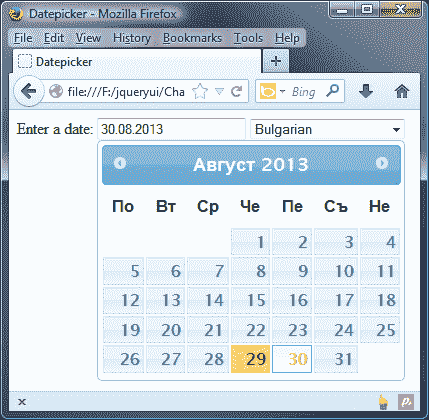

我们可以更进一步,；您可能已经注意到，在您单击`<input>`字段以显示小部件之前，语言不会改变。

代码可以工作，但感觉有点笨拙；相反，如果我们改变了小部件的显示方式，我们就不需要在`<input>`字段中单击。我已经在代码下载中包含了一个如何实现这一点的示例，如`datepickerXX.html`。

# 介绍实用方法

在前面的示例中，我们使用了日期选择器中可用的实用工具方法之一，`setDefaults`用于在所有日期选择器实例上设置配置选项。除此之外，我们还可以使用其他几种实用方法；如下表所示：

<colgroup><col style="text-align: left"> <col style="text-align: left"></colgroup> 
| 

公用事业

 | 

过去…

 |
| --- | --- |
| `formatDate` | 将`date`对象转换为指定格式的字符串。使用`dateFormat`选项时，使用`formatDate`方法以指定格式返回日期。此方法接受三个参数：要将日期转换为的格式（请参见选择器的可配置选项中的`dateFormat`）、要转换的`date`对象以及包含其他设置的可选配置对象。可以提供以下选项：`dayNamesShort`、`dayNames`、`monthNamesShort`和`monthNames`。 |
| `iso8601Week` | 根据 ISO8601 日期和时间标准返回指定日期所在的周数。此方法接受一个参数 date 来显示周数。 |
| `noWeekends` | 使周末日期不可选择。它可以传递给`beforeShowDay`事件。 |
| `parseDate` | 执行与`formatDate`相反的操作，将格式化日期字符串转换为日期对象。它还接受三个参数：要分析的日期的预期格式、要分析的日期字符串，以及包含以下选项的可选设置对象：`shortYearCutoff`、`dayNamesShort`、`dayNames`、`monthNamesShort`和`monthNames`。 |
| `regional` | 设置日期选择器的语言。 |
| `setDefaults` | 在所有日期选择器上设置配置选项。此方法接受包含新配置选项的对象文本。 |

所有这些方法都在`$.datepicker`管理器对象的单例实例上调用，该对象在初始化时由小部件自动创建，并用于与 datepicker 的实例交互。无论页面上创建了多少个作为 jQuery 对象的日期选择器，它们都将始终引用在该页面上创建的日期选择器小部件的第一个实例的属性和方法。

# 列出日期选择器方法

除了可供我们使用的大量配置选项之外，还定义了许多有用的方法，使使用日期选择器变得轻而易举。

除了[第一章](01.html "Chapter 1. Introducing jQuery UI")中讨论的共享 API 方法外，*还引入了 jQuery UI*，如`destroy`、`disable`、`enable`、`option`、`widget`等。datepicker API 还公开了以下独特的方法：

<colgroup><col style="text-align: left"> <col style="text-align: left"></colgroup> 
| 

方法

 | 

过去…

 |
| --- | --- |
| `dialog` | 在对话框小部件中打开日期选择器。 |
| `getDate` | 获取当前选择的日期。 |
| `hide` | 以编程方式关闭日期选择器。 |
| `isDisabled` | 确定日期选择器是否已禁用。 |
| `refresh` | 重新绘制日期选择器。 |
| `setDate` | 以编程方式选择一个日期。 |
| `show` | 以编程方式显示日期选择器。 |

让我们更详细地了解这些方法中的一些，从编程上选择日期开始。

## 以编程方式选择日期

有时（例如在动态客户端服务器站点上），我们希望能够从程序逻辑中设置特定日期，而无需访问者以常规方式使用 datepicker 小部件。让我们看一个基本的例子。

移除`datePicker22.html`中的`<select>`元素，并直接在`<input>`元素之后添加以下`<button>`：

```js
<button id="select">Select +7 Days</button>
```

现在更改最后一个`<script>`元素，使其如下所示：

```js
<script>  
  $(document).ready(function($){
 $("#date").datepicker();
 $("#select").click(function() {
 $("#date").datepicker("setDate", "+7");
 });
  });
</script>
```

另存为`datePicker23.html`。`setDate`函数接受一个参数，即要设置的日期。与`defaultDate`配置选项一样，我们可以提供一个相对字符串（如本例所示）或一个日期对象。

### 提示

您可以看到将日期对象设置为[的一些可用选项 http://api.jqueryui.com/datepicker/#utility-格式日期](http://api.jqueryui.com/datepicker/#utility-formatDate)。

如果我们被迫使用字符串作为 datepicker 的源，我们可以轻松地将它们转换为日期对象；为了实现这一点，我们可以使用许多可用的日期 JavaScript 库中的一个，例如`Moment.js`。我在本书附带的代码下载中包含了一个简单的示例，说明了如何使用这个库来生成日期对象。

## 在对话框中显示日期选择器

`dialog`方法产生相同的高可用性和有效的日期选择器小部件，但它显示在浮动对话框中。该方法易于使用，尽管它会影响 datepicker 对话框的位置；对话框将显示为与日期输入字段断开连接，我们将看到。

从页面中删除`<button>`并将`datePicker23.html`中的最终`<script>`元素更改为以下代码：

```js
<script>  
  $(document).ready(function($){
    function updateDate(date) {
      $("#date").val(date);
    }
    $("#date").focus(function() {
      $(this).datepicker("dialog", null, updateDate);
    });
  });
</script>
```

另存为`datePicker24.html`。首先我们定义一个名为`updateDate`的函数。只要在日期选择器中选择了日期，就会调用此函数。我们在这个函数中所做的就是指定所选的日期，该日期将自动传递给函数，并传递给页面上的`<input>`元素。

我们使用`focus`事件调用`dialog`方法，该方法包含两个参数。在本例中，我们提供了`null`作为第一个参数，因此日期选择器默认为当前日期。

第二个参数是选择日期时要执行的回调函数，它映射到我们的`updateDate`函数。

我们还可以提供额外的第三和第四个论点；第三个是日期选择器的配置对象，第四个用于控制包含日期选择器的对话框的位置。默认情况下，它将在屏幕中央呈现对话框。

### 提示

您可以在[了解如何配置这些选项的更多信息 http://api.jqueryui.com/datepicker/#method-对话](http://api.jqueryui.com/datepicker/#method-dialog)。

# 实现一个支持 AJAX 的日期选择器

对于最后一个日期选择器示例，我们将在混合中使用一些魔法，并创建一个日期选择器，它将与远程服务器通信，以查看是否存在无法选择的日期。然后，这些日期将在 datepicker 小部件中设置为这样的样式。

更改`datepicker24.html`的`<body>`，使其包含以下标记：

```js
<div id="bookingForm" class="ui-widget ui-corner-all">
  <div class="ui-widget-header ui-corner-top">
    <h2>Booking Form</h2>
  </div>
  <div class="ui-widget-content ui-corner-bottom">
    <label for "date">Appointment date:</label>
    <input id="date">
  </div>
</div>
<script>  
  $(document).ready(function($){
    var months = [], days = [], x; 
    $.getJSON("http://www.danwellman.co.uk/bookedDates.php?
     jsoncallback=?", function(data) {
      for (x = 0; x < data.dates.length; x++) {
        months.push(data.dates[x].month);
        days.push(data.dates[x].day);
      }
    });

    function disableDates(date) { 
      for (x = 0; x < days.length; x++) {
        if (date.getMonth() == months[x] - 1 && date.getDate() == days[x]) {
          return [false, "preBooked"];
        }
      }
      return [true, ""];
    }

    function noWeekendsOrDates(date) {
      var noWeekend = jQuery.datepicker.noWeekends(date);
      return noWeekend[0] ? disableDates(date) : noWeekend;
    }

    $("#date").datepicker({
      beforeShowDay: noWeekendsOrDates,
      minDate: "+1"
    });
  });
</script>
```

脚本的第一部分首先声明两个空数组，然后执行一个请求，从 PHP 文件中获取 JSON 对象。JSON 对象包含一个名为 dates 的选项。此选项的值是一个数组，其中每个项也是一个对象。

这些子对象中的每一个子对象都包含月和日属性，表示一个不可选择的日期。月份或天数数组由 JSON 对象中的值填充，以供以后在脚本中使用。

接下来，我们定义在`beforeShowDay`事件上调用的`noWeekendsOrDates`回调函数。此事件对 datepicker 中的 35 个单日方块中的每个方块都发生一次。即使是空方块也包括在内！

每天广场的日期传递给该函数，该函数必须首先使用 jQuery UI 的`$.datepicker.noWeekends()`函数确定所选日期是否不是周末。如果是，则自动传递给`disableDates`功能，否则标记为禁用。

如果将值传递给`disableDates`函数，则会传递`noWeekendsOrDates`函数发送给它的每个方块的日期，并且必须返回一个最多包含两个项目的数组。

第一个是一个布尔值，指示日期是否可选择，第二个是可选的类名，用于给出日期。我们的函数循环遍历月和日数组中的每个项，以查看传递给回调函数的日期是否与数组中的项匹配。如果月和日项目都匹配日期，则数组返回的项目为`false`和自定义类名。如果日期不匹配，我们返回一个包含`true`的数组，表示日期是可选的。这允许我们指定日期选择器中无法选择的任何日期数。

最后，我们为 datepicker 定义一个配置对象。对象的属性只是使 JSON 对象中指定的日期不可选择的回调函数，以及`minDate`选项，该选项将设置为相对值`+1`，因为我们不希望人们选择过去或当前的日期。

除了 HTML 页面，我们还需要一点自定义样式。在编辑器的新页面中，创建以下样式表：

```js
#date { width: 302px; }
#bookingForm { width: 503px; }
#bookingForm h2 { margin-left: 20px; }
#bookingForm .ui-widget-content { padding: 20px 0; border-top:  none; }
label { margin: 4px 20px 0; font-family: Verdana; font-size: 80%;
float: left; }
.ui-datepicker .preBooked span { color: #ffffff;
background: url(../img/red_horizon.gif) no-repeat; }
```

将此保存为`css`文件夹中的`datepickerTheme.css`。我们使用 PHP 提供 JSON 对象以响应页面发出的请求。如果不想在 web 服务器上安装和配置 PHP，可以使用我在示例中指定的 URL 处放置的文件。对于任何感兴趣的人，使用的 PHP 如下所示：

```js
<?php
  header('Content-type: application/json');
  $dates = "({
    'dates':[
      {'month':12,'day':2},
      {'month':12,'day':3},
      etc...
    ] 
  })";
  $response = $_GET["jsoncallback"] . $dates;
  echo $response;
?>
```

可保存为`jqueryui`项目主文件夹中的`bookedDates.php`。

预先预订的日期只是硬编码到 PHP 文件中。同样，在适当的实现中，您可能需要一种更健壮的方式来存储这些日期，例如在数据库中。

当我们在浏览器中运行页面并打开 datepicker 时，PHP 文件指定的日期应该根据我们的`preBooked`类进行样式设置，并且应该是完全无响应的，如以下截图中的所示：

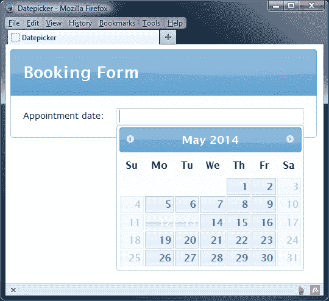

# 总结

在本章中，我们研究了 jQueryUI 库中最大的 API 之一所支持的 datepicker 小部件。这为我们提供了大量可供使用的选项和从中接收数据的方法。我们首先研究了默认实现以及有多少行为自动添加到小部件中。

我们查看了 datepicker 公开的富 API，它比任何其他组件都包含更多的可配置选项。我们还了解了如何使用 datepicker manager 对象特有的工具函数。

我们看到了小部件使实现国际化变得多么容易。我们还看到，小部件还被翻译成了 34 种其他语言。其中每一个都打包到一个模块中，该模块易于与 datepicker 结合使用，以添加对替代语言的支持。我们还了解了如何创建自己的自定义语言配置。

我们讨论了 datepicker 交互期间触发的一些事件，并从代码中查看了可用于处理和控制 datepicker 的方法范围。

在下一章中，我们将看到库中最近添加的两个组件，按钮小部件和自动补全小部件。