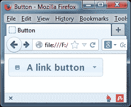

# 八、按钮和自动补全小部件

button 和 autocomplete 小部件是该库最新添加的两个小部件，随 1.8 版一起发布。

传统上，在所有浏览器和平台上一致地设置表单元素的样式是很困难的，而要混淆这一点，大多数浏览器和平台都会唯一地呈现表单控件。本章介绍的两个小部件都用于改进 web 上使用的一些传统表单元素。

button widget 允许我们从元素中创建具有视觉吸引力且高度可配置的按钮，包括`<button>`、`<input>`和`<a>`元素，这些元素可以使用 ThemeRoller 生成的主题进行样式化。支持的`<input>`元素类型包括`submit`、`radio`和`checkbox`。可以使用图标、按钮集和拆分按钮等附加功能进一步增强底层控件。

自动补全小部件附在标准文本`<input>`上，用于提供上下文选择菜单。当访问者开始键入`<input>`元素时，将显示与输入控件的字符相匹配的建议。

通过键盘输入完全可以访问 Autocomplete，允许使用箭头键浏览建议列表，使用**回车**键进行选择，并使用*Esc*键关闭菜单。当使用箭头键浏览建议列表时，在进行选择之前，每个建议都将添加到`<input`>元素中。如果在导航列表后使用*Esc*键关闭菜单，`<input>`元素的值将恢复为访问者输入的文本。

在本章中，我们将介绍以下主题：

*   标准按钮实现
*   可配置选项
*   添加图标
*   按钮事件
*   按钮组
*   按钮方法
*   使用具有自动补全功能的本地数据源
*   自动补全的可配置选项
*   自动补全事件
*   自动补全的独特方法
*   使用具有自动补全功能的远程数据源
*   在“自动补全建议”菜单中使用 HTML

# 介绍按钮小部件

按钮小部件用于为一系列元素和输入类型提供一致的、完全主题化的样式。小部件可以从几个不同的元素创建，小部件的结果 DOM 以及可以使用的功能将根据使用的元素略有不同。

一个标准的按钮小部件，由类型为`button`、`submit`或`reset`的`<button>`、`<a>`或`<input>`元素构建而成，如下所示：


## 执行标准按钮

由于按钮可以由几个不同的元素构建，因此我们可以使用底层代码的一些细微变化。当使用`<a>`创建按钮时，`<button>`或`<span>`元素将由小部件自动创建并嵌套在基础元素中。这个新的`<span>`将包含按钮的文本标签。

要创建链接按钮，请使用以下代码：

```js
<!DOCTYPE html>
<html>
<head>
  <meta charset="utf-8">
  <title>Button</title>
  <link rel="stylesheet" href="development-bundle/themes/redmond/jquery.ui.all.css">
  <script src="js/jquery-2.0.3.js"></script>
  <script src="development-bundle/ui/jquery.ui.core.js"></script>
  <script src="development-bundle/ui/jquery.ui.widget.js"></script>
  <script src="development-bundle/ui/jquery.ui.button.js"></script>
</head>
<body>
  <a href="some_other_page.html" id="myButton">A link button</a>
</body>
</html>
```

将此文件另存为`button1.html`。当使用`<a>`元素作为底层 HTML 时，创建按钮所需的脚本可以这么简单，应该添加在前面代码中最后一个`<script>`元素之后：

```js
<script>  
  $(document).ready(function($){
    $("#myButton").button();
  });
</script>  
```

在这种情况下，不会向生成的按钮添加任何特殊行为；`<a>`元素只会将访问者发送到锚的`href`属性中指定的新页面或锚。在本例中，小部件只是与我们可能在页面或站点中使用的其他 jqueryui 小部件保持一致。在浏览器中编译时，小部件会自动添加标记。如果您使用诸如 Firebug 之类的 DOM 检查器，您将看到`button1.html`的以下代码：

```js
<a href="some_other_page.html" id="myButton" class="ui-button ui-widget ui-state-default ui-corner-all ui-button-text-only" role="button" aria-disabled="false"><span class="ui-button-text">A link button</span></a>
```

按钮小部件需要以下库资源：

*   `jquery.ui.all.css`
*   `jquery-2.0.3.js`
*   `jquery.ui.core.js`
*   `jquery.ui.widget.js`
*   `jquery.ui.button.js`

### 使用<输入>或<按钮>标签创建按钮

我们不仅限于使用超链接创建按钮；按钮小部件也将与`<input>`或`<button>`标记一起使用。

当使用`<input>`时，必须设置元素的`type`属性，以便按钮的外观与从其他基础元素创建的其他按钮的外观相匹配。对于标准的单按钮小部件，`type`属性可以设置为`submit`、`reset`或`button`。

从`<button>`元素创建按钮与`button1.html`中使用的代码相同（除了我们没有向`<button>`标记添加`href`属性）：

```js
<button id="myButton">A &lt;button&gt; button</button>
```

从`<input>`元素创建按钮也非常类似，只是我们使用`value`属性设置按钮上的文本，而不是将文本内容添加到`<input>`标记：

```js
<input type="button" id="myButton" value="An &lt;input&gt; button">
```

## 主题化

与所有小部件一样，按钮中添加了各种各样的类名，这有助于其整体外观。当然，如果希望提供自定义样式，我们可以在自己的样式表中使用主题的类名来覆盖正在使用的主题的默认外观。ThemeRoller 通常仍是制作按钮主题的最佳工具。

## 探索可配置选项

按钮小部件具有以下配置选项：

<colgroup><col style="text-align: left"> <col style="text-align: left"> <col style="text-align: left"></colgroup> 
| 

选项

 | 

默认值

 | 

用法

 |
| --- | --- | --- |
| `disabled` | `false` | 禁用按钮实例。 |
| `icons` | `{primary: null, secondary: null}` | 设置按钮实例的图标。 |
| `label` | `The content of the underlying element or value attribute` | 设置按钮实例的文本。 |
| `text` | `true` | 使用仅图标实例时隐藏按钮的文本。 |

在我们的第一个示例中，`<a>`元素的文本内容被用作按钮的标签。我们可以使用`label`选项轻松覆盖此选项。更改`button1.html`中的最后一个`<script>`元素，使其显示为如下：

```js
<script>  
  $(document).ready(function($){
    $("#myButton").button({
      label: "A configured label"
    });
  });
</script>
```

将此文件另存为`button2.html`。正如我们所期望的，当我们在浏览器中运行此文件时，我们会看到 button 小部件中的`<span>`将配置的文本作为其标签，而不是`<a>`元素的文本内容。

## 添加按钮图标

我们可以很容易地配置我们的按钮，以便在大多数情况下它们最多有两个图标。每当`<a>`或`<button>`元素用作按钮的基础元素时，我们可以使用图标的配置选项指定一个或两个图标。

要查看图标的动作，请更改`button2.html`中的配置对象，使其显示如下：

```js
$("#myButton").button({
 icons: {
 primary: "ui-icon-disk",
 secondary: "ui-icon-triangle-1-s"
 }
});
```

将此文件另存为`button3.html`。`icons`属性接受一个最多有两个键的对象；`primary`和`secondary`。这些选项的值可以是在`jquery.ui.theme.css`文件中找到的任何`ui-icon-`类。我们设置的图标显示在以下屏幕截图中：



图标使用附加的`<span>`元素添加到小部件中，这些元素由小部件自动创建和插入。按钮文本左侧显示`primary`图标，文本右侧显示`secondary`图标。

要生成没有文本标签的图标按钮，请将`button3.html`中的配置对象更改为以下代码：

```js
$("#myButton").button({
  icons: {
    primary: "ui-icon-disk",
    secondary: "ui-icon-triangle-1-s"
  },
 text: false
});
```

将此文件另存为`button4.html`。当我们在浏览器中查看此变化时，我们看到按钮仅显示两个图标，如以下屏幕截图所示：


## 输入图标

由于子`<span>`元素用于显示指定的图标，因此当使用`<input>`元素作为按钮实例的基础标记时，我们不能使用图标。在使用`<input>`元素时，我们可以添加自己的图标，方法是添加额外的容器、所需的`<span>`元素和一些自定义 CSS。

更改`button4.html`的`<body>`，使其包含以下元素：

```js
<div class="iconic-input ui-button-text-icons ui-state-default  uicorner-all">
  <span class="ui-button-icon-primary ui-icon ui-icon-disk"></span>
  <input id="myButton" type="button" value="Input icons"class="ui-button-text">
  <span class="ui-button-icon-secondary ui-icon ui-icon-triangle-1-s"></span>
</div>
```

将此文件另存为`button5.html`。在本例中，我们还需要覆盖一些按钮的样式。创建一个新样式表，并向其中添加以下基本样式：

```js
.iconic-input { display: inline-block; position: relative; }
.ui-icon { z-index: 2; }
.iconic-input input { border: none; margin: 0; }
```

### 注

在旧版本的 Internet Explorer 中，`display: inline-block`样式将不适用。为了防止按钮占据其容器的整个宽度，我们需要将其浮动，或者显式设置宽度。

将此文件保存在`css`目录中为`buttonTheme.css`。不要忘记从页面的`<head>`元素链接到新样式表（在链接到标准 jQuery UI 样式表之后）：

```js
<link rel="stylesheet" href="css/buttonTheme.css">
```

从视觉上看，我们定制的基于`<input>`的小部件是完整的，但实际上并不完整；图标没有选择正确的悬停状态（原因是小部件已将所需的类名应用于基础`<input>`元素，而不是我们的自定义容器）。我们可以添加所需的行为，就像使用 jQuery 添加容器和`<span>`元素一样。更改最后一个`<script>`元素中的代码，使其显示如下：

```js
$(document).ready(function($){
 $("#myButton").button().hover(function() {
 $(this).parent().addClass("ui-state-hover");
 }, function() {
 $(this).parent().removeClass("ui-state-hover");
 });
});
```

现在，我们的按钮应该按预期工作。如前一个示例所示，尽管手动添加元素在技术上是可行的，但在大多数情况下，只需使用`<a>`或`<button>`元素，就可以更轻松、更高效地为`<input>`元素构建的按钮添加图标所需的样式和行为。

## 添加按钮事件

由`<a>`元素构建的按钮将按预期工作，无需我们进一步干预。浏览器将按照我们预期的方式简单地跟随`href`，前提是`<button>`或`<input>` 元素位于`<form>`元素内并设置了相关的类型属性。这些元素将以标准方式提交表单数据。

如果需要更现代的 AJAX 提交任何`<form>`数据，或者如果按钮要触发其他操作或流程，我们可以使用标准的 jQuery click 事件处理程序来响应被单击的按钮。

在下一个示例中，我们为按钮小部件使用以下底层标记：

```js
<button type="button" id="myButton">A button</button>
```

button 小部件公开单个事件，`create`事件，该事件在最初创建 button 实例时触发。我们可以使用此事件在每次创建按钮实例时运行其他代码。例如，如果我们希望按钮最初从视图中隐藏（以便稍后在发生其他事件后显示），我们可以使用`.css()`将`displa`y 属性设置为`none`。

将`button5.html`中的`document.ready()`代码替换为以下代码：

```js
$(document).ready(function($){
  $("#myButton").button({
    create: function() {
      $(this).css("display", "none")
    }
  });
});
```

将此文件另存为`button6.html`。在事件处理程序中，`$(this)`指的是按钮实例，它使用 jQuery 的`css()`方法从视图中隐藏。

为了使按钮实现其主要目的，即在单击时执行某些操作，我们应该手动为按钮附加一个处理程序。例如，我们可能想从访问者那里收集一些注册信息，并使用按钮将这些信息发送到服务器。

将`button6.html`中的`<button>`替换为以下代码：

```js
<form method="post" action="serverscript.php">
  <label for="name">Name:
    <input type="text" id="name" name="name">
  </label>
  <label for="email">Email:
    <input type="text" id="email" name="email">
  </label>
  <p>
    <input type="submit" id="myButton" value="Register" />
  </p>
</form>
```

将最终`<script>`元素更改为以下代码：

```js
<script>  
  $(document).ready(function($){
    var form = $("form"), formData = {
      name: form.find("#name").val(),
      email: form.find("#email").val()
    };

    $("#myButton").button();
    $("#myButton").click(function(e) {
      e.preventDefault();
      form.find("label").remove();
      $("#myButton").button("option", "disabled", true);

      $.post("register.php",$.post("register.php", formData, function() {
        $("<label />", { text: "Thanks for registering!"}).prependTo(form);
      });
    });
  });
</script>
```

将此文件另存为`button7.html`。下面的`<button>`元素现在是简单`<form>`的一部分，它只是为访问者、他们的姓名和电子邮件地址提供文本输入。在脚本中，我们首先初始化按钮小部件，然后创建`click`事件处理程序。这防止了浏览器的默认操作，即以传统的非 AJAX 方式发布表单。

然后，我们收集输入到字段中的名称和电子邮件地址，并使用 jQuery 的`post()`方法将数据异步发布到服务器。在请求的成功处理程序中，我们使用小部件的`option`方法禁用按钮，然后创建并显示感谢消息。

在本例中，我们对服务器端不感兴趣，也不包括任何验证（尽管后者应该包括在生产使用中），但您可以看到，使用标准 jQuery 功能对单击的按钮做出反应是多么容易。要查看该示例的工作情况，我们需要通过 web 服务器运行该页面，并且应该在与该页面相同的目录中添加请求中指定名称的 PHP 文件（在本示例中，该文件不需要包含任何内容）。以下屏幕截图显示了单击按钮后页面的显示方式：


## 创建按钮集

按钮小部件也可以与单选按钮和复选框结合使用。按钮组件在 jQueryUI 中是唯一的，因为它不是一个而是两个小部件方法。它有我们已经研究过的`button()`方法，还有`buttonset()`方法，用于基于单选按钮和复选框创建按钮组。

### 复选框按钮组

更改`button7.html`的`<body>`元素，使其包含以下代码：

```js
<div id="buttons">
  <h2>Programming Languages</h2>
  <p>Select all languages you know:</p>
  <label for="js">JavaScript</label>
  <input id="js" type="checkbox">
  <label for="py">Python</label>
  <input id="py" type="checkbox">
  <label for="cSharp">C#</label>
  <input id="cSharp" type="checkbox">
  <label for="jv">Java</label>
  <input id="jv" type="checkbox">
</div>
```

现在更改最后一个`<script>`元素，使其显示如下：

```js
$(document).ready(function($){
  $("#buttons").buttonset();
});
```

将此文件另存为`button8.html`。我们需要做的就是在`<label>`和`<input>`元素所在的容器上调用`buttonset()`方法。

当我们在浏览器中运行此文件时，我们看到复选框被隐藏在视图之外，`<label>`元素被转换为按钮，并在水平集中可视地分组，如以下屏幕截图所示：


虽然实际的复选框本身在按钮后面的视图中是隐藏的，但每当选择按钮时，基础复选框的`checked`属性都会更新，因此我们仍然可以轻松地从脚本中获取状态。

当点击复选框按钮时，小部件将对其应用选定状态，以便访问者可以轻松地看到它已被选中。正如我们所期望的，可以同时选择多个按钮。

从复选框中创建按钮时，我们需要遵守几个规则。在 HTML5 中，将表单控件嵌套在其相关的`<label>`元素中是很常见的（我们在前面的示例中这样做了），但在使用 button 小部件时，这是不允许的。需要将`for`属性与`<label>`元素一起使用。

### 单选按钮组

基于单选按钮的按钮在视觉上与基于复选框的按钮相同；他们只是在行为上有所不同。一次只能选择一个按钮，而使用复选框时可以选择多个按钮。

让我们在`button8.html`中看到这种行为的作用；将`<body>`中的元素更改为以下代码：

```js
<div id="buttons">
  <h2>Programming Languages</h2>
  <p>Select your most proficient languages:</p>
  <label for="js">JavaScript</label>
  <input id="js" type="radio" name="lang">
  <label for="py">Python</label>
  <input id="py" type="radio" name="lang">
  <label for="cSharp">C#</label>
  <input id="cSharp" type="radio" name="lang">
  <label for="jv">Java</label>
  <input id="jv" type="radio" name="lang">
</div>
```

将此文件另存为`button9.html`。初始化单选按钮的脚本是相同的：我们只需在容器上调用`buttonset()`方法。除了将`radio`指定为类型之外，与基础标记的唯一区别在于这些`<input>`元素必须设置`name`属性。

## 使用按钮方式工作

按钮小部件带有所有小部件通用的默认`destroy`、`disable`、`enable`、`widget`和`option`方法。除了这些方法之外，button 小部件还公开了一个自定义方法，即`refresh`方法。此方法用于更改复选框和单选按钮的状态（如果以编程方式更改）。通过结合前面的一些示例，我们可以看到此方法的实际应用。

更改`button8.html`的`<body>`，使其包含两个新的`<button>`元素，如下代码所示：

```js
<div id="buttons">
  <h2>Programming Languages</h2>
  <p>Select all languages you know:</p>
  <label for="js1">JavaScript</label>
  <input id="js1" type="checkbox">
  <label for="py1">Python</label>
  <input id="py1" type="checkbox">
  <label for="cSharp1">C#</label>
  <input id="cSharp1" type="checkbox">
  <label for="jv1">Java</label>
  <input id="jv1" type="checkbox">
</div>
<p>
 <button type="button" id="select">Select All</button>
 <button type="button" id="deselect">Deselect All</button>
</p>

```

在本例中，我们将还原为复选框，以便我们可以通过编程方式选择或取消选择它们作为一个组。现在更改最后一个`<script>`元素，使其显示如下：

```js
$("#buttons").buttonset();
function buttonSelected(buttonState){
 $("#buttons").find("input").prop("checked", buttonState);
 $("#buttons").buttonset("refresh"); 
}

$("#select").click(function() {
 buttonsSelected(true);
});

$("#deselect").button().click(function() {
 buttonsSelected(false);
});

```

将此文件另存为`button10.html`。如果我们在浏览器中预览结果，点击**全选**按钮即可看到效果，如下图所示：


在本例中，我们有一个**全选**按钮和一个**全选**按钮。当点击**全选**按钮时，我们将复选框的选中属性设置为`true`。这将选中基础（和隐藏）复选框，但不会对样式为显示为按钮的`<label>`元素做任何操作。为了更新这些按钮的状态，使其显示为选中状态，我们调用`refresh`方法。

**取消选择所有**按钮将`checked`属性设置为`false`，然后再次调用`refresh`方法，从每个按钮中删除所选状态。

# 介绍自动补全小部件

在 jQueryUI1.8 中重新引入的自动补全小部件又回来了，看起来比以往任何时候都好。这是我在库中最喜欢的小部件之一，尽管它还没有第一次出现时的全套行为，但它仍然提供了丰富的功能集来增强简单的文本输入，这些输入需要来自预定义范围的数据。

一个很好的例子是城市；您在页面上有一个标准`<input type="text">`，要求提供访客所在城市。当他们开始在`<input>`元素中输入时，将显示包含访问者输入的字母的所有城市。游客可以进入的城市范围是有限的，并且仅限于游客居住的国家（这由开发商假设，或者游客之前已经选择）。

以下屏幕截图显示了此小部件的显示方式：


与其他小部件一样，当小部件初始化时，以编程方式添加一系列元素和类名。

## 使用本地数据源

要使用本地数组作为数据源实现基本的自动补全，请在新文件中创建以下代码：

```js
<html>
  <head>
  <meta charset="utf-8">
  <title>Autocomplete</title>
    <link rel="stylesheet" href="development-bundle/themes/redmond/jquery.ui.all.css">
    <script src="js/jquery-2.0.3.js"></script>
    <script src="development-bundle/ui/jquery.ui.core.js"></script>
    <script src="development-bundle/ui/jquery.ui.widget.js"></script>
    <script src="development-bundle/ui/jquery.ui.position.js"></script>
    <script src="development-bundle/ui/jquery.ui.menu.js"></script>
    <script src="development-bundle/ui/jquery.ui.autocomplete.js"></script>
  </head>
  <body>
    <label>Enter your city:</label>
    <input id="city">
  </body>
</html>
```

我们在页面上只需要一个`text`类型的标准`<input>`元素。autocomplete 所需的初始化略大于其他组件所需的初始化；在自动补全源文件后添加以下`<script>`元素：

```js
<script>
  $(document).ready(function($){
    $("#city").autocomplete({ source: [ "Aberdeen", "Armagh", "Bangor", "Bath", "Canterbury", "Cardiff", "Derby", "Dundee", "Edinburgh", "Exeter", "Glasgow", "Gloucester", "Hereford", "Inverness", "Leeds", "London", "Manchester", "Norwich", "Newport", "Oxford", "Plymouth", "Preston", "Ripon", "Southampton", "Swansea", "Truro", "Wakefield", "Winchester", "York" ]});
  });
</script>
```

将此文件另存为`autocomplete1.html`。在自动补全的配置对象中，我们使用`source`选项指定字符串的本地数组。`source`选项是强制性的，必须定义。然后该对象被传递到`autocomplete`方法，该方法在自动补全要关联的城市`<input>`上被调用。

当我们在浏览器中运行此文件时，我们会发现，当我们开始在`<input>`元素中键入时，源数组中定义的城市列表（包含我们键入的字母）会显示在附在`<input>`的下拉菜单中。

自动补全小部件需要以下文件才能运行：

*   `jquery.ui.all.css`
*   `jquery-2.0.3.js`
*   `jquery.ui.core.js`
*   `jquery.ui.widget.js`
*   `jquery.ui.position.js`
*   `jquery.ui.menu.js`
*   `jquery.ui.autocomplete.js`

## 使用对象数组作为数据源

除了提供一个字符串数组外，我们还可以提供一个对象数组作为数据源，这使我们在选择菜单中的建议时，对添加到`<input>`中的文本具有更大的灵活性。更改`autocomplete1.html`中的配置对象，使其显示如下：

```js
$("#city").autocomplete({
  source: [
 { value: "AB", label: "Aberdeen" },
 { value: "AR", label: "Armagh" },
 { value: "BA", label: "Bangor" },
 { value: "BA", label: "Bath" },
 { value: "CA", label: "Canterbury" },
 { value: "CD", label: "Cardiff" },
 { value: "DE", label: "Derby" },
 { value: "DU", label: "Dundee" },
 { value: "ED", label: "Edinburgh" },
 { value: "EX", label: "Exeter" },
 { value: "GL", label: "Glasgow" },
 { value: "GO", label: "Gloucester" },
 { value: "HE", label: "Hereford" },
 { value: "IN", label: "Inverness" },
 { value: "LE", label: "Leeds" },
 { value: "LO", label: "London" },
 { value: "MA", label: "Manchester" },
 { value: "NO", label: "Norwich" },
 { value: "NE", label: "Newport" },
 { value: "OX", label: "Oxford" },
 { value: "PL", label: "Plymouth" },
 { value: "PR", label: "Preston" },
 { value: "RI", label: "Ripon" },
 { value: "SO", label: "Southampton" },
 { value: "SW", label: "Swansea" },
 { value: "TR", label: "Truro" },
 { value: "WA", label: "Wakefield" },
 { value: "WI", label: "Winchester" },
 { value: "YO", label: "York" }
  ]
});
```

将此文件另存为`autocomplete2.html`。数组中用作数据源的每个项现在都是一个对象，而不是一个简单的字符串。每个对象有两个键：`value`和`label`。`value`键的值是从列表中选择建议时添加到`<input>`元素的文本。`label`的值是建议列表中显示的值。也可以使用存储自定义数据的其他键。

如果数组中的每个对象仅包含一个属性，则该属性将同时用作`value`和`label`键。在这种情况下，我们也可以使用字符串数组而不是对象数组，但值得注意的是本地数据的替代格式。

# 可配置的自动补全选项

为了修改小部件的行为，可以设置以下选项：

<colgroup><col style="text-align: left"> <col style="text-align: left"> <col style="text-align: left"></colgroup> 
| 

选项

 | 

默认值

 | 

用法

 |
| --- | --- | --- |
| `appendTo` | `"body"` | 指定要将小部件附加到的元素。 |
| `autofocus` | `false` | 显示建议列表时，聚焦列表中的第一条建议。 |
| `delay` | `300` | 指定访客开始键入`<input>`后，小部件在显示建议列表之前应等待的毫秒数。 |
| `disabled` | `false` | 禁用小部件。 |
| `minLength` | `1` | 指定在显示建议列表之前，访客需要在`<input>`中输入的字符数。可设置为`0`使小部件显示菜单中的所有建议。 |
| `position` | `{ my: "left top", at: "left bottom", collision: "none" }` | 指定建议列表相对于`<input>`元素的位置。此选项的使用方式完全相同，并且接受与本书前面介绍的位置工具相同的值。 |
| `source` | `Array, String or Function` | 指定用于填写建议列表的数据来源。此选项是必需的，必须进行配置。它接受数组、字符串或函数作为其值。 |

## 配置最小长度

`minLength`选项允许我们指定在显示建议列表之前需要在相关`<input>`元素中键入的最小字符数。默认情况下，小部件显示的建议仅包含在`<input>`元素中键入的字母，而不仅仅是以输入的字母开头的字母，这可能导致显示的建议比需要的多得多。

将`minLength`选项设置为高于默认值`1`的数字有助于缩小建议列表，这在处理大型远程数据源时可能更为重要。

更改我们在`autocomplete1.html`中使用的配置对象（我们将暂时恢复使用字符串数组作为数据源，使其显示如下：

```js
$("#city").autocomplete({
  minLength: 2,
  source: [
    "Aberdeen", "Armagh", "Bangor", "Bath", "Canterbury",
    "Cardiff", "Derby", "Dundee", "Edinburgh", "Exeter","Glasgow", "Gloucester", "Hereford", "Inverness", "Leeds","London", "Manchester", "Norwich", "Newport", "Oxford", "Plymouth", "Preston", "Ripon", "Southampton", "Swansea", "Truro", "Wakefield", "Winchester", "York" 
  ]
});
```

将此文件另存为`autocomplete3.html`。当我们在浏览器中运行此文件时，我们会发现需要在`<input>`中键入两个字符，并且只显示按连续顺序包含字符的城市，这大大减少了建议的数量。

虽然在这个基本示例中的好处并不明显，但这可以大大减少远程数据源返回的数据。

## 将建议列表附加到备选元素

默认情况下，当使用自动补全小部件时，建议列表会附加到页面的`<body>`中。我们可以对此进行更改，并指定列表应添加到页面上的另一个元素中。然后，autocomplete 小部件使用`position`工具定位列表，使其看起来好像附加到与其关联的`<input>`元素。我们可以改变这一点，并通过使用`appendTo`选项指定列表应添加到页面上的另一个元素中。

将下面的`<label>`和`<input>`包装在`autocomplete3.html`中的`<div>`容器中：

```js
<div id="container">
  <label>Enter your city:</label>
  <input id="city">
</div>

```

然后将最后一个`<script>`元素中的配置对象更改为以下代码：

```js
$("#city").autocomplete({
 appendTo: "#container",
  source: [ "Aberdeen", "Armagh", "Bangor", "Bath", "Canterbury", "Cardiff", "Derby", "Dundee", "Edinburgh", "Exeter", "Glasgow", "Gloucester", "Hereford", "Inverness", "Leeds", "London", "Manchester", "Norwich", "Newport", "Oxford", "Plymouth", "Preston", "Ripon", "Southampton", "Swansea", "Truro", "Wakefield", "Winchester", "York" ]
});
```

将此文件另存为`autocomplete4.html`。通常，建议列表添加在代码的`<body>`元素的底部。`appendTo`选项接受 jQuery 选择器或实际的 DOM 元素作为其值。

在本例中，我们看到列表被附加到我们的`<div>`容器中，而不是`<body>`元素，我们可以使用 Firebug 或其他 DOM 资源管理器对其进行验证。

# 处理自动补全事件

自动补全小部件公开了一系列独特的事件，允许我们以编程方式对与之交互的小部件作出反应。这些事件列示如下：

<colgroup><col style="text-align: left"> <col style="text-align: left"></colgroup> 
| 

事件

 | 

当。。。

 |
| --- | --- |
| `change` | 已选择列表中的建议。一旦列表关闭且`<input>`失去焦点，就会触发此事件。 |
| `close` | 建议列表已关闭。 |
| `create` | 创建了一个小部件的实例。 |
| `focus` | 键盘用于聚焦列表中的建议。 |
| `open` | 显示建议菜单。 |
| `search` | 即将提出建议请求。 |
| `select` | 选择了列表中的建议。 |

当我们使用一组对象作为数据源，并且除了前面使用的`label`和`value`属性外，还有其他数据时，`select`事件非常有用。对于下一个示例，移除上一个示例中使用的`<div>`容器，然后更改配置对象，使其显示如下：

```js
$("#city").autocomplete({
  source: [
    { value: "AB", label: "Aberdeen", population: 212125 },
    { value: "AR", label: "Armagh", population: 54263 }, 
    { value: "BA", label: "Bangor", population: 21735 },
    { value: "BA", label: "Bath", population: 83992 },
    { value: "CA", label: "Canterbury", population: 43432 },
    { value: "CD", label: "Cardiff", population: 336200 },
    { value: "DE", label: "Derby", population: 233700 },
    { value: "DU", label: "Dundee", population: 152320 },
    { value: "ED", label: "Edinburgh", population: 448624 },
    { value: "EX", label: "Exeter", population: 118800 },
    { value: "GL", label: "Glasgow", population: 580690 },
    { value: "GO", label: "Gloucester", population: 123205 },
    { value: "HE", label: "Hereford", population: 55700 },
    { value: "IN", label: "Inverness", population: 56660 },
    { value: "LE", label: "Leeds", population: 443247 },
    { value: "LO", label: "London", population: 7200000 },
    { value: "MA", label: "Manchester", population: 483800 },
    { value: "NO", label: "Norwich", population: 259100 },
    { value: "NE", label: "Newport", population: 137011 },
    { value: "OX", label: "Oxford", population: 149300 },
    { value: "PL", label: "Plymouth", population: 256700 },
    { value: "PR", label: "Preston", population: 114300 },
    { value: "RI", label: "Ripon", population: 15922 },
    { value: "SO", label: "Southampton", population: 236700 },
    { value: "SW", label: "Swansea", population: 223301 },
    { value: "TR", label: "Truro", population: 17431 },
    { value: "WA", label: "Wakefield", population: 76886 },
    { value: "WI", label: "Winchester", population: 41420 },
    { value: "YO", label: "York", population: 182000 }
  ],
  select: function(e, ui) {
    if ($("#pop").length) {
      $("#pop").text(ui.item.label + "'s population is: " + ui.item.population);
    } else {
      $("<p></p>", {
        id: "pop",
        text: ui.item.label + "'s population is: " + ui.item.
          population
      }).insertAfter("#city");
    }
  }
});
```

将此文件另存为`autocomplete5.html`。我们为数组数据源中的每个对象添加了一个额外属性，即每个城市的人口。我们使用`select`事件获取标签和我们的额外属性，并在选择城市时将它们写入页面。

我们传递给`select`事件的事件处理程序接受`event`对象和所选数据源中的对象。`.length`测试用于确定页面上是否存在`pop`元素。如果有，我们只需用更新的语句替换其中的文本。如果没有，我们将创建一个新的`<p>`元素，其`id`为`pop`，并将其立即插入`city`输入字段之后。我们可以以标准方式访问对象中定义的任何属性。

选择城市后，页面应出现，如下图所示：


# 自动补全方法

除了所有小部件共享的标准方法之外，autocomplete 还为我们提供了两种独特的方法，允许我们启动某些操作。独特的方法如下所示：

<colgroup><col style="text-align: left"> <col style="text-align: left"></colgroup> 
| 

方法

 | 

用法

 |
| --- | --- |
| `close` | 关闭建议菜单。 |
| `search` | 从数据源请求建议列表，指定搜索词作为可选参数 |

`close`方法非常容易使用，我们只需调用`autocomplete`小部件方法并指定`close`作为参数：

```js
$("#associated_input").autocomplete("close");
```

这将导致建议菜单关闭，并触发`close`事件。关闭事件处理程序的一个可能用途是，如果用户选择的条目有问题，则向用户发出警告；如果它与预定义列表中的条目不匹配，则可以将其标记给用户。

`search`方法稍微复杂一些，因为它可以接受额外的参数，尽管这不是强制性的。如果调用搜索方法时未传递参数（这可能是默认行为），则相关的`<input>`元素的值将用作搜索项。或者，该术语可以作为参数提供给该方法。

## 使用远程数据源

到目前为止，在这个例子中，我们使用了一个相当小的本地数据数组。当使用远程数据源时，autocomplete 小部件真正发挥了作用，这是在数据源较大时使用小部件的推荐方式。

### 基于输入检索内容

在下一个示例中，我们将使用 web 服务检索国家列表，而不是使用本地数组。更改`autocomplete5.html`中的`<input>`元素，使其显示如下：

```js
<label>Enter your country:</label>
<input id="country">
```

然后更改最后的`<script>`元素，使配置对象定义如下：

```js
$("#country").autocomplete({
 source: "http://danwellman.co.uk/countries.php?callback=?"
});
```

将此文件另存为`autocomplete6.html`。在本例中，我们更改了`<input>`元素，因为我们请求的是访问者的国家，而不是城市。

在本例中，我们指定了一个字符串作为源配置对象的值。向该选项提供字符串时，该字符串应包含指向远程资源的 URL。小部件假定资源将输出 JSON 数据，并且假定 JSON 数据的格式与我们前面使用对象数组作为源时看到的格式相同。

因此，当使用简单字符串作为`source`选项的值时，返回的数据应该是一个对象数组，其中每个对象至少包含一个名为`label`的键。对于跨域请求，数据可以是 JSON 或 JSONP 格式。小部件将自动添加查询字符串`term=`，后跟在`<input>`元素中键入的内容。

在本例中，我指定了自己网站的 URL。此 URL 上的资源将以正确的格式输出数据，因此您可以从桌面计算机（甚至不需要 web 服务器）运行此示例，并查看如下屏幕截图所示的正确行为：


我要强调的一点是关于我使用的 PHP 文件。它将只返回数据库中以输入到`<input>`元素中的字母开头的条目，而不包含小部件的默认字母。我想澄清的是，这是我在服务器级别实现的更改，而不是小部件显示的行为。

因此，当我们有一个数据源以我们所需的格式输出数据时，使用字符串作为`source`选项的值是非常有用和方便的，这通常是在我们控制返回数据的 web 服务以及数据本身时。如果我们试图从我们无法控制的公共 web 服务中提取数据，则情况可能并非如此。在这些情况下，我们需要使用一个函数作为`source`选项的值，并手动解析数据。

## 将函数作为源选项传递

将函数传递给`source`选项，而不是本地数组或字符串，是使用小部件最强大的方式。在这个场景中，我们可以完全控制请求以及数据在传递到小部件以显示在建议菜单中之前的处理方式。

在本例中，我们将使用一个不同的 PHP 文件，该文件返回的数据与 autocomplete 期望的格式不同。在将数据传递给小部件之前，我们将使用该函数来请求和处理数据。该示例的上下文将是类似于 Facebook 的消息传递系统的前端，在该系统中，自动补全提示可能的消息接收者，但也可以在他们被选中并添加到`<input>`元素后删除。我们将使用的页面将显示在以下屏幕截图中：


首先，更改`autocomplete6.html`的`<body>`，使包含以下标记：

```js
<div id="formWrap">
  <form id="messageForm" action="#">
  <fieldset>
    <legend>New message form</legend>
    <span>New Message</span>
    <label id="toLabel" for="friends">To:</label>
    <div id="friends" class="ui-helper-clearfix">
    <input id="to" type="text">
    </div>
    <label>Subject:</label>
    <input id="subject" name="subject" type="text">
    <label>Message:</label>
    <textarea id="message" name="message" rows="5" cols="50"></textarea>
    <button type="button" id="cancel">Cancel</button>
    <button type="submit" id="send">Send</button>
    </fieldset>
  </form>
</div>
```

然后更改最后的`<script>`元素，使其显示为如下：

```js
$(document).ready(function($){
  var suggestions = [];

  var getData = function(req, resp){
    $.getJSON("http://danwellman.co.uk/contacts.php?callback=?", req, function(data) {
      var suggestions = [];
      $.each(data, function(i, val){
        suggestions.push(val.name);
      });
      resp(suggestions);
    });
  };

  var selectEmail = function(e, ui) {
    var removeLink = $("<a>").addClass("remove").attr({href: "javascript:", title: "Remove " + friend}); 
    var friend = ui.item.value,
    span = $("<span>").text(friend),
    a = removeLink.text("x").appendTo(span);
    span.insertBefore("#to");
  }

  $("#to").autocomplete({
    source: getData,
    select: selectEmail,
    change: function() {
      $("#to").val("").css("display", 2);
    }
  });

  $("#friends").click(function(){
    $("#to").focus();
  });

  $("#to").click(function(){
    if (this.length != 0) {
      $("#to").val('');
    }
  });

  $(".remove", document.getElementById("friends")).on("click", function(){
  $(this).parent().remove();
  if($("#friends span").length === 0) {
    $("#to").css("top", 0);
    }
  });
});
```

将此文件另存为`autocomplete7.html`。在页面上，我们有一些表单的基本标记，以及重新创建 Facebook 风格的消息对话框所需的元素。为了测试效果，试着在文本框中输入上将奥泽尔、福德或汉·索洛，然后在自动补全显示他们的输入时选择他们的名字。

### 注

“自动补全”参数将仅显示某些名称；如果您想查看可能的选项，那么我建议您浏览[http://danwellman.co.uk/contacts.php](http://danwellman.co.uk/contacts.php) 。

我们使用一个`<div>`元素，它的样式看起来就像`<input>`元素，其中有一个完全没有样式的实际`<input>`。

需要实际的`<input>`，以便访问者可以在其中输入，并与自动补全关联。我们使用`<div>`元素，因为我们不能将构成每个触点的`<span>`元素插入`<input>`元素。我们还有一个隐藏的`<input>`元素，用于存储实际的电子邮件地址。

在脚本中，我们使用`getData`函数作为`source`选项的值；每次更新`<input>`字段中的文本时，都会调用此函数。我们首先向包含数据的 PHP 文件发出 JSON 请求，然后迭代请求返回的 JSON 对象中的每个项。

每个新创建的对象都被添加到`suggestions`数组中，一旦返回数据中的每个项目都被处理完毕，`suggestions`数组被传递给`resp`回调函数，该回调函数作为第二个参数传递给`source`函数。

然后，我们为自动补全的`select`事件定义`selectEmail`处理程序；此函数自动传递给两个参数，即`event`对象和包含所选建议的`ui` 对象。我们使用此函数创建一个`<span>`元素来格式化和保存文本，以及一个可用于删除收件人的锚元素。格式化的`<span>`直接插入到伪装的`<input>`元素之前。

最后，我们为`#friends`字段添加了一个点击处理程序，这样当有人点击它时，它就会获得焦点。`#to`字段中还添加了一个点击处理程序，因此，如果您在该字段中点击，它将自动删除上一个条目的内容。

我们还需要一个样式表来支持这个示例；将以下 CSS 添加到新文件：

```js
#formWrap { padding: 10px; position: absolute; float: left; background-color: #000; background: rgba(0,0,0,.5); -moz-border-radius: 10px; -webkit-border-radius: 10px; border-radius: 10px; }
#messageForm { width: 326px; border: 1px solid #666; background-color: #eee; }
#messageForm fieldset { padding: 0; margin: 0; position: relative; border: none; background-color: #eee; }
#messageForm legend { visibility: hidden; height: 0; }
#messageForm span { display: block; width: 326px; padding: 10px 0; margin: 0 0 20px; text-indent: 20px; background-color: #bbb; border-bottom: 1px solid #333; font: 18px Georgia, Serif; color: #fff; }
#friends { width: 274px; padding: 3px 3px 0; margin: 0 auto; border: 1px solid #aaa; background-color: #fff; cursor: text; }
#messageForm #to { margin: 0 0 2px 0; padding: 0 0 3px; position: relative; top: 0; float: left; }
#messageForm input, #messageForm textarea { display: block; width: 274px; padding: 3px; margin: 0 auto 20px; border: 1px solid #aaa; }
#messageForm label { display: block; margin: 20px 0 3px; text-indent: 22px; font: bold 11px Verdana, Sans-serif; color: #666; }
#messageForm #toLabel { margin-top: 0; }
#messageForm button { float: right; margin: 0 0 20px 0; }
#messageForm #cancel { margin-right: 20px; }
#friends span { display: block; width: auto; height: 10px; margin: 0 3px 3px 0; padding: 3px 20px 4px 8px; position: relative; float: left; text-indent: 0; background-color: #eee; border: 1px solid #333; -moz-border-radius: 7px; -webkit-border-radius: 7px; border-radius: 7px; color: #333; font: normal 11px Verdana, Sans-serif; }
#friends span a { position: absolute; right: 8px; top: 2px; color: #666; font: bold 12px Verdana, Sans-serif; text-decoration: none; }
#friends span a: hover { color: #ff0000; }
.ui-menu .ui-menu-item { white-space: nowrap; padding: 0 10px 0 0; }
```

将此文件另存为`css`文件夹中的`autocompleteTheme.css`，并从我们新页面的`<head>`链接到新文件：

```js
<link rel="stylesheet" href="css/autocompleteTheme.css">
```

当我们在浏览器中运行页面时，我们会发现我们可以输入`<input>`元素，从建议菜单中选择一个名称，并在假输入中添加一个格式和样式良好的名称。

# 在建议列表中显示 HTML

默认情况下，autocomplete 小部件将仅显示列表中每个建议的纯文本。当然，这个纯文本在小部件创建的 HTML 元素中，但是，如果我们尝试在数据源中使用 HTML，那么它将被剥离并忽略。然而，jQueryUI 的现任项目负责人 Scott González 编写了一个扩展，允许我们在需要时对列表中的每个建议使用 HTML 而不是纯文本。

如果我们想向访问者强调建议中与他们在`<input>`元素中键入的内容相匹配的部分，这可能很方便。我们需要这个例子的扩展，可以在[找到 https://github.com/scottgonzalez/jquery-ui-extensions/blob/master/src/autocomplete/jquery.ui.autocomplete.html.js](https://github.com/scottgonzalez/jquery-ui-extensions/blob/master/src/autocomplete/jquery.ui.autocomplete.html.js) 。

该文件可以保存在我们的本地`js`目录中，并且在自动补全的源文件之后，页面上应包含对该文件的引用：

```js
<script src="js/jquery.ui.autocomplete.html.js"></script>
```

在我们开始代码之前，让我们先看看浏览器在预览时会出现什么情况：


在下一个示例中，我们将使用 Scott 的插件和 autocomplete 小部件，允许用户搜索一些城市名称。如果存在匹配项，则选择下拉列表中的每个字母将开始更改颜色，前提是字母与文本框中输入的字符匹配。

更改`autocomplete5.html`中的最后一个`<script>`元素，使其显示如下：

```js
$(document).ready(function($){
  var data = [
    { value: "Aberdeen", label: "Aberdeen" },
    { value: "Armagh", label: "Armagh" },
    { value: "Bangor", label: "Bangor" },
    { value: "Bath", label: "Bath" },
    { value: "Canterbury", label: "Canterbury" },
    { value: "Cardif", label: "Cardif" },
    { value: "Derby", label: "Derby" },
    { value: "Dundee", label: "Dundee" },
    { value: "Edinburgh", label: "Edinburgh" },
    { value: "Exeter", label: "Exeter" },
    { value: "Glasgow", label: "Glasgow" },
    { value: "Gloucester", label: "Gloucester" },
    { value: "Hereford", label: "Hereford" },
    { value: "Inverness", label: "Inverness" },
    { value: "Leeds", label: "Leeds" },
    { value: "London", label: "London" },
    { value: "Manchester", label: "Manchester" },
    { value: "Norwich", label: "Norwich" },
    { value: "Newport", label: "Newport" },
    { value: "Oxford", label: "Oxford" },
    { value: "Plymouth", label: "Plymouth" },
    { value: "Preston", label: "Preston" },
    { value: "Ripon", label: "Ripon" },
    { value: "Southampton", label: "Southampton" },
    { value: "Swansea", label: "Swansea" },
    { value: "Truro", label: "Truro" },
    { value: "Wakefield", label: "Wakefield" },
    { value: "Winchester", label: "Winchester" },
    { value: "York", label: "York" }
  ];

  $("#city").autocomplete({
    html: true,
    source: function(req, resp) {
      var suggestions = [], 	
        chosenTerm = "<span>" + req.term + "</span>",
        regEx = new RegExp("^" + req.term, "i");

    $.each(cityList, function(i, val){
      if (val.label.match(regEx)) {
        var obj = {};
        obj.value = val.value;
        obj.label = val.label.replace(regEx, chosenTerm);
        suggestions.push(obj);
        }
      });
      resp(suggestions);
    }
  });
});
```

将此文件另存为`autocomplete8.html`。我们还需要在代码中添加样式规则；将此项添加到文件的`<head>`中：

```js
<style>
  span { color:green !important; }
</style>
```

虽然这只是一个简短的例子，但这里有一些要点需要注意；让我们更详细地了解我们使用的代码。

在这个例子中，我们回到了使用一个本地对象数组，称为`cityList`。每个对象中的`value`和`label`属性都包含相同的数据。

在我们的配置对象中，我们指定了一个新的`html`选项，该选项与 HTML 扩展一起使用。我们将此选项的值设置为`true`，如下代码所示：

```js
$("#city").autocomplete({
    html: true,
```

在本例中，我们使用了一个函数作为`source`选项的值。在函数中，我们首先创建一个新的空数组并定义一个新的正则表达式对象。这将不区分大小写地匹配在字符串开头输入到`<input>`中的任何内容：

```js
source: function(req, resp) {
  var suggestions = [], 
  chosenTerm = "<span>" + req.term + "</span>",
  regEx = new RegExp("^" + req.term, "i");
```

然后，我们迭代数据数组中的每个对象，并测试正则表达式是否匹配数组中对象中的任何`label`值。如果有任何项匹配，我们将创建一个新对象，并赋予它`value`和`label`属性。`value`属性（在选择建议时添加到`<input>`元素）只是我们数据数组中的对应值，`label`（建议菜单中显示的内容）是一个新字符串，其中包含一个`<span>`元素，该元素包装输入`<input>`元素的文本：

```js
    $.each(cityList, function(i, val){
      if (val.label.match(regEx)) {
        var obj = {};
        obj.value = val.value;
        obj.label = val.label.replace(regEx, chosenTerm);
        suggestions.push(obj);
      }
```

最后，我们调用`resp`回调，传入新构造的建议数组。我们应该始终确保调用此回调，因为这是小部件所必需的。建议数组是否为空并不重要，重要的是调用回调。

```js
resp(suggestions);
```

现在，suggestions 菜单中的每个项目都将有一个`<span>`元素，将键入的文本包装到`<input>`元素中。我们可以使用它来稍微改变文本的样式，比如我们添加到示例中的绿色文本`<style>`。

# 总结

本章介绍了两个小部件；它们对图书馆来说都是相对较新的，并且都使用一些描述的`<form>`元素。按钮小部件可用于将`<a>`、`<button>`和`<input>`（属于`button`、`submit`或`reset`类型）转换为具有吸引力且风格一致的丰富小部件。

autocomplete 小部件附加到一个`text`类型的`<input>`元素，用于在访问者开始在`<input>`元素中键入内容时显示建议列表。小部件被预配置为使用本地数据数组或以预期格式输出数据的 URL。还可以将其配置为处理非预期格式的数据。我们必须先处理显示的数据，然后再将其传递给小部件，使其成为一个功能极其强大的小部件。

在重点介绍 jQueryUI 中可用的交互帮助程序之前，我们几乎已经到了可视小部件部分的末尾；让我们看看下面几章中关于图书馆的两个最新的添加，从菜单小部件开始。