# 九、创建菜单

菜单小部件以前是 autocomplete 小部件的一部分，从库的 1.9 版开始，它就成为了一个独立的插件，允许在其他组件中重复使用。它可以单独用于将超链接列表转换为可使用键盘或鼠标控制的主题菜单，尽管它与其他组件（如按钮）一起使用时确实可以单独使用。

每个菜单都有许多与之相关联的菜单项，选中这些菜单项后，将引导访问者访问站点的任何部分。单击顶层时，许多子菜单项将滑入视图；这些图标可能具有图标形式的额外装饰，如果在访问菜单选项时禁止访问，则这些图标可能会被禁用。

在本章中，我们将介绍以下主题：

*   如何将列表转换为菜单（带或不带子菜单）
*   可用于配置菜单的选项
*   向菜单添加样式
*   使用图标和分隔符操作菜单项
*   使用方法
*   以编程方式启用和禁用菜单选项
*   应对事件
*   创建水平和上下文菜单
*   使用 jQueryUI 的菜单扩展`<select>`框

# 实现一个基本菜单小部件

导航是网页设计的关键元素；一份设计拙劣的菜单总是有损于好的内容。良好的导航必须既美观又实用。使用 jQueryUI 菜单小部件，我们可以为您的网站创建完美的导航。

虽然可以使用多种不同的元素来创建菜单，`<ul>`元素是目前最常用的元素。菜单可以从任何有效的标记创建，只要元素具有严格的父子关系，每个菜单都有自己的定位点。在第一个示例之后，我们将选取一系列欧洲城镇，并将它们转换为基本菜单，我们将进一步探索其结构。

在文本编辑器中的新文件中，创建以下页面：

```js
<!DOCTYPE HTML>
<html>
  <head>
    <meta charset="utf-8">
    <title>Menu</title>
    <link rel="stylesheet" href="development-bundle/themes/redmond/jquery.ui.all.css">
    <style>
      .ui-menu { width: 150px; }
    </style>
    <script src="js/jquery-2.0.3.js"></script>
    <script src="development-bundle/ui/jquery.ui.core.js"></script>
    <script src="development-bundle/ui/jquery.ui.widget.js"></script>
    <script src="development-bundle/ui/jquery.ui.position.js"></script>
    <script src="development-bundle/ui/jquery.ui.menu.js"></script>
    <script>
     $(document).ready(function($){
       $("#myMenu").menu();
     });    
    </script>        
  </head>
  <body>
   <ul id="myMenu">
     <!-- Top level menu -->
     <li class="ui-state-disabled"><a href="#">London</a></li>
     <li><a href="#">Antwerp</a></li>
     <li><a href="#">Belgium</a>
       <ul>
         <!-- Second level menu -->         
         <li class="ui-state-disabled"><a href="#">Antwerp </a></li>
         <li><a href="#">Brussels</a></li>
         <li><a href="#">Bruges</a></li>
       </ul>
     </li>
     <!-- Top level menu -->
     <li><a href="#">Brussels</a></li>
     <li><a href="#">Bruges</a>
       <ul>
         <li><a href="#">Belgium</a>
           <ul>
             <li><a href="#">Antwerp</a></li>
             <li><a href="#">Brussels</a></li>
             <li><a href="#">Bruges</a></li>
           </ul>
         </li>
         <!-- Second level menu -->        
         <li><a href="#">Belgium</a>
         <ul>
           <!—Third level menu -->
           <li><a href="#">Antwerp</a></li>
           <li><a href="#">Brussels</a></li>
           <li><a href="#">Bruges</a></li>
         </ul>
       </li>
       <li><a href="#">Paris</a></li>
     </ul>
   </li>
   <li class="ui-state-disabled"><a href="#">Amsterdam</a> </li>
   </ul>
  </body>
</html>      
```

将代码保存为您的`jqueryui`工作文件夹中的`menu1.html`。让我们花些时间熟悉一下菜单中的代码。

我们需要库中的以下文件来从所选元素创建菜单：

*   `jquery-2.0.3.js`
*   `jquery.ui.core.js`
*   `jquery.ui.widget.js`
*   `jquery.ui.position.js`
*   `jquery.ui.menu.js`

当您在浏览器中查看页面时，您将看到我们已经将无序列表变成了一个简单的菜单。我们在示例中添加了一个额外的样式，与其他库组件不同，菜单小部件需要一些额外的样式，否则默认情况下它将消耗其容器宽度的 100%，即屏幕。您可以在以下屏幕截图中看到结果：

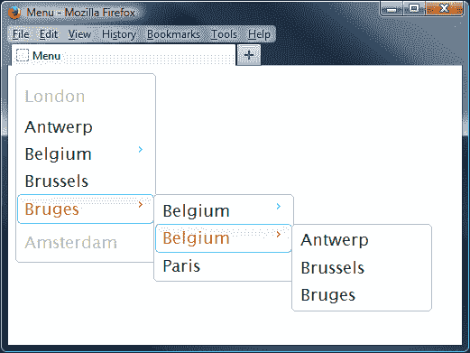

菜单小部件通常由几个以特定方式排列的标准 HTML 元素构成：

*   外部容器元素，在其上调用`menu()`方法（可以是`<ul>`或`<ol>`元素）
*   每个菜单项的`<li>`元素中的`<a>`元素
*   每个菜单项的标题元素

### 注

这些元素既可以硬编码到页面中，也可以动态添加，也可以两者混合，具体取决于需求。

我们在页面上需要的只是一个列表，使用`<ul>`或`<ol>`标记。在我们的示例中，我们创建了一个更复杂的示例，jQueryUI 使用该示例将其转换为具有两级子菜单的菜单。

首先链接到 jQuery 核心库之后，我们链接到所有基于 UI 的组件所需的`jquery.ui.core.js`和`jquery.ui.widget.js`文件，最后链接到`jquery.ui.position.js`。然后我们链接到组件的源文件，在本例中为`jquery.ui.menu.js`。然后我们可以转到自定义的`<script>`元素，在其中添加创建菜单的代码。一旦文档对象模型（DOM）加载并准备就绪，就会执行该操作。

在这个函数中，我们简单地调用 jQuery 对象上的`menu()`小部件方法，表示我们的菜单容器元素（id 为`myTabs`的`<ul>`元素）。当我们在浏览器中运行此文件时，我们应该看到本章第一个屏幕截图中出现的选项卡（当然没有注释）。

# 探索菜单 CSS 框架类

使用 Firebug forFirefox（或另一个通用 DOM 浏览器），我们可以看到，在组成菜单小部件的不同底层 HTML 元素中添加了各种类名。

让我们简要回顾一下这些类名，看看它们如何影响小部件的整体外观。在外部容器`<ul>`中，添加了以下类名：

<colgroup><col style="text-align: left"> <col style="text-align: left"></colgroup> 
| 

类名

 | 

适用于

 |
| --- | --- |
| `ui-menu` | 菜单的外部容器。 |
| `ui-widget` | 所有小部件的外部容器。它为小部件设置字体系列和字体大小。 |
| `ui-widget-content` | 将内容容器样式应用于元素及其子文本、链接和图标（适用于标题的父级或同级）。 |
| `ui-corner-all` | 将角点半径应用于元素的所有四个角点 |
| `ui-menu-icons` | 启动菜单时通过`icons`选项设置的子菜单图标。 |

容器中的第一个元素是`<li>`元素。此元素接收以下类名：

<colgroup><col style="text-align: left"> <col style="text-align: left"></colgroup> 
| 

类名

 | 

意图

 |
| --- | --- |
| `ui-state-disabled` | 对禁用的 UI 元素应用暗显不透明度。除了已设置样式的元素之外，还应添加此元素。 |
| `ui-menu-item` | 容器，用于单个菜单项。 |
| `ui-menu-divider` | 如果添加到`<li>`元素，则在菜单项之间应用分隔符。 |

最后，每个`<li>`元素中的`<a>`元素被赋予以下类名：

<colgroup><col style="text-align: left"> <col style="text-align: left"></colgroup> 
| 

类名

 | 

意图

 |
| --- | --- |
| `ui-state-focus` | 将可单击焦点容器样式应用于元素及其子文本、链接和图标。 |
| `ui-state-active` | 将可单击的活动容器样式应用于元素及其子文本、链接和图标。 |
| `ui-icon` | 将基类应用于图标元素。将尺寸设置为 16 像素方形块，隐藏内部文本，并将背景图像设置为内容状态精灵图像。此类的背景图像将受父容器的影响；例如，如果`ui-state-default`容器中的`ui-icon`元素将根据`ui-state-default.`的图标颜色进行着色 |
| `ui-icon-xxx-xxx` | 作为第二个类应用，用于描述图标的类型。图标类的语法一般遵循`.ui-icon-{icon type}-{icon sub description}-{direction}`的格式。对于指向右侧的单个三角形图标，格式为`.ui-icon-triangle-1-e`。有关图标名称的更多示例，请将鼠标悬停在 ThemeRoller 中位于[的图标上 http://jqueryui.com/themeroller/](http://jqueryui.com/themeroller/) 。 |

除用于显示图标或菜单分隔符的类外，这些类名中的大多数由库自动添加到底层 HTML 元素中；后者应作为设计菜单结构的一部分添加。有关 CSS 类名的更多示例，请参阅[http://api.jqueryui.com/theming/css-framework/](http://api.jqueryui.com/theming/css-framework/) ，这详细说明了框架中可用的所有 CSS 类，这些类可以应用于 jQuery UI 库中的大多数（如果不是全部的话）小部件。

### 提示

您可能想看看链接，其中详细介绍了一些构建菜单的良好实践：[https://developer.apple.com/library/mac/documentation/UserExperience/Conceptual/AppleHIGuidelines/Menus/Menus.html#//apple_ref/doc/uid/TP30000356-TP6](https://developer.apple.com/library/mac/documentation/UserExperience/Conceptual/AppleHIGuidelines/Menus/Menus.html#//apple_ref/doc/uid/TP30000356-TP6)

# 配置菜单选项

库中每个不同的组件都有一系列选项，用于控制小部件的哪些功能默认启用。可以将对象文本或对象引用传递给`menu()`小部件方法来配置这些选项。

下表显示了配置非默认行为的可用选项：

<colgroup><col style="text-align: left"> <col style="text-align: left"> <col style="text-align: left"></colgroup> 
| 

选项

 | 

默认值

 | 

使用

 |
| --- | --- | --- |
| `disabled` | `false` | 如果设置为`true`，则禁用菜单。 |
| `icons` | `{submenu: "ui-icon-carat-1-e"}` | 将图标设置为用于子菜单，与 jQuery UI CSS 框架提供的图标相匹配。 |
| `menus` | `"ul"` | 为用作菜单容器的元素（包括子菜单）指定选择器。 |
| `position` | `{ my: "left top", at: "right top" }` | 标识子菜单相对于相关父菜单项的位置。`of`选项默认为父菜单项，但您可以指定另一个要定位的元素。更多关于如何使用定位小部件的详细信息，请参见[第 2 章](02.html "Chapter 2. The CSS Framework and Other Utilities")、*CSS 框架和其他工具*。 |
| `role` | `"menu"` | 定制用于菜单和菜单项的**可访问富互联网应用**（**ARIA**角色）。角色初始化后不能更改：任何现有菜单、子菜单或菜单项创建后都不会更新。 |

# 样式菜单

jQueryUI 库中所有基于 UI 的小部件和菜单小部件都可以使用[中提供的任何一个预构建主题进行定制 http://jqueryui.com/download/](http://jqueryui.com/download/) 或使用[提供的 ThemeRoller 工具定制一个 http://jqueryui.com/themeroller/](http://jqueryui.com/themeroller/) 。您只需下载主题，然后更改代码中的以下行，以反映正在使用的新主题的名称：

```js
<link rel="stylesheet" href="development-bundle/themes/redmond/jquery.ui.all.css">
```

如果愿意，您甚至可以更改为使用 CDN 连接上承载的主题。关键是选择最适合您的开发工作流程和环境。

## 使用图标显示所选菜单选项的状态

在下一个示例中，我们将了解如何通过添加图标来增强所选菜单项的外观。

在文本编辑器中，删除`<body>`标记之间的现有标记，并将其替换为以下内容：

```js
<body>
  <ul id="myMenu">
    <li><a href="#">File</a></li>
    <li><a href="#"><span class="ui-icon ui-icon-zoomin"></span>Read email</a></li>
    <li><a href="#"><span class="ui-icon ui-icon-zoomout"></span>Move to folder...</a></li>
    <li class="ui-state-disabled"><a href="#"><span class="ui-icon ui-icon-print"></span>Print...</a></li>      
    <li><a href="#"><span class="ui-icon ui-icon-contact"></span> Address Book</a></li>
    <li>
      <a href="#">Edit</a>
      <ul>
      <li><a href="#"><span class="ui-icon ui-icon-pencil"></span>Compose email</a></li>
      <li><a href="#"><span class="ui-icon ui-icon-bookmark"></span>Mark email</a></li>
      <li><a href="#"><span class="ui-icon ui-icon-trash"></span>Send to trash</a></li>
      </ul>
    </li>
  </ul>
</body>
```

我们需要稍微调整一下样式，因此在一个单独的文件中添加以下内容，并将其另存为`menuIcons.css`-别忘了从您的页面添加指向它的链接：

```js
.ui-menu { width: 150px; }
.ui-widget { font-size: 1em; }
```

在`menu1.html`的`<head>`标记中添加以下对此新样式表的引用，并将文件重新保存为`menu2.html`。我们也可以删除现有的样式，因为这不再是必需的。当页面加载到浏览器中时，我们现在可以看到已应用于选定菜单项的图标，如以下屏幕截图所示：

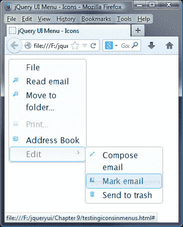

我们可以更进一步，比如说，我们不喜欢用来表示存在子菜单的图标，并希望对其进行更改。这很容易做到。更改上一个示例中的`<script>`块，如图所示：

```js
<script>
  $(document).ready(function($){
    $("#menu").menu({ 
      icons: { submenu: "ui-icon-circle-triangle-e" }
    });
  });
</script>
```

另存为`menu3.html`。如果现在将其加载到浏览器中，您会发现图标已更改为圆圈内的箭头。虽然这样做效果很好，但只要稍微调整一下它的位置，它就会受益匪浅。将以下内容添加到`menuIcons.css`样式表中，并将其另存为`menuIconsOverrides.css`：

```js
.ui-menu-icon { margin-top: 5px; }
```

不要忘了更新代码中的 CSS 链接：

```js
<link rel="stylesheet" type="text/css" href="css/menuIconsOverrides.css">
```

让我们在浏览器中预览一下。您应该会发现图标现在位置更好，如此屏幕截图所示：

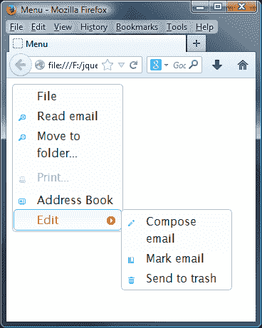

## 在菜单中添加分隔符

到目前为止，我们已经了解了如何设置基本菜单和添加图标，您可能经常看到的一个功能，但迄今为止还缺乏，就是使用分隔符。菜单分隔符帮助将相关项分组在一起，或者可以将固定菜单项与可能更改的菜单项（例如最近的项目列表）分开。

有两种方法可以实现这一点：

*   将`class="ui-menu-divider"`添加到`<li>`项。
*   在菜单项之间插入`<li>-</li>`。这些标签不应包装在任何其他标签中，例如`<a>`链接标签。

这两种选择都能完美地发挥作用并产生相同的结果，但它们的工作原理不同，优点也不同。CSS 选项可能是最具描述性的，但需要在代码体中添加更多标记。

在`menu2.html`的副本中，更改标记，如图所示：

```js
<ul id="menu">
  <li><a href="#">File</a></li>
 <li class="ui-menu-divider"></li>
  <li><a href="#"><span class="ui-icon ui-icon-zoomin"></span>Read email</a></li>
```

另存为`menu4.html`。将其加载到浏览器中时，您将看到一个菜单分隔符出现在**文件**菜单选项之后：

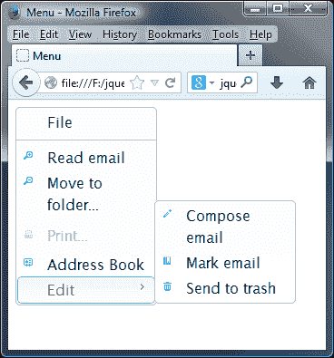

您也可以使用`<li>-</li>`路线来实现这一点；这需要更少的标记，并且更类似于用于代码编程的方法，例如 C#。在`Address Book`选项后立即更改代码，如下所示：

```js
<li><a href="#"><span class="ui-icon ui-icon-contact"></span>Address Book</a></li>
<li>-</li>
<li><a href="#">Edit</a>
```

jQueryUI 将自动应用样式，以将其转换为分隔符。

# 使用菜单方式

菜单小部件除了核心的方法（如`destroy`、`disable`、`enable`、`option`、`widget`之外，还包含大量不同的方法，这意味着它有丰富的不同行为。它还支持高级功能的实现，允许我们以编程方式使用它。让我们看看下表中列出的方法：

<colgroup><col style="text-align: left"> <col style="text-align: left"></colgroup> 
| 

选项

 | 

使用

 |
| --- | --- |
| `blur` | 从菜单中移除焦点，重置任何活动元素样式，并触发菜单的`blur`事件。 |
| `collapse` | 关闭当前活动子菜单。 |
| `collapseAll` | 关闭所有打开子菜单。 |
| `expand` | 打开当前活动项下的子菜单（如果存在）。 |
| `focus` | 激活特定菜单项，开始打开任何子菜单（如果存在），并触发菜单的`focus`事件。 |
| `isFirstItem` | 返回一个布尔值，说明当前活动项是否为菜单中的第一项。 |
| `isLastItem` | 返回一个布尔值，说明当前活动项是否为菜单中的最后一项。 |
| `next` | 将激活的状态移动到下一个菜单项。 |
| `nextPage` | 将活动状态移动到可滚动菜单底部下方的第一个菜单项，或最后一个不可滚动的菜单项。 |
| `option` | 获取或设置小部件初始化后的任何属性。 |
| `previous` | 将激活的状态移动到上一个菜单项。 |
| `previousPage` | 将激活状态移动到可滚动菜单顶部上方的第一个菜单项，如果不可滚动，则移动第一个菜单项。 |
| `refresh` | 在添加新项目或内容后，初始化尚未初始化的子菜单和菜单项。 |
| `select` | 选择当前活动菜单项，折叠所有子菜单，并触发菜单的`select`事件。 |

让我们看看下面几节中的一些选项，从启用和禁用菜单选项开始。

# 以编程方式启用和禁用菜单选项

使用菜单时的一个常见要求是根据选项是否匹配特定条件集启用或禁用选项，例如，如果无法打印，您可以禁用打印选项。

人们希望在菜单小部件中有一个选项可以实现这一点。唉！没有。唯一可用的方法是禁用或启用整个菜单，而不是特定的菜单项。不过这不是问题，因为我们可以使用`ui-state-disabled`类和一点 jQuery 魔术来实现相同的效果。

直接在`menu2.html`中菜单小部件的现有标记之后添加以下新的`<button>`元素：

```js
<p>
  <form>
    <input type="button" id="disableprint" value="Disable printing" />
    <input type="button" id="enableprint" value="Enable printing" />
  </form>
<p>
```

接下来，更改`<script>`元素，使其显示如下：

```js
<script>  
  $(document).ready(function($){
    $("#myMenu").menu();

 $("#disableprint").click(function() {
 $("ul li:nth-child(4)").addClass("ui-state-disabled ui-menu-item");
 });

 $("#enableprint").click(function() {
 $("ul li:nth-child(4)").removeClass("ui-state-disabled");
 });
  });
</script>
```

将更改后的文件保存为`menu5.html`。在 jQuery 中，我们使用伪选择器查找第四个元素（不是第三个元素，计数从 0 开始，不是 1），然后使用`removeClass`或`addClass`添加或删除`ui-state-disabled`类（以适当的为准）。

您会注意到，我们在禁用菜单项时删除了所有类，这纯粹是为了在添加 CSS 样式以将该项标记为禁用时，它会按照正确的顺序添加 CSS 样式。您可以轻松地在这两种情况下使用`.removeClass()`选项，但 CSS 标记顺序将与已禁用的**打印……**选项不匹配！

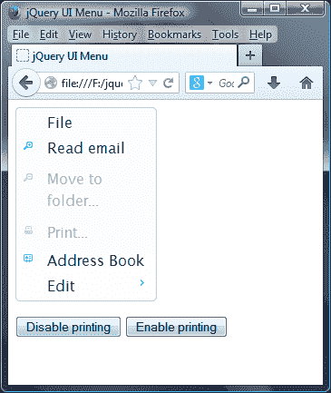

# 添加和删除菜单项

除了以编程方式启用或禁用菜单项外，我们还可以动态添加或删除菜单项。在`menu2.html`中，在现有标记后立即添加以下代码：

```js
<p>
  <form>
    <input type="button" id="additem" value="Add menu item" />
  </form>
</p>
```

然后将最后的`<script>`元素更改为：

```js
<script>
  $(document).ready(function($){
    $("#myMenu").menu();
 $("#additem").click(function() {
 $("<li><a href='#'>New item</a></li>").appendTo("#myMenu");
 $("#myMenu").menu("refresh");
 });
  });
</script>
```

将更改保存为`menu6.html`。在这个页面上，我们添加了一个新的`<input>`元素，我们将使用它来添加一个新的菜单项。

在`<script>`元素中，我们的函数通过首先构建所需的标记来处理菜单项的添加。然后我们将其附加到`myMenu`菜单，然后调用菜单的`refresh()`方法更新显示。添加一些菜单项后，页面应显示如下内容：

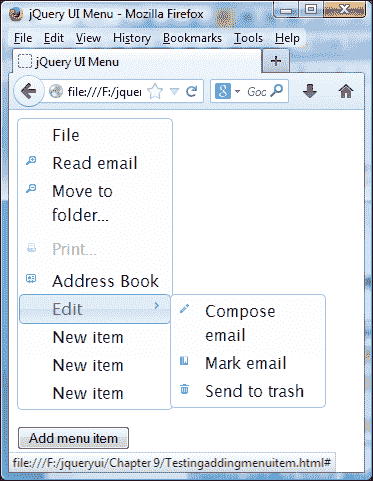

为了不甘示弱，我们可以使用相同的`refresh()`方法删除菜单项，尽管我们需要使用的查找要删除的项的过程将发生变化。让我们来看看如何实现这一点，改变 MyT1 标签内容，如图所示：

```js
<form>
 <input type="button" id="removeitem" value="Remove menu item" />
</form>
```

接下来，更改`menu6.html`中的`<script>`元素，如图所示：

```js
<script>
  $(document).ready(function($){
    $("#myMenu").menu();
    $("#removeitem").click(function() {
      $("#ui-id-3").remove();
      $("#myMenu li:nth-child(3)").remove();
      $("#myMenu").menu("refresh");
    });
  });
</script>
```

将更改保存为`menu7.html`。如果我们在浏览器中加载页面，点击**删除菜单项**按钮，您会发现**移动到文件夹……**菜单选项已被删除：

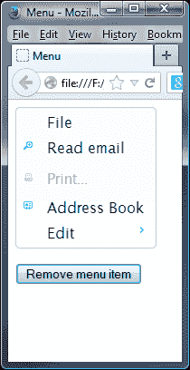

# 处理菜单事件

菜单小部件定义了一系列有用的选项，允许您在检测到小部件暴露的某些事件时添加回调函数以执行不同的操作。下表列出了能够在事件上接受可执行函数的配置选项：

<colgroup><col style="text-align: left"> <col style="text-align: left"></colgroup> 
| 

事件

 | 

触发时…

 |
| --- | --- |
| `blur` | 菜单失去焦点 |
| `create` | 已创建菜单 |
| `focus` | 菜单获得焦点或当任何菜单项被激活时 |
| `select` | 已选择菜单项 |

库的每个组件都有回调选项（如上表中的选项），这些选项经过调整以查找任何访问者交互中的关键时刻。我们在这些回调中使用的任何函数通常都是在更改发生之前执行的。因此，您可以从回调中返回`false`并防止该操作发生。

在我们的下一个示例中，我们将看看使用标准的非绑定技术对所选的特定菜单项做出反应有多容易。拆下`menu1.html`中的最后一个`<script>`元件，并将其更换为：

```js
<script>
  $(document).ready(function($){
    var menuarray;    
    $("#myMenu").menu({
      select: function(event, ui) {
        $('.selected', this).removeClass('selected');
        ui.item.addClass('selected');
        menuarray = ui.item.text().split(" ");
        $("#menutext").").text("You clicked on: " + menuarray[0]);
      },
      focus: function(event, ui) {
        if ($("#menutext").text() != "") {
          $("#menutext").removeClass("normaltext").
addClass("hilitetext");
        }        
      },
      blur: function(event, ui) {
        $("#menutext").removeClass("hilitetext").
addClass("normaltext");
       }
    });
  });      
</script>
```

在最终`</ul>`标记下方，添加以下内容：

```js
<div id="menutext"></div>
```

将此文件另存为`menu8.html`。我们还需要一点 CSS 来完成这个例子；在文本编辑器的新页面中，添加以下代码：

```js
#menutext { width: 150px; font-family: Lucida Grande,Lucida
   Sans,Arial,sans-serif; text-align: center; }
.ui-menu { width: 150px; }
.hilitetext { background-color:  #a6c9e2; padding: 3px; border-radius: 4px; margin-top: 6px; }
.normaltext { background-color: #fff; padding: 3px; margin-
  top: 6px; }
.selected { background-color : #313c43;  border-radius: 4px; }
.selected a { color: #fff; }
```

将此文件另存为`css`文件夹中的`menuEvents.css`。在我们刚刚创建的页面的`<head>`元素中，添加以下`<link>`元素：

```js
<link rel="stylesheet" href="css/menuEvents.css">
```

如果我们预览结果，当在菜单中导航时，我们将看到如下屏幕截图。注意所选菜单项显示在菜单下方：

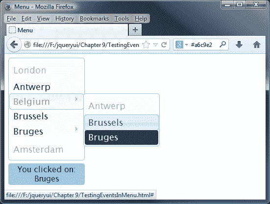

在我们的示例中，我们使用了三个回调-`select`、`focus`和`blur`；对于库中其他小部件触发的任何其他回调，其原理基本相同。

小部件将在执行回调函数时自动将两个参数传递给我们定义的回调函数。这些是原始事件对象和自定义对象，其中包含所选菜单中的有用属性。

在我们的示例中，我们使用`select`回调来确定所选菜单项的标题，然后将`.selected`类分配给它，以指示何时选择了它；`blur`和`focus`回调用于在菜单中导航时提供悬停功能。

# 对事件的约束

使用每个组件公开的事件回调是处理交互的标准方式。但是，除了上表中列出的回调之外，我们还可以钩住每个组件在不同时间触发的另一组事件。

我们可以使用标准 jQuery`on()`方法将事件处理程序绑定到自定义事件，该事件由菜单小部件以与绑定到标准 DOM 事件（如单击）相同的方式触发。

下表列出了菜单的自定义绑定事件及其触发器：

<colgroup><col style="text-align: left"> <col style="text-align: left"></colgroup> 
| 

事件

 | 

当…

 |
| --- | --- |
| `Menucreate` | 菜单已创建 |
| `Menuselect` | 选择菜单项 |
| `Menufocus` | 菜单获得焦点或当任何菜单项被激活时 |
| `Menublur` | 菜单失去焦点 |

菜单对象初始化后，触发第一个事件`menucreate`；根据用户是否选择了菜单项，将触发下三个。

让我们看看这类事件的实际使用情况；将`menu8.html`中的最终`<script>`元素更改为以下内容：

```js
<script>
  $(document).ready(function($){
    var menuarray;  
    $("#myMenu").menu();

 $("#myMenu").on("menuselect", function( event, ui ) {
      $('.selected', this).removeClass('selected');
      ui.item.addClass('selected');  
      menuarray = ui.item.text().split(" ");
      $("#menutext").text("You clicked on: " + menuarray[0]);
 }); 

 $("#myMenu").on("menufocus", function( event, ui ) {
      if ($("#menutext").text() != "") {
        $("#menutext").removeClass("normaltext")       .addClass("hilitetext");
      }  
 });

 $("#myMenu").on("menublur", function( event, ui ) {
      $("#menutext").removeClass("hilitetext")
.addClass("normaltext");
 });
  });      
</script> 
```

将此更改另存为`menu9.html`。以这种方式绑定到`menuselect`事件，使用`select`回调函数生成与上例相同的结果。与上次一样，选择菜单项时应显示确认文本。

所有小部件公开的所有事件都可以与`on()`方法一起使用，只需在事件名称前加上小部件名称即可。

# 创建水平菜单

你注意到一件事了吗？在本章中，所有菜单示例都是垂直的。这不是纯粹的机会，只是因为在撰写本文时，菜单小部件还没有创建水平菜单的选项。

不过这不是问题，因为使用 position 小部件的强大功能和一点额外的样式创建一个。在本例中，我们将在为 jQuery 版本 2 更新它的同时，了解如何实现这种效果。

### 注

很多人都尝试过这样做，取得了不同程度的成功。我个人最喜欢的版本是*Aurélien Hayet*制作的版本，我们将在本例中使用该版本。如果您想查看*Aurélien Hayet*（法语）的原创文章，请访问[http://aurelienhayet.com/2012/11/03/ comment-realizer-un-menu-horizontal-a-laide-de-jquery-ui/](http://aurelienhayet.com/2012/11/03/ comment-realiser-un-menu-horizontal-a-laide-de-jquery-ui/)。

删除`menu2.html`中已有的菜单标记，替换为以下内容，保存为`menu10.html`：

```js
<body> 
  <ul id="menu"> 
    <li><a href="#">Item A</a></li> 
    <li><a href="#">Item B</a></li> 
    <li><a href="#">Item C</a> 
      <ul> 
        <li><a href="#">Item C-1</a></li> 
        <li><a href="#">Item C-2</a></li> 
        <li><a href="#">Item C-3</a></li> 
        <li><a href="#">Item C-4</a> 
         <ul> 
           <li><a href="#">Item C-4-1</a></li> 
           <li><a href="#">Item C-4-2</a></li> 
           <li><a href="#">Item C-4-3</a></li> 
           <li><a href="#">Item C-4-4</a></li> 
           <li><a href="#">Item C-4-5</a></li> 
         </ul> 
       </li> 
       <li><a href="#">Item C-5</a></li> 
     </ul> 
    </li> 
    <li><a href="#">Item D</a></li> 
    <li><a href="#">Item E</a></li> 
  </ul> 
</body> 
```

将最终的`<script>`元素更改如下：

```js
<script> 
  $(document).ready(function($){
    $("#menu").menu({ position: { using: setSubMenu} }); 
    $("#menu > li > a > span.ui-icon-carat-1-e").removeClass("ui-icon-carat-1-e").addClass("ui-icon-carat-1-s"); 
    function setSubMenuposition, elements) { 
      var options = { of: elements.target.element }; 
      if (elements.element.element.parent().parent().attr("id") === "menu") { 
        options.my = "center top"; 
        options.at = "center bottom"; 
      } else { 
        options.my = "left top"; 
        options.at = "right top"; 
      } 
     elements.element.element.position(options); 
    }; 
  });
</script> 
```

我们需要稍微调整一下样式，将其转换为水平菜单，因此将以下内容添加到新文档中，并将其保存为`css`文件夹中的`menuHorizontal.css`。别忘了在主文档中添加链接：

```js
.ui-menu { width: 100px; font-size: 12px; min-height: 22px; } 
 ul#menu { width: 500px; } 
 ul#menu > li { width: 100px; float: left; }
```

将其加载到浏览器时，页面应显示如下内容：

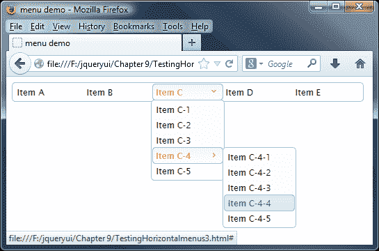

需要注意的是，在撰写本文时，菜单栏小部件正在开发中；您可以在[看到一个版本 http://view.jqueryui.com/menubar/demos/menubar/default.html](http://view.jqueryui.com/menubar/demos/menubar/default.html) 。在这个开发版本中，仍然有一些 bug 需要解决，还有一些功能需要完成，但它仍然是一个可用的小部件，您可以自行下载并尝试。

# 与其他小部件组合

现在让我们切换轨迹，看一些更深入的示例，说明如何使用菜单小部件，首先是使用按钮。

我听你说，这是一种奇怪的组合，但事实并非如此；我们可以使用这两种方法来构建一个带有下拉菜单的漂亮的小拆分按钮！

### 注

幸运的是，*Mike Cantrell*已经创建了一个插件；我们将在示例中使用它。您可以从 Github（[下载此插件的副本 https://gist.github.com/mcantrell/1255491](https://gist.github.com/mcantrell/1255491) ；我已经更新了代码下载中的版本，以便与 jQuery 2.0 和 UI 1.10.3 一起使用。

在`menu2.html`中指向`jquery.ui.menu.js`的链接后，立即添加以下内容：

```js
<script src="development-bundle/ui/jquery.ui.button.js"></script>
<script src="js/jquery.ui.splitbutton.js"></script>
```

修改最后的`<script>`元素，如下所示：

```js
<script>
  $(document).ready(function($){
 $("#split-button").splitButton();
  });     
</script>        
```

将`<body>`标记之间的现有标记替换为以下内容：

```js
<div>
  <a href="http://www.packtpub.com" id="split-button">Edit</a>
  <a href="#">Menu</a>
</div>
<ul style="display:none;">
  <li><a href="#">Print</a></li>
  <li><a href="#">Copy</a></li>
  <li><a href="#">Delete</a></li>
</ul>  
```

将文档另存为`menu11.html`。我们需要在 jQuery 中添加一些将菜单和文档结合在一起的魔力，因此在新文档中添加以下内容，并将其保存为`js`文件夹中的`jquery.ui.splitbutton.js`：

```js
(function($) {
  $.fn.splitButton = function(options) {
    var menu = null;
    var settings = {
      selected: function(event, ui) {
        document.location = ui.item.children()[0];
      },
      showMenu: function() {
        if (menu) menu.hide();
        menu = $(this).parent().next().show().position({
          my: "left top", at: "left bottom", of: $(this).prev()
        });
        $(document).one("click", function() { menu.hide(); });
        return false;
      }
    };
    if (options) { $.extend(settings, options); }
    var buttonConfig = { text: false, icons: { primary: "ui-icon-triangle-1-s" }};
    return this.button().next().button(buttonConfig).click(settings
     .showMenu).parent().buttonset().next().menu({select: settings.selected});
   };
})(jQuery);
```

为了完成效果，我们需要稍微调整 CSS 样式，所以将以下内容添加到新文档中，并将其保存为`css`文件夹中的`menuSplit.css`：

```js
#menutext { width: 150px; font-family: Lucida Grande,Lucida Sans,Arial,sans-serif; text-align: center; }
.ui-menu { width: 150px; }
```

别忘了在代码中添加一个指向`menuSplit.css`的链接。如果我们将页面加载到浏览器中，您应该会看到类似于以下屏幕截图的内容：

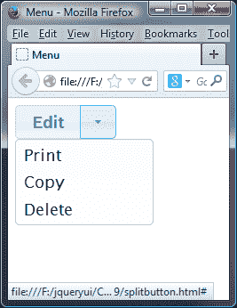

虽然在本例中，**编辑**文本不会改变，但您可以轻松地根据自己的需要进行调整，为下拉菜单列表中的每个选项添加有效链接。

# 设计上下文菜单

在目前，jQuery UI 不可用的一种菜单格式是上下文菜单格式；越来越多的应用依靠上下文菜单快速访问选项，如格式化内容。

然而，在 jQuery 中复制它是一种相对容易的配置。在下一个示例中，我们重用了主 UI 网站中的一些标准 HTML 标记，并将其转换为上下文菜单。这表明，使用 jQuery 的一点魔力，标记实际上不需要改变——这是一个便宜货！

### 注

对于本练习和下一个练习，您需要本书附带的代码下载副本。我们将使用代码下载中的一些文件。

一旦我们创建了页面，我们可以通过右键单击图像在浏览器中查看结果。它应该类似于以下屏幕截图：

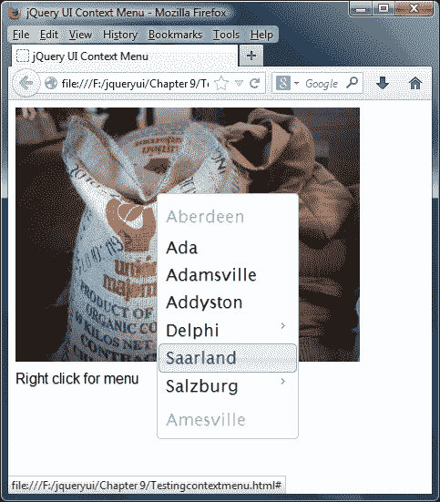

### 注

图片可在[找到 http://upload.wikimedia.org/wikipedia/commons/2/25/Coffee_Roasting.jpg](http://upload.wikimedia.org/wikipedia/commons/2/25/Coffee_Roasting.jpg) 。

让我们首先从下载的代码中提取一份`menu2.html`副本，并将其保存到`jqueryui`文件夹中。接下来，更改最终`<script>`元素，使其显示如下：

```js
<script>
  $(document).ready(function($){
    $("#myMenu").menu({
      select: function (event, ui) {
        $("#myMenu").hide();
        alert("Menu element clicked!");
      }
    });
    $("#contextMenu").on("contextmenu", function (event) {
      $("#myMenu").show();
      $("#myMenu").position({ collision: "none", my: "left top",
        of: event });
      return false;
    });
    $("#contextMenu").click(function (event) {
      $("#myMenu").hide();
    });
    $("#myMenu").on("contextmenu", function (event) { return false; });
  });
</script>
```

将更改后的文件保存为`jqueryui`文件夹中的`menu12.html`。我们需要稍微调整一下样式，因此将以下内容添加到一个新文档中，并将其保存在`css`文件夹中作为`menuContext.css`：

```js
body { color: #fff; font-family: 'Doppio One', sans-serif; text-shadow: 0 1px 0 rgba(0,0,0,.3); line-height: 1.5; -webkit-font-smoothing: antialiased; }
.ui-menu { width: 150px; }
#menu { position: absolute; display: none; }
#contextMenu { color: #000; }
```

将该文件保存为`css`文件夹中的`menuContext.css`，并在`menu12.html`的`<head>`部分的 jQuery UI 样式表后链接到该文件：

```js
<link rel="stylesheet" type="text/css" href="menuContext.css"> 
```

通过使用 menu 的 position 属性和一点额外的 jQuery 魔术，我相信您会同意这会产生一个非常好的结果！

# 增强选择菜单

在最后一个菜单示例中，让我们看看如何使用菜单小部件的功能来增强`<select>`菜单。本书的原作者*Dan Wellman*给出了一个很好的例子，说明了如何使用本书前面介绍的一些附加 jQuery 和技术来实现这一点。我已经将其更新为使用 jQuery 2.03 和 UI 1.10.3。

将`menu2.html`中的现有标记替换为以下内容：

```js
<body>
 <select id="selectmenu">
 <option>Option 1</option>
 <option>Option 2</option>
 <option>Option 3</option>
 <option>Option 4</option>
 <option>Option 5</option>
 </select>
</body>
```

从本书附带的代码下载中，提取`menuSelect.js`文件的副本，然后将其保存在`js`文件夹中，并将其链接到最后一个 jQuery UI 库参考`jquery.ui.menu.js`的正下方。

在`menu2.html`中，将第二个`<link>`更改为指向一个新的样式表，如下所示：

```js
<link rel="stylesheet" href="css/menuSelect.css">
```

在`menuSelect.css`中增加如下内容：

```js
.ui-menu-container { width: 200px; height: 26px; padding: 4px 0 0
   4px; position: relative; cursor: pointer; }
.ui-menu { position: absolute; right: 0; top: 100%; }
.ui-menu .ui-menu-item a { padding: 2px 20px; }
.ui-menu-trigger { padding: 0 3px; margin: -1px 3px; float: right; text-decoration: none; }
```

将页面另存为`menu13.html`。如果我们将页面加载到浏览器并预览，您将看到类似于此屏幕截图的内容：

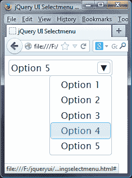

在本例中，我们使用了相当多的 jQuery；这将有助于变成一个插件，可以包含在页面上，并用于增强现有`<select>`菜单。如果编写正确，它将使用渐进增强技术工作，同时在 jQuery 不可用的情况下仍保持原始的基本代码。

# 总结

菜单小部件是一种很好的节省页面空间的方法，它可以组织相关（甚至完全不相关）的内容部分，这些内容可以通过访问者的简单点击输入显示或隐藏。

让我们回顾一下本章所涵盖的内容。我们首先研究了如何使用一点底层 HTML 和一行 jQuery 风格的 JavaScript 实现默认菜单小部件。然后，我们研究了 CSS 类和菜单选项，您可以使用这些类和选项根据自己的需要自定义菜单，以及如何在设置菜单样式时使用这些属性中的某些属性来获得更好的效果。我们还介绍了可用于执行操作或对菜单小部件触发的事件作出反应的一系列方法和事件。

最后，我们看了一些示例，说明如何在保持原始标记的同时完全更改菜单的外观。我们使用了三个定制`<select>`菜单、增强按钮以及将菜单转换为上下文菜单的示例。

在下一章中，我们将继续研究 Tooltips 小部件，我们可以使用它指出字段或图像等元素的注意点，或者设置为站点访问者的选项小菜单。