# 十、使用工具提示

工具提示作为 HTML3 标准的一部分引入，并使用 title 属性作为其文本，是用于在页面中提供上下文的常用元素。您可以在各种情况下找到它们，尽管在提交表单时提供更正错误的帮助时（特别是在涉及产品付款时！）很可能会找到它们。

jQuery 团队引入了他们的**工具提示**版本，作为对库 1.9 版本的修改的一部分；它被设计成直接替代所有浏览器中使用的标准工具提示。不过，这里的不同之处在于，虽然您无法设置标准工具提示的样式，但 jQueryUI 的替代品旨在实现可访问性、主题性和完全可定制性。它被设置为不仅当控件接收焦点时显示，而且当您将鼠标悬停在该控件上时也显示，这使得键盘用户更容易使用它。

在本章中，我们将研究以下主题：

*   小部件的默认实现
*   CSS 框架如何针对工具提示小部件
*   如何应用自定义样式
*   使用工具提示的选项配置工具提示
*   使用工具提示的方法控制工具提示
*   以编程方式显示工具提示
*   在工具提示中显示不同类型的内容
*   工具提示的内置过渡效果
*   AJAX 工具提示

# 实现默认工具提示

工具提示是用来直接替代浏览器的原生工具提示的。他们将识别标签中 title 属性的默认标记，并使用它自动添加小部件所需的附加标记。通过使用工具提示的项目和内容选项，可以自定义目标选择器；您将在本章后面看到一个例子。让我们首先看看实现工具提示所需的基本结构。

在文本编辑器中的新文件中，创建以下页面：

```js
<!DOCTYPE HTML>
<html>
  <head>
    <meta charset="utf-8">
    <title>Tooltip</title>
    <link rel="stylesheet" href="development-bundle/themes/redmond/jquery.ui.all.css">
    <style>
    p { font-family: Verdana, sans-serif; }
    </style>
    <script src="js/jquery-2.0.3.js"></script>
    <script src="development-bundle/ui/jquery.ui.core.js"></script>
    <script src="development-bundle/ui/jquery.ui.widget.js"></script>
    <script src="development-bundle/ui/jquery.ui.position.js"></script>
    <script src="development-bundle/ui/jquery.ui.tooltip.js"></script>
    <script>
      $(document).ready(function($){
      $(document).tooltip();
      });  
    </script>        
  </head>
  <body>
 <p>Lorem ipsum dolor sit amet, consectetur adipiscing elit. Nulla blandit mi quis imperdiet semper. Fusce vulputate venenatis fringilla. Donec vitae facilisis tortor. Mauris dignissim nibh ac justo ultricies, nec vehicula ipsum ultricies. Mauris molestie felis ligula, id tincidunt urna consectetur at. Praesent <a href="http://www.ipsum.com" title="This was generated from www.ipsum.com">blandit</a> faucibus ante ut semper. Pellentesque non tristique nisi. Ut hendrerit tempus nulla, sit amet venenatis felis lobortis feugiat. Nam ac facilisis magna. Praesent consequat, risus in semper imperdiet, nulla lorem aliquet nisi, a laoreet nisl leo rutrum mauris.</p>
  </body>
</html>
```

将代码另存为`tooltip1.html`在您的`jqueryui`工作文件夹中。让我们回顾一下使用了什么。默认工具提示小部件配置需要以下脚本和 CSS 资源：

*   `jquery.ui.all.css`
*   `jquery-2.0.3.js`
*   `jquery.ui.core.js`
*   `jquery.ui.widget.js`
*   `jquery.ui.tooltip.js`

在底层 HTML 中使用 title 元素时，创建工具提示所需的脚本可以简单到这样，应该添加到代码中最后一个`<script>`元素之后，如前一个示例所示：

```js
<script>
  $(document).ready(function($){
    $(document).tooltip();
  });  
</script>        
```

在本例中，当鼠标悬停在链接上时，库会将屏幕阅读器代码所描述的必需的 aria 添加到 HTML 链接中。然后，小部件动态生成工具提示的标记，并在关闭`</body>`标记之前将其附加到文档中。一旦目标元素失去焦点，这将自动删除。

### 注

**ARIA**或**易访问富****互联网应用**提供了一种让残疾人更容易访问内容的方法。您可以在[了解更多有关此计划的信息 https://developer.mozilla.org/en-US/docs/Accessibility/ARIA](https://developer.mozilla.org/en-US/docs/Accessibility/ARIA) 。

添加工具提示时，不必仅使用`$(document)`元素。工具提示同样适用于类或选择器 ID；使用选择器 ID 将提供更好的控制，我们将在本章后面看到。

# 探索工具提示 CSS 框架类

使用 Firefox 的 Firebug（或另一个通用 DOM 浏览器），我们可以看到特定的类名被添加到工具提示小部件创建的基础 HTML 元素中。让我们简要回顾一下这些类名，看看它们如何影响小部件的整体外观。

<colgroup><col style="text-align: left"> <col style="text-align: left"></colgroup> 
| 

类名

 | 

意图

 |
| --- | --- |
| `ui-tooltip` | 工具提示的外部容器 |
| `ui-tooltip-content` | 工具提示的内容 |
| `ui-widget-content` | 将内容容器样式应用于元素及其子文本、链接和图标 |
| `ui-corner-all` | 将角半径应用于元素的所有四个角 |

与其他小部件不同，工具提示添加的样式很少。大多数样式是在创建工具提示时添加的，如以下屏幕截图所示：

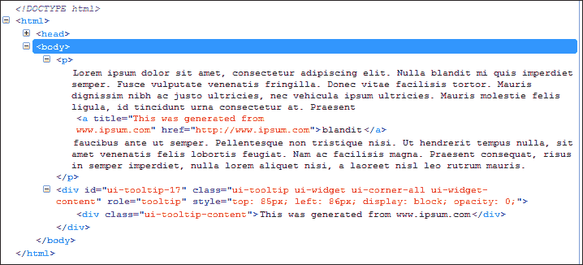

# 覆盖默认样式

在设置工具提示小部件的样式时，我们不仅限于使用提供的预构建主题（我们将在下一节介绍），我们始终可以选择使用自己的样式覆盖现有样式。在我们的下一个示例中，我们将看到通过对`tooltip1.html`中的示例进行一些小的更改来实现这一点是多么容易。

在新文档中，添加以下样式，并将其保存为`css`文件夹中的`tooltipOverride.css`：

```js
p { font-family: Verdana, sans-serif; }
.ui-tooltip { background: #637887; color: #fff; }
```

别忘了从文档的`<head>`元素链接到新样式表：

```js
<link rel="stylesheet" href="css/tooltipOverride.css">
```

### 提示

在我们继续之前，有必要解释一下在将结果提交到代码之前设置工具提示样式的好技巧。

如果您使用的是 Firefox，您可以下载并安装 Firefox 的**Toggle JS**插件，该插件可从[获得 https://addons.mozilla.org/en-US/firefox/addon/toggle-js/](https://addons.mozilla.org/en-US/firefox/addon/toggle-js/) 。这允许我们在每页的基础上关闭 JavaScript；然后，我们可以将鼠标悬停在链接上创建工具提示，然后在 Firebug 中展开标记并随意设置其样式。

将您的 HTML 文档另存为`tooltip2.html`。当我们在浏览器中运行页面时，当鼠标悬停在文本中的链接上时，您应该会看到修改后的工具提示：

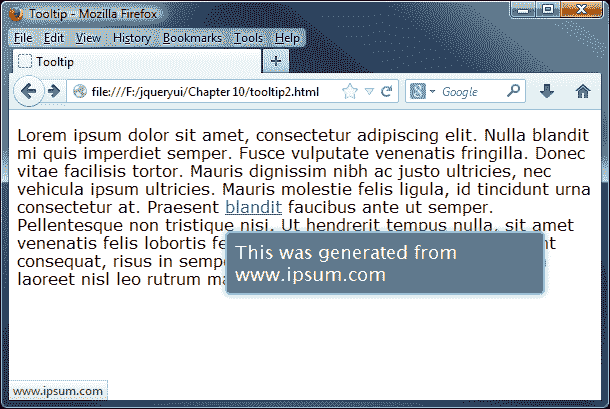

## 使用预先构建的主题

如果手动创建全新的样式对于您的需求来说过于苛刻，那么您可以选择使用一个可以从 jQuery UI 站点下载的预构建主题。

这是一个非常容易做出的改变。我们首先需要下载一份替换主题的副本；在我们的示例中，我们将使用名为**Excite Bike**的一个。我们先浏览一下[http://jqueryui.com/download/](http://jqueryui.com/download/) ，然后取消选择**切换所有**选项：

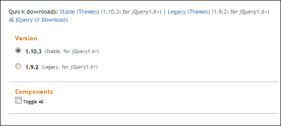

我们不需要下载整个库，只需下载底部的主题，将主题选项更改为显示**Excite Bike**，然后点击**下载**：

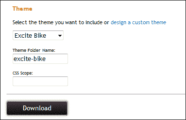

下一步，打开`tooltip2.html`的副本，然后查找该行：

```js
<link rel="stylesheet" href="development-bundle/themes/redmond/jquery.ui.all.css">
```

您将注意到上面一行中突出显示的单词。这是现有主题的名称。将此更改为`excite-bike`，然后将文档另存为`tooltip3.html`，然后删除`tooltipOverride.css`链接，即可设置完毕。以下是我们正在实施的替换主题：

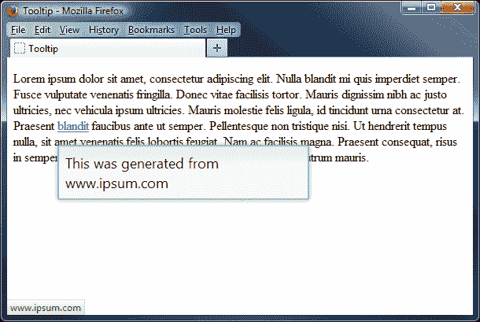

只需对 word 进行一次更改，我们就可以在 jQuery UI 中使用的任何预构建主题（甚至是其他人在线提供的任何自定义主题）之间切换，只要您已下载并将主题复制到相应的文件夹中。

不过，在某些情况下，我们可能需要调整设置。这给了我们两全其美的东西，我们只需要专注于做必要的改变。让我们来看看如何使用 MeMeloLLL 改变现有的主题。

## 使用 ThemeRoller 创建自定义主题

如果我们浏览到[http://jqueryui.com/themeroller/](http://jqueryui.com/themeroller/) ，我们可以更改页面上**工具提示**示例样式的一些设置。更改**内容**下的**背景色&纹理**选项，然后将**边框**选项更改为**580000**，如下图所示：

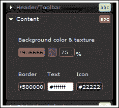

向下移动到**可点击：活动状态**部分，然后将**背景色&纹理**选项在**100%**处更改为**#ccb2b2**，将**边框**选项更改为**#580000**。其余部分保持不变：

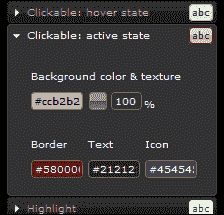

如果您向下滚动至页面底部的**工具提示**示例，然后将鼠标悬停在任一图像上，您应该会看到我们更改的效果：

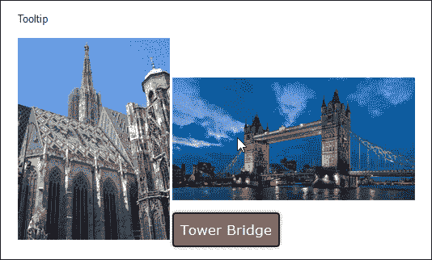

虽然我知道颜色可能不会赢得任何风格奖项，但你可以看到改变颜色是多么容易。选择完颜色后，可以从下载页面下载最终版本。本书附带的代码下载中还提供了自定义主题的副本；查看`jquery`文件夹中的`tooltip4.html`以查看我们新的样式表的示例。

### 注

通过使用 HTML，我们可以更进一步。不过要小心，因为这会给你的页面带来安全风险，使用时要小心！在本章后面部分，请看一看工具提示中标记为*的使用 HTML 部分，例如，您如何真正改变工具提示的样式。*

# 配置工具提示选项

库中的每个不同组件都有一系列选项，用于控制小部件的哪些功能默认启用。可以将对象文本或对象引用传递到`tooltip()`小部件方法中，以配置这些选项。

下表显示了配置非默认行为的可用选项：

<colgroup><col style="text-align: left"> <col style="text-align: left"> <col style="text-align: left"></colgroup> 
| 

选项

 | 

默认值

 | 

过去…

 |
| --- | --- | --- |
| `content` | `function returning the title attribute` | 设置工具提示的内容如果设置此选项，则可能还需要更改“项目”选项。 |
| `disabled` | `false` | 禁用工具提示。 |
| `hide` | `null` | 确定是否或如何设置隐藏工具提示的动画。 |
| `items` | `[title]` | 设置选择器，指示哪些项目应显示工具提示。如果计划对工具提示内容使用除标题属性以外的其他属性，或者需要为事件委派设置不同的选择器，则可以自定义此选项。 |
| `position` | `{ my: "left top+15", at: "left bottom", collision: "flipfit" }` | 识别工具提示相对于相关目标元素的位置。 |
| `show` | `null` | 确定是否或如何设置工具提示显示的动画。 |
| `tooltipClass` | `null` | 向小部件添加一个类，该类可以显示不同的工具提示类型，例如错误或警告。 |
| `track` | `false` | 确定工具提示是否应跟踪（跟随）鼠标。 |

# 准确定位工具提示

jQueryUI 工具提示最有用的功能之一是能够微调它们在屏幕上的显示位置。在某些情况下，您可能需要它们出现，但不会以隐藏网站或应用上的重要功能为代价！让我们以带有指针的自定义样式工具提示为例，来看看`position`属性是如何工作的。

在文本编辑器中，更改`tooltip4.html`的最后一个`<script>`块，如下代码所示：

```js
<script>
  $(document).ready(function($){
    $('a').tooltip({
      position: { 
        my: 'center+30 bottom', 
        at: 'center top-8',
        of: '#tip'
      }
    });                  
    $('a').tooltip('option', 'tooltipClass', 'top');
  });  
</script>        
```

我们需要更改标记，使其包含刚才在工具提示调用中引用的选择器 ID：

```js
<p>Lorem ipsum dolor sit amet, consectetur adipiscing elit. Nulla blandit mi quis imperdiet semper. Fusce vulputate venenatis fringilla. Donec vitae facilisis tortor. Mauris dignissim nibh ac justo ultricies, nec vehicula ipsum ultricies. Mauris molestie felis ligula, id tincidunt urna consectetur at. Praesent <a href="http://www.ipsum.com" id="tip" title="This was generated from www.ipsum.com">blandit</a> faucibus ante ut semper. Pellentesque non tristique nisi. Ut hendrerit tempus nulla, sit amet venenatis felis lobortis feugiat. Nam ac facilisis magna. Praesent consequat, risus in semper imperdiet, nulla lorem aliquet nisi, a laoreet nisl leo rutrum mauris.</p>
```

在文本编辑器的新文件中，创建以下小样式表：

```js
body { margin-top: 75px; }
.ui-tooltip { background: #c99; color: white; border: none; padding: 0; opacity: 1; border-radius: 8px; border: 3px solid #fff; width: 245px; }
.ui-tooltip-content { position: relative; padding: 1em; }
.ui-tooltip-content::after { content: ''; position: absolute; border-style: solid; display: block; width: 0; }
.right .ui-tooltip-content::after { top: 18px; left: -10px; border-color: transparent #c99; border-width: 10px 10px 10px 0; }
.left .ui-tooltip-content::after { top: 18px; right: -10px; border-color: transparent #c99; border-width: 10px 0 10px 10px; }
.top .ui-tooltip-content::after { bottom: -10px; left: 72px; border-color: #c99 transparent; border-width: 10px 10px 0; }
.bottom .ui-tooltip-content::after { top: -10px; left: 72px; border-color: #c99 transparent; border-width: 0 10px 10px; }
```

另存为`tooltipPointer.css`。从`tooltip4.html`中删除现有样式，然后在<头>中添加以下引用，并将其重新保存为`tooltip5.html`：

```js
<link rel="stylesheet" href="development-bundle/themes/redmond/jquery.ui.all.css">
<link rel="stylesheet" href="css/tooltipPointer.css">
```

在本例中，我们使用了大量的伪选择器来设置工具提示的样式；这还有一个额外的优点，即在生成工具提示时不需要任何图像。如果我们在浏览器中查看新页面，它应该与以下屏幕截图类似：

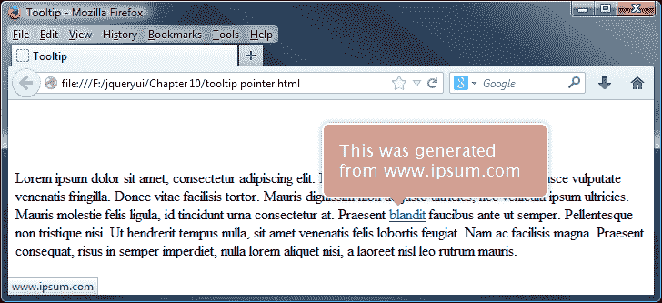

## 使用位置小部件

在我们的示例中，您将注意到，我们调整了窗口的大小，以实现上一个屏幕截图中显示的效果。如果您将该窗口扩展到全尺寸，则工具提示很可能会发生变化；为了防止这种情况发生，必须使用 of 属性，以便工具提示（在本例中）保留在我们添加到标记的原始链接旁边。

使用 position 属性（事实上还有小部件）可能有点难掌握，但是值得努力确保小部件正好位于您需要它们出现的位置。

### 注

CSS 技巧[的*克里斯·科伊尔*(http://www.css-tricks.com](http://(http://www.css-tricks.com) 提供了一个关于职位工具工作原理的很好的示例，您可以在[中看到 http://css-tricks.com/jquery-ui-position-function/](http://css-tricks.com/jquery-ui-position-function/) 。

简而言之，`position`小部件的示例用法如下：

```js
$("#move-me").position({
  "my": "right top",
  "at": "left bottom",
  "of":  $("#thing")
});
```

…将在下图中进行翻译：

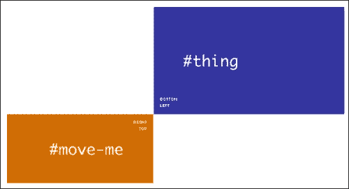

### 注

来源：[http://css-tricks.com/jquery-ui-position-function](http://css-tricks.com/jquery-ui-position-function) /

# 使用工具提示跟踪鼠标移动

到目前为止，我们已经了解了如何在页面中添加工具提示，并且介绍了在屏幕上设置样式和定位工具提示的一些可能性。我们可以对工具提示进行的一个小增强是设置它们，以便它们在激活时可以跟随光标。

这是一个简单的改变；更改`tooltip5.html`的主体，使其包含以下元素：

```js
<div id="content">
  <p>Lorem ipsum dolor sit amet, consectetur adipiscing elit. Nulla blandit mi quis imperdiet semper. Fusce vulputate venenatis fringilla. Donec vitae facilisis tortor. Mauris <a href="#" rel="tooltip1"title="This is a tooltip hovering over a link">dignissim</a> nibh ac justo ultricies, nec vehicula ipsum ultricies. Mauris molestie felis ligula, id tincidunt urna consectetur at. Praesent blandit faucibus ante ut semper. <a href="#" rel="tooltip2" title="Here is another tooltip">Pellentesque non tristique</a> nisi. Ut hendrerit tempus nulla, sit amet venenatis felis lobortis feugiat. Nam ac facilisis magna. Praesent consequat, risus in semper imperdiet, nulla lorem aliquet nisi, a laoreet nisl leo rutrum mauris.
  <p>Tooltips are also useful for form elements, to show some additional information in the context of each field.</p>
  <p>
    <label for="textinput">First text input:</label>
    <input id="test" title="Please enter text in this field." />
  </p>
</div>
<p>Hover over the input field or links to see the tooltips in action.</p>
```

我们需要添加跟踪设施，因此更新最终的`<script>`块如下：

```js
<script>
  $(document).ready(function($){
 $(document).tooltip({ track: true });
  });     
</script>        
```

将更新后的文档保存为`tooltip6.html`。现在，让我们在样式中添加一些最后的调整，以便内容正确地显示在屏幕上。将以下内容添加到新文档中，并将其保存为`tooltipTrack.css`，保存在`css`文件夹中：

```js
p { font-family: Verdana, sans-serif; font-size: 0.8em; font-style: italic; }
label { display: inline-block; width: 8.5em; }
#content { border: 2px solid #42505a; padding: 5px; border-radius: 4px; }
#content p { font-style: normal; }
```

别忘了从我们页面的`<head>`链接到新的样式表（通过替换对`tooltipPointer.css`的现有引用）：

```js
<link rel="stylesheet" href="css/tooltipTrack.css">
```

以下屏幕截图显示了预览我们的结果时页面的显示方式：

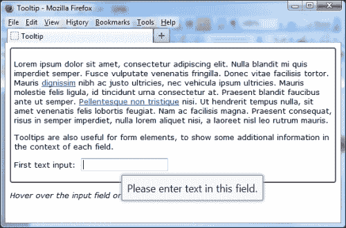

现在，我们已经将工具提示设置为在光标悬停在目标元素上时跟随光标。在我们的示例中，这包括两个链接或输入元素之一。在设置跟踪时，我们不局限于这两个元素中的任何一个；这可以用于任何有效的 HTML 元素，例如单选按钮、按钮甚至标签。

虽然我们无法轻松地在打印中显示它，但您应该发现，当您四处移动光标时，只要光标仍悬停在其目标元素上，工具提示就会跟随它。

# 显示某些工具提示

到目前为止，我们已经指定所有的工具提示使用`$(document)`对象工作；虽然这将很好地工作，但这确实意味着我们的工具提示将始终遵循相同的格式，并以相同的方式工作，因为配置将应用于该页面上的所有工具提示。

不过，我们可以很容易地改变这一点；jQueryUI 的工具提示在任何 jQuery 选择器上都可以正常工作，就像在文档对象上一样。为了证明这一点，让我们来看看如何配置工具提示与一个特定的元素一起工作。

在`tooltip2.html`中，将最后的`<script>`元素更改为以下内容：

```js
<script>
  $(document).ready(function($){
    $("#input").tooltip();
  });  
</script>        
```

我们不需要 CSS 覆盖样式，因此从文档的`<head>`中删除这一行：

```js
<link rel="stylesheet" href="css/tooltipOverride.css">
```

我们还需要在现有标记下面添加以下代码：

```js
<p>Tooltips are also useful for form elements, to show some additional information in the context of each field.</p>
<label for="input">Please enter some text:</label>
<input type="text" id="input" title="I am a tooltip!">
```

将此保存为`tooltip7.html`在您的`jqueryui`文件夹中。在本例中，我们删除了对文档的引用，并将其替换为分配给文本框的`id`，如以下屏幕截图所示：

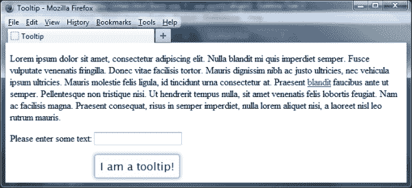

我们前面看到的样式类仍然会被应用，但这次它们只会在文本框上出现，而不是文本中的链接。

# 在工具提示中显示 AJAX 内容

在本章的大部分内容中，我们使用了在工具提示中显示内容的标准技术，即引用页面上任何标记的标题属性中存储的文本。

然而，jQueryUI 的工具提示能够使用 AJAX 引用内容；这允许您动态生成工具提示，而不限于标记中显示的内容。在我们的示例中，我们将使用 content 属性将纯文本传递给小部件；您同样可以将回调函数作为内容的值传递给工具提示。

在文本编辑器中，删除`tooltip7.html`中现有的最终`<script>`块，并将其替换为以下代码：

```js
$(document).ready(function($){
  var url = "ajax.html"; 
  $("#ajaxTip").load(url);
  $('a').tooltip({
    content: '... waiting on ajax ...',
    open: function(evt, ui) {
      var elem = $(this);
      var data = $("#ajaxTip").text();
      $.ajax().always(function(event, ui) {
        elem.tooltip('option', 'content', data);
      });
    }
  }); 
}); 
```

接下来，删除`<label>`和`<input>`代码，然后在`<body>`部分的标记下方添加以下内容：

```js
<div id="ajaxTip" style="display:none;"></div>
```

我们还需要创建一些内容，这些内容将使用 AJAX 导入页面，因此在一个新文档中，添加以下代码并将其保存为`ajax.html`：

```js
Lorem ipsum dolor sit amet, consectetur adipiscing elit.
```

将文件另存为`tooltip8.html`。在本例中，您需要通过 web 服务器查看，以便 AJAX 效果正常工作；如果您无法访问某些在线 web 空间，您可以使用 WAMP 服务器（用于 PC，可从[获得）http://www.wampserver.com/en/](http://www.wampserver.com/en/) 或本地 MAMP（对于 Mac，可从[下载）http://www.mamp.info/en/mamp/](http://www.mamp.info/en/mamp/) ），这也同样有效。

将鼠标悬停在链接上时，将显示一个工具提示，但其中包含已导入的 HTML 文件的内容，如以下屏幕截图所示：

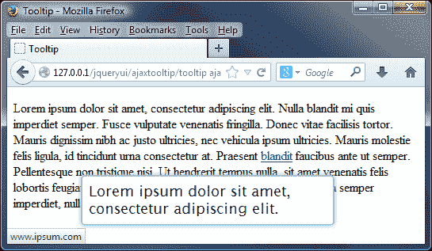

当我们引入基于 HTML 的内容时，您应该确保内容得到正确处理，以最大限度地降低对站点的攻击风险。在本例中，我们刚刚从测试 HTML 文件中导入了纯文本，但使用此方法确实允许您导入任何 HTML（在合理范围内）以获得非常好的效果。

### 提示

在本章后面，我们将更详细地介绍如何在工具提示中使用 HTML；您可能会使用该方法中的样式和内容，但可以使用 AJAX 将其全部导入。

## 我们如何判断它是否有效？

判断内容是否已成功导入的最简单方法是在 DOM 检查器（如 Firebug）的**控制台**选项卡中检查内容。

### 注

DOM 检查器可用于检查、浏览和编辑任何网页的**文档模型对象**（**DOM**），用于多种目的，例如建立缓慢加载的对象或源，或在提交到代码之前预览 CSS 样式的更改。

在这里您可以清楚地看到对`test.html`（取自 Firebug）的调用，该调用返回了`200`的值，表示成功：

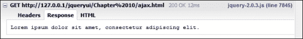

# 在工具提示中使用效果

您希望注意到，在本章演示的每个示例中，默认情况下，每个工具提示都会逐渐淡入淡出。工具提示不仅限于使用这种淡入淡出效果；您可能更喜欢使用在屏幕上显示时更具影响力的内容。

在我们的下一个示例中，我们将研究如何更改代码以使用不同的效果，从而实现此效果。在`tooltip7.html`中最近一次调用 jQuery UI 库的下方添加以下代码行：

```js
<script src="development-bundle/ui/jquery.ui.effect.js"></script>
<script src="development-bundle/ui/jquery.ui.effect-bounce.js"></script>
<script src="development-bundle/ui/jquery.ui.effect-explode.js"></script>
```

接下来，从现有标记中删除这两行：

```js
<label for="input">Please enter some text:</label>
<input type="text" id="input" title="I am a tooltip!">
```

更改最后的`<script>`元素以包含新效果，如图所示：

```js
<script>
  $(document).ready(function($){
    $(document).tooltip({
      show: { effect: "bounce", duration: 800 },
      hide: { effect: "explode", duration: 800 }
    });
  });  
</script>        
```

将文档另存为`tooltip9.html`。如果我们将页面加载到浏览器中，并将鼠标悬停在文本中的链接上，您将看到工具提示在移动时爆炸，如以下屏幕截图所示：

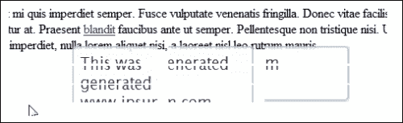

# 在工具提示中使用 HTML

到目前为止，我们已经介绍了如何设置工具提示以显示在页面上，以及如何设置它们的样式。但是，后者给我们带来了一个小小的难题，因为我们必须依靠 jQuery 以编程方式添加 CSS 样式，如果我们想要保持工具提示的渐进式增强样式，这可能是有害的。这是有办法的；虽然它涉及 jQuery 的一个元素，但它确实允许我们使用 HTML 生成工具提示，从而使它更灵活地满足我们的需要。

### 提示

**在工具提示中使用 HTML**

在我们进一步讨论之前，我应该指出，使用此方法会给代码带来安全风险；正是由于这个原因，内容的默认用法从允许 HTML 转换为纯文本。请自担风险使用！

删除`tooltip9.html`中的标记内容，并添加以下内容：

```js
<p>Lorem ipsum dolor sit amet, consectetur adipiscing elit. Nulla blandit mi quis imperdiet semper. Fusce vulputate venenatis fringilla. Donec vitae facilisis tortor. Mauris <a href="#" rel="tooltip1">dignissim</a> nibh ac justo ultricies, nec vehicula ipsum ultricies. Mauris molestie felis ligula, id tincidunt urna consectetur at. Praesent blandit faucibus ante ut semper. Pellentesque non tristique nisi. Ut hendrerit tempus nulla, sit amet venenatis felis lobortis feugiat. Nam ac facilisis magna. Praesent consequat, risus in semper imperdiet, nulla lorem aliquet nisi, a laoreet nisl leo rutrum mauris.
</p>
```

接下来，修改最后的`<script>`块，如下面代码中的所示：

```js
<script>
  $(document).ready(function($){
 var tooltiptext = "<div id='tooltip'><div id='title'>Test Tooltip </div><div id='content'>This is a random tooltip with some text</div></div>";
 $("a[rel=tooltip]").tooltip({
 items: "a",
 content: function() {
 return tooltiptext;
 }
 });
  });     
</script>   
```

另存为`tooltip10.html`。我们现在有了一个实用的工具提示，但它看起来不太吸引人。创建新样式表并添加以下基本样式：

```js
p { font-family: Verdana, sans-serif; }
#tooltip { width: 100px; border: 1px solid #F1D031; font-family: Verdana, sans-serif; font-size: 10px; }
#title { width: 94px; background-color: #FFEF93; font-weight: bold; padding: 3px; }
#content { width: 94px; background-color: #FFFFA3; height: 50px; padding: 3px; }
```

将此保存为`tooltipSelector.css`在您的`css`文件夹中。别忘了从我们页面的`<head>`链接到新样式表（在链接到标准 jQuery UI 样式表之后）：

```js
<link rel="stylesheet" href="css/tooltipSelector.css">
```

在本例中，我们不会使用 redmond 主题中的预构建样式，因此请删除以下链接：

```js
<link rel="stylesheet" href="development-bundle/themes/redmond/jquery.ui.all.css">
```

我们还需要删除上一次演示中的效果调用，因此请从文档的`<head>`中删除以下链接：

```js
<script src="development-bundle/ui/jquery.ui.effect.js"></script>
<script src="development-bundle/ui/jquery.ui.effect-bounce.js"></script>
<script src="development-bundle/ui/jquery.ui.effect-explode.js"></script>
```

将修改后的文件另存为`tooltip10.html`。如果我们在浏览器中运行此页面，当悬停在链接上时，您将看到工具提示**测试工具提示**，如下面的屏幕截图所示：

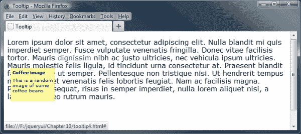

如您所见，我们已经完全改变了工具提示上使用的样式；此方法比设置工具提示的普通方法需要更多的工作，但只要操作正确，这是值得的！

## 使用 HTML 的危险

在前面的示例中，我们研究了如何将 HTML 合并到工具提示中，这为工具提示中显示的内容提供了一些强大的机会。不过，在工具提示中使用 HTML 存在固有的风险；在以前版本的库中，您可以在`<title>`标记中包含 HTML，作为设置工具提示的一部分。但是，这在 UI 1.10 中已被更改，作为对 1.9 版中存在的跨站点脚本（XSS）漏洞的修复，攻击者可以在页面上的工具提示小部件中插入（或注入）客户端脚本（通常是恶意的）。您仍然可以使用 HTML，但需要使用上一个示例中概述的内容选项。您可以在[了解更多关于跨站点脚本以及如何减少威胁的信息 http://en.wikipedia.org/wiki/Cross-site_scripting](http://en.wikipedia.org/wiki/Cross-site_scripting) 。

### 注

由于“内容”选项覆盖默认行为，因此应始终确保正确转义（或净化）内容，以将跨站点脚本编写的风险降至最低。

# 使用工具提示方法

工具提示小部件包含一系列方法，允许我们以编程方式使用它并更改其默认行为。让我们看看下表中列出的方法：

<colgroup><col style="text-align: left"> <col style="text-align: left"></colgroup> 
| 

方法

 | 

过去…

 |
| --- | --- |
| `close` | 关闭工具提示；只能用于非授权工具提示。 |
| `destroy` | 完全删除工具提示功能。 |
| `disable` | 禁用工具提示。 |
| `enable` | 启用工具提示。 |
| `open` | 以编程方式打开工具提示。这仅适用于非委托工具提示。 |
| `option` | 获取或设置与指定的`optionName`关联的值 |
| `widget` | 返回一个包含原始元素的 jQuery 对象。 |

# 启用和禁用工具提示

我们可以使用`enable`或`disable`方法以编程方式启用或禁用特定的工具提示。这将有效地打开最初禁用的任何工具提示或禁用当前激活的工具提示。让我们使用 enable 和 disable 方法打开或关闭工具提示，我们将配置为在浏览器中加载页面时禁用工具提示。

直接在`tooltip10.html`中工具提示小部件的现有标记之后添加以下新的`<button>`元素：

```js
    <label for="input">Please enter some text:</label>
    <input type="text" id="tooltip2" title="I am a tooltip!">
    <p>
      <button id="turnon">Enable Tooltip 1</button>
      <button id="turnoff">Disable Tooltip 1</button>
    <p>
  </body>
```

接下来，更改最后的`<script>`元素，使其显示如下：

```js
<script>
  $(document).ready(function($){
    $("#tooltip").tooltip({ disabled: true });
    $("#turnon").click(function(){
      $("#tooltip").tooltip("enable");
    })

    $("#turnoff").click(function(){
      $("#tooltip").tooltip("disable");
    })
  });  
</script>
```

将更改后的文件保存为`tooltip11.html`。在页面上，我们添加了两个新的`<button>`元素。一个用于启用禁用的工具提示，另一个用于再次禁用。如果我们将页面加载到浏览器中，我们将看到类似于以下屏幕截图的内容：

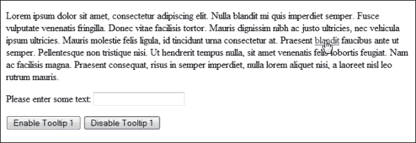

在 JavaScript 中，我们使用`Enable Tooltip`按钮的`click`事件调用`tooltip()`小部件方法。为了这样做，我们将字符串`enable`作为第一个参数传递给`tooltip()`方法。此外，我们将要启用的选项卡的索引号作为第二个参数传递。jQueryUI 中的所有方法都是以这种方式调用的。我们指定要调用的方法的名称作为小部件方法的第一个参数；`disable`方法的使用方式相同。

### 注

不要忘记，如果您将`$(document)`设置为工具提示工作的元素，那么我们可以在没有附加参数的情况下使用这两种方法，以便启用或禁用该页面上的所有工具提示。

# 以编程方式显示工具提示

除了以编程方式启用或禁用工具提示外，我们还可以通过单击屏幕上的按钮或适当链接，随意显示或隐藏工具提示。在下一个示例中，让我们同时使用这两个选项，任意显示或隐藏其中一个工具提示。

在`tooltip11.html`中，更改现有标记的最后几行，如图所示：

```js
<label for="input">Please enter some text:</label>
<input type="text" id="tooltip2" title="I am a tooltip!">
<p>
 <button id="showtip">Show (open) Tooltip</button>
 <button id="hidetip">Hide (close) Tooltip</button>
</p>
```

接下来，让我们更改最后的`<script>`元素，以包括将分配给我们刚才添加的新按钮的新事件处理程序：

```js
<script>
  $(document).ready(function($){
 $("#tooltip").tooltip();

 $("#showtip").click(function(){
 $("#tooltip").tooltip("open");
 })
 $("#hidetip").click(function(){
 $("#tooltip").tooltip("close");
 })
  });  
</script>        
```

将修改后的文件另存为`tooltip12.html`。将页面加载到浏览器中并单击**显示（打开）工具提示**按钮时，您将看到工具提示出现：

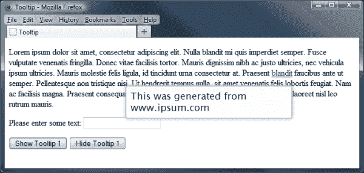

在 JavaScript 中，我们使用**显示（打开）工具提示**按钮的点击事件来调用工具提示小部件并显示工具提示。为此，我们只需要将一个属性（即字符串 open）传递给`tooltip()`方法。当我们需要隐藏（或关闭）工具提示时，我们可以通过类似的方式将字符串 close 作为调用工具提示小部件的部分传递。

# 处理工具提示事件

工具提示小部件定义了三个事件，当检测到小部件暴露的某些事件时，允许您添加回调函数以执行不同的操作。下表列出了能够在事件上接受可执行函数的配置选项：

<colgroup><col style="text-align: left"> <col style="text-align: left"></colgroup> 
| 

事件

 | 

当…

 |
| --- | --- |
| `close` | 工具提示关闭或在`focusout`或`mouseleave`上触发 |
| `create` | 工具提示被创建 |
| `open` | 在`focusin`或`mouseover`上显示工具提示或触发 |

库的每个组件都有回调选项（如上表中的选项），这些选项经过调整以查找任何访问者交互中的关键时刻。我们在这些回调中使用的任何函数通常在更改发生之前执行。因此，您可以从回调中返回`false`并防止该操作发生。

在下一个示例中，我们将了解使用标准的非绑定技术对显示的特定工具提示作出反应是多么容易。更改`tooltip12.html`中的最后一个`<script>`元素，使其显示如下：

```js
<script>
  $(document).ready(function($){
    $("#tooltip").tooltip({
      open: function(event, ui) {
        $("#console").append("Tooltip activated" + "<br>");
      },
      close: function(event, ui) {
        $("#console").append("Tooltip closed" + "<br>");
      }
    });
    $("#tooltip").tooltip();
  });  
</script>
```

另存为`tooltip13.html`。我们还需要修改我们的标记，因此移除现有标记底部的两个按钮，并插入一个新的历史记录`<div>`，如图所示：

```js
 <div id="history">
 <b>History:</b> 
 <div id="console"></div>
 </div>
</body>
```

最后，我们需要添加一点样式，以使显示外观美观。在新文档中，添加以下内容：

```js
#history { border-radius: 4px; border: 1px solid #c4c4c4; width: 250px; padding: 3px; margin-top: 15px; }
```

将其保存在`css`文件夹中为`tooltipEvents.css`。别忘了从我们页面的`<head>`链接到新样式表（在链接到标准 jQuery UI 样式表之后）：

```js
<link rel="stylesheet" href="css/tooltipEvents.css">
```

如果我们在浏览器中预览结果，然后在工具提示链接上移动几次。我们可以开始看到历史累积，如此屏幕截图所示：

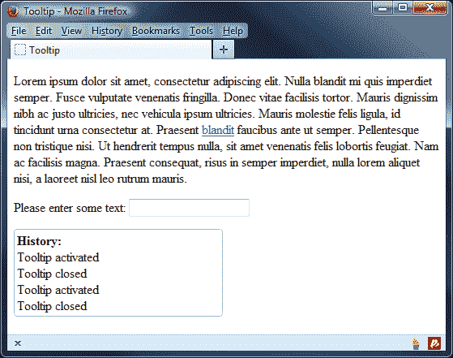

在本例中，我们使用了`open`和`close`回调，尽管创建自定义事件的原理相同，但工具提示也可以触发该事件。回调函数的名称作为配置对象中的`open`和`close`属性的值提供。

当小部件执行回调函数时，它会自动将两个参数传递给我们定义的回调函数。这些是原始的`event`对象和`custom ui`对象，包含显示的工具提示中的有用属性。

## 绑定到工具提示事件

使用每个组件公开的事件回调是处理交互的标准方式。但是，除了上表中列出的回调之外，我们还可以查看每个组件在不同时间触发的另一组事件。

我们可以使用标准 jQuery`on()`方法将事件处理程序绑定到自定义事件，该事件由工具提示小部件以与绑定到标准 DOM 事件（如单击）相同的方式触发。

下表列出了工具提示小部件的自定义绑定事件及其触发器：

<colgroup><col style="text-align: left"> <col style="text-align: left"></colgroup> 
| 

事件

 | 

当…

 |
| --- | --- |
| `tooltipcreate` | 将创建一个工具提示 |
| `tooltipopen` | 在`focusin`或`mouseover`上显示或触发工具提示 |
| `tooltipclose` | 工具提示在`focusout`或`mouseleave`上关闭或触发 |

创建工具提示后，将立即触发第一个事件；其余两个将根据工具提示是否已收到焦点而激发。

让我们看看这类事件的实际情况；将`tooltip13.html`中的最终`<script>`元素更改为以下内容：

```js
<script>
  $(document).ready(function($){
    $("#tooltip").tooltip();
    $("#tooltip").on("tooltipopen", function(event, ui) {
      $("#console").append("Tooltip activated" + "<br>");
    })

    $("#tooltip").on("tooltipclose", function(event, ui) {
      $("#console").append("Tooltip closed" + "<br>");
    })
  });  
</script>
```

将此更改另存为`tooltip14.html`。以这种方式绑定到`tooltipopen`和`tooltipclose`事件处理程序，使用`open`和`close`回调函数生成与前面示例相同的结果。与上次一样，每次将鼠标悬停在文本中的工具提示上时，都应该更新控制台日志。

所有小部件公开的所有事件都可以与`on()`方法一起使用，只需在事件名称前加上小部件名称。

# 播放视频

到目前为止，我们已经介绍了大量关于使用 jQueryUI 工具提示的理论；在本例和下一个示例中，我们将了解工具提示的一些实际用途，您可以将其用作自己项目的起点。在继续之前，请确保您有一份可用的代码下载副本，因为我们将在本练习中使用其中的文件。

工具提示的一个可能用途是模仿你在社交媒体网站（如 YouTube）上可能找到的“喜欢”或“不喜欢”按钮，在那里你可以注册你对喜欢观看的视频的偏好。让我们来看看如何在您自己的项目中复制功能，但是使用工具提示和我们在本书中已经涵盖的其他 jQuery UI 小部件。

### 注

这个演示使用了一个开源项目 Prodit ?? 的视频：大 Buck 兔子 To1 ??，由 Po.?? Bulter 基金会 To3T3 创建，可从 http://www.bigbuckbunny.org 。

从代码下载中提取`tooltipVideo.js`的副本；这将提供将按钮和工具提示添加到视频底部的功能。别忘了从我们页面的`<head>`链接到新的 JavaScript 文件（在链接到 jQuery UI 按钮小部件之后）：

```js
<script src="js/tooltipVideo.js"></script>
```

我们还需要在页面的`<head>`中添加对按钮小部件的引用：

```js
<script src="development-bundle/ui/jquery.ui.button.js"></script>
```

接下来，更改`<body>`，使其包含以下元素：

```js
<div class="player">
  <video controls="controls">
      <source src="video/big_buck_bunny.mp4" />
      <source src="video/big_buck_bunny.webm" />
    </video>
  </div>
  <p>
  <div class="tools">
    <span class="set">
      <button data-icon="ui-icon-circle-arrow-n" title="I like this">Like</button>
      <button data-icon="ui-icon-circle-arrow-s">I dislike this</button>
    </span>
    <div class="set">
      <button data-icon="ui-icon-circle-plus" title="Add to Watch Later">Add to</button>
      <button class="menu" data-icon="ui-icon-triangle-1-s">Add to favorites or playlist</button>
    </div
    <button title="Share this video">Share</button>
    <button data-icon="ui-icon-alert">Flag as inappropiate</button>
</div>

```

最后但并非最不重要的是，我们还需要添加一些样式，以确保工具提示正确显示。将以下内容添加到文本编辑器中的新文档中：

```js
.player { width: 642px; height: 362px; border: 2px groove gray; background: rgb(200, 200, 200); text-align: center; line-height: 300px; }
.ui-tooltip { border: 1px solid white; background: rgba(20, 20, 20, 1); color: white; }
.set { display: inline-block; }
.notification { position: absolute; display: inline-block; font-size: 2em; padding: .5em; box-shadow: 2px 2px 5px -2px rgba(0,0,0,0.5); }
```

将其另存为`tooltipVideo.css`，保存到`css`文件夹中–不要忘记在链接到 jQuery UI 样式表之后立即从主文档添加一个链接：

```js
<link rel="stylesheet" href="css/tooltipVideo.css">
```

将修改后的页面另存为`tooltip15.html`。以下屏幕截图显示了在浏览器中预览视频时页面的显示方式：

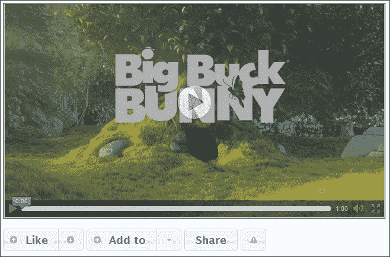

以这种方式使用按钮可以让我们为网站添加一些真正强大的功能。在我们的示例中，这些按钮实际上什么都不做（除了显示工具提示），但在现实生活中，它们将用于维护观看视频的人的连续记录，并希望注册他们喜欢（或不喜欢）的人。

# 填写并验证表格

在本章中，我们已经介绍了如何在我们的站点中实现工具提示，并根据我们的需要配置它们。但是，我们无法完成这一章，如果不看一下在站点表单验证中工具提示的最重要（或最常见？）的使用。

我相信这些年来，你很可能会在网上填写表格；也许是购买东西的一部分，你在完成的时候会犯错误。工具提示的美妙之处在于，我们可以使用它们向访问者提供一些反馈，以确保它们正确填写字段，并且不会在表单中输入无效值。

在文本编辑器中，将最后的`<script>`块从`tooltip14.html`更改为`<script>`，如下代码所示：

```js
$(document).ready(function($){
  $("button").button();
  var $tooltips = $('#signup [title]').tooltip({
    position: { my: "left+15 center", at: "right center" }
  });
  $("#open").on('click', function() {
    $tooltips.tooltip('open');
  });
  $("#close").on('click', function() {
    $tooltips.tooltip('close');
  });
});
```

在本例中，我们使用 JQuery UI 的按钮小部件，因此需要从 JQuery UI 的库中添加到小部件的链接：

```js
<script src="development-bundle/ui/jquery.ui.button.js"></script>
```

接下来，我们需要为表单添加标记–删除现有标记，并将其替换为以下内容：

```js
<form id="signup">
  <fieldset>
    <legend>Sign Up Now</legend>   
    <div>        
      <label for="username">Username:</label>
      <input type="text" name="username" id="username" title="User name must be between 8 and 32 characters."><br>
    </div>
    <div>
      <label for="password">Password:</label>
      <input type="password" name="password" title="Password must contain at least one number.">
    </div>
    <div>
      <label for="password2">Confirm Password:</label>
      <input type="password" name="password2" title="Please re-type your password for confirmation.">
    </div>
  </fieldset>
</form>
  <button id="open">Open Help</button>
  <button id="close">Close Help</button>
```

另存为`tooltip16.html`。我们还需要一点 CSS 来完成这个例子。在我们刚刚创建的页面的`<head>`中，添加以下`<link>`元素：

```js
<link rel="stylesheet" href="css/tooltipForm.css">
```

然后在文本编辑器的新页面中，添加以下代码：

```js
body { font-family: verdana, sans-serif; width: 430px; }
label { display: inline-block; width: 11em; }
button { float: right; margin: 2px; }
fieldset { width: 400px; border: 3px solid black; border-radius: 4px; margin: 3px; border-color: #7c96a9; font-size: 1.1em;}
fieldset div { margin-bottom: 1.2em; }
fieldset .help { display: inline-block; }
.ui-tooltip { width: 300px; font-size: 0.7em; }
```

将此保存为`css`文件夹中的`tooltipForm.css`。如果我们在浏览器中预览页面，您将在鼠标悬停在上面时看到每个工具提示，或者在点击**打开帮助**按钮时可以全部显示，如以下屏幕截图所示：

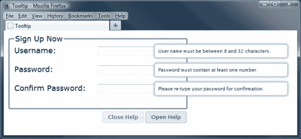

在本例中，我们将 jQuery UI 设置为显示每个字段的`[title]`属性上的工具提示。但是，当我们将 tooltip 方法处理程序分配给`$tooltips`变量时，我们能够使用它为每个按钮创建一个单击处理程序，该处理程序将显示或隐藏所有工具提示，具体取决于按下哪个按钮。当出现问题时，我们还可以向用户显示消息；例如，如果密码输入错误，我们可以使用输入字段的`blur`事件处理程序在屏幕上打开工具提示。

# 总结

呸！对于这样一个小部件，我们当然涵盖了很多领域！

工具提示小部件是向用户传达短信息（如错误或警报）的绝佳方式，您甚至可以将其用作迷你帮助系统；让我们回顾一下本章所涵盖的内容。

我们首先研究了如何使用一点底层 HTML 和一行 jQuery 风格的 JavaScript 实现默认的工具提示小部件。然后，我们看到了设计工具提示小部件的样式是多么容易，可以使用预先设计的 ThemeRoller 主题，也可以使用我们自己的主题；所以它的外观，而不是它的行为，被改变了。

然后，我们继续研究工具提示 API 公开的一组可配置选项，以及如何使用这些选项来控制小部件提供的选项。根据可配置选项，我们介绍了一些方法，可以使用这些方法以编程方式使工具提示执行不同的操作，例如启用或禁用特定的工具提示。

我们简要介绍了 tooltips 小部件支持的一些更复杂的功能，例如基于 AJAX 的工具提示，以及为表单提供上下文。这两种技术都易于使用，可以为任何实现增加价值。

现在，我们已经完成了 UI 小部件的学习，让我们从拖动小部件开始，关注库中可用的一些交互。