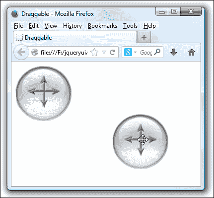

# 十一、拖放

到目前为止，在本书中，我们已经涵盖了全面发布的界面小部件，在接下来的四章中，我们将把重点转移到核心交互助手上。这些小部件为小部件提供基于鼠标的交互，我们可以在其中执行操作，例如选择、拖动或调整网站上的小部件大小。一个完美的例子是可调整大小的小部件，我们将在[第 12 章](12.html "Chapter 12. The Resizable Component")*中介绍可调整大小的组件*。库中的这些交互组件与我们已经看到的不同，它们不是页面上存在的物理对象或小部件。

这些是低级交互组件，与本书第一部分中介绍的高级小部件不同。它们有助于页面上使用的元素对访问者更具吸引力和交互性，从而为网站增加价值，并有助于使 web 应用看起来更专业。它们还有助于模糊浏览器和桌面之间的区别，并提供更高的可用性，使 web 应用更高效、更自然。

在本章中，我们将介绍两个非常密切相关的组件：**可拖放组件**和**可拖放组件**。DragTables API 将任何指定的元素转换为访问者可以用鼠标指针拾取并在页面上拖动的内容。公开的方法允许您限制 draggables 的移动，使其在被删除后返回到起始点，等等。

在本章中，我们将介绍以下主题：

*   如何使元素可拖动
*   可用于配置可拖动对象的选项
*   拖动结束后，如何使图元返回其起点
*   如何在交互中的不同点使用事件回调
*   拖动辅助对象的角色
*   包含拖拉物的
*   如何使用组件的方法控制可拖动性
*   将一个元素转化为投放目标
*   定义可接受的拖动项
*   使用可删除的类名
*   定义跌落公差
*   对可拖放和可拖放之间的相互作用作出反应

Dropables API 允许您定义页面的一个区域或某种容器，以便人们将可拖动的内容放到其中，以使其他事情发生，例如，在将产品添加到购物篮时。一组丰富的事件由可拖放的小部件触发，让我们对任何拖动交互中最有趣的时刻做出反应。

# 可拖放和可拖放的交易

作为行为的拖放是相互关联的。一个在哪里，另一个总是在附近。在网页上拖动一个元素是非常好的，但是如果没有地方可以拖动该元素，整个操作通常是毫无意义的。

您可以独立于`droppable`类使用`draggable`类，因为纯粹为了拖动而拖动可以有它的用途，例如对话框组件。但是，如果没有`draggable`类，您就不能使用`droppable`类。当然，您不需要使用 draggable 的任何方法，但是使用 Droppable 而不使用任何东西是毫无价值的。

但是，与小部件一样，可以组合一些交互助手；拖拽式和下拉式显然是同时存在的。但是 DragTables 也可以用于排序表，我们将在[第 13 章](13.html "Chapter 13. Selecting and Sorting with jQuery UI")中看到，*使用 jQuery UI*进行选择和排序，以及调整大小。

# 开始使用可拖动小部件

draggables 组件用于使任何指定的元素或元素集合可拖动，以便访问者可以拾取并在页面中移动它们。可拖动性是一个很好的效果，它是一个可以通过多种方式来改善网页界面的特性。

使用 jQueryUI 意味着我们不必担心浏览器之间的所有微妙差异，这些差异最初使网页上的可拖动元素成为实现和维护的噩梦。

## 实现基本拖动

让我们先来看看默认实现，它将一个简单的`<div>`元素设置为可拖动的。我们不会做任何额外的配置。因此，这段代码只允许您用鼠标指针拾取元素并在视口中拖动它。

在文本编辑器的新文件中，添加以下代码：

```js
<!DOCTYPE HTML>
<html>
  <head>
    <meta charset="utf-8">
    <title>Draggable</title>
    <link rel="stylesheet" href="development-bundle/themes/redmond/jquery.ui.all.css">
    <link rel="stylesheet" href="css/autocompleteTheme.css">
    <script src="js/jquery-2.0.3.js"></script>
    <script src="development-bundle/ui/jquery.ui.core.js"></script>
    <script src="development-bundle/ui/jquery.ui.widget.js"></script>
    <script src="development-bundle/ui/jquery.ui.mouse.js"></script>
    <script src="development-bundle/ui/jquery.ui.draggable.js "></script>
    <script>
      $(document).ready(function($){
        $("#drag").draggable();
      });
    </script> 
  </head>
  <body>
    <div id="drag"></div>
  </body>
</html>
```

将此保存为`draggable1.html`在您的`jqueryui`文件夹中。与 jQueryUI 中基于小部件的组件一样，可以使用一行代码启用可拖动组件。这将调用 DragTable 的构造函数方法：`draggable`并将指定的元素转换为 drag 对象。

我们需要库中的以下文件来启用元素的可拖动性：

*   `jquery-2.0.3.js`
*   `jquery.ui.core.js`
*   `jquery.ui.widget.js`
*   `jquery.ui.mouse.js`
*   `jquery.ui.draggable.js`

我们使用的是一个普通的`<div>`元素，其背景图像在 CSS 文件中指定，我们链接到页面的`<head>`标记中。对拖动元素使用以下样式表：

```js
#drag { width: 114px; height: 114px; cursor: move; background: url(../img/draggable.png) no-repeat; }
```

将此保存为`css`文件夹中的`draggable.css`。当您在浏览器中查看页面时，您将看到图像可以在可拖动区域周围移动，如以下屏幕截图所示：


# 配置可拖动选项

可拖动组件具有广泛的可配置选项，使我们能够很好地控制它添加的行为。下表列出了可用于配置和控制拖动元素的选项：

<colgroup><col style="text-align: left"> <col style="text-align: left"> <col style="text-align: left"></colgroup> 
| 

选项

 | 

默认值

 | 

过去…

 |
| --- | --- | --- |
| `addClasses` | `true` | 将`ui-draggable`类添加到拖动对象。设置为`false`以防止添加该类。 |
| `appendTo` | `"parent"` | 为附着有辅助对象的拖动对象指定容器元素。 |
| `axis` | `false` | 将拖动对象约束到一个运动轴。接受字符串`x`和`y`作为值，或接受布尔值`false`。 |
| `cancel` | `":input, option"` | 如果某些元素与指定的元素选择器匹配，则防止其被拖动。 |
| `connectToSortable` | `false` | 允许将拖动的对象放到可排序列表中，并成为排序元素之一。 |
| `containment` | `false` | 防止拖动对象被拖出其父元素的边界。 |
| `cursor` | `"auto"` | 指定当指针位于拖动对象的上方时要使用的 CSS 光标。 |
| `cursorAt` | `false` | 指定一个默认的位置，当光标被拖动时，光标相对于拖动对象显示。 |
| `delay` | `0` | 指定拖动交互开始延迟的时间（以毫秒为单位）。 |
| `disabled` | `false` | 禁用可拖动设备上的拖动。 |
| `distance` | `1` | 在拖动开始之前，指定鼠标按钮按住拖动对象时指针应移动的距离（以像素为单位）。 |
| `grid` | `false` | 使拖动的对象捕捉到页面上的虚拟网格。接受包含网格的`x`和`y`像素值的数组。 |
| `handle` | `false` | 定义拖动对象的特定区域，该区域用于固定指针，以便拖动。 |
| `helper` | `"original"` | 定义一个被拖动的伪拖动元素，而不是拖动对象。可以接受字符串值 original 或 clone，也可以接受返回 helper 元素的函数。 |
| `iframeFix` | `false` | 在拖动过程中，停止页面上的所有`<iframe>`元素捕获鼠标事件。 |
| `opacity` | `false` | 设置辅助元素的不透明度。 |
| `refreshPositions` | `false` | 计算拖动过程中所有落物的位置。 |
| `revert` | `false` | 当设置为`true`时，一旦拖动结束，使拖动对象返回其开始位置。也可以接受字符串有效和无效，其中仅当拖动对象被放置在有效的放置对象上时，才会应用 revert，反之亦然。 |
| `revertDuration` | `500` | 设置拖动对象返回其起始位置所需的毫秒数。 |
| `scope` | `"default"` | 设置拖动对象相对于对其有效的拖放对象的范围。 |
| `scroll` | `true` | 当拖动对象在视口边缘的阈值内移动时，使视口自动滚动。 |
| `scrollSensitivity` | `20` | 在滚动开始之前，定义拖动对象与视口边缘的距离（以像素为单位）。 |
| `scrollSpeed` | `20` | 将视口滚动的速度设置为。 |
| `snap` | `false` | 使拖动对象捕捉到指定元素的边缘。 |
| `snapMode` | `"both"` | 指定拖动对象将捕捉到的元素边。可设置为`inside`、`outside`或`both`。 |
| `snapTolerance` | `20` | 设置在捕捉发生之前，拖动对象的捕捉元素应到达的距离。 |
| `stack` | `false` | 确保当前拖动对象始终位于同一组中其他拖动对象的顶部。接受包含`group`和/或`min`属性的对象。 |
| `zIndex` | `false` | 设置辅助元素的`zIndex`。 |

## 使用配置选项

让我们使用其中的一些选项。它们的配置方式与我们在前面章节中看到的小部件公开的选项完全相同，并且通常具有 getter 和 setter 模式。

在刚才的第一个示例中，我们使用 CSS 指定当指针悬停在可拖动的`<div>`上时应使用移动光标。让我们对此进行更改，并改用 DragTables 组件的`cursor`选项。

从 draggable.css 中删除`cursor: move`，并将其重新保存为`draggableNoCursor .css`。同时更改`draggable1.html`中的`<link>`标记，以引用新文件：

```js
<link rel="stylesheet" href="css/draggableNoCursor.css">
```

然后将最后的`<script>`元素更改为以下元素：

```js
<script>
 $(document).ready(function($){
 $("#drag").draggable({
 cursor: "move"
 });
 });
</script>
```

将此保存为`draggable2.html`，然后在浏览器中试用。关于此选项需要注意的一点是，在实际开始拖动之前，不会应用我们指定的移动光标。当使用这个选项代替简单的 CSS 时，我们也许应该提供一些其他的视觉提示，说明元素是可拖动的。

让我们再看看 draggable 的许多配置选项。将`draggable2.html`中的配置对象更改为：

```js
$("#drag").draggable({
 cursor: "move",
 axis: "y",
 distance: "30",
 cursorAt: { top: 0, left: 0 }
});
```

可另存为`draggable3.html`。我们配置的第一个新选项是`axis`选项，它限制 Dragable 只能在页面中向上或向下移动，但不能在页面上左右移动。

接下来，我们指定了`30`作为`distance`选项的值。这意味着在开始拖动之前，光标必须在按住鼠标键的情况下在拖动对象上移动`30`像素。

最后一个选项`cursorAt`使用对象文字进行配置，其属性可以是`top`、`right`、`bottom`或`left`。提供给我们选择使用的属性的值是相对于拖动对象的值，当发生拖动时，光标将假定该拖动对象。

但是，在本例中，您会注意到，`left`选项的值似乎被忽略。原因是我们已经配置了`axis`选项。开始拖动时，拖动对象将自动移动，使光标位于元素顶部的`0`像素处，但不会移动，使光标位于我们指定的左边缘`0`像素处，因为拖动对象无法向左移动。

让我们看看更多的 Dragable 的选项。更改`draggable3.html`使配置对象显示如下：

```js
$("#drag").draggable({
 delay: 500,
 grid: [100,100]
});
```

将文件另存为`draggable4.html`。`delay`选项以毫秒为单位，指定在开始拖动之前，光标必须在拖动对象上按住鼠标按钮的时间长度。

`grid`选项的用法与滑块小部件的`steps`选项类似。它使用两个值的数组进行配置，这两个值表示拖动元素在拖动时应沿每个`axis`跳跃的像素数。此选项可与`axis`选项一起安全使用。

## 重置被拖动的元件

将拖动对象配置为在对象被拖放后返回其在页面上的原始起始位置非常容易，并且有几个选项可用于控制此行为。更改我们与`draggable4.html`一起使用的配置对象，使其显示如下：

```js
$("#drag").draggable({
 revert: true
});
```

另存为`draggable5.html`。通过提供`true`作为`revert`选项的值，我们已经使拖动对象在任何拖动交互结束时返回其起始位置。但是，您会注意到，drag 元素并不是立即弹回其起始位置。相反，它平滑地设置了动画，不需要额外的配置。

另一个与还原相关的选项是`revertDuration`选项，我们可以使用它来控制还原动画的速度。更改`draggable5.html`中的配置对象，使其显示如下：

```js
$("#drag").draggable({
 revert: true,
 revertDuration: 100
});
```

另存为`draggable6.html`。`revertDuration`选项的默认值为`500`毫秒，因此通过将其降低到`100`，动画的相对速度会显著提高。

动画的实际速度将始终根据从下降点到起点的距离在飞行中确定。`revertDuration`选项仅定义动画时间长度的目标。

## 增加拖柄支架

`handle`选项允许我们定义可用于拖动对象的拖动对象区域。不能使用其他区域来拖动对象。一个简单的类比是`dialog`小部件。只有单击并按住标题栏，才能拖动对话框。标题栏是拖动控制柄。

在下面的示例中，我们将向拖动对象添加一个简单的拖动控制柄。将新的空`<div>`元素放入拖动元素中：

```js
<div id="drag">
  <div id="handle"></div>
</div>
```

然后，将配置对象更改为以下对象：

```js
$("#drag").draggable({
 handle: "#handle"
});
```

另存为`draggable7.html`。我们已经为新的`<div>`赋予了`id`属性，然后在配置对象中将该`id`指定为`handle`选项的值。

句柄使用一些简单的样式规则进行样式设置。将以下新样式添加到`draggableNoCursor.css`：

```js
#handle {
  width:30px; height:30px; border-bottom:2px solid #ff0000;
  border-left:2px solid #ff0000; position:absolute;
  right:10px; top:10px; cursor:move;
}
```

将此保存为`css`文件夹中的`dragHandle.css`。别忘了从`draggable7.html`的`<head>`链接到新样式表：

```js
<link rel="stylesheet" href="css/dragHandle.css">
```

当我们在浏览器中预览页面时，我们看到原始的拖动对象仍然是可拖动的，但只有在用指针选择手柄时，如下图所示：


## 添加辅助元素

几个配置选项与拖动辅助程序直接相关。辅助对象是一个替代元素，用于在拖动过程中显示对象在屏幕上的位置，而不是移动实际的可拖动对象。

辅助对象可以是一个非常简单的对象，而不是实际的拖动对象。它可以帮助降低拖动操作的强度，减轻访问者处理器上的负载。完成拖动后，可以将实际图元移动到新位置。

让我们看看在下面的示例中如何使用助手。移除我们用于`handle`的`<div>`元素，并返回`draggable7.html`中的`draggable.css`样式表，然后将配置对象更改为以下对象：

```js
$("#drag").draggable({
 helper: "clone"
});
```

将此文件另存为`draggable8.html`。我们还需要调整 CSS，使光标改变以指示我们在适当的时间移动图像。将`draggable.css`中的 CSS 修改如下：

```js
#drag, .ui-draggable { width: 114px; height: 114px; background: url(../img/draggable.png) no-repeat; }
.ui-draggable-dragging { cursor: move; }
```

`helper`选项的值`clone`导致创建原始拖动对象的精确副本，并将其用作可拖动对象。因此，原始对象始终保持在其起始位置。这也会导致`clone`对象返回其起始位置，即使通过提供`false`作为`revert`选项的值，也无法改变此效果。以下屏幕截图显示了`clone`选项的作用：



除了字符串`clone`和默认值`original`之外，我们还可以使用函数作为该选项的值。这允许我们指定自己的自定义元素用作帮助器。

将`draggable8.html`中的最终`<script>`元素更改为以下元素：

```js
<script>
  $(document).ready(function($){
 function helperMaker() {
 return $("<div />", {
 css: {
 border: "4px solid #ccc",
 opacity: 0.5,
 height: 110,
 width: 120
 }
 });
 } 
 $("#drag").draggable({
 helper: helperMaker
 });
  });
</script>
```

将此文件另存为`draggable9.html`。我们的`helperMaker()`函数使用标准 jQuery 功能创建一个新的`<div>`元素，然后在其上设置一些 CSS 属性来定义其物理外观。然后，重要的是，它返回新元素。当提供一个函数作为`helper`选项的值时，该函数必须返回一个元素（如本例中的 jQuery 对象或实际的 DOMNode）。

现在，当拖动开始时，是我们的自定义辅助对象成为拖动对象。因为自定义元素比原始的拖动对象简单得多，所以它可以帮助提高使用它的应用的响应能力和性能。

### 提示

确保在使用 helper（clone）元素时，将该元素与 class 而不是 id 一起使用，因为 id 在 DOM 中必须是唯一的，并且克隆将复制它。

以下屏幕截图显示了我们的自定义帮助程序：


### 提示

**辅助性混浊**

在创建自定义助手的过程中，我们在本例中使用了`css`jQuery 方法。但是，我们也可以使用拖动对象的`opacity`选项将辅助对象元素的不透明度设置为跨平台解决方案。

## 限制阻力

阻力场景的另一个方面是遏制。到目前为止，在我们的示例中，页面的`<body>`元素一直是拖动对象的容器。我们还可以配置一些选项来指定拖动对象相对于另一个容器元素的行为。

我们将在以下示例中查看这些内容，从`containment`选项开始，该选项允许我们为拖动对象指定容器元素。在`draggable9.html`的`<head>`标记中，将以下链接添加到我们将在本例中使用的样式表：

```js
<link rel="stylesheet" href="css/draggableContainer.css">
```

然后将拖曳元件包裹在容器`<div>`内，如下所示：

```js
<div id="container">
  <div id="drag"></div>
</div>
```

然后将配置对象更改为以下内容：

```js
$("#drag").draggable({
 containment: "parent"
});
```

将此变体另存为`draggable10.html`。在页面上，我们添加了一个新的`<div>`元素作为现有 drag 元素的父元素。在代码中，我们为`containment`选项使用了值`parent`，因此作为拖动对象直接父元素的元素（本例中`<div>`元素的`id`为`container`将用作容器。

父项`<div>`需要一些基本的样式来为其提供尺寸，这样才能在页面上看到它。将以下代码添加到`draggable.css`并将文件重新保存为`draggableContainer.css`。请记住，此字符串不是元素或 jQuery 选择器的`id`（尽管也支持选择器）。

```js
#container { height: 250px; width: 250px; border: 2px solid #ff0000; }
```

当您在浏览器中运行页面时，您将看到拖动对象不能超出其容器的边界。

除了本例中使用的字符串`parent`，我们还可以指定一个选择器，例如：

```js
$("#drag").draggable({
 containment: "#container"
});
```

有三个附加选项与容器中的拖动对象相关，这些选项都与滚动相关。但是，您应该注意，这些仅在文档是容器时适用。

`scroll`选项的默认值为`true`，但当我们将`<div>`元素拖动到容器边缘时，它不会滚动。您可能已经注意到，在前面的示例中，如果拖动对象不在指定的容器中，视口会自动滚动。如果需要，我们可以通过在样式表中将 CSS`overflow`样式设置为`auto`来解决这个问题。

## 折断

通过配置捕捉，拖动元件可以获得几乎的磁性。此功能使被拖动的元素在被拖动时与指定的元素对齐。

在下一个示例中，我们将查看捕捉对拖动对象行为的影响。去掉我们在上一个示例中添加的容器，并在 drag 元素之后直接添加一个新的空`<div>`元素，如下所示：

```js
<div id="drag"></div>
<div id="snapper"></div>

```

然后，更改配置对象，使其显示如下：

```js
$("#drag").draggable({
 snap: "#snapper",
 snapMode: "inner",
 snapTolerance: 50
});
```

另存为`draggable11.html`。我们还需要一些额外的样式；在`draggable.css`底部添加以下代码：

```js
#snapper {
  width: 300px; height: 300px; border: 1px solid #ff0000;
}
```

将此文件另存为`css`目录中的`draggableSnap.css`。别忘了在页面的`<head>`元素中添加指向新样式表的链接：

```js
<link rel="stylesheet" href="css/draggableSnap.css">
```

我们在配置对象中提供了选择器`#snapper`作为`snap`选项的值，并在页面中添加了一个`<div>`元素和一个匹配的`id`。因此，当拖动对象时，我们的拖动对象将捕捉到页面上的元素。

我们还将`snapMode`选项设置为`inner`（其他可能的值为`outer`和`both`，因此捕捉将发生在`snapper`元素的内边缘。如果我们将该元素拖向`snapper`元素的外边缘，并在公差范围内，该元素将捕捉到内边缘。

最后，我们将`snapTolerance`设置为`50`、，这是在捕捉发生之前，拖动对象需要到达`snapper`元素的最大距离（以像素为单位）。只要拖动对象在该范围内，它就会捕捉到图元。

当我们拖动 Snaper 元素边缘`50`像素范围内的图像时，拖动对象将自动与该边缘对齐，如以下屏幕截图所示：


# 可拖动事件回调

除了已经介绍过的选项外，还有三个选项可以用作回调函数，在特定自定义事件发生后执行代码。

下表列出了这些事件：

<colgroup><col style="text-align: left"> <col style="text-align: left"></colgroup> 
| 

事件

 | 

当…

 |
| --- | --- |
| `drag` | 拖动时鼠标被移动 |
| `start` | 拖动开始 |
| `stop` | 拖动停止 |

定义回调函数以使用这些事件时，这些函数将始终自动接收两个参数：作为第一个参数的原始事件对象，以及包含以下属性的第二个对象：

<colgroup><col style="text-align: left"> <col style="text-align: left"></colgroup> 
| 

所有物

 | 

用法

 |
| --- | --- |
| `helper` | 一个 jQuery 对象表示辅助元素。 |
| `position` | 具有属性的嵌套对象：`top`和`left`，这是辅助元素相对于原始拖动元素的位置。 |
| `offset` | 一个嵌套对象，具有属性：`top`和`left`，这是辅助元素相对于页面的位置。 |

使用回调和作为参数传递的两个对象非常简单。我们可以看一个简单的例子来强调它们的用法。移除`draggable11.html`中的按扣`<div>`，并更改配置对象如下：

```js
$("#drag").draggable({
 start: function(e, ui) {
 ui.helper.addClass("up");
 },
 stop: function(e, ui) {
 ui.helper.removeClass("up");
 }
});
```

另存为`draggable12.html`。对于这个例子，我们还需要一个新的样式表；将以下代码添加到`draggable.css`：

```js
#drag.up {
  width: 120px; height: 121px;
  background: url(../img/draggable_on.png) no-repeat;
}
```

将此版本的样式表另存为`css`目录中的`draggableEvents.css`，不要忘记更新页面`<head>`元素中指向新样式表的链接。

在本例中，我们的配置对象只包含两个选项`start`和`stop`回调。我们将文字函数设置为这些选项的值。本例中所有函数所做的是分别添加或删除类名。

类名为 Dragable 元素添加了一个稍有不同的背景图像，应用该图像时，屏幕截图之前和期间显示如下所示：


让我们继续看一个稍微复杂一点的例子，在这个例子中，我们可以利用传递给回调的第二个对象。我们需要在页面上添加一些新元素；更改页面的`<body>`元素，使其包含以下元素：

```js
<div id="container">
  <div id="drag"></div>
</div>
<div id="results"></div>

```

然后更改最后的`<script>`元素，使其显示如下：

```js
<script>
  $(document).ready(function($){
    $("#drag").draggable({
      stop: function(e, ui) {
        var rel = $("<p />", {
          text: "The helper was moved " + ui.position.top +  
          "px down, and " + ui.position.left + "px to the 
          left of its original position."
        }),
        offset = $("<p />", {
          text: "The helper was moved " + ui.offset.top + "px 
          from the top, and " + ui.offset.left + "px to the 
          left relative to the viewport."
        });
        $("#results").empty().append(rel).append(offset);
      }
    });
  });
</script>
```

另存为`draggable13.html`。我们定义了一个回调函数作为`stop`选项的值，因此每次拖动交互停止时都会执行该函数。我们的回调函数接收事件对象（我们不需要它，但必须指定它才能访问第二个对象）和一个包含有关可拖动辅助对象的有用信息的`ui`对象。

我们的函数只需要创建两个新的`<p>`元素，将`ui`对象中的值连接起来：`ui.position.top`、`ui.position.left`、`ui.offset.top`和`ui.offset.left`。然后在结果`<div>`中插入新元素。

以下是页面在拖动可拖动对象后的处理方式：


# Draggable 的方法

可拖动交互助手不公开自己的任何独特方法，只公开常见的 API 方法，即`destroy`、`disable`、`enable`、`option`和`widget`。

# 可拖放小部件入门

简而言之，jQueryUI 的 Dropables 组件为我们提供了一个放置拖放对象的位置。页面的某个区域被定义为可拖放区域，当拖动对象被拖放到该区域上时，会触发其他内容。使用此组件公开的扩展事件模型，可以非常轻松地对有效目标上的丢弃做出反应。

让我们从默认的可拖放实现开始。在文本编辑器的新文件中，添加以下页面：

```js
<!DOCTYPE HTML>
<html>
  <head>
    <meta charset="utf-8">
    <title>Droppable</title>
    <link rel="stylesheet" href="development-bundle/themes/redmond/jquery.ui.all.css">
    <link rel="stylesheet" href="css/droppable.css">
    <script src="http://code.jquery.com/jquery-2.0.3.js"></script>
    <script src="development-bundle/ui/jquery.ui.core.js"></script>
    <script src="development-bundle/ui/jquery.ui.widget.js"></script>
    <script src="development-bundle/ui/jquery.ui.mouse.js"></script>
    <script src="development-bundle/ui/jquery.ui.draggable.js"></script>
    <script src="development-bundle/ui/jquery.ui.droppable.js"></script>
    <script>
       $(document).ready(function($){
       $("#drag").draggable();
       $("#target").droppable();
      });
    </script>
  </head>
  <body>
    <div id="drag"></div>
    <div id="target"></div>
  </body>
</html>
```

另存为`droppable1.html`。在本例中，链接到的极其基本的样式表只是`draggable.css`的更新版本，如下所示：

```js
#drag { width:114px; height:114px; margin-bottom:5px; z-index:2; cursor:move; background:url(../img/draggable.png) no-repeat; }
#target { width:200px; height:200px; border:3px solid #000;
position:absolute; right:20px; top:20px; z-index:1; }
```

将此保存为`css`文件夹中的`droppable.css`。当页面在浏览器中运行时，它应该类似于以下屏幕截图：


在本例中，创建了可拖放文件；我们可以通过类名`ui-droppable`看到这一点，该类名在页面加载时添加到指定的元素中。

尽管我们没有在脚本中添加任何附加逻辑，但在拖放对象和拖放目标的整个交互过程中都会触发事件。在本章稍后的部分，我们将更详细地了解这些事件，以了解如何与它们挂钩，从而对成功的丢弃做出反应。

我们用于这个基本的可拖放实现的文件如下：

*   `jquery-2.0.3.js`
*   `jquery.ui.core.js`
*   `jquery.ui.widget.js`
*   `jquery.ui.mouse.js`
*   `jquery.ui.draggable.js`
*   `jquery.ui.droppable.js`

正如您所看到的，Dropables 组件是 Dragables 的扩展，而不是一个完全独立的组件。因此，除了它自己的源文件之外，它还需要`jquery.ui.draggable.js`文件。我们的 droppable 什么都不做的原因是因为我们还没有配置它，所以让我们接下来做。

# 配置可拖放

`droppable`类比`draggable`类小得多，可供我们使用的可配置选项也更少。下表列出了我们可用的选项：

<colgroup><col style="text-align: left"> <col style="text-align: left"> <col style="text-align: left"></colgroup> 
| 

选项

 | 

违约

 | 

过去…

 |
| --- | --- | --- |
| `accept` | `"*"` | 设置可拖放设备将接受的可拖放元素。 |
| `activeClass` | `false` | 在拖动接受的拖动对象时，设置应用于可拖放项的类。 |
| `addClasses` | `true` | 将`ui-droppable`类添加到可下拉列表中。 |
| `disabled` | `false` | 禁用可放下的按钮。 |
| `greedy` | `false` | 当拖放对象被拖放到嵌套的可拖放对象上时，停止从冒泡开始的拖放事件。 |
| `hoverClass` | `false` | 设置应用于可拖放的类，而接受的拖动对象在可拖放边界内。 |
| `scope` | `"default"` | 定义一组拖放对象和目标。 |
| `tolerance` | `"intersect"` | 设置触发可拖放上考虑的可接受拖动对象的模式。 |

## 配置已接受的拖动

为了从可拖放对象中获得可见的结果，我们将在下面的示例中一起使用两个可配置选项，当与接受的拖放对象交互时，这些选项将突出显示拖放目标。在`droppable1.html`中更改页面上的元素，使其显示如下：

```js
<div class="drag" id="drag1"></div>
<div class="drag" id="drag2"></div>
<div id="target"></div>
```

接下来，将最后的`<script>`元素更改为以下元素：

```js
<script>
 $(document).ready(function($){
 $(".drag").draggable();
 $("#target").droppable({
 accept: "#drag1",
 activeClass: "activated"
 });
  });
</script> 
```

另存为`droppable2.html`。`accept`选项采用选择器。在本例中，我们已经指定只有具有`id`或`drag1`的拖动对象才应该被可拖放对象接受。

我们还将激活的类名指定为`activeClass`选项的值。当接受的拖动对象开始拖动时，此类名将应用于可拖放对象。当可接受的拖动对象位于可拖放对象上方时，`hoverClass`选项可以以完全相同的方式用于添加样式。

这个例子需要一个新的样式表；修改`droppable.css`使其显示如下：

```js
.drag { width: 114px; height: 114px; margin-bottom: 5px; z-index:2; 
cursor: move; background: url(../img/draggable.png) no-repeat; }
#target { width: 200px; height: 200px; border: 3px solid #000;
position: absolute; right: 20px; top: 20px; z-index: 1; }
.activated { border: 3px solid #339900; background-color: #fe2e2e;}

```

将此文件另存为`css`文件夹中的`droppableActive.css`，并在页面的`<head>`元素中链接到它：

```js
<link rel="stylesheet" href="css/droppableActive.css">
```

当我们在浏览器中查看此页面时，我们会发现，当我们移动第一个拖动对象（定义为已接受）时，可拖放对象会拾取`activated`类并变为红色。但是，当移动第二个拖动对象时，放置目标不会响应。下面的屏幕截图显示了在正方形上拖动第一个拖动对象时页面的外观：


除了字符串值，`accept`选项还可以将函数作为其值。此功能将对页面上的每个拖动对象执行一次。该函数必须返回`true`以表示已接受拖动对象，或返回`false`以表示未接受拖动对象。

要查看动作中`accept`选项的功能值，请将`droppable2.html`中的最终`<script>`元素更改为以下元素：

```js
<script>
  $(document).ready(function($){
    $(".drag").draggable();
 function dragEnrol(el) {
 return (el.attr("id") === "drag1") ? true : false;
 }
 $("#target").droppable({
 accept: dragEnrol,
 activeClass: "activated"
      });
    });
  });
</script>
```

将此变体另存为`droppable3.html`。从表面上看，页面的工作原理与上一个示例中的完全相同。但这一次，可接受性是由`dragEnrol`函数中的 JavaScript 三元语句决定的，而不是一个简单的选择器。

### 注

请注意，我们与`accept`选项一起使用的函数已经自动传递了一个表示拖动对象的 jQuery 对象作为参数，因此我们可以在此对象上调用 jQuery 方法。这使得获取有关它的信息变得很容易，比如本例中的`id`。当需要选择器之外的高级筛选时，此回调非常有用。

# 配置跌落公差

跌落公差指的是可跌落装置检测拖曳物体是否在其上方的方式。默认值为`intersect`。下表列出了此选项可能配置的模式：

<colgroup><col style="text-align: left"> <col style="text-align: left"></colgroup> 
| 

模式

 | 

实施

 |
| --- | --- |
| `fit` | 拖曳物体必须完全位于可降落物体的边界内，才能将其置于其上方。 |
| `intersect` | 至少 25%的拖曳物必须在可降落物的边界内，然后才考虑将其置于其上方。 |
| `pointer` | 鼠标指针必须接触可拖放边界，然后才能将拖动对象考虑在可拖放边界上。 |
| `touch` | 只要拖动对象的一个边缘接触到可拖放的一个边缘，拖动对象就位于可拖放的上方。 |

到目前为止，我们所有的可拖放示例都使用了 intersect，这是`tolerance`选项的默认值。让我们看看这个选项的其他值对组件的实现有什么不同。从`droppable2.html`中各自的元素还原到`#drag`和`#target`ID，然后使用以下配置对象：

```js
$("#target").droppable({
 hoverClass: "activated",
 tolerance: "pointer"
});
```

另存为`droppable4.html`。这次我们使用`hoverClass`选项指定添加到可拖放的类名。然后，我们使用`tolerance`选项指定使用哪种公差模式。

在本例中，位于可拖放对象上方的拖动对象部分不相关；在拖动过程中，鼠标指针必须穿过可拖放的边界，才能触发我们的`activated`类：


# 了解可拖放回调选项

到目前为止，我们所看到的选项配置了可拖放设备的各种操作功能。除此之外，还有几乎同样多的回调选项，因此我们可以定义函数，以对可拖放对象及其接受的拖动对象发生的不同事件作出反应。下表列出了这些选项：

<colgroup><col style="text-align: left"> <col style="text-align: left"></colgroup> 
| 

回调选项

 | 

当…

 |
| --- | --- |
| `activate` | 已接受的拖动对象开始拖动。 |
| `deactivate` | 接受的拖动对象停止被拖动。 |
| `drop` | 一个可接受的拖曳物体被投放到可投放物上。 |
| `out` | 接受的拖曳对象被移出可拖放对象的边界（包括公差）。 |
| `over` | 可接受的拖曳对象在可拖放对象的边界（包括公差）内移动。 |

让我们结合一个使用这些回调选项的基本示例。我们将向下拉列表中添加一个状态栏，用于报告拖动对象和下拉列表之间不同交互的状态。在`droppable4.html`中，在`target`元素后直接添加以下新元素：

```js
<div id="status"></div>
```

然后，将最后的`<script>`元素更改为：

```js
<script>
  $(document).ready(function($){
    $("#drag").draggable();
 $("#target").droppable({
 accept: "#drag",
 activate: eventCallback,
 deactivate: eventCallback,
 drop: eventCallback,
 out: eventCallback,
 over: eventCallback
 },
 eventMessages = {
 dropactivate: "A draggable is active",
 dropdeactivate: "A draggable is no longer active",
 drop: "An accepted draggable was dropped on the droppable",
 dropout: "An accepted draggable was moved off the droppable",
 dropover: "An accepted draggable is over the droppable"
 });
 function eventCallback(e) {
 var message = $("<p />", {
 id: "message",
 text: eventMessages[e.type]
 });
 $("#status").empty().append(message);
    }
  });
</script>
```

将此文件另存为`droppable5.html`。对于这个例子，我们还需要一些新的样式。在文本编辑器中创建新样式表，并向其中添加以下选择器和规则：

```js
#drag { width: 114px; height: 114px; margin-bottom: 5px; z-index: 2; cursor: move; background: url(../img/draggable.png) no-repeat; }
#target { width: 250px; height: 200px; border: 3px solid #000; position: absolute; right: 20px; top: 20px; z-index: 1; }
#status { width: 230px; padding: 10px; border: 3px solid #000; position: absolute; top: 223px; right: 20px; color: #000; }
#message { margin: 0px; font-size: 80%; }
```

将此文件另存为`css`目录中的`droppableEvents.css`。不要忘记更新页面`<head>`元素中的`<link>`以指向新样式表：

```js
<link rel="stylesheet" href="css/droppableEvents.css">
```

页面的`<body>`元素与可拖放元素一起包含一个新的状态栏，在本例中是一个简单的`<div>`元素。在脚本中，我们定义了可配置选项，指定在检测到每个事件时应执行函数`eventCallback`。

接下来，我们定义一个对象文本，其中每个属性的键设置为可能触发的事件类型之一。每个属性的值都是我们希望为任何给定事件显示的消息。

然后定义回调函数。与其他组件一样，droppables 组件中使用的回调函数会自动传递两个对象：`event`对象和表示拖动元素的对象。

我们使用`event`对象的`type`属性从`eventMessages`对象检索适当的消息。然后，我们使用标准 jQuery 元素创建和操作方法将消息添加到状态栏。

以下是交互后状态栏的外观：


在对页面进行处理后，可能会显示我们的某条消息没有显示出来。当拖动对象被放置到可拖放对象上时，我们的拖放消息不会显示。

实际上，消息是显示的，但是因为`deactivate`事件是在`drop`事件之后立即触发的；`drop`消息立即被覆盖。我们有很多方法可以解决这个问题；当然，最简单的方法是不要同时使用`drop`和`deactivate`选项。

尽管在本例中我们仅使用事件对象（`e`），但第二个对象也会自动传递给我们与事件选项一起使用的任何回调函数。

此对象包含与可下拉列表相关的信息，例如：

<colgroup><col style="text-align: left"> <col style="text-align: left"></colgroup> 
| 

所有物

 | 

价值

 |
| --- | --- |
| `ui.draggable` | 当前拖动对象。 |
| `ui.helper` | 当前拖动辅助对象。 |
| `ui.position` | 助手的当前相对位置。 |
| `ui.offset` | 助手当前的绝对位置。 |

## 设置可拖放的范围选项

DragTables 和 DropTables 都具有范围配置选项，允许我们轻松定义拖放对象组和拖放目标。在下一个示例中，我们可以看看如何配置这些选项，以及配置这些选项所产生的效果。在本例中，我们将链接到另一个新样式表，因此在`droppable5.html`的`<head>`元素中，更改`<link>`元素，使其显示如下：

```js
<link rel="stylesheet" href="css/droppableScope.css">
```

对于这个例子，我们需要一些新元素。在`droppable5.html`中更改页面的`<body>`元素，使其包含以下元素：

```js
<div id="target_a">A</div>
<div id="target_b">B</div>
<div id="group_a">
  <p>A</p>
  <div id="a1" class="group_a">a1</div>
  <div id="a2" class="group_a">a2</div>
  <div id="a3" class="group_a">a3</div>
</div>
<div id="group_b">
  <p>B</p>
  <div id="b1" class="group_b">b1</div>
  <div id="b2" class="group_b">b2</div>
  <div id="b3" class="group_b">b3</div>
</div>
```

要使这些元素正确工作，请将最终的`<script>`元素更改为以下元素：

```js
<script>
  $(document).ready(function($){
 var dragOpts_a = { scope: "a" },
 dragOpts_b = { scope: "b" },
 dropOpts_a = { hoverClass: "over", scope: "a" },
 dropOpts_b = { hoverClass: "over", scope: "b" };
 $(".group_a").draggable(dragOpts_a);
 $(".group_b").draggable(dragOpts_b);
 $("#target_a").droppable(dropOpts_a);
 $("#target_b").droppable(dropOpts_b);
  });
</script> 
```

将此文件另存为`droppable6.html`。接下来，我们需要创建一个新的 CSS 文件；在文本编辑器的新页面中添加以下代码：

```js
#target_a, #target_b, #group_a, #group_b { width: 150px; height: 
150px; padding: 50px; margin: 0 20px 20px 0; border: 2px solid black; 
float: left;
font-family: Georgia; font-size: 100px; color: red; text-align: 
center; }
#group_a, #group_b { width: 518px; height: 115px; padding: 5px 0 5px 5px; margin-bottom: 20px; clear: both; }
p { float: left; margin: 0 20px 0; }
.group_a, .group_b { width: 94px; height: 94px; padding: 20px 0 0 20px;
.group_a, .group_b { width: 94px; height: 94px; padding: 20px 0 0 
20px; margin-right: 20px; float: left; font-family: arial; font-size: 14px; color: red; text-align: left;
background: url(../img/draggable.png) no-repeat; }
.over { background-color: #fe2e2e; }
```

将此保存为`css`文件夹中的`droppableScope.css`。

该页面有两个放置目标和两组三个拖动对象，所有这些对象都标记为显示它们所属的组。在脚本中，我们为两组 draggable 定义了两个配置对象，为 drop 目标定义了两个配置对象。在每个配置对象中，我们设置了`scope`选项。

我们为每个拖放目标的`scope`选项设置的值与每个拖动对象的`scope`匹配。因此，如果我们想要使用`scope`选项，则必须同时为拖放对象和拖放目标定义该选项。如果我们尝试设置一个可拖放的`scope`，但没有为同一个`scope`提供至少一个拖动对象，则会抛出一个错误。

设置`scope`选项为我们提供了另一种技术来定义哪些拖放对象被哪些拖放目标接受，但它是作为`accept`选项的替代选项提供的；这两个选项不应同时使用。

以下屏幕截图显示了页面的显示方式：


## 配置贪婪选项

我们将要研究的与可拖放组件相关的最后一个选项是`greedy`选项。当一个可拖放文件嵌套在另一个可拖放文件中时，此选项非常有用。如果我们不使用此选项，两个可拖放项将在某些交互期间触发事件。

`greedy`选项是以高效和跨浏览器的方式避免事件冒泡问题的简单方法。让我们用一个例子来仔细看看这个选项。

更改`droppable6.html`中的`<link>`元素，使其链接到新样式表：

```js
<link rel="stylesheet" href="css/droppableNesting.css">
```

然后更改`<body>`，使其包含以下元素：

```js
<div id="drag"></div>
  <div class="target" id="outer">
  <div class="target" id="inner"></div>
</div>
<div id="status"></div>
```

最后，更改最后一个`<script>`元素，使其显示如下：

```js
<script>
  $(document).ready(function($){
    $(".target").css({ opacity:"0.5" });
    $("#drag").draggable({ zIndex: 3 });
    $(".target").droppable({
      drop: dropCallback,
      greedy: true
    });
    function dropCallback(e) {
      var message = $("<p></p>", {
        id: "message",
        text: "The firing droppable was " + e.target.id
      });
      $("#status").append(message);
    }
  });
</script>
```

将本例另存为`droppable7.html`。这个示例的 CSS 非常简单，它建立在前面示例的 CSS 基础上。

```js
#drag { width: 114px; height: 114px; margin-bottom: 5px; cursor: move; background: url(../img/draggable.png) no-repeat; float: left; }
#outer { width: 300px; height: 300px; border: 3px solid #000; float: right; background-color: #fe2e2e; }
#inner { width: 100px; height: 100px; border: 3px solid #000; position: relative; top: 100px; left: 100px; background-color: #FFFF99; }
#status {width: 280px; padding: 10px; border: 3px solid #000; float: right; clear: right; color: #000; } 
#message { margin: 0px; font-size: 80%; }
```

将此保存为`css`文件夹中的`droppableNesting.css`。

在本例中，我们在一个较大的可拖放文件的中心嵌套了一个较小的可拖放文件。它们的不透明度是使用标准 jQuery 库的`css()`方法设置的。

在本例中，这是必要的，因为如果我们更改元素的`zIndex`选项，使拖动对象出现在嵌套的可拖放对象上方，则不会正确报告目标元素。

在本例中，我们使用 draggables 组件的`zIndex`选项在拖放过程中显示拖放对象。`dropCallback`函数用于在状态栏中添加一条简单消息，通知我们哪一个可拖放对象是拖放的目标。

我们的 droppables 配置对象使用`drop`选项连接回调函数。然而，关键选项是`greedy`选项，该选项使可拖动的目标掉落到上，以阻止事件逃逸到其他目标。

如果您运行页面并将拖动对象拖放到其中一个下拉列表上，您应该会看到如下屏幕截图所示的内容：


将`greedy`选项设置为`true`的净效果是，内部可拖放阻止事件传播到外部可拖放并再次触发。

如果您注释掉`greedy`选项并将可拖动设备放到内部可拖放设备上，状态消息将插入两次，一次由内部可拖放设备插入，一次由外部可拖放设备插入。

# 可下降方法

与可拖动组件一样，droppable 只有所有库组件共享的通用 API 方法。这是另一个主要由选项驱动的组件。我们可以使用的方法与 draggable 公开的方法相同，即所有库组件共享的标准方法，即`destroy`、`disable`、`enable`、`option`和`widget`。

# 使用小部件创建迷宫游戏

我们现在已经到了的地步，通过将我们所学到的关于这两个组件的知识应用到一个完整的工作示例中，我们可以获得一些乐趣。在最后一个拖放示例中，我们将结合这两个组件来创建一个简单的迷宫游戏。

游戏将由一个可拖动的标记组成，需要通过一个简单的迷宫导航到迷宫另一端的一个指定的可放下标记。我们可以让事情变得更具挑战性，这样，如果任何迷宫的墙壁被标记物碰到，它就会回到起始位置。

以下屏幕截图显示了我们将要构建的内容：


让我们从标记开始。在文本编辑器的新页面中，添加以下代码：

```js
<!DOCTYPE HTML>
<html>
  <head>
    <meta charset="utf-8">
    <title>Droppable</title>
    <link rel="stylesheet" href="development-bundle/themes/redmond/jquery.ui.all.css">
    <script src="http://code.jquery.com/jquery-2.0.3.js"></script>
    <script src="development-bundle/ui/jquery.ui.core.js"></script>
    <script src="development-bundle/ui/jquery.ui.widget.js"></script>
    <script src="development-bundle/ui/jquery.ui.mouse.js"></script>
    <script src="development-bundle/ui/jquery.ui.draggable.js" ></script>
    <script src="development-bundle/ui/jquery.ui.droppable.js" ></script>
    <script>
    </script>
  </head>
  <body>
    <div id="maze">
      <div id="drag"></div>
      <div id="start"></div>
      <div id="end"></div>
    </div>
  </body>
</html>
```

将此文件另存为`dragMaze.html`。在页面上，我们有我们给出的迷宫`id`的外部容器。我们有`<div>`元素用于起始和结束位置，以及拖动标记。我们的地图需要墙。我认为我们可以使用 jQuery 来完成这项工作，而不是手工编码我们将要使用的地图模式所需的 46 面墙。

我们在页面底部留下了一个空的`<script>`元素。让我们用以下代码来填充它：

```js
$(document).ready(function($){
  var dragOpts = {
    containment: "#maze"
  },
  dropOpts = {
    tolerance: "touch",
    over: function(e, ui) {
      $("#drag").draggable("destroy").remove();
      $("<div />", {
        id: "drag",
        css: {
          left: 0,
          top: 0
        }
      }).appendTo("#maze");
      $("#drag").draggable(dragOpts);
    }   
  },
  endOpts = {
    over: function(e, ui) {
      $("#drag").draggable("destroy").remove();
      alert("Woo! You did it!");
    }
  };
  for (var x = 1; x < 47; x++) {
    $("<div />", {
      id: "a" + x,
      class: "wall"
    }).appendTo("#maze");
  }
  $("#drag").draggable(dragOpts);
  $(".wall").droppable(dropOpts);
  $("#end").droppable(endOpts);
});
```

我们还需要设计迷宫的墙，但我们不能使用任何简单的 JavaScript 模式。不幸的是，我们必须对它们进行硬编码。在文本编辑器的另一个新文件中，添加以下选择器和规则：

```js
#maze { width: 441px; height: 441px; border: 10px solid #000000; position: relative; background-color: #ffffff; }
#drag { width: 10px; height: 10px; z-index: 1; background-color: #0000FF; } 
#start { width: 44px; height: 10px; background-color: #00CC00; position: absolute; top: 0; left: 0; z-index: 0; }
#end { width: 44px; height: 10px; background-color: #FF0000; position: absolute; top: 0; right: 130px; }
.wall { background-color: #000000; position: absolute; }
#a1 { width: 10px; height: 133px; left: 44px; top: 0; }
#a2 { width: 44px; height: 10px; left: 0; top: 167px; }
#a3 { width: 44px; height: 10px; left: 44px; top: 220px; }
#a4 { width: 89px; height: 10px; left: 0; bottom: 176px; }
#a5 { width: 94px; height: 10px; left: 0; bottom: 88px; }
#a6 { width: 10px; height: 41px; left: 40px; bottom: 0; }
#a7 { width: 10px; height: 48px; left: 88px; top: 44px; }
#a8 { width: 78px; height: 10px; left: 54px; top: 123px; }
#a9 { width: 10px; height: 97px; left: 88px; top: 133px }
#a10 { width: 10px; height: 45px; left: 40px; bottom: 98px; }
#a11 { width: 88px; height: 10px; left: 89px; bottom: 132px; }
#a12 { width: 10px; height: 97px; left: 132px; bottom: 35px; }
#a13 { width: 10px; height: 44px; left: 89px; bottom: 142px; }
#a14 { width: 92px; height: 10px; left: 40px; bottom: 35px; }
#a15 { width: 89px; height: 10px; left: 88px; top: 34px; }
#a16 { width: 10px; height: 145px; left: 132px; top: 76px; }
#a17 { width: 44px; height: 10px; left: 132px; top: 220px; }
#a18 { width: 133px; height: 10px; left: 132px; bottom: 175px; }
#a19 { width: 10px; height: 107px; left: 176px; bottom: 35px; }
#a20 { width: 10px; height: 150px; left: 176px; top: 34px; }
#a21 { width: 35px; height: 10px; left: 186px; top: 174px }
#a22 { width: 35px; height: 10px; left: 186px; bottom: 88px; }
#a23 { width: 122px; height: 10px; left: 186px; top: 88px; }
#a24 { width: 10px; height: 44px; left: 220px; top: 0px; }
#a25 { width: 10px; height: 55px; left: 220px; top: 174px; }
#a26 { width: 10px; height: 45px; left: 220px; bottom: 130px; }
#a27 { width: 133px; height: 10px; right: 88px; top: 44px; }
#a28 { width: 10px; height: 168px; right: 166px; top: 98px; }
#a29 { width: 44px; height: 10px; right: 176px; top: 130px; }
#a30 { width: 10px; height: 98px; right: 166px; bottom: 35px; }
#a31 { width: 133px; height: 10px; right: 88px; bottom: 35px; }
#a32 { width: 10px; height: 133px; right: 78px; top: 44px; }
#a33 { width: 44px; height: 10px; right: 88px; top: 128px; }
#a34 { width: 131px; height: 10px; right: 35px; top: 171px; }
#a35 { width: 43px; height: 10px; right: 123px; top: 220px; }
#a36 { width: 10px; height: 91px; right: 123px; bottom: 85px; }
#a37 { width: 131px; height: 10px; right: 35px; bottom: 123px; }
#a38 { width: 10px; height: 55px; right: 79px; top: 220px; }
#a39 { width: 44px; height: 10px; right: 0; top: 122px; }
#a40 { width: 10px; height: 54px; right: 79px; bottom: 35px; }
#a41 { width: 79px; height: 10px; right: 0; bottom: 79px; }
#a42 { width: 10px; height: 45px; right: 35px; top: 44px; }
#a43 { width: 43px; height: 10px; right: 35px; top: 88px; }
#a44 { width: 79px; height: 10px; right: 0; top: 220px; }
#a45 { width: 10px; height: 44px; right: 35px; bottom: 132px; }
#a46 { width: 10px; height: 50px; right: 35px; bottom: 0; }
```

将此文件另存为`css`文件夹中的`dragMaze.css`。

让我们回顾一下新代码的功能。首先，我们为拖动对象定义一个简单的配置对象。我们需要配置的唯一选项是约束迷宫中可拖动标记元素的`containment`选项。

接下来，我们定义墙的配置对象。每面墙都被视为可放下的。我们指定`touch`作为`tolerance`选项的值，并在`over`选项中添加回调函数。因此，只要拖动对象接触到墙，就会执行该功能。

我们在这个函数中所做的就是销毁当前的拖动对象并将其从页面中删除。

然后在起始位置创建一个新的拖动对象，并使其再次可拖动。没有`cancelDrag`方法可以使拖动对象表现为好像它已被放下并恢复到其起始位置，但我们自己可以轻松复制这种行为。

现在，我们添加另一个配置迷宫终点的可拖放配置对象。我们为这个可拖放配置的只是一个函数，当可拖放在这个可拖放上时执行。在这个函数中，我们再次移除拖动对象，并向用户显示祝贺他们的警报。

然后，我们使用一个简单的`for`循环将墙添加到迷宫中。我们将普通的`for`循环与 jQuery 结合使用，创建 46 个`<div>`元素，并将`id`和`class`属性添加到每个元素中，然后将它们附加到`maze`容器中。最后，我们使拖动对象可拖动，墙和最终目标可拖放。

现在，我们可以通过在迷宫中拖动标记，尝试将其从起点导航到终点。如果触摸到任何墙，标记将返回到起点。我们可以让它变得更难（通过添加额外的导航障碍），但是为了享受 jQueryUI 拖拽和下拉的乐趣，我们在这里的工作已经完成。

# 总结

在本章中，我们研究了两个非常有用的库组件：可拖放组件和可拖放组件。正如我们所看到的，可拖放和可拖放是非常密切相关的，它们被设计为相互配合使用，使我们能够创建高级和高度交互的界面。

本章中我们已经介绍了很多材料，所以让我们回顾一下所学内容。我们看到，可以将可拖动行为添加到页面上具有零配置的任何元素。可能有一些实现是可以接受的，但通常我们希望使用组件的一个或多个广泛的可配置选项。

在本章的第二部分中，我们看到`droppables`类允许我们在页面上轻松定义可拖放的区域，并可以对拖放的内容做出反应。我们还可以使用更小范围的可配置可拖放选项来实现更高级的可拖放行为。

这两个组件都有一个有效的事件模型，用于连接任何拖放交互的有趣时刻。我们的最后一个示例演示了如何将可拖动和可拖放组件一起使用来创建一个有趣的交互式游戏。虽然按照现代游戏标准来看，这款游戏非常基础，但它提供了一个良好的基础，我们可以轻松地在此基础上添加功能。

在下一章中，我们将了解可调整大小的组件，它允许用户使用熟悉的基于拖动的界面调整选定元素的大小。