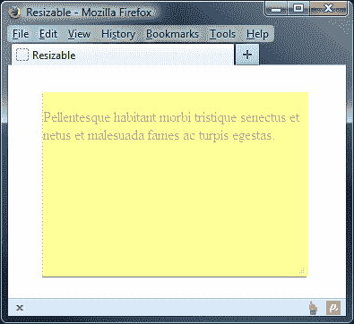

# 十二、可调整大小的组件

在本书前面的对话小部件中，我们已经简要地看到了可调整大小的功能。在本章中，我们将直接关注它。但是，该对话框是一个完美的例子，说明了可调整大小的组件在实际实现中的用处。

可调整大小的小部件添加了与自动添加到 WebKit 浏览器（如 Safari 或 Chrome）或更新版本的 Firefox 中的`<textarea>`元素相同的功能。在这些浏览器中，右下角添加了一个调整大小手柄，允许调整元素的大小。使用 jQueryUI 可调整大小组件，我们可以将此行为添加到页面上的几乎任何元素。

在本章中，我们将了解组件的以下方面：

*   实现基本的可调整性
*   可供使用的可配置选项
*   指定要添加的调整大小句柄
*   管理可调整大小的最小和最大大小
*   调整大小助手和重影的角色
*   查看内置的调整大小动画
*   如何对调整事件大小作出反应
*   确定可调整大小的对象的新大小
*   与其他库小部件一起使用可调整大小的

可调整大小的小部件是一个灵活的组件，可用于各种不同的元素。在本章的整个示例中，我们将主要使用简单的`<div>`元素，以便重点关注组件，而不是底层 HTML。在本章末尾，我们还将介绍一些使用``和`<textarea>`元素的简短示例。

可调整大小的组件可以很好地与其他组件配合使用，并且经常与 draggables 结合使用。然而，尽管您可以轻松地使可拖动组件的大小可调（think dialog），但这两个类之间并没有任何关联。

# 实现一个基本的可调整大小的小部件

让我们实现基本的可调整大小，这样我们就可以看到，当您使用 jQueryUI 作为页面背后的驱动力时，使元素可调整大小是多么容易。在文本编辑器的新文件中添加以下代码：

```js
<!DOCTYPE HTML>
<html>
  <head>
    <meta charset="utf-8">
    <title>Resizable</title>
    <link rel="stylesheet" href="development-bundle/themes/redmond/jquery.ui.all.css">
    <link rel="stylesheet" href="css/resize.css">
    <script src="js/jquery-2.0.3.js"></script>
    <script src="development-bundle/ui/jquery.ui.core.js"></script>
    <script src="development-bundle/ui/jquery.ui.widget.js"></script>
    <script src="development-bundle/ui/jquery.ui.mouse.js"></script>
  <script src="development-bundle/ui/jquery.ui.resizable.js"></script>
  </head>
  <script>
    $(document).ready(function($){
      $("#resize").resizable();
    });
  </script>
  <body>
    <div id="resize"></div>
  </body>
</html>
```

另存为`resizable1.html`。默认实现中不带参数的基本小部件方法使用与库的其余部分相同的简化语法。这只需要一行代码，示例就可以工作。

除了任何可调整大小的实现所需的 CSS 框架文件外，我们还使用自定义样式表向可调整大小的`<div>`添加基本尺寸和边框。在文本编辑器的新文件中使用以下 CSS：

```js
#resize { width: 200px; height: 200px; margin: 30px 0 0 30px;
border: 1px solid #7a7a7a; }
```

将此文件另存为`css`文件夹中的`resize.css`。我们已经在 CSS 中指定了调整大小`<div>`的尺寸，因为如果没有它们，`<div>`元素将拉伸屏幕的宽度。我们还指定了一个边框来明确定义它，因为默认实现只在目标元素的右下角添加一个调整大小的句柄。下面的屏幕截图显示了调整`<div>`元素大小后，我们的基本页面应该如何显示：


可调整大小的组件所需的文件如下：

*   `jquery-2.0.3.js`
*   `jquery.ui.core.js`
*   `jquery.ui.widget.js`
*   `jquery.ui.mouse.js`
*   `jquery.ui.resizable.js`

该组件会自动添加拖动操纵柄所需的三个图元。尽管唯一可见的调整大小手柄是位于右下角的手柄，但底部和右侧边缘都可以用来调整小部件的大小。

# 列出可调整大小的选项

下表列出了我们在使用可调整大小的组件时可以使用的可配置选项：

<colgroup><col style="text-align: left"> <col style="text-align: left"> <col style="text-align: left"></colgroup> 
| 

选项

 | 

默认值

 | 

过去…

 |
| --- | --- | --- |
| `alsoResize` | `false` | 自动调整指定元素的大小，与可调整大小的元素同步。 |
| `animate` | `false` | 将可调整大小的元素设置为新大小的动画。 |
| `animateDuration` | `slow` | 设置动画的速度。值可以是整数，指定毫秒数，也可以是字符串值`slow`、`normal`或`fast`中的一个。 |
| `animateEasing` | `swing` | 将缓和效果添加到调整大小动画。 |
| `aspectRatio` | `false` | 保持调整大小元素的纵横比。除布尔值外，还接受数字自定义纵横比。 |
| `autoHide` | `false` | 隐藏调整大小手柄，直到鼠标指针悬停在可调整大小的手柄上。 |
| `cancel` | `':input, option'` | 停止指定元素的大小调整。 |
| `containment` | `false` | 将可调整大小的约束在指定容器元素的边界内。 |
| `delay` | `0` | 设置从指针点击可调整大小的句柄时的到开始调整大小时的毫秒延迟。 |
| `disabled` | `false` | 在页面加载时禁用组件。 |
| `distance` | `1` | 设置在开始调整大小之前，按住鼠标按钮时鼠标指针必须移动的像素数。 |
| `ghost` | `false` | 调整大小时显示半透明辅助对象元素。 |
| `grid` | `false` | 调整大小时，将调整大小捕捉到虚拟的网格线。 |
| `handles` | `'e, se, s'` | 定义用于调整大小的句柄。接受包含以下任意值的字符串：`n`、`ne`、`e`、`se`、`s`、`sw`、`w`、`nw`或所有值。字符串也可以是一个对象，其中属性是前面的任何值，值是与用作句柄的元素相匹配的 jQuery 选择器。 |
| `helper` | `false` | 将类名称添加到在调整大小期间应用的帮助器元素中。 |
| `maxHeight` | `null` | 设置可调整尺寸的最大高度。 |
| `maxWidth` | `null` | 设置可调整大小的最大宽度。 |
| `minHeight` | `null` | 设置可调整尺寸的最小高度。 |
| `minWidth` | `null` | 设置可调整大小的最小宽度。 |

## 配置调整大小手柄

由于`handles`配置选项，指定想要添加到目标元素中的句柄非常容易。在`resizable1.html`中，更改最后的`<script>`元素，使其显示如下：

```js
  <script>
    $(document).ready(function($){
      $("#resize").resizable({ handles: "all" });
    });
  </script>
```

另存为`resizable2.html`。当您在浏览器中运行该示例时，您将看到，尽管该组件看起来与以前完全相同，但我们现在可以使用任何边或角来调整`<div>`元素的大小。

## 添加额外的手柄图像

你会直接注意到的一件事是，尽管元素可以沿任何轴调整大小，但没有任何视觉提示使其变得明显；组件将自动将调整大小的条纹添加到右下角，但其余的则由我们来添加。

有几种不同的方法可以做到这一点。虽然该方法不向其他三个角添加图像，但它确实插入了具有类名的 DOM 元素，因此我们可以轻松地使用 CSS 将这些元素作为目标，并提供我们自己的图像。这就是我们下一步要做的。

在文本编辑器的新页面中，添加以下样式规则：

```js
#resize {width: 200px; height: 200px; margin: 30px 0 0 30px; border: 1px solid #7a7a7a;}
.ui-resizable-sw, .ui-resizable-nw, .ui-resizable-ne {width: 12px; height: 12px; background: url(../img/handles.png) no-repeat 0 0;}
.ui-resizable-sw {left: 0; bottom: 0;} 
.ui-resizable-nw {left: 0; top: 0; background-position: 0 -12px;}
.ui-resizable-ne {right: 0; top: 0; background-position: 0 -24px;}
```

将此文件保存在`css`文件夹中为`resizeHandles.css`。我们为这个示例提供了我们自己的图像，它是一个包含标准右下角图像翻转和反转副本的单个图像（可以在代码下载中找到）。然后，我们可以通过在 CSS 样式规则中设置背景位置属性来引用它们。使用单个图像或精灵可以减少缓存多个图像的需要；我们使用的所有单个图像实际上都是单个较大文件中的片段。

### 提示

Chris Coyier 写了一篇有用的文章，解释了如何实现 sprites，可以在[上找到 http://css-tricks.com/css-sprites/](http://css-tricks.com/css-sprites/) 。

我们的选择器以控件自动添加到句柄元素的类名为目标。链接到`resizable2.html`的`<head>`元素中的新样式表，并将其重新保存为`resizable3.html`：

```js
<link rel="stylesheet" href="css/resizeHandles.css">
```

新样式表应为我们的元素提供以下外观：


另一个与调整手柄大小及其显示方式相关的配置选项是`autoHide`。接下来我们来看看这个 T2 选项。将`resizable3.html`中的配置对象更改为：

```js
$("#resize").resizable({
  handles: "all",
 autoHide: true
});
```

将此版本另存为`resizable4.html`。在本例中，我们添加了`autoHide`选项并将其值设置为`true`。配置此选项将隐藏所有调整大小句柄，直到鼠标指针移动到可调整大小的元素上。当可调整大小的元素中有图像内容时，这非常有助于减少对附加 DOM 元素的干扰。

## 定义尺寸限制

通过四个可配置选项，限制目标元素可调整大小的最小或最大大小变得异常容易。它们是`maxWidth`、`maxHeight`、`minWidth`和`minHeight`。我们将在下一个示例中看到实际情况。对于本例，容器中最好有一些内容，因此在`resizable4.html`中可调整大小的`<div>`中的`<p>`元素中添加一些布局文本：

```js
<p>Lorem ipsum etc, etc…</p>
```

将`resizable4.html`中使用的配置对象更改为：

```js
$("#resize").resizable({
 maxWidth: 500,
 maxHeight: 500,
 minWidth: 100,
 minHeight: 100
});
```

另存为`resizable5.html`。这一次，配置对象使用标注边界选项指定可调整大小的对象可以调整到的最小和最大高度和宽度。这些选项将简单整数作为其值。

当我们运行这个示例时可以看到，可调整大小的元素现在遵循我们指定的大小，而在前面的示例中，可调整大小的元素的最小大小是其调整大小句柄的组合大小，并且没有最大大小。

到目前为止，我们的 Resizeable 一直是一个空的`<div>`元素，您可能想知道，当目标元素中有内容时，Resizeable 如何处理最小和最大大小。虽然保留了这些限制，但我们需要在 CSS 中添加`overflow: hidden`。否则，如果最小大小无法处理的内容太多，则内容可能会溢出可调整大小。

当然，当内容太多时，我们也可以使用`overflow: auto`添加滚动条，这有时可能是我们想要的行为。

## 调整重影大小

Ghost 元素是半透明辅助元素，与我们在上一章中研究 draggables 组件时使用的代理元素非常相似。只需配置一个选项即可启用重影元素。让我们看看这是怎么做到的。

将`resizable5.html`中使用的配置对象更改为：

```js
$("#resize").resizable({ ghost: true });
```

将此文件另存为`resizable6.html`。启用重设大小重影只需将`ghost`选项设置为`true`。可调整大小的重影的效果非常微妙。它基本上是现有可调整大小元素的克隆，但仅为不透明度的四分之一。这就是为什么我们将上一个示例中的布局文本保留在可调整大小的元素中。

在本例中，我们还链接到一个新的样式表，该样式表与`resize.css`完全相同，并指定了背景色：

```js
#resize { width: 200px; height: 200px; margin: 30px 0 0 30px;
border: 1px solid #7a7a7a; overflow: hidden; background-color: #999; }
```

将此保存为`css`文件夹中的`resizeGhosts.css`。下一个屏幕截图显示了可调整大小的重影在拖动时可见时的显示方式：


### 注

在某些版本的 Internet Explorer 中，当透明 PNG 位于可调整大小的范围内时，ghost 元素可能会导致问题。如果您发现是这样的话，在[上有一篇有用的文章 http://www.pixelthemestudio.ca/news-and-updates/156-fixing-that-png-image-optimization-for-ie](http://www.pixelthemestudio.ca/news-and-updates/156-fixing-that-png-image-optimization-for-ie) 详细说明了如何使用 TweakPNG 解决这些问题。

ghost 元素只是一个半透明的辅助元素。如果这不合适，则需要对辅助元素的外观进行进一步控制；我们可以使用`helper`选项指定要添加到 helper 元素的类名，然后使用该类名对其进行样式设置。更改`resizable6.html`中的配置对象，使其显示如下：

```js
$("#resize").resizable({
  ghost: true,
 helper: "my-ui-helper"
});
```

将此修订保存为`resizable7.html`。我们只是简单地指定了要添加为`helper`选项值的类名。我们可以从 CSS 文件中找到新的类名。打开`resize.css`并添加以下代码：

```js
.my-ui-helper { background-color:#FFFF99; }
```

将新样式表另存为`resizeHelper.css`，不要忘记将其链接到`resizable7.html`顶部：

```js
<link rel="stylesheet" href="css/resizeHelper.css">
```

在本例中，我们所做的唯一一件事就是给助手一个简单的背景色，在本例中是黄色。这是运行新页面并调整大小时的外观：



`ghost`和`helper`选项不必一起使用；我们可以单独使用其中一个选项，但是如果我们使用不带`ghost`选项的`helper`选项，则无法在 resize 辅助对象中获得半透明内容。

## 包含调整大小的

可调整大小的组件可以轻松确保已调整大小的元素包含在其父元素中。这是伟大的，如果我们在页面上有其他内容，我们不希望在调整大小的互动中到处移动。在`resizable7.html`中，更改页面上的元素，使其显示如下：

```js
<div class="container">
  
</div>
```

最后，将`configuration`对象更改为使用`containment`选项：

```js
$("#resize").resizable({
 containment: ".container"
});
```

另存为`resizable8.html`。在页面上，我们为可调整大小的元素添加了一个容器元素，并从使用`<div>`元素切换到使用图像作为可调整大小的元素。

再一次，对于这个例子，我们需要一些稍微不同的 CSS。在文本编辑器的新文件中，添加以下代码：

```js
.container { width: 600px; height: 600px; border: 1px solid #7a7a7a; padding: 1px 0 0 1px; }
#resize { width: 300px; height: 300px; }
```

将此保存为`css`文件夹中的`resizeContainer.css`，并将页面`<head>`元素中的`<link>`从`resizeHelper.css`更改为新样式表：

```js
<link rel="stylesheet" href="css/resizeContainer.css">
```

`containment`选项允许我们为可调整大小的文件指定一个容器，这将限制可调整大小文件的大小，迫使其保持在其边界内。

我们指定一个 jQuery 选择器作为该选项的值。当我们查看页面时，我们应该看到图像的大小不能超过其容器。

## 处理纵横比

除了维护可调整大小元素的纵横比外，我们还可以手动定义它。让我们看看这个交互给了我们什么样的控制。将`resizable8.html`中使用的配置对象更改为：

```js
$("#resize").resizable({
  containment: ".container",
 aspectRatio: true
});
```

将此文件另存为`resizable9.html`。将`aspectRatio`选项设置为`true`可确保我们的图像将保持其原始纵横比。所以在这个例子中，图像总是一个完美的正方形。

为了获得更大程度的控制，我们可以指定可调整大小的对象应保持的实际纵横比：

```js
$("#resize").resizable({
  containment: ".container",
 aspectRatio: 0.5
});
```

通过指定浮点值`0.5`，我们是说当图像调整大小时，图像的 x 轴应该正好是 y 轴的一半。

### 注

当偏离任何图像的纵横比时，应小心；尽量保持元素和容器的大小成比例是明智的，否则您可能会发现对象的大小不会调整到其容器的全部大小，就像我们的示例中所发生的那样。如果您将`aspectRatio`更改为`1`，您会发现它的大小正确地调整为我们容器的完整大小。

## 可调整大小的动画

可调整大小的 API 公开了与动画相关的三个配置选项：`animate`、`animateDuration`和`animateEasing`。默认情况下，动画在可调整大小的实现中关闭。然而，我们可以很容易地让他们看到如何增强这个组件。

在本例中，更改前两个示例中的标记，使可调整大小的元素返回到普通的`<div>`：

```js
<div id="resize"></div>
```

我们还应该切换回`resizeGhosts.css`样式表：

```js
<link rel="stylesheet" href="css/resizeGhost.css">
```

现在，更改配置对象以使用以下选项：

```js
$("#resize").resizable({
  ghost: true,
 animate: true,
 animateDuration: "fast"
});
```

另存为`resizable10.html`。本例中使用的配置对象以`ghost`选项开始。

### 注

在使用动画时，可调整大小的元素在交互结束后才会调整大小，因此将重影显示为将调整元素大小的视觉提示非常有用。

我们只需将`animate`选项设置为`true`即可启用动画。就这样,；无需进一步配置。我们可以更改的另一个选项是动画的速度，我们在本例中通过设置`animateDuration`选项实现了这一点。它接受可以与 jQuery 的`animate()`方法一起使用的任何标准值。

当我们在浏览器中运行此页面时，我们会发现一旦松开鼠标按钮，`resize`div 将平滑地设置为新的大小。

## 同时调整尺寸

通过将引用传递给可调整大小的小部件方法，我们可以轻松地使同一页面上的几个元素分别调整大小。但是，除此之外，我们还可以利用`alsoResize`属性来指定将作为一个组一起调整大小的其他元素，只要实际的可调整大小的元素被调整大小。让我们看看如何。

首先，我们需要再次引用新的样式表：

```js
<link rel="stylesheet" href="css/resizeSimultaneous.css">
```

接下来，我们需要对页面`<body>`中的元素进行如下更改：

```js
<div id="mainResize">
  <p>I am the main resizable!</p>
</div>
<div id="simultaneousResize">
  <p>I will also be resized when the main resizable is resized!</p>
</div>
```

然后将配置对象更改为以下内容：

```js
$("#resize").resizable({
 alsoResize: "#simultaneousResize"
});
```

将此文件另存为`resizable11.html`。我们提供了一个选择器作为`alsoResize`选项的值，以针对第二个`<div>`元素。次要元素将自动拾取实际可调整大小的属性。

因此，如果我们将可调整大小限制为只有一个`e`句柄，那么第二个元素也只会朝这个方向调整大小。

本例中引用的新样式表应包含以下代码：

```js
#mainResize { width: 100px; height: 100px; margin: 0 0 30px;
border: 2px solid #7a7a7a; text-align: center; }
#simultaneousResize { width: 150px; height: 150px; border: 2px solid #7a7a7a; text-align: center; }
p { font-family: arial; font-size: 15px; }
```

将此文件另存为`css`文件夹中的`resizeSimultaneous.css`。当我们运行文件时，我们应该看到第二个`<div>`元素的大小与第一个相同：


## 防止不必要的大小调整

有时我们可能希望使元素的大小可调整，但它还有其他功能，也许它也侦听单击事件。在这种情况下，除非确实需要，否则可能需要防止调整大小，从而使我们能够轻松区分单击和真实拖动。我们可以使用两个选项来实现这一点。

首先，在`resizable10.html`中，恢复到原始样式表`resize.css`：

```js
<link rel="stylesheet" href="css/resize.css">
```

我们也可以返回到简单的空可调整大小的`<div>`：

```js
<div id="resize"></div>
```

然后将配置对象更改为以下内容：

```js
$("#resize").resizable({ 
 delay: 1000
});
```

将此版本另存为`resizable12.html`。`delay`选项接受一个整数，表示在开始调整大小之前，单击调整大小手柄后按住鼠标按钮需要经过的毫秒数。

在本例中，我们使用`1000`作为等于 1 秒的值。试一试，你会发现如果你点击一个调整大小的手柄并过早地释放鼠标按钮，调整大小就不会发生。

除了延迟调整大小，我们还可以使用`distance`选项来指定鼠标指针必须移动一定数量的像素，在单击调整大小手柄后按住按钮，然后再进行调整大小。

更改`resizable12.html`中的配置对象，使其显示如下：

```js
$("#resize").resizable({
 distance: 30
});
```

另存为`resizable13.html`。现在，当页面运行时，在调整大小之前，鼠标指针需要在按住鼠标按钮的情况下移动`30`个像素，而不是在按住鼠标按钮的情况下等待。

这两个选项都存在某些可用性问题，特别是在这些示例中设置为`high`时。它们都使得一次沿多个轴调整图元的大小变得更加困难。它们应尽量少用，且值尽可能低。

# 定义可调整大小的事件

与库的其他组件一样，Resizeable 定义了自定义事件的选择，并允许我们在这些事件发生时轻松执行函数。这充分利用了访问者与页面上元素之间的互动。

可调整大小定义以下回调选项：

<colgroup><col style="text-align: left"> <col style="text-align: left"></colgroup> 
| 

选项

 | 

触发时…

 |
| --- | --- |
| `create` | 可调整大小的已初始化 |
| `resize` | 可调整大小的正在调整大小 |
| `start` | 一个调整大小的交互开始 |
| `stop` | 调整大小交互结束 |

连接到这些自定义方法对于可调整大小的程序来说就像我们所看到的库的其他组件一样容易。

让我们探索一个基本示例来强调这一事实，下面的屏幕截图显示了我们的页面在`<div>`消失之前的外观：


在`resizable13.html`中，将第二个`<link>`更改为指向一个新的样式表，如下所示：

```js
<link rel="stylesheet" href="css/resizeStop.css">
```

然后更改最后的`<script>`元素，使其显示如下：

```js
<script>
  $(document).ready(function($){
    function reportNewSize(e, ui) {
      var width = Math.round(ui.size.width),
      height = Math.round(ui.size.height);
      $("<div />", {
        "class": "message",
        text: "New size: " + height + "px high, " + width + "px wide",
        width: width
      }).appendTo("body").fadeIn().delay(2000).fadeOut();
    }
    $("#resize").resizable({
      stop: reportNewSize
    });
  });
</script>
```

另存为`resizable14.html`。在`resize.css`中，添加以下选择器和规则：

```js
.message { display: none; border: 1px solid #7a7a7a; margin-top: 5px; position: absolute; left: 38px;fontSize: 80%; font-weight: bold; text-align: center; }
```

将此保存为`css`文件夹中的`resizeStop.css`。

我们定义了一个名为`reportNewSize`的函数；此函数（以及所有其他事件处理程序）自动传递给两个对象。第一个是事件对象，第二个是包含有关可调整大小的事件的有用信息的对象。

我们可以使用第二个对象的`size`属性来找出`width`和`height`可调整大小的对象被更改为什么。这些值作为变量存储在函数中。我们使用 JavaScript`Math.round()`函数来确保得到一个整数。

然后，我们创建一个新的`<div>`元素，并给它一个用于样式设置的类名。我们还将新元素的文本设置为显示`width`和`height`变量以及一条简短消息。我们还设置了新元素的宽度以匹配可调整大小的元素。创建之后，我们将消息附加到页面，然后使用 jQuery 的`fadeIn()`方法淡入。然后我们使用`delay()`方法暂停`2`秒，然后再次淡出消息。

# 查看可调整大小的方法

该组件附带了与库的所有交互组件一起发现的四种基本方法，即`destroy`、`disable`、`enable`和`option`方法。与大多数其他组件不同，可调整大小的组件没有其独有的自定义方法。有关这些基本 API 方法的说明，请参见[第 1 章](01.html "Chapter 1. Introducing jQuery UI")、*介绍 jQuery UI*中的 API 介绍部分。

# 创建可调整大小的选项卡

在我们最后一个可调整大小的示例中，让我们看看如何将这个组件与前面介绍的一个小部件结合起来。这将帮助我们了解它与库的其他部分的兼容性。在下面的示例中，我们将使用 tabs 组件。下面的屏幕截图显示了我们将结束的页面：


在文本编辑器中，将以下`CSS`样式添加到新文件中，并将其另存为`resizeTabs.css`：

```js
#resize { width: 200px; height: 200px; margin: 30px 0 0 30px; border: 1px solid #7a7a7a; }
#myTabs { width: 400px; height: 170px; }
```

接下来，将以下代码添加到新文件：

```js
<!DOCTYPE HTML>
<html>
  <head>
    <meta charset="utf-8">
    <title>Resizable</title>
    <link rel="stylesheet" href="development-bundle/themes/redmond/jquery.ui.all.css">
    <link rel="stylesheet" href="css/resizeTabs.css">
    <script src="js/jquery-2.0.3.js"></script>
    <script src="development-bundle/ui/jquery.ui.core.js"></script>
    <script src="development-bundle/ui/jquery.ui.widget.js"></script>
    <script src="development-bundle/ui/jquery.ui.tabs.js"></script>
    <script src="development-bundle/ui/jquery.ui.mouse.js"></script>
  <script src="development-bundle/ui/jquery.ui.resizable.js"></script>
    <script>
      $(document).ready(function($){
        var tabs = $("#myTabs").tabs(), resizeOpts = {
          autoHide: true,
          minHeight: 170,
          minWidth: 400
        };
        tabs.resizable(resizeOpts);
      });
    </script>
  </head>
  <body>
    <div id="myTabs">
      <ul>
        <li><a href="#a">Tab 1</a></li>
        <li><a href="#b">Tab 2</a></li>
      </ul>
      <div id="a">
        This is the content panel linked to the first tab; it is shown by default.
      </div> 
      <div id="b">
        This content is linked to the second tab and will be shown when its tab is clicked.
      </div>
    </div>
  </body>
</html>
```

另存为`resizable15.html`。使 tabs 小部件的大小可调非常简单，只需要在选项卡的基础`<ul>`上调用 Resizeable 方法。

在本例中，我们使用单个配置对象。选项卡组件可以在不需要任何配置的情况下初始化。除了将配置对象中可调整大小的`autoHide`选项设置为`true`之外，我们还定义了`minWidth`和`minHeight`值，以便于使用。

# 总结

在本章中，我们介绍了可调整大小的。这是一个允许我们轻松调整屏幕上任何元素大小的组件。它动态地向目标元素的指定侧添加调整大小句柄，并为我们处理所有棘手的 DHTML 调整大小，将行为巧妙地封装到一个紧凑、易于使用的类中。

然后，我们研究了一些可用于小部件的可配置选项，例如如何指定要添加到可调整大小的句柄，以及如何限制元素的最小和最大大小。

我们简要介绍了如何在调整图像大小时保持图像的纵横比，或者如何使用自定义比例。我们还探讨了如何使用重影、助手和动画来提高可调整大小组件的可用性和外观。

我们还研究了组件 API 公开的事件模型，以及如何以简单有效的方式对调整大小的元素做出反应。我们的最后一个示例探讨了 Resizeble 与库的其他组件的兼容性。在下一章中，我们将介绍如何使用可选择和可排序的小部件选择、过滤和排序对象。