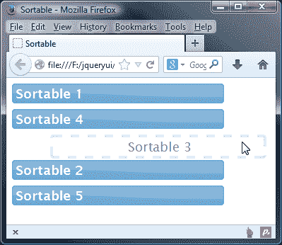
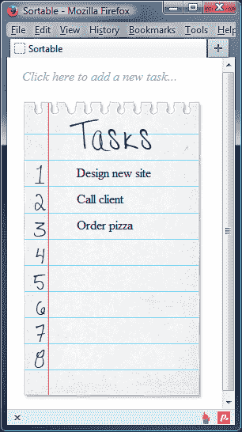

# 十三、将 jQuery UI 用于选择和排序

如果您花时间处理列表（在 Microsoft Excel 之类的应用中），则可能需要按照某种逻辑顺序对项目进行选择和排序，就像选择和排序计算机桌面上的图标一样。

jqueryui 中的可选和可排序交互帮助器允许您定义一系列元素，这些元素可以通过在周围拖动选择方块来选择，然后重新排序为新的顺序。

本节将涵盖的主题包括：

*   创建默认的可选实现
*   可选类名如何反映可选元素的状态
*   筛选可选元素
*   使用 selectables 的内置回调函数
*   看看 selectables 的方法
*   创建默认的可排序小部件
*   基本可配置属性
*   Sortable 广泛的内置事件处理程序和方法
*   将排序结果提交到服务器
*   向排序表添加拖动元素

长期以来，选择和排序一直是现代操作系统的标准部分。例如，如果您想选择并排序桌面上的一些图标，您可以按住桌面空白部分的鼠标按钮，并在要选择的图标周围拖动一个正方形，或者从桌面上选择**自动排列图标**选项。

可选择和可排序的交互助手将相同的功能添加到我们的网页中，这使我们能够构建更加用户友好的界面，而无需使用外部环境，如 Flash 或 Silverlight。

# 介绍可选小部件

我们应该做的第一件事是调用默认实现，以了解该组件提供的基本功能。

在文本编辑器的新文件中，添加以下代码：

```js
<!DOCTYPE HTML>
<html>
  <head>
    <meta charset="utf-8">
    <title>Selectable</title>
    <link rel="stylesheet" href="development-bundle/themes/redmond/jquery.ui.all.css">
    <script src="js/jquery-2.0.3.js"></script>
    <script src="development-bundle/ui/jquery.ui.core.js"></script>
    <script src="development-bundle/ui/jquery.ui.widget.js"></script>
    <script src="development-bundle/ui/jquery.ui.mouse.js"></script>
    <script src="development-bundle/ui/jquery.ui.selectable.js"></script>
    <script>
      $(document).ready(function($){
        $("#selectables").selectable();
      });  
    </script> 
  </head>
  <body>
<ul id="selectables">
  <li> This is selectable list item 1</li>
  <li> This is selectable list item 2</li>
  <li> This is selectable list item 3</li>
  <li> This is selectable list item 4</li>
  <li> This is selectable list item 5</li>
</ul>
  </body>
</html>
```

将此保存为`jqueryui`文件夹中的`selectable1.html`。我们只需在父`<ul>`元素上调用`selectable`小部件方法，然后它的所有子`<li>`元素都可以选择。这允许通过单击它们或使用选择方块进行选择（就像您在桌面上所做的那样）。

请注意，没有与可选组件关联的样式。默认行为包括单击单个元素，使其仅被选中，然后单击其中一个选定元素以取消选择它们。按住*Ctrl*键将启用 multiselect。以下屏幕截图显示了包含列表项的选择方块：


可选实现所需的库文件的最小集合如下：

*   `jquery-2.0.3.js`
*   `jquery.ui.core.js`
*   `jquery.ui.widget.js`
*   `jquery.ui.mouse.js`
*   `jquery.ui.selectable.js`

除了从列表项中构建可选择项外，我们还可以从其他元素（如`<div>`元素的集合）中构建它们。将以下链接添加到`selectable1.html`文件的`<head>`：

```js
<link rel="stylesheet" href="css/selectable.css">
```

同时，将`selectable1.html`中的列表元素替换为以下代码：

```js
<div id="selectables">
  <div>This is selectable list item 1</div>
  <div>This is selectable list item 2</div>
  <div>This is selectable list item 3</div>
  <div>This is selectable list item 4</div>
  <div>This is selectable list item 5</div> 
</div>
```

另存为`selectable2.html`。一切基本上和以前一样。

我们只是根据不同的元素来做例子。然而，由于这些元素的性质，我们应该添加一些基本的样式，这样我们就可以看到我们正在使用的东西。

在文本编辑器的新文件中，添加以下代码：

```js
#selectables div { width: 170px; height: 25px; padding: 5px 0 0 10px; margin: 10px 0 0 10px; border: 1px solid #000; }
```

将此保存为`css`文件夹中的`selectable.css`。虽然不多，但它有助于澄清示例中的各个可选择项，如以下屏幕截图所示：


# 介绍被选中的类名

使可选的元素最初都被赋予`ui-selectee`类，包含它们的父元素被赋予`ui-selectable`类。当选择元素时，它们被赋予`ui-selected`类。

当选择方块在可选择元素周围时，它们被赋予`ui-selecting`类，当一个元素被取消选择时，它被赋予`ui-unselecting`类。添加这些类名纯粹是为了我们的利益，因此我们可以突出显示可选类可能处于的不同状态。

这种广泛的类系统使添加自定义样式非常容易，以显示元素处于选择过程中或已被选择的时间。现在，让我们添加一些附加样式以反映选择和选定状态。将以下新选择器和规则添加到`selectable.css`：

```js
#selectables div.ui-selecting { border: 1px solid #fe2f2f; }
#selectables div.ui-selected { background: #fe2f2f; color: #fff; }
```

将此`selectableStates.css`保存在`css`文件夹中。将链接更改为`selectable2.html`的`<head>`中的样式表引用，然后将此文件另存为`selectable3.html`：

```js
<link rel="stylesheet" href="css/selectableStates.css">
```

通过添加这个非常简单的 CSS，我们可以在元素中添加视觉提示，这些元素是当前选择的一部分，包括在选择交互期间和之后。以下屏幕截图在左侧显示了正在选择的某些元素，在右侧显示了已选择的相同元素：


# 配置可选组件

`selectable`类非常紧凑，与我们所研究的其他一些组件相比，可配置选项相对较少。

以下选项可用于配置：

<colgroup><col style="text-align: left"> <col style="text-align: left"> <col style="text-align: left"></colgroup> 
| 

选项

 | 

默认值

 | 

曾经

 |
| --- | --- | --- |
| `autoRefresh` | `True` | 在选择交互的开始处自动刷新每个可选择对象的大小和位置。 |
| `cancel` | `":input, option"` | 防止通过点击选择指定的元素。默认字符串包含`:input`jQuery 过滤器，它匹配所有`<input>`、`<textarea>`、`<select>`和`<button>`元素以及标准选项元素选择器。 |
| `delay` | `0` | 在选择元素之前，以毫秒为单位设置延迟。在开始选择之前，必须在元素上按住鼠标按钮。 |
| `disabled` | `false` | 当页面初始加载时，禁用选择。 |
| `distance` | `0` | 设置鼠标指针必须移动的距离，按住鼠标按钮，然后开始选择。 |
| `filter` | `"*"` | 指定子元素以进行选择。 |
| `tolerance` | `"touch"` | 设置选择方块的公差。可能的值为`touch`或`fit`。如果指定了`fit`，则在选择该元素之前，该元素必须完全在选择方块内。 |

## 过滤可选择项

在某些情况下，我们可能不想让目标容器中的所有元素都可以选择。在这种情况下，我们可以使用`filter`选项根据 CSS 选择器指定我们希望启用的特定元素。在`selectable3.html,`中，更改`<div>`元素的集合，使其显示如下：

```js
<div id="selectables">
 <div> This is unselectable list item 1</div>
 <div> This is unselectable list item 2</div>
  <div class="selectable">This is selectable list item 3</div>
  <div class="selectable">This is selectable list item 4</div>
  <div class="selectable">This is selectable list item 5</div>
</div>
```

然后将最终的`<script>`元素更改为以下内容：

```js
<script>
  $(document).ready(function($){
    $("#selectables").selectable({
 filter: ".selectable"
    });
  });  
</script> 
```

每个可选的宽度都需要增加，因此在`selectableStates.css`中，将`#selectables div`规则更改为 190 px 的宽度。

将此版本另存为`selectable4.html`。在底层标记中，除了第一个元素外，我们为每个元素都提供了一个类。在 JavaScript 中，我们定义了一个包含`filter`选项的配置对象。这个选项的值是我们想要选择的元素的类选择器；没有此类名的元素将从选择中筛选出来：


如前一个屏幕截图所示，选择方块位于不可选择的元素上方，但它不像其他元素那样拾取`ui-selecting`类。该组件完全忽略过滤后的可选，并且不会成为选择的一部分。

## 取消选择

除了使用`filter`选项间接使元素不可选择外，我们还可以使用`cancel`选项直接使元素不可选择。这个选项也被我们在[第 12 章](12.html "Chapter 12. The Resizable Component")中看到的交互助手*中的可调整大小的组件*所暴露，尽管我们没有详细讨论它。现在是玩它的绝佳机会。

将类名`unselectable`添加到`selectable4.html`中容器的第一个和第二个元素中：

```js
<div class="unselectable"> This is unselectable list item 1</div>
<div class="unselectable">This is unselectable list item 2</div>
```

更改上一个示例中的配置对象，使其使用`cancel`选项：

```js
$("#selectables").selectable({
 cancel: ".unselectable"
})
```

另存为`selectable5.html`。我们将不可选择元素的类名传递给它，而不是将可选择元素的类名传递给配置对象。当我们运行这个示例时，我们可以看到，类名为`unselectable`的第一个元素仍然被赋予了类`ui-selectee`。但是，它只能通过选择方块进行选择；即使按住*Ctrl*键，也无法通过单击进行选择。

# 处理可选事件

除了可选 API 的标准可配置选项外，还有一系列事件回调选项可用于指定在选择交互期间在特定点执行的函数。下表列出了这些选项：

<colgroup><col style="text-align: left"> <col style="text-align: left"></colgroup> 
| 

选项

 | 

触发时间

 |
| --- | --- |
| `selecte` | select 交互结束，添加到选择中的每个元素都会触发回调。 |
| `selecting` | 每个选中的元素在 select 交互期间触发回调。 |
| `start` | 选择交互开始。 |
| `stop` | 选择操作结束。 |
| `unselected` | 任何元素都是可选元素的一部分，但在交互过程中没有选择元素，都将触发此回调。 |
| `unselecting` | 未选择的元素将在选择交互期间触发此命令。 |

只有在元素被选择后发生了某些事情时，选择才真正有用，这就是事件模型发挥作用的地方。让我们将这些回调中的一些用于工作，以便我们能够欣赏它们的使用。

替换`selectable5.html`中的配置对象，使其包含以下代码：

```js
$("#selectables").selectable({
  selected: function(e, ui) {
    $(ui.selected).text("I have been selected!");
  },
  unselected: function(e, ui) {
    $(ui.unselected).text("This div was selected");
  },
  start: function(e) {
    if (!$("#tip").length) {
      $("<div />", {
        "class": "ui-corner-all ui-widget ui-widget-header",
        id: "tip",
        text: "Drag the lasso around elements, or click to select",
        css: {
          position: "absolute",
          padding: 10,
          left: e.pageX,
          top: e.pageY - 30,
          display: "none"
        }
      }).appendTo("body").fadeIn();
    } 
  },
  stop: function(e) {
    $("#tip").fadeOut("slow", function() {
      $(this).remove();
    });
  }
});
```

另存为`selectable6.html`。在`<script>`中，我们为已选、未选、启动和停止选项添加了功能。这些将在交互期间的适当时间执行。

与其他组件一样，这些函数会自动传递给两个对象。第一个是原始浏览器事件对象（通常称为`e`），另一个是包含所选元素有用属性的对象（通常称为`ui`。然而，并不是所有的回调都能成功地处理第二个对象的启动和停止，例如。在我们的示例中，我们省略了`ui`对象；没有必要包括它，因为它将是空的。

当选择一个`<div>`时，我们使用`selected`事件回调更改其内部文本以反映选择。我们可以使用`selected`属性获取所选元素，以便将其文本内容更改为新消息。当取消选择某个元素时，我们使用相同的技术将文本设置为`The div was selected`。

我们还可以更改之前使用`unselected`事件选择的任何可选文本。

在任何交互开始时，我们使用`start`事件创建一个附加到页面`<body>`的工具提示，该提示稍微偏离鼠标指针。我们使用一个基本条件来检查工具提示是否已经存在，以防止重复提示。我们可以使用框架类`ui-corner-all`、`ui-widget`和`ui-widget-header`来为我们进行大部分样式设计。我们需要的几个样式不是主题提供的，是使用`css()`方法添加的。我们可以使用`e`（事件）对象获取指针坐标，该对象被作为第一个参数传递给我们的回调，以便定位工具提示。在选择结束时，我们使用`stop`属性移除刀尖。以下屏幕截图显示了不同交互的结果：


`selecting`和`unselecting`回调选项的工作方式与我们刚才看到的完全相同，但在向选择中添加或删除元素时触发。要查看正在运行的选项，请将`selectable6.html`中配置对象中的`selected`和`unselected`选项替换为以下选项：

```js
  selecting: function(e, ui) {
    $(ui.selecting).text("I am part of the selection");
  },
  unselecting: function(e, ui) {
    $(ui.unselecting).text("I was part of the selection");
  },
```

将您的工作另存为`selectable7.html`。这一次，我们使用`selecting`和`unselecting`属性来指定回调函数，它在交互过程中的特定时间再次更改元素的文本内容。我们重复上一个示例中的过程，这次我们只是使用传递给它们的对象的不同回调和属性。

传递给任何可选回调的第二个对象包含与自定义事件类型相关的属性。例如，所选回调接收具有`selected`属性的对象，该属性可用于获取有关添加到所选内容的元素的信息。所有回调都有一个匹配的属性，可以这样使用。

## 处理大量可选择项

jQuery UI 库如 jQuery 本身，已经非常高效。它使用了超高效**嘶嘶声选择引擎**（通过 jQuery），每个组件都经过了尽可能多的优化。

### 注

Sizzle 是 jQuery 使用的纯 JavaScript CSS 选择器引擎，它允许您在 CSS 选择器上使用 JavaScript，例如`$("<div>")`。如果您想了解更多信息，可以访问项目现场[http://sizzlejs.com/](http://sizzlejs.com/) 。

然而，图书馆的创造者所能做的只有这么多。到目前为止，在我们的示例中，我们最多使用了五个可选元素，这些元素实际上并不多。如果我们用 500 来代替呢？

在处理大量可选择项时，我们仍然可以做一些事情来确保选择交互尽可能高效。`autoRefresh`选项默认设置为`true`，这会导致在每次交互开始时重新计算页面上所有可选元素的大小和位置。

这可能会导致页面上有许多可选择元素的延迟，因此在处理大量元素集合时，`autoRefresh`选项可以设置为`false`。我们还可以使用`refresh`方法在适当的时间手动刷新可选择项，以提高交互的速度和响应能力。在大多数页面上，我们不需要担心配置此选项，可以将其保留为默认设置。

让我们来看看这个选项如何帮助我们的网页在某些情况下。在`selectable7.html`的`<head>`中，将自定义样式表的`<link>`更改为：

```js
<link rel="stylesheet" href="css/selectableMany.css ">
```

然后更改 selectables 容器元素，使其显示如下：

```js
<div id="selectables" class="ui-helper-clearfix">
 <div class="selectable">Selectable</div>
</div>
```

我们将使用一个小 jQuery 自动创建可选元素，因此用以下代码替换`document.ready()`块中现有的脚本：

```js
    var $selectable = $(".selectable");
   for(var I = 0; I < 100; i++) {
     $selectable.parent().append($selectable.clone());
   }
   $("#selectables").selectable({
     autoRefresh: false
   });
```

将此页面另存为`selectable8.html`。我们的页面现在应该在 selectables 容器中包含 100 个单独的 selectables。我们还向外部容器添加了一个类名，以便在浮动可选择项时正确清除容器（稍后我们将这样做）。如果未正确清除容器，则选择方块将不起作用。我们将`.ui-helper-clearfix`类添加到可选择项`div`中，以帮助解决此问题。

在本例中，我们还需要一个新的样式表，它包含以下代码：

```js
#selectables div { width: 70px; height: 25px; padding: 5px 0 0 10px; border: 1px solid #000; margin: 10px 0 0 10px; float: left; }
.ui-selected { background-color: #fe2f2f; }
```

将其保存在`css`文件夹中为`selectableMany.css`。这纯粹是为了布局，所以我们不需要进一步讨论。

我们可以使用类似 Chrome 的开发者工具，在启用和不启用`autoRefresh`选项的情况下，分析所有 100 个可选择项的选择；它是默认启用的，因此我们的示例将禁用它。测试的结果可能会有所不同，但您应该发现，当`autoRefresh`设置为禁用时，配置文件（毫秒和调用次数）始终较低。

### 提示

**如何评测 JavaScript 性能？**

有关如何在浏览器（如 Chrome）中执行评测的详细信息，您可以在[查看有用的教程 https://developers.google.com/chrome-developer-tools/docs/cpu-profiling](https://developers.google.com/chrome-developer-tools/docs/cpu-profiling) 。

# 使用可选择的方法工作

我们可以从代码中控制 selectables 组件的方法与其他交互助手中的方法类似，并且遵循相同的使用模式。selectables 组件公开的唯一唯一方法如下所示：

<colgroup><col style="text-align: left"> <col style="text-align: left"></colgroup> 
| 

方法

 | 

用法

 |
| --- | --- |
| `Refresh` | 手动刷新所有可选项的位置和大小。应在`autoRefresh`设置为`false`时使用。 |

除了这种独特的方法外，selectables 组件（与其他所有组件一样）还使用了常见的 API 方法`destroy`、`disable`、`enable`、`option`和`widget`。

## 刷新可选择项

当页面上有许多可选择项时，将`autoRefresh`属性设置为`false`可以提高性能，尤其是在 Internet Explorer 中。但是，有时仍需要刷新 selectables 的大小和位置，例如当此组件与 Dragables 组件组合时。

让我们看一下从最后一个例子中完美地引出的方法。直接在 selectables 容器后添加以下新的`<button>`元素：

```js
<button id="refresh">Refresh</button>
```

对于本例，我们还需要链接到可拖动的源文件：

```js
<script src="development-bundle/ui/jquery.ui.draggable.js">
</script>
```

然后更改最后的`<script>`元素，使其显示如下：

```js
<script>
  $(document).ready(function($){
    var $selectable = $(".selectable");
    for(var i = 0; i < 100; i++) {
      $selectable.parent().append($selectable.clone());
    }
    $("#selectables").selectable({
      autoRefresh: false
    });
    $("#selectables div").draggable();
    $("#refresh").click(function() {
      $("#selectables").selectable("refresh");
    });
  });  
</script> 
```

另存为`selectable9.html`。我们在页面中添加了一个新的`<button>`，现在我们链接到可拖动的源文件以及可选的源文件。100 个元素中的每一个都是可拖动和可选择的。

附加到`<button>`的单击处理程序将在 selectables 容器上手动调用`refresh`方法。当我们在浏览器中运行页面时，我们应该首先选择一些可选择的小部件，但不是全部。然后，我们应该取消选择元素，并将其中一些元素四处移动。我们还可以将其他未选中的元素移动到选择组中。真的把他们洗牌了！

当我们再次尝试选择同一组时，我们发现选择了错误的元素：


组件没有刷新可选择项的位置，因此它仍然认为所有可选择项都与第一次选择时位于同一位置。如果我们点击**刷新**按钮并进行第三次选择，现在将选择正确的元素。

# 创建可选择的图像查看器

在我们最后的可选示例中，我们将制作一个基本的图像查看器。通过选择适当的缩略图，可以选择要查看的图像。尽管这听起来很容易，但除了显示选定图像的实际机制之外，我们还需要考虑如何处理多个选择。

下面的屏幕截图显示了我们将得到的示例：


让我们从代码开始。在文本编辑器的新页面中，添加以下页面：

```js
<!DOCTYPE HTML>
<html>
  <head>
    <meta charset="utf-8">
    <title>The Selectables Component</title>
    <link rel="stylesheet" href="development-bundle/themes/redmond/jquery.ui.all.css">
    <link rel="stylesheet" href="css/selectableViewer.css">
    <script src="js/jquery-2.0.3.js"></script>
    <script src="development-bundle/ui/jquery.ui.core.js"></script>
    <script src="development-bundle/ui/jquery.ui.widget.js"></script>
    <script src="development-bundle/ui/jquery.ui.mouse.js"></script>
    <script src="development-bundle/ui/jquery.ui.selectable.js"></script>
    <script src="development-bundle/ui/jquery.ui.tabs.js"></script>
    <script>  
    </script> 
  </head>
  <body>
    <div id="imageSelector"
      class="ui-widget ui-corner-all ui-helper-clearfix">
      <div id="status" class="ui-widget-header ui-corner-all">Crab</div>
      <div id="viewer"></div>
      <div id="thumbs">
        
        
        
        
        
        
        
        
      </div>
    </div>
  </body>
</html>
```

另存为`imageSelector.html`。在页面上，我们有一个父`<div>`和一个`id`的`imageSelector`，我们的所有其他元素都进入其中。

在父级中，我们有一个`<div>`将作为状态栏显示单独选择的图像的名称，还有一个`<div>`将作为查看面板显示图像的全尺寸版本。最后，我们有我们的缩略图，这将是可选的。

## 添加行为

接下来我们需要添加使图像选择器工作的脚本，因此直接在最后的`<script>`元素之后添加以下代码；在这一节中，我们将逐块浏览代码，从可选择项的配置对象开始：

```js
  $(document).ready(function($){
    $("#thumbs").selectable({
      stop: function(e, ui) {
        $("#imageSelector").children().not("#thumbs")
.remove();
        $("<div />", { 
          id: "viewer"
        }).insertBefore("#thumbs");
        if ($(".ui-selected", "#thumbs").length == 1) {
          singleSelect();
        } else {
          multiSelect();
        }
      }
    });
```

我们使用`stop callback`函数来做一些准备工作，例如删除图像选择器容器的内容（缩略图除外）并创建一个空的查看器容器。然后我们使用`if`条件调用`singleSelect()`或`multiSelect()`函数。

```js
function singleSelect() {
      var id = $(".ui-selected", "#thumbs").attr("id");
      $("<div />", {
        id: "status",
        text: id,
        "class": "ui-widget-header ui-corner-all"
      }).insertBefore("#viewer");
        $("", {
          src: "img/" + id + ".jpg",
          id: id
        }).appendTo("#viewer");
      }
```

然后我们定义两个函数中的第一个，即`singleSelect()`。每次选择单个缩略图时都会调用此选项。首先缓存所选元素的`id`；我们将多次引用它，因此将其存储在变量中更有效。

接下来，我们创建一个新的状态栏，并将其`innerText`设置为刚才缓存的`id`值，这将是所选缩略图的`id`属性。我们给新元素一些框架类来设置元素的样式，然后将其插入到图像选择器容器中。

我们在这个函数中要做的最后一件事是创建缩略图的全尺寸版本。为此，我们创建一个新图像，并将其`src`属性设置为匹配所选缩略图的大版本（每个图像的大版本和缩略图版本都具有相同的文件名）。然后将全尺寸图像插入查看器容器中。

```js
function multiSelect() {
       $("<div />", {
         id: "tabs"
       }).insertBefore("#viewer");
       var tabList = $("<ul />", {
         id: "tabList"
       }).appendTo("#tabs");   
```

接下来我们定义`multiSelect()`函数，当选择多个缩略图时调用该函数。这次我们首先创建一个新的`<div>`元素，给它一个`id`选项卡，然后将其插入查看器容器之前。接下来，我们创建一个新的`<ul>`元素，因为这是 tabs 小部件的一个必需组件（我们在[第 3 章](03.html "Chapter 3. Using the Tabs Widget")、*中使用 tabs 小部件*）。这个元素被附加到我们刚才创建的 tabs 容器中。

```js
 $(".ui-selected", "#thumbs").each(function() {
    var id = $(this).attr("id"),
      tabItem = $("<li />").appendTo(tabList),
        tabLink = $("<a />", {
          text: id,
          href: "#tabpanel_" + id
        }).appendTo(tabItem),
        panel = $("<div />", {
          id: "tabpanel_" + id
        }).appendTo("#viewer");
        $("", { src: "img/" + id + ".jpg",
          id: id
        }).appendTo(panel);
      });
      $("#viewer").css("left", 0).appendTo("#tabs");
      $("#tabs").tabs();
    }
  });  
```

然后，我们使用 jQuery 的`each()`方法对所选的每个缩略图进行迭代。对于每个项目，我们创建一系列变量，这些变量将包含构成选项卡标题的不同元素。我们缓存每个图像的`id`属性，并创建一个新的`<li>`和一个新的`<a>`元素。链接将形成可点击的选项卡标题，并给出缩略图的`id`作为其文本内容。

然后，我们创建新的选项卡面板，该面板将与我们刚刚创建的选项卡标题相匹配。请注意，我们基于缩略图的`id`属性和一些硬编码文本为内容面板创建了一个唯一的`id`。注意，`id`将精确匹配我们在`<a>`元素上设置的`href`属性。每个新图像的创建方式与`singleSelect()`功能相同。

在`each()`方法之后，我们在查看器容器上设置一个 CSS 属性来整理其外观，然后将其附加到选项卡容器中。最后，在 tabs 容器上调用`tabs()`方法，将其转换为 tabs 小部件。在脚本末尾，缩略图是可选择的。

## 设置图像选择器的样式

我们的示例也严重依赖 CSS 来提供其整体外观。在文本编辑器的新文件中，创建以下新样式表：

```js
#imageSelector { width: 676px; height: 497px; border: 1px solid #adadad; margin: 0 auto; position: relative; background-color: #dfdede; }
#status { width: 380px; height: 21px; padding: 10px; position: absolute; left: 17px; top: 17px; font-size: 19px; text-align: center; background-color: #adadad; border: 1px solid #adadad; text-transform: capitalize; }
#viewer { width: 400px; height: 400px; border: 1px solid #fff; position: absolute; left: 17px; top: 78px; }
#thumbs { width: 222px; height: 460px; position: absolute; right: 17px; top: 17px; }
#thumbs img { width: 100px; height: 100px; float: left; margin: 0 18px 18px 0; cursor: pointer; border: 1px solid #fff; }
#thumbs img.right { margin-right: 0; } 
#thumbs img.ui-selected { border: 1px solid #99ff99; }
#tabs { padding: 0; border: none; position: absolute; left: 17px; background: none; }
#tabs .ui-tabs-panel { padding: 0; }
#tabs .ui-tabs-nav { padding: 0; border: none; position: relative; top: 54px; background: none; }
#tabs .ui-tabs-nav li { margin: 0; }
#tabs .ui-tabs-nav li a { padding: 5px 4px; font-size: 11px; text-transform: capitalize; }
#tabs .ui-tabs-nav li.ui-tabs-selected a,
#tabs .ui-tabs-nav li.ui-state-disabled a,
#tabs .ui-tabs-nav li.ui-state-processing a { font-weight: bold; }
```

将其保存在`css`文件夹中为`selectableViewer.css`。大多数样式都是任意的，仅用于布局或视觉外观。为了添加圆角，我们在标记中使用了一些框架类，因此我们需要编写的 CSS 数量非常少。最后几个选择器是必需的，以便覆盖选项卡小部件的一些默认样式。

当我们在浏览器中运行该示例时，应该会看到类似于上一个屏幕截图中显示的内容。选择单个缩略图时，将显示图像的全尺寸版本。选择多个图像后，将在查看器顶部重新创建选项卡，以显示所有选定的图像：


# 开始使用可排序小部件

我们要看的最后一个交互助手是 sortables 组件。该组件允许我们定义一个或多个元素列表（不一定是实际的`<ul>`或`<ol>`元素），其中列表中的各个项目可以通过拖动重新排序。sortables 组件类似于拖放的专门实现，具有非常特定的角色。它有一个广泛的 API，可以满足各种各样的行为。

无需额外配置即可启用基本可排序列表。让我们先这样做，这样您就可以了解该组件启用的行为。在文本编辑器的新文件中，添加以下代码：

```js
<!DOCTYPE HTML>
<html>
  <head>
    <meta charset="utf-8">
    <title>Sortable</title>
    <link rel="stylesheet" href="development-bundle/themes/redmond/jquery.ui.all.css">
    <script src="js/jquery-2.0.3.js"></script>
    <script src="development-bundle/ui/jquery.ui.core.js"></script>
    <script src="development-bundle/ui/jquery.ui.widget.js"></script>
    <script src="development-bundle/ui/jquery.ui.mouse.js"></script>
    <script src="development-bundle/ui/jquery.ui.sortable.js"></script>
    <script>
    $(document).ready(function($){
      $("#sortables").sortable();
    });  
    </script> 
  </head>
  <body>
    <ul id="sortables">
    <li>Sortable 1</li>
    <li>Sortable 2</li>
    <li>Sortable 3</li>
    <li>Sortable 4</li>
    <li>Sortable 5</li>
    </ul>
  </body>
</html>
```

另存为`sortable1.html`。在页面上，我们有一个简单的无序列表，包含五个列表项。多亏了 sortables 组件，我们应该发现单个列表项可以拖动到列表中的不同位置，如下面的屏幕截图所示：


代码方面，默认实现与其他每个组件的实现相同。我们只需在列表项的父元素`<ul>`上调用 sortable 小部件方法，以使其可排序。

页面中添加了许多行为以适应此功能。当我们在列表中向上或向下拖动其中一个列表项时，其他项会自动移开，为当前正在排序的项创建一个放置位置。

此外，当一个可排序项目被删除时，它将快速但平稳地滑入列表中的新位置。基本实现所需的库文件如下：

*   `jquery-2.0.3.js`
*   `jquery.ui.core.js`
*   `jquery.ui.widget.js`
*   `jquery.ui.mouse`
*   `jquery.ui.sortable.js`

如前所述，sortables 组件是对库的灵活添加，可以应用于许多不同类型的元素。例如，我们可以使用一系列的`<div>`元素作为可排序的列表项，而不是使用列表，以代替前面示例中的`<ul>`元素：

```js
<div id="sortables" class="ui-widget">
  <div class="ui-widget-header ui-corner-all">Sortable 1</div>
  <div class="ui-widget-header ui-corner-all">Sortable 2</div>
  <div class="ui-widget-header ui-corner-all">Sortable 3</div>
  <div class="ui-widget-header ui-corner-all">Sortable 4</div>
  <div class="ui-widget-header ui-corner-all">Sortable 5</div>
</div>
```

可另存为`sortable2.html`。如您所见，此版本显示的行为与以前完全相同。所有更改的都是底层标记。我们添加了一些 CSS 框架类，以便为元素添加一些基本样式，我们还可以使用自定义样式表添加一些额外的样式。

创建新文件并添加以下样式：

```js
#sortables { width: 300px; }
#sortables div { padding: 2px 0 2px 4px; margin-bottom: 8px; }
```

将其保存在`css`文件夹中为`sortable.css`。链接到`sortable2.html`的`<head>`中的 CSS 文件：

```js
<link rel="stylesheet" href="css/sortable.css">
```

使用我们的新样式表，页面现在应显示如下：


# 设置可排序小部件的样式

现在我们已经设计了第一组可排序元素的样式，这是检查可排序小部件使用的样式类的好时机。

可排序小部件使用多种样式。如下表所示：

<colgroup><col style="text-align: left"> <col style="text-align: left"></colgroup> 
| 

类名

 | 

过去…

 |
| --- | --- |
| `ui-widget ui-sortable` | 在容器元件上使用；这首先从`ui-widget`开始设置泛型类，然后是`ui-sortable`中的泛型类。 |
| `ui-widget-header` | 为每个可排序的元素设置样式；默认为圆角，使用`ui-corner-all`样式。 |
| `ui-sortable-helper –` | 在拖动过程中显示正在排序的元素的克隆。 |
| `ui-sortable-placeholder –` | 充当占位符元素，准备接受正在排序的元素。这在默认情况下是隐藏的，但可以更改，我们将在本章后面的中看到。 |

# 配置可排序选项

sortables 组件有大量的可配置选项，远远超过任何其他交互组件（但没有一些小部件那么多）。

下表显示了我们可以使用的选项范围：

<colgroup><col style="text-align: left"> <col style="text-align: left"> <col style="text-align: left"></colgroup> 
| 

选项

 | 

默认值

 | 

过去…

 |
| --- | --- | --- |
| `appendTo` | `"parent"` | 在排序过程中，设置助手附加到的元素。 |
| `axis` | `false` | 将排序表约束到一个移动轴。可能的值是字符串 x 或 y。 |
| `cancel` | `":input, button"` | 指定无法排序的元素，如果它们是正在排序的元素。 |
| `connectWith` | `false` | 启用从当前列表到指定列表的单向排序。 |
| `containment` | `false` | 排序时将排序表约束到其容器。值可以是字符串的父级、窗口或文档，也可以是 jQuery 选择器或元素节点。 |
| `cursor` | `"auto"` | 在拖动可排序元素时，将 CSS 光标定义为应用。 |
| `cursorAt` | `false` | 在进行排序时，指定鼠标指针应位于的坐标。接受键为`top`、`right`、`bottom`或`left`且值为整数的对象。 |
| `delay` | `0` | 单击可排序项目（按住鼠标按钮）后，设置排序开始前的时间延迟（毫秒）。 |
| `disabled` | `false` | 在页面加载时禁用小部件。 |
| `distance` | `1` | 设置鼠标指针移动的距离（以像素为单位），同时在排序开始前按住左键。 |
| `dropOnEmpty` | `true` | 允许链接分拣表中的链接项目放置到空插槽中。 |
| `forceHelperSize` | `false` | 当设置为`true`时，强制将`helper`设置为的大小。 |
| `forcePlaceholderSize` | `false` | 当设置为`true`时，强制`placeholder`具有 a 尺寸。占位符是可以放置可排序表的空白空间。 |
| `grid` | `false` | 将 sortables 设置为拖动时捕捉到网格的。接受包含两项的数组，即网格线之间的 x 和 y 距离。 |
| `handle` | `false` | 指定一个元素用作可排序项目的拖动句柄。可以是选择器或元素节点。 |
| `helper` | `original"` | 指定将用作代理的帮助器元素，同时对元素进行排序。可以接受返回元素的函数。 |
| `items` | `">*"` | 指定应使可排序的项。默认设置使所有子项都可排序。 |
| `opacity` | `false` | 指定正在排序的元素的 CSS 不透明度。值应该是从`0.01`到`1`的整数，`1`完全不透明。 |
| `placeholder` | `false` | 指定要添加到空插槽的 CSS 类。 |
| `revert` | `false` | 在将分拣表移动到其新插槽时启用动画，一旦它们被丢弃。 |
| `scroll` | `true` | 当可排序表移动到视口边缘时，启用页面滚动。 |
| `scrollSensitivity` | `20` | 设置关闭可排序表在开始滚动之前必须到达视口边缘的方式（以像素为单位）。 |
| `scrolSpeed` | `20` | 在灵敏度范围内拖动可排序表时，以像素为单位设置视口应滚动的距离。 |
| `tolerance` | `"intersect"` | 在移动占位符之前，控制正在排序的元素中有多少必须与其他元素重叠。另一个可能的值是字符串指针。 |
| `zIndex` | `1000` | 在拖动时，设置`sortable`或`helper`的 CSS`zIndex`。 |

让我们在前面的示例中使用其中一些属性，以了解它们对组件行为的影响。首先用新的`<div>`包装`#sortables`容器：

```js
<div id="container">
  <div id="sortables" class="ui-widget">
    <div class="ui-widget-header ui-corner-all">Sortable 1</div>
    <div class="ui-widget-header ui-corner-all">Sortable 2</div>
    <div class="ui-widget-header ui-corner-all">Sortable 3</div>
    <div class="ui-widget-header ui-corner-all">Sortable 4</div>
    <div class="ui-widget-header ui-corner-all">Sortable 5</div>
  </div>
</div>

```

然后更改`sortable2.html`中的最终`<script>`元素，使其显示如下：

```js
<script>
  $(document).ready(function($){
    $("#sortables").sortable({
      axis: "y",
      containment: "#container",
      cursor: "ns-resize",
      distance: 30
    });
  });  
</script> 
```

另存为`sortable3.html`。我们还需要在新的容器元素中添加一些填充。更新`sortable.css`，使其包含以下新代码：

```js
#container { padding: 10px 0 20px; }
```

将此文件重新保存为`sortableContainer.css`并更新`sortable3.html`的`<head>`中的`<link>`，使其指向新的样式表。

我们在配置对象中使用四个选项：`axis`、`containment`、`resize,`和`distance`。让我们来看看他们所扮演的角色：

*   `axis`选项将设置为`y`，以限制当前正在拖动的可排序表的运动，使其仅上下移动。
*   `containment`选项指定应包含排序表的元素，以限制其移动范围。
*   自动添加 CSS`ns-resize`光标的`cursor`选项。与我们在[第 11 章](11.html "Chapter 11. Drag and Drop")、*拖放*中看到的可拖动组件类似，直到排序开始，光标才真正显示。
*   `distance`选项是配置的`30`值，指定鼠标指针在排序开始前移动`30`像素。它处理排序表的方式与处理拖拉表的方式相同，对于防止不必要的排序非常有用，但在实践中，我们可能会使用比 30 像素低得多的阈值。

### 提示

**可排序间距**

使用`containment`选项时应小心。这就是为什么我们在样式表的 container 元素中添加了一些填充。如果没有这个填充，第一个可排序元素将与容器顶部对齐，最后一个元素将与容器底部对齐。为了能够将可排序元素推到一边，必须在其上方或下方留出一些空间。

让我们看看更多的选择。在下一个示例中，我们将修改`sortable3.html`中的代码，将每个项的句柄限制为该项的特定部分。我们还将阻止 jQueryUI 允许排序，直到某个时间过去。

更改`sortable3.html`中的基础`<div>`元素，使其显示如下：

```js
<div id="sortables" class="ui-widget">
  <div class="ui-widget-header ui-corner-all">Sortable 1
    <span class="ui-icon ui-icon-triangle-2-n-s"></span>
  </div>
  <div class="ui-widget-header ui-corner-all">Sortable 2
    <span class="ui-icon ui-icon-triangle-2-n-s"></span>
  </div>
  <div class="ui-widget-header ui-corner-all">Sortable 3
    <span class="ui-icon ui-icon-triangle-2-n-s"></span>
  </div>
  <div class="ui-widget-header ui-corner-all">Sortable 4
    <span class="ui-icon ui-icon-triangle-2-n-s"></span>
  </div>
  <div class="ui-widget-header ui-corner-all">Sortable 5
    <span class="ui-icon ui-icon-triangle-2-n-s"></span>
  </div>
</div>
```

在这个例子中，我们可以去掉`#container`元素。对于这个例子，我们还需要一个修改过的样式表。更改`sortable.css`，使其包含以下新样式：

```js
#sortables span { margin: 2px 2px 0 0; float: right; }
```

将新样式表保存为`css`文件夹中的`sortableHandles.css`，并更新`<link>`元素以指向新样式表。

最后，按如下方式更改配置对象：

```js
$("#sortables").sortable({
 revert: "slow",
 handle: "span",
 delay: 1000,
 opacity: 0.5
});
```

另存为`sortable4.html`。我们对这一页做了一点小小的改动。在每个可排序元素中有一个新的`<span>`元素，将用作排序句柄。我们为这个元素提供了一些 CSS 框架类，以减少需要手动添加的 CSS。

`revert`选项的默认值为`true`，但也可以采用我们在其他组件的其他动画选项中看到的速度整数值或字符串值（`slow`、`normal`或`fast`）之一。

`delay`选项接受一个值，以毫秒为单位，组件在允许排序开始之前应该等待该值。如果在按住左键的同时将鼠标指针移离手柄，则在指定时间后仍会进行排序。但是，如果释放鼠标按钮，排序将被取消。

`opacity`选项的值用于指定正在排序的元素在排序时的 CSS 不透明度。该值应为介于`0`和`1`之间的浮点数，`1`对应完全不透明度，`0`指定不透明度。

我们使用的另一个选项是`handle`选项，它允许我们在可排序表中定义一个必须用于启动排序的区域。拖动可排序表的其他部分不会导致排序开始。

您可以在以下屏幕截图中看到控制柄的显示方式：


### 提示

**让我的把手更大**

出于可用性的原因，我们可能应该使用比上一个示例中使用的句柄更大的句柄。

## 占位符

占位符定义了剩余的空白空间或插槽，而其中一个排序表正在移动到其新位置。占位符的位置不固定。它将动态移动到被排序的排序表的移动所取代的任何一个排序表。

有两个选项专门与占位符相关，即非常恰当地命名的`placeholder`选项和`forcePlaceholderSize`选项。让我们来看看这两个选项的行动。从`sortable4.html`中可排序的`<div>`元素中删除`<span>`元素，然后更改配置对象，使其显示如下：

```js
$("#sortables").sortable({
 placeholder: "empty ui-corner-all",
 forcePlaceholderSize: true
});
```

另存为`sortable5.html`。接下来，我们应该向 CSS 文件添加新的选择器和规则。更改`sortable.css`，使其包含以下样式：

```js
.empty {border: 1px solid #4297D7; background-color: #c5dbec;}
```

将此保存为`css`文件夹中的`sortablePlaceholder.css`。

`placeholder`选项允许我们定义一个应该添加到占位符元素的 CSS 类。这是一个有用的属性，我们可以在实现中经常使用它。请记住，这是一个类名，而不是一个类选择器，因此字符串的开头不使用句点。它可以接受多个类名。

`forcePlaceholderSize`选项确保占位符与实际排序表的大小相同。如果我们将此选项保留为其默认值`false`，在本例中，占位符将只是一条细线，由我们应用于可排序的`<div>`元素的填充组成。

当我们在浏览器中运行新的 HTML 文件时，我们应该能够在排序过程中看到应用于占位符的指定样式：


## 可分类助手

在本书前面的 Dragables 组件中，我们回顾了 helper/proxy 元素。也可以为排序表定义帮助程序，这些排序表的功能与可拖动组件类似，尽管在这个实现中有一些细微的区别。

对于排序表，原始排序表在排序交互开始时隐藏，而拖动原始元素的克隆。因此，对于排序表，助手是一个固有的特性。

与 draggables 一样，sortables 的`helper`选项可以将函数作为其值。使用该函数时，将自动从可排序元素接收`event`对象和包含有用属性的对象作为参数。

函数必须返回要用作辅助对象的元素。虽然它与可拖动的助手示例非常相似，但我们与 SoTebe 结合使用时，我们将快速查看它。在`sortable5.html`中更改最后一个`<script>`块，使其显示如下：

```js
<script>
  $(document).ready(function($){
    var buildHelper = function(e, ui) {
      return $("<div />", {
        text: $(ui).text(),
        "class": "ui-corner-all",
        css: {
          opacity: 0.5,
          border: "4px dashed #cccccc",
          textAlign: "center"
        }
      });
    },
    $("#sortables").sortable({
      helper: buildHelper
    });
  });  
</script> 
```

将此文件另存为`sortable6.html`。我们定义了一个`helperMaker`函数，该函数在排序过程中创建并返回要用作助手的元素。我们在新元素上设置了一些基本的 CSS 属性，这样就不需要在样式表中提供额外的规则。

以下屏幕截图显示了排序时助手的显示方式：



## 可分类项目

默认情况下，调用该方法的元素的所有子元素都会变成可排序的。虽然这是组件的一个有用特性，但有时我们不一定希望所有子元素都成为可排序的。

`items`选项控制指定元素的哪些子元素应可排序。它使用字符串`>*`作为默认值，使所有子元素都可以排序，但我们可以修改它，只指定我们想要的元素。更改`sortable6.html`中可排序的`<div>`元素，使最后一个元素具有新的类名：

```js
<div class="ui-widget-header ui-corner-all unsortable">
  Sortable 5
</div>
```

然后，更改配置对象以使用`items`选项：

```js
$("#sortables").sortable({
 items: ">:not(.unsortable)"
});
```

另存为`sortable7.html`。在`<script>`中，我们已经将选择器`">:not(.unsortable)"`指定为`items`选项的值，因此类名为`unsortable`的元素将不可排序，而其余的`<div>`元素将可排序。

在浏览器中运行页面时，我们会发现集合中的最后一项无法排序，其他可排序项无法移动到最后一项占用的空间中。

## 连接列表

到目前为止，我们所看到的例子都集中在一个可排序项目列表上。当我们想要有两个可排序项目列表时会发生什么，更重要的是，我们可以将项目从一个列表移动到另一个列表吗？

拥有两个可排序列表当然非常简单，只需定义两个容器及其子元素，然后将对每个容器的引用传递给`sortable()`方法。

允许单独的排序表列表交换和共享排序表也非常容易。这要感谢`connectWith`选项，它允许我们定义一个可排序容器数组，这些容器可以共享其可排序内容。

让我们看看这一行动。更改页面上的基础标记，使其显示如下：

```js
<div id="sortablesA" class="ui-widget">
  <div class="ui-widget-header ui-corner-all">Sortable 1A</div>
  <div class="ui-widget-header ui-corner-all">Sortable 2A</div>
  <div class="ui-widget-header ui-corner-all">Sortable 3A</div>
  <div class="ui-widget-header ui-corner-all">Sortable 4A</div>
  <div class="ui-widget-header ui-corner-all">Sortable 5A</div>
</div>
<div id="sortablesB" class="ui-widget">
  <div class="ui-widget-header ui-corner-all">Sortable 1B</div>
  <div class="ui-widget-header ui-corner-all">Sortable 2B</div>
  <div class="ui-widget-header ui-corner-all">Sortable 3B</div>
  <div class="ui-widget-header ui-corner-all">Sortable 4B</div>
  <div class="ui-widget-header ui-corner-all">Sortable 5B</div>
</div>
```

页面上的所有内容都与我们以前的工作非常相似。对于这个例子，我们还需要一个新的样式表。在新文件中，添加以下样式：

```js
#sortablesA, #sortablesB { width: 300px; margin-right: 50px; float: left; }
.ui-widget div { padding: 2px 0 2px 4px; margin-bottom: 8px; }
```

将此保存为`css`文件夹中的`sortableConnected.css`。别忘了指向新页面`<head>`中的新样式表。最后，更改最后一个`<script>`元素，使其显示如下：

```js
<script>
  $(document).ready(function($){
    $("#sortablesA, #sortablesB").sortable({
 connectWith: ["#sortablesA", "#sortablesB"]
    });
  });  
</script> 
```

另存为`sortable8.html`。我们仍然定义一个配置对象，它可以在两组可排序元素之间共享。`connectWith`选项可以接受多个选择器（如果它们作为数组传入），正是这个选项允许我们在两个可排序容器之间共享单个可排序。

此配置选项仅提供排序表的单向传输，因此，如果我们仅将配置对象与`sortablesA`一起使用，并仅指定选择器`#sortablesB`，我们将只能将项目从`sortablesA`移动到`sortablesB`，而不是以其他方式。

在选项中指定两个排序表的“`id`属性，并在调用`sortable()`方法时选择两个容器，这样我们就可以在两个元素之间移动项目，并减少编码。

当我们在浏览器中运行页面时，我们发现不仅可以在各自的元素中对各个项目进行排序，还可以在元素之间移动项目，如以下屏幕截图所示：


# 对可分类事件作出反应

除了 sortables 类中定义的大量可配置选项之外，还有更多的事件回调形式，它们可以作为函数传递，在可排序交互过程中的不同点执行。下表列出了这些问题：

<colgroup><col style="text-align: left"> <col style="text-align: left"></colgroup> 
| 

事件

 | 

当…

 |
| --- | --- |
| `activate` | 在连接的列表上开始排序。 |
| `beforeStop` | 分拣已停止，但原始插槽仍然可用。 |
| `change` | 排序表的 DOM 位置已更改，排序仍在进行中。 |
| `create` | 小部件已初始化。 |
| `deactivate` | 排序在连接的列表上停止。 |
| `out` | 可排序表从已连接的列表中移出。 |
| `over` | 可排序表是连接列表上的。这是在进行排序时提供视觉反馈的好方法。 |
| `receive` | 从连接的列表中接收到可排序。 |
| `remove` | 从连接的列表中移动可排序表。 |
| `sort` | 一种方式正在发生。 |
| `start` | 一个排序开始。 |
| `stop` | 排序结束。 |
| `update` | 排序已结束，DOM 位置已更改。 |

我们在前面几章中介绍的每个组件都定义了自己的自定义事件套件，sortables 组件也不例外。

这些事件中的许多将在任何单排序交互期间触发。以下列表显示了它们的发射顺序：

*   开始
*   分类
*   改变
*   前森林
*   停止
*   使现代化

一旦选择了一个排序表，就会触发`start`事件。接下来，每移动一次鼠标，`sort`事件都会触发，使得该事件非常密集。

一旦另一项被当前可排序项替换，则触发`change`事件。一旦可排序表被丢弃，`beforeStop`和`stop`事件触发，如果可排序表现在位于不同的位置，`update`事件最后触发。

在接下来的几个示例中，我们将在前面的示例中使用一些事件处理选项，从`start`和`stop`事件开始。更改`sortable8.html`中的配置对象，使其显示如下：

```js
var sortOpts = {
  connectWith: ["#sortablesA", "#sortablesB"],
  start: function(e, ui) {
    $("<p />", {
      id: "message",
      text: ui.helper.text() + " is active",
      css: { clear:"both" }
    }).appendTo("body");
  },
  stop: function() {
    $("#message").remove();
  }
};
```

另存为`sortable9.html`。本例中的事件使用率很低。排序开始时，我们只需创建一个新的段落元素并向其中添加一些文本，包括正在排序的元素的文本内容。然后，文本消息被适当地附加到页面的`<body>`中。当排序停止时，我们删除文本。如您所见，使用传递给回调函数的第二个对象非常简单。对象本身指父 sortables 容器，`helper`属性指正在排序的实际项目（或其辅助对象）。因为这是一个 jQuery 对象，所以我们可以在其上调用 jQuery 方法，例如`text`。

当我们运行页面时，消息应该短暂出现，直到排序结束，此时它被删除。


在我们继续研究用于连接的排序表的其他回调之前，让我们再看一次这些简单回调。在下一个示例中，我们将了解如何跟踪可排序项在列表之间的移动，并使用回调函数在屏幕上显示结果。

将`sortable9.html`中最后的`<script>`元素更改为如下：

```js
<script>
     $(document).ready(function($){
        var getPlaces = function(e, ui) {
          var extraMessage = (e.type === "sortreceive") ? " in a new list" : "";
          $("#message").remove();
          $("<p />", {
            id: "message",
            text: [ 
              "Item now at position ",
              (ui.item.index() + 1).toString(),
              extraMessage
            ].join(" "),
            css: {
              clear: "both"
            }
          }).appendTo("body");
        };
        $("#sortablesA, #sortablesB").sortable({
          connectWith: ["#sortablesA", "#sortablesB"],
          beforeStop: getPlaces,
          receive: getPlaces
        });
      });    
    </script> 
```

另存为`sortable10.html`。在本例中，我们使用`receive`和`beforeStop`回调来提供一条消息，指示任何可排序表移动到的列表中的位置，以及它在哪个列表中。我们还利用了来自对象的`ui.item`属性，该属性是自动传递给事件使用的任何回调函数的。

我们首先定义一个名为`extraMessage`的变量，该变量最初设置为空字符串。然后我们定义一个名为`getPlaces`的函数。此函数将用作可排序事件的回调函数，因此将自动接收`e`和`ui`对象。

在函数中，首先检查事件对象的 type 属性是否有`sortreceive`值；如果是这样，我们就知道排序表已经移动了列表，因此可以设置消息的额外部分。

然后，在创建一个新的`<p>`元素并设置一条消息之前，我们删除所有预先存在的消息，指示其在列表中的新位置。我们可以使用传递给回调函数的第二个对象的`item`属性以及 jQuery 的`index()`方法获得元素的新位置，我们将其转换为字符串并连接成消息。

在我们的配置对象中，我们像以前一样使用`connectWith`选项连接两个列表，并同时使用`receive`和`beforeStop`选项，这两个选项都指向我们的`getPlaces`函数。

每当可排序容器从连接的列表接收到新的可排序元素时，`receive`事件就会被触发。`beforeStop`事件在排序交互结束之前触发。就事件顺序而言，在本例中，首先触发`beforeStop`事件，然后触发`receive`事件。

只有当可排序元素移动到新的可排序容器时，`receive`事件才会触发。以下屏幕截图显示了排序交互后页面的外观：


# 连接回调

六个可用回调可与连接的排序表一起使用。这些事件在交互过程中的不同时间触发，与我们已经看到的事件一起。

与标准的未连接事件一样，并非所有连接的事件都会在任何单个交互中触发。某些事件，例如`over`、`off`、`remove`和`receive`只有在排序项目移动到新列表时才会触发。

其他事件，如`activate`和`deactivate`将在所有执行中触发，无论是否有任何排序项更改列表。此外，页面上的每个连接列表都会触发一些连接事件，如`activate`和`deactivate`。如果至少有一个项目在列表之间移动，事件将按以下顺序触发：

1.  开始
2.  使活动
3.  分类
4.  改变
5.  前森林
6.  停止
7.  去除
8.  使现代化
9.  接收
10.  使停止工作

现在，让我们看看这些相关事件中的一些正在发生。更改`sortable10.html`中的最后一个`<script>`元素，使显示如下：

```js
<script>
  $(document).ready(function($){
    var activateSortable = function() {
      $("<p />", {
        text: $(this).attr("id") + " has been activated",
        css: { clear:"both" }
      }).appendTo("body");
    }

    var deactivateSortable = function() {
      $("<p />", {
        text: $(this).attr("id") + " has been deactivated",
        css: { clear:"both" }
      }).appendTo("body");
    }

    var receiveSortable = function(e, ui) {
      var senderAttr = ui.sender.attr("id");
      var receiverAttr = $(this).attr("id");
      $("<p />", {
        text: [ ui.item.text(), "was moved from", senderAttr, "into", receiverAttr ].join(" "),
        css: { clear:"both" }
      }).appendTo("body");
    }

    $("#sortablesA, #sortablesB").sortable({
      connectWith: ["#sortablesA", "#sortablesB"],
      activate: activateSortable,
      deactivate: deactivateSortable,       
      receive: receiveSortable
    });
  });  
</script> 
```

另存为`sortable11.html`。在任何排序交互开始时，都会为每个连接的列表触发`activate`和`deactivate`事件。在我们的回调函数中，`$(this)`指的是每个可排序的容器。使用传递给我们函数的第二个对象的`sender`属性，我们可以很容易地确定该项来自哪个可排序列表。

当我们在浏览器中运行页面时，我们看到，一旦排序开始，两个排序表都被激活，当排序结束时，两个都被停用。如果项目在列表之间移动，`receive`回调生成的消息显示在以下屏幕截图中：


# 列出可排序的方法

sortables 组件公开了使组件执行操作的常用方法集。与我们之前看到的 selectables 组件一样，它还定义了两个在其他组件中都看不到的独特方法。下表列出了排序表的唯一方法：

<colgroup><col style="text-align: left"> <col style="text-align: left"></colgroup> 
| 

方法

 | 

过去…

 |
| --- | --- |
| `cancel` | 取消排序并使元素返回其原始位置。 |
| `refresh` | 重新加载排序表的集合。 |
| `refreshPositions` | 触发组可排序表的缓存刷新。 |
| `serialize` | 构造一个查询字符串，该字符串可用于向服务器发送新排序顺序，以便进一步处理或存储。 |
| `toArray` | 将排序表序列化为字符串数组。 |

## 连载

`serialize`和`toArray`方法非常适合存储排序表的新顺序。让我们看看这一行动。我们将创建一系列可排序的元素，然后设置可排序以显示它们的顺序。每次移动其中一个元素时，屏幕上将更新此内容。

将`sortable11.html`页面`<body>`上的基础标记更改为：

```js
<div id="sortablesA" class="ui-widget">
  <div id="sortablesA_1" class="ui-widget-header ui-corner-all">Sortable 1A</div>
  <div id="sortablesA_2" class="ui-widget-header ui-corner-all">Sortable 2A</div>
  <div id="sortablesA_3" class="ui-widget-header ui-corner-all">Sortable 3A</div>
  <div id="sortablesA_4" class="ui-widget-header ui-corner-all">Sortable 4A</div>
  <div id="sortablesA_5" class="ui-widget-header ui-corner-all">Sortable 5A</div>
</div>
```

然后更改最后的`<script>`元素，使其显示如下：

```js
<script>
  $(document).ready(function($){
    $("#sortablesA").sortable({
      stop: function(e, ui) {
        var order = $("#sortablesA").sortable("serialize");
        $("#message").remove();
        $("<p />", {
          id: "message",
          text: order,
          css: { clear:"both" }
        }).appendTo("body");
      }
    });
  });  
</script> 
```

另存为`sortable12.html`。在本例中，我们删除了第二组排序表，并以父排序表的名称和数字（用下划线分隔）的格式为每个排序项添加了`id`属性。

在每次排序交互之后，我们使用`stop`事件执行匿名函数。

在此函数中，我们将`serialize`方法的结果存储在`order`变量中，然后在页面上新的`<p>`元素中显示此变量：


如您所见，序列化字符串的格式非常简单。可排序项目按项目在页面上的显示顺序显示，并用符号分隔。每个序列化项由两部分组成：每个可排序项的`id`属性的散列，后跟表示项的新顺序的整数。

在前面的示例中，我们所做的只是在页面上显示序列化的字符串，但是该字符串的格式非常完美，可以与 jQuery 的`ajax`方法一起使用，以传递给服务器进行进一步处理。

`serialize`方法还能够接受一个配置对象来定制序列化的发生方式。下表列出了我们可以配置的选项：

<colgroup><col style="text-align: left"> <col style="text-align: left"> <col style="text-align: left"></colgroup> 
| 

选项

 | 

默认值

 | 

过去…

 |
| --- | --- | --- |
| `attribute` | `id` | 指定解析排序表列表中的每个项目并生成哈希时要使用的属性。 |
| `connected` | `false` | 包括序列化中的所有连接列表。 |
| `expression` | `"(.+)[-=_](.+)"` | 指定`regexp`用于解析可排序列表。 |
| `key` | `The first part of the id attribute of each sortable item` | 指定要用作序列化输出中每个项的第一个部分的字符串。 |

`toArray`方法以类似的方式进行序列化，不同之处在于`toArray`的输出不是字符串，而是字符串数组。

# 探索微件兼容性

在上一章中，我们看到可调整大小的组件和可选择的组件都与 tabs 小部件配合得很好（我们已经知道对话框和可调整大小的组件配合得有多好）。可排序组件还与其他小部件高度兼容。让我们看一个基本的例子。在文本编辑器的新文件中，添加以下代码：

```js
<!DOCTYPE HTML>
<html>
  <head>
    <meta charset="utf-8">
    <title>Sortable Tabs</title>
    <link rel="stylesheet" href="development-bundle/themes/redmond/jquery.ui.all.css">
    <script src="js/jquery-2.0.3.js"></script>
    <script src="development-bundle/ui/jquery.ui.core.js"></script>
    <script src="development-bundle/ui/jquery.ui.widget.js"></script>
    <script src="development-bundle/ui/jquery.ui.mouse.js"></script>
    <script src="development-bundle/ui/jquery.ui.sortable.js"></script>
    <script src="development-bundle/ui/jquery.ui.tabs.js"> </script>
    <script>
      $(document).ready(function($){
        $("#tabs").tabs().sortable({
          axis: "x",
          items: "li"
        });
      });  
    </script> 
  </head>
  <body>
    <div id="tabs">
      <ul>
        <li><a href="#0"><span>Sort Tab 1</span></a></li>
        <li><a href="#1"><span>Sort Tab 2</span></a></li>
        <li><a href="#2"><span>Sort Tab 3</span></a></li>
      </ul>
      <div id="0">The first tab panel</div>
      <div id="1">The second tab panel</div>
      <div id="2">The third tab panel</div>
    </div>
  </body>
</html>
```

将此页面另存为`sortable13.html`。代码中没有我们以前没有见过的东西，因此我们不会详细介绍它。请注意，只有`tabs()`和`sortable()`方法在包含`<div>`元素的外部元素上被调用。

当我们在浏览器中运行页面时，我们会发现组件的工作方式与我们希望的完全相同。选项卡可以按任何顺序水平排序，但由于选项卡通过`href`链接到其面板，因此选中后仍将显示正确的面板。

排序选项卡在`mousedown`事件中起作用，选择选项卡在`mouseup`事件中起作用，因此不会发生事件冲突，也不会出现您希望选择选项卡但最终排序的情况。以下屏幕截图显示了排序后选项卡的显示方式：


## 增加牵引力

在本书的前面，当我们研究拖拽功能和可拖放功能时，我们看到有一个拖拽功能的配置选项，名为`connectToSortable`。让我们看看这个选项，现在我们已经介绍了 SOLTRE 组件的基本原理。在本例中，我们将创建一个可排序的任务列表，可以将新任务拖入其中。

生成的页面将显示如下：



在文本编辑器的新文件中，添加以下代码：

```js
<!DOCTYPE HTML>
<html>
  <head>
    <meta charset="utf-8">
    <title>Sortable</title>
    <link rel="stylesheet" href="development-bundle/themes/redmond/jquery.ui.all.css">
    <link rel="stylesheet" href="css/sortableTasks.css">
    <script src="js/jquery-2.0.3.js"></script>
    <script src="development-bundle/ui/jquery.ui.core.js"></script>
    <script src="development-bundle/ui/jquery.ui.widget.js"></script>
    <script src="development-bundle/ui/jquery.ui.mouse.js"></script>
    <script src="development-bundle/ui/jquery.ui.sortable.js"></script>
    <script src="development-bundle/ui/jquery.ui.draggable.js"></script>
  </head>
  <body>
    <ul id="drag">
      <li>Click here to add a new task...</li>
    </ul>
    <a id="add" href="#"></a>
    <div id="taskList">
      <ul id="tasks">
        <li>Design new site</li>
        <li>Call client</li>
        <li>Order pizza</li>
      </ul>
    </div>
  </body>
</html>
```

另存为`sortable14.html`。在页面上，我们有两个`<ul>`元素：第一个包含一个向访问者提供说明的项目，第二个是任务列表。第二个列表包装在一个容器`<div>`中，主要用于样式设计。

对于这个例子，我们还使用了一个新的样式表。将以下代码添加到文本编辑器中的新页面：

```js
#drag { padding: 0 0 0 11px; margin: 0; float: left; }
#drag li { font-style: italic; color: #999; }
#drag li input { width: 175px; }
#taskList { width: 250px; height: 400px; clear: both; background: url(../img/paper.jpg) no-repeat; }
#tasks { width: 170px; padding: 89px 0 0; margin: 0; float: right; }
#tasks li, #drag li { height: 28px; padding-top: 5px; list-style-type: none; }
#add { display: none; width: 24px; height: 24px;  position: absolute; left: 218px; top: 13px; background: url(../img/add.png) no-repeat; }
#add.down { background: url(../img/down.png) no-repeat; }
```

将此保存为`css`文件夹中的`sortableTasks.css`。就本例而言，这主要是装饰性的、肤浅的东西。

最后，我们可以添加连接所有内容的脚本。在库资源之后添加以下`<script>`元素：

```js
<script>
  $(document).ready(function($){
```

我们首先缓存几个选择器，这些选择器将在整个脚本中经常使用：

```js
    var dragItem = $("#drag li"), addButton = $("#add"), taskItems = $("#tasks");
```

然后定义并初始化排序表的配置对象。排序仅限于垂直轴和为`stop`事件指定的回调函数。

在这个功能中，我们隐藏`add`按钮并重置任何添加到可拖动的文本，然后使用可拖动的`option`方法禁用元素上的拖动，这样文本标签就不能拖动到任务列表中。

此外，当我们设置 DragTable 的 disabled 选项时，它添加了一个 CSS 框架类，该类降低了 DragTable 的不透明度。对于我们的示例，这不是必需的，因此我们还删除了此类名：

```js
    taskItems.sortable({
      axis: "y",
      stop: function() {
        addButton.css("display", "none");
        dragItem.text("Click here to add new task...");
        dragItem.draggable("option", "disabled", true);
        dragItem.removeClass("ui-state-disabled");
      }
    });
```

接下来，我们定义并初始化可拖动配置对象，并将`connectToSortable`选项设置为与父可排序容器匹配的`id`选择器，将`helper`选项设置为克隆。拖动最初被禁用：

```js
    dragItem.draggable({
      connectToSortable: "#tasks",
      helper: "clone",
      disabled: true
    });
```

我们需要创建两个助手函数：第一个用于统计列表中的项目数，第二个用于计算`<input>`字段是否有任何内容：

```js
    function countItems(x) {
      return x === taskItems.children().length;
    }

    function addNewItem(y) {
      return y === $("#drag input").val();
    }
```

我们使用 jQuery 的`on()`方法向 draggable 元素添加一个 click 处理程序。当点击可拖动的`<li>`时，会检查列表中是否已经没有太多的任务，如果没有，会创建一个新的`<input>`字段，并将其附加到第一个`<ul>`中的`<li>`中。同时显示隐藏的`add`按钮。然后，访问者可以通过单击按钮输入新任务并使新任务可拖动：

```js
    dragItem.on("click", function() {
      if (countItems(7)) {
        $("#drag").tooltip({ 
          content: "too many tasks already!", 
          items: "ul" 
        });
      } else {
        var input = $("<input />", { id: "newTask" });
        $(this).text("").append(input);
        input.focus();
        addButton.removeClass("down").css("display", "block");
      }
    });
```

我们还为我们创建的`add`按钮添加了一个点击处理程序，再次使用 jQuery 的`on()`方法。此函数检查`<input>`是否包含一些文本，如果包含，则获取文本，然后删除`text`字段。然后将文本添加到可拖动的`<li>`元素，并通过将`disabled`选项设置为`false`使`<li>`可拖动。最后，`<input>`被移除，消息和按钮被设置回原始状态。

```js
     addButton.on("click", function(e) {
       e.preventDefault();
       if (!addNewItem("")) {
         dragItem.text($("#newTask").val())
           .draggable("option", "disabled", false);
         $("#drag input").remove();
         addButton.addClass("down").
           attr("title", "drag new task into the list");
      }
    });
  });
</script> 
```

文本框和图标将显示在以下屏幕截图中：


我们还为我们创建的`add`按钮添加了一个点击处理程序，再次使用 jQuery 的`on()`方法。此函数检查`<input>`是否包含一些文本，如果包含，则获取文本，然后删除`text`字段。然后将文本添加到可拖动的`<li>`元素，并通过将`disabled`选项设置为`false`使`<li>`可拖动。最后，`<input>`被移除，消息和按钮被设置回原始状态。

# 总结

通过查看可选组件和可排序组件，我们已经完成了对库的交互组件的浏览。与前面介绍的其他模块类似，这两个模块都具有广泛的属性和方法，允许我们在简单和更复杂的实现中配置和控制它们的行为和外观。

在本章开始时，我们将介绍一个简单的、默认的可选组件实现，无需配置即可查看组件添加的最基本功能级别。

我们首先研究了可选的默认实现，然后进一步研究了可配置选项以及大量回调属性，这些属性可用于在交互中的不同点执行不同的操作。

接下来，我们研究了当页面上有大量可选择项时，如何提高页面的性能，以及如何使用组件 refresh 公开的唯一方法。

最后，我们看了一个有趣的示例，该示例将我们在本章中学到的知识结合在一起，并将 selectables 组件与 tabs 组件结合起来，创建了一个能够处理单个或多个选择的图像查看器。

然后，我们继续研究一些可以进行排序的不同元素，并为页面添加了一些基本样式。

接下来，我们研究了可排序 API 公开的可配置选项的范围。该列表非常广泛，提供了一系列可以轻松启用或禁用的功能。

我们继续研究这个组件使用的扩展事件模型，它使我们能够对不同的事件做出反应，因为它们发生在访客发起的任何排序操作中。

连接列表提供了在列表或可排序集合之间交换可排序项的能力。我们看到了专门用于连接的可排序列表的附加选项和事件。

在本章的最后一部分，我们查看了可用于 sortables 组件的方法，重点介绍了非常有用的`serialize`方法，并以 sortable tabs 示例的形式快速查看了它与 jQuery UI 库其他成员的兼容性。现在，我们已经查看了在库中找到的所有当前交互组件。在下一章也是最后一章中，我们将研究 jQueryUI 给表格带来的所有不同的动画效果。