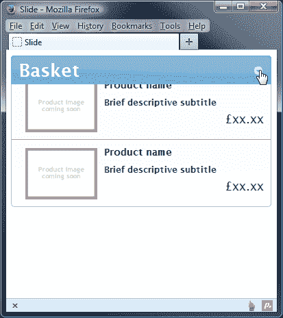

# 十四、UI 效果

到目前为止，我们已经研究了一系列非常有用的小部件和交互助手。所有这些都易于使用，但同时功能强大且高度可配置。有些有其微妙之处，需要在实施过程中加以考虑和思考。

另一方面，图书馆提供的效果在很大程度上非常紧凑，几乎没有学习的选择，也没有任何方法。我们可以用最少的配置快速轻松地使用这些效果。

我们将在本章中看到的影响如下：

*   突出
*   反弹
*   摇
*   转移
*   规模
*   爆炸
*   泡芙
*   跳动
*   滑动
*   失明的
*   夹子
*   折叠

# 使用核心效果文件

与单个组件本身一样，效果需要一个单独的核心文件的服务。它为效果提供了基本功能，例如创建包装器元素和控制动画。大多数但不是全部的效果都有自己的源文件，它们建立在核心基础上，添加特定于该效果的功能。

使用效果只需在页面中包含核心文件（`jquery.ui.effect.js`），在效果的源文件之前。然而，与`jquery.ui.core.js`文件不同，`jquery.ui.effect.js`文件的部分设计为完全独立使用。

## 使用彩色动画

如果我们单独使用核心效果文件，我们可以利用彩色动画。这包括将一个元素的背景色更改为另一种颜色（不仅仅是快照更改，而是将一种颜色平滑地变形为另一种颜色）、类转换和高级动画。

### 注

jQueryUI1.10 使用 jQueryColor 库的 2.0.0 版作为库中大部分颜色支持的基础。如果您想了解更多关于 jQuery 颜色的信息，请访问项目页面[https://github.com/jquery/jquery-color](https://github.com/jquery/jquery-color) 。

jQuery UI 中的 core effects 插件为 jQuery core 添加了使用`rgb()`、`rgba()`、十六进制值甚至颜色名称（如 aqua）设置颜色属性动画的功能。我们需要做的就是包含 jQuery UI 效果核心文件，jQuery 的`.animate()`将获得对颜色的支持。

让我们来看看如何创建彩色动画。首先，创建以下新页面：

```js
<!DOCTYPE HTML>
<html>
  <head>
    <meta charset="utf-8">
    <title>Color Animations</title>
    <link rel="stylesheet" href="css/effectColor.css">
    <script src="js/jquery-2.0.3.js"></script>
    <script src="development-bundle/ui/jquery.ui.effect.js"></script>
  </head>
  <script>
  <body>
    <form action="#">
      <div>
        <label for="name">Name: </label>
        <input id="name" type="text">
      </div>
      <div>
        <label for="age">Age: </label>
        <input id="age" type="text">
      </div>
      <div>
        <label for="email">Email: </label>
        <input id="email" type="text">
      </div>
      <button type="submit">Submit</button>
    </form>
  </body>
</html>
```

将页面另存为`effectColor.html`。在最后一个`<script>`块中，添加以下代码，为每个字段提供视觉反馈：

```js
    $(document).ready(function($){
      function Validate(fieldname, response)   {
        var bgColor, brdrColor;

        switch(response) {
          case "invalid" : 
            bgColor = "#ff9999";
            brdrColor = "#ff0000";
            break;
          case "valid" : 
            bgColor = "#ccffcc";
            brdrColor = "#00ff00";
            break;
        }

        fieldname.animate({
          backgroundColor: bgColor,
          borderTopColor: brdrColor,
          borderRightColor: brdrColor,
          borderBottomColor: brdrColor,
          borderLeftColor: brdrColor
        });
      }

      $("form").submit(function() {
        ($("#name").val().length == 0) ? Validate($("#name"), "invalid") : Validate($("#name"), "valid");
        ($("#age").val().length == 0) ? Validate($("#age"), "invalid") : Validate($("#age"), "valid");
        ($("#email").val().length == 0) ? Validate($("#email"), "invalid") : Validate($("#email"), "valid"); 
      });
    });
```

如您所见，我们所需要的只是 jQuery 和`jquery.ui.effect.js`文件来创建有吸引力的颜色过渡。在页面上，我们有一个简单的`<form>`元素，包含三个容器元素和三组`<label>`和`<input>`元素。`animate`方法是 jQuery 的一部分，而不是 jQuery UI 的一部分，但是`jquery.ui.effect.js`文件扩展了 jQuery 的`animate`方法，允许它专门处理颜色和类。

当点击**提交**按钮时，我们只需使用`animate`方法，根据文本输入是否已填写，向目标元素应用一系列新的 CSS 属性。如果它们已经完成，我们将它们涂成绿色，如果没有，我们将它们涂成红色。在本例中，我们还使用了一个基本样式表。在文本编辑器的另一个新页面中，添加以下基本选择器和规则：

```js
div { margin-bottom: 5px; }
label { display: block; width: 100px; float: left; }
input { border: 1px solid #000000; }
```

将此保存为`css`文件夹中的`effectColor.css`。当我们在浏览器中查看此页面时，我们应该看到当点击**提交**按钮时，任何留空的字段都会平滑地变为红色，而非空的字段会平滑地变为绿色。然而，当场地从红色变为绿色时，它最吸引人。

点击**提交**按钮后，以下屏幕截图显示页面：


### 注

需要注意的一点是，我们在代码中使用了`backgroundColor`作为属性；原因是 jQuery 在默认情况下无法设置`background-color`CSS 样式的动画，除非我们使用 jQuery 颜色插件。让我们更详细地看看这些属性。

彩色动画可以使用的样式属性如下：

*   `backgroundColor`
*   `borderTopColor`
*   `borderRightColor`
*   `borderBottomColor`
*   `borderLeftColor`
*   `color`
*   `outlineColor`

可以使用 RGB、十六进制（格式为`#xxx[xxx]`）甚至标准颜色名称指定颜色。建议尽可能使用 RGB 或十六进制颜色，因为浏览器并不总是一致地识别颜色名称。

### 注

颜色插件的默认版本仅支持基本颜色名称。如果您需要使用其他颜色名称，您可以从[下载包含此支持的版本 https://github.com/jquery/jquery-color#readme](https://github.com/jquery/jquery-color#readme) 。

## 使用类转换

除了为单个颜色属性设置动画外，`jquery.ui.effect.js`还为我们提供了在整个类之间设置动画的强大能力。这使我们能够顺利无缝地切换样式，而不会出现突然的不和谐变化。让我们在下面的示例中看看文件使用的这一方面。

将`effectColor.html`的`<head>`元素中的`<link>`标记更改为指向新样式表：

```js
<link rel="stylesheet" href="css/effectClass.css">
```

然后更改最后的`<script>`元素，使其显示如下：

```js
<script>
  $(document).ready(function($){
    var obj;

    function showValid(obj) {
      (obj.val().length == 0) ? null : obj.switchClass("error", "pass", 2000);
    }

    function showInvalid(obj) {
      (obj.val().length != 0) ? null : obj.switchClass("pass", "error", 2000);
    }

    function showEither(obj) {
      (obj.val().length == 0) ? obj.addClass("error", 2000) : obj.addClass("pass", 2000);
    }

    $("form").submit(function(e) {
      $("input").each(function() {
        var cssStyle = $(this).attr('class');
        if (cssStyle == "error") { showValid($(this)); }; 
        if (cssStyle == "pass") { showInvalid($(this)); } 
        if (cssStyle == null) { showEither($(this)); }           
      })
    });  
  });
</script>
```

另存为`effectClass.html`。`jquery.ui.effect.js`文件扩展了 jQuery 类 API，允许我们指定应用新类名的持续时间，而不是立即切换。我们还可以指定缓和效果。

当字段已经有一个类名并且需要更改为其他类名时，使用`jquery.ui.effect.js`文件的`switchClass`方法。`switchClass`方法需要几个参数；我们指定要删除的类名，然后是要添加的类名。我们还指定 duration 作为第三个参数。

本质上，页面的功能与以前一样；尽管如此，使用这种类型的类转换也允许我们使用非基于颜色的样式规则，因此如果需要，我们可以调整宽度、高度或许多其他样式属性。请注意，背景图像不能以这种方式转换。

与前一个示例一样，我们附带了一个样式表。这与前面的示例基本相同，只是我们的两个新类有一些样式。

在`effectColor.css`底部添加以下选择器和规则：

```js
.error { border: 1px solid #ff0000; background-color: #ff9999; }
.pass { border: 1px solid #00ff00; background-color: #ccffcc; }
```

将更新后的文件保存为`css`文件夹中的`effectClass.css`。

## 提前宽松

标准 jQuery 中的`animate`方法内置了一些基本的缓解功能，但对于更高级的缓解，您必须包含一个额外的缓解插件（由 GSGD 移植到 jQuery）。

### 注

有关更多信息，请参见[的项目页面 http://gsgd.co.uk/sandbox/jquery/easing/](http://gsgd.co.uk/sandbox/jquery/easing/) 。

`jquery.ui.effect.js`文件内置了所有这些高级缓解选项，因此不需要包含额外的插件。在本节中，我们不会详细介绍它们；但是，我们将在本章后面的一些示例中，在页面上的*缩放元素一节中使用它们。*

# 突出显示指定元素

高亮效果暂时将淡黄色着色应用于所调用的任何元素（该效果也称为**黄色褪色技术**（**YFT**）。让我们把一个简单的例子放在一起，这样我们就可以看到实际效果：

```js
<link rel="stylesheet" href="css/effectHighlight.css">
```

`<script>`元素引用效果的源文件，因此它使用`jquery.effects.highlight.js`文件：

```js
<script src="development-bundle/ui/jquery.ui.effect-highlight.js"></script>
```

然后从页面的`<body>`元素中删除`<form>`元素，并将其替换为以下标记：

```js
<h1>Choose the correct download below:</h1>
<a id="win" href="#"></a>
<a id="mac" href="#"></a>
<a id="linux" href="#"></a>
<button id="hint">Hint</button>
```

最后，更改最后的`<script>`元素，使其结束如下：

```js
<script>
  $(document).ready(function($){
    var ua = navigator.userAgent.split(" ");
    $("#hint").click(function() {
      var el = ua[1].toLowerCase().substring(1);
      $("#" + el).effect("highlight");
    });    
  });
</script>
```

将此页面另存为`effectHighlight.html`。调用突出显示效果的代码采用与其他库组件相同的熟悉形式。调用`effect`方法，并将实际效果指定为该方法的字符串参数。

我们只需嗅探`userAgent`字符串，看看搜索 Windows、Mac 或 Linux 是否返回正整数。如果找到正整数，`userAgent`字符串包含搜索词；如果返回`-1`，则未找到搜索项。

我们还需要创建新的样式表，不是为了效果，而是为了稍微整理一下。在文本编辑器的新页面中，添加以下选择器和规则：

```js
a { padding: 10px; float: left; }
a img { display: block; border: none; }
button { display: block; position: relative; top: 10px; clear: both; }
```

将此文件另存为`css`文件夹中的`effectHighlight.css`。

查看示例并单击**提示**按钮。您正在使用的操作系统的图标应简要突出显示：


虽然我们的示例似乎有点做作，但很容易看出这种效果作为前端辅助工具的潜力。每当有一系列动作需要按特定顺序完成时，突出显示效果可以立即为访客提供视觉提示，说明下一步需要完成的步骤。

## 添加额外的效果参数

每个`effect`方法，以及以及指示实际应用哪种效果的参数，都可以占用控制效果如何工作的三个额外参数。所有这些参数都是可选的，包括以下参数（按列出的顺序）：

*   包含其他配置选项的对象
*   以毫秒为单位的整数，表示效果的持续时间，或指定`slow`、`normal`或`fast`之一的字符串
*   在效果结束时执行的回调函数

`highlight`效果只有一个可配置选项，可以在作为第二个参数传递的对象中使用，即高亮颜色。

让我们在突出显示的示例中添加一些附加参数，以澄清它们的用法。将对`effectHighlight.html`中最后一个`<script>`元素中`effect`方法的调用更改为如下所示：

```js
$(el).effect("highlight", {}, function() {
  $("<p />", {
    text: "That was the highlight"
  }).appendTo("body").delay(2000).fadeOut();
});
```

另存为`effectHighlightCallback.html`。也许我们的新代码最显著的特性是作为第二个参数传递的空对象。在本例中，我们不使用任何额外的可配置选项，但我们仍然需要传入空对象以访问第三个和第四个参数。

作为第三个参数传递的回调函数可能是 JavaScript 历史上最不有用的回调函数，但它确实说明了在效果之后安排额外的动画后代码执行是多么容易。

# 弹跳

另一个简单的效果，我们可以使用小配置是反弹效果。要查看此效果，请将`effectHighlight.html`中`<body>`元素的内容更改为以下内容：

```js
<div id="ball">
  
</div>
```

我们还需要使用反弹效果的源文件；更改对`jquery.ui.effect-highlight.js`文件的引用，使其指向`bounce.js`源文件：

```js
<script src="development-bundle/ui/jquery.ui.effect-bounce.js"></script>
```

另存为`effectBounce.html`。我们需要添加一点样式才能真正完整地看到效果，但可能不值得创建一个全新的样式表，因此只需将页面的`<head>`元素中的`<link>`元素替换为以下内容：

```js
<style>
  #ball { position: relative; top: 150px; }
</style>
```

最后，更改最后的`<script>`元素，使其显示如下：

```js
<script>
  $(document).ready(function($){
    $("#ball").click(function() {
      $(this).effect("bounce", { distance: 140 });
    });
  });
</script>
```

在本例中使用反弹效果可以显示添加此简单但有吸引力的效果是多么容易。我们配置`distance`选项来设置元素移动的距离。下表列出了可配置的其他选项：

<colgroup><col style="text-align: left"> <col style="text-align: left"> <col style="text-align: left"></colgroup> 
| 

选项

 | 

默认值

 | 

使用

 |
| --- | --- | --- |
| `direction` | `"up"` | 设置反弹的方向 |
| `distance` | `20` | 设置第一次反弹的距离（以像素为单位） |
| `times` | `5` | 设置元素应反弹的次数 |

运行该示例时，您会注意到反弹效果内置了一个减缓功能，因此随着动画的进行，反弹距离将自动减小。

### 注

此处使用的默认缓和效果为`swing`；这是可在库中使用的许多 easings 功能之一。缓和功能控制动画在动画中不同点处进行的速度；您可以在[上看到可用的 easings 功能的完整列表 http://api.jqueryui.com/easings/](http://api.jqueryui.com/easings/) 。

需要注意的一点是，对于大多数不同的效果，包括反弹效果（但不是我们前面看到的高光效果），该效果实际上并不应用于指定的元素。而是创建一个包装器元素，并将效果所针对的元素附加到包装器的内部。然后将实际效果应用于包装器。

这是一个需要注意的重要细节，因为如果您需要在动画中期操作具有应用于它的效果的元素，那么包装器将需要成为目标，而不是原始元素。效果动画完成后，包装器将从页面中移除。

# 摇动一个元素

震动效果非常类似于反弹效果，但关键区别在于没有任何内置缓震效果。因此，目标元素将以相同的距离抖动指定的次数，而不是每次都减小（尽管它将在动画结束时平滑停止）。

让我们更改上一个示例，使其使用抖动效果而不是反弹效果。更改`effectBounce.html`使其使用`shake.js`源文件而不是反弹源文件：

```js
<script src="development-bundle/ui/jquery.ui.effect-shake.js"></script>
```

然后更改`<body>`元素底部最后一个`<script>`元素中的点击处理程序，使其显示如下：

```js
$("#ball").click(function() {
 $(this).effect("shake", { direction: "up" }, 100);
});
```

另存为`effectShake.html`。这次我们使用了`direction`配置选项和 duration 参数。配置选项控制震动的方向。我们将其设置为覆盖此选项的默认设置，即`left`。我们使用的持续时间会加快动画的速度。

此效果与反弹效果共享相同的选项，尽管默认设置略有不同。下表中列出了选项：

<colgroup><col style="text-align: left"> <col style="text-align: left"> <col style="text-align: left"></colgroup> 
| 

选项

 | 

默认值

 | 

使用

 |
| --- | --- | --- |
| `direction` | `"left"` | 设置抖动的方向 |
| `distance` | `20` | 以像素为单位设置抖动的距离 |
| `times` | `3` | 设置元素应震动的次数 |

## 传递元素的轮廓

转移效应与其他不同，因为它不会直接影响目标元素。相反，它将指定元素的轮廓传输到另一个指定元素。要查看此效果，请更改`effectShake.html`的`<body>`元素，使其包含以下元素：

```js
<div id="container">
  <div id="basketContainer">
    <div id="basket"></div>
    <p>Basket total: <span id="total">0</span></p>
  </div>      
  <div id="productContainer">
    </img>
    <p>BFG GTX 280 OC 1GB GDDR3 Dual DVI HDTV Out PCI-E Graphics Card</p>
    <p id="price">Cost: $350</p>

  </div>
  <div id="purchase"><button id="buy">Buy</button></div>
</div>
```

另存为`effectTransfer.html`。我们已经创建了一个基本的产品列表；点击**购买**按钮时，传递效果会给人产品被移入篮子的感觉。要实现这一点，请更改最后的`<script>`元素，使其包含以下代码：

```js
<script>
  $(document).ready(function($){
    $("#buy").click(function() {
      $("#productContainer img").effect("transfer", {
        to:"#basket"
      }, 750, function() {
        var currentTotal = $("#total").text(),
        numeric = parseInt(currentTotal, 10);
        $("#total").text(numeric + 1);
      });
    });
  });
</script>
```

当然，一个合适的购物车应用要比这复杂得多，但我们确实看到了转移效应的辉煌。不要忘记更新效果的源文件：

```js
<script src="development-bundle/ui/jquery.effects.transfer.js"></script>
```

本例还需要一些 CSS，因此创建以下新样式表：

```js
body { font-family: "Lucida Grande",Arial,sans-serif; }
#container { width: 707px; margin: 0 auto; }
#productContainer img { width:  92px; height: 60px; border: 2px solid #000000; position: relative; float: left; }
#productContainer p { width: 340px; height: 50px; padding: 5px; border: 2px solid #000; border-left: none; margin: 0; font-family: Verdana; font-size: 11px; font-weight: bold; float: left; }
p#price { height: 35px; width: 70px; padding-top: 20px; float: left; }
#purchase { height: 44px; width: 75px; padding-top: 16px; border: 2px solid #000; border-left: none; float: left; text-align: center; }
#basketContainer { width: 90px; margin-top: 100px; float: right; }
#basketContainer p { width:  100px; }
#basket { width: 65px; height: 50px; position: relative; left: 13px; background: url(img/shopping.png) no-repeat; }
.ui-effects-transfer { border: 2px solid #66ff66; }
```

将此保存为`css`文件夹中的`effectTransfer.css`。我们新样式表中的关键规则是以类为`ui-effects-transfer`的元素为目标的规则。

这个元素是由效果创造出来的，再加上我们的造型，产生了从产品转移到篮子中的绿色轮廓。

在浏览器中运行该文件。我想你会同意，这是一个很好的效果，它将增加价值的任何页面上使用它。以下是传输发生时的外观：


传输效果只有两个可配置选项，其中一个是必需的，我们已经看到了。下表中列出了两个以供参考：

<colgroup><col style="text-align: left"> <col style="text-align: left"> <col style="text-align: left"></colgroup> 
| 

选项

 | 

默认值

 | 

使用

 |
| --- | --- | --- |
| `className` | `"ui-effects-transfer"` | 将自定义类名应用于 effect helper 元素。 |
| `to` | `"none"` | 设置效果将传递到的元素。此属性是必需的。 |

到目前为止，我们所看到的四种效果都有一个共同点——它们只能与`effect`方法一起使用。剩余的效果不仅可以用于`effect`方法，还可以用于 jQuery 的切换和`show`/`hide`方法。

让我们看一看。

# 页面上的缩放元素

缩放效果是高度可配置的，用于收缩元素。它在用于隐藏元素时非常有效。在本例中，我们将使用`hide()`方法触发效果，而不是使用`effect`方法。

在本例中，我们将使用一些 CSS 框架类，以及一些自定义样式；因此，在`effectTransfer.html`的`<head>`元素中添加两个新的`<link>`元素：

```js
<link rel="stylesheet" href="development-bundle/themes/redmond/jquery.ui.all.css">
<link rel="stylesheet" href="css/effectScale.css">
```

然后，将`<body>`元素中的底层标记替换为以下内容：

```js
<div class="ui-widget ui-widget-content ui-corner-all">
  <div class="ui-widget-header ui-corner-all">
    A dialog box
    <a id="close" class="ui-icon ui-icon-closethick" href="#">
    Close
    </a>
  </div>
  <div class="content">Close the dialog to see the scale effect</div>
</div>
```

不要忘记将效果的`<script>`元素更改为缩放效果的源文件：

```js
<script src="development-bundle/ui/jquery.ui.effect-scale.js"></script>
```

最后，更换最后一个`<script>`元素，使其显示如下：

```js
<script>
  $(document).ready(function($){
    $("#close").click(function(e) {
      $("#close").click(function(e) {
        e.preventDefault();
        $(this).closest(".ui-widget").hide("scale", {}, 900);
      });
    });
  });
</script>
```

将新页面另存为`effectScale.html`。我们使用的自定义样式表如下所示：

```js
.ui-widget { padding: 3px; width: 300px; }
.ui-widget-header, .content { padding: 5px 10px; }
.ui-widget-header a { margin-top: 2px; float: right; }
```

将此文件另存为`css`文件夹中的`effectScale.css`。这些样式用于给示例一个模糊的对话框状外观。

在脚本中，我们只需为 close 图标添加一个 click 处理程序，并在对话框的外部容器上调用`effect()`方法。一个空对象作为第二个参数传递给该方法，一个相对较长的持续时间作为第三个参数传递，因为这种效果进行得相当快。以下屏幕截图显示了实际效果：


在本例中，使用`hide()`方法而不是`effect()`方法对我们有利，因为我们希望对话框在效果完成后保持隐藏状态。当使用`effect()`方法时，小部件的位在动画结束时仍然可见。

### 提示

**应在何时配置百分比选项？**

当结合比例效应使用`effect()`方法时，必须配置`percent`配置选项。

有多个配置选项可与秤一起使用；如下表所示：

<colgroup><col style="text-align: left"> <col style="text-align: left"> <col style="text-align: left"></colgroup> 
| 

选项

 | 

默认值

 | 

使用

 |
| --- | --- | --- |
| `direction` | `"both"` | 设置方向以缩放元素。可以是指定水平、垂直或两者的字符串。 |
| `from` | `{}` | 设置要缩放的元素的起始高度和宽度。 |
| `origin` | `["middle","center"]` | 设置消失点，用于显示/隐藏动画。 |
| `percent` | `0` | 设置缩放元素的结束大小。 |

# 页面上的爆炸元素

爆炸效果真是太棒了。目标元素被炸成指定数量的碎片，然后完全消失。这是一个易于使用的效果，并且几乎没有配置属性，但是这种效果的视觉影响是巨大的，只需很少的代码就可以获得很多效果。让我们看一个基本的例子。

创建以下新页面：

```js
<!DOCTYPE HTML>
<html>
  <head>
    <meta charset="utf-8">
    <title>Explode</title>
    <link rel="stylesheet" href="development-bundle/themes/redmond/jquery.ui.all.css">
    <style>
      body { width: 200px; margin-left: auto; margin-right: auto; }
    </style>
    <script src="js/jquery-2.0.3.js"></script>
    <script src="development-bundle/ui/jquery.ui.effect.js"></script>
    <script src="development-bundle/ui/jquery.ui.effect-explode.js"></script>
  </head>
  <script>
    $(document).ready(function($){
      $("#theBomb").click(function() {
        $(this).hide("explode");
      });
    });
  </script>
  <body>
    <p>Click the grenade to pull the pin!</p>
    
  </body>
</html>
```

另存为`effectExplode.html`。正如您所见，代码非常简单，可以完全开箱即用，无需额外配置。此效果只有一个可配置属性，即`pieces`属性，它确定元素分解成多少个片段。默认值为 9。`effect()`方法的效果与`hide()`方法的效果相同。

一旦指定的元素被分解，它将通过将其`style`属性设置为`display: none`来隐藏。这是默认行为。但是，它仍将保留在页面的 DOM 中。以下屏幕截图显示了正在进行的爆炸：


物理学家有时会猜测为什么时间之箭似乎只指向前方。他们总是问自己一些哲学问题，比如“为什么我们看不到手榴弹从一大片碎片中自发形成？”（实际上，物体通常是一个鸡蛋，但我不认为一个基于鸡蛋的例子会产生同样的影响！）

jQueryUI 不能帮助我们理解的熵，但它可以向我们展示手榴弹自发重组的样子。我们需要隐藏``标签才能显示出来。最简单的方法是使用内联`style`属性：

```js


```

然后，更改最后的`<script>`元素，使其显示如下：

```js
<script>
  $(document).ready(function($){
    $("#theBomb").show("explode");
  });
</script>
```

将此变体另存为`effectExplodeShow.html`。这次我们使用`show()`方法而不是`hide()`方法来触发动画，动画在页面加载后发生。

动画是相同的，只是它是反向显示的，这一次在动画结束后，手榴弹不会从视图中隐藏。与其他效果一样，explode 也可以使用特定的持续时间和回调函数。

# 产生一种喘息效果

与爆炸效果类似，但稍显微妙的是喷吹效果，它会导致元素在褪色之前略微增长。像 explode 一样，我们很少需要考虑配置选项。

考虑一个在其上发生 Ajax 操作的页面。提供一个加载图像，向访问者显示正在发生的事情是很有用的。当操作完成时，我们不需要像这样隐藏一个图像，我们可以将它从存在中释放出来。

移除`<p>`元素并更改上一示例中的``元素，使其指向新图像：

```js

```

然后将效果的源文件更改为缩放效果：

```js
<script src="development-bundle/ui/jquery.ui.effect-scale.js">
</script>
```

最后，更改最后一个`<script>`元素，使其显示如下：

```js
<script>
  $(document).ready(function($){
    $("#loader").click(function() {
      $(this).hide("puff");
    });
  });
</script>
```

另存为`effectPuff.html`。在本例中，我们实际上没有检测给定进程是否已完成加载。这需要做太多的工作才能看到我们所看到的效果。相反，我们将效果的执行绑定到一个简单的单击处理程序中。

您会注意到，我们使用了`jquery.ui.effect-scale.js`源文件来实现此效果。

烟团效果是唯一没有自己源文件的效果，它是与缩放效果密切相关的源文件的一部分。

就像我们在上一节中看到的爆炸效果一样，这个效果只有一个配置选项，可以作为`effect`方法的第二个参数传入对象。这是`percent`选项，控制图像放大到的大小。默认值为 150%。与爆炸效果类似，动画结束后，目标元素将从视图中隐藏。无论使用`effect()`还是`hide()`，都会发生这种情况。

该效果拉伸目标元素（及其子元素，如果有），同时降低其不透明度。它适用于适当的图像、背景颜色和边框，但您应该注意，它不适用于 CSS 指定的背景图像。然而，这是一个巨大的效应。

下面的屏幕截图显示了它的实际操作：


# 利用脉动效应工作

脉动效应是另一种与指定元素的不透明度一起工作的效应。此效果会将不透明度临时降低指定的次数，使元素看起来像是在脉动。

在下面的基本示例中，我们将创建一个简单的倒计时时间，从`15`开始倒计时。当显示屏达到 10 秒时，它将开始闪烁红色。在`effectPuff.html`中，将页面`<head>`元素中的链接更改为指向新样式表：

```js
<link rel="stylesheet" href="css/effectPulsate.css">
```

然后从页面中删除加载``元素，并在其位置添加以下元素：

```js
<div id="countdown">15</div>
```

接下来，更改效果的源文件，以便使用`jquery.ui.effect-pulsate.js`文件：

```js
<script src="development-bundle/ui/jquery.ui.effect-pulsate.js"></script>
```

最后，移除现有的最后一个`<script>`元件，并将其替换为以下元件：

```js
<script>
  $(document).ready(function($){
    var age = 15, countdown = $("#countdown"),
      adjustAge = function() {
        countdown.text(age--);
        if (age === 0) {
          clearInterval(timer);
        } else if (age < 10) {
          countdown.css({
          backgroundColor: "#ff0000",
          color: "#fff"
        }).effect("pulsate", { times: 1 });
      }
    },
    timer = setInterval(function() { adjustAge() }, 1000);
  });
</script>
```

另存为`effectPulsate.html`。页面本身只包含一个简单的`<div>`元素，其中包含文本`15`。代码首先设置一个计数器变量，然后缓存`<div>`元素的选择器。然后我们定义`adjustAge()`函数。

此函数首先减少倒计时元素的文本内容，同时将计数器变量的值减少 1。然后检查计数器变量是否已达到零；如果是，它将清除我们将要设置的间隔。

如果计数器变量大于 0 但小于 11，则函数将为元素应用红色背景色，为元素的文本内容应用白色背景色，然后运行脉动效果。

我们使用`times`配置选项来指定元素的脉动次数。由于我们将每秒执行一次该方法，因此可以将其设置为每次仅脉动一次。这是唯一可配置的选项。

在我们的`adjustAge`函数之后，我们使用 JavaScript 的`setInterval`函数启动间隔。此函数将在指定的间隔后重复执行指定的函数，在本例中为 1000 毫秒或 1 秒。我们通过使用匿名函数调用命名函数来避免使用`window`对象。

新样式表非常简单，由以下代码组成：

```js
#countdown { width: 100px; border: 1px solid #000; margin: 10px auto 0; font-size: 60px; text-align: center; }
```

将其保存在`css`文件夹中为`effectPulsate.css`。

# 在元素中添加跌落效果

跌落效应很简单。元素似乎落下（或落在）页面上，这是通过调整元素的`position`和`opacity`值来模拟的。

此效果公开了以下可配置选项：

<colgroup><col style="text-align: left"> <col style="text-align: left"> <col style="text-align: left"></colgroup> 
| 

选项

 | 

默认值

 | 

使用

 |
| --- | --- | --- |
| `direction` | `"left"` | 设置下降的方向 |
| `distance` | 元素的外部宽度或高度（取决于方向）除以 2 | 设置元素下落的距离 |
| `easing n` | `one` | 设置动画期间使用的缓和功能 |
| `mode` | `"hide"` | 设置元素是隐藏还是显示 |

在许多情况下，放置效果会很有用，但在创建自定义工具提示时，会立即想到放置效果。我们可以轻松创建单击按钮时显示的工具提示，但不只是显示工具提示，我们可以将其放到页面上。在本例中，我们将使用按钮小部件和`position`工具，以及效果。

添加到 CSS 框架文件的链接，并更改`effectPulsate.html`的`<head>`元素中的样式表链接：

```js
<link rel="stylesheet" href="development-bundle/themes/redmond/jquery.ui.all.css">
<link rel="stylesheet" href="css/effectDrop.css">
```

从页面中删除倒计时`<div>`元素，并添加以下元素：

```js
<a id="button" href="#" title="This button does nothing">
  Click me!
</a>
```

现在我们需要更改效果的源文件，并为位置和按钮小部件添加源文件：

```js
<script src="development-bundle/ui/jquery.ui.effect-drop.js">
</script>
<script src="development-bundle/ui/jquery.ui.core.js">
</script>
<script src="development-bundle/ui/jquery.ui.widget.js">
</script>
<script src="development-bundle/ui/jquery.ui.position.js">
</script>
<script src="development-bundle/ui/jquery.ui.button.js">
</script>
```

最后，更改 final`<script>`元素，使其显示为如下：

```js
<script>
  $(document).ready(function($){
    $("#button").button().click(function() {
      var button = this, tip = $("<span />", {
        id: "tip",
        text: button.title
      }),
      tri = $("<span />", {
        id: "tri"
      }).appendTo(tip);
      tip.appendTo("body").position({
        of: button,
        my: "right-35 center",
        at: "left center",
        offset: "-30 0"
      });
      tip.show("drop", { direction: "up" }, function() {
        $(this).delay(1000).fadeOut();
      });
    });
  });
</script>
```

将此文件另存为`effectDrop.html`。单击按钮时，我们首先存储对按钮的 DOM 节点的引用。然后，我们为`position`工具添加一个配置对象，以便将工具提示定位到按钮的右侧。

然后我们创建一个新的`<span>`元素用作工具提示，它的文本内容设置为按钮的标题文本。我们还创建了另一个用于创建三角形 CSS 形状的元素，以便为工具提示提供指针。此元素将附加到工具提示中。

创建后，工具提示将附加到页面的`<body>`元素，然后使用拖放效果显示。`direction`配置选项用于使工具提示显示为下拉；我们必须在这里指定相反的方向，因为我们的工具提示是绝对定位的。

除了 CSS 框架提供的样式之外，本例还需要一些最低限度的 CSS 来设置工具提示的样式。创建以下样式表：

```js
#tip { display: none; padding: 10px 20px 10px 10px;
position: absolute; background-color: #cecece; }
#tri { border-top: 20px solid transparent; border-right: 30px solid #cecece; border-bottom: 20px solid transparent; position: absolute; left:- 30px; top: 0; }
```

将其保存在`css`文件夹中为`effectDrop.css`。这里的造型纯粹是为了美观。

在浏览器中运行文件时，您应该会看到工具提示，如以下屏幕截图所示：


# 实现滑动效果

jQueryUI 库的其余效果都是通过以不同的方式显示和隐藏元素来工作的，而不是像我们已经看到的大多数效果那样使用不透明度。

幻灯片效果也不例外，它通过将元素滑入（或滑出）视图来显示（或隐藏）元素。这类似于我们刚才看到的下降效应。主要区别在于它不使用不透明度。

幻灯片效果包含以下配置选项：

<colgroup><col style="text-align: left"> <col style="text-align: left"> <col style="text-align: left"></colgroup> 
| 

选项

 | 

默认值

 | 

使用

 |
| --- | --- | --- |
| `direction` | `"left"` | 设置幻灯片的方向 |
| `distance` | 元素的外部宽度或高度（取决于方向） | 设置元素滑动的距离 |
| `easing` | `none` | 设置动画期间使用的缓和功能 |
| `mode` | `"show"` | 设置元素是隐藏还是显示 |

这些配置选项与我们在上一个示例中看到的 drop effect 使用的配置选项相同，只是一些默认值不同。

在下一个示例中，我们可以创建这种功能。在`effectDrop.html`中，将页面`<head>`元素中的`<link>`元素从`effectDrop.css`更改为`effectSlide.css`：

```js
<link rel="stylesheet" href="css/effectSlide.css">
```

然后从页面的`<body>`元素中删除`<a>`元素，并在其位置添加以下 HTML：

```js
<aside id="basket" class="ui-widget">
  <h1 class="ui-widget-header ui-corner-all">
    Basket
    <a id="toggle" title="Show basket contents" class="ui-icon ui-icon-circle-triangle-s" href="#">
      Open
    </a>
  </h1>
  <div class="ui-widget-content ui-corner-bottom">
    <ul>
      <li>
        
        <h2>Product name</h2>
        <h3>Brief descriptive subtitle</h3>
        <span>£xx.xx</span>
      </li>
      <li>
        
        <h2>Product name</h2>
        <h3>Brief descriptive subtitle</h3>
        <span>£xx.xx</span>
      </li>
      <li>
        
        <h2>Product name</h2>
        <h3>Brief descriptive subtitle</h3>
        <span>£xx.xx</span>
      </li>
    </ul>
  </div>
</aside>
```

此集合中的外部元素是`<aside>`，它是位于站点右栏的迷你篮子小部件的完美元素。在这个元素中，我们有一个`<h1>`元素作为篮框的标题。标题包含一个链接，用于显示或隐藏篮中的内容。篮子的内容物将包括集装箱`<div>`内无序的产品清单。

不要忘记将效果源文件的`<script>`元素更改为使用`jquery.ui.effect-slide.js`，并删除`jquery.ui.core.js`、`jquery.ui.widget.js`、`jquery.ui.position.js`和`jquery.ui.button.js`的`<script>`文件：

```js
<script src="development-bundle/ui/jquery.ui.effect-slide.js">
</script>
```

最后的`<script>`元素需要更改为以下代码：

```js
  <script>
    $(document).ready(function($){
      $("#toggle").on("click", function(e) {
        var slider = $("#basket").find("div"),
          header = slider.prev();
        if (!slider.is(":visible")) {
          header.addClass("ui-corner-top")
            .removeClass("ui-corner-all");
        }
        slider.toggle("slide", {
          direction: "up"
        }, "slow", function() {
          if (slider.is(":visible")) {
            header.find("a").switchClass("ui-icon-circle-triangle-s", "ui-icon-circle-triangle-n");
          } else {
            header.switchClass("ui-corner-all", "ui-corner-top");
            header.find("a").switchClass("ui-icon-circle-triangle-n", "ui-icon-circle-triangle-s");
          }
        });
      });
    });
  </script>
```

另存为`effectSlide.html`。所有功能都驻留在 clickhandler 中，我们将其附加到篮子标题中的图标。单击此元素时，我们首先初始化`slider`和`header`变量，因为这些是我们将要处理的元素。

然后检查`slider`（篮子内容物容器）是否隐藏；如果它是隐藏的，我们知道它即将被打开，因此从`header`底部移除圆角。这使得滑块元件与`header`底部齐平，即使在滑动打开时也是如此。

然后，我们使用 jQuery 的`toggle()`方法调用 effect，我们使用该方法的第一个参数指定该效果。然后在作为第二个参数传递的对象中设置配置选项`direction`。使用字符串`slow`作为第三个参数延长动画的持续时间，并使用匿名回调函数作为第四个参数。此功能将在幻灯片动画结束时执行。

在这个函数中，我们检查`slider`的状态，看看它是隐藏的还是打开的。如果在动画结束时它是打开的，我们从`header`底部移除边框，然后更改`header`中的图标，使其指向上，表示可以通过再次单击图标来关闭篮子。

如果`slider`现在已关闭，我们将再次向`header`添加底部边框和圆角，并将图标改回指向下方的箭头。

在本例中，我们还使用了一些 CSS。创建以下样式表：

```js
#basket { width: 380px; float: right; }
#basket h1 { padding: 5px 10px; margin: 0; }
#basket h1 a { float: right; margin-top: 8px; }
#basket div { display: none; }
#basket ul { margin: 0; padding: 0; list-style-type: none; }
#basket li { padding: 10px; border-bottom: 1px solid #aaa; }
#basket li:last-child { border-bottom: none; }
#basket li:after { content: ""; display: block; width: 100%; height: 0; visibility: hidden; clear: both; }
#basket img { float: left; height: 75px; margin: 2px 10px 0; width: 105px; }
#basket h2 { margin: 0 0 10px; font-size: 14px; }
#basket h3 { margin: 0; font-size: 12px; }
#basket span { margin-top: 6px; float: right; }
```

将此保存为`css`文件夹中的`effectSlide.css`。在本例中，我们不需要太多 CSS，因为我们使用的是 CSS 框架类。

正在进行的效果应显示在以下屏幕截图中：



在这个例子中，我们可以简单地使用 jQuery 的原生`slideToggle()`方法；使用 jQueryUI 的幻灯片效果的主要好处是，我们也可以向左或向右滑动。

## 使用宽松

正如前面提到的，`jquery.ui.effect.js`文件具有内置的能力，可以无缝地使用 easing 和 effects。让我们看看这有多容易实现。更改`effectSlide.html`中最后一个`<script>`元素，使其显示如下：

```js
<script>
  $(document).ready(function($){
    $("#toggle").on("click", function(e) {
      var slider = $("#basket").find("div"),
 header = slider.prev(),
 easing = (slider.is(":visible")) ?
 "easeOutQuart" :
 "easeOutBounce";
        if (!slider.is(":visible")) {
          header.addClass("ui-corner-top")
            .removeClass("ui-corner-all");
        }
        slider.toggle("slide", {
 direction: "up",
 easing: easing
        }, "slow", function() {
        if (slider.is(":visible")) {
          header.find("a").switchClass("ui-icon-circle-triangle-s", "ui-icon-circle-triangle-n");
        } else {
          header.switchClass("ui-corner-all", "ui-corner-top")
          header.find("a").switchClass("ui-icon-circle-triangle-n", "ui-icon-circle-triangle-s");
        }
      });
    });
  });
</script>
```

另存为`effectsSlideEasing.html`。看看这有多容易？我们需要做的就是在效果的配置对象中添加`easing`选项，并定义一个或多个缓和方法作为选项值。

在本例中，我们通过设置一个变量来为每个切换状态指定不同的缓和方法，该变量使用 JavaScript 三元条件来设置缓和函数，具体取决于滑块是否可见。

当篮子向下滑动时，它会在动画结束时用`easeOutBounce`轻微反弹。当它向上滑动时，它将使用`easeOutQuart`在动画过程中逐渐减速。

### 注

我们可以在 jQueryUI 网站上的一个优秀页面上显示我们可以使用的所有缓解方法，并可以在[上看到 http://jqueryui.com/demos/effect/easing.html](http://jqueryui.com/demos/effect/easing.html) 。

# 了解盲效应

盲效应实际上与滑动效应相同。从视觉上看，元素似乎做了同样的事情，两个效果的代码文件也非常相似。我们需要担心的两种效果之间的主要区别是，使用这种效果，我们只能指定效果的轴，而不能指定实际的方向。

盲区效果具有以下配置选项：

<colgroup><col style="text-align: left"> <col style="text-align: left"> <col style="text-align: left"></colgroup> 
| 

选项

 | 

默认值

 | 

使用

 |
| --- | --- | --- |
| `direction` | `"vertical"` | 设置运动的轴 |
| `easing` | `none` | 设置动画中使用的缓和功能 |
| `mode` | `"hide"` | 设置是否隐藏或显示元素 |

此效果用于配置的`direction`选项只接受`horizontal`或`vertical`的值。我们将在最后一个示例的基础上进一步了解盲效应的作用。更改`effectSlide.html`中盲效的`<script>`资源，使其引用`jquery.ui.effect-blind.js`文件：

```js
<script src="development-bundle/ui/jquery.ui.effect-blind.js"></script>
```

现在更改`toggle()`方法，使其使用盲效果，并更改`direction`配置选项的值：

```js
slider.toggle("blind", {
 direction: "vertical"
}, "slow", function() {
  if (slider.is(":visible")) {
    header.css("borderBottomWidth", 0).find("a")
      .addClass("ui-icon-circle-triangle-n")
      .removeClass("ui-icon-circle-triangle-s");
  } else {
    header.css("borderBottomWidth", 1)
      .addClass("ui-corner-all")
      .removeClass("ui-corner-top").find("a")
      .addClass("ui-icon-circle-triangle-s")
      .removeClass("ui-icon-circle-triangle-n");
  }
});
```

另存为`effectBlind.html`。从字面上说，我们所做的更改就是指定效果的字符串，在本例中为`blind`，并且`direction`属性的值从`up`更改为`vertical`。请注意，当我们查看文件时，滑动元素和将其遮挡之间的细微差别。

当登录表单向上滑动时，元素的底部始终可见，就好像整个篮子向上移动到标题中或从标题中移出一样。但是，使用遮光效果时，将显示或隐藏元素，从底部开始，就像打开或关闭百叶窗一样。

# 剪切元件

剪辑效果与滑动效果非常相似。主要区别在于，不是将目标图元的一条边移向另一条边，而是将目标图元的两条边移向中心，以产生图元滑出视图的效果。

剪辑效果具有与盲效果相同的配置选项，这些选项具有相同的默认值。

在[第 5 章](05.html "Chapter 5. The Dialog")*对话框*的末尾，我们创建了一个示例，当单击缩略图时，在对话框中显示全尺寸图像。当按下对话框上的关闭按钮时，对话框立即从页面中删除。

我们可以很容易地使用剪辑效果来关闭对话框。

在`dialog14.html`中，在现有库文件之后添加剪辑效果的源文件：

```js
<script src="development-bundle/ui/jquery.ui.effect.js"></script>
<script src="development-bundle/ui/jquery.ui.effect-clip.js"></script>
```

然后，更改对话框配置对象，使其显示如下：

```js
dialogOpts = {
  modal: true,
  width: 388,
  height: 470,
  autoOpen: false,
  open: function(event, ui) {
  $("#dialog").empty();
    $("").attr("src", filename).appendTo("#dialog");
    $("#dialog").dialog("option", "title", titleText);
  },
  hide: {
    effect: "clip"
  }
};
```

另存为`effectClip.html`。在这个对现有文件的简单添加中，我们结合`close`事件回调使用剪辑效果来隐藏对话框。`direction`选项的`vertical`默认配置值和 normal 的默认速度都很好，所以我们只调用`hide`方法，指定 clip 时不需要额外参数。

下面的屏幕截图显示了正在剪辑的对话框：


# 折叠元件

折叠是一种整洁的效果，使所应用的元素看起来像一张纸一样折叠起来。它通过将指定元素的下边缘从顶部移动 15 个像素，然后将右边缘完全移向左边缘来实现这一点。

在该效果的第一部分中，元素从顶部收缩到顶部的距离通过效果的 API 显示为可配置属性。因此，我们可以对其进行调整，以适应实施的需要。此属性是一个整数。

通过再次修改对话框示例，我们可以看到这种效果。在`effectClip.html`中，将剪辑的效果源文件更改为折叠：

```js
<script src="development-bundle/ui/jquery.ui.effect-fold.js"></script>
```

然后将`hide`事件回调更改为：

```js
hide: {
  effect: "fold",
  size: 200,
  duration: 1000
}
```

另存为`effectFold.html`。这次我们使用大小配置选项，使效果在第一次折叠时停止，在对话框顶部之前 200 像素。我们还将动画的持续时间设置为 1000 毫秒，从而使动画速度稍微减慢。这是一个非常好的效果；以下屏幕截图显示了动画的第二部分：


# 总结

在本章中，我们介绍了 jQueryUI 库中提供的完整的 UI 效果。我们已经看到，使用`jquery.ui.effect.js`基本组件构建有吸引力的彩色动画和平滑的类转换是多么容易。

我们还看到，以下效果可以与 simple effect API 结合使用：

*   反弹
*   突出
*   摇
*   转移

重要的一点是，大多数单独的效果不仅可以与效果 API 一起使用，还可以使用`show`/`hide`和`toggle`逻辑，使它们具有难以置信的灵活性和健壮性。此高级 API 可以使用以下效果：

*   失明的
*   夹子
*   滴
*   爆炸
*   折叠
*   泡芙
*   跳动
*   规模
*   滑动

我们还看到，jQuery UI effects 的核心文件还包括`jquery.easing.js`插件中使用的所有缓解功能，当我们不使用 jQuery UI 时，这些功能必须与 jQuery 一起使用。

现在我们来到本章的结尾。有一种说法，我相信你们几乎所有人都会听过。这是“给一个人一条鱼…”的说法。我希望在这本书的过程中，我教会了你如何钓鱼，而不仅仅是给你一条鱼。