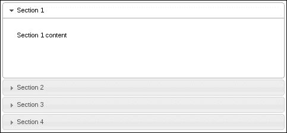
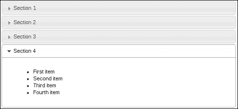
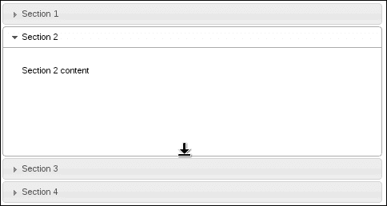
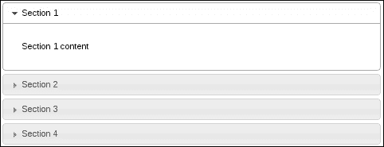
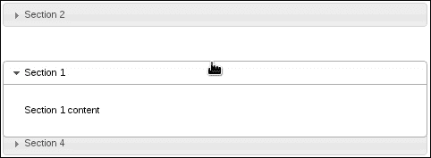
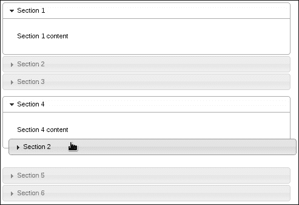

# 一、手风琴创作

在本章中，我们将介绍以下配方：

*   使用 Tab 键进行分区导航
*   动态更改高度样式
*   可调整大小的内容节
*   用主题控制间距
*   分类手风琴节
*   手风琴间的拖放

# 导言

在本章中，我们将探讨扩展**手风琴**小部件以适应多种场景的各种方法。手风琴小部件提供了很多现成的功能。例如，在没有任何配置的情况下，我们得到了一个主题容器小部件，它将内容分组到各个部分。

我们将重点介绍一些用例，这些用例将阐明手风琴小部件的内部工作原理。键盘事件是浏览页面的一种方式，我们可以增强手风琴对这些事件的支持。在场景后面发生了一些魔术，当展开时，可以计算出每个部分的高度。我们将了解如何使用这些配置，特别是在截面高度动态变化时。

同样在高度方面，我们可以让用户控制各个部分的高度，或者，从主题的角度来看，我们可以控制手风琴组件之间的空间。最后，我们将介绍一些更高级的手风琴用法，用户可以自由地对其手风琴部分进行排序，并将部分从一个手风琴拖动到另一个手风琴。

# 使用 Tab 键进行区段导航

在大多数桌面环境中，键*选项卡*键是导航的秘密武器，也是许多用户习惯的工具。同样，我们可以在 HTML5 应用程序中使用`tabindex`属性使用*选项卡*键。这会告诉浏览器每次按下该键时聚焦元素的顺序。

不幸的是，这并不像手风琴小部件看起来那么简单。我们不能在每个节头中指定一个`tabindex`值，并期望*选项卡*键事件按预期工作。相反，默认的小部件实现提供了一种不同类型的键导航，*向上*和*向下*箭头键。理想情况下，让用户能够使用他们熟悉的*选项卡*键浏览手风琴部分，同时保留小部件提供的默认键导航，这将非常有用。

## 准备好了吗

首先，我们需要一个基本的手风琴；理想情况下，每个部分都有一些简单的基本内容，这样我们就可以在实现定制事件之前和之后直观地看到*选项卡*键行为是如何工作的。

作为指南，以下是我的基本手风琴标记：

```js
<div id="accordion">
    <h3>Section 1</h3>
    <div>
        <p>Section 1 content</p>
    </div>
    <h3>Section 2</h3>
    <div>
        <p>Section 2 content</p>
    </div>
    <h3>Section 3</h3>
    <div>
        <p>Section 3 content</p>
    </div>
    <h3>Section 4</h3>
    <div>
        <p>Section 4 content</p>
    </div>
</div>
```

下面是用于实例化 accordion 小部件的代码：

```js
$(function() {

    $( "#accordion" ).accordion({
        collapsible: true
    });

});
```

### 提示

**下载示例代码**

您可以下载您在[账户购买的所有 Packt 书籍的示例代码文件 http://www.packtpub.com](http://www.packtpub.com) 。如果您在其他地方购买了本书，您可以访问[http://www.packtpub.com/support](http://www.packtpub.com/support) 并注册，将文件直接通过电子邮件发送给您。

我们现在有了一个基本的可折叠手风琴小部件，可以在浏览器中查看。我们在这里添加`collapsible`选项的原因是，我们可以尝试使用键导航，以便在所有部分都折叠时更好地查看哪个部分处于焦点位置。您可以看到*向上*和*向下*箭头键如何允许用户穿过手风琴部分，而*选项卡*键无效。让我们改变这一点。

## 怎么做。。。

我们将扩展 accordion 小部件，以包含一个用于`keypress`事件的事件处理程序。默认的手风琴实现有`keypress`事件处理*向上*、*向下*、*左*、*右*和*回车*键。我们不需要改变这一点。相反，我们添加了自己的处理程序，当按下*Tab*键和*Shift*+*Tab*键时，该处理程序能够理解要做什么。

请看以下代码：

```js
(function( $, undefined ) {

$.widget( "ab.accordion", $.ui.accordion, {

    _create: function () {

        this._super( "_create" );
        this._on( this.headers, { keydown: "_tabkeydown" } );

    },

    _tabkeydown: function ( event ) {

        if ( event.altKey || event.ctrlKey ) {
            return;
         }

        if ( event.keyCode !== $.ui.keyCode.TAB ) {
            return;
        }

        var headers = this.headers,
            headerLength = headers.length,
            headerIndex = headers.index( event.target ),
            toFocus = false;

        if ( event.shiftKey && headerIndex - 1 >= 0 ) {
            toFocus = headers[ headerIndex - 1 ];
        }

        if ( !event.shiftKey && headerIndex + 1 < headerLength ) {
            toFocus = headers[ headerIndex + 1 ];
        }

        if ( toFocus ) {

            $( event.target ).attr( "tabIndex", -1 );
            $( toFocus ).attr( "tabIndex", 0 );
            toFocus.focus();
            event.preventDefault();

        }

    }

});

})( jQuery );

$(function() {

    $( "#accordion" ).accordion({
        collapsible: true
    });

});
```

## 它是如何工作的。。。

我们在这里通过扩展默认的 accordion 小部件创建了一个新的 accordion 小部件。扩展 accordion 小部件的这种方法的优点是，我们没有修补小部件的实例；所有 accordion 实例都将获得此新行为。

`_create()`方法被替换为我们新的 it 实现。我们在这个替换方法中做的第一件事是调用原始的`_create()`方法。我们不想阻止 accordion 小部件的默认设置操作发生。所以，使用`_super()`我们能够做到这一点。接下来我们要做的是将新的`tabkeydown()`事件处理程序绑定到`keydown`事件。

`tabkeydown()`处理程序是原始 accordion 实现中提供的`keydown`事件处理程序的简化版本。如果*Alt*或*Ctrl*键与另一个键组合按下，我们将忽略该事件。如果按键不是*选项卡*，我们也会忽略该事件，因为我们只想在其中一个手风琴标题处于焦点时更改*选项卡*键的行为。

当按下*Tab*键时，处理器的胆量决定应该发生什么。我们应该向哪个方向移动手风琴头焦点？我们什么时候忽略事件，让默认浏览器行为接管？诀窍是，计算出我们当前的指数位置。如果我们在第一个标题上，用户按下*Shift*+*Tab*，这意味着他们想要向后移动，那么我们什么也不做。同样，如果我们在最后一个标题上，用户按下*选项卡*，我们将控制权传递回浏览器，以免干扰预期功能。

# 动态改变高度样式

手风琴是用于组织和显示其他 UI 元素的容器。把每个手风琴部分都当作静态内容是错误的。手风琴部分的内容确实发生了变化。例如，用户触发的事件可能导致在节中创建新元素。很可能，一个部分中的组件会动态地改变大小，这是我们需要注意的部分。为什么手风琴内容改变大小很重要？由于这是一个手风琴，我们可能会有几个部分（或至少几个部分）。让所有这些都具有相同的高度有意义吗？确实如此，直到一个截面的高度变得太大。然后截面高度不再均匀。当这种情况发生时，我们需要在手风琴部分的高度发生变化时查看它们，并可能动态调整一些高度设置。

## 准备好了吗

让我们使用以下标记创建手风琴小部件：

```js
<div id="accordion">
    <h3>Section 1</h3>
    <div>
        <p>Section 1 content</p>
    </div>
    <h3>Section 2</h3>
    <div>
        <p>Section 2 content</p>
    </div>
    <h3>Section 3</h3>
    <div>
        <p>Section 3 content</p>
    </div>
    <h3>Section 4</h3>
     <div>
        <ul>
            <li>First item</li>
            <li>Second item</li>
            <li>Third item</li>
            <li>Fourth item</li>
        </ul>
     </div>
</div>
```

我们将使用所有默认选项值创建手风琴，如下所示：

```js
$(function() {
    $("#accordion").accordion();
});
```

现在，这就是我们将注意到的关于高度的轻微不一致之处。下面是第一部分的内容。它的内容很少，但占用的空间比所需的多。



这是由于`heightStyle`选项的默认值，即手风琴中每个部分的高度将等于最高部分的高度。因此，我们在第一部分浪费了空间。让我们看看下面截图中的第四部分，看看为什么会发生这种情况：



我们可以看到第一部分和第四部分一样高。这是由于`heightStyle`的`auto`值造成的。在这个特殊的例子中，差别并不是那么大。也就是说，第一部分不会浪费太多的空间。因此，在每个部分具有相同高度的情况下，保持这种手风琴配置可能是有意义的。

当我们在处理一个应用程序，该应用程序正在动态地将内容输入到特定的手风琴部分，并且在达到某个阈值时，保持自动`heightStyle`配置就不再有意义了。

## 怎么做。。。

将`heightStyle`设置为`auto`为我们解决了这个问题，因为每个部分只使用显示内容所需的高度。然而，当内容本身的高度发生变化时，如果我们能够改变手风琴的这个属性，那就太好了。

```js
(function( $, undefined ) {

$.widget( "ab.accordion", $.ui.accordion, {

    refresh: function() {

        this._super( "refresh" );

        if ( this.options.heightStyle !== "content" ) {
            return;
        }

        this.headers.next().each( function() {

            if ( $( this ).css( "height" ) ) {
                $( this ).css( "height", "" );
            }

        });

    }

});

})(jQuery);

$(function() {

    $( "#accordion" ).accordion();

    for ( var i=0; i<20; i++ ){
        $( "ul" ).append( "<li>nth item</li>" );
    }

    $( "#accordion" ).accordion( "option", "heightStyle", "content" )
                     .accordion( "refresh" );

});
```

## 它是如何工作的。。。

我们在这里所做的是扩展 accordion 小部件的`refresh()`方法，允许`heightStyle`选项动态更改为内容。默认实现不允许这样做。为了说明这个想法，考虑上面创建手风琴小部件的代码，并在最后一个内容部分添加 20 个 AutoT6 新项目。我们在这里使用默认的截面高度，即`auto`。因此，如果我们在填充第四部分后没有扩展`refresh()`方法来允许这种行为，我们会在这里看到一个滚动条。

# 可调整大小的内容节

可调整大小的内容部分允许用户通过拖动部分底部来调整高度。这是一个很好的选择，必须依赖于`heightStyle`属性。因此，如果用户可以调整手风琴的每个部分，他们就可以自由定制手风琴布局。例如，如果手风琴有一个很高的部分，底部有浪费的空间，那么用户可能会选择缩小该部分的高度，以便更好地查看手风琴以及 UI 的其他组件。

## 怎么做。。。

我们将扩展默认的 accordion 的`_create()`方法，通过使用可调整大小的交互小部件使 accordion 中的每个内容的`div`可调整大小。

```js
( function( $, undefined ) {

$.widget( "ab.accordion", $.ui.accordion, {

    _create: function () {

        this._super( "_create" );

        this.headers.next()
                    .resizable( { handles: "s" } )
                    .css( "overflow", "hidden" );

    },

    _destroy: function () {

        this._super( "_destroy" );

        this.headers.next()
                    .resizable( "destroy" )
                    .css( "overflow", "" );

    }

});

})( jQuery );

$( function() {

    $( "#accordion" ).accordion();

});
```

您将看到类似于以下内容的内容。请注意，第二个部分已向下拖动，并具有调整鼠标光标大小的功能。



## 它是如何工作的。。。

我们新版本的`_create()`方法首先调用默认的手风琴`_create()`方法。完成后，我们找到手风琴的所有内容部分并应用`resizable()`小部件。您也会注意到，我们已经告诉可调整大小的小部件只显示一个`south`句柄。这意味着用户只能使用位于部分底部的光标向上或向下拖动手风琴的任何给定内容部分。

手风琴的这种特殊化也提供了`_delete()`方法的新实现。再一次，我们称之为原始手风琴的`_delete()`，之后我们将清理我们添加的新的可调整大小的组件。这包括删除`overflow`CSS 属性。

## 还有更多。。。

我们可以通过提供关闭手风琴的方法来扩展手风琴中的可调整大小的行为。我们将为手风琴添加一个简单的`resizable`选项，用于检查是否使手风琴部分的大小可调整。

```js
(function( $, undefined ) {

$.widget( "ab.accordion", $.ui.accordion, {

    options: {
        resizable: true
    },

    _create: function () {

        this._super( "_create" );

        if ( !this.options.resizable ) {
            return;
        }

        this.headers.next()
                    .resizable( { handles: "s" } )
                    .css( "overflow", "hidden" );
    },

    _destroy: function () {

        this._super( "_destroy" );

        if ( !this.options.resizable ) {
            return;
        }

        this.headers.next()
                    .resizable( "destroy" )
                    .css( "overflow", "" );

    },

});

})( jQuery );

$(function() {

    $( "#accordion" ).accordion( { resizable: false } );

});
```

# 用主题控制间距

手风琴部分之间的空间由 CSS 主题框架控制。特别是，手风琴的视觉结构由一组 CSS 规则定义，这些规则可以修改以控制手风琴节之间的间距。我们可以覆盖手风琴主题 CSS 来调整节之间的间距。

## 怎么做。。。

我们将为我们的 UI 提供一个额外的 CSS 模块，它覆盖了我们正在使用的主题中提供的手风琴结构。没有必要担心，但是，我们的改变很简单。我们将更新`margin-top`属性。在名为`theme.accordion.css`的新 CSS 文件中，让我们添加以下样式规则：

```js
.ui-accordion .ui-accordion-header {
    margin-top: 4px;
}
```

现在我们有了 CSS，我们需要将它包含在 HTML 头中。它应该是这样的：



## 它是如何工作的。。。

我们正在复制与任何 jQueryUI 主题中相同的 CSS 选择器。我们刚刚更改的特殊属性改变了手风琴部分之间的空间。因为我们覆盖了默认的主题值，所以在默认的主题文件之后包含 CSS 文件是很重要的。这允许我们覆盖默认主题，而不是覆盖修改的默认主题。

# 整理手风琴节

使用可排序交互小部件，我们能够将静态手风琴部分布局转换为用户指定的内容。也就是说，可排序交互小部件采用容器元素，并允许对所有子元素进行适当排序。用户通过将元素拖动到所需的顺序来执行此操作。

我们将研究如何扩展 accordion 功能，以便封装可排序部分功能，并在创建时通过配置选项打开该功能。

## 怎么做。。。

在创建手风琴小部件和销毁手风琴时，我们必须执行几个操作。下面是我们如何扩展小部件：

```js
( function( $, undefined ) {

$.widget( "ab.accordion", $.ui.accordion, {

    options: {
        sortable: false
    },

    _create: function () {

        this._super( "_create" );

        if ( !this.options.sortable ) {
            return;
        }

        this.headers.each( function() {
            $( this ).next()
                     .addBack()
                     .wrapAll( "<div/>" );
        });

        this.element.sortable({
            axis: "y",
            handle: "h3",
            stop: function( event, ui ) {
                ui.item.children( "h3" )
                       .triggerHandler( "focusout" );
            }
        });        

    },

    _destroy: function () {

        if ( !this.options.sortable ) {
            this._super( "_destroy" );
            return;
        }

        this.element.sortable( "destroy" );

        this.headers.each( function () {
            $( this ).unwrap( "<div/>" );
        });

        this._super( "_destroy" );

    }

});

})( jQuery );

$( function() {

    $( "#accordion" ).accordion( { sortable: true } );

});
```

我们的新手风琴小部件标记为`sortable`，用户现在可以在手风琴中拖动标题部分。例如，如果第一个手风琴部分属于底部，用户只需将其拖动到底部。



## 它是如何工作的。。。

在`sortable()`交互小部件的帮助下，我们能够扩展默认的 accordion 小部件实现，以包括排序功能。与任何 jQueryUI 小部件增强一样，我们实际上不需要扩展有问题的小部件；在小部件被实例化之后，新功能总是可以被附加上。然而，正如您将在本书中看到的，最佳实践是封装定制并将它们作为一组选项呈现给小部件客户端。

在这里，我们扩展了一组可用的手风琴选项，包括一个`sortable`选项。这就是我们如何打开或关闭自定义（它是一个布尔值）。我们实现的`_create()`定制版本将调用 accordion`_create()`方法的默认版本。之后，我们将查看是否关闭了可排序行为（在这种情况下，我们无事可做，因此返回）。同样，我们的自定义`_delete()`函数检查在调用原始删除功能后是否打开了可排序行为。

实现可排序的 accordion 部分的棘手部分是，我们必须在 accordion 元素内部进行轻微的 DOM 操作。这是使用可排序交互小部件所必需的。手风琴小部件标记的结构使所有部分彼此相邻。也就是说，我们有一个`h3`元素，后面跟着一个`div`元素。这是一个部分，后面跟着另一个`h3`和另一个`div`，依此类推。它是一个扁平结构。有两种方法可以解决这个问题：改变创建小部件所需的标记，或者注入一些轻微的 DOM 修改，而小部件客户机也不明智。我们采用后一种方法，不要求客户机更改代码。这是另一个最佳实践，在提供定制时保持现有小部件客户端代码的功能。

在我们定制的`_create()`版本中，我们迭代每个 accordion 头，并将头元素和相应的内容元素包装在`div`元素中，以便将它们捆绑在一起。这样，可排序小部件就知道如何移动这个包。如果我们没有这样做，用户将只能移动标题部分，从而将其与其内容断开。最后，我们正在创建可排序的小部件，将移动限制在*y*轴上，并将可移动手柄设置为手风琴头。

我们定制的`_destroy()`函数在调用原始`_destroy()`方法之前撤销了我们的修改。这需要打开新的`div`元素并销毁可排序的小部件。

# 手风琴之间的拖放

有些应用程序需要比其他应用程序更流畅的布局，不仅从屏幕分辨率的角度来看，而且从功能角度来看也是如此。accordion 小部件是一个静态分组组件，用于将较小的组件组织成多个部分。我们可以通过扩展感兴趣的部分来隐藏所有不相关的内容。正如我们在*分类手风琴章节*配方中所看到的，我们可以提供一种手风琴，其结构可以由用户操作。事实上，这已经成为用户通过拖放来进行 UI 配置的期望。

可分类的手风琴专注于单个手风琴。当然，本着在应用范围内给予用户自由的精神，我们为什么不看看是否可以支持将手风琴部分移动到新的手风琴上？

## 准备好了吗

对于这个实验，我们需要两个基本的手风琴。标记应采用以下形式：

```js
<div id="target-accordion" style="width: 30%">
    <h3>Section 1</h3>
    <div>
        <p>Section 1 content</p>
    </div>
    <h3>Section 2</h3>
    <div>
        <p>Section 2 content</p>
    </div>
    <h3>Section 3</h3>
    <div>
        <p>Section 3 content</p>
    </div>
</div>
<p></p>
<div id="accept-accordion" style="width: 30%">
    <h3>Section 4</h3>
    <div>
        <p>Section 4 content</p>
    </div>
    <h3>Section 5</h3>
    <div>
        <p>Section 5 content</p>
    </div>
    <h3>Section 6</h3>
    <div>
        <p>Section 6 content</p>
    </div>
</div>
```

## 怎么做。。。

有了它，让我们把这个标记变成两个手风琴。我们将首先使用一些奇特的拖放行为来扩展 accordion 小部件。其目的是允许用户将手风琴部分从第一个小部件拖动到第二个。下面是如何做到的：

```js
(function( $, undefined ) {

$.widget( "ui.accordion", $.ui.accordion, {

    options: {
         target: false,
         accept: false,
         header: "> h3, > div > h3"
    },

    _teardownEvents: function( event ) {

        var self = this,
            events = {};

        if ( !event ) {
            return;
        }

        $.each( event.split(" "), function( index, eventName ) {
            self._off( self.headers, eventName );
        });

    },

    _createTarget: function() {

        var self = this,
            draggableOptions = {
                handle: "h3",
                helper: "clone",
                connectToSortable: this.options.target,
            };

        this.headers.each( function() {
            $( this ).next()
                     .addBack()
                     .wrapAll( "<div/>" )
                     .parent()
                     .draggable( draggableOptions );
        });
    },

    _createAccept: function() {

        var self = this,
            options = self.options,
            target = $( options.accept ).data( "uiAccordion" );

        var sortableOptions = {

            stop: function ( event, ui ) {

                var dropped       = $(ui.item),
                    droppedHeader = dropped.find("> h3"),
                    droppedClass  = "ui-draggable",
                    droppedId;

                if ( !dropped.hasClass( droppedClass ) ) {
                    return;
                }

                // Get the original section ID, reset the cloned ID.
                droppedId = droppedHeader.attr( "id" );
                droppedHeader.attr( "id", "" );

                // Include dropped item in headers
                self.headers = self.element.find( options.header )

                // Remove old event handlers
                self._off( self.headers, "keydown" );
                self._off( self.headers.next(), "keydown" );
                self._teardownEvents( options.event );

                // Setup new event handlers, including dropped item.
                self._hoverable( droppedHeader );
                self._focusable( droppedHeader );
                self._on( self.headers, { keydown: "_keydown" } );
                self._on( self.headers.next(), { keydown: "_panelKeyDown" } );
                self._setupEvents( options.event );
```

```js
                // Perform cleanup
                $( "#" + droppedId ).parent().fadeOut( "slow", function() {
                    $( this ).remove();
                    target.refresh();
                });

                dropped.removeClass( droppedClass );

            }

        };

        this.headers.each( function() {
            $(this).next()
                   .addBack()
                   .wrapAll( "<div/>" );
        });

        this.element.sortable( sortableOptions );

    },

    _create: function() {

        this._super( "_create" );

        if ( this.options.target ) {
            this._createTarget();
        }

        if ( this.options.accept ) {
            this._createAccept();
        }

    },

    _destroy: function() {

        this._super( "_destroy" );

        if ( this.options.target || this.options.accept ) {

            this.headers.each( function() {
                $( this ).next()
                         .addBack()
                         .unwrap( "<div/>" );
            });
        }
    }

});

})( jQuery );

$(function() {

    $( "#target-accordion" ).accordion({
        target: "#accept-accordion"
    });

    $( "#accept-accordion" ).accordion({
        accept: "#target-accordion" 
    });

});
```

我们现在有两个基本的手风琴小部件。但是，如果用户如此倾斜，他们可以将第一个手风琴的一部分拖到第二个手风琴中。



## 它是如何工作的。。。

乍一看，这似乎有很多代码，但相对而言，我们能够将手风琴部分从一个手风琴拖到另一个手风琴中的代码相对较少（大约 130 行）。让我们进一步细分。

我们在这个小部件扩展中添加了两个手风琴选项：`target`和`accept`。Target 允许我们指定此手风琴各部分的目的地。在本例中，我们使用第二个手风琴作为第一个手风琴的目标，这意味着我们可以从`target-accordion`拖动到`accept-accordion`中。但是，为了做到这一点，第二个手风琴需要被告知在哪里可以接受来自不同的部分；本例中为`target-accordion`。我们基本上使用这两个选项在两个小部件之间建立拖放契约。

本例使用两个交互小部件：draggable 和 sortable。`target-accordion`使用可拖动。如果指定了`target`选项，则调用`_createTarget()`方法。`_createTarget()`方法遍历手风琴部分，将它们包装在`div`元素中，并创建一个`draggable()`小部件。这就是我们如何从第一个手风琴中拖出部分的方法。

如果指定了`accept`选项，则调用`_createAccept()`方法。这遵循相同的模式，即在`div`元素中包装每个手风琴头及其内容。除了这里，我们正在制作整个手风琴小部件`sortable()`。

这似乎违反直觉。为什么我们要制作第二个手风琴，它想要将新的部分分类？使用 droppable 不是更有意义吗？我们可以沿着这条路线走，但如果我们使用`connectToSortable`选项，这将涉及大量工作。这是在`_createTarget()`中指定的`draggable`选项，我们说我们想将这些可拖动的项目放入可排序的小部件中。在本例中，sortable 是第二个手风琴。

这解决了决定相对于其他部分放置手风琴部分的确切位置的问题（可排序小部件知道如何处理该问题）。然而，这种方法的一个有趣的限制是，我们必须克隆拖动的项。也就是说，最终放入新手风琴的部分只是一个克隆，而不是原来的部分。所以我们必须在降落时处理这个问题。

作为`_createAccept()`中定义的可排序选项的一部分，我们提供`stop`回调。当我们将一个新的 accordion 部分放到 accordion 中时，就会触发这个回调函数。实际上，任何排序活动都会触发此操作，包括删除新的节。所以，我们必须注意检查我们实际使用的是什么。我们通过检查物品是否附加了`draggable`类来实现，如果是，我们可以假设我们正在处理一个新的手风琴部分。

请记住，这个新删除的手风琴部分只是原始部分的一个克隆，因此在我们开始将其插入手风琴之前，需要发生一些有趣的事情。首先，此新节与原始节具有相同的 ID。最后，我们将从第一个手风琴中删除原稿，因此我们存储该 ID 以供以后使用。一旦我们有了它，我们就可以去掉掉的部分的 ID，以避免重复。

考虑到这一点，我们有了新的 DOM 元素，但 accordion 小部件对此一无所知。这是我们重新加载头的地方，包括新删除的头。例如，新的手风琴部分仍然无法正常工作，因为它不能正确处理事件，因此扩展新部分将无法工作。为了避免奇怪的行为，我们关闭所有事件处理程序并重新绑定它们。这将在事件打开时将新手风琴置于其新上下文中。

我们现在在`accept-accordion`中有一个新的部分。但我们不能忘记原来的部分。它仍然需要被移除。回想一下，我们存储了原始部分的 DOM ID，现在可以安全地删除该部分并刷新手风琴以调整高度。