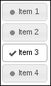
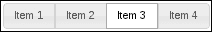
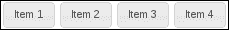
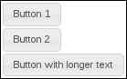
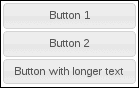
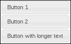
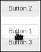
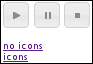
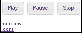
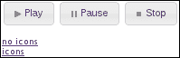

# 三、制作按钮

在本章中，我们将介绍：

*   制作简单的清单
*   控制按钮集内的间距
*   用按钮自动填充空间
*   组内的排序按钮
*   对按钮悬停状态使用效果
*   按钮图标和隐藏文本

# 导言

**按钮**小部件是装饰用户界面中 HTML 按钮和链接元素的简单方法。通过对 button 小部件的简单调用，我们可以用 jQueryUI 中的主题框架来装饰标准元素。此外，还有两种类型的按钮。按钮有一个独特的概念，更流行的用例。但也有一个**按钮集**的概念——用于我们想要装饰典型 HTML 表单中的复选框和单选按钮的情况。

在本章中，我们将更深入地了解按钮所包含的内容，并通过示例介绍一些使用场景。我们将从简单的用法，如创建清单和排序按钮，转到更高级的用法，如应用效果和自动填充空间。在此过程中，您将了解小部件框架如何支持开发人员扩展按钮，而按钮并不能满足他们的需要。

# 制作简单的清单

在普通的旧 HTML 中，检查表很容易完成，您真正需要的只是一些复选框和旁边的一些标签。但是，如果您使用的是 jQueryUI 之类的小部件框架，我们可以轻松地增强该列表。button 小部件知道当应用于类型为`checkbox`的`input`元素时如何操作。让我们从一个基本列表开始，看看如何将 button 小部件应用于`input`元素。我们还将看看是否可以通过一些状态和图标增强来进一步提高用户的交互性。

## 准备好了吗

让我们先创建一个简单的 HTML`div`来保存我们的清单。在内部，每个项目由一个类型为`checkbox`的`input`元素表示，以及一个`label`元素表示。

```js
<div>
    <input type="checkbox" id="first" />
    <label for="first">Item 1</label>
    <input type="checkbox" id="second" />
    <label for="second">Item 2</label>
    <input type="checkbox" id="third" />
    <label for="third">Item 3</label>
    <input type="checkbox" id="fourth" />
    <label for="fourth">Item 4</label>
</div>
```

有了这个标记，我们实际上有了一个功能正常的检查表 UI，尽管它不太实用。我们可以使用 jQueryUI 按钮小部件的切换功能将`label`和`checkbox`封装为一个检查表项。

## 怎么做。。。

我们将引入以下 JavaScript 代码来收集我们的`checkbox`输入，并使用它们的`labels`来组装**切换按钮**小部件。

```js
$(function() {

    $( "input" ).button( { icons: { primary: "ui-icon-bullet" } } );

    $( "input" ).change( function( e ) {

        var button = $( this );

        if ( button.is( ":checked" ) ) {

            button.button( "option", {
                icons: { primary: "ui-icon-check" } 
            });

        }
        else {

            button.button( "option", {
                icons: { primary: "ui-icon-bullet" } 
            });

        }

    });

});
```

有了它，你就有了一个切换按钮清单，里面有图标来帮助传达状态。当用户点击切换按钮时，它进入“开启”状态，这通过背景颜色和其他主题属性的变化来描述。我们还添加了随按钮状态切换的图标。



## 它是如何工作的。。。

我们的事件处理程序在 DOM 就绪时启动，只需要一行代码就可以将页面上的`input`元素转换为切换按钮。在 button 构造函数中，我们指定要使用的默认图标是主题框架中的`ui-icon-bullet`图标类。button 小部件知道，由于底层 HTML 元素，我们正在创建一个切换按钮。由于这些都是复选框，在`checkbox`的情况下，当点击按钮时，小部件将改变其行为，我们希望该按钮具有打开和关闭切换的外观。此外，按钮小部件根据`for`属性知道哪个`label`属于哪个按钮。例如，`for="first"`的标签将分配给带有`id="first"`的按钮。

接下来，我们将`change`事件处理程序应用于所有按钮。此处理程序对于每个按钮都是相同的，因此我们可以将其一次绑定到所有按钮。此处理程序的任务是更新按钮图标。我们不必改变按钮状态的任何其他方面，因为默认的按钮实现将为我们做到这一点。我们在事件处理程序中需要做的就是检查`checkbox`本身的状态。如果选中，我们将显示`ui-icon-check`图标。否则，我们将显示`ui-icon-bullet`图标。

# 用按钮组控制间距

jQueryUI 工具包为开发人员提供了一个容器小部件，用于处理称为**按钮集**的按钮组。您可以将 buttonset 用于诸如复选框组或单选按钮组之类的东西，这些东西构成了一个协作集。

buttonset 的默认外观是一个统一的整体。也就是说，目标是用几个按钮组成一个看似单一的小部件。默认情况下，buttonset 小部件没有用于开发人员的间距控件。默认情况下，集合中的按钮都是相互堆叠的。这可能不是我们想要的，这取决于整个用户界面中 buttonset 小部件的上下文。

## 准备好了吗

为了更好地说明我们展示的间距约束，让我们构建一个 buttonset 小部件，并在着手解决问题之前查看结果。我们将使用以下一组单选按钮作为标记：

```js
<div>
    <input type="radio" id="first" name="items" />
    <label for="first">Item 1</label>
    <input type="radio" id="second" name="items" />
    <label for="second">Item 2</label>
    <input type="radio" id="third" name="items" />
    <label for="third">Item 3</label>
    <input type="radio" id="fourth" name="items"/>
    <label for="fourth">Item 4</label>
</div>
```

我们将创建 buttonset 小部件，如下所示：

```js
$(function() {
    $( "div" ).buttonset();
});
```

这是我们的按钮集的外观。请注意，此小部件仍然显示单选按钮功能。这里选择了第三个项目，但如果我单击小部件中的其他位置，则将取消选择。



## 怎么做。。。

现在，buttonset 小部件的默认显示没有问题。我们可能面临的唯一潜在挑战是，如果我们在应用程序的其他地方有一个间隔主题，那么从美学角度来看，小部件的外观可能不适合彼此堆叠。我们可以通过使用一个选项扩展小部件来解决这个问题，该选项允许我们“爆炸”按钮，使它们不再接触。

我们将通过扩展 buttonset 小部件并添加一个新选项来实现这一新的爆炸性功能。HTML 与前面的保持一致，但下面是新的 JavaScript 代码。

```js
(function( $, undefined ) {

$.widget( "ab.buttonset", $.ui.buttonset, {

    options: {
        exploded: false
    },

    refresh: function() {

        this._super("refresh");

        if ( !this.options.exploded ) {
            return;
        }

        var buttons = this.buttons.map(function() {
            return $( this ).button( "widget" )[ 0 ];
        });

        this.element.addClass( "ui-buttonset-exploded" );

        buttons.removeClass( "ui-corner-left ui-corner-right" )
               .addClass( "ui-corner-all" );

    }

});

})( jQuery );

$(function() {
    $( "div" ).buttonset( { exploded: true } );
});
```

我们希望在页面上包含以下 CSS，通过新样式表将其包括在内是这里的推荐做法：

```js
.ui-buttonset-exploded .ui-button {
    margin: 1px;
}
```



## 它是如何工作的。。。

我们对 buttonset 小部件的扩展增加了`exploded`选项，允许使用小部件的程序员指定是否希望各个按钮彼此分开。如果`exploded`选项为`true`，我们也会覆盖`refresh()`方法，以改变显示。

为此，我们创建一个 jQuery 对象，表示 buttonset 中的所有单个按钮。我们在这里使用`map()`的原因是`checkbox`和`radio`按钮需要进行变通。`ui-buttonset-exploded`类在按钮之间添加了我们正在寻找的`margin`，它会将它们向外爆炸。接下来，我们从任何按钮中删除`ui-corner-left`和`ui-corner-right`类，并将`ui-corner-all`类添加到每个按钮中，从而为它们提供各自独立的边界。

# 按钮自动填充空间

任何给定按钮小部件的宽度都由其内部的内容控制。这相当于主图标或次图标，或者两者都不加，再加上文本。按钮本身的实际渲染宽度不是具体指定的，而是由浏览器确定的。当然，这是任何依赖浏览器计算尺寸的小部件的理想特性。当 UI 中有很多小部件需要考虑时，以及当有很多浏览器分辨率配置需要考虑时，这种方法就可以很好地扩展。

但是，在某些情况下，浏览器设置的自动宽度并不理想。考虑同一上下文中的几个按钮，可能是一个`div`元素。这些按钮很可能不会呈现为具有相同的宽度，而实际上这是所需的属性。仅仅因为组中的一个按钮的文本稍多或稍少，并不意味着我们不希望它们共享一致的宽度。

## 准备好了吗

这里的目标是将一组按钮中最宽的按钮作为目标宽度。添加新按钮时，会通知组的同级，如果按钮最宽，则可能会创建新的目标宽度。让我们通过查看默认按钮功能以及它在宽度方面的含义来进一步说明这个问题。

下面是我们将用来创建按钮小部件的 HTML。

```js
<div>
    <button style="display: block;">Button 1</button>
    <button style="display: block;">Button 2</button>
    <button style="display: block;">Button with longer text</button>
</div>
```

我们将每个按钮显式标记为块级元素，以便轻松对比宽度。还要注意，这些按钮都是同级的。

下面的 JavaScript 将每个按钮元素转换为一个按钮小部件。

```js
$(function() {
    $( "button" ).button();
});
```

正如您所看到的，前两个按钮的长度相同，而最后一个按钮使用的文本更多，而且最宽。



## 怎么做。。。

现在让我们用一些新的行为来扩展 button 小部件，允许开发人员同步组中每个按钮的宽度。扩展按钮小部件的修改 JavaScript 代码如下所示：

```js
(function( $, undefined ) {

$.widget( "ab.button", $.ui.button, {

    options: {
        matchWidth: false
    },

    _create: function() {

        this._super( "create" );

        if ( !this.options.matchWidth ) {
            return;
        }

        this.element.siblings( ":" + this.widgetFullName )
                    .addBack()
                    .button( "refresh" );

    },

    refresh: function() {

        this._super( "refresh" );

        if ( !this.options.matchWidth ) {
            return;
        }

        var widths = this.element
                         .siblings( ":" + this.widgetFullName )
                         .addBack()
                         .children( ".ui-button-text" )
                         .map(function() {
                            return $( this ).width();
                         }),
            maxWidth = Math.max.apply( Math, widths ),
            buttonText = this.element.children( ".ui-button-text" );

        if ( buttonText.width() < maxWidth ) {
            buttonText.width( maxWidth );
        }

    }

});

})( jQuery );

$(function() {
    $( "button" ).button( { matchWidth: true } );
});
```

在这里，您可以看到这些按钮相互通信，以为组中的每个兄弟节点建立正确的宽度。换句话说，由于最后一个按钮添加到组中，前两个按钮改变了其宽度。



## 它是如何工作的。。。

我们刚刚添加的按钮小部件的扩展创建了一个新的`matchWidth`选项，如果`true`，它将根据需要更改此按钮的宽度，以匹配此组中最宽的按钮的宽度。

我们对`_create()`方法的扩展调用了默认的`_create()`按钮实现，然后我们告诉所有的兄弟姐妹去`refresh()`。我们使用`addBack()`将此按钮包括在兄弟姐妹列表中-原因是，如果已经有比我们大的人，我们可能必须调整自己的宽度。或者，如果我们现在是最宽的兄弟姐妹，我们必须告诉每个人，以便他们可以调整自己的宽度。

`refresh()`方法调用基本`refresh()`实现，然后判断该按钮的宽度是否需要更新。第一步是为组中的所有兄弟姐妹（包括我们自己）生成宽度数组。通过一个宽度数组，我们可以将其传递给`Math.max()`以获得最大宽度。如果此按钮的当前宽度小于组中最宽的按钮，我们将调整为新宽度。

请注意，我们实际上并没有收集或更改 button 元素本身的宽度，而是其中的`span`元素。这个`span`有`ui-button-text`类，是我们感兴趣的可变宽度元素。如果我们采取另一种简单测量按钮宽度的方法，我们可能会遇到一些混乱的边距问题，使我们处于比开始时更糟糕的状态。

## 还有更多。。。

在上一个示例中，您会注意到调整大小的按钮的文本仍然居中。如果愿意的话，我们可以在更改按钮宽度时引入一个小小的 CSS 调整，以保持按钮文本对齐。

```js
(function( $, undefined ) {

$.widget( "ab.button", $.ui.button, {

    options: {
        matchWidth: false
    },

    _create: function() {

        this._super( "create" );

        if ( !this.options.matchWidth ) {
            return;
        }

        this.element.siblings( ":" + this.widgetFullName )
                    .addBack()
                    .button( "refresh" );

    },

    _destroy: function() {
        this._super();
        this.element.css( "text-align", "" );
    },

    refresh: function() {

        this._super( "refresh" );

        if ( !this.options.matchWidth ) {
            return;
        }

        var widths = this.element
                         .siblings( ":" + this.widgetFullName )
                         .addBack()
                         .children( ".ui-button-text" )
                         .map(function() {
                            return $( this ).width();
                         }),
            maxWidth = Math.max.apply( Math, widths ),
            buttonText = this.element.children( ".ui-button-text" );

        if ( buttonText.width() < maxWidth ) {
            buttonText.width( maxWidth );
            this.element.css( "text-align", "left" );
        }

    }

});

})( jQuery );

$(function() {
    $( "button" ).button( { matchWidth: true } );
});
```

注意，在`_refresh()`方法中，我们现在声明`text-align`CSS 属性是`left`。此外，我们必须添加一个新的`_destroy()`方法来在按钮被破坏时清理此属性。最终结果与前面的示例相同，只是现在按钮文本对齐。



# 组内的分拣按钮

我们可以使用`sortable()`交互小部件为用户提供一定的灵活性。为什么不让用户移动按钮呢？特别是考虑到所需的代码量很小。

## 准备好了吗

我们将使用列表来组织按钮，如下所示：

```js
<ul>
    <li><a href="#">Button 1</a></li>
    <li><a href="#">Button 2</a></li>
    <li><a href="#">Button 3</a></li>
</ul>
```

我们将使用以下 CSS 修复列表布局，以更好地显示按钮小部件。

```js
ul {
    list-style-type: none;
    padding: 0;
}

li {
    margin: 4px;
}
```

## 怎么做。。。

实现这个的 JavaScript 代码实际上非常小——我们创建按钮，然后应用可排序交互小部件。

```js
$(function() {
    $( "a" ).button();
    $( "ul" ).sortable({
        opacity: 0.6
    });
});
```

此时，我们可以拖放按钮，但只能在指定的容器元素中，在本例中为`ul`。



## 它是如何工作的。。。

在本例中，我们要做的第一件事是，一旦文档准备好，就创建按钮小部件。我们使用锚作为底层元素，它与`button`元素一样有效。您也会注意到，我们在无序列表中构建了页面上的按钮小部件。添加到页面的样式只是删除列表缩进和项目符号。但是`ul`元素是我们针对可排序交互的目标。默认情况下，sortable 小部件查找所有子元素，并使它们成为可排序项，在我们的示例中，这些是`li`元素。示例中指定的`opacity`选项告诉`sortable`更改被拖动元素的视觉不透明度。

# 使用按钮悬停状态的效果

button 小部件利用 jQueryUI 主题框架中的各种状态。例如，当用户将鼠标悬停在 button 小部件上时，此事件触发 button 小部件内的处理程序，该处理程序将`ui-state-hover`类应用于元素，从而更改其外观。同样，当鼠标离开小部件时，另一个处理程序将删除该类。

button 小部件的默认功能运行良好，它只使用`addClass()`和`removeClass()`jQuery 函数应用悬停类。当用户四处移动并考虑他/她下一步想做什么时，鼠标可能会移入和移出按钮小部件；这就是我们通过向用户提供一些微妙的效果来调整体验的地方。

## 准备好了吗

在本例中，我们将创建三个简单的按钮元素作为按钮小部件。这样，我们可以在几个按钮上移动鼠标指针。

```js
<div>
    <button>Button 1</button>
    <button>Button 2</button>
    <button>Button 3</button>
</div>
```

## 怎么做。。。

让我们扩展默认按钮小部件的功能，以包括一个名为`animateHover`的新选项，当`true`时，会为`ui-state-hover`类的添加和删除设置动画。

```js
(function( $, undefined ) {

$.widget( "ab.button", $.ui.button, {

    options: {
        animateHover: false 
    },

    _create: function() {

        this._super( "create" );

        if ( !this.options.animateHover ) {
            return;
        }

        this._off( this.element, "mouseenter mouseleave" );

        this._on({
            mouseenter: "_mouseenter",
            mouseleave: "_mouseleave"
        });

    },

    _mouseenter: function( e ) { 
        this.element.stop( true, true )
                    .addClass( "ui-state-hover", 200 );
    },

    _mouseleave: function( e ) {
        this.element.stop( true, true )
                    .removeClass( "ui-state-hover", 100 );
    }

});

})( jQuery );

$(function() {
    $( "button" ).button( { animateHover: true } );
});
```

## 它是如何工作的。。。

我们在按钮小部件中添加了一个名为`animateHover`的新选项。当`true`时，按钮将为`ui-state-hover`类中 CSS 属性的添加或删除设置动画。这一切都是通过重写`_create()`方法完成的，该方法在按钮小部件第一次实例化时调用。这里，我们在调用执行例行按钮初始化任务的原始`_create()`方法后，检查`animateHover`选项是否为`false`。

如果设置了该选项，则第一个作业将从按钮上解除原始`mouseenter`和`mouseleave`事件处理程序的绑定。默认情况下，这些处理程序只是添加或删除 hover 类。这正是我们想要改变的，所以一旦原始处理程序被删除，我们就可以使用`_on()`自由注册我们自己的处理程序。这就是我们使用`stop()`、`addClass()`和`removeClass()`函数的地方。如果类名后面有一个持续时间，jQuery UI 效果扩展将应用于`addClass()`和`removeClass()`函数，我们在这里已经完成了。我们希望添加`ui-state-hover`类需要`200`毫秒，删除该类需要`100`毫秒，因为用户更容易注意到初始悬停。最后，`stop( true, true )`调用是 jQuery 中的一种常见技术，用于确保动画不会重叠，并且从用户的角度来看不会导致抖动行为。

# 按钮图标和隐藏文本

使用按钮，开发者可以选择只渲染图标按钮。这是通过告诉按钮我们不希望显示文本来实现的。这是很容易做到的，并且经常服务于许多用例，取决于上下文，一个图标足以解释它的动作。更重要的是，我们可以随时通过简单的选项更改将按钮标签添加回原来的位置。我们可以这样做，因为按钮文本是底层 HTML 组件的一部分。然而，有了图标，事情变得有点棘手，因为它们是按钮上的装饰品。我们不能像处理文本那样打开和关闭图标，整个图标规范需要再次应用。

那么，我们的目标就是在按钮构造函数中指定图标的方法，但一旦关闭，就要记住它们。这样，图标的行为就好像它们是原始 DOM 元素的一部分一样。

## 准备好了吗

我们将从创建三个图标按钮所需的结构开始。我们还将介绍两个改变每个按钮状态的链接。

```js
<div>
    <button class="play">Play</button>
    <button class="pause">Pause</button>
    <button class="stop">Stop</button>
</div>

<div>
    <br/>
    <a href="#" class="no-icons">no icons</a>
    <br/>
    <a href="#" class="icons">icons</a>
</div>
```

## 怎么做。。。

我们将通过添加一个新的`icon`选项，为 button 小部件提供图标切换功能。记住，我们的想法是提供与`text`选项相同的功能，除了用于图标。

```js
(function( $, undefined ) {

$.widget( "ab.button", $.ui.button, {

    options: {
        icon: true
    },

    _hiddenIcons: {},

    _setOption: function( key, value ) {

        if ( key != "icon" ) {
            this._superApply( arguments );
            return;
        }

        if ( !value && !$.isEmptyObject( this.options.icons ) ) {
            this._hiddenIcons = this.options.icons;
            this._super( "text", true );
            this._super( "icons", {} );
        }
        else if ( value && $.isEmptyObject( this.options.icons ) ) {
            this._super( "icons", this._hiddenIcons );
        }

    },

    _create: function() {

        if ( !this.options.icon ) {
            this._hiddenIcons = this.options.icons;
            this.options.icons = {};
        }

        this._superApply( arguments );

    }

});

})( jQuery );

$(function() {

    $( "a.no-icons" ).click( function( e ) {
        e.preventDefault();
        $( "button" ).button( "option", "icon", false );
    });

    $( "a.icons" ).click( function( e ) {
        e.preventDefault();
        $( "button" ).button( "option", "icon", true );
    });

    $( "button" ).button( {text: false} );

    $( ".play" ).button( "option", {
        icons: { primary: "ui-icon-play" }
    });

    $( ".pause" ).button( "option", {
        icons: { primary: "ui-icon-pause" }
    });

    $( ".stop" ).button( "option", {
        icons: { primary: "ui-icon-stop" } 
    });

});
```

## 它是如何工作的。。。

最初，创建这三个按钮时禁用了`text`，即使按钮文本仍然作为基础 DOM 元素的一部分存在。接下来，我们为三个按钮中的每一个设置`icon`选项。当页面第一次加载时，您应该只看到图标按钮。



页面上的两个链接**无图标**和**图标**分别删除和添加按钮小部件的图标。每个链接的函数回调通过为我们添加到`button`小部件的自定义`icon`选项设置一个值来实现。点击**无图标**链接将导致按钮图标被删除，并替换为其文本。



通过点击**图标**链接，我们正在启用之前为每个按钮设置的`icons`选项。这是通过更改我们的自定义`icon`按钮来实现的，因此，如果我们现在单击该链接，我们可以看到我们的图标已恢复，而无需指定使用了哪些图标。



您会注意到，通过将`icon`值设置为`true`，我们并没有像按钮的原始状态那样隐藏文本。我们仍然可以手动将`text`设置为`false`，但这应该是一个手动过程，而不是通过按钮扩展进行修改。

我们的扩展添加了一个新的`_hiddenIcons`属性，当`icon`选项设置为`false`时，我们可以在这里存储`icons`选项的值。我们在`_setOption()`中执行大部分工作，开发人员希望在小部件上设置选项时，可以随时调用`_setOption()`。我们只关心我们添加的新`icon`选项。首先，我们检查是否禁用图标，在这种情况下，我们将`icons`选项的副本存储在`_hiddenIcons`属性中，以便在其他时间恢复。我们还将`text`选项设置为`true`，以便在隐藏时显示文本。同时隐藏按钮图标和文本是个坏主意。最后，我们通过取消设置`icons`选项来隐藏图标。

另一方面，如果我们正在启用图标，我们需要在`_hiddenIcons`属性中查找它们，并将它们设置为`icons`按钮选项。我们在这里覆盖的`_create()`实现只是将图标设置存储在`_hiddenIcons`中，如果在首次创建小部件时指定了图标设置，则将其隐藏。