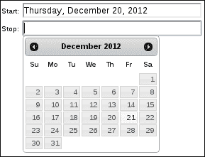
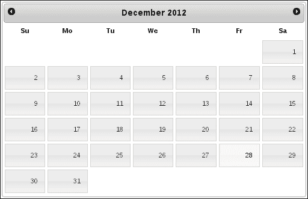
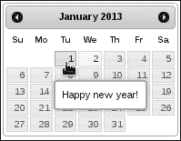
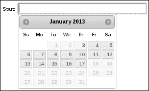
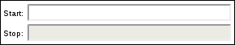
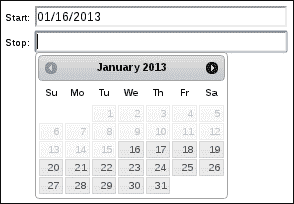
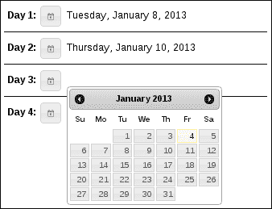
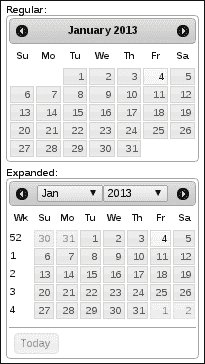

# 四、开发数据采集器

在本章中，我们将介绍：

*   使用不同的日期格式
*   制作全尺寸日历小部件
*   显示逐月效果
*   作为工具提示的约会提醒
*   限制日期范围
*   隐藏输入字段
*   附加数据和控制

# 导言

**日期选择器**小部件通过向用户提供日期选择实用程序来增强典型的文本输入表单元素。我们现在在网络上随处可见这些类型的输入。datepicker 的图形特性对于大多数用户来说是直观的，因为它非常类似于物理日历。datepicker 小部件还解决了使用一致日期格式的挑战，这是用户不必担心的。

# 使用不同的日期格式

datepicker 小部件支持多种日期字符串格式。日期字符串是用户进行选择时在文本输入中填充的值。通常情况下，应用程序会尝试在整个 UI 中遵循相同的日期格式以保持一致性。因此，如果您对小部件提供的默认格式不满意，我们可以在使用`dateFormat`选项创建小部件时对其进行更改。

## 怎么做。。。

我们首先创建两个`input`字段，需要用户输入日期：

```js
<div>
    <label for="start">Start:</label>
    <input id="start" type="text" size="30"/>
</div>

<div>
    <label for="stop">Stop:</label>
    <input id="stop" type="text" size="30"/>
</div>
```

接下来，我们将使用前面的`input`字段并通过指定我们的自定义格式来创建两个 datepicker 小部件。

```js
$(function() {

    $( "input" ).datepicker({
        dateFormat: "DD, MM d, yy"
    });

});
```

## 它是如何工作的。。。

当我们在任一 datepicker 小部件中进行选择时，您会注意到文本`input`值使用我们选择的格式更改为所选日期。日期格式字符串本身`"DD, MM d, yy"`是按照大多数其他编程语言中的格式进行建模的，也就是说，没有可供日期选择器使用的本机 JavaScript 日期格式设置工具。当用户在日期选择器的下拉日历中进行选择时，将创建一个`Date`对象。然后，小部件使用`dateFormat`选项格式化`Date`对象，并用结果填充文本输入。



## 还有更多。。。

如果我们正在构建一个相当大的用户界面，我们可能会在几个不同的地方使用几个 datepicker 小部件。为了保持日期格式的一致性，我们必须在每次创建 datepicker 小部件时指定`dateFormat`选项。我们可能会有几个调用来创建使用不同选择器的小部件，因此当它应该是默认选项时，总是指定相同的`dateFormat`选项会变得有点乏味。

在这种情况下，我们最好将默认的`dateFormat`值更改为应用程序在整个过程中使用的值。这比一次又一次地指定相同的格式要好得多，同时保留了根据具体情况更改日期格式的能力。

我们将使用与之前相同的 HTML 结构，这两个`input`字段是我们的日期选择器占位符。但让我们按如下方式修改 JavaScript：

```js
(function( $, undefined ) {

$.widget( "ui.datepicker", $.ui.datepicker, {
    options: $.extend(
        $.ui.datepicker.prototype.options,
        { dateFormat: "DD, MM d, yy" }
    ),
});

})( jQuery );

$(function() {

    $( "#start" ).datepicker();
    $( "#stop" ).datepicker();

});
```

现在，如果您运行这个修改后的 JavaScript，您将获得与以前相同的日期选择器行为。但是，您会注意到，我们现在正在对`datepicker()`构造函数进行两次调用。都没有指定`dateFormat`选项，因为我们已经通过定制`datepicker`小部件和扩展`options`更改了默认值。我们仍然可以选择为每个小部件提供自定义日期格式，这条路线可以为我们节省大量可能重复的`dateFormat`选项。

# 制作全尺寸日历小部件

`datepicker`小部件的典型用途是增加标准表单输入字段。当字段进入焦点时，我们希望为用户显示实际的日期选择器。如果我们遵循小部件选择日期的标准使用模式，这是有意义的。这就是为什么，毕竟，它被称为日期选择器。

但是，我们可以利用主题框架提供的一些灵活性，进行一些小的调整以显示更大的日历。不一定是为了选择日期作为输入，而是作为日期/时间相关信息的大窗口。我们需要对小部件进行的更改仅仅是放大内联显示的大小。

## 准备好了吗

datepicker 小部件已经知道如何内联显示自己。我们只需要在`div`元素而不是`input`元素上调用 datepicker 构造函数。因此，我们将使用以下基本标记：

```js
<div class="calendar"></div>
```

还有一个简单的古老的`datepicker()`调用：

```js
$(function() {
    $( ".calendar" ).datepicker();
});
```

其余的工作在主题调整中执行。

## 怎么做。。。

调整 datepicker CSS 的目标是使其在大小上扩展。其想法是使小部件看起来更像日历，而不像表单输入字段助手。日历已经以内联方式显示，所以让我们在页面上包含这个新的 CSS。

```js
.ui-datepicker {
    width: 500px;
}

.ui-datepicker .ui-datepicker-title {
    font-size: 1.3em;
}

.ui-datepicker table {
    font-size: 1em;
}

.ui-datepicker td {
    padding: 2px;
}

.ui-datepicker td span, .ui-datepicker td a {
    padding: 1.1em 1em;
}
```

有了它，我们就有了一个按比例放大的日历小部件，它仍然可以很好地充当日期选择器，因为我们没有改变这个小部件的任何功能。



## 它是如何工作的。。。

我们对这些新样式声明所做的第一件事是将日历显示的宽度增加到`500px`。这可能是我们选择的最适合我们正在开发的用户界面的任何数字。接下来，我们将根据字体大小增加每月和每年的标题部分。我们还增加了所有工作日和月号的字体大小，并在月日时段之间提供了更多的填充。我们现在有空间了，我们不妨利用它。最后，在`td span`和`td a`元素上设置的`padding`确定了整个日历的高度；否则，长宽比将非常不正常。这是另一个数字，我们希望在每个应用程序的基础上进行调整，以使其正确。

# 显示逐月效果

当显示日期选择器时，我们通常一次为用户显示一个月。如果用户需要在时间中向后导航，则可以使用“上个月”按钮。同样，他们可以使用“下个月”按钮在时间中向前移动。发生这种情况时，datepicker 小部件只是清空 datepicker`div`，为日历重新生成一些 HTML 并插入它。这一切发生得非常快，就用户而言，基本上是瞬间发生的。

让我们通过在 datepicker 的内部注入一些效果来活跃这个月到月的导航。

## 准备好了吗

我们可以在这个实验中使用任何 datepicker 小部件，但是使用内联 datepicker 显示而不是使用文本`input`可能更简单。这样，当页面加载时，日期选择器就在那里，我们不需要打开它。内联日期选择器是使用`div`元素创建的。

```js
<div class="calendar"></div>
```

## 怎么做。。。

我们将扩展 datepicker 小部件，如下所示，以允许在调整当前月份的日期时应用 jQuery`fadeIn()`和`fadeOut()`函数。

```js
(function( $, undefined ) {

$.extend( $.datepicker, {

    _updateDatepicker: function( inst ) {

        var self = this,
            _super = $.datepicker.constructor.prototype;

        inst.dpDiv.fadeOut( 500, function() {
            inst.dpDiv.fadeIn( 300 );
            _super._updateDatepicker.call( self, inst );
        });

    }

});

})( jQuery );

$(function() {
    $( ".calendar" ).datepicker();
});
```

现在，当用户单击日历顶部的“下一个”或“上一个”箭头按钮时，我们将看到小部件淡出并淡入新的日历月布局。

## 它是如何工作的。。。

关于这段代码，您会注意到的第一件事是，它没有使用典型的小部件工厂机制扩展 datepicker 小部件。这是因为 datepicker 的默认实现还没有转移到新的 widget 工厂方式。但这并不妨碍我们扩展小部件以满足我们的需求。

### 提示

datepicker 小部件比框架中的大多数其他小部件复杂得多。在引入如此剧烈的变化之前，核心 jQueryUI 团队必须考虑很多因素。在撰写本文时，我们的计划是 datepicker 小部件将成为小部件工厂的产品，就像未来版本中的其他小部件一样。

我们在`$.datepicker`对象上使用 jQuery`extend()`函数。这个对象是`Datepicker`类的一个单例实例，为了简洁起见，我们对它感兴趣。`_updateDatepicker()`方法是我们此次定制的目标。默认日期选择器实现使用此方法更新日期选择器`div`的内容。所以我们想要覆盖它。在我们的方法版本中，我们使用`fadeOut()`隐藏`inst.dpDiv`。完成后，我们称之为`fadeIn()`。`_super`变量是对用于定义小部件的`Datepicker`类的引用。由于`$.datepicker`是一个实例，访问`Datepicker`原型的唯一途径是通过`$.datepicker.constructor.prototype`。我们需要`Datepicker`原型的原因是，我们可以在完成效果后调用原始`_updateDatepicker()`方法，因为它执行与配置显示相关的其他任务。

# 作为工具提示的约会提醒

Datepicker 小部件帮助用户为`input`字段选择正确的日期，或作为基本显示。在这两种情况下，如果我们能为用户提供更多的上下文，这不是很有用吗？也就是说，如果我使用 datepicker 在表单上选择日期，那么当我将鼠标指针移动到日历中的某一天时，我会知道那天发生了什么事情，这会很有帮助。也许我应该选别的。

在本节中，我们将研究扩展 datepicker 小部件的功能，以允许指定显示为工具提示的提醒。它们作为一个选项传递给 datepicker 构造函数，并且可能以某种方式起源于应用程序，可能来自数据库中的用户配置文件。

## 怎么做。。。

在本例中，我们将使用一个简单的内联日期选择器，`<div class="calendar"></div>`作为目标标记。

让我们通过接受提醒对象数组并为它们创建工具提示来扩展 datepicker 的功能。提醒对象只是一个带有`date`和`text`字段的普通 JavaScript 对象。日期告诉日期选择器工具提示应该放在日历中的什么位置。

```js
(function( $, undefined ) {

$.extend( $.datepicker, {

    _updateDatepicker: function( inst ) {

        var settings = inst.settings,
            days = "td[data-handler='selectDay']",
            $target = inst.dpDiv,
            _super = $.datepicker.constructor.prototype;

        _super._updateDatepicker.call( this, inst )

        if ( !settings.hasOwnProperty( "reminders" ) ) {
            return;
        }

        $target.find( days ).each( function( i, v ) {

            var td = $( v ),
                currentDay = new Date(
                    td.data( "year" ),
                    td.data( "month" ),
                    td.find( "a" ).html()
                );

            $.each( settings.reminders, function( i, v ) {

                var reminderTime = v.date.getTime(),
                    reminderText = v.text,
                    currentTime = currentDay.getTime();

                if ( reminderTime == currentTime ) {
                    td.attr( "title", reminderText ).tooltip();
                }

            });

        });

    }

});

})( jQuery );

$(function() {
    $( ".calendar" ).datepicker({
        reminders: [
            {
                date: new Date(2013, 0, 1),
                text: "Happy new year!"
            },
            {
                date: new Date(2013, 0, 14),
                text: "Call in sick, case of the Mondays"
            },
            {
                date: new Date(2013, 1, 14),
                text: "Happy Valentine's Day!"
            }
        ]
    });
});
```

现在，当您将鼠标指针移动到 datepicker 小部件中提供的提醒日期上时，您应该会看到提供的文本作为工具提示：



## 它是如何工作的。。。

让我们后退一步，想想传递给提醒参数的数据，以及我们用它做了什么。传递的值是一个对象数组，每个对象都有`date`和`text`属性。文本是我们希望在工具提示中显示的内容，日期告诉日期选择器工具提示的放置位置。因此，我们取这个值并将其与 datepicker 日历中呈现的日期进行比较。

所有定制工作都是在我们自己的方法`_updateDatepicker()`实现中完成的。每次呈现日历时都会调用此方法。这包括从一个月切换到另一个月。我们使用对`_super`中原始日期选择器实现的引用来调用方法`_updateDatepicker()`。一旦完成，我们就可以进行定制。我们首先检查是否提供了提醒参数，否则，我们的工作就完成了。

接下来，我们查找并迭代表示当前显示月份中的一天的每个`td`元素。对于每一天，我们都会构造一个 JavaScript`Date`对象来代表我们需要的表格单元格，以便与每个提醒条目进行比较。最后，我们在`reminders`参数中迭代每个提醒对象。如果我们在应该显示此提醒的日期，我们将在设置`td`元素的`title`属性后构建工具提示小部件。

# 限制日期范围

您的应用程序可能需要限制允许的日期选择以限制日期范围。这可能是在其他条件为真或事件被触发的情况下预测的。谢天谢地，我们有足够的灵活性来处理小部件最常见的选择限制配置。

## 准备好了。。。

我们将使用 datepicker 小部件的基本输入元素标记：

```js
<div>
    <label for="start">Start:</label>
    <input id="start" type="text" size="30"/>
</div>
```

## 怎么做。。。

我们将使用`minDate`和`maxDate`选项如下创建 datepicker 小部件。

```js
$(function() {

    $( "input" ).datepicker({
        minDate: new Date(),
        maxDate: 14
    });

});
```

当我们通过点击`input`字段激活 datepicker 小部件时，您会注意到只有特定的天数范围是可选择的。



## 它是如何工作的。。。

`minDate`和`maxDate`选项都接受多种格式。在这里的示例中，我们给了`minDate`选项一个`Date`对象，表示今天。这意味着用户不能选择今天之前的任何日期。此外，我们不想让用户选择未来两周内的任何日期。这很容易通过给`maxDate`选项一个`14`天的增量来指定。

## 还有更多。。。

给定 datepicker 实例的受限日期范围不必静态定义。实际范围可能取决于 UI 中的动态内容，例如另一个日期选择器选择。

让我们来看看如何根据另一个日期的选择来限制日期范围。我们将创建两个 datepicker 小部件。当用户在第一个小部件中选择日期时，第二个小部件将启用更新的范围限制。用户不能选择第一个日期选择器之前的日期。

以下是我们将用于两个日期选择器的标记：

```js
<div>
    <label for="start">Start:</label>
    <input id="start" type="text" size="30"/>
</div>

<div>
    <label for="start">Stop:</label>
    <input id="stop" type="text" size="30"/>
</div>
```

下面是创建两个 datepicker 小部件的代码：

```js
$(function() {

    function change ( e ) {

        var minDate = $( this ).datepicker( "getDate" );

        $( "#stop" ).datepicker( "enable" );
        $( "#stop" ).datepicker( "option", "minDate", minDate );

    }

    $( "#start" ).datepicker()
                 .change( change );

    $( "#stop" ).datepicker( { disabled: true } );

});
```

默认情况下，`#stop`日期选择器被禁用，因为我们需要知道`minDate`值应该是什么。



但是一旦用户在`#start`日期选择器中进行选择，我们就可以在`#stop`日期选择器中进行选择，我们只是不能在`#start`日期选择器中进行选择之前选择任何内容。



当进行选择时，`#start`日期选择器启用并更新`#stop`日期选择器。它启用小部件并将`getDate`的值作为`minDate`选项传递。这将根据先前的选择强制用户向一个方向移动。

# 隐藏输入字段

datepicker 小部件的目标是在用户做出选择后填充文本`input`元素。所以这个小部件有两个`input`元素的用途。首先，它监听`input`元素上的`focus`事件。这就是它知道何时显示日历选择器的方式。第二，选择完成后，`input`元素值将更新，以反映所选格式的日期。

在大多数情况下，向用户展示一个`input`元素可以很好地工作。但可能出于某种原因，输入不适合您的 UI。也许我们需要一种不同的方法来显示日历和存储/显示所选内容。

在本节中，我们将介绍一种仅使用 datepicker`input`元素的替代方法。我们将使用**按钮**小部件触发日历显示，并将`input`元素伪装为其他元素。

## 准备好了吗

让我们在这个例子中使用下面的 HTML。我们将布置四个日期部分，用户需要在其中按按钮才能与 datepicker 小部件交互。

```js
<div>

    <div class="date-section">
        <label>Day 1:</label>
        <button>Day 1 date</button>
        <input type="text" readonly />
    </div>

    <div class="date-section">
        <label>Day 2:</label>
        <button>Day 2 date</button>
        <input type="text" readonly />
    </div>

    <div class="date-section">
        <label>Day 3:</label>
        <button>Day 3 date</button>
        <input type="text" readonly />
    </div>

    <div class="date-section">
        <label>Day 4:</label>
        <button>Day 4 date</button>
        <input type="text" readonly />
    </div>

</div>
```

## 怎么做。。。

我们需要做的第一件事就是让我们的日期部分如预期的那样工作，那就是一些 CSS。这不仅对于我们正在构建的 UI 的布局很重要，而且对于`input`元素的伪装也很重要，这样用户就不会知道它在那里。

```js
div.date-section {
    padding: 5px;
    border-bottom: 1px solid;
    width: 20%;
}

div.date-section:last-child {
    border-bottom: none;
}

div.date-section label {
    font-size: 1.2em;
    font-weight: bold;
    margin-right: 2px;
}

div.date-section input {
    border: none;
}
```

现在我们将编写实例化 datepicker 和 button 小部件所需的 JavaScript 代码。

```js
$(function() {

    var input = $( "div.date-section input" ),
        button = $( "div.date-section button" );

    input.datepicker({
        dateFormat: "DD, MM d, yy"
    });

    button.button({
        icons: { primary: "ui-icon-calendar" }, 
        text: false
    });

    button.click( function( e ) {
        $( this ).next().datepicker( "show" )
    });

});
```

现在，我们有四个日期部分，用户可以点击标签右侧的日期按钮，显示日历。他们选择一个日期，日历被隐藏。您会注意到我们的 CSS 样式隐藏了`input`元素。



## 它是如何工作的。。。

本例中的大多数 CSS 样式规则都是布局 UI 组件`label`、`buttons`和`input`所必需的。您会注意到，在选择日期之前，输入是不可见的。这是因为它还没有文本值，而且我们已经在`div.date-section`输入 CSS 选择器中删除了`border`。

我们的 JavaScript 代码在页面加载时做的第一件事是为每个输入元素创建 datepicker 小部件。我们还将自定义字符串传递给`dateFormat`选项。对于每个日期部分，我们都有一个按钮。我们在这里使用 button 小部件创建一个日历图标按钮，单击该按钮时，将显示日历。我们通过呼叫`datepicker( "show" )`来实现这一点。

# 附加日历数据和控件

datepicker 小部件具有多种附加数据和控制选项，开发人员可以使用小部件公开这些选项。这些是打开数据或控件的简单布尔配置选项。

## 开始

让我们准备两个`div`元素，使用它们我们可以创建两个内联 datepicker 实例。

```js
<div>
    <strong>Regular:</strong>
    <div id="regular"></div>
</div>

<div>
    <strong>Expanded:</strong>
    <div id="expanded"></div>
</div>
```

## 怎么做。。。

让我们创建两个日期选择器小部件。我们正在创建两个小部件，以便对比常规日期选择器和具有扩展数据和控件的日期选择器之间的差异。

```js
$(function() {

    $( "#regular" ).datepicker();

    $( "#expanded" ).datepicker({
        changeYear: true,
        changeMonth: true,
        showButtonPanel: true,
        showOtherMonths: true,
        selectOtherMonths: true,
        showWeek: true
    });

});
```

现在您可以看到两个呈现日期选择器之间的差异。后者已通过额外的控制和数据扩展了。



## 它是如何工作的。。。

我们对扩展`datepicker`实例所做的只是打开一些在默认情况下关闭的功能。详情如下:

*   `changeYear`：启用年度下拉菜单。
*   `changeMonth`：启用月份下拉菜单。
*   `showButtonPanel`：此启用日历底部的**今日**和**完成**按钮。
*   `showOtherMonths`：此启用从相邻月份开始显示的天。
*   `showWeek`：启用日历中的年中的周列。