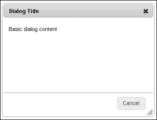
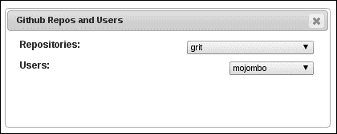
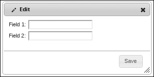
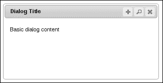
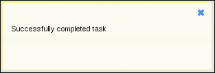
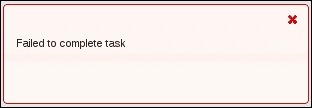

# 五、添加对话框

在本章中，我们将介绍以下配方：

*   将效果应用于对话框组件
*   正在等待加载 API 数据
*   在对话框标题中使用图标
*   向对话框标题添加操作
*   将效果应用于对话框调整交互大小
*   对消息使用模态对话框

# 导言

对话框小部件为 UI 开发人员提供了一个工具，他们可以使用该工具向用户展示表单或其他信息，而不会中断当前页面上的内容；对话框创建一个新的上下文。开箱即用，开发人员可以使用对话框选项做很多事情，其中许多功能在默认情况下是打开的。这包括调整对话框大小以及在页面上移动对话框的功能。

在本章中，我们将讨论在任何 web 应用程序中使用对话框的一些常见陷阱。通常需要调整对话框的控件及其整体外观；我们将讨论其中的一些。我们还将了解与 API 数据交互如何使对话框使用复杂化，以及处理这种情况的方法。最后，我们可以通过查看对对话框小部件应用效果的各种方式，为它们添加一些修饰。

# 对对话框组件应用效果

对话框小部件允许开发人员在打开对话框时显示动画，以及在关闭对话框时隐藏动画。此动画作为一个整体应用于对话框。因此，例如，如果我们指定`show`选项为`fade`动画，则整个对话框将淡入用户的视野。同样，如果`hide`选项为`fade`，对话框将淡出视图，而不是瞬间消失。为了活跃这种`show`和`hide`行为，我们可以对单个对话框组件进行操作。也就是说，我们可以将显示和隐藏效果应用于小部件内的各个部分，如标题栏和按钮窗格，而不是将显示和隐藏效果作为一个整体应用于对话框。

## 怎么做。。。

我们将在这里创建的对话框在内容方面与它们一样简单。也就是说，我们将只为 HTML 中的对话框指定一些基本的`title`和内容字符串。

```js
<div title="Dialog Title">
    <p>Basic dialog content</p>
</div>
```

为了将单个对话框组件动画化的想法变成现实，我们必须在几个地方扩展对话框小部件。特别是，我们将为小部件顶部的标题栏以及底部附近的按钮窗格设置动画。下面是 JavaScript 代码的外观：

```js
(function( $, undefined ) {

$.widget( "ab.dialog", $.ui.dialog, {

    _create: function() {

        this._super();

        var dialog = this.uiDialog;

        dialog.find( ".ui-dialog-titlebar" ).hide();
        dialog.find( ".ui-dialog-buttonpane" ).hide();

    },

    open: function() {

        this._super();

        var dialog = this.uiDialog;

        dialog.find( ".ui-dialog-titlebar" ).toggle( "fold", 500 );
        dialog.find( ".ui-dialog-buttonpane" ).toggle( "fold", 500 );

    },

    close: function( event, isCallback ) {

        var self = this,
            dialog = this.uiDialog;

        if ( isCallback ) {
            this._super( event );
            return;
        }

        dialog.find( ".ui-dialog-titlebar" ).toggle( "fold", 500 );
        dialog.find( ".ui-dialog-buttonpane" ).toggle( "fold", 500, function(){
            self.element.dialog( "close", event, true );
        });

    }

});

})( jQuery );

$(function() {

    $( "div" ).dialog({
        show: "fade", 
        hide: "scale",
        buttons: {
            Cancel: function() {
                $( this ).dialog( "close" );
            }
        }
    });

});
```

打开页面时，您将看到各个对话框组件淡入视图，与我们为整个对话框指定的`fade`动画无关。一旦可见，对话框应如下所示：



您还将注意到，只有将`fade`效果应用于标题栏和按钮窗格，才会应用`scale`效果。

## 它是如何工作的。。。

这段代码是规则的例外之一，我们没有提供关闭新扩展功能的机制。也就是说，我们在一些对话框方法的自定义实现中有硬编码更改，这些更改不能通过提供选项值来关闭。然而，这一例外是为了在复杂度与所需功能之间进行权衡。这种类型的自定义动画工作很可能是特定项目需求的一部分，而不是对话框小部件功能的一般扩展。

关于默认对话框实现，我们改变的第一件事是在`_create()`方法中，我们隐藏了`.ui-dialog-titlebar`和`.ui-dialog-buttonpane`组件。这是在调用`_super()`方法后完成的，该方法负责创建基本对话框组件。即使使用`autoOpen`选项将对话框设置为自动打开，`_create()`方法也不会实际显示该对话框。因此，我们可以隐藏标题栏和按钮窗格，而用户不会注意到它。

隐藏这两个组件的原因是，我们希望在对话框打开后应用显示效果。我们覆盖的下一个方法`open()`正是这样做的。它首先调用`_super()`方法，该方法启动显示对话框的效果（在本例中，我们告诉它在显示时淡入淡出）。然后我们在标题栏和按钮窗格上使用`fold`效果。

您会注意到，在开始下一个动画之前，我们不会等待任何动画完成。对话框显示动画将启动，然后是标题栏和按钮窗格。这三个可能同时执行。我们这样做的原因是为了保持对话框的正确布局。最后一种覆盖方法是`close()`方法。这引入了一个有趣的工作环境，我们必须使用它来让`_super()`在回调中工作。即使在封闭范围内有`self`变量，在回调中调用`_super()`方法也会有问题。因此，我们使用 widget 元素并假装我们正在从 widget 外部调用`.dialog( "close" )`。`isCallback`参数告诉`close()`方法调用`super()`并返回。我们需要回调的原因是，在完成按钮窗格的动画制作之前，我们实际上不想执行对话框隐藏动画。

# 等待 API 数据加载

对话框小部件通常需要从 API 加载数据。也就是说，并非所有对话框都由静态 HTML 组成。他们需要来自 API 的数据来使用 API 数据构建一些元素，例如`select`元素选项。

从 API 加载数据并构建结果元素不是问题；我们一直都这样做。当我们试图在对话上下文中执行这些活动时，挑战就来了。我们不一定要显示对话框，直到从 API 加载了数据，并且构建了用于在对话框组件中显示它们的 UI 组件。理想情况下，我们将阻止对话框显示，直到对话框显示的组件就绪。

这对于远程 API 在功能上尤其棘手，因为无法预测延迟问题。此外，对话框可能依赖于多个 API 调用，每个 API 调用在对话框中填充自己的 UI 组件。

## 准备好了。。。

为了实现 API 数据问题的解决方案，我们需要一些基本的 HTML 和 CSS 来定义对话框及其内容。我们将在对话框中有两个空的`select`元素。这是 HTML 的外观：

```js
<div id="dialog" title="Genres and Titles">
    <div class="dialog-field">
        <label for="genres">Genres:</label>
        <select id="genres"></select>
        <div class="ui-helper-clearfix"></div>
    </div>

    <div class="dialog-field">
        <label for="titles">Titles:</label>
        <select id="titles"></select>
        <div class="ui-helper-clearfix"></div>
    </div>
</div>
```

这是前面代码的支持 CSS：

```js
.dialog-field {
    margin: 5px;
}

.dialog-field label {
    font-weight: bold;
    font-size: 1.1em;
    float: left;
}

.dialog-field select {
    float: right;
}
```

## 怎么做。。。

我们将通过使用一个新选项扩展对话框小部件，使其能够在等待 API 请求时进行阻塞。这个选项将允许我们传递一系列延迟的承诺。promise 是用于跟踪单个 Ajax 调用状态的对象。通过一系列承诺，我们能够使用以下简单代码实现复杂的阻塞行为：

```js
(function( $, undefined ) {

$.widget( "ab.dialog", $.ui.dialog, {

    options: { 
        promises: []
    },

    open: function( isPromise ) {

        var $element = this.element,
            promises = this.options.promises;

        if ( promises.length > 0 && !isPromise ) {

            $.when.apply( $, promises ).then( function() {
                $element.dialog( "open", true );
            });

        }
        else {

            this._super();

        }

    },

});

})( jQuery );

$(function() {

    var repos = $.ajax({
        url: "https://api.github.com/repositories",
        dataType: "jsonp",
        success: function( resp ) {
            $.each( resp.data, function( i, v ) {
                $( "<option/>" ).html( v.name )
                                .appendTo( "#repos" );
            });
        },
    });

    var users = $.ajax({
        url: "https://api.github.com/users",
        dataType: "jsonp",
        success: function( resp ) {
            $.each( resp.data, function( i, v ) {
                $( "<option/>" ).html( v.login )
                                .appendTo( "#users" );
            });
        }
    });

    $( "#dialog" ).dialog({
        width: 400,
        promises: [
            repos.promise(),
            users.promise()
        ]
    });

});
```

返回 API 数据后，对于两个调用，将显示对话框，其外观如下所示：



## 它是如何工作的。。。

让我们从查看文档就绪处理程序开始，在这里我们实际实例化了对话框小部件。这里定义的前两个变量`repos`和`users`是`$.Deferred`对象。这表示我们对 GitHub API 进行的两个 API 调用。这些调用的目的是分别填充`#repos`和`#users``select`元素。这些`select`元素构成了我们`#dialog`内容的一部分。在每个 Ajax 调用中指定的`success`选项是一个回调，它执行创建`option`元素并将它们放置在`select`元素中的工作。

如果不自定义对话框小部件，这两个 API 调用就可以正常工作。对话框将打开，最终，选项将出现在`select`元素中（在对话框已经打开之后）。但是，您会注意到，我们正在将一组`deferred.promise()`对象传递给对话框。这是我们为对话框小部件提供的新功能。简单地说，延迟对象允许开发人员延迟可能需要一段时间才能完成的某些操作的结果，例如 Ajax 调用。承诺是我们从延迟对象获得的东西，它允许我们编写一些标准，说明复杂序列（例如进行多个 Ajax 调用）何时完成。

我们在对话框小部件中添加的自定义`promises`选项用于实现`open()`方法。在这里，我们可以利用这些承诺。从本质上说，我们是从传递给对话框的一个或多个 promise 对象生成一个事务。一旦它们全部完成或解析为使用 jQuery 术语，我们就可以打开对话框。我们通过将 promise 对象数组传递给`$.when()`函数来实现，该函数调用对话框上的`open()`方法。然而，这里出现了一个我们必须处理的复杂问题。我们不能在回调函数中调用`_super()`，因为核心小部件机制不知道如何找到父小部件类。

因此，我们必须假装我们正在从小部件外部调用`open()`。我们通过使用`self.element`和额外的`isPromise`参数来实现这一点，指导我们的定制`open()`实现如何表现。

# 在对话框标题中使用图标

对于某些对话框，根据应用程序的性质和对话框本身的内容，在对话框标题旁边放置一个图标可能是有益的。这可能是有益的，因为它为用户提供了额外的上下文。例如，编辑对话框可能有一个铅笔图标，而用户配置文件对话框可能包含一个人物图标。

## 准备好了。。。

为了说明如何将图标添加到对话框小部件的标题栏，我们将使用以下内容作为基本 HTML：

```js
<div id="dialog" title="Edit">
    <div>
        <label>Field 1:</label>
        <input type="text"/>
    </div>
    <div>
        <label>Field 2:</label>
        <input type="text"/>
    </div>
</div>
```

## 怎么做。。。

我们需要定义的第一件事是一个自定义 CSS 类，一旦我们将图标放在对话框的标题栏中，它就可以用来正确对齐图标。CSS 如下所示：

```js
.ui-dialog-icon {
    float: left;
    margin-right: 5px;
}
```

接下来，我们使用 JavaScript 代码通过添加新的`icon`选项以及使用 HTML 作为源创建小部件的实例来定制对话框小部件：

```js
(function( $, undefined ) {

$.widget( "ab.dialog", $.ui.dialog, {

    options: {
        icon: false
    },

    _create: function() {

        this._super();

        if ( this.options.icon ) {

            var iconClass = "ui-dialog-icon ui-icon " + 
                            this.options.icon;

            this.uiDialog.find( ".ui-dialog-titlebar" )
                         .prepend( $( "<span/>" ).addClass( iconClass ));

        }

    },

});

})( jQuery );

$(function() {

    $( "#dialog" ).dialog({
        icon: "ui-icon-pencil",
        buttons: {
            Save: function() { $( this ).dialog( "close" ) }
        }
    });

});
```

结果对话框打开时，应该如下所示：



## 它是如何工作的。。。

对于这个特定的对话框实例，我们希望显示铅笔图标。我们添加到对话框小部件的`icon`选项允许开发人员从主题框架中指定图标类。在这种情况下，它是`ui-icon-pencil`。新的`icon`选项的默认值为`false`。

我们正在覆盖`_create()`方法的默认对话框实现，这样，如果提供了`icon`选项，我们就可以在对话框标题栏中插入一个新的`span`元素。除了用于定位我们前面定义的图标的`ui-dialog-icon`类之外，这个新的`span`元素还获取作为新选项值传递的图标类。

# 向对话框标题添加操作

默认情况下，对话框小部件向用户提供一个不需要开发者干预的操作，即标题栏中的关闭按钮。这是一个适用于几乎所有对话框的通用操作，因为用户希望能够关闭它们。此外，关闭对话框操作按钮是位于对话框右上角的图标，这并非偶然。除了其他操作外，这也是图形窗口环境中的标准位置和操作。让我们来看看我们如何扩展在对话框小部件的标题栏中放置的动作。

## 怎么做。。。

对于本演示，我们只需要以下基本对话框 HTML：

```js
<div id="dialog" title="Dialog Title">
    <p>Basic dialog content</p>
</div>
```

接下来，我们将实现我们的对话框专门化，它添加了一个新选项和一些使用该选项创建新对话框实例的代码：

```js
(function( $, undefined ) {

$.widget( "ab.dialog", $.ui.dialog, {

    options: {
        iconButtons: false
    },

    _create: function() {

        this._super();

        var $titlebar = this.uiDialog.find( ".ui-dialog-titlebar" );

        $.each( this.options.iconButtons, function( i, v ) {

            var button = $( "<button/>" ).text( v.text ),
                right = $titlebar.find( "[role='button']:last" )
                                 .css( "right" );

            button.button( { icons: { primary: v.icon }, text: false } )
                  .addClass( "ui-dialog-titlebar-close" )
                  .css( "right", (parseInt(right) + 22) + "px" )
                  .click( v.click )
                  .appendTo( $titlebar );

        });

    }

});

})( jQuery );

$(function() {

    $( "#dialog" ).dialog({
        iconButtons: [
            {
                text: "Search",
                icon: "ui-icon-search",
                click: function( e ) {
                    $( "#dialog" ).html( "<p>Searching...</p>" );
                }
            },
            {
                text: "Add",
                icon: "ui-icon-plusthick",
                click: function( e ) {
                    $( "#dialog" ).html( "<p>Adding...</p>" );
                }
            }
        ]
    });

});
```

打开此对话框后，我们将在右上角看到传递到对话框的新动作按钮，如下图所示：



## 它是如何工作的。。。

我们为对话框创建了一个名为`iconButtons`的新选项。这个新选项需要一个对象数组，其中每个对象都有与动作按钮相关的属性。当用户打开对话框并单击按钮时，必须执行文本、图标类和单击事件等操作。

此定制中的大部分工作在我们版本的`_create()`方法中进行。在这里，我们对`iconButtons`选项中提供的每个按钮进行迭代。在标题栏中插入新的按钮时，我们要做的第一件事是创建`button`元素。我们还可以使用`.ui-dialog-titlebar [role='button']:last`选择器获得添加的最后一个动作按钮的宽度（这是计算动作按钮水平位置所需的）。

接下来，我们按照按钮配置中的指定绑定`click`事件。对于要添加的数组中的每个按钮，我们希望将其放置在上一个按钮的左侧。因此，当我们第一次开始迭代`iconButtons`数组时，默认的关闭操作是标题栏中的最后一个按钮。因为 CSS 结构需要一个固定的右值，所以我们必须计算它。为此，我们需要列表中最后一个按钮的值。

# 将效果应用于对话框大小调整交互

默认情况下，对话框小部件允许用户通过拖动调整大小手柄来调整大小。当`resizable`选项为`true`时，实际的调整大小功能由对话框内部设置的`resizable()`交互小部件提供。让我们来看看如何访问内部可调整组件，这样我们就可以使用 AutoT3T 功能。在可调整大小的组件上设置此选项时，会延迟重新绘制已调整大小的组件，直到用户停止拖动调整大小手柄为止。

## 准备好了。。。

本演示只需要简单的对话框 HTML，如下所示：

```js
<div id="dialog" title="Dialog Title">
    <p>Basic dialog content</p>
</div>
```

## 怎么做。。。

让我们向对话框小部件添加一个名为`animateResize`的新选项。当此选项为`true`时，我们将打开内部可调整大小的交互小部件的`animate`选项。

```js
(function( $, undefined ) {

$.widget( "ab.dialog", $.ui.dialog, {

    options: { 
        animateResize: false 
    },

    _makeResizable: function( handles ) {
        handles = (handles === undefined ? this.options.resizable : handles);
        var that = this,
            options = this.options,
            position = this.uiDialog.css( "position" ),
            resizeHandles = typeof handles === 'string' ?
                handles:
                "n,e,s,w,se,sw,ne,nw";

        function filteredUi( ui ) {
            return {
                originalPosition: ui.originalPosition,
                originalSize: ui.originalSize,
                position: ui.position,
                size: ui.size
            };
        }

        this.uiDialog.resizable({
            animate: this.options.animateResize,
            cancel: ".ui-dialog-content",
            containment: "document",
            alsoResize: this.element,
            maxWidth: options.maxWidth,
            maxHeight: options.maxHeight,
            minWidth: options.minWidth,
            minHeight: this._minHeight(),
            handles: resizeHandles,
            start: function( event, ui ) {
                $( this ).addClass( "ui-dialog-resizing" );
                that._trigger( "resizeStart", event, filteredUi( ui ) );
            },
            resize: function( event, ui ) {
                that._trigger( "resize", event, filteredUi( ui ) );
            },
            stop: function( event, ui ) {
                $( this ).removeClass( "ui-dialog-resizing" );
                options.height = $( this ).height();
                options.width = $( this ).width();
                that._trigger( "resizeStop", event, filteredUi( ui ) );
                if ( that.options.modal ) {
                    that.overlay.resize();
                }
             }
        })
        .css( "position", position )
        .find( ".ui-resizable-se" )
        .addClass( "ui-icon ui-icon-grip-diagonal-se" );
    }

});

})( jQuery );

$(function() {

    $( "#dialog" ).dialog({
        animateResize: true
    });

});
```

创建并显示此对话框后，您将能够调整对话框的大小，观察实际大小现在已设置动画。

## 它是如何工作的。。。

我们在对话框中添加了`animateResize`选项，并为其提供了一个默认值`false`。为了实际执行此功能，我们完全覆盖了创建对话框时对话框小部件内部使用的`_makeResizable()`方法。事实上，我们采用了`_makeResizable()`的内部代码，只改变了一件事——`animate: this.options.animateResize`。

这有点多余，复制所有这些代码来打开一个简单的功能，比如设置对话框大小交互的动画。事实上，这不是理想的解决方案。更好的方法是调用`_makeResizable()`的`_super()`版本，然后通过调用`this.uiDialog.resizable( "option", "animate", true )`打开动画。但在撰写本文时，这并不像预期的那样。我们的替代路线，即使它涉及冗余代码，也只是为了显示小部件工厂的灵活性。如果这种动画质量是用户界面的真正要求，那么我们很快就找到了一种可以忽略不计的折衷方法。

# 对消息使用模态对话框

对话框小部件有一个`modal`选项，当我们需要将用户的注意力集中在一件事情上时，会保留该选项。此选项显示对话框，同时阻止用户与用户界面的其余部分交互。他们别无选择，只能引起注意。不用说，模态对话框应该少用，特别是如果你想用它向用户广播消息。

让我们看看如何剥离对话框，以便在应用程序中构建通用通知工具。它本质上是一个模态对话框，用于那些我们不能让用户继续他们正在做的事情而不确保他们已经看到我们的消息的情况。

## 准备好了。。。

下面是我们在这个例子中需要的 HTML。请注意，`#notify``div`将成为一个对话框小部件，它没有任何内容，因为我们的新 notify 小部件将提供一些内容。

```js
<div id="notify"></div>

<button id="show-info">Show Info</button>
<button id="show-error">Show Error</button>
```

## 怎么做。。。

让我们继续并定义一个新的 notify 小部件，它能够向用户显示错误和信息消息，如下所示：

```js
(function( $, undefined ) {

$.widget( "ab.notify", $.ui.dialog, {

    options: { 
        modal: true,
        resizable: false,
        draggable: false,
        minHeight: 100,
        autoOpen: false,
        error: false
    },

    open: function() {

        var error = this.options.error,
            newClass = error ? "ui-state-error" : 
                               "ui-state-highlight",
            oldClass = error ? "ui-state-highlight" :
                               "ui-state-error";

        this.element.html( this.options.text );

        this.uiDialog.addClass( newClass )
                     .removeClass( oldClass )
                     .find( ".ui-dialog-titlebar" )
                     .removeClass( "ui-widget-header ui-corner-all" );

        this._super();

    },

});

})( jQuery );

$(function() {

    $( "#notify" ).notify();

    $( "#show-info, #show-error" ).button();

    $( "#show-info" ).click( function( e ) {

        $( "#notify" ).notify( "option", {
            error: false,
            text: "Successfully completed task"
        });

        $( "#notify" ).notify( "open" );

    });

    $( "#show-error" ).click(function( e ) {

        $( "#notify" ).notify( "option", {
            error: true,
            text: "Failed to complete task"
        });

        $( "#notify" ).notify( "open" );

    })
```

我们在这里创建的两个按钮用于演示 notify 小部件的功能。如果单击`#show-info`按钮，您将看到以下信息性消息：



如果单击`#show-error`按钮，您将看到此错误消息：



## 它是如何工作的。。。

我们刚刚创建的`notify`小部件继承了对话框小部件的所有功能。我们在小部件中定义的第一件事是可用选项。在本例中，我们将扩展对话框小部件的`options`对象，并添加一些新选项。您也会注意到，我们为对话框选项提供了一些更新的默认值，例如打开`modal`和关闭`draggable`。每个 notify 实例都将共享这些默认值，因此每次都必须定义它们没有多大意义。

`open()`方法属于对话框小部件，我们在这里覆盖它以实现将通知消息文本插入对话框内容的自定义功能。我们还根据`error`选项设置对话框的状态。如果这是一条错误消息，我们将`ui-state-error`类应用于整个对话框。如果`error`选项为`false`，我们将应用`ui-state-highlight`类。最后，对话框标题栏组件是通过删除一些类来剥离的，因为我们在消息显示中没有使用它。

在应用程序代码中，我们要创建的第一件事是 notify 小部件的实例。然后，我们创建演示按钮，并将`click`事件绑定到将显示错误消息或信息消息的功能，具体取决于单击的按钮。