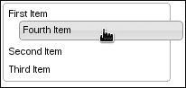
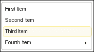
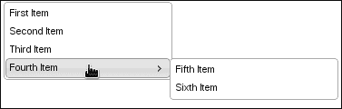
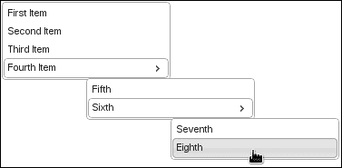
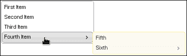

# 六、制作菜单

在本章中，我们将介绍：

*   创建可排序的菜单项
*   突出显示活动菜单项
*   通过菜单导航使用效果
*   动态构建菜单
*   控制子菜单的位置
*   将主题应用于子菜单

# 导言

jQuery UI**菜单**小部件获取链接列表，并通过处理子菜单中的导航以及应用主题框架中的类，将它们作为一个内聚菜单呈现给用户。我们可以在一定程度上自定义菜单，只使用可用的默认选项。在其他情况下，例如当我们希望菜单项可排序时，我们可以轻松地扩展小部件。

# 创建可排序菜单项

默认情况下，菜单小部件保留用于创建菜单项的列出元素的顺序。这意味着，如果菜单小部件中使用的 HTML 的创建者要更改顺序，这将反映在呈现的菜单中。这对开发人员来说是好的，因为它让我们可以控制如何将项目呈现给用户。但是，也许用户对菜单项应该如何排序有更好的想法。

通过将菜单小部件与**可排序交互**小部件相结合，我们可以为用户提供这种灵活性。然而，有了这一新能力，我们将不得不解决另一个问题；保留用户选择的顺序。如果他们能够按照自己认为合适的方式安排菜单项，那就太好了，但是如果他们每次加载页面时都必须重复相同的过程，那就不太好了。因此，我们还将研究如何在 cookie 中保留已排序的菜单顺序。

## 准备好了吗

让我们为菜单小部件使用下面的 HTML 代码。这将创建一个包含四个项目的菜单，所有项目都处于同一级别：

```js
<ul id="menu">
    <li id="first"><a href="#">First Item</a></li>
    <li id="second"><a href="#">Second Item</a></li>
    <li id="third"><a href="#">Third Item</a></li>
    <li id="fourth"><a href="#">Fourth Item</a></li>
</ul>
```

## 怎么做。。。

现在让我们看一下用于扩展菜单小部件以提供可排序行为的 JavaScript。

```js
(function( $, undefined ) {

$.widget( "ab.menu", $.ui.menu, {

    options: {
        sortable: false
    },

    _create: function() {

        this._super();

        if ( !this.options.sortable ) {
            return;
        }

        var $element = this.element,
            storedOrder = $.cookie( $element.attr( "id" ) ),
            $items = $element.find( ".ui-menu-item" );
        if ( storedOrder ) {

            storedOrder = storedOrder.split( "," );

            $items = $items.sort( function( a, b ) {

                var a_id = $( a ).attr( "id" ),
                    b_id = $( b ).attr( "id" ),
                    a_index = storedOrder.indexOf( a_id ),
                    b_index = storedOrder.indexOf( b_id );

                return a_index > b_index;

            });

            $items.appendTo( $element );

        }

        $element.sortable({

            update: function( e, ui ) {

                var id = $( this ).attr( "id" ),
                    sortedOrder = $( this ).sortable( "toArray" )
                                           .toString();

                $.cookie( id, sortedOrder );

            }

        });

    },

});

})( jQuery );

$(function() {
    $( "#menu" ).menu( { sortable: true } );
});
```

如果您在浏览器中查看此菜单，您会注意到可以将菜单项拖动到任意顺序。此外，如果要刷新页面，您将看到排序已被保留。



## 它是如何工作的。。。

我们在本例中创建的菜单实例被赋予了一个`sortable`选项值`true`。这是我们添加到菜单小部件的一个新选项。我们的大部分扩展工作是在我们自己的`_create()`方法的版本中执行的。我们在这里做的第一件事是调用该方法的原始实现，因为我们希望像往常一样创建菜单；我们用`_super()`方法来做。从现在开始，我们将维持菜单项的排序顺序。

如果`sortable`选项的计算结果不是`true`，我们将退出，无事可做。如果此选项为`true`，并且我们需要对菜单项进行排序，我们将尝试使用此菜单的 ID 加载 cookie。这个 cookie 的值存储在一个名为`storedOrder`的变量中，因为这正是它所表示的；由用户指定的存储顺序。如果用户对菜单进行了排序，我们将菜单项的顺序存储在 cookie 中。例如，cookie 值可能类似于`second,fourth,first,third`。这些是菜单项的 ID。当我们拆分逗号分隔的列表时，我们有一个按正确顺序排列的菜单项数组。

最后，我们必须将可排序交互小部件应用于菜单。我们将在更新排序顺序时使用的函数传递给可排序配置。在这里，我们使用可排序小部件的`toArray()`方法来序列化菜单项的排序顺序，在这里，我们使用菜单 ID 更新 cookie 值。

关于本例中 cookie 的使用，有两件事需要注意。首先，我们使用 cookiejQuery 插件。这个插件很小，在互联网上广泛使用。但是，值得一提的是，该插件没有随 jQuery 或 jQuery UI 一起提供，您的项目必须管理此依赖关系。

第二件需要注意的事情是关于 localhost 域。cookie 存储功能不会在所有浏览器中本地工作。换句话说，如果从 web 服务器上查看，它可以正常工作。如果您真的需要在 GoogleChrome 浏览器中测试此代码，您可以像我使用 Python 一样绕过它。在操作系统控制台中，运行以下代码：

```js
python -m SimpleHTTPServer
```

# 突出显示活动菜单项

对于菜单小部件，根据项目的配置，判断项目是否处于活动状态的唯一方法是当页面 URL 因点击项目而改变时。菜单项并没有给出任何明显的迹象表明实际发生了什么。例如，菜单中的项目一旦单击，可能会更改视觉状态。如果开发人员使用菜单小部件作为用户界面中的导航工具，这将特别有用。让我们看看如何扩展菜单小部件的功能，以便使用主题框架中的部分提供此功能。

## 准备好了吗

这里的菜单示例将使用以下 HTML 代码。请注意，此特定菜单具有嵌套子菜单：

```js
<ul id="menu">
    <li><a href="#first">First Item</a></li>
    <li><a href="#second">Second Item</a></li>
    <li><a href="#third">Third Item</a></li>
    <li>
      <a href="#forth">Fourth Item</a>
      <ul>
        <li><a href="#fifth">Fifth</a></li>
        <li><a href="#sixth">Sixth</a></li>
      </ul>
    </li
</ul>
```

## 怎么做。。。

为了突出显示活动菜单项，我们需要使用一些附加规则扩展主题框架。

```js
.ui-menu .ui-menu-item {
    margin: 1px 0;
    border: 1px solid transparent;
}

.ui-menu .ui-menu-item a.ui-state-highlight { 
    font-weight: normal; 
    margin: -px; 
}
```

接下来，我们将使用一个新的`highlight`选项和必要的功能扩展菜单小部件本身。

```js
(function( $, undefined ) {

$.widget( "ab.menu", $.ui.menu, {

    options: {
      highlight: false
    },

    _create: function() {

      this._super();

        if ( !this.options.highlight ) {
          return;
        }

        this._on({
          "click .ui-menu-item:has(a)": "_click"
        });

    },

    _click: function( e ) {

      this.element.find( ".ui-menu-item a" )
        .removeClass( "ui-state-highlight" );

        $( e.target ).closest( ".ui-menu-item a" )
          .addClass( "ui-state-highlight ui-corner-all" );

    }

});

})( jQuery );

$(function() {
    $( "#menu" ).menu( { highlight: true });
});
```

如果您查看此菜单，您会注意到，一旦选择菜单项，它将保持高亮显示状态。



## 它是如何工作的。。。

我们在这里定义的 CSS 规则是`ui-state-highlight`类在应用于菜单项时正常运行所必需的。首先，使用`.ui-menu``.ui-menu-item`选择器，我们将`margin`设置为一旦应用`ui-state-highlight`类，就会适当地对齐菜单项。我们还为每个菜单项提供了一个不可见的`border`，以便鼠标进入和鼠标离开事件不会将菜单项推到不合适的位置。下一个选择器`.ui-menu``.ui-menu-item``a.ui-state-highlight`将在我们将`ui-state-highlight`类应用于菜单项后应用于它们。这些规则还控制定位，并防止菜单错位。

转到 JavaScript 代码，您可以看到我们为菜单小部件提供了一个新的`highlight`选项。在`_create()`方法的自定义实现中，我们在继续添加事件处理程序之前调用相同方法的原始实现。这里使用基本 jqueryui 小部件定义的`_on()`方法将我们的事件处理程序绑定到`click .ui-menu-item:has(a)`事件；与`menu`小部件内部使用的事件相同。在这个处理程序中，我们将`ui-state-highlight`类从它可能已经应用到的任何菜单项中删除。最后，我们将`ui-state-highlight`类与`ui-corner-all`类一起添加到刚刚单击的菜单项中，该类提供了由主题属性定义的元素圆角。

# 通过菜单导航使用效果

在将效果应用到菜单小部件时，我们可以采取几种方法。我们可以在菜单小部件中的何处应用效果？用户将鼠标指针悬停在菜单项上，这会导致状态更改。用户展开一个子菜单。这两个动作是我们可以通过一些动画在视觉上改进的主要交互。让我们看看如何使用尽可能少的 JavaScript 来处理这些影响，而使用 CSS 转换。到目前为止，转换是一个新兴的 CSS 标准，并非所有浏览器都支持使用标准语法。然而，本着渐进增强的精神，以这种方式应用 CSS 意味着基本菜单功能即使在不支持它的浏览器中也能正常工作。我们还可以避免编写大量 JavaScript 来设置菜单导航的动画。

## 准备好了吗

对于这个例子，我们可以使用任何标准的菜单 HTML 代码。理想情况下，它应该有一个子菜单，以便我们可以观察应用于其扩展的转换。

## 怎么做。。。

首先，让我们定义转换所需的 CSS，我们希望在菜单项和子菜单改变状态时将其应用于这些转换。

```js
.ui-menu-animated > li > ul {
    left: 0;
    transition: left 0.7s ease-out;
    -moz-transition: left .7s ease-out;
    -webkit-transition: left 0.7s ease-out;
    -o-transition: left 0.7s east-out;
}

.ui-menu-animated .ui-menu-item a {
    border-color: transparent;
    transition: font-weight 0.3s,
      color 0.3s,
      background 0.3s,
      border-color 0.5s;
    -moz-transition: font-weight 0.3s,
       color 0.3s,
       background 0.3s,
       border-color 0.5s;
    -webkit-transition: font-weight 0.3s,
       color 0.3s,
       background 0.3s,
       border-color 0.5s;
    -o-transition: font-weight 0.3s,
       color 0.3s,
       background 0.3s,
       border-olor 0.5s;
}
```

接下来，我们将对菜单小部件本身进行一些修改，以控制任何给定菜单实例的动画功能。

```js
(function( $, undefined ) {

$.widget( "ab.menu", $.ui.menu, {

    options: {
        animate: false
    },

    _create: function() {

        this._super();

        if ( !this.options.animate ) {
            return;
        }

        this.element.find( ".ui-menu" )
                     .addBack()
                     .addClass( "ui-menu-animated" );

    },

  _close: function( startMenu ) {

        this._super( startMenu );

        if ( !this.options.animate ) {
            return;
        }

        if ( !startMenu ) {
            startMenu = this.active ? this.active.parent() : this.element;
        }

        startMenu.find( ".ui-menu" ).css( "left", "" );

          }

});

})( jQuery );

$(function() {
    $( "#menu" ).menu( { animate: true } );
});
```

现在，如果您在浏览器中查看此菜单并开始与之交互，您将注意到应用悬停状态时的平滑过渡。您还会注意到，应用于子菜单的转换在展开时似乎会将它们向右滑动。

## 它是如何工作的。。。

首先，让我们考虑 CSS 规则，Ty5 定义了我们看到的应用到 Type ?? 微件的转换。`.ui-menu-animated > li > ul`选择器将转换应用于子菜单。声明的第一个属性`left: 0`只是一个初始值设定项，它允许某个浏览器更好地处理转换。接下来的四行定义了 left 属性的转换本身。展开子菜单时，菜单小部件使用位置实用程序小部件，该小部件在子菜单上设置左侧 CSS 属性。我们在这里定义的转换将在`span`秒`0.7`秒内对 left 属性应用更改，并将轻松退出转换。

我们有多个转换定义的原因是一些浏览器支持自己的供应商前缀版本的规则。因此，我们从通用版本开始，然后是特定于浏览器的版本。这是一种常见的做法，当特定于浏览器的规则变得多余时，我们可以删除它们。

接下来是`.ui-menu-animated .ui-menu-item a`选择器，适用于每个菜单项。您可以看到，这里的转换涉及几个属性。此转换中的每个属性都是我们希望设置动画的`ui-state-hover`的一部分。由于我们的调整，`border-color`转换的持续时间稍长。

现在让我们看一下使用这个 CSS 的 JavaScript。我们通过添加一个新的`animate`选项扩展了菜单小部件，该选项将对小部件应用上述定义的转换。在`_create()`方法的版本中，我们调用`_create()`的原始实现，然后将`ui-menu-animated`类应用于主`ul`元素和任何子菜单。

`_close()`方法的扩展仅出于一个原因。当关闭子菜单时，将调用此函数。但是，当第一次显示子菜单时，`left`CSS 属性由`position`实用程序计算。下次显示时，它不必计算`left`属性。这是一个问题，因为很明显的原因，如果我们试图设置`left`属性值的更改动画。所以我们所要做的就是在菜单关闭时将`left`属性设置回`0`的值。

# 动态生成菜单

通常，在与用户交互期间，菜单会发生变化。换句话说，我们可能需要在菜单实例化之后扩展菜单的结构。或者，在构建最终成为菜单小部件的 HTML 时，我们可能没有所有可用的必要信息；例如，菜单数据可能仅以**JavaScript 对象表示法**（**JSON**格式）可用。让我们看看如何动态构建菜单。

## 准备好了吗

我们将从以下基本菜单 HTML 结构开始。我们的 JavaScript 代码将对此进行扩展。

```js
<ul id="menu">
    <li><a href="#">First Item</a></li>
    <li><a href="#">Second Item</a></li>
    <li><a href="#">Third Item</a></li>
</ul>
```

## 怎么做。。。

让我们创建菜单小部件，然后扩展菜单 DOM 的结构。

```js
$(function() {

    var $menu = $( "#menu" ).menu(),
        $submenu = $( "<li><ul></ul></li>" ).appendTo( $menu );

    $submenu.prepend( $( "<a/>" ).attr( "href", "#" )
                                 .text( "Fourth Item" ) );

    $submenu.find( "ul" ).append( 
$( "<li><a href='#'>Fifth Item</a>" ) )
                                      .append( $( "<li><a href='#'>Sixth Item</a>" ) );

    $menu.menu( "refresh" );

});
```

当您查看此菜单时，您将看到我们刚刚添加的三个新项目，而不仅仅是开始时的三个项目。



## 它是如何工作的。。。

如果我们不在 JavaScript 代码中不断添加新的菜单项，我们只会看到原来的三项。但是，我们使用核心 jQuery DOM 操作工具来构造和插入子菜单。之后，我们必须调用`refresh()`菜单方法，它将适当的 CSS 类和事件处理程序添加到新的菜单项中。例如，如果我们在`menu`小部件实例化之前将 DOM 插入代码移动到，我们就没有理由调用`refresh()`，因为菜单构造函数直接调用它。

## 还有更多。。。

上述在菜单中插入新项的方法确实有其缺点。显而易见的一点是，实际上构造新菜单项和子菜单的 DOM 插入代码是不可维护的。我们的示例对结构进行了硬编码，而大多数应用程序从未这样做。相反，我们通常至少有一个来自 API 的数据源。如果不用硬编码结构，我们可以向菜单小部件传递一个标准格式的数据源，那就太好了。然后，菜单小部件将处理我们上面实现的低级细节。

让我们尝试修改代码，以便将更多责任转移到菜单小部件本身。我们的目标与上面的代码完全相同，但我们将通过扩展菜单小部件并传入表示菜单结构的数据对象来实现。我们将使用完全相同的 HTML 结构。以下是新的 JavaScript 代码：

```js
(function( $, undefined ) {

$.widget( "ab.menu", $.ui.menu, {

    options: {
        data: false
    },

    _create: function() {

        this._super();

        if ( !this.options.data ) {
            return;
        }

        var self = this;

        $.each( this.options.data, function( i, v ) {
            self._insertItem( v, self.element );
        });

        this.refresh();

    },

    _insertItem: function( item, parent ) {

        var $li = $( "<li/>" ).appendTo( parent );

        $( "<a/>" ).attr( "id", item.id )
                   .attr( "href", item.href )
                   .text( item.text )
                   .appendTo( $li );

        if ( item.data ) {

            var $ul = $( "<ul/>" ).appendTo( $li ),
                self = this;

            $.each( item.data, function( i, v ) {
                self._insertItem( v, $ul );
            });

        }

    }

});

})( jQuery );

$(function() {

    $( "#menu" ).menu({
        data: [
            {
                id: "fourth",
                href: "#",
                text: "Fourth Item"
            },
            {
                id: "fifth",
                href: "#",
                text: "Fifth Item",
                data: [
                    {
                        id: "sixth",
                        href: "#",
                        text: "Sixth Item"
                    },
                    {
                        id: "seventh",
                        href: "#",
                        text: "Seventh Item"
                    }
                ]
            }
        ]
    });

});
```

如果您运行这个修改后的代码，您将看到与我们上面编写的原始代码相比，结果没有任何变化。这种改进纯粹是一种重新分解，将不可维护的代码转化为具有更长保存期限的代码。

我们在这里介绍的新选项`data`需要一系列菜单项。该项是具有以下属性的对象：

*   `id`：菜单项的 id
*   `href`：菜单项链接的 href
*   `text`：是项目标签
*   `data`：嵌套子菜单

最后一个选项只是表示子菜单的菜单项的嵌套数组。我们对`_create()`方法的修改将迭代数据选项数组（如果提供的话），并对每个对象调用`_insertItem()`。`_insertItem()`方法是我们引入的新方法，不会覆盖任何现有的菜单功能。这里，我们为传入的菜单数据创建必要的 DOM 元素。如果这个对象有一个嵌套的数据数组，一个子菜单，那么我们创建一个`ul`元素并递归调用`_inserItem()`，将`ul`作为父元素传递。

我们传递给菜单的`data`比以前的版本更具可读性和可维护性。例如，传递 API 数据现在只需要相对较少的工作。

# 控制子菜单的位置

菜单小部件使用位置小部件在可见时控制任何子菜单的目的地。默认设置是将子菜单的左上角放置在展开子菜单的菜单项的右侧。但是，根据菜单的大小、子菜单的深度以及 UI 中大小的其他限制，我们可能希望对子菜单位置使用不同的默认值。

## 准备好了吗

我们将使用以下 HTML 结构进行此子菜单定位演示：

```js
<ul id="menu">
            <li><a href="#first">First Item</a></li>
            <li><a href="#second">Second Item</a></li>
            <li><a href="#third">Third Item</a></li>
            <li>
              <a href="#forth">Fourth Item</a>
              <ul>
                <li><a href="#fifth">Fifth</a></li>
                <li>
                  <a href="#sixth">Sixth</a>
                  <ul>
                    <li><a href="#">Seventh</a></li>
                    <li><a href="#">Eighth</a></li>
                    </ul>
                  </li>
                </ul>
            </li>
        </ul
```

## 怎么做。。。

当我们实例化这个菜单时，我们会给它传递一个`position`选项，如下所示：

```js
<ul id="menu">
            <li><a href="#first">First Item</a></li>
            <li><a href="#second">Second Item</a></li>
            <li><a href="#third">Third Item</a></li>
            <li>
                <a href="#forth">Fourth Item</a>
                <ul>
                    <li><a href="#fifth">Fifth</a></li>
                    <li>
                        <a href="#sixth">Sixth</a>
                        <ul>
                            <li><a href="#">Seventh</a></li>
                            <li><a href="#">Eighth</a></li>
                        </ul>
                    </li>
                </ul>
            </li>
        </ul>
```

扩展所有子菜单后，我们的菜单将类似于以下屏幕截图所示：



## 它是如何工作的。。。

在上例中，我们传递给菜单小部件的`position`选项与我们直接传递给位置小部件的选项相同。position 实用程序期望的`of`选项是活动菜单项或子菜单的父项。所有这些选项都传递到`_open()`方法中的位置实用程序，该实用程序负责扩展子菜单。

# 将主题应用于子菜单

菜单小部件显示子菜单时，外观无明显差异。也就是说，在视觉上，它们看起来就像主菜单。我们想向用户展示主菜单与其子菜单之间的一点对比；我们可以通过扩展小部件来实现这一点，以允许将自定义类应用于子菜单。

## 准备好了吗

让我们使用以下标记创建包含两个子菜单的菜单小部件：

```js
<ul id="menu">
            <li><a href="#">First Item</a></li>
            <li><a href="#">Second Item</a></li>
            <li><a href="#">Third Item</a></li>
            <li>
                <a href="#">Fourth Item</a>
                <ul>
                    <li><a href="#">Fifth</a></li>
                    <li>
                        <a href="#">Sixth</a>
                        <ul>
                            <li><a href="#">Seventh</a></li>
                            <li><a href="#">Eighth</a></li>
                        </ul>
                    </li>
                </ul>
            </li>
        </ul>
```

## 怎么做。。。

我们将通过添加一个新的`submenuClass`选项来扩展菜单小部件，并将该类应用于子菜单，如下代码所示：

```js
(function( $, undefined ) {

$.widget( "ab.menu", $.ui.menu, {

    options: {
      submenuClass: false
    },

    refresh: function() {

      if ( this.options.submenuClass ) {

        this.element.find( this.options.menus + ":not(.ui-menu)" )
          .addClass( this.options.submenuClass );

        }

        this._super();

    }

});

})( jQuery );

$(function() {
    $( "#menu" ).menu( { submenuClass: "ui-state-highlight } );
});
```

下面是子菜单的外观：



## 它是如何工作的。。。

在这里，我们用一个新的`submenuClass`选项扩展菜单小部件。我们的想法是，如果提供的话，我们只想将这个类应用于小部件的子菜单。我们通过覆盖`refresh()`菜单方法来实现这一点。我们查找所有子菜单并对其应用`submenuClass`。您会注意到，在这个方法的原始实现中，我们在调用`_super()`方法之前应用了这个类。这是因为我们正在搜索还没有`ui-menu`类的菜单。这些是我们的子菜单。