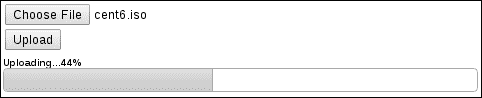
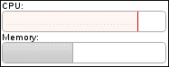
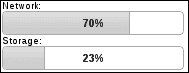
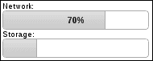

# 七、进度条

在本章中，我们将介绍以下配方：

*   显示文件上载进度
*   设置进度更改的动画
*   创建进度指示器小部件
*   使用状态警告阈值
*   给 progressbars 贴标签

# 导言

**progressbar**小部件非常简单，因为它没有很多运动部件。事实上，它只有一个移动部分，即值栏。但是简单性并不会使 progressbar 的功能不如其他小部件。在本章中，我们将介绍如何利用这种简单性。progressbar 可以表示从文件上载进度到服务器端进程再到容量利用率的任何内容。

# 显示文件上传进度

如果有一种简单的方法可以使用 progressbar 小部件显示文件上传的进度，那就太好了。不幸的是，我们没有得到这样的奢侈。文件的上载发生在页面转换之间。然而，由于现代标准和浏览器的出现，使用 progressbar 窗口小部件显示上传进度的必要技巧已经缩小。让我们来看看我们如何利用在 Type T3 中的 XML HTTP 请求对象的 TytT2AutoT0.事件。

## 准备好了吗

对于本演示，我们将创建一个带有简单文件字段的简单表单。在表单内部，我们将创建一些 HTML 来显示 progressbar 小部件。它将被隐藏，直到用户启动文件上载。

```js
<form action="http://127.0.0.1:8000/" method="POST">
    <input type="file" name="fileupload"/>
    <br/>
    <input type="submit" value="Upload"/>
    <div id="upload-container" class="ui-helper-hidden">
        <strong id="upload-value">Uploading...</strong>
        <div id="upload-progress"></div>
    </div>
</form>
```

## 怎么做。。。

在文件上传期间更新 progressbar 小部件所需的大部分工作实际上是在 Ajax 请求机制和`onprogress`事件处理程序中执行的。下面的代码很好地说明了小部件设计者为什么应该追求简单。生成的小部件适用于各种各样的上下文。

```js
$(function() {

    $( "#upload-progress" ).progressbar();

    $( "form" ).submit( function( e ) {

        e.preventDefault();

        $.ajax({
            url: $( this ).attr("action"),
            type: "POST",
            data: new FormData( this ), 
            cache: false,
            contentType: false,
            processData: false,
            xhr: function() {

                xhr = $.ajaxSettings.xhr();

                if ( xhr.upload ) {
                    xhr.upload.onprogress = onprogress;
                }

                return xhr;

            }

        });

        return false;

    });

    var onprogress = function( e ) {

        var uploadPercent = ( e.loaded / e.total * 100 ).toFixed();

        $( "#upload-container" ).show();
        $( "#upload-value" ).text( "Uploading..." + uploadPercent + "%" );
        $( "#upload-progress" ).progressbar( "option", "max", e.total )
                               .progressbar( "value", e.loaded );

    }; 

});
```

如果您运行此示例并实际在`http://127.0.0.1:``8000/`本地上传一个文件，您将需要使用一个大文件。较小的文件上传速度太快，时间太短。较大的文件上载将使您能够在上载过程中看到以下内容。



### 注

本书中的代码附带一个最小的 Python 服务器，它将为这个演示上传页面提供服务，并将处理文件上传请求。该示例可以重新安排，而无需花费太多精力使用任何上载服务器，但是提供的 Python 服务器只需要安装 Python。同样，这不是一个要求，但如果您渴望看到客户机代码的运行，它只是一个方便的服务器。

## 它是如何工作的。。。

本例的目标是随着文件上传进度的变化实时更新 progressbar 小部件。有几个插件将提供此功能，但是如果您正在编写 jQueryUI 应用程序，那么您最好在 progressbar 小部件上进行标准化。文档准备好后，我们要做的第一件事是创建 progressbar 小部件，用于显示文件上载进度。`#upload-container`最初是使用`ui-helper-hidden`类隐藏的，因为在上传实际发生之前，我们不需要显示上传的进度。

接下来，我们为上传表单的`submit`事件设置事件处理程序。在执行任何其他操作之前，此处理程序会阻止默认表单提交。我们实际上是用自己的行为来代替浏览器实现的默认表单提交。我们需要重写此行为的原因是为了保持在页面上，并将更新应用到 progressbar 小部件。

接下来，我们设置`$.ajax()`调用，实际将所选文件发送到服务器。我们从表单本身获取`url`参数。接下来的几个参数是作为 Ajax 请求的一部分发送多部分表单数据（包括选定文件）的先决条件。`xhr`选项用于提供一个函数，返回`$.ajax()`函数内部使用的`xhr`对象。这是我们劫持`xhr`对象并附加其他行为的机会。我们主要感兴趣的是在`onprogress`事件中添加新的行为。

确定`XMLHttpRequestUpload`的实例 upload 对象确实存在后，我们可以定义`onprogress`事件处理函数。

首先，我们使用事件的`loaded`和`total`属性计算实际上传百分比。接下来，我们显示进度容器，并使用`uploadPercent`中的值更新百分比标签。最后，我们确保 upload progressbar 小部件的`max`选项设置为`total`，并使用`value()`方法设置 progressbar 的当前值。

# 制作进度变化动画

每次设置`value`或`max`选项时，progressbar 小部件都会更改其视觉外观。例如，`value`的默认值为`0`，而`max`的默认值为`100`。因此，当 progressbar 小部件显示这些值时，我们实际上看不到图形栏，但它描述了进度百分比。但是，设置`value`选项将更新此栏。如果该条已经可见，`value`选项的更改将导致进度条宽度的更改。使用默认的 progressbar 实现，这些更改只是即时更改小部件。让我们看看如何修改小部件以支持 progressbar 值之间的平滑转换。

## 怎么做。。。

我们将使用以下简单标记作为 progressbar 小部件实例的基础：

```js
<div id="progress"></div>
```

下面是用于定制 progressbar 小部件的 JavaScript，以支持动画化正在进行的更改：

```js
(function( $, undefined ) {

$.widget( "ab.progressbar", $.ui.progressbar, {

    options: {
        animate: false
    },

    _refreshValue: function() {

        if ( !this.options.animate ) {
            return this._super();
        }

        var value = this.value(),
            percentage = this._percentage();

        if ( this.oldValue !== value ) {
            this.oldValue = value;
            this._trigger( "change" );
        }

        this.valueDiv.toggle( value > this.min )               .toggleClass( "ui-corner-right",
value === this.options.max )
                             .stop( true, true )
                             .animate( { width: percentage.toFixed( 0 ) + "%" }, 200 );

              this.element.attr( "aria-valuenow", value );

    }

});

})( jQuery );

$(function() {

    $( "#progress" ).progressbar( { animate: true } );

    var timer;

    var updater = function() {

        var value = $( "#progress" ).progressbar( "value" ) + 10,
            maximum = $( "#progress" ).progressbar( "option", "max" );

        if ( value >= maximum ) {
            $( "#progress" ).progressbar( "value", maximum );
            return;
        }

        $( "#progress" ).progressbar( "value", value );
        timer = setTimeout( updater, 700 );

    };

    timer = setTimeout( updater, 700 );

});
```

此示例包括一个更新程序，它将每隔 0.7 秒增加 progressbar 值。您会注意到，随着值的变化，应用了平滑宽度过渡。要将此更改与默认行为进行对比，请将`animate`选项设置为`false`。现在，您将开始真正注意到，每当值更新时，条都会出现视觉跳跃。

## 它是如何工作的。。。

我们的示例代码通过添加一个新的`animate`选项来扩展 progressbar 小部件。新的`animate`选项默认为`false`。我们对 progressbar 小部件引入的另一个变化是`_refreshValue()`方法的新实现，只要`value`选项发生变化，小部件就会在内部调用该方法。此方法负责在`div`元素`progress`上进行可视宽度更改。这代表了`value`和`max`之间的进展。

这段代码的大部分是从`_refreshValue()`的原始实现中借用的，因为我们只做了一些小的更改。首先，我们检查我们添加到小部件的`animate`选项是否有`true`值。如果没有，我们就继续原来的实现。否则，我们使用相同的代码，但对宽度的应用方式进行轻微调整。然后，我们调用`stop( true, true )`来完成当前动画并清除动画队列。接下来，我们不再像最初的实现那样使用`width()`函数，而是通过调用`animate()`来设置宽度。

## 还有更多。。。

一如既往，我们不局限于使用 jQuery`animate()`函数将效果应用于 progressbar 值之间的视觉转换。我们可以将 CSS 转换应用于 progressbar 值，而不是`animate()`函数。当然，缺点是并非所有浏览器都支持 CSS 转换，而且我们会使用特定于供应商的样式规则。尽管如此，让我们将前面的方法与使用 CSS 样式设置 progressbar 动画的方法进行比较。

我们将使用相同的标记，但我们将在页面中引入以下样式：

```js
.ui-progressbar-animated > .ui-progressbar-value {
    transition: width 0.7s ease-out;
    -moz-transition: width .7s ease-out;
    -webkit-transition: width 0.7s ease-out;
    -o-transition: width 0.7s east-out;
}
```

下面是对 JavaScript 代码的必要更改。它看起来与前面的代码类似。

```js
(function( $, undefined ) {

$.widget( "ab.progressbar", $.ui.progressbar, {

    options: {
        animate: false
    },

    _create: function() {

        this._super();

        if ( !this.options.animate ) {
            return;
        }

        this.element.addClass( "ui-progressbar-animated" );

    }

});

})( jQuery );

$(function() {

    $( "#progress" ).progressbar( { animate: true } );

    var timer;

    var updater = function() {

        var value = $( "#progress" ).progressbar( "value" ) + 10,
            maximum = $( "#progress" ).progressbar( "option", "max" );

        if ( value >= maximum ) {
            $( "#progress" ).progressbar( "value", maximum );
            return;
        }

        $( "#progress" ).progressbar( "value", value );
        timer = setTimeout( updater, 700 );

    };

    timer = setTimeout( updater, 700 );

});
```

运行此示例与之前的`animate`选项实现没有多大区别。过渡将以同样的方式进行。这里的关键区别在于，我们正在扩展主题框架。我们为 progressbar 小部件引入了一个新的 CSS 类-`ui-progressbar-animated`。选择器`.ui-progressbar-animated > .ui-progressbar-value,`应用于进度条值`div`，即改变宽度的值。而且，这正是我们的新款式所做的。它们会在 0.7 秒内更改过渡宽度属性值。

JavaScript 代码是这种方法的主要受益者，因为 progressbar 小部件中的更改较少。例如，我们不再重写`_refreshValue()`方法。相反，我们正在重写`_create()`，如果`animated`选项为`true`，则将`ui-progressbar-animated`类添加到元素中。这就是我们的新风格如何付诸实施。实例化小部件和值更新程序的其余 JavaScript 与前面的示例没有什么不同。

# 创建 progressindicator 小部件

progressbar 小部件用于显示某些进程的进度。最终目标是创建小部件时指定的`max`选项，默认为`100`。如果我们提前知道处理的数据的大小，我们将使用`max`选项来反映这一最终目标。然而，我们有时会遇到这样的情况：我们需要对客户进行一些处理；或者，我们正在等待某个后端进程完成并将响应发送回客户端。例如，用户已经使用 API 启动了后端任务，他们现在正在等待响应。底线是，我们想向用户说明正在取得进展，我们只是不知道已经取得了多少进展。

要显示正在取得进展的事实，尽管不知道进展有多大，我们需要一个指示器小部件。我们可以编写自己的小部件来实现这一点，扩展 progressbar 小部件，因为我们可以重用那里的许多组件。

## 怎么做。。。

对于 progressindicator 小部件，我们将使用与基本 progressbar 小部件相同的 HTML。

```js
<div id="indicator"></div>
```

接下来，我们将对 progressbar CSS 样式进行一些轻微的调整。这些适用于 progressbar`div`内的值栏。我们正在移除`border`和`margin`，因为前后滑动值条时，这看起来更好。

```js
.ui-progressbar > .ui-progressbar-value {
    border: none;
    margin: 0px;
}
```

现在，我们来讨论 progressindicator 小部件的实现。此代码还将创建 progressindicator 小部件的实例。

```js
(function( $, undefined ) {

$.widget( "ab.progressindicator", $.ui.progressbar, {

    _create: function() {

        this._super();
        this.value( 40 );
        this.element.removeClass( "ui-corner-all" );
        this.valueDiv.removeClass( "ui-corner-right ui-corner-left" );

        var self = this,
            margin = ( this.element.innerWidth() - this.valueDiv.width() ) + "px";

        var _right = function() {

            self.valueDiv.animate(
                { "margin-left": margin },
                { duration: 1000, complete: _left }
            );

        };

        var _left = function() {

            self.valueDiv.animate(
                { "margin-left": "0px" },
                { duration: 1000, complete: _right }
            );

        };

        _right();

    },

    _destroy: function() {

        this.valueDiv.stop( true, true );
        this._super();

    }

});

})( jQuery );

$(function() {

    $( "#indicator" ).progressindicator();

});
```

如果您在浏览器中查看此 progressindicator 小部件，您将看到它通过来回滑动 progressbar 小部件的值栏来设置其动画，表明正在发生某些事情。


## 它是如何工作的。。。

我们创建了一个新的 progressindicator 小部件，它继承了 progressbar 小部件的功能。progressindicator 小部件背后的目标是获取进度值栏`div`，在其上设置一个宽度，并在 progressbar 容器`div`内来回滑动。从视觉上看，这表明有什么事情发生在幕后。这种类型的活动图形化描述让用户普遍感到放心，因为它让人感觉到正在发生什么事情，并且应用程序没有被破坏。

在新 progressindicator 小部件的定义中，我们覆盖的第一个方法是 progressbar 的`_create()`方法。在这里，我们调用 progressbar 小部件的原始构造函数，因为在开始进行更改之前，我们需要所有的 UI 组件。接下来，我们使用`value()`方法为值栏`div`指定一个宽度。我们在`progressindicator()`构造函数中硬编码这个值，只是因为使用这个小部件的开发人员不需要更改它；我们只需要设置元素的宽度。为了进一步简化这个小部件，我们从元素中删除了 corner 类。我们可以离开它们，但是当涉及到动画条的时候，我们必须处理一些特殊的情况，因为我们在这里关注一个简单的小部件，一个不需要代表使用小部件的开发人员进行配置的小部件。

在`_create()`方法中，我们定义了两个用于执行动画的实用函数。您可能已经猜到，`_right()`函数将进度值条向右滑动，而`_left()`函数将进度值条向左滑动。我们正在调用此小部件的`valueDiv`属性上的`animate()`jQuery 函数。`_right()`功能通过更新`margin-left`值将值`div`向右滑动。您会注意到，`margin`变量是在`_create()`中本地定义的。这是通过计算数值`div`右边有多少空间来完成的，这意味着我们将该数值设置为`margin-left`以将其向右滑动。要将其再次滑回左侧，只需在`_left()`函数中将`margin-left`CSS 属性设置回`0px`。

通过调用`_create()`方法底部的`_right()`来引导动画。进度指示器动画循环通过传递`_left()`作为对初始动画的回调来实现。同样，我们在`_left()`函数中传递`_right()`作为动画完成回调。此过程将继续，直到小部件被销毁。`_destroy()`方法被我们的小部件覆盖，只是为了确保所有动画立即停止。这包括等待执行的任何排队动画。然后，我们通过调用原始的`_destroy()`实现继续销毁小部件。

## 还有更多。。。

progressindicator 小部件的一个优点是它提供了一个非常简单的 API。您可以根据需要创建和销毁小部件，而无需处理任何中间步骤。理想情况下，这个小部件的寿命很短，可能只有一秒钟（几乎没有足够的时间观看一个动画周期）。然而，有时事情可能需要更长的时间。如果这个小部件要长时间显示，可能会给应用程序带来问题。jQuery`animate()`函数的设计目的不是在无限循环中运行动画。我们的小部件也不是为长时间显示而设计的。问题在于`animate()`使用计时器，并且会消耗客户机上的 CPU 周期。这不仅会破坏我们的应用程序，还会破坏用户机器上运行的其他应用程序。

尽管这是一个相对次要的问题，让我们看看 progressindicator 小部件的另一个实现，一个使用 CSS 动画的实现。下面是我们在 CSS 中定义动画的方式：

```js
.ui-progressindicator > .ui-progressbar-value {
    border: none;
    margin: 0px;
    animation: indicator 2s ease-in-out infinite;
    -moz-animation: indicator 2s ease-in-out infinite;
    -webkit-animation: indicator 2s ease-in-out infinite;
}

@keyframes indicator {
    0%   { margin-left: 0px; }
    50%  { margin-left: 108px; }
    100% { margin-left: 0px; }
}

@-moz-keyframes indicator {
    0%   { margin-left: 0px; }
    50%  { margin-left: 108px; }
    100% { margin-left: 0px; }
}

@-webkit-keyframes indicator {
    0%   { margin-left: 0px; }
    50%  { margin-left: 108px; }
    100% { margin-left: 0px; }
}

@-o-keyframes indicator {
    0%   { margin-left: 0px; }
    50%  { margin-left: 108px; }
    100% { margin-left: 0px; }
}
```

下面是我们的`progressindicator`小部件经过修改的 JavaScript 实现，它知道如何利用以前的 CSS：

```js
(function( $, undefined ) {

$.widget( "ab.progressindicator", $.ui.progressbar, {

  _create: function() {

        this._super();
        this.value( 40 );
        this.element.addClass( "ui-progressindicator" )
                    .removeClass( "ui-corner-all" );
        this.valueDiv.removeClass( "ui-corner-right ui-corner-left" );

    },

    _destroy: function() {

        this.element.removeClass( "ui-progressindicator" );
        this._super();

    }

});

})( jQuery );

$(function() {

    $( "#indicator" ).progressindicator();

});
```

现在，如果您在浏览器中查看这个小部件的修改版本，您应该会看到与以前的实现相比几乎相同的结果。当然，关键区别在于动画是在 CSS 中指定的，并由浏览器直接执行。浏览器可以比基于 JavaScript 的版本更有效地处理这些类型的 CSS 动画。浏览器只需要读取动画规范一次，然后在内部运行动画，使用本机代码而不是执行 JavaScript，并直接操作 DOM。我们可以整天运行这个版本，浏览器会很高兴地运行。

但这个版本的 progressindicator 并非没有缺陷。首先，让我们仔细看看 CSS。考虑到浏览器采用的差异，我们一开始就依赖 CSS 动画并不是最好的选择。在这里，我们的风格陷入了浏览器供应商前缀混乱。不过，一般来说，支持还不错，因为 IE 是唯一不支持 CSS 动画的浏览器；但动画的定义很简单。在`.ui-progressindicator > .ui-progressbar-value`选择器中，我们指定指示器动画将运行`2`秒并无限重复。`@keyframes`指示器动画指定`margin-left`属性本身如何更改。

在 JavaScript 中，您会注意到代码本身要简单得多。这是因为它现在的责任要小得多。主要需要在创建时将`ui-progressindicator`类添加到小部件的 DOM 元素中，并在销毁时删除该类。您还将注意到，在实现小部件的 JavaScript 代码中不再进行边距计算。我们将这些数字移到 CSS 中，CSS 将小部件动画定义为硬编码值。同样，这只是一个小部件设计者必须考虑的权衡。我们正在用 CSS 中更高的维护成本换取更高效的动画，并用我们的小部件对更简单的 JavaScript 的可疑浏览器支持。

# 使用状态警告阈值

progressbar 小部件不限于标记朝向某个端点的进度。它也可用作某些资源利用的标记。例如，您的应用程序可能允许用户存储 100MB 的图像数据。向他们展示目前有多少容量在使用可能是有意义的。progressbar 小部件是一个理想的解决方案，用于以图形方式描述此类资源利用情况。更进一步，我们可能还想警告用户使用率阈值。也就是说，在一定的百分比下，资源接近容量，但是用户仍然有时间做一些事情。

## 准备好了吗

对于本演示，我们将为要显示的两个 progressbar 小部件创建两个简单的`div`元素：

```js
<span>CPU:</span>
<div id="cpu-utilization"></div>
<span>Memory:</span>
<div id="memory-utilization"></div>
```

## 怎么做。。。

下面是扩展 progressbar 小部件的 JavaScript 代码，它提供了一个用于指定阈值的新选项：

```js
(function( $, undefined ) {

$.widget( "ab.progressbar", $.ui.progressbar, {

    options: {
        threshold: 0
    },

  _percentage: function() {

        var percentage = this._super(),
            threshold = this.options.threshold;

        if ( threshold <= 0 ) {
            return percentage;
        }

        if ( percentage > threshold ) {
            this.valueDiv.addClass( "ui-state-error" );
        }
        else {
            this.valueDiv.removeClass( "ui-state-error" );
        }

        return percentage;

  },

});

})( jQuery );

$(function() {

    $( "#cpu-utilization" ).progressbar( { threshold: 80 } );
    $( "#memory-utilization" ).progressbar( { threshold: 85 } );

    setInterval(function() {
        var cpu = Math.floor( ( Math.random() * 100 ) + 1 ),
            memory = Math.floor( ( Math.random() * 100 ) +1 );

        $( "#cpu-utilization" ).progressbar( "value", cpu );
        $( "#memory-utilization" ).progressbar( "value", memory );

    }, 1300);

});
```

我们在这里实例化两个 progressbar 小部件，并启动一个基本的计时器间隔，每 1.30 秒更改一次 progressbar 小部件的值。如果在浏览器中查看此示例，您会注意到一个或两个 progressbar 小部件将进入错误状态，因为该值已超过提供的阈值。



## 它是如何工作的。。。

我们在 progressbar 小部件中添加的新的`threshold`选项是一个以百分比表示的数字。这是 progressbar 的阈值，在该阈值处，状态会发生变化，以便向用户发出视觉警告。这是通过覆盖`_percentage()`方法实现的。在这里，我们通过调用`_percentage()`的原始实现并将其存储在`percentage`中来获得实际的百分比值。然后，我们确保`threshold`值不为零，并且计算的百分比大于`threshold`值。每次更新值时，progressbar 小部件都会在内部调用`_percentage()`方法，并且视觉显示会发生变化。因此，在`_percentage()`的实现中，如果我们超过阈值，我们将`ui-state-error`类添加到`valueDiv`元素中，即进度条中从左向右移动的图形条。否则，我们将低于阈值，必须确保删除`ui-state-error`类。

一旦我们创建了这两个小部件，我们将使用`setInterval()`为两个进度条连续分配一个随机值。您可以坐下来观察 progressbar 小部件的状态如何变化，这取决于输入它们的数据是否超过了我们指定的阈值。在这种情况下，`#cpu-utilization`进度条的阈值为`80`，而`#memory-utilization`进度条的阈值为`85%`。

# 给进度条贴标签

改变宽度以反映进度百分比的图形栏做得很好。progressbar 小部件的强大之处在于，它能够一目了然地看到已经取得了多少进展，或者有多少资源正在被利用。但有时，我们可以对百分比使用一些精确性，即，显示基本百分比的标签。

progressbar 小部件能够在 progressbar 容器内部显示标签，这比在小部件外部显示百分比标签更直观。让我们看看如何扩展主题 CSS，为小部件提供额外的标记，以及如何扩展 progressbar 以利用这些新的额外功能来显示标签。

## 怎么做。。。

我们将首先为两个 progressbar 小部件创建 HTML。

```js
<span>Network:</span>
<div id="network-utilization">
    <div class="ui-progressbar-label"></div>
</div>
<span>Storage:</span>
<div id="storage-utilization">
    <div class="ui-progressbar-label"></div>
</div>
```

接下来，我们将添加 progressbar 标签所需的 CSS 类。

```js
.ui-progressbar-label {
    float: left;
    width: 100%;
    text-align: center;
    margin-top: 5px;
    font-weight: bold;
}
```

最后，我们将扩展 progressbar 小部件本身，将新的 HTML 和新的 CSS 结合在一起。

```js
(function( $, undefined ) {

$.widget( "ab.progressbar", $.ui.progressbar, {

    _create: function() {
        this.$label = this.element.find( ".ui-progressbar-label" );
        this._super();

    },

    _destroy: function() {

        this.$label.remove();

        this._super();

    },

  _refreshValue: function() {
        this.$label.text( this._percentage().toFixed( 0 ) + "%" );
        this._super();

  },

});

})( jQuery );

$(function() {

    $( "#network-utilization" ).progressbar({
        value: 746586112,
        max: 1073741824
    });

    $( "#storage-utilization" ).progressbar({
        value: 24696061952,
        max: 107374182400
    });

});
```

您现在可以在浏览器中查看这两个进度条，您会注意到显示百分比值的两个标签位于小部件的中心。



## 它是如何工作的。。。

默认情况下，progressbar 小部件不支持标签，因此我们必须将标签`div`放在 progressbar`div`内。我们还将这个新标签`div`命名为`ui-progressbar-label`类，它与 jQueryUI 主题命名约定一致。这个类实际上有两个用途：在我们介绍的小部件定制中，我们使用这个类来搜索标签`div`并应用标签样式。

在 Type T0 中指定的 CSS 规则有助于将标签文本定位在 PrimeStBar 元素的中间。我们为标签`div`指定`100%`的宽度，并使用`text-align`属性水平对齐文本。最后，我们制作了标签`bold`的`font-weight`以便脱颖而出；否则，在 progressbar 的背景下很难看到它。

我们在这里介绍的 progressbar 小部件的定制 JavaScript 实现覆盖了`_create()`方法。我们创建了一个名为`labelDiv`的新实例变量，它存储对新元素的引用。然后我们调用原始的`_create()`实现，构造函数照常进行，在新标签元素旁边创建值`div`。我们还覆盖了`_refreshValue()`方法，以更新`labelDiv`的内容。只要值发生变化，并且 progressbar 小部件需要更新值显示，小部件就会在内部调用`_refreshValue()`方法。我们通过使用`_percentage()`号更新`labelDiv`值来扩展此行为，然后恢复原来的`_refreshValue()`实现。

## 还有更多。。。

这种实现 progressbar 标签的方法可能遇到的一个潜在问题是，我们必须更改 HTML 结构。这违反了 DRY 原则，因为我们为创建的每个 progressbar 小部件添加的每个标签`div`都是完全相同的。此外，我们可能希望将标签应用于应用程序中已经存在的 progressbar 小部件。在已经运行的小部件中修改 HTML 不是最好的方法。让我们考虑一下如何改进前面的代码。

我们创建的 CSS 可以定位和设置标签元素的样式。它遵循正确的命名约定，适用于所有 progressbar 小部件实例。我们想要更改的是用于实例化 progressbar 小部件并显示标签的必要标记。问题是怎么做。理想情况下，通过允许开发人员打开和关闭标签的选项。小部件本身将负责在必要时插入标签`div`，因为它对于小部件的所有实例都是相同的，这反过来意味着最少的 JavaScript 代码。

让我们来看一下简化的损坏 t0 标记，与前面的例子相同：

```js

<span>Network:</span>
<div id="network-utilization"></div>
<span>Storage:</span>
<div id="storage-utilization"></div>
```

现在我们回到了 progressbar 小部件在引入修改之前所期望的原始标记。现在，让我们通过添加一个新选项来更新小部件代码以利用此标记。

```js
(function( $, undefined ) {

$.widget( "ab.progressbar", $.ui.progressbar, {

    options: {
        label: false
    },

    _create: function() {

        if ( !this.options.label ) {
            return this._super();
        }

        this.$label = $( "<div/>" ).addClass( "ui-progressbar-label" )
                                   .appendTo( this.element );

        this._super();

    },

    _destroy: function() {

        if ( !this.options.label ) {
            return this._super();
        }

        this.$label.remove();

        this._super();

    },

    _refreshValue: function() {

        if ( !this.options.label ) {
            return this._super();
        }

        this.$label.text( this._percentage().toFixed( 0 ) + "%" );

        this._super();

    },

});

})( jQuery );

$(function() {

    $( "#network-utilization" ).progressbar({
        value: 746586112,
        max: 1073741824,
        label: true
    });

    $( "#storage-utilization" ).progressbar({
        value: 24696061952,
        max: 107374182400
    });

});
```

在这里，我们使用新的`label`选项扩展 progressbar 小部件，该选项默认为`false`。其思想是，当该值为`true`时，我们将标签`div`插入 progressbar 容器。我们对`_create()`和`_refreshValue()`方法的修改基本上与之前的代码相同，只是现在我们在执行自定义行为之前检查`label`选项是否已打开。正如您所看到的，我们正在向`#network-utilization`div 提供此新标签选项，而不是`#storage-utilization`div。

