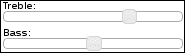
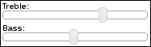
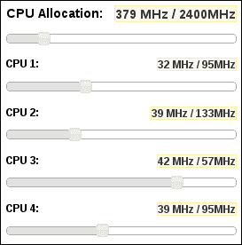
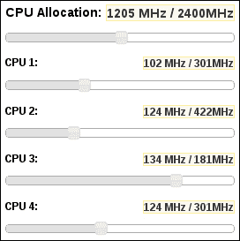
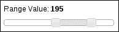
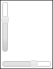

# 八、使用滑块

在本章中，我们将介绍：

*   控制滑块控制柄的大小
*   移除控制柄焦点轮廓
*   使用主滑块和子滑块
*   标记步长增量
*   获取范围值
*   更改滑块方向

# 导言

**滑块**小部件几乎就像一个进度条，用户可以操纵它。滑块为用户提供了一个可以沿平面拖动的控制柄，以生成所需的值。这在处理表单值时特别有用。默认情况下，slider 小部件具有一些有用的选项，例如改变方向的能力以及允许用户选择一个值范围。在本章中，我们将介绍通过添加新选项或附加处理函数来调整滑块小部件的各种方法。我们还将研究一些视觉上的调整，以及滑块实例如何相互通信。

# 控制滑块手柄的尺寸

用于控制滑块位置的**滑块手柄**为方形，由鼠标拖动。也就是说，宽度与高度相同，我们可能希望滑块控制柄的形状不同。在**水平滑块**默认方向的情况下，让我们看看如何覆盖小部件 CSS 样式来改变滑块手柄的形状，以满足应用程序的需要。

## 准备好了。。。

我们将创建的 HTML 用于两个滑块小部件。我们还将给它们一个标签，并用 container div 元素包装它们，以控制布局。

```js
<div class="slider-container">
    <span>Treble:</span>
    <div id="treble"></div>
</div>
<div class="slider-container">
    <span>Bass:</span>
    <div id="bass"></div>
</div>
```

## 怎么做。。。

以下是用于定制滑块手柄的 CSS。这将覆盖小部件 CSS 中定义的值，因此应包含在 jQuery UI 样式表之后的页面中：

```js
.ui-slider-horizontal .ui-slider-handle {
    width: 0.8em;
    height: 1.6em;
    top: -0.48em;
}
```

下面是用于创建 slider 小部件的两个实例的 JavaScript 代码：

```js
$(function() {

    $( "#treble" ).slider();
    $( "#bass" ).slider();

});
```

作为参考，以下是两个滑块小部件在应用自定义 CSS 之前的外观：



下面是两个应用了自定义 CSS 的滑块小部件：



## 它是如何工作的。。。

如您所见，控制柄更高，延伸得更远，超出滑块边界的边界。这为用户提供了一个更大的表面积来单击和拖动滑块控制柄。我们引入的确切大小更改是任意的，可以根据每个应用程序进行调整。

`.ui-slider-horizontal .ui-slider-handle`选择器覆盖小部件 CSS 中定义的三个属性。宽度更改为`0.8em`，使其稍微变薄。`height`属性的值更改为`1.6em`，这使其更高。当我们使用`height`属性使手柄更高时，我们将其向下推，使其不再与滑块对齐。为了补偿高度的变化，我们通过将`top`值减小到`-0.48em`将其拉回。

# 取下手柄焦点轮廓

大多数浏览器在接收到焦点时，会在元素周围显示点或实心**轮廓**。这不是用户界面样式的一部分，而是浏览器的内置辅助功能。这种围绕元素（如滑块控制柄）的强制视觉显示并不总是可取的。让我们看看如何从滑块控制柄中删除此默认浏览器行为。

## 怎么做。。。

我们可以使用任何基本的`div`元素来创建我们的示例滑块小部件。让我们直接跳到自定义滑块小部件 CSS。

```js
.ui-slider-handle-no-outline {
    outline: 0;
}
```

现在我们有了 slider 小部件的定制实现和定制 slider 的一个实例。

```js
(function( $, undefined ) {

$.widget( "ab.slider", $.ui.slider, {

    options: { 
        handleOutline: true
    },

    _create: function() {

        this._super();

        if ( this.options.handleOutline ) {
            return;
        }

        this.handles.addClass( "ui-slider-handle-no-outline" );

    }

});

})( jQuery );

$(function() {

    $( "#slider" ).slider({
        handleOutline: false,
    });

});
```

在我们将更改应用于滑块小部件之前，手柄在拖动后有一个轮廓，看起来像这样：


将更改应用于 slider 小部件后，拖动句柄后，slider 实例如下所示：


## 它是如何工作的。。。

我们为滑块小部件添加了一个名为`handleOutline`的新选项。默认情况下，我们将此选项设置为`true`，因为支持本机浏览器行为总是一个好主意。当设置为`false`时，此选项将关闭本机边框轮廓功能。它通过向滑块中的每个句柄元素添加`the ui-slider-handle-no-outline`类来实现。一个滑块中可以有多个控制柄，例如，范围滑块。所以在`_create()`方法中，我们检查`handleOutline`选项是否为`true`，如果是，我们使用存储为该小部件属性的`handles`jQuery 对象来应用我们创建的新类。

这个类本身很简单，因为它只改变了一个属性。事实上，我们可以简单地将值为`0`的`outline`属性添加到`ui-slider-handle`类中，而不是创建一个新的属性。然而，我们选择的方法允许我们保持本机小部件样式不变，这允许大纲浏览器功能为小部件的每个实例打开或关闭。您还将注意到，即使没有本机浏览器大纲，句柄也不会失去任何可访问性，因为 jQuery UI 状态类为我们处理了这一点。

# 使用主滑块和子滑块

应用程序可能会使用一些可以进一步分解为较小值的量。此外，用户可能需要控制这些较小的值，而不仅仅是总量。如果我们决定为此使用滑块小部件，我们可以想到子滑块观察主滑块的变化值。让我们来看看我们可能会如何实现这类滑块。我们将设计一个接口，允许我们分配这个应用程序允许使用多少 CPU。这是**主滑块**。我们将采用四核架构，因此我们将有四个后续滑块，它们依赖于并观察主 CPU 滑块。

## 怎么做。。。

下面是用于定义五个滑块布局的 HTML。每个滑块都有自己的`div`容器，主要用于定义宽度和边距。在`div`容器中，我们有每个 CPU 的标签、它们当前的 MHz 分配和最大值。这也是每个滑块小部件的放置位置。

```js
<div class="slider-container">
    <h2 class="slider-header">CPU Allocation:</h2>
    <h2 class="slider-value ui-state-highlight"></h2>
    <div class="ui-helper-clearfix"></div>
    <div id="master"></div>
</div>

<div class="slider-container">
    <h3 class="slider-header">CPU 1:</h3>
    <h3 class="slider-value ui-state-highlight"></h3>
    <div class="ui-helper-clearfix"></div>
    <div id="cpu1"></div>
</div>

<div class="slider-container">
    <h3 class="slider-header">CPU 2:</h3>
    <h3 class="slider-value ui-state-highlight"></h3>
    <div class="ui-helper-clearfix"></div>
    <div id="cpu2"></div>
</div>

<div class="slider-container">
    <h3 class="slider-header">CPU 3:</h3>
    <h3 class="slider-value ui-state-highlight"></h3>
    <div class="ui-helper-clearfix"></div>
    <div id="cpu3"></div>
</div>

<div class="slider-container">
    <h3 class="slider-header">CPU 4:</h3>
    <h3 class="slider-value ui-state-highlight"></h3>
    <div class="ui-helper-clearfix"></div>
    <div id="cpu4"></div>
</div>
```

接下来，我们有一些 CSS 样式来帮助对齐和定位这些组件。

```js
.slider-container { 
    width: 200px;
    margin: 5px;
}

.slider-header {
    float: left;
}

.slider-value {
    float: right;
}
```

最后，我们的 JavaScript 代码扩展了 slider 小部件，为使用它的开发人员提供了两个新选项，`parent`和`percentage`。加载文档时，我们实例化 CPU 滑块小部件，并使用我们新的滑块功能在它们之间建立适当的关系。

```js
(function( $, undefined ) {

$.widget( "ui.slider", $.ui.slider, {

    options: {
        parent: null,
        percentage: null
    },

    _create: function() {

        this._super();

        var parent = this.options.parent,
            percentage = this.options.percentage,
            $parent;

        if ( !( parent && percentage ) ) {
            return;
        }

        $parent = $( parent );

        this._reset( $parent.slider( "value" ) );

        this._on( $parent , { 
            slidechange: function( e, ui ) {
                this._reset( ui.value );
            }
        });

    },

    _reset: function( parentValue ) {

        var percentage = ( 0.01 * this.options.percentage ),
            newMax = percentage * parentValue,
            oldMax = this.option( "max" ),
            value = this.option( "value" );

        value = ( value / oldMax ) * newMax;

        this.option( "max", newMax );
        this.option( "value", value );

    }

});

})( jQuery );

$(function() {

    function updateLabel( e, ui ) {

        var maxValue = $( this ).slider( "option", "max" )
                                .toFixed( 0 ),
            value = $( this ).slider( "value" )
                             .toFixed( 0 ) + " MHz" +
                                             " / " + 
                                             maxValue + 
                                             "MHz";

        $( this ).siblings( ".slider-value" ).text( value );

    }

    $( "#master" ).slider({
        range: "min",
        value: 379,
        min: 1,
        max: 2400,
        create: updateLabel,
        change: updateLabel
    });

    $( "#cpu1" ).slider({
        parent: "#master",
        percentage: 25,
        range: "min",
        min: 0,
        create: updateLabel,
        change: updateLabel
    });

    $( "#cpu2" ).slider({
        parent: "#master",
        percentage: 35,
        range: "min",
        min: 0,
        create: updateLabel,
        change: updateLabel
    });

    $( "#cpu3" ).slider({
        parent: "#master",
        percentage: 15,
        range: "min",
        min: 0,
        create: updateLabel,
        change: updateLabel
    });

    $( "#cpu4" ).slider({
        parent: "#master",
        percentage: 25,
        range: "min",
        min: 0,
        create: updateLabel,
        change: updateLabel
    });

});
```

在浏览器的中查看结果滑块小部件，并调整一些子 CPU 值。您会注意到标签更新已经更改，每个 CPU 都有自己的 CPU 分配。



现在，保持 CPU 值不变，尝试调整主 CPU 分配滑块。您会注意到，每个子 CPU 滑块的当前值和最大值都会发生变化，但比率会保持不变。这意味着，如果我们将 CPU 1 设置为使用总 CPU 分配的 10%，那么即使总分配增加或减少，它也将继续使用 10%。



## 它是如何工作的。。。

在我们为 CPU 滑块创建的每个容器`div`元素中，我们都有一个标题`slider-value`，用于显示滑块的当前值和最大值。这是一个重要的补充，我们需要在大多数情况下考虑使用滑块控件。这个小部件非常适合让用户更改值，但他们需要显示操作结果的特定反馈。在本例中，更改主滑块将更新五个标签，进一步强调需要在用户可以看到的小部件外部标记特定的滑块值。

我们为 slider 小部件添加了两个新选项，`parent`和`percentage`。这两个选项相互关联，基本上转化为“此滑块的最大值是此父滑块值的百分比”。在`_create()`方法中，我们在继续之前检查这两个选项是否都有实际值，因为它们默认为`null`。如果没有，我们已经使用`_super()`方法调用了原始滑块构造函数，因此可以安全地返回。

另一方面，如果给我们一个父滑块小部件和一个百分比，我们调用`_reset()`方法，将父滑块的当前值传递给它。这可能会更新此小部件的最大值和当前值。完成后，我们设置观察者，观察父滑块的变化。这是使用`_on()`方法完成的，我们将`parent`作为监听事件的元素和配置对象传递。这个对象有一个`slidechange`事件，这是我们感兴趣的事件，还有回调函数。在回调函数中，我们只是使用父函数中更新的值调用`_reset()`方法。值得注意的是，我们必须使用`_on()`来注册我们的事件处理程序。如果子滑块已销毁，则事件处理程序将从父滑块中删除。

`_reset()`方法从父滑块获取一个值，并重置此子滑块的`value`和`max`选项。我们在第一次创建子对象和父对象值更改时都使用此方法。目标是保持当前值/最大值比率。这就是`percent`选项发挥作用的地方。因为这是作为整数传递给小部件的，所以我们必须将其乘以`0.01`。这就是我们如何计算这个孩子的新最大值。一旦我们有了新的最大值，我们可以向上或向下缩放当前值。

最后，在 document ready 事件处理程序中，我们实例化了五个滑块小部件中的每一个，我们定义了一个通用回调函数，用于更新每个 CPU`div`中的标签。这将传递给每个滑块小部件的创建和更改选项。我们还在这里为新定义的选项使用值。每个子滑块都有一个唯一的整体 CPU 分配的`percentage`值，每个子滑块都使用`#master`作为其`parent`。

# 标记步进增量

滑块小部件可以传递一个步长值，该值确定用户可以滑动手柄的增量。若未指定，`step`选项为`1`，手柄前后滑动顺畅。另一方面，如果`step`值更明显，比如说`10`，我们会注意到手柄在移动时卡入到位。让我们来看看如何扩展滑块控件，让用户更好地感受到这些增量的所在。我们将使用记号直观地标记增量。

## 怎么做。。。

我们将直接进入用于此小部件增强的自定义 CSS。用于滑块元素的底层`div`元素可以像`<div></div>`一样简单。

```js
.ui-slider-tick {
    position: absolute;
    width: 2px;
    height: 15px;
    z-index: -1;
}
```

下面是我们的 JavaScript 代码，扩展了滑块，并使用新的`ticks`选项创建了小部件的实例：

```js
(function( $, undefined ) {

$.widget( "ab.slider", $.ui.slider, {

    options: {
        ticks: false
    },

    _create: function() {

        this._super();

        if ( !this.options.ticks || this.options.step < 5 ) {
            return;
        }

        var maxValue = this.options.max,
            cnt = this.options.min + this.options.step,
            background = this.element.css( "border-color" ),
            left;

        while ( cnt < maxValue ) {

            left = ( cnt / maxValue * 100 ).toFixed( 2 ) + "%";

            $( "<div/>" ).addClass( "ui-slider-tick" )
                         .appendTo( this.element )
                         .css( { left: left,
                                 background: background } );

            cnt += this.options.step;

        }

    }

});

})( jQuery );

$(function() {

    $( "#slider" ).slider({
        min: 0,
        max: 200,
        step: 20,
        ticks: true
    });

});
```

查看这个滑块小部件，我们可以看到我们指定的`step`值`20`是用滑块下方的记号表示的。


## 它是如何工作的。。。

让我们检查一下我们在 slider 小部件中引入的附加功能。我们添加了`ticks`布尔选项，默认情况下关闭该选项。此选项为 true 时，告诉小部件使用记号标记显示步长增量。在`_create()`方法中，我们使用`_super()`调用`_create()`的原始实现，因为我们希望滑块构造正常。然后，我们检查`ticks`选项是否已打开，`step`值是否大于`5`。如果`ticks`选项已打开，并且我们有一个小于`5`的`step`值，则它们看起来彼此接近；所以我们只是不显示它们。

`cnt`计数器变量控制我们的勾号渲染循环，并初始化为`min`选项上方的第一个`step`。同样，循环在`max`选项值之前退出。这是因为我们不希望在滑块的开始或结束处渲染记号标记，而只希望渲染中间部分。`backgroud`变量用于从 slider 小部件提取`border-color`CSS 属性。我们在这里实际做的是将主题设置转移到我们添加到小部件中的新元素。这允许交换主题，记号将相应地改变颜色。

在`while`循环中，我们正在创建表示记号的`div`元素。计算`left`CSS 属性以实际定位`div`，从而在用户移动时使其与滑块手柄对齐。我们添加到`div`元素的`ui-slider-tick`CSS 类为每个记号配置公共属性，包括`z-index`，它将`div`的一部分推到主滑块条后面。

# 获取范围值

滑块小部件可用于控制范围值。因此，用户将前后移动两个控制柄，而不是在滑块轴上来回移动固定点，即控制柄。这两点之间的空间表示范围值。但是我们如何计算这个数字呢？slider 小部件为我们提供了原始数据、用户选择的上限和下限。我们可以在事件处理程序中使用这些值来计算范围值。

## 准备好了。。。

在这个演示中，我们将只使用一个基本的滑块，但是我们需要一些围绕滑块的支持 CSS 和 HTML，以便在范围值发生更改时显示它们。以下是 CSS：

```js
.slider-container { 
    width: 180px;
    margin: 20px;
}

.slider-container .slider-label {
    margin-bottom: 10px;
    font-size: 1.2em;
}
```

以下是 HTML：

```js
<div class="slider-container">
    <div class="slider-label">
        <span>Range Value: </span>
        <strong id="range-value"></strong>
    </div>
    <div id="slider"></div>
</div>
```

## 怎么做。。。

我们将使用以下 JavaScript 代码创建`slider`实例。请注意，我们正在传递特定于支持范围选择的选项。

```js
$(function() {

    $( "#slider" ).slider({
        min: 0,
        max: 600,
        values: [280, 475],
        range: true,
        create: function( e, ui ) {
            var values = $( this ).data( "uiSlider" ).values();
            $( "#range-value" ).text( values[1] - values[0] );
        },
        change: function( e, ui ) {
            $( "#range-value" ).text( ui.values[1] - ui.values[0] );
        }
    });

});
```

现在，当您在浏览器中查看此滑块时，您会注意到范围值显示为小部件外部的标签。如果移动任一滑块手柄，标签将反映更改的范围值。



## 它是如何工作的。。。

在本例中，我们创建了一个简单的滑块小部件，它使用一系列值，而不仅仅是一个值。我们通过将一个值数组传递给小部件构造函数，并将一个`range`值`true`传递给构造函数来实现这一点。这就是小部件知道如何使用两个句柄而不是一个，以及如何填充它们之间的空间。我们还通过两个事件回调函数传递 slider 构造函数：一个用于`create`事件，另一个用于`change`事件。

这两个回调做相同的事情：它们计算范围值，并将其显示在`#range-value`标签中。然而，这两个回调以稍微不同的方式实现相同的逻辑。`create`回调没有`values`数组作为`ui`对象的一部分，用于保存小部件数据。因此，我们这里的解决方法是使用`uiSlider`数据，它保存 JavaScript slider 小部件实例的一个实例，以便访问`values()`方法。这将返回我们在传递给变更事件回调的`ui`对象中找到的相同数据。

我们在这里计算的数字就是第一个句柄的值减去第二个句柄的值。例如，如果我们在表单中使用这样的滑块，API 可能不关心由两个滑块句柄表示的两个值，而只关心由两个数字派生的范围值。

# 改变滑块方向

默认情况下，滑块小部件将水平渲染。使用`orientation`选项，我们很容易将滑块方向更改为垂直布局。

## 怎么做。。。

我们将使用以下 HTML 来定义两个小部件。第一个滑块是垂直的，而第二个滑块使用默认的水平布局：

```js
<div class="slider-container">
    <div id="vslider"></div>
</div>

<div class="slider-container">
    <div id="hslider"></div>
</div>
```

接下来，我们将使用以下 JavaScript 代码实例化这两个小部件：

```js
$(function() {

    $( "#vslider" ).slider({
        orientation: "vertical",
        range: "min",
        min: 1,
        max: 200,
        value: 128
    });

    $( "#hslider" ).slider({
        range: "min",
        min: 0,
        max: 200,
        value: 128
    });

});
```

如果查看浏览器中的两个滑块，可以看到垂直布局和默认水平布局之间的对比：



## 它是如何工作的。。。

我们在这里创建的两个滑块小部件`#vslider`和`#hslider`在内容上是相同的。唯一的区别是创建的`#vslider`实例的`orientation`选项设置为`vertical`。`#hslider`实例没有指定`orientation`选项，因此使用默认的`horizontal`。它们之间的关键区别在于布局，这在我们的示例中已经很明显了。实际布局本身由`ui-slider-vertical`和`ui-slider-horizontal`CSS 类控制，它们是互斥的。

能够控制滑块方向是有价值的，这取决于您想将小部件放在 UI 上下文中的位置。例如，包含元素可能没有太多的水平空间，因此在这里使用垂直方向选项可能很有意义。但是，在动态更改滑块方向时要小心。手柄有时会脱离滑块。因此，最好在设计时确定方向。