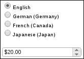
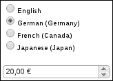
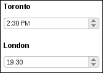
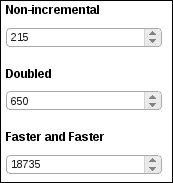
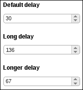
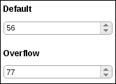

# 九、使用微调器

在本章中，我们将介绍：

*   删除输入焦点大纲
*   为本地文化设置货币格式
*   为本地文化设置时间格式
*   控制值之间的步长
*   指定旋转溢出
*   简化微调器按钮

# 导言

在本章中，我们将使用微调器。**微调器**只不过是文本`input`元素上的装饰。但与此同时，它还有很多。例如，微调器可以帮助将数字格式化为本地文化，我们将在本章中看到。我们还将探讨微调器小部件附带的一些选项，以及如何扩展和改进这些选项。最后，我们将了解一些修改微调器小部件外观的方法。

# 删除输入焦点轮廓

当`input`元素从用户处获得焦点时，大多数浏览器会自动在`input`元素周围应用输入焦点轮廓。当用户点击`input`元素，或点击他们的路径时，元素将获得焦点。spinner 小部件本质上是一个带有装饰的`input`元素。这包括利用 CSS 主题框架中固有的 jQuery 状态类的能力。虽然浏览器的自动对焦行为本身可能在`input`元素上运行良好，但这些对焦环会使微调器看起来有点杂乱。让我们看看如何去除自动聚焦轮廓，同时保持相同的可达性水平。

## 怎么做。。。

我们将为这个示例创建一个简单的`input`元素。下面是 HTML 结构的外观。

```js
<div class="spinner-container">
    <input id="spinner"/>
</div>
```

这里是定制 CSS 与我们的小部件修改一起使用，以删除焦点轮廓。

```js
.ui-spinner-input-no-outline {
    outline: 0;
}
```

最后，这里是我们的 JavaScript 代码，它改变了微调器小部件的定义，并创建了一个没有浏览器应用的自动轮廓的实例。

```js
(function( $, undefined ) {

$.widget( "ab.spinner", $.ui.spinner, {

    options: {        
inputOutline: true    
},

    _create: function() {

        this._super();

        if ( this.options.inputOutline ) {            
return;        
}

        this.element.addClass( "ui-spinner-input-no-outline" );
        this._focusable( this.uiSpinner );

    }
});

})( jQuery );

$(function() {

    $( "#spinner" ).spinner( { inputOutline: false } );

});
```

为了让您更好地了解我们引入的更改，这是我们刚刚创建的微调器小部件在修改微调器定义之前的样子。


在这里，您可以清楚地看到`input`元素具有焦点，但是我们可以不使用双边框，因为它与主题不完全匹配。下面是在引入我们的更改后，处于聚焦状态的同一小部件的修改版本。


我们不再有焦点轮廓，当小部件获得焦点时，它仍然会在视觉上改变其状态。除了现在，我们正在使用 CSS 主题中的状态类更改外观，而不是依赖浏览器来为我们更改外观。

## 它是如何工作的。。。

负责为我们删除大纲的 CSS 类，即`ui-spinner-input-no-outline`类，很容易理解。我们只需将`outline`设置为`0`，这将覆盖默认的浏览器操作方式。我们的 spinner 小部件的自定义扩展知道如何使用这个类。

我们在微调器小部件中添加了一个新的`inputOutline`选项。如果将`input`元素设置为`false`，则此选项将把我们的新 CSS 类应用于该元素。但是，`inputOutline`默认为`true`，因为我们不希望在默认情况下覆盖默认的浏览器功能。此外，我们也不希望在默认情况下覆盖默认的微调器小部件功能。相反，更安全的做法是提供一个选项，在显式设置时更改默认值。在`_create()`方法的实现中，我们调用 spinner 构造函数的原始实现。然后，如果`inputOutline`选项为`true`，则应用`ui-spinner-input-no-outline`类。

同样，您可能已经注意到我们所做的最后一件事情是将`_focusable()`方法应用于`this.uiSpinner`属性。原因是，我们需要弥补失去的可达性；浏览器不再应用大纲，因此当小部件获得焦点时，我们需要应用`ui-state-focus`类。`_focusable()`方法是一个简单的助手，在基本小部件类中定义，因此可用于所有小部件，使传递的元素处理焦点事件。这比处理事件设置和自己拆卸要简单得多。

# 为当地文化格式化货币

可以将微调器小部件与**Globalize**jQuery 库结合使用。全球化库是 JQuery 基金会努力规范 jQuery 项目为不同文化设置数据格式的方法。文化是一组规则，根据文化规范格式化字符串、日期和货币。例如，我们的应用程序应该将德国日期和货币与法国日期和货币区别对待。这就是我们如何将`culture`值传递给微调器小部件的方法。让我们看看如何使用带有微调器小部件的 Globalize 库来根据本地文化格式化货币。

## 怎么做。。。

我们的应用程序在处理多个区域设置时需要做的第一件事是包含`globalize`库。每个区域性都包含在自己的 JavaScript 文件中。

```js
<script src="globalize.js"
  type="text/javascript"></script>
<script src="globalize.culture.de-DE.js"
  type="text/javascript"></script>
<script src="globalize.culture.fr-CA.js"
  type="text/javascript"></script>
<script src="globalize.culture.ja-JP.js"
  type="text/javascript"></script>
```

接下来，我们将定义用于显示区域性选择器（由单选按钮组成）的 HTML 和用于显示货币的微调器小部件。

```js
<div class="culture-container"></div>
<div class="spinner-container">
    <input id="spinner"/>
</div>
```

最后，我们使用 JavaScript 代码填充`culture`选择器，实例化微调器小部件，并将更改事件绑定到区域性选择器。

```js
$(function() {

    var defaultCulture = Globalize.cultures.default;

    $.each( Globalize.cultures, function( i, v ) {

      if ( i === "default" ) {
        return;
      }

       var culture = $( "<div/>" ).appendTo( ".culture-container" );

       $( "<input/>" ).attr( "type", "radio" )
          .attr( "name", "cultures" )
          .attr( "id", v.name )
          .attr( "checked", defaultCulture.name === v.name )
          .appendTo( culture );

       $( "<label/>" ).attr( "for", v.name )
           .text( v.englishName )
           .appendTo( culture );

    });

    $( "#spinner" ).spinner({
        numberFormat: "C",
        step: 5,
        min: 0,
        max: 100,
        culture: $( "input:radio[name='cultures']:checked" )
          .attr( "id" )
    });

    $( "input:radio[name='cultures']" ).on
      ( "change", function( e ) {
        $( "#spinner" ).spinner( "option", "culture",
          $( this ).attr( "id" ) );
    });

});
```

当您第一次在浏览器中查看此 UI 时，您会注意到**英语**是所选的区域性，微调器将相应地格式化货币。



但是，文化的变化会导致微调器小部件中的货币格式发生变化，如前所述。



## 它是如何工作的。。。

一旦 DOM 就绪，我们在 JavaScript 代码中要做的第一件事就是使用`Globalize.cultures`对象填充`culture`选择器。Globalize library 基于可用的文化构建此对象；您会注意到可用的区域性选项与页面中包含的区域性脚本之间存在直接关联。我们将区域性的名称存储为`id`属性，因为这是我们稍后传递给微调器小部件的内容。`Globalize.cultures`对象也有一个默认区域性，我们使用这个值来确定在页面首次加载时选择哪个选项。

我们创建的 spinner 实例使用了一个`numberFormat`选项值`C`。在呈现微调器值时，该字符串实际上会直接传递给`Globalize.format()`函数。接下来的三个选项，`step`、`min`和`max`是任何数字微调器实例的典型选项。我们将`culture`选项设置为所选的默认区域性，告诉微调器小部件如何格式化货币。最后，我们设置了一个事件处理，该事件处理在区域性选择发生变化时触发。此处理程序将更新微调器小部件以使用新选择的区域性。

# 当地文化的格式化时间

spinner 小部件利用 Globalize jQuery 项目；根据当地文化对数据格式进行标准化的努力。微调器小部件利用此库格式化其值。例如，通过指定`numberFormat`和`culture`选项，我们可以使用微调器小部件根据当地文化显示货币值。然而，货币只是我们喜欢在本地设置的一个值；时间是另一回事。我们只能在 spinner 小部件中使用内置的 Globalize 功能来显示时间值。我们需要做更多的工作来扩展小部件，以便正确地考虑时间值。事实上，让我们基于微调器创建我们自己的时间小部件。

## 怎么做。。。

首先，让我们看看创建两个时间窗口小部件所需的标记，在其中我们将显示多伦多时间和伦敦时间。我们在这里没有展示时区计算能力，只是在同一个 UI 中有两种不同的文化。

```js
<div class="spinner-container">
    <h3>Toronto</h3>
    <input id="time-ca" value="2:30 PM"/>
</div>

<div class="spinner-container">
    <h3>London</h3>
    <input id="time-gb" value="7:30 PM"/>
</div>
```

接下来，让我们看看用于定义新时间小部件的 JavaScript，并创建它的两个实例。

```js
( function( $, undefined ) {

$.widget( "ab.time", $.ui.spinner, {

    options: {
        step: 60 * 1000,
        numberFormat: "t"
    },

    _parse: function( value ) {

        var parsed = value;

        if ( typeof value === "string" && value !== "" ) {

            var format = this.options.numberFormat,
                culture = this.options.culture;

            parsed = +Globalize.parseDate( value, format );

            if ( parsed === 0 ) {
                parsed = +Globalize.parseDate( value,
                  format, culture );
            }

        }

        return parsed === "" || isNaN( parsed ) ? null : 
          parsed;

    },

    _format: function( value ) {
        return this._super( new Date( value ) );
    }

});

})( jQuery );

$(function() {

    $( "#time-ca" ).time({
        culture: "en-CA"
    });

    $( "#time-gb" ).time({
        culture: "en-GB"
    });

});
```

查看浏览器中的两次窗口小部件，我们可以看到它们已经按照自己的本地文化进行了格式化。



## 它是如何工作的。。。

让我们首先看看用于定义时间小部件实例的两个输入元素。注意`value`属性，它们都有一个默认时间，使用相同的格式表示。现在，让我们跳到新时间小部件的定义。

在这里您会注意到的第一件事是，我们使用小部件工厂在`ab`名称空间下定义时间小部件。您还会注意到，我们正在扩展微调器小部件。这是因为它本质上是我们在这里构建的一个旋转器，有几个小但重要的区别。这实际上是一个很好的例子，在设计从标准控件集派生的 jQuery To1 ??。UI 小部件自定义时，你必须考虑的一些例子。您应该保留最初的小部件名称（在本例中为 spinner），还是应该将其称为其他名称（在本例中为 time）？有一件事可以帮助你指导这个决定，那就是考虑如何使用这个小部件。例如，我们可以让 spinner 小部件保持原样以显示这些培养的时间值，但这意味着引入新的选项，并可能使使用该小部件的开发人员感到困惑。我们已经决定这里的用例是简单的，我们应该允许时间以尽可能少的选项显示出来。

我们在这里定义的选项并不是新的；`step`和`numberFormat`选项已经由微调器小部件定义，我们只是将它们设置为对时间小部件有意义的默认值。`step`值将相对于`timestamp`值递增，因此我们给它一个默认值，该值将递增 1 秒。`numberFormat`选项指定解析和格式化输出时微调器所需的格式。

我们对微调器的扩展，`_parse()`方法，就是直接使用 Globalize 库解析时间字符串的地方。回想一下，我们的输入具有相同的字符串格式。如果我们试图解析一个格式不可识别的值，这将成为一个问题。因此，我们尝试解析时间值，而不指定该值是什么文化。如果这不起作用，我们将使用附加到此小部件的区域性。这样，我们可以使用一种格式指定初始值，就像我们在这里所做的那样，我们可以动态地更改区域性；一切都会好起来的。我们的`_format()`方法版本很简单，因为我们知道值总是一个时间戳编号，我们所要做的就是将一个新的`Date`对象传递回原始微调器`_format()`方法。

最后，我们有两个 time widget 实例，其中一个传递了`en-CA`文化，另一个传递了`en-GB`。

# 控制数值之间的步长

有几种方法可以控制微调器小部件中的步骤。步骤是微调器小部件用于向上或向下移动其编号的值。例如，您经常会看到递增计数器`cnt ++`的循环代码。在这里，步长为 1，这是微调器步长值的默认值。在微调器中更改此选项非常简单；我们甚至可以在创建小部件后更改此值。

我们还可以采取其他措施来控制微调器的步进行为。让我们来看看增量选项，看看这会如何影响微调器。

## 怎么做。。。

我们将创建三个微调器小部件来演示增量选项的潜力。以下是 HTML 结构：

```js
<div class="spinner-container">
    <h3>Non-incremental</h3>
    <input id="spin1" />
</div>

<div class="spinner-container">
    <h3>Doubled</h3>
    <input id="spin2" />
</div>

<div class="spinner-container">
    <h3>Faster and Faster</h3>
    <input id="spin3" />
</div>
```

下面是用于创建三个 spinner 实例的 JavaScript：

```js
$(function() {

    $( "#spin1" ).spinner({
        step: 5,
        incremental: false
    });

    $( "#spin2" ).spinner({
        step: 10,
        incremental: function( spins ) {
            if ( spins >= 10 ) {
                return 2;
            }
            return 1;
        }
    });

    $( "#spin3" ).spinner({
        step: 15,
        incremental: function( spins ) {
            var multiplier = Math.floor( spins / 100 ),
                limit = Math.pow( 10, 10 );
            if ( multiplier < limit && multiplier > 0 ) {
                return multiplier;
            }
            return 1;
        }
    });

});
```

这三个微调器小部件在浏览器中应该是这样的。



## 它是如何工作的。。。

我们已经创建了三个不同的微调器实例，当用户按下其中一个微调按钮时，它们的行为都不同。`#spin1`微调器的步进值为`5`，始终会将微调器值增加`5`。您可以通过按住微调器按钮来尝试此操作。您会注意到，这将需要很长时间才能获得更大的整数值。

`incremental`选项采用布尔值，正如我们在第一个微调器中看到的，但它也接受`callback`函数。`#spin2`微调器的步长值为`10`，但这将根据传递给增量选项的函数而改变。我们定义的这个`incremental callback`函数通过用户按下旋转按钮后发生的旋转次数传递。我们通常从这里开始，第一个`10`旋转，然后我们通过返回`2`而不是`1`来提高从该点向前的速度。当我们返回`2`时，我们的步长值变为`20`，因为这个函数的返回值是一个乘数。但它只在用户按下旋转按钮时使用；此功能不会永久更改`step`选项。

我们的最后一个微调器实例`#spin3`也使用了`incremental callback`函数。但是，随着用户继续旋转，此函数将使用逐渐增大的值。每旋转一百圈，我们就增加乘数，也增加步长。后一个增量函数很有用，因为微调器值本身变大，我们可以控制步长变化的速度。

## 还有更多。。。

我们刚刚看到了如何控制微调器小部件值的步骤。`step`选项指示给定旋转值在任一方向上移动的距离。当用户按下旋转按钮时，我们可以使用`incremental`选项来计算步长值。这有助于加快或减慢旋转到给定目标值所需的时间。

另一种方法是改变两次旋转之间的实际定时延迟。如果您想在用户按下旋转按钮时减慢旋转速度，这可能很方便。让我们看一个例子，我们将如何改变自旋延迟。以下是 HTML 结构：

```js
<div class="spinner-container">
    <h3>Default delay</h3>
    <input id="spin1" />
</div>

<div class="spinner-container">
    <h3>Long delay</h3>
    <input id="spin2" />
</div>

<div class="spinner-container">
    <h3>Longer delay</h3>
    <input id="spin3" />
</div>
```

这里是自定义微调器小部件定义，以及三个使用不同微调值的实例。

```js
( function( $, undefined ) {

$.widget( "ab.spinner", $.ui.spinner, {

    options: {
        spinDelay: 40
    },

    _repeat: function( i, steps, event ) {

        var spinDelay = this.options.spinDelay;

        i = i || 500;

        clearTimeout( this.timer );
        this.timer = this._delay(function() {
            this._repeat( spinDelay, steps, event );
        }, i );

        this._spin( steps * this.options.step, event );

     }

});

})( jQuery );

$(function() {

    $( "#spin1" ).spinner();

    $( "#spin2" ).spinner({
        spinDelay: 80
    });

    $( "#spin3" ).spinner({
        spinDelay: 120
    });

});
```

您可以在浏览器中尝试这些微调器中的每一个，并观察旋转延迟中的对比度。



我们添加到微调器小部件的新的`spinDelay`选项允许我们以毫秒为单位指定延迟。为了实际使用这个选项，我们必须对一个核心微调器小部件方法进行一些修改。当用户按下微调器按钮时，小部件内部使用`_repeat()`方法。它实际上使用很少的代码做了相当多的工作。基本上，目标是一遍又一遍地重复给定的事件，直到用户抬起按钮，旋转应该停止。但是，我们不能在没有某种延迟的情况下直接调用`_spin()`和，否则每次文本输入被更新为新值时，用户只会看到模糊。因此，微调器使用`_delay()`方法来达到这个确切的目的。`_delay()`方法为过去的函数设置延迟执行，在`base widget`类中定义；所有小部件都可以访问`_delay()`。

我们的`_repeat()`方法版本与原始方法几乎相同，只是我们没有对旋转之间的延迟进行硬编码；我们现在从`spinDelay`选项中得到了这一点。

# 指定旋转溢出

spinner 小部件将让用户无限期地旋转。当达到 JavaScript 整数限制时，它甚至会将显示更改为使用指数表示法，这很好。几乎没有应用程序需要担心这些限制。事实上，最好设置一些对应用程序有实际意义的限制。即，指定`min`边界和`max`边界。

这工作得很好，但如果我们在处理溢出的微调器中插入一些逻辑，当用户想要超出边界时，它可能会工作得更好。我们不是像默认行为那样停止旋转，而是从相反的边界向同一方向发送它们。绘制这些约束的最佳方法是默认情况下，微调器“最小-最大”边界类似于一条直线。我们想让它看起来更像一个圆。

## 怎么做。。。

我们将有两个微调器小部件，第一个使用默认的边界约束逻辑，第二个使用我们自己自定义的行为。以下是用于创建两个小部件的 HTML 结构：

```js
<div class="spinner-container">
    <h3>Default</h3>
    <input id="spin1" />
</div>

<div class="spinner-container">
    <h3>Overflow</h3>
    <input id="spin2" />
</div>
```

下面是加载文档时用于实例化两个微调器的 JavaScript：

```js
$(function() {

    $( "#spin1" ).spinner({
        min: 1,
        max: 100
    });

    $( "#spin2" ).spinner({
        minOverflow: 1,
        maxOverflow: 100,
        spin: function( e, ui ) {

            var value = ui.value,
              minOverflow = $( this ).spinner
                ( "option", "minOverflow" ),
                  maxOverflow = $( this ).spinner
                    ( "option", "maxOverflow" );

            if ( value > maxOverflow ) {
                $( this ).spinner( "value", minOverflow );
                return false;
            }
            else if ( value < minOverflow ) {
                $( this ).spinner( "value", maxOverflow );
                return false;
            }

        }
    });

});
```

以下是浏览器中的两个小部件。您将看到，后一个微调器处理边界溢出的方式与默认实现不同。



## 它是如何工作的。。。

当`#spin1`旋转器到达`1`或`100`任一边界时，旋转将停止。另一方面，`#spin2`微调器将在另一端拾取。您会注意到，我们在这里传递了两个非标准微调器选项；`minOverflow`和`maxOverflow`。这些实际上并不像`min`和`max`那样约束微调器的边界。添加这些新选项是我们有意的，因为我们不想触发常规约束逻辑。

我们提供给这个小部件的`spin`回调函数在每次旋转时都会被调用。如果我们使用传统的旋转`min`和`max`选项，我们永远不会知道我们是否遇到溢出，因为`min`将小于`1`，而`max`将永远不会大于`100`。因此，我们使用新选项根据方向重定向值。如果该值高于`100`，则我们将该值设置回`minOverflow`。或者，如果该值已低于`1`，则我们将该值设置为`maxOverflow`。

## 还有更多。。。

您可能会认为溢出行为（我们将用户带到微调器边界的另一侧）并不完全是您想要的。一旦到达边界，您可能只想停止旋转。但是，我们仍然可以通过在到达该方向的边界后禁用微调器按钮来改进小部件。这只是 spinner 溢出的一种不同方法，我们只是向用户提供更好的反馈，而不是像前面那样改变业务逻辑。让我们来看看我们如何才能做出改变。以下是用于简单微调器小部件的 HTML 结构：

```js
<div class="spinner-container">
    <input id="spin" value=10 />
</div>
```

下面是我们的 JavaScript，用于在页面加载后创建小部件。

```js
$(function() {

    $( "#spin" ).spinner({
        min: 1,
        max: 100,
        spin: function( e, ui ) {
            var value = ui.value,
                buttons = $( this ).data( "uiSpinner" ).buttons,
                min = $( this ).spinner( "option", "min" ),
                max = $( this ).spinner( "option", "max" );

            if ( value === max ) {
                buttons.filter( ".ui-spinner-up:not
                  (.ui-state-disabled)" )
                       .button( "disable" );
            }
            else if ( value === min ) {
                buttons.filter( ".ui-spinner-down:not
                  (.ui-state-disabled)" )
                       .button( "disable" );
            }
            else {
                buttons.filter( ".ui-state-disabled" )
                .button( "enable" );
            }
        }
    });

});
```

当您开始在浏览器中与这个小部件交互时，您会注意到当您点击`min`选项值时，在本例中为`1`，向下微调器按钮被禁用。


同样，当您点击`max`时，这里是`100`，上旋器按钮被禁用。


我们通过向构造函数传递一个`spin`回调函数来引入这种新的微调器行为，该函数在每次微调时执行。在这个回调中，我们在`buttons`变量中创建了对两个微调器按钮的引用。然后我们检查是否已达到`max`值，或者是否已达到`min`值。然后我们禁用相应的按钮。如果我们在`min`和`max`之间，那么我们只需启用按钮。您还将注意到，这里涉及到一些额外的过滤；`not(.ui-state-disabled)`和`.ui-state-disabled`。这是必要的，因为微调器小部件触发旋转事件的方式。禁用按钮会触发旋转，导致无限循环。因此，我们必须注意只禁用那些尚未禁用的按钮。

# 简化微调器按钮

spinner 小部件中实现的默认旋转按钮可能有点多，具体取决于上下文。例如，您可以清楚地看到，这些是作为子组件添加到滑块的按钮小部件。当我们用更小的小部件构建更大的小部件时，这种方法非常有效。这更符合审美偏好。如果单个上下旋转按钮没有悬停状态，也没有背景或边框，那么旋转器的外观可能会更好。让我们尝试将这些样式属性从滑块中的按钮中移除，使它们看起来更紧密地集成在一起。

## 怎么做。。。

这里是基本的 HTML 结构，用作我们的 To.?? 小部件的基础：

```js
<div class="spinner-container">
    <input id="spin" />
</div>
```

下面是我们将用来删除我们不再感兴趣的按钮样式的 CSS：

```js
.ui-spinner-basic > a.ui-button {
    border: none;
    background: none;
    cursor: pointer;
}
```

`input`元素还不是小部件，我们创建的新 CSS 类还不是 spinner 小部件的一部分。下面是 JavaScript 代码执行这两项操作的方式，如下所示：

```js
 (function( $, undefined ) {

$.widget( "ab.spinner", $.ui.spinner, {

    options: {
        basic: false
    },

    _create: function() {

        this._super();

        if ( this.options.basic ) {
            this.uiSpinner.addClass( "ui-spinner-basic" );
        }

    }

});

})( jQuery );

$(function() {

    $( "#spin" ).spinner({
        basic: true
    });

});
```

如果查看我们在浏览器中创建的微调器，您会注意到微调器按钮的边框和背景已被去除。它现在看起来更像一个完整的小部件。您还将注意到，当用户将鼠标悬停在任一按钮上时，鼠标光标使用指针图标，这有助于指示它们是可点击的。


## 它是如何工作的。。。

我们刚刚创建的新 CSS 类`ui-spinner-basic`通过覆盖微调器上下文中的按钮小部件样式来工作。具体来说，我们将从两个按钮小部件中删除`border`和`background`。此外，我们将`cursor`属性设置为`pointer`，以便给用户箭头可点击的印象。我们还稍微定制了微调器小部件本身的定义。我们添加了一个新的`basic`选项，当`true`出现时，该选项将把新的`ui-spinner-basic`类应用于小部件。当小部件被销毁时，我们不需要显式删除这个类，因为它被添加到由 spinner 小部件创建的元素中。这个元素由基本微调器实现自动删除，因此我们的代码不必担心它。