# 十、使用选项卡

在本章中，我们将介绍：

*   使用远程选项卡内容
*   给选项卡一个图标
*   简化选项卡主题
*   使用选项卡作为 URL 导航链接
*   在选项卡转换之间创建效果
*   使用可排序交互对选项卡进行排序
*   使用 href 设置活动选项卡

# 导言

**选项卡**小部件是一个容器，用于组织页面上的内容。这是一种整合页面内容的好方法，因此只显示相关项目。用户有一个简单的导航机制来激活内容。tabs 小部件可以应用于更大的导航上下文中，其中 tabs 小部件是页面的主要顶级容器元素。它还可以作为特定页面元素的较小组件，用于简单地拆分两部分内容。

最新 jqueryui 版本中的 tabs 小部件为开发人员提供了一组内聚的选项来调整小部件的行为。我们将研究如何组合这些选项，以及如何最大限度地利用 tabs 小部件的导航部分。我们还将探讨如何将效果应用于选项卡转换，以及如何为用户对选项卡进行排序。

# 使用远程选项卡内容

tabs 小部件知道如何用开箱即用的远程内容填充给定的选项卡面板。这一切都是关于我们如何指定选项卡链接。例如，指向`#tab-content-home`的`href`属性将使用在该元素中找到的 HTML 加载内容。但是，如果我们不指向已经存在的元素，而是指向另一个页面，那么 tabs 小部件将根据需要将内容加载到相应的面板中。

这在不将选项传递给选项卡的情况下可以正常工作，但是如果我们想以任何方式调整 Ajax 请求的行为，则有`beforeLoad`选项。让我们来看看使用 Tabs 小部件可以处理远程内容的一些方法。

## 怎么做。。。

首先，我们将为 tabs 小部件创建 HTML，它由四个链接组成。前三个指向现有的资源，而第四个不存在，因此 Ajax 请求将失败。

```js
<div id="tabs">
    <ul>
        <li><a href="ajax/tab1.html">Tab 1</a></li>
        <li><a href="ajax/tab2.html">Tab 2</a></li>
        <li><a href="ajax/tab3.html">Tab 3</a></li>
        <li><a href="doesnotexist.html">Tab 4</a></li>
    </ul>
</div>
```

接下来，我们将使用 JavaScript 创建 tabs 小部件实例，并指定一些自定义行为来更改 Ajax 请求。

```js
$(function() {

    function tabLoad( e, ui ) {

        if ( ui.panel.html() !== "" ) {

            ui.jqXHR.abort();

        }
        else {

            ui.jqXHR.error(function( data ) {

                $( "<p/>" ).addClass( "ui-corner-all ui-state-error" )
                           .css( "padding", "4px" )
                           .text( data.statusText )
                           .appendTo( ui.panel );
            });

        }

    }

    $( "#tabs" ).tabs({
        beforeLoad: tabLoad
    });

});
```

为了查看本演示中实现的 Ajax 行为，您需要在其前面放置一个 web 服务器。最简单的方法是安装 Python 并从目录运行`python -m SimpleHTTPServer`，其中包含主 HTML 文件以及 Ajax 内容文件`tab1.html`、`tab2.html`和`tab3.html`。下面是 tab1.html 文件的一个示例：

```js
<!doctype html>
<html lang="en">
    <body>
        <h1>Tab 1</h1>
        <p>Tab 1 content</p>
    </body>
</html>
```

在浏览器中加载此选项卡小部件时，默认情况下会选择第一个选项卡。因此，小部件将执行 Ajax 请求，立即加载第一个选项卡的内容。您应该看到如下内容：

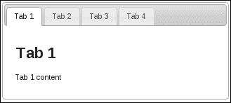

切换到第二个和第三个选项卡将执行获取内容所需的 Ajax 请求。另一方面，第四个选项卡将导致错误，因为链接的资源不存在。我们添加到 Ajax 请求中的自定义行为显示错误消息，而不是在该面板中显示内容。

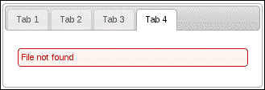

关于这个例子，最后要注意的是我们对 Ajax 请求的另一个修改。如果您要重新访问第一个选项卡，我们不会发送另一个 Ajax 请求，因为我们已经有了面板内容。

## 它是如何工作的。。。

文档加载完成后，我们将从`#tabs`div 创建一个 tabs 小部件。我们正在传递前面定义的`beforeLoad`回调函数`tabLoad()`。`tabLoad`函数在 Ajax 请求获取调度的选项卡面板内容之前被调用。这使我们有机会更新`jqXHR`对象的状态。

### 提示

`$.ajax()`返回的`jqXHR`对象是 JavaScript 中的原生`XMLHTTPRequest`类型的扩展。开发人员很少与这个对象交互，但偶尔也会出现这种需求，正如我们在这里看到的。

在本例中，我们要检查的第一件事是选项卡面板中是否包含任何内容。`ui.panel`对象表示动态 Ajax 内容最终到达的`div`元素。如果是空字符串，则继续加载内容。另一方面，如果已经有内容，我们将中止请求。如果服务器不生成动态内容，而我们只是使用 tabs 小部件的这个特性作为结构组合的一种方式，那么这将非常有用。当我们已经拥有相同的内容时，一遍又一遍地请求它是没有意义的。

我们还将行为附加到在 Ajax 请求失败时执行的`jqXHR`对象。我们使用`ui-state-error`和`ui-corner-all`类格式化后，使用服务器返回的状态文本更新选项卡内容。

## 还有更多。。。

前面的示例获取从远程资源检索到的 HTML，并将其放在选项卡面板中。但是现在我们已经确定选项卡内容中的`h1`标记是多余的，因为活动选项卡也有相同的用途。我们可以直接从用于构建选项卡内容的远程资源中取出标记，但如果我们在应用程序的其他地方使用该资源，则可能会出现问题。相反，我们可以在用户使用 load 事件实际看到选项卡内容之前更改选项卡内容。以下是 tabs 小部件实例的修改版本：

```js
$(function() {

    function beforeLoad( e, ui ) {

        ui.jqXHR.error(function( data ) {

            ui.panel.empty();

            $( "<p/>" ).addClass( "ui-corner-all ui-state-error" )
                       .css( "padding", "4px" )
                       .text( data.statusText )
                       .appendTo( ui.panel );
        });

    }

    function afterLoad( e, ui ) {
        $( "h1", ui.panel ).remove();
    }

    $( "#tabs" ).tabs({
        beforeLoad: beforeLoad,
        load: afterLoad
    });

});
```

现在查看它，您将看到选项卡面板中不再有标题。我们传递给构造函数中选项卡的`load`回调将查找并删除任何`h1`标记。`load`事件在 Ajax 调用返回并将内容插入面板后触发。我们不需要担心代码运行后出现的`h1`标记。

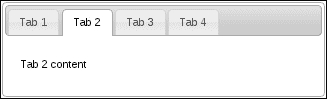

# 给选项卡一个图标

tabs 小部件使用锚元素，单击锚元素时，激活各种选项卡面板以显示其内容。这个锚元素默认只显示文本，这在绝大多数情况下已经足够好了。但是，在其他情况下，选项卡链接本身也会受益于图标。例如，房屋图标有助于在实际激活面板内容之前快速提示面板内容。让我们看看如何扩展选项卡的功能，以支持同时使用图标和文本作为选项卡按钮。

## 怎么做。。。

我们将创建一个基本的`tabs`div 来支持我们的小部件，如下所示：

```js
<div id="tabs">
    <ul>
        <li data-icon="ui-icon-home">
            <a href="#home">Home</a>
        </li>
        <li data-icon="ui-icon-search">
            <a href="#search">Search</a>
        </li>
        <li data-icon="ui-icon-wrench">
            <a href="#settings">Settings</a>
        </li>
    </ul>
    <div id="home">
        <p>Home panel...</p>
    </div>
    <div id="search">
        <p>Search panel...</p>
    </div>
    <div id="settings">
        <p>Settings panel...</p>
    </div>
</div>
```

接下来，我们有了我们的 JavaScript，包括对 tabs 小部件的扩展，该小部件了解如何利用标记中包含的`new data-icon`属性。

```js
(function( $, undefined ) {

$.widget( "ab.tabs", $.ui.tabs, {

    _processTabs: function() {

        this._super();

        var iconTabs = this.tablist.find( "> li[data-icon]" );

        iconTabs.each( function( i, v ) {

            var $tab = $( v ),
                iconClass = $tab.attr( "data-icon" ),
                iconClasses = "ui-icon " +
                              iconClass + 
                              " ui-tabs-icon",
                $icon = $( "<span/>" ).addClass( iconClasses ),
                $anchor = $tab.find( "> a.ui-tabs-anchor" ),
                $text = $( "<span/>" ).text( $anchor.text() );

            $anchor.empty()
                   .append( $icon )
                   .append( $text );

        });
    },

    _destroy: function() {

        var iconTabs = this.tablist.find( "> li[data-icon]" );

        iconTabs.each( function( i, v ) {

            var $anchor = $( v ).find( "> a.ui-tabs-anchor" ),
                text = $anchor.find( "> span:not(.ui-icon)" )
                              .text();

            $anchor.empty().text( text );

        });

        this._super();

    }

});

})( jQuery );

$(function() {

    $( "#tabs" ).tabs();

});
```

如果您在浏览器中查看这个 tabs 小部件，您会注意到每个 tab 按钮现在在按钮文本的左侧都有一个图标。

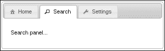

## 它是如何工作的。。。

tabs 小部件定制的有趣之处在于，我们通过表示 tab 按钮的`li`元素传递数据。由于任何给定的 tabs 小部件实例都可能有任意数量的选项卡，因此很难指定哪个选项卡通过`options`对象获得哪个图标。相反，我们只是通过使用数据属性`data-icon`来传输这些选项。该值是我们希望从主题框架中使用的图标类。

我们实现的更改实际上可以在标记本身中手动完成，因为我们只是向小部件添加新元素和新类。但是，这种思维方式存在两个问题。首先，有许多手动注入的标记可以基于一个数据属性的值生成，这违反了 DRY 原则，特别是如果您在多个选项卡小部件中遵循此模式。其次，我们将引入默认小部件实现不知道的新标记。结果可能很好，但当事情按照预期停止工作时，这可能很难诊断。因此，我们最好扩展 tabs 小部件。

我们覆盖的`_processTabs()`方法将迭代每个具有`data-icon`属性的`li`元素，因为这些是我们需要操作的元素。`data-icon`属性存储主题框架中使用的图标类别。我们构造了一个`span`元素，该元素将`ui-icon`类与特定的图标类结合使用。它还获得了新的`ui-tabs-icon`类，该类将元素正确定位在链接中。然后我们抓取 tab 按钮的原始文本，并将其包装在`div`中。原因是，插入图标`span`后再插入文本`span`更容易。

# 简化选项卡主题

有时，我们的 tabs 小部件的上下文具有重要的主题含义。当小部件接近文档顶部时，选项卡小部件的默认可视组件工作得最好，也就是说，大部分页面内容嵌套在选项卡面板中。相比之下，可能存在一些预先存在的页面元素，它们可以从由 tabs 小部件组织中获益。这就是挑战所在，将顶级小部件（如 tabs）塞进一个较小的块中最多只能看起来很尴尬，除非我们能找到一种方法从 tabs 中去除一些不必要的主题组件。

## 怎么做。。。

首先，让我们自己创建一些标记来作为 tabs 小部件的基础。它应该如下所示：

```js
<div id="tabs-container">
    <div id="tabs">
        <ul>
            <li><a href="#tab1">Tab 1</a></li>
            <li><a href="#tab2">Tab 2</a></li>
            <li><a href="#tab3">Tab 3</a></li>
        </ul>
        <div id="tab1">
            <h3>Tab 1...</h3>
            <ul>
                <li>Item 1</li>
                <li>Item 2</li>
                <li>Item 3</li>
            </ul>
        </div>
        <div id="tab2">
            <h3>Tab 2...</h3>
            <ul>
                <li>Item 4</li>
                <li>Item 5</li>
                <li>Item 6</li>
            </ul>
        </div>
        <div id="tab3">
            <h3>Tab 3...</h3>
            <ul>
                <li>Item 7</li>
                <li>Item 8</li>
                <li>Item 9</li>
            </ul>
        </div>
    </div>
</div>
```

接下来，我们将定义 tabs 小部件和 tabs 小部件容器使用的一些 CSS。

```js
div.ui-tabs-basic {
    border: none;
    background: none;
}

div.ui-tabs-basic > ul.ui-tabs-nav {
    background: none;
    border-left: none;
    border-top: none;
    border-right: none;
}

#tabs-container {
    width: 22%;
    background: #f7f7f7;
    padding: 0.9em;
}
```

接下来是我们的 JavaScript 代码，在文档准备好后创建 tabs 小部件。

```js
$(function() {

    $( "#tabs" ).tabs({
        create: function( e, ui ) {
            $( this ).addClass( "ui-tabs-basic" )
                     .find( "> ul.ui-tabs-nav" )
                     .removeClass( "ui-corner-all" );
        }
    });

});
```

## 它是如何工作的。。。

我们传递给 tabs 构造函数的`create`函数在小部件创建后被触发。这就是我们添加自定义类`ui-tabs-basic`的地方，它用于覆盖`background`和`border`设置。这些是我们希望删除的组件，因此我们将它们设置为`none`。我们还从 tabs 导航部分删除了`ui-corner-all`类，因为我们保留了底部边框，而离开这个类看起来不太正确。

正常创建这个小部件，也就是说，没有通过我们的`create`函数，tabs 小部件看起来像这样：

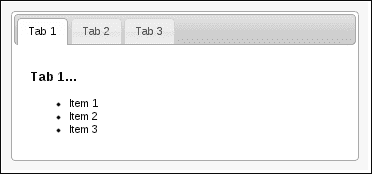

正如您所看到的，tabs 小部件似乎是在未经深思熟虑的情况下被塞进`#tabs-container`元素的。在引入我们的简化之后，选项卡在其新上下文中呈现出更自然的外观。

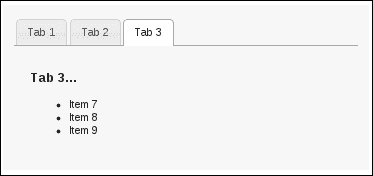

## 还有更多。。。

如果您在整个 UI 的多个地方使用这个精简版的 tabs 小部件，那么多次定义函数回调以传递给 tabs 构造函数可能会很麻烦。您可以定义回调函数一次，并在构造函数中传递对它的引用，但之后回调函数仍处于打开状态。从设计角度来看，我们可能希望将此行为封装在 tabs 小部件中，并通过小部件选项将其公开给外部世界。下面是对示例的一个修改：

```js
(function( $, undefined ) {

$.widget( "ab.tabs", $.ui.tabs, {

    options: {
        basic: false
    },

    _create: function() {

        this._super();

        if ( !this.options.basic ) {
            return;
        }

        $( this.element ).addClass( "ui-tabs-basic" )
                         .find( "> ul.ui-tabs-nav" )
                         .removeClass( "ui-corner-all" );

    }

});

})( jQuery );

$(function() {

    $( "#tabs" ).tabs({
        basic: true
    });

});
```

在这里，我们已经将之前回调中的功能移到了 tabs 构造函数中，但是只有当`basic`选项设置为`true`并且默认为`false`时，才会执行该功能。

# 使用选项卡作为 URL 导航链接

tabs 小部件不限于使用预加载的 div 元素或通过进行 Ajax 调用来填充选项卡面板。一些应用程序已经构建了许多组件，并显示了大量内容。如果您正在更新一个站点或类似的应用程序，那么 tabs 小部件可能会作为导航的主要形式，特别是当您已经在使用 jQuery UI 小部件时。然后，我们需要的是一些通用的东西，可以应用到每个页面，而不需要开发人员使用小部件付出太多的努力。虽然 tabs 小部件不是为这样的目的而设计的，但我们不会让它阻止我们，因为只要稍加调整，我们就可以创建一个通用组件，提供我们所需要的。

## 怎么做。。。

我们首先要看的是应用程序中某个页面上的内容。HTML 定义了 tabs 小部件结构和活动选项卡下显示的内容。

```js
<div id="nav">
    <ul>
        <li>
            <a href="tab1.html">Tab 1</a>
        </li>
        <li>
            <a href="tab2.html">Tab 2</a>
        </li>
        <li>
            <a href="tab3.html">Tab 3</a>
        </li>
    </ul>
    <div>
        <p>Tab 1 content...</p>
    </div>
</div>
```

您会注意到，这个应用程序中有三个页面，每个页面都使用相同的小部件 HTML 结构；唯一的区别是选项卡内容段落。接下来，我们将定义新的导航小部件并在页面上创建它。应用程序的每个页面都包含相同的 JavaScript 代码。

```js
(function( $, undefined ) {

$.widget( "ab.nav", $.ui.tabs, {

    _initialActive: function() {

        var path = location.pathname,
            path = path.substring( path.search( /[^\/]+$/ ) ),
            tabs = this.tabs,
            $active = tabs.find( "> a[href$='" + path + "']" );

        return tabs.find( "a" )
                   .index( $active );

    },

    _eventHandler: function( event ) {

        window.open( $( event.target ).attr( "href" ), "_self" );

    },

    _createPanel: function( id ) {

        var panel = this.element.find( "> div:first" );

        if ( !panel.hasClass( "ui-tabs-panel" ) ) {
            panel.data( "ui-tabs-destroy", true )
                 .addClass( "ui-tabs-panel " +
                            "ui-widget-content " +
                            "ui-corner-bottom" );

        }

        return panel;

    },

    _getPanelForTab: function( tab ) {

        return this.element.find( "> div:first" );

    },

    load: $.noop

});

})( jQuery );

$(function() {

    $( "#nav" ).nav();

});
```

现在，当您与这个导航小部件交互时，您将看到每次激活一个新选项卡时，浏览器将重新加载页面，指向选项卡的`href`；例如，`tab3.html`。

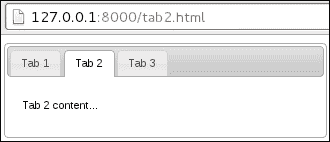

## 它是如何工作的。。。

在讨论我们创建的新的`nav`小部件之前，让我们先看看 HTML 结构。首先要注意的是，我们在这里提供的 HTML 结构与 tabs 小部件所期望的不同。我们有一个`div`元素，它包含页面的主要内容，并且没有 ID，因此任何选项卡链接都无法引用它。不过不用担心，这是故意的。`nav`小部件是为具有多个页面的站点或应用程序而设计的，我们不会在此小部件中嵌入多个选项卡窗格内容。通过对小部件使用的 HTML 的这种结构更改，我们最好创建一个全新的小部件，而不仅仅是扩展 tabs 小部件。这种方法将避免关于 tabs 小部件的 HTML 结构应该是什么样子的混淆。

我们的`nav`小部件基于 tabs 小部件，其目标是激活适当的 tab 并将`div`元素呈现为所选的 tab 面板。单击选项卡链接时，我们不执行任何常规的选项卡活动，只需遵循`href`。

在`nav`小部件的定义中，我们覆盖的所有方法都来自 tabs 小部件，在大多数情况下，我们正在替换不需要的 tabs 功能。第一种方法是`_initialActive()`，它确定小部件首次创建时的活动选项卡。在这里，我们将根据 location 对象中的路径来进行决策。我们将其与选项卡的`href`属性进行比较。接下来是`_eventHandler()`方法。当用户激活选项卡时调用此方法。在这里，我们只是执行与默认浏览器链接相同的操作，并遵循选项卡链接的`href`属性。当我们在`_eventHandler()`方法中执行此操作时，用于切换选项卡的`keypress`事件仍将按预期工作。接下来，当 tabs 小部件需要创建和插入选项卡面板时，调用`_createPanel()`方法。tabs 小部件调用此方法的原因是在进行 Ajax 调用时需要一个面板。由于我们在`nav`小部件中没有进行任何 Ajax 调用，因此此方法现在将使用包含页面内容的默认`div`。我们对内容`div`所做的唯一更改是添加适当的选项卡面板 CSS 类。最后，我们有`_getPanelForTab()`方法返回我们的内容`div`，这是这个小部件唯一重要的方法，`load()`方法是`$.noop`。这可以防止小部件在首次创建小部件时尝试加载 Ajax 内容。

# 在选项卡转换之间创建效果

tabs 小部件允许开发人员在选项卡之间转换时指定要运行的效果。具体来说，我们可以告诉 tabs 小部件在显示选项卡时运行特定效果，在隐藏选项卡时运行另一种效果。当用户单击选项卡时，这两种效果（如果指定）都将运行。首先是隐藏效果，然后是显示效果。让我们看看如何将这两个选项卡选项结合起来，以增强控件的交互性。

## 怎么做。。。

首先，我们将创建构建 tabs 小部件所需的 HTML 结构。它应该按照以下内容进行查看，生成三个选项卡：

```js
<div id="tabs">
    <ul>
        <li><a href="#tab1">Tab 1</a></li>
        <li><a href="#tab2">Tab 2</a></li>
        <li><a href="#tab3">Tab 3</a></li>
    </ul>
    <div id="tab1">
        <p>Tab 1 content...</p>
        <button>Tab 1 Button</button>
    </div>
    <div id="tab2">
        <p>Tab 2 content...</p>
        <strong>Tab 2 bold text</strong>
    </div>
    <div id="tab3">
        <p>Tab 3 content...</p>
        <p>...and more content</p>
    </div>
</div>
```

接下来，下面的 JavaScript 代码实例化 tabs 小部件，并将`show`和`hide`效果选项传递给小部件构造函数。

```js
$(function() {

    $( "#tabs" ).tabs({
        show: {
            effect: "slide",
            direction: "left"
        },
        hide: {
            effect: "drop",
            direction: "right"
        }
    });

});
```

## 它是如何工作的。。。

在浏览器中查看此选项卡小部件并单击选项卡时，您会注意到当前选项卡的内容如何向右滑动，同时淡出。一旦该效果完成执行，现在处于活动状态的选项卡的`show`效果就会运行，在这种情况下，将内容从左侧滑入。当这两种效果结合在一起时，它们会产生一种新内容将旧内容推出面板的错觉。

我们在这里选择的两种效果实际上非常相似。`drop`效应实际上就是`slide`效应，在滑动时增加了衰落。他们合作的关键是我们传递给每个`effect`对象的`direction`属性。我们已经告诉`hide`效应在运行时向右移动。同样，我们已经告诉`show`效应从左边进入。

# 使用可排序交互对选项卡进行排序

当我们在 AutoT0UR 用户界面中实现选项卡时，我们可以简单地考虑选项卡的默认排序。显然，我们希望用户能够以最合理的顺序访问最相关的选项卡。但我们很少能以一种让每个人都快乐的方式做到这一点。那么，为什么不让用户以他们认为合适的方式排列选项卡呢？让我们看看是否可以通过在 tabs 小部件中提供此功能来招募 sortable 交互小部件以获得一些帮助。

## 怎么做。。。

我们将使用以下内容作为驱动 tabs 实例的示例 HTML：

```js
<div id="tabs">
    <ul>
        <li><a href="#tab1">Tab 1</a></li>
        <li><a href="#tab2">Tab 2</a></li>
        <li><a href="#tab3">Tab 3</a></li>
    </ul>
    <div id="tab1">
        <p>Tab 1 content...</p>
    </div>
    <div id="tab2">
        <p>Tab 2 content...</p>
    </div>
    <div id="tab3">
        <p>Tab 3 content...</p>
    </div>
</div>
```

接下来，我们将在 tabs 小部件中实现新的`sortable`选项。我们还需要扩展小部件的行为，以利用这个新选项。

```js
(function( $, undefined ) {

$.widget( "ab.tabs", $.ui.tabs, {

    options: {
        sortable: false
    },

    _create: function() {

        this._super();

        if ( !this.options.sortable ) {
            return;
        }

        this.tablist.sortable({
            axis: "x",
            stop: $.proxy( this, "_stopped" )
        });

    },

    _destroy: function() {

        if ( this.options.sortable ) {
            this.tablist.sortable( "destroy" );
        }

        this._super();

    },

    _stopped: function( e, ui ) {
        this.refresh();
    }

});

})( jQuery );

$(function() {

    $( "#tabs" ).tabs({
        sortable: true
    });

});
```

现在，当您沿 x 轴拖动选项卡按钮时，拖放它们将重新排列它们的顺序。例如，拖动第一个选项卡的外观如下所示：

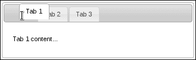

如果我们在端放下第一个选项卡，激活**选项卡 2**，现在第一个选项卡，您应该会看到这样的内容：

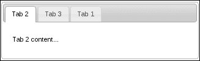

## 它是如何工作的。。。

我们在 tabs 小部件中添加了一个新选项`sortable`，如果为 true，它将使用可排序交互小部件来启用选项卡按钮的可排序行为。我们通过在`options`对象中将默认`sortable`值设置为`false`添加了此选项。此对象将与默认选项卡选项合并。在`_create()`方法中，tabs 构造器，我们调用原始的 tabs 小部件构造器，因为默认小部件构造不需要任何特殊的操作。接下来，仍然在`_create()`中，我们检查`sortable`选项是否为`true`，如果是，则创建可排序的小部件。我们用来创建可排序小部件的`tablist`属性是保存选项卡按钮的`ul`元素。这就是为什么我们把它叫做这里，我们希望它的子元素可以沿着 x 轴排序。

我们还将可排序小部件的`stop`选项传递给回调函数，在本例中，是`_stopped()`方法的代理。这是在使用`$.proxy()`实用程序，这样我们就可以实现`_stopped()`，就好像它是制表符的常规方法一样。注意在`_stopped()`实现中，这是小部件实例，而如果没有代理，这将是`ul`元素。

最后，这里重写了`_destroy()`方法，以确保可排序小部件被销毁。如果不这样做，我们就无法可靠地销毁和重新创建 tabs 小部件。

## 还有更多。。。

当`sortable`选项设置为`true`时，我们可以进一步增强 tabs 小部件的用户交互。首先，让我们在用户拖动选项卡时修改`cursor`，以便使用标准移动图标。接下来，我们将激活丢弃的选项卡。这是我们修改光标所需的 CSS；我们将保持以前的 HTML 结构不变：

```js
.ui-tabs .ui-tabs-nav li.ui-tab-move > a {
    cursor: move;
}
```

下面是修改后的 JavaScript：

```js
(function( $, undefined ) {

$.widget( "ab.tabs", $.ui.tabs, {

    options: {
        sortable: false
    },

    _create: function() {

        this._super();

        if ( !this.options.sortable ) {
            return;
        }

        this.tablist.sortable({
            axis: "x",
            start: $.proxy( this, "_started" ),
            stop: $.proxy( this, "_stopped" )
        });

    },

    _destroy: function() {

        if ( this.options.sortable ) {
            this.tablist.sortable( "destroy" );
        }

        this._super();

    },

    _started: function( e, ui ) {
        ui.item.addClass( "ui-tab-move" );
    },

    _stopped: function( e, ui ) {

        ui.item.removeClass( "ui-tab-move" );
        this.refresh();
        this._activate( ui.item.index() );

    }

});

})( jQuery );

$(function() {

    $( "#tabs" ).tabs({
        sortable: true
    });

});
```

现在，当您对这些选项卡进行排序时，您会注意到新光标如下图所示。`ui-tab-move`类定义`cursor`CSS 属性，该类被添加到可排序小部件的`start`事件处理程序中的`li`元素中。随后在处理程序中将其移除。您还将注意到，当该选项卡被删除时，该选项卡被激活。这是通过获取`li`元素的索引并将其传递给`activate()`方法来完成的。

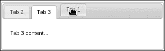

# 使用 href 设置活动选项卡

tabs 小部件允许开发人员以编程方式设置活动选项卡。这可以通过将基于零的索引值传递给`active`选项来实现。这个选项可以在 tabs 构造函数中设置，它告诉小部件默认激活哪个选项卡，也可以在之后设置，可能会更改活动选项卡。使用此选项更改活动选项卡与用户单击选项卡按钮激活面板基本相同。但是，我们可以通过允许开发人员使用 tabs 小部件传递一个`href`值而不是索引来改进这个接口。这样，您就不必记住选项卡的顺序，即哪个数字表示哪个链接，等等。

## 怎么做。。。

让我们先将这个演示中使用的 HTML 设置为选项卡小部件的基础。

```js
<div id="tabs">
    <ul>
        <li><a href="#tab1">Tab 1</a></li>
        <li><a href="#tab2">Tab 2</a></li>
        <li><a href="#tab3">Tab 3</a></li>
    </ul>
    <div id="tab1">
        <p>Tab 1 content...<a class="tab-link" href="#tab2">tab 2</a></p>
    </div>
    <div id="tab2">
        <p>Tab 2 content...<a class="tab-link" href="#tab3">tab 3</a></p>
    </div>
    <div id="tab3">
        <p>Tab 3 content...<a class="tab-link" href="#tab1">tab 1</a></p>
    </div>
</div>
```

接下来是 tabs 小部件的修改实现，它允许我们通过将字符串`"#tab2"`传递给`active`选项来激活第二个选项卡。

```js
(function( $, undefined ) {

$.widget( "ab.tabs", $.ui.tabs, {

    _findActive: function( index ) {
        return this._super( this._getIndex( index ) );
    },

    _initialActive: function() {

        this.options.active = this._getIndex( this.options.active );
        return this._super();

    }

});

})( jQuery );

$(function() {

    $( "#tabs" ).tabs({
        active: "#tab2"
    });

    $( ".tab-link" ).on( "click", function( e ) {
        e.preventDefault();
        $( "#tabs" ).tabs( "option", "active", $( this ).attr( "href" ) );
    });

});
```

## 它是如何工作的。。。

您会注意到，当您在浏览器中查看此 tabs 小部件时，当我们传入字符串`"#tab2"`时，默认情况下会激活第二个选项卡。您还会注意到，每个选项卡面板的内容都有一个指向另一个选项卡的链接。

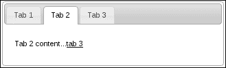

我们正在扩展 tabs 小部件，以便覆盖几个 tabs 方法。第一个方法是`_findActive()`，在最初的实现中需要一个整数。我们将其更改为使用基于 tab 按钮的`href`属性返回索引的`_getIndex()`方法，也就是说，除非它获得传递给它的整数值，否则它只返回该数字。简言之，我们已将`_findActive()`更改为接受以零为基础的索引号或`href`字符串。

下一个方法是`_initialActive()`，，当 tabs 小部件第一次实例化时调用该方法。我们在这里所做的是在调用`_initialActive()`的原始实现之前，将活动选项设置为适当的索引值。这是支持构造函数中的`href`字符串作为`active`选项值所必需的。

最后，我们使用`href`字符串创建 tabs 小部件，并将事件处理程序绑定到选项卡面板中的每个选项卡链接锚定。在这里，我们仅根据链接的`href`属性激活选项卡，因此您可以看到我们引入的新`href`功能的价值。

## 还有更多。。。

在前面的示例中，我们利用了选项卡按钮链接的`href`属性。但是，我们没有使用浏览器的位置散列。换句话说，当选项卡被激活时，浏览器 URL 中的位置哈希不会改变。支持这种方法有几个优点。首先，我们可以使用后退按钮在活动选项卡中导航。另一个好处是选项卡内容面板中的链接不再需要事件处理程序；他们可以将其`href`属性指向选项卡`href`。

下面是修改后的 JavaScript，它支持与前面示例相同的功能。唯一的区别是 URL 散列将在任何时候激活选项卡时更改。

```js
(function( $, undefined ) {

$.widget( "ab.tabs", $.ui.tabs, {

    _create: function() {

        this._super();

        this._on( window, { 
            hashchange: $.proxy( this, "_hashChange" )
        });

    },

    _hashChange: function( e ) {

        if ( this.active.attr( "href" ) === location.hash ) {
            return;
        }

        this._activate( this._getIndex( location.hash ) );

    },

    _eventHandler: function( e ) {

        this._super( e );  

        var href = $( e.target ).attr( "href" );

        if ( href === location.hash ) {
            return;
        }

        if ( href.indexOf( "#" ) === 0 ) {
            location.hash = href;
        }
        else {
            location.hash = "";
        }

    }

});

})( jQuery );

$(function() {
    $( "#tabs" ).tabs();
});
```

现在，当您在浏览器中与这个 tabs 小部件交互时，您会注意到，当您在选项卡中导航时，URL 中的哈希值会发生变化。这是通过在调用`_create()`的原始实现后，向的`_create()`方法添加事件处理程序来实现的。我们正在使用实用程序方法订阅窗口的`hashchange`事件。接下来，我们添加的`_hashChange()`方法是该事件的处理程序。首先，我们检查存储在`location.hash`变量中的 URL 哈希是否已经指向活动选项卡。如果没有，我们将根据当前 URL 哈希值激活该选项卡。这就是我们需要支持选项卡面板内容中直接指向 URL 哈希的链接的全部内容。但是，当用户直接点击选项卡按钮时，哈希值没有变化。这对我们帮助不大，因为我们无法跟踪选项卡导航历史记录。

这就是为什么我们实现了`_eventHandler()`方法的定制。在着手处理 URL 哈希细节之前，我们首先调用该方法的原始实现。如果 URL 散列已经指向活动选项卡，那么我们在这里无事可做；否则，我们将更新 URL 哈希。