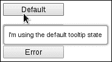
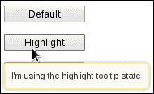
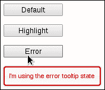
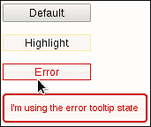
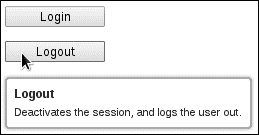
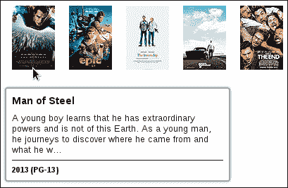
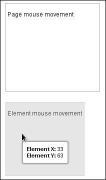
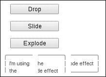
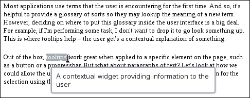
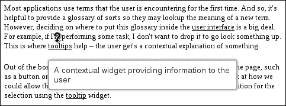

# 十一、使用工具提示

在本章中，我们将介绍：

*   更改工具提示状态
*   在工具提示中使用自定义标记
*   显示鼠标移动
*   将效果应用于工具提示显示
*   选定文本的工具提示

# 导言

在本章中，我们将探讨**工具提示**小部件的各个方面，该小部件用于向用户提供上下文信息。工具提示小部件与现有代码配合良好，因为默认情况下，它对工具提示的文本使用标准 HTML 属性。此外，只需一行代码就可以轻松地为整个用户界面创建工具提示实例。

除了简单的用例之外，我们还将研究可以传递到小部件中的不同类型的内容，以及如何动态生成内容。我们还将研究工具提示如何作为工具帮助开发过程，以及开发人员如何操作可用的效果来显示和隐藏小部件。

# 更改工具提示状态

工具提示小部件的视觉显示具有默认状态。也就是说，开箱即用，小部件设计得很好，使用了主题框架中的元素。但是，我们可能希望根据应用程序中某些资源的状态来改变这一点。例如，由于权限更改而对用户来说是新的按钮可能需要相对于页面上的其他工具提示在视觉上突出的工具提示状态。同样，如果资源已断开，并且用户将鼠标悬停在其中一个组件上，则显示的工具提示应为错误状态。当然，在更改工具提示的状态时，我们应该记住，状态应该与实际工具提示的上下文和音调相匹配。例如，不要在工具提示上显示“万事俱备！”的错误状态。让我们看一下工具提示自定义的一个快速而简单的入口点。我们将使用标准的工具提示选项来传递状态 CSS 类。

## 怎么做。。。

我们将使用以下 HTML 作为工具提示小部件。这里有三个按钮，每个按钮都有自己的状态和工具提示实例。

```js
<div class="button-container">
    <button class="tt-default" title="I'm using the default tooltip state">Default</button>
</div>
<div class="button-container">
    <button class="tt-highlight" title="I'm using the highlight tooltip state">Highlight</button>
</div>
<div class="button-container">
    <button class="tt-error" title="I'm using the error tooltip state">Error</button>
</div>
```

接下来，我们将使用以下 JavaScript 为它们各自的按钮创建工具提示小部件：

```js
$(function() {

    $( "button" ).tooltip();

    $( "button.tt-highlight" ).tooltip( "option", { 
        tooltipClass: "ui-state-highlight" 
    });

    $( "button.tt-error" ).tooltip( "option", {
        tooltipClass: "ui-state-error"
    });

});
```

将鼠标悬停在浏览器中的每个按钮上，将显示默认、高亮显示和错误状态，如下图所示：

*   The default state:

    

*   The highlight state:

    

*   The error state:

    

## 它是如何工作的。。。

对于这个特定的示例，我们使用`tooltipClass`选项将状态 CSS 类从主题框架传递到小部件。首先，我们只需将页面上的每个按钮设置为工具提示小部件。在调用工具提示构造函数之后，我们有三个工具提示实例，都使用默认状态。接下来，我们找到带有`tt-highlight`类的按钮，并传递`ui-state-highlight`的`tooltipClass`选项 a 值。最后，我们找到带有`tt-error`类的按钮，并使用`tooltipClass`选项将工具提示小部件分配给`ui-state-error`类。

## 还有更多。。。

我们以前使用的方法有一些缺点。首先，用户在将鼠标移到元素上并看到工具提示处于错误状态之前，无法判断是否有问题。在更现实的场景中，如果按钮有问题，它可能会将错误状态应用于按钮本身。因此，要应用错误状态，我们必须发明自己的类名，并在工具提示创建时确定要使用哪个类。

一个更健壮的解决方案将围绕在元素上使用框架中的实际状态，而不是发明我们自己的状态。此外，工具提示应该足够智能，可以根据应用它的元素的状态更改其类。换言之，如果按钮应用了`ui-state-error`类，则应使用该类作为`tooltipClass`选项。让我们向工具提示小部件添加一个`inheritState`选项，该选项将启用此行为。

以下是修改后的 HTML 源代码：

```js
<div class="button-container">
    <button title="I'm using the default tooltip state">Default</button>
</div>
<div class="button-container">
    <button class="ui-state-highlight" title="I'm using the highlight tooltip state">Highlight</button>
</div>
<div class="button-container">
    <button class="ui-state-error" title="I'm using the error tooltip state">Error</button>
</div>
```

下面是工具提示小部件扩展的定义，包括新选项：

```js
(function( $, undefined ) {

$.widget( "ab.tooltip", $.ui.tooltip, {

    options: {
        inheritState: false
    },

    _create: function() {

        var self = this,
            options = this.options,
            states = [
                "ui-state-highlight",
                "ui-state-error"
            ];

        if ( !options.inheritState || options.tooltipClass ) {
            return this._super();
        }

        $.each( states, function( i, v ) {

            if ( self.element.hasClass( v ) ) {
                self.options.tooltipClass = v;
            }

        });

        this._super();

    }

});

})( jQuery );

$(function() {

    $( "button" ).tooltip({
        inheritState: true
    });

});
```

此版本的代码应该与第一次迭代的行为相同。当然，不同之处在于按钮本身有一个可见状态，我们希望工具提示小部件能够注意到这一点。我们通过将`inheritState`选项设置为`true`来告诉它这样做。



我们的新选项`inheritState`被添加到工具提示小部件原始实现设置的默认`options`对象中。在小部件构造函数`_create()`方法中，我们正在检查`inheritState`选项是否为`true`，或者`tooltipClass`选项是否已经设置。在这两种情况下，我们返回，调用原始实现。否则，我们检查元素在`states`数组中是否有任何状态，如果有，我们将该类设置为`tooltipClass`。

# 在工具提示中使用自定义标记

我们不限于使用`title`属性为工具提示内容提供基本文本字符串。有时，工具提示小部件的内容需要格式化。例如，标题部分的字体样式与主文本部分的字体样式不同。工具提示小部件允许开发人员通过`content`选项传入自定义内容。这可以是原始字符串，也可以是返回我们希望显示的内容的函数。让我们看看如何在应用程序中使用此选项。

## 怎么做。。。

我们将创建两个`button`元素；每个都有一个`title`属性，我们将在工具提示中使用该属性的文本。我们还将添加按钮的名称作为工具提示标题。

```js
<div class="button-container">
    <button title="Logs the user in by establishing a new session.">Login</button>
</div>
<div class="button-container">
    <button title="Deactivates the session, and logs the user out.">Logout</button>
</div>
```

接下来，让我们创建格式化工具提示的基本 CSS 样式。

```js
.ui-tooltip-title {
    font-weight: bold;
    font-size: 1.1em;
    margin-bottom: 5px;
}
```

最后，我们将使用自定义内容函数创建工具提示小部件，以格式化工具提示内容。

```js
$(function() {

    $( "button" ).tooltip({
        content: function() {

            var $content = $( "<div/>" );

            $( "<div/>" ).text( $( this ).text() )
                         .addClass( "ui-tooltip-title" )
                         .appendTo( $content );

            $( "<span/>" ).text( $( this ).attr( "title" ) )
                          .appendTo( $content );

            return $content;

        }

    });

});
```

当我们将鼠标悬停在元素之一`button`上时，工具提示应该类似于下面的屏幕截图。请注意格式化的标题部分。



## 它是如何工作的。。。

我们传递给每个工具提示小部件的`content`函数将内容包装到`div`元素中，存储在`$content`变量中。其目的是将标题和主要文本元素存储在此`div`中，这样我们只需从函数返回`$content`变量。标题`div`使用按钮文本或其名称。这个`div`得到了我们前面定义的类`ui-tooltip-title`，它只是修改了字体，并在元素的底部添加了一些空间。接下来，我们添加主内容`span`元素，它只使用元素的`title`属性。

## 还有更多。。。

我们刚刚研究过的修改工具提示的方法是自由形式的，函数可以返回它想要的任何东西。让我们看一看修改工具提示内容的更结构化的方法。我们将修改工具提示小部件，使其接受特定的内容部分选项。为了演示这一点，我们将使用**烂番茄 API**。我们需要的唯一 HTML 是一个类似于`<div class="titles"></div>`的简单`div`元素。现在，让我们为要列出的标题定义 CSS 样式，以及特定的工具提示内容部分。

```js
.titles { 
    margin: 20px;
}

.titles img {
    padding: 10px;
}

.ui-tooltip-header {
    font-weight: bold;
    font-size: 1.4em;
}

.ui-tooltip-body {
    margin: 7px 0 7px 0;
    font-size: 1.2em;
}

.ui-tooltip-footer {
    font-weight: bold;
    border-top: solid 1px;
    padding-top: 7px;
}
```

下面是自定义的工具提示小部件声明，它添加了新的内容选项。当文档加载时，我们调用 Rotton Tomatos API，并在容器`div`中显示五个图像。每个图像也是一个工具提示，使用我们添加到小部件中的新特定内容选项。

```js
(function( $, undefined ) {

$.widget( "ab.tooltip", $.ui.tooltip, {

    options: {
        header: null,
        body: null,
        footer: null
    },

    _create: function() {

        this._super();

        var header = this.options.header,
            body = this.options.body,
            footer = this.options.footer;

        if ( !header && !body && !footer ) {
            return;
        }

        this.options.content = $.proxy( this, "_content" );

    },

    _content: function() {

        var header = this.options.header,
            body = this.options.body,
            footer = this.options.footer,
            $content = $( "<div/>" );

        if ( header ) {

            $( "<div/>" ).text( header )
                         .addClass( "ui-tooltip-header" )
                         .appendTo( $content );

        }

        if ( body ) {

            $( "<div/>" ).text( body )
                         .addClass( "ui-tooltip-body" )
                         .appendTo( $content );

        }

        if ( footer ) {

            $( "<div/>" ).text( footer )
                         .addClass( "ui-tooltip-footer" )
                         .appendTo( $content );

        }

        return $content;

    }

});

})( jQuery );

$(function() {

    var apikey = "2vnk...",  // Your Rotten Tomatoes API key goes here
        apibase = "http://api.rottentomatoes.com/api/public/v1.0";

    $.ajax({
        url: apibase + "/lists/movies/in_theaters.json",
        dataType: "jsonp",
        data: {
            apikey: apikey,
            page_limit: "5",
        },
        success: function( data ) {

            $.each( data.movies, function( i, v ) {

                var $logo = $( "" );

                $logo.attr( "src", v.posters.thumbnail )
                     .appendTo( ".titles" );

                $logo.tooltip({
                    header: v.title,
                    body: v.synopsis.substring( 0, 150 ) + "...",
                    footer: v.year + " (" + v.mpaa_rating + ")",
                    items: "img"
                });

            });

        }

    });

});
```

在浏览器中查看此页面时，标题`div`应包含五幅图像，当您将鼠标指针悬停在每幅图像上时，您应该会看到我们的自定义工具提示内容。



让我们先看看在文档加载完成后，我们对烂番茄 API 进行的 API 调用。我们只从影院目录中找到前五部电影。然后我们创建一个`img`元素，并将`src`属性设置为电影的适当缩略图。这就是您在示例中看到的图像的渲染方式。我们还在每个图像上调用工具提示构造函数，将我们定义的新选项传递给它。即，这些是工具提示内容的部分，`header`、`body`和`footer`。请注意，我们必须告诉工具提示这是一个`img`元素，它不会在通常的位置找到工具提示内容。这是使用`items`选项完成的。

现在看看我们在 tooltip 小部件中实现的定制，我们可以看到这些选项是通过为`options`属性分配一个新选项来定义的，这些选项被合并到默认 tooltip`options`对象中。接下来，我们有一个`_create()`方法的自定义实现，在实例化工具提示时调用该方法。这里的目标是检查是否指定了三个内容部分中的任何一个，如果没有指定，我们将无所事事，直接退出。`_create()`方法的原始版本是使用`_super()`调用的，因此在这一点上，小部件已经被创建。我们在构造函数中的最后一项工作是为`content`选项分配一个生成工具提示内容的函数。在本例中，它是`_content()`方法的代理。

`_content()`方法将返回的 HTML 封装在`div`元素中，该元素存储在`$content`变量中。然后，我们将指定的内容添加到选项中指定的`div`元素中。每个内容部分都是一个`div`元素，它们被赋予了相应的 CSS 类来控制外观—`ui-tooltip-header`、`ui-tooltip-body`和`ui-tooltip-footer`。

# 显示鼠标移动

我们可以在开发过程中使用工具提示小部件作为辅助工具，而不一定是成品附带的小部件。例如，我们可以使用工具提示小部件跟踪鼠标移动并显示 X 和 Y 坐标。这可以帮助我们在拼接 UI 组件时诊断一些棘手的鼠标行为。我们将研究跟踪特定元素的鼠标坐标，但请记住，重要的是这个概念。我们可以使用这种技术显示任意数量的事件属性，当不再需要时，我们只需放弃调用即可。

## 怎么做。。。

我们将首先创建所需的 CSS。这些只是定位我们想要跟踪鼠标移动的`div`元素。

```js
.mouse-tracker {
    margin: 20px;
    background-image: none;
    padding: 3px;
}

.mouse-tracker p {
    font-size: 1.2em;
}

.mouse-tracker-page {
    width: 180px;
    height: 170px;
}

.mouse-tracker-relative {
    width: 150px;
    height: 140px;
}
```

接下来是 HTML 本身，我们正在设计的两个`div`元素。我们希望我们的鼠标跟踪工具向我们展示当用户在这些元素上移动鼠标时会发生什么。

```js
<div class="ui-widget-content mouse-tracker mouse-tracker-page">
    <p>Page mouse movement</p>
</div>
<div class="ui-widget-content ui-state-default mouse-tracker mouse-tracker-relative">
    <p>Element mouse movement</p>
</div>
```

最后但并非最不重要的一点，我们将实现我们的跟踪工具。这是一个名为 tracker 的小部件，它扩展了 tooltip 小部件。我们将其称为其他名称，以避免与生产系统中可能使用的现有工具提示小部件混淆。

```js
(function( $, undefined ) {

$.widget( "ab.tracker", $.ui.tooltip, {

    options: {
        track: true,
        items: ".ui-tracker",
        relative: false
    },

    _create: function() {

        this.element.addClass( "ui-tracker" );

        this._super();

        this.options.content = $.proxy( this, "_content" );

    },

    _content: function() {

        var $content = $( "<div/>" ),
            relative = this.options.relative,
            xlabel = relative ? "Element X: " : "Page X: ",
            ylabel = relative ? "Element Y: " : "Page Y: ";

        $( "<div/>" ).append( $( "<strong/>" ).text( xlabel ) )
                     .append( $( "<span/>" ).attr( "id", "ui-tracker-x" ) )
                     .appendTo( $content );

        $( "<div/>" ).append( $( "<strong/>" ).text( ylabel ) )
                     .append( $( "<span/>" ).attr( "id", "ui-tracker-y" ) )
                     .appendTo( $content );

        return $content;

    },

    _mousemove: function( e ) {

        var $target = $( e.target ).closest( this.options.items ),
            offset,
            offsetLeft = 0
            offsetTop = 0;

        if ( this.options.relative ) {
            offset = $target.offset();
            offsetLeft = offset.left;
            offsetTop = offset.top;
        }

        $( "#ui-tracker-x" ).text( e.pageX - offsetLeft );
        $( "#ui-tracker-y" ).text( e.pageY - offsetTop );

    },

    open: function( e ) {

        this._super( e );

        var $target = $( e.target ).closest( this.options.items );

        this._on( $target, {
            mousemove: $.proxy( this, "_mousemove" )
        });

    }

});

})( jQuery );

$(function() {

    $( ".mouse-tracker-page" ).tracker();
    $( ".mouse-tracker-relative" ).tracker({
        relative: true
    });

});
```

在浏览器中查看这两个`div`元素，您应该会看到类似以下内容：



## 它是如何工作的。。。

我们刚刚定义的跟踪器小部件扩展了 tooltip 小部件，它用新的默认值填充了几个选项，并提供了一个新的选项。`track`工具提示选项告诉小部件相对于鼠标移动定位自身。因为我们正在实现一个鼠标坐标跟踪器，所以在默认情况下打开它是有意义的。我们想要更改的下一个工具提示选项值是`items`选项。这会告诉工具提示哪些目标元素是有效的工具提示，在我们的例子中，我们希望它是提供给跟踪器小部件的类-`ui-tracker`。`relative`选项是我们在小部件中添加的新功能。这告诉跟踪器在`true`时显示相对于所讨论元素的坐标，而不是相对于页面的坐标，这是默认值。

接下来，我们将扩展 tooltip 小部件的`_create()`方法，它是构造函数。在调用构造函数的原始实现之前，我们要做的第一件事是将 track 小部件类添加到元素中。这是必要的，以便将元素视为有效的跟踪器-请参阅`items`选项。完成`_super()`方法后，我们将`content`选项分配给回调，它是这个小部件的`_callback()`方法的代理。`_callback()`方法只返回我们希望在工具提示中显示的模板内容。这包括鼠标事件的 X 和 Y 坐标。我们必须根据`relative`选项确定标签是一个页面还是一个元素。

我们正在重写`open()`方法来设置`mousemove`事件处理。通常，这将通过`_create()`方法完成。但是，当工具提示未打开时，无需跟踪鼠标移动，回调触发将浪费宝贵的 CPU 周期。我们使用`_on()`实用方法将代理处理程序绑定到此小部件的`_mousemove()`方法。`_mousemove()`方法负责更新工具提示的内容。具体来说，它设置由我们的`_content()`方法生成的`#ui-tracker-x`和`#ui-tracker-y`标签的文本值。X 和 Y 坐标的值将基于事件的`pageX`和`pageX`属性，或结合偏移值，具体取决于`relative`选项。

跟踪器小部件的实例化方式与工具提示小部件相同。当我们不再需要显示这些值时，如中所示，当我们准备上线时，这些小部件调用将被删除。

# 将效果应用于工具提示显示

工具提示小部件附带选项，用于控制显示和隐藏元素的动作。这些是`show`和`hide`选项，它们各自接受一个指定动画选项的对象。由于`show`和`hide`选项控制小部件显示的不同方面，我们可以自由使用不同的设置，例如显示和隐藏操作的延迟。或者，我们可以采取激烈的态度，在动画中使用两种完全不同的效果。让我们来探索工具提示小部件中提供给我们的各种`show`和`hide`选项。

## 怎么做。。。

首先，让我们创建一些用于显示工具提示的按钮元素。

```js
<div class="button-container">
    <button class="drop" title="I'm using the drop effect">Drop</button>
</div>
<div class="button-container">
    <button class="slide" title="I'm using the slide effect">Slide</button>
</div>
<div class="button-container">
    <button class="explode" title="I'm using the clip/explode effect">Explode</button>
</div>
```

接下来，我们将为每个按钮实例化一个工具提示小部件，传入我们的自定义`show`和`hide`动画选项。

```js
$(function() {

    $( "button" ).tooltip();

    $( "button.drop" ).tooltip( "option", {
        show: {
            effect: "drop",
            delay: 150,
            duration: 450,
            direction: "up",
        },
        hide: {
            effect: "drop",
            delay: 100,
            duration: 200,
            direction: "down"
        }
    });

    $( "button.slide" ).tooltip( "option", {
        show: {
            effect: "slide",
            delay: 250,
            duration: 350,
            direction: "left"
        },
        hide: {
            effect: "slide",
            delay: 150,
            duration: 350,
            direction: "right",
        }
    });

    $( "button.explode" ).tooltip( "option", {
        show: {
            effect: "clip",
            delay: 150,
            duration: 450
        },
        hide: {
            effect: "explode",
            delay: 200,
            duration: 1000
        }
    });

});
```

查看 web 浏览器中的三个按钮，并将鼠标移到每个按钮上。你会注意到它们都以独特的方式显示和隐藏工具提示。例如，这里是最后一个工具提示，隐藏时处于爆炸中间。



## 它是如何工作的。。。

有些效果接受其他效果不接受的选项，例如方向。`button.drop`工具提示小部件对显示和隐藏操作都使用`drop`效果。但是，`show`将`direction`指定为`up`，而`hide`动作将`direction`指定为`down`。这意味着工具提示将以向上运动进入页面，并以向下运动退出页面。同样的概念也适用于我们使用`slide`效果的`button.slide`小部件。工具提示将从左侧滑入，然后从右侧滑出。

`button.explode`工具提示使用了两种不同的效果类型——`show`使用`clip`效果，`hide`使用`explode`效果。一般来说，像这样的混合效果很好，但通常需要一些试验和错误时间来寻找两个相互补充的效果类别，而不是寻找不合适的地方。最后，我们将`delay`和`duration`选项应用于我们创建的工具提示的`show`和`hide`选项。`delay`选项延迟工具提示的实际显示，`duration`控制动画的运行时间。

# 所选文本的工具提示

大多数应用程序使用用户第一次遇到的术语。因此，提供一个分类词汇表是很有帮助的，这样他们就可以查找一个新术语的含义。然而，决定将这个词汇表放在用户界面的什么地方是一件大事。例如，如果我正在执行某项任务，我不想放弃它去查找某些内容。这就是工具提示帮助用户获得某个内容的上下文解释的地方。

开箱即用的工具提示在应用于页面上的特定元素（如按钮或进度条）时效果非常好。但是文本的段落呢？让我们看看如何允许用户选择一些文本，并使用工具提示小部件显示选择的上下文定义。

## 怎么做。。。

我们将基于工具提示小部件设计一个新的字典小部件，用于处理文本。此小部件将通过显示带有适当提示的工具提示（如果找到）来处理文本选择。首先，这里是我们将使用的段落，摘自上一节。

```js
<p>
    Most applications use terms that the user is encountering for the first 
    time.  And so, it's helpful to provide a glossary of sorts so they may 
    lookup the meaning of a new term.  However, deciding on where to put this 
    glossary inside the user interface is a big deal.  For example, if I'm 
    performing some task, I don't want to drop it to go look something up.  
    This is where tooltips help – the user gets a contextual explanation 
    of something.
</p>

<p>
    Out of the box, tooltips work great when applied to a specific element on 
    the page, such as a button or a progressbar. But what about paragraphs of 
    text?  Let's look at how we could allow the user to select some text, and 
    display some contextual definition for the selection using the tooltip 
    widget.
</p>
```

下面是字典小部件的实现，以及如何将其应用于我们的两段文本。

```js
( function( $, undefined ) {

$.widget( "ab.dictionary", {

    options: {
        terms: []
    },

    ttPos: $.ui.tooltip.prototype.options.position,

    _create: function() {

        this._super();

        this._on({
            mouseup: this._tip,
            mouseenter: this._tip
        });

    },

    _destroy: function() {
        this._super();
        this._destroyTooltip();
    },

    _tip: function( e ) {

        var text = this._selectedText(),
            term = this._selectedTerm( text );

        if ( text === undefined || term === undefined ) {
            this._destroyTooltip();
            return;
        }

        if ( this.element.attr( "title" ) !== term.tip ) {
            this._destroyTooltip();
        }

        this._createTooltip( e, term );

    },

    _selectedText: function() {

        var selection, range, fragment;

        selection = window.getSelection();

        if ( selection.type !== "Range" ) {
            return;
        }

        range = selection.getRangeAt( 0 ),
        fragment = $( range.cloneContents() );

        return $.trim( fragment.text().toLowerCase() );

    },

    _selectedTerm: function( text ) {

        function isTerm( v ) {
            if ( v.term === text || v.term + "s" === text ) {
                return v;
            }
        }

        return $.map( this.options.terms, isTerm )[ 0 ];

    },

    _createTooltip: function( e, term ) {

        if ( this.element.is( ":ui-tooltip" ) ) {
            return;
        }

        var pos = $.extend( this.ttPos, { of: e } );

        this.element.attr( "title", term.tip )
                    .tooltip( { position: pos } )
                    .tooltip( "open" );
    },

    _destroyTooltip: function() {

        if ( !this.element.is( ":ui-tooltip" ) ) {
           return;
        }

        this.element.tooltip( "destroy" )
                    .attr( "title", "");

    }

});

})( jQuery );

$(function() {

    var dict = [
        {
            term: "tooltip",
            tip: "A contextual widget providing information to the user"
        },
        {
            term: "progressbar",
            tip: "A widget illustrating the progress of some task"
        },
        {
            term: "element",
            tip: "An HTML element on the page"
        },
        {
            term: "user interface",
            tip: "Components on the screen the user interacts with"
        }
    ];

    $( "p" ).dictionary({
        terms: dict
    });

});
```

如果要在浏览器中打开此页面，并使用鼠标指针选择“工具提示”，则应获得工具提示，如以下屏幕截图所示：



## 它是如何工作的。。。

我们新的 dictionary 小部件为用户添加了选择段落文本的功能，并为他们的选择获取上下文定义（如果存在）。小部件接受一个`terms`选项，它只是一组术语和提示。这是选择某些文本时用于执行查找的词典数据。`ttPos`属性是对默认工具提示`position`设置对象的引用。我们把它放在手边，因为每次用户选择文本和显示工具提示小部件时，我们都需要使用它。小部件实例化时调用的`_create()`方法设置事件处理。特别是，我们对`mouseup`和`mouseenter`事件感兴趣，这两个事件都会显示工具提示小部件，具体取决于许多事情。`_destroy()`方法通过调用`_destroyTooltip()`确保我们正在使用的工具提示小部件也被销毁。

`_tip()`方法就像这个小部件的主程序一样，因为它将所有具有特定职责的方法联系在一起。我们使用`_selectedText()`方法获得所选文本。我们使用所选文本从词典中获取所选术语。现在，这些值中的任何一个都可能未定义，用户可能在调用`_tip()`时没有选择任何内容，或者用户选择了字典中不存在的文本。如果这两种情况都是真的，我们必须确保工具提示被销毁。另一方面，如果找到术语，我们将使用`_createTooltip()`方法创建并显示工具提示。

`_createTooltip()`方法接受事件对象和术语对象。事件对象用于在工具提示打开时定位工具提示。回想一下，我们在`ttPos`属性中存储了工具提示的默认位置选项。我们通过使用事件扩展属性来创建一个新的`position`对象。这意味着我们可以相对于用户选择文本的位置定位工具提示。现在我们已经在工具提示上设置了位置，我们只需要将段落上的`title`属性设置为我们希望在工具提示中显示的文本。这是传入方法的所选术语的`tip`属性。`_destroyTooltip()`负责销毁工具提示小部件，但前提是该元素实际上是工具提示，并恢复`title`属性。

最后一点注意，您会注意到，我们正在将简单术语字符串传递给字典实例。但我们能够在给定的用户选择中找到该术语的几个变体。例如，“工具提示”将找到术语“工具提示”，因为我们在与原始字符串之外添加的“s”进行比较。除了不区分大小写之外，我们还在规范化选择两侧的空白。

## 还有更多。。。

我们使用 dictionary 小部件的方法的缺点是，用户不知道我们的字典定义了哪些单词，我们让用户选择文本以获得单词的上下文定义。例如，示例中的两段定义了总共四个术语。为了实现这一点，用户必须玩一个猜谜游戏，猜测到底定义了哪个文本。此外，选择段落文本是直观的，但前提是您经常在大多数用户不使用的应用程序中执行此操作。

让我们通过引入一种新模式来增强我们的 dictionary 小部件——`hover`。当此模式为`true`时，我们将实际操作段落文本，以便字典中定义的术语突出显示。这些术语看起来像链接，并且包含定义的工具提示的行为将类似于典型的工具提示。首先，让我们添加这个简单的 CSS 规则，我们将应用于段落中的每个术语。

```js
.ui-dictionary-term {
    text-decoration: underline;
    cursor: help;
}
```

我们将保留前面使用的两个段落，字典将使用新的`mode`选项实例化，我们还将修改小部件定义以使用这个新选项。以下是新的 JavaScript 代码：

```js
( function( $, undefined ) {

$.widget( "ab.dictionary", {

    options: {
        terms: [],
        mode: "select"
    },

    ttPos: $.ui.tooltip.prototype.options.position,

    _create: function() {

        this._super();

        if ( this.options.mode === "select" ) {

            this._on({
                mouseup: this._tip,
                mouseenter: this._tip
            });

        }
        else if ( this.options.mode === "hover" ) {

            this._formatTerms();
            this._createTooltip();

        }

    },

    _destroy: function() {

        this._super();
        this._destroyTooltip();

        if ( this.options.mode === "hover" ) {
            this._unformatTerms();
        }

    },

    _tip: function( e ) {

        var text = this._selectedText(),
            term = this._selectedTerm( text );

        if ( text === undefined || term === undefined ) {
            this._destroyTooltip();
            return;
        }

        if ( this.element.attr( "title" ) !== term.tip ) {
            this._destroyTooltip();
        }

        this._createTooltip( e, term );

    },

    _selectedText: function() {

        var selection, range, fragement;

        selection = window.getSelection();

        if ( selection.type !== "Range" ) {
            return;
        }

        range = selection.getRangeAt( 0 ),
        fragment = $( range.cloneContents() );

        return $.trim( fragment.text().toLowerCase() );

    },

    _selectedTerm: function( text ) {

        function isTerm( v ) {
            if ( v.term === text || v.term + "s" === text ) {
                return v;
            }
        }

        return $.map( this.options.terms, isTerm )[ 0 ];

    },

    _createTooltip: function( e, term ) {

        if ( this.options.mode === "hover" ) {
            this.element.find( ".ui-dictionary-term" ).tooltip();
            return;
        }

        if ( this.element.is( ":ui-tooltip" ) ) {
            return;
        }

        var pos = $.extend( this.ttPos, { of: e } );

        this.element.attr( "title", term.tip )
                    .tooltip( { position: pos } )
                    .tooltip( "open" );

    },

    _destroyTooltip: function() {

        if( this.options.mode === "hover" ) {
            this.element.find( ".ui-dictionary-term" )
                        .tooltip( "destroy" );
            return;
        }

        if ( !this.element.is( ":ui-tooltip" ) ) {
            return;
        }

        this.element.tooltip( "destroy" )
                    .attr( "title", "");

    },

    _formatTerms: function() {

        function getTerm( v ) {
            return v.term;
        }

        var text = this.element.html(),
            terms = $.map( this.options.terms, getTerm );

        $.each( this.options.terms, function( i, v ) {

            var t = v.term,
                ex = new RegExp( "(" + t + "s|" + t + ")", "gi" ),
                termClass = "ui-dictionary-term",
                formatted = "<span " +
                            "class='" + termClass + "'" +
                            "title='" + v.tip + "'" +
                            ">$1</span>";

            text = text.replace( ex, formatted );

        });

        this.element.html( text );

    },

    _unformatTerms: function() {

        var $terms = this.element.find( ".ui-dictionary-term" );

        $terms.each( function( i, v ) {
            $( v ).replaceWith( $( v ).text() );
        });

    }

});

})( jQuery );

$(function() {

    var dict = [
        {
            term: "tooltip",
            tip: "A contextual widget providing information to the user"
        },
        {
            term: "progressbar",
            tip: "A widget illustrating the progress of some task"
        },
        {
            term: "element",
            tip: "An HTML element on the page"
        },
        {
            term: "user interface",
            tip: "Components on the screen the user interacts with"
        }
    ]

    $( "p" ).dictionary({
        terms: dict,
        mode: "hover"
    });

});
```

现在，当您在浏览器中查看这两个段落时，您会注意到我们在字典数据中定义的术语都有下划线。因此，当用户将鼠标指针悬停在术语上时，他们会得到帮助光标图标以及工具提示。



我们在 dictionary 小部件中引入的新的`mode`选项接受一个字符串值`select`或`hover`——它默认为`select`，这是我们最初在本例中实现的行为。在小部件构造函数的`_create()`方法中，我们正在检查`mode`值。如果我们处于`hover`模式，我们调用`_formatTerms()`方法，该方法改变段落中术语的视觉外观。接下来，我们调用`_createTooltip()`，与原始实现中使用的方法相同，只是它现在也是模式感知的。`_formatTerms()`存储给定元素的文本，然后遍历字典术语。对于每个术语，它构建一个正则表达式，并用用于创建工具提示的`span`元素替换找到的任何术语。