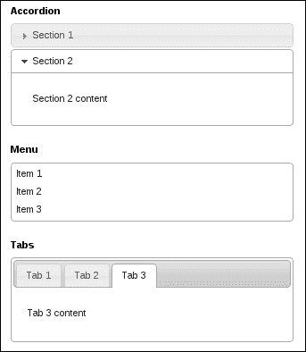

# 十二、小部件和更多！

在本章中，我们将介绍以下配方：

*   按标签，然后再按回来
*   从头开始构建自定义小部件
*   构建观察者小部件
*   在主干应用程序中使用小部件

# 导言

到目前为止，本书的每一章都集中于使用 jQueryUI 附带的特定小部件。在这一章中，我们更感兴趣的是事物的宏伟计划。毕竟，您是在构建应用程序，而不是演示。因此，使用 jQuery UI 的开发人员不仅要了解每个小部件各自的工作方式，还要了解它们在环境中的行为方式，以及它们与其他小部件和框架的交互方式，这一点很重要。

在本章中，我们还将在 widget 工厂的帮助下，从头开始构建一个 widget，以解决框架的细节问题。使用通用小部件机制，您可以编写一些与默认小部件无关的小部件。尽管这些自定义小部件没有继承太多功能，但它们的行为类似于 jqueryui 小部件，仅此一点就值得在应用程序中添加一层一致性。

# 将手风琴按在标签上，然后再按回来

手风琴和选项卡小部件都是容器。也就是说，它们在应用程序上下文中的典型用途是组织子组件。这些子组件可能是其他小部件，或者任何其他 HTML 元素。因此，这两个小部件都符合容器的一般描述，即具有不同部分的小部件。这种描述显然有些微妙之处；例如，accordios 不支持远程 Ajax 内容。此外，用户遍历这些部分的方式也大不相同。然而，它们基本上是可互换的。为什么不引入在两个小部件之间切换的功能，特别是在运行时，用户可以设置自己的偏好并在两个容器之间切换？事实证明我们可以实现这样的东西。让我们看看我们将如何着手做这件事。我们需要在两个小部件之间进行双向转换。通过这种方式，tabs 小部件可以转换为 accordion 小部件，反之亦然。

## 怎么做。。。

为了实现我们在这里讨论的两个不同小部件之间的转换，我们必须扩展 accordion 和 tabs 小部件。我们将向每个小部件添加一个新方法，将小部件转换为对应的小部件。下面是实现此示例所需的 HTML 结构：

```js
<button class="toggle">Toggle</button>

<div id="accordion">
    <h3>Section 1</h3>
    <div>
        <p>Section 1 content...</p>
    </div>
    <h3>Section 2</h3>
    <div>
        <p>Section 2 content...</p>
    </div>
    <h3>Section 3</h3>
    <div>
        <p>Section 3 content...</p>
    </div>
</div>

<button class="toggle">Toggle</button>

<div id="tabs">
    <ul>
        <li><a href="#section1">Section 1</a></li>
        <li><a href="#section2">Section 2</a></li>
        <li><a href="#section3">Section 3</a></li>
    </ul>
    <div id="section1">
        <p>Section 1 content...</p>
    </div>
    <div id="section2">
        <p>Section 2 content...</p>
    </div>
    <div id="section3">
        <p>Section 3 content...</p>
    </div>
</div>
```

这里，我们有两个切换按钮，一个手风琴`div`和一个标签`div`。切换按钮将其相应的容器小部件变形为另一个小部件类型。以下是 JavaScript 代码：

```js
( function( $, undefined ) {

$.widget( "ab.accordion", $.ui.accordion, {

    tabs: function() {

        this.destroy();

        var self = this,
            oldHeaders = this.headers,
            newHeaders = $( "<ul/>" );

        oldHeaders.each( function( i, v ) {

            var id = self.namespace + "-tabs-" + self.uuid + "-" + i,
                header = $( "<li/>" ).appendTo( newHeaders );

            $( "<a/>" ).text( $( v ).text() )
                       .attr( "href", "#" + id )
                       .appendTo( header );

            oldHeaders.next().eq( i ).attr( "id", id );

        });

        newHeaders.prependTo(this.element);

        this.headers.remove();
        return this.element.tabs();

    }

});

$.widget( "ab.tabs", $.ui.tabs, {

    accordion: function() {

        this.destroy();

        var self = this;

        this.tabs.each( function( i, v ) {

            var $link = $( v ).find( "a" ),
                id = $link.attr( "href" ),
                text = $link.text();

            $( "<h3/>" ).text( text )
                        .insertBefore( id );

        });

        this.tablist.remove();
        return this.element.accordion();

    },

});

})( jQuery );

$(function() {

    $( "button.toggle" ).button().on( "click", function( e ) {

        var $widget = $( this ).next();

        if ( $widget.is( ":ab-accordion" ) ) {
            $widget.accordion( "tabs" );
        }
        else if ( $widget.is( ":ab-tabs" ) ) {
            $widget.tabs( "accordion" );
        }

    });

    $( "#accordion" ).accordion();
    $( "#tabs" ).tabs();

});
```

## 它是如何工作的。。。

当页面第一次加载并且所有 DOM 元素就绪时，我们创建切换按钮小部件、手风琴小部件和选项卡小部件。以下屏幕截图对此进行了说明：


现在，单击顶部的切换按钮将手风琴小部件转换为选项卡小部件。此外，第二个切换按钮将将 tabs 小部件转换为手风琴。以下是单击每个切换按钮一次的结果：


切换按钮通过使用 jQuery 的`next()`功能抓取下一个小部件`#accordion`或`#tabs`，具体取决于单击的按钮。然后将其存储在`$widget`变量中，因为我们多次访问它。首先，我们检查小部件是否是手风琴，如果是，我们在手风琴上调用`tabs()`方法。同样，如果`$widget`是制表符，我们调用`accordion()`方法对其进行转换。请注意，我们正在使用小部件工厂为每个小部件创建的内置小部件选择器来确定元素是什么类型的小部件。另外，请注意名称空间是`ab`，而不是`ui`，这是在编写您自己的小部件或定制现有小部件时的推荐做法，这里就是这样。在这里，我选择了我的首字母作为名称空间。在实践中，这将是与应用程序相关的标准约定。

现在让我们把注意力转向我们添加到手风琴小部件中的`tabs()`方法。这个新方法的基本工作是销毁 accordion 小部件，操纵 DOM 元素，以采用 tabs 小部件可以识别的形式，然后实例化 tabs 小部件。这就是我们要做的，我们首先称之为`destroy()`方法。但是，请注意，我们仍然可以访问 accordion 小部件的一些属性，例如`headers`。销毁小部件除了删除事件处理程序外，还主要涉及删除由于首先创建小部件而引入 DOM 的任何装饰。在 JavaScript 级别，它不太关心销毁我们正在处理的小部件对象。

此时，我们有了`oldHeaders`变量，它指向原始手风琴的`h3`元素。接下来，我们有`newHeaders`，它是一个空的`ul`元素。`newHeaders`元素是选项卡小部件希望找到的新元素的起点。接下来，我们必须构建指向选项卡内容面板的`li`元素。对于每个标题，我们添加一个到`newHeaders``ul`的链接。但是，我们还必须使用头链接到的`id`更新面板 ID。我们首先使用选项卡的位置以及小部件本身的`uuid`构建一个 ID 字符串。uuid 不是严格必要的；然而，确保选项卡 ID 的唯一性是一个好主意。

最后，我们将新的头添加到元素中，并删除旧的头。在这一点上，我们已经足够实例化一个 tabs 小部件了。我们就是这么做的。请注意，我们返回新创建的对象，因此如果代码中的其他地方引用了该对象，则可以使用此方法替换它，例如，`myTabs = myAccordion.accordion( "tabs" )`。

我们添加到 tabs 小部件的`accordion()`方法遵循上述`tabs()`方法中应用的相同原则，我们希望销毁小部件，操纵 DOM，并创建 accordion 小部件。为了实现这一点，我们需要在相应的内容面板之前插入`h3`头元素。然后我们移除`tablist`元素和选项卡`ul`，然后调用实例化并返回 accordion 小部件。

# 从头开始构建自定义小部件

jQueryUI 最强大的方面不是附带的预构建小部件，而是用于构建这些小部件的机制。每个小部件都共享一个称为小部件工厂的公共基础设施，这将向使用该框架的开发人员公开。widget 工厂为开发人员提供了定义自己的 widget 的方法。在本书中，我们已经瞥见了 widget 工厂的运作。我们一直在使用它来扩展任何给定小部件的功能。本节的重点将从不同的角度介绍小部件工厂。也就是说，我们如何使用它从头开始构建我们自己的小部件？

好吧，我们不想什么都不做，因为那样会破坏小部件工厂的整体目标。相反，构建任何小部件的目的是利用基本小部件类提供的通用功能。此外，还有一些基本的设计原则，开发人员在创建小部件时应尽量遵守这些原则。例如，您的小部件应该在销毁时执行清理，删除属性、事件处理程序，并基本上保留您找到的元素。widget 还应该提供一个简单的 API，使用您的 widget 的开发人员应该清楚它做了什么，更重要的是，它没有做什么。在开始之前，以及在设计小部件时，让我们谈谈需要牢记的一些原则：

*   **保持简单**：在最新版本的 jQueryUI 中，许多标准小部件都经历了重大的重构工作，以简化其接口。在设计小部件时，请借鉴本课程的内容，并将它们的责任减至最低。在小部件的实现阶段，您很容易决定是否需要向 API 添加另一个方法，可能是几个方法。在做这件事之前要仔细考虑很久，因为将 API 做大通常会导致一个很难维护和保持稳定的小部件。这就是 widgets 背后的全部理念，widgets 是一个小的模块化组件，非常可靠，可以在各种环境中使用，而不会爆炸。话虽如此，不满足应用程序需求的小部件也没有任何价值。
*   **可扩展性设计**：基于保持简单原则的是可扩展性。同样，正如我们在本书中所看到的，扩展性通常是为小部件提供应用程序完成其工作所需的额外功能的关键。这些可以是简单的定制，也可以是方法的完全重写。无论如何，假设您的小部件将被修改，并且它将有观察者监听事件。换句话说，一个好的小部件将在实现它的方法之间如何分配功能方面提供合理的粒度级别。每个方法都是专门化的入口点，因此潜在的入口点应该是有意识的关注点。小部件触发的事件将小部件的状态传递给外部世界。因此，当您的小部件的状态发生变化时，一定要让其他人知道。

## 怎么做。。。

现在已经讨论够了，让我们构建一个清单小部件。这真的很简单，因为它听起来。我们将小部件基于一个`ul`元素，它将把每个`li`元素转换成一个检查表项。然而，检查清单并不仅仅是坐在那里；我们将添加一些外部组件来与我们的小部件交互。我们需要一个添加新检查表项的按钮，一个删除项目的按钮，以及一个跟踪列表进度的进度条。用户与小部件本身的主要交互集中在检查和取消检查项目上。

下面是我们将在本例中使用的 HTML：

```js
<div class="container">
    <button id="add">Add</button>
    <button id="remove">Remove</button>
</div>
<div class="container">
    <ul id="checklist">
        <li><a href="#">Write some code</a></li>
        <li><a href="#">Deploy some code</a></li>
        <li><a href="#">Fix some code</a></li>
        <li><a href="#">Write some new code</a></li>
    </ul>
</div>
<div class="container">
    <div id="progressbar"></div>
</div>
```

接下来，我们将添加清单小部件所需的 CSS。

```js
.ui-checklist {
    list-style-type: none;
    padding: 0.2em;
}

.ui-checklist li {
    padding: 0.4em;
    border: 1px solid transparent;
    cursor: pointer;    
}

.ui-checklist li a {
    text-decoration: none;
    outline: none;
}

.ui-checklist-checked {
    text-decoration: line-through;
}
```

最后，我们将使用以下 JavaScript 代码添加小部件定义。此代码还创建了本例中使用的两个按钮小部件和 progressbar 小部件。

```js
( function( $, undefined ) {

$.widget( "ab.checklist", {

    options: {
        items: "> li",
        widgetClasses: [
            "ui-checklist",
            "ui-widget",
            "ui-widget-content",
            "ui-corner-all"
        ],
        itemClasses: [
            "ui-checklist-item",
            "ui-corner-all"
        ],
        checkedClass: "ui-checklist-checked"
    },

    _getCreateEventData: function() {

        var items = this.items,
            checkedClass = this.options.checkedClass;

        return {
            items: items.length,
            checked: items.filter( "." + checkedClass ).length
        }

    },

    _create: function() {

        this._super();

        var classes = this.options.widgetClasses.join( " " );

        this.element.addClass( classes );

        this._on({
            "click .ui-checklist-item": this._click,
        });

        this.refresh();

    },

    _destroy: function() {

        this._super();

        var widgetClasses = this.options.widgetClasses.join( " " ),
            itemClasses = this.options.itemClasses.join( " " ),
            checkedClass = this.options.checkedClass;

        this.element.removeClass( widgetClasses );

        this.items.removeClass( itemClasses )
                  .removeClass( checkedClass )
                  .removeAttr( "aria-checked" );

    },

    _click: function( e ) {

        e.preventDefault();
        this.check( this.items.index( $( e.currentTarget ) ) );

    },

    refresh: function() {

        var trigger = true,
            items,
            newItems;

        if ( this.items === undefined ) {
            trigger = false;
            this.items = $();
        }

        items = this.element.find( this.options.items )
        newItems = items.not( this.items );

        items.addClass( this.options.itemClasses.join( " " ) );

        this._hoverable( newItems );
        this._focusable( newItems );

        this.items = items;

        if ( trigger ) {
            this._trigger( "refreshed",
                           null,
                           this._getCreateEventData() );
        }

    },

    check: function( index ) {

        var $item = this.items.eq( index ),
            checked;

        if ( !$item.length ) {
            return;
        }

        checked = $item.attr( "aria-checked" ) === "true" ?
                  "false" : "true";

        $item.toggleClass( this.options.checkedClass )
             .attr( "aria-checked", checked );

        this._trigger( "checked", null, this._getCreateEventData());

    }

});

})( jQuery );

$(function() {

    $( "#add" ).button({
        icons: {
            primary: "ui-icon-plus"
        },
        text: false
    });

    $( "#add" ).on( "click", function( e ) {

        var $checklist = $( "#checklist" ),
            $item = $( "<li/>" ).appendTo( checklist );

        $( "<a/>" ).attr( "href", "#" )
                   .text( "Write some documentation" )
                   .appendTo( $item );

        $checklist.checklist( "refresh" );

    });

    $( "#remove" ).button({
        icons: {
            primary: "ui-icon-minus"
        },
        text: false
    });

    $( "#remove" ).on( "click", function( e ) {

        var $checklist = $( "#checklist" ),
            $item = $checklist.find( ".ui-checklist-item:last" );

        $item.remove();
        $checklist.checklist( "refresh" );

    });

    $( "#progressbar" ).progressbar();

    $( "#checklist" ).checklist({
        create: function( e, ui ) {
            $( "#progressbar" ).progressbar( "option", {
                max: ui.items,
                value: ui.checked
            });
        },
        refreshed: function( e, ui ) {
            $( "#progressbar" ).progressbar( "option", {
                max: ui.items,
                value: ui.checked
            });
        },
        checked: function( e, ui ) {
            $( "#progressbar" ).progressbar( "value", ui.checked );
        }
    });

});
```

当您第一次加载页面时，checklist 小部件以及页面上的其他组件应该如下所示：


您可以看到，这些是 HTML 结构中指定的默认检查表项。悬停状态按预期工作，但 progressbar 为 0。这是因为清单中没有任何选定的项目。让我们勾选一些项目，然后再添加一些。


您可以看到，每次在清单中添加或删除项目时，以及在选中或取消选中单个项目时，进度栏都会更新。

## 它是如何工作的。。。

让我们首先讨论清单小部件的 HTML 结构以及显示它所需的新 CSS。然后，我们将把小部件的定义和实例化划分为多个部分，并解决这些部分。本例中使用的 HTML 分为三个主容器`div`元素。第一个元素包含添加和删除项按钮。第二个用于清单小部件，最后一个用于 progressbar。这就是总的布局。

HTML 结构最重要的方面是 AutoT7A.AutoT0}元素，它是我们的检查表小部件的基础。每个项目都存储在一个`li`元素中。请注意，该项的文本也被包装在一个`a`元素中。这使得当用户在页面元素中进行 tab 操作时，聚焦单个项目的处理变得更加简单。检查表的主要样式由`ui-checklist`类控制。该类在小部件首次创建时应用于元素，并对列表执行一些标准样式的操作，例如删除项目符号图像。我们需要处理的另一件事是边框间距，当用户将鼠标悬停在某个项目上时，边框间距变得相关，并且添加和删除了`ui-state-hover`。包装项目文本的`a`元素不需要任何文本装饰，因为我们没有将它们用作标准链接。最后，`ui-checklist-checked`类与单个检查表项目的状态相关，并可视地将项目标记为已检查。当我们需要收集所有选中的项时，它还充当查询助手。

现在让我们把注意力转向小部件定义，以及如何实例化和使用它。

*   **选项**：小部件定义的第一件事是它的选项，每个选项都有一个默认值。始终确保您添加到小部件的任何选项都有一个默认值，因为我们永远不能依赖在创建期间提供的选项。我们在这里为清单小部件定义的选项相当简单，开发人员很少会更改。例如，我们查找的项目通常都是`li`元素。而且，我们在这里定义的应用于小部件本身的类可能永远不会改变。但是，它们需要在某个地方声明，因此我们可以硬编码，或者将它们放在开发人员可以访问的地方。将选项视为小部件对象的属性。
*   **私有方法**：按照惯例，私有方法或不构成用户可见的 API 的一部分的方法的前缀为下划线。我们的第一个私有方法是`_getCreateEventData()`方法。当小部件的创建事件被触发时，基本小部件类会在内部调用它。此方法是一个钩子，允许我们向创建事件处理程序提供自定义数据。我们在这里所做的就是传递一个对象，该对象具有存储在 items 属性中的项数，以及存储在 checked 属性中的选中项数。
*   **创建方法**：`_create()`方法可能是任何小部件最常用的方法，因为它被小部件工厂称为作为小部件构造函数。我们正在使用`_super()`实用程序方法为我们调用基本小部件构造函数，它为我们执行一些样板初始化工作。接下来，我们使用`widgetClasses`选项将相关的小部件 CSS 类应用于元素。接下来，我们使用`_on()`方法为点击事件设置事件处理程序。请注意，我们将在事件名称`.ui-checklist-item`之后传入一个委托选择器。我们这样做的原因是可以添加项目，也可以从清单中删除项目，因此使用这种方法而不是手动管理每个项目的单击事件是有意义的。
*   **销毁方法**：如前所述，`_destroy()`方法对于执行清理任务至关重要。我们在这里使用`_super()`来调用基本小部件`_destroy()`方法，它将清理我们使用`_on()`创建的任何事件处理程序。然后，我们只需要删除在小部件的整个生命周期中添加的任何类和属性。最后一个私有方法是`_click()`方法，当小部件第一次创建时，它是绑定到 click 事件的偶数处理程序。此方法的工作是更改单击项的状态，我们通过调用`check()`方法来实现，该方法是向开发人员公开的 API 的一部分。我们还希望防止此处链接单击的默认操作，因为它们有可能重新加载页面。
*   **API**：为了保持小部件的简单性，公开的 API 只包含两种方法。第一种是`refresh()`方法，它负责定位构成我们清单的项目。这些存储在小部件对象的`items`属性中，这是一个未通过 API 公开的示例。`items`属性仅在内部使用；然而，如果开发人员要扩展我们的小部件，他们的自定义方法将是可访问的，甚至可能是有用的。`refresh()`方法在发现新项目时更改小部件的状态，这就是它触发刷新事件的原因。然而，有一种情况是我们不想触发这个事件，即小部件第一次被实例化。这在`trigger`变量中被跟踪（如果我们还没有存储任何项目，那么可以安全地假设我们正在创建，而不是刷新它）。我们不想与 create 事件冲突的原因是，这对使用小部件的开发人员来说是非常误导的。我们还在每个新发现的项目上使用`_hoverable()`、和`_focusable()`方法。这是一个标准的小部件模式，用于用户与之交互的小部件中的项目。
*   **检查方法**：`check()`方法是检查表 API 的另一半，它也改变了小部件的状态。它触发一个已更改的事件，该事件包括有关项目计数和已检查计数的数据，与创建的事件数据相同。您会注意到，这个方法确保了适当的`aria`属性的处理，就像标准的 jQueryUI 小部件一样。`aria`标准促进了可访问性，这就是为什么 jQueryUI 框架使用它，而我们的小部件不应该有任何不同。最后，此方法的任务是使用存储在`checkedClass`选项中的值切换此项的类。
*   **主应用**：当页面加载时，我们要做的第一件事就是创建两个按钮小部件：`#add`和`#remove`。单击`#add`按钮时，会将一个新项目 DOM 元素添加到清单中。然后，它使用`refresh()`方法更新小部件的状态，并触发任何事件。类似地，`#remove`按钮删除 DOM 元素，并调用`refresh()`方法，触发任何状态更改行为。progressbar 小部件没有任何选项，因为它对我们的清单小部件一无所知。

最后，我们的清单小部件由三个选项创建。这些都是事件处理程序，它们都有相同的责任更新`#progressbar`小部件。例如，首先创建小部件，并使用 DOM 中找到的项目更新 progressbar（尚未检查任何内容）。列表中新增或删除新项目时触发`refreshed`事件；我们也想在这里更新 progressbar。当用户检查或取消选中某个项目时，`checked`事件处理程序就会触发，在这里，我们只对更新 progressbar 的值感兴趣，因为项目总数是相同的。

# 构建观察者小部件

处理 jQueryUI 小部件触发的事件的典型方法是将事件处理程序绑定到该事件名称，并直接传递到构造函数中。这是一种典型的方法，因为它很容易做到，并且通常可以解决我们遇到的特定问题。例如，假设当我们的手风琴小部件的部分被扩展时，我们想要更新另一个 DOM 元素。为此，在构建手风琴时，为激活事件分配一个事件处理程序函数。

这种方法适用于应用于给定小部件的单个实例的小型、单一用途的作业。然而，大多数有意义的应用程序都有许多小部件，它们都会触发自己的事件。widget 工厂在每个事件前面加上 widget 的名称，这通常意味着即使在 widget 上下文之外，我们也知道正在处理什么。当我们想要将事件处理程序绑定到小部件事件时，在小部件创建很久之后，这尤其有用。

让我们构建一个**观察者**小部件，它将帮助我们可视化应用程序中发生的所有潜在小部件事件。observer 小部件能够绑定到单个小部件、一组小部件或整个文档。我们将研究后一种情况，在这种情况下，观察者甚至会为将来创建的小部件拾取事件。

## 怎么做。。。

让我们先来看看观察者小部件首先使用的 CSS 样式：

```js
.ui-observer-event {
    padding: 1px;
}

.ui-observer-event-border {
    border-bottom: 1px solid;
}

.ui-observer-event-timestamp {
    float: right;
}
```

现在，让我们看看用于创建基本页面的 HTML，其中包含一些示例小部件。这些小部件将触发我们试图从观察者那里获取的事件。

```js
<div class="container">
    <h1 class="ui-widget">Accordion</h1>
    <div id="accordion">
        <h3>Section 1</h3>
        <div>
            <p>Section 1 content</p>
        </div>
        <h3>Section 2</h3>
        <div>
            <p>Section 2 content</p>
        </div>
    </div>
</div>
<div class="container">
    <h1 class="ui-widget">Menu</h1>
    <ul id="menu">
        <li><a href="#">Item 1</a></li>
        <li><a href="#">Item 2</a></li>
        <li><a href="#">Item 3</a></li>
    </ul>
</div>
<div class="container">
    <h1 class="ui-widget">Tabs</h1>
    <div id="tabs">
        <ul>
            <li><a href="#tab1">Tab 1</a></li>
            <li><a href="#tab2">Tab 2</a></li>
            <li><a href="#tab3">Tab 3</a></li>
        </ul>
        <div id="tab1">
            <p>Tab 1 content</p>
        </div>
        <div id="tab2">
            <p>Tab 2 content</p>
        </div>
        <div id="tab3">
            <p>Tab 3 content</p>
        </div>
    </div>
</div>
```

最后，以下是小部件的实现，以及本页使用的四个小部件实例：

```js
( function( $, undefined ) {

$.widget( "ab.observer", {

    options: {

        observables: [
            {
                widget: $.ui.accordion,
                events: [
                    "activate",
                    "beforeActivate",
                    "create"
                ]
            },
            {
                widget: $.ui.menu,
                events: [
                    "blur",
                    "create",
                    "focus",
                    "select"
                ]
            },
            {
                widget: $.ui.tabs,
                events: [
                    "activate",
                    "beforeActivate",
                    "create"
                ]
            }
        ]

    },

    _getEvents: function() {

        var events = {};

        $.each( this.options.observables, function ( i, v ) {

            var prefix = v.widget.prototype.widgetEventPrefix;

            $.each( v.events, function( i, v ) {
                events[ prefix + v.toLowerCase() ] = "_event";
            });

        });

        return events;

    },

    _create: function() {

        this._super();

        var dialogId = "ui-observer-dialog-" + this.uuid,
            dialogSettings = {
                minHeight: 300,
                maxHeight: 300,
                position: {
                    my: "right top",
                    at: "right top"
                },
                title: this.element.selector
            };

        this.dialog = $( "<div/>" ).attr( "id", dialogId )
                                   .attr( "title", "Observer" )
                                   .addClass( "ui-observer" )
                                   .appendTo( "body" )
                                   .dialog( dialogSettings );

        this._on( this.element, this._getEvents() );

    },

    _event: function( e, ui ) {

        var eventClasses = "ui-observer-event " +
                           "ui-observer-event-border",
            $event = $( "<div/>" ).prependTo( this.dialog )
                                  .addClass( eventClasses ),
            time = new Date( e.timeStamp ).toLocaleTimeString();

        $( "<span/>" ).html( e.type )
                      .appendTo( $event );

        $( "<span/>" ).html( time )
                      .addClass( "ui-observer-event-timestamp" )
                      .appendTo( $event );

        this.dialog.find( ".ui-observer-event:last" )
                   .removeClass( "ui-observer-event-border" );

    },

    _destroy: function() {

        this._super();
        this.dialog.dialog( "destroy" )
                   .remove();

    }

});

})( jQuery );

$(function() {

    $( document ).observer();

    $( "#accordion" ).accordion();
    $( "#menu" ).menu();
    $( "#tabs" ).tabs();

});
```

在浏览器中查看此页面，基本小部件布局如以下屏幕截图所示：



即使仅仅创建这些小部件也会触发事件。例如，当页面首次加载时，您将看到由 observer 小部件创建的对话框中已经填充了事件。


## 它是如何工作的。。。

在本例中，可观察小部件应用于`document`元素。这意味着它将拾取任何冒泡到该级别的小部件事件。可观察的小部件定义了一个`observables`选项，是一组我们想要收听其事件的小部件。在本例中，为了简洁起见，我们只包含三个小部件。由于这是一个选项，因此始终可以根据应用程序的需要对其进行扩展。

`_getEvents()`方法的目的是读取`observables`选项，并构建一个可用于将这些事件绑定到`_event()`方法的对象。请注意，我们正在自动将小部件前缀值添加到事件名称中，这在小部件原型的`widgetEventPrefix`属性中可用。`_create()`方法的任务是在`body`元素中插入一个`div`元素，该元素随后成为一个对话框小部件。我们将其放置在页面的右上角，以便避开用户的视线。最后，我们使用`_getEvents()`使用`_on()`方法返回的对象开始侦听事件。

`_event()`方法是一个回调，在我们监听的小部件事件被触发时使用。它只是将事件记录到“观察者”对话框中。它还记录事件发生的时间；因此，该工具对于任何 jQueryUI 应用程序（无论大小）的实验都很有用，因为它可以突出显示实际发生的事件及其顺序。小部件还负责销毁它先前创建的对话框小部件。

# 在主干应用程序中使用小部件

在看似无止境的 JavaScript 环境中，您可能会发现自己正在工作，因此最好接受一个事实，即并非所有事情都是通过 jQueryUI 方式完成的。如果您发现自己正在进行一个项目，而您正渴望使用 jQueryUI 小部件，因为用例非常丰富，那么您必须花必要的时间来理解 jQueryUI 与其他框架混合的后果。

对于任何开发人员来说，将完全不同的小部件框架混合在一起通常都是不明智的，所以希望这是容易避免的。当然，您必须使用其他自制 HTML 和 CSS 混合物，但这是典型的。它并没有那么糟糕，因为您可以控制它（使用其他开源框架不容易做到）。因此，如果不是其他小部件框架，我们还需要考虑哪些其他框架呢？

**主干**是建立在底层`underscore.js`实用程序库基础上的通用框架，用于向 web 应用程序客户端添加结构。您将在主干应用程序中找到模型、集合和视图等概念。对主干图书馆的全面论述远远超出了本书的范围。但是，将主干视为应用程序支架是有帮助的，它是不变的部分。无论是否使用 jQueryUI 小部件，它都将运行相同的程序。但是，由于我们对使用 jQueryUI 感兴趣，所以让我们自己构建一个使用 jQueryUI 小部件的主干应用程序。

## 怎么做。。。

该应用程序的目标是显示一个自动补全小部件，用户可以在其中过滤编程语言名称。进行选择时，将显示有关该语言的一些详细信息，包括“删除”按钮，该按钮将从集合中删除该语言。很简单，对吧？让我们开始吧。

在页面标题中，我们将执行一些不同的操作，包括模板。模板只是由主干视图呈现的文本字符串。我们将给它一种类型`text/template`，这样浏览器就不会试图将其解释为模板以外的内容（例如 JavaScript 代码）。它有一个`id`，因此我们可以在稍后渲染模板时引用模板文本。

```js
<script type="text/template" id="template-detail">
    <div>
        <strong>Title: </strong>
        <span><%= title %></span>
    </div>
    <div>
        <strong>Authors: </strong>
        <span><%= authors %></span>
    </div>
    <div>
        <strong>Year: </strong>
        <span><%= year %></span>
    </div>
    <div>
        <button class="delete">Delete</button>
    </div>
</script>
```

接下来，这个 UI 使用的最小 CSS 是简单的字体和布局调整。

```js
.search, .detail {
    margin: 20px;
}

.detail {
    font-size: 1.4em;
}

.detail button {
    font-size: 0.8em;
    margin-top: 5px;
}
```

接下来，我们将看到用户界面使用的实际标记。注意`detail`类`div`的最小值。这是因为它只是一个模板的持有者，由视图呈现，我们马上就会看到。

```js
<div class="search">
    <label for="search">Search:</label>
    <input id="search"/>
</div>
<div class="detail"></div>
```

最后，我们有一个实际的主干应用程序，它使用自动补全和按钮 jQuery UI 小部件。

### 注

为简洁起见，我们删去了这里列出的大部分代码，试图只显示基本内容。可以下载完全可操作的主干代码，以及本书中的所有其他示例。

```js
$(function() {

    // Model and collection classes

    var Language,
        LanguageCollection;

    // View classes

    var AutocompleteView,
        LanguageView;

    // Application router

    var AppRouter;

    // Collection instance

    var languages;

    // Application and view instances

    var app,
        searchView,
        detailView;

    /**
     *
     * Class definitions
     *
     **/

    Language = Backbone.Model.extend({        
       // ...
    });

    LanguageCollection = Backbone.Collection.extend({
       // ...
    });

    AutocompleteView = Backbone.View.extend({        
       // ...
    });

    LanguageView = Backbone.View.extend({        
       // ...
    });

    AppRouter = Backbone.Router.extend({

    });

    /**
     *
     * Collection, view, and application instances
     *
     **/

    languages = new LanguageCollection([        
        // …
    ]);

    searchView = new AutocompleteView({
        // ….
    });

    detailView = new LanguageView({
        // …
    });

    app = new AppRouter();

    Backbone.history.start();

});
```

运行此示例将向用户显示自动补全`input`元素。所选语言的详细信息显示在以下屏幕截图中：


## 它是如何工作的。。。

我们的整个主干应用程序是在 documentready 回调函数中声明的。一旦完成，一切都是基于事件的。让我们逐步了解应用程序组件。您会注意到的第一件事是，我们已经在顶部声明了变量，并对它们进行了简要的分类解释。当我们与多个变量共享同一名称空间时，这通常很有用。这些类别如下：

*   **模型和集合类**：我们的应用程序用来定义数据模型的类。
*   **视图类**：我们的应用程序使用的类，为用户提供数据模型的不同视图。
*   **应用路由器**：一个类似于控制器的类，它操纵浏览器地址，并在路径改变时执行相关功能。
*   **集合实例**：集合实例代表应用数据——模型实例的集合。
*   **应用程序和视图实例**：单个应用程序，以及该应用程序用于显示数据的各种视图。

考虑到这一点，现在让我们深入了解每个主干类如何工作的细节。该应用程序只有一个模型类`Language`。我们可以在这里看到，`Language`声明为实例化后的属性定义了一些默认值。接下来，`LanguageCollection`类是主干集合类的扩展。这就是我们所有的`Language`实例要去的地方。请注意，我们正在指定指向`Language`类的 model 属性。因为我们没有 RESTful API，所以我们必须告诉集合任何同步操作都应该在本地执行。为了实现这一点，我们必须包括主干网的本地存储插件。这实际上是在真正的后端完全充实之前引导 UI 开发的理想方法。

接下来，我们有了第一个视图类`AutocompleteView`，它特定于自动补全 jQueryUI 小部件。我们之所以这样命名是因为我们在这里尽了最大努力使它具有足够的通用性，可以与另一个自动补全小部件一起使用。我们确实在视图类中硬编码了一些语言细节，但是如果需要的话，这些都是微不足道的改进。此类中定义的第一个属性是`events`对象。这些主要与自动补全小部件事件有关。每个回调事件处理程序都定义为下面的视图方法。`initialize()`方法是视图构造函数，在这里我们调用`delegateEvents()`来激活当前元素以及未来元素的事件处理程序。然后，构造函数创建自动补全小部件，并侦听其销毁事件的连接。

`autocompleteCreate()`方法在创建自动补全小部件后触发，并分配小部件的`source`选项。这是此视图的`autocompleteSource`方法的代理。当用户选择一个项目并导航到适当的路线时， `autocompleteSelect`方法将触发。当自动补全小部件失去焦点且项目不同时，会触发`autocompleteChange()`方法。如果用户删除了他/她以前的选择，我们这样做是为了更新路径。`keyup()`处理程序用于在用户删除其选择时处理路由更改，但尚未模糊自动补全焦点。最后，`autocompleteSearch()`方法是当用户开始键入时，如何用项目填充自动补全小部件。首先，我们在集合上使用下划线`filter()`方法执行筛选，然后在集合上使用下划线`map()`方法进行映射。映射对于返回 autocomplete 小部件所期望的格式是必要的。

我们应用程序的下一个关键部分是`LanguageView`类，它负责呈现编程语言的细节。与前面的视图一样，此视图使用`events`属性设置事件处理程序。我们还使用前面提到的`#template-detail`文本，使用下划线模板机制编译此视图呈现的模板。在构造函数中，我们列出了此视图集合上的一些事件。需要注意的一个事件是`change:selected`事件。这只会在`selected`属性改变时触发，这很好，因为这是我们感兴趣的全部。

`render()`方法负责呈现模板，但前提是实际选择了相关模型。呈现后，我们可以实例化此视图使用的按钮小部件。但是，请注意，没有为单击事件再次绑定事件处理程序，因为该事件是在首次创建视图时委派的。

`AppRouter`类是应用程序控制器，因为它负责响应 URL 路径中的更改。`routeLang()`方法响应特定语言并将其标记为选中。`routeDefault()`方法处理所有其他请求。它唯一的任务是确保没有任何语言被标记为选中，并且作为一个副作用，`LanguageView`正在侦听`selected`属性中的更改，因此之前选择的任何语言都将从 UI 中删除。

最后，我们在集合实例中创建模型的实例，然后创建视图和应用程序路由器。