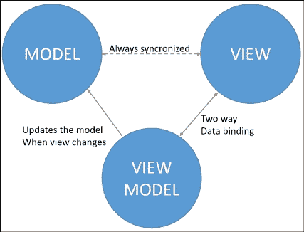
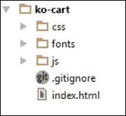
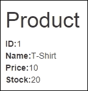
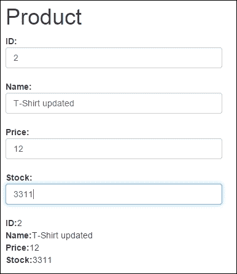
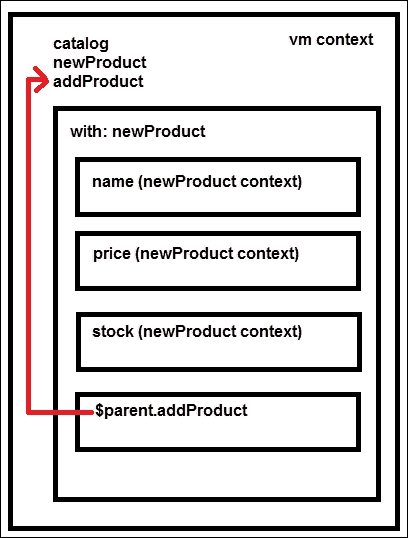
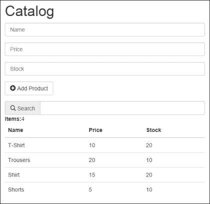

# 一、使用 KnockoutJS 自动刷新 UI

如果你正在读这本书，那是因为你发现管理 web 用户界面非常复杂。**DOM**（简称**文档对象模型**）仅使用本机 JavaScript 进行操作非常困难。这是因为每个浏览器都有自己的 JavaScript 实现。为了解决这个问题，不同的 DOM 操作库在过去几年中诞生了。最常用于操作 DOM 的库是 jQuery。

越来越多的人发现库可以帮助开发人员在客户端管理越来越多的功能。正如我们所说，开发人员已经能够轻松地操作 DOM，从而管理模板和格式化数据。此外，这些库为开发人员提供了从服务器发送和接收数据的简单 API。

然而，DOM 操纵库并没有为我们提供将输入数据与代码中的模型同步的机制。我们需要编写捕获用户操作和更新模型的代码。

当一个问题在大多数项目中频繁出现时，在几乎所有的情况下，它肯定可以以类似的方式解决。就在那时，管理 HTML 文件和 JavaScript 代码之间连接的库开始出现。这些库实现的模式名为 MV*（模型视图）。星号可通过以下方式更改：

*   控制器，MVC（例如 AngularJS）
*   ViewModel，MVVM（例如 KnockoutJS）
*   演示者（MVP）（例如，ASP.NET）

我们将在这本书中使用的图书馆是一流的。它使用视图模型来绑定数据和 HTML，因此它使用 MVVM 模式来管理数据绑定问题。

在本章中，您将学习该库的基本概念，并开始在实际项目中使用 Knockout。

# KnockoutJS 和 MVVM 模式

**KnockoutJS**是一个非常轻量级的库（仅缩小了 20KB），它使对象能够成为视图和模型之间的纽带。这意味着您可以使用干净的底层数据模型创建丰富的接口。

为此，它使用声明性绑定轻松地将 DOM 元素与模型数据关联起来。数据和表示层（HTML）之间的这种链接允许 DOM 自动刷新显示的值。

Knockout 在模型数据之间建立关系链，以进行转换并隐式组合。Knockout 也具有很小的可扩展性。可以将自定义行为实现为新的声明性绑定。这允许程序员在几行代码中重用它们。

使用 KnockoutJS 的优点有很多：

*   它是免费的，开源的。
*   它是使用纯 JavaScript 构建的。
*   它可以与其他框架协同工作。
*   它没有依赖性。
*   它支持所有主流浏览器，甚至包括 IE 6+、Firefox 3.5+、Chrome、Opera 和 Safari（桌面/移动）等古老的浏览器。
*   它包含完整的 API 文档、实时示例和交互式教程。

Knockout 的功能是特定的：连接视图和模型。它不管理 DOM 或处理 AJAX 请求。出于这些目的，我建议使用 jQuery。Knockout 让我们可以自由地按照自己想要的方式开发代码。



MVVM 模式图

# 真实世界的应用–koCart

为了演示如何在实际应用中使用 Knockout，我们将构建一个名为 koCart 的简单购物车。

首先，我们将定义用户故事。我们只需要几句话就可以知道我们想要实现的目标，如下所示：

*   用户应该能够查看目录
*   我们应该有能力搜索目录
*   用户可以单击按钮将项目添加到目录中
*   该应用将允许我们从目录中添加、更新和删除项目
*   用户应该能够从购物车中添加、更新和删除项目
*   我们将允许用户更新其个人信息。
*   应用应该能够计算购物车中的总金额
*   用户应该能够完成订单

通过用户故事，我们可以看到我们的应用有以下三个部分：

*   目录，包含并管理我们店里所有的产品。
*   购物车，负责计算每行的价格和订单的总金额。
*   订单，用户可以在其中更新其个人信息并确认订单。

# 安装部件

为了开发我们的现实世界项目，我们需要安装一些组件并设置第一个布局。

以下是您需要下载的所有组件：

*   引导：[https://github.com/twbs/bootstrap/releases/download/v3.2.0/bootstrap-3.2.0-dist.zip](https://github.com/twbs/bootstrap/releases/download/v3.2.0/bootstrap-3.2.0-dist.zip)
*   jQuery:[https://code.jquery.com/jquery-2.1.1.min.js](https://code.jquery.com/jquery-2.1.1.min.js)
*   淘汰赛 JS:[http://knockoutjs.com/downloads/knockout-3.2.0.js](http://knockoutjs.com/downloads/knockout-3.2.0.js)

因为在第一章中我们只在客户端工作，所以我们可以在客户端模拟数据，现在不需要服务器端。所以我们可以选择计算机中的任何位置来开始我们的项目。我建议您使用通常用于项目的环境。

首先，我们创建一个名为`ko-cart`的文件夹，然后在其中创建三个文件夹和一个文件：

1.  在`css`文件夹中，我们将放置所有 css。
2.  在`js`文件夹中，我们将放置所有 JavaScript。
3.  在`fonts`文件夹中，我们将放置 Twitter 引导框架所需的所有字体文件。
4.  创建一个`index.html`文件。

现在，您应该按照如下屏幕截图所示的相同方式设置文件：



初始文件夹结构

然后我们应该设置`index.html`文件的内容。记住使用`<script>`和`<link>`标记设置我们需要的文件的所有链接：

```js
<!DOCTYPE html>
<html>
<head>
  <title>KO Shopping Cart</title>
  <meta name="viewport" content="width=device-width, initial-scale=1">
  <link rel="stylesheet" type="text/css" href="css/bootstrap.min.css">
</head>
<body>
  <script type="text/javascript" src="js/vendors/jquery.min.js">
  </script>
  <script type="text/javascript" src="js/vendors/bootstrap.min.js">
  </script>
  <script type="text/javascript" src="js/vendors/knockout.debug.js">
  </script>
</body>
</html>
```

有了这些代码行，我们就有了启动应用所需的一切。

# 视图模型

**视图模型**是 UI 上数据和操作的纯代码表示。它不是 UI 本身。它没有任何按钮或显示样式的概念。它也不是持久化数据模型。它保存用户正在处理的未保存数据。视图模型是纯 JavaScript 对象，不了解 HTML。以这种方式保持视图模型的抽象可以使其保持简单，因此您可以管理更复杂的行为而不会迷失方向。

要创建视图模型，我们只需要定义一个简单的 JavaScript 对象：

```js
var vm = {};
```

然后，要激活敲除，我们将调用以下行：

```js
ko.applyBindings(vm);
```

第一个参数表示要在视图中使用哪个视图模型对象。或者，我们可以传递第二个参数来定义我们要搜索文档的哪个部分的`data-bind`属性。

```js
ko.applyBindings(vm, document.getElementById('elementID'));
```

这将激活限制为带有`elementID`的元素及其子元素，如果我们想要有多个视图模型并将每个视图模型与页面的不同区域相关联，这将非常有用。

## 景观

**视图**是一个可见的交互式 UI，表示视图模型的状态。它显示来自视图模型的信息，向视图模型发送命令（例如，当用户单击按钮时），并在视图模型的状态更改时更新。在我们的项目中，视图由 HTML 标记表示。

为了定义第一个视图，我们将构建一个 HTML 来显示产品。将此新内容添加到容器：

```js
<div class="container-fluid">
  <div class="row">
    <div class="col-md-12">
      <!-- our app goes here →
      <h1>Product</h1>
      <div>
        <strong>ID:</strong>
        <span data-bind="text:product.id"></span><br/>
        <strong>Name:</strong>
        <span data-bind="text:product.name"></span><br/>
        <strong>Price:</strong>
        <span data-bind="text:product.price"></span><br/>
        <strong>Stock:</strong>
        <span data-bind="text:product.stock"></span>
      </div> 
    </div>
  </div>
</div>
```

看看这个`data-bind`属性。这称为**声明性绑定**。这个属性不是 HTML 固有的，尽管它是完全正确的。但由于浏览器不知道它的意思，所以需要激活 Knockout（即`ko.applyBindings`方法）才能使其生效。

要显示来自产品的数据，我们需要在视图模型中定义一个产品：

```js
var vm = {
  product: {
    id:1,
    name:'T-Shirt',
    price:10,
    stock: 20
  }
};
ko.applyBindings(vm);//This how knockout is activated

```

将视图模型添加到脚本标记的末尾：

```js
<script type="text/javascript" src="js/viewmodel.js"></script>
```

### 提示

**下载示例代码**

您可以下载您在[账户购买的所有 Packt 书籍的示例代码文件 http://www.packtpub.com](http://www.packtpub.com) 。如果您在其他地方购买了本书，您可以访问[http://www.packtpub.com/support](http://www.packtpub.com/support) 并注册，将文件直接通过电子邮件发送给您。

这将是我们应用的结果：



数据绑定的结果

## 模型

此数据表示业务领域中的对象和操作（例如，产品），并且独立于任何 UI。当使用 Knockout 时，您通常会对一些服务器端代码进行 AJAX 调用，以读取和写入存储的模型数据。

模型和视图模型应该相互分离。为了定义我们的产品模型，我们将遵循以下步骤：

1.  在我们的`js`文件夹中创建一个文件夹。
2.  命名为`models`。
3.  在`models`文件夹中，创建一个名为`product.js`的 JavaScript 文件。

`product.js`文件的代码如下：

```js
var Product = function (id,name,price,stock) {
  "use strict";
  var
    _id = id,
    _name = name,
    _price = price,
    _stock = stock
  ;

  return {
    id:_id,
    name:_name,
    price:_price,
    stock:_stock
  };
};
```

此函数创建一个简单的 JavaScript 对象，其中包含产品的接口。使用此模式定义对象，称为**显示模块模式**，允许我们清楚地区分公共元素和私有元素。

要了解更多关于显示模块模式的信息，请点击链接[https://carldanley.com/js-revealing-module-pattern/](https://carldanley.com/js-revealing-module-pattern/) 。

将此文件与您的`index.html`文件链接，并将其设置在所有脚本标记的底部。

```js
<script type="text/javascript" src="js/models/product.js">
</script>
```

现在，我们可以使用产品模型在视图模型中定义产品：

```js
var vm = {
  product: Product(1,'T-Shirt',10,20);
};
ko.applyBindings(vm);
```

如果我们再次运行代码，我们将看到相同的结果，但是我们的代码现在更可读。视图模型用于存储和处理大量信息，因为视图模型通常被视为模块，并在其上应用显示模块模式。此模式允许我们以清晰的方式公开视图模型的 API（公共元素）并隐藏私有元素。

```js
var vm = (function(){
  var product = Product(1,'T-Shirt', 10, 20);
  return {
    product: product
  };
})();
```

当我们的视图模型开始增长时，使用这种模式可以帮助我们清楚地看到哪些元素属于对象的公共部分，哪些元素是私有的。

# 可观察到自动刷新 UI

最后一个例子向我们展示了 Knockout 如何绑定数据和用户界面，但它没有展示自动 UI 刷新的魔力。要执行此任务，Knockout 使用可观察的对象。

**可见物**是敲除的主要概念。这些是特殊的 JavaScript 对象，可以将更改通知订阅者，并可以自动检测依赖项。为了兼容性，`ko.observable`对象实际上是函数。

要读取可观察对象的当前值，只需调用不带参数的可观察对象。在本例中，`product.price()`将返回产品的价格，`product.name()`将返回产品的名称。

```js
var product = Product(1,"T-Shirt", 10.00, 20);
product.price();//returns 10.00
product.name();//returns "T-Shirt"
```

要向可观察对象写入新值，请调用可观察对象并将新值作为参数传递。例如，调用`product.name('Jeans')`会将`name`值更改为`'Jeans'`。

```js
var product = Product(1,"T-Shirt", 10.00, 20);
product.name();//returns "T-Shirt"
product.name("Jeans");//sets name to "Jeans"
product.name();//returns "Jeans"
```

关于可观测物的完整文件在官方淘汰网站[上 http://knockoutjs.com/documentation/observables.html](http://knockoutjs.com/documentation/observables.html) 。

为了展示可观测数据是如何工作的，我们将向模板中添加一些输入数据。

在包含产品信息的`div`上添加这些 HTML 标记。

```js
<div>
  <strong>ID:</strong>
  <input class="form-control" type="text" data-bind="value:product.id"/><br/>
  <strong>Name:</strong>
  <input class="form-control" type="text" data-bind="value:product.name"><br/>
  <strong>Price:</strong>
  <input class="form-control" type="text" data-bind="value:product.price"/><br/>
  <strong>Stock:</strong>
  <input class="form-control" type="text" data-bind="value:product.stock"><br/>
</div>
```

我们使用`value`属性将输入链接到视图模型。运行代码并尝试更改输入中的值。怎么搞的？没有什么这是因为变量是不可观测的。更新您的`product.js`文件，为每个变量添加`ko.observable`方法：

```js
"use strict";
function Product(id, name, price, stock) {
  "use strict";
  var
    _id = ko.observable(id),
    _name = ko.observable(name),
    _price = ko.observable(price),
    _stock = ko.observable(stock)
  ;

  return {
    id:_id,
    name:_name,
    price:_price,
    stock:_stock
  };
}
```

请注意，当我们更新输入中的数据时，产品值会自动更新。当您将`name`值更改为`Jeans`时，文本绑定将自动更新关联 DOM 元素的文本内容。这就是视图模型的更改自动传播到视图的方式。



可观测模型会自动更新

## 使用可观察对象管理集合

如果你想要检测并响应一个物体的变化，你可以使用可观察的物体。如果您想检测并响应事物集合中的变化，请使用`observableArray`。这在许多场景中非常有用，在这些场景中，您正在显示或编辑多个值，并且需要在添加和删除项目时重复显示和消失 UI 的各个部分。

要在我们的应用中显示产品集合，我们将遵循以下简单步骤：

1.  打开`index.html`文件，删除`<body>`标签内的代码，然后添加一个表，我们将在其中列出我们的目录：

    ```js
    <h1>Catalog</h1>
    <table class="table">
      <thead>
        <tr>
          <th>Name</th>
          <th>Price</th>
          <th>Stock</th>
        </tr>
      </thead>
      <tbody>
        <tr>
          <td></td>
          <td></td>
          <td></td>
        </tr>
      </tbody>
    </table>
    ```

2.  在视图模型

    ```js
    "use strict";
    var vm = (function () {

      var catalog = [
        Product(1, "T-Shirt", 10.00, 20),
        Product(2, "Trousers", 20.00, 10),
        Product(3, "Shirt", 15.00, 20),
        Product(4, "Shorts", 5.00, 10)
      ];

      return {
        catalog: catalog
      };
    })();
    ko.applyBindings(vm);
    ```

    中定义产品数组
3.  Knockout 有一个绑定，可以为集合中的每个元素重复一段代码。更新表中的`tbody`元素：

    ```js
    <tbody data-bind="foreach:catalog">
      <tr>
        <td data-bind="text:name"></td>
        <td data-bind="text:price"></td>
        <td data-bind="text:stock"></td>
      </tr>
    </tbody>
    ```

我们使用`foreach`属性指出，对于集合中的每个项目，此标记中的所有内容都应该重复。在这个标记中，我们处于每个元素的上下文中，因此您可以直接绑定属性。在浏览器中观察结果。

我们想知道我们的目录中有多少项，所以在表格上方添加这行代码：

```js
<strong>Items:</strong>
<span data-bind="text:catalog.length"></span>
```

## 在集合中插入元素

要在 products 数组中插入元素，应该发生一个事件。在这种情况下，用户将单击一个按钮，此操作将触发一个将在集合中插入新产品的操作。

在以后的章节中，您将了解有关事件的更多信息。现在我们只需要知道有一个名为`click`的绑定属性。它接收一个函数作为参数，当用户单击该元素时，将触发该函数。

要插入元素，我们需要一个表单来插入新产品的值。将此 HMTL 代码写在`<h1>`标记下方：

```js
<form class="form-horizontal" role="form" data-bind="with:newProduct">
  <div class="form-group">
    <div class="col-sm-12">
      <input type="text" class="form-control" placeholder="Name" data-bind="textInput:name">
      </div>
    </div>
    <div class="form-group">
      <div class="col-sm-12">
      <input type="password" class="form-control" placeholder="Price" data-bind="textInput:price">
      </div>
    </div>
    <div class="form-group">
      <div class="col-sm-12">
      <input type="password" class="form-control" placeholder="Stock" data-bind="textInput:stock">
      </div>
    </div>
    <div class="form-group">
      <div class="col-sm-12">
      <button type="submit" class="btn btn-default" data-bind="{click:$parent.addProduct}">
        <i class="glyphicon glyphicon-plus-sign">
        </i> Add Product
      </button>
    </div>
  </div>
</form>
```

在此模板中，我们发现了一些新绑定：

*   The `with` binding: This creates a new binding context so that descendant elements are bound in the context of a specified object, in this case `newProduct`.

    [http://knockoutjs.com/documentation/with-binding.html](http://knockoutjs.com/documentation/with-binding.html)

*   The `textInput` binding: The `textInput` binding links a textbox (`<input>`) or text area (`<textarea>`) with a view-model property, providing two-way updates between the `viewmodel` property and the element's value. Unlike the `value` binding property, `textInput` provides instant updates from the DOM for all types of user input, including autocomplete, drag-and-drop, and clipboard events. It is available from the 3.2 version of Knockout.

    [http://knockoutjs.com/documentation/textinput-binding.html](http://knockoutjs.com/documentation/textinput-binding.html)

*   The `click` binding: The `click` binding adds an event handler so that your chosen JavaScript function is invoked when the associated DOM element is clicked. When calling your handler, Knockout will supply the current model value as the first parameter. This is particularly useful if you're rendering UI for each item in a collection, and you need to know which item's UI was clicked.

    [http://knockoutjs.com/documentation/click-binding.html](http://knockoutjs.com/documentation/click-binding.html)

*   `$parent`对象：这是一个绑定上下文属性。我们使用它来引用来自`foreach`循环外部的数据。

有关绑定上下文属性的更多信息，请阅读[中的淘汰文档 http://knockoutjs.com/documentation/binding-context.html](http://knockoutjs.com/documentation/binding-context.html) 。



使用 with 设置上下文和父级以在其中导航

现在是将`newProduct`对象添加到视图模型的时候了。首先，我们应该定义一个数据为空的新产品：

```js
var newProduct = Product("","","","");
```

我们已经定义了一个文本对象，该对象将包含我们希望放入新产品中的信息。此外，我们还定义了一种方法，用于在插入完成后清除或重置对象。现在我们定义我们的`addProduct`方法：

```js
var addProduct = function (context) {
  var id = new Date().valueOf();//random id from time
  var newProduct = Product(
    id,
    context.name(),
    context.price(),
    context.stock()
  );
  catalog.push(newProduct);
  newProduct.clear();
};
```

此方法使用从单击事件接收的数据创建新产品。

click 事件始终将上下文作为第一个参数发送。还请注意，您可以在可观察数组中使用数组方法，例如`push`。查看淘汰文档（[http://knockoutjs.com/documentation/observableArrays.html](http://knockoutjs.com/documentation/observableArrays.html) 查看阵列中可用的所有方法。

我们应该实现私有方法，一旦新产品添加到集合中，就会从中清除数据：

```js
var clearNewProduct = function () {
  newProduct.name("");
  newProduct.price("");
  newProduct.stock("");
};
```

更新视图模型：

```js
return {
    catalog: catalog,
    newProduct: newProduct,
    addProduct: addProduct
};
```

如果您运行代码，您会注意到，当您尝试添加新产品时，什么都没有发生。这是因为，尽管我们的产品具有可观察的特性，但我们的阵列不是一个可观察的阵列。出于这个原因，Knockout 并没有听取这些变化。我们应该把数组转换成一个`observableArray`可观测的。

```js
var catalog = ko.observableArray([
  Product(1, "T-Shirt", 10.00, 20),
  Product(2, "Trousers", 20.00, 10),
  Product(3, "Shirt", 15.00, 20),
  Product(4, "Shorts", 5.00, 10)
]);
```

现在，Knockout 正在监听这个数组发生了什么，而不是每个元素内部发生了什么。Knockout 只是告诉我们如何在数组中插入或删除元素，而不是编辑元素。如果您想知道元素中发生了什么，那么对象应该具有可观察的属性。

一个`observableArray`observable 只跟踪它持有的对象，并在添加或删除对象时通知侦听器。

在幕后，`observableArray`实际上是一个可观察的对象，其值是一个数组。因此，您可以通过调用`observableArray`可观察函数来获取底层 JavaScript 数组，与任何其他可观察函数一样，不带任何参数。然后您可以从底层数组中读取信息。

```js
<strong>Items:</strong>
<span data-bind="text:catalog().length"></span>
```

## 计算可观测值

认为我们在界面中显示的某些值依赖于 Knockout 已经观察到的其他值并不奇怪。例如，如果我们想按名称搜索目录中的产品，很明显，我们在列表中显示的目录中的产品与我们在搜索框中输入的术语相关。在这些情况下，敲除为我们提供了**计算可观测值**。

您可以在[的淘汰文档中详细了解中的计算可观测值 http://knockoutjs.com/documentation/computedObservables.html](http://knockoutjs.com/documentation/computedObservables.html) 。

要开发搜索功能，请定义一个文本框，我们可以在其中编写搜索词。我们将把它绑定到`searchTerm`属性上。要在写入时更新值，我们应该使用`textInput`绑定。如果我们使用值绑定，当元素失去焦点时，值将被更新。将此代码放在 products 表上：

```js
<div class="input-group">
  <span class="input-group-addon">
    <i class="glyphicon glyphicon-search"></i> Search</span>
  <input type="text" class="form-control" data-bind="textInput: searchTerm">
</div>
```

要创建一个筛选过的目录，我们将检查所有项目，并测试`searchTerm`是否在项目的`name`属性中。

```js
var searchTerm = ko.observable(''); 
var filteredCatalog = ko.computed(function () {
  //if catalog is empty return empty array
  if (!catalog()) {
    return [];
  }
  var filter = searchTerm().toLowerCase();
  //if filter is empty return all the catalog
  if (!filter) {
    return catalog();
  }
  //filter data
  var filtered = ko.utils.arrayFilter(catalog(), function (item) {
    var fields = ["name"]; //we can filter several properties
    var i = fields.length;
    while (i--) {
      var prop = fields[i];
      var strProp = ko.unwrap(item[prop]).toLocaleLowerCase();
      if (strProp.indexOf(filter) !== -1){
        return true;
      };
    }
    Return false;
  });
  return filtered;
});
```

`ko.utils`对象未记录在敲除中。它是库内部使用的对象。它具有公共访问权限，并具有一些可以帮助我们进行观察的功能。互联网上有很多关于它的非官方例子。

它的一个有用功能是`ko.utils.arrayFilter`。如果你看第 13 行，我们用这个方法得到了一个过滤数组。

此函数获取一个数组作为第一个参数。注意，我们调用`catalog`数组 observable 来获取元素。我们传递的不是可观察对象本身，而是可观察对象的内容。

第二个参数是决定项目是否在筛选数组中的函数。如果该项具有过滤数组中的条件，则返回`true`。否则返回`false`。

在片段的第 14 行，我们可以找到一个名为`fields`的数组。此参数将包含应符合条件的字段。在这种情况下，我们只需检查过滤器值是否在`name`值中。如果我们非常确定我们只是要检查`name`字段，我们可以简化过滤函数：

```js
var filtered = ko.utils.arrayFilter(catalog(), function (item) {
  var strProp = ko.unwrap(item["name"]).toLocaleLowerCase();
  return (strProp.indexOf(filter) > -1);
});
```

`ko.unwrap`函数返回包含可观察值的值。当我们不确定变量是否包含可观察变量时，我们使用`ko.unwrap`，例如：

```js
var notObservable = 'hello';
console.log(notObservable()) //this will throw an error.
console.log(ko.unwrap(notObservable)) //this will display 'hello');
```

将筛选后的目录公开到公共 API 中。请注意，现在我们需要使用过滤后的产品目录，而不是原始的产品目录。因为我们正在应用**揭示****模块模式**，所以我们可以保留原来的 API 接口，只需用过滤后的目录更新目录的值即可。我们不需要提醒视图我们将使用不同的目录或其他元素，只要我们始终保持相同的公共界面：

```js
return {
  searchTerm: searchTerm,
  catalog: filteredCatalog,
  newProduct: newProduct,
  addProduct: addProduct
};
```

现在，尝试在搜索框中键入一些字符，并在浏览器中查看目录如何自动更新数据。

精彩的我们已经完成了前三个用户案例：

*   用户应该能够查看目录
*   用户应该能够搜索目录
*   用户应该能够将项目添加到目录中

让我们看看最终的结果：



# 总结

在本章中，您已经学习了淘汰库的基础知识。我们创建了一个简单的表单，将产品添加到我们的目录中。您还学习了如何管理可观察的集合并在表中显示它们。最后，我们使用计算的观测值开发了搜索功能。

您已经学习了三个重要的淘汰概念：

*   **视图模型**：保存表示视图状态的数据。它是一个纯 JavaScript 对象。
*   **模型**：包含业务领域的数据。
*   **视图**：显示我们在给定时刻存储在视图模型中的数据。

要构建反应式 UI，淘汰库为我们提供了一些重要方法：

*   `ko.observable`：用于管理变量。
*   `ko.observableArray`：用于管理阵列。
*   `ko.computed`：它们对内部可观察到的变化做出响应。

为了迭代数组的元素，我们使用`foreach`绑定。当我们使用`foreach`绑定时，我们创建了一个新的上下文。此上下文与每个项目相关。如果我们想在这个上下文之外访问，我们应该使用`$parent`对象。

当我们想要创建一个与变量相关的新上下文时，我们可以将`with`绑定附加到任何 DOM 元素。

我们使用`click`绑定将单击事件附加到元素。单击事件函数以始终获取上下文作为第一个参数。

为了从我们不确定是否可观测的变量中获取值，我们可以使用`ko.unwrap`函数。

我们可以使用`ko.utils.arrayFilter`功能过滤集合。

在下一章中，我们将使用模板来保持代码的可维护性和干净性。模板引擎帮助我们保持代码的排列，并允许我们以一种简单的方式更新视图。

本章中制定的代码副本位于：

[https://github.com/jorgeferrando/knockout-cart/archive/chapter1.zip](https://github.com/jorgeferrando/knockout-cart/archive/chapter1.zip) 。