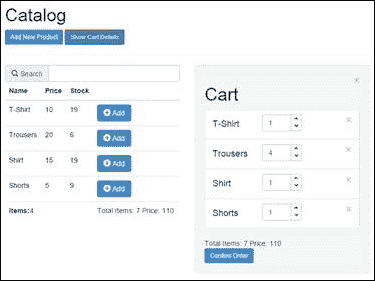

# 二、KnockoutJS 模板

一旦我们建立了我们的目录，是时候将购物车添加到我们的应用中了。当我们的代码开始增长时，有必要将其分成几个部分以保持其可维护性。当我们拆分 JavaScript 代码时，我们讨论的是模块、类、函数、库等等。当我们谈论 HTML 时，我们称这些部分为模板。

KnockoutJS 有一个本地模板引擎，我们可以使用它来管理 HTML。它非常简单，但也有一个很大的不便：模板，它应该在当前的 HTML 页面加载。如果我们的应用很小，这不是一个问题，但如果我们的应用开始需要越来越多的模板，这可能是一个问题。

在本章中，我们将使用本机引擎设计模板，然后我们将讨论可用于改进淘汰模板引擎的机制和外部库。

# 准备项目

我们可以从[第一章](01.html "Chapter 1. Refreshing the UI Automatically with KnockoutJS")中的项目开始，*使用 KnockoutJS*自动刷新 UI。首先，我们将为页面添加一些样式。将名为`style.css`的文件添加到`css`文件夹中。在`index.html`文件中，在`bootstrap`引用的正下方添加引用。以下是该文件的内容：

```js
.container-fluid {
  margin-top: 20px;
}
.row {
  margin-bottom: 20px;
}
.cart-unit {
  width: 80px;
}
.btn-xs {
  font-size:8px;
}
.list-group-item {
  overflow: hidden;
}
.list-group-item h4 {
  float:left;
  width: 100px;
}
.list-group-item .input-group-addon {
  padding: 0;
}
.btn-group-vertical > .btn-default {
  border-color: transparent;
}
.form-control[disabled], .form-control[readonly] {
  background-color: transparent !important;
}
```

现在从 body 标签中删除除脚本标签外的所有内容，并粘贴到以下行中：

```js
<div class="container-fluid">
  <div class="row" id="catalogContainer">
    <div class="col-xs-12" data-bind="template:{name:'header'}"></div>
    <div class="col-xs-6" data-bind="template:{name:'catalog'}"></div>
    <div id="cartContainer" class="col-xs-6 well hidden" data-bind="template:{name:'cart'}"></div>
  </div>
  <div class="row hidden" id="orderContainer" data-bind="template:{name:'order'}">
  </div>
  <div data-bind="template: {name:'add-to-catalog-modal'}"></div>
  <div data-bind="template: {name:'finish-order-modal'}"></div>
</div>
```

让我们回顾一下这段代码。

我们有两排课。它们将是我们的集装箱。

第一个容器以`id`值命名为`catalogContainer`，它将包含目录视图和购物车。第二个被`id`值引用为`orderContainer`，我们将在那里设置最终订单。

我们在底部还有两个`<div>`标签，其中包含模式对话框，用于显示将产品添加到我们的目录的表单（我们在[第 1 章](01.html "Chapter 1. Refreshing the UI Automatically with KnockoutJS")中构建的一个，*使用 KnockoutJS*自动刷新 UI），另一个将包含模式消息，告知用户我们的订单已完成。

与此代码一起，您可以看到`data-bind`属性中的模板绑定。这是 Knockout 用于将模板绑定到元素的绑定。它包含一个表示模板 ID 的`name`参数。

```js
<div class="col-xs-12" data-bind="template:{name:'header'}"></div>
```

在这个示例中，这个`<div>`元素将包含 ID 为`header`的`<script>`标记内的 HTML。

# 创建模板

模板元素通常声明在正文的底部，就在引用外部库的`<script>`标记上方。我们将定义一些模板，然后讨论其中的每一个：

```js
<!-- templates -->
<script type="text/html" id="header"></script>
<script type="text/html" id="catalog"></script>
<script type="text/html" id="add-to-catalog-modal"></script>
<script type="text/html" id="cart-widget"></script>
<script type="text/html" id="cart-item"></script>
<script type="text/html" id="cart"></script>
<script type="text/html" id="order"></script>
<script type="text/html" id="finish-order-modal"></script>
```

每个模板名称本身都具有足够的描述性，因此很容易知道我们将在其中设置什么。

让我们看一个图表，显示我们在屏幕上处理每个模板的位置：


请注意，`cart-item`模板将对购物车集合中的每个项目重复。模态模板仅在显示模态对话框时显示。最后，`order`模板被隐藏，直到我们点击确认订单。

在`header`模板中，我们将获得页面的标题和菜单。`catalog`模板将包含我们在[第 1 章](01.html "Chapter 1. Refreshing the UI Automatically with KnockoutJS")中编写的产品表，*使用 KnockoutJS*自动刷新 UI。`add-to-catalog-modal`模板将包含显示将产品添加到我们目录的表单的模式。`cart-widget`模板将显示我们购物车的摘要。`cart-item`模板将包含购物车中每个项目的模板。`cart`模板将具有购物车的布局。`order`模板将显示我们想要购买的最终产品列表和确认订单的按钮。

## 表头模板

让我们从包含`header`模板的 HTML 标记开始：

```js
<script type="text/html" id="header">
  <h1>
    Catalog
  </h1>

  <button class="btn btn-primary btn-sm" data-toggle="modal" data-target="#addToCatalogModal">
    Add New Product
  </button>
  <button class="btn btn-primary btn-sm" data-bind="click: showCartDetails, css:{ disabled: cart().length  < 1}">
    Show Cart Details
  </button>
  <hr/>
</script>
```

我们定义了一个`<h1>`标记和两个`<button>`标记。

第一个按钮标签附在 ID 为`#addToCatalogModal`的模式上。因为我们使用 Bootstrap 作为 CSS 框架，所以我们可以使用`data-target`属性通过 ID 附加模态，并使用`data-toggle`属性激活模态。

第二个按钮将显示完整购物车视图，仅当购物车有项目时才可用。要实现这一点，有许多不同的方法。

第一个是使用 TwitterBootstrap 附带的 CSS 禁用类。这是我们在示例中使用的方法。CSS 绑定允许我们根据附加到类的表达式的结果来激活或停用元素中的类。

另一种方法是使用`enable`绑定。如果表达式的计算结果为`true`，则此绑定将启用元素。我们可以使用相反的绑定，名为`disable`。淘汰赛网站[上有一份完整的文档 http://knockoutjs.com/documentation/enable-binding.html](http://knockoutjs.com/documentation/enable-binding.html) ：

```js
<button class="btn btn-primary btn-sm" data-bind="click: showCartDetails, enable: cart().length  > 0"> 
  Show Cart Details
</button>

<button class="btn btn-primary btn-sm" data-bind="click: showCartDetails, disable: cart().length  < 1"> 
  Show Cart Details
</button>
```

第一种方法使用 CSS 类来启用和禁用按钮。第二个方法使用 HTML 属性`disabled`。

我们可以使用第三种选择，即使用计算的可观测值。我们可以在我们的视图模型中创建一个计算出的可观察变量，根据购物车的长度返回`true`或`false`：

```js
//in the viewmodel. Remember to expose it
var cartHasProducts = ko.computed(function(){
  return (cart().length > 0);
});
//HTML
<button class="btn btn-primary btn-sm" data-bind="click: showCartDetails, enable: cartHasProducts"> 
  Show Cart Details
</button>
```

为了展示购物车，我们将使用`click`绑定，与上一章中使用的方式相同。

现在我们应该转到我们的`viewmodel.js`文件，添加使该模板工作所需的所有信息：

```js
var cart = ko.observableArray([]);
var showCartDetails = function () {
  if (cart().length > 0) {
    $("#cartContainer").removeClass("hidden");
  }
};
```

您应该在视图模型中公开这两个对象：

```js
  return {
  //first chapter
    searchTerm: searchTerm,
    catalog: filteredCatalog,
    newProduct: newProduct,
    totalItems:totalItems,
    addProduct: addProduct,
  //second chapter
    cart: cart,
    showCartDetails: showCartDetails,
  };
```

## 目录模板

下一步是在`header`模板的正下方定义`catalog`模板：

```js
<script type="text/html" id="catalog">
  <div class="input-group">
    <span class="input-group-addon">
      <i class="glyphicon glyphicon-search"></i> Search
    </span>
    <input type="text" class="form-control" data-bind="textInput: searchTerm">
  </div>
  <table class="table">
    <thead>
    <tr>
      <th>Name</th>
      <th>Price</th>
      <th>Stock</th>
      <th></th>
    </tr>
    </thead>
    <tbody data-bind="foreach:catalog">
    <tr data-bind="style:color:stock() < 5?'red':'black'">
      <td data-bind="text:name"></td>
      <td data-bind="text:price"></td>
      <td data-bind="text:stock"></td>
      <td>
        <button class="btn btn-primary" data-bind="click:$parent.addToCart">
          <i class="glyphicon glyphicon-plus-sign"></i> Add
        </button>
      </td>
    </tr>
    </tbody>
    <tfoot>
    <tr>
      <td colspan="3">
        <strong>Items:</strong><span data-bind="text:catalog().length"></span>
      </td>
      <td colspan="1">
        <span data-bind="template:{name:'cart-widget'}"></span>
      </td>
    </tr>
    </tfoot>
  </table>
</script>
```

这是我们在上一章中构建的同一个表。我们刚刚添加了一些新内容：

```js
<tr data-bind="style:{color: stock() < 5?'red':'black'}">...</tr>
```

现在，每行使用`style`绑定来提醒用户，当他们购物时，库存正在达到最大限额。`style`绑定与 CSS 绑定处理类的方式相同。它允许我们根据表达式的值添加样式属性。在这种情况下，如果库存高于 5，则行中文本的颜色必须为黑色，如果库存低于 4，则行中文本的颜色必须为红色。我们可以使用其他 CSS 属性，所以可以尝试其他行为。对于示例，如果元素位于购物车内，则将目录行设置为绿色。我们应该记住，如果一个属性有破折号，应该用单引号将其括起来。例如，`background-color`将抛出一个错误，因此您应该编写`'background-color'`。

当我们处理根据视图模型的值激活的绑定时，最好使用计算的可观测值。因此，我们可以在产品模型中创建一个计算值，该值返回应显示的颜色值：

```js
//In the Product.js
var _lineColor = ko.computed(function(){
  return (_stock() < 5)? 'red' : 'black';
});
return {
  lineColor:_lineColor
};
//In the template
<tr data-bind="style:lineColor"> ... </tr>
```

如果我们在`style.css`文件中创建一个名为`stock-alert`的类，并使用 CSS 绑定，那就更好了：

```js
//In the style file
.stock-alert {
  color: #f00;
}
//In the Product.js
var _hasStock = ko.computed(function(){
  return (_stock() < 5);   
});
return {
  hasStock: _hasStock
};
//In the template
<tr data-bind="css: hasStock"> ... </tr>
```

现在，看看`<tfoot>`标签的内部。

```js
<td colspan="1">
  <span data-bind="template:{name:'cart-widget'}"></span>
</td>
```

如您所见，我们可以使用嵌套模板。在本例中，我们的`catalog`模板中有`cart-widget`模板。这使我们有可能拥有非常复杂的模板，将它们分割成非常小的片段，并将它们组合起来，以保持代码的干净性和可维护性。

最后，查看每行的最后一个单元格：

```js
<td>
  <button class="btn btn-primary" data-bind="click:$parent.addToCart">
    <i class="glyphicon glyphicon-plus-sign"></i> Add
  </button>
</td>
```

看看我们如何使用神奇变量`$parent`调用`addToCart`方法。击倒给了我们一些神奇的词语，让我们在应用中的不同上下文中导航。在本例中，我们处于`catalog`上下文中，我们希望调用一个位于上一层的方法。我们可以使用神奇的变量`$parent`。

当我们处于淘汰上下文中时，还可以使用其他变量。淘汰赛网站[上有完整的文档 http://knockoutjs.com/documentation/binding-context.html](http://knockoutjs.com/documentation/binding-context.html) 。

在这个项目中，我们不会全部使用它们。但我们将快速解释这些绑定上下文变量，以便更好地理解它们。

如果我们不知道我们有多少层，我们可以使用神奇的单词`$root`导航到视图模型的顶部。

当我们有很多父级时，我们可以获得魔法数组`$parents`并使用索引访问每个父级，例如，`$parents[0]`、`$parents[1]`。假设您有一个类别列表，其中每个类别都包含一个产品列表。这些产品是一个 ID 列表，该类别具有获取其产品名称的方法。我们可以使用`$parents`数组获取对类别的引用：

```js
<ul data-bind="foreach: {data: categories}">
  <li data-bind="text: $data.name"></li>
  <ul data-bind="foreach: {data: $data.products, as: 'prod'}>
    <li data-bind="text: $parents[0].getProductName(prod.ID)"></li>
  </ul>
</ul>
```

看看`as`属性在`foreach`绑定中有多大帮助。它使代码更具可读性。但是如果你在一个`foreach`循环中，你也可以使用`$data`魔术变量访问每个项目，并且你可以使用`$index`魔术变量访问集合中每个元素的位置索引。例如，如果我们有产品列表，我们可以这样做：

```js
<ul data-bind="foreach: cart">
  <li><span data-bind="text:$index">
    </span> - <span data-bind="text:$data.name"></span>
</ul>
```

这应显示：

**0–产品 1**

**1–产品 2**

**2–产品 3**

**。。。**


KnockoutJS 魔术变量，用于在上下文中导航

现在我们了解了更多关于绑定变量的内容，让我们回到我们的代码。我们现在要编写`addToCart`方法。

我们将在`js/models`文件夹中定义购物车项目。创建一个名为`CartProduct.js`的文件，并在其中插入以下代码：

```js
//js/models/CartProduct.js
var CartProduct = function (product, units) {
  "use strict";

  var _product = product,
    _units = ko.observable(units);

  var subtotal = ko.computed(function(){
    return _product.price() * _units();
  });

  var addUnit = function () {
    var u = _units();
    var _stock = _product.stock();
    if (_stock === 0) {
      return;
    }
  _units(u+1);
    _product.stock(--_stock);
  };

  var removeUnit = function () {
    var u = _units();
    var _stock = _product.stock();
    if (u === 0) {
      return;
    }
    _units(u-1);
    _product.stock(++_stock);
  };

  return {
    product: _product,
    units: _units,
    subtotal: subtotal,
    addUnit : addUnit,
    removeUnit: removeUnit,
  };
};
```

每个购物车产品都由产品本身和我们想要购买的产品单元组成。我们还将有一个包含行小计的计算字段。我们应该让对象负责管理其单位和产品库存。因此，我们添加了`addUnit`和`removeUnit`方法。这些方法在调用时添加一个单位或删除一个单位的产品。

我们应该将这个 JavaScript 文件与其他的`<script>`标记一起引用到我们的`index.html`文件中。

在视图模型中，我们应该创建一个 cart 数组，并在 return 语句中公开它，正如我们前面所做的：

```js
var cart = ko.observableArray([]);
```

是时候写下`addToCart`方法了：

```js
var addToCart = function(data) {
  var item = null;
  var tmpCart = cart();
  var n = tmpCart.length;
  while(n--) {
    if (tmpCart[n].product.id() === data.id()) {
      item = tmpCart[n];
    }
  }
  if (item) {
    item.addUnit();
  } else {
    item = new CartProduct(data,0);
    item.addUnit();
    tmpCart.push(item);        
  }
  cart(tmpCart);
};
```

此方法搜索购物车中的产品。如果存在，则更新其单位，如果不存在，则创建一个新单位。由于购物车是一个可观察的数组，我们需要获取、操作它并覆盖它，因为我们需要访问产品对象以了解产品是否在购物车中。请记住，可观察数组不观察它们包含的对象，只观察数组属性。

## 添加到购物车模式模板

这是一个非常简单的模板。我们只需将[第一章](01.html "Chapter 1. Refreshing the UI Automatically with KnockoutJS")中的代码进行包装，*使用 KnockoutJS*自动刷新 UI，将产品添加到引导模式：

```js
<script type="text/html" id="add-to-catalog-modal">
  <div class="modal fade" id="addToCatalogModal">
    <div class="modal-dialog">
      <div class="modal-content">
        <form class="form-horizontal" role="form" data-bind="with:newProduct">
          <div class="modal-header">
            <button type="button" class="close" data-dismiss="modal">
              <span aria-hidden="true">&times;</span>
              <span class="sr-only">Close</span>
            </button><h3>Add New Product to the Catalog</h3>
          </div>
          <div class="modal-body">
            <div class="form-group">
              <div class="col-sm-12">
                <input type="text" class="form-control" placeholder="Name" data-bind="textInput:name">
              </div>
            </div>
            <div class="form-group">
              <div class="col-sm-12">
                <input type="text" class="form-control" placeholder="Price" data-bind="textInput:price">
              </div>
            </div>
            <div class="form-group">
              <div class="col-sm-12">
                <input type="text" class="form-control" placeholder="Stock" data-bind="textInput:stock">
              </div>
            </div>
          </div>
          <div class="modal-footer">
            <div class="form-group">
              <div class="col-sm-12">
                <button type="submit" class="btn btn-default" data-bind="{click:$parent.addProduct}">
                  <i class="glyphicon glyphicon-plus-sign">
                  </i> Add Product
                </button>
              </div>
            </div>
          </div>
        </form>
      </div><!-- /.modal-content -->
    </div><!-- /.modal-dialog -->
  </div><!-- /.modal -->
</script>
```

## 购物车小部件模板

此模板快速向用户提供有关购物车中有多少物品以及所有物品的价格的信息：

```js
<script type="text/html" id="cart-widget">
  Total Items: <span data-bind="text:totalItems"></span>
  Price: <span data-bind="text:grandTotal"></span>
</script>
```

我们应该在视图模型中定义`totalItems`和`grandTotal`：

```js
var totalItems = ko.computed(function(){
  var tmpCart = cart();
  var total = 0;
  tmpCart.forEach(function(item){
    total += parseInt(item.units(),10);
  });
  return total;
});
var grandTotal = ko.computed(function(){
  var tmpCart = cart();
  var total = 0;
  tmpCart.forEach(function(item){
    total += (item.units() * item.product.price());
  });
  return total;
});
```

现在，您应该像往常一样在 return 语句中公开它们。现在不必担心格式，将来您将学习如何格式化货币或任何类型的数据。现在，您必须重点学习如何管理信息以及如何向用户显示信息。

## 购物车项目模板

`cart-item`模板显示购物车中的每一行：

```js
<script type="text/html" id="cart-item">
  <div class="list-group-item" style="overflow: hidden">
    <button type="button" class="close pull-right" data-bind="click:$root.removeFromCart"><span>&times;</span></button>
    <h4 class="" data-bind="text:product.name"></h4>
    <div class="input-group cart-unit">
      <input type="text" class="form-control" data-bind="textInput:units" readonly/>
        <span class="input-group-addon">
          <div class="btn-group-vertical">
            <button class="btn btn-default btn-xs" data-bind="click:addUnit">
              <i class="glyphicon glyphicon-chevron-up"></i>
            </button>
            <button class="btn btn-default btn-xs" data-bind="click:removeUnit">
              <i class="glyphicon glyphicon-chevron-down"></i>
            </button>
          </div>
        </span>
    </div>
  </div>
</script>
```

我们在每一行的右上角设置了一个**x**按钮，以便轻松地从购物车中移除一行。如您所见，我们使用了`$root`魔术变量导航到顶部上下文，因为我们将在`foreach`循环中使用此模板，这意味着此模板将位于循环上下文中。如果我们把这个模板看作一个孤立的元素，我们就不能在上下文导航中确定我们有多深。可以肯定的是，我们使用正确的上下文来调用`removeFormCart`方法。在这种情况下，最好使用`$root`而不是`$parent`。

`removeFromCart`的代码应该位于视图模型上下文中，如下所示：

```js
var removeFromCart = function (data) {
  var units = data.units();
  var stock = data.product.stock();
  data.product.stock(units+stock);
  cart.remove(data);
};
```

注意，在`addToCart`方法中，我们得到了可观测范围内的数组。我们这样做是因为我们需要在数组的元素内部导航。在这种情况下，敲除可观察数组有一种称为`remove`的方法，允许我们移除作为参数传递的对象。如果对象在数组中，则会将其删除。

记住数据上下文始终作为我们在单击事件中使用的函数中的第一个参数传递。

## 购物车模板

`cart`模板应显示购物车的布局：

```js
<script type="text/html" id="cart">
  <button type="button" class="close pull-right" data-bind="click:hideCartDetails">
    <span>&times;</span>
  </button>
  <h1>Cart</h1>
  <div data-bind="template: {name: 'cart-item', foreach:cart}" class="list-group"></div>
  <div data-bind="template:{name:'cart-widget'}"></div>
  <button class="btn btn-primary btn-sm" data-bind="click:showOrder">
    Confirm Order
  </button>
</script>
```

请注意`<h1>Cart</h1>`下方的模板绑定，这一点很重要。我们正在使用`foreach`参数将模板与数组绑定。通过这种绑定，Knockout 为 cart 集合中的每个元素呈现`cart-item`模板。这大大减少了我们在每个模板中编写的代码，并且使它们更具可读性。

我们再次使用`cart-widget`模板来显示总项目和总金额。这是模板的一个好特性，我们可以反复重用内容。

请注意，我们在购物车的右上角放置了一个按钮，用于在不需要查看购物车详细信息时关闭购物车，另一个按钮用于在完成后确认订单。视图模型中的代码应如下所示：

```js
var hideCartDetails = function () {
  $("#cartContainer").addClass("hidden");
};
var showOrder = function () {
  $("#catalogContainer").addClass("hidden");
  $("#orderContainer").removeClass("hidden");
};
```

如您所见，为了显示和隐藏元素，我们使用引导框架中的 jQuery 和 CSS 类。隐藏类只是将`display: none`样式添加到元素中。我们只需要切换这个类来显示或隐藏视图中的元素。在视图模型的`return`语句中公开这两种方法。

当我们需要显示`order`模板时，我们将回到这里。

这是我们拥有目录和购物车后的结果：



## 订单模板

一旦我们点击**确认订单**按钮，订单应显示给我们，以审查并确认我们是否同意。

```js
<script type="text/html" id="order">
  <div class="col-xs-12">
    <button class="btn btn-sm btn-primary" data-bind="click:showCatalog">
      Back to catalog
    </button>
    <button class="btn btn-sm btn-primary" data-bind="click:finishOrder">
      Buy & finish
    </button>
  </div>
  <div class="col-xs-6">
    <table class="table">
      <thead>
      <tr>
        <th>Name</th>
        <th>Price</th>
        <th>Units</th>
        <th>Subtotal</th>
      </tr>
      </thead>
      <tbody data-bind="foreach:cart">
      <tr>
        <td data-bind="text:product.name"></td>
        <td data-bind="text:product.price"></td>
        <td data-bind="text:units"></td>
        <td data-bind="text:subtotal"></td>
      </tr>
      </tbody>
      <tfoot>
      <tr>
        <td colspan="3"></td>
        <td>Total:<span data-bind="text:grandTotal"></span></td>
      </tr>
      </tfoot>
    </table>
  </div>
</script>
```

这里我们有一个只读表，包含所有购物车行和两个按钮。一个是确认，它将显示模式对话框，说明订单已完成，另一个给我们返回目录并继续购物的选项。有一些代码需要添加到视图模型中，并向用户公开：

```js
var showCatalog = function () {
  $("#catalogContainer").removeClass("hidden");
  $("#orderContainer").addClass("hidden");
};
var finishOrder = function() {
  cart([]);
  hideCartDetails();
  showCatalog();
  $("#finishOrderModal").modal('show');
};
```

正如我们在前面的方法中所做的那样，我们从要显示和隐藏的元素中添加和删除隐藏的类。`finishOrder`方法删除购物车的所有项目，因为我们的订单已完成；隐藏购物车并显示目录。它还显示一个模式，向用户确认订单已完成。


订单详细信息模板

## 完成订单模式模板

最后一个模板是告知用户订单已完成的模式：

```js
<script type="text/html" id="finish-order-modal">
  <div class="modal fade" id="finishOrderModal">
    <div class="modal-dialog">
            <div class="modal-content">
        <div class="modal-body">
        <h2>Your order has been completed!</h2>
        </div>
        <div class="modal-footer">
          <div class="form-group">
            <div class="col-sm-12">
              <button type="submit" class="btn btn-success" data-dismiss="modal">Continue Shopping
              </button>
            </div>
          </div>
        </div>
      </div><!-- /.modal-content -->
    </div><!-- /.modal-dialog -->
  </div><!-- /.modal -->
</script>
```

以下屏幕截图显示输出：


# 使用 if 和 ifnot 绑定处理模板

您已经学会了如何使用 jQuery 和 Bootstrap 的强大功能显示和隐藏模板。这非常好，因为您可以将此技术用于任何您想要的框架。这类代码的问题在于，由于 jQuery 是一个 DOM 操纵库，因此需要引用元素来操纵它们。这意味着您需要知道要应用操作的元素。Knockout 根据视图模型的值为我们提供了一些隐藏和显示元素的绑定。让我们更新`show`和`hide`方法和模板。

将这两个控制变量添加到视图模型中，并在`return`语句中公开它们。

```js
var visibleCatalog = ko.observable(true);
var visibleCart = ko.observable(false);
```

现在更新`show`和`hide`方法：

```js
var showCartDetails = function () {
  if (cart().length > 0) {
    visibleCart(true);
  }
};

var hideCartDetails = function () {
  visibleCart(false);
};

var showOrder = function () {
  visibleCatalog(false);
};

var showCatalog = function () {
  visibleCatalog(true);
};
```

我们可以理解代码是如何变得更具可读性和意义的。现在，更新`cart`模板、`catalog`模板和`order`模板。

在文献[1]中，考虑这一行：

```js
<div class="row" id="catalogContainer">
```

替换为以下行：

```js
<div class="row" data-bind="if: visibleCatalog">
```

然后，请考虑下面的一行：

```js
<div id="cartContainer" class="col-xs-6 well hidden" data-bind="template:{name:'cart'}"></div>
```

用这个替换它：

```js
<div class="col-xs-6" data-bind="if: visibleCart">
  <div class="well" data-bind="template:{name:'cart'}"></div>
</div>
```

重要的是要知道 if 绑定和模板绑定不能共享相同的`data-bind`属性。这就是为什么我们在这个模板中从一个元素变成两个嵌套元素的原因。换句话说，不允许使用此示例：

```js
<div class="col-xs-6" data-bind="if:visibleCart, template:{name:'cart'}"></div>
```

最后，考虑这一行：

```js
<div class="row hidden" id="orderContainer" data-bind="template:{name:'order'}">
```

用这个替换它：

```js
<div class="row" data-bind="ifnot: visibleCatalog">
  <div data-bind="template:{name:'order'}"></div>
</div>
```

随着我们所做的更改，显示或隐藏元素现在取决于我们的数据，而不是 CSS。这要好得多，因为现在我们可以使用`if`和`ifnot`绑定显示和隐藏我们想要的任何元素。

让我们大致回顾一下我们的文件现在的情况：

我们有我们的`index.html`文件，其中包含主容器、模板和库：

```js
<!DOCTYPE html>
<html>
<head>
  <title>KO Shopping Cart</title>
  <meta name="viewport" content="width=device-width, initial-scale=1">
  <link rel="stylesheet" type="text/css" href="css/bootstrap.min.css">
  <link rel="stylesheet" type="text/css" href="css/style.css">
</head>
<body>

<div class="container-fluid">
  <div class="row" data-bind="if: visibleCatalog">
    <div class="col-xs-12" data-bind="template:{name:'header'}"></div>
    <div class="col-xs-6" data-bind="template:{name:'catalog'}"></div>
    <div class="col-xs-6" data-bind="if: visibleCart">
      <div class="well" data-bind="template:{name:'cart'}"></div>
    </div>
  </div>
  <div class="row" data-bind="ifnot: visibleCatalog">
    <div data-bind="template:{name:'order'}"></div>
  </div>
  <div data-bind="template: {name:'add-to-catalog-modal'}"></div>
  <div data-bind="template: {name:'finish-order-modal'}"></div>
</div>

<!-- templates -->
<script type="text/html" id="header"> ... </script>
<script type="text/html" id="catalog"> ... </script>
<script type="text/html" id="add-to-catalog-modal"> ... </script>
<script type="text/html" id="cart-widget"> ... </script>
<script type="text/html" id="cart-item"> ... </script>
<script type="text/html" id="cart"> ... </script>
<script type="text/html" id="order"> ... </script>
<script type="text/html" id="finish-order-modal"> ... </script>
<!-- libraries -->
<script type="text/javascript" src="js/vendors/jquery.min.js"></script>
<script type="text/javascript" src="js/vendors/bootstrap.min.js"></script>
<script type="text/javascript" src="js/vendors/knockout.debug.js"></script>
<script type="text/javascript" src="js/models/product.js"></script>
<script type="text/javascript" src="js/models/cartProduct.js"></script>
<script type="text/javascript" src="js/viewmodel.js"></script>
</body>
</html>
```

我们还有我们的`viewmodel.js`文件：

```js
var vm = (function () {
  "use strict";
  var visibleCatalog = ko.observable(true);
  var visibleCart = ko.observable(false);
  var catalog = ko.observableArray([...]);
  var cart = ko.observableArray([]);
  var newProduct = {...};
  var totalItems = ko.computed(function(){...});
  var grandTotal = ko.computed(function(){...});
  var searchTerm = ko.observable("");
  var filteredCatalog = ko.computed(function () {...});
  var addProduct = function (data) {...};
  var addToCart = function(data) {...};
  var removeFromCart = function (data) {...};
  var showCartDetails = function () {...};
  var hideCartDetails = function () {...};
  var showOrder = function () {...};
  var showCatalog = function () {...};
  var finishOrder = function() {...};
  return {
    searchTerm: searchTerm,
    catalog: filteredCatalog,
    cart: cart,
    newProduct: newProduct,
    totalItems:totalItems,
    grandTotal:grandTotal,
    addProduct: addProduct,
    addToCart: addToCart,
    removeFromCart:removeFromCart,
    visibleCatalog: visibleCatalog,
    visibleCart: visibleCart,
    showCartDetails: showCartDetails,
    hideCartDetails: hideCartDetails,
    showOrder: showOrder,
    showCatalog: showCatalog,
    finishOrder: finishOrder
  };
})();
ko.applyBindings(vm);
```

调试以全球化视图模型是非常有用的。这在生产环境中不是一种好的做法，但在调试应用时是很好的做法。

```js
Window.vm = vm;
```

现在您可以从浏览器调试器或 IDE 调试器轻松访问视图模型。

除了我们在[第一章](01.html "Chapter 1. Refreshing the UI Automatically with KnockoutJS")中编码的产品模型，*使用 KnockoutJS*自动刷新 UI 之外，我们还创建了一个名为`CartProduct`的新模型：

```js
var CartProduct = function (product, units) {
  "use strict";
  var _product = product,
    _units = ko.observable(units);
  var subtotal = ko.computed(function(){...});
  var addUnit = function () {...};
  var removeUnit = function () {...};
  return {
    product: _product,
    units: _units,
    subtotal: subtotal,
    addUnit : addUnit,
    removeUnit: removeUnit
  };
};
```

您已经学习了如何使用 Knockout 管理模板，但是您可能已经注意到，将所有模板放在`index.html`文件中并不是最好的方法。我们将讨论两种机制。第一个是自制的，第二个是 Jim Cowart 创建的一个外部库，由很多敲除开发者使用，名为*Knockout.js-external-Template-Engine*（[https://github.com/ifandelse/Knockout.js-External-Template-Engine](https://github.com/ifandelse/Knockout.js-External-Template-Engine) ）。

# 使用 jQuery 管理模板

因为我们想从不同的文件加载模板，所以让我们将所有模板移动到名为`views`的文件夹中，并为每个模板创建一个文件。每个文件将具有与模板相同的 ID 名称。因此，如果模板具有 ID`cart-item`，则该文件应称为`cart-item.html`，并将包含完整的`cart-item`模板：

```js
<script type="text/html" id="cart-item"></script>
```


包含所有模板的视图文件夹

现在在的`viewmodel.js`文件中，删除最后一行（`ko.applyBindings(vm)`并添加此代码：

```js
var templates = [
  'header',
  'catalog',
  'cart',
  'cart-item',
  'cart-widget',
  'order',
  'add-to-catalog-modal',
  'finish-order-modal'
];

var busy = templates.length;
templates.forEach(function(tpl){
  "use strict";
  $.get('views/'+ tpl + '.html').then(function(data){
    $('body').append(data);
    busy--;
    if (!busy) {
      ko.applyBindings(vm);
    }
  });
});
```

这段代码获取我们需要的所有模板，并将它们附加到正文中。加载所有模板后，我们调用`applyBindings`方法。我们应该这样做，因为我们是异步加载模板的，我们需要确保在加载所有模板时绑定视图模型。

这足以使我们的代码更易于维护和可读，但如果我们需要处理大量模板，这仍然是个问题。此外，如果我们有嵌套的文件夹，那么在一个数组中列出所有模板会让人头疼。应该有更好的方法。

# 使用 koExternalTemplateEngine 管理模板

我们已经看到了加载模板的两种方式，这两种方式都足以管理少量的模板，但是当代码行开始增长时，我们需要一些能够让我们忘记模板管理的东西。我们只想调用一个模板并获取内容。

为此，吉姆·考尔特的图书馆`koExternalTemplateEngine`非常完美。该项目于 2014 年被作者放弃，但它仍然是一个很好的库，我们可以在开发简单项目时使用它。在下一章中，您将了解有关异步加载和模块模式的更多信息，我们将看到当前维护的其他库。

我们只需要下载`js/vendors`文件夹中的库，然后将其链接到我们的`index.html`文件中，就在淘汰库下方。

```js
<script type="text/javascript" src="js/vendors/knockout.debug.js"></script>
<script type="text/javascript" src="js/vendors/koExternalTemplateEngine_all.min.js"></script>
```

现在您应该在`viewmodel.js`文件中配置它。删除模板数组和`foreach`语句，添加以下三行代码：

```js
infuser.defaults.templateSuffix = ".html";
infuser.defaults.templateUrl = "views";
ko.applyBindings(vm);
```

这里，`infuser`是一个全局变量，我们用来配置模板引擎。我们应该指出哪个后缀将有我们的模板，它们将在哪个文件夹。

我们不再需要`<script type="text/html" id="template-id"></script>`标记，所以应该从每个文件中删除它们。

所以现在一切都正常了，我们需要的代码也不多。

KnockoutJS 有自己的模板引擎，但您可以看到添加新模板并不困难。如果您有使用其他模板引擎（如 jQuery 模板、下划线或把手）的经验，只需将它们加载到您的`index.html`文件中并使用它们，这没有问题。这就是为什么击倒是美丽的，你可以使用任何工具，你喜欢它。

你在这一章学到了很多东西，是吗？

*   Knockout 为我们提供了 CSS 绑定，可以根据表达式激活和停用 CSS 类。
*   我们可以使用样式绑定向元素添加 CSS 规则。
*   模板绑定帮助我们管理已经加载到 DOM 中的模板。
*   我们可以使用`foreach`绑定对集合进行迭代。
*   在`foreach`中，击倒给了我们一些神奇的变量，比如`$parent`、`$parents`、`$index`、`$data`和`$root`。
*   我们可以使用绑定`as`和`foreach`绑定来获得每个元素的别名。
*   我们可以使用 jQuery 和 CSS 显示和隐藏内容。
*   我们可以使用以下绑定显示和隐藏内容：`if`、`ifnot`和`visible`。
*   jQuery 帮助我们异步加载淘汰模板。
*   您可以使用`koExternalTemplateEngine`插件以更高效的方式管理模板。这个项目被放弃了，但它仍然是一个很好的解决方案。

# 总结

在本章中，您学习了如何使用共享相同视图模型的模板拆分应用。既然我们已经了解了基础知识，那么扩展应用将非常有趣。也许我们可以尝试创建产品的详细视图，或者我们可以让用户选择在哪里注册订单。在接下来的章节中，您将学习如何做这些事情，但仅用我们现在掌握的知识进行实验将是非常有趣的。

在下一章中，我们将学习如何扩展淘汰行为。这对于格式化数据和创建我们可以反复重用的代码非常有用。您将了解什么是自定义绑定和组件，以及它们如何帮助我们编写可重用和优雅的代码。

本章代码位于 GitHub 上：

[https://github.com/jorgeferrando/knockout-cart/archive/chapter2.zip](https://github.com/jorgeferrando/knockout-cart/archive/chapter2.zip)