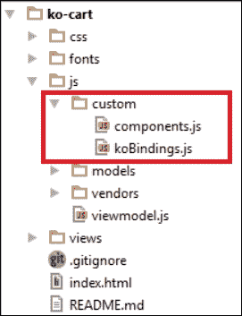
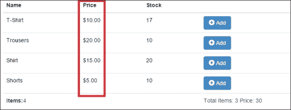
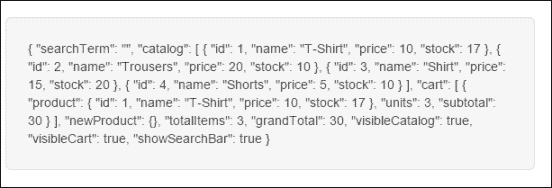
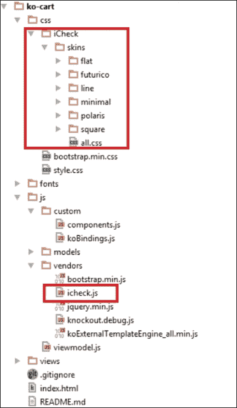
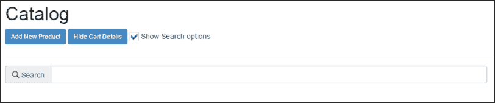
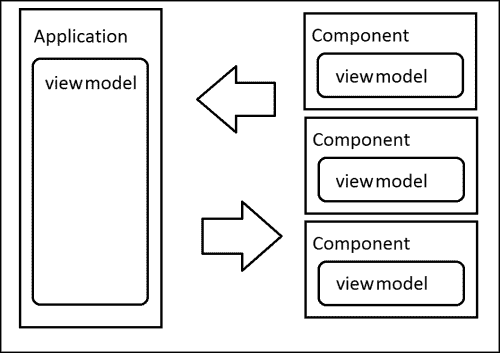

# 三、定制绑定和组件

通过在最后两章中学习的所有概念，您可以构建在现实世界中找到的大多数应用。当然，如果您仅使用这两章的知识编写代码，您应该非常整洁，因为您的代码将变得越来越大，并且很难维护。

有一次，一位谷歌工程师被问及如何构建大型应用。他的回答简短而雄辩：*不要*。不要编写大型应用。相反，编写小型应用，编写彼此交互的孤立代码片段，并用它们构建大型系统。

我们如何编写小的、可重用的、独立的代码片段来扩展 Knockout 的功能？答案是使用自定义绑定和组件。

# 定制绑定

我们知道什么是绑定，它是我们在`data-bind`属性中写入的所有内容。我们有一些内置绑定。单击和值是其中的两个。但我们可以编写自己的自定义绑定，以整洁的方式扩展应用的功能。

编写自定义绑定非常容易。它有一个我们应该始终遵循的基本结构：

```js
ko.bindingHandlers.yourBindingName = {
  init: function(element, valueAccessor, allBindings, viewModel, bindingContext) {
    // This will be called when the binding is first applied to an element
    // Set up any initial state, event handlers, etc. here
  },
  update: function(element, valueAccessor, allBindings, viewModel, bindingContext) {
    // This will be called once when the binding is first applied to an element,
    // and again whenever any observables/computeds that are accessed change
    // Update the DOM element based on the supplied values here.
  }
};
```

敲除有一个名为`bindingHandlers`的内部对象。我们可以使用自定义绑定扩展此对象。我们的绑定应该有一个名称来在`bindingHandlers`对象中引用它。我们的定制绑定是一个具有两个功能的对象，`init`和`update`。有时你应该只使用其中一个，有时两个都使用。

在`init`方法中，我们应该初始化绑定的状态。在`update`方法中，我们应该将代码设置为在绑定的模型或值更新时更新绑定。这些方法为我们提供了执行此任务的一些参数：

*   `element`：绑定涉及的 DOM 元素。
*   `valueAccessor`：这是绑定的值。它通常是一个函数或一个可观测的。如果您使用`ko.unwrap`来获取值，例如`var value = ko.unwrap(valueAccessor());`，则更安全。
*   `allBindings`：这是一个可以用来访问其他绑定的对象。您可以使用`allBindings.get('name')`获取绑定，或者使用`allBindings.has('name');`询问是否存在绑定。
*   `viewModel`：即在淘汰赛 3.x 中被弃用。您应该使用`bindingContext.$data`或`bindigContext.$rawData`来代替。
*   `bindingContext`：通过绑定上下文，我们可以访问熟悉的上下文对象，如`$root`、`$parents`、`$parent`、`$data`或`$index`来浏览不同的上下文。

我们可以为许多事情使用自定义绑定。例如，我们可以自动格式化数据（货币或日期是明显的例子），或者增加其他绑定的语义含义。使用名为`toggle`的绑定比设置`click`和`visible`绑定来显示和隐藏元素更具描述性。



具有自定义绑定和组件的新文件夹结构

## 拨动键绑定

为了向我们的应用添加新的自定义绑定，我们将在`js`文件夹中创建一个名为`custom`的新文件夹。然后我们将创建一个名为`koBindings.js`的文件，并将其链接到我们的`index.html`文件中，就在我们的模板引擎下面：

```js
<script type="text/javascript" src="js/vendors/koExternalTemplateEngine_all.min.js"></script>
<script type="text/javascript" src="js/custom/koBindings.js"></script>
```

我们的第一个定制绑定名为`toggle`。我们将使用此自定义绑定来更改布尔变量的值。通过这种行为，我们可以显示和隐藏元素，在我们的例子中，我们的购物车。只需在`koBindings.js`文件的开头编写此代码。

```js
ko.bindingHandlers.toggle = {
  init: function (element, valueAccessor) {
    var value = valueAccessor();
    ko.applyBindingsToNode(element, {
      click: function () {
          value(!value());
      }
    });
  }
};
```

在这种情况下，我们不需要使用`update`方法，因为我们在初始化绑定时设置了所有行为。我们使用`ko.applyBingidsToNode`方法将`click`函数链接到元素。`applyBindingsToNode`方法的行为与`applyBindings`相同，但我们设置了一个上下文，一个应用绑定的 DOM 节点。可以说`applyBindings`是`applyBindingsToNode($('body'), viewmodel)`的别名。

现在我们可以在应用中使用此绑定。更新`views/header.html`模板内的`showCartDetails`按钮。删除以下代码：

```js
<button class="btn btn-primary btn-sm" data-bind="click:showCartDetails, css:{disabled:cart().length  < 1}">Show Cart Details
</button>
```

更新以下按钮的代码：

```js
<button class="btn btn-primary btn-sm" data-bind="toggle:visibleCart, css:{disabled:cart().length  < 1}">
  <span data-bind="text: visibleCart()?'Hide':'Show'">
  </span> Cart Details
</button>
```

现在我们不再需要`showCartDetails`和`hideCartDetails`方法，我们可以通过`toggle`绑定直接攻击`visibleCart`变量。

通过这个简单的绑定，我们删除了代码的两个方法，并创建了一个不依赖于我们的购物车视图模型的可重用代码。因此，您可以在您想要的每个项目中重用切换绑定，因为它没有任何外部依赖关系。

我们还应该更新`cart.html`模板：

```js
<button type="button" class="close pull-right" data-bind="toggle:visibleCart"><span>&times;</span></button>
```

一旦我们进行了此更新，我们就意识到不再需要使用`hideCartDetails`。要最终删除它，请执行以下步骤：

1.  在`finishOrder`功能中，删除以下行：

    ```js
    hideCartDetails();
    ```

2.  添加以下行：

    ```js
    visibleCart(false);
    ```

没有必要保留只管理一行代码的函数。

## 货币约束

自定义绑定提供的另一个实用程序是格式化应用它们的节点的数据的选项。例如，我们可以格式化购物车的货币字段。

将此绑定添加到切换绑定的正下方：

```js
ko.bindingHandlers.currency = {
  symbol: ko.observable('$'),
  update: function(element, valueAccessor, allBindingsAccessor){
    return ko.bindingHandlers.text.update(element,function(){
      var value = +(ko.unwrap(valueAccessor()) || 0),
        symbol = ko.unwrap(allBindingsAccessor().symbol !== undefined? allBindingsAccessor().symbol: ko.bindingHandlers.currency.symbol);
      return symbol + value.toFixed(2).replace(/(\d)(?=(\d{3})+\.)/g, "$1,");
    });
  }
};
```

这里我们不打算初始化任何东西，因为初始状态和更新行为是相同的。当`init`和`update`方法做同样的事情时，必须使用`update`方法。

在本例中，我们将返回具有所需格式的数字。首先，我们使用名为`text`的内置绑定来更新元素的值。此绑定获取元素和一个函数，该函数指示如何更新此元素中的文本。在局部变量值中，我们将写入`valueAccessor`中的值。记住`valueAccessor`可以是可观察的；这就是我们使用`unwrap`方法的原因。对于`symbol`绑定，我们也应该这样做。`symbol`是我们用来设置货币符号的另一个绑定。我们不需要定义它，因为这个绑定没有行为，只是一个写/读绑定。我们可以使用`allBindingsAccesor`访问它。最后，我们返回连接两个变量的值，并设置一个正则表达式以转换格式化货币中的值。

我们可以更新`catalog`和`cart`模板中的价格绑定：

```js
<td data-bind="currency:price, symbol:'€'"></td>
```

我们可以设置所需的符号，价格格式为：€100，或者如果我们设置符号`$`或为空，我们将看到`$100`（如果价格值为 100）。



货币自定义绑定

请注意，添加越来越多有用的绑定以增加敲除功能是多么容易。



在显示$root 上下文的情况下调试容器

# 创建要调试的绑定–toJSON 绑定

当我们开发我们的项目时，我们会犯错误并发现意想不到的行为。敲除视图模型很难阅读，因为我们没有普通对象，我们有可观察对象。因此，在我们的应用中有一个方法和一个容器，向我们展示开发过程中视图模型的状态，可能是有用的。这就是为什么我们要构建一个`toJSON`绑定，它将成为我们的视图模型，成为一个简单的 JSON 对象，我们可以在屏幕或控制台中显示它。

```js
ko.bindingHandlers.toJSON = {
  update: function(element, valueAccessor){
    return ko.bindingHandlers.text.update(element,function(){
      return ko.toJSON(valueAccessor(), null, 2);
    });
  }
};
```

我们使用`ko.toJSON`对象将得到的值转换为 JSON 对象。

此函数具有与本机`JSON.stringify`函数相同的接口。它获取三个参数作为参数：

第一个参数是我们想要转换成普通 JSON 对象的对象。

第二个是 replacer 参数。它可以是函数或数组。它应该返回应该添加到 JSON 字符串中的值。有关 replace 参数的更多信息，请参阅以下链接：

[https://developer.mozilla.org/en-US/docs/Web/JavaScript/Guide/Using_native_JSON#The_replacer_parameter](https://developer.mozilla.org/en-US/docs/Web/JavaScript/Guide/Using_native_JSON#The_replacer_parameter)

最后一个表示应该应用于美化结果的空间。所以在这种情况下，我们说我们将转换包含在`valueAccesor()`方法中的对象，不使用替换函数，它将缩进两个空格。

要看到它的作用，我们应该将这一行放在具有`container-fluid`类的元素的末尾：

```js
<pre class="well well-lg" data-bind="toJSON: $root"></pre>
```

现在在这个`<div>`标记中，我们可以看到`$root`上下文是一个 JSON 对象。`$root`上下文是整个淘汰上下文的顶部，因此我们可以在这个框中看到所有视图模型。

为了在没有本机 JSON 序列化程序的旧浏览器上工作（例如 IE 7 或更早版本），您还必须引用`json2.js`库。

[https://github.com/douglascrockford/JSON-js/blob/master/json2.js](https://github.com/douglascrockford/JSON-js/blob/master/json2.js)

您可以在以下链接中阅读更多关于敲除如何将可观测值转换为纯 JSON 的信息：[http://knockoutjs.com/documentation/json-data.html](http://knockoutjs.com/documentation/json-data.html)

## 我们的绑定是语义的

有时我们编写的代码对我们来说似乎很容易，但当我们仔细观察它时，我们意识到它不是。例如，在 Knockout 中，我们有可见的内置绑定。很容易想到，如果我们想隐藏某些东西，我们只需要写：`data-bind="visible:!isVisible"`而每次我们想隐藏某些东西时，你都要写这个。这还不够清楚。我们想表达什么？默认情况下应隐藏此元素吗？当变量不可见时，它应该可见？

最好的方法是编写一个名为`hidden`的绑定。如果你有`hidden`绑定，你可以写`data-bind="hidden: isHidden";`这看起来更清晰，不是吗？此绑定很简单，让我们看一下以下代码：

```js
ko.bindingHandlers.hidden = {
  update: function (element, valueAccessor) {
    var value = ! ko.unwrap(valueAccessor());
    ko.bindingHandlers.visible.update(element, function () { 
      return value; 
    });
  }
};
```

我们只是使用`bindingHandler`的`visible`类型来更改`valueAccessor`方法的值。因此，我们构建了一个更具语义的绑定。

看看击倒是多么强大和可扩展。我们可以建立越来越多的行为。例如，如果我们想练习自定义绑定，我们可以创建自己的图像绑定来接收一组照片，而不仅仅是一组照片，我们还可以创建一个旋转木马。我们可以创建自己的链接绑定，帮助我们在应用内部导航。可能性是无穷的。

现在，让我们看看如何将 jQuery 插件集成到我们的绑定中。

## 将 jQuery 插件包装到自定义绑定中

Knockout 与 jQuery 兼容。实际上，没有必要将 jQuery 插件包装到绑定中。它将起作用，因为 Knockout 和 jQuery 彼此兼容。然而，正如我们前面提到的，jQuery 是一个 DOM 操作库，因此我们需要设置一个 ID 来定位我们想要应用插件的元素，这将创建一个依赖项。如果我们将插件封装在自定义绑定中，我们可以使用元素和`valueAccessor`参数访问元素及其值，并且可以借助`allBindings`对象传递我们需要的一切。

我们将集成一个名为`iCheck`的简单插件，它将为我们的复选框提供一个很酷的主题。

首先下载`iCheck`插件，在`js`文件夹中设置`iCheck.js`文件。然后将`skins`文件夹保存在`css`文件夹中。`iCheck`插件的下载链接如下：

[https://github.com/fronteed/iCheck/archive/2.x.zip](https://github.com/fronteed/iCheck/archive/2.x.zip)

将`css`和`javascript`文件与`index.html`文件链接：

```js
<link rel="stylesheet" type="text/css" href="css/iCheck/skins/all.css"><!-- set it just below bootstap -->
<script type="text/javascript" src="js/vendors/icheck.js">
</script><!-- set it just below jquery -->
```

现在我们需要初始化插件并更新元素的值。在这种情况下，`init`和`update`方法是不同的。所以我们需要编码绑定开始工作时会发生什么，以及值更新时会发生什么。

.



将 iCheck 添加到我们的项目中

`iCheck`插件的工作原理就是为我们的复选框提供一种样式。现在的问题是，我们需要将这个插件与我们的元素链接起来。

`iCheck`的基本行为是`$('input [type=checkbox]').icheck(config)`。当复选框的值更改时，我们需要更新绑定的值。幸运的是，`iCheck`在值发生变化时有事件要检测。

这个绑定将只管理`iCheck`行为。这意味着可观测值将由另一个绑定处理。

我们使用`checked`绑定是有道理的。分别使用这两个绑定，以便`iCheck`绑定管理表示，`checked`绑定管理值行为。

将来，我们可以删除`icheck`绑定或使用另一个绑定进行演示，复选框仍然可以正常工作。

按照我们在本章第一部分看到的`init`约定，我们将初始化插件，并在`init`方法中设置事件。在`update`方法中，当被选中绑定处理的可观察对象发生变化时，我们将更新复选框的值。

请注意，我们使用`allBindingsAccesor`对象来获取选中绑定的值：

```js
ko.bindingHandlers.icheck = {
  init: function (element, valueAccessor, allBindingsAccessor) {
    var checkedBinding = allBindingsAccessor().checked;
    $(element).iCheck({
      checkboxClass: 'icheckbox_minimal-blue',
      increaseArea: '10%'
    });
    $(element).on('ifChanged', function (event) {
      checkedBinding(event.target.checked);
    });
  },
  update: function (element,valueAccessor, allBindings) {
    var checkedBinding = allBindingsAccessor().checked;
    var status = checked?'check':'uncheck';
    $(element).iCheck(status);
  }
};
```

现在，我们可以使用它在我们的应用中以一种孤立的方式创建酷复选框。我们将用这个插件隐藏和显示我们的搜索框。

在`header.html`模板中的**显示购物车详细信息**/**隐藏购物车详细信息**按钮下方添加：

```js
<input type="checkbox" data-bind="icheck, checked:showSearchBar"/> Show Search options
```

然后转到`catalog.html`文件，在搜索栏中添加一个可见的绑定，如下所示：

```js
<div class="input-group" data-bind="visible:showSearchBar">
  <span class="input-group-addon">
    <i class="glyphicon glyphicon-search"></i> Search
  </span>
  <input type="text" class="form-control" data-bind="textInput:searchTerm">
</div>
```

将变量添加到视图模型中，并在`return`语句中进行设置，就像我们对所有其他变量所做的那样：

```js
var showSearchBar = ko.observable(true);
```

现在您可以看到一个很酷的复选框，允许用户显示和隐藏搜索栏：



## 组件-独立视图模型

自定义绑定功能强大，但有时我们需要更强大的行为。我们希望创建一个独立的元素，该元素在应用的其余部分中充当黑盒。这类元素称为**组件**。组件有自己的视图模型和模板。它也有自己的方法和事件，我们也可以说它本身就是一个应用。当然，我们可以使用依赖注入将我们的组件与主应用视图模型链接起来，但是组件可以与提供正确数据的每个应用一起工作。

我们可以构建复杂的组件，如表格、图表以及您可以想象的一切。要了解如何构建组件，可以构建一个简单的组件。我们将建造一个`add-to-cart`按钮。这是一个链接我们的目录和购物车的组件，因此通过该组件我们可以隔离目录和购物车。它们将通过该组件链接，该组件只是一个按钮，用于接收购物车和目录中的项目，并具有将项目插入购物车的所有逻辑。这非常有用，因为购物车不需要关心插入的项目，目录也不需要关心。此外，如果您需要在插入项之前或之后执行一些逻辑，那么可以在隔离的范围内执行。



组件具有与主应用交互的独立视图模型

组件的基本结构如下：

```js
ko.components.register('component-name', {
  viewModel: function(params) {
    // Data: values you want to initilaize
    this.chosenValue = params.value;
    this.localVariable = ko.observable(true);
    // Behaviors: functions
    this.externalBehaviour = params.externalFunction;
    this.behaviour = function () { ... }
  },
  template:
    '<div>All html you want</div>'
});
```

在这个模式的帮助下，我们将构建`add-to-cart`按钮。在`custom`文件夹中创建一个名为`components.js`的文件，并写入以下内容：

```js
ko.components.register('add-to-cart-button', {
  viewModel: function(params) {
    this.item = params.item;
    this.cart = params.cart;

    this.addToCart = function() {
      var data = this.item;
      var tmpCart = this.cart();
      var n = tmpCart.length;
      var item = null;

      while(n--) {
        if (tmpCart[n].product.id() === data.id()) {
          item = tmpCart[n];
        }
      }

      if (item) {
        item.addUnit();
      } else {
        item = new CartProduct(data,1);
        tmpCart.push(item);
        item.product.decreaseStock(1);
      }

      this.cart(tmpCart);
    };
  },
  template:
    '<button class="btn btn-primary" data-bind="click:addToCart">
       <i class="glyphicon glyphicon-plus-sign"></i> Add
    </button>'
});
```

我们将要添加的项目作为参数发送到购物车和购物车本身，并定义`addToCart`方法。这个方法是我们在视图模型中使用的方法，但是现在它被隔离在这个组件中，所以我们的代码变得更干净。模板是添加目录中的项目的按钮。

现在我们可以更新我们的目录行，如下所示：

```js
<tbody data-bind="{foreach:catalog}">
  <tr data-bind="style:{color:stock() < 5?'red':'black'}">
    <td data-bind="{text:name}"></td>
    <td data-bind="{currency:price, symbol:''}"></td>
    <td data-bind="{text:stock}"></td>
    <td>
      <add-to-cart-button params= "{cart: $parent.cart, item: $data}">
      </add-to-cart-button>
    </td>
  </tr>
</tbody>
```

## 先进技术

在本节中，我们将讨论一些高级技术。我们不打算将它们添加到我们的项目中，因为没有必要，但是如果我们的应用需要，我们知道我们可以使用这些方法，这是很好的。

### 控制后代绑定

如果我们的自定义绑定有嵌套绑定，我们可以告诉我们的绑定是否应该应用 Knockout 绑定，或者我们应该控制如何应用这些绑定。我们只需要在`init`方法中返回`{ controlsDescendantBindings: true }`。

```js
ko.bindingHandlers.allowBindings = {
  init: function(elem, valueAccessor) {
    return { controlsDescendantBindings: true };
  }
};
```

这段代码告诉 Knockout，名为`allowBindings`的绑定将处理所有后代绑定：

```js
<div data-bind="allowBindings: true">
  <!-- This will display 'New content' -->
  <div data-bind="text: 'New content'">Original content</div>
</div>
<div data-bind="allowBindings: false">
  <!-- This will display 'Original content' -->
  <div data-bind="text: 'New content'">Original content</div>
</div>
```

如果我们想用新属性扩展上下文，我们可以用新值扩展`bindingContext`属性。然后我们只需要使用`ko.applyBindingsToDescendants`来更新其子对象的视图模型。当然，我们应该告诉绑定它应该控制后代绑定。如果我们不这样做，它们将被更新两次。

```js
ko.bindingHandlers.withProperties = {
  init: function(element, valueAccessor, allBindings, viewModel, bindingContext) {
    var myVM = { parentValues: valueAccessor, myVar: 'myValue'};
    var innerBindingContext = bindingContext.extend(myVM);
    ko.applyBindingsToDescendants(innerBindingContext, element);
    return { controlsDescendantBindings: true };
  }
};
```

这里我们不是在创建子上下文。我们只是在扩展父上下文。如果我们想要创建子上下文来管理子节点，并且能够使用`$parentContext`魔术变量访问父上下文，我们需要使用`createChildContext`方法创建一个新的上下文。

```js
var childBindingContext = bindingContext.createChildContext(
  bindingContext.$rawData,
  null, //alias of descendant item ($data magic variable)
  function(context) {
    //manage your context variables
    ko.utils.extend(context, valueAccessor());
  });
ko.applyBindingsToDescendants(childBindingContext, element);
return { controlsDescendantBindings: true }; //Important to not bind twice
```

现在，我们可以在子节点中使用神奇的变量：

```js
<div data-bind="withProperties: { displayMode: 'twoColumn' }">
  The outer display mode is <span data-bind="text: displayMode"></span>.
  <div data-bind="withProperties: { displayMode: 'doubleWidth' }">
    The inner display mode is <span data-bind="text: displayMode"></span>, but I haven't forgotten that the outer display mode is <span data-bind="text: $parentContext.displayMode"></span>.
  </div>
</div>
```

通过修改绑定上下文和控制子体绑定，您拥有一个强大而高级的工具来创建自己的自定义绑定机制。

### 使用虚拟元素

**虚拟元素**是允许使用剔除注释的自定义绑定。您只需要告诉 Knockout，我们的绑定允许是虚拟的。

```js
ko.virtualElements.allowedBindings.myBinding = true;
ko.bindingHandlers.myBinding = {
  init: function () { ... },
  update: function () { ... }
};
```

要将绑定添加到允许的虚拟元素，我们编写以下代码：

```js
<!-- ko myBinding:param -->
<div></div>
<!-- /ko
```

虚拟元素有一个 API 来操作 DOM。您可以使用 jQuery 来操作虚拟元素，因为 Knockout 的优点之一是它与 DOM 库完全兼容，但是我们在 Knockout 文档中有一个完整的虚拟元素 API。此 API 允许我们在实现控制流绑定时执行所需的各种转换。有关虚拟元素的自定义绑定的更多信息，请参阅以下链接：

[http://knockoutjs.com/documentation/custom-bindings-for-virtual-elements.html](http://knockoutjs.com/documentation/custom-bindings-for-virtual-elements.html)

### 绑定前数据预处理

我们能够在应用绑定之前预处理数据或节点。这对于在数据显示之前格式化数据或向节点添加新类或行为非常有用。例如，您还可以设置默认值。我们只需要使用`preprocess`和`preproccessNode`方法。使用第一种方法，我们可以操纵绑定的值。对于第二个，我们可以如下操作绑定的 DOM 元素（模板）：

```js
ko.bindingHandlers.yourBindingHandler.preprocess = function(value) {
  ...
};
```

我们可以使用钩子`preprocessNode`操纵 DOM 节点。每次我们使用 Knockout 处理 DOM 元素时，都会抛出这个钩子。它不绑定到混凝土绑定。它被激发到所有已处理的节点，因此您需要一种机制来定位要操作的节点。

```js
ko.bindingProvider.instance.preprocessNode = function(node) { 
  ...
};
```

# 总结

在本章中，您已经学习了如何使用自定义绑定和组件扩展 Knockout。自定义绑定扩展了我们可以在`data-bind`属性中使用的选项，并赋予我们使代码更具可读性的能力，将 DOM 和数据操作隔离在其中。另一方面，我们有组件。组件有自己的视图模型。它们本身就是一个独立的应用。它们帮助我们通过彼此交互的小块代码构建复杂的应用。

现在，您已经知道如何将应用拆分为小块代码，在下一章中，您将学习如何以一种不引人注目的方式使用事件，以及如何扩展可观察性以提高 Knockout 的性能和功能。

要从本章下载代码，请访问位于[的 GitHub 存储库 https://github.com/jorgeferrando/knockout-cart/tree/chapter3](https://github.com/jorgeferrando/knockout-cart/tree/chapter3) 。