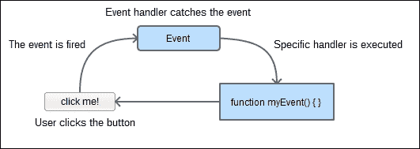
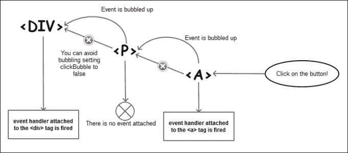
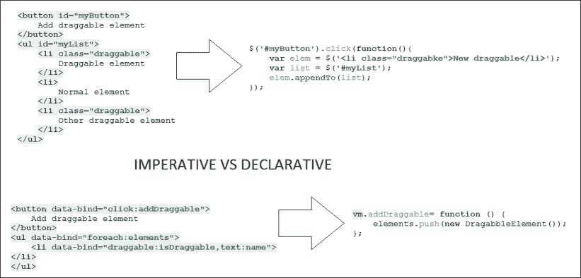
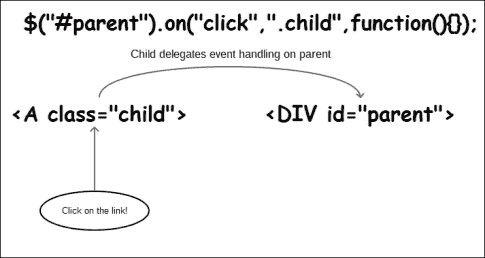
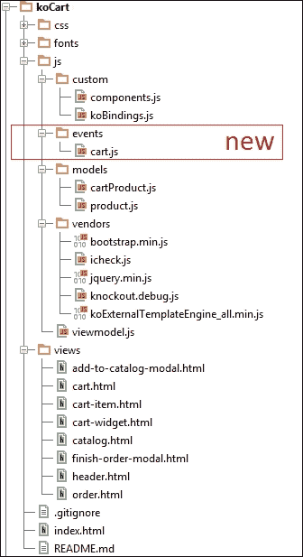

# 四、KnockoutJS 事件的管理

我们的应用和用户之间的交互是我们需要解决的最重要的问题。在最后三章中，我们重点讨论了业务需求，因此现在是时候考虑如何让最终用户轻松使用我们的应用了。

事件驱动编程是一种强大的范例，它允许我们更好地隔离代码。KnockoutJS 为我们提供了几种处理事件的方法。如果我们想使用声明性范例，我们可以使用点击绑定或事件绑定。

有两种不同的范例来声明事件。声明性范例表示我们可以在 HTML 中编写 JavaScript 和自定义标记。另一方面，命令式范例告诉我们应该将 JavaScript 代码与 HMTL 标记分离。为此，我们可以使用 jQuery 编写不引人注目的事件以及自定义事件。我们可以使用`bindingHandlers`包装自定义事件，以便在应用中重用它们。

# 事件驱动编程

当我们使用顺序编程来编写我们的应用时，我们确切地知道我们的应用将如何运行。当我们的应用与外部代理没有交互时，我们通常使用这种编程模式。在 web 开发中，我们需要使用事件驱动编程范式，因为最终用户将领导应用的变化。

尽管我们之前没有讨论过事件，但我们知道它们是什么，因为我们一直在使用 web 开发中最重要的事件之一，单击事件。

用户可以抛出许多事件。正如我们前面提到的，点击事件是用户可以按下键盘上的一个键；我们还可以从计算机接收事件，比如 ready 事件，通知我们 DOM 元素都已加载。现在我们也有触摸事件，如果我们的屏幕是可触摸的。

我们还可以定义自定义事件。如果我们想与实体通信，但不想在它们之间创建依赖关系，那么这很有用。例如，假设我们要将项目添加到购物车中。现在，将项目添加到购物车的责任在于视图模型。我们可以创建一个购物车实体来封装所有购物车行为：添加、编辑、删除、显示、隐藏等等。如果我们开始写代码：`cart.add`、`cart.delete`或`cart.show`，我们的应用将依赖于`cart`对象。如果我们在应用中创建事件，我们只需要触发它们并忘记将要发生的事情，因为事件处理程序将为我们管理它。

事件驱动编程允许我们减少耦合，但也降低了内聚性。我们应该选择您希望代码保持可读性的级别。事件驱动编程有时是一个很好的解决方案，但有一条规则我们应该始终遵循：KISS（保持简单，愚蠢）。因此，如果一个事件是一个简单的解决方案，那么就去做吧。如果事件只是增加了在 ADOT0 代码中的行，并且没有给我们一个更好的结果，也许你应该考虑依赖注入作为一种更好的方法。



事件驱动编程工作流

# 点击事件

在最后三章中，我们一直在使用点击绑定。在这一节中，您将了解更多有关此事件的信息。单击事件是用户用来与应用交互的基本事件，因为鼠标是外围的卓越（也是键盘）。

您必须了解，如果将函数附加到 click 绑定，则该函数将与 click 事件一起激发。问题是，在 Knockout 中，click 事件不接受参数。据我们所知，click 函数的参数是预定义的。

## 传递更多参数

正如我们已经提到的一样，我们绑定到点击事件的函数有一个预定义的签名：`function functionName(data, event){...}`，并且两个参数都已经分配：数据是绑定到元素的数据，事件是点击事件对象。那么，如果我们想传递更多的参数，会发生什么呢？我们有三种解决方案，如下所示：

*   第一个是绑定视图模型中的参数：

    ```js
    function clickEventFunctionWithParams(p1, p2, data, event) {
      //manageEvent
    }

    function clickEventFunction(data, event) {
      clickEventFunctionWithParams('param1', 'param2', data, event);
    }
    ```

*   第二个选项是内联编写函数。如果我们想直接从模板中的上下文对象传递参数，这很有趣。

    ```js
    <button data-bind="click: function(data, event) {
      clickEventFunctionWithParams($parent.someVariable, $root.otherVariable, data, event);
    }">Click me</button>
    ```

*   我们的第三个也是最后一个解决方案是第二个解决方案的变体，但更加优雅：

    ```js
    <button data-bind="
      click: clickEventFunctionWithParams.bind($data, 'param1', 'param2')"
    >Click me</button>
    ```

我们可以使用最接近我们需要的。例如，如果我们要传递的参数是常量或视图模型中的可观测值，我们可以使用第一个参数。但是如果我们需要传递上下文变量，比如`$parent`，我们可以使用最后一个。

`bind`函数是 JavaScript 的本机函数。它使用`$data`作为上下文创建另一个函数，然后将其余参数应用于自身。您可以在[找到更多信息 https://developer.mozilla.org/en-US/docs/Web/JavaScript/Reference/Global_Objects/Function/bind](https://developer.mozilla.org/en-US/docs/Web/JavaScript/Reference/Global_Objects/Function/bind) 。

## 允许默认点击动作

默认情况下，KnockoutJS 阻止单击时的默认操作。这意味着，如果您在锚定标记（`<a>`中使用点击动作，浏览器将运行我们链接的动作，而不会导航到链接的`href`。此默认行为非常有用，因为如果使用单击绑定，通常是因为希望执行不同的操作。如果您想让浏览器运行默认操作，只需在函数末尾返回`true`：

```js
function clickEventFunction(data, event) {
  //run your code...

  //it allows to run the default behavior.
  //In anchor tags navigates to href value.
  return true;
}
```

## 事件冒泡

默认情况下，Knockout 允许 click 事件继续冒泡到任何更高级别的事件处理程序。如果您的元素有一个父元素也处理单击事件，那么您将启动这两个函数。为了避免冒泡事件，您需要包含一个名为`clickBubble`的附加绑定，并将其设置为`false`。

```js
<button data-bind="{
  click: clickEventFunction,
  clickBubble: false
}">Click me</button>
```



事件冒泡工作流

# 事件类型

浏览器可以抛出许多类型的事件。您可以在[找到完整的参考资料 https://developer.mozilla.org/en-US/docs/Web/Events](https://developer.mozilla.org/en-US/docs/Web/Events) 。

正如我们所知，每个浏览器都有自己的指令集；因此，我们可以将事件分为以下几组：

*   **标准事件**：这些事件是在官方网站规范中定义的，应该是跨浏览器的通用事件。
*   **非标准事件**：这些事件是专门为每个浏览器引擎定义的。
*   **Mozilla 特定事件**：这些事件用于插件开发，包括以下内容：
    *   附加特定事件
    *   XUL 事件

# 事件绑定

为了捕捉并处理所有这些不同的事件，Knockout 具有`event`绑定。在以下代码的帮助下，我们将使用它来显示和隐藏调试面板（当鼠标在文本上移动时）：

1.  The first update of the `index.html` template is as follows. Replace the debug div with this new HTML:

    ```js
    <div data-bind="event: {
      mouseover:showDebug,
      mouseout:hideDebug
    }">
      <h3 style="cursor:pointer">
        Place the mouse over to display debug
      </h3>
      <pre class="well well-lg" data-bind="visible:debug, toJSON: $root"></pre>
    </div>
    ```

    这段代码说，当我们将鼠标放在`div`元素上时，我们将显示调试面板。最初，仅显示`h3`标签内容。

2.  当我们将鼠标置于`h3`标记上时，我们将更新调试变量值，并显示调试面板。为了实现这一点，我们需要使用以下代码更新视图模型：

    ```js
    var debug = ko.observable(false);

    var showDebug = function () {
      debug(true);
    };

    var hideDebug = function () {
      debug(false);

      };
    ```

3.  然后我们需要更新我们的接口（视图模型的返回值）。

    ```js
    return {
      debug: debug,
      showDebug:showDebug,
      hideDebug:hideDebug,
      searchTerm: searchTerm,
      catalog: filteredCatalog,
      cart: cart,
      newProduct: newProduct,
      totalItems:totalItems,
      grandTotal:grandTotal,
      addProduct: addProduct,
      addToCart: addToCart,
      removeFromCart:removeFromCart,
      visibleCatalog: visibleCatalog,
      visibleCart: visibleCart,
      showSearchBar: showSearchBar,
      showCartDetails: showCartDetails,
      hideCartDetails: hideCartDetails,
      showOrder: showOrder,
      showCatalog: showCatalog,
      finishOrder: finishOrder
    };
    ```

现在，当鼠标越过`h3`标记时，将显示调试面板。试试看！

# 使用 jQuery 的不引人注目的事件

在过去几年中，从 HTML 模板中删除所有 JavaScript 是一种很好的做法。如果我们从 HTML 模板中删除所有 JavaScript 代码并将其封装在 JavaScript 文件中，那么我们就是在进行命令式编程。另一方面，如果我们编写 JavaScript 代码或在 HTML 文件中使用组件和绑定，那么我们就是在使用声明式编程。许多程序员不喜欢使用声明式编程。他们认为这使得设计师更难使用模板。我们应该注意，设计师不是程序员，他们可能不理解 JavaScript 语法。此外，声明式编程将相关代码拆分为不同的文件，这可能会使您难以理解整个应用的工作方式。他们还指出，双向绑定使模型不一致，因为它们是动态更新的，没有任何验证。另一方面，我们有人认为声明式编程使代码更易于维护、模块化和可读，并且说如果使用命令式编程，则需要用不必要的 ID 和类填充标记。

没有绝对的真理。你应该在两种范式之间找到平衡。声明性特性在删除经常使用的特性并使其简单化方面非常有效。`foreach`绑定及其兄弟，以及语义 HTML（组件），使代码易于阅读并消除复杂性。我们必须自己用 JavaScript 编写，使用选择器与 DOM 交互，并为团队提供一个通用平台，以便他们能够关注应用的工作方式，而不是模板和模型之间的通信方式。

还有其他框架，比如余烬、React 或 AngularJS，成功地使用了声明性范式，所以这毕竟不是一个坏主意。但是，如果您觉得使用 jQuery 定义事件更舒服，那么您将学习如何这样做。我们将以不显眼的方式编写**确认订单**按钮。

首先，删除`data-bind`属性并添加一个 ID 来定位按钮：

```js
<button id="confirmOrderBtn" class="btn btn-primary btn-sm">
  Confirm Order
</button>
```

现在通过`applyBindings`方法编写以下 JavaScript 代码：

```js
$(document).on('click', '#confirmOrderBtn').click(function() {
  vm.showOrder();
});
ko.applyBindings(vm);
```

两种方法都是正确的；由程序员决定选择哪种范式。

如果我们选择以 jQuery 方式编写事件，那么在文件中加入所有事件也是一种很好的做法。如果您没有很多事件，您可以有一个名为`events.js`的文件，或者如果您有很多事件，您可以有几个文件，例如`catalog.events.js`或`cart.events.js`。



命令式范式与陈述式范式

# 委托模式

当我们处理大量数据时，正常的事件处理会影响性能。有一种技术可以提高事件的响应时间。

当我们将事件直接链接到项目时，浏览器会为每个项目创建一个事件。但是，我们可以将事件委托给其他元素。通常，此元素可以是文档或元素的父元素。在本例中，我们将把它委托给文档，该文档是从产品中添加或删除一个单元的事件。问题是，如果我们只为所有产品定义一个事件管理器，我们如何设置我们正在管理的产品？KnockoutJS 为我们提供了一些有用的方法来成功实现这一点，`ko.dataFor`和`ko.contextFor`。

1.  我们应该通过分别添加`add-unit`和`remove-unit`类来更新`cart-item.html`文件的添加和删除按钮：

    ```js
    <span class="input-group-addon">
      <div class="btn-group-vertical">
        <button class="btn btn-default btn-xs add-unit">
          <i class="glyphicon glyphicon-chevron-up"></i>
        </button>
        <button class="btn btn-default btn-xs remove-unit">
          <i class="glyphicon glyphicon-chevron-down"></i>
        </button>
      </div>
    </span>
    ```

2.  然后我们应该在`Confirm Order`事件下方添加两个新事件：

    ```js
     $(document).on("click", ".add-unit", function() {
      var data = ko.dataFor(this);
      data.addUnit();
    });

    $(document).on("click", ".remove-unit", function() {
      var data = ko.dataFor(this);
      data.removeUnit();
    });
    ```

3.  使用和`ko.dataFor`方法，如果我们在 KnockoutJS 上下文中，我们可以得到与`$data`相同的内容。有关非结构化事件处理程序的更多信息，请转至[http://knockoutjs.com/documentation/unobtrusive-event-handling.html](http://knockoutjs.com/documentation/unobtrusive-event-handling.html)
4.  如果我们想访问上下文，我们应该使用`ko.contextFor`；如本例所示：

    ```js
    $(document).on("click", ".add-unit", function() {
      var ctx = ko.contextFor(this);
      var data = ctx.$data;
      data.addUnit();
    });
    ```

因此，如果我们有数千个产品，我们仍然只有两个事件处理程序，而不是数千个。下图显示了委托模式如何提高性能：



委托模式提高了性能

# 构建自定义事件

有时我们需要使应用中的两个或多个实体相互通信，而这些实体并不相关。例如，我们希望保持购物车独立于应用。我们可以创建自定义事件，从外部对其进行更新，购物车将对此事件做出反应；应用所需的业务逻辑。

我们可以将事件拆分为两个不同的事件：单击和操作。因此，当我们单击向上箭头添加产品时，我们会触发一个新的自定义事件来处理新单元的添加，并触发相同的事件来删除它。这为我们提供了有关应用中发生的事情的更多信息，并且我们意识到一个一般意义上的事件（如 click）只是获取数据并将其发送给一个更专门的事件处理程序，该处理程序知道如何处理它。这意味着我们可以将事件的数量减少到一个。

1.  Create a `click` event handler at the end of the `viewmodel.js` file that throws a custom event:

    ```js
    $(document).on("click", ".add-unit", function() {
      var data = ko.dataFor(this);
      $(document).trigger("addUnit",[data]);
    });

    $(document).on("click", ".remove-unit", function() {
      var data = ko.dataFor(this);
      $(document).trigger("removeUnit, [data]);
    });

    $(document).on("addUnit",function(event, data){
      data.addUnit();
    });
    $(document).on("removeUnit",function(event, data){
      data.removeUnit();
    });
    ```

    粗体线显示了我们应该如何使用 jQuery 触发器方法来发出自定义事件。自定义事件将焦点放在正在执行操作的元素上，而不是集中在触发操作的元素上。这给了我们一些好处，比如代码的清晰性，因为定制事件在其名称中对其行为有意义（当然我们可以将事件称为`event1`，但我们不喜欢这种做法，是吗？）。

    您可以阅读更多关于定制事件的信息，并在[的 jQuery 文档中看到一些示例 http://learn.jquery.com/events/introduction-to-custom-events/](http://learn.jquery.com/events/introduction-to-custom-events/) 。

2.  既然我们已经定义了我们的事件，现在是时候将它们全部移动到一个单独的文件中了。我们称此文件为`cart/events.js`。此文件将包含应用的所有事件。

    ```js
    //Event handling
    (function() {
      "use strict";
      //Classic event handler
      $(document).on('click','#confirmOrder', function() {
        vm.showOrder();
      });
      //Delegated events
      $(document).on("click", ".add-unit", function() {
        var data = ko.dataFor(this);
        $(document).trigger("addUnit",[data]);
      });
      $(document).on("click", ".remove-unit", function() {
        var data = ko.dataFor(this);
        $(document).trigger("removeUnit, [data]);
      })
      $(document).on("addUnit",function(event, data){
       data.addUnit();
      });
      $(document).on("removeUnit",function(event, data){
       data.removeUnit();
      });
    })();
    ```

3.  最后，将文件添加到脚本部分的末尾，就在`viewmodel.js`脚本的下方：

    ```js
    <script type="text/javascript" src="js/cart/events.js"></script>
    ```

我们应该注意到现在与购物车的通信是使用事件完成的，我们没有证据表明存在一个名为`cart`的对象。我们只知道我们交谈的对象有一个接口，它有两种方法，`addUnit`和`removeUnit`。我们可以更改接口中的对象（HTML），如果我们尊重接口，它将按照我们的预期工作。

# 事件和绑定

我们可以在`bindingHandlers`中包装事件和自定义事件。假设我们只在按下*回车*键时需要过滤产品。这允许我们减少对 filter 方法的调用，如果我们对服务器进行调用，这种做法可以帮助我们减少通信量。

在`custom/koBindings.js`文件中定义自定义绑定处理程序：

```js
ko.bindingHandlers.executeOnEnter = {
  init: function (element, valueAccessor, allBindingsAccessor, viewModel) {
    var allBindings = allBindingsAccessor();
    $(element).keypress(function (event) {
      var keyCode = (event.which ? event.which : event.keyCode);
      if (keyCode === 13) {
        allBindings.executeOnEnter.call(viewModel);
        return false;
      }
      return true;
    });
  }
};
```

由于这是一个事件，我们应该记住事件初始化可以在`init`方法本身中设置。我们用 jQuery 捕捉`keypress`事件并跟踪已按下的键。*回车*键的键码为 13。如果我们按下*回车*键，我们将在视图模型的上下文中调用`executeOnEnter`绑定值。这就是`allBindings.executeOnEnter.call(viewModel);`所做的。

然后我们需要更新我们的视图模型，因为我们过滤的目录是一个计算的可观察对象，它会在每次键按下时更新自身。现在我们需要将这个计算出的可观测值转换成一个简单的可观测数组。因此，按如下方式更新您的`filteredCatalog`变量：

```js
//we set a new copy from the initial catalog
var filteredCatalog = ko.observableArray(catalog());
```

认识到以下变化的后果：

```js
var filteredCatalog = catalog();
```

我们不是在复制，而是在创建引用。如果我们这样做，当我们过滤目录时，我们将丢失项目，并且我们将无法再次获得它们。

现在我们应该创建一个过滤目录项的方法。此函数的代码与我们在上一版本中的计算值类似：

```js
var filterCatalog = function () {
  if (!catalog()) {
    filteredCatalog([]);
  }
  if (!filter) {
    filteredCatalog(catalog());
  }
  var filter = searchTerm().toLowerCase();
  //filter data
  var filtered = ko.utils.arrayFilter(catalog(), function(item){
    var strProp = ko.unwrap(item["name"]).toLocaleLowerCase();
    if (strProp && (strProp.indexOf(filter) !== -1)) {
      return true;
    }
    return false;
  });
  filteredCatalog(filtered);
};
```

现在将其添加到`return`语句中：

```js
return {
  debug: debug,
  showDebug:showDebug,
  hideDebug:hideDebug,
  searchTerm: searchTerm,
  catalog: filteredCatalog,
  filterCatalog:filterCatalog,
  cart: cart,
  newProduct: newProduct,
  totalItems:totalItems,
  grandTotal:grandTotal,
  addProduct: addProduct,
  addToCart: addToCart,
  removeFromCart:removeFromCart,
  visibleCatalog: visibleCatalog,
  visibleCart: visibleCart,
  showSearchBar: showSearchBar,
  showCartDetails: showCartDetails,
  hideCartDetails: hideCartDetails,
  showOrder: showOrder,
  showCatalog: showCatalog,
  finishOrder: finishOrder
};
```

最后一步是更新`catalog.html`模板内的搜索元素：

```js
<div class="input-group" data-bind="visible:showSearchBar">
  <span class="input-group-addon">
    <i class="glyphicon glyphicon-search"></i> Search
  </span>
  <input type="text" class="form-control"
  data-bind="
    textInput: searchTerm,
    executeOnEnter: filterCatalog"
  placeholder="Press enter to search...">
</div>
```

现在，如果在搜索中写入，则不会更新输入项；但是，当您按下*输入*时，将应用过滤器。

这是插入新代码后我们的文件夹结构的外观：



文件夹结构

# 总结

在本章中，您学习了如何使用 Knockout 和 jQuery 管理事件。您已经学习了如何结合这两种技术，根据项目的需求应用不同的技术。我们可以使用声明性范例来组合事件附加、`bindingHandlers`和 HTML 标记，或者我们可以使用 jQuery 事件隔离 JavaScript 代码中的事件。

在下一章中，我们将讨论与服务器通信的问题。您将学习如何验证用户的输入，以确保我们向服务器发送干净、正确的数据。

我们还将使用模拟技术来模拟数据服务器端。使用模拟库将有助于我们开发前端应用，而不需要一个完全运行的服务器。为了发送 AJAX 请求，我们将获得一个非常简单的服务器来运行我们的应用，因为浏览器默认不允许本地 AJAX 请求。

记住您可以在 GitHub 查看本章的代码：

[https://github.com/jorgeferrando/knockout-cart/tree/chapter4](https://github.com/jorgeferrando/knockout-cart/tree/chapter4)