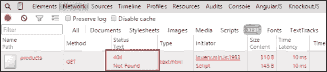

# 五、从服务器获取数据

我们现在有了一个购物车应用。要使它作为一个真实世界的应用工作，我们需要它从服务器获取数据。然而，本书关注的是如何使用 KnockoutJS 开发项目，而不是如何配置和运行服务器。

幸运的是，这种情况在每个项目中都会发生。前端开发人员开始只使用数据规范，而不使用任何后端服务器。

在本章中，我们将构建一个功能齐全的前端通信层，后端没有服务器。为了成功完成这项任务，我们将用假对象模拟数据层。当我们移除模拟层时，我们的应用将能够处理真实数据。这将帮助我们更快、更安全地开发应用：更快，因为我们不需要等待真正的服务器响应；更安全，因为我们的数据操作不会影响真正的服务器。

# 休息服务

在本章中，您将学习如何使前端层与后端层通信。

您并不是在构建一个简单的网页。您正在构建一个 web 应用。这意味着您的项目不仅包含要显示给用户的数据，还包含一些要单击和导航的锚。这个网页后面还有一个逻辑和模型层，这使得它比一个简单的网页更复杂。

为了与服务器通信，前端使用 web 服务。**W3C**（简称**万维网联盟**）将 Web 服务定义为一种软件系统，旨在通过网络支持可互操作的机器间交互。有许多协议可用于执行此交互：SOAP、POX、REST、RPC 等等。

如今在 web 开发中，RESTful 服务是最常用的。这是因为**REST**（简称**代表性状态转移**）协议具有一些特点，使其易于在此类应用中使用：

*   它们基于 URI
*   使用 internet 媒体类型进行通信（通常是 JSON，但也可以是 XML 或其他类型）
*   HTTP 方法是标准的：`GET`、`POST`、`PUT`、`DELETE`
*   可以使用超链接引用资源的状态

为了理解这些概念，我们将看到一些例子。考虑到购物车场景，假设要检索所有产品，请执行以下操作：

1.  定义 API 的入口点。RESTful 协议基于 URI，如下所示：

    ```js
    http://mydomain.com/api/
    ```

2.  现在您希望检索所有产品，因此请定义一个指向此资源的 URI:

    ```js
    http://mydomain.com/api/products
    ```

3.  由于这是一个检索操作，HTTP 头应该包含如下的`GET`方法：

    ```js
    GET /api/products HTTP/1.1
    ```

4.  为了利用 HTTP 协议的优势，您可以在报头中发送元数据；例如，您正在发送的数据类型和您想要接收的数据，按以下方式：

    ```js
    'Content-Type': 'application/json' //what we send
    Accept: 'application/json; charset=utf-8'//what we expect
    ```

5.  服务器将以预期格式的一些数据和 HTTP 头中通常包含的一些信息进行响应，如操作状态：`HTTP/1.1 200 OK`。以下是格式：
    *   2xx，如果一切顺利
    *   4xx，如果前端有错误
    *   5xx，如果服务器端出现错误

如果要更新或删除对象，请将此对象的 ID 附加到 URI 并使用相应的标头。例如，要编辑或删除产品，请使用适当的方法调用此 URI：`PUT`进行编辑，`DELETE`进行删除。服务器将正确管理这些请求，并在 URI 和标头中查找信息，例如：

```js
http://mydomain.com/api/products/1
```

有关 REST 和 RESTful 服务的更多信息，请参阅[http://en.wikipedia.org/wiki/Representational_state_transfer](http://en.wikipedia.org/wiki/Representational_state_transfer) 。

# 定义积垢

当您定义服务来发送和接收数据时，此对象通常应该执行最低级别的行为。您可以通过首字母缩略词**CRUD**识别这种行为：

*   **创建（C）**：您需要向服务器发送一条包含新对象的消息，以将其持久化到数据库中。HTTP`POST`动词用于此类请求。
*   **检索（R）**：服务应该能够发送请求以获取对象集合或一个特定对象。`GET`动词用于此类请求。
*   **更新（U）**：这是更新对象的请求。按照惯例，`PUT`动词用于此类请求。
*   **删除（D）**：这是删除对象的请求。`DELETE`动词用于此类请求。

可以实现更多操作，有时不需要编写所有 CRUD 方法的代码。您应该使代码适应应用的要求，并只定义应用需要的操作。请记住，编写比应用需要更多的代码意味着可能会在代码中编写更多错误。

# 单体资源

在这个应用中，我们将资源称为与 API 服务器中包含的 URI 相关的对象。这意味着为了管理`/products`URI，我们将有一个`ProductResource`对象来管理该 URI 的 CRUD 操作。

我们将把这个对象创建为一个单例，以保证只有一个对象管理应用中的每个 URI。有关单例的更多信息，请参阅[http://en.wikipedia.org/wiki/Singleton_pattern](http://en.wikipedia.org/wiki/Singleton_pattern) 。

# 在资源中设置 CRUD 操作

我们将定义一些服务来定义我们产品和订单的 CRUD 操作。一些开发人员犯的一个常见错误是在模型类中设置 CRUD 操作。最佳实践表明，最好将模型和通信层分开。

要准备项目，请创建一个名为`services`的文件夹。在此文件夹中，存储将包含 CRUD 操作的文件。执行以下步骤：

1.  在新文件夹中创建两个文件。它们代表两种通信服务：`OrderResource.js`和`ProductResource.js`。
2.  Open the `ProductResource.js` file and define basic CRUD operations as follows:

    ```js
    var ProductResource = (function () {
      function all() {}
      function get(id) {}
      function create(product) {}
      function update(product) {}
      function remove(id) {}
      return {
        all: all,
        get: get,
        create: create,
        update: update,
        remove: remove
      };
    })();
    ```

    这是 CRUD 服务的框架。您可以使用`all`和`get`方法来定义检索操作。`all`方法将返回所有产品，`get`仅返回 ID 作为参数传递的产品。`create`方法将创建一个产品，`update`方法将更新一个产品。`remove`方法将执行删除操作。我们称之为`remove`，因为`delete`在 JavaScript 语言中是一个保留字。

3.  To implement the body of these methods, use jQuery AJAX calls ([http://api.jquery.com/jquery.ajax/](http://api.jquery.com/jquery.ajax/)). Such requests to the server are asynchronous and use a concept called promise ([http://api.jquery.com/promise/](http://api.jquery.com/promise/)). A **promise** is just an object that will contain a value in the future. This value is handled by using a callback function.

    

    承诺图：承诺执行异步代码

4.  要定义`retrieve`方法，您需要定义 AJAX 请求的配置。调用此方法将返回一个承诺。您可以通过以下方式在视图模型中处理此承诺中包含的数据：

    ```js
    function all() {
      return $.ajax({
        dataType:'json',
        type: 'GET',
        url: '/products'
      });
    }
    function get(id) {
      return $.ajax({
        dataType:'json',
        type: 'GET',
        url: '/products/'+id
      });
    }
    ```

5.  注意，您只需要定义服务器可用于获取数据的响应类型和端点（您可以在前面提供的 jQuery 文档中看到更多参数）。同时完成`CREATE`、`UPDATE`和`DELETE`方法。记住尊重动词（`POST`、`PUT`和`DELETE`。

    ```js
    function create(product) {
      return $.ajax({
        datatype:'json',
        type: 'POST',
        url: '/products',
        data: product
      });
    }
    function update(product) {
      return $.ajax({
        datatype:'json',
        type: 'PUT',
        url: '/products/'+product.id,
        data: product
      });
    }
    function remove(id) {
      return $.ajax({
        datatype:'json',
        type: 'DELETE',
        url: '/products/'+id
      });
    }
    ```

请记住，您正在构建 RESTAPI，因此请遵循体系结构的约定。这意味着实体的 URL 应以复数形式命名。

要获取所有产品，请使用`/products`URL。要仅获取一个产品，仍然使用`/products`URL，但还要将产品 ID 添加到 URI 中。例如，`/products/7`将返回 ID 号为`7`的产品。如果关系更深，例如“客户 5 有消息”，则将路由定义为`/customers/5/messages`。如果您想从用户`5`处读取 ID 为`1`的消息，请使用`/customers/5/message/1`。

在一些情况下，您可以使用单数名称，例如`/customers/5/configuration/`，因为用户通常只有一个配置。什么时候单词应该是复数，这取决于你自己。唯一的要求是保持一致。如果您喜欢使用单数形式的所有名称，您可以这样做，这没有问题。名称多元化只是一种惯例，而不是规则。

# 在视图模型中使用资源

既然我们已经创建了我们的产品资源，我们将在视图模型中使用它，通过以下步骤获取我们的数据：

1.  First of all, link the `ProductResource.js` file in the `index.html` file, as follows:

    ```js
    <script type='text/javascript' src='js/resources/ProductResource.js'></script>
    ```

    由于资源是异步工作的，因此无法在文件末尾应用绑定，因为数据可能尚未准备好。因此，应该在数据到达时应用绑定。

    为此，创建一个名为`activate`的方法。此方法将在文件末尾激发，与我们前面调用的`ko.applyBindings`行相同，方式如下：

    1.  取这行代码：

        ```js
        ko.applyBindings(vm);
        ```

    2.  换成这个：

        ```js
        vm.activate();
        ```

2.  Now define the `activate` method in the view-model:

    ```js
    var activate = function () {
      ProductResource.all().done(allCallbackSuccess);
    };
    ```

    当您调用`all`方法时，将返回 jQuery 承诺。为了管理 promise 的结果，jQuery 提供了 promise API：

    *   `.done(callback)`：承诺解析成功时触发此方法。这意味着已收到不同于 5xx 或 4xx 的状态。
    *   `.fail(callback)`：您可以使用此方法处理被拒绝的承诺。它由 5xx 和 4xx 头触发。
    *   `.then(successCb, errorCb)`：此方法获取两个回调作为参数。如果承诺得到解决，则调用第一个，如果承诺被拒绝，则调用第二个。
    *   `.always(callback)`：传递给此方法的回调在两种情况下都运行。

    通过使用 HTTP 头，您可以避免在主体响应中发送额外信息，从而知道您有错误。了解您正在使用的协议（在本例中为 HTTP）并尝试利用其所有优势（在本例中为在其标头中发送信息的可能性）非常重要。

3.  Now it is time to define the `allCallbackSuccess` method:

    ```js
    var allCallbackSuccess = function(response){
      catalog([]);
      response.data.forEach(function(item){
        catalog.push( 
          Product (item.id, item.name, item.price, item.stock)
        );
      });
      filteredCatalog(catalog());
      ko.applyBindings(vm);
    };
    ```

    jQuery AJAX 回调始终将响应作为第一个参数。在本例中，您将获得一个包含目录中所有项的 JSON 响应。

    第一步是将目录初始化为空数组。初始化目录后，迭代项集合。此集合存储在数据对象中。将数据隔离在其他变量中是一种很好的做法。这只是为了防止您想向响应中添加元数据。目录准备好后，将其链接到`filteredCatalog`方法。

    当您准备好初始数据时，您可以调用`ko.applyBindings`方法。如果您在回调范围之外调用它，则无法确定目录中是否包含所有项。这是因为资源异步执行操作，这意味着代码不是按顺序执行的。当资源返回的承诺具有可用数据时，执行该承诺。

4.  最后一步是在文件末尾运行`activate`方法，如下所示：

    ```js
    //ko External Template Settings
    infuser.defaults.templateSuffix = '.html';
    infuser.defaults.templateUrl = 'views';
    vm.activate();

    ```

如果我们运行应用，它将无法工作，因为没有服务器来处理我们的请求。我们将得到一个 404 错误。为了解决这个问题，我们将模拟 AJAX 调用和数据。



在没有服务器的情况下进行 AJAX 调用将抛出 404 错误

# 使用 Mockjax 模拟 HTTP 请求

**模拟****数据**只意味着用另一个模拟其行为的函数替换`$.ajax`调用。当遵循测试驱动的开发范式时，模拟是一种常用的技术。

为了模拟 jQueryAjax 调用，我们将使用一个名为 Mockjax 的库。要在应用中安装 Mockjax，请执行以下步骤：

1.  从[下载库 https://github.com/jakerella/jquery-mockjax](https://github.com/jakerella/jquery-mockjax) 。
2.  保存到`vendors`文件夹中。
3.  在`index.html`页面中，jQuery 库之后添加一个引用。为此，请使用`<script>`标记，如下所示：

    ```js
    <script type='text/javascript' src='vendors/jquery.mockjax.js'></script>
    ```

4.  创建一个名为`mocks`的文件夹，并在其中创建一个`product.js`文件。
5.  In the `product.js` file, define a mock calling the `$.mockjax` function, as follows:

    ```js
    $.mockjax({
      url: '/products',
      type: 'GET',
      dataType: 'json',
      responseTime: 750,
      responseText: []
    });
    ```

    在这个定义中，您模拟的是在`ProducResource.all()`方法中调用的请求。要定义模拟，只需定义以下参数：

    *   **url**：您要模拟的 url
    *   **类型**：请求的类型
    *   **数据类型**：您期望的数据类型
    *   **响应时间**：响应的持续时间
    *   **responseText**：响应的主体

# 使用 MockJSON 生成模拟数据

一旦模拟了 HTTP 调用，您需要在响应中发送一些数据。你有不同的可能性：

*   您可以在`$.mockjax`调用的`responseText`属性中手工写入数据：

    ```js
    $.mockjax({
      url: '/products',
      type: 'GET',
      dataType: 'json',
      responseTime: 750,
      responseText: ['Here I can fake the response']
    });
    ```

*   您可以使用函数生成模拟数据：

    ```js
    $.mockjax({
      url: '/products',
      type: 'GET',
      dataType: 'json',
      responseTime: 750,
      response: function(settings) {
        var fake = 'We fake the url:'+settings.url;
        this.responseText = fake;
      }
    });
    ```

*   You can use a library that generates complex and random data in the response.

    第三个选项可以使用名为`mockJSON`的库执行。您可以从 GitHub 存储库[下载 https://github.com/mennovanslooten/mockJSON](https://github.com/mennovanslooten/mockJSON) 。

    此库允许您生成数据模板以创建随机数据。这有助于使伪造数据更真实。您可以在屏幕上看到许多不同类型的数据。这将帮助您检查更多的数据显示可能性，例如溢出到容器中的单词或太长或太短且在屏幕上看起来难看的文本。

    *   To generate a random element, define a mock template like this:

        ```js
        $.mockJSON.generateFromTemplate({
          'data|5-10': [{
            'id|1-100': 0,
            'name': '@PRODUCTNAME',
            'price|10-500': 0,
            'stock|1-9': 0
          }]
        });
        ```

        此模板表示要生成 5 到 10 个具有以下结构的元素：

        *   ID 将是一个介于 1 和 100 之间的数字
        *   产品名称将是存储在`PRODUCTNAME`数组中的值
        *   价格将是 10 到 500 之间的数字
        *   库存将是一个介于 1 和 9 之间的数字
        *   要生成产品名称数组，只需在`$.mockJSON.data`对象中添加一个数组或函数，如下所示：

            ```js
            $.mockJSON.data.PRODUCTNAME = [
              'T-SHIRT', 'SHIRT', 'TROUSERS', 'JEANS', 'SHORTS', 'GLOVES', 'TIE'
            ];
            ```

    您可以生成您可以想象的任何类型的数据。只需创建一个函数并返回一个包含要生成的值的数组，或者定义一个生成随机结果、数字、唯一 ID 等的函数。

    *   若要将此作为响应返回，请将此模板附加到响应文本。您的代码应该如下所示：

        ```js
        $.mockJSON.data.PRODUCTNAME = [
          'T-SHIRT', 'SHIRT', 'TROUSERS', 'JEANS', 'SHORTS', 'GLOVES', 'TIE'
        ];
        $.mockjax({
          url: '/products',
          type: 'GET',
          dataType: 'json',
          responseTime: 750,
          status:200,
          responseText: $.mockJSON.generateFromTemplate({
            'data|5-5': [{
              'id|1-100': 0,
              'name': '@PRODUCTNAME',
              'price|10-500': 0,
              'stock|1-9': 0
            }]
          })
        });
        ```

将`mocks/product.js`文件添加到带有`<script>`标记的`index.html`文件末尾，查看每次刷新网页时如何获得新的随机数据。


当模拟调用完成时，我们会在控制台中看到此消息

# 通过 ID 检索产品

为了从我们的 API 中获得一个产品，我们将假冒`ProductResource`的`get`方法。当我们点击目录列表中的产品名称时，`ProductResource.get`方法将被触发。

此 URI 在 URI 的最后一段中具有产品 ID。这意味着 ID=1 的产品将生成类似于`/products/1`的 URI。ID=2 的产品将生成类似于`/products/2`的 URI。

因此，这意味着我们不能将 URL 设置为固定字符串。我们需要使用正则表达式。

如果需要有关正则表达式的更多信息，请查看以下链接：

[https://developer.mozilla.org/en/docs/Web/JavaScript/Guide/Regular_Expressions](https://developer.mozilla.org/en/docs/Web/JavaScript/Guide/Regular_Expressions)

要完成检索产品的代码，请执行以下步骤：

1.  添加一个`mockjax`调用来模拟 URI。应该使用`GET`HTTP 方法。将正则表达式附加到`url`属性，如下所示：

    ```js
    $.mockjax({
      url: /^\/products\/([\d]+)$/,
      type: 'GET',
      dataType: 'json',
      responseTime: 750,
      responseText: ''
    });
    ```

2.  创建一个返回单个产品对象的模板。要生成随机描述，您可以使用将返回随机文本的`@LOREM_IPSUM`魔术变量。它的工作方式与您构建`@PRODUCTNAME`变量的方式相同。让我们使用以下代码创建一个模板：

    ```js
    $.mockJSON.generateFromTemplate({
      'data': {
        'id|1-100': 0,
        'name': '@PRODUCTNAME',
        'price|10-500': 0,
        'stock|1-9': 0,
        'description': '@LOREM_IPSUM'
      }
    })
    ```

3.  将以下模板附加到`responseText`变量：

    ```js
    //URI: /products/:id
    $.mockjax({
      url: /^\/products\/([\d]+)$/,
      type: 'GET',
      dataType: 'json',
      responseTime: 750,
      responseText: $.mockJSON.generateFromTemplate({
        'data': {
          'id|1-100': 0,
          'name': '@PRODUCTNAME',
          'price|10-500': 0,
          'stock|1-9': 0,
          'description': '@LOREM_IPSUM'
        }
      })
    });
    ```

4.  在`viewmodel.js`文件中，创建一个使用`ProductResource`对象检索产品的方法。当数据可用时，该方法将显示一个警报框。

    ```js
    var showDescription = function (data) {
      ProductResource.get(data.id())
      .done(function(response){
        alert(response.data.description);
      });
    };
    ```

5.  将`showDescription`方法绑定到`catalog.html`模板：

    ```js
    <td><a href data-bind='click:$parent.showDescription, text: name'></a></td>
    ```

6.  在视图模型界面

    ```js
    return {
      …
      showDescription: showDescription,
      …
    };
    ```

    中公开`showDescription`方法
7.  Test how you get a description in the alert box.

    

    单击产品名称将显示产品说明

# 创造新产品

要创建产品，请执行与上一节相同的步骤：

1.  Add an AJAX mock call in the `mocks/product.js` file:

    ```js
    $.mockjax({
      url: '/products',
      type:'POST',
      dataType: 'json',
      responseTime: 750,
      status:200,
      responseText: {
        'data': {
          text: 'Product created'
        }
      }
    });
    ```

    您应该记住一些注意事项：

    *   你应该使用`POST`动词来创建一个对象。实际上，您可以使用任何您想要的动词，但是根据 RESTfulAPI 约定，`POST`动词是您应该用来创建新对象的动词。
    *   响应文本是提供有关结果的一些信息的消息。
    *   结果本身由标题管理：
    *   如果您在状态中得到一个`2xx`值，则触发`done`方法。
    *   如果您得到一个`4xx`或`5xx`错误，则调用`fail`方法。
2.  进入文件，更新`addProduct`功能：

    ```js
    var addProduct = function (data) {
      var id = new Date().valueOf();
      var product = new Product(
        id,
        data.name(),
        data.price(),
        data.stock()
      );

      ProductResource.create(ko.toJS(data))
      .done(function (response){
        catalog.push(product);
        filteredCatalog(catalog());
        newProduct = Product(new Date().valueOf(),'',0,0);
        $('#addToCatalogModal').modal('hide');
      });
    };
    ```

显然，您不能向服务器发送淘汰观测值。要将包含可观察对象的对象转换为普通 JSON 对象，请使用`ko.to``JS`函数。此函数迭代对象并提取每个可观察对象的值。

您可以在[找到`ko.to``JS`等方式的信息 http://knockoutjs.com/documentation/json-data.html](http://knockoutjs.com/documentation/json-data.html) 。

也许你已经注意到，当你添加一个新产品时，库存下降了一个百分点。这是因为当您在产品中使用`ko.toJS`函数时，它会执行它拥有的所有功能。因此，要使用它，应该避免使用操纵对象并可以在内部更改其值的方法。我们将在下一节中解决这个问题。

当您调用`addProduct`方法时，测试应用是否发送数据。


添加新产品使用 AJAX 调用；注意 URL 和类型字段

# 关注点分离-行为和数据

我们在应用中发现了一个问题。当我们使用`ko.toJS`函数时，结果与预期不符。这是软件开发中的常见场景。

我们做出了一个错误的选择，在我们的模型中设置了一些逻辑，我们需要修正它。为了解决这个问题，我们将分离数据和这些行为。我们将使用一些我们称之为服务的类。

服务将管理我们模型的逻辑。这意味着每个模型将有一个相关的服务来管理其状态。

# 创建产品服务

如果您查看`models/product.js`文件，您可以看到该模型包含一些逻辑：

```js
var hasStock = function () {
  return _product.stock() > 0;
};
var decreaseStock = function () {
  var s = _product.stock();
  if (s > 0) {
    s--;
  }
  _product.stock(s);
};
```

我们将通过以下步骤将此逻辑和更多逻辑转移到服务：

1.  创建一个名为`services`的文件夹。
2.  在其中，创建一个名为`ProductService`的文件。
3.  创建一个单例对象并添加`hasStock`和`decreaseStock`函数，如下所示：

    ```js
    var ProductService = (function() {
      var hasStock = function (product) {
        return product.stock() > 0;
      };

      var decreaseStock = function (product) {
        var s = product.stock();
        if (s > 0) {
          s--;
        }
        product.stock(s);
      };

      return {
        hasStock:hasStock,
        decreaseStock:decreaseStock
      };
    })();
    ```

4.  更新`add-to-cart-button`组件：

    ```js
    this.addToCart = function() {
      ...
      if (item) {
        CartProductService.addUnit(item);
      } else {
        item = CartItem(data,1);
        tmpCart.push(item);
        ProductService.decreaseStock(item.product);
      }
      this.cart(tmpCart);
    };
    ```

注意，您还需要创建一个服务来管理购物车项目逻辑。

# 创建产品服务

购物车项目服务还提取`CartProduct`模型的逻辑。要创建此服务，请执行以下步骤：

1.  在`service`文件夹中创建一个名为`CartProductService.js`的文件。
2.  从`CartProduct`模型中删除`addUnit`和`removeUnit`方法。
3.  使用以下方法更新服务：

    ```js
    var CartProductService = (function() {

      var addUnit = function (cartItem) {
        var u = cartItem.units();
        var _stock =  cartItem.product.stock();
        if (_stock === 0) {
          return;
        }
        cartItem.units(u+1);
        cartItem.product.stock(--_stock);
      };

      var removeUnit = function (cartItem) {
        var u =  cartItem.units();
        var _stock =  cartItem.product.stock();
        if (u === 0) {
          return;
        }
        cartItem.units(u-1);
        cartItem.product.stock(++_stock);
      };

      return {
        addUnit:addUnit,
        removeUnit:removeUnit
      };
    })();
    ```

# 更新产品

在我们的目录中，我们希望更新我们产品的价值。要完成此操作，请执行以下步骤：

1.  首先，要更新产品，您需要模拟处理操作的 URI:

    ```js
    $.mockjax({
        url: /^\/products\/([\d]+)$/,
        type:'PUT',
        dataType: 'json',
        responseTime: 750,
        status:200,
        responseText: {
            'data': {
                text: 'Product saved'
            }
        }
    });
    ```

2.  在`catalog.html`视图的每一行中添加一个按钮，在同一单元格中有`add-to-cart-button`组件：

    ```js
    <button class='btn btn-info' data-bind='click: $parent.openEditModal'>
      <i class='glyphicon glyphicon-pencil'></i>
    </button>
    ```

3.  现在，打开一个包含该产品数据的模式：

    ```js
    var openEditModal = function (product) {
      tmpProduct = ProductService.clone(product);
      selectedProduct(product);
      $('#editProductModal').modal('show');
    };
    ```

4.  `tmpProduct`将包含您要编辑的对象的副本：

    ```js
    Var tmpProduct = null;
    ```

5.  `selectedProduct`将包含您要编辑的原始产品：

    ```js
    Var selectedProduct = ko.observable();
    ```

6.  在`ProductService`资源

    ```js
    var clone = function (product) {
      return Product(product.id(), product.name(), product.price(), product.stock());
    };
    ```

    中创建`clone`函数
7.  在`ProductService`资源中创建`refresh`函数。此方法允许服务刷新产品，而不会将引用丢失到购物车中。

    ```js
    var refresh = function (product,newProduct) {
      product.name(newProduct.name());
      product.stock(newProduct.stock());
      product.price(newProduct.price());
    };
    ```

8.  将两种方法都添加到服务接口：

    ```js
    return {
      hasStock:hasStock,
      decreaseStock:decreaseStock,
      clone:clone,
      refresh: refresh
    };
    ```

9.  创建模板以显示编辑模式。此模板是`create-product-modal.html`模板的副本。您只需更新表单标记行，如下所示：

    ```js
    <form class='form-horizontal' role='form' data-bind='with:selectedProduct'>
    ```

10.  您还需要更新`button`绑定：

    ```js
    <button type='submit' class='btn btn-default' data-bind='click: $parent.cancelEdition'>
      <i class='glyphicon glyphicon-remove-circle'></i> Cancel
    </button>
    <button type='submit' class='btn btn-default' data-bind='click: $parent.updateProduct'>
      <i class='glyphicon glyphicon-plus-sign'></i> Save
    </button>
    ```

11.  现在，定义`cancelEditon`和`saveProduct`方法：

    ```js
    var cancelEdition = function (product) {
      $('#editProductModal').modal('hide');
    };
    var saveProduct = function (product) {
      ProductResource.save(ko.toJS(product)).done( function(response){
        var tmpCatalog = catalog();
        var i = tmpCatalog.length;
        while(i--){
          if(tmpCatalog[i].id() === product.id()){
            ProductService.refresh(tmpCatalog[i],product);
          }
        }
        catalog(tmpCatalog);
        filterCatalog();
        $('#editProductModal').modal('hide');
      });
    };
    ```

12.  最后，将这些方法添加到视图模型 API 中。

现在您可以测试如何更新产品的不同值。

# 删除产品

要删除产品，请按照`CREATE`和`UPDATE`方法所做的简单步骤进行操作。

1.  第一步是在`mocks/products.js`文件中创建模拟，如下所示：

    ```js
    $.mockjax({
      url: /^\/products\/([\d]+)$/,
      type:'DELETE',
      dataType: 'json',
      responseTime: 750,
      status:200,
      responseText: {
        'data': {
          text: 'Product deleted'
        }
      }
    });
    ```

2.  这个方法很简单。只需添加一个像“编辑”按钮这样的按钮，然后执行删除该按钮的操作。

    ```js
    var deleteProduct = function (product){
      ProductResource.remove(product.id())
      .done(function(response){
        catalog.remove(product);
        filteredCatalog(catalog());
        removeFromCartByProduct(product);
      });
    };
    ```

3.  创建从购物车中移除产品的功能。此函数迭代购物车项目并查找与已删除产品相关的购物车项目。找到此项目后，您可以使用`removeFromCart`功能

    ```js
    var removeFromCartByProduct = function (product) {
      var tmpCart = cart();
      var i = tmpCart.length;
      var item;
      while(i--){
        if (tmpCart[i].product.id() === product.id()){
          item = tmpCart[i];
        }
      }
      removeFromCart(item);
    }
    ```

    将其作为普通项目移除
4.  Add a button in the catalog template next to the edit button:

    ```js
    <button class='btn btn-danger' data-bind='click: $parent.deleteProduct'>
      <i class='glyphicon glyphicon-remove'></i>
    </button>
    ```

    

    编辑和删除按钮

# 向服务器发送订单

一旦您可以与服务器通信以管理我们的产品，就可以发送订单了。为此，请遵循以下说明：

1.  创建一个名为`resources/OrderResource.js`的文件，其内容为：

    ```js
    'use strict';
    var OrderResource = (function () {
      function create(order) {
        return $.ajax({
          type: 'PUT',
          url: '/order',
          data: order
        });
      }
      return {
        create: create
      };
    })();
    ```

2.  通过创建名为`mocks/order.js`的文件并添加以下代码来模拟调用：

    ```js
    $.mockjax({
      type: 'POST',
      url: '/order',
      status: 200,
      responseTime: 750,
      responseText: {
        'data': {
          text: 'Order created'
        }
      }
    });
    ```

3.  更新`viewmodel.js`文件中的`finishOrder`方法：

    ```js
    var finishOrder = function() {
      OrderResource.create().done(function(response){
        cart([]);
        visibleCart(false);
        showCatalog();
        $('#finishOrderModal').modal('show');
      });
    };
    ```

我们应用的一个要求是，用户可以选择更新个人数据。我们将允许用户将个人数据附加到订单中。这一点很重要，因为当我们发送订单时，我们需要知道谁将收到订单。

1.  在名为`Customer.js`的`models`文件夹中创建一个新文件。它将包含以下生成客户的功能：

    ```js
    var Customer = function () {
      var firstName = ko.observable('');
      var lastName = ko.observable('');
      var fullName = ko.computed(function(){
        return firstName() + ' ' + lastName();
      });
      var address = ko.observable('');
      var email = ko.observable('');
      var zipCode = ko.observable('');
      var country = ko.observable('');
      var fullAddress = ko.computed(function(){
        return address() + ' ' + zipCode() + ', ' + country();
      });
      return {
        firstName:firstName,
        lastName: lastName,
        fullName: fullName,
        address: address,
        email: email,
        zipCode: zipCode,
        country: country,
        fullAddress: fullAddress,
      };
    };
    ```

2.  将其链接到视图模型：

    ```js
    var customer = Customer();
    ```

3.  还创建一个可观察的数组来存储可销售的国家：

    ```js
    var countries = ko.observableArray(['United States', 'United Kingdom']);
    ```

4.  在订单模板中创建表单，以显示用于完成客户数据的表单：

    ```js
    <div class='col-xs-12 col-sm-6'>
      <form class='form-horizontal' role='form' data-bind='with:customer'>
        <div class='modal-header'>
          <h3>Customer Information</h3>
        </div>
        <div class='modal-body'>
          <div class='form-group'>
            <div class='col-sm-12'>
              <input type='text' class='form-control' placeholder='First Name' data-bind='textInput:firstName'>
            </div>
          </div>
          <div class='form-group'>
            <div class='col-sm-12'>
              <input type='text' class='form-control' placeholder='Last Name' data-bind='textInput:lastName'>
            </div>
          </div>
          <div class='form-group'>
            <div class='col-sm-12'>
              <input type='text' class='form-control' placeholder='Address' data-bind='textInput:address'>
            </div>
          </div>
          <div class='form-group'>
            <div class='col-sm-12'>
              <input type='text' class='form-control' placeholder='Zip code' data-bind='textInput:zipCode'>
            </div>
          </div>
          <div class='form-group'>
            <div class='col-sm-12'>
              <input type='text' class='form-control' placeholder='Email' data-bind='textInput:email'>
            </div>
          </div>
          <div class='form-group'>
            <div class='col-sm-12'>
              <select class='form-control' data-bind='options: $parent.countries,value:country'></select>
            </div>
          </div>
        </div>
      </form>
    </div>
    ```

5.  使用`finishOrder`方法

    ```js
    var finishOrder = function() {
      var order = {
        cart: ko.toJS(cart),
        customer: ko.toJS(customer)
      };
      OrderResource.create(order).done(function(response){
        cart([]);
        hideCartDetails();
        showCatalog();
        $('#finishOrderModal').modal('show');
      });
    };
    ```

    随订单请求发送此信息

我们的 AJAX 通信已经完成。现在，您可以从项目中添加和删除`mocks/*.js`文件，以获取假数据或真实数据。使用这种方法时，在开发前端问题时，不需要在应用后面运行服务器。


一旦提供了个人数据，您就可以结束订单

# 处理 AJAX 错误

我们已经建立了我们应用的快乐路径。但在现实世界中，与服务器通信时可能会发生错误。要管理此问题，有两种方法：

*   AJAX 承诺的`fail`方法：

    ```js
    ProductResource.remove()
    .done(function(){...})
    .fail(function(response){
      console.error(response);
      alert("Error in the communication. Check the console!");
    });
    ```

*   全局 AJAX 错误处理程序：

    ```js
    $(document).ajaxError(function(event,response) {
      console.error(response);
      alert("Error in the communication. Check the console!");
    });
    ```

如果您有一个一致的错误格式，那么全局处理程序是处理错误的一个非常好的选择。

要测试错误，请将一个模拟的状态属性从 200 更新为 404 或 501：

```js
$.mockjax({
  url: /^\/products\/([\d]+)$/,
  type:"DELETE",
  dataType: "json",
  responseTime: 750,
  status:404,
  responseText: {
    "data": {
      text: "Product deleted"
    }
  }
});
```

# 验证数据

现在您可以发送和接收数据，但如果用户设置了服务器上不允许的数据，会发生什么情况？您无法控制用户输入。重要的是，如果不允许某些值，请向用户发出警告。为了验证敲除数据，有一个称为敲除验证的库（可在[找到）https://github.com/Knockout-Contrib/Knockout-Validation](https://github.com/Knockout-Contrib/Knockout-Validation) ）这使得这非常容易。

该库使用一些值扩展了可观测值，这些值允许您在数据更改时验证数据。我们现在将更新我们的模型以添加某种验证。

# 扩展产品模型

为了使用敲除验证库验证我们的模型，我们将扩展我们模型的属性。**延长剂**是基因敲除的基本特征。使用扩展器，我们可以向观察对象添加一些属性，以增加它们的行为。有关扩展器的更多信息，请参考以下链接：

[http://knockoutjs.com/documentation/extenders.html](http://knockoutjs.com/documentation/extenders.html)

我们将使用一些属性扩展我们的产品模型，这些属性允许我们通过以下步骤验证数据：

1.  转到`models/Product.js`文件。
2.  更新`name`字段。它应该至少有三个字母，并且应该只包含字母、数字和破折号：

    ```js
    _name = ko.observable(name).extend({
      required: true,
      minLength: 3,
      pattern: {
        message: 'Hey this doesn\'t match my pattern',
        params: '^[A-Za-z0-9 \-]+$'
      }
    })
    ```

3.  更新`price`只允许数字，并为其设置范围（最大值和最小值）：

    ```js
    _price = ko.observable(price).extend({
      required: true,
      number:true,
      min: 1
    }),
    ```

4.  对`stock`：

    ```js
    _stock = ko.observable(stock).extend({
      required: true,
      min: 0,
      max: 99,
      number: true
    })
    ```

    进行同样的操作
5.  Create a validation group to know when the full object is valid:

    ```js
    var errors = ko.validation.group([_name, _price, _stock]);
    ```

    此错误变量将包含一个可观察数组。当这个数组没有元素时，所有的可观测值都有一个正确的值。

6.  在`add-to-catalog-modal.html`模板中，仅当产品中的所有值都有效时才启用创建按钮：

    ```js
    <button type='submit' class='btn btn-default' data-bind='click:$parent.addProduct, enable:!errors().length'>
      <i class='glyphicon glyphicon-plus-sign'></i> Add Product
    </button>
    ```

7.  将相同的按钮添加到`edit-product-modal.html`模板：

    ```js
    <button type='submit' class='btn btn-default' data-bind='enable:!errors().length, click: $parent.saveProduct'>
      <i class='glyphicon glyphicon-plus-sign'></i> Save
    </button>
    ```

8.  如果您想要为错误消息设置样式，您只需要为`validationMessage`类定义 CSS 规则，如下所示。一个`span`元素将显示在与已验证的可观察对象绑定的元素旁边：

    ```js
    .validationMessage { color: Red; }
    ```

# 扩展客户模型

您还需要验证客户数据。以下是验证规则：

*   需要一个名字
*   姓氏是必需的，并且至少需要三个字符
*   地址是必需的，并且至少需要五个字符
*   需要电子邮件地址，并且必须与内置电子邮件模式匹配
*   邮政编码是必需的，必须包含五个数字

要完成此任务，请在代码中进行一些更新，如下所示：

1.  扩展`models/Customer.js`文件中的客户对象：

    ```js
    var firstName = ko.observable('').extend({
      required: true
    });
    var lastName = ko.observable('').extend({
      required: true,
      minLength: 3
    });
    var fullName = ko.computed(function(){
      return firstName() + ' ' + lastName();
    });
    var address = ko.observable('').extend({
      required: true,
      minLength: 5
    });
    var email = ko.observable('').extend({
      required: true,
      email: true
    });
    var zipCode = ko.observable('').extend({
      required: true,
      pattern: {
        message: 'Zip code should have 5 numbers',
        params: '^[0-9]{5}$'
      }
    });
    var country = ko.observable('');
    var fullAddress = ko.computed(function(){
        return address() + ' ' + zipCode() + ', ' + country();
    });
    var errors = ko.validation.group([firstName, lastName, address, email, zipCode]);
    ```

2.  如果`order.html`模板

    ```js
    <button class='btn btn-sm btn-primary' data-bind='click:finishOrder, enable:!customer.errors().length'>
      Buy & finish
    </button>
    ```

    中的客户数据已完成且有效，则启用购买按钮
3.  Show the user information in the `finish-order-modal.html` template:

    ```js
    <div class='modal-body'>
      <h2>Your order has been completed!</h2>
      <p>It will be sent to:</p>
      <p>
        <b>Name: </b><span data-bind='text: customer.fullName'></span><br/>
        <b>Address: </b><span data-bind='text: customer.fullAddress'></span><br/>
        <b>Email: </b><span data-bind='text: customer.email'></span><br/>
      </p>
    </div>
    ```

    

    如果字段中的信息无效，则会显示验证消息

现在，我们的模型经过验证，我们知道我们发送的数据具有有效的格式。

要查看申请的完整代码，您可以从[下载本章代码 https://github.com/jorgeferrando/knockout-cart/tree/chapter5](https://github.com/jorgeferrando/knockout-cart/tree/chapter5) 。

# 总结

在本章中，您学习了如何使用 jQuery 与应用通信以执行 AJAX 调用。您还了解了使用敲除验证库（Knockout validation library）对我们的模型进行验证是多么容易，该库使用敲除固有的`extend`方法来增加可观察对象的行为。

您遇到了 KnockoutJS 的一个问题：您需要序列化对象以将它们发送到服务器，并且当它们来自服务器时，您需要将它们包装在可观察对象中。要解决这个问题，您可以使用`ko.toJS`方法，但这意味着对象没有允许它们更新其值的代码。

在下一章中，您将学习如何使用 RequireJS 和模块模式管理文件之间的依赖关系。