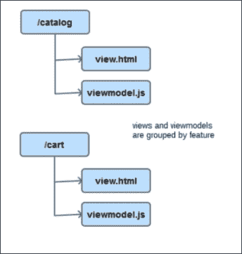

# 七、Durandal——KnockoutJS 框架

通过六章，我们用基本库构建了一个完整的前端应用。

我们使用了一些图书馆来实现我们的目标：

*   **Bootstrap 3**：在 CSS3 中拥有坚实、响应迅速、跨浏览器的基本风格
*   **jQuery**：操作 DOM，通过 AJAX 与服务器端通信
*   **Mockjax**：至伪 AJAX 通信
*   **MockJSON**：创建虚假数据
*   **KnockoutJS**：轻松绑定数据，同步 JavaScript 数据和视图

我们还应用了一些设计模式来提高代码的质量：

*   **揭示模式**：展示我们对象的公共界面，隐藏私有属性和方法
*   **模块模式**：为了隔离我们的代码并使其可移植
*   **依赖注入模式**：为了提高内聚，减少耦合

最后，我们介绍了一个库，它帮助我们管理项目中的依赖项，RequireJS。

在小型项目中，您可以只使用这些库。然而，当项目增长时，处理依赖关系变得更加困难。您需要的库和样式越多，维护所有库和样式就越困难。而且，维护视图模型变得更加困难，因为视图模型开始有太多的代码行。拆分视图模型会导致编写更多的事件来进行通信，而事件会使代码更难调试。

为了解决所有这些问题，Rob Eisenberg（[http://eisenbergeffect.bluespire.com/](http://eisenbergeffect.bluespire.com/) 和他的团队创建了**杜兰达尔**（[http://durandaljs.com/](http://durandaljs.com/) ）。Durandal 是一个框架，它连接了您今后将学习的所有库和良好实践。

在本章中，您将学习开始使用 Durandal 框架的基础知识。在本章中，您不打算处理您的购物车项目。这将在下一章继续。本章旨在了解 Durandal 是如何工作的，以及它如何将所有部分连接起来，从而快速轻松地创建 web 应用。

值得一提的是，Durandal 是构建应用最简单、最快的框架之一。当另一个好的框架称为 AngularJS（[https://angularjs.org/](https://angularjs.org/) 宣布了其 2.0 版，艾森伯格放弃了杜兰达尔，成为了 AngularJS 团队的一部分。这对 Durandal 和 KnockoutJS 社区来说是一个巨大的打击。但最近，艾森伯格离开了 AngularJS 2.0 项目，宣布了 Durandal 的新版本。因此，我们可以说，我们正在与开发现代、跨浏览器和完全兼容的 web 应用的最佳框架之一合作。

# 安装 Durandal

要安装 Durandal，请执行以下步骤：

1.  转到[http://durandaljs.com/downloads.html](http://durandaljs.com/downloads.html) 。
2.  下载最新版本的初学者工具包：[http://durandaljs.com/version/latest/HTML%20StarterKit.zip](http://durandaljs.com/version/latest/HTML%20StarterKit.zip) 。
3.  在项目文件夹中解压缩它。
4.  将其重命名为`durandal-cart`。
5.  将 Mongoose 服务器添加到项目中，或者使用您觉得合适的服务器。

初学者工具包将为您了解 Durandal 的工作原理提供一个很好的起点。在以下项目中，我们可以直接从独立的 Durandal 库开始，但这里我们将仔细分析该框架的各个部分。

要深入挖掘 Durandal，请下载`HTML Samples.zip`文件（[http://durandaljs.com/version/latest/HTML%20Samples.zip](http://durandaljs.com/version/latest/HTML%20Samples.zip) ），但测试这些有趣的样本取决于您。以下是初学者工具包的内容：

*   初学者工具包包含三个文件夹和一个 HTML`index`文件。
*   `app`文件夹包含应用本身。这包含两个文件夹：`viewmodels`和`views`。
*   `viewmodels`文件夹包含应用需要的所有视图模型，通常每页一个视图模型。
*   `views`文件夹包含绑定到每个视图模型的 HTML，通常每个视图模型一个视图。但是，您可以组合视图（您将看到这是 Durandal 的实际功能）。
*   `lib`文件夹包含 Durandal 框架和框架所依赖的所有库。
*   在`durandal/js`文件夹中，您会发现一个名为`plugins`的文件夹。您可以使用插件扩展 Durandal。您还可以使用组件和`bindingHandlers`扩展 KnockoutJS。
*   还有一个名为`transitions`的文件夹。在它里面你可以添加动画，当两个页面之间的转换完成时可以触发动画。默认情况下，只有一个（`entrance.js`），但您可以从 Internet 下载更多内容或构建自己的内容。
*   The `index.html` file will be the entry point to the JavaScript application.

    

    杜兰达尔文件夹结构

## 杜兰达尔模式

在学习更多关于 Durandal 的之前，让我们先了解一下框架的一些模式和概念。

Durandal 是一个**单页应用**（**SPA**框架。这意味着：

*   所有 web 应用都在单个页面（索引页面）上运行
*   没有整页刷新；只更新更改的部分
*   路由不再是服务器的责任。
*   AJAX 是与服务器端通信的基础

Durandal 遵循模型视图模型（MVVM）模式：

*   实际上，它被称为 MV*模式，因为我们可以用我们使用的任何东西替换*模式：视图模型（MVVM）、控制器（MVC）或演示器（MVP）。按照惯例，Durandal 使用视图模型。
*   MVVM 模式将视图与应用的状态（逻辑）分开。
*   该视图包含 HTML 文件。
*   视图模型包含绑定到视图的 JavaScript 文件。
*   Durandal 专注于视图和视图模型。模型不是框架的一部分。我们应该决定如何建造它们。

框架使用**异步模块定义**（**AMD**模式）管理依赖关系。它具有以下特点：

*   为此，它使用了 RequireJS。
*   我们应该为每个文件定义一个模块。
*   模块的名称将是不带扩展名的文件名。

## index.html 文件

`index.html`文件是应用的入口点。它应该有一个 ID 为`applicationHost`的容器。应用将在此容器内运行，视图将交换：

```js
<div id="applicationHost">
  <!-- application runs inside applicationHost container -->
</div>
```

您可以使用`splash`类定义`splash`元素。它显示应用已完全加载的时间。

```js
<div class="splash">
  <!-- this will be shown while application is starting -->
  <div class="message">
    Durandal Starter Kit
  </div>
  <i class="fa fa-spinner fa-spin"></i>
</div>
```

最后，使用 RequireJS 设置 Durandal 应用的入口点，正如我们在上一章中设置的那样。将`main.js`文件设置为 JavaScript 的入口点：

```js
<script src="lib/require/require.js" data-main="app/main"></script>
```

## main.js 文件

`main.js`文件包含 RequireJS 配置。在这里，我们可以看到哪些库使用 Durandal 工作：

*   `text`：这是一个 RequireJS 扩展，用于加载非 JavaScript 文件的文件。Durandal 使用`text`加载模板。
*   `durandal`：这是框架的核心。
*   `plugins`：在此文件夹中，我们可以找到并非所有应用都需要的框架部分。可以根据项目需要加载这些代码。
*   `transitions`：此包含我们可以在页面转换之间播放的不同动画。默认情况下，我们只有入口动画。
*   `knockout`：用于绑定视图和视图模型的库。
*   `bootstrap`：这是与`bootstrap.css`库相关的设计库。
*   `jQuery`：这是 DOM 操纵库。

您已经有了使用 RequireJS 的经验，因为您将应用中的文件转换为遵循 AMD 规范。以下是包含 RequireJS 配置的`main.js`文件的外观：

```js
requirejs.config
({
  paths: {
    'text': '../lib/require/text',
    'durandal':'../lib/durandal/js',
    'plugins' : '../lib/durandal/js/plugins',
    'transitions' : '../lib/durandal/js/transitions',
    'knockout': '../lib/knockout/knockout-3.1.0',
    'bootstrap': '../lib/bootstrap/js/bootstrap',
    'jquery': '../lib/jquery/jquery-1.9.1'
  },
  shim: {
    'bootstrap': {
      deps: ['jquery'],
      exports: 'jQuery'
    }
  }
});
```

然后定义`main`模块。以与在购物车项目中使用 RequireJS 相同的方式定义依赖项：

```js
define([
  'durandal/system', 
  'durandal/app', 
  'durandal/viewLocator'], function (system, app, viewLocator) {
    //main module code goes here
});
```

此模块用于配置应用。在 starter kit 项目中，有一个默认配置可帮助您了解此时可以执行的操作：

*   激活调试（或不激活）：

    ```js
    system.debug(true);
    ```

*   设置应用标题。默认情况下，应用标题将与页面标题连接。

    ```js
    app.title = 'Durandal Starter Kit';
    ```

*   激活和配置插件：

    ```js
    app.configurePlugins({
      router: true,
      dialog: true
    });
    ```

*   启动应用：

    ```js
    app.start().then(function() {
      //This code is executed when application is ready.

      //We can choose use framework conventions
      viewLocator.useConvention();
      app.setRoot('viewmodels/shell', 'entrance');
    });
    ```

启动应用时，可以选择遵循 Durandal 的约定。如果默认情况下选择遵循，Durandal 将通过在`views`文件夹中查找视图，将视图模型与视图关联起来。它们应该与视图模型具有相同的名称。这意味着，如果您有一个名为`viewmodel/catalog.js`的视图模型，其关联视图将被称为`views/catalog.js`。


这是按照 Durandal 约定创建的文件结构，适用于中小型项目

这一惯例适用于中小型项目。在大型项目中，建议不要使用 Durandal 约定。如果我们选择不使用这些约定，Durandal 将在视图模型所在的文件夹中查找视图。例如，如果视图模型名为`catalog/table.js`，则视图应命名为`catalog/table.html`。此允许我们按功能对视图和视图模型进行分组。



通过不使用 Durandal 约定，我们按功能对文件进行分组，这对于大型和可扩展的项目很有好处

最后，向指出哪个视图模型将启动应用的框架。默认情况下，shell 视图模型会执行此操作。

# 壳视图模型

**外壳**为入口点模块。它是包装其他模块的模块。它只加载一次，并且具有始终保持的 DOM 元素。

要定义视图模型，请使用 AMD 模式定义一个简单的 JavaScript 对象，如下所示：

1.  定义依赖项，即路由器和 Durandal 应用：

    ```js
    define(['plugins/router', 'durandal/app'], function (router, app) {
      return {
        //We complete this in next points
      };
    });
    ```

2.  暴露`router`方法。`router`方法将为我们提供一个对象，使我们能够轻松显示导航栏。

    ```js
    return {
      router: router
    };
    ```

3.  暴露`search`方法。这是一种可选方法。它是初学者工具包应用的一部分。它管理全局搜索。

    ```js
    return {
      router: router,
      search: function() {
        //easy way to show a message box in Durandal
        app.showMessage('Search not yet implemented...');
      },
    };
    ```

4.  暴露`activate`方法。这是 Durandal 视图模型中的一种重要方法。`activate`方法在视图模型就绪时触发。在这里，您可以请求数据将其绑定到视图。我们将很快了解更多有关 Durandal 生命周期方法的信息。

    ```js
    define(['plugins/router', 'durandal/app'], function (router, app) {
      return {
        router: router,
        search: function() { ... },
        activate: function () {
          router.map([{ 
            route: '', 
            title:'Welcome', 
            moduleId: 'viewmodels/welcome', 
            nav: true 
          }, {
            route: 'flickr', 
            moduleId: 'viewmodels/flickr', 
            nav: true 
          }]).buildNavigationModel();   
          return router.activate();
          }
        };
    });
    ```

## 外壳视图

**shell 视图**包含导航栏：搜索栏和一个元素，该元素附带了一个名为`page-host`的类。此元素将绑定到路由器，如下代码所示。您可以配置动画以使页面之间的转换更酷。

```js
<div>
  <nav class="navbar navbar-default navbar-fixed-top" role="navigation">
    <!-- nav content we will explain then -->
  </nav>
  <div class="page-host" data-bind="router: { transition:'entrance' }"></div>
</div>
```

# 杜兰达尔生命周期

我们必须清楚地了解 Durandal 应用是如何工作的。此是应用启动方式的模式：

1.  `index.html`页面使用 RequireJS 请求`main.js`文件。
2.  `main.js`文件配置并定义主模块，主模块负责应用配置，并启动 shell 模块。
3.  shell 模块处理应用的全局上下文。它管理将在不同生命周期中持久化的组件。在初学者工具包应用中，它管理搜索栏。但它也可以管理登录和注销功能，例如。shell 模块是配置所有路由的模块。
4.  Finally, the router configures the navigation along all the pages the application has.

    

    Durandal 初始化生命周期

## 激活生命周期

**激活****生命周期**控制页面的激活和停用。Durandal 允许我们使用预定义的方法访问周期的不同部分。让我们来看看 DurDalAl 方法：

*   `canDeactivate`：应该返回 true、false 或作为重定向对象。当你试图放弃一个页面时，它被触发。如果该方法的结果为 true，则可以离开该页面。如果为 false，则路由过程将中断。如果您返回一个重定向对象，您将被重定向。
*   `canActivate`：当你到达一个新页面时，你可以评估你是否能够看到这个页面。例如，如果您有足够的管理员权限查看页面，则可以检查您是否已登录到。如果您返回`canActivate`true，您将能够看到该页面。如果返回 false，路由过程将中断。您还可以将用户重定向到另一个页面。
*   `deactivate`：如果`canDeactivate`返回 true，您可以激活下一个视图，则触发`deactivate`方法。如果有必要，这里是一个清除超时和事件的好地方。
*   `activate`: If `canActivate` returns true and you can deactivate the last view, the `activate` method is fired. Here is the place where you should load all your data, bind your elements, and initialize events.

    

    激活生命周期

我们还可以在生命周期中使用其他方法：

*   `getView`：通过可以构建一个 observable 来定义视图模型绑定的视图路径。
*   `viewUrl`：此返回一个字符串，表示附加到视图模型的视图的路径。`viewUrl`和`getView`之间的区别在于前者是字符串，后者是可观察的。
*   `binding`：在视图与视图模型绑定开始前调用。
*   `bindingComplete`：绑定完成后立即调用。
*   `attached`：当合成引擎将视图附加到 DOM 时调用。您可以使用这个钩子使用 jQuery 选择器操纵元素。
*   `compositionComplete`：这是合成引擎发射的最后一个钩子。这里可以测量 DOM 元素。
*   `detached`：该钩子在视图与 DOM 分离时触发。我们可以在这里进行清理工作。

您可以在[阅读更多关于作文生命周期的 http://durandaljs.com/documentation/Interacting-with-the-DOM.html](http://durandaljs.com/documentation/Interacting-with-the-DOM.html) 。

## 承诺模式

Durandal 使用承诺来管理异步行为。一个明显的例子是`main.js`文件中的`app.start()`方法。

promise 是一个对象，它包含一个将来可以使用的值，当获得该值的先决条件完成时。在这种情况下，直到获得结果`app.start()`方法，才会触发`then`方法。

在内部，Durandal 使用 jQuery 的 promise 实现来最小化第三方依赖。但是，您使用的其他库可能需要 Q，或者您可能需要比 jQuery 提供的更高级的异步编程功能。在这些情况下，您需要将 Q 的承诺机制插入到 Durandal 中，以便在整个过程中都有一个一致的承诺实现。要集成 Q 库，请执行以下步骤：

1.  将`Q`库添加到 RequireJS 配置中。
2.  在`app.start()`指令

    ```js
    system.defer = function (action) {
      var deferred = Q.defer();
      action.call(deferred, deferred);
      var promise = deferred.promise;
      deferred.promise = function() {
        return promise;
      };
      return deferred;
    };
    ```

    之前的`main.js`文件中添加此代码

如果您使用的是 HTTP Durandal 插件，那么如果您想使用 Q 承诺，这种方法是不够的。您需要将 jQuery 承诺包装成 Q 承诺，如下所示：

```js
http.get = function(url, query) {
  return Q.when($.ajax(url, { data: query }));
}
```

有关 Q 库的更多信息，请访问[http://durandaljs.com/documentation/Q.html](http://durandaljs.com/documentation/Q.html) 。

这是我们在 Durandal 中提供的 jQuery 承诺的基本接口：

*   `done(successFn)`：如果承诺成功解决，则会被触发。
*   `fail(failFn)`：如果承诺被拒绝，将被解雇。
*   `always()`：成功和失败两种情况下都会触发。
*   `then(succesFn,failFn)`：这是加入`done`和`fail`方法的别名。
*   `when(valueOrFunction)`：这将创建一个带有作为参数传递的值或函数的承诺。

有关 jQuery 承诺的更多信息，请参阅[的官方文档 http://api.jquery.com/promise/](http://api.jquery.com/promise/) 。

## 成分

**成分**是杜兰达尔最有力的部分。虽然模块有助于将应用拆分为几个小部分，但组合允许我们再次加入它们。构图有两种类型，对象构图和视觉构图。

要应用可视合成，需要使用合成绑定。您可以将 KnockoutJS 可观测项与 compose 绑定相结合，以实现动态组合。组合绑定为您提供了一个完整的配置界面，以增强组件的灵活性和可重用性。

### 对象构成

您只需使用 RequireJS 和 AMD 模式即可实现**对象合成**。最简单的情况是您有两个模块：A 和 B。B 模块需要 A 的功能，因此您可以使用 RequireJS 请求模块 B 中的模块 A，如下所示：

```js
//moduleA
define([],function(){
  var moduleA = {};

  //ModuleA code

  return moduleA;
});
//moduleB (in a different file)
define(['moduleA'],function(moduleA){
  //we can use ModuleA to extend moduleB, e.g:

  var moduleB = $.extend({}, moduleA);

  //Create moduleB unique functionality.
  return moduleB;
});
```

### 视觉构图

**视觉合成**允许您将视图分解为小块，并重新连接（或合成）它们，使其可重复使用。这是 Durandal 的一个中心和独特功能，由合成模块管理。组合视图最常见的方式是使用组合绑定处理程序。

让我们来看一看 Shell 视图是如何组成的：

1.  RequireJS 用于查找 shell 模块。按照惯例，它知道它在`shell.js`文件中。
2.  视图定位器为 shell`shell.html`定位适当的视图。
3.  视图引擎根据`shell.html`中的标记创建视图。
4.  shell 模块和 shell 视图是使用 KnockoutJS 绑定在一起的数据。
5.  绑定的 shell 视图被插入到`applicationHost`div 中。
6.  The "entrance" transition is used to animate the view.

    

    成分生命周期

现在看一看如何进行视觉合成。通过执行以下步骤，可以将导航移动到其自己的视图，并使用导航视图组合 shell：

1.  打开`shell.html`文件。
2.  切断`<nav></nav>`元件。
3.  将其粘贴到名为`navigation.html`的新文件中。
4.  在`shell.html`文件中添加`<div>`并绑定 compose 元素，如下所示：

    ```js
    <div>
      <div data-bind="compose: 'navigation.html'"></div>
      <div class="page-host" data-bind="router: { transition:'entrance' }"></div>
    </div>
    ```

您还可以创建一个名为`navigation.js`的视图模型，该模型链接到视图：

```js
<div>
  <div data-bind="compose: 'viewmodel/navigation'"></div>
  <div class="page-host" data-bind="router: { transition:'entrance' }"></div>
</div>
```

您还可以使用选项将`compose`变量转换为将在视图模型中生成的可观察对象：

```js
<div>
  <div data-bind="compose: navigationObservable"></div>
  <div class="page-host" data-bind="router: { transition:'entrance' }"></div>
</div>
```

下面简要介绍了 compose 绑定的工作原理：

*   如果是字符串值：
    *   如果它有一个视图扩展，则定位该视图并将其注入 DOM，并根据当前上下文进行绑定。
    *   如果它是一个模块 ID，则定位该模块，定位其视图，并将它们绑定并注入 DOM。
*   如果它是一个对象，找到它的视图，绑定并将它们注入 DOM。
*   如果它是一个函数，则使用新的修饰符调用该函数，获取其返回值，找到返回值的视图，并将它们绑定并注入 DOM。

如果要自定义合成，可以将视图和模型数据直接传递给 composer 绑定，如下所示：

```js
data-bind="compose: { model:someModelProperty, view:someViewProperty }"
```

这允许您使用相同的数据组合不同的视图，将模型或视图设置为可观察对象。

您还可以使用剔除注释组合视图：

```js
<!-- ko compose: activeItem--><!--/ko-->
```

您可以增加组合绑定的设置值：

*   `transition`：当构图发生变化时，可以表示转换。
*   `cacheviews`：这不会从 DOM 中删除视图。
*   `activate`：定义了该构图的激活功能。
*   `perserveContext`：如果将其设置为`false`，则将分离父上下文。当没有与视图关联的模型时，这非常有用。它提高了性能。
*   `activationData`：指附于`activate`功能的数据。
*   `mode`：可以是`inline`或者`templated`。默认情况下，Inline 是模式。`templated`模式与`data-part`属性一起使用，通常与小部件一起使用。
*   `onError`：当组合失败时，您可以将错误处理函数优雅地绑定到失败，如下代码所示：

    ```js
    div data-bind="compose: { model: model, onError: errorHandlerFunction }"></div>
    ```

您可以在[的杜兰达尔文档中找到完整的成分解释 http://durandaljs.com/documentation/Using-Composition.html](http://durandaljs.com/documentation/Using-Composition.html) 。

## 路由器

Durandal 提供了一个路由器插件，使导航变得快捷和简单。路由器配合历史插件处理浏览器中的导航状态。

要使用路由器插件，请执行以下操作：

1.  激活`main.js`文件中的插件：

    ```js
    app.configurePlugins({
      router: true,
    });
    ```

2.  在`shell.js`文件

    ```js
    router.map([{...},{...}]).buildNavigationModel();
    return router.activate();
    ```

    中配置

以下是购物车应用路由器的示例：

```js
router.map([
  {route:[''/*default route*/,'catalog'], title:'catalog', moduleId:'viewmodels/catalog', nav: true},
  {route:'cart', title:'cart', moduleId:'viewmodels/cart', nav: true},
  {route:'product/:id', title:'Product detail', moduleId:'viewmodels/product-detail', nav:false},
  {route:'product/:id*action', moduleId:'viewmodels/product', nav:false, hash:'#product/:id'},
]).buildNavigationModel();
return router.activate();
```

看一看`shell.js`文件。路由器作为视图模型的一个元素传递。这允许您根据当前路线更新导航。Durandal 提供了一个友好的界面，可以从`router`对象构建导航菜单。在 shell 中映射路由激活 hook，然后使用 router fluent API 构建导航模型。

最后，返回`router.activate()`方法，该方法包含来自 shell 激活钩子的承诺。返回承诺意味着合成引擎将等到路由器准备好后再显示外壳。

让我们更详细地了解路由映射。路线有不同的模式。至少，您应该提供路线和`moduleId`值。当 URL 散列改变时，路由器将检测到这一点，并使用路由模式找到正确的路由。然后它将用`moduleId`值加载模块。路由器将激活并合成视图。

有一些可选的参数：

*   `nav`：当您调用`buildNavigationModel`方法时，它只会创建一个名为`navigationModel`的可观察数组，该数组的路由属性设置为`true`。
*   `title`：用于设置单据标题。
*   `hash`：有了它，您可以提供一个自定义哈希，用于数据绑定到锚标记。如果没有提供哈希，路由器将生成哈希。

有四种不同类型的路线：

*   **默认路由**设置为空字符串：

    ```js
    route.map([{route:''}]);
    ```

*   **静态路由**无参数：

    ```js
    route.map([{route:'catalog'}]);
    ```

*   **参数化路由**为带参数的路由：
    *   参数用冒号定义：

        ```js
        route.map([{route: 'product/:id'}]);
        ```

    *   可选参数用括号括起来：

        ```js
        route.map([{route: 'product(/:id)'}]);
        ```

*   **Splat 路由**用于构建子路由。我们可以使用星号来定义它们：

    ```js
    route.map({route:'product/:id*actions'});
    ```

*   **未知路由**采用`mapUnknownRoutes(module,view)`

    ```js
    route.mapUnknowRoutes(notfound,'not-found');
    ```

    方式管理

如果您查看`navigation.html`文件，您将能够看到路由器是如何工作的。

请注意，针对`navigationModel`属性路由器的`foreach`绑定是使用`buildNavigationModel`方法构建的。该数组的每个元素都有一个`isActive`标志，当路由处于活动状态时，该标志被设置为`true`。最后，有一个名为`isNavigating`的属性，允许您提醒用户页面之间正在进行导航，如下所示：

```js
<ul class="nav navbar-nav" data-bind="foreach: router.navigationModel">
  <li data-bind="css: { active: isActive }">
    <a data-bind="attr: { href: hash }, text: title"></a>
    </li>
</ul>
<ul class="nav navbar-nav navbar-right">
  <li class="loader" data-bind="css: { active: router.isNavigating }">
    <i class="fa fa-spinner fa-spin fa-2x"></i>
  </li>
</ul>
```

如果返回到`shell.html`页面，您将看到您将路由器绑定到`page-host`元素。此绑定显示`page-host`容器内的活动路由。这只是杜兰达尔作品力量的又一次展示。

### 路线参数

路由参数在路由中使用冒号设置。这些参数可以传递给每个模块的`canActivate`和`activate`方法。如果路由具有查询字符串，则将其作为最后一个参数传递。

## 触发导航

这里列出了一些触发导航的方法：

*   使用锚定标签：

    ```js
    <a data-bind="attrs:{href:'#/product/1'}">product 1</a>
    ```

*   使用`router.navigate(hash)`方法。这将触发到相关模块的导航。

    ```js
    router.navigate('#/product/1');
    ```

*   如果您想添加一个新的历史记录条目但不调用模块，只需将第二个参数设置为`false`：

    ```js
    router.navigate('#/product/1',false);
    ```

*   如果您只是想要替换历史记录条目，请将一个 JSON 对象传递给`replace`值`true`和`trigger`值`false`：

    ```js
    router.navigate('#/product/1',{ replace: true, trigger: false });
    ```

## 子路由器

在大型应用中，您必须能够处理数十条或数百条路线。您的应用只能有一个主路由器，但也可能有多个子路由器。这为 Durandal 提供了一种处理深度链接场景和按功能封装路由的方法。

通常，父级将使用 splat（*）映射路线。子路由器将相对于该路由工作。让我们看一个例子：

1.  需要应用路由器。
2.  打电话给`createChildRouter()`。这将创建一个新的路由器。
3.  使用`makeRelative`API。配置基础`moduleId`和`fromParent`属性。此属性使路由相对于父级路由。

这就是它的工作原理：

```js
// product.js viewmodel
define(['plugins/router', 'knockout'], function(router, ko) {
  var childRouter = router.createChildRouter()
    .makeRelative({
      moduleId:'product',
      fromParent:true,
      dynamicHash: ':id'
    }).map([
      { route: 'create', moduleId: 'create', title: 'Create new product', type: 'intro', nav: true },
      { route: 'update', moduleId: 'update', title: 'Update product', type: 'intro', nav: true},
    ]).buildNavigationModel();
  return {
    //the property on the view model should be called router
    router: childRouter 
  };
});
```

首先，它捕捉到了`product/:id*`动作模式。这将导致导航到`product.js`。应用路由器将检测子路由器的存在，并将控制权委托给子路由器。

当子路由器使用参数时，激活`makeRelative`方法中的`dynamicHash`属性。

## 事件

**事件**用于模块间的通信。事件 API 集成在`app`模块中，非常简单：

*   上的**：订阅视图模型到事件

    ```js
    app.on('product:new').then(function(product){
      ...
    });
    ```** 
*   **关闭**：从

    ```js
    var subscription = app.on('product:new').then(function(product){
      ...
    });
    subscription.off();
    ```

    事件中取消订阅视图模型
*   **触发**：至触发事件

    ```js
    app.trigger('product:new', newProduct);
    ```

您可以传递所有事件名称以侦听所有类型的事件：

```js
app.on('all').then(function(payload){
  //It will listen all events
});
```

在[阅读更多关于事件的信息 http://durandaljs.com/documentation/Leveraging-Publish-Subscribe.html](http://durandaljs.com/documentation/Leveraging-Publish-Subscribe.html) 。

## 小部件

**小部件**是杜兰达尔构成中的另一个重要部分。它们类似于视图模型，只有一个例外。视图模型可以是单例的，我们通常更喜欢它们是单例的，因为它们代表了站点上唯一的页面。另一方面，小部件主要是用构造函数编码的，因此可以根据需要多次实例化。因此，当我们构建一个小部件时，我们不会返回视图模型中出现的对象。相反，我们返回一个构造函数，Durandal 实例化小部件。

将小部件保存在`app/widgets/{widget_name}`中。小部件应该有一个`viewmodel.js`文件和一个`view.html`文件。

我们将开发一个名为`accordion`的小部件来演示小部件是如何工作的。这个小部件将基于 Bootstrap 附带的 jquerycollapse 插件。

### 设置小部件

按照以下步骤创建插件：

1.  将`bootstrap`库添加到项目中。为此，将其添加到主模块的依赖项中：

    ```js
    define([
      'durandal/system', 
      'durandal/app', 
      'durandal/viewLocator',
      'bootstrap'
    ],  function (system, app, viewLocator, bs) {
      //Code of main.js module
    });
    ```

2.  安装插件。在`main.js`文件

    ```js
    app.configurePlugins({
      widget: true
    });
    ```

    中注册小部件插件
3.  在`app`文件夹中创建一个名为 widget 的目录。
4.  添加名为`accordion`的子目录。
5.  在`accordion`目录中添加一个名为`viewmodel.js`的文件。
6.  在`accordion`目录中添加一个名为`view.html`的文件。

如果您不喜欢 Durandal 的约定，您可以在[阅读更多关于小部件配置的信息 http://durandaljs.com/documentation/api#module/widget](http://durandaljs.com/documentation/api#module/widget) 。

### 编写 widget 视图

要编写视图，请执行以下步骤：

1.  打开`app/widgets/expander/view.html`文件。
2.  按照 bootstrap3 折叠模板（[编写此代码 http://getbootstrap.com/javascript/#collapse](http://getbootstrap.com/javascript/#collapse) ：

    ```js
    <div class="panel-group" data-bind="foreach: { 
      data: settings.items }">
      <div class="panel panel-default">
        <div class="panel-heading" data-bind="">
          <h4 class="panel-title">
            <a data-toggle="collapse" data-bind="attr:{'data-target':'#'+id}">
              <span data-part="header" data-bind="html: $parent.getHeaderText($data)">
              </span>
            </a>
          </h4>
        </div>
        <div data-bind="attr:{id:id}" class="panel-collapse collapse">
          <div class="panel-body">
            <div data-part="item" data-bind="compose: $data"></div>
          </div>
        </div>
      </div>
    </div>
    ```

通过先编写视图，您可以确定需要在视图模型中创建哪些变量来完成视图。在这种情况下，您将需要一个存储手风琴元素的项目数组。它将包含在小部件内部自动生成的每个可折叠元素的 ID、标题文本和正文。

### 编写 widget 视图模型

要编写小部件视图模型，请打开`accordion`小部件文件夹中的`viewmode.js`文件并编写以下代码：

```js
define(['durandal/composition','jquery'], function(composition, $) {
  var ctor = function() { };

  //generates a simple unique id	
  var counter = 0;

  ctor.prototype.activate = function(settings) {
    this.settings = settings;
    this.settings.items.forEach(function(item){
      item.id=counter++;
    });
  };
  ctor.prototype.getHeaderText = function(item) {
    if (this.settings.headerProperty) {
      return item[this.settings.headerProperty];
    }

    return item.toString();
  };

  return ctor;
});
```

如您所见，您为小部件返回了一个构造函数，而不是像处理页面那样返回了视图模型本身。

在这种情况下，要管理生命周期，您只需要定义`activate`方法来分配值并生成 ID。请记住，如果您想用代码添加一些 DOM 修改，那么附加的方法将是一个很好的地方。

### 注册小部件

要注册小部件，只需在主模块（`main.js`中注册即可：

```js
app.configurePlugins({
  widget: {
    kinds: ['accordion']
  }
});
```

# 使用 Durandal 构建页面

既然您已经学习了 Durandal 框架的所有基础知识，那么让我们创建一个新页面，其中将包含我们的小部件和一些基本数据。

要在 Durandal 中定义新页面，请始终遵循相同的步骤：

1.  在 shell 视图模型中定义路由：

    ```js
    router.map([
    { route: '', title:'Welcome', moduleId: 'viewmodels/welcome', nav: true },
    { route: 'flickr', moduleId: 'viewmodels/flickr', nav: true },
    { route: 'accordion', moduleId: 'viewmodels/accordion', nav: true }
    ]).buildNavigationModel();
    ```

2.  定义`views/accordion.html`文件。请注意，在手风琴绑定中，可以定义`data-part`模板。在这里，你正在使用杜兰达尔赋予你的构图力量。通过添加`add`按钮，您为小部件提供了添加新元素的可能性。

    ```js
    <div>
      <h2 data-bind="text:title"></h2>
      <div data-bind="accordion: {items:projects, headerProperty:'name'}">
        <div data-part="header">
          <span data-bind="text:name"></span>
        </div>
        <div data-part="item">
          <span data-bind="text:description"></span>
        </div>
      </div>
      <div class="btn btn-primary" data-bind="click:add">
        Add new project
      </div>
    </div>
    ```

3.  定义`viewmodels/accordion.js`文件。您已将`projects`设置为可观察数组，并在`activate`方法中对其进行初始化。视图模型提供了一个触发名为`accordion:add`的事件的`add`函数。这将发送带有新选项卡值的消息。小部件应该侦听此事件并创建一个操作。

    ```js
    define(['plugins/http', 'durandal/app', 'knockout'], function (http, app, ko) {
      return {
        title: 'Accordion',
        projects: ko.observableArray([]),
        activate: function () {
          this.projects.push(
          {name:'Project 1',description:"Description 1"});
          this.projects.push(
          {name:'Project 2',description:"Description 2"});
          this.projects.push(
          {name:'Project 3',description:"Description 3"});
        },
        add: function () {
          app.trigger('accordion:add',
          {name:'New Project',description:"New Description"});
        }
      };
    });
    ```

4.  在`widgets/accordion/viewmodel.js`文件中定义事件，更新`activate`方法：

    ```js
    ctor.prototype.activate = function(settings) {
      this.settings = settings;

      var _settings = this.settings;//save a reference to settings
      var items = this.settings.items();//get data from observable

      items.forEach(function(item){//manipulate data
        item.id=guid();
      });

      this.settings.items(items);//update observable with new data

      //listen to add event and save a reference to the listener
      this.addEvent = app.on('accordion:add').then(function(data){
        data.id = guid();
        _settings.items.push(data);
      });
    };
    ```

5.  定义分离生命周期方法，一旦小部件不在屏幕上，关闭`add event`：

    ```js
    ctor.prototype.detached = function () {
      //remove the suscription 
      this.addEvent.off();
    }
    ```

6.  启动应用并测试小部件。

# 总结

在本章中，您被介绍给 Durandal。使用一个将所有部分完美连接的框架，而不是一堆库，可以帮助您避免一次又一次地重写相同的代码。这意味着多亏了 Durandal，您可以很容易地遵循开发人员的基本原则之一（不要重复自己的工作–DRY）。

您学习了一些有用的概念，例如如何安装和启动 Durandal 项目。您还了解了 Durandal 应用的生命周期是如何工作的。

杜兰达尔最强大的特征之一是构图。您可以非常轻松地组合接口，并且对开发人员来说几乎是透明的。

你学会了 Durandal 如何管理承诺。默认情况下，它使用 jQuery 承诺，但您看到，使用其他库（如 Q）非常容易。

最后，您开发了一个小部件并将其集成到视图模型中。虽然视图模型是单例的，但小部件是可以多次实例化的元素。它们是杜兰达尔作品中强有力的一部分。

在下一章中，我们将逐步从 KnockoutJS 购物车迁移到 Durandal 单页应用中。