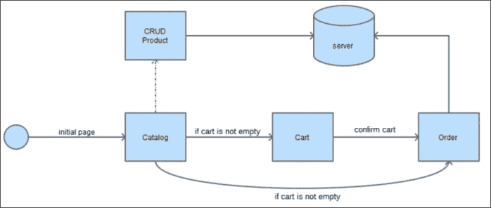
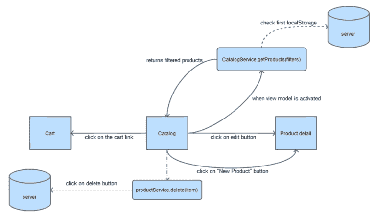
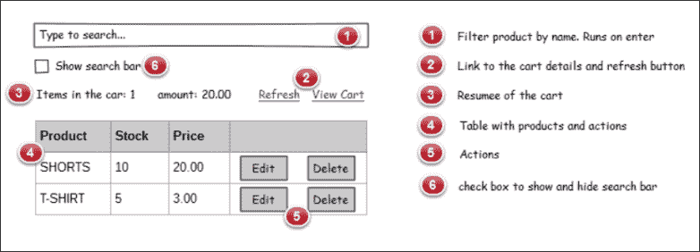
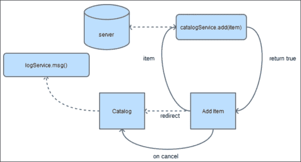
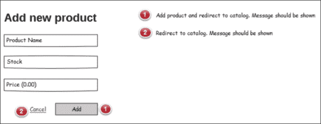
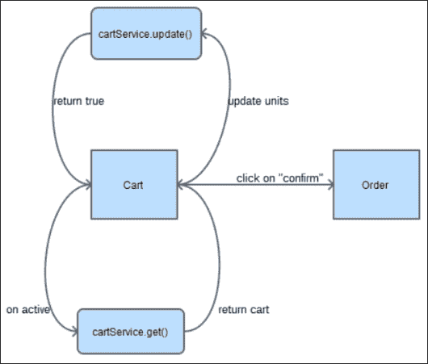
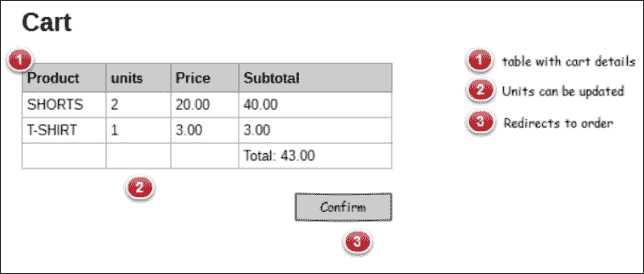
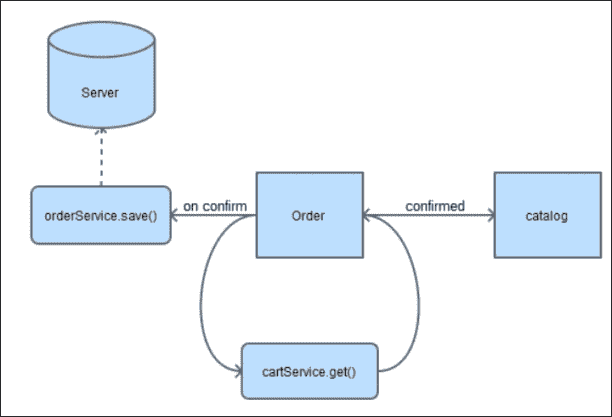
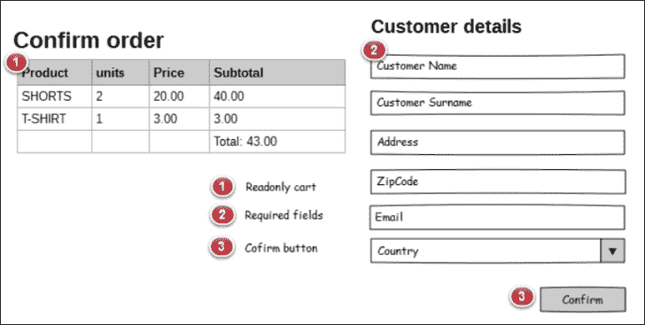
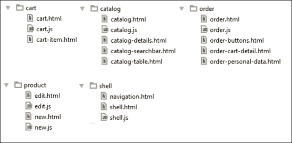

# 八、使用 Durandal 开发 Web 应用——Cart 项目

现在我们知道了 Durandal 的工作原理，是时候将我们的旧应用迁移到使用我们的新框架了。在本章中，您将学习如何在其他项目中重用我们在本书中使用的代码，并使部分代码适应新环境。

# 导言

在本章中，我们将开发一个全新的应用。然而，我们将重用上一章中开发的大部分代码。

仅仅使用 Knockout 的缺点之一是，我们的应用在增长时需要连接到许多库。我们在本书中开发的应用非常小，但有足够的复杂性，我们还没有处理路由这样的重要问题。我们的申请总是在同一页上。我们无法在订单和目录之间或购物车和目录之间导航。我们将整个应用放在同一个页面上，显示和隐藏组件。

Durandal 连接了您在本书中学到的一些库，并使您可以轻松地连接到新库。

在本章中，我们将看到一些使用非标准 UML 符号的模式。如今，敏捷方法并不推荐深入使用 UML，但是这些图表帮助我们获得对我们的特性的结构和必要条件的全局和更清晰的视图。此外，为了部署视图，我们将看到 HMTL 应如何完成的一些草图和实体模型：



应用的生命周期

# 立项

为了启动新项目，我们将遵循一些步骤，这些步骤将为我们开发项目提供一个良好的起点：

1.  创建一个新项目，就像我们使用淘汰车一样。
2.  在此项目中，复制 Durandal 初学者工具包项目的内容。
3.  现在，我们的项目中应该有三个文件夹：
    *   `app`：这是我们的申请
    *   `css`：包含样式表
    *   `lib`：包含第三方库
4.  将以下库从淘汰购物车项目迁移到 Durandal 购物车项目：
    *   `icheck`
    *   `kovalidation`
    *   `mockjax`
    *   `mockjson`
5.  从[安装一个名为 Toastr 的新库 http://codeseven.github.io/toastr/](http://codeseven.github.io/toastr/) 。
6.  用以下代码更新第 19 行的`ko.validation.js`文件：

    ```js
    define(["knockout", "exports"], factory);
    ```

7.  将`style.css`文件从淘汰车移动到 Durandal cart 项目中的`css`文件夹。
8.  将`models`文件夹移动到`app`文件夹中。
9.  将`services`文件夹移动到`app`文件夹中。
10.  在与`main.js`文件相同的级别创建一个名为`bindings.js`的文件，并将`koBindings.js`文件中的所有绑定移动到该文件中。
11.  在`main.js`文件的同一级别创建一个名为`mocks.js`的文件，并将所有模拟移动到`mocks`文件夹中。
12.  在与`main.js`文件相同的级别创建一个名为`components.js`的文件，并将`components.js`文件中的所有组件移动到该文件中。
13.  更新`knockout`库。Durandal 初学者工具包附带 3.1 版，我们将使用 3.2 版，这是我们在淘汰赛购物车项目中使用的版本。版本 3.2 允许我们使用`inputText`绑定和组件。您可以在以下链接中看到所有版本之间的差异：[https://github.com/knockout/knockout/releases](https://github.com/knockout/knockout/releases) 。
14.  更新的`main.js`文件：

    ```js
    requirejs.config({
      paths: {
        'text': '../lib/require/text',
        'durandal':'../lib/durandal/js',
        'plugins' : '../lib/durandal/js/plugins',
        'transitions' : '../lib/durandal/js/transitions',
        'knockout': '../lib/knockout/knockout-3.1.0.debug',
        'bootstrap': '../lib/bootstrap/js/bootstrap.min',
        'jquery': '../lib/jquery/jquery-1.9.1',
        'toastr': '../lib/toastr/toastr.min',
        'ko.validation': '../lib/kovalidation/ko.validation',
        'mockjax': '../lib/mockjax/jquery.mockjax',
        'mockjson': '../lib/mockjson/jquery.mockjson',
        'icheck': '../lib/icheck/icheck'
      },
      shim: {
        'bootstrap': {
          deps: ['jquery'],
          exports: 'jQuery'
        },
        mockjax: {
          deps:['jquery']
        },
        mockjson: {
          deps:['jquery']
        },
        'ko.validation':{
          deps:['knockout']
        },
        'icheck': {
          deps: ['jquery']
        }
      }
    });

    define([
      'durandal/system',
      'durandal/app',
      'durandal/viewLocator',
      'mocks',
      'bindings',
      'components',
      'bootstrap',
      'ko.validation',
      'icheck',
    ],  function (system, app, viewLocator,mocks,bindings,components) {
      //>>excludeStart("build", true);
      system.debug(true);
      //>>excludeEnd("build");

      app.title = 'Durandal Shop';

      app.configurePlugins({
        router:true,
        dialog: true
      });

      app.start().then(function() {
        //Replace 'viewmodels' in the moduleId with 'views' to locate the view.
        //Look for partial views in a 'views' folder in the root.
        viewLocator.useConvention();

        //Show the app by setting the root view model for our application with a transition.
        app.setRoot('viewmodels/shell', 'entrance');

        mocks();
        bindings.init();
        components.init();
      });
    });
    ```

15.  在您喜爱的服务器中设置项目或将 Mongoose 可执行文件复制到`index.html`所在的文件夹中。
16.  使用新 css 文件更新`index.html`：

    ```js
    <link rel="stylesheet" href="lib/toastr/toastr.min.css" />
    <link rel="stylesheet" href="lib/icheck/skins/all.css" />
    <link rel="stylesheet" href="css/style.css" />
    ```

现在我们的项目已经准备就绪，是时候一步一步地迁移我们的购物车了。

# 项目布线-外壳视图模型

Durandal 为我们提供了在项目中管理路线的可能性。我们将把项目的不同部分分成几页。这将提供更好的用户体验，因为我们一次只关注一项任务。

我们将将应用分为四个部分：

*   目录
*   马车
*   命令
*   产品积垢

这些部分将或多或少包含与我们在淘汰应用中构建的代码相同的代码。有时，我们需要修改一些小的代码。

要创建这些新路由，我们将打开`shell.js`文件并更新路由器：

```js
router.map([
  { route: ['','/','catalog'], title:'Catalog', moduleId: 'viewmodels/catalog', nav: true },
  { route: 'new', title:'New product', moduleId: 'viewmodels/new', nav: true },
  { route: 'edit/:id', title:'Edit product',moduleId: 'viewmodels/edit', nav: false },
  { route: 'cart', title:'Cart', 
    moduleId: 'viewmodels/cart', nav: false },
  { route: 'order', title:'Order', moduleId: 'viewmodels/order', nav: true }
]).buildNavigationModel();
```

让我们回顾一下路由器是如何工作的：

*   `route`包含相对 URL。对于目录，有三个 URL 附加到此路由。它们是空路由（“”）、斜线（“/”）路由和目录。为了表示这三条路由，我们将使用一个数组。
*   `title`将包含附在`<title>`标签中的标题。
*   `moduleId`将包含处理此路由的视图模型。如果我们使用约定，它将在`views`文件夹中查找视图，查找与视图模型同名的视图。在本例中，它查找`views/catalog.html`。如果我们选择不使用约定，Durandal 将与视图模型位于同一文件夹中。
*   如果`nav`为真，导航菜单中将显示链接。如果为 false，则路由器不会在导航菜单中显示链接。

# 导航和 shell 模板

正如我们在[第 7 章](07.html "Chapter 7. Durandal – The KnockoutJS Framework")*Durandal–KnockoutJS 框架*中所做的那样，我们将我们的`shell.html`视图分为两部分：`shell.html`和`navigation.html`。

## 目录模块

在淘汰车中，我们有一个视图模型来管理应用的所有部分。在这里，我们将把这个大视图模型分成几个部分。第一部分是目录。

这里我们有一个它应该如何工作的模式：



目录模块的工作流程

目录将只包含包含搜索栏和表及其操作的部分。这使得视图模型更小，因此更易于维护。

虽然文件将拆分为不同的文件夹，但目录本身就是一个模块。它包含视图模型、视图和一些仅在此模块内工作的服务。其他组件是必需的，但它们将在应用的生命周期中被更多的模块共享。

1.  在`viewmodels`文件夹中创建一个名为`catalog.js`的文件，并定义一个基本的揭示模式骨架，开始添加特征：

    ```js
    define([],function(){
      var vm = {};
      //to expose data just do: vm.myfeature = ...
      return vm;
    });
    ```

2.  在`views`文件夹

    ```js
    <div></div>
    ```

    中创建一个名为`catalog.html`的文件

通过这样做，我们的模块就可以工作了。让我们完成代码。

### 目录视图

我们将使用合成来创建此模板。请记住，构图是 Durandal 的强大功能之一。为了完成这个特性，我们将创建三个包含根视图不同部分的新模板。通过这样做，我们使视图更易于维护，因为我们将模板的不同部分隔离在不同的文件中，这些文件较小且易于阅读。



目录视图的实体模型

按照以下步骤创建模板：

1.  打开`catalog.html`文件，创建基础模板：

    ```js
    <div class="container-fluid">
      <div class="row">
        <div class="col-xs-12">
          <h1>Catalog</h1>
          <div data-bind="compose: 'catalog-searchbar.html'"></div>
          <div data-bind="compose: 'catalog-details.html'"></div>
          <div data-bind="compose:'catalog-table.html'"></div>
        </div>
      </div>
    </div>
    ```

2.  创建一个名为`catalog-searchbar.html`的视图。我们使用根视图的名称作为子视图的前缀，所以若编辑器按名称排序文件，它们将全部分组显示。我们还可以将所有这些文件分组到一个文件夹中。我们可以选择更舒适的方式：

    ```js
    <input type="checkbox" data-bind="icheck:showSearchBar"/>
      Show Search options<br/><br/>
    <div class="input-group" data-bind="visible:showSearchBar">
      <span class="input-group-addon">
        <i class="glyphicon glyphicon-search"></i> Search
      </span>
      <input type="text" class="form-control" data-bind="value:searchTerm, valueUpdate: 'keyup', executeOnEnter:filterCatalog" placeholder="Press enter to search...">
    </div>
    <hr/>
    ```

3.  现在是时候定义名为`catalog-details.html`的视图了；它将包含操作和购物车详细信息：

    ```js
    <div class="row cart-detail">
      <div class="col-lg-2 col-md-4 col-sm-4 col-xs-4">
        <strong>
          <i class="glyphicon glyphicon-shopping-cart"></i> 
            Items in the cart:
        </strong>
        <span data-bind="text:CartService.cart().length"></span>
      </div>
      <div class="col-lg-2 col-md-4 col-sm-4 col-xs-4">
        <strong>
          <i class="glyphicon glyphicon-usd"></i> 
          Total Amount:
        </strong>
        <span data-bind="text:CartService.grandTotal"></span>
      </div>
      <div class="col-lg-8 col-md-4  col-sm-4 col-xs-4 text-right">
        <button data-bind="click:refresh" class="btn btn-primary btn-lg">
          <i class="glyphicon glyphicon-refresh"></i> Refresh
        </button>
        <a href="#/cart" class="btn btn-primary btn-lg">
          <i class="glyphicon glyphicon-shopping-cart"></i> 
          Go To Cart
        </a>
      </div>
    </div>
    ```

4.  最后，我们将定义`catalog-table.html`，其中包含我们在淘汰车项目中构建的表。一些`data-bind`元素需要更新，需要删除页脚：

    ```js
    <table class="table">
      <thead>
      <tr>
        <th>Name</th>
        <th>Price</th>
        <th>Stock</th>
        <th></th>
      </tr>
      </thead>
      <tbody data-bind="{foreach:filteredCatalog}">
      <tr data-bind="style:{color:stock() < 5?'red':'black'}">
        <td data-bind="text:name"></td>
        <td data-bind="{currency:price}"></td>
        <td data-bind="{text:stock}"></td>
        <td>
          <add-to-cart-button params="{cart: $parent.CartService.cart, item: $data}">
          </add-to-cart-button>
          <button class="btn btn-info" data-bind="{click:$parent.edit}">
            <i class="glyphicon glyphicon-pencil"></i>
          </button>
          <button class="btn btn-danger" data-bind="{click:$parent.remove}">
            <i class="glyphicon glyphicon-remove"></i>
          </button>
        </td>
      </tr>
      </tbody>
      <!-- FOOTER HAS BEEN REMOVED -->
    </table>
    ```

### 目录视图模型

现在是时候定义我们可以在模板中识别的所有组件了。我们应该开始定义可以在模板中找到的基本数据：

```js
vm.showSearchBar = ko.observable(true);
vm.searchTerm = ko.observable("");
vm.catalog = ko.observableArray([]);
vm.filteredCatalog = ko.observableArray([]);
```

一旦我们定义了这些变量，我们就会意识到需要敲除依赖项。将其添加到 dependencies 数组中，并作为`module`函数中的参数：

```js
define(['knockout'],function(ko){ ... })
```

现在我们应该定义`filterCatalog`方法。与我们在淘汰项目中的视图模型中采用的方法相同：

```js
vm.filterCatalog = function () {
  if (!vm.catalog()) {
    vm.filteredCatalog([]);
  }
  var filter = vm.searchTerm().toLowerCase();
  if (!filter) {
    vm.filteredCatalog(vm.catalog());
  }
  //filter data
  var filtered = ko.utils.arrayFilter(vm.catalog(), function (item) {
    var fields = ["name"]; //we can filter several properties
    var i = fields.length;
    while (i--) {
      var prop = fields[i];
      if (item.hasOwnProperty(prop) && ko.isObservable(item[prop])) {
        var strProp = ko.utils.unwrapObservable( item[prop]).toLocaleLowerCase();
        if (item[prop]() && (strProp.indexOf(filter) !== -1)) {
          return true;
        }
      }
    }
    return false;
  });
  vm.filteredCatalog(filtered);
};
```

`add-to-cart-button`组件是在淘汰项目中定义的，我们不需要接触该组件的任何代码。这是一个清楚的例子，说明了组件是多么好以及它们所具有的潜力。

要从目录编辑产品，我们需要导航到编辑路线。这将创建与路由器插件的依赖关系。我们应该将`plugins/router`依赖项添加到我们的模块中。

```js
vm.edit = function(item) {
  router.navigate('#/edit/'+item.id());
}
```

要从目录中删除产品，我们需要将其从服务器和购物车中删除。为了与服务器对话，我们将使用`services/product.js`文件，为了与购物车对话，我们将在名为`services/cart`的文件中创建一个新服务。定义`remove`方法：

```js
vm.remove = function(item) {
  app
    .showMessage(
      'Are you sure you want to delete this item?',
      'Delete Item',
      ['Yes', 'No']
    ).then(function(answer){
      if(answer === "Yes") {
        ProductService.remove(item.id()).then(function(response){
          vm.refresh();
            CartService.remove(item);
        })
      }
    });
}
```

首先，我们使用 Durandal 拥有的消息组件。处理模态对话框非常有用。我们将询问用户是否应该删除该产品。如果是，我们将从服务器中删除它，然后刷新视图模型，并从购物车中删除该产品，因为它不再可用。

我们应该在`durandal/app`中添加依赖项，在`ProductService`和`CartService`中添加依赖项。

`ProductService`在淘汰项目中定义。如果我们保持模型和服务非常简单，它们将变得可移植，并且能够很好地适应不同的项目。

现在是实施`refresh`方法的时候了。我们将调用`ProductService.all()`方法并显示一条消息，让用户知道产品已加载。我们将返回此方法生成的承诺。

```js
vm.refresh = function () {
  return ProductService.all().then(function(response){
    vm.catalog([]);
    response.data.forEach(function(item){
      vm.catalog.push(new Product(item.id,item.name,item.price,item.stock));
    });
    var catalog = vm.catalog();
    CartService.update(catalog);
    vm.catalog(catalog);
    vm.filteredCatalog(vm.catalog());
    LogService.success("Downloaded "+vm.catalog().length+" products", "Catalog loaded");
  });
};
```

这里，我们对淘汰项目中使用的产品使用相同的模型。我们看到了很多代码，但大部分代码都是在本书的前面完成的，所以我们只需要将它从一个项目转移到另一个项目。

最后一步是激活我们的视图模型。什么时候激活视图模型？当我们的产品来自服务器并准备好展示时：

```js
vm.activate = function() {
  if(vm.catalog().length === 0) {
    app.on("catalog:refresh").then(function(){
      vm.refresh();
    });
    return vm.refresh();
  } else {
    return true;
  }
}
```

第一次加载应用时，我们检查目录中是否有产品。如果有，我们只返回目录已准备好。如果目录为空，我们将创建一个事件，让其他服务通知目录它应该更新。然后我们刷新目录以获取新数据。

这是我们的`catalog`视图模型的最终结果；当然，我们仍然需要实现日志服务和购物车服务：

```js
define(['knockout','durandal/app','plugins/router', 'services/log','services/product','services/cart', 'models/product','models/cartproduct'
],function(ko, app, router, LogService, ProductService, CartService, Product, CartProduct){
  var vm = {};
  vm.showSearchBar=ko.observable(true);
  vm.searchTerm = ko.observable("");
  vm.catalog = ko.observableArray([]);
  vm.filteredCatalog = ko.observableArray([]);
  vm.CartService = CartService;

  vm.filterCatalog = function () {...};
  vm.edit = function(item) {...}
  vm.remove = function(item) {...}
  vm.refresh = function () {...}
  vm.activate = function() {...}
  return vm;
});
```

## 购物车服务

购物车服务将管理所有模块的购物车数据。这些服务在会话中具有持久性数据，因此它们可以帮助我们在视图模型之间共享数据。在这种情况下，购物车服务将与购物车共享一些页面：目录、购物车和订单。

购物车服务将对在`cart`可观察范围内执行的操作作出反应。`add`操作由`add-to-cart-button`组件管理，但在这里集成此行为会很有趣。代码重构是一个很好的练习。在本例中，我们将保留该组件，并实现其他方法。

购物车服务还将购物车的总金额存储在`grandTotal`可观察值中。

购物车服务也会更新购物车。这将非常有用，因为当目录更新时，存储在购物车中的产品引用与目录中的新产品不同，因此我们需要更新这些引用。它还更新目录，按购物车中每个产品的单位减少库存。我们这样做是因为服务器向我们发送它拥有的数据。服务器不知道我们正在购物。也许我们决定不购物，所以购物车中的产品没有注册为已售出。这就是为什么我们需要在从服务器获得产品后更新客户机中的单元。以下是购物车服务的代码：

```js
define(['knockout','durandal/app' ,'models/cartproduct'],function(ko,app, CartProduct){
  var service = {};
  service.cart = ko.observableArray([]);
  service.add = function(data){
    if(!data.hasStock()) {
      LogService.error("This product has no stock available");
      return;
    }
    var item = null;
    var tmpCart = service.cart();
    var n = tmpCart.length;

    while(n--) {
      if (tmpCart[n].product.id() === data.id()) {
        item = tmpCart[n];
      }
    }

    if (item) {
      item.addUnit();
    } else {
      item = new CartProduct(data,1);
      tmpCart.push(item);
      item.product.decreaseStock(1);
    }

    service.cart(tmpCart);
  };
  service.subtract = function(data) {
    var item = service.find(data);
    item.removeUnit();
  }
  service.grandTotal = ko.computed(function(){
    var tmpCart = service.cart();
    var total = 0;
    tmpCart.forEach(function(item){
      total+= (item.units() * item.product.price());
    });
    return total;
  });
  service.find = function (data) {
    var tmp;
    service.cart().forEach(function(item){
      if (item.product.id() === data.id()) {
        tmp = item;
      }
    });
    return tmp;
  }
  service.remove = function (data) {
    var tmp = service.find(data);
    var units = tmp.product.stock()+tmp.units();
    tmp.product.stock(units);
    service.cart.remove(tmp);
  };
  service.update = function (catalog){
    var cart = service.cart();
    var newCart = [];
    for(var i =0;i<catalog.length;i++){
      for(var j=0;j<cart.length;j++){
        var catalogItem = catalog[i];
        var cartItem = cart[j];
        if(cartItem.product.id() === catalogItem.id()){
          catalogItem.stock(catalogItem.stock() - cartItem.units());
          newCart.push(new CartProduct(catalogItem,cartItem.units()));
        }
      }
    }
    service.cart(newCart);
  }
  return service;
});
```

## 日志服务

日志服务允许我们显示消息，告知用户应用中发生了什么。为此，我们使用一个名为 Toastr 的库。我们可以直接在应用上使用 Toastr，但一个好的做法是始终封装库以分离我们不应该接触的代码。此外，将库包装到另一个库中可以方便地扩展和自定义库的行为。在本例中，我们还添加了在控制台中记录消息的功能：

```js
define(["toastr"],function(toastr){
  //TOASTR CONFIG
  toastr.options.positionClass = 'toast-bottom-right';

  var error = function(text,title,log) {
    toastr.error(title,text);
    if (log) {
      console.error(title,text);
    }
  };
  var success = function(text,title,log) {
    toastr.success(title,text);
    if (log) {
      console.log(title,text);
    }
  };
  var warning = function(text,title,log) {
    toastr.warning(title,text);
    if (log) {
      console.warn(title,text);
    }
  };
  var info = function(text,title,log) {
    toastr.info(atitle,text);
    if (log) {
      console.info(title,text);
    }
  };
  return {
    error:error,
    success:success,
    warning:warning,
    info:info
  }
});
```

## 向目录中添加产品

新增功能与本路线相关：

```js
{ route: 'new', title:'New product', moduleId: 'viewmodels/new', nav: true }
```

要创建此模块，我们需要创建添加视图和添加视图模型。为此，创建两个名为`views/new`和`viewmodels/new.js`的文件，并重复我们在 catalog 模块中使用的模板。



添加产品工作流

### 添加产品视图

创建或更新产品或多或少是相同的。不同的是当我们编辑一个产品时，字段有数据，当我们添加一个新的产品时，这个产品的字段是空的。这可能会让我们怀疑我们是否可以隔离视图。

让我们将`new.html`文件定义如下：

```js
<div data-bind="compose:'edit.html'"></div>
```

这意味着`new.html`文件由`edit.html`文件组成。我们只需要定义一个模板来管理这两个模板。太棒了，不是吗？



添加新产品模型

### 编辑视图

我们只需要复制并粘贴我们在淘汰项目中的编辑表单。我们已经更新了布局，但我们使用了相同的形式：

```js
<div class="container-fluid">
  <div class="row">
    <div class="col-xs-6 col-xs-offset-3">
      <form class="form-horizontal" role="form" data-bind="with:product">
        <div class="modal-header">
          <h3 data-bind="text:$parent.title"></h3>
        </div>
        <div class="modal-body">
          <div class="form-group">
            <div class="col-sm-12">
              <input type="text" class="form-control" placeholder="Name" data-bind="textInput:name">
            </div>
          </div>
          <div class="form-group">
            <div class="col-sm-12">
              <input type="text" class="form-control" placeholder="Price" data-bind="textInput:price">
            </div>
          </div>
          <div class="form-group">
            <div class="col-sm-12">
              <input type="text" class="form-control" placeholder="Stock" data-bind="textInput:stock">
            </div>
          </div>
        </div>
        <div class="modal-footer">
          <div class="form-group">
            <div class="col-sm-12">
              <a href="#/catalog"></a>
              <button type="submit" class="btn btn-default" data-bind="{click:$parent.edit, enable:!errors().length}">
                <i class="glyphicon glyphicon-plus-sign"></i>
                <span data-bind="text:$parent.btn"></span>
              </button>
            </div>
          </div>
        </div>
      </form>
    </div>
  </div>
</div>
```

有一些东西需要动态创建，比如布局的标题和按钮名称。`edit`方法将说明产品服务的哪种方法应该处理产品—`ProductService.create`或`ProductService.save`。

### 添加产品视图模型

添加产品视图模型在`viewmodels/new.js`文件中编码。它将创造一种新产品。如果全部成功，我们将通知用户并导航到目录。为了在目录中展示新产品，我们启动了`catalog:refresh`活动：

```js
define(["durandal/app","plugins/router","services/log","services/uuid","services/product","models/product"
],function(app, router,LogService,uuid, ProductService,Product){
  var vm = {};
  vm.title = "New product";
  vm.btn = "Add product";
  vm.edit = function() {
    ProductService.create(vm.product.toObj()).then(function(response){
      LogService.success("Product added","New product "+vm.product.name()+" added");
      router.navigate("#/catalog");
      app.trigger("catalog:refresh");
    });
  };
  vm.activate = function () {
    vm.product = new Product();
  };
  return vm;
});
```

在 mock 的第一个版本中，如果我们添加了一个新项目，我们的目录就不会得到更新。它返回了我们在开始时得到的五种产品。我们将改进我们的模拟库，使其更加逼真。

### 模仿真实

让我们先来看看我们的 To.?? 文件，特别是 get 产品模拟：

```js
$.mockjax({
  url: "/products",
  type: "GET",
  dataType: "json",
  responseTime: 750,
  responseText: $.mockJSON.generateFromTemplate({
    "data|5-5": [{
      "id|1-100": 0,
      "name": "@PRODUCTNAME",
      "price|10-500": 0,
      "stock|1-9": 0
    }]
  })
});
```

让我们将其重构为：

```js
$.mockjax({
  url: "/products",
  type: "GET",
  dataType: "json",
  responseTime: 750,
  responseText: updatedCatalog()
});
```

现在我们要创建`updatedCatalog`函数。我们在开始时生成产品阵列，然后始终使用此副本：

```js
var catalog = $.mockJSON.generateFromTemplate({
  "data|5-5": [{
    "id|1-100": 0,
    "name": "@PRODUCTNAME",
    "price|10-500": 0,
    "stock|1-9": 0
  }]
});
var updatedCatalog = function () {
  return catalog;
}
```

在旧版本的 mock 中，当我们得到一个产品时，我们得到一个使用模板随机生成的产品。现在我们将带着真品回来。我们将沿着目录进行迭代，并返回带有所选 ID 的产品。此外，我们还将更新模拟对象。我们将创建一个响应函数来查找产品并生成正确的响应，而不是编写响应文本：

```js
function findById(id){
  var product;
  catalog.data.forEach(function(item){
    if (item.id === id) {
      product = item;
    }
  });
  return product;
};
$.mockjax({
  url: /^\/products\/([\d]+)$/,
  type: "GET",
  dataType: "json",
  responseTime: 750,
  response: function(settings){
    var parts = settings.url.split("/");
    var id = parseInt(parts[2],10);
    var p = findById(id);
    this.responseText = {
      "data": p
    }
  }
});
```

我们应该更新`POST`和`PUT`模拟，将产品添加到模拟目录中，并更新现有产品：

```js
var lastId= 101; //Max autogenarated id is 100
$.mockjax({
  url: "/products",
  type:"POST",
  dataType: "json",
  responseTime: 750,
  response: function(settings){
    settings.data.id = lastId;
    lastId++;
    catalog.data.push(settings.data);
    this.responseText = {
      "data": {
        result: "true",
          text: "Product created"
      }
    }
  }
});
$.mockjax({
  url: "/products",
  type:"PUT",
  dataType: "json",
  responseTime: 750,
  response: function (settings) {
    var p = findById(settings.data.id);
    p.name = settings.data.name;
    p.price = settings.data.price;
    p.stock = settings.data.stock;
    this.responseText = {
      "data": {
        result: "true",
        text: "Product saved"
      }
    }
  }
});
```

当调用`DELETE`方法时，我们还应该从模拟中删除产品：

```js
$.mockjax({
  url: /^\/products\/([\d]+)$/,
  type:"DELETE",
  dataType: "json",
  responseTime: 750,
  response: function(settings){
    var parts = settings.url.split("/");
    var id = parseInt(parts[2],10);
    var p = findById(id);
    var index = catalog.data.indexOf(p);
    if (index > -1) {
      catalog.data.splice(index, 1);
    }
    this.responseText = {
      "data": {
        result: "true",
        text: "Product deleted"
      }
    }
  }
});
```

最后，我们应该将 order mock 移动到此文件以共享目录。执行订单时，应更新目录中的库存：

```js
$.mockjax({
  type: 'PUT',
  url: '/order',
  responseTime: 750,
  response: function (settings){
    var cart = settings.data.order();
    cart.forEach(function(item){
      var elem = findById(item.product.id());
      elem.stock -= item.units();
    });
    this.responseText = {
      "data": {
        orderId:uuid(),
        result: "true",
        text: "Order saved"
      }
    };
  }
});
```

订单模拟将生成标识订单的唯一 ID。必须将其发送回用户，以确定将来的订单。在我们的应用中，这是项目生命周期的结束。

这是我们用来生成唯一 ID 的`uuid`函数：

```js
var uuid = (function uuid() {
  function s4() {
    return Math.floor((1 + Math.random()) * 0x10000)
    .toString(16)
    .substring(1);
  }
  return function() {
    return s4() + s4() + '-' + s4() + '-' + s4() + '-' + s4() + '-' + s4() + s4() + s4();
  };
})();
```

我们可以将此函数保留在 mock 模块中，或者创建一个处理唯一 ID 生成的新服务。

现在，我们的模拟以更现实的方式响应应用。

### 编辑视图模型

回到模块，我们现在需要创建`edit.js`视图模型。它将具有与`new.js`文件相同的结构，但在这种情况下，激活将检索我们要编辑的产品。然后我们将保存产品，模拟将在（假）服务器上更新：

```js
define(["durandal/app","plugins/router","services/log","services/uuid","services/product","models/product"
],function(app, router,LogService,uuid,ProductService,Product){
  var vm = {};
  vm.title = "Edit Product";
  vm.btn = "Edit product";
  vm.activate = function(id) {
    return ProductService.get(id).then(function(response){
      var p = response.data;
      if (p) {
        vm.product = new Product(p.id, p.name, p.price, p.stock);
      } else {
        LogService.error("We didn't find product with id: "+id)
        router.navigate('#/catalog');
      }
    });
  };
  vm.edit = function() {
    ProductService.save(vm.product.toObj()).then( function(response){
      LogService.success("Product saved","Product "+vm.product.name()+" saved");
      router.navigate("#/catalog");
      app.trigger("catalog:refresh");
    });
  };
  return vm;
});
```

我们应该注意到在添加产品和编辑产品中，模型都得到了验证。我们在淘汰项目中做了这个，现在我们正在这个项目中重用它。这不是很神奇吗？

## 推车模块

购物车模块将管理显示购物车的部分。正如我们在淘汰项目中所做的那样，我们应该能够更新产品的数量。如果我们不再需要这些物品，我们将移除它们。此外，我们将仅在购物车中有产品时激活此视图，因为如果购物车为空，则访问购物车没有意义。在这种情况下，我们将被重定向到目录。



购物车工作流

### 购物车视图

购物车使用的模板与我们在淘汰项目中使用的模板相同。当然，我们对其进行了一些调整，以在屏幕上显示它的中心位置：

```js
<div class="container-fluid">
  <div class="row">
    <div class="col-xs-8 col-xs-offset-2">
      <h1>Cart</h1>
      <div class="list-group" data-bind="foreach:cart">
        <div data-bind="compose: 'cart-item.html'"></div>
      </div>
      <button class="btn btn-primary btn-sm" 
        data-bind="enable:cart().length,click:toOrder">
		Confirm Order
      </button>
    </div>
  </div>
</div>
```

正如我们对购物车项目所做的那样，我们也在这里组成了视图。`cart-item.html`文件具有与淘汰项目中相同的代码。只需注意`addUnit`和`removeUnit`现在由父级调用：

```js
<div class="list-group-item" style="overflow: hidden">
  <button type="button" class="close pull-right" data-bind="click:$parent.removeProduct">
    <span>&times;</span>
  </button>
  <h4 class="" data-bind="text:product.name"></h4>
  <div class="input-group cart-unit">
    <input type="text" class="form-control" data-bind="textInput:units" readonly/>
    <span class="input-group-addon">
      <div class="btn-group-vertical">
        <button class="btn btn-default btn-xs add-unit" data-bind="click:$parent.addUnit">
          <i class="glyphicon glyphicon-chevron-up"></i>
        </button>
        <button class="btn btn-default btn-xs remove-unit" data-bind="click:$parent.removeUnit">
          <i class="glyphicon glyphicon-chevron-down"></i>
        </button>
      </div>
    </span>
  </div>
</div>
```



购物车视图模型

### 购物车视图模型

购物车视图模型将与购物车服务对话，并更新购物车的状态。看看我们是如何使用购物车服务在模块之间共享信息的。这是因为我们将服务创建为一个对象，它是一个单例。一旦加载，它将在应用的生命周期中保持：

```js
define([
  'durandal/app','plugins/router','services/log',"services/cart"
],function(app, router, LogService, CartService){
  var vm={};
  vm.cart = CartService.cart;
  vm.addUnit = function(data){
    CartService.add(data.product);
  };
  vm.removeUnit = function(data) {
    if (data.units() === 1) {
      remove(data);
    } else {
      CartService.subtract(data);
    }

  };
  vm.removeProduct = function(data) {
    remove(data);
  };
  vm.toOrder = function() {
    router.navigate('#/order');
  }
  vm.canActivate = function () {
    var result = (vm.cart().length > 0);

    if(!result) {
      LogService.error("Select some products before", "Cart is empty");
      return {redirect:'#/catalog'};
    }

    return result;
  }
  function remove(data) {
    app
    .showMessage(
      'Are you sure you want to delete this item?',
      'Delete Item',
      ['Yes', 'No']
    ).then(function(answer){
     if(answer === "Yes") {
       CartService.remove(data.product);
       LogService.success("Product removed");
     } else {
       LogService.success("Deletion canceled");
     }
   });
  }
  return vm;
});
```

Durandal 中的组件之间有两种通信方式：服务和事件。要在视图模型之间共享信息，最佳实践是使用服务。如果您想从一个服务向视图模型发送消息，或者在视图模型之间发送，则应使用事件。这是因为服务可能是模块内部所必需的，您可以显式地调用它们。此外，我们不能从其他视图模型或服务访问视图模型，这就是为什么我们需要使用事件向它们发送消息。

## 订单模块

此模块将管理我们订单的确认。为了完成订单，我们需要介绍我们的个人数据。我们只能访问订单页面，如果我们的购物车中有东西。一旦我们确认订单，我们将从服务器收到一条带有订单 ID 的消息。产品的库存将被更新，我们将能够继续购物。



订单工作流

### 订单视图

订单视图将与我们在淘汰项目中构建的订单视图相同。这一次，我们将使用合成来简化视图。

`order.html`文件将包含页面的结构，我们将构建一些部分来组成整个视图。这些部分将是：

*   `order-cart-detail.html`：这将包含只读购物车
*   `order-contact-data.html`：包含个人资料
*   `order-buttons.html`：包含页面的动作按钮

`order.html`文件将包含以下代码：

```js
<h1>Confirm order</h1>
<div class="col-xs-12 col-sm-6">
  <div class="modal-header">
    <h3>Order</h3>
  </div>
  <div data-bind="compose:'order-cart-detail.html'"></div>
</div>
<div class="col-xs-12 col-sm-6">
  <div data-bind="compose:'order-contact-data.html'"></div>
  <div data-bind="compose:'order-buttons.html'"></div>
</div>
```

`order-cart.html`文件将包含只读购物车。这与您在淘汰车项目的`order.html`模板中可以找到的标记相同。

```js
<table class="table">
  <thead>
  <tr>
    ...
  </tr>
  </thead>
  <tbody data-bind="foreach:cart">
    ...
  </tbody>
  <tfoot>
  <tr>
    <td colspan="3"></td>
    <td class="text-right">
      Total:<span data-bind="currency:grandTotal"></span>
    </td>
  </tr>
  </tfoot>
</table>
```

`order-contact.html`文件将包含视图`order.html`淘汰购物车项目中的表单：

```js
<form class="form-horizontal" role="form" data-bind="with:customer">
  <div class="modal-header">
    <h3>Customer Information</h3>
  </div>
  <div class="modal-body">
    ...
  </div>
</form>
```

最后，`order-buttons.html`有确认订单的按钮。当然，您可以在我们在淘汰车项目中构建的`order.html`文件中找到它。我们尽可能地重复使用代码。

```js
<div class="col-xs-12">
  <button class="btn btn-sm btn-primary" data-bind="click:finishOrder, enable:!customer.errors().length">
    Buy & finish
  </button>
  <span class="text-danger" data-bind="visible:customer.errors().length">
    Complete your personal data to receive the order.
  </span>
</div>
```



订单模型

### 订单视图模型

订单视图将检查我们的购物车是否为空，以允许激活。验证由客户模型管理。该模型是在淘汰车项目中构建的。代码的其余部分来自于我们在淘汰车项目中使用的大视图模型：

```js
define(["knockout","durandal/app","plugins/router","services/log", "services/cart","models/customer","services/order" ], function(ko, app, router, LogService, CartService, Customer, OrderService){
  var vm = {};

  vm.countries = ko.observableArray(['United States','United Kingdom']);
  vm.cart = CartService.cart;
  vm.grandTotal = CartService.grandTotal;
  vm.customer = new Customer();
  vm.finishOrder = function () {
    OrderService.save({
      customer: vm.customer,
      order: vm.cart
    }).then(function(response){
      app.showMessage(
        "Your order id is: <strong>"+response.data.orderId+"</strong>",
        'Order processed successfully'
      ).then(function(){
        LogService.success("Order completed");
        CartService.cart([]);
        router.navigate("#/catalog");
        app.trigger("catalog:refresh");
      });
    });
  }

  vm.canActivate = function () {
    var result = (vm.cart().length > 0);

    if(!result) {
      LogService.error("Select some products before","Cart is empty");
    }

    return {redirect:'#/catalog'};
  }

  return vm;
});
```

最后，我们的项目完成了，我们重用了大部分旧代码。迁移项目后，我们可以看到 Durandal 给我们带来的优势。还要注意的是，我们没有充分利用 Durandal 和 Knockout 的潜力。我们可以迭代这个项目，一次又一次地改进所有部分。我们可以创建完美的隔离组件。我们可以将目录拆分为更小的部分，并添加更多功能，例如排序和分页。然而，这个项目让我们快速了解了 Durandal 的能力。

# 按功能分组编码-管理大项目

正如您在`main.js`文件中看到的，我们使用的是 Durandal 约定。这意味着我们所有的视图模型都位于`viewmodels`文件夹中，我们所有的视图都位于`views`文件夹中。当我们有一个大项目时，将所有文件放在同一个文件夹中可能很难管理。

在本例中，我们从`main.js`文件中删除`viewLocator.useConvention();`语句。这向 Durandal 表明，所有视图都与视图模型位于同一文件夹中。

我们将按功能对项目进行分组。我们将在项目中定义这些功能：

*   目录
*   运货马车
*   顺序
*   产品
*   壳

它们将包含每个功能的代码。服务、模型和其他组件将与我们使用约定时一样。查看文件夹的外观：



按要素分组的文件

我们需要更新一些代码。第一步是更新主文件夹，设置外壳模块的新 ID：

```js
app.setRoot('shell/shell', 'entrance');
```

那么我们应该对外壳模块内的路由器做同样的操作：

```js
router.map([
  { route: ['','/','catalog'], title:'Catalog', moduleId: 'catalog/catalog', nav: true },
  { route: 'new', title:'New product', moduleId: 'product/new', nav: true },
  { route: 'edit/:id', title:'Edit product', moduleId: 'product/edit', nav: false },
  { route: 'cart', title:'Cart', moduleId: 'cart/cart', nav: false },
  { route: 'order', title:'Order', moduleId: 'order/order', nav: true }
]).buildNavigationModel();
```

最后，我们需要更新合成路径。它们应该是完整的路径。这意味着我们有以下代码：

```js
<div data-bind="compose:'catalog-details.html'"/></div>
```

现在，我们将获得以下代码：

```js
<div data-bind="compose:'catalog/catalog-details.html"/></div>
```

我们的代码将准备就绪。

请注意，现在很容易找到我们正在处理的代码所在的位置。通常，我们处理一个特性，将该特性的所有代码放在同一个地方会更舒服。此外，我们可以更好地看到我们是否正确地隔离了我们的功能。如果我们注意到我们在功能文件夹外做了太多的工作，可能意味着你做错了什么。

要查看本章的代码，可以从 GitHub 下载：

*   Durandal 项目使用[中的约定 https://github.com/jorgeferrando/durandal-cart/tree/chapter8part1](https://github.com/jorgeferrando/durandal-cart/tree/chapter8part1) 。
*   Durandal 根据[中的特征对项目文件进行分组 https://github.com/jorgeferrando/durandal-cart/tree/master](https://github.com/jorgeferrando/durandal-cart/tree/master) 。

# 总结

最后，我们开发了一个完整的应用，它引导我们使用 Durandal 创建单页应用。

在本书中，您学习了使用 JavaScript 代码的最佳实践。所有框架和库中都使用了这些实践和模式，如揭示模式或模块模式。

构建独立的代码片段有助于我们轻松地将代码从一个环境迁移到另一个环境。仅在一章中，我们就将应用从基本的淘汰应用迁移到了 Durandal 应用。

现在我们已经掌握了击倒和 Durandal 的良好技能，我们可以自己尝试改进此应用。

我们可以创建一个用户模块，允许用户登录，并且只允许管理员从目录中编辑和删除项目。或者，我们可以为产品分页并按价格订购。我们已经掌握了成功开发所有这些功能所需的所有技能。我们只需要按照您在本书中学习的步骤来完成这些开发任务。

我希望你和我一样喜欢这本书。我想告诉你，你需要推动自己学习更多关于 JavaScript、Knockout、Durandal 和所有现在存在于互联网上的精彩 JavaScript 框架的知识。学习最佳实践并遵循最佳模式，以保持代码的稳定性。