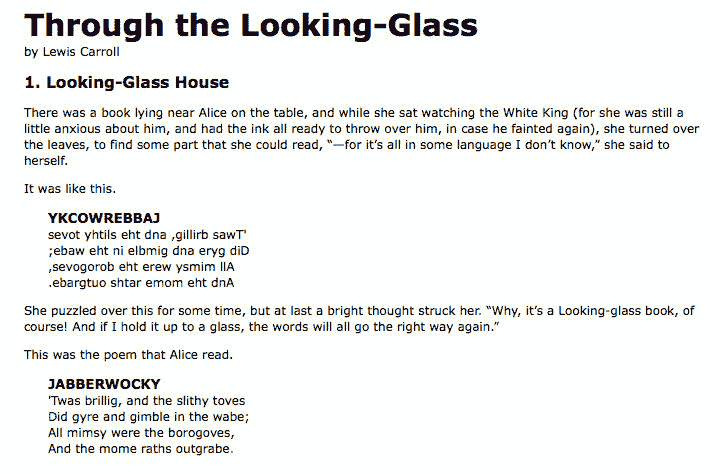
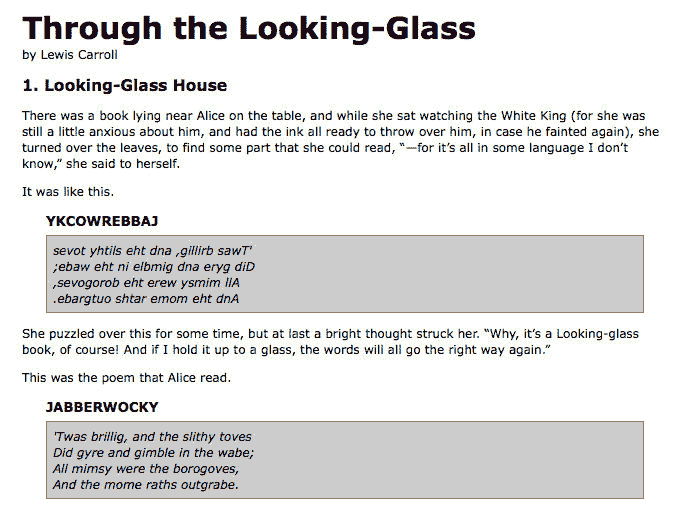
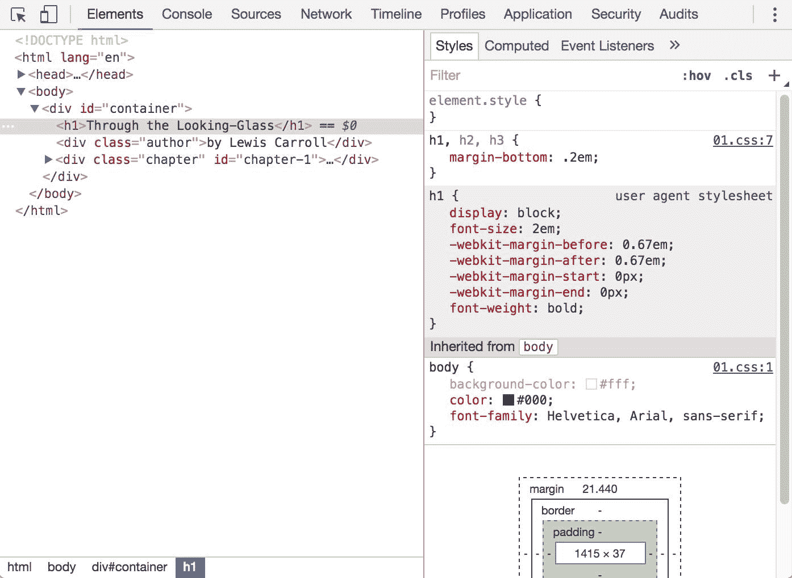
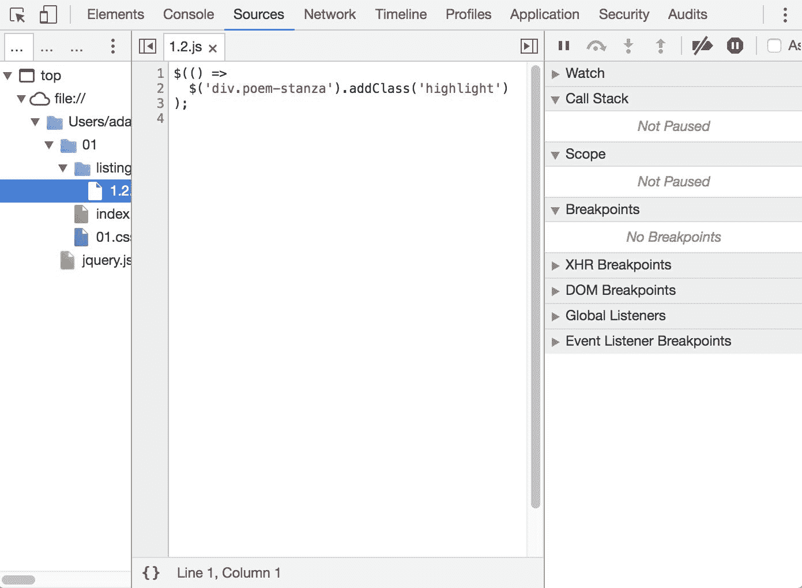
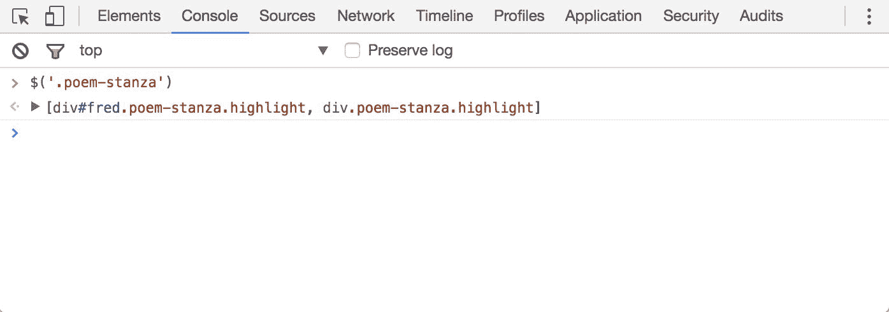
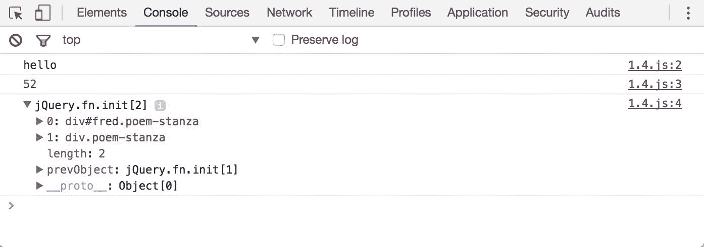

# 一、开始

今天的**万维网**（**WWW**）是一个动态的环境，其用户为网站的风格和功能设置了高标准。为了构建有趣的交互式站点，开发人员正在转向 JavaScript 库，如 jQuery，以自动化常见任务并简化复杂任务。jQuery 库之所以成为一个流行的选择，一个原因是它能够帮助完成广泛的任务。

知道从哪里开始似乎很有挑战性，因为 jQuery 执行了很多不同的功能。然而，图书馆的设计具有连贯性和对称性；它的许多概念都是借鉴了**HTML**和**级联样式表**（**CSS**的结构）。该库的设计有助于缺乏编程经验的设计师快速入门，因为许多人在这些技术方面的经验比 JavaScript 丰富。事实上，在本章的开头，我们将用三行代码编写一个运行正常的 jQuery 程序。另一方面，经验丰富的程序员也会欣赏这种概念上的一致性。

在本章中，我们将介绍：

*   jQuery 的主要特性
*   设置 jQuery 代码环境
*   一个简单的 jQuery 脚本示例
*   选择 jQuery 而不是普通 JavaScript 的原因
*   通用 JavaScript 开发工具

<footer style="margin-top: 5em;">

# jQuery 做什么？

jQuery 库为常见的 web 脚本提供了一个通用的抽象层，因此它在几乎所有脚本情况下都很有用。它的可扩展性意味着我们不可能在一本书中涵盖所有可能的用途和功能，因为插件不断被开发以添加新的功能。不过，核心功能有助于我们完成以下任务：

*   **访问文档中的元素**：如果没有 JavaScript 库，web 开发人员通常需要编写多行代码来遍历**文档对象模型**（**DOM**）树并定位 HTML 文档结构的特定部分。使用 jQuery，开发人员可以使用一个健壮而高效的选择器机制，从而可以轻松检索需要检查或操作的文档的确切部分。

```js
$('div.content').find('p'); 

```

*   **修改网页外观**：CSS 提供了一种影响文档呈现方式的强大方法，但在并非所有 web 浏览器都支持相同标准的情况下，它存在不足。通过 jQuery，开发人员可以跨越这一鸿沟，在所有浏览器中都依赖相同的标准支持。此外，jQuery 可以更改应用于文档一部分的类或单个样式属性，即使在呈现页面之后也是如此。

```js
$('ul > li:first').addClass('active'); 

```

*   **更改文档内容**：jQuery 不仅限于表面上的更改，还可以通过几个按键来修改文档本身的内容。文本可以更改，图像可以插入或交换，列表可以重新排序，HTML 的整个结构可以重写和扩展——所有这些都通过一个简单易用的**应用程序编程接口**（**API**实现）。

```js
$('#container').append('<a href="more.html">more</a>'); 

```

*   **响应用户的交互**：如果我们无法控制何时发生，即使是最复杂、最强大的行为也没有用处。jQuery 库提供了一种优雅的方式来截获各种各样的事件，例如用户单击链接，而无需使用事件处理程序来混乱 HTML 代码本身。

```js
$('button.show-details').click(() => { 
  $('div.details').show(); 
});

```

*   **对文档**进行动画更改：为了有效实施此类交互行为，设计师还必须向用户提供视觉反馈。jQuery 库通过提供一系列效果（如淡入淡出和擦除）以及一个制作新效果的工具包来实现这一点。

```js
$('div.details').slideDown(); 

```

*   **在不刷新页面的情况下从服务器检索信息**：这种模式被称为**Ajax**，它最初代表**异步 JavaScript 和 XML**，但后来代表了客户机和服务器之间通信的一组更大的技术。jQuery 库从这个过程中消除了特定于浏览器的复杂性，允许开发人员专注于服务器端功能。

```js
$('div.details').load('more.html #content');

```

<footer style="margin-top: 5em;">

# 为什么 jQuery 工作得很好？

随着人们对动态 HTML 兴趣的复苏，JavaScript 框架也随之激增。有些是专门的，只专注于前面提到的一两项任务。其他人则试图对每一种可能的行为和动画进行分类，并将其预先打包。为了在保持相对紧凑的同时保持前面概述的各种特性，jQuery 采用了几种策略：

*   **利用 CSS 知识**：通过基于 CSS 选择器的页面元素定位机制，jQuery 继承了一种简洁易读的文档结构表达方式。jQuery 库成为希望向页面添加行为的设计师的入口点，因为专业 web 开发的先决条件是了解 CSS 语法。
*   **支持扩展**：为了避免“特性爬行”，jQuery 将特殊情况下的用法降级为插件。创建新插件的方法很简单，并且有很好的文档记录，这促进了各种创新和有用模块的开发。甚至基本 jQuery 下载中的大部分功能都是通过插件体系结构在内部实现的，如果需要可以删除，从而生成更小的库。
*   **抽象出浏览器的怪癖**：web 开发的一个不幸现实是，每个浏览器都有自己的一套与已发布标准的偏差。任何 web 应用程序的很大一部分都可以降级为在每个平台上以不同方式处理功能。不断发展的浏览器环境使得一些高级功能不可能实现完全与浏览器无关的代码库，而 jQuery 添加了一个抽象层，规范化了常见任务，减少了代码的大小，同时极大地简化了代码。
*   **始终使用集合**：当我们指示 jQuery 查找类为`collapsible`的所有元素并隐藏它们时，不需要遍历每个返回的元素。相反，像`.hide()`这样的方法被设计成自动处理对象集，而不是单个对象。这种称为*隐式迭代*的技术意味着许多循环构造变得不必要，从而大大缩短了代码。
*   **允许在一行中执行多个操作**：为了避免过度使用临时变量或浪费性重复，jQuery 的大多数方法都采用了一种称为*链接*的编程模式。这意味着对对象的大多数操作的结果是对象本身，为应用于它的下一个操作做好准备。

这些策略使 jQuery 包的文件大小保持较小，同时提供了一些技术来保持使用库的自定义代码的紧凑性。

图书馆的优雅部分来自于设计，部分来自于项目周围涌现的充满活力的社区所推动的进化过程。jQuery 的用户聚集在一起，不仅讨论插件的开发，还讨论核心库的增强。用户和开发人员还协助不断改进官方项目文档，可在[中找到 http://api.jquery.com](http://api.jquery.com) 。

尽管需要做出所有努力来设计这样一个灵活、健壮的系统，最终产品还是可以免费使用。这个开源项目根据麻省理工学院许可证获得许可，允许在任何站点上免费使用 jQuery，并在专有软件中方便使用。如果项目需要，开发人员可以根据 GNU 公共许可证重新许可 jQuery，以便将其包含在其他 GNU 许可的开源项目中。

<footer style="margin-top: 5em;">

# jQuery3 有什么新功能？

与 jQuery2 中引入的更改相比，jQuery3 中引入的更改非常微妙。大部分的变化都在引擎盖下。让我们简单地看看一些变化，以及它们如何影响现有的 jQuery 项目。您可以查看细粒度细节（[https://jquery.com/upgrade-guide/3.0](https://jquery.com/upgrade-guide/3.0) 读这本书的时候。

<footer style="margin-top: 5em;">

# 浏览器支持

jquery3 中浏览器支持的最大变化是 internetexplorer。必须支持此浏览器的旧版本是任何 web 开发人员存在的祸根。jQuery3 只支持 IE9+，向前迈出了一大步。其他浏览器的支持策略为当前版本和以前的版本。

The days of Internet Explorer are numbered. Microsoft has released the successor to IE called Edge. This browser is a completely separate project from IE and isn't burdened by the issues that have plagued IE. Additionally, recent versions of Microsoft Windows actually push for Edge as the default browser, and updates are regular and predictable. Goodbye and good riddance IE.

<footer style="margin-top: 5em;">

# 递延对象

在 jQuery1.5 中引入了`Deferred`对象，作为更好地管理异步行为的一种方法。它们有点像 ES2015 承诺，但差异很大，无法互换。既然 ES2015 版本的 JavaScript 在现代浏览器中很常见，`Deferred`对象与本机`Promise`对象完全兼容。这意味着旧的`Deferred`实现已经改变了很多。

<footer style="margin-top: 5em;">

# 异步文档就绪

一开始，异步执行文档就绪回调函数的想法似乎违反直觉。jQuery3 中出现这种情况有几个原因。首先，`$(() => {})`表达式返回一个`Deferred`实例，这些实例现在的行为类似于本机承诺。第二个原因是有一个`jQuery.ready`承诺，当文档准备好时就会解决。正如您将在本书后面看到的，在 DOM 准备好呈现之前，您可以使用此承诺和其他承诺来执行其他异步任务。

<footer style="margin-top: 5em;">

# 其余的

jQuery3 中引入的 API 还有许多其他突破性的更改，我们在这里不详细介绍。我前面提到的升级指南详细介绍了这些更改以及如何处理这些更改。然而，在阅读本书时，我将指出 jQuery3 中新增的或不同的功能。

<footer style="margin-top: 5em;">

# 制作我们的第一个 jQuery 支持的网页

现在，我们已经介绍了 jQuery 提供的一系列功能，我们可以研究如何将库付诸实施。首先，我们需要下载 jQuery 的副本。

<footer style="margin-top: 5em;">

# 下载 jQuery

不需要安装。要使用 jQuery，我们只需要一个公开的文件副本，不管该副本是在外部站点上还是在我们自己的站点上。因为 JavaScript 是一种解释语言，所以不需要担心编译或构建阶段。每当我们需要一个页面来提供 jQuery 时，我们只需从 HTML 文档中的`<script>`元素中引用文件的位置。

jQuery 官方网站（[http://jquery.com/](http://jquery.com/) ）始终拥有图书馆最新的稳定版本，可直接从网站主页下载。jQuery 的多个版本在任何给定时刻都可能可用；作为站点开发者，最适合我们的是库的最新未压缩版本。在生产环境中，这可以用压缩版本替换。

随着 jQuery 的普及，公司已经通过其**内容交付****网络**（**CDN**免费提供该文件。最值得注意的是，谷歌（[https://developers.google.com/speed/libraries/devguide](https://developers.google.com/speed/libraries/devguide) 、微软（[http://www.asp.net/ajaxlibrary/cdn.ashx](http://www.asp.net/ajaxlibrary/cdn.ashx) ），以及 jQuery 项目本身（[http://code.jquery.com](http://code.jquery.com) 在分布于世界各地的功能强大、低延迟服务器上提供文件，以便快速下载，无论用户的位置如何。尽管托管 CDN 的 jQuery 副本由于服务器分发和缓存而具有速度优势，但在开发过程中使用本地副本会很方便。在本书中，我们将使用存储在我们自己系统中的文件副本，这将允许我们运行代码，无论我们是否连接到 Internet。

To avoid unexpected bugs, always use a specific version of jQuery. For example, 3.1.1\. Some CDNs allow you to link to the latest version of the library. Similarly, if you're using `npm` to install jQuery, always make sure that your `package.json` requires a specific version.

<footer style="margin-top: 5em;">

# 在 HTML 文档中设置 jQuery

jQuery 使用的大多数示例有三个部分：HTML 文档、用于设置其样式的 CSS 文件和用于对其进行操作的 JavaScript 文件。在我们的第一个示例中，我们将使用一个包含书籍摘录的页面，该页面的某些部分应用了许多类。此页面包含对 jQuery 库最新版本的引用，我们已下载并重命名为`jquery.js`，并将其放置在本地项目目录中：

```js
<!DOCTYPE html> 

<html lang="en"> 
  <head> 
    <meta charset="utf-8"> 
    <title>Through the Looking-Glass</title> 

    <link rel="stylesheet" href="01.css"> 

    <script src="jquery.js"></script> 
    <script src="01.js"></script> 
  </head> 

  <body>   
    <h1>Through the Looking-Glass</h1> 
    <div class="author">by Lewis Carroll</div> 

    <div class="chapter" id="chapter-1"> 
      <h2 class="chapter-title">1\. Looking-Glass House</h2> 
      <p>There was a book lying near Alice on the table, 
        and while she sat watching the White King (for she 
        was still a little anxious about him, and had the 
        ink all ready to throw over him, in case he fainted 
        again), she turned over the leaves, to find some 
        part that she could read, <span class="spoken"> 
        "&mdash;for it's all in some language I don't know," 
        </span> she said to herself.</p> 
      <p>It was like this.</p> 
      <div class="poem"> 
        <h3 class="poem-title">YKCOWREBBAJ</h3> 
        <div class="poem-stanza"> 
          <div>sevot yhtils eht dna ,gillirb sawT'</div> 
          <div>;ebaw eht ni elbmig dna eryg diD</div> 
          <div>,sevogorob eht erew ysmim llA</div> 
          <div>.ebargtuo shtar emom eht dnA</div> 
        </div> 
      </div> 
      <p>She puzzled over this for some time, but at last 
        a bright thought struck her. <span class="spoken"> 
        "Why, it's a Looking-glass book, of course! And if 
        I hold it up to a glass, the words will all go the 
        right way again."</span></p> 
      <p>This was the poem that Alice read.</p> 
      <div class="poem"> 
        <h3 class="poem-title">JABBERWOCKY</h3> 
        <div class="poem-stanza"> 
          <div>'Twas brillig, and the slithy toves</div> 
          <div>Did gyre and gimble in the wabe;</div> 
          <div>All mimsy were the borogoves,</div> 
          <div>And the mome raths outgrabe.</div> 
        </div> 
      </div> 
    </div> 
  </body> 
</html> 

```

紧接着正常的 HTML 序言，样式表被加载。对于本例，我们将使用一个简单的示例：

```js
body { 
  background-color: #fff; 
  color: #000; 
  font-family: Helvetica, Arial, sans-serif; 
}
h1, h2, h3 { 
  margin-bottom: .2em; 
}
.poem { 
  margin: 0 2em; 
} 
.highlight { 
  background-color: #ccc; 
  border: 1px solid #888; 
  font-style: italic; 
  margin: 0.5em 0; 
  padding: 0.5em; 
} 

```

Getting the example code
You can access the example code from the following GitHub repository:
[https://github.com/PacktPublishing/Learning-jQuery-3](https://github.com/PacktPublishing/Learning-jQuery-3).

引用样式表后，将包含 JavaScript 文件。jQuery 库的`script`标记必须放在定制脚本的标记之前，这一点很重要；否则，当我们的代码试图引用 jQuery 框架时，它将不可用。

Throughout the rest of this book, only the relevant portions of HTML and CSS files will be printed. The files in their entirety are available from the book's companion code examples: [https://github.com/PacktPublishing/Learning-jQuery-3](https://github.com/PacktPublishing/Learning-jQuery-3).

现在，我们有一个页面如下所示：



我们将使用 jQuery 对诗歌文本应用新的样式。

This example is to demonstrate a simple use of jQuery. In real-world situations, this type of styling could be performed purely with CSS.

<footer style="margin-top: 5em;">

# 添加 jQuery 代码

我们的自定义代码将放在第二个 JavaScript 文件中，该文件当前为空，我们使用`<script src="01.js"></script>`从 HTML 中包含该文件。对于本例，我们只需要三行代码：

```js
$(() => {
  $('div.poem-stanza').addClass('highlight')
});

```

I'll be using newer ES2015 **arrow function** syntax for most callback functions throughout the book. The only reason is that it's more concise than having the `function` keyword all over the place. However, if you're more comfortable with the `function() {}` syntax, by all means, use it.

现在让我们一步一步地浏览这个脚本，看看它是如何工作的。

<footer style="margin-top: 5em;">

# 寻找诗歌文本

jQuery 中的基本操作是选择文档的一部分。这是通过`$()`功能完成的。通常，它将字符串作为参数，可以包含任何 CSS 选择器表达式。在本例中，我们希望找到文档中应用了`poem-stanza`类的所有`<div>`元素，因此选择器非常简单。然而，在本书的整个过程中，我们将介绍更为复杂的选项。我们将在[第 2 章](02.html#164MG0-fd25fd954efc4043b43c8b05f3cc53ef)、*选择元素*中介绍查找文档部分的多种方法。

调用时，`$()`函数返回一个新的 jQuery 对象实例，这是我们将从现在开始使用的基本构建块。这个对象封装了零个或多个 DOM 元素，并允许我们以多种不同的方式与它们交互。在本例中，我们希望修改页面这些部分的外观，我们将通过更改应用于诗歌文本的类来实现这一点。

<footer style="margin-top: 5em;">

# 注入新类

`.addClass()`方法与大多数 jQuery 方法一样，以自描述性的方式命名；它将 CSS 类应用于我们选择的页面部分。它唯一的参数是要添加的类的名称。这种方法及其对应的方法`.removeClass()`将允许我们在探索不同的选择器表达式时，轻松地观察 jQuery 的运行情况。现在，我们的示例只是添加了`highlight`类，我们的样式表将其定义为带有灰色背景和边框的斜体文本。

Note that no iteration is necessary to add the class to all the poem stanzas. As we discussed, jQuery uses implicit iteration within methods such as `.addClass()`, so a single function call is all it takes to alter all the selected parts of the document.

<footer style="margin-top: 5em;">

# 执行代码

综上所述，`$()`和`.addClass()`足以让我们实现改变诗歌文本外观的目标。但是，如果这一行代码单独插入到文档标题中，则不会产生任何效果。JavaScript 代码在浏览器中遇到时会立即运行，并且在处理标头时，还没有 HTML 可供使用。我们需要延迟代码的执行，直到 DOM 可供我们使用。

通过`$(() => {})`构造（传递函数而不是选择器表达式），jQuery 允许我们在加载 DOM 后调度函数调用以触发，而无需等待图像完全呈现。虽然此事件调度不需要 jQuery 的帮助，但`$(() => {})`提供了一个特别优雅的跨浏览器解决方案，包括以下功能：

*   它使用浏览器的本地 DOM 就绪实现（如果可用），并添加一个`window.onload`事件处理程序作为安全网
*   它执行传递给`$()`的函数，即使在浏览器事件已经发生后调用它
*   它异步处理事件调度，以便在必要时允许脚本延迟

`$()`函数的参数可以接受对已定义函数的引用，如下代码段所示：

```js
function addHighlightClass()  { 
  $('div.poem-stanza').addClass('highlight'); 
} 

$(addHighlightClass); 

```

Listing 1.1

但是，正如在原始版本的脚本中所示，并在*清单 1.2*中重复，该方法也可以接受匿名函数：

```js
$(() =>
  $('div.poem-stanza').addClass('highlight')
); 

```

Listing 1.2

在 jQuery 代码中，当函数不可重用时，这种匿名函数习惯用法对于将函数作为参数的方法非常方便。此外，它所创建的闭包可以是一种先进而强大的工具。如果您使用的是 arrow 函数，那么还可以将`this`作为上下文进行词汇绑定，从而避免绑定函数。然而，如果不小心处理，它也可能会产生意想不到的后果和内存使用的后果。

<footer style="margin-top: 5em;">

# 成品

现在我们的 JavaScript 已经就绪，页面如下所示：



由于 JavaScript 代码插入了`highlight`类，诗节现在被斜体化并封装在框中，如`01.css`样式表所指定。

<footer style="margin-top: 5em;">

# 普通 JavaScript 与 jQuery

即使像这样简单的任务，如果没有 jQuery，也会变得复杂。在纯 JavaScript 中，我们可以这样添加`highlight`类：

```js
window.onload = function() {
  const divs = document.getElementsByTagName('div');
  const hasClass = (elem, cls) =>
    new RegExp(` ${cls} `).test(` ${elem.className} `);

  for (let div of divs) {
    if (hasClass(div, 'poem-stanza') && !hasClass(div, 'highlight')) {
      div.className += ' highlight';
    }
  }
};

```

Listing 1.3

尽管这个解决方案很长，但它不能处理 jQuery 在*清单 1.2*中为我们处理的许多情况，例如：

*   正确尊重其他`window.onload`事件处理程序
*   DOM 准备好后立即执行
*   使用现代 DOM 方法优化元素检索和其他任务

我们可以看到，jQuery 驱动的代码比它的纯 JavaScript 等价物更容易编写、更容易阅读和执行。

<footer style="margin-top: 5em;">

# 使用开发工具

正如此代码比较所示，jQuery 代码通常比其基本 JavaScript 等效代码更短、更清晰。然而，这并不意味着我们将始终编写没有 bug 的代码，或者我们将直观地了解页面上随时发生的事情。在标准开发工具的帮助下，我们的 jQuery 编码体验将更加流畅。

所有现代浏览器都提供高质量的开发工具。我们可以自由地使用对我们来说最舒适的环境。选项包括：

*   微软边缘（[https://developer.microsoft.com/en-us/microsoft-edge/platform/documentation/f12-devtools-guide/](https://developer.microsoft.com/en-us/microsoft-edge/platform/documentation/f12-devtools-guide/) ）
*   Internet Explorer 开发工具（[http://msdn.microsoft.com/en-us/library/dd565628.aspx](http://msdn.microsoft.com/%20en-us/library/dd565628.aspx) ）
*   Safari Web 开发工具（[https://developer.apple.com/safari/tools/](https://developer.apple.com/safari/tools/) ）
*   Chrome 开发者工具（[https://developer.chrome.com/devtools](https://developer.chrome.com/devtools) ）
*   Firefox 开发者工具（[https://developer.mozilla.org/en-US/docs/Tools](https://developer.mozilla.org/en-US/docs/Tools) ）

每个工具包都提供了类似的开发功能，包括：

*   探索和修改 DOM 的各个方面
*   CSS 及其对页面呈现影响的关系研究
*   通过特殊方法方便地跟踪脚本执行
*   暂停执行正在运行的脚本并检查变量值

虽然这些功能的细节因工具而异，但一般概念保持不变。在本书中，一些示例需要使用其中一个工具包；我们将在这些演示中使用 Chrome 开发工具，但其他浏览器的开发工具是不错的选择。

<footer style="margin-top: 5em;">

# Chrome 开发工具

访问和使用 Chrome Developer 工具的最新说明可在项目文档页面[上找到 https://developer.chrome.com/devtools](https://developer.chrome.com/devtools) 。这些工具太复杂，无法在这里详细探讨，但对一些最相关的功能进行调查将对我们有用。

Understanding these screenshots
Chrome Developer Tools is a quickly evolving project, so the following screenshots may not exactly match your environment.

激活 Chrome Developer Tools 后，会出现一个新面板，提供有关当前页面的信息。在该面板的“默认元素”选项卡中，我们可以在左侧看到页面结构的表示，在右侧看到所选元素的详细信息（例如应用于该元素的 CSS 规则）。此选项卡对于调查页面结构和调试 CSS 问题特别有用：



Sources 选项卡允许我们查看页面上所有加载脚本的内容。通过右键单击行号，我们可以设置断点、设置条件断点，或者在到达另一个断点后让脚本继续执行该行。断点是暂停脚本执行并逐步检查发生了什么的有效方法。在页面右侧，我们可以随时输入变量和表达式的列表，以了解其值：



在学习 jQuery 时，Console 选项卡将是我们最常用的。面板底部的一个字段允许我们输入任何 JavaScript 语句，然后语句的结果显示在面板中。

在本例中，我们执行与*清单 1.2*中相同的 jQuery 选择器，但我们不对所选元素执行任何操作。尽管如此，该语句还是为我们提供了有趣的信息：我们看到选择器的结果是一个 jQuery 对象，指向页面上的两个`.poem-stanza`元素。我们可以使用此控制台功能随时从浏览器中快速试用 jQuery 代码：



此外，我们可以使用`console.log()`方法直接从我们的代码与这个控制台交互：

```js
$(() => {
  console.log('hello');
  console.log(52);
  console.log($('div.poem-stanza'));
});

```

Listing 1.4

这段代码说明我们可以将任何类型的表达式传递到`console.log()`方法中。简单的值（如字符串和数字）直接打印，而更复杂的值（如 jQuery 对象）的格式很好，便于我们检查：



这个`console.log()`函数（在我们前面提到的每个浏览器开发工具中都可以使用）是 JavaScript`alert()`函数的一个方便的替代品，在我们测试 jQuery 代码时非常有用。

<footer style="margin-top: 5em;">

# 总结

在本章中，我们学习了如何使 jQuery 对网页上的 JavaScript 代码可用，使用`$()`函数定位页面中具有给定类的部分，调用`.addClass()`对页面的这部分应用其他样式，并调用`$(() => {})`在加载页面时执行此函数。我们还探讨了编写、测试和调试 jQuery 代码时将依赖的开发工具。

我们现在知道了为什么开发人员会选择使用 JavaScript 框架，而不是从头开始编写所有代码，即使是最基本的任务。我们还看到了 jQuery 作为一个框架所擅长的一些方式，为什么我们会选择它而不是其他选项，以及一般来说，jQuery 使哪些任务更容易。

我们使用的简单示例演示了 jQuery 是如何工作的，但在实际情况下并不十分有用。在下一章中，我们将通过探索 jQuery 复杂的选择器语言来扩展这段代码，找到这项技术的实际用途。

</footer>

</footer>

</footer>

</footer>

</footer>

</footer>

</footer>

</footer>

</footer>

</footer>

</footer>

</footer>

</footer>

</footer>

</footer>

</footer>

</footer>

</footer>

</footer>