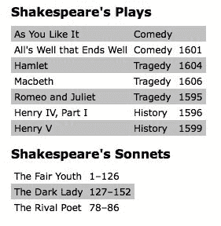
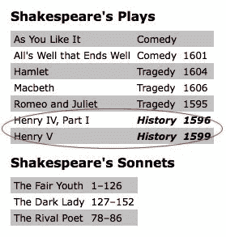

# 二、选择元素

jQuery 库利用**级联样式表**（**CSS**选择器）的强大功能，让我们能够快速轻松地访问**文档对象模型**（**DOM**中的元素或元素组。

在本章中，我们将介绍：

*   网页上元素的结构
*   如何使用 CSS 选择器查找页面上的元素
*   当 CSS 选择器的特殊性改变时会发生什么
*   标准 CSS 选择器集的自定义 jQuery 扩展
*   DOM 遍历方法，为访问页面上的元素提供了更大的灵活性
*   使用现代 JavaScript 语言功能高效地迭代 jQuery 对象

<footer style="margin-top: 5em;">

# 理解 DOM

jQuery 最强大的一个方面是它能够使在 DOM 中选择元素变得容易。DOM 充当 JavaScript 和 web 页面之间的接口；它将源 HTML 表示为对象网络，而不是纯文本。

该网络采用页面上元素的家族树形式。当我们提到元素之间的关系时，我们使用与家庭关系相同的术语：父母、孩子、兄弟姐妹等等。一个简单的例子可以帮助我们理解家谱隐喻是如何应用于文档的：

```js
<html> 
  <head> 
    <title>the title</title> 
  </head> 
  <body> 
    <div> 
      <p>This is a paragraph.</p> 
      <p>This is another paragraph.</p> 
      <p>This is yet another paragraph.</p> 
    </div> 
  </body> 
</html> 

```

在这里，`<html>`是所有其他元素的祖先；换句话说，所有其他元素都是`<html>`的后代。`<head>`和`<body>`元素不仅是`<html>`的后代，也是`<html>`的后代。同样地，除了是`<head>`和`<body>`的祖先之外，`<html>`也是他们的父母。`<p>`元素是`<div>`的子元素（和后代）、`<body>`和`<html>`的后代以及彼此的兄弟姐妹。


为了帮助可视化 DOM 的家族树结构，我们可以使用浏览器的开发人员工具来检查任何页面的 DOM 结构。当您对其他应用程序的工作方式感到好奇，并且希望实现类似的应用程序时，这尤其有用。

有了这个元素树，我们就可以使用 jQuery 高效地定位页面上的任何元素集。我们实现这一点的工具是 jQuery**选择器**和**遍历方法**。

<footer style="margin-top: 5em;">

# 使用$（）函数

来自 jQuery 选择器和方法的结果元素集始终由 jQuery 对象表示。当我们想要对页面上的内容进行实际操作时，这些对象非常容易使用。我们可以轻松地将事件绑定到这些对象并向其添加视觉效果，以及将多个修改或效果链接在一起。

Note that jQuery objects are different from regular DOM elements or node lists, and as such do not necessarily provide the same methods and properties for some tasks. In the final part of this chapter, we will look at ways to directly access the DOM elements that are collected within a jQuery object.

为了创建一个新的 jQuery 对象，我们使用了`$()`函数。此函数通常接受 CSS 选择器作为其唯一参数，并用作工厂，返回指向页面上相应元素的新 jQuery 对象。样式表中几乎可以使用的任何内容也可以作为字符串传递到此函数，从而允许我们将 jQuery 方法应用于匹配的元素集。

Making jQuery play well with other JavaScript libraries
In jQuery, the dollar sign `($)` is simply an alias for `jQuery`. Because a `$()` function is very common in JavaScript libraries, conflicts could arise if more than one of these libraries were being used in a given page. We can avoid such conflicts by replacing every instance of `<footer style="margin-top: 5em;" with `jQuery` in our custom jQuery code. Additional solutions to this problem are addressed in [Chapter 10](10.html#6S9HU0-fd25fd954efc4043b43c8b05f3cc53ef), *Advanced Events*. On the other hand, jQuery is so prominent in frontend development, that libraries tend to leave the `<footer style="margin-top: 5em;" symbol alone.

选择器的三个主要构建块是**标记名**、**ID**和**类**。它们可以单独使用，也可以与其他工具结合使用。以下简单示例说明了这三个选择器在代码中的显示方式：

| **选择器类型** | **CSS** | **jQuery** | **它的作用** |
| **标签名称** | `p { }` | `$('p')` | 这将选择文档中的所有段落。 |
| **ID** | `#some-id { }` | `$('#some-id')` | 这将选择文档中 ID 为`some-id`的单个元素。 |
| **类** | `.some-class { }` | `$('.some-class')` | 这将选择文档中具有`some-class`类的所有元素。 |

正如[第 1 章](01.html#J2B80-fd25fd954efc4043b43c8b05f3cc53ef)、*入门*中提到的，当我们调用 jQuery 对象的方法时，我们传递给`$()`的选择器引用的元素会自动隐式循环。因此，我们通常可以避免显式迭代，例如 DOM 脚本中经常需要的`for`循环。

现在我们已经介绍了基本知识，我们准备开始探索选择器的一些更强大的用途。

<footer style="margin-top: 5em;">

# CSS 选择器

jQuery 库支持 CSS 规范 1 到 3 中包含的几乎所有选择器，如万维网联盟网站[所述 http://www.w3.org/Style/CSS/specs](http://www.w3.org/Style/CSS/specs) 。这种支持允许开发人员增强他们的网站，而不必担心哪些浏览器可能不理解更高级的选择器，只要浏览器启用了 JavaScript。

Progressive Enhancement
Responsible jQuery developers should always apply the concepts of progressive enhancement and graceful degradation to their code, ensuring that a page will render as accurately, even if not as beautifully, with JavaScript disabled as it does with JavaScript turned on. We will continue to explore these concepts throughout the book. More information on progressive enhancement can be found at [http://en.wikipedia.org/wiki/Progressive_enhancement](http://en.wikipedia.org/wiki/Progressive_enhancement). Having said this, it's not very often that you'll encounter users with JavaScript disabled these days--even on mobile browsers.

为了开始学习 jQuery 如何使用 CSS 选择器，我们将使用出现在许多网站上的结构，通常用于导航——嵌套无序列表：

```js
<ul id="selected-plays"> 
  <li>Comedies 
    <ul> 
      <li><a href="/asyoulikeit/">As You Like It</a></li> 
      <li>All's Well That Ends Well</li> 
      <li>A Midsummer Night's Dream</li> 
      <li>Twelfth Night</li> 
    </ul> 
  </li> 
  <li>Tragedies 
    <ul> 
      <li><a href="hamlet.pdf">Hamlet</a></li> 
      <li>Macbeth</li> 
      <li>Romeo and Juliet</li> 
    </ul> 
  </li> 
  <li>Histories 
    <ul> 
      <li>Henry IV (<a href="mailto:henryiv@king.co.uk">email</a>) 
         <ul> 
           <li>Part I</li> 
           <li>Part II</li>  
         </ul> 
      <li><a href="http://www.shakespeare.co.uk/henryv.htm">Henry V</a></li>
      <li>Richard II</li> 
    </ul> 
  </li> 
</ul> 

```

Downloadable code examples
You can access the example code from the following Github repository: [https://github.com/PacktPublishing/Learning-jQuery-3](https://github.com/PacktPublishing/Learning-jQuery-3). 

请注意，第一个`<ul>`的 ID 为`selecting-plays`，但所有`<li>`标记都没有与其关联的类。如果未应用任何样式，列表如下所示：


嵌套列表的显示方式与我们预期的一样——一组项目符号项垂直排列，并根据其级别缩进。

<footer style="margin-top: 5em;">

# 设置列表项级别的样式

让我们假设我们想要顶级项目，并且只有顶级项目——喜剧、悲剧和历史——被水平排列。我们可以从在样式表中定义一个`horizontal`类开始：

```js
.horizontal { 
  float: left; 
  list-style: none; 
  margin: 10px; 
} 

```

`horizontal`类将元素浮动到它后面的元素的左侧，如果它是列表项，则从中删除项目符号，并在其所有边上添加 10 像素的边距。

与直接在 HTML 中附加`horizontal`类不同，我们将仅将其动态添加到顶级列表项中，以演示 jQuery 对选择器的使用：

```js
$(() => {
  $('#selected-plays > li')
    .addClass('horizontal');
}); 

```

Listing 2.1

如[第 1 章](08.html#5FF7G0-fd25fd954efc4043b43c8b05f3cc53ef)、*入门*中所述，我们通过调用`$(() => {})`开始 jQuery 代码，该函数在加载 DOM 后运行传递给它的函数，而不是在加载之前。

第二行使用子组合符（`>`）仅将`horizontal`类添加到所有顶级项中。实际上，`$()`函数中的选择器说：“查找 ID 为`selected-plays`（`#selected-plays`）的元素的子元素（`>`）的每个列表项（`li`）。

现在应用该类后，样式表中为该类定义的规则将生效，这意味着列表项是水平排列的，而不是垂直排列的。现在，我们的嵌套列表如下所示：


设计所有其他项目的样式——那些不在顶层的项目——可以通过多种方式完成。由于我们已经将`horizontal`类应用于顶级项，选择所有子级项的一种方法是使用否定伪类来标识所有没有`horizontal`类的列表项：

```js
$(() => {
  $('#selected-plays > li')
    .addClass('horizontal'); 
  $('#selected-plays li:not(.horizontal)')
    .addClass('sub-level');
}); 

```

Listing 2.2

这一次，我们选择了以下每个列表项（`<li>`：

*   是 ID 为`selected-plays`（`#selected-plays`的元素的后代
*   没有`horizontal`（`:not(.horizontal)`类）

当我们向这些项添加`sub-level`类时，它们会收到样式表中定义的阴影背景：

```js
.sub-level { 
  background: #ccc; 
} 

```

现在，嵌套列表如下所示：


<footer style="margin-top: 5em;">

# 选择特异性

jQuery 中的选择器具有一系列的特异性，从非常通用的选择器到非常有针对性的选择器。目标是选择正确的元素，否则选择器将被破坏。jQuery 初学者的趋势是为所有内容实现非常特定的选择器。也许通过反复试验，他们已经修复了选择器错误，为给定的选择器增加了更多的特殊性。然而，这并不总是最好的解决方案。

让我们看一个例子，它增加了顶级`<li>`文本的第一个字母的大小。以下是我们要应用的样式：

```js
.big-letter::first-letter {
   font-size: 1.4em;
 }

```

下面是列表项文本的外观：


正如你所看到的，喜剧、悲剧和历史都有着预期的风格。为了做到这一点，我们需要一个比`$('#selected-plays li')`更具体的选择器，它将样式应用于每个`<li>`，甚至子元素。我们可以使用更改 jQuery 选择器的特殊性来确保只得到我们期望的结果：

```js
$(() => { 
  $('#selected-plays > li') 
    .addClass('big-letter'); 

  $('#selected-plays li.horizontal')
    .addClass('big-letter'); 

  $('#selected-plays li:not(.sub-level)') 
    .addClass('big-letter'); 
});

```

Listing 2.3

这三个选择器都做相同的事情——将`big-letter`样式应用于`#selected-plays`中的顶级`<li>`元素。这些选择子的特异性各不相同。让我们回顾一下每种方法的工作原理，以及它们的优势：

*   `#selected-plays > li`：找到`<li>`元素，这些元素是`#selected-plays`的直接子元素。这很容易阅读，并且在语义上与 DOM 结构相关。
*   `#selected-plays li.horizontal`：找到`#selected-plays`中`horizontal`类的`<li>`元素或子元素。这也很容易阅读并强制执行特定的 DOM 模式（应用`horizontal`类）。
*   `#selected-plays li:not(.sub-level)`：这很难阅读，效率低下，并且不能反映实际的 DOM 结构。

有无数的例子显示选择器的特殊性。每个应用程序都是唯一的，正如我们刚才看到的，没有一种正确的方法来实现选择器专用性。重要的是，我们通过考虑选择器对 DOM 结构的影响，从而考虑应用程序或网站的可维护性，来进行良好的判断。

<footer style="margin-top: 5em;">

# 属性选择器

属性选择器是 CSS 选择器的一个特别有用的子集。它们允许我们通过元素的一个 HTML 属性来指定元素，例如链接的`title`属性或图像的`alt`属性。例如，要选择具有`alt`属性的所有图像，我们编写以下代码：

```js
$('img[alt]') 

```

<footer style="margin-top: 5em;">

# 样式链接

属性选择器接受受正则表达式启发的通配符语法，用于标识字符串开头（`^`或结尾（`<footer style="margin-top: 5em;"处的值。它们也可以用星号（`*`表示字符串中任意位置的值，或用感叹号（`!`表示否定值。

假设我们想为不同类型的链接提供不同的样式。我们首先在样式表中定义样式：

```js
a { 
  color: #00c;  
} 
a.mailto { 
  background: url(images/email.png) no-repeat right top; 
  padding-right: 18px; 
} 
a.pdflink { 
  background: url(images/pdf.png) no-repeat right top; 
  padding-right: 18px; 
} 
a.henrylink { 
  background-color: #fff; 
  padding: 2px; 
  border: 1px solid #000; 
} 

```

然后，我们使用 jQuery 将三个类--`mailto`、`pdflink`和`henrylink`添加到适当的链接中。

为了为所有电子邮件链接添加一个类，我们构造了一个选择器，用于查找所有锚元素（`a`），该选择器的`href`属性（`[href]`）以`mailto:`（`^="mailto:"`】开头，如下所示：

```js
$(() => {
  $('a[href^="mailto:"]')
    .addClass('mailto');
}); 

```

Listing 2.4

由于页面样式表中定义的规则，页面上的 mailto:链接后会出现信封图像。


要为 PDF 文件的所有链接添加一个类，我们使用美元符号而不是插入符号。这是因为我们选择的链接具有以`.pdf`结尾的`href`属性：

```js
$(() => { 
  $('a[href^="mailto:"]')
    .addClass('mailto'); 
  $('a[href$=".pdf"]')
    .addClass('pdflink'); 
}); 

```

*清单 2.5*

新添加的`pdflink`类的样式表规则会在每个 PDF 文档链接后显示 Adobe Acrobat 图标，如以下屏幕截图所示：


属性选择器也可以组合使用。例如，我们可以将类`henrylink`添加到具有`href`值的所有链接中，该值均以`http`开头并包含`henry`任意位置：

```js
$(() => { 
  $('a[href^="mailto:"]')
    .addClass('mailto'); 
  $('a[href$=".pdf"]')
    .addClass('pdflink'); 
  $('a[href^="http"][href*="henry"]') 
    .addClass('henrylink'); 
}); 

```

Listing 2.6

将三个类应用于三种类型的链接后，我们将看到以下内容：


请注意 Hamlet 链接右侧的 PDF 图标、电子邮件链接旁边的信封图标以及 Henry V 链接周围的白色背景和黑色边框。

<footer style="margin-top: 5em;">

# 自定义选择器

对于各种各样的 CSS 选择器，jQuery 添加了自己的自定义选择器。这些自定义选择器增强了 CSS 选择器以新方式定位页面元素的功能。

Performance note
When possible, jQuery uses the native DOM selector engine of the browser to find elements. This extremely fast approach is not possible when custom jQuery selectors are used. For this reason, it is recommended to avoid frequent use of custom selectors when a native option is available.

大多数自定义选择器允许我们从已经找到的元素集合中选择一个或多个元素。自定义选择器语法与 CSS 伪类语法相同，其中选择器以冒号（`:`开头）。例如，要从类为`horizontal`的`<div>`元素集中选择第二项，我们编写以下代码：

```js
$('div.horizontal:eq(1)') 

```

注意，`:eq(1)`选择集合中的第二项，因为 JavaScript 数组编号是基于零的，这意味着它以零开始。相反，CSS 是基于一个的，所以像`$('div:nth-child(1)')`这样的 CSS 选择器会选择所有的`div`选择器，这些选择器是其父项的第一个子项。因为很难记住哪些选择器是基于零的，哪些是基于一的，所以我们应该参考[上的 jQuery API 文档 http://api.jquery.com/category/selectors/](http://api.jquery.com/category/selectors/) 当有疑问时。

<footer style="margin-top: 5em;">

# 设置交替行的样式

jQuery 库中两个非常有用的自定义选择器是`:odd`和`:even`。让我们看看下面的表格，我们可以使用其中一个来实现基本的表条带：

```js
<h2>Shakespeare's Plays</h2> 
<table> 
  <tr> 
    <td>As You Like It</td> 
    <td>Comedy</td> 
    <td></td> 
  </tr> 
  <tr> 
    <td>All's Well that Ends Well</td> 
    <td>Comedy</td> 
    <td>1601</td> 
  </tr> 
  <tr> 
    <td>Hamlet</td> 
    <td>Tragedy</td> 
    <td>1604</td> 
  </tr> 
  <tr> 
    <td>Macbeth</td> 
    <td>Tragedy</td> 
    <td>1606</td> 
  </tr> 
  <tr> 
    <td>Romeo and Juliet</td> 
    <td>Tragedy</td> 
    <td>1595</td> 
  </tr> 
  <tr> 
    <td>Henry IV, Part I</td> 
    <td>History</td> 
    <td>1596</td> 
  </tr> 
  <tr> 
    <td>Henry V</td> 
    <td>History</td> 
    <td>1599</td> 
  </tr> 
</table> 
<h2>Shakespeare's Sonnets</h2> 
<table> 
  <tr> 
    <td>The Fair Youth</td> 
    <td>1-126</td> 
  </tr> 
  <tr> 
    <td>The Dark Lady</td> 
    <td>127-152</td> 
  </tr> 
  <tr> 
    <td>The Rival Poet</td> 
    <td>78-86</td> 
  </tr> 
</table> 

```

由于从样式表中应用了最少的样式，这些标题和表格看起来非常简单。该表具有纯白背景，没有将一行与下一行分隔的样式，如以下屏幕截图所示：


现在，我们可以为所有表行的样式表添加样式，并为奇数行使用`alt`类：

```js
tr { 
  background-color: #fff;  
} 
.alt { 
  background-color: #ccc;  
} 

```

最后，我们编写 jQuery 代码，将类附加到奇数表行（`<tr>`标记）：

```js
$(() => { 
  $('tr:even').addClass('alt'); 
}); 

```

Listing 2.7

但是等等！为什么对奇数行使用`:even`选择器？好的，`:even`和`:odd`选择器与`:eq()`选择器一样，使用 JavaScript 本机的基于零的编号。因此，第一行计为零（偶数），第二行计为一（奇数），依此类推。考虑到这一点，我们可以期望我们的简单代码生成如下所示的表：



注意，对于第二个表，这个结果可能不是我们想要的。由于 Plays 表中的最后一行具有交替的灰色背景，因此十四行诗表中的第一行具有纯白色背景。避免此类问题的一种方法是改用`:nth-child()`选择器，它计算元素相对于其父元素的位置，而不是相对于迄今为止选择的所有元素的位置。此选择器可以将数字`odd`或`even`作为其参数：

```js
$(() => {
  $('tr:nth-child(odd)').addClass('alt'); 
}); 

```

Listing 2.8

与前面一样，请注意，`:nth-child()`是唯一基于一个的 jQuery 选择器。要实现与前面相同的行分条，除了第二个表的行为一致之外，我们需要使用`odd`而不是`even`作为参数。使用此选择器后，两个表现在都可以很好地分条，如以下屏幕截图所示：


The `:nth-child()` selector is a native CSS selector in modern browsers.

<footer style="margin-top: 5em;">

# 基于文本内容查找元素

对于最后一个自定义选择器，假设出于某种原因，我们希望突出显示引用 Henry plays 之一的任何表格单元格。在向样式表添加一个类以使文本粗体和斜体（`.highlight {font-weight:bold; font-style: italic;}`）之后，我们所要做的就是使用`:contains()`选择器向我们的 jQuery 代码添加一行：

```js
$(() => { 
  $('tr:nth-child(odd)')
    .addClass('alt'); 
  $('td:contains(Henry)')
    .addClass('highlight'); 
}); 

```

Listing 2.9

所以，现在我们可以看到我们可爱的条纹桌子和亨利戏剧突出的特点：


It's important to note that the `:contains()` selector is case sensitive. Using `$('td:contains(henry)')` instead, without the uppercase "H", would select no cells. It's also important to note that `:contains()` can cause catastrophically bad performance, since the text of every element that matches the first part of the selector needs to be loaded and compared to our supplied argument. When `:contains()` has the potential to search hundreds of nodes for content, it's time to rethink our approach.

诚然，有一些方法可以在不使用 jQuery 或任何客户端编程的情况下实现行分条和文本突出显示。尽管如此，jQuery 和 CSS 是这种样式的一个很好的选择，在内容是动态生成的情况下，我们既不能访问 HTML 也不能访问服务器端代码。

<footer style="margin-top: 5em;">

# 表单选择器

自定义选择器的功能不限于根据元素的位置定位元素。例如，在使用表单时，jQuery 的自定义选择器和互补的 CSS3 选择器可以很快地选择我们需要的元素。下表介绍了其中一些表单选择器：

| **选择器** | **匹配** |
| --- | --- |
| `:input` | 输入、文本区域、选择和按钮元素 |
| `:button` | `type`属性等于`button`的按钮元素和输入元素 |
| `:enabled` | 启用的表单元素 |
| `:disabled` | 禁用的表单元素 |
| `:checked` | 选中的单选按钮或复选框 |
| `:selected` | 选择的选项元素 |

和其他选择器一样，表单选择器可以组合使用以获得更高的特异性。例如，我们可以使用`$('input[type="radio"]:checked')`选择所有选中的单选按钮（但不是复选框），或者使用`$('input[type="password"], input[type="text"]:disabled')`选择所有密码输入和禁用的文本输入。即使使用自定义选择器，我们也可以使用 CSS 的相同基本原理来构建匹配元素的列表。

We have only scratched the surface of available selector expressions here. We will dive further into the topic in [Chapter 9](09.html#688M40-fd25fd954efc4043b43c8b05f3cc53ef), *Advanced Selectors and Traversing*.

<footer style="margin-top: 5em;">

# DOM 遍历方法

到目前为止，我们研究的 jQuery 选择器允许我们在 DOM 树上来回导航并过滤结果时选择一组元素。如果这是选择元素的唯一方法，那么我们的选项将有点有限。在很多情况下，选择父元素或祖先元素是必不可少的；这就是 jQuery 的 DOM 遍历方法发挥作用的地方。使用这些方法，我们可以轻松地在 DOM 树上下移动。

有些方法在选择器表达式中具有几乎相同的对应项。例如，我们第一次用来添加`alt`类`$('tr:even').addClass('alt')`的行可以用`.filter()`方法重写，如下所示：

```js
$('tr')
  .filter(':even')
  .addClass('alt'); 

```

然而，在大多数情况下，这两种选择元素的方法是相辅相成的。此外，`.filter()`方法尤其具有强大的功能，因为它可以将函数作为其参数。该函数允许我们创建复杂的测试，以确定元素是否应包含在匹配集中。例如，我们假设要向所有外部链接添加一个类：

```js
a.external { 
  background: #fff url(images/external.png) no-repeat 100% 2px; 
  padding-right: 16px; 
} 

```

jQuery 没有用于这类事情的选择器。如果没有过滤函数，我们将被迫显式循环每个元素，分别测试每个元素。但是，使用以下过滤函数，我们仍然可以依赖 jQuery 的隐式迭代并保持代码紧凑：

```js
$('a')
  .filter((i, a) =>
    a.hostname && a.hostname !== location.hostname
  )
  .addClass('external'); 

```

Listing 2.10

提供的功能通过两个标准过滤`<a>`元素集：

*   它们必须具有带有域名（`a.hostname`的`href`属性。例如，我们使用这个测试来排除 mailto 链接。
*   他们链接到的域名（同样，`a.hostname`）必须与当前页面的域名（`location.hostname`）不匹配（`!==`）。

更准确地说，`.filter()`方法遍历匹配的元素集，为每个元素调用一次函数并测试返回值。如果函数返回`false`，则该元素将从匹配集中移除。如果返回`true`，则保留该元素。

使用`.filter()`方法后，Henry V 链接的样式表示其为外部链接：


在下一节中，我们将再看一看我们的条带化表示例，看看使用遍历方法还可以做些什么。

<footer style="margin-top: 5em;">

# 定型特异细胞

早些时候，我们在包含文本的所有单元格中添加了一个`highlight`类。为了在包含 Henry 的每个单元格旁边设置单元格样式，我们可以从我们已经编写的选择器开始，简单地对结果调用`.next()`方法：

```js
$(() => {
  $('td:contains(Henry)')
    .next()
    .addClass('highlight'); 
}); 

```

Listing 2.11

这些表现在应该如下所示：


`.next()`方法只选择下一个同级元素。为了突出显示包含 Henry 的单元格后面的所有单元格，我们可以使用`.nextAll()`方法：

```js
$(() => {
  $('td:contains(Henry)')
    .nextAll()
    .addClass('highlight'); 
}); 

```

Listing 2.12

由于包含 Henry 的单元格位于表的第一列中，因此此代码将突出显示这些行中的其余单元格：



正如我们所料，`.next()`和`.nextAll()`方法有对应的：`.prev()`和`.prevAll()`。此外，`.siblings()`选择同一 DOM 级别的所有其他元素，无论它们是在先前选择的元素之前还是之后。

要包括原始单元格（包含 Henry 的单元格）以及下面的单元格，我们可以添加`.addBack()`方法：

```js
$(() => {
  $('td:contains(Henry)')
    .nextAll()
    .addBack() 
    .addClass('highlight'); 
}); 

```

Listing 2.13

通过此修改，行中的所有单元格都从`highlight`类中获取其样式：


有许多选择器和遍历方法组合，通过它们我们可以选择相同的元素集。例如，这里是选择每行中至少一个单元格包含以下内容的每个单元格的另一种方法：

```js
$(() => { 
  $('td:contains(Henry)')
    .parent()
    .children() 
    .addClass('highlight'); 
}); 

```

Listing 2.14

我们没有遍历同级元素，而是在 DOM 中向上一级遍历到带有`.parent()`的`<tr>`标记，然后使用`.children()`选择行中的所有单元格。

<footer style="margin-top: 5em;">

# 锁链

我们刚刚探讨的遍历方法组合说明了 jQuery 的链接功能。使用 jQuery，可以选择多个元素集并使用它们执行多个操作，所有操作都在一行代码中完成。这种链接不仅有助于保持 jQuery 代码的简洁性，而且还可以在重新指定选择器时提高脚本的性能。

How chaining works
Almost all jQuery methods return a jQuery object and so can have more jQuery methods applied to the result. We will explore the inner workings of chaining in [Chapter 8](08.html#5FF7G0-fd25fd954efc4043b43c8b05f3cc53ef), *Developing Plugins*.

也可以将一行代码拆分为多行以提高可读性，正如我们在本章中所做的那样。例如，方法的单链序列可以写在一行中：

```js
$('td:contains(Henry)').parent().find('td:eq(1)') 
    .addClass('highlight').end().find('td:eq(2)') 
                           .addClass('highlight'); 

```

Listing 2.15

同样的方法序列也可以写成七行：

```js
$('td:contains(Henry)') // Find every cell containing "Henry" 
  .parent() // Select its parent 
  .find('td:eq(1)') // Find the 2nd descendant cell 
  .addClass('highlight') // Add the "highlight" class 
  .end() // Return to the parent of the cell containing "Henry" 
  .find('td:eq(2)') // Find the 3rd descendant cell 
  .addClass('highlight'); // Add the "highlight" class 

```

Listing 2.16

本例中的 DOM 遍历是人为的，不推荐使用。显然有更简单、更直接的方法可供我们使用。这个例子的目的仅仅是为了展示链接为我们提供了巨大的灵活性，特别是当需要进行许多调用时。

链接就像一口气说出一整段文字一样——它可以很快完成任务，但其他人很难理解。从长远来看，将其拆分为多行并添加明智的注释可以节省更多时间。

<footer style="margin-top: 5em;">

# 在 jQuery 对象上迭代

jQuery3 中的新功能是使用`for...of`循环迭代 jQuery 对象。这本身没什么大不了的。首先，我们很少需要显式地迭代 jQuery 对象，特别是当在 jQuery 函数中使用隐式迭代可以得到相同的结果时。但有时，显式迭代是不可避免的。例如，需要将元素数组（jQuery 对象）缩减为字符串值数组。`each()`功能是此处选择的工具：

```js
const eachText = [];

$('td')
  .each((i, td) => {
    if (td.textContent.startsWith('H')) {
      eachText.push(td.textContent);
    }
  });

console.log('each', eachText);
 // ["Hamlet", "Henry IV, Part I", "History", "Henry V", "History"]

```

Listing 2.17

我们从一组`<td>`元素开始，这是`$('td')`选择器的结果。然后，我们通过向`each()`函数传递一个回调函数，将以“H”开头的每个字符串推送到`eachText`数组中，将其简化为一个字符串数组。这种方法没有什么错，但是对于这样一个简单的任务使用回调函数似乎有点过分。以下是使用`for...of`语法的相同功能：

```js
 const forText = [];

 for (let td of $('td')) {
   if (td.textContent.startsWith('H')) {
     forText.push(td.textContent);
   }
 }

 console.log('for', forText);
 // ["Hamlet", "Henry IV, Part I", "History", "Henry V", "History"]

```

Listing 2.18

现在，我们可以使用简单 for 循环和 if 语句来减少 jQuery 对象。我们将在本书后面的部分重新讨论这种`for...of`方法，以了解涉及发电机的更高级使用场景。

<footer style="margin-top: 5em;">

# 访问 DOM 元素

每个选择器表达式和大多数 jQuery 方法都返回一个 jQuery 对象。这几乎总是我们想要的，因为它提供了隐式迭代和链接功能。

尽管如此，当我们需要直接访问 DOM 元素时，我们的代码中可能还有一些地方。例如，我们可能需要将结果元素集提供给另一个 JavaScript 库，或者我们可能需要访问元素的标记名，该标记名作为 DOM 元素的属性提供。对于这些公认罕见的情况，jQuery 提供了`.get()`方法。例如，要访问 jQuery 对象引用的第一个 DOM 元素，我们将使用`.get(0)`。因此，如果我们想知道 ID 为`my-element`的元素的标记名，我们会写：

```js
$('#my-element').get(0).tagName; 

```

为了更加方便，jQuery 提供了一个`.get()`的简写。我们可以在选择器后面立即使用方括号，而不是写上一行：

```js
$('#my-element')[0].tagName; 

```

这种语法似乎将 jQuery 对象视为 DOM 元素数组，这并非偶然；使用方括号就像剥离 jQuery 层以获取节点列表，而包含索引（在本例中为`0`）就像取出 DOM 元素本身。

<footer style="margin-top: 5em;">

# 总结

使用本章介绍的技术，我们现在应该能够以多种方式定位页面上的元素集。特别是，我们学习了如何使用基本 CSS 选择器为嵌套列表中的顶级和次级项设置样式，如何使用属性选择器将不同样式应用于不同类型的链接，使用自定义 jQuery 选择器`:odd`和`:even`或高级 CSS 选择器`:nth-child()`向表中添加基本的条带化，并通过链接 jQuery 方法高亮显示某些表单元格中的文本。

到目前为止，我们一直在使用`$(() => {})`文档就绪处理程序向匹配的元素集添加一个类。在下一章中，我们将探讨如何添加类以响应各种用户启动的事件。

<footer style="margin-top: 5em;">

# 进一步阅读

选择器和遍历方法的主题将在[第 9 章](09.html#688M40-fd25fd954efc4043b43c8b05f3cc53ef)、*高级选择器和遍历*中进行更详细的探讨。jQuery 选择器和遍历方法的完整列表见本书附录 B 和官方 jQuery 文档[http://api.jquery.com/](http://api.jquery.com/) 。

<footer style="margin-top: 5em;">

# 练习

挑战练习可能需要使用位于[的正式 jQuery 文档 http://api.jquery.com/](http://api.jquery.com/) ：

1.  向嵌套列表第二级的所有`<li>`元素添加一个`special`类。
2.  在表格第三列的所有表格单元格中添加一个`year`类。
3.  将类`special`添加到第一个表行中，该行中包含单词“悲剧”。
4.  这是给你的一个挑战。选择包含链接（`<a>`的所有列表项（`<li>s`）。将类别`afterlink`添加到所选类别后面的同级列表项中。
5.  你还有一个挑战。将类`tragedy`添加到任何`.pdf`链接的最近祖先`<ul>`。

</footer>

</footer>

</footer>

</footer>

</footer>

</footer>

</footer>

</footer>

</footer>

</footer>

</footer>

</footer>

</footer>

</footer>

</footer>

</footer>

</footer>

</footer>

</footer>