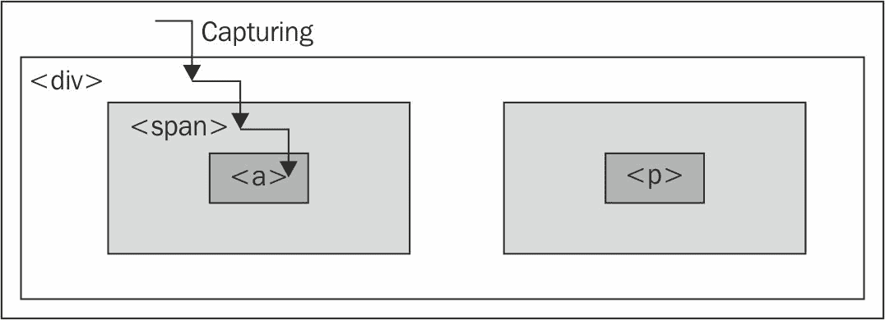

# 三、处理事件

JavaScript 有几种内置的方式来响应用户交互和其他事件。为了使页面具有动态性和响应性，我们需要利用这一功能，以便我们能够在适当的时候使用到目前为止学习的 jQuery 技术以及稍后将学习的其他技巧。虽然我们可以使用香草 JavaScript 实现这一点，但 jQuery 增强并扩展了基本的事件处理机制，为它们提供了更优雅的语法，同时使它们更强大。

在本章中，我们将介绍：

*   当页面准备就绪时执行 JavaScript 代码
*   处理用户事件，例如鼠标单击和按键
*   文档中的事件流，以及如何操作该流
*   模拟事件，就好像是用户发起的一样

<footer style="margin-top: 5em;">

# 在页面加载时执行任务

我们已经看到了如何让 jQuery 对网页加载做出反应。`$(() => {})`事件处理程序可用于运行依赖于 HTML 元素的代码，但还有一点需要说明。

<footer style="margin-top: 5em;">

# 代码执行的时间安排

在[第 1 章](01.html#J2B80-fd25fd954efc4043b43c8b05f3cc53ef)、*入门*中，我们注意到`$(() => {})`是 jQuery 在页面加载上执行任务的主要方式。然而，这并不是我们可以使用的唯一方法。本机`window.onload`事件也可以做同样的事情。虽然这两种方法是相似的，但重要的是要认识到它们在时间上的差异，尽管这可能非常微妙，取决于加载的资源数量。

当文档完全下载到浏览器时触发`window.onload`事件。这意味着页面上的每个元素都可以被 JavaScript 操作，这对于编写功能丰富的代码来说是一个福音，而不必担心加载顺序。

另一方面，当 DOM 完全可以使用时，调用使用`$(() => {})`注册的处理程序。这也意味着我们的脚本可以访问所有元素，但并不意味着所有相关文件都已下载。一旦 HTML 文件被下载并解析为 DOM 树，代码就可以运行了。

Style loading and code execution
To ensure that the page has also been styled before the JavaScript code executes, it is good practice to place the `<link rel="stylesheet">` and `<style>` tags prior to any `<script>` tags within the document's `<head>` element.

例如，考虑呈现图像画廊的页面；这样的页面上可能有许多大图像，我们可以使用 jQuery 隐藏、显示、移动或以其他方式操作这些图像。如果我们使用`onload`事件设置我们的界面，用户将不得不等到每个图像都完全下载后才能使用这些功能。更糟糕的是，如果行为尚未附加到具有默认行为（如链接）的元素，则用户交互可能会产生意外结果。但是，当我们使用`$(() => {})`进行设置时，该界面已准备好以正确的行为提前使用。

What is loaded and what is not?
Using `$(() => {})` is almost always preferred over using an `onload` handler, but we need to keep in mind that, because supporting files may not have loaded, attributes such as image height and width are not necessarily available at this time. If these are needed, we may at times also choose to implement an `onload` handler; the two mechanisms can coexist peacefully.

<footer style="margin-top: 5em;">

# 在一个页面上处理多个脚本

通过 JavaScript 注册事件处理程序的传统机制（而不是在 HTML 内容中添加处理程序属性）是将函数分配给 DOM 元素的相应属性。例如，假设我们定义了以下函数：

```js
function doStuff() { 
  // Perform a task... 
} 

```

然后，我们可以在 HTML 标记中分配它：

```js
<body onload="doStuff();"> 

```

或者，我们可以从 JavaScript 代码中分配它：

```js
window.onload = doStuff; 

```

这两种方法都会导致在加载页面时执行函数。第二种方法的优点是行为与标记完全分离。

Referencing versus calling functions
When we assign a function as a handler, we use the function name but omit the trailing parentheses. With the parentheses, the function is called immediately; without the parantheses, the name simply identifies, or *references*, the function, and can be used to call it later.

有一个功能，这个策略运行得很好。但是，假设我们有第二个函数，如下所示：

```js
function doOtherStuff() { 
  // Perform another task... 
} 

```

然后，我们可以尝试分配此函数在页面加载时运行：

```js
window.onload = doOtherStuff; 

```

然而，这项任务胜过第一项任务。`.onload`属性一次只能存储一个函数引用，因此无法添加到现有行为中。

`$(() => {})`机制优雅地处理这种情况。每次调用都会将新函数添加到行为的内部队列中；加载页面时，所有函数都将执行。这些函数将按注册顺序运行。

To be fair, jQuery doesn't have a monopoly on workarounds to this issue. We can write a JavaScript function that calls the existing `onload` handler, then calls a passed-in handler. This approach avoids conflicts between rival handlers like `$(() => {})` does, but lacks some of the other benefits we have discussed. In modern browsers, the `DOMContentLoaded` event can be triggered with the W3C standard `document.addEventListener()` method. However, the `$(() => {})` is more concise and elegant.

<footer style="margin-top: 5em;">

# 将参数传递给文档就绪回调

在某些情况下，在同一页面上使用多个 JavaScript 库可能会很有用。由于许多库都使用了`<footer style="margin-top: 5em;"标识符（因为它既短又方便），我们需要一种防止库之间冲突的方法。

幸运的是，jQuery 提供了一个名为`jQuery.noConflict()`的方法，将`<footer style="margin-top: 5em;"标识符的控制权返回给其他库。`jQuery.noConflict()`的典型用法如下：

```js
<script src="prototype.js"></script> 
<script src="jquery.js"></script> 
<script> 
  jQuery.noConflict(); 
</script> 
<script src="myscript.js"></script> 

```

首先，包括另一个库（本例中为`prototype.js`）。然后，包括`jquery.js`本身，接管`<footer style="margin-top: 5em;"自用。接下来，对`.noConflict()`的调用将释放`<footer style="margin-top: 5em;"，这样它的控制权将恢复到第一个包含的库（`prototype.js`。现在在我们的定制脚本中，我们可以同时使用这两个库，但是每当我们想要使用 jQuery 方法时，我们都需要编写`jQuery`而不是`<footer style="margin-top: 5em;"作为标识符。

`$(() => {})`文档就绪处理程序还有一个技巧可以帮助我们应对这种情况。我们传递给它的回调函数可以接受一个参数，`jQuery`对象本身。这使我们可以使用以下语法有效地重命名它，而无需担心冲突：

```js
jQuery(($) => { 
  // In here, we can use $ like normal! 
}); 

```

<footer style="margin-top: 5em;">

# 处理简单事件

除了加载页面之外，我们还可能需要在其他时间执行任务。正如 JavaScript 允许我们用`<body onload="">`或`window.onload`截获页面加载事件一样，它也为用户启动的事件提供了类似的挂钩，如鼠标点击（`onclick`）、表单字段被修改（`onchange`）和窗口更改大小（`onresize`）。当直接分配给 DOM 中的元素时，这些钩子与我们为`onload`概述的钩子具有类似的缺点。因此，jQuery 还提供了处理这些事件的改进方法。

<footer style="margin-top: 5em;">

# 一个简单的样式转换程序

为了说明一些事件处理技术，假设我们希望根据用户输入以几种不同的样式呈现单个页面；我们将提供一些按钮，允许用户在普通视图、文本约束为窄列的视图和内容区域的大打印视图之间切换。

Progressive enhancement
In a real-world example, a good web citizen will employ the principle of progressive enhancement here. In [Chapter 5](05.html#3BOFI0-fd25fd954efc4043b43c8b05f3cc53ef), *Manipulating the DOM*, you will learn how we can inject content like this style switcher right from our jQuery code, so that users without JavaScript available will not see nonfunctional controls.

样式切换程序的 HTML 标记如下所示：

```js
<div id="switcher" class="switcher"> 
  <h3>Style Switcher</h3> 
  <button id="switcher-default"> 
    Default 
  </button> 
  <button id="switcher-narrow"> 
    Narrow Column 
  </button> 
  <button id="switcher-large"> 
    Large Print 
  </button> 
</div> 

```

Getting the example code
You can access the example code from the following GitHub repository: [https://github.com/PacktPublishing/Learning-jQuery-3](https://github.com/PacktPublishing/Learning-jQuery-3).

结合页面的其余 HTML 标记和一些基本 CSS，我们得到一个如下所示的页面：


首先，我们将使“大打印”按钮工作。我们需要一点 CSS 来实现页面的备选视图，如下所示：

```js
body.large .chapter { 
  font-size: 1.5em; 
} 

```

那么，我们的目标是将`large`类应用于`<body>`标记。这将允许样式表适当地重新格式化页面。根据您在[第 2 章](02.html#164MG0-fd25fd954efc4043b43c8b05f3cc53ef)、*选择元素*中所学的内容，我们已经知道了实现这一点所需的陈述：

```js
$('body').addClass('large'); 

```

但是，我们希望在单击按钮时发生这种情况，而不是像我们到目前为止看到的那样在加载页面时发生这种情况。为此，我们将介绍`.on()`方法。此方法允许我们指定任何 DOM 事件并向其附加行为。在这种情况下，事件被称为`click`，行为是一个函数，由我们前面的一行组成：

```js
$(() => {
  $('#switcher-large')
    .on('click', () => { 
      $('body').addClass('large'); 
    }); 
}); 

```

Listing 3.1

现在，当点击按钮时，我们的代码运行，文本放大：


这就是将行为绑定到事件的全部内容。我们与`$(() => {})`文档就绪处理程序讨论的优点也适用于这里。对`.on()`的多个调用可以很好地共存，并根据需要向同一事件附加额外的行为。

这不一定是完成这项任务的最优雅或最有效的方式。当我们继续阅读本章时，我们将扩展和完善这段代码，使之成为我们引以为豪的东西。

<footer style="margin-top: 5em;">

# 启用其他按钮

我们现在有一个大的打印按钮，它可以像广告中那样工作，但是我们需要对其他两个按钮（默认和窄列）应用类似的处理，以使它们执行任务。这很简单：我们使用`.on()`向它们中的每一个添加`click`处理程序，根据需要删除和添加类。新守则内容如下：

```js
$(() => {
  $('#switcher-default')
    .on('click', () => { 
      $('body')
        .removeClass('narrow')
        .removeClass('large'); 
    });

  $('#switcher-narrow')
    .on('click', () => { 
      $('body')
        .addClass('narrow')
        .removeClass('large'); 
    }); 

  $('#switcher-large')
    .on('click', () => { 
      $('body')
        .removeClass('narrow')
        .addClass('large'); 
    }); 
}); 

```

Listing 3.2

这与`narrow`类的 CSS 规则相结合：

```js
body.narrow .chapter { 
  width: 250px; 
} 

```

现在，单击“窄列”按钮后，将应用相应的 CSS，并以不同的方式排列文本：


单击 Default 会从`<body>`标记中删除这两个类名，并将页面返回到初始呈现状态。

<footer style="margin-top: 5em;">

# 利用事件处理程序上下文

我们的切换器运行正常，但我们不会向用户提供有关当前激活的按钮的任何反馈。我们处理这个问题的方法是在点击按钮时将`selected`类应用于按钮，并从其他按钮中删除这个类。`selected`类只是将按钮的文本设置为粗体：

```js
.selected { 
  font-weight: bold; 
} 

```

我们可以像以前一样通过按 ID 引用每个按钮并根据需要应用或删除类来完成此类修改，但是，我们将探索一种更优雅和可扩展的解决方案，它利用事件处理程序运行的上下文。

当触发任何事件处理程序时，关键字`this`指行为附加到的 DOM 元素。前面我们注意到，`$()`函数可以使用 DOM 元素作为参数；这是该设施可用的关键原因之一。通过在事件处理程序中写入`$(this)`，我们创建了一个与元素对应的 jQuery 对象，我们可以对它进行操作，就像我们使用 CSS 选择器定位它一样。

考虑到这一点，我们可以编写以下内容：

```js
$(this).addClass('selected'); 

```

在三个处理程序中的每一个中放置这一行将在单击按钮时添加该类。要从其他按钮中删除该类，我们可以利用 jQuery 的隐式迭代特性，并编写：

```js
$('#switcher button').removeClass('selected'); 

```

此行从样式切换器中的每个按钮中删除该类。

我们还应该在文档准备就绪时将该类添加到默认按钮。因此，按照正确的顺序排列，代码如下：

```js
$(() => { 
  $('#switcher-default') 
    .addClass('selected') 
    .on('click', function() { 
      $('body')
        .removeClass('narrow'); 
        .removeClass('large'); 
      $('#switcher button')
        .removeClass('selected'); 
      $(this)
        .addClass('selected'); 
    });

  $('#switcher-narrow')
    .on('click', function() { 
        $('body')
          .addClass('narrow')
          .removeClass('large'); 
        $('#switcher button')
          .removeClass('selected'); 
        $(this)
          .addClass('selected'); 
  }); 

  $('#switcher-large')
    .on('click', function() { 
      $('body')
        .removeClass('narrow')
        .addClass('large'); 
      $('#switcher button')
        .removeClass('selected'); 
      $(this)
        .addClass('selected'); 
  }); 
}); 

```

Listing 3.3

现在，样式转换程序会给出适当的反馈。

通过使用处理程序上下文对语句进行泛化，可以使我们更加高效。我们可以将突出显示例程分解成一个单独的处理程序，如清单 3.4 所示，因为这三个按钮都是相同的：

```js
$(() => {
  $('#switcher-default') 
    .addClass('selected') 
    .on('click', function() { 
      $('body')
        .removeClass('narrow')
        .removeClass('large'); 
    }); 
  $('#switcher-narrow')
    .on('click', () => { 
      $('body')
        .addClass('narrow')
        .removeClass('large'); 
    }); 

  $('#switcher-large')
    .on('click', () => { 
      $('body')
        .removeClass('narrow')
        .addClass('large'); 
    }); 

  $('#switcher button')
    .on('click', function() { 
      $('#switcher button')
        .removeClass('selected'); 
      $(this)
        .addClass('selected'); 
    }); 
}); 

```

Listing 3.4

这个优化利用了我们已经讨论过的三个 jQuery 特性。首先，**隐式迭代**在我们通过对`.on()`的一次调用将相同的`click`处理程序绑定到每个按钮时再次有用。第二，**行为队列**允许我们将两个函数绑定到同一个点击事件，而第二个函数不会覆盖第一个函数。

When an event handler function references its context using `this`, you can't use an arrow function (`() => {}`). These functions have a **lexical context**. This means that when jQuery attempts to set the context as the element that triggered the event, it doesn't work.

<footer style="margin-top: 5em;">

# 使用事件上下文整合代码

我们刚刚完成的代码优化是**重构**的一个例子——修改现有代码以更高效或优雅的方式执行相同的任务。为了探索进一步的重构机会，让我们看看绑定到每个按钮的行为。`.removeClass()`方法的参数是可选的；省略时，它将从元素中删除所有类。我们可以通过如下方式利用这一点稍微简化代码：

```js
$(() => {
  $('#switcher-default') 
    .addClass('selected') 
    .on('click', () => { 
      $('body').removeClass(); 
    });
  $('#switcher-narrow')
    .on('click', () => { 
      $('body')
        .removeClass()
        .addClass('narrow'); 
    }); 

  $('#switcher-large')
    .on('click', () => { 
      $('body')
        .removeClass()
        .addClass('large'); 
    }); 

  $('#switcher button')
    .on('click', function() { 
      $('#switcher button')
        .removeClass('selected'); 
      $(this)
        .addClass('selected'); 
    }); 
}); 

```

Listing 3.5

请注意，为了适应更一般的类删除，操作顺序已经发生了一些变化；我们需要先执行`.removeClass()`，这样它就不会撤消对`.addClass()`的调用，我们同时执行该调用。

We can only safely remove all classes because we are in charge of the HTML in this case. When we are writing code for reuse (such as for a plugin), we need to respect any classes that might be present and leave them intact.

现在，我们正在每个按钮的处理程序中执行一些相同的代码。这可以很容易地分解到我们的通用按钮`click`处理程序中：

```js
$(() => {
  $('#switcher-default')
    .addClass('selected'); 
  $('#switcher button')
    .on('click', function() { 
      $('body')
        .removeClass(); 
      $('#switcher button')
        .removeClass('selected'); 
      $(this)
        .addClass('selected'); 
    });

  $('#switcher-narrow')
    .on('click', () => { 
      $('body')
        .addClass('narrow'); 
    }); 

  $('#switcher-large')
    .on('click', () => { 
      $('body')
        .addClass('large'); 
    }); 
}); 

```

Listing 3.6

请注意，我们现在需要将常规处理程序移到特定处理程序之上。`.removeClass()`调用需要在`.addClass()`执行之前发生，我们可以相信这一点，因为 jQuery 总是按照事件处理程序注册的顺序触发事件处理程序。

最后，我们可以通过再次利用**事件上下文**完全摆脱特定的处理程序。由于上下文关键字`this`为我们提供了一个 DOM 元素而不是 jQuery 对象，因此我们可以使用本机 DOM 属性来确定被单击元素的 ID。因此，我们可以将同一个处理程序绑定到所有按钮，并在处理程序中为每个按钮执行不同的操作：

```js
$(() => {
  $('#switcher-default')
    .addClass('selected'); 
  $('#switcher button')
    .on('click', function() { 
      const bodyClass = this.id.split('-')[1]; 
      $('body')
        .removeClass()
        .addClass(bodyClass); 
      $('#switcher button')
        .removeClass('selected'); 
      $(this)
        .addClass('selected'); 
    }); 
}); 

```

Listing 3.7

`bodyClass`变量的值将是`default`、`narrow`或`large`，具体取决于点击哪个按钮。在这里，我们与之前的代码有些不同；因为当用户点击`<button id="switcher-default">`时，我们正在`<body>`中添加`default`类。虽然我们不需要应用这个类，但它也不会造成任何伤害，而且代码复杂性的降低远远弥补了未使用的类名。

<footer style="margin-top: 5em;">

# 速记项目

绑定事件（例如简单的`click`事件）的处理程序是一项非常常见的任务，jQuery 提供了更简洁的方法来完成它；速记事件方法的工作方式与`.on()`对应方法相同，击键次数更少。

例如，我们的样式切换器可以使用`.click()`而不是`.on()`编写，如下所示：

```js
$(() => {
  $('#switcher-default')
    .addClass('selected');

  $('#switcher button')
    .click(function() { 
      const bodyClass = this.id.split('-')[1]; 
      $('body')
        .removeClass()
        .addClass(bodyClass); 
      $('#switcher button')
        .removeClass('selected'); 
      $(this)
        .addClass('selected'); 
  }); 
}); 

```

Listing 3.8

对于其他标准 DOM 事件，例如`blur`、`keydown`和`scroll`也存在类似于前一种的速记事件方法。每个快捷方式方法都将处理程序绑定到具有相应名称的事件。

<footer style="margin-top: 5em;">

# 显示和隐藏页面元素

假设我们希望能够在不需要时隐藏样式切换程序。隐藏页面元素的一种方便方法是使其可折叠。我们将允许在标签上单击一次以隐藏按钮，而不使用标签。再次单击标签将恢复按钮。我们需要另一个类来隐藏按钮：

```js
.hidden { 
  display: none; 
} 

```

我们可以通过将按钮的当前状态存储在变量中并在每次单击标签时检查其值来实现此功能，以了解是否要添加或删除按钮上的隐藏类。然而，jQuery 为我们提供了一种添加或删除类的简单方法，这取决于该类是否已经存在，`.toggleClass()`方法：

```js
$(() => {
  $('#switcher h3')
    .click(function() {
      $(this)
        .siblings('button')
        .toggleClass('hidden');
    });
}); 

```

Listing 3.9

第一次单击后，按钮全部隐藏：


然后，第二次单击会使其恢复可见性：


再一次，我们依靠隐式迭代，这一次是一下子隐藏所有按钮——即`<h3>`的兄弟按钮。

<footer style="margin-top: 5em;">

# 事件传播

在说明`click`事件在通常不可点击的页面元素上运行的能力时，我们制作了一个界面，该界面不表示样式切换标签——只是一个`<h3>`元素实际上是页面中等待用户交互的*活动*部分。为了解决这个问题，我们可以给它一个滚动状态，明确它以某种方式与鼠标交互：

```js
.hover { 
  cursor: pointer; 
  background-color: #afa; 
} 

```

CSS 规范包括一个名为`:hover`的伪类，当用户的鼠标光标悬停在样式表上时，该类允许样式表影响元素的外观。这当然可以解决我们在本例中的问题，但我们将借此机会介绍 jQuery 的`.hover()`方法，它允许我们使用 JavaScript 来更改元素的样式，实际上，在鼠标光标进入元素和离开元素时执行任意操作。

`.hover()`方法采用两个函数参数，与我们目前遇到的简单事件方法不同。第一个函数将在鼠标光标进入所选元素时执行，第二个函数将在光标离开时激发。我们可以在这些时候修改应用于按钮的类，以实现滚动效果：

```js
$(() => { 
  $('#switcher h3')
    .hover(function() { 
      $(this).addClass('hover'); 
    }, function() { 
      $(this).removeClass('hover'); 
    }); 
}); 

```

Listing 3.10

我们再次使用隐式迭代和事件上下文来编写简短的代码。现在，当鼠标悬停在`<h3>`元素上时，我们看到我们的类已应用：


`.hover()`的使用也意味着我们避免了 JavaScript 中事件传播带来的麻烦。为了理解这一点，我们需要了解 JavaScript 如何决定哪个元素处理给定事件。

<footer style="margin-top: 5em;">

# 事件之旅

当页面上发生事件时，整个 DOM 元素层次结构都有机会处理该事件。考虑一个页面模型，如下所示：

```js
<div class="foo"> 
  <span class="bar"> 
    <a href="http://www.example.com/"> 
      The quick brown fox jumps over the lazy dog. 
    </a> 
  </span> 
  <p> 
    How razorback-jumping frogs can level six piqued gymnasts! 
  </p> 
</div> 

```

然后，我们将代码可视化为一组嵌套元素：


对于任何事件，都有多个元素在逻辑上负责作出反应。当点击此页面上的链接时，例如，`<div>`、`<span>`和`<a>`元素都应该有机会响应点击。毕竟，这三个元素当时都在用户的鼠标光标下。另一方面，`<p>`元素根本不是这种互动的一部分。

允许多个元素响应用户交互的一种策略称为**事件捕获**。通过事件捕获，事件首先被赋予最全面的元素，然后逐步赋予更具体的元素。在我们的示例中，这意味着首先通过`<div>`元素传递事件，然后通过`<span>`元素，最后通过`<a>`元素，如下图所示：



相反的策略称为**事件****冒泡**。事件被发送到最具体的元素，在该元素有机会做出反应后，事件**会向更一般的元素冒泡**。在我们的示例中，`<a>`元素首先被传递事件，然后依次传递`<span>`和`<div>`元素，如下图所示：


毫不奇怪，不同的浏览器开发人员最初决定采用不同的事件传播模型。因此，最终开发的 DOM 标准规定应使用这两种策略：首先将事件从一般元素捕获到特定元素，然后将事件气泡返回到 DOM 树的顶部。可以为流程的任一部分注册事件处理程序。

为了提供一致且易于理解的行为，jQuery 总是为模型的冒泡阶段注册事件处理程序。我们总是可以假设，最具体的元素将第一次有机会响应任何事件。

<footer style="margin-top: 5em;">

# 事件冒泡的副作用

事件冒泡可能导致意外行为，特别是当错误的元素响应`mouseover`或`mouseout`事件时。考虑一个附加的 T2A.事件处理程序，它连接到我们示例中的 AUTT3 元素。当用户的鼠标光标退出`<div>`元素时，`mouseout`处理程序按预期运行。因为它位于层次结构的顶部，所以没有其他元素获得该事件。另一方面，当光标退出`<a>`元素时，会向该元素发送`mouseout`事件。然后，该事件将冒泡到`<span>`元素，然后冒泡到`<div>`元素，触发相同的事件处理程序。这种冒泡顺序不太可能是理想的。

在`.hover()`方法中单独绑定或组合的`mouseenter`和`mouseleave`事件都知道这些冒泡问题，当我们使用它们附加事件时，我们可以忽略错误元素获取`mouseover`或`mouseout`事件所导致的问题。

刚才描述的`mouseout`场景说明了限制事件范围的必要性。当`.hover()`处理此特定情况时，我们将遇到其他情况，在这些情况下，我们需要在空间上限制事件（防止事件发送到某些元素）或在时间上限制事件（防止事件在某些时间发送）。

<footer style="margin-top: 5em;">

# 改变旅程-事件对象

我们已经看到一种情况，在这种情况下，冒泡可能会导致问题。为了说明`.hover()`对我们的原因没有帮助的情况，我们将改变前面实现的崩溃行为。

假设我们希望展开触发样式切换器折叠或展开的可单击区域。一种方法是将事件处理程序从标签`<h3>`移动到其包含的`<div>`元素。在*清单 3.9*中，我们在`#switcher h3`中添加了一个`click`处理程序；我们将通过将处理程序附加到`#switcher`来尝试此更改：

```js
$(() => {
  $('#switcher')
    .click(() => {
      $('#switcher button').toggleClass('hidden'); 
    }); 
}); 

```

Listing 3.11

此更改使样式开关的整个区域都可以单击以切换其可见性。缺点是，在内容上的样式被更改后，单击按钮也会折叠样式切换器。这是由于事件冒泡；事件首先由按钮处理，然后通过 DOM 树向上传递，直到到达`<div id="switcher">`元素，在该元素中我们的新处理程序被激活并隐藏按钮。

为了解决这个问题，我们需要访问`event`对象。这是一个 DOM 构造，在调用每个元素时传递给它的事件处理程序。它提供有关事件的信息，例如事件发生时鼠标光标的位置。它还提供了一些方法，可用于通过 DOM 影响事件的进度。

Event object reference
For detailed information about jQuery's implementation of the event object and its properties, see [http://api.jquery.com/category/events/event-object/](http://api.jquery.com/category/events/event-object/).

要在处理程序中使用事件对象，我们只需向函数添加一个参数：

```js
$(() => {
  $('#switcher')
    .click(function(event) { 
      $('#switcher button').toggleClass('hidden'); 
    }); 
}); 

```

请注意，我们之所以将此参数命名为`event`，是因为它是描述性的，而不是因为我们需要。给它命名为`flapjacks`或其他类似的名字也同样有效。

<footer style="margin-top: 5em;">

# 活动目标

现在，我们在处理程序中有了可用的事件对象`event`。属性`event.target`有助于控制*事件在*何处生效。此属性是 DOM API 的一部分，但在某些较旧的浏览器版本中未实现；jQuery 根据需要扩展事件对象以在每个浏览器中提供属性。通过`.target`，我们可以确定 DOM 中的哪个元素是第一个接收事件的。在`click`事件的情况下，这将是实际点击的项目。记住`this`为我们提供了处理事件的 DOM 元素，我们可以编写以下代码：

```js
$(() => {
  $('#switcher')
    .click(function(event) {
      if (event.target == this) { 
        $(this)
          .children('button')
          .toggleClass('hidden'); 
      } 
    }); 
}); 

```

Listing 3.12

此代码确保单击的项目是`<div id="switcher">`，而不是其子元素之一。现在，单击按钮不会折叠样式切换程序，但单击切换程序的背景*将*。但是，单击标签`<h3>`现在什么也不做，因为它也是一个子元素。我们可以修改按钮的行为来实现我们的目标，而不是将此复选框放在这里。

<footer style="margin-top: 5em;">

# 停止事件传播

事件对象提供了`.stopPropagation()`方法，可以完全停止事件的冒泡过程。与`.target`类似，此方法是一个基本的 DOM 特性，但使用 jQuery 实现将隐藏代码中的任何浏览器不一致。

我们将删除刚才添加的`event.target == this`检查，而是在按钮的`click`处理程序中添加一些代码：

```js
$(() => {
  $('#switcher')
    .click((e) => {
      $(e.currentTarget)
        .children('button')
        .toggleClass('hidden'); 
    }); 
}); 
$(() => {
  $('#switcher-default')
    .addClass('selected'); 
  $('#switcher button')
    .click((e) => { 
      const bodyClass = e.target.id.split('-')[1]; 

      $('body')
        .removeClass()
        .addClass(bodyClass); 
      $(e.target)
        .addClass('selected')
        .removeClass('selected'); 

      e.stopPropagation(); 
    }); 
}); 

```

Listing 3.13

与前面一样，我们需要向用作`click`处理程序的函数中添加一个事件参数：`e`。然后，我们简单地调用`e.stopPropagation()`以防止任何其他 DOM 元素响应事件。现在我们的点击是由按钮来处理的，只有按钮；单击样式切换器上的任何其他位置都将使其折叠或展开。

<footer style="margin-top: 5em;">

# 防止默认操作

如果我们的`click`事件处理程序是在链接元素（`<a>`上注册的，而不是表单外部的通用`<button>`元素，那么我们将面临另一个问题。当用户单击链接时，浏览器将加载一个新页面。这种行为与我们所讨论的不同，它不是一个事件处理程序；相反，这是单击链接元素的默认操作。类似地，当用户在编辑表单时按下*Enter*键时，表单上可能会触发`submit`事件，但之后实际会发生表单提交。

如果这些默认操作是不需要的，那么对事件调用`.stopPropagation()`将没有帮助。这些操作不会发生在正常的事件传播流中。相反，`.preventDefault()`方法用于在触发默认操作之前停止事件。

Calling `.preventDefault()` is often useful after we have done some tests on the environment of the event. For example, during a form submission, we might wish to check that required fields are filled in and prevent the default action only if they are not. With links, we can check if some precondition has been met before allowing the `href` to be followed, in essence, disabling the link under some circumstances.

事件传播和默认操作是独立的机制；其中一个可以在另一个仍然发生时停止。如果我们希望同时停止这两个事件，我们可以在事件处理程序的末尾返回`false`，这是在事件上同时调用`.stopPropagation()`和`.preventDefault()`的快捷方式。

<footer style="margin-top: 5em;">

# 委派活动

事件冒泡并不总是一个障碍；我们经常可以利用它来获得巨大的利益。利用冒泡的一种伟大技术称为**事件委派**。有了它，我们可以在单个元素上使用事件处理程序来完成多个元素的工作。

在我们的示例中，只有三个`<button>`元素附加了`click`处理程序。但如果不止三个呢？这比你想象的要普遍。例如，考虑一个大的信息表，其中每一行都有一个交互式项目，需要一个 Type T2C 处理程序。隐式迭代使分配所有这些`click`处理程序变得容易，但性能可能会受到影响，因为 jQuery 在内部执行循环，并且维护所有处理程序会占用内存。

相反，我们可以将单个`click`处理程序分配给 DOM 中的祖先元素。由于事件冒泡，一个不间断的`click`事件最终将到达祖先，我们可以在那里工作。

作为一个例子，让我们将此技术应用到我们的样式切换器（即使项目的数量不需要这种方法）。如前面的*清单 3.12*所示，当`click`事件发生时，我们可以使用`e.target`属性检查鼠标光标下的元素。

```js
$(() => { 
  $('#switcher')
    .click((e) => {
      if ($(event.target).is('button')) { 
        const bodyClass = e.target.id.split('-')[1]; 

        $('body')
          .removeClass()
          .addClass(bodyClass); 
        $(e.target)
          .addClass('selected')
          .removeClass('selected'); 

        e.stopPropagation(); 
      }   
    }); 
}); 

```

Listing 3.14

我们在这里使用了一种称为`.is()`的新方法。此方法接受我们在上一章中研究的选择器表达式，并根据选择器测试当前 jQuery 对象。如果选择器匹配集合中至少一个元素，`.is()`返回`true`。在本例中，`$(e.target).is('button')`询问单击的元素是否为`<button>`元素。如果是这样的话，我们继续前面的代码，有一个重要的改动：关键字`this`现在指的是`<div id="switcher">`，所以每次我们对点击的按钮感兴趣时，我们现在必须用`e.target`来指代它。

.is() and .hasClass()
We can test for the presence of a class on an element with `.hasClass()`. The `.is()` method is more flexible, however, and can test any selector expression.

然而，这段代码有一个无意的副作用。现在单击按钮时，切换器将崩溃，就像我们将调用添加到`.stopPropagation()`之前一样。切换器可见性切换的处理程序现在绑定到与按钮处理程序相同的元素，因此停止事件冒泡不会停止触发切换。为了避免这个问题，我们可以删除`.stopPropagation()`调用，而是添加另一个`.is()`测试。此外，由于我们正在使整个切换器`<div>`元素可点击，因此我们应该在用户鼠标悬停在`hover`类的任何部分时切换该类：

```js
$(() => {
  const toggleHover = (e) => {
    $(e.target).toggleClass('hover');
  };

  $('#switcher')
    .hover(toggleHover, toggleHover);
});

$(() => {
  $('#switcher')
    .click((e) => {
      if (!$(e.target).is('button')) {
        $(e.currentTarget)
          .children('button')
          .toggleClass('hidden');
      }
    });
});

$(() => {
  $('#switcher-default')
    .addClass('selected');
  $('#switcher')
    .click((e) => {
      if ($(e.target).is('button')) {
        const bodyClass = e.target.id.split('-')[1];

        $('body')
          .removeClass()
          .addClass(bodyClass);
        $(e.target)
          .addClass('selected')
          .siblings('button')
          .removeClass('selected');
      }
  });
});

```

Listing 3.15

这个例子的大小有点过于复杂，但随着带有事件处理程序的元素数量的增加，事件委派的好处也会增加。另外，我们可以通过组合两个`click`处理程序并使用一个`if-else`语句进行`.is()`测试来避免一些代码重复：

```js
$(() => {
  $('#switcher-default')
    .addClass('selected'); 
  $('#switcher')
    .click((e) => {
      if ($(e.target).is('button')) { 
        const bodyClass = e.target.id.split('-')[1]; 
        $('body')
          .removeClass()
          .addClass(bodyClass); 
        $(e.target)
          .addClass('selected')
          .removeClass('selected'); 
      } else { 
        $(e.currentTarget)
          .children('button')
          .toggleClass('hidden'); 
      } 
    }); 
}); 

```

Listing 3.16

虽然我们的代码仍然可以进行一些微调，但它正在接近一种状态，在这种状态下，我们可以放心地将其用于我们开始要做的事情。不过，为了进一步了解 jQuery 的事件处理，我们将回到清单 3.15 并继续修改该版本的代码。

Event delegation is also useful in other situations we'll see later, such as when new elements are added by DOM manipulation methods ([Chapter 5](05.html#3BOFI0-fd25fd954efc4043b43c8b05f3cc53ef), *Manipulating the DOM*) or Ajax routines ([Chapter 6](06.html#40NRU0-fd25fd954efc4043b43c8b05f3cc53ef), *Sending Data with Ajax*).

<footer style="margin-top: 5em;">

# 使用内置的事件委派功能

因为事件委派在很多情况下都很有用，jQuery 包含了一组工具来帮助开发人员使用这种技术。我们已经讨论过的`.on()`方法可以在提供适当参数的情况下执行事件委派：

```js
$(() => {
  $('#switcher-default')
    .addClass('selected');
  $('#switcher')
   .on('click', 'button', (e) => {
     const bodyClass = e.target.id.split('-')[1];

     $('body')
       .removeClass()
       .addClass(bodyClass);
     $(e.target)
       .addClass('selected')
       .siblings('button')
       .removeClass('selected');

     e.stopPropagation();
   })
   .on('click', (e) => {
     $(e.currentTarget)
       .children('button')
       .toggleClass('hidden');
   });
});

```

Listing 3.17

现在看起来不错。我们有两个非常简单的处理程序，用于 switcher 特性中的所有单击事件。我们在`.on()`方法中添加了一个选择器表达式作为第二个参数。具体地说，我们希望确保在`#switch`之前出现冒泡点击事件的任何元素实际上都是按钮元素。这比在事件处理程序中编写一组逻辑来确定如何基于生成事件的元素来处理事件要好。

我们确实需要给`e.stopPropagation()`添加一个电话。原因是，第二个单击处理程序（处理切换按钮可见性的处理程序）不必担心检查事件的来源。防止传播通常比在事件处理程序代码中引入边缘案例处理更容易。

通过一些小的折衷，我们现在有了一个单按钮点击处理程序函数，可以使用 3 个按钮，或者 300 个按钮。正是这些小东西使 jQuery 代码具有良好的伸缩性。

We'll fully examine this use of `.on()`, in [Chapter 10](10.html#6S9HU0-fd25fd954efc4043b43c8b05f3cc53ef), *Advanced Events*.

<footer style="margin-top: 5em;">

# 删除事件处理程序

有时，我们将完成之前注册的事件处理程序。可能页面的状态已更改，因此该操作不再有意义。可以在事件处理程序中使用条件语句来处理这种情况，但完全解除处理程序的绑定更为优雅。

假设我们希望我们的可折叠样式切换器在页面不使用正常样式时保持展开状态。选择窄列或大打印按钮时，单击样式切换程序的背景不应执行任何操作。我们可以通过调用`.off()`方法，在单击一个非默认样式切换按钮时移除折叠处理程序来实现这一点：

```js
$(() => {
  $('#switcher')
    .click((e) => {
      if (!$(e.target).is('button')) {
        $(e.currentTarget)
          .children('button')
          .toggleClass('hidden');
      }
    });
  $('#switcher-narrow, #switcher-large')
    .click(() => {
      $('#switcher').off('click');
    });
});

```

Listing 3.18

现在，当单击一个按钮（如窄列）时，样式切换器`<div>`上的`click`处理程序被移除，单击框的背景不再折叠它。但是，按钮不再工作了！它们也受到样式切换程序`<div>`的`click`事件的影响，因为我们重写了按钮处理代码以使用事件委派。这意味着当我们调用`$('#switcher').off('click')`时，这两种行为都会被删除。

<footer style="margin-top: 5em;">

# 为事件处理程序提供名称空间

我们需要使我们的`.off()`调用更加具体，以便它不会删除我们注册的两个单击处理程序。一种方法是使用**事件****名称空间**。当一个事件被绑定时，我们可以引入额外的信息，允许我们以后识别那个特定的处理程序。要使用名称空间，我们需要返回绑定事件处理程序的非速记方法，`.on()`方法本身。

我们传递给`.on()`的第一个参数是我们想要监视的事件的名称。不过，我们可以在这里使用一种特殊语法，它允许我们对事件进行子分类：

```js
$(() => {
  $('#switcher')
    .on('click.collapse', (e) => {
      if (!$(e.target).is('button')) {
        $(e.currentTarget)
          .children('button')
          .toggleClass('hidden');
      }
    });
  $('#switcher-narrow, #switcher-large')
   .click(() => {
     $('#switcher').off('click.collapse');
   });
}); 

```

Listing 3.19

`.collapse`后缀对事件处理系统不可见；`click`事件由该函数处理，就像我们编写`.on('click')`一样。然而，名称空间的增加意味着我们可以只解除绑定这个处理程序，而不影响我们为按钮编写的单独的`click`处理程序。

There are other ways of making our `.off()` call more specific, as we will see in a moment. However, event namespacing is a useful tool in our arsenal. It is especially handy in the creation of plugins, as we'll see in later chapters.

<footer style="margin-top: 5em;">

# 重新绑定事件

现在，单击“窄列”或“大打印”按钮将禁用样式切换程序折叠功能。但是，我们希望在按下默认按钮时返回该行为。为此，每当单击 Default 时，我们需要**重新绑定**处理程序。

首先，我们应该给我们的处理函数起一个名字，这样我们就可以多次使用它，而不必重复我们自己：

```js
$(() => {
  const toggleSwitcher = (e) => {
    if (!$(e.target).is('button')) {
      $(e.currentTarget)
        .children('button')
        .toggleClass('hidden');
    }
  };

  $('#switcher')
    .on('click.collapse', toggleSwitcher);
  $('#switcher-narrow, #switcher-large')
    .click((e) => {
      $('#switcher').off('click.collapse');
    });
});

```

Listing 3.20

回想一下，我们正在传递`.on()`一个**函数****引用**作为其第二个参数。重要的是要记住，在引用函数时，必须在函数名后省略括号；括号将导致函数被*调用*，而不是*引用*。

既然`toggleSwitcher()`函数可以被引用，我们可以稍后再绑定它，而无需重复函数定义：

```js
$(() => {
  const toggleSwitcher = (e) => {
    if (!$(e.target).is('button')) {
      $(e.currentTarget)
        .children('button')
        .toggleClass('hidden');
    }
  };

  $('#switcher').on('click.collapse', toggleSwitcher);
  $('#switcher-narrow, #switcher-large')
    .click(() => {
      $('#switcher').off('click.collapse');
    });
  $('#switcher-default')
    .click(() => {
      $('#switcher').on('click.collapse', toggleSwitcher);
    });
}); 

```

Listing 3.21

现在，在加载文档时，切换行为是绑定的，在单击窄列或大打印时，切换行为是解除绑定的，之后单击默认值时，切换行为会反弹。

因为我们已经命名了函数，所以不再需要使用名称空间。`.off()`方法可以将函数作为第二个参数；在本例中，它仅解除该特定处理程序的绑定。然而，我们遇到了另一个问题。请记住，当处理程序绑定到 jQuery 中的事件时，以前的处理程序仍然有效。在这种情况下，每次单击 Default 时，`toggleSwitcher`处理程序的另一个副本都绑定到样式切换器。换言之，每次额外单击都会额外调用该函数，直到用户单击“窄打印”或“大打印”，这会立即解除所有`toggleSwitcher`处理程序的绑定。

当绑定偶数个`toggleSwitcher`处理程序时，单击样式切换器（但不单击按钮）似乎没有效果。事实上，`hidden`类被多次切换，最终的状态与开始时相同。为了解决这个问题，我们可以在用户点击*任何*按钮时解除处理程序的绑定，并且只有在确保点击按钮的 ID 为`switcher-default`后才能重新绑定：

```js
$(() => {
  const toggleSwitcher = (e) => {
    if (!$(e.target).is('button')) {
      $(e.currentTarget)
        .children('button')
        .toggleClass('hidden');
    }
  };

  $('#switcher')
    .on('click', toggleSwitcher);
  $('#switcher button')
    .click((e) => {
      $('#switcher').off('click', toggleSwitcher);

      if (e.target.id == 'switcher-default') {
        $('#switcher').on('click', toggleSwitcher);
      }
    });
});

```

Listing 3.22

对于第一次触发事件处理程序后要立即解除其绑定的情况，也可以使用快捷方式。此快捷方式称为`.one()`，其使用方式如下：

```js
$('#switcher').one('click', toggleSwitcher); 

```

这将导致切换操作只发生一次。

<footer style="margin-top: 5em;">

# 模拟用户交互

有时，执行绑定到事件的代码很方便，即使事件不是由用户输入直接触发的。例如，假设我们希望样式切换器以折叠状态开始。我们可以通过在样式表中隐藏按钮，或者通过添加`hidden`类，或者从`$(() => {})`处理程序调用`.hide()`方法来实现这一点。另一种方法是模拟在样式切换器上的单击，以便触发我们已经建立的切换机制。

`.trigger()`方法允许我们这样做：

```js
$(() => { 
  $('#switcher').trigger('click'); 
}); 

```

Listing 3.23

现在，当页面加载时，切换器就像被单击一样被折叠，如以下屏幕截图所示：


如果我们隐藏了我们希望人们在没有启用 JavaScript 的情况下能够看到的内容，那么这将是实现**优雅降级**的合理方式。虽然，这在现在是很少见的。

`.trigger()`方法提供与`.on()`相同的一组快捷方式。如果在没有参数的情况下使用这些快捷方式，则行为是触发操作，而不是绑定操作：

```js
$(() => {
  $('#switcher').click(); 
}); 

```

Listing 3.24

<footer style="margin-top: 5em;">

# 对键盘事件作出反应

作为另一个例子，我们可以将键盘快捷键添加到样式切换器中。当用户键入其中一种显示样式的第一个字母时，我们将使页面表现为单击了相应的按钮。要实现此功能，我们需要探索**键盘事件**，其行为与**鼠标事件**稍有不同。

键盘事件有两种类型：直接响应键盘的事件（`keyup`和`keydown`）和响应文本输入的事件（`keypress`）。单个字符输入事件可以对应多个键，例如，当*Shift*键与*X*键组合创建大写字母*X*时。虽然不同浏览器的实现细节有所不同（毫不奇怪），但一个安全的经验法则是：如果你想知道用户按了什么键，你应该观察`keyup`或`keydown`事件；如果你想知道屏幕上出现了什么字符，你应该观察`keypress`事件。对于此功能，我们只想知道用户何时按下*D*、*N*或*L*键，所以我们将使用`keyup`。

接下来，我们需要确定哪个元素应该监视事件。这比鼠标事件稍微不明显，在鼠标事件中，我们有一个可见的鼠标光标来告诉我们事件的目标。相反，键盘事件的目标是当前具有**键盘焦点**的元素。有焦点的元素可以通过多种方式进行更改，包括使用鼠标点击和按下*选项卡*键。也不是每个元素都能获得焦点；只有具有默认键盘驱动行为（如表单字段、链接和具有`.tabIndex`属性的元素）的项才是候选项。

在这种情况下，我们并不真正关心哪个元素具有焦点；我们希望我们的切换器在用户按下其中一个键时工作。事件冒泡将再次派上用场，因为我们可以将`keyup`事件绑定到`document`元素，并保证最终任何关键事件都会冒泡到我们的面前。

最后，我们需要知道触发`keyup`处理程序时按下了哪个键。我们可以检查一下`event`物体。事件的`.which`属性包含按下键的标识符，对于字母键，该标识符是大写字母的 ASCII 值。有了这些信息，我们现在可以创建字母的**对象文字**及其相应的按钮来单击。当用户按键时，我们将查看其标识符是否在地图中，如果是，则触发单击：

```js
$(() => {
  const triggers = {
    D: 'default',
    N: 'narrow',
    L: 'large'
  };

  $(document)
    .keyup((e) => {
      const key = String.fromCharCode(e.which);

      if (key in triggers) {
        $(`#switcher-${triggers[key]}`).click();
      }
    });
});

```

Listing 3.25

现在，按下这三个键可以模拟鼠标点击按钮——前提是按键事件不会被诸如 Firefox 在我开始打字时搜索文本之类的功能中断。

作为使用`.trigger()`模拟此单击的替代方法，让我们探索如何将代码分解到函数中，以便多个处理程序可以调用它——在本例中，`click`和`keyup`处理程序都可以。虽然在这种情况下没有必要，但该技术可用于消除代码冗余：

```js
$(() => {
  // Enable hover effect on the style switcher
  const toggleHover = (e) => {
    $(e.target).toggleClass('hover');
  };

  $('#switcher').hover(toggleHover, toggleHover);

  // Allow the style switcher to expand and collapse.
  const toggleSwitcher = (e) => {
    if (!$(e.target).is('button')) {
      $(e.currentTarget)
        .children('button')
        .toggleClass('hidden');
    }
  };

  $('#switcher')
    .on('click', toggleSwitcher)
    // Simulate a click so we start in a collaped state.
    .click();

  // The setBodyClass() function changes the page style.
  // The style switcher state is also updated.
  const setBodyClass = (className) => {
    $('body')
      .removeClass()
      .addClass(className);

    $('#switcher button').removeClass('selected');
    $(`#switcher-${className}`).addClass('selected');
    $('#switcher').off('click', toggleSwitcher);

    if (className == 'default') {
      $('#switcher').on('click', toggleSwitcher);
    }
  };

  // Begin with the switcher-default button "selected"
  $('#switcher-default').addClass('selected');

  // Map key codes to their corresponding buttons to click
  const triggers = {
    D: 'default',
    N: 'narrow',
    L: 'large'
  };

  // Call setBodyClass() when a button is clicked.
  $('#switcher')
    .click((e) => {
      if ($(e.target).is('button')) {
        setBodyClass(e.target.id.split('-')[1]);
      }
    });

  // Call setBodyClass() when a key is pressed.
  $(document)
    .keyup((e) => {
      const key = String.fromCharCode(e.which);

      if (key in triggers) {
        setBodyClass(triggers[key]);
      }
    });
}); 

```

Listing 3.26

本最终版本整合了本章之前的所有代码示例。我们已经将整个代码块移动到一个`$(() => {})`处理程序中，并减少了代码的冗余。

<footer style="margin-top: 5em;">

# 总结

我们在本章中讨论的功能允许我们对各种用户驱动和浏览器启动的事件做出反应。我们已经学习了如何在页面加载时安全地执行操作，如何处理鼠标事件，例如单击链接或将鼠标悬停在按钮上，以及如何解释击键。

此外，我们还深入研究了事件系统的一些内部工作机制，可以使用这些知识执行事件委派和更改事件的默认行为。我们甚至可以模拟事件的效果，就好像是用户发起的一样。

我们可以使用这些功能来构建交互式页面。在下一章中，我们将学习如何在这些交互过程中向用户提供视觉反馈。

<footer style="margin-top: 5em;">

# 进一步阅读

事件处理的主题将在[第 10 章](10.html#6S9HU0-fd25fd954efc4043b43c8b05f3cc53ef)、*高级事件*中进行更详细的探讨。jQuery 事件方法的完整列表可在本书的*附录 C*中找到，或在[的正式 jQuery 文档中找到 http://api.jquery.com/](http://api.jquery.com/) 。

<footer style="margin-top: 5em;">

# 练习

挑战练习可能需要使用位于[的正式 jQuery 文档 http://api.jquery.com/](http://api.jquery.com/) 。

1.  点击查尔斯·狄更斯时，应用`selected`风格。
2.  双击章节标题（`<h3 class="chapter-title">`时，切换章节文本的可见性。
3.  当用户按下向右箭头键时，循环到下一个`body`类。右箭头键的键码为`39`。
4.  挑战：使用`console.log()`功能记录鼠标在任何段落中移动时的坐标。（注意：`console.log()`通过 Firefox 的 Firebug 扩展、Safari 的 Web Inspector 或 Chrome 或 Internet Explorer 中的开发者工具显示结果）。
5.  挑战：使用`.mousedown()`和`.mouseup()`跟踪页面上任何位置的鼠标事件。如果鼠标按钮在按下位置上方*被释放，则将`hidden`类添加到所有段落中。如果在*下方按下*按钮，则从所有段落中删除`hidden`类。*

</footer>

</footer>

</footer>

</footer>

</footer>

</footer>

</footer>

</footer>

</footer>

</footer>

</footer>

</footer>

</footer>

</footer>

</footer>

</footer>

</footer>

</footer>

</footer>

</footer>

</footer>

</footer>

</footer>

</footer>

</footer>

</footer>

</footer>

</footer>