# 四、样式和动画

如果行动比语言更响亮，那么在 JavaScript 世界中，效果会使行动更响亮。使用 jQuery，我们可以通过一组简单的视觉效果轻松地为我们的动作添加效果，甚至可以制作自己复杂的动画。

jQuery 提供的效果提供了简单的视觉效果，赋予任何页面一种运动感和现代感。然而，除了仅仅是装饰外，它们还可以提供重要的可用性增强功能，在页面上发生某些事情时帮助用户定位（在 Ajax 应用程序中尤其常见）。

在本章中，我们将介绍：

*   动态更改元素的样式
*   隐藏和显示具有各种内置效果的元素
*   创建元素的自定义动画
*   顺序效应将一个接一个地发生

<footer style="margin-top: 5em;">

# 使用内联属性修改 CSS

在我们开始使用 jQuery 特效之前，先来看看 CSS。在前面的章节中，我们已经通过在单独的样式表中定义类的样式，然后使用 jQuery 添加或删除这些类来修改文档的外观。通常，这是将 CSS 注入 HTML 的首选过程，因为它尊重样式表在处理页面显示时的作用。然而，有时我们可能需要应用尚未在样式表中定义或无法在样式表中轻松定义的样式。幸运的是，jQuery 为这种情况提供了`.css()`方法。

此方法同时充当**吸气剂**和**设定器**。要获取单个样式属性的值，我们只需将属性名称作为字符串传递，然后返回一个字符串。要获取多个样式属性的值，可以将属性名称作为字符串数组传递，以获取属性值对的对象作为返回。当使用连字符 CSS 表示法（`background-color`）或驼峰大小写 DOM 表示法（`backgroundColor`时，jQuery 可以解释多字属性名称，例如`backgroundColor`：

```js
// Get a single property's value 
.css('property') 
// "value" 

// Get multiple properties' values 
.css(['property1', 'property-2']) 
// {"property1": "value1", "property-2": "value2"} 

```

对于设置样式属性，`.css()`方法有两种风格。一种样式接受单个样式属性及其值，另一种样式接受具有属性-值对的对象：

```js
// Single property and its value 
.css('property', 'value') 

// Object of property-value pairs 
.css({ 
  property1: 'value1', 
  'property-2': 'value2' 
}) 

```

这些简单的键值集合称为**对象文本**，是直接在代码中创建的真实 JavaScript 对象。

Object literal notation
In a property value, strings are enclosed in quotes as usual, but other data types such as numbers do not require them. Since property names are strings, they would typically be contained in quotes. However, quotation marks are not required for property names if they are valid JavaScript identifiers, such as when they are written in camel-cased DOM notation.

我们使用`.css()`方法的方式与我们使用`.addClass()`的方式相同；我们将其应用于 jQuery 对象，该对象反过来指向 DOM 元素的集合。为了演示这一点，我们将使用一个类似于[第 3 章](03.html#1P71O0-fd25fd954efc4043b43c8b05f3cc53ef)、*处理事件*中的样式切换程序：

```js
<div id="switcher"> 
  <div class="label">Text Size</div> 
  <button id="switcher-default">Default</button> 
  <button id="switcher-large">Bigger</button> 
  <button id="switcher-small">Smaller</button> 
</div> 
<div class="speech"> 
  <p>Fourscore and seven years ago our fathers brought forth 
       on this continent a new nation, conceived in liberty,  
       and dedicated to the proposition that all men are created  
       equal.</p> 
  ... 
</div> 

```

Getting the example code
You can access the example code from the GitHub repository: [https://github.com/PacktPublishing/Learning-jQuery-3](https://github.com/PacktPublishing/Learning-jQuery-3).

通过链接到带有一些基本样式规则的样式表，页面最初将如下所示：

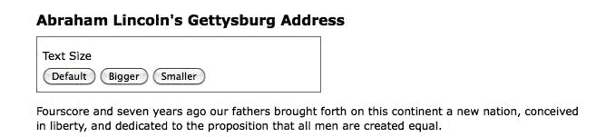

完成代码后，单击较大和较小的按钮将增大或减小文本大小`<div class="speech">`，而单击默认按钮将`<div class="speech">`重置为其原始文本大小。

<footer style="margin-top: 5em;">

# 设置计算样式特性值

如果我们只想将字体大小一次性更改为预定值，我们仍然可以使用`.addClass()`方法。但是，现在让我们假设，我们希望文本在每次单击相应的按钮时继续递增或递减。虽然可以为每次单击定义一个单独的类并对其进行迭代，但更简单的方法是每次计算新的文本大小，方法是获取当前大小并将其增加一个设置因子（例如，40%）。

我们的代码将以`$(() => {})`和`$('#switcher-large').click()`事件处理程序开始：

```js
$(() => {
  $('#switcher-large')
    .click((e) => { 

    }); 
}); 

```

Listing 4.1

接下来，可以使用`.css()`方法`$('div.speech').css('fontSize')`轻松发现字体大小。但是，返回的值是一个字符串，包含数字字体大小值和该值的单位（`px`。我们需要去掉单位标签，以便使用数值进行计算。此外，当我们计划多次使用 jQuery 对象时，通常最好通过将结果 jQuery 对象存储在常量中来缓存选择器：

```js
$(() => { 
  const $speech = $('div.speech'); 
  $('#switcher-large')
    .click(() => {
      const num = parseFloat($speech.css('fontSize')); 
    }); 
}); 

```

Listing 4.2

`$(() => {})`内的第一行创建了一个包含指向`<div class="speech">`的 jQuery 对象的**常量**。注意在名称`$speech`中使用了一个美元（`<footer style="margin-top: 5em;"符号。由于美元符号在 JavaScript 标识符中是一个合法字符，因此我们可以使用它来提醒常量是 jQuery 对象。与 PHP 等其他编程语言不同，美元符号在 JavaScript 中没有特殊意义。

There's a good reason to use constants (`const`) instead of variables (`var`). Constants were introduced in the ES2015 version of JavaScript, and they can help reduce certain types of bugs. Take our `$speech` constant for instance. Is it ever going to hold a value other than `<div class="speech">`? No, it isn't. Since we've declared this as a constant, trying to assign another value to `$speech` results in an error. These errors are easy to fix. If `$speech` were declared as a variable and we mistakenly assigned it a new value, the failures would be subtle and difficult to diagnose. Of course, sometimes we *need* the ability to assign new values, in which case, you would use a variable.

在`.click()`处理程序中，我们仅使用`parseFloat()`获取 font-size 属性的数值。`parseFloat()`函数从左侧到右侧查看字符串，直到遇到非数字字符为止。数字串被转换为浮点数（十进制）。例如，它会将字符串`'12'`转换为数字`12`。此外，它会从字符串中去除非数字尾随字符，因此`'12px'`变为`12`。如果字符串以非数字字符开头，`parseFloat()`返回`NaN`，表示*不是数字*。

剩下要做的就是修改解析后的数值，并根据新值重置字体大小。在我们的示例中，我们将在每次单击按钮时将字体大小增加 40%。为此，我们将`num`乘以`1.4`，然后通过将结果与`'px'`串联来设置字体大小：

```js
$(() => {
  const $speech = $('div.speech');

  $('#switcher-large')
    .click(() => {
      const num = parseFloat($speech.css('fontSize'));
      $speech.css('fontSize', `${num * 1.4}px`);
    });
}); 

```

Listing 4.3

现在，当用户单击较大的按钮时，文本会变大。再次单击，文本将变大：

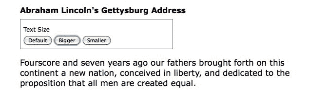

为了得到减小字体大小的较小按钮，我们将除法而不是乘法：-`num / 1.4`。更好的是，我们将在`<div id="switcher">`中的所有`<button>`元素上将这两个元素合并为一个`.click()`处理程序。然后，在找到数值后，我们可以根据单击的按钮的 ID 进行乘法或除法。*清单 4.4*说明了这一点。

```js
$(() => {
  const sizeMap = {
    'switcher-small': n => n / 1.4,
    'switcher-large': n => n * 1.4
  };

  const $speech = $('div.speech');

  $('#switcher button')
    .click((e) => {
      const num = parseFloat($speech.css('fontSize'));
      $speech.css(
        'fontSize',
        `${sizeMap[e.target.id](num)}px`
      );
    });
}); 

```

Listing 4.4

`e.target.id`值用于确定单击事件的行为。`sizeMap`是存储这些行为的地方。这是一个将元素 ID 映射到函数的简单对象。此函数被传递当前的`fontSize`值。我们之所以要使用这样的映射，是因为添加或删除行为要比将其编码为类似于`if`语句的代码容易得多。例如，假设当前字体大小为`"10px"`，用户单击了较大的按钮。然后，模板字符串``${sizeMap[e.target.id](num)}px``将导致`"14px"`。

如果有办法将字体大小恢复到初始值，那就太好了。为了允许用户这样做，只要 DOM 准备就绪，我们就可以将字体大小存储在一个变量中。然后，只要单击默认按钮，我们就可以恢复该值。我们所要做的就是在`sizeMap`中添加另一个函数：

```js
$(() => {
  const sizeMap = {
    'switcher-small': n => n / 1.4,
    'switcher-large': n => n * 1.4,
    'switcher-default': () => defaultSize
  };

  const $speech = $('div.speech');
  const defaultSize = parseFloat($speech.css('fontSize'));

  $('#switcher button')
    .click((e) => {
      const num = parseFloat($speech.css('fontSize'));
      $speech.css(
        'fontSize',
        `${sizeMap[e.target.id](num)}px`
      );
    });
}); 

```

Listing 4.5

请注意，我们如何完全不必触摸单击处理程序来适应这种新行为？我们创建了一个名为`defaultSize`的新常量，它将始终保持原始字体大小。然后，我们只需要为`switcher-default`ID 向`sizeMap`添加一个新函数，该函数返回`defaultSize`值。

有了这样的映射，更改单击处理程序的行为要比在处理程序中维护`if`或`switch`语句容易得多。

<footer style="margin-top: 5em;">

# 使用特定于供应商的样式属性

当浏览器供应商引入实验样式属性时，他们通常会在属性名称前面加前缀，直到浏览器的实现与 CSS 规范一致为止。当实现和规范都足够稳定时，供应商将去掉前缀并允许使用标准名称。因此，在样式表中，经常会看到一组 CSS 声明，如下所示：

```js
-webkit-property-name: value; 
-moz-property-name: value; 
-ms-property-name: value; 
-o-property-name: value; 
property-name: value; 

```

如果我们想在 JavaScript 中应用相同的方法，我们需要测试是否存在这些变体的 DOM 等价物：`propertyName`、`WebkitPropertyName`、`msPropertyName`等等。但是，使用 jQuery，我们可以简单地应用标准属性名，例如`.css('propertyName', 'value')`。如果找不到该名称作为样式对象的属性，jQuery 会在后台循环使用供应商前缀--`Webkit`、`O`、`Moz`和`ms`--并使用它找到的第一个名称作为属性（如果有的话）。

<footer style="margin-top: 5em;">

# 隐藏和显示元素

基本的`.hide()`和`.show()`方法没有任何参数，可以认为是`.css('display', 'string')`的智能速记方法，其中`'string'`是合适的显示值。正如预期的那样，其效果是匹配的元素集将立即隐藏或显示，而不显示动画。

`.hide()`方法将匹配元素集的内联样式属性设置为`display: none`。这里最聪明的部分是，它记住了显示属性的值——通常是`block`、`inline`或`inline-block`——在更改为`none`之前。相反，`.show()`方法将匹配元素集的显示属性恢复到应用`display: none`之前的状态。

The display property
For more information about the `display` property and how its values are visually represented in a web page, visit the Mozilla Developer Center at [https://developer.mozilla.org/en-US/docs/CSS/display](https://developer.mozilla.org/en-US/docs/CSS/display) and view examples at [https://developer.mozilla.org/samples/cssref/display.html](https://developer.mozilla.org/samples/cssref/display.html).

`.show()`和`.hide()`的这一特性在隐藏样式表中已覆盖其默认`display`属性的元素时特别有用。例如，`<li>`元素在默认情况下具有`display: list-item`属性，但对于水平菜单，我们可能希望将其更改为`display: inline`。幸运的是，对隐藏元素（如`<li>`标记之一）使用`.show()`方法不仅会将其重置为默认的`display: list-item`，因为这会将`<li>`标记放在自己的行上。相反，该元素恢复到其先前的`display: inline`状态，从而保留水平设计。

我们可以通过使用第二段并在示例 HTML 的第一段之后添加 read more 链接，快速演示这两种方法：

```js
<div class="speech"> 
  <p>Fourscore and seven years ago our fathers brought forth  
       on this continent a new nation, conceived in liberty,  
       and dedicated to the proposition that all men are  
       created equal. 
  </p> 
  <p>Now we are engaged in a great civil war, testing whether  
       that nation, or any nation so conceived and so dedicated,  
       can long endure. We are met on a great battlefield of  
       that war. We have come to dedicate a portion of that  
       field as a final resting-place for those who here gave  
       their lives that the nation might live. It is altogether  
       fitting and proper that we should do this. But, in a  
       larger sense, we cannot dedicate, we cannot consecrate,  
       we cannot hallow, this ground. 
  </p> 
  <a href="#" class="more">read more</a> 
    ... 
</div> 

```

当 DOM 就绪时，我们选择一个元素并对其调用`.hide()`：

```js
$(() => {
  $('p')
    .eq(1)
    .hide();   
}); 

```

Listing 4.6

`.eq()`方法类似于[第 2 章](02.html#164MG0-fd25fd954efc4043b43c8b05f3cc53ef)*选择元素*中讨论的`:eq()`伪类。它返回一个 jQuery 对象，该对象指向所提供的从零开始的索引处的单个元素。在这种情况下，该方法选择第二段并将其隐藏，以便在第一段之后立即显示“阅读更多”链接：

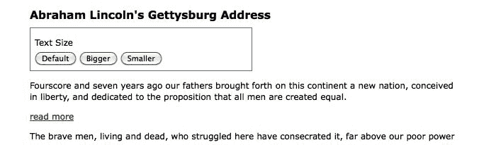

当用户点击第一段末尾的 read more 时，我们调用`.show()`显示第二段，调用`.hide()`隐藏点击的链接：

```js
$(() => {
  $('p')
    .eq(1)
    .hide();

  $('a.more')
    .click((e) => {
      e.preventDefault();
      $('p')
        .eq(1)
        .show();
      $(e.target)
        .hide();
    });
});

```

Listing 4.7

注意使用`.preventDefault()`来防止链接激活其默认操作。现在的演讲是这样的：

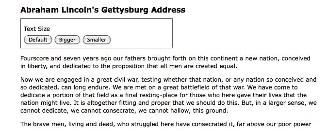

`.hide()`和`.show()`方法快速且有用，但它们不是很华丽。为了增加一些天赋，我们可以给他们一段时间。

<footer style="margin-top: 5em;">

# 影响和持续时间

当我们将持续时间（有时也称为速度）与`.show()`或`.hide()`一起包含时，它将变为动画——在指定的时间段内发生。例如，`.hide(duration)`方法会同时降低元素的高度、宽度和不透明度，直到这三个值都达到零为止，此时会应用 CSS 规则`display: none`。`.show(duration)`方法将增加元素从上到下的高度、从左侧到右侧的宽度以及从 0 到 1 的不透明度，直到其内容完全可见。

<footer style="margin-top: 5em;">

# 超速行驶

对于任何 jQuery 效果，我们都可以使用两种预设速度中的一种，`'slow'`或`'fast'`。使用`.show('slow')`可以在 600 毫秒（0.6 秒）内完成显示效果，使用`.show('fast')`可以在 200 毫秒内完成显示效果。如果提供了任何其他字符串，则将使用 jQuery 的默认动画持续时间 400 毫秒。为了获得更高的精度，我们可以指定毫秒数，例如，`.show(850)`

在展示亚伯拉罕·林肯葛底斯堡演讲的第二段时，让我们在示例中加入一个速度：

```js
$(() => {
  $('p')
    .eq(1)
    .hide();

  $('a.more')
    .click((e) => {
      e.preventDefault();
      $('p')
        .eq(1)
        .show('slow');
      $(e.target)
        .hide();
    });
});

```

Listing 4.8

当我们在效果的一半左右捕捉段落的外观时，我们会看到以下内容：

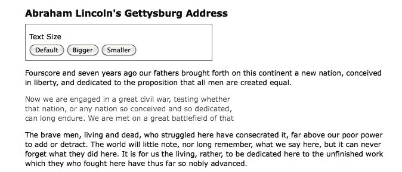

<footer style="margin-top: 5em;">

# 淡入淡出

虽然动画的`.show()`和`.hide()`方法肯定是华而不实的，但在实践中，它们动画的属性比有用的更多。幸运的是，jQuery 还提供了一些其他预构建的动画，以获得更微妙的效果。例如，要通过逐渐增加不透明度来显示整个段落，我们可以使用`fadeIn('slow')`代替：

```js
$(() => {
  $('p')
    .eq(1)
    .hide();

  $('a.more')
    .click((e) => {
      e.preventDefault();
      $('p')
        .eq(1)
        .fadeIn('slow');
      $(e.target)
        .hide();
    });
});

```

Listing 4.9

现在，当我们在效果期间查看该段落时，它看起来如下所示：

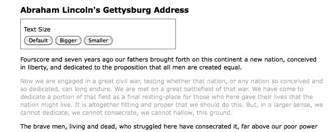

这里的区别在于`.fadeIn()`效果从设置段落的维度开始，这样内容就可以简单地淡入其中。为了逐渐降低不透明度，我们可以使用`.fadeOut()`。

<footer style="margin-top: 5em;">

# 上下滑动

淡入淡出动画对于文档流之外的项目非常有用。例如，这些是应用于覆盖在页面上的*lightbox*元素的典型效果。但是，当一个元素是文档流的一部分时，对其调用`.fadeIn()`会导致文档跳转，以提供新元素所需的不动产，这在美学上是不令人满意的。

在这些情况下，jQuery 的`.slideDown()`和`.slideUp()`方法是正确的选择。这些效果仅为选定元素的高度设置动画。要使用垂直滑动效果显示我们的段落，我们可以调用`.slideDown('slow')`：

```js
$(() => {
  $('p')
    .eq(1)
    .hide();

  $('a.more')
    .click((e) => {
      e.preventDefault();
      $('p')
        .eq(1)
        .slideDown('slow');
      $(e.target)
        .hide();
    });
});

```

Listing 4.10

这一次，当我们检查动画中点的段落时，我们会看到以下内容：

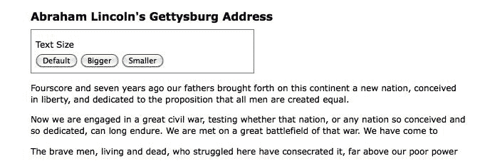

为了扭转这种影响，我们将其称为`.slideUp()`。

<footer style="margin-top: 5em;">

# 切换可见性

有时我们需要切换元素的可见性，而不是像前面的示例中那样只显示一次。这种切换可以通过首先检查匹配元素的可见性，然后调用适当的方法来实现。再次使用淡入淡出效果，我们可以修改示例脚本，如下所示：

```js
$(() => {
  const $firstPara = $('p')
    .eq(1)
    .hide();

  $('a.more')
    .click((e) => {
      e.preventDefault();

      if ($firstPara.is(':hidden')) {
        $firstPara.fadeIn('slow');
        $(e.target).text('read less');
      } else {
        $firstPara.fadeOut('slow');
        $(e.target).text('read more');
      }
    });
}); 

```

Listing 4.11

正如我们在本章前面所做的，我们在这里缓存选择器以避免重复的 DOM 遍历。请注意，我们不再隐藏单击的链接；相反，我们正在改变它的文本。

To examine the text contained by an element and to change that text, we're using the `.text()` method. We will delve into this method more fully in [Chapter 5](05.html#3BOFI0-fd25fd954efc4043b43c8b05f3cc53ef), *Manipulating the DOM*.

使用`if-else`语句是切换元素可见性的一种非常合理的方法。但是使用 jQuery 的复合效应方法，我们可以从代码中删除一些条件逻辑。jQuery 提供了复合方法`.fadeToggle()`和`.slideToggle()`，它们使用相应的效果显示或隐藏元素。下面是我们使用`.slideToggle()`方法时脚本的样子：

```js
$(() => {
  const $firstPara = $('p')
    .eq(1)
    .hide();

  $('a.more')
    .click((e) => {
      e.preventDefault();

      $firstPara.slideToggle('slow');
      $(e.target)
        .text(
          $(e.target).text() === 'read more' ?
            'read less' : 'read more'
        );
    });
}); 

```

Listing 4.12

**三元表达式**（`$(e.target).text() === 'read more' ?`）检查链接的文本，而不是第二段的可见性，因为我们只使用它来更改文本。当我们需要基于某些条件的值时，我们可以使用三元表达式作为完整的`if`语句的较短替代。将三元表达式视为调用一个函数，该函数根据提供的参数返回不同的值。

<footer style="margin-top: 5em;">

# 创建自定义动画

除了预构建的效果方法外，jQuery 还提供了一个强大的`.animate()`方法，允许我们使用细粒度控件创建自己的自定义动画。`.animate()`方法有两种形式。第一个参数最多包含四个参数：

*   样式属性和值的对象，类似于本章前面讨论的`.css()`参数
*   可选的持续时间，可以是预设字符串之一，也可以是毫秒数
*   一种可选的放松类型，这是我们现在不使用的选项，但我们将在[第 11 章](11.html#7DES20-fd25fd954efc4043b43c8b05f3cc53ef)、*高级效果*中讨论
*   一个可选的回调函数，将在本章后面讨论

这四个参数加在一起如下所示：

```js
.animate(
  { property1: 'value1', property2: 'value2'},  
  duration,
  easing,
  () => { 
    console.log('The animation is finished.'); 
  } 
); 

```

第二种形式有两个参数：属性对象和选项对象：

```js
.animate({properties}, {options}) 

```

在这种形式中，第二个参数将第一个形式的第二个到第四个参数包装到另一个对象中，并向混合添加一些更高级的选项。下面是第二种形式在传递实际参数时的情况：

```js
.animate(
  { 
    property1: 'value1',  
    property2: 'value2' 
  },
  { 
    duration: 'value',  
    easing: 'value', 
    specialEasing: { 
      property1: 'easing1', 
      property2: 'easing2' 
    }, 
    complete: () => { 
      console.log('The animation is finished.'); 
    }, 
    queue: true, 
    step: callback 
  }
); 

```

现在，我们将使用`.animate()`方法的第一种形式，但在本章稍后讨论排队效应时，我们将回到第二种形式。

<footer style="margin-top: 5em;">

# 手工制作的建筑效果

我们已经看到了几个用于显示和隐藏元素的预打包效果。为了开始我们对`.animate()`方法的讨论，我们可以看看如何通过使用这个较低级别的接口调用`.slideToggle()`来获得相同的结果。用我们的自定义动画替换上一个示例的`.slideToggle()`行非常简单：

```js
$(() => {
  const $firstPara = $('p')
    .eq(1)
    .hide();

  $('a.more')
    .click((e) => {
      e.preventDefault();

      $firstPara.animate({ height: 'toggle' }, 'slow');
      $(e.target)
        .text(
          $(e.target).text() === 'read more' ?
            'read less' : 'read more'
        );
    }); 
}); 

```

Listing 4.13 This is not a perfect replacement for .`slideToggle()`; the actual implementation also animates the margin and padding of elements.

如示例所示，`.animate()`方法为 CSS 属性（如`'show'`、`'hide'`和`'toggle'`提供了方便的速记值，以便在我们想要模拟`.slideToggle()`等预打包效果方法的行为时简化过程。

<footer style="margin-top: 5em;">

# 同时设置多个属性的动画

通过`.animate()`方法，我们可以同时修改任何属性组合。例如，为了在切换第二段时同时创建滑动和淡入效果，我们只需在传递给`.animate()`的属性中添加`opacity`：

```js
$(() => {
  const $firstPara = $('p')
    .eq(1)
    .hide();

  $('a.more')
    .click((e) => {
      e.preventDefault();

      $firstPara.animate({
        opacity: 'toggle',
        height: 'toggle'
      }, 'slow');
      $(e.target)
        .text(
          $(e.target).text() === 'read more' ?
            'read less' : 'read more'
        );
    }); 
}); 

```

Listing 4.14

此外，我们不仅拥有用于速记效果方法的样式属性，还拥有数字 CSS 属性，如`left`、`top`、`fontSize`、`margin`、`padding`和`borderWidth`。在*清单 4.5*中，我们更改了语音段落的文本大小。我们可以通过简单地用`.animate()`方法代替`.css()`方法，使尺寸的增加或减少变得生动：

```js
$(() => {
  const sizeMap = {
    'switcher-small': n => n / 1.4,
    'switcher-large': n => n * 1.4,
    'switcher-default': () => defaultSize
  };

  const $speech = $('div.speech');
  const defaultSize = parseFloat($speech.css('fontSize'));

  $('#switcher button')
    .click((e) => {
      const num = parseFloat($speech.css('fontSize'));
      $speech.animate({
        fontSize: `${sizeMap[e.target.id](num)}px`
      });
    });
}); 

```

Listing 4.15

额外的动画属性也允许我们创建更复杂的效果。例如，我们可以将项目从页面的左侧移动到右侧，同时将其高度增加 20 个像素，并将其边框宽度更改为 5 个像素。我们将用`<div id="switcher">`框演示这组复杂的属性动画。下面是在设置动画之前它的外观：

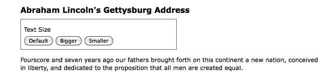

对于灵活的宽度布局，我们需要计算框在页面右侧对齐之前需要移动的距离。假设段落宽度为 100%，我们可以从段落宽度中减去文本大小框的宽度。我们可以使用`jQuery.outerWidth()`方法来计算这些宽度，包括填充和边框。我们将使用此方法来计算切换器的新`left`属性。在本例中，我们将通过单击按钮上方的文本大小标签来触发动画。下面是代码的外观：

```js
$(() => {
  $('div.label')
    .click((e) => {
      const $switcher = $(e.target).parent();
      const paraWidth = $('div.speech p').outerWidth();
      const switcherWidth = $switcher.outerWidth();

      $switcher.animate({
        borderWidth: '5px',
        left: paraWidth - switcherWidth,
        height: '+=20px'
      }, 'slow');
    });
}); 

```

Listing 4.16

值得详细检查这些动画属性。`borderWidth`属性很简单，因为我们用单位指定一个常量值，就像在样式表中一样。`left`属性是一个计算的数值。这些属性上的单位后缀是可选的；因为我们在这里省略了它，`px`是假定的。最后，`height`属性使用了我们以前从未见过的语法。属性值上的`+=`前缀表示相对值。因此，不是将高度设置为 20 像素的动画，而是将高度设置为比当前高度大 20 像素的动画。由于涉及特殊字符，必须将相对值指定为字符串。

虽然此代码成功地增加了`<div>`标记的高度并加宽了其边界，但此时`left`位置似乎没有改变：

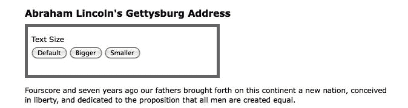

我们仍然需要启用更改此框在 CSS 中的位置。

<footer style="margin-top: 5em;">

# 用 CSS 定位

在使用`.animate()`时，重要的是要记住 CSS 对我们希望更改的元素施加的限制。例如，调整`left`属性不会对匹配元素产生影响，除非这些元素的 CSS 位置设置为`relative`或`absolute`。所有块级元素的默认 CSS 位置为`static`，它准确地描述了如果我们尝试移动这些元素而不首先更改其`position`值，这些元素将如何保留。

For more information on absolute and relative positioning, see CSS Tricks: [https://css-tricks.com/almanac/properties/p/position/](https://css-tricks.com/almanac/properties/p/position/).

在我们的样式表中，我们可以将`<div id="switcher">`设置为相对位置：

```js
#switcher { 
  position: relative; 
} 

```

但是，让我们在需要时通过 JavaScript 更改此属性来练习 jQuery 技能：

```js
$(() =>
  $('div.label')
    .click((e) => {
      const $switcher = $(e.target).parent();
      const paraWidth = $('div.speech p').outerWidth();
      const switcherWidth = $switcher.outerWidth();

      $switcher
        .css('position', 'relative')
        .animate({
          borderWidth: '5px',
          left: paraWidth - switcherWidth,
          height: '+=20px'
        }, 'slow');
    });
}); 

```

Listing 4.17

考虑到 CSS，动画完成后单击文本大小的结果如下所示：

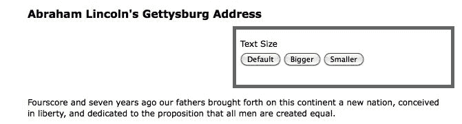

<footer style="margin-top: 5em;">

# 同时效应与排队效应

正如我们刚刚发现的，`.animate()`方法对于创建影响特定元素集的**同步**效果非常有用。然而，有时我们想要**排队**让效果一个接一个地发生。

<footer style="margin-top: 5em;">

# 使用单个元素集

当对同一组元素应用多个效果时，通过链接这些效果可以轻松实现排队。为了演示这种排队方式，我们将通过将文本大小框移到右侧，增加其高度和边框宽度来重新访问清单 4.17。然而，这一次，我们只需将三种效果依次放置在各自的`.animate()`方法中，并将三种效果链接在一起：

```js
$(() => {
  $('div.label')
    .click((e) => {
      const $switcher = $(e.target).parent();
      const paraWidth = $('div.speech p').outerWidth();
      const switcherWidth = $switcher.outerWidth();

      $switcher
        .css('position', 'relative')
        .animate({ borderWidth: '5px' }, 'slow')
        .animate({ left: paraWidth - switcherWidth }, 'slow')
        .animate({ height: '+=20px' }, 'slow');
    }); 
}); 

```

Listing 4.18

回想一下，链接允许我们将所有三个`.animate()`方法保持在同一行上，但这里我们对它们进行了缩进，并将它们放在各自的行上，以提高可读性。

我们可以通过链接任何 jQuery effect 方法来排队，而不仅仅是`.animate()`。例如，我们可以按照以下顺序对`<div id="switcher">`进行排队影响：

1.  使用`.fadeTo()`将其不透明度衰减至 0.5。
2.  使用`.animate()`将其移动到右侧。
3.  使用`.fadeTo()`将其淡入完全不透明度。
4.  用`.slideUp()`隐藏它。
5.  用`.slideDown()`再次显示。

我们需要做的就是在我们的代码中以相同的顺序链接效果：

```js
$(() => {
  $('div.label')
    .click((e) => {
      const $switcher = $(e.target).parent();
      const paraWidth = $('div.speech p').outerWidth();
      const switcherWidth = $switcher.outerWidth();

      $switcher
        .css('position', 'relative')
        .fadeTo('fast', 0.5)
        .animate({ left: paraWidth - switcherWidth }, 'slow')
        .fadeTo('slow', 1.0)
        .slideUp('slow')
        .slideDown('slow');
    }); 
}); 

```

Listing 4.19

<footer style="margin-top: 5em;">

# 绕过队列

但是如果我们想在`<div>`标记变为半不透明的同时将其移到右侧，该怎么办？如果两个动画以相同的速度发生，我们可以简单地将它们组合成一个`.animate()`方法。但是，在本例中，淡入是使用`'fast'`速度，而移动到右侧是使用`'slow'`速度。这里是`.animate()`方法的第二种形式派上用场的地方：

```js
$(() => {
  $('div.label')
    .click((e) => {
      const $switcher = $(e.target).parent();
      const paraWidth = $('div.speech p').outerWidth();
      const switcherWidth = $switcher.outerWidth();

      $switcher
        .css('position', 'relative')
        .fadeTo('fast', 0.5)
        .animate(
          { left: paraWidth - switcherWidth },
          { duration: 'slow', queue: false }
        )
        .fadeTo('slow', 1.0)
        .slideUp('slow')
        .slideDown('slow');
    }); 
}); 

```

Listing 4.20

第二个参数是 options 对象，它提供了`queue`选项，当设置为`false`时，该选项将使动画与前一个动画同时启动。如果你仔细想想，这是有道理的，因为队列中的任何东西都必须等待队列中已经存在的任何东西

<footer style="margin-top: 5em;">

# 手动排队效果

关于单组元素的排队效果的最后一个观察结果是，排队不会自动应用于其他无效果的方法，例如。`css()`。因此，假设我们想在`.slideUp()`方法之后，但在`slideDown()`方法之前，将`<div id="switcher">`的背景色更改为红色。

我们可以试着这样做：

```js
$(() => {
  $('div.label')
    .click((e) => {
      const $switcher = $(e.target).parent();
      const paraWidth = $('div.speech p').outerWidth();
      const switcherWidth = $switcher.outerWidth();

      $switcher
        .css('position', 'relative')
        .fadeTo('fast', 0.5)
        .animate(
          { left: paraWidth - switcherWidth },
          { duration: 'slow', queue: false }
        )
        .fadeTo('slow', 1.0)
        .slideUp('slow')
        .css('backgroundColor', '#f00')
        .slideDown('slow');
    }); 
}); 

```

Listing 4.21

但是，即使更改背景颜色的代码放置在链中的正确位置，它也会在单击后立即发生。

我们可以向队列添加无效方法的一种方法是使用适当命名的`.queue()`方法。下面是我们示例中的情况：

```js
$(() => {
  $('div.label')
    .click((e) => {
      const $switcher = $(e.target).parent();
      const paraWidth = $('div.speech p').outerWidth();
      const switcherWidth = $switcher.outerWidth();

      $switcher
        .css('position', 'relative')
        .fadeTo('fast', 0.5)
        .animate(
          { left: paraWidth - switcherWidth },
          { duration: 'slow', queue: false }
        )
        .fadeTo('slow', 1.0)
        .slideUp('slow')
        .queue((next) => {
          $switcher.css('backgroundColor', '#f00');
          next();
        })
        .slideDown('slow');
    }); 
}); 

```

Listing 4.22

当给定回调函数时，`.queue()`方法会将该函数添加到效果队列中，以便对匹配的元素执行。在函数中，我们将背景颜色设置为红色，然后调用`next()`，该函数作为参数传递给回调函数。包含此`next()`函数调用允许动画队列从其停止的位置开始，并使用以下`.slideDown('slow')`行完成链。如果我们没有调用`next()`，动画就会停止。

For more information and examples of `.queue()`, visit [http://api.jquery.com/category/effects/](http://api.jquery.com/category/effects/).

在检查多组元素的效果时，我们将发现另一种将非效果方法排队的方法。

<footer style="margin-top: 5em;">

# 使用多组元素

与单个元素集不同，当我们将效果应用于不同的元素集时，它们几乎同时发生。要查看这些同时发生的效果，我们将向下滑动一段，同时向上滑动另一段。我们将处理示例文档的第三段和第四段：

```js
<p>Fourscore and seven years ago our fathers brought forth 
   on this continent a new nation, conceived in liberty, 
   and dedicated to the proposition that all men are 
   created equal.</p> 
<p>Now we are engaged in a great civil war, testing whether 
   that nation, or any nation so conceived and so 
   dedicated, can long endure. We are met on a great 
   battlefield of that war. We have come to dedicate a 
   portion of that field as a final resting-place for those 
   who here gave their lives that the nation might live. It 
   is altogether fitting and proper that we should do this. 
   But, in a larger sense, we cannot dedicate, we cannot 
   consecrate, we cannot hallow, this ground.</p> 
<a href="#" class="more">read more</a> 
<p>The brave men, living and dead, who struggled here have 
   consecrated it, far above our poor power to add or 
   detract. The world will little note, nor long remember, 
   what we say here, but it can never forget what they did 
   here. It is for us the living, rather, to be dedicated 
   here to the unfinished work which they who fought here 
   have thus far so nobly advanced.</p> 
<p>It is rather for us to be here dedicated to the great 
   task remaining before us&mdash;that from these honored 
   dead we take increased devotion to that cause for which 
   they gave the last full measure of devotion&mdash;that 
   we here highly resolve that these dead shall not have 
   died in vain&mdash;that this nation, under God, shall 
   have a new birth of freedom and that government of the 
   people, by the people, for the people, shall not perish 
   from the earth.</p> 

```

为了帮助我们看到效果期间发生了什么，我们将为第三段提供 1 像素的边框，为第四段提供灰色背景。当 DOM 就绪时，我们还将隐藏第四段：

```js
$(() => {
  $('p')
    .eq(2)
    .css('border', '1px solid #333');
  $('p')
    .eq(3)
    .css('backgroundColor', '#ccc')
    .hide(); 
}); 

```

Listing 4.23

我们的示例文档现在显示开头段落，后面是阅读更多链接和带边框段落：

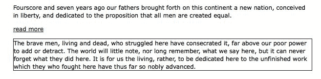

最后，我们将对第三段应用一个`click`处理程序，以便在单击它时，第三段将向上滑动（并最终脱离视图），而第四段将向下滑动（并进入视图）：

```js
$(() => { 
  $('p')
    .eq(2)
    .css('border', '1px solid #333')
    .click((e) => {
      $(e.target)
        .slideUp('slow')
        .next()
        .slideDown('slow');
    });
  $('p')
    .eq(3)
    .css('backgroundColor', '#ccc')
    .hide();
}); 

```

Listing 4.24

幻灯片中间这两种效果的屏幕截图证实它们确实同时发生：

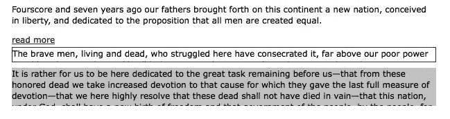

开始可见的第三段是向上滑动的一半，而开始隐藏的第四段是向下滑动的一半。

<footer style="margin-top: 5em;">

# 使用回调排队

为了允许对不同元素产生排队效果，jQuery 为每个效果方法提供了回调函数。正如我们在事件处理程序和`.queue()`方法中看到的，回调只是作为方法参数传递的函数。对于效果，它们显示为方法的最后一个参数。

如果我们使用回调将两个幻灯片效果排队，我们可以在第三段向上滑动之前，先将第四段向下滑动。让我们首先尝试将`.slideUp()`调用移动到。`slideDown()`方法的完成回调：

```js
$(() => { 
  $('p')
    .eq(2)
    .css('border', '1px solid #333')
    .click((e) => {
      $(e.target)
        .next()
        .slideDown('slow', () => {
          $(e.target).slideUp('slow');
        });
    });
  $('p')
    .eq(3)
    .css('backgroundColor', '#ccc')
    .hide();
}); 

```

Listing 4.25

如果我们决定在`click()`回调函数和`slideDown()`回调函数中都使用`$(this)`，事情就不会像预期的那样工作。那是因为`this`是与上下文相关的。相反，我们可以一起避免它，并引用`$(e.target)`来获得我们需要的`<p>`元素。

这一次，在特效中间的快照显示第三段和第四段都是可见的；第四个已完成向下滑动，第三个即将开始向上滑动：

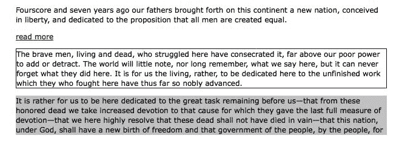

现在我们已经讨论了回调，我们可以返回到*清单 4.22*中的代码，在该代码中，我们在一系列效果的末尾排队等待背景颜色的更改。我们可以简单地使用回调函数，而不是像我们当时那样使用`.queue()`方法：

```js
$(() => {
  $('div.label')
    .click((e) => {
      const $switcher = $(e.target).parent();
      const paraWidth = $('div.speech p').outerWidth();
      const switcherWidth = $switcher.outerWidth();

      $switcher
        .css('position', 'relative')
        .fadeTo('fast', 0.5)
        .animate(
          { left: paraWidth - switcherWidth },
          { duration: 'slow', queue: false }
        )
        .fadeTo('slow', 1.0)
        .slideUp('slow', () => {
          $switcher.css('backgroundColor', '#f00');
        })
        .slideDown('slow');
    });
}); 

```

Listing 4.26

在这里，`<div id="switcher">`的背景色再次在向上滑动和向下滑动之前变为红色。请注意，当使用效果的完成回调而不是`.queue()`时，我们不需要担心从回调中调用`next()`。

<footer style="margin-top: 5em;">

# 简而言之

在应用效果时要考虑所有的变化，很难记住效果会同时发生还是顺序发生。简短的提纲可能会有所帮助。

对单个元素集的影响如下：

*   在单个属性中作为多个属性应用时同时进行。`animate()`方法
*   在方法链中应用时排队，除非`queue`选项设置为`false`

对多组元素的影响如下：

*   默认同步
*   在另一个效果的回调中或在`.queue()`方法的回调中应用时排队

<footer style="margin-top: 5em;">

# 总结

使用我们在本章中探讨的效果方法，我们现在应该能够修改 JavaScript 中的内联样式属性，将预先打包的 jQuery 效果应用于元素，并创建我们自己的自定义动画。特别是，您学习了如何使用`.css()`或`.animate()`方法增量增加和减少文本大小，通过修改多个属性逐渐隐藏和显示页面元素，以及如何以多种方式（同时或顺序）设置元素动画。

在本书的前四章中，我们的所有示例都涉及到对硬编码到页面 HTML 中的元素的操作。在[第 5 章](05.html#3BOFI0-fd25fd954efc4043b43c8b05f3cc53ef)*操作 DOM*中，我们将探讨直接操作 DOM 的方法，包括使用 jQuery 创建新元素，并在我们选择的任何地方将它们插入 DOM。

<footer style="margin-top: 5em;">

# 进一步阅读

动画主题将在[第 11 章](11.html#7DES20-fd25fd954efc4043b43c8b05f3cc53ef)、*高级效果*中进行更详细的探讨。在本书的附录 B 中，或在[的正式 jQuery 文档中，可以找到效果和样式方法的完整列表 http://api.jquery.com/](http://api.jquery.com/) 。

<footer style="margin-top: 5em;">

# 练习

质询练习可能需要使用位于[的正式 jQuery 文档 http://api.jquery.com/](http://api.jquery.com/) ：

1.  更改样式表以隐藏页面的初始内容。加载页面时，慢慢淡入内容。
2.  仅当鼠标悬停在段落上方时，才为每个段落提供黄色背景。
3.  点击标题`(<h2>)`，同时将其淡入 25%的不透明度，并将其左侧边距增加至`20px`。然后，此动画完成后，将语音文本淡入 50%的不透明度。
4.  这是给你的一个挑战。通过在相应方向上平滑移动切换框 20 个像素来响应箭头键的按下。箭头键的键码为：`37`（左）、`38`（上）、`39`（右）和`40`（下）。

</footer>

</footer>

</footer>

</footer>

</footer>

</footer>

</footer>

</footer>

</footer>

</footer>

</footer>

</footer>

</footer>

</footer>

</footer>

</footer>

</footer>

</footer>

</footer>

</footer>

</footer>

</footer>

</footer>