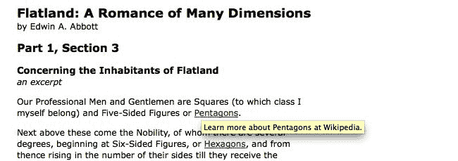

# 五、操纵 DOM

Web 体验是 Web 服务器和 Web 浏览器之间的伙伴关系。传统上，生成供浏览器使用的 HTML 文档一直是服务器的职责。我们在本书中看到的技术稍微改变了这种安排，使用 CSS 技术动态地改变 HTML 文档的外观。不过，要真正锻炼我们的 JavaScript 肌肉，您需要学习修改文档本身。

在本章中，我们将介绍：

*   使用**文档对象模型**（**DOM**提供的接口修改文档
*   在页面上创建元素和文本
*   移动或删除元素
*   通过添加、删除或修改属性和属性来转换文档

<footer style="margin-top: 5em;">

# 操纵属性和属性

在本书的前四章中，我们一直在使用`.addClass()`和`.removeClass()`方法来演示如何更改页面上元素的外观。尽管我们非正式地讨论了这些方法，涉及到对`class`属性的操作，但 jQuery 实际上修改了一个名为`className`的 DOM 属性。`.addClass()`方法创建或添加属性，`.removeClass()`删除或缩短属性。再加上`.toggleClass()`方法，它在添加和删除类名之间交替进行，我们有一种高效而健壮的方法来处理类。这些方法特别有用，因为它们可以避免在一个元素上已经存在类的情况下添加类（例如，我们不会以`<div class="first first">`结束），并且可以正确处理多个类应用于单个元素的情况，例如`<div class="first second">`。

<footer style="margin-top: 5em;">

# 非类属性

我们可能需要不时访问或更改其他几个属性或属性。对于`id`、`rel`和`href`等属性的操作，jQuery 提供了`.attr()`和`.removeAttr()`方法。这些方法使更改属性变得简单。此外，jQuery 允许我们一次修改多个属性，类似于我们使用[第 4 章](04.html#2KS220-fd25fd954efc4043b43c8b05f3cc53ef)、*样式和动画*中的`.css()`方法处理多个 CSS 属性的方式。

例如，我们可以轻松地同时设置链接的`id`、`rel`和`title`属性。让我们从一些示例 HTML 开始：

```js
<h1 id="f-title">Flatland: A Romance of Many Dimensions</h1> 
<div id="f-author">by Edwin A. Abbott</div> 
<h2>Part 1, Section 3</h2> 
<h3 id="f-subtitle"> 
   Concerning the Inhabitants of Flatland 
</h3> 
<div id="excerpt">an excerpt</div> 
<div class="chapter"> 
  <p class="square">Our Professional Men and Gentlemen are 
    Squares (to which class I myself belong) and Five-Sided  
    Figures or <a  
    href="http://en.wikipedia.org/wiki/Pentagon">Pentagons 
    </a>. 
  </p> 
  <p class="nobility hexagon">Next above these come the  
    Nobility, of whom there are several degrees, beginning at  
    Six-Sided Figures, or <a  
    href="http://en.wikipedia.org/wiki/Hexagon">Hexagons</a>,  
    and from thence rising in the number of their sides till  
    they receive the honourable title of <a  
    href="http://en.wikipedia.org/wiki/Polygon">Polygonal</a>,  
    or many-Sided. Finally when the number of the sides  
    becomes so numerous, and the sides themselves so small,  
    that the figure cannot be distinguished from a <a  
    href="http://en.wikipedia.org/wiki/Circle">circle</a>, he  
    is included in the Circular or Priestly order; and this is  
    the highest class of all. 
  </p> 
  <p><span class="pull-quote">It is a <span class="drop">Law  
    of Nature</span> with us that a male child shall have  
    <strong>one more side</strong> than his father</span>, so  
    that each generation shall rise (as a rule) one step in  
    the scale of development and nobility. Thus the son of a  
    Square is a Pentagon; the son of a Pentagon, a Hexagon;  
    and so on. 
  </p> 
<!-- . . . code continues . . . --> 
</div> 

```

Getting the example code
You can access the example code from the following GitHub repository: [https://github.com/PacktPublishing/Learning-jQuery-3](https://github.com/PacktPublishing/Learning-jQuery-3).

现在，我们可以遍历`<div class="chapter">`中的每个链接，并逐个应用属性。如果我们需要为所有链接设置单个属性值，我们可以在`$(() => {})`处理程序中使用一行代码：

```js
$(() => {
  $('div.chapter a').attr({ rel: 'external' });
});

```

Listing 5.1

与`.css()`方法非常相似，`.attr()`可以接受一对参数，第一个参数指定属性名，第二个参数是它的新值。但更典型的是，我们提供了一个键值对对象，如清单 5.1 中的*所示。以下语法允许我们轻松地扩展示例，一次修改多个属性：*

```js
$(() => {
  $('div.chapter a')
    .attr({
      rel: 'external',
      title: 'Learn more at Wikipedia'
    });
});

```

Listing 5.2

<footer style="margin-top: 5em;">

# 值回调

当我们希望属性对于每个匹配元素具有相同的值时，传递`.attr()`一个简单对象的简单技术就足够了。但是，我们添加或更改的属性每次必须具有不同的值。一个常见的例子是，对于任何给定的文档，如果我们希望 JavaScript 代码的行为可以预测，那么每个`id`值都必须是唯一的。为了为每个链接设置唯一的`id`值，我们可以利用 jQuery 方法的另一个特性，例如`.css()`和`.each()`-**值回调**。

值回调只是提供的函数，而不是参数的值。然后对匹配集中的每个元素调用此函数一次。从函数返回的任何数据都将用作属性的新值。例如，我们可以使用以下技术为每个元素生成不同的`id`值：

```js
$(() => {
  $('div.chapter a')
    .attr({
      rel: 'external',
      title: 'Learn more at Wikipedia',
      id: index => `wikilink-${index}`
    });
});

```

Listing 5.3

每次启动值回调时，都会向它传递一个整数，指示迭代计数；我们在这里使用它来给第一个链接一个`id`值`wikilink-0`，第二个`wikilink-1`，依此类推。

我们正在使用`title`属性邀请人们在维基百科上了解更多有关链接术语的信息。在我们目前使用的 HTML 标记中，所有链接都指向 Wikipedia。但是，为了考虑其他类型的链接，我们应该使选择器表达式更具体一些：

```js
$(() => {
  $('div.chapter a[href*="wikipedia"]')
    .attr({
      rel: 'external',
      title: 'Learn more at Wikipedia',
      id: index => `wikilink-${index}`
    });
});

```

Listing 5.4

为了完成我们的`.attr()`方法之旅，我们将增强这些链接的`title`属性，以更具体地了解链接目的地。同样，值回调是作业的正确工具：

```js
$(() => {
  $('div.chapter a[href*="wikipedia"]')
    .attr({
      rel: 'external',
      title: function() {
        return `Learn more about ${$(this).text()} at Wikipedia.`;
      },
      id: index => `wikilink-${index}`
    });
});

```

Listing 5.5

这次我们利用了值回调的上下文。与事件处理程序一样，关键字`this`指向每次调用回调时我们正在处理的 DOM 元素。在这里，我们将元素包装在 jQuery 对象中，以便使用`.text()`方法（在[第 4 章](04.html#2KS220-fd25fd954efc4043b43c8b05f3cc53ef)中介绍，*样式和动画*来检索链接的文本内容。这使得每个链接标题与其他链接标题不同，如下面的屏幕截图所示：



<footer style="margin-top: 5em;">

# 数据属性

HTML5 数据属性允许我们将任意数据值附加到页面元素。然后，我们的 jQuery 代码可以使用这些值，也可以修改它们。使用数据属性的原因是，我们可以将控制其显示方式和行为的 DOM 属性与特定于应用程序的数据分开。

您将使用`data()`jQuery 方法读取数据值并更改数据值。让我们添加一些新功能，允许用户通过单击段落将其标记为已读。我们还需要一个复选框来隐藏标记为已读的段落。我们将使用数据属性帮助我们记住哪些段落被标记为已读：

```js
$(() => {
  $('#hide-read')
    .change((e) => {
      if ($(e.target).is(':checked')) {
        $('.chapter p')
          .filter((i, p) => $(p).data('read'))
          .hide();
      } else {
        $('.chapter p').show();
      }
    });

  $('.chapter p')
    .click((e) => {
      const $elm = $(e.target);

      $elm
        .css(
          'textDecoration',
          $elm.data('read') ? 'none' : 'line-through'
        )
        .data('read', !$(e.target).data('read'));
    });
});

```

Listing 5.6

单击某个段落时，该段落中的文本将标记为“like”，以表示该段落已被阅读：


如您所见，单击事件处理程序会在单击段落时更改段落的视觉外观。但是处理程序也做了一些其他的事情——它切换元素的`read`数据：`data('read', !$(e.target).data('read'))`。这使我们能够将特定于应用程序的数据绑定到元素，而不会干扰我们可能设置的其他 HTML 属性。

隐藏读取段落复选框的更改处理程序将查找包含此数据的段落。`filter((i, p) => $(p).data('read'))`调用将只返回具有`read`数据属性且值为`true`的段落。我们现在能够根据特定的应用程序数据过滤元素。以下是隐藏阅读段落的页面外观：


We'll revisit some advanced usage scenarios of data handling with jQuery later in the book.

<footer style="margin-top: 5em;">

# DOM 元素属性

如前所述，HTML**属性**和 DOM**属性**之间存在细微的区别。属性是页面的 HTML 源代码中以引号给出的值，而属性是 JavaScript 访问的值。我们可以在 Chrome 之类的开发工具中轻松观察属性和属性：


Chrome 开发者工具的 elements inspector 向我们显示高亮显示的`<p>`元素有一个名为`class`的属性，其值为`square`。在右边的面板中，我们可以看到这个元素有一个名为`className`的对应属性，其值为`square`。这说明了属性及其等效属性具有不同名称的罕见情况之一。

在大多数情况下，属性和属性在功能上是可互换的，jQuery 为我们处理命名不一致的问题。然而，有时我们确实需要注意两者之间的差异。一些 DOM 属性，如`nodeName`、`nodeType`、`selectedIndex`和`childNodes`没有等效属性，因此无法通过`.attr()`访问。此外，数据类型可能不同：例如，`checked`属性有一个字符串值，而`checked`属性有一个布尔值。对于这些布尔属性，最好测试并设置*属性*而不是*属性*，以确保跨浏览器行为的一致性。

我们可以使用`.prop()`方法从 jQuery 中获取和设置属性：

```js
// Get the current value of the "checked" property 
const currentlyChecked = $('.my-checkbox').prop('checked'); 

// Set a new value for the "checked" property 
$('.my-checkbox').prop('checked', false); 

```

`.prop()`方法具有与`.attr()`完全相同的功能，例如接受一个多值对象同时设置，并接受值回调函数。

<footer style="margin-top: 5em;">

# 表单控件的值

当试图获取或设置表单控件的值时，可能会出现属性和属性之间最麻烦的区别。对于文本输入，`value`属性等同于`defaultValue`属性，而不是`value`属性。对于`select`元素，该值通常通过元素的`selectedIndex`属性或其`option`元素的`selected`属性获得。

由于这些差异，我们应该避免使用`.attr()`——对于`select`元素，甚至是`.prop()`——来获取或设置表单元素值。相反，我们可以使用 jQuery 为以下情况提供的`.val()`方法：

```js
// Get the current value of a text input 
const inputValue = $('#my-input').val(); 
// Get the current value of a select list 
const selectValue = $('#my-select').val(); 
//Set the value of a single select list 
$('#my-single-select').val('value3'); 
// Set the value of a multiple select list 
$('#my-multi-select').val(['value1', 'value2']); 

```

与`.attr()`和`.prop()`一样，`.val()`可以将函数作为其 setter 参数。凭借其多用途的`.val()`方法，jQuery 再次使 web 开发变得更加容易。

<footer style="margin-top: 5em;">

# DOM 树操作

`.attr()`和`.prop()`方法是非常强大的工具，通过它们我们可以对文档进行有针对性的更改。但是，我们仍然没有看到改变文档总体结构的方法。要实际操作 DOM 树，您需要进一步了解位于`jQuery`库核心的函数。

<footer style="margin-top: 5em;">

# 再次访问$（）函数

从本书开始，我们就一直在使用`$()`函数访问文档中的元素。如我们所见，此函数充当工厂，生成指向 CSS 选择器描述的元素的新 jQuery 对象。

这并不是`$()`函数所能做的全部。它还可以更改页面的内容。只需将一段 HTML 代码传递给函数，我们就可以创建一个全新的 DOM 结构。

Accessibility reminder
We should keep in mind, once again, the inherent danger in making certain functionality, visual appeal, or textual information available only to those with web browsers capable of (and enabled for) using JavaScript. Important information should be accessible to all, not just people who happen to be using the right software.

<footer style="margin-top: 5em;">

# 创造新元素

常见于 FAQ 页面的一个功能是出现在每个问答对之后的返回顶部链接。可以说，这些链接并没有语义目的，所以可以通过 JavaScript 合法地包含它们，作为页面访问者子集的增强。在我们的示例中，我们将在每个段落后面添加一个回顶链接，以及回顶链接将带我们去的锚。首先，我们只需创建新元素：

```js
$(() => {
  $('<a href="#top">back to top</a>'); 
  $('<a id="top"></a>'); 
}); 

```

Listing 5.7

我们在第一行代码中创建了一个从后到上的链接，在第二行代码中为链接创建了一个目标锚点。但是，页面上还没有返回到顶部的链接。


虽然我们编写的两行代码确实创建了元素，但它们还没有将元素添加到页面中。我们需要告诉浏览器这些新元素应该放在哪里。为此，我们可以使用许多 jQuery**插入方法**中的一种。

<footer style="margin-top: 5em;">

# 插入新元素

`jQuery`库有许多方法可用于将元素插入文档中。每一项都规定了新内容与现有内容之间的关系。例如，我们希望我们的返回顶部链接出现在每个段落之后，因此我们将使用适当命名的`.insertAfter()`方法来实现这一点：

```js
$(() => { 
  $('<a href="#top">back to top</a>')
    .insertAfter('div.chapter p'); 
  $('<a id="top"></a>'); 
}); 

```

Listing 5.8

因此，现在我们已经在`<div class="chapter">`中出现的每个段落之后将链接插入页面（和 DOM），返回顶部链接将出现：


请注意，新链接出现在它们自己的行中，而不是在段落中。这是因为`.insertAfter()`方法及其对应的`.insertBefore()`在指定元素之外添加了内容*。*

不幸的是，这些链接还不能工作。我们还需要用`id="top"`插入锚。这一次，我们将使用其中一种方法在其他元素的内部插入元素*：*

```js
$(() => { 
  $('<a href="#top">back to top</a>')
    .insertAfter('div.chapter p'); 
  $('<a id="top"></a>')
    .prependTo('body'); 
}); 

```

Listing 5.9

此附加代码将锚插入`<body>`标记的开头；换句话说，在页面的顶部。现在，通过链接的`.insertAfter()`方法和锚定的`.prependTo()`方法，我们为页面提供了一套功能齐全的返回顶部链接。

一旦我们添加了相应的`.appendTo()`方法，我们现在就有了一整套在其他元素之前和之后插入新元素的选项：

*   `.insertBefore()`：在已有元素之前和*之外增加内容*
**   `.prependTo()`：在已有元素之前增加和*中的*内容***   `.appendTo()`：在已有元素后增加和*中的*内容***   `.insertAfter()`：在已有元素后和*之外增加内容**

 **<footer style="margin-top: 5em;">

# 运动元素

在添加返回顶部链接时，我们创建了新元素并将它们插入页面。也可以从页面上的一个位置获取元素并将其插入另一个位置。这种插入方式的一个实际应用是脚注的动态放置和格式设置。我们在本例中使用的原始*平地*文本中已经出现了一个脚注，但为了本演示的目的，我们还将指定文本的两个其他部分作为脚注：

```js
<p>How admirable is the Law of Compensation! <span     
   class="footnote">And how perfect a proof of the natural  
   fitness and, I may almost say, the divine origin of the  
   aristocratic constitution of the States of Flatland!</span> 
   By a judicious use of this Law of Nature, the Polygons and  
   Circles are almost always able to stifle sedition in its  
   very cradle, taking advantage of the irrepressible and  
   boundless hopefulness of the human mind.&hellip; 
</p> 

```

我们的 HTML 文档包含三个脚注；上一段包含一个示例。脚注文本位于段落文本内，使用`<span class="footnote"></span>`隔开。通过以这种方式标记 HTML 文档，我们可以保留脚注的上下文。样式表中应用的 CSS 规则将脚注斜体化，因此受影响的段落最初看起来如下所示：


现在，我们需要抓取脚注并将其移动到文档底部。具体来说，我们将在`<div class="chapter">`和`<div id="footer">`之间插入它们。

请记住，即使在隐式迭代的情况下，元素的处理顺序也是精确定义的，从 DOM 树的顶部开始，然后向下。由于保持脚注在页面新位置的正确顺序很重要，我们应该使用`.insertBefore('#footer')`。这将把每个脚注直接放在`<div id="footer">`元素之前，以便第一个脚注放在`<div class="chapter">`和`<div id="footer">`之间，第二个脚注放在第一个脚注和`<div id="footer">`之间，依此类推。另一方面，使用`.insertAfter('div.chapter')`会导致脚注以相反的顺序出现。

到目前为止，我们的代码如下所示：

```js
$(() => { 
  $('span.footnote').insertBefore('#footer'); 
}); 

```

Listing 5.10

脚注在`<span>`标记中，这意味着默认情况下它们显示为内联，一个接一个，没有分隔。然而，我们在 CSS 中已经预料到了这一点，当`span.footnote`元素在`<div class="chapter">`之外时，它们的`display`值为`block`。因此，脚注现在开始成形：


脚注现在已经放在适当的位置，但仍有许多工作要做。更可靠的脚注解决方案应做到以下几点：

1.  为每个脚注编号。
2.  使用脚注编号标记文本中每个脚注的提取位置。
3.  创建从文本位置到其匹配脚注的链接，以及从脚注返回到文本中使用脚注编号提取每个脚注的位置的链接。

<footer style="margin-top: 5em;">

# 包装元件

为了给脚注编号，我们可以在标记中显式地添加数字，但是在这里我们可以利用标准的有序列表元素来为我们进行编号。为此，我们需要创建一个包含所有脚注的`<ol>`元素和一个单独包含每个脚注的`<li>`元素。为此，我们将使用**包装方法**。

在将元素包装到另一个元素中时，我们需要弄清楚是希望将每个元素包装到自己的容器中，还是希望将所有元素包装到单个容器中。对于脚注编号，我们需要两种类型的包装：

```js
$(() => {
  $('span.footnote') 
    .insertBefore('#footer') 
    .wrapAll('<ol id="notes"></ol>') 
    .wrap('<li></li>'); 
}); 

```

Listing 5.11

在页脚前插入脚注后，我们使用`.wrapAll()`将整个集合包装在一个`<ol>`元素中。然后，我们继续使用`.wrap()`将每个单独的脚注封装在自己的`<li>`元素中。我们可以看到，这已经创建了正确编号的脚注：


现在，我们已经准备好标记和编号我们从中提取脚注的位置。但是，为了以一种简单的方式完成这项工作，我们需要重写现有代码，使其不依赖于隐式迭代。

<footer style="margin-top: 5em;">

# 显式迭代

`.each()`方法充当**显式迭代器**，与最近添加到 JavaScript 语言中的`forEach`数组迭代器非常相似。当我们想要在每个匹配元素上使用的代码对于隐式迭代语法来说过于复杂时，可以使用`.each()`方法。它被传递一个回调函数，该函数将为匹配集中的每个元素调用一次。

```js
$(() => { 
  const $notes = $('<ol id="notes"></ol>')
    .insertBefore('#footer');

  $('span.footnote')
    .each((i, span) => {
      $(span)
        .appendTo($notes)
        .wrap('<li></li>');
    });
}); 

```

Listing 5.12

我们在这里改变的动机很快就会清楚。首先，我们需要了解提供给`.each()`回调的信息。

在*清单 5.12*中，我们使用`span`参数创建一个指向单个脚注`<span>`的 jQuery 对象，然后将元素附加到注释`<ol>`中，最后将脚注封装在`<li>`元素中。

为了标记文本中从中提取脚注的位置，我们可以利用`.each()`回调的参数。此参数提供迭代计数，从`0`开始，每次调用回调时递增。所以，这个计数器总是比脚注的数字少 1。在文本中生成适当的标签时，我们将考虑这一事实：

```js
$(() => { 
  const $notes = $('<ol id="notes"></ol>')
    .insertBefore('#footer');

  $('span.footnote')
    .each((i, span) => {
      $(`<sup>${i + 1}</sup>`)
        .insertBefore(span);
      $(span)
        .appendTo($notes)
        .wrap('<li></li>');
    });
}); 

```

Listing 5.13

现在，在将每个脚注从文本中拉出并放置在页面底部之前，我们创建一个包含脚注编号的新`<sup>`元素，并将其插入文本中。行动顺序在这里很重要；我们需要确保在移动脚注之前插入标记，否则我们将无法跟踪其初始位置。

再次查看我们的页面，现在我们可以看到脚注标记，其中内联脚注曾经是：


<footer style="margin-top: 5em;">

# 使用反向插入法

在*清单 5.13*中，我们在元素之前插入内容，然后将相同的元素附加到文档中的另一个位置。通常，在 jQuery 中使用元素时，我们可以使用链接简洁高效地执行多个操作。但我们在这里无法做到这一点，因为`this`是`.insertBefore()`的*目标*和`.appendTo()`的*受试者*。**反向插入法**将帮助我们绕过这一限制。

每个插入方法，例如`.insertBefore()`或`.appendTo()`都有相应的反向方法。倒置的方法执行与标准方法完全相同的任务，但主题和目标是相反的。例如：

```js
$('<p>Hello</p>').appendTo('#container'); 

```

同：

```js
$('#container').append('<p>Hello</p>'); 

```

使用`.insertBefore()`的倒装形式`.before()`，我们现在可以重新分解代码以利用链接：

```js
$(() => {
  const $notes = $('<ol id="notes"></ol>')
    .insertBefore('#footer');

  $('span.footnote')
    .each((i, span) => {
      $(span)
        .before(`<sup>${i + 1}</sup>`)
        .appendTo($notes)
        .wrap('<li></li>');
    });
}); 

```

Listing 5.14 Insertion method callbacks
The inverted insertion methods can accept a function as an argument, much like `.attr()` and `.css()` can. This function is invoked once per target element, and should return the HTML string to be inserted. We could use this technique here, but since we will encounter several such situations for each footnote, the single `.each()` call will end up being the cleaner solution.

我们现在准备好处理清单中的最后一步：创建一个从文本位置到匹配脚注的链接，并从脚注返回到文本位置的链接。每个脚注需要四个标记来实现这一点：两个链接，一个在文本中，一个在脚注之后，两个`id`属性位于相同的位置。因为`.before()`方法的参数即将变得复杂，所以现在是引入新的字符串创建符号的好时机。

在*清单 5.14 中，*我们使用**模板字符串**准备脚注标记。这是一种非常有用的技术，但是对于连接大量字符串来说，它可能会开始显得杂乱无章。相反，我们可以使用数组方法`.join()`来构造更大的字符串。以下陈述具有相同的效力：

```js
var str = 'a' + 'b' + 'c'; 
var str = `${'a'}${'b'}${'c'}`;
var str = ['a', 'b', 'c'].join(''); 

```

虽然在本例中需要多输入几个字符，`.join()`方法可以在难以读取字符串连接或字符串模板时增加清晰度。让我们再次看看我们的代码，这次使用`.join()`创建字符串：

```js
$(() => { 
  const $notes = $('<ol id="notes"></ol>')
    .insertBefore('#footer');

  $('span.footnote')
    .each((i, span) => {
      $(span)
        .before([
          '<sup>',
          i + 1,
          '</sup>'
        ].join(''))
        .appendTo($notes)
        .wrap('<li></li>');
    }); 
}); 

```

Listing 5.15

使用这种技术，我们可以通过页面底部的链接以及唯一的`id`值来增加脚注标记。在进行此操作时，我们还将为`<li>`元素添加一个`id`，以便链接有一个指向的目的地，如以下代码段所示：

```js
$(() => { 
  const $notes = $('<ol id="notes"></ol>')
    .insertBefore('#footer');

  $('span.footnote')
    .each((i, span) => {
      $(span)
        .before([
          '<a href="#footnote-',
          i + 1,
          '" id="context-',
          i + 1,
          '" class="context">',
          '<sup>',
          i + 1,
          '</sup></a>'
        ].join(''))
        .appendTo($notes)
        .wrap('<li></li>');
    }); 
}); 

```

Listing 5.16

有了附加标记，每个脚注标记现在都链接到文档底部的相应脚注。剩下的就是创建一个从脚注到上下文的链接。为此，我们可以采用`.appendTo()`方法的逆运算`.append()`：

```js
$(() => {
  const $notes = $('<ol id="notes"></ol>')
    .insertBefore('#footer');

  $('span.footnote')
    .each((i, span) => {
      $(span)
        .before([
          '<a href="#footnote-',
          i + 1,
          '" id="context-',
          i + 1,
          '" class="context">',
          '<sup>',
          i + 1,
          '</sup></a>'
        ].join(''))
        .appendTo($notes)
        .append([
          '&nbsp;(<a href="#context-',
          i + 1,
          '">context</a>)'
        ].join(''))
        .wrap('<li></li>');
    }); 
}); 

```

Listing 5.17

注意，`href`标记指向对应标记的`id`值。在下面的屏幕截图中，您可以再次看到脚注，但这次添加了新链接：


<footer style="margin-top: 5em;">

# 复制元素

到目前为止，在本章中，我们已经插入了新创建的元素，将元素从文档中的一个位置移动到另一个位置，并将新元素包装在现有元素周围。但是，有时我们可能需要复制元素。例如，显示在页面页眉中的导航菜单也可以复制并放置在页脚中。只要可以复制元素以增强页面的视觉效果，我们就可以让 jQuery 来完成繁重的工作。

对于复制元素，jQuery 的`.clone()`方法正是我们所需要的；它获取任何一组匹配的元素，并创建它们的副本供以后使用。与我们在本章前面探讨的`$()`函数的元素创建过程一样，在我们应用其中一种插入方法之前，复制的元素不会出现在文档中。

例如，以下行在`<div class="chapter">`内创建了第一段的副本：

```js
$('div.chapter p:eq(0)').clone(); 

```

仅此一点还不足以更改页面的内容。我们可以通过插入的方式使克隆的段落出现在`<div class="chapter">`之前：

```js
$('div.chapter p:eq(0)')
  .clone()
  .insertBefore('div.chapter'); 

```

这将导致第一段出现两次。因此，使用一个熟悉的类比，`.clone()`与插入方法相关，就像*复制*与*粘贴*一样。

Clone with events
The `.clone()` method, by default, does not copy any events that are bound to the matching element or any of its descendants. However, it can take a single Boolean parameter that, when set to true (`.clone(true)`), clones events as well. This convenient event cloning allows us to avoid having to deal with manually rebinding events, as was discussed in [Chapter 3](03.html#1P71O0-fd25fd954efc4043b43c8b05f3cc53ef), *Handling Events*.

<footer style="margin-top: 5em;">

# 拉引号的克隆

许多网站，像印刷版一样，使用**引语**来强调文本的小部分并吸引读者的眼球。拉引号只是从主文档中摘录的一段话，在文本旁边有一个特殊的图形处理。我们可以用`.clone()`方法轻松完成这种修饰。首先，让我们再看一下示例文本的第三段：

```js
<p> 
  <span class="pull-quote">It is a Law of Nature  
  <span class="drop">with us</span> that a male child shall  
  have <strong>one more side</strong> than his father</span>,  
  so that each generation shall rise (as a rule) one step in  
  the scale of development and nobility. Thus the son of a  
  Square is a Pentagon; the son of a Pentagon, a Hexagon; and  
  so on. 
</p> 

```

请注意，该段以`<span class="pull-quote">`开头。这是我们克隆的目标类。一旦`<span>`标记内复制的文本粘贴到另一个位置，我们需要修改其样式属性，将其与其余文本区分开来。

为了完成这种样式，我们将在复制的`<span>`中添加一个`pulled`类。在我们的样式表中，该类接收以下样式规则：

```js
.pulled { 
  position: absolute; 
  width: 120px; 
  top: -20px; 
  right: -180px; 
  padding: 20px; 
  font: italic 1.2em "Times New Roman", Times, serif; 
  background: #e5e5e5; 
  border: 1px solid #999; 
  border-radius: 8px; 
  box-shadow: 1px 1px 8px rgba(0, 0, 0, 0.6); 
} 

```

通过应用背景、边框、字体等样式规则，此类元素在视觉上与主要内容不同。最重要的是，它是绝对定位的，位于 DOM 中最近（`absolute`或`relative`定位的祖先的上方 20 个像素，右侧 20 个像素。如果没有应用定位（除`static`之外），则拉引号将相对于文档`<body>`定位。因此，我们需要在 jQuery 代码中确保克隆的 pull quote 的父元素设置了`position:relative`。

CSS position calculation
While the top positioning is fairly intuitive, it may not be clear at first how the pull quote box will be located 20 pixels to the right of its positioned parent. We derive the number first from the total width of the pull-quote box, which is the value of the `width` property plus the left and right padding, or `145px + 5px + 10px = 160px`. We then set the `right` property of the pull quote. A value of `0` would align the pull quote's right side with that of its parent. Therefore, to place its left side 20 pixels to the right of the parent, we need to move it in a negative direction 20 pixels more than its total width, or `-180px`.

现在，我们可以考虑应用这种样式所需的 jQuery 代码。我们将从一个选择器表达式开始查找所有的`<span class="pull-quote">`元素，并将`position: relative`样式应用于每个父元素，正如我们刚才讨论的：

```js
$(() => {
  $('span.pull-quote')
    .each((i, span) => {
      $(span)
        .parent()
        .css('position', 'relative');
    });
}); 

```

Listing 5.18

接下来，我们需要利用我们准备好的 CSS 创建 pull 引号本身。我们需要克隆每个`<span>`标记，将`pulled`类添加到副本中，并将其插入其父段落的开头：

```js
$(() => { 
  $('span.pull-quote')
    .each((i, span) => {
      $(span)
        .clone()
        .addClass('pulled')
        .prependTo(
          $(span)
            .parent()
            .css('position', 'relative')
        );
    });
}); 

```

Listing 5.19

因为我们对拉引号使用绝对定位，所以它在段落中的位置是不相关的。只要它仍然在段落内，它就会根据 CSS 规则相对于段落的顶部和右侧进行定位。

拉引号现在显示在其原始段落旁边，如预期的：


这是一个良好的开端。对于我们的下一个增强，我们将稍微清理拉引号的内容。

<footer style="margin-top: 5em;">

# 内容获取和设置方法

如果能够通过删除一些单词并用省略号替换它们来稍微修改 pull 引号，以保持内容简短，那就太好了。为了演示这一点，我们将示例文本中的几个单词包装在一个`<span class="drop">`标记中。

完成此替换的最简单方法是直接指定要替换旧 HTML 实体的新 HTML 实体。`.html()`方法非常适合：

```js
$(() => { 
  $('span.pull-quote')
    .each((i, span) => {
      $(span)
        .clone()
        .addClass('pulled')
        .find('span.drop')
          .html('&hellip;')
          .end()
        .prependTo(
          $(span)
            .parent()
            .css('position', 'relative')
        );
    });
}); 

```

Listing 5.20

*清单 5.20*中的新行依赖于我们在[第 2 章](02.html#164MG0-fd25fd954efc4043b43c8b05f3cc53ef)*选择元素*中学习的 DOM 遍历技术。我们使用`.find()`在 pull quote 中搜索任何`<span class="drop">`元素，对它们进行操作，然后通过调用`.end()`返回 pull quote 本身。在这些方法之间，我们调用`.html()`将内容更改为省略号（使用适当的 HTML 实体）。

在没有参数的情况下调用时，`.html()`返回匹配元素中 HTML 实体的字符串表示形式。使用参数，元素的内容将替换为提供的 HTML 实体。我们必须注意只指定有效的 HTML 实体，在使用此技术时正确转义特殊字符。

指定的单词现在已替换为省略号：


拉引号通常不保留其原始字体格式，例如本例中的粗体多行文字。我们真正想要显示的是去掉任何`<strong>`、`<em>`、`<a href>`或其他内联标记的`<span class="pull-quote">`文本。要用剥离的纯文本版本替换所有拉引号 HTML 实体，我们可以使用`.html()`方法的伴随方法`.text()`。

与`.html()`类似，`.text()`方法可以检索匹配元素的内容，也可以用新字符串替换其内容。然而，与`.html()`不同，`.text()`总是获取或设置纯文本字符串。当`.text()`检索内容时，将忽略所有包含的标记，并将 HTML 实体转换为普通字符。当设置内容时，特殊字符如`<`将被转换为其 HTML 实体等价物：

```js
$(() => { 
  $('span.pull-quote')
    .each((i, span) => {
      $(span)
        .clone()
        .addClass('pulled')
        .find('span.drop')
          .html('&hellip;')
          .end()
        .text((i, text) => text)
        .prependTo(
          $(span)
            .parent()
            .css('position', 'relative')
        );
    });
}); 

```

Listing 5.21

使用`text()`检索值时，将删除标记。这正是我们试图通过这个例子来实现的。与您目前了解的其他一些 jQuery 函数一样，`text()`接受一个函数。返回值用于设置元素的文本，而当前文本作为第二个参数传入。因此，要从元素文本中去除标记，只需调用`text((i, text) => text)`。令人惊叹的

以下是这种方法的结果：


<footer style="margin-top: 5em;">

# 简而言之，DOM 操作方法

jQuery 提供的广泛的 DOM 操作方法根据其任务和目标位置而有所不同。我们在这里没有全部介绍，但大多数都与我们看到的类似，更多内容将在[第 12 章](12.html#7SN520-fd25fd954efc4043b43c8b05f3cc53ef)、*高级 DOM 操作*中讨论。以下提纲可以提醒我们可以使用哪种方法来完成哪项任务：

*   要从 HTML 中*创建*新元素，请使用`$()`函数
*   要在每个匹配元素中插入新元素*，请使用以下功能：*
    *   `.append()`
    *   `.appendTo()`
    *   `.prepend()`
    *   `.prependTo()`
*   要在每个匹配的元素附近插入新元素*，请使用以下功能：*
    *   `.after()`
    *   `.insertAfter()`
    *   `.before()`
    *   `.insertBefore()`
*   要在每个匹配的元素周围插入新元素*，请使用以下功能：*
    *   `.wrap()`
    *   `.wrapAll()`
    *   `.wrapInner()`
*   要*用新元素或文本替换*每个匹配元素，请使用以下功能：
    *   `.html()`
    *   `.text()`
    *   `.replaceAll()`
    *   `.replaceWith()`
*   要*移除每个匹配元素中的*元素，请使用以下功能：
    *   `.empty()`
*   要*从文档中删除*每个匹配的元素和子体，而不实际删除它们，请使用以下功能：
    *   `.remove()`
    *   `.detach()`

<footer style="margin-top: 5em;">

# 总结

在本章中，我们使用 jQuery 的 DOM 修改方法创建、复制、重组和修饰内容。我们已经将这些方法应用于单个网页，将少数通用段落转换为脚注、引文、链接和风格化的文学摘录。本章向我们展示了使用 jQuery 添加、删除和重新排列页面内容是多么容易。此外，您还学习了如何对页面元素的 CSS 和 DOM 属性进行任何更改。

接下来，我们将通过 jQuery 的 Ajax 方法往返于服务器。

<footer style="margin-top: 5em;">

# 进一步阅读

DOM 操作的主题将在[第 12 章](12.html#7SN520-fd25fd954efc4043b43c8b05f3cc53ef)、*高级 DOM 操作*中进行更详细的探讨。DOM 操作方法的完整列表可在本书的[附录 B](15.html#9BEGK0-fd25fd954efc4043b43c8b05f3cc53ef)*、快速参考*中找到，或在[的正式 jQuery 文档中找到 http://api.jquery.com/](http://api.jquery.com/) 。

<footer style="margin-top: 5em;">

# 练习

挑战练习可能需要使用位于`http://api.jquery.com/`的正式 jQuery 文档。

1.  修改引入从后到上链接的代码，使链接仅出现在第四段之后。
2.  单击返回顶部链接时，在包含您在此处的消息的链接后添加新段落。确保链接仍然有效。
3.  单击作者姓名时，将其变为粗体（通过添加元素，而不是操纵类或 CSS 属性）。
4.  挑战：在随后单击加粗的作者姓名时，删除添加的`<b>`元素（从而在加粗文本和普通文本之间切换）。
5.  挑战：在章节的每个段落中添加一个`inhabitants`类，而不调用`.addClass()`。确保保留任何现有的类。

</footer>

</footer>

</footer>

</footer>

</footer>

</footer>

</footer>

</footer>

</footer>

</footer>

</footer>** </footer>

</footer>

</footer>

</footer>

</footer>

</footer>

</footer>

</footer>

</footer>

</footer>