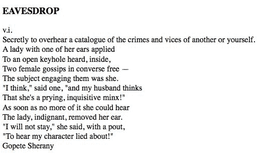

# 六、使用 Ajax 发送数据

术语**异步 JavaScript 和 XML**（**Ajax**由*Jesse James Garrett*于 2005 年创造。从那时起，它代表了许多不同的事物，因为它包含了一组相关的能力和技术。在最基本的层面上，Ajax 解决方案包括以下技术：

*   **JavaScript**：用于捕获与用户的交互或其他浏览器相关事件，并解释来自服务器的数据并将其显示在页面上
*   **XMLHttpRequest**：这允许在不中断其他浏览器任务的情况下向服务器发出请求
*   **文本数据：**服务器提供 XML、HTML 或 JSON 等格式的数据

Ajax 将静态**网页**转换为交互式**web 应用程序**。毫不奇怪，浏览器与`XMLHttpRequest`对象的实现并不完全一致，但 jQuery 将为我们提供帮助。

在本章中，我们将介绍：

*   在不刷新页面的情况下从服务器加载数据
*   将浏览器中的 JavaScript 数据发送回服务器
*   以多种格式解释数据，包括 HTML、XML 和 JSON
*   向用户提供有关 Ajax 请求状态的反馈

<footer style="margin-top: 5em;">

# 按需加载数据

Ajax 只是将数据从服务器加载到 web 浏览器的一种方法，无需刷新页面。这些数据可以有多种形式，我们可以选择在数据到达时如何处理这些数据。我们将通过使用不同的方法执行相同的基本任务来了解这一点。

我们将构建一个页面，显示字典中的条目，按字典条目的起始字母分组。定义页面内容区域的 HTML 如下所示：

```js
<div id="dictionary"> 
</div> 

```

我们的页面将没有开始的内容。我们将使用 jQuery 的各种 Ajax 方法用字典条目填充这个`<div>`标记。

Getting the example code
You can access the example code from the following GitHub repository: [https://github.com/PacktPublishing/Learning-jQuery-3](https://github.com/PacktPublishing/Learning-jQuery-3).

我们需要一种触发加载过程的方法，因此我们将为事件处理程序添加一些链接：

```js
<div class="letters"> 
  <div class="letter" id="letter-a"> 
    <h3><a href="entries-a.html">A</a></h3> 
  </div> 
  <div class="letter" id="letter-b"> 
    <h3><a href="entries-a.html">B</a></h3> 
  </div> 
  <div class="letter" id="letter-c"> 
    <h3><a href="entries-a.html">C</a></h3> 
  </div> 
  <div class="letter" id="letter-d"> 
    <h3><a href="entries-a.html">D</a></h3> 
  </div> 
  <!-- and so on --> 
</div> 

```

这些简单的链接将引导我们找到列出该字母的词典条目的页面。我们将使用渐进式增强，允许这些链接在不加载完整页面的情况下操纵页面。应用基本样式后，此 HTML 将生成如下页面：


现在，我们可以专注于将内容放到页面上。

<footer style="margin-top: 5em;">

# 附加 HTML

Ajax 应用程序通常只不过是对 HTML 块的请求。这种技术有时被称为**异步 HTTP 和 HTML**（**AHAH**），几乎很容易用 jQuery 实现。首先，我们需要插入一些 HTML，我们将把它们放在一个名为`a.html`的文件中，与主文档一起。此辅助 HTML 文件的开头如下所示：

```js
<div class="entry"> 
  <h3 class="term">ABDICATION</h3> 
  <div class="part">n.</div> 
  <div class="definition"> 
    An act whereby a sovereign attests his sense of the high 
    temperature of the throne. 
    <div class="quote"> 
      <div class="quote-line">Poor Isabella's Dead, whose 
      abdication</div> 
      <div class="quote-line">Set all tongues wagging in the 
      Spanish nation.</div> 
      <div class="quote-line">For that performance 'twere 
      unfair to scold her:</div> 
      <div class="quote-line">She wisely left a throne too 
      hot to hold her.</div> 
      <div class="quote-line">To History she'll be no royal 
      riddle &mdash;</div> 
      <div class="quote-line">Merely a plain parched pea that 
      jumped the griddle.</div> 
      <div class="quote-author">G.J.</div> 
    </div> 
  </div> 
</div> 

<div class="entry"> 
  <h3 class="term">ABSOLUTE</h3> 
  <div class="part">adj.</div> 
  <div class="definition"> 
    Independent, irresponsible.  An absolute monarchy is one 
    in which the sovereign does as he pleases so long as he 
    pleases the assassins.  Not many absolute monarchies are 
    left, most of them having been replaced by limited 
    monarchies, where the sovereign's power for evil (and for 
    good) is greatly curtailed, and by republics, which are 
    governed by chance. 
  </div> 
</div> 

```

页面将继续使用此 HTML 结构中的更多条目。`a.html`本身的表现非常简单：


注意，`a.html`不是真正的 HTML 文档；它不包含`<html>`、`<head>`或`<body>`，这些通常都是必需的。我们通常将这样的文件称为*部分*或*片段*；它的唯一用途是插入到另一个 HTML 文档中，我们现在将这样做：

```js
$(() => {
  $('#letter-a a')
    .click((e) => {
      e.preventDefault()

      $('#dictionary').load('a.html');
    });
});

```

Listing 6.1

`.load()`方法为我们完成所有繁重的工作。我们使用普通 jQuery 选择器指定 HTML 代码段的目标位置，然后将要加载的文件的 URL 作为参数传递。现在，当点击第一个链接时，文件被加载并放置在`<div id="dictionary">`中。浏览器将在插入新 HTML 后立即呈现：


请注意，HTML 现在是样式化的，而以前是普通的。这是由于主文档中的 CSS 规则造成的；一旦插入新的 HTML 代码段，规则也将应用于其元素。

在测试该示例时，当单击按钮时，字典定义可能会立即出现。这是在本地处理我们的应用程序的一种危险；很难解释在网络上传输文档时的延迟或中断。假设我们添加了一个警报框，以便在加载定义后显示：

```js
$(() => {
  $('#letter-a a')
    .click((e) => {
      e.preventDefault()

      $('#dictionary').load('a.html');
      alert('Loaded!');
    });
});

```

Listing 6.2

我们可以从这段代码的结构中假设，只有在执行加载之后才能显示警报。JavaScript 执行是**同步**，按照严格的顺序处理一个又一个任务。

但是，当在生产 web 服务器上测试此特定代码时，由于网络延迟，警报将在加载完成之前出现和消失。这是因为所有 Ajax 调用在默认情况下都是异步的。异步加载意味着一旦发出检索 HTML 代码段的 HTTP 请求，脚本执行将立即恢复，无需等待。一段时间后，浏览器从服务器接收响应并进行处理。这是期望的行为；在等待检索数据时锁定整个 web 浏览器是不友好的。

如果操作必须延迟到加载完成，jQuery 将为此提供回调。我们已经在[第 4 章](04.html#2KS220-fd25fd954efc4043b43c8b05f3cc53ef)、*样式和动画*中看到回调，在效果完成后使用回调执行动作。Ajax 回调执行类似的功能，在数据从服务器到达后执行。我们将在下一个示例中使用此功能，因为您将学习如何从服务器读取 JSON 数据。

<footer style="margin-top: 5em;">

# 使用 JavaScript 对象

按需拉入完整格式的 HTML 非常方便，但这意味着必须将大量有关 HTML 结构的信息与实际内容一起传输。有时，我们宁愿传输尽可能少的数据，并在数据到达后进行处理。在这种情况下，我们需要检索可以使用 JavaScript 遍历的结构中的数据。

使用 jQuery 的选择器，我们可以遍历返回的 HTML 并对其进行操作，但是原生 JavaScript 数据格式需要传输的数据和处理的代码更少。

<footer style="margin-top: 5em;">

# 检索 JSON

正如我们经常看到的，JavaScript 对象只是一组键值对，可以使用大括号（`{}`简洁地定义。另一方面，JavaScript 数组是用方括号（`[]`动态定义的，并且具有隐式键，这些键是递增的整数。结合这两个概念，我们可以很容易地表达一些非常复杂和丰富的数据结构。

术语**JavaScript 对象表示法**（**JSON**由*道格拉斯·克罗克福德*创造，以利用这种简单的语法。这种表示法可以为庞大的 XML 格式提供一种简洁的替代方法：

```js
{ 
  "key": "value", 
  "key 2": [ 
    "array", 
    "of", 
    "items" 
  ] 
} 

```

虽然 JSON 基于 JavaScript 对象文字和数组文字，但它对语法要求更具规定性，对允许的值更具限制性。例如，JSON 指定所有对象键以及所有字符串值必须用双引号括起来。此外，函数不是有效的 JSON 值。由于 JSON 的严格性，开发人员应该避免手工编辑 JSON，而是依赖服务器端脚本等软件来正确格式化 JSON。

For information on JSON's syntax requirements, some of its potential advantages and its implementations in many programming languages, visit [http://json.org/](http://json.org/).

我们可以通过多种方式使用这种格式对数据进行编码。为了说明一种方法，我们将在 JSON 文件中放置一些字典条目，我们称之为`b.json`：

```js
[ 
  { 
    "term": "BACCHUS", 
    "part": "n.", 
    "definition": "A convenient deity invented by the...", 
    "quote": [ 
      "Is public worship, then, a sin,", 
      "That for devotions paid to Bacchus", 
      "The lictors dare to run us in,", 
      "And resolutely thump and whack us?" 
    ], 
    "author": "Jorace" 
  }, 
  { 
    "term": "BACKBITE", 
    "part": "v.t.", 
    "definition": "To speak of a man as you find him when..." 
  }, 
  { 
    "term": "BEARD", 
    "part": "n.", 
    "definition": "The hair that is commonly cut off by..." 
  }, 
  ... file continues ... 

```

为了检索这些数据，我们将使用`$.getJSON()`方法，该方法获取文件并对其进行处理。当数据从服务器到达时，它只是一个 JSON 格式的文本字符串。`$.getJSON()`方法解析此字符串，并为调用代码提供生成的 JavaScript 对象。

<footer style="margin-top: 5em;">

# 使用全局 jQuery 函数

到目前为止，我们使用的所有 jQuery 方法都已附加到我们使用`$()`函数构建的 jQuery 对象。选择器允许我们指定一组要使用的 DOM 节点，并且这些方法以某种方式对它们进行操作。然而，这个`$.getJSON()`功能是不同的。没有可应用的逻辑 DOM 元素；结果对象必须提供给脚本，而不是注入页面。因此，`getJSON()`被定义为全局 jQuery 对象的方法（由`jQuery`库定义一次的名为`jQuery`或`<footer style="margin-top: 5em;"的单个对象），而不是单个 jQuery 对象实例（由`$()`函数返回的对象）。

如果`<footer style="margin-top: 5em;"是一个类，那么`$.getJSON()`将是一个类方法。出于我们的目的，我们将这种方法称为**全局函数**；实际上，它们是使用`jQuery`名称空间的函数，以避免与其他函数名冲突。

要使用此函数，我们像前面一样将文件名传递给它：

```js
$(() => {
  $('#letter-b a')
    .click((e) => {
      e.preventDefault();
      $.getJSON('b.json');
    });
});

```

Listing 6.3

当我们点击链接时，此代码没有明显的效果。函数调用加载文件，但我们没有告诉 JavaScript 如何处理结果数据。为此，我们需要使用回调函数。

`$.getJSON()`函数接受第二个参数，这是加载完成时要调用的函数。如前所述，Ajax 调用是异步的，回调提供了一种等待数据传输的方法，而不是立即执行代码。回调函数还接受一个参数，该参数由结果数据填充。因此，我们可以写：

```js
$(() => {
  $('#letter-b a')
    .click((e) => {
      e.preventDefault();
      $.getJSON('b.json', (data) => {});
    });
});

```

Listing 6.4

在这个函数中，我们可以根据需要使用`data`参数遍历 JSON 结构。我们需要迭代顶级数组，为每个项目构建 HTML。我们将使用数据数组的`reduce()`方法将其转换为 HTML 字符串，然后插入到文档中。`reduce()`方法将函数作为参数，并为数组的每个项返回结果的一部分：

```js
$(() => {
  $('#letter-b a')
    .click((e) => {
      e.preventDefault();

        $.getJSON('b.json', (data) => {
          const html = data.reduce((result, entry) => `
            ${result}
            <div class="entry">
              <h3 class="term">${entry.term}</h3>
              <div class="part">${entry.part}</div>
              <div class="definition">
                ${entry.definition}
              </div>
            </div>
          `, '');

        $('#dictionary')
          .html(html);
    });
  });
});

```

Listing 6.5

我们使用模板字符串为每个数组项构建 HTML 内容。`result`参数是来自上一个数组项的值。使用这种方法，查看 HTML 结构要比使用字符串连接容易得多。为每个条目构建完所有 HTML 后，我们将其插入到带有`.html()`的`<div id="dictionary">`中，替换可能已经存在的任何内容。

Safe HTML
This approach presumes that the data is safe for HTML consumption; it should not contain any stray `<` characters, for example.

剩下的就是处理带有引号的条目，我们可以通过实现几个使用`reduce()`技术构建字符串的帮助函数来完成：

```js
$(() => {
  const formatAuthor = entry =>
    entry.author ?
      `<div class="quote-author">${entry.author}</div>` :
      '';

  const formatQuote = entry =>
    entry.quote ?
      `
      <div class="quote">
        ${entry.quote.reduce((result, q) => `
          ${result}
          <div class="quote-line">${q}</div>
        `, '')}
        ${formatAuthor(entry)}
      </div>
      ` : '';

    $('#letter-b a')
      .click((e) => {
        e.preventDefault();

        $.getJSON('b.json', (data) => {
          const html = data.reduce((result, entry) => `
            ${result}
            <div class="entry">
              <h3 class="term">${entry.term}</h3>
              <div class="part">${entry.part}</div>
              <div class="definition">
                ${entry.definition}
                ${formatQuote(entry)}
              </div>
            </div>
          `, '');

          $('#dictionary')
            .html(html);
        });
      });
});

```

Listing 6.6

有了这个代码，我们可以点击 B 链接并确认我们的结果。字典条目显示在页面的右侧，如预期的那样：


JSON 格式是简洁的，但并不宽容。必须显示并说明每个括号、大括号、引号和逗号，否则将无法加载文件。在某些情况下，我们甚至不会收到错误消息；脚本将自动失败。

<footer style="margin-top: 5em;">

# 执行脚本

有时候，我们不想在页面首次加载时检索到所有需要的 JavaScript。在发生某些用户交互之前，我们可能不知道需要哪些脚本。我们可以在需要时动态地引入`<script>`标记，但是注入额外代码的更优雅的方法是让 jQuery 直接加载`.js`文件。

拉入脚本与加载 HTML 片段一样简单。在本例中，我们使用`$.getScript()`函数，该函数与它的同级函数一样，接受一个定位脚本文件的 URL：

```js
$(() => { 
  $('#letter-c a')
    .click((e) => {
      e.preventDefault();
      $.getScript('c.js');
    });
}); 

```

Listing 6.7

在上一个示例中，我们需要处理结果数据，以便对加载的文件执行一些有用的操作。不过，对于脚本文件，处理是自动的；脚本只是简单地运行。

以这种方式获取的脚本在当前页面的全局上下文中运行。这意味着他们可以访问所有全局定义的函数和变量，尤其是 jQuery 本身。因此，我们可以模仿 JSON 示例，在执行脚本时准备并在页面上插入 HTML，并将此代码放在`c.js`中：

```js
const entries = [ 
  { 
    "term": "CALAMITY", 
    "part": "n.", 
    "definition": "A more than commonly plain and..." 
  }, 
  { 
    "term": "CANNIBAL", 
    "part": "n.", 
    "definition": "A gastronome of the old school who..." 
  }, 
  { 
    "term": "CHILDHOOD", 
    "part": "n.", 
    "definition": "The period of human life intermediate..." 
  } 
  // and so on 
]; 

const html = entries.reduce((result, entry) => `
  ${result}
  <div class="entry">
    <h3 class="term">${entry.term}</h3>
    <div class="part">${entry.part}</div>
    <div class="definition">
      ${entry.definition}
    </div>
  </div>
`, '');

$('#dictionary')
  .html(html); 

```

现在，点击 C 链接得到了预期的结果，显示了相应的字典条目。

<footer style="margin-top: 5em;">

# 加载 XML 文档

XML 是首字母缩略词 Ajax 的一部分，但实际上我们还没有加载任何 XML。这样做很简单，并且与 JSON 技术密切相关。首先，我们需要一个 XML 文件`d.xml`，其中包含一些我们希望显示的数据：

```js
<?xml version="1.0" encoding="UTF-8"?> 
<entries> 
  <entry term="DEFAME" part="v.t."> 
    <definition> 
      To lie about another.  To tell the truth about another. 
    </definition> 
  </entry> 
  <entry term="DEFENCELESS" part="adj."> 
    <definition> 
      Unable to attack. 
    </definition> 
  </entry> 
  <entry term="DELUSION" part="n."> 
    <definition> 
      The father of a most respectable family, comprising 
      Enthusiasm, Affection, Self-denial, Faith, Hope, 
      Charity and many other goodly sons and daughters. 
    </definition> 
    <quote author="Mumfrey Mappel"> 
      <line>All hail, Delusion!  Were it not for thee</line> 
      <line>The world turned topsy-turvy we should see; 
        </line> 
      <line>For Vice, respectable with cleanly fancies, 
        </line> 
      <line>Would fly abandoned Virtue's gross advances. 
        </line> 
    </quote> 
  </entry> 
</entries> 

```

当然，这些数据可以用多种方式表达，有些更接近于我们为前面使用的 HTML 或 JSON 建立的结构。然而，在这里，我们展示了 XML 的一些特性，这些特性旨在使人们更容易阅读，例如使用`term`和`part`属性而不是标记。

我们将以熟悉的方式开始我们的功能：

```js
$(() => {
  $('#letter-d a')
    .click((e) => {
      e.preventDefault();
      $.get('d.xml', (data) => {

      });
    });
}); 

```

Listing 6.8

这一次，是`$.get()`函数完成了我们的工作。通常，此函数只需从提供的 URL 获取文件，并向回调提供纯文本。但是，如果由于服务器提供的 MIME 类型而知道响应是 XML，则回调将传递给 XMLDOM 树。

幸运的是，正如我们已经看到的，jQuery 具有强大的 DOM 遍历功能。我们可以在 XML 文档上使用正常的`.find()`、`.filter()`和其他遍历方法，就像在 HTML 上一样：

```js
$(() => { 
  $('#letter-d a')
    .click((e) => {
      const formatAuthor = entry =>
        $(entry).attr('author') ?
          `
          <div class="quote-author">
            ${$(entry).attr('author')}
          </div>
          ` : '';

      const formatQuote = entry =>
        $(entry).find('quote').length ?
          `
          <div class="quote">
            ${$(entry)
              .find('quote')
              .get()
              .reduce((result, q) => `
                ${result}
                <div class="quote-line">
                  ${$(q).text()}
                </div>
              `, '')}
            ${formatAuthor(entry)}
          </div>
          ` : '';

      e.preventDefault();

      $.get('d.xml', (data) => {
        const html = $(data)
          .find('entry')
          .get()
          .reduce((result, entry) => `
            ${result}
            <div class="entry">
              <h3 class="term">${$(entry).attr('term')}</h3>
              <div class="part">${$(entry).attr('part')}</div>
              <div class="definition">
                ${$(entry).find('definition').text()}
                ${formatQuote(entry)}
              </div>
            </div>
          `, '');

        $('#dictionary')
          .html(html);
      });
    });
}); 

```

Listing 6.9

这在单击 D 链接时具有预期效果：


这是我们已经知道的 DOM 遍历方法的一个新用途，为 jQuery 的 CSS 选择器支持的灵活性提供了一些启示。CSS 语法通常用于帮助美化 HTML 页面，因此标准`.css`文件中的选择器使用 HTML 标记名，如`div`和`body`来定位内容。然而，jQuery 可以使用任意的 XML 标记名，如`entry`和`definition`，就像标准 HTML 标记名一样容易。

jQuery 中的高级选择器引擎也有助于在更复杂的情况下查找 XML 文档的某些部分。例如，假设我们想将显示的条目限制为那些引用了作者的条目。为此，我们可以通过将`entry`更改为`entry:has(quote)`将条目限制为具有嵌套`<quote>`元素的条目。然后，我们可以通过写入`entry:has(quote[author])`进一步将条目限制为在`<quote>`元素上具有`author`属性的条目。*清单 6.9*中带有初始选择器的行现在显示：

```js
$(data).find('entry:has(quote[author])').each(function() { 

```

此新选择器表达式相应地限制返回的条目：


While we can use jQuery on XML data that's returned from the server, the downside is the size of our code has grown considerably.

<footer style="margin-top: 5em;">

# 选择数据格式

我们已经研究了外部数据的四种格式，每种格式都由 jQuery 的 Ajax 函数处理。我们还验证了这四种方法都可以处理手头的任务，在用户请求时将信息加载到现有页面上，而不是之前。那么，我们如何决定在应用程序中使用哪一个呢？

*HTML 代码片段*只需很少的工作即可实现。外部数据可以通过一个简单的方法加载并插入到页面中，这个方法甚至不需要回调函数。将新 HTML 添加到现有页面的简单任务不需要遍历数据。另一方面，数据的结构不一定能使其可用于其他应用程序。外部文件与其预期的容器紧密耦合。

*JSON 文件*的结构便于重用。它们紧凑易读。必须遍历数据结构以提取信息并将其显示在页面上，但这可以通过标准 JavaScript 技术完成。由于现代浏览器只需一次调用`JSON.parse()`就可以对文件进行本机解析，因此读取 JSON 文件的速度非常快。JSON 文件中的错误可能会导致页面出现无声故障，甚至产生副作用，因此受信任方必须仔细编制数据。

*JavaScript 文件*提供了最大的灵活性，但不是真正的数据存储机制。由于这些文件是特定于语言的，因此它们不能用于向不同的系统提供相同的信息。相反，加载 JavaScript 文件的能力意味着可以将很少需要的行为分解到外部文件中，从而减少代码大小，除非需要。

虽然*XML*在 JavaScript 社区已经不受欢迎，大多数开发人员更喜欢 JSON，但它仍然非常普遍，以这种格式提供数据很可能会在其他地方重复使用。XML 格式有点笨重，解析和操作可能比其他选项慢一点。

考虑到这些特性，通常最容易将外部数据作为 HTML 片段提供，只要其他应用程序中也不需要这些数据。在数据将被重用但其他应用程序也会受到影响的情况下，JSON 由于其性能和大小通常是一个不错的选择。当远程应用程序未知时，XML 可以提供互操作性的最大保证。

与任何其他考虑因素相比，我们更应该确定数据是否已经可用。如果是的话，很有可能它是以这些格式之一开始的，因此我们可能会做出决定。

<footer style="margin-top: 5em;">

# 将数据传递到服务器

到目前为止，我们的示例集中在从 web 服务器检索静态数据文件的任务上。但是，服务器可以根据来自浏览器的输入动态塑造数据。jQuery 也在这项任务中帮助我们；到目前为止，我们介绍的所有方法都可以修改，以便数据传输成为一条双向的道路。

Interacting with server-side code
Since demonstrating these techniques requires interaction with the web server, we'll need to use server-side code for the first time here. The examples given will use Node.js, which is very widely used as well as freely available. We will not cover any Node.js or Express specifics here, but there are plentiful resource on the web if you Google either of these technologies.

<footer style="margin-top: 5em;">

# 执行 GET 请求

为了说明客户端（使用 JavaScript）和服务器（也使用 JavaScript）之间的通信，我们将编写一个脚本，在每个请求中只向浏览器发送一个字典条目。选择的条目将取决于从浏览器发送的参数。我们的脚本将从如下内部数据结构中提取其数据：

```js
const E_entries = {
  EAVESDROP: {
    part: 'v.i.',
    definition: 'Secretly to overhear a catalogue of the ' +
                'crimes and vices of another or yourself.',
    quote: [
      'A lady with one of her ears applied',
      'To an open keyhole heard, inside,',
      'Two female gossips in converse free &mdash;',
      'The subject engaging them was she.',
      '"I think," said one, "and my husband thinks',
      'That she's a prying, inquisitive minx!"',
      'As soon as no more of it she could hear',
      'The lady, indignant, removed her ear.',
      '"I will not stay," she said, with a pout,',
      '"To hear my character lied about!"',
    ],
    author: 'Gopete Sherany',
  },
  EDIBLE: {
    part:'adj.',
    definition: 'Good to eat, and wholesome to digest, as ' +
                'a worm to a toad, a toad to a snake, a snake ' +
                'to a pig, a pig to a man, and a man to a worm.',
  },
  // Etc...

```

在本例的生产版本中，数据可能存储在数据库中并按需加载。由于数据是脚本的一部分，因此检索数据的代码非常简单。我们检查 URL 的查询字符串部分，然后将术语和条目传递给一个函数，该函数返回要显示的 HTML 代码段：

```js
const formatAuthor = entry =>
  entry.author ?
    `<div class="quote-author">${entry.author}</div>` :
    '';

const formatQuote = entry =>
  entry.quote ?
    `
    <div class="quote">
      ${entry.quote.reduce((result, q) => `
        ${result}
        <div class="quote-line">${q}</div>
      `, '')}
      ${formatAuthor(entry)}
    </div>
    ` : '';

const formatEntry = (term, entry) => `
  <div class="entry">
    <h3 class="term">${term}</h3>
    <div class="part">${entry.part}</div>
    <div class="definition">
      ${entry.definition}
      ${formatQuote(entry)}
    </div>
  </div>
`;

app.use(express.static('./'));

app.get('/e', (req, res) => {
  const term = req.query.term.toUpperCase();
  const entry = E_entries[term];
  let content;

  if (entry) {
    content = formatEntry(term, entry);
  } else {
    content = '<div>Sorry, your term was not found.</div>';
  }

  res.send(content);
}); 

```

现在，对这个`/e`处理程序的请求将返回与 GET 参数中发送的术语对应的 HTML 代码段。例如，当使用`/e?term=eavesdrop`访问处理程序时，我们返回：



再一次，我们注意到早期 HTML 代码片段中缺少格式，因为 CSS 规则尚未应用。

因为我们展示了数据是如何传递到服务器的，所以我们将使用一种不同于我们目前所依赖的单独按钮的方法来请求条目。相反，我们将显示每个术语的链接列表，并单击其中任何一个来加载相应的定义。我们将为此添加的 HTML 如下所示：

```js
<div class="letter" id="letter-e"> 
  <h3>E</h3> 
  <ul> 
    <li><a href="e?term=Eavesdrop">Eavesdrop</a></li> 
    <li><a href="e?term=Edible">Edible</a></li> 
    <li><a href="e?term=Education">Education</a></li> 
    <li><a href="e?term=Eloquence">Eloquence</a></li> 
    <li><a href="e?term=Elysium">Elysium</a></li> 
    <li><a href="e?term=Emancipation">Emancipation</a> 
      </li> 
    <li><a href="e?term=Emotion">Emotion</a></li> 
    <li><a href="e?term=Envelope">Envelope</a></li> 
    <li><a href="e?term=Envy">Envy</a></li> 
    <li><a href="e?term=Epitaph">Epitaph</a></li> 
    <li><a href="e?term=Evangelist">Evangelist</a></li> 
  </ul> 
</div> 

```

现在，我们需要让前端 JavaScript 代码使用正确的参数调用后端 JavaScript。我们可以通过正常的`.load()`机制来实现这一点，将查询字符串直接添加到 URL，并直接使用`e?term=eavesdrop`等地址获取数据。但是，我们可以让 jQuery 根据提供给`$.get()`函数的对象构造查询字符串：

```js
$(() => { 
  $('#letter-e a')
    .click((e) => {
      e.preventDefault();

      const requestData = {
        term: $(e.target).text()
      };

      $.get('e', requestData, (data) => {
        $('#dictionary').html(data);
      });
    });
}); 

```

Listing 6.10

现在我们已经看到了 jQuery 提供的其他 Ajax 接口，这个函数的操作似乎很熟悉。唯一的区别是第二个参数，它允许我们提供一个对象，该对象包含成为查询字符串一部分的键和值。在这种情况下，键始终为`term`，但值取自每个链接的文本。现在，单击列表中的第一个链接会显示其定义：


这里的所有链接都有 URL，即使我们没有在代码中使用它们。为了防止点击时链接被正常跟踪，我们调用了`.preventDefault()`方法。

Return false or prevent default?
When writing the `click` handlers in this chapter, we have chosen to use `e.preventDefault()` rather than ending the handler with `return false`. This practice is recommended when the default action would otherwise reload the page or load another page. If our `click` handler, for example, contains a JavaScript error, calling `.preventDefault()` on the handler's first line (before the error is encountered) ensures that the form will not be submitted, and our browser's error console will properly report the error. Remember from [Chapter 3](03.html#1P71O0-fd25fd954efc4043b43c8b05f3cc53ef), *Handling Events*, that return `false` calls both `event.preventDefault()` and `event.stopPropagation()`. If we wanted to stop the event from bubbling, we would need to call the latter as well.

<footer style="margin-top: 5em;">

# 序列化表单

向服务器发送数据通常需要用户填写表单。我们可以使用 jQuery 的 Ajax 工具包异步提交表单，并将响应放在当前页面中，而不是依赖于在整个浏览器窗口中加载响应的正常表单提交机制。

要尝试此方法，我们需要构造一个简单的表单：

```js
<div class="letter" id="letter-f"> 
  <h3>F</h3> 
  <form action="f"> 
    <input type="text" name="term" value="" id="term" /> 
    <input type="submit" name="search" value="search" 
      id="search" /> 
  </form> 
</div> 

```

这一次，我们将从服务器返回一组条目，方法是让`/f`处理程序将提供的搜索项作为字典项的子字符串进行搜索。我们将使用`/e`处理程序中的`formatEntry()`函数以与前面相同的格式返回数据。以下是`/f`处理程序的实现：

```js
app.post('/f', (req, res) => {
  const term = req.body.term.toUpperCase();
  const content = Object.keys(F_entries)
    .filter(k => k.includes(term))
    .reduce((result, k) => `
      ${result}
      ${formatEntry(k, F_entries[k])}
    `, '');

  res.send(content);
}); 

```

现在，我们可以对表单提交作出反应，并通过遍历 DOM 树来设计适当的查询参数：

```js
$(() => {
  $('#letter-f form')
    .submit((e) => {
      e.preventDefault();

      $.post(
        $(e.target).attr('action'),
        { term: $('input[name="term"]').val() },
        (data) => { $('#dictionary').html(data); }
      );
    });
}); 

```

Listing 6.11

这段代码具有预期的效果，但按名称搜索输入字段并将其逐个附加到映射中是很麻烦的。特别是，随着表单变得更加复杂，这种方法无法很好地扩展。幸运的是，jQuery 为这个常用的习惯用法提供了一个快捷方式。`.serialize()`方法作用于 jQuery 对象，并将匹配的 DOM 元素转换为查询字符串，该字符串可以与 Ajax 请求一起传递。我们可以将提交处理程序概括如下：

```js
$(() => {
  $('#letter-f form')
    .submit((e) => {
      e.preventDefault();

      $.post(
        $(e.target).attr('action'),
        $(e.target).serialize(),
        (data) => { $('#dictionary').html(data); }
      );
    }); 
}); 

```

Listing 6.12

即使字段数量增加，也可以使用相同的脚本提交表单。例如，当我们搜索`fid`时，包含该子字符串的术语显示如下屏幕截图所示：


<footer style="margin-top: 5em;">

# 密切关注这个请求

到目前为止，我们只要调用 Ajax 方法并耐心等待响应就足够了。不过，有时，随着 HTTP 请求的进行，了解更多有关 HTTP 请求的信息是很方便的。如果出现这种需求，jQuery 提供了一套函数，可用于在发生各种 Ajax 相关事件时注册回调。

`.ajaxStart()`和`.ajaxStop()`方法是这些观测器函数的两个示例。当 Ajax 调用开始时没有其他传输进行，则会触发`.ajaxStart()`回调。相反，当最后一个活动请求结束时，将执行附加有`.ajaxStop()`的回调。所有的观察者都是全局的，因为它们在任何 Ajax 通信发生时都会被调用，而不管是什么代码启动它。而所有这些，只能绑定到`$(document)`。

在网络连接缓慢的情况下，我们可以使用这些方法向用户提供一些反馈。页面的 HTML 可以附加适当的加载消息：

```js
<div id="loading"> 
  Loading... 
</div> 

```

此消息只是任意 HTML 的一部分；例如，它可以包含一个动画 GIF 图像作为加载指示器。在本例中，我们将向 CSS 文件添加一些简单样式，以便在显示消息时，页面将如下所示：


然而，为了保持渐进增强的精神，我们不会将此 HTML 标记直接放在页面上。相反，我们将使用 jQuery 插入它：

```js
$(() => {
  $('<div/>')
    .attr('id', 'loading')
    .text('Loading...')
    .insertBefore('#dictionary');
}); 

```

我们的 CSS 文件将给这个`<div>`一个`display: none;`样式的声明，以便消息最初是隐藏的。为了在正确的时间显示，我们只需在`.ajaxStart()`中将其注册为观察者：

```js
$(() => {
  const $loading = $('<div/>')
    .attr('id', 'loading')
    .text('Loading...')
    .insertBefore('#dictionary');

  $(document)
    .ajaxStart(() => {
      $loading.show(); 
    }); 
}); 

```

我们可以将隐藏行为链接到以下内容：

```js
$(() => {
  const $loading = $('<div/>')
    .attr('id', 'loading')
    .text('Loading...') 
    .insertBefore('#dictionary'); 

  $(document)
    .ajaxStart(() => {
      $loading.show(); 
    })
    .ajaxStop(() => {
      $loading.hide(); 
    }); 
}); 

```

Listing 6.13

我们现在有了加载反馈。

再次注意，这些方法与 Ajax 通信开始的特定方式没有关联。连接到 A 链路的`.load()`方法和连接到 B 链路的`.getJSON()`方法都会导致这些动作发生。

在这种情况下，这种全局行为是可取的。不过，如果我们需要更具体一些，我们有一些选择。一些观察者方法，例如`.ajaxError()`，向其回调发送对`XMLHttpRequest`对象的引用。这可以用来区分一个请求和另一个请求，并提供不同的行为。其他更具体的处理可以通过使用低级的`$.ajax()`函数来实现，我们将在稍后讨论。

与请求交互的最常见方式是`success`回调，我们已经介绍过了。在我们的几个示例中，我们已经使用它来解释从服务器返回的数据，并用结果填充页面。当然，它也可以用于其他反馈。再次考虑我们的 To1 ?? 例子，从清单 ??。清单 6.1

```js
$(() => { 
  $('#letter-a a')
    .click((e) => {
      e.preventDefault();
      $('#dictionary')
        .load('a.html'); 
    }); 
}); 

```

我们可以通过使加载的内容淡入视图而不是突然出现来创建一个小增强。`.load()`方法可以在完成时启动回调：

```js
$(() => { 
  $('#letter-a a')
    .click((e) => {
      e.preventDefault();
      $('#dictionary')
        .hide()
        .load('a.html', function() { 
          $(this).fadeIn(); 
        }); 
    }); 
}); 

```

Listing 6.14

首先，我们隐藏目标元素，然后启动加载。加载完成后，我们使用回调通过淡入显示新填充的元素。

<footer style="margin-top: 5em;">

# 错误处理

到目前为止，我们只处理了对 Ajax 请求的成功响应，当一切按计划进行时，用新内容加载页面。然而，负责任的开发人员应该考虑网络或数据错误的可能性，并适当地报告它们。在本地环境中开发 Ajax 应用程序会让开发人员感到自满，因为除了可能的 URL 键入错误之外，Ajax 错误不仅仅发生在本地。像`$.get()`和`.load()`这样的 Ajax 便利方法本身并不提供错误回调参数，因此我们需要从别处寻找解决这个问题的方法。

除了使用`global .ajaxError()`方法外，我们还可以利用 jQuery 的延迟对象系统来应对错误。我们将在[第 11 章](11.html#7DES20-fd25fd954efc4043b43c8b05f3cc53ef)、*高级效果*中更全面地讨论延迟对象，但现在我们只需注意，我们可以将`.done()`、`.always()`和`.fail()`方法链接到`.load()`之外的任何 Ajax 函数，并使用这些方法附加相关回调。例如，如果我们从*清单 6.16*中获取代码，并将 URL 更改为不存在的 URL，我们可以测试`.fail()`方法：

```js
$(() => { 
  $('#letter-e a')
    .click((e) => {
      e.preventDefault();

      const requestData = {
        term: $(e.target).text()
      };

      $.get('notfound', requestData, (data) => {
        $('#dictionary').html(data);
      }).fail((xhr) => {
        $('#dictionary')
          .html(`An error occurred:
            ${xhr.status}
            ${xhr.responseText}
          `);
      });
    });
}); 

```

Listing 6.15

现在，单击以 E 开头的术语的任何链接都将生成错误消息。`jqXHR.responseText`的确切内容将根据服务器配置而有所不同：


`.status`属性包含服务器提供的数字代码。这些代码在 HTTP 规范中定义，当触发`.fail()`处理程序时，它们将表示错误条件，例如：

| **应答码** | **说明** |
| 400 | 错误的请求 |
| 401 | 未经授权 |
| 403 | 被禁止的 |
| 404 | 找不到 |
| 500 | 内部服务器错误 |

可在 W3C 网站上找到完整的响应代码列表：[http://www.w3.org/Protocols/rfc2616/rfc2616-sec10.html](http://www.w3.org/Protocols/rfc2616/rfc2616-sec10.html) 。

我们将在[第 13 章](13.html#8JJII0-fd25fd954efc4043b43c8b05f3cc53ef)、*高级 Ajax*中更详细地研究错误处理。

<footer style="margin-top: 5em;">

# Ajax 和事件

假设我们希望允许每个字典术语名控制后面定义的显示；单击术语名称将显示或隐藏关联的定义。根据我们目前所看到的技术，这应该非常简单：

```js
$(() => {
  $('h3.term')
    .click((e) => {
      $(e.target)
        .siblings('.definition')
        .slideToggle();
    });
}); 

```

Listing 6.16

当点击一个术语时，此代码将查找具有类`definition`的元素的同级，并根据需要向上或向下滑动它们。

看起来一切正常，但单击此代码不会产生任何影响。不幸的是，在我们附加`click`处理程序时，这些术语尚未添加到文档中。即使我们设法将`click`处理程序附加到这些项目上，但一旦我们单击另一个字母，处理程序将不再附加。

这是由 Ajax 填充的页面区域的常见问题。一种流行的解决方案是在每次刷新页面区域时重新绑定处理程序。但是，这可能会很麻烦，因为每次有任何事情导致页面的 DOM 结构发生更改时，都需要调用事件绑定代码。

在[第 3 章](03.html#1P71O0-fd25fd954efc4043b43c8b05f3cc53ef)、*处理事件*中引入了一个更好的替代方案。我们可以实现**事件委托**，实际上是将事件绑定到一个永远不会更改的祖先元素。在本例中，我们将`click`处理程序附加到`<body>`元素，使用`.on()`以这种方式捕捉我们的点击：

```js
$(() => { 
  $('body')
    .on('click', 'h3.term', (e) => {
      $(e.target)
        .siblings('.definition')
        .slideToggle();
    });
}); 

```

Listing 6.17

当以这种方式使用时，`.on()`方法告诉浏览器观察文档中任何地方的所有点击。如果（且仅当）单击的元素与`h3.term`选择器匹配，则执行处理程序。现在，切换行为将发生在任何术语上，即使它是由以后的 Ajax 事务添加的。

<footer style="margin-top: 5em;">

# 尊重和承诺

jQuery 延迟对象是在 JavaScript 代码中没有一致的方法来处理异步行为时引入的。承诺帮助我们协调异步内容，如多个 HTTP 请求、文件读取、动画等。承诺不是 JavaScript 独有的，也不是一个新想法。考虑承诺的最佳方式是将其视为承诺最终解决价值的合同。

既然承诺正式成为 JavaScript 的一部分，jQuery 现在完全支持承诺。也就是说，jQuery 延迟对象的行为与任何其他承诺一样。这一点很重要，我们将在本节中看到，因为这意味着我们可以使用 jQuery 延迟与其他返回本机承诺的代码组成复杂的异步行为。

<footer style="margin-top: 5em;">

# 在页面加载时执行 Ajax 调用

现在，我们的字典在初始页面加载时没有显示任何定义。相反，它只是显示一些空白。让我们通过在文档准备就绪时显示“A”条目来改变这一点。我们如何做到这一点？

一种方法是简单地将`load('a.html')`调用与其他所有内容一起添加到文档就绪处理程序（`$(() => {})`中。问题是，这是低效的，因为我们必须等待文档准备就绪，然后才能发出 Ajax 请求。在 JavaScript 运行后立即发出 Ajax 请求不是更好吗？

接下来的挑战是将文档就绪事件与 Ajax 响应就绪事件同步。这里有一个比赛条件，因为我们不知道哪个项目会先发生。文件很有可能首先准备好，但我们不能这样假设。这就是承诺非常有用的地方：

```js
Promise.all([
  $.get('a.html'),
  $.ready
]).then(([content]) => {
  $('#dictionary')
    .hide()
    .html(content)
    .fadeIn();
});

```

Listing 6.18

`Promise.all()`方法接受一系列其他承诺，并返回一个新承诺。当数组参数中的所有内容都解决时，这个新的承诺就解决了。这就是承诺如何为我们处理异步竞争条件。Ajax 承诺（`$.get('a.html')`先解决还是文档准备承诺（`$.ready`先解决并不重要。

`then()`处理程序是我们想要执行任何依赖于异步值的代码的地方。例如，内容值是已解析的 Ajax 调用。准备就绪的文档隐式解析 DOM。如果 DOM 未准备好，则无法运行`$('#dictionary')...`。

<footer style="margin-top: 5em;">

# 使用 fetch（）

JavaScript 最近增加的另一个功能是`fetch()`函数。这是一个比`XMLHttpRequest`更灵活的替代方案。例如，当进行跨域请求时，或者当您需要调整特定的 HTTP 头值时，更容易使用`fetch()`。让我们使用`fetch()`实现*G*条目：

```js
$(() => {
  $('#letter-g a')
    .click((e) => { 
      e.preventDefault();

      fetch('/g')
        .then(resp => resp.json())
        .then(data => {
          const html = data.reduce((result, entry) => `
            ${result}
            <div class="entry">
              <h3 class="term">${entry.term}</h3>
              <div class="part">${entry.part}</div>
              <div class="definition">
                ${entry.definition}
                ${formatQuote(entry)}
              </div>
            </div>
          `, '');

          $('#dictionary')
            .html(html);
        });
    });
});

```

Listing 6.19

`fetch()`函数返回一个承诺，就像各种 jQueryAjax 函数一样。这意味着，如果我们在本例中调用的`/g`URL 实际上位于另一个域中，我们可以使用`fetch()`来访问它。如果我们想要 JSON 数据，我们需要在`.then()`处理程序中调用`.json()`。然后，在第二个处理程序中，我们可以使用本章前面创建的相同函数填充 DOM。

承诺背后的全部理念是一致性。如果我们需要同步异步行为，那么承诺就是实现同步的方法。jQuery 异步执行的任何操作都可以与其他承诺一起使用。

<footer style="margin-top: 5em;">

# 总结

您已经了解到 jQuery 提供的 Ajax 方法可以帮助我们在不刷新页面的情况下从服务器加载几种不同格式的数据。我们可以根据需要从服务器执行脚本，并将数据发送回服务器。

您还学习了如何处理异步加载技术的常见挑战，例如在加载发生后保持处理程序的绑定以及从第三方服务器加载数据。

我们的`jQuery`库基本组件之旅到此结束。接下来，我们将了解如何在轻松使用 jQuery 插件的基础上扩展这些特性。

<footer style="margin-top: 5em;">

# 进一步阅读

关于 Ajax 的主题，将在[第 13 章](13.html#8JJII0-fd25fd954efc4043b43c8b05f3cc53ef)、*高级 Ajax*中进行更详细的探讨。Ajax 方法的完整列表可在本书的[附录 B](15.html#9BEGK0-fd25fd954efc4043b43c8b05f3cc53ef)*、快速参考*中找到，或在[的正式 jQuery 文档中找到 http://api.jquery.com/](http://api.jquery.com/) 。

<footer style="margin-top: 5em;">

# 练习

挑战练习可能需要使用位于
[的正式 jQuery 文档 http://api.jquery.com/](http://api.jquery.com/) ：

1.  页面加载时，将`exercises-content.html`主体内容拉入页面内容区。
2.  不要一次显示整个文档，而是在用户鼠标悬停在字母上方时，通过从`exercises-content.html`加载适当的字母内容，为左侧列中的字母创建工具提示。
3.  添加此页面加载的错误处理，在内容区域显示错误消息。通过将脚本更改为请求`does-not-exist.html`而不是`exercises-content.html`来测试此错误处理代码。
4.  这是一个挑战。加载页面时，向 GitHub 发送 JSONP 请求，并为用户检索存储库列表。将每个存储库的名称和 URL 插入页面的内容区域。检索 jQuery 项目存储库的 URL 为[https://api.github.com/users/jquery/repos](https://api.github.com/users/jquery/repos) 。

</footer>

</footer>

</footer>

</footer>

</footer>

</footer>

</footer>

</footer>

</footer>

</footer>

</footer>

</footer>

</footer>

</footer>

</footer>

</footer>

</footer>

</footer>

</footer>

</footer>