# 七、使用插件

在本书的前六章中，我们研究了 jQuery 的核心组件。这样做说明了 jQuery 库可以用来完成各种任务的许多方法。尽管该库的核心功能强大，但其优雅的**插件架构**允许开发人员扩展 jQuery，使其功能更加丰富。

jQuery 社区创建了数百个插件——从小型选择器助手到全尺寸用户界面小部件。您现在将学习如何利用这一巨大的资源。

在本章中，我们将介绍：

*   下载和设置插件
*   调用插件提供的 jQuery 方法
*   使用 jQuery 插件定义的自定义选择器查找元素
*   使用 jQuery UI 添加复杂的用户界面行为
*   使用 jquerymobile 实现移动友好特性

<footer style="margin-top: 5em;">

# 使用插件

使用 jQuery 插件非常简单。我们只需要获取插件代码，从 HTML 中引用插件，并从我们自己的脚本中调用新功能。

我们可以使用 jQuery**Cycle**插件轻松演示这些任务。这个由 Mike Alsup 开发的插件允许我们快速地将一组静态页面元素转换为交互式幻灯片。像许多流行的插件一样，它可以很好地处理复杂的高级需求，但当我们的需求更简单时，它也可以隐藏这种复杂性。

<footer style="margin-top: 5em;">

# 下载并引用 Cycle 插件

要安装任何 jQuery 插件，我们将使用`npm`包管理器。这是一个事实上的工具，用于声明现代 JavaScript 项目的包依赖关系。例如，我们可以使用一个`package.json`文件来声明我们需要 jQuery，以及一组特定的 jQuery 插件

For help on installing `npm`, see [https://docs.npmjs.com/getting-started/what-is-npm](https://docs.npmjs.com/getting-started/what-is-npm). For help on initializing a `package.json` file, see [https://docs.npmjs.com/getting-started/using-a-package.json](https://docs.npmjs.com/getting-started/using-a-package.json).

一旦在项目目录的根目录中有了`package.json`文件，就可以开始添加依赖项了。例如，您可以从命令控制台添加一个`jquery`依赖项，如下所示：

```js
npm install jquery --save

```

如果我们想使用`cycle`插件，我们也可以安装它：

```js
npm install jquery-cycle --save

```

我们在这个命令中使用`--save`标志的原因是告诉`npm`我们总是需要这些包，并且它应该将这些依赖项保存到`package.json`。现在我们已经安装了`jquery`和`jquery-cycle`，让我们将它们包括在我们的页面上：

```js
<head> 
  <meta charset="utf-8"> 
  <title>jQuery Book Browser</title> 
  <link rel="stylesheet" href="07.css" type="text/css" /> 
  <script src="node_modules/jquery/dist/jquery.js"></script> 
  <script src="node_modules/jquery-cycle/index.js"></script> 
  <script src="07.js"></script> 
</head>

```

我们现在已经加载了第一个插件。正如我们所看到的，这并不比设置 jQuery 本身复杂。插件的功能现在是我们的，可以在脚本中使用。

<footer style="margin-top: 5em;">

# 调用插件方法

Cycle 插件对页面上的任何一组同级元素进行操作。为了实际展示它，我们将在列表中设置一些简单的 HTML，其中包含书籍封面图像和相关信息，并将其添加到 HTML 文档的正文中，如下所示：

```js
<ul id="books"> 
  <li> 
     
    <div class="title">jQuery Game Development Essentials</div> 
    <div class="author">Salim Arsever</div> 
  </li> 
  <li> 
     
    <div class="title">jQuery Mobile Cookbook</div> 
    <div class="author">Chetan K Jain</div> 
  </li> 
  ... 
</ul>

```

CSS 文件中的一些灯光样式将一个接一个地呈现书籍封面，如以下屏幕截图所示：

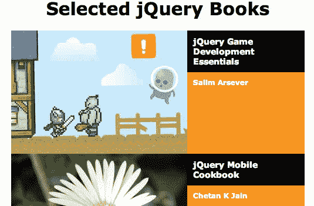

Cycle 插件将在此列表上发挥其魔力，将其转化为一个有吸引力的动画幻灯片。可以通过在 DOM 中的适当容器上调用`.cycle()`方法来调用此转换，如下所示：

```js
$(() => { 
  $('#books').cycle(); 
});

```

Listing 7.1

这种语法再简单不过了。与任何内置 jQuery 方法一样，我们将`.cycle()`应用于 jQuery 对象实例，而 jQuery 对象实例又指向我们想要操作的 DOM 元素。即使没有提供任何论据，`.cycle()`也为我们做了很多工作。页面上的样式更改为一次仅显示一个列表项，并且每 4 秒使用交叉淡入过渡显示一个新项：

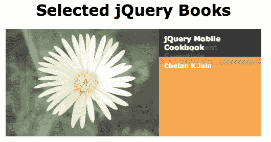

这种简单性是编写良好的 jQuery 插件的典型特点。一个简单的方法调用是实现专业和有用结果所需要的一切。然而，和许多其他插件一样，Cycle 提供了大量定制和微调其行为的选项。

<footer style="margin-top: 5em;">

# 指定插件方法参数

向插件方法传递参数与使用本机 jQuery 方法传递参数没有什么不同。在许多情况下，参数作为键值对的单个对象传递（正如我们在[第 6 章](06.html#40NRU0-fd25fd954efc4043b43c8b05f3cc53ef)中看到的`$.ajax()`，*使用 Ajax*发送数据）。要提供的选择可能相当令人畏惧；仅`.cycle()`一项就有 50 多个潜在配置选项。每个插件的文档都详细说明了每个选项的效果，通常都有详细的示例。

Cycle 插件允许我们在幻灯片之间改变动画的速度和风格，影响幻灯片转换的触发方式和时间，并使用回调对完成的动画做出反应。为了演示其中的一些功能，我们将为*清单 7.1*中的方法调用提供三个简单选项，如下所示：

```js
$(() => { 
  $('#books').cycle({ 
    timeout: 2000, 
    speed: 200, 
    pause: true 
  }); 
});

```

Listing 7.2

`timeout`选项指定每个幻灯片转换之间等待的毫秒数（2000）。相比之下，`speed`决定了转换本身所需的毫秒数（200）。当设置为`true`时，`pause`选项会在鼠标位于循环区域内时暂停幻灯片放映，这在可单击循环项目时尤其有用。

<footer style="margin-top: 5em;">

# 修改参数默认值

即使没有提供参数，Cycle 插件也令人印象深刻。要实现这一点，它需要在没有提供选项时使用一组合理的默认值。

一种常见的模式（后面是循环模式）是将所有默认值收集到一个对象中。对于循环，`$.fn.cycle.defaults`对象包含所有默认选项。当插件在这样一个公开可见的位置收集默认值时，我们可以在自己的脚本中修改它们。这可以使我们的代码在多次调用插件时更加简洁，因为我们不必每次都为该选项指定新值。重新定义默认值很简单，如以下代码所示：

```js
$.fn.cycle.defaults.timeout = 10000; 
$.fn.cycle.defaults.random = true; 

$(() => { 
  $('#books').cycle({ 
    timeout: 2000, 
    speed: 200, 
    pause: true 
  }); 
});

```

Listing 7.3

在调用`.cycle()`之前，我们设置了两个默认值`timeout`和`random`。由于我们在`.cycle()`调用中为`timeout`声明了 2000 的值，我们新的默认值 10000 将被忽略。另一方面，`random`的新默认值`true`确实生效，导致幻灯片以随机顺序转换。

<footer style="margin-top: 5em;">

# 其他类型的插件

插件不必局限于提供额外的 jQuery 方法。它们可以以多种方式扩展库，甚至改变现有特性的功能。

插件可以改变 jQuery 库其他部分的操作方式。例如，有些提供了新的动画风格，或者触发额外的 jQuery 事件以响应用户操作。Cycle 插件通过添加一个新的自定义选择器提供了这样的增强功能。

<footer style="margin-top: 5em;">

# 自定义选择器

添加自定义选择器表达式的插件增加了 jQuery 内置选择器引擎的功能，因此我们可以以新的方式在页面上查找元素。Cycle 添加了一个此类自定义选择器，这使我们有机会探索这种功能。

可以分别通过调用`.cycle('pause')`和`.cycle('resume')`暂停和恢复 Cycle 的幻灯片放映。我们可以轻松添加控制幻灯片放映的按钮，如以下代码所示：

```js
$(() => {
  const $books = $('#books').cycle({
    timeout: 2000,
    speed: 200,
    pause: true
  });
  const $controls = $('<div/>')
    .attr('id', 'books-controls')
    .insertAfter($books);

  $('<button/>')
    .text('Pause')
    .click(() => {
      $books.cycle('pause');
    })
    .appendTo($controls);
  $('<button/>')
    .text('Resume')
    .click(() => {
      $books.cycle('resume');
    })
    .appendTo($controls);
});

```

Listing 7.4

现在，假设我们希望恢复按钮恢复页面上任何暂停的循环幻灯片，以防出现多个循环幻灯片。我们想找到页面上所有暂停幻灯片的`<ul>`元素，然后全部恢复。Cycle 的定制`:paused`选择器使我们能够轻松完成以下操作：

```js
$(() => { 
  $('<button/>')
    .text('Resume')
    .click(() => {
      $('ul:paused').cycle('resume');
    })
    .appendTo($controls);
});

```

Listing 7.5

加载 Cycle 后，`$('ul:paused')`将创建一个 jQuery 对象，引用页面上所有暂停的幻灯片，以便我们可以随意与它们交互。插件提供的选择器扩展（如此）可以与任何标准 jQuery 选择器自由组合。我们可以看到，通过选择合适的插件，jQuery 可以被塑造成适合我们的需要。

<footer style="margin-top: 5em;">

# 全局函数插件

许多流行插件在`jQuery`名称空间中提供了新的全局函数。当插件提供与页面上的 DOM 元素无关的特性时，这种模式很常见，因此不适合使用标准 jQuery 方法。例如，Cookie 插件（[https://github.com/carhartl/jquery-cookie](https://github.com/carhartl/jquery-cookie) 提供了一个在页面上读取和写入 cookie 值的界面。此功能通过`$.cookie()`功能提供，该功能可以获取或设置单个 cookie。

比方说，我们想记住用户何时按下幻灯片的暂停按钮，以便在他们离开页面并稍后返回页面时，我们可以使其暂停。加载 Cookie 插件后，读取 Cookie 非常简单，只需使用 Cookie 的名称作为唯一参数，如下代码所示：

```js
if ($.cookie('cyclePaused')) { 
  $books.cycle('pause'); 
}

```

Listing 7.6

在这里，我们寻找`cyclePaused`饼干的存在；对于我们的目的来说，价值是什么并不重要。如果 cookie 存在，则循环将暂停。当我们在调用`.cycle()`后立即插入此条件暂停时，幻灯片将保持第一张图像可见，直到用户在某个点按下“恢复”按钮。

当然，因为我们还没有设置 cookie，所以幻灯片仍在图像中循环播放。设置 cookie 就像获取其值一样简单；我们只为第二个参数提供一个字符串，如下所示：

```js
$(() => {
  $('<button/>')
    .text('Pause')
    .click(() => {
      $books.cycle('pause');
      $.cookie('cyclePaused', 'y');
    })
    .appendTo($controls);
  $('<button/>')
    .text('Resume')
    .click(() => {
      $('ul:paused').cycle('resume');
      $.cookie('cyclePaused', null);
    })
    .appendTo($controls);
});

```

Listing 7.7

按下暂停按钮时 cookie 设置为`y`，按下恢复按钮时通过`null`删除 cookie。默认情况下，cookie 在会话期间保持不变（通常直到浏览器选项卡关闭）。默认情况下，cookie 与设置 cookie 的页面相关联。要更改这些默认设置，我们可以为函数的第三个参数提供一个 options 对象。这是 jQuery 插件以及 jQuery 核心函数的典型模式。

例如，要使 cookie 在整个站点中可用并在 7 天后过期，我们可以使用`$.cookie('cyclePaused', 'y', { path: '/', expires: 7 })`调用该函数。有关调用`$.cookie()`时可用的这些和其他选项的信息，我们可以参考插件的文档。

<footer style="margin-top: 5em;">

# jQueryUI 插件库

虽然大多数插件（如 Cycle 和 Cookie）只关注一项任务，但 jQueryUI 可以应对各种各样的挑战。事实上，尽管 jQueryUI 代码通常可以打包为单个文件，但实际上它是一套完整的相关插件。

jQueryUI 团队创建了许多核心交互组件和成熟的小部件，以帮助使 web 体验更像桌面应用程序。交互组件包括用于拖放、排序、选择和调整项目大小的方法。当前稳定的小部件包括按钮、手风琴、日期选择器、对话框等。此外，jQuery UI 还提供了大量高级效果，以补充核心 jQuery 动画。

完整的 UI 库过于广泛，本章无法充分涵盖；事实上，有整本书都致力于这一主题。幸运的是，该项目的一个主要重点是其功能之间的一致性，因此详细探讨几个部分将有助于我们开始根据需要使用其余部分。

所有 jQuery UI 模块的下载、文档和演示可在
[上获得 http://jqueryui.com/](http://jqueryui.com/) 。下载页面提供了一个包含所有烘焙功能的组合下载，或者一个可定制的下载，可以只包含我们需要的功能。可下载的 ZIP 文件还包含一个样式表和图像，当我们使用 jQueryUI 的交互组件和小部件时，需要包含这些内容。

<footer style="margin-top: 5em;">

# 影响

jQuery UI 的效果模块由一个核心和一组独立的效果组件组成。核心文件提供颜色和类的动画，以及高级动画。

<footer style="margin-top: 5em;">

# 彩色动画

通过将 jQuery UI 的核心效果组件链接到文档中，`.animate()`方法被扩展以接受额外的样式属性，例如`borderTopColor`、`backgroundColor`和`color`。例如，我们现在可以将元素从黑色背景上的白色文本逐渐更改为浅灰色背景上的黑色文本，如下所示：

```js
$(() => {
  $books.hover((e) => {
    $(e.target)
      .find('.title')
      .animate({
        backgroundColor: '#eee',
        color: '#000'
      }, 1000);
  }, (e) => {
    $(e.target)
      .find('.title')
      .animate({
        backgroundColor: '#000',
        color: '#fff'
      }, 1000);
  }); 
});

```

Listing 7.8

现在，当鼠标光标进入页面的图书幻灯片区域时，图书标题的文本颜色和背景颜色都会在 1 秒（1000 毫秒）的时间内平滑地设置动画：

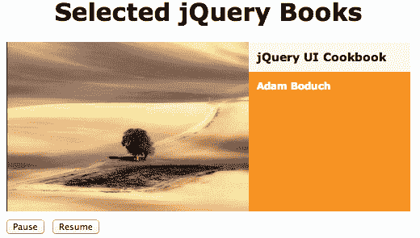

<footer style="margin-top: 5em;">

# 课堂动画

我们在前几章中使用过的三个 CSS 类方法--`.addClass()`、`.removeClass()`和`.toggleClass()`--由 jQuery UI 扩展为动画持续时间的可选第二个参数。指定此持续时间后，页面的行为就好像我们调用了`.animate()`并直接指定了所有样式属性，这些属性由于将类应用于元素而更改：

```js
$(() => {
  $('h1')
    .click((e) => {
      $(e.target).toggleClass('highlighted', 'slow');
    });
});

```

Listing 7.9

通过执行*清单 7.9*中的代码，我们在页眉上单击以添加或删除`highlighted`类。但是，由于我们指定了`slow`速度，因此所产生的颜色、边框和边距更改将动画化，而不是立即生效：


<footer style="margin-top: 5em;">

# 高级宽松

当我们指示 jQuery 在指定的持续时间内执行动画时，它不会以恒定的速率执行。例如，如果我们调用`$('#my-div').slideUp(1000)`，我们知道元素的高度需要整整一秒钟才能达到零；然而，在第二次的开始和结束时，高度将慢慢地改变，在中间，它将迅速改变。这种速率变化称为**缓和**，有助于动画看起来平滑自然。

高级缓解功能改变此加速和减速曲线，以提供独特的效果。例如，`easeInExpo`函数呈指数增长，以动画启动速度的许多倍结束动画。我们可以在任何核心 jQuery 动画方法或 jQuery UI 效果方法中指定自定义的缓和函数。这可以通过向设置对象添加参数或选项来实现，具体取决于所使用的语法。

要看到这一点，我们可以提供`easeInExpo`作为我们刚才在*清单 7.9*中介绍的`.toggleClass()`方法的缓和风格，如下所示：

```js
$(() => { 
  $('h1')
    .click((e) => {
      $(e.target)
        .toggleClass(
          'highlighted',
          'slow',
          'easeInExpo'
        );
    });
});

```

Listing 7.10

现在，每当单击标题时，通过切换 class 属性修改的样式开始逐渐出现，然后突然加速并完成转换。

View easing functions in action
Demonstrations of the full set of easing functions are available at
[http://api.jqueryui.com/easings/](http://api.jqueryui.com/easings/).

<footer style="margin-top: 5em;">

# 附加效应

jQuery UI 中包含的各个效果文件添加了各种过渡，其中一些过渡可能比 jQuery 本身提供的简单滑动和淡入动画要复杂得多。这些效果是通过调用 jQuery UI 添加的`.effect()`方法来调用的。如果需要，可以使用`.show()`或`.hide()`调用导致元素隐藏或显示的效果。

jQueryUI 提供的效果可以用于许多目的。当元素改变形状和位置时，一些元素，如`transfer`和`size`是有用的。其他的，如`explode`和`puff`，提供了有吸引力的隐藏动画。还有一些，包括`pulsate`和`shake`，提请注意一个元素。

View effects in action
All of the jQuery UI effects are showcased at [http://jqueryui.com/effect/#default](http://jqueryui.com/effect/#default).

`shake`行为特别适合于强调某个动作当前不适用。当“恢复”按钮无效时，我们可以在页面上使用此效果：

```js
$(() => {
  $('<button/>')
    .text('Resume')
    .click((e) => {
      const $paused = $('ul:paused');
      if ($paused.length) {
        $paused.cycle('resume');
        $.cookie('cyclePaused', null);
      } else {
        $(e.target)
          .effect('shake', {
            distance: 10
          });
      }
    })
    .appendTo($controls);
});

```

Listing 7.11

我们的新代码检查`$('ul:paused')`的长度，以确定是否有任何暂停的幻灯片需要继续。如果是这样，它会像以前一样调用 Cycle 的`resume`动作；否则，执行`shake`效果。我们在这里看到，`shake`和其他效果一样，具有微调其外观的选项。在这里，我们将效果的`distance`设置为比默认值更小的数字，以使按钮在单击时快速来回抖动。

<footer style="margin-top: 5em;">

# 交互组件

jQueryUI 的下一个主要特性是其交互组件，这是一组可用于生成复杂交互应用程序的行为。例如，一个这样的组件是**可调整大小的**，它允许用户通过自然拖动移动来更改任何元素的大小。

将交互应用到元素就像调用带有其名称的方法一样简单。例如，我们可以通过调用`.resizable()`来调整书名的大小，如下所示：

```js
(() => {
  $books
    .find('.title')
    .resizable();
});

```

Listing 7.12

文档中引用了 jQueryUI 的 CSS 文件，这段代码将在标题框的右下角添加一个调整大小的句柄。拖动此框可更改区域的宽度和高度，如以下屏幕截图所示：


正如我们现在所期望的，这些方法可以通过大量选项进行定制。例如，如果我们希望将调整大小限制为仅在垂直方向上进行，则可以通过指定应添加的拖动手柄来实现，如下所示：

```js
$(() => {
  $books
    .find('.title')
    .resizable({ handles: 's' });
});

```

Listing 7.13

如果拖动控制柄仅位于区域的南部（底部），则只能更改区域的高度：


Other interaction components
Other jQuery UI interactions include Draggable, Droppable, and Sortable. Like Resizable, they are highly configurable. We can view demos of all of them and their configuration options at [http://jqueryui.com/](http://jqueryui.com/).

<footer style="margin-top: 5em;">

# 小部件

除了这些构建块交互组件之外，jqueryui 还包括一些健壮的用户界面小部件，它们的出现和功能都是开箱即用的，就像我们习惯于在桌面应用程序中看到的成熟元素一样。其中有些相当简单。例如，**按钮**小部件通过具有吸引力的样式和滚动状态来增强页面上的按钮和链接。

将此外观和行为授予页面上的所有按钮元素非常简单：

```js
$(() => {
  $('button').button(); 
});

```

Listing 7.14

当引用 jQuery UI 平滑度主题的样式表时，按钮呈现光滑的斜角外观：


和其他 UI 小部件和交互一样，Button 接受几个选项。例如，我们可能希望为我们的两个按钮提供适当的图标；Button 小部件附带了大量预定义的图标，我们可以使用这些图标。为此，我们可以将我们的`.button()`调用分成两个，并为每个调用指定一个图标，如下所示：

```js
$(() => {
  $('<button/>')
    .text('Pause')
    .button({
      icons: { primary: 'ui-icon-pause' }
    })
    .click(() => {
      // ...
    })
    .appendTo($controls);
  $('<button/>')
    .text('Resume')
    .button({
      icons: { primary: 'ui-icon-play' }
    })
    .click((e) => {
      // ...
    })
    .appendTo($controls);
});

```

Listing 7.15

我们指定的`primary`图标对应于 jQueryUI 主题框架中的标准类名。默认情况下，`primary`图标显示在按钮文本的左侧，而`secondary`图标显示在右侧：

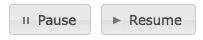

另一方面，其他小部件要复杂得多。**Slider**小部件引入了一个全新的表单元素，类似于 HTML5 范围元素，但与所有流行浏览器交叉兼容。这支持更大程度的自定义，如以下代码所示：

```js
$(() => {
  $('<div/>')
    .attr('id', 'slider')
    .slider({
      min: 0,
      max: $books.find('li').length - 1
    })
    .appendTo($controls);
});

```

Listing 7.16

对`.slider()`的调用将一个简单的`<div>`元素转换为一个滑块小部件。可以通过拖动或按箭头键来控制小部件，以帮助访问：

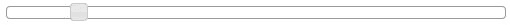

在*清单 7.16*中，我们为滑块指定了`0`的最小值，以及幻灯片中最后一本书的索引的最大值。我们可以将其用作幻灯片放映的手动控制，当幻灯片和滑块各自的状态发生变化时，在两者之间来回发送消息。

为了对滑块的值更改做出反应，我们可以将处理程序绑定到由滑块触发的自定义事件。此事件`slide`不是本机 JavaScript 事件，但其行为类似于 jQuery 代码中的事件。但是，观察这些事件非常常见，我们不需要显式调用`.on()`，只需将事件处理程序添加到`.slider()`调用本身，如下代码所示：

```js
$(() => {
  $('<div/>')
    .attr('id', 'slider')
    .slider({
      min: 0,
      max: $books.find('li').length - 1,
      slide: (e, ui) => {
        $books.cycle(ui.value);
      }
    })
    .appendTo($controls);
});

```

Listing 7.17

无论何时调用`slide`回调，其`ui`参数都会填充有关小部件的信息，包括其当前值。通过将该值传递给 Cycle 插件，我们可以操纵当前显示的幻灯片。

我们还需要在幻灯片放映转到另一张幻灯片时更新滑块小部件。为了在这个方向上沟通，我们可以使用 Cycle 的`before`回调，该回调在每次幻灯片转换之前触发：

```js
$(() => {
  const $books = $('#books').cycle({
    timeout: 2000,
    speed: 200,
    pause: true,
    before: (li) => {
      $('#slider')
        .slider(
          'value',
          $('#books li').index(li)
        );
    }
  });
});

```

Listing 7.18

在`before`回调中，我们再次调用`.slider()`方法。这一次，我们使用`value`作为其第一个参数来调用它，以设置新的滑块值。用 jQueryUI 的说法，我们调用 slider 的`value`方法*方法*，尽管它是通过调用`.slider()`方法而不是通过它自己的专用方法名来调用的。

Other widgets
Other jQuery UI widgets include Datepicker, Dialog, Tabs, and Accordion. Each widget has several associated options, events, and methods. For a full list, visit
[http://jqueryui.com/](http://jqueryui.com/).

<footer style="margin-top: 5em;">

# jQueryUI 主题器

jQueryUI 库最令人兴奋的特性之一是 ThemeRoller，它是一个用于 UI 小部件的基于 web 的交互式主题引擎。ThemeRoller 使创建高度定制、专业外观的元素变得快捷和简单。我们刚刚创建的按钮和滑块应用了默认主题；如果没有提供自定义设置，则此主题将从*ThemeRoller*输出：

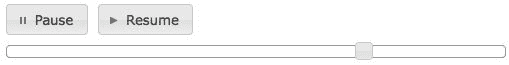

创建一套完全不同的风格只需访问
[即可 http://jqueryui.com/themeroller/](http://jqueryui.com/themeroller/) ，根据需要修改各种选项，并按下下载主题按钮。然后可以将样式表和图像的`.zip`文件解压缩到您的站点目录中。例如，通过选择一些不同的颜色和纹理，我们可以在几分钟内为按钮、图标和滑块创建一个新的协调外观，如以下屏幕截图所示：


<footer style="margin-top: 5em;">

# jQuery 移动插件库

我们已经了解了 jQueryUI 如何帮助我们组装复杂 web 应用程序所需的用户界面特性。它所克服的挑战是多样和复杂的。然而，在为移动设备上的优雅展示和交互准备页面时，存在着一系列不同的障碍。要为现代智能手机和平板电脑创建网站或应用程序，我们可以求助于 jQuery 移动项目。

与 jQuery UI 一样，jQuery Mobile 由一套相关组件组成，这些组件可以*a**按单*使用，但可以无缝地协同工作。该框架提供了一个 Ajax 驱动的导航系统、移动优化交互元素和高级触摸事件处理程序。同样，与 jQueryUI 一样，探索 jQueryMobile 的所有功能是一项艰巨的任务，因此我们将提供一些简单的示例，并参考官方文档了解更多细节。

Downloads, documentation, and demos for jQuery Mobile are available at
[http://jquerymobile.com/](http://jquerymobile.com/).
Our jQuery Mobile example will use Ajax technology, so web server software will be required in order to try these examples. More information is available in [Chapter 6](06.html#40NRU0-fd25fd954efc4043b43c8b05f3cc53ef), *Sending Data with Ajax*.

<footer style="margin-top: 5em;">

# HTML5 自定义数据属性

到目前为止，我们在本章中看到的代码示例都使用了插件公开的 JavaScript API 来调用插件功能。我们已经看到 jQuery 对象方法、全局函数和自定义选择器是插件为脚本提供服务的一些方式。jQuery 移动库也有这些入口点，但与之交互的最常见方式是通过 HTML5 数据属性。

HTML5 规范允许我们在元素中插入我们想要的任何属性，只要该属性的前缀为`data-`。这些属性在呈现页面时被完全忽略，但在 jQuery 脚本中可以使用。当我们在页面上包含 jQuery Mobile 时，脚本会扫描页面中的一些`data-*`属性，并向相应的元素添加移动友好特性。

The jQuery Mobile library looks for a few specific custom data attributes. We will examine more general ways of using this feature in our own scripts in [Chapter 12](12.html#7SN520-fd25fd954efc4043b43c8b05f3cc53ef), *Advanced DOM Manipulation*.

由于这种设计选择，我们将能够在这里演示 jQuery Mobile 的一些强大功能，而无需自己编写任何 JavaScript 代码。

<footer style="margin-top: 5em;">

# 移动导航

jquerymobile 最突出的特性之一是它能够简单地将页面上链接的行为转换为 Ajax 支持的导航。此转换为流程添加了简单的动画，同时保留了标准的浏览器历史导航。要了解这一点，我们将从一个文档开始，该文档提供有关几本书的信息链接（与我们之前构建幻灯片时使用的内容相同），如下所示：

```js
<!DOCTYPE html>  
<html>  
<head>  
  <title>jQuery Book Browser</title>  
  <link rel="stylesheet" href="booklist.css" type="text/css" /> 
  <script src="jquery.js"></script> 
</head>  
<body>  

<div> 
  <div> 
    <h1>Selected jQuery Books</h1> 
  </div> 

  <div> 
    <ul> 
      <li><a href="jq-game.html">jQuery Game Development  
        Essentials</a></li> 
      <li><a href="jqmobile-cookbook.html">jQuery Mobile  
        Cookbook</a></li> 
      <li><a href="jquery-designers.html">jQuery for  
        Designers</a></li> 
      <li><a href="jquery-hotshot.html">jQuery Hotshot</a></li> 
      <li><a href="jqui-cookbook.html">jQuery UI Cookbook</a></li> 
      <li><a href="mobile-apps.html">Creating Mobile Apps with  
        jQuery Mobile</a></li> 
      <li><a href="drupal-7.html">Drupal 7 Development by  
        Example</a></li> 
      <li><a href="wp-mobile-apps.html">WordPress Mobile  
        Applications with PhoneGap</a></li> 
    </ul> 
  </div> 
</div> 

</body> 
</html>

```

In the downloadable code package for this chapter, the finished HTML example page can be found in the file called `mobile.html`.

到目前为止，我们还没有引入 jquerymobile，正如我们所期望的那样，页面是以默认浏览器样式呈现的。这显示在以下屏幕截图中：

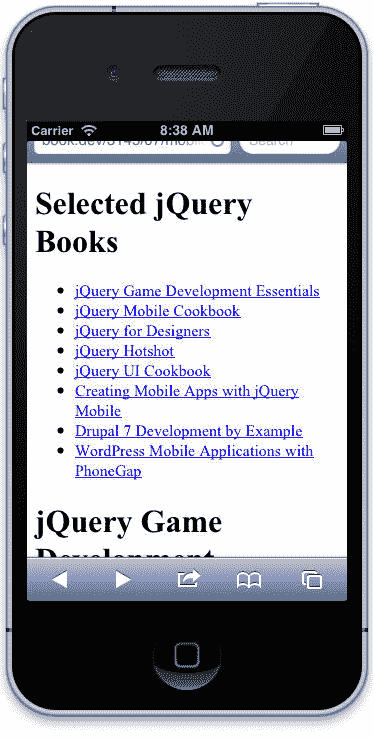

我们的下一步是更改文档的`<head>`部分，以便它引用 jQuery Mobile 及其样式表，如下所示：

```js
<head>  
  <title>jQuery Book Browser</title>  
  <meta name="viewport" 
    content="width=device-width, initial-scale=1">  
  <link rel="stylesheet" href="booklist.css"  
    type="text/css" /> 
  <link rel="stylesheet" 
    href="jquery.mobile/jquery.mobile.css" type="text/css" /> 
  <script src="jquery.js"></script> 
  <script src="jquery-migrate.js"></script>
  <script src="jquery.mobile/jquery.mobile.js"></script> 
</head>

```

注意，我们还引入了一个`<meta>`元素来定义页面的视口。此声明告诉移动浏览器以完全填满设备宽度的方式缩放文档内容。

We have to include the jquery-migrate plugin on the page, because without it, the latest stable version of jQuery doesn't work with the latest stable version of jQuery Mobile. Figure that one out. In any case, once the two officially work together, you can simply remove the jquery-migrate plugin from the page.

jQuery Mobile 样式现在应用于我们的文档，显示更大的无衬线字体，并更新颜色和间距，如以下屏幕截图所示：

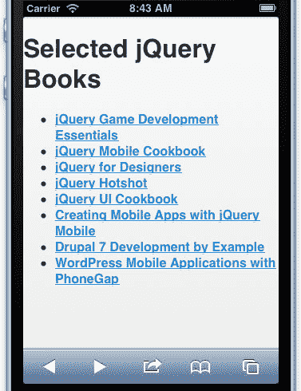

为了正确处理导航，jquerymobile 需要了解页面的结构。我们使用`data-role`属性提供此信息：

```js
<div data-role="page"> 
  <div data-role="header"> 
    <h1>Selected jQuery Books</h1> 
  </div> 

  <div data-role="content"> 
    <ul> 
      <li><a href="jq-game.html">jQuery Game Development  
        Essentials</a></li> 
      <li><a href="jqmobile-cookbook.html">jQuery Mobile  
        Cookbook</a></li> 
      <li><a href="jquery-designers.html">jQuery for  
        Designers</a></li> 
      <li><a href="jquery-hotshot.html">jQuery Hotshot</a></li> 
      <li><a href="jqui-cookbook.html">jQuery UI Cookbook</a></li> 
      <li><a href="mobile-apps.html">Creating Mobile Apps with  
        jQuery Mobile</a></li> 
      <li><a href="drupal-7.html">Drupal 7 Development by  
        Example</a></li> 
      <li><a href="wp-mobile-apps.html">WordPress Mobile  
        Applications with PhoneGap</a></li> 
    </ul> 
  </div> 
</div>

```

现在，当页面加载时，jQuery Mobile 注意到我们有一个页面标题，并在页面顶部呈现一个标准外观的移动标题栏：

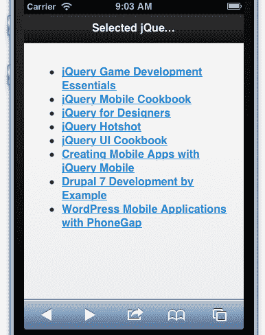

当文本对于标题栏太长时，jQuery Mobile 会将其截断并在末尾添加省略号。在这种情况下，我们可以将移动设备旋转到横向，以查看完整标题：

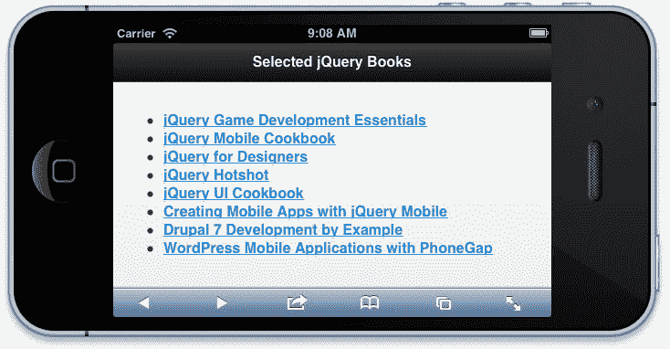

更重要的是，这是生成 Ajax 导航所需的全部内容。在此列表中链接到的页面上，我们使用类似的标记：

```js
<div data-role="page"> 
  <div data-role="header"> 
    <h1>WordPress Mobile Applications with PhoneGap</h1> 
  </div> 
  <div data-role="content"> 
     
    <div class="title">WordPress Mobile Applications with  
      PhoneGap</div> 
    <div class="author">Yuxian Eugene Liang</div> 
  </div> 
</div>

```

当点击指向此页面的链接时，jQuery Mobile 使用 Ajax 调用加载页面，抓取标有`data-role="page"`的文档部分，并使用淡入淡出过渡显示此内容：

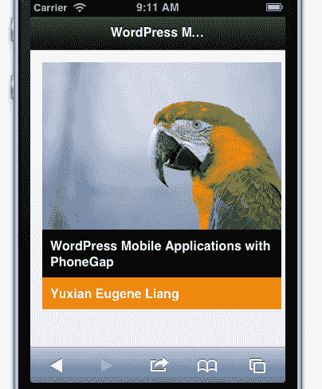

<footer style="margin-top: 5em;">

# 在一个文档中提供多页

除了提供用于加载其他文档的 Ajax 功能外，jQuery Mobile 还提供了一些工具来提供相同的用户体验，即使所有内容都包含在单个文档中。为了实现这一点，我们只需使用标准的`#`符号链接页面内的锚，并用`data-role="page"`标记页面的这些部分，就像它们在单独的文档中一样，如下所示：

```js
<div data-role="page"> 
  <div data-role="header"> 
    <h1>Selected jQuery Books</h1> 
  </div> 

  <div data-role="content"> 
    <ul> 
      <li><a href="#jq-game">jQuery Game Development  
        Essentials</a></li> 
      <li><a href="#jqmobile-cookbook">jQuery Mobile  
        Cookbook</a></li> 
      <li><a href="#jquery-designers">jQuery for  
        Designers</a></li> 
      <li><a href="#jquery-hotshot">jQuery Hotshot</a></li> 
      <li><a href="#jqui-cookbook">jQuery UI Cookbook</a></li> 
      <li><a href="#mobile-apps">Creating Mobile Apps with jQuery  
        Mobile</a></li> 
      <li><a href="#drupal-7">Drupal 7 Development by  
        Example</a></li> 
      <li><a href="wp-mobile-apps.html">WordPress Mobile  
        Applications with PhoneGap</a></li> 
    </ul> 
  </div> 
</div> 

<div id="jq-game" data-role="page"> 
  <div data-role="header"> 
    <h1>jQuery Game Development Essentials</h1> 
  </div> 
  <div data-role="content"> 
     
    <div class="title">jQuery Game Development Essentials</div> 
    <div class="author">Salim Arsever</div> 
  </div> 
</div>

```

我们可以在方便的时候自由选择这两种技术。将内容放在单独的文档中可以使我们推迟信息的加载，直到需要时再加载，但由于多个页面请求，会导致更高的开销。

<footer style="margin-top: 5em;">

# 互动元素

jquerymobile 提供的大部分功能都是在页面上使用的特定交互元素。这些元素增强了基本的网页功能，使页面组件对于触摸界面更加用户友好。这些元素包括手风琴风格的可折叠部分、拨动开关、滑动面板和响应式桌子。

There is considerable overlap between the user interface elements offered by jQuery UI and jQuery Mobile. It is not recommended to use the two libraries together on the same page, but because the most important widgets are offered by both, there is rarely a need to do so.

<footer style="margin-top: 5em;">

# 列表视图

由于智能手机的小屏幕、垂直屏幕布局，其应用程序通常是列表驱动的。我们可以使用 jQuery Mobile 轻松增强页面上的列表，使其行为更像这些常见的本地应用程序元素。我们再次简单介绍 HTML5 自定义数据属性：

```js
<ul data-role="listview" data-inset="true"> 
  <li><a href="#jq-game">jQuery Game Development  
    Essentials</a></li> 
  <li><a href="#jqmobile-cookbook">jQuery Mobile Cookbook</a></li> 
  <li><a href="#jquery-designers">jQuery for Designers</a></li> 
  <li><a href="#jquery-hotshot">jQuery Hotshot</a></li> 
  <li><a href="#jqui-cookbook">jQuery UI Cookbook</a></li> 
  <li><a href="#mobile-apps">Creating Mobile Apps with jQuery  
    Mobile</a></li> 
  <li><a href="#drupal-7">Drupal 7 Development by Example</a></li> 
  <li><a href="wp-mobile-apps.html">WordPress Mobile Applications  
    with PhoneGap</a></li> 
</ul>

```

添加`data-role="listview"`告诉 jQuery Mobile 让该列表中的链接变大，并且在触摸界面上用手指就可以轻松激活，而`data-inset="true"`则给列表提供了一个很好的边框，将其与周围的内容分开。结果是一个熟悉的本地控件，如下所示：

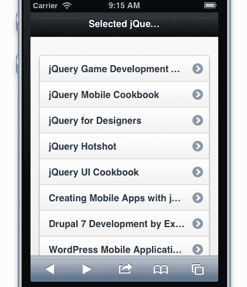

现在，我们有大的触摸目标，但我们可以更进一步。移动应用程序中类似的列表视图通常与搜索字段配对，以缩小列表中的项目范围。我们可以通过引入`data-filter`属性来添加这样一个字段，如下所示：

```js
<ul data-role="listview" data-inset="true" data-filter="true">

```

结果是一个带有适当图标的圆形输入框，位于列表上方：

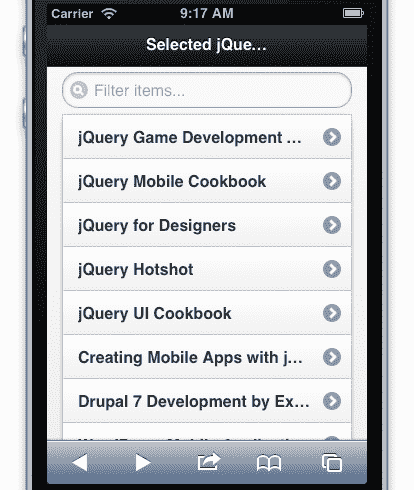

此搜索字段不仅看起来是本地的，而且行为也正确，即使我们没有添加自己的代码：

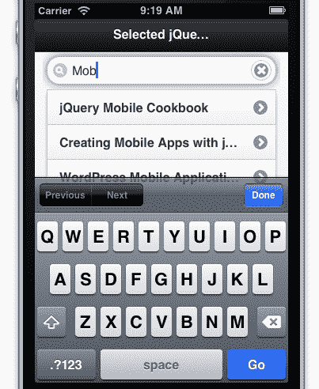

<footer style="margin-top: 5em;">

# 工具栏按钮

jQuery Mobile 增强的另一个用户界面元素是简单按钮。正如 jqueryui 允许我们标准化按钮外观一样，jquerymobile 增加了按钮的大小并修改了按钮的外观，以优化它们的触摸输入。

在某些情况下，jquerymobile 甚至为我们创建了以前没有的按钮。例如，移动应用程序的工具栏中经常有按钮。一个标准按钮是屏幕左上角的后退按钮，允许用户向上导航一个级别。如果我们将`data-add-back-btn`属性添加到页面`<div>`元素中，则无需任何脚本工作即可实现此功能：

```js
<div data-role="page" data-add-back-btn="true">

```

添加此属性后，标准的后退按钮将添加到我们导航到的每个页面的工具栏中：

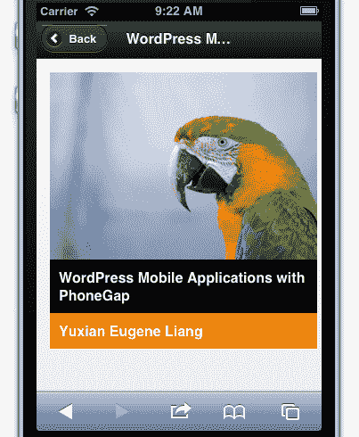

A complete listing of HTML5 data attributes for initializing and configuring jQuery Mobile widgets can be found at [http://jquerymobile.com/](http://jquerymobile.com/).

<footer style="margin-top: 5em;">

# 高级功能

由于我们的移动页面需要更多定制的设计元素和更复杂的交互，jQuery mobile 提供了强大的工具来帮助我们创建它们。所有功能都记录在 jQuery 移动站点（[上 http://jquerymobile.com/](http://jquerymobile.com/) ）。虽然这些功能过于先进，数量太多，无法在此详细讨论，但有几个值得一提：

*   **手机友好事件**：当页面上引用 jQuery Mobile 时，我们的 jQuery 代码可以访问许多特殊事件，包括`tap`、`taphold`、`swipe`。这些事件的处理程序可以使用与任何其他事件相同的`.on()`方法绑定。特别是对于`taphold`和`swipe`，可以通过访问`$.event.special.taphold`和`$.event.special.swipe`对象的属性来修改它们的默认配置，包括触摸持续时间。除了基于触摸的事件外，jQuery Mobile 还提供了对滚动、方向更改和页面导航各个阶段做出反应的特殊事件，以及一组对鼠标和触摸做出反应的虚拟化鼠标事件。
*   **主题化**：与 jQueryUI 一样，jQueryMobile 提供主题化
    （[）http://jquerymobile.com/themeroller/](http://jquerymobile.com/themeroller/) 用于定制小部件的外观和感觉。
*   **PhoneGap 集成**：使用 jQuery Mobile 构建的网站很容易使用 PhoneGap（Cordova）转换为本机移动应用程序，可以访问移动设备 API（如摄像头、加速计和地理位置）和应用商店。`$.support.cors`和`$.mobile.allowCrossDomainPages`属性甚至可以允许访问应用程序中不包含的页面，例如远程服务器上的页面。

<footer style="margin-top: 5em;">

# 总结

在本章中，我们研究了将第三方插件合并到网页中的方法。我们仔细研究了 Cycle 插件、jQueryUI 和 jQueryMobile，并在此过程中了解了我们将在其他插件中多次遇到的模式。在下一章中，我们将利用 jQuery 的插件体系结构开发几种不同类型的插件。

<footer style="margin-top: 5em;">

# 练习

1.  将“循环过渡持续时间”增加到半秒，并更改动画，使每张幻灯片在下一张幻灯片淡入之前淡出。请参阅循环文档以找到启用此功能的适当选项。
2.  将`cyclePaused`cookie 设置为持续 30 天。
3.  将标题框约束为仅以十个像素为增量调整大小。
4.  随着幻灯片放映的进行，使滑块从一个位置平滑地设置动画到下一个位置。
5.  不要让幻灯片永远循环，而是让它在最后一张幻灯片显示后停止。发生这种情况时禁用按钮和滑块。
6.  创建一个新的 jQueryUI 主题，该主题具有浅蓝色小部件背景和深蓝色文本，并将该主题应用于示例文档。
7.  修改`mobile.html`中的 HTML，使列表视图被图书标题的前几个字母分割。详见`data-role="list-divider"`的 jQuery 移动文档。

</footer>

</footer>

</footer>

</footer>

</footer>

</footer>

</footer>

</footer>

</footer>

</footer>

</footer>

</footer>

</footer>

</footer>

</footer>

</footer>

</footer>

</footer>

</footer>

</footer>

</footer>

</footer>

</footer>

</footer>

</footer>

</footer>

</footer>