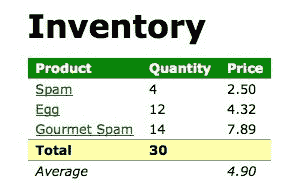

# 八、开发插件

可用的第三方插件提供了一系列选项来增强我们的编码体验，但有时我们需要更进一步。当我们编写的代码可以被其他人甚至我们自己重用时，我们可能希望将其打包为一个新插件。幸运的是，开发插件的过程并不比编写使用插件的代码复杂多少。

在本章中，我们将介绍：

*   在`jQuery`命名空间中添加新的全局函数
*   添加允许我们对 DOM 元素进行操作的 jQuery 对象方法
*   使用 jQuery UI 小部件工厂创建小部件插件
*   分发插件

<footer style="margin-top: 5em;">

# 在插件中使用美元（$）别名

在编写 jQuery 插件时，我们必须假设 jQuery 库已加载。但是，我们不能假设美元（`<footer style="margin-top: 5em;"别名可用。回想[第三章](03.html#1P71O0-fd25fd954efc4043b43c8b05f3cc53ef)*处理事件*中`$.noConflict()`方法可以放弃对该快捷方式的控制。为了说明这一点，我们的插件应该始终使用完整的 jQuery 名称调用 jQuery 方法，或者在内部定义`<footer style="margin-top: 5em;"本身。

特别是在较大的插件中，许多开发人员发现缺少美元（`<footer style="margin-top: 5em;"快捷方式）使代码更难阅读。为了解决这个问题，可以通过定义一个函数并立即调用它，在本地为插件的作用域定义快捷方式。这种用于同时定义和调用函数的语法，通常称为**立即调用函数表达式**（**IIFE**），如下所示：

```js
(($) => { 
  // Code goes here 
})(jQuery); 

```

包装函数接受一个参数，我们将全局`jQuery`对象传递给该参数。参数名为`<footer style="margin-top: 5em;"，因此在函数中可以使用美元（`<footer style="margin-top: 5em;"别名，没有冲突。

<footer style="margin-top: 5em;">

# 添加新的全局函数

jQuery 的一些内置功能是通过我们所称的全局函数提供的。正如我们所看到的，这些实际上是 jQuery 对象的方法，但实际上，它们是`jQuery`名称空间中的函数。

这种技术的一个主要例子是`$.ajax()`函数。`$.ajax()`所做的一切都可以通过一个名为`ajax()`的常规全局函数来完成，但这种方法会让我们面临函数名冲突的问题。通过将函数放置在`jQuery`名称空间中，我们只需担心与其他 jQuery 方法的冲突。这个`jQuery`名称空间还向那些可能使用该插件的人发出信号，即 jQuery 库是必需的。

核心 jQuery 库提供的许多全局函数都是实用方法；也就是说，它们为经常需要但不难手工完成的任务提供了快捷方式。阵列处理函数`$.each()`、`$.map()`和`$.grep()`就是这些函数的好例子。为了说明这些实用程序方法的创建，我们将在它们的数量上添加两个简单的函数。

要向`jQuery`名称空间添加函数，我们只需将新函数指定为`jQuery`对象的属性：

```js
(($) => { 
  $.sum = (array) => { 
    // Code goes here 
  }; 
})(jQuery); 

```

Listing 8.1

现在，在使用此插件的任何代码中，我们都可以编写：

```js
$.sum(); 

```

这将像一个基本函数调用一样工作，函数中的代码将被执行。

此`sum`方法将接受一个数组，将数组中的值相加，然后返回结果。我们插件的代码非常简单：

```js
(($) => {
  $.sum = array =>
    array.reduce(
      (result, item) =>
        parseFloat($.trim(item)) + result,
      0
    );
})(jQuery); 

```

Listing 8.2

为了计算总和，我们在数组上调用`reduce()`，它只需迭代数组中的每个项，并将其添加到`result`中。在前面的代码中，有两个返回值的回调函数。它们都没有`return`语句，因为它们是箭头函数。当我们不包括花括号（`{}`时，返回值是隐式的。

为了测试我们的插件，我们将构建一个简单的表，其中包含食品清单：

```js
<table id="inventory"> 
  <thead> 
    <tr class="one"> 
      <th>Product</th> <th>Quantity</th> <th>Price</th> 
    </tr> 
  </thead> 
  <tfoot> 
    <tr class="two" id="sum"> 
      <td>Total</td> <td></td> <td></td> 
    </tr> 
    <tr id="average"> 
      <td>Average</td> <td></td> <td></td> 
    </tr> 
  </tfoot> 
  <tbody> 
    <tr> 
      <td><a href="spam.html" data-tooltip-text="Nutritious and        
      delicious!">Spam</a></td> <td>4</td> <td>2.50</td> 
    </tr> 
    <tr> 
      <td><a href="egg.html" data-tooltip-text="Farm fresh or        
      scrambled!">Egg</a></td> <td>12</td> <td>4.32</td> 
    </tr> 
    <tr> 
      <td><a href="gourmet-spam.html" data-tooltip-text="Chef        
      Hermann's recipe.">Gourmet Spam</a></td> <td>14</td> <td>7.89         
      </td> 
    </tr> 
  </tbody> 
</table> 

```

Getting the example code
You can access the example code from the following GitHub repository: [https://github.com/PacktPublishing/Learning-jQuery-3](https://github.com/PacktPublishing/Learning-jQuery-3). 

现在，我们将编写一个简短的脚本，用所有数量的总和填充相应的表尾单元格：

```js
$(() => {
  const quantities = $('#inventory tbody')
    .find('td:nth-child(2)')
    .map((index, qty) => $(qty).text())
    .get();
  const sum = $.sum(quantities);

  $('#sum')
    .find('td:nth-child(2)')
    .text(sum);
});

```

Listing 8.3

查看呈现的 HTML 页面可验证我们的插件是否正常工作：


<footer style="margin-top: 5em;">

# 添加多个函数

如果我们的插件需要提供多个全局函数，我们可以独立声明它们。在这里，我们将修改插件，添加一个函数来计算数字数组的平均值：

```js
(($) => {
  $.sum = array =>
    array.reduce(
      (result, item) =>
        parseFloat($.trim(item)) + result,
      0
    );

  $.average = array =>
    Array.isArray(array) ?
      $.sum(array) / array.length :
      '';
})(jQuery); 

```

Listing 8.4

为了方便和简洁，我们使用`$.sum()`插件来帮助我们返回`$.average()`的值。为了减少出错的机会，在计算平均值之前，我们还检查参数以确保它是一个数组。

现在定义了第二个方法，我们可以用同样的方式调用它：

```js
$(() => {
  const $inventory = $('#inventory tbody');
  const prices = $inventory
    .find('td:nth-child(3)')
    .map((index, qty) => $(qty).text())
    .get();
  const average = $.average(prices);

  $('#average')
    .find('td:nth-child(3)')
    .text(average.toFixed(2));
});

```

Listing 8.5

平均值现在显示在第三列：



<footer style="margin-top: 5em;">

# 扩展全局 jQuery 对象

在使用`$.extend()`函数定义函数时，我们也可以使用另一种语法：

```js
(($) => {
  $.extend({
    sum: array =>
      array.reduce(
        (result, item) =>
          parseFloat($.trim(item)) + result,
        0
      ),
    average: array =>
      Array.isArray(array) ?
        $.sum(array) / array.length :
        ''
  });
})(jQuery); 

```

Listing 8.6

当以这种方式调用时，`$.extend()`添加或替换全局 jQuery 对象的属性。因此，这将产生与先前技术相同的结果。

<footer style="margin-top: 5em;">

# 隔离名称空间中的函数

我们的插件现在在`jQuery`名称空间中创建了两个单独的全局函数。然而，我们面临着另一种名称空间污染的风险；我们仍然可能与其他 jQuery 插件中定义的函数名发生冲突。为了避免这种情况，最好将给定插件的所有全局函数封装到单个对象中：

```js
(($) => {
  $.mathUtils = {
    sum: array =>
      array.reduce(
        (result, item) =>
          parseFloat($.trim(item)) + result,
        0
      ),
    average: array =>
      Array.isArray(array) ?
        $.mathUtils.sum(array) / array.length :
        ''
  };
})(jQuery); 

```

Listing 8.7

这种模式实质上为我们的全局函数创建了另一个名称空间，称为`jQuery.mathUtils`。尽管我们仍然非正式地称这些函数为全局函数，但它们现在是`mathUtils`对象的方法，而`mathUtils`对象本身就是全局 jQuery 对象的一个属性。因此，我们必须在函数调用中包含插件名称：

```js
$.mathUtils.sum(array); 
$.mathUtils.average(array); 

```

通过这种技术（以及一个足够独特的插件名称），我们可以在全局函数中避免名称空间冲突。现在，我们的剧目中有了插件开发的基础知识。将我们的函数保存在名为`jquery.mathutils.js`的文件中后，我们可以包含此脚本并使用页面上其他脚本中的函数。

Choosing a namespace
For functions that are solely for personal use, it often makes more sense to place them within our own project's global namespace. So, instead of using `jQuery`, we may instead choose to expose one global object of our own. We could, for example, have a global object called `ljQ` and define the `ljQ.mathUtils.sum()` and `ljQ.mathUtils.average()` methods instead of `$.mathUtils.sum()` and `$.mathUtils.average()`. This way, we completely remove the chance of namespace collisions with third-party plugins that we choose to include.

因此，我们现在看到了 jQuery 插件提供的名称空间保护和有保证的库可用性。不过，这些只是组织上的好处。要真正利用 jQuery 插件的强大功能，我们需要学习如何在单个 jQuery 对象实例上创建新方法。

<footer style="margin-top: 5em;">

# 添加 jQuery 对象方法

jQuery 的大部分内置功能都是通过其对象实例方法提供的，这也是插件发挥作用的地方。每当我们编写一个作用于 DOM 一部分的函数时，创建一个**实例方法**可能是合适的。

我们已经看到，添加全局函数需要使用新方法扩展`jQuery`对象。添加实例方法类似，但我们扩展了`jQuery.fn`对象：

```js
jQuery.fn.myMethod = function() { 
  alert('Nothing happens.'); 
}; 

```

The `jQuery.fn` object is an alias to `jQuery.prototype`, provided for conciseness.

然后，我们可以在使用任何选择器表达式后从代码中调用此新方法：

```js
$('div').myMethod(); 

```

当我们调用该方法时，将显示我们的警报（文档中的每个`<div>`显示一次）。不过，我们也可以编写一个全局函数，因为我们没有以任何方式使用匹配的 DOM 节点。一个合理的方法实现根据其上下文进行操作。

<footer style="margin-top: 5em;">

# 对象方法上下文

在任何插件方法中，关键字`this`被设置为当前 jQuery 对象。因此，我们可以在`this`上调用任何内置的 jQuery 方法，或者提取其 DOM 节点并处理它们。为了研究如何处理对象上下文，我们将编写一个小插件来操作匹配元素上的类。

我们的新方法将采用两个类名，并在每次调用时交换应用于每个元素的类。虽然 jQuery UI 有一个健壮的`.switchClass()`方法，甚至允许设置类更改的动画，但出于演示目的，我们将提供一个简单的实现：

```js
(function($) {
  $.fn.swapClass = function(class1, class2) {
    if (this.hasClass(class1)) {
      this
        .removeClass(class1)
        .addClass(class2);
    } else if (this.hasClass(class2)) {
      this
        .removeClass(class2)
        .addClass(class1);
    }
  };
})(jQuery);

$(() => {
  $('table')
    .click(() => {
      $('tr').swapClass('one', 'two');
    });
});

```

Listing 8.8

在我们的插件中，我们首先测试匹配元素上是否存在`class1`，如果发现，则替换`class2`。否则，我们测试`class2`并在必要时切换`class1`。如果两个班级都不在，我们什么也不做。

在使用插件的代码中，我们将一个`click`处理程序绑定到表中，在单击表时对每一行调用`.swapClass()`。我们希望这会将标题行的类从`one`更改为`two`，并将 sum 行的类从`two`更改为`one`。

然而，我们观察到一个不同的结果：


每行都收到了`two`类。要解决这个问题，我们需要正确处理具有多个选定元素的 jQuery 对象。

<footer style="margin-top: 5em;">

# 隐式迭代

我们需要记住，jQuery 选择器表达式始终可以匹配零个、一个或多个元素。在设计插件方法时，我们必须考虑其中任何一种情况。在本例中，我们调用`.hasClass()`，它只检查第一个匹配的元素。相反，我们需要独立地检查每个元素并对其采取行动。

无论匹配元素的数量如何，保证正确行为的最简单方法是始终在方法上下文上调用`.each()`；这将强制隐式迭代，这对于保持插件和内置方法之间的一致性非常重要。在`.each()`回调函数中，第二个参数依次引用每个 DOM 元素，因此我们可以调整代码，对每个匹配的元素分别测试并应用类：

```js
(function($) {
  $.fn.swapClass = function(class1, class2) {
    this
      .each((i, element) => {
        const $element = $(element);

        if ($element.hasClass(class1)) {
          $element
            .removeClass(class1)
            .addClass(class2);
        } else if ($element.hasClass(class2)) {
          $element
            .removeClass(class2)
            .addClass(class1);
        }
      });
  };
})(jQuery); 

```

Listing 8.9

现在，当我们单击表时，将切换类，而不会影响两个类都未应用的行：


<footer style="margin-top: 5em;">

# 启用方法链接

除了隐式迭代之外，jQuery 用户还应该能够依赖链接行为。这意味着我们需要从所有插件方法返回一个 jQuery 对象，除非该方法显然是为了检索不同的信息。返回的 jQuery 对象通常只是作为`this`提供的对象。如果我们使用`.each()`对`this`进行迭代，我们只需返回其结果：

```js
(function($) {
  $.fn.swapClass = function(class1, class2) {
    return this
      .each((i, element) => {
        const $element = $(element);

        if ($element.hasClass(class1)) {
          $element
            .removeClass(class1)
            .addClass(class2);
        } else if ($element.hasClass(class2)) {
          $element
            .removeClass(class2)
            .addClass(class1);
        }
      });
  };
})(jQuery); 

```

Listing 8.10

以前，当我们调用`.swapClass()`时，我们必须开始一个新的语句来处理元素。不过，有了`return`语句，我们可以自由地将插件方法与内置方法链接起来。

<footer style="margin-top: 5em;">

# 提供灵活的方法参数

在[第 7 章](07.html#4KONO0-fd25fd954efc4043b43c8b05f3cc53ef)*使用插件*中，我们看到了一些插件，可以通过使用参数进行微调，以实现我们想要的功能。我们看到一个构造巧妙的插件通过提供可独立覆盖的合理默认值来帮助我们。当我们制作自己的插件时，我们应该遵循这个例子，记住用户。

为了探索让插件的用户自定义其行为的各种方式，我们需要一个示例，其中有几个可以调整和修改的设置。作为我们的示例，我们将通过使用一种更为暴力的 JavaScript 方法来复制 CSS 的一个特性——这种方法更适合于演示，而不适合于生产代码。我们的插件将通过在页面的不同位置创建一些部分透明的副本来模拟元素上的阴影：

```js
(function($) {
  $.fn.shadow = function() {
    return this.each((i, element) => {
      const $originalElement = $(element);

      for (let i = 0; i < 5; i++) {
        $originalElement
          .clone()
          .css({
            position: 'absolute',
            left: $originalElement.offset().left + i,
            top: $originalElement.offset().top + i,
            margin: 0,
            zIndex: -1,
            opacity: 0.1
          })
          .appendTo('body');
      }
    });
  };
})(jQuery); 

```

Listing 8.11

对于调用此方法的每个元素，我们都会对元素进行大量克隆，调整其不透明度。这些克隆绝对位于原始元素的不同偏移处。目前，我们的插件不接受任何参数，因此调用该方法很简单：

```js
$(() => { 
  $('h1').shadow(); 
}); 

```

此方法调用在标题文本上产生非常简单的阴影效果：


接下来，我们可以为插件方法引入一些灵活性。方法的操作依赖于用户可能想要修改的几个数值。我们可以将这些转换为参数，以便根据需要进行更改。

<footer style="margin-top: 5em;">

# 选项对象

在 jQueryAPI 中，我们已经看到了许多例子，`options`对象被提供为`.animate()`和`$.ajax()`等方法的参数。与我们刚刚使用的`.swapClass()`插件的简单参数列表相比，这是一种向插件用户公开选项的更友好的方式。对象文字为每个参数提供了一个可视标签，还使参数的顺序不相关。此外，任何时候我们可以在插件中模拟 jQueryAPI，我们都应该这样做。这将提高一致性，从而便于使用：

```js
(($) => {
  $.fn.shadow = function(options) {
    return this.each((i, element) => {
      const $originalElement = $(element);

      for (let i = 0; i < options.copies; i++) {
        $originalElement
          .clone()
          .css({
            position: 'absolute',
            left: $originalElement.offset().left + i,
            top: $originalElement.offset().top + i,
            margin: 0,
            zIndex: -1,
            opacity: options.opacity
          })
          .appendTo('body');
      }
    });
  };
})(jQuery);

```

Listing 8.12

复制的数量及其不透明度现在可以自定义。在我们的插件中，每个值都作为函数的`options`参数的属性进行访问。

现在调用此方法需要我们提供一个包含选项值的对象：

```js
$(() => {
  $('h1')
    .shadow({ 
      copies: 3, 
      opacity: 0.25 
    }); 
}); 

```

可配置性是一个改进，但我们现在每次都必须提供这两个选项。接下来，我们将看看如何允许我们的插件用户省略这两个选项。

<footer style="margin-top: 5em;">

# 默认参数值

随着一个方法的参数数量的增加，我们不太可能总是希望指定每个参数。一组合理的默认值可以使插件接口更加可用。幸运的是，使用对象传入参数有助于完成此任务；从对象中省略任何项并用默认值替换它很简单：

```js
(($) => {
  $.fn.shadow = function(opts) {
    const defaults = {
      copies: 5,
      opacity: 0.1
    };
    const options = $.extend({}, defaults, opts); 

    // ... 
  }; 
})(jQuery); 

```

Listing 8.13

在这里，我们定义了一个名为`defaults`的新对象。实用函数`$.extend()`允许我们将提供的`opts`对象作为参数，并在必要时使用`defaults`创建一个新的`options`对象。`extend()`函数将传递给它的任何对象合并到第一个参数中。这就是为什么我们传递了一个空对象作为第一个参数，以便我们为选项创建一个新对象，而不是意外地破坏现有数据。例如，如果在代码中的其他地方定义了默认值，而我们意外地替换了它的值，该怎么办？

我们仍然使用对象文本调用我们的方法，但现在我们只能指定需要采用不同于默认值的参数：

```js
$(() => { 
  $('h1')
    .shadow({ 
      copies: 3 
    }); 
}); 

```

未指定的参数使用其默认值。`$.extend()`方法甚至接受空值，因此如果默认参数都可以接受，则可以调用我们的方法而不会产生 JavaScript 错误：

```js
$(() => { 
  $('h1').shadow(); 
}); 

```

<footer style="margin-top: 5em;">

# 回调函数

当然，有些方法参数可能比简单的数值更复杂。我们在 jQueryAPI 中经常看到的一种常见参数类型是回调函数。回调函数可以为插件提供灵活性，而无需在创建插件时做大量准备。

要在我们的方法中使用回调函数，我们需要简单地接受函数对象作为参数，并在方法实现中的适当位置调用该函数。例如，我们可以扩展文本阴影方法，允许用户自定义阴影相对于文本的位置：

```js
(($) => {
  $.fn.shadow = function(opts) {
    const defaults = {
      copies: 5,
      opacity: 0.1,
      copyOffset: index => ({
        x: index,
        y: index
      })
    };
    const options = $.extend({}, defaults, opts);

    return this.each((i, element) => {
      const $originalElement = $(element);

      for (let i = 0; i < options.copies; i++) {
        const offset = options.copyOffset(i);

        $originalElement
          .clone()
          .css({
            position: 'absolute',
            left: $originalElement.offset().left + offset.x,
            top: $originalElement.offset().top + offset.y,
            margin: 0,
            zIndex: -1,
            opacity: options.opacity
          })
          .appendTo('body');
      }
    });
  };
})(jQuery);

```

Listing 8.14

阴影的每个部分与原始文本的偏移量不同。以前，此偏移量仅等于副本的索引。现在，我们使用`copyOffset()`函数计算偏移量，这是一个用户可以覆盖的选项。例如，我们可以为两个维度的偏移量提供负值：

```js
$(() => { 
  $('h1').shadow({ 
    copyOffset: index => ({
      x: -index,
      y: -2 * index
    }) 
  }); 
}); 

```

这将导致阴影向上投射到左侧，而不是向下投射到右侧：


回调允许对阴影的方向进行简单的修改，如果插件用户提供适当的回调，则可以进行更复杂的定位。如果未指定回调，则再次使用默认行为。

<footer style="margin-top: 5em;">

# 可自定义默认值

正如我们所看到的，我们可以通过为方法参数提供合理的默认值来改善使用插件的体验。然而，有时很难预测合理的默认值。如果脚本作者需要多次调用我们的插件，并且调用的参数集与我们设置为默认值的参数集不同，那么定制这些默认值的功能可以显著减少需要编写的代码量。

要使默认值可自定义，我们需要将它们从方法定义中移到外部代码可以访问的位置：

```js
(() => { 
  $.fn.shadow = function(opts) { 
    const options = $.extend({}, $.fn.shadow.defaults, opts); 
    // ... 
  }; 

  $.fn.shadow.defaults = { 
    copies: 5, 
    opacity: 0.1, 
    copyOffset: index => ({
      x: index,
      y: index
    }) 
  }; 
})(jQuery); 

```

Listing 8.15

默认值现在位于 shadow 插件的名称空间中，可以直接通过`$.fn.shadow.defaults`引用。现在，使用我们插件的代码可以更改所有后续调用`.shadow()`将使用的默认值。在调用该方法时，仍然可以提供选项：

```js
$(() => { 
  $.fn.shadow.defaults.copies = 10;
  $('h1')
    .shadow({
      copyOffset: index => ({
        x: -index,
        y: index
    })
  });
}); 

```

此脚本将使用元素的`10`副本创建阴影，因为这是新的默认值，但也会将阴影投射到左侧和下方，因为方法调用中提供了`copyOffset`回调：


<footer style="margin-top: 5em;">

# 使用 jQueryUI 小部件工厂创建插件

正如我们在[第 7 章](07.html#4KONO0-fd25fd954efc4043b43c8b05f3cc53ef)中看到的，*使用插件*，jQuery UI 有各种各样的小部件——这些插件表示特定类型的 UI 元素，如按钮或滑块。这些小部件为 JavaScript 程序员提供了一致的 API。这种一致性使学习使用一个更容易。当我们正在编写的插件将创建新的用户界面元素时，使用小部件插件扩展 jqueryui 库通常是正确的选择。

小部件是一项复杂的功能，但幸运的是，我们在创建小部件时并没有被留给自己的设备。jQueryUI 核心包含一个名为`$.widget()`的`factory`方法，它为我们做了大量工作。使用此工厂将有助于确保我们的代码符合所有 jQueryUI 小部件共享的 API 标准。

我们使用 widget 工厂创建的插件有很多不错的特性。我们几乎不费吹灰之力就能获得所有这些福利（以及更多）：

*   插件变成**状态**，这意味着我们可以在应用插件后检查、更改甚至完全反转插件的效果
*   用户提供的选项将自动与可自定义的默认选项合并
*   多个插件方法无缝地组合到一个 jQuery 方法中，接受一个字符串来标识调用哪个子方法
*   由插件触发的自定义事件处理程序可以访问小部件实例的数据

事实上，这些优点非常好，我们可能希望使用 widget 工厂来构建任何适当复杂的插件，与 UI 相关的插件或其他插件。

<footer style="margin-top: 5em;">

# 创建小部件

在我们的示例中，我们将制作一个插件，向元素添加自定义工具提示。一个简单的工具提示实现为页面上的每个元素创建一个`<div>`容器，当鼠标光标悬停在目标上时，该容器将获得工具提示并将该容器放置在元素旁边。

The jQuery UI library contains its own built-in tooltip widget that is more advanced than the one we'll develop here. Our new widget will override the built-in `.tooltip()` method, which is not something we would likely do in a real project, but it will allow us to demonstrate several important concepts without needless complexity.

每次调用`$.widget()`时，小部件工厂都会创建一个 jQuery UI 插件。此函数接受小部件的名称和包含小部件属性的对象。小部件的名称必须具有名称空间；我们将使用名称空间`ljq`和插件名称`tooltip`。因此，我们的插件将通过在 jQuery 对象上调用`.tooltip()`来调用。

我们将定义的第一个小部件属性是`._create()`：

```js
(($) => {
  $.widget('ljq.tooltip', {
    _create() {
      this._tooltipDiv = $('<div/>')
        .addClass([
          'ljq-tooltip-text',
          'ui-widget',
          'ui-state-highlight',
          'ui-corner-all'
        ].join(' '))
        .hide()
        .appendTo('body');
      this.element
        .addClass('ljq-tooltip-trigger')
        .on('mouseenter.ljq-tooltip', () => { this._open(); })
        .on('mouseleave.ljq-tooltip', () => { this._close(); });
    }
  });
})(jQuery); 

```

Listing 8.16

此属性是一个函数，每当调用`.tooltip()`时，小部件工厂将调用该函数，jQuery 对象中每个匹配元素调用一次。

Widget properties, such as `_create`, which begin with an underscore, are considered private. We will discuss public functions later.

在这个创建函数中，我们为将来的显示设置了工具提示。为此，我们创建新的`<div>`元素并将其添加到文档中。我们将创建的元素存储在`this._tooltipDiv`中，以供以后使用。

在我们的函数上下文中，`this`指的是当前的小部件实例，我们可以向这个对象添加我们想要的任何属性。该对象具有一些内置属性，对我们来说也很方便；特别是，`this.element`为我们提供了一个 jQuery 对象，指向最初选择的元素。

我们使用`this.element`将`mouseenter`和`mouseleave`处理程序绑定到工具提示触发器元素。我们需要这些处理程序在鼠标开始悬停在触发器上时打开工具提示，在鼠标离开时关闭工具提示。请注意，事件的名称空间与插件的名称相同。正如我们在[第 3 章](03.html#1P71O0-fd25fd954efc4043b43c8b05f3cc53ef)*处理事件*中所讨论的，名称空间使我们可以更轻松地添加和删除事件处理程序，而无需触及其他也希望将处理程序绑定到元素的代码。

接下来，我们需要定义绑定到`mouseenter`和`mouseleave`处理程序的`._open()`和`._close()`方法：

```js
(() => { 
  $.widget('ljq.tooltip', { 
    _create() { 
      // ... 
    }, 

    _open() {
      const elementOffset = this.element.offset();
      this._tooltipDiv
        .css({
          position: 'absolute',
          left: elementOffset.left,
          top: elementOffset.top + this.element.height()
        })
        .text(this.element.data('tooltip-text'))
        .show();
    },

    _close() { 
      this._tooltipDiv.hide(); 
    } 
  }); 
})(jQuery); 

```

Listing 8.17

`._open()`和`._close()`方法本身是不言自明的。这些不是特殊的名称，而是说明我们可以在小部件中创建我们需要的任何私有函数，只要它们的名称以下划线开头。当工具提示打开时，我们用 CSS 定位并显示它；当它关闭时，我们只是隐藏它。

在打开过程中，我们需要用信息填充工具提示。我们使用`.data()`方法，它可以获取和设置与任何元素相关的任意数据。在本例中，我们使用该方法获取每个元素的`data-tooltip-text`属性的值。

我们的插件就位后，当鼠标位于任何锚上时，代码`$('a').tooltip()`将显示工具提示：


到目前为止，这个插件并不长，但充满了复杂的概念。为了使这种复杂度得到回报，我们可以做的第一件事是使我们的小部件有状态。小部件的状态将允许用户根据需要启用和禁用它，甚至在创建后完全销毁它。

<footer style="margin-top: 5em;">

# 销毁小部件

我们已经看到，widget 工厂创建了一个新的 jQuery 方法，在我们的例子中称为`.tooltip()`，可以在没有参数的情况下调用该方法来将 widget 应用于一组元素。不过，这种方法还可以做更多的事情。当我们给这个方法一个字符串参数时，它用适当的名称调用这个方法。

其中一个内置方法称为`destroy`。调用`.tooltip('destroy')`将从页面中删除工具提示小部件。widget 工厂完成了大部分工作，但如果我们修改了`._create()`中的部分文档（正如我们在这里所做的，通过创建工具提示文本`<div>`，我们需要在完成后进行清理：

```js
(($) => {
  $.widget('ljq.tooltip', { 
    _create() { 
      // ... 
    }, 

    destroy() {
      this._tooltipDiv.remove();
      this.element
        .removeClass('ljq-tooltip-trigger')
        .off('.ljq-tooltip');
      this._superApply(arguments);
    },

    _open() { 
      // ... 
    }, 

    _close() { 
      // ... 
    } 
  }); 
})(jQuery); 

```

Listing 8.18

此新代码作为小部件的新属性添加。该函数撤消我们执行的修改，然后调用原型的 destroy 版本，以便进行自动清理。`_super()`和`_superApply()`方法调用相同名称的基本小部件方法。这样做总是一个好主意，以便在基本小部件中执行正确的初始化操作。

Note that destroy is not preceded with an underscore; this is a `public` method that we can call with `.tooltip('destroy')`.

<footer style="margin-top: 5em;">

# 启用和禁用小部件

除了完全销毁外，任何小部件都可以暂时禁用，然后重新启用。基本小部件方法`enable`和`disable`通过将`this.options.disabled`的值设置为`true`或`false`来帮助我们。要支持这些方法，我们所要做的就是在小部件采取任何操作之前检查该值：

```js
_open() {
  if (this.options.disabled) {
    return;
  }

  const elementOffset = this.element.offset();
  this._tooltipDiv
    .css({
      position: 'absolute',
      left: elementOffset.left,
      top: elementOffset.top + this.element.height()
    })
    .text(this.element.data('tooltip-text'))
    .show();
}

```

Listing 8.19

通过此额外检查，工具提示在调用`.tooltip('disable')`后停止显示，并在调用`.tooltip('enable')`后再次显示。

<footer style="margin-top: 5em;">

# 接受小部件选项

现在是时候让我们的小部件可定制了。正如我们在构建`.shadow()`插件时所看到的，为小部件提供一组可定制的默认值，然后用用户指定的选项覆盖这些默认值是很友好的。这个过程中几乎所有的工作都是由 widget 工厂完成的。我们需要做的就是提供一个`options`物业：

```js
options: { 
  offsetX: 10, 
  offsetY: 10, 
  content: element => $(element).data('tooltip-text') 
}, 

```

Listing 8.20

`options`属性是一个普通对象。我们的小部件的所有有效选项都应该被表示出来，这样用户就不能强制提供这些选项。这里，我们为工具提示提供相对于其触发器元素的 x 和 y 坐标，以及为每个元素生成工具提示文本的函数。

我们的代码中唯一需要检查这些选项的部分是`._open()`：

```js
_open() {
  if (this.options.disabled) {
    return;
  }

  const elementOffset = this.element.offset();
  this._tooltipDiv
    .css({
      position: 'absolute',
      left: elementOffset.left + this.options.offsetX,
      top:
        elementOffset.top +
        this.element.height() +
        this.options.offsetY
    })
    .text(this.options.content(this.element))
    .show();
} 

```

Listing 8.21

在`_open`方法中，我们可以使用`this.options`访问这些属性。我们将始终以这种方式获得选项的正确值：默认值或覆盖值（如果用户提供了）。

我们仍然可以添加没有参数的小部件，例如`.tooltip()`，并获得默认行为。现在我们可以提供覆盖默认行为的选项：`.tooltip({ offsetX: -10, offsetX: 25 })`。小部件工厂甚至允许我们在小部件实例化后更改这些选项：`.tooltip('option', 'offsetX', 20)`。下次访问该选项时，我们将看到新值。

Reacting to option changes
If we need to immediately react to an option change, we can add a `_setOption` function to our widget that handles the change and then calls the default implementation of `_setOption`.

<footer style="margin-top: 5em;">

# 添加方法

内置方法很方便，但我们通常希望向我们插件的用户公开更多的钩子，就像我们使用内置`destroy`方法所做的那样。我们已经看到了如何在小部件中创建新的私有函数。创建公共方法是一样的，只是小部件属性名称不以下划线开头。我们可以使用它创建手动打开和关闭工具提示的方法，非常简单：

```js
open() { 
  this._open(); 
},
close() { 
  this._close(); 
}

```

Listing 8.22

就这样！通过添加调用私有函数的公共方法，我们现在可以用`.tooltip('open')`打开工具提示，用`.tooltip('close')`关闭它。小部件工厂甚至为我们处理细节，比如确保链接继续工作，即使我们不从方法返回任何东西。

<footer style="margin-top: 5em;">

# 触发小部件事件

一个好的插件不仅可以扩展 jQuery，还可以为其他代码提供很多机会来扩展插件本身。提供这种扩展性的一个简单方法是支持一组与插件相关的自定义事件。小部件工厂使此过程变得简单：

```js
_open() {
  if (this.options.disabled) {
    return;
  }

  const elementOffset = this.element.offset();
  this._tooltipDiv
    .css({
      position: 'absolute',
      left: elementOffset.left + this.options.offsetX,
      top:
        elementOffset.top +
        this.element.height() +
        this.options.offsetY
    })
    .text(this.options.content(this.element))
    .show();
  this._trigger('open');
},

_close: function() { 
  this._tooltipDiv.hide(); 
  this._trigger('close'); 
} 

```

Listing 8.23

在我们的一个函数中调用`this._trigger()`允许代码侦听新的自定义事件。事件的名称将以我们的小部件名称作为前缀，因此我们不必担心与其他事件的冲突。例如，如果我们在工具提示的打开函数中调用`this._trigger('open')`，则每次工具提示打开时都会发出名为`tooltipopen`的事件。我们可以通过调用元素上的`.on('tooltipopen')`来监听此事件。

这仅仅触及了一个成熟的小部件插件可能实现的表面，但为我们提供了构建具有 jqueryui 用户期望的功能和标准的小部件所需的工具。

<footer style="margin-top: 5em;">

# 插件设计建议

现在，我们已经研究了通过创建插件来扩展 jQuery 和 jQuery UI 的常用方法，我们可以通过一系列建议来回顾和补充所学内容：

*   通过使用`jQuery`替代或将`<footer style="margin-top: 5em;"传递到 IIFE 中，保护美元（`<footer style="margin-top: 5em;"别名不受其他库的潜在干扰，以便将其用作局部变量。
*   无论是用`$.myPlugin`扩展 jQuery 对象还是用`$.fn.myPlugin`扩展 jQuery 原型，都不要在`<footer style="margin-top: 5em;"名称空间中添加多个属性。额外的公共方法和属性应该添加到插件的名称空间中（例如，`$.myPlugin.publicMethod`或`$.fn.myPlugin.pluginProperty`。
*   提供包含插件默认选项的对象：`$.fn.myPlugin.defaults = {size: 'large'}`。
*   允许插件用户选择性地覆盖对方法（`$.fn.myPlugin.defaults.size = 'medium';`的所有后续调用或单个调用（`$('div').myPlugin({size: 'small'});`的任何默认设置。
*   在大多数情况下，当扩展 jQuery 原型`($.fn.myPlugin`时，返回`this`以允许插件用户向其链接额外的 jQuery 方法（例如，`$('div').myPlugin().find('p').addClass('foo')`。
*   扩展 jQuery 原型（`$.fn.myPlugin`时，通过调用`this.each()`强制隐式迭代。
*   在适当的时候使用回调函数，允许灵活修改插件的行为，而不必更改插件的代码。
*   如果插件调用用户界面元素或需要跟踪元素的状态，请使用 jQuery UI 小部件工厂创建它。
*   使用测试框架（如 QUnit）为插件维护一组自动化单元测试，以确保插件按预期工作。有关 QUnit 的更多信息，请参见附录 A。
*   使用 Git 等版本控制系统跟踪代码的修订。考虑将插件公开地放置在 Github 上（胡 ??）http://github.com/ ）并允许他人参与。
*   如果使插件可供他人使用，请明确许可条款。考虑使用 MQuery 许可证，jQuery 也使用它。

<footer style="margin-top: 5em;">

# 分发插件

通过遵循前面的建议，我们可以生成一个干净、可维护的插件，该插件遵循经过时间测试的约定。如果它执行有用的、可重用的任务，我们可能希望与 jQuery 社区共享它。

除了按照前面的定义正确准备插件代码外，我们还应该确保在发布之前充分记录插件的操作。我们可以选择适合我们风格的文档格式，但可能需要考虑标准，如 JSDoc（在 TytT0.http://usejsdoc.org/ ）。几个自动文档生成器，包括 docco（[http://jashkenas.github.com/docco/](http://jashkenas.github.com/docco/) 和 dox（[https://github.com/visionmedia/dox](https://github.com/visionmedia/dox) ）可供选择。无论格式如何，我们都必须确保我们的文档涵盖了可用于插件方法的每个参数和选项。

插件代码和文档可以托管在任何地方；npm（[https://www.npmjs.com/](https://www.npmjs.com/) 是标准选项。有关将 jQuery 插件发布为 npm 包的更多信息，请查看以下页面：[http://blog.npmjs.org/post/112064849860/using-jquery-plugins-with-npm](http://blog.npmjs.org/post/112064849860/using-jquery-plugins-with-npm) 。

<footer style="margin-top: 5em;">

# 总结

在本章中，我们已经了解了 jQuery 核心提供的功能如何不必限制库的功能。除了我们在[第 7 章](07.html#4KONO0-fd25fd954efc4043b43c8b05f3cc53ef)*中探讨的使用插件*的现成插件外，我们现在知道如何扩展自己的功能菜单。

我们创建的插件包含各种特性，包括使用 jQuery 库的全局函数、处理 DOM 元素的 jQuery 对象的新方法以及复杂的 jQuery UI 小部件。有了这些工具，我们可以将 jQuery——以及我们自己的 JavaScript 代码——塑造成我们想要的任何形式。

<footer style="margin-top: 5em;">

# 练习

挑战练习可能需要使用位于[的正式 jQuery 文档 http://api.jquery.com/](http://api.jquery.com/) 。

1.  创建名为`.slideFadeIn()`和`.slideFadeOut()`的新插件方法，将`.fadeIn()`和`.fadeOut()`的不透明动画与`.slideDown()`和`.slideUp()`的高度动画相结合。
2.  扩展`.shadow()`方法的可定制性，以便插件用户可以指定克隆副本的 z 索引。
3.  将名为`isOpen`的新子方法添加到工具提示小部件。如果当前显示工具提示，则此子方法应返回`true`，否则返回`false`。

4.  添加侦听小部件触发的`tooltipopen`事件并将消息记录到控制台的代码。
5.  **挑战**：为工具提示小部件提供另一个`content`选项，该选项通过 Ajax 获取锚`href`指向的页面内容，并将该内容显示为工具提示文本。
6.  **挑战**：为工具提示小部件提供一个新的`effect`选项，如果指定，将命名的 jQuery UI 效果（例如`explode`）应用于工具提示的显示和隐藏。

</footer>

</footer>

</footer>

</footer>

</footer>

</footer>

</footer>

</footer>

</footer>

</footer>

</footer>

</footer>

</footer>

</footer>

</footer>

</footer>

</footer>

</footer>

</footer>

</footer>

</footer>

</footer>

</footer>

</footer>

</footer>