# 九、高级选择器和遍历

2009 年 1 月，jQuery 的创建者 John Resig 引入了一个新的开源 JavaScript 项目，名为**Sizzle**。Sizzle 是一个独立的**CSS 选择器引擎**，它的编写目的是允许任何 JavaScript 库采用它，而只需对其代码库进行少量修改或不做任何修改。事实上，jQuery 从 1.3 版开始就一直使用 Sizzle 作为自己的选择器引擎。

Sizzle 是 jQuery 中负责解析我们放入`$()`函数中的 CSS 选择器表达式的组件。它确定在构建元素集合时使用哪些本机 DOM 方法，然后我们可以使用其他 jQuery 方法处理这些元素。Sizzle 和 jQuery 的一组遍历方法的结合使 jQuery 成为在页面上查找元素的极其强大的工具。

在[第 2 章](02.html#164MG0-fd25fd954efc4043b43c8b05f3cc53ef)*选择元素*中，我们研究了选择器和遍历方法的每一种基本类型，因此我们有了 jQuery 库中可用内容的路线图。在这一更高级的章节中，我们将介绍：

*   使用选择器以各种方式查找和筛选数据
*   编写添加新选择器和 DOM 遍历方法的插件
*   优化选择器表达式以获得更好的性能
*   了解 Sizzle 发动机的一些内部工作原理

<footer style="margin-top: 5em;">

# 重温选择和遍历

为了对选择器和遍历进行更深入的研究，我们将构建一个脚本，该脚本将提供更多的选择和遍历示例以供检查。对于我们的示例，我们将构建一个包含新闻项列表的 HTML 文档。我们将把这些项目放在一个表中，这样我们就可以通过几种方式来尝试选择行和列：

```js
<div id="topics"> 
  Topics: 
  <a href="topics/all.html" class="selected">All</a> 
  <a href="topics/community.html">Community</a> 
  <a href="topics/conferences.html">Conferences</a> 
  <!-- continued... --> 
</div> 
<table id="news"> 
  <thead> 
    <tr> 
      <th>Date</th> 
      <th>Headline</th> 
      <th>Author</th> 
      <th>Topic</th> 
    </tr> 
  </thead> 
  <tbody> 
    <tr> 
      <th colspan="4">2011</th> 
    </tr> 
    <tr> 
      <td>Apr 15</td> 
      <td>jQuery 1.6 Beta 1 Released</td> 
      <td>John Resig</td> 
      <td>Releases</td> 
    </tr> 
    <tr> 
      <td>Feb 24</td> 
      <td>jQuery Conference 2011: San Francisco Bay Area</td> 
      <td>Ralph Whitbeck</td> 
      <td>Conferences</td> 
    </tr> 
    <!-- continued... --> 
  </tbody> 
</table> 

```

Getting the example code
You can access the example code from the following GitHub repository: [https://github.com/PacktPublishing/Learning-jQuery-3](https://github.com/PacktPublishing/Learning-jQuery-3).

从这个代码片段中，我们可以看到文档的结构。该表有四列，分别表示日期、标题、作者和主题，但有些表行包含日历年的副标题，而不是这四项：

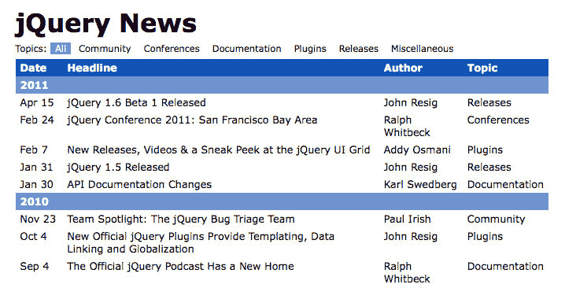

在标题和表之间，有一组链接表示表中的每个新闻主题。对于我们的第一个任务，我们将更改这些链接的行为，以就地过滤表*，而不需要导航到不同的页面。*

 *<footer style="margin-top: 5em;">

# 动态表过滤

为了使用主题链接过滤表，我们需要防止它们的默认链接行为。我们还应向用户提供有关当前所选主题的一些反馈：

```js
$(() => {
  $('#topics a')
    .click((e) => {
      e.preventDefault();
      $(e.target)
        .addClass('selected')
        .siblings('.selected')
        .removeClass('selected');
    });
}); 

```

Listing 9.1

当点击一个主题链接时，我们从所有主题链接中删除`selected`类，然后将`selected`类添加到新主题中。对`.preventDefault()`的调用阻止链接被跟踪。

接下来，我们需要实际执行过滤操作。首先，我们可以隐藏表中不包含主题文本的每一行：

```js
$(() => {
  $('#topics a')
    .click((e) => {
      e.preventDefault();
      const topic = $(e.target).text();

      $(e.target)
        .addClass('selected')
        .siblings('.selected')
        .removeClass('selected');

      $('#news tr').show();
      if (topic != 'All') {
        $(`#news tr:has(td):not(:contains("${topic}"))`)
          .hide();
      }
    });
}); 

```

Listing 9.2

我们现在将链接的文本存储在常量`topic`中，以便将其与表中的文本进行比较。首先，我们显示所有表行，然后，如果主题不是全部，则隐藏不相关的行。我们用于此过程的选择器有点复杂，不过：

```js
#news tr:has(td):not(:contains("topic")) 

```

选择器直接启动，`#news tr`定位表中的所有行。然后，我们使用`:has()`自定义选择器过滤该元素集。此选择器将当前选定的元素筛选为包含指定子体的元素。在本例中，我们不考虑标题行（例如日历年），因为它们不包含`<td>`单元格。

一旦我们找到了表中实际内容所在的行，我们就需要找出哪些行与所选主题相关。`:contains()`自定义选择器只匹配在其中某处具有给定文本字符串的元素；将其包装在`:not()`选择器中，然后为我们提供所有没有主题字符串的行，以便我们可以隐藏它们。

这段代码运行得很好，除非该主题恰好出现在新闻标题中。我们还需要注意一个主题是另一个主题的子串的可能性。要处理这些情况，我们需要为每一行执行代码：

```js
$(() => {
  $('#topics a')
    .click((e) => {
      e.preventDefault();
      const topic = $(e.target).text();

      $(e.target)
        .addClass('selected')
        .siblings('.selected')
        .removeClass('selected');

      $('#news tr').show();
      if (topic != 'All') {
        $('#news')
          .find('tr:has(td)')
          .not((i, element) =>
            $(element)
              .children(':nth-child(4)')
              .text() == topic
          )
          .hide();
      }
    });
}); 

```

Listing 9.3

这段新代码通过添加 DOM 遍历方法消除了一些复杂的选择器表达式文本。`.find()`方法就像之前分隔`#news`和`tr`的空间一样，但`.not()`方法做了`:not()`做不到的事情。正如我们在[第 2 章](02.html#164MG0-fd25fd954efc4043b43c8b05f3cc53ef)中所看到的`.filter()`方法，*选择元素*，`.not()`可以接受每个待测试元素调用一次的回调函数。如果该函数返回`true`，则该元素将从结果集中排除。

Selectors versus traversal methods
The choice of using a selector or its equivalent traversal method has performance ramifications as well. We'll explore this choice in more detail later in this chapter.

在`.not()`方法的过滤函数中，我们检查行的子元素以找到第四个元素（即`Topic`列中的单元格）。对该单元格文本的简单检查告诉我们是否应该隐藏该行。仅显示匹配的行：

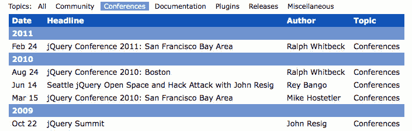

<footer style="margin-top: 5em;">

# 条带化表行

在[第 2 章](02.html#164MG0-fd25fd954efc4043b43c8b05f3cc53ef)*选择元素*中，我们的一个选择器示例说明了我们可以将交替行颜色应用于表格的方法。我们看到，`:even`和`:odd`自定义选择器可以很快完成此任务，CSS 原生`:nth-child()`伪类也可以完成此任务：

```js
$(() => { 
  $('#news tr:nth-child(even)')
    .addClass('alt'); 
}); 

```

Listing 9.4

这个简单的选择器查找其他每一个表行，由于每年的新闻文章都驻留在它们自己的`<tbody>`元素中，因此每个部分的交替都会重新开始。

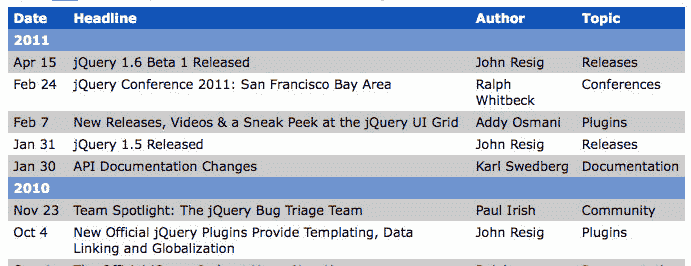

对于更复杂的行剥离挑战，我们可以尝试将`alt`类一次赋予两行集合。前两行将接收该类，然后下两行将不接收，依此类推。为此，我们需要重新访问**过滤功能**：

```js
$(() => { 
  $('#news tr')
    .filter(i => (i % 4) < 2)
    .addClass('alt'); 
}); 

```

Listing 9.5

在[第 2 章](02.html#164MG0-fd25fd954efc4043b43c8b05f3cc53ef)中的`.filter()`示例、*选择元素*以及*清单 9.3*中的`.not()`示例中，我们的过滤函数检查每个元素，以确定是否将其包含在结果集中。但是，在这里，我们不需要关于元素的信息来确定是否应该包含它。相反，我们需要知道它在原始元素集中的位置。此信息作为参数传递给函数，我们将其称为`i`。

`i`参数现在保存元素的从零开始的索引。有了这个，我们可以使用模运算符（`%`来确定我们是否在一对应该接收`alt`类的元素中。现在，我们在桌子上有两排条纹。

然而，仍有一些未解决的问题需要清理。因为我们不再使用`:nth-child()`伪类，所以在每个`<tbody>`中不会再次开始交替。此外，我们应该跳过表头行以获得一致的外观。这些目标可以通过几个小的修改来实现：

```js
$(() => {
  $('#news tbody')
    .each((i, element) => {
      $(element)
        .children()
        .has('td')
        .filter(i => (i % 4) < 2)
        .addClass('alt');
    });
}); 

```

Listing 9.6

为了独立地处理每组行，我们可以通过`.each()`调用循环`<tbody>`元素。在循环中，我们然后排除子目行，就像我们在*清单 9.3*中所做的那样，使用`.has()`。这将导致表格分为两行：

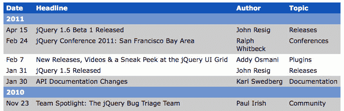

<footer style="margin-top: 5em;">

# 结合过滤和条带化

我们的高级表条带化现在可以很好地工作，但是当使用主题过滤器时，其行为会很奇怪。为了使这两个函数能够很好地协同工作，我们需要在每次使用过滤器时重新对表进行条带化。我们还需要考虑在计算应用何处的 To0T0R 类时，当前行是否隐藏：

```js
$(() => {
  function stripe() {
    $('#news')
      .find('tr.alt')
      .removeClass('alt')
      .end()
      .find('tbody')
      .each((i, element) => {
        $(element)
          .children(':visible')
          .has('td')
          .filter(i => (i % 4) < 2)
          .addClass('alt');
      });
  }
  stripe();

  $('#topics a')
    .click((e) => {
      e.preventDefault();
      const topic = $(e.target).text();

      $(e.target)
        .addClass('selected')
        .siblings('.selected')
        .removeClass('selected');

      $('#news tr').show();
      if (topic != 'All') {
        $('#news')
          .find('tr:has(td)')
          .not((i, element) =>
            $(element)
              .children(':nth-child(4)')
              .text() == topic
          )
          .hide();
      }

      stripe();
    });
}); 

```

Listing 9.7

将清单 9.3 中的过滤代码与我们的行分条例程相结合，该脚本现在定义了一个名为`stripe()`的函数，该函数在加载文档时调用一次，每次单击主题链接时调用一次。在函数中，我们负责从不再需要的行中删除`alt`类，并将所选行限制为当前显示的行。我们使用`:visible`伪类来实现这一点，伪类（与其对应的`:hidden`一起）考虑元素是否由于各种原因而隐藏，包括`display`值为`none`，或者`width`和`height`值为`0`。

现在，我们可以过滤表中的行，同时保留行分条：

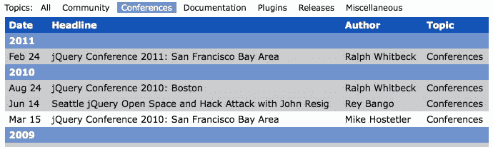

<footer style="margin-top: 5em;">

# 更多选择器和遍历方法

即使在我们看到了所有的示例之后，我们仍然没有接近于探索使用 jQuery 在页面上查找元素的所有方法。我们可以使用几十种选择器和 DOM 遍历方法，每种方法都有一个我们可能需要调用的特定实用程序。

为了找到适合我们需要的选择器或方法，我们可以使用许多资源。本书末尾的快速参考列出了每个选择器和方法，并对每个选择器和方法进行了非常简要的描述。不过，对于更详细的描述和使用示例，我们需要更全面的指南，如在线 jQueryAPI 参考。本网站列出了[上的所有选择器 http://api.jquery.com/category/selectors/](http://api.jquery.com/category/selectors/) 和[处的遍历方法 http://api.jquery.com/category/traversing/](http://api.jquery.com/category/traversing/) 。

<footer style="margin-top: 5em;">

# 自定义和优化选择器

我们已经看到的许多技术为我们提供了一个工具箱，可以用来查找我们想要使用的任何页面元素。故事并没有就此结束；关于高效地执行元素查找任务，有很多值得学习的地方。这种效率可以采用更易于编写和读取的代码以及在 web 浏览器中更快执行的代码的形式。

<footer style="margin-top: 5em;">

# 编写自定义选择器插件

提高易读性的一种方法是将代码片段封装在可重用组件中。我们一直通过创建函数来实现这一点。在[第 8 章](08.html#5FF7G0-fd25fd954efc4043b43c8b05f3cc53ef)*开发插件*中，我们通过制作 jQuery 插件来扩展这一想法，该插件为 jQuery 对象添加了方法。不过，这并不是插件帮助我们重用代码的唯一方法。插件还可以提供额外的**选择器表达式**，比如 Cycle 在[第 7 章](07.html#4KONO0-fd25fd954efc4043b43c8b05f3cc53ef)中给我们的`:paused`选择器*使用插件*。

要添加的最简单的选择器表达式类型是**伪类**。这是一个以冒号开头的表达式，如`:checked`或`:nth-child()`。为了说明创建选择器表达式的过程，我们将构建一个名为`:group()`的伪类。这个新的选择器将封装我们在*清单 9.6*中用来查找要条带化的表行的代码。

使用选择器表达式查找元素时，jQuery 在名为`expr`的内部对象中查找指令。该对象中的值的行为非常类似于我们传递给`.filter()`或`.not()`的过滤函数，其中包含 JavaScript 代码，当且仅当函数返回`true`时，才会将每个元素包含在结果集中。我们可以使用`$.extend()`函数向该对象添加新表达式：

```js
(($) => {
  $.extend($.expr[':'], {
    group(element, index, matches) {
      const num = parseInt(matches[3], 10);

      return Number.isInteger(num) &&
        ($(element).index() - 1) % (num * 2) < num;
    }
  });
})(jQuery); 

```

Listing 9.8

这段代码告诉 jQuery，`group`是一个有效字符串，可以在选择器表达式中跟在冒号后面，当遇到它时，应该调用给定的函数来确定该元素是否应该包含在结果集中。

此处计算的函数传递了四个参数：

*   `element`：正在考虑的 DOM 元素。这是大多数选择器所需要的，但不是我们的选择器。
*   `index`：结果集中 DOM 元素的索引。不幸的是，这总是 0，我们不能依赖它。这里包含它的唯一原因是我们需要对 matches 参数进行位置访问。
*   `matches`：包含用于分析此选择器的正则表达式结果的数组。通常，`matches[3]`是数组中唯一相关的项；在形式为`:group(2)`的选择器中，`matches[3]`项包含`2`，括号内的文本。

伪类选择器可以使用这三个参数中包含的部分或全部信息来确定元素是否属于结果集中。在这种情况下，`element`和`matches`就是我们所需要的。实际上，我们需要传递给这个函数的每个元素的索引位置。由于无法依赖于`index`参数，我们只需使用`.index()`jQuery 方法来获取索引。

有了新的`:group`选择器，我们现在可以灵活地选择元素的交替组。例如，我们可以将*清单 9.5*中的选择器表达式和`.filter()`函数组合成一个选择器表达式：`$('#news tr:group(2)')`，或者我们可以保留*清单 9.7*中的每节行为，并将`:group()`用作`.filter()`调用中的表达式。我们甚至可以通过简单地更改括号内的数字来更改要分组的行数：

```js
$(() => { 
  function stripe() {
    $('#news')
      .find('tr.alt')
      .removeClass('alt')
      .end()
      .find('tbody')
      .each((i, element) => {
        $(element)
          .children(':visible')
          .has('td')
          .filter(':group(3)')
          .addClass('alt');
      });
  }

  stripe(); 
}); 

```

Listing 9.9

现在我们可以看到行分条按三组交替进行：

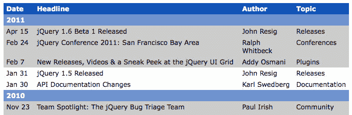

<footer style="margin-top: 5em;">

# 选择器性能

在规划任何 web 开发项目时，我们需要记住创建站点所需的时间、维护代码的容易程度和速度，以及用户与站点交互时站点的性能。通常前两个问题比第三个问题更重要。尤其是客户端脚本，开发者很容易陷入**过早优化**和**微优化**的陷阱。这些缺陷会导致我们花费无数的时间调整代码，以缩短 JavaScript 执行时间的毫秒数，即使在最初没有明显的性能延迟的情况下也是如此。

A good rule of thumb is to consider the developer's time more valuable than the computer's time, unless users notice slowness in our application.

即使性能是个问题，也很难找出 jQuery 代码中的瓶颈。正如我们在本章前面所暗示的，一些选择器通常比其他选择器更快，将选择器的一部分移动到遍历方法有助于加快在页面上查找元素所需的时间。因此，选择器和遍历性能通常是开始检查代码的好地方，以减少用户在与页面交互时可能遇到的延迟量。

Any decrees made about the relative speed of selectors and traversal methods are likely to become outdated with the release of newer, faster browsers and clever speed tweaks introduced in newer jQuery versions. In matters of performance, it is a good idea to routinely question our assumptions and to optimize code after performing measurements using a tool such as **jsPerf** ([http://jsperf.com](http://jsperf.com)).

考虑到这一点，我们将研究两个用于生成优化 jQuery 选择器代码的简单准则。

<footer style="margin-top: 5em;">

# Sizzle 选择器实现

如本章开头所述，当我们将选择器表达式传递给`$()`函数时，jQuery 的 Sizzle 实现解析表达式并确定如何收集它所表示的元素。在其基本形式中，Sizzle 应用了浏览器支持的最有效的本机**DOM 方法**，以获得一个`nodeList`，一个类似于本机数组的 DOM 元素对象，jQuery 最终将其转换为真正的数组并添加到`jQuery`对象中。以下是 jQuery 内部使用的 DOM 方法列表，以及支持这些方法的最新浏览器版本：

| **方法** | **选择** | **由**支持 |
| `.getElementById()` | ID 与给定字符串匹配的唯一元素。 | 所有浏览器 |
| `.getElementsByTagName()` | 标记名与给定字符串匹配的所有元素。 | 所有浏览器 |
| `.getElementsByClassName()` | 其中一个类名与给定字符串匹配的所有元素。 | IE9+、Firefox 3+、Safari 4+、Chrome 4+和 Opera 10+ |
| `.querySelectorAll()` | 与给定选择器表达式匹配的所有元素。 | IE8+、Firefox 3.5+、Safari 3+、Chrome 4+和 Opera 10+ |

如果选择器表达式的一部分不能由这些方法之一处理，Sizzle 会返回到循环遍历已收集的每个元素，并针对表达式部分测试每个元素。如果选择器表达式的*否*部分可以通过 DOM 方法处理，Sizzle 将从文档中*所有*元素的集合开始，用`document.getElementsByTagName('*')`表示，并依次循环每个元素。

每个元素的这种循环和测试在性能方面比任何本机 DOM 方法都要昂贵得多。幸运的是，所有现代桌面浏览器的最新版本都包括本机的`.querySelectorAll()`方法，而 Sizzle 在无法使用其他甚至更快的本机方法时会使用它——只有一个例外。当选择器表达式包含没有 CSS 对应项的自定义 jQuery 选择器时，Sizzle 别无选择，只能循环和测试。

<footer style="margin-top: 5em;">

# 测试选择器速度

为了了解 Apple T0T 和 Oracle T7 循环和测试记录 T8AY 过程之间的性能差异，考虑一个文档，在其中我们希望选择所有的 AUT1 T1 元素。我们可以用两种方式之一编写选择器表达式：`$('input[type="text"]')`使用*CSS 属性选择器*，或者`$('input:text')`使用*自定义 jQuery 选择器*。为了测试我们感兴趣的选择器部分，我们将移除`input`部分，并比较`$('[type="text"]')`和`$(':text')`的速度。JavaScript 基准测试网站[http://jsperf.com/](http://jsperf.com/) 让我们进行这个比较，产生戏剧性的结果。

在 jsPerf 测试中，每个测试用例都会循环，以查看在一定的时间内可以完成多少次，因此数量越大越好。当在支持`.querySelectorAll()`的现代浏览器（Chrome 26、Firefox 20 和 Safari 6）中测试时，可以利用它的选择器比自定义 jQuery 选择器快得多：

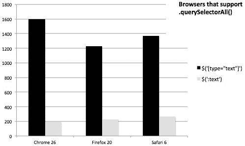

Figure 9.1

但是，在不支持`.querySelectorAll()`的浏览器中，如 IE 7，两个选择器的性能几乎相同。在这种情况下，两个选择器都强制 jQuery 循环遍历页面上的每个元素，并分别测试每个元素：

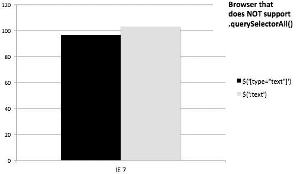

Figure 9.2

当我们查看`$('input:eq(1)')`和`$('input') .eq(1)`时，使用本机方法和不使用本机方法的选择器之间的性能差异也很明显：

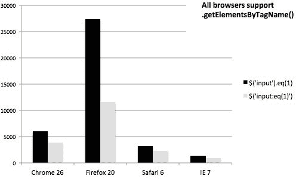

Figure 9.3

虽然每秒钟的原始操作数因浏览器而异，但当我们将自定义的`:eq()`选择器移出到`.eq()`方法中时，所有经过测试的浏览器都显示出显著的性能提升。使用简单的`input`标记名作为`$()`函数的参数可以快速查找，`.eq()`方法然后简单地调用数组函数来检索 jQuery 集合中的第二个元素。

As a general rule of thumb, we should prefer selectors that are part of the CSS specification over jQuery's custom selectors whenever possible. Still, before changing our selectors, it makes sense to first confirm that there is a need to increase performance, and then test just how much the change would boost performance with a benchmarking tool such as [http://jsperf.com](http://jsperf.com).

<footer style="margin-top: 5em;">

# 引擎盖下的 DOM 遍历

在[第 2 章](02.html#164MG0-fd25fd954efc4043b43c8b05f3cc53ef)、*选择元素*中，以及在本章的开头，我们通过调用 DOM 遍历方法，研究了从一组 DOM 元素到另一组 DOM 元素的迁移方式。我们对这些方法的调查（并非详尽无遗）包括到达相邻细胞的简单方法，如`.next()`和`.parent()`，以及组合选择器表达式的更复杂方法，如`.find()`和`.filter()`。到目前为止，我们应该对这些逐步从一个 DOM 元素到另一个 DOM 元素的方法有了相当深刻的理解。

但是，每次我们执行这些步骤之一时，jQuery 都会记录我们的旅行，留下一条面包屑的轨迹，如果需要的话，我们可以跟踪回家。我们在那一章中简要介绍的两种方法，`.end()`和`.addBack()`利用了这种记录保存。为了能够最大限度地利用这些方法，并且通常为了编写高效的 jQuery 代码，我们需要更多地了解 DOM 遍历方法是如何完成其工作的。

<footer style="margin-top: 5em;">

# jQuery 遍历属性

众所周知，我们通常通过将选择器表达式传递给`$()`函数来构造 jQuery 对象实例。在生成的对象中，存在一个数组结构，其中包含对匹配该选择器的每个 DOM 元素的引用。但是，我们没有看到的是隐藏在对象中的其他属性。例如，当调用 DOM 遍历方法时，`.prevObject`属性包含对调用遍历方法的 jQuery 对象的引用。

The jQuery object used to expose `selector` and `context` properties as well. Since they don't provide any value to us, they've been removed in jQuery 3.

要查看`prevObject`属性的作用，我们可以突出显示表中的任意单元格并检查其值：

```js
$(() => { 
  const $cell = $('#release');
    .addClass('highlight'); 
  console.log('prevObject', $cell.prevObject); 
}); 

```

Listing 9.10

此代码段将突出显示单个选定单元格，如以下屏幕截图所示：

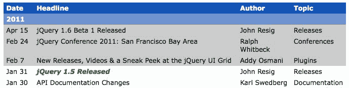

我们可以看到，`.prevObject`是未定义的，因为这是一个新创建的对象。但是，如果我们在混合中添加遍历方法，事情会变得更有趣：

```js
$(() => { 
  const $cell = $('#release')
    .nextAll()
    .addClass('highlight'); 
  console.log('prevObject', $cell.prevObject); 
}); 

```

Listing 9.11

此更改会改变高亮显示的单元格，如以下屏幕截图所示：

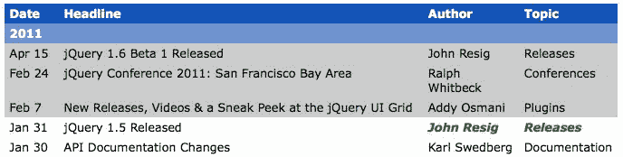

Now, the two cells following the one we initially selected are highlighted. Within the jQuery object, `.prevObject` now refers to the original jQuery object instance before the call to `.nextAll()`.

<footer style="margin-top: 5em;">

# DOM 元素堆栈

由于每个 jQuery 对象实例都有一个指向前一个实例的`.prevObject`属性，因此我们有一个实现**堆栈**的链表结构。每个遍历方法调用都会找到一组新的元素，并将该集合推送到堆栈上。这只有在我们可以使用这个堆栈时才有用，因为`.end()`和`.addBack()`方法就是在这个堆栈中起作用的。

`.end()`方法只是从堆栈的末尾弹出一个元素，这与获取`.prevObject`属性的值相同。我们在[第 2 章](02.html#164MG0-fd25fd954efc4043b43c8b05f3cc53ef)中看到了一个例子，*选择元素*，我们将在本章后面看到更多。不过，对于一个更有趣的示例，我们将研究`.addBack()`如何操纵堆栈：

```js
$(() => { 
  $('#release')
    .nextAll()
    .addBack()
    .addClass('highlight'); 
}); 

```

Listing 9.12

突出显示的单元格再次发生变化：

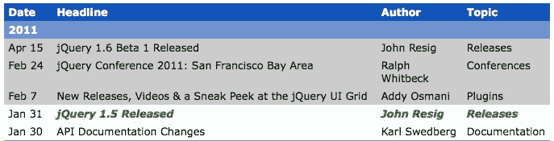

当调用`.addBack()`时，jQuery 将返回堆栈上的一个步骤，并组合两个元素集。在我们的示例中，这意味着高亮显示的单元格包括`.nextAll()`调用找到的两个单元格和使用选择器定位的原始单元格。然后将这个新的合并元素集推送到堆栈上。

这种堆栈操作非常有用。为了确保这些技术在需要时工作，每个遍历方法实现都必须正确地更新堆栈；这意味着，如果我们想提供自己的遍历方法，我们需要了解一些系统的内部工作。

<footer style="margin-top: 5em;">

# 编写 DOM 遍历方法插件

与任何其他 jQuery 对象方法一样，可以通过向`$.fn`添加属性将遍历方法添加到 jQuery 中。我们在[第 8 章](08.html#5FF7G0-fd25fd954efc4043b43c8b05f3cc53ef)*开发插件*中看到，我们定义的新 jQuery 方法应该对匹配的元素集进行操作，然后返回 jQuery 对象，以便用户可以链接其他方法。创建 DOM 遍历方法时，过程类似，但返回的 jQuery 对象需要指向一组新的匹配元素。

作为一个例子，我们将构建一个插件，用于查找与给定单元格位于同一列中的所有表格单元格。首先，我们将全面查看插件代码，然后逐段检查以了解其工作原理：

```js
(($) => {
  $.fn.column = function() {
    var $cells = $();

    this.each(function(i, element) {
      const $td = $(element).closest('td, th');

      if ($td.length) {
        const colNum = $td[0].cellIndex + 1;
        const $columnCells = $td
          .closest('table')
          .find('td, th')
          .filter(`:nth-child(${colNum})`);

        $cells = $cells.add($columnCells);
      }
    });

    return this.pushStack($cells);
  };
})(jQuery); 

```

Listing 9.13

我们的`.column()`方法可以在指向零个、一个或多个 DOM 元素的 jQuery 对象上调用。为了考虑所有这些可能性，我们使用`.each()`方法在元素上循环，将单元格列逐个添加到变量`$cells`中。这个`$cells`变量一开始是一个空的 jQuery 对象，然后用`.add()`方法进行扩展，根据需要指向越来越多的 DOM 元素。

这解释了函数的外循环；在循环内部，我们需要了解`$columnCells`是如何用表列中的 DOM 元素填充的。首先，我们得到一个对正在检查的表单元格的引用。我们希望允许对表单元格或表单元格内的元素调用`.column()`方法。`.closest()`方法为我们解决了这个问题；它沿着 DOM 树向上移动，直到找到与我们提供的选择器匹配的元素。这种方法对我们进行活动委派非常有用，我们将在[第 10 章](10.html#6S9HU0-fd25fd954efc4043b43c8b05f3cc53ef)、*高级活动*中再次讨论。

在我们的表单元格中，我们使用 DOM`.cellIndex`属性查找其列号。这给了我们一个从零开始的单元格列索引；我们将`1`添加到这个数字中，因为我们稍后将在基于一的上下文中使用它。然后，从细胞中，我们向上移动到最近的`<table>`元素，再向下移动到`<td>`和`<th>`元素，并使用`:nth-child()`选择器表达式将这些细胞过滤到适当的列中。

The plugin we're writing is limited to simple, non-nested tables due to the `.find('td, th')` call. To support nested tables, we would need to determine whether `<tbody>` tags are present and move up and down the DOM tree by the appropriate amount, which would add more complexity than is appropriate for this example.

找到列中的所有单元格后，我们需要返回新的 jQuery 对象。我们可以从我们的方法返回`$cells`，但这不能正确地尊重 DOM 元素堆栈。相反，我们将`$cells`传递给`.pushStack()`方法并返回结果。此方法接受 DOM 元素数组并将它们添加到堆栈中，以便以后对方法（如`.addBack()`和`.end()`的调用能够正常运行。

要查看我们的插件的运行情况，我们可以对点击单元格做出反应，并突出显示相应的列：

```js
$(() => { 
  $('#news td')
    .click((e) => {
      $(e.target)
        .siblings('.active')
        .removeClass('active')
        .end()
        .column()
        .addClass('active');
    });
}); 

```

Listing 9.14

`active`类被添加到所选列中，例如，当单击作者的某个姓名时，会产生不同的阴影：

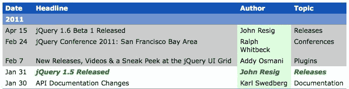

<footer style="margin-top: 5em;">

# DOM 遍历性能

关于选择器性能的经验法则同样适用于 DOM 遍历性能：我们应该尽可能优先考虑代码编写和代码维护的易用性，只有在性能是一个可测量的问题时才牺牲可读性进行优化。同样，像[这样的网站 http://jsperf.com/](http://jsperf.com/) 有助于确定多个选项下的最佳方法。

虽然应该避免过早优化，但最好尽量减少选择器和遍历方法的重复。因为这些任务可能会很昂贵，所以我们做的次数越少越好。避免这种重复的两种策略是**链接**和**对象缓存**。

<footer style="margin-top: 5em;">

# 使用链接提高性能

现在我们已经多次使用链接，它使我们的代码保持简洁。链接也可以带来性能方面的好处。

清单 9.9 中的*函数将 ID 为`news`的元素定位为一次而不是两次。它需要从不再需要它的行中删除`alt`类，并将该类应用于新的行集合。通过使用链接，我们将这两种想法结合在一起，并防止了这种重复：*

```js
$(() => {
  function stripe() {
    $('#news')
      .find('tr.alt')
      .removeClass('alt')
      .end()
      .find('tbody')
      .each((i, element) => {
        $(element)
          .children(':visible')
          .has('td')
          .filter(':group(3)')
          .addClass('alt');
      });
  }

  stripe();
}); 

```

Listing 9.15

为了合并`$('#news')`的两种用途，我们再次利用 jQuery 对象中的 DOM 元素堆栈。对`.find()`的第一次调用将表行推到堆栈上，但`.end()`将其从堆栈中弹出，以便下一次`.find()`调用再次在`news`表上操作。这种巧妙的堆栈操作是避免选择器重复的简便方法。

<footer style="margin-top: 5em;">

# 通过缓存提高性能

缓存只是存储一个操作的结果，以便可以多次使用，而无需再次运行该操作。在选择器和遍历性能的上下文中，我们可以将 jQuery 对象缓存在常量中以供以后使用，而不是创建新对象。

回到我们的示例，我们可以重写`stripe()`函数，以避免使用缓存而不是链接来复制选择器：

```js
$(() => { 
  const $news = $('#news');

  function stripe() {
    $news
      .find('tr.alt')
      .removeClass('alt');
    $news
      .find('tbody')
      .each((i, element) => {
        $(element)
          .children(':visible')
          .has('td')
          .filter(':group(3)')
          .addClass('alt');
      });
  }

  stripe();
}); 

```

Listing 9.16

这两个操作再次是独立的 JavaScript 语句，而不是链接在一起。不过，我们仍然只执行一次`$('#news')`选择器，将结果存储在`$news`中。这种缓存方法比链式缓存要详细一些，因为我们需要单独创建存储 jQuery 对象的变量。显然，在我们的代码中创建更多要管理的常量不如将函数调用链接在一起。但是有时候，链接太复杂了，缓存这样的对象是更好的选择。

因为按 ID 选择页面上的元素非常快，所以这两个示例都不会对性能产生太大影响，在实践中，我们会选择看起来最清晰、最易于维护的方法。但是，当性能受到关注时，这些技术是有用的工具。

<footer style="margin-top: 5em;">

# 总结

在本章中，我们更深入地研究了 jQuery 在文档中查找元素的广泛功能。我们已经了解了 Sizzle 选择器引擎如何工作的一些细节，以及它对设计高效代码的影响。此外，我们还探索了扩展和增强 jQuery 选择器和 DOM 遍历方法的方法。

<footer style="margin-top: 5em;">

# 进一步阅读

选择器和遍历方法的完整列表可在本书的[附录 B](15.html#9BEGK0-fd25fd954efc4043b43c8b05f3cc53ef)、*快速参考*中找到，或在[的正式 jQuery 文档中找到 http://api.jquery.com/](http://api.jquery.com/) 。

<footer style="margin-top: 5em;">

# 练习

挑战练习可能需要使用位于[的正式 jQuery 文档 http://api.jquery.com/](http://api.jquery.com/) 。

1.  修改表格行分条例程，使其不为第一行提供类，为第二行提供类`alt`，为第三行提供类`alt-2`。对一个部分中的每三行重复此模式。
2.  创建一个名为`:containsExactly()`的新选择器插件，用于选择文本内容与括号内内容完全匹配的元素。
3.  使用这个新的`:containsExactly()`选择器重写*清单 9.3*中的过滤代码。
4.  创建一个名为`.grandparent()`的新 DOM 遍历插件方法，该方法从 DOM 中的一个或多个元素移动到它们的祖辈元素。
5.  **挑战**：使用[http://jsperf.com/](http://jsperf.com/) ，粘贴在`index.html`的内容中，并使用以下方法比较查找`<td id="release">`最近祖先表元素的性能：

*   `.closest()`方法
*   `.parents()`方法，将结果限制为找到的第一个表

6.  **挑战**：使用[http://jsperf.com/](http://jsperf.com/) ，粘贴在`index.html`的内容中，并使用以下方法比较在每行中查找最终`<td>`元素的性能：

*   `:last-child`伪类
*   `:nth-child()`伪类
*   每行内的`.last()`方法（使用`.each()`在行上循环）
*   每行中的`:last`伪类（使用`.each()`在行上循环）

</footer>

</footer>

</footer>

</footer>

</footer>

</footer>

</footer>

</footer>

</footer>

</footer>

</footer>

</footer>

</footer>

</footer>

</footer>

</footer>

</footer>

</footer>

</footer>* </footer>