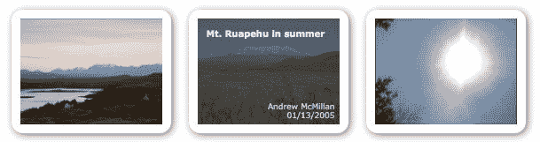
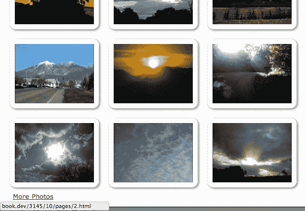
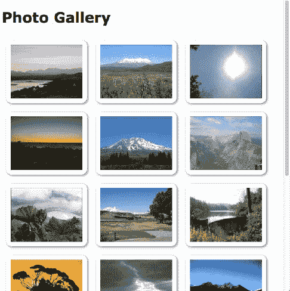

# 十、高级事件

为了构建交互式 web 应用程序，我们需要观察用户的活动并对其作出响应。我们已经看到 jQuery 的事件系统可以简化此任务，并且我们已经多次使用此事件系统。

在[第 3 章](03.html#1P71O0-fd25fd954efc4043b43c8b05f3cc53ef)*处理事件*中，我们讨论了 jQuery 为响应事件提供的一些特性。在这一更高级的章节中，我们将介绍：

*   活动授权及其带来的挑战
*   与某些事件相关的性能缺陷以及如何解决这些缺陷
*   我们定义自己的自定义事件
*   jQuery 内部用于复杂交互的特殊事件系统

<footer style="margin-top: 5em;">

# 重温事件

对于示例文档，我们将创建一个简单的照片库。“多媒体资料”将显示一组照片，单击链接后可选择显示其他照片。我们还将使用 jQuery 的事件系统，在光标位于每张照片上时显示其文本信息。定义库的 HTML 如下所示：

```js
<div id="container"> 
  <h1>Photo Gallery</h1> 

  <div id="gallery"> 
    <div class="photo"> 
       
      <div class="details"> 
        <div class="description">The Cuillin Mountains, 
          Isle of Skye, Scotland.</div> 
        <div class="date">12/24/2000</div> 
        <div class="photographer">Alasdair Dougall</div> 
      </div> 
    </div> 
    <div class="photo"> 
       
      <div class="details"> 
        <div class="description">Mt. Ruapehu in summer</div> 
        <div class="date">01/13/2005</div> 
        <div class="photographer">Andrew McMillan</div> 
      </div> 
    </div> 
    <div class="photo"> 
       
      <div class="details"> 
        <div class="description">midday sun</div> 
        <div class="date">04/26/2011</div> 
        <div class="photographer">Jaycee Barratt</div> 
      </div> 
    </div> 
    <!-- Code continues --> 
  </div> 
  <a id="more-photos" href="pages/1.html">More Photos</a> 
</div> 

```

Getting the example code
You can access the example code from the following GitHub repository: [https://github.com/PacktPublishing/Learning-jQuery-3](https://github.com/PacktPublishing/Learning-jQuery-3).

当我们将样式应用于照片时，将它们排列成三行将使图库看起来像以下屏幕截图：


<footer style="margin-top: 5em;">

# 加载额外的数据页

到目前为止，我们是对点击页面元素做出反应这一常见任务的专家。单击“更多照片”链接时，我们需要对下一组照片执行 Ajax 请求，并将它们附加到`<div id="gallery">`中，如下所示：

```js
$(() => {
  $('#more-photos')
    .click((e) => {
      e.preventDefault();
      const url = $(e.target).attr('href');

      $.get(url)
        .then((data) => {
          $('#gallery')
            .append(data);
        })
        .catch(({ statusText }) => {
          $('#gallery')
            .append(`<strong>${statusText}</strong>`)
        });
    });
});

```

Listing 10.1

我们还需要更新“更多照片”链接的目的地，以指向下一页照片：

```js
$(() => {
  var pageNum = 1;

  $('#more-photos')
    .click((e) => {
      e.preventDefault();
      const $link = $(e.target);
      const url = $link.attr('href');

      if (pageNum > 19) {
        $link.remove();
        return;
      }

      $link.attr('href', `pages/${++pageNum}.html`);

      $.get(url)
        .then((data) => {
          $('#gallery')
            .append(data);
        })
        .catch(({ statusText }) => {
          $('#gallery')
            .append(`<strong>${statusText}</strong>`)
        });
    });
});

```

Listing 10.2

我们的`.click()`处理程序现在使用`pageNum`变量跟踪要请求的下一页照片，并使用该变量为链接构建新的`href`值。由于`pageNum`是在函数外部定义的，因此其值在点击链接之间保持不变。我们一旦到达照片的最后一页，就会删除链接。

We should also consider using the HTML5 history API to allow the user to bookmark our Ajax-loaded content. You can learn about this API at Dive into HTML5 ([http://diveintohtml5.info/history.html](http://diveintohtml5.info/history.html)) and implement it quite easily using the History plugin ([https://github.com/browserstate/history.js](https://github.com/browserstate/history.js)).

<footer style="margin-top: 5em;">

# 悬停显示数据

我们希望在此页面上提供的下一个功能是，当用户的鼠标位于页面的该区域时，显示与每张照片相关的详细信息。对于我们第一次显示此信息，我们可以使用`.hover()`方法：

```js
$(() => {
  $('div.photo')
    .hover((e) => {
      $(e.currentTarget)
        .find('.details')
        .fadeTo('fast', 0.7);
  }, (e) => {
      $(e.currentTarget)
        .find('.details')
        .fadeOut('fast');
  });
}); 

```

Listing 10.3

当光标进入照片边界时，相关信息淡入到 70%的不透明度，当光标离开时，信息淡出：



当然，执行此任务有多种方法。由于每个处理程序的一部分是相同的，所以可以将两个处理程序组合起来。我们可以通过使用空格分隔事件名称，将处理程序同时绑定到`mouseenter`和`mouseleave`，如下所示：

```js
 $('div.photo')
   .on('mouseenter mouseleave', (e) => {
     const $details = $(e.currentTarget).find('.details');

     if (e.type == 'mouseenter') {
       $details.fadeTo('fast', 0.7);
     } else {
       $details.fadeOut('fast');
     }
   });

```

Listing 10.4

当同一个处理程序绑定到两个事件时，我们检查事件的类型以确定是淡入还是淡出细节。但是，定位`<div>`的代码对于两个事件都是相同的，因此我们可以只编写一次。

这个例子有点做作，因为这个例子中的共享代码非常简短。不过，在其他情况下，这种技术可以显著降低代码复杂性。例如，如果我们选择在`mouseenter`上添加一个类，并在`mouseleave`上删除它，而不是设置不透明动画，那么我们可以在处理程序中使用一条语句来处理它，如下所示：

```js
$(e.currentTarget)
  .find('.details') 
  .toggleClass('entered', e.type == 'mouseenter'); 

```

在任何情况下，我们的脚本现在都能正常工作，只是我们没有考虑用户单击“更多照片”链接时加载的其他照片。正如我们在[第 3 章](03.html#1P71O0-fd25fd954efc4043b43c8b05f3cc53ef)中提到的*处理事件*，事件处理程序仅附加到我们进行`.on()`调用时存在的元素。稍后添加的元素（例如来自 Ajax 调用的元素）将不会有这种行为。我们看到解决这个问题的两种方法是在引入新内容后*重新绑定*事件处理程序，或者最初将处理程序绑定到包含元素并依赖事件冒泡。第二种方法，*事件授权*，是我们将在这里采用的方法。

<footer style="margin-top: 5em;">

# 活动代表团

回想一下，为了手动实现事件委派，我们检查`event`对象的`target`属性，看看它是否匹配我们想要触发行为的元素。事件目标表示接收事件的最内层或嵌套最深的元素。然而，这次使用我们的示例 HTML，我们遇到了一个新的挑战。`<div class="photo">`元素不太可能是事件目标，因为它们包含其他元素，如图像本身和图像细节。

我们需要的是`.closest()`方法，它在 DOM 中从一个父级到另一个父级，直到找到与给定选择器表达式匹配的元素。如果没有找到任何元素，它将像任何其他 DOM 遍历方法一样，返回一个新的空 jQuery 对象。我们可以使用`.closest()`从它包含的任何元素中找到`<div class="photo">`，如下所示：

```js
$(() => { 
  $('#gallery')
    .on('mouseover mouseout', (e) => {
      const $target = $(e.target)
        .closest('div.photo');
      const $related = $(e.relatedTarget)
        .closest('div.photo');
      const $details = $target
        .find('.details');

      if (e.type == 'mouseover' && $target.length) {
        $details.fadeTo('fast', 0.7);
      } else if (e == 'mouseout' && !$related.length) {
        $details.fadeOut('fast');
      }
    });
}); 

```

Listing 10.5

请注意，我们还需要将事件类型从`mouseenter`和`mouseleave`更改为`mouseover`和`mouseout`，因为前两种类型只有在鼠标第一次进入图库`<div>`并最终离开时才会触发，我们需要在鼠标进入内的任何照片*时触发处理程序那个包裹。但后一种类型引入了另一种场景，即细节`<div>`将反复淡入淡出，除非我们对`event`对象的`relatedTarget`属性进行额外检查。即使有了额外的代码，在照片上反复快速移动鼠标也不能令人满意地处理，在应该消失的时候，偶尔会留下一些细节`<div>`。*

<footer style="margin-top: 5em;">

# 使用 jQuery 的委托功能

当任务变得更加复杂时，手动管理事件委派可能会非常困难。幸运的是，jQuery 的`.on()`方法内置了委托，这可以让我们的生活更轻松。使用此功能，我们的代码可以返回到清单 10.4 的简单性：

```js
$(() => { 
  $('#gallery')
    .on('mouseenter mouseleave', 'div.photo', (e) => {
      const $details = $(e.currentTarget).find('.details');

      if (e.type == 'mouseenter') {
        $details.fadeTo('fast', 0.7);
      } else {
        $details.fadeOut('fast');
      }
    });
}); 

```

Listing 10.6

选择器`#gallery`与*清单 10.5*中的相同，但事件类型返回到*清单 10.4*中的`mouseenter`和`mouseleave`。当我们将`'div.photo'`作为第二个参数传递给`.on()`时，jQuery 将`e.currentTarget`映射到`'#gallery'`中该选择器匹配的元素。

<footer style="margin-top: 5em;">

# 选择委派范围

因为我们正在处理的所有照片元素都包含在`<div id="gallery">`中，所以在前面的示例中，我们使用`#gallery`作为委托范围。但是，作为所有照片的祖先的任何元素都可以用作此范围。例如，我们可以将处理程序绑定到`document`，这是页面上所有内容的共同祖先：

```js
$(() => {
  $(document)
    .on('mouseenter mouseleave', 'div.photo', (e) => {
      const $details = $(e.currentTarget).find('.details');

      if (e.type == 'mouseenter') {
        $details.fadeTo('fast', 0.7);
      } else {
        $details.fadeOut('fast');
      }
    });
}); 

```

Listing 10.7

在设置事件委派时，可以方便地将事件处理程序直接附加到`document`。由于所有页面元素都是从`document`派生出来的，所以我们不必担心选择正确的容器。然而，这种便利性带来了潜在的性能成本。

在深度嵌套元素的 DOM 中，依靠事件一路冒泡到多个祖先元素可能代价高昂。无论我们实际观察到哪些元素（通过将选择器作为`.on()`的第二个参数传递），如果我们将处理程序绑定到`document`，则需要检查页面上任何地方发生的事件。例如，在*清单 10.6*中，每当鼠标输入页面上的任何元素时，jQuery 都需要检查是否输入了`<div class="photo">`元素。在大型页面上，这可能会增加成本，特别是在大量使用委托的情况下。通过在我国代表团中更加具体，这项工作可以减少。

<footer style="margin-top: 5em;">

# 提前授权

尽管存在这些效率问题，但我们仍有理由选择`document`作为我们的代表团背景。通常，我们只能在加载事件处理程序所附加的 DOM 元素后绑定事件处理程序，这就是我们通常将代码放在`$(() => {})`中的原因。但是，`document`元素立即可用，因此我们不需要等到整个 DOM 准备就绪后再绑定到它。即使在文档的`<head>`中引用了脚本，就像在我们的示例中一样，我们也可以立即调用`.on()`，如下所示：

```js
(function($) { 
  $(document)
    .on('mouseenter mouseleave', 'div.photo', (e) => {
      const $details = $(e.currentTarget).find('.details');

      if (e.type == 'mouseenter') {
        $details.fadeTo('fast', 0.7);
      } else {
        $details.fadeOut('fast');
      }
    }); 
})(jQuery); 

```

Figure 10.8

因为我们不会等待整个 DOM 准备就绪，所以我们可以确信，`mouseenter`和`mouseleave`行为将在页面上呈现后立即应用于所有`<div class="photo">`元素。

若要了解此技术的好处，请考虑一个直接绑定到链接的 AuthT01.1 处理程序。假设此处理程序执行某些操作，并且还阻止链接的默认操作（导航到其他页面）。如果我们等待整个文档准备就绪，我们将冒着用户在注册处理程序之前单击该链接的风险，从而离开当前页面，而不是得到脚本提供的增强处理。相比之下，将委托的事件处理程序绑定到`document`使我们能够尽早绑定事件，而无需扫描复杂的 DOM 结构。

<footer style="margin-top: 5em;">

# 定义自定义事件

浏览器的 DOM 实现自然触发的事件对于任何交互式 web 应用程序都至关重要。然而，在 jQuery 代码中，我们并不局限于这组事件。我们还可以添加自己的自定义事件。我们在[第 8 章](08.html#5FF7G0-fd25fd954efc4043b43c8b05f3cc53ef)*开发插件*中简要地看到了这一点，当我们看到 jQuery UI 小部件如何触发事件时，我们将在这里研究如何在插件开发之外创建和使用自定义事件。

自定义事件必须由我们的代码手动触发。从某种意义上说，它们类似于我们定义的常规函数，因为当我们从脚本中的另一个位置调用代码块时，我们可以执行它。对自定义事件的`.on()`调用的行为类似于函数定义，而`.trigger()`调用的行为类似于函数调用。

但是，事件处理程序与触发它们的代码是分离的。这意味着我们可以在任何时候触发事件，而不必事先知道我们这样做时会发生什么。常规函数调用导致执行一段代码。但是，自定义事件不能有任何处理程序、一个或多个绑定到它的处理程序。在任何情况下，所有绑定处理程序都将在触发事件时执行。

为了说明这一点，我们可以修改 Ajax 加载特性以使用自定义事件。每当用户请求更多照片时，我们将触发一个`nextPage`事件，并绑定监视此事件并执行`.click()`处理程序之前所做工作的处理程序：

```js
$(() => { 
  $('#more-photos')
    .click((e) => {
      e.preventDefault();
      $(e.target).trigger('nextPage');
    });
}); 

```

Listing 10.9

`.click()`处理程序现在只做很少的工作。它触发自定义事件，并通过调用`.preventDefault()`防止默认链接行为。重物被转移到`nextPage`事件的新事件处理程序，如下所示：

```js
(($) => { 
  $(document)
    .on('nextPage', (e) => {
      $.get($(e.target).attr('href'))
        .then((data) => {
          $('#gallery')
            .append(data);
        })
        .catch(({ statusText }) => {
          $('#gallery')
            .append(`<strong>${statusText}</strong>`)
        });
    });

  var pageNum = 1;

  $(document)
    .on('nextPage', () => {
      if (pageNum > 19) {
        $('#more-photos').remove();
        return;
      }

      $('#more-photos')
        .attr('href', `pages/${++pageNum}.html`);
    });
})(jQuery); 

```

Listing 10.10

自清单 10.2*以来，我们的代码实际上没有太大变化。最大的区别是，我们将曾经的单个函数拆分为两个。这只是为了说明单个事件触发器可以触发多个绑定处理程序。单击“更多照片”链接，将添加下一组照片，并更新链接的`href`属性，如以下屏幕截图所示：*



随着*清单 10.10 中代码的更改，*我们还演示了事件冒泡的另一个应用。`nextPage`处理程序可以绑定到触发事件的链接，但我们需要等到 DOM 准备好后才能执行。相反，我们将处理程序绑定到文档本身，文档本身立即可用，因此我们可以在`$(() => {})`之外进行绑定。事实上，这与我们在*清单 10.8*中将`.on()`方法移出`$(() => {})`时所利用的原理相同。事件冒出气泡，只要另一个处理程序不停止事件传播，我们的处理程序就会被触发。

<footer style="margin-top: 5em;">

# 无限滚动

正如多个事件处理程序可以对同一触发事件作出反应一样，同一事件也可以以多种方式触发。我们可以通过在页面中添加无限滚动功能来演示这一点。这项技术允许用户的滚动条管理内容的加载，每当用户到达已加载内容的末尾时，就会获取额外的内容。

我们将从一个简单的实现开始，然后在后续示例中对其进行改进。基本思想是观察`scroll`事件，在滚动发生时测量当前滚动条的位置，并在需要时加载新内容。下面的代码将触发我们在*清单 10.10*中定义的`nextPage`事件：

```js
(($) => { 
  const checkScrollPosition = () => {
    const distance = $(window).scrollTop() +
      $(window).height();

    if ($('#container').height() <= distance) {
      $(document).trigger('nextPage');
    }
  }

  $(() => {
    $(window)
      .scroll(checkScrollPosition)
      .trigger('scroll');
  }); 
})(jQuery); 

```

Listing 10.11

我们在这里介绍的`checkScrollPosition()`函数被设置为窗口`scroll`事件的处理程序。此函数计算从文档顶部到窗口底部的距离，然后将此距离与文档中主容器的总高度进行比较。一旦这些达到相等，我们就需要用更多的照片填充页面，因此我们触发`nextPage`事件。

一旦我们绑定了`scroll`处理程序，我们立即通过调用`.trigger('scroll')`触发它。这将启动该过程，因此如果页面最初没有填充照片，则会立即发出 Ajax 请求以附加更多照片：



<footer style="margin-top: 5em;">

# 自定义事件参数

定义函数时，我们可以设置任意数量的参数，以便在实际调用函数时用参数值填充。类似地，在触发自定义事件时，我们可能希望将附加信息传递给任何已注册的事件处理程序。我们可以通过使用自定义事件参数来实现这一点。

正如我们所看到的，为任何事件处理程序定义的第一个参数是 DOM 事件对象，该对象由 jQuery 增强和扩展。我们定义的任何其他参数都可供我们自由使用。

要看到这一点，我们将在*清单 10.10*中的`nextPage`事件中添加一个新选项，允许我们向下滚动页面以显示新添加的内容：

```js
(($) => { 
  $(document)
    .on('nextPage', (e, scrollToVisible) => {
      if (pageNum > 19) {
        $('#more-photos').remove();
        return;
      }

      $.get($('#more-photos').attr('href'))
        .then((data) => {
          const $data = $('#gallery')
            .append(data);

          if (scrollToVisible) {
            $(window)
              .scrollTop($data.offset().top);
          }

          checkScrollPosition();
    })
    .catch(({ statusText }) => {
      $('#gallery')
        .append(`<strong>${statusText}</strong>`)
    });
  }); 
})(jQuery); 

```

Listing 10.12

我们现在已经在事件回调中添加了一个`scrollToVisible`参数。此参数的值决定我们是否执行新功能，这需要测量新内容的位置并滚动到它。使用`.offset()`方法很容易进行测量，该方法返回新内容的顶部和左侧坐标。要向下移动页面，我们称之为`.scrollTop()`方法。

现在，我们需要将一个参数传递到新参数中。所需的只是在使用`.trigger()`调用事件时提供一个额外的值。当`newPage`通过滚动触发时，我们不希望出现新的行为，因为用户已经在直接操纵滚动位置。另一方面，当点击“更多照片”链接时，我们希望新添加的照片显示在屏幕上，因此我们将向处理程序传递一个值`true`：

```js
$(() => { 
  $('#more-photos')
    .click((e) => {
      e.preventDefault();
      $(e.target).trigger('nextPage', [true]);
    });
}); 

```

Listing 10.13

在对`.trigger()`的调用中，我们现在提供了一个要传递给事件处理程序的值数组。在本例中，`true`的值将被赋予*清单 10.12*中事件处理程序的`scrollToVisible`参数。

请注意，自定义事件参数在事务双方都是可选的。在我们的代码中有两个对`.trigger('nextPage')`的调用，其中只有一个提供参数值；调用另一个时，这不会导致错误，而是处理程序中的每个参数都有值`undefined`。类似地，在我们的一个`.on('nextPage')`调用中缺少`scrollToVisible`参数也不是错误；如果传递参数时参数不存在，则忽略该参数。

<footer style="margin-top: 5em;">

# 限制事件

无限滚动特性的一个主要问题是它对性能的影响，正如我们在*清单 10.10*中所实现的那样。虽然我们的代码很简短，`checkScrollPosition()`函数确实需要做一些工作来测量页面和窗口的尺寸。这种努力可能会迅速累积，因为在某些浏览器中，`scroll`事件会在窗口滚动期间反复触发。这种组合的结果可能是波动或缓慢的表现。

一些本机事件可能会频繁触发。常见的罪魁祸首包括`scroll`、`resize`和`mousemove`。为此，我们将实施**事件节流**。这项技术涉及到限制我们昂贵的计算，以便它们只发生在某些事件发生之后，而不是每次事件发生之后。我们可以从*清单 10.13*中更新我们的代码，以实现以下技术：

```js
$(() => { 
  var timer = 0;

  $(window)
    .scroll(() => {
      if (!timer) {
        timer = setTimeout(() => {
          checkScrollPosition();
          timer = 0;
        }, 250);
      }
    })
    .trigger('scroll');
}); 

```

Listing 10.14

我们没有直接将`checkScrollPosition()`设置为`scroll`事件处理程序，而是使用 JavaScript`setTimeout`函数将调用延迟`250`毫秒。更重要的是，在做任何工作之前，我们首先要检查一个正在运行的计时器。由于检查一个简单变量的值非常快，因此对事件处理程序的大多数调用几乎都会立即返回。`checkScrollPosition()`调用仅在计时器完成时发生，最多每 250 毫秒一次。

我们可以轻松地将`setTimeout()`值调整为一个舒适的数字，在即时反馈和低性能影响之间达成合理的折衷。我们的脚本现在是一个好的网络公民。

<footer style="margin-top: 5em;">

# 执行节流的其他方法

我们实现的节流技术既高效又简单，但它不是唯一的解决方案。例如，根据被限制的操作的性能特征以及与页面的典型交互，我们可能希望为页面设置一个计时器，而不是在事件开始时创建一个计时器：

```js
$(() => { 
  var scrolled = false;

  $(window)
    .scroll(() => {
      scrolled = true;
    });

  setInterval(() => {
    if (scrolled) {
      checkScrollPosition();
      scrolled = false;
    }
  }, 250);

  checkScrollPosition();
}); 

```

Listing 10.15

与前面的节流代码不同，此轮询解决方案使用对 JavaScript`setInterval()`函数的单个调用，每`250`毫秒开始检查`scrolled`变量的状态。每当发生滚动事件时，`scrolled`被设置为`true`，确保下一次间隔结束时，`checkScrollPosition()`将被调用。结果与*清单 10.14*类似。

A third solution for limiting the amount of processing performed during frequently-repeated events is **debouncing**. This technique, named after the post-processing required to handle repeated signals sent by electrical switches, ensures that only a single, final event is acted upon even when many have occurred. We will see an example of this technique in [Chapter 13](13.html#8JJII0-fd25fd954efc4043b43c8b05f3cc53ef), *Advanced Ajax*.

<footer style="margin-top: 5em;">

# 扩展事件

一些事件，例如`mouseenter`和`ready`被 jQuery 内部成员指定为**特殊事件**。这些事件使用 jQuery 提供的复杂事件扩展框架。此类事件有机会在事件处理程序生命周期的不同时间采取行动。它们可能会对绑定或解除绑定处理程序作出反应，甚至可以具有可预防的默认行为，如单击的链接或提交的表单。事件扩展 API 允许我们创建复杂的新事件，其行为与本机 DOM 事件非常相似。

我们在清单 10.13 中为滚动实现的节流行为非常有用，我们可能希望将其推广到其他项目中使用。我们可以通过创建一个新事件来实现这一点，该事件将节流技术封装在特殊事件挂钩中。

为了实现事件的特殊行为，我们向`$ .event.special`对象添加了一个属性。这个添加的属性本身就是一个对象，它的键是我们的事件名。它可以包含在事件生命周期的许多不同特定时间调用的回调，包括以下内容：

*   `add`：每次绑定此事件的处理程序时都会调用此函数
*   `remove`：每次事件处理程序解除绑定时都会调用此函数
*   `setup`：当为该事件绑定处理程序时调用此函数，但仅当该事件的其他处理程序未绑定到该元素时才调用
*   `teardown`：这与`setup`相反，当事件的最后一个处理程序与元素解除绑定时调用
*   `_default`：这将成为事件的默认行为，除非事件处理程序阻止默认操作，否则将调用该行为

这些回调可以以一些非常有创意的方式使用。我们将在示例代码中探讨的一个相当常见的场景是，根据浏览器条件自动触发事件。如果没有处理程序在侦听事件，那么监视状态和触发事件将是浪费时间的，因此我们只能在需要时使用`setup`回调来启动这项工作：

```js
(($) => { 
  $.event.special.throttledScroll = { 
    setup(data) { 
      var timer = 0; 
      $(this).on('scroll.throttledScroll', () => { 
        if (!timer) { 
          timer = setTimeout(() => { 
            $(this).triggerHandler('throttledScroll'); 
            timer = 0; 
          }, 250); 
        } 
      }); 
    }, 
    teardown() { 
      $(this).off('scroll.throttledScroll'); 
    } 
  }; 
})(jQuery); 

```

Listing 10.16

对于我们的滚动节流事件，我们需要绑定一个常规的`scroll`处理程序，该处理程序使用与我们在*清单 10.14*中开发的`setTimeout`技术相同的`setTimeout`技术。每当计时器完成时，将触发自定义事件。由于每个元素只需要一个计时器，`setup`回调将满足我们的需要。通过为`scroll`处理程序提供自定义名称空间，我们可以在调用`teardown`时轻松删除该处理程序。

要使用这种新行为，我们所要做的就是将处理程序绑定到`throttledScroll`事件。这大大简化了事件绑定代码，并为我们提供了一个可良好重用的节流机制，如下所示：

```js
(($) => {
  $.event.special.throttledScroll = {
    setup(data) {
      var timer = 0;
      $(this)
        .on('scroll.throttledScroll', () => {
          if (!timer) {
            timer = setTimeout(() => {
              $(this).triggerHandler('throttledScroll');
              timer = 0;
            }, 250);
          }
        });
    },
    teardown() {
      $(this).off('scroll.throttledScroll');
    }
  };

  $(document)
    .on('mouseenter mouseleave', 'div.photo', (e) => {
      const $details = $(e.currentTarget).find('.details');

      if (e.type == 'mouseenter') {
        $details.fadeTo('fast', 0.7);
      } else {
        $details.fadeOut('fast');
      }
    });

  var pageNum = 1;

  $(document)
    .on('nextPage', (e, scrollToVisible) => {
      if (pageNum > 19) {
        $('#more-photos').remove();
        return;
      }

      $.get($('#more-photos').attr('href'))
        .then((data) => {
          const $data = $(data)
            .appendTo('#gallery');

          if (scrollToVisible) {
            $(window)
              .scrollTop($data.offset().top);
          }

          checkScrollPosition();
        })
       .catch(({ statusText }) => {
         $('#gallery')
           .append(`<strong>${statusText}</strong>`)
       });
    });

    $(document)
      .on('nextPage', () => {
        if (pageNum < 20) {
          $('#more-photos')
            .attr('href', `pages/${++pageNum}.html`);
        }
      });

    const checkScrollPosition = () => {
      const distance = $(window).scrollTop()
        + $(window).height();

      if ($('#container').height() <= distance) {
        $(document).trigger('nextPage');
      }
    };

  $(() => {
    $('#more-photos')
      .click((e) => {
        e.preventDefault();
        $(e.target).trigger('nextPage', [true]);
      });

    $(window)
      .on('throttledScroll', checkScrollPosition)
      .trigger('throttledScroll');
  });
})(jQuery);

```

Listing 10.17

<footer style="margin-top: 5em;">

# 更多关于特别活动的信息

虽然本章介绍了处理事件的高级技术，但事件扩展 API 确实非常先进，详细的研究超出了本书的范围。前面的`throttledScroll`示例介绍了设施的最简单和最常见的用法。其他可能的应用包括：

*   修改事件对象，使事件处理程序具有不同的可用信息
*   导致 DOM 中某个位置发生的事件触发与不同元素关联的行为
*   响应非标准 DOM 事件的新事件和特定于浏览器的事件，并允许 jQuery 代码像响应标准事件一样响应这些事件
*   更改处理事件冒泡和委派的方式

其中许多任务可能相当复杂。为了深入了解事件扩展 API 提供的可能性，我们可以在[上查阅 jQuery 学习中心的文档 http://learn.jquery.com/events/event-extensions/](http://learn.jquery.com/events/event-extensions/) 。

<footer style="margin-top: 5em;">

# 总结

如果我们选择充分利用 jQuery 事件系统，它可能会非常强大。在本章中，我们了解了系统的几个方面，包括事件委派方法、自定义事件和事件扩展 API。我们还找到了避开与授权和频繁触发的事件相关的陷阱的方法。

<footer style="margin-top: 5em;">

# 进一步阅读

本书的[附录 B](15.html#9BEGK0-fd25fd954efc4043b43c8b05f3cc53ef)、*快速参考、*或[的官方*jQuery 文档*中提供了事件方法的完整列表 http://api.jquery.com/](http://api.jquery.com/) 。

<footer style="margin-top: 5em;">

# 练习

以下质询练习可能需要使用位于[的正式 jQuery 文档 http://api.jquery.com/](http://api.jquery.com/) 。

1.  当用户点击照片时，在照片`<div>`上添加或删除`selected`类。确保此行为即使对于以后使用下一页链接添加的照片也有效。
2.  添加一个名为`pageLoaded`的新自定义事件，该事件在页面中添加了一组新图像时触发。
3.  使用`nextPage`和`pageLoaded`处理程序，仅当加载新页面时，才在页面底部显示加载消息。
4.  将`mousemove`处理程序绑定到记录当前鼠标位置的照片（使用`console.log()`。

5.  修改此处理程序以每秒执行日志记录不超过五次。
6.  挑战：创建一个名为`tripleclick`的新特殊事件，当鼠标按钮在 500 毫秒内点击三次时触发。要测试事件，请将一个`tripleclick`处理程序绑定到`<h1>`元素，该元素隐藏并显示`<div id="gallery">`的内容。

</footer>

</footer>

</footer>

</footer>

</footer>

</footer>

</footer>

</footer>

</footer>

</footer>

</footer>

</footer>

</footer>

</footer>

</footer>

</footer>

</footer>