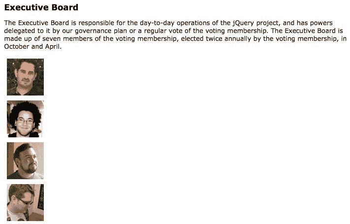
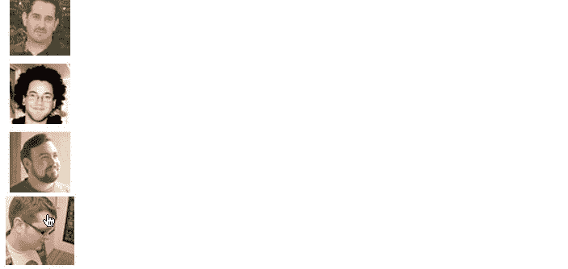
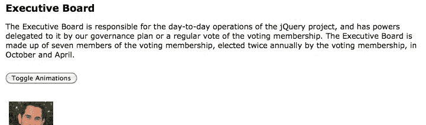
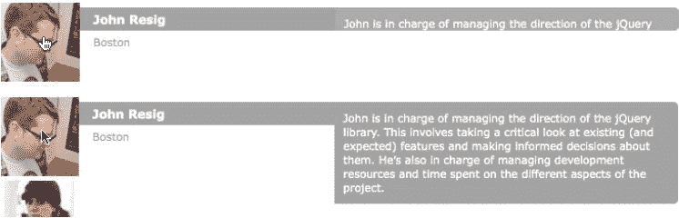

# 十一、高级效果

自从了解了 jQuery 的动画功能之后，我们发现了它们的许多用途。我们可以轻松地隐藏和显示页面上的对象，我们可以优雅地调整元素的大小，我们可以顺利地重新定位元素。这个特效库是多功能的，它包含了比我们目前看到的更多的技术和专业能力。

在[第 4 章](04.html#2KS220-fd25fd954efc4043b43c8b05f3cc53ef)、*样式和动画*中，您了解了 jQuery 的基本动画功能。在这一更高级的章节中，我们将介绍：

*   收集有关动画状态的信息的方法
*   中断活动动画的方法
*   可以同时影响页面上所有动画的全局效果选项
*   延迟对象，允许我们在动画完成后进行操作
*   缓和，这会改变动画发生的速率

<footer style="margin-top: 5em;">

# 重温动画

为了刷新对 jQuery 效果方法的记忆，我们将在本章中建立一个基线，从一个简单的悬停动画开始。使用带有照片缩略图的文档，我们将在用户鼠标悬停时使每张照片*略微增长*，并在鼠标离开时收缩回原始大小。我们将使用的 HTML 标记还包含一些暂时隐藏的文本信息，我们将在本章后面部分使用这些信息：

```js
<div class="team"> 
  <div class="member"> 
     
    <div class="name">Rey Bango</div> 
    <div class="location">Florida</div> 
    <p class="bio">Rey Bango is a consultant living in South Florida,        
    specializing in web application development...</p> 
  </div> 
  <div class="member"> 
     
    <div class="name">Scott González</div> 
    <div class="location">North Carolina</div> 
    <div class="position">jQuery UI Development Lead</div> 
    <p class="bio">Scott is a web developer living in Raleigh, NC...       </p> 
  </div> 
  <!-- Code continues ... --> 
</div> 

```

Getting the example code
You can access the example code from the following GitHub repository: [https://github.com/PacktPublishing/Learning-jQuery-3](https://github.com/PacktPublishing/Learning-jQuery-3).

CSS 最初通过将每个`<div>`移动到其`overflow: hidden`容器的左侧来隐藏与每个图像相关的文本：

```js
.member { 
  position: relative; 
  overflow: hidden; 
} 

.member div { 
  position: absolute; 
  left: -300px; 
  width: 250px; 
} 

```

HTML 和 CSS 一起生成垂直排列的图像列表：



为了改变图像的大小，我们将其高度和宽度从`75`像素增加到`85`像素。同时，为了保持图像居中，我们将其填充从`5`像素减少到`0`像素：

```js
$(() => {
  $('div.member')
    .on('mouseenter mouseleave', ({ type, target }) => {
      const width = height = type == 'mouseenter' ?
        85 : 75;
      const paddingTop = paddingLeft = type == 'mouseenter' ?
        0 : 5;

      $(target)
        .find('img')
        .animate({
          width,
          height,
          paddingTop,
          paddingLeft
        });
    });
}); 

```

Listing 11.1

在这里，我们重复我们在[第 10 章](10.html#6S9HU0-fd25fd954efc4043b43c8b05f3cc53ef)*高级事件*中看到的模式，因为当鼠标进入该区域时，我们执行的大部分工作与它离开时相同；我们将`mouseenter`和`mouseleave`的处理程序组合成一个函数，而不是用两个单独的回调调用`.hover()`。在这个处理程序中，我们根据触发两个事件中的哪一个来确定`size`和`padding`的值，并将这些属性值传递给`.animate()`方法。

When you see the object literal notation surrounding function arguments `({ type, target})`, it's called **object destructuring**. This is simply a convenient way to get the exact properties we need out of the event object, leading to more concise code in the function itself.

现在，当鼠标光标位于图像上时，它比其他图像稍大：



<footer style="margin-top: 5em;">

# 观察和中断动画

我们的基本动画已经揭示了一个问题。只要在每次`mouseenter`或`mouseleave`事件后有足够的时间完成动画，动画就会按预期进行。但是，当鼠标光标快速移动并且事件被快速触发时，我们会看到图像也会重复地增长和收缩，甚至在最后一个事件被触发之后。出现这种情况的原因是，正如[第 4 章](04.html#2KS220-fd25fd954efc4043b43c8b05f3cc53ef)、*样式和动画*中所述，给定元素上的动画被添加到队列中并按顺序调用。第一个动画将立即调用，在分配的时间内完成，然后从队列中删除，此时下一个动画将成为第一个动画，并被调用、完成、移动，依此类推，直到队列为空。

在许多情况下，jQuery 中称为`fx`的动画队列会导致理想的行为。然而，在像我们这样的悬停行动中，它需要被规避。

<footer style="margin-top: 5em;">

# 确定动画状态

避免不必要的动画排队的一种方法是使用 jQuery 的自定义`:animated`选择器。在`mouseenter`/`mouseleave`事件处理程序中，我们可以使用选择器检查图像，并查看其当前是否正在设置动画：

```js
$(() => {
  $('div.member')
    .on('mouseenter mouseleave', ({ type, target }) => {
      const width = height = type == 'mouseenter' ?
        85 : 75;
      const paddingTop = paddingLeft = type == 'mouseenter' ?
        0 : 5;

      $(target)
        .find('img')
        .not(':animated')
        .animate({
          width,
          height,
          paddingTop,
          paddingLeft
        });
      });
});

```

Listing 11.2

当用户的鼠标进入成员`<div>`时，仅当图像尚未设置动画时，图像才会设置动画。当鼠标离开时，无论其状态如何，动画都将出现，因为我们始终希望它最终将图像恢复为其原始尺寸和填充。

我们已经成功地避免了清单 11.1 中出现的失控动画，但是动画仍然需要改进。当鼠标快速进入并离开`<div>`标记时，图像仍需完成整个`mouseenter`动画（生长），然后才能开始`mouseleave`动画（收缩）。当然，这并不理想，但对`:animated`伪类的测试引入了一个更大的问题：如果在图像*收缩*时鼠标进入`<div>`标记，图像将无法再次增长。只有动画停止后的后续`mouseleave`和`mouseenter`动画才会执行另一个动画。虽然在某些情况下使用`:animated`选择器可能很有用，但在这里它的帮助还不够。

<footer style="margin-top: 5em;">

# 停止正在运行的动画

幸运的是，jQuery 有一种方法可以帮助我们解决*清单 11.2*中的两个问题。`.stop()`方法可以在动画轨迹中停止动画。要使用它，我们可以将代码返回到*清单 11.1*中的方式，只需在`.find()`和`.animate()`之间插入`.stop()`：

```js
$(() => {
  $('div.member')
    .on('mouseenter mouseleave', ({ type, currentTarget }) => {
      const width = height = type == 'mouseenter' ?
        85 : 75;
      const paddingTop = paddingLeft = type == 'mouseenter' ?
        0 : 5;

      $(currentTarget)
        .find('img')
        .stop()
        .animate({
          width,
          height,
          paddingTop,
          paddingLeft
        });
    });
});

```

Listing 11.3

值得注意的是，在继续新动画之前，我们停止当前动画*。现在，当鼠标反复进出时，我们先前尝试的不良效果就消失了。当前动画总是立即完成，因此在`fx`队列中不会有多个动画。当鼠标最终静止时，最终动画完成，因此图像要么完全生长（`mouseenter`），要么恢复到其原始尺寸（`mouseleave`），具体取决于最后触发的事件。*

<footer style="margin-top: 5em;">

# 停止动画时请小心

由于默认情况下，`.stop()`方法会在动画的当前位置停止动画，因此当与速记动画方法一起使用时，可能会产生令人惊讶的结果。在设置动画之前，这些速记方法确定最终值，然后设置该值的动画。例如，如果`.slideDown()`在其动画过程中以`.stop()`停止，然后调用`.slideUp()`，则下一次对元素调用`.slideDown()`时，它将仅向下滑动到上次停止的高度。为了缓解这类问题，`.stop()`方法可以接受两个布尔（`true`/`false`）参数，第二个参数称为`goToEnd`。如果我们将此参数设置为`true`，则当前动画不仅停止，而且会立即跳到最终值。尽管如此，`goToEnd`功能仍然可以使动画看起来*急促*，因此更好的解决方案可能是将最终值存储在变量中，并使用`.animate()`显式地为其设置动画，而不是依赖 jQuery 来确定该值。

Another jQuery method, `.finish()`, is available for halting animations. It's similar to `.stop(true, true)` in that it clears all queued animations and jumps the current animation to the final value. However, unlike `.stop(true, true)`, it jumps all the *queued* animations to their final values as well.

<footer style="margin-top: 5em;">

# 使用全局效果属性

jQuery 中的效果模块包括一个方便的`$.fx`对象，当我们想要全面更改动画的特性时，可以访问该对象。尽管此对象的某些属性没有文档记录，仅用于库本身，但其他属性作为工具提供，用于全局更改动画的运行方式。在下面的示例中，我们将查看一些已记录的属性。

<footer style="margin-top: 5em;">

# 禁用所有效果

我们已经讨论了一种停止当前正在运行的动画的方法，但是如果我们需要完全禁用所有动画，该怎么办？例如，我们可能希望在默认情况下提供动画，但对于动画可能看起来不稳定的低资源设备或发现动画分散注意力的用户禁用这些动画。为此，我们可以简单地将`$.fx.off`属性设置为`true`。在我们的演示中，我们将显示一个先前隐藏的按钮，允许用户打开和关闭动画：

```js
$(() => {
  $('#fx-toggle')
    .show()
    .on('click', () => {
      $.fx.off = !$.fx.off;
    });
}); 

```

Listing 11.4

“隐藏”按钮显示在介绍段落和后续图像之间：



当用户单击按钮关闭动画时，后续动画（如我们的成长和收缩图像）将立即发生（持续时间为`0`毫秒），此后将立即调用任何回调函数。

<footer style="margin-top: 5em;">

# 定义影响持续时间

`$.fx`对象的另一个属性是`speeds`。此属性本身是一个对象，由三个属性组成，jQuery 核心文件证明了这一点：

```js
speeds: { 
  slow: 600, 
  fast: 200, 
  // Default speed 
  _default: 400 
} 

```

您已经了解到，jQuery 的所有动画方法都提供了可选的速度或持续时间参数。查看`$.fx.speeds`对象，我们看到字符串`slow`和`fast`分别映射到 600 毫秒和 200 毫秒。每次调用动画方法时，jQuery 都会按照以下顺序执行以下步骤以确定效果的持续时间：

1.  检查`$.fx.off`是否为`true`。如果是，则将持续时间设置为`0`。
2.  它检查传递的持续时间是否为数字。如果是，则将持续时间设置为该毫秒数。
3.  它检查持续时间过程是否与`$.fx.speeds`对象的一个属性键匹配。如果是，则将持续时间设置为属性的值。
4.  如果上述检查未设置持续时间，则将持续时间设置为值`$.fx.speeds._default`。

根据这些信息，我们现在知道传递除`slow`或`fast`之外的任何字符串持续时间将导致 400 毫秒的持续时间。我们还可以看到，添加我们自己的自定义速度与向`$.fx.speeds`添加另一个属性一样简单。例如，如果我们编写`$.fx.speeds.crawl = 1200`，我们可以使用`'crawl'`作为任何动画方法的速度参数来运行动画 1200 毫秒，如下所示：

```js
$(someElement).animate({width: '300px'}, 'crawl'); 

```

尽管键入`'crawl'`并不比键入`1200`简单，但在大型项目中，当许多共享特定速度的动画需要更改时，自定义速度可以派上用场。在这种情况下，我们可以只更改`$.fx.speeds.crawl`的值，而不是在整个项目中搜索`1200`并仅在表示动画速度时替换每个值。

虽然自定义速度可能很有用，但更改默认速度的功能可能更有用。我们可以通过设置`_default`属性来实现：

```js
$.fx.speeds._default = 250; 

```

Listing 11.5

现在我们已经定义了一个新的更快的默认速度，我们添加的任何新动画都将使用它，除非我们覆盖它们的持续时间。为了在工作中看到这一点，我们将在页面中引入另一个交互元素。当用户单击其中一幅肖像时，我们希望显示与此人相关的详细信息。我们将通过将细节*从肖像下方移动到最终位置，创造从肖像中展开*的幻觉：

```js
$(() => { 
  const showDetails = ({ currentTarget }) => {
    $(currentTarget)
      .find('div')
      .css({
        display: 'block',
        left: '-300px',
        top: 0
      })
      .each((i, element) => {
        $(element)
          .animate({
            left: 0,
            top: 25 * i
          });
      });
  }; 
  $('div.member').click(showDetails); 
}); 

```

Listing 11.6

单击成员时，我们使用`showDetails()`函数作为处理程序。此函数首先在成员肖像下方的起始位置设置细节`<div>`元素。然后，它将每个元素设置为其最终位置的动画。通过调用`.each()`，我们可以为每个元素计算一个单独的最终`top`位置。

动画完成后，细节文本可见：


由于`.animate()`方法调用是在不同的元素上进行的，因此它们同时发生而不是排队。而且，由于这些调用没有指定持续时间，它们都使用新的默认持续时间 250 毫秒。

单击其他成员时，我们希望隐藏以前显示的成员。通过使用类，我们可以轻松跟踪屏幕上当前显示的详细信息：

```js
 const showDetails = ({ currentTarget }) => {
   $(currentTarget)
     .siblings('.active')
     .removeClass('active')
     .children('div')
     .fadeOut()
     .end()
     .end()
     .addClass('active')
     .find('div')
     .css({
       display: 'block',
       left: '-300px',
       top: 0
     })
     .each((i, element) => {
       $(element)
         .animate({
           left: 0,
           top: 25 * i
         });
     });
}; 

```

Listing 11.7

哎哟十项功能连在一起？等等，这可能比把它们分开要好。首先，像这样将调用链接在一起意味着不需要临时变量来保存中间 DOM 值。相反，我们可以一行接一行地阅读来了解发生了什么。现在让我们来看看这些：

*   `.siblings('.active')`：查找活动的`<div>`同级
*   `.removeClass('active')`：删除`.active`类
*   `.children('div')`：找到子`<div>`元素
*   `.fadeOut()`：这将删除它们
*   `.end()`：清除`.children('div')`查询
*   `.end()`：清除`.siblings('.active')`查询
*   `.addClass('active')`：将`.active`类添加到事件目标容器`<div>`
*   `.find('div')`：查找所有要显示的子`<div>`元素
*   `.css()`：设置相关的显示 CSS
*   `.each()`：这将向`top`和`left`CSS 属性添加动画

请注意，我们的`.fadeOut()`调用也使用了我们定义的更快的 250 毫秒持续时间。默认值适用于 jQuery 的预打包效果，就像它们适用于自定义`.animate()`调用一样。

<footer style="margin-top: 5em;">

# 多属性宽松

`showDetails()`函数几乎完成了我们计划实现的展开效果，但由于`top`和`left`属性以相同的速率进行动画，因此它看起来更像是滑动效果。我们可以通过将`top`属性的缓和方程更改为`easeInQuart`来微妙地改变效果，使元素沿着曲线路径而不是直线路径。但是，请记住，使用除`swing`或`linear`之外的任何版本都需要一个插件，比如 jQueryUI 的 effects 核心（[http://jqueryui.com/](http://jqueryui.com/) 。

```js
.each((i, element) => {
  $(element)
    .animate({
      left: 0,
      top: 25 * i
    },{
      duration: 'slow',
      specialEasing: {
        top: 'easeInQuart'
      }
    });
 });

```

Listing 11.8

`specialEasing`选项允许我们为正在设置动画的每个属性设置不同的加速曲线。任何未包含在期权中的属性将使用`easing`期权公式（如果已提供），或默认`swing`公式（如果未提供）。

我们现在有一个吸引人的动画，展示了与团队成员相关的大部分细节。然而，我们还没有展示会员的传记。在我们这样做之前，我们需要稍微离题一点来讨论 jQuery 的延迟对象机制。

<footer style="margin-top: 5em;">

# 使用延迟对象

有时，我们会遇到这样的情况：当一个过程完成时，我们想要采取行动，但我们不一定知道这个过程需要多长时间，甚至不知道它是否会成功。为了处理这些情况，jQuery 向我们提供了**延迟对象**（承诺）。延迟对象封装需要一些时间才能完成的操作。

通过调用`$.Deferred()`构造函数，可以随时创建新的延迟对象。一旦我们有了这样一个对象，我们就可以执行长时间运行的操作，然后调用对象上的`.resolve()`或`.reject()`方法来指示操作是否成功。然而，手动执行此操作有些不寻常。通常，jQuery 或其插件不会手动创建我们自己的延迟对象，而是创建对象并负责解析或拒绝它。我们只需要学习如何使用创建的对象。

Rather than detailing how the `$.Deferred()` constructor operates, we will focus here on how jQuery effects take advantage of deferred objects. In [Chapter 13](13.html#8JJII0-fd25fd954efc4043b43c8b05f3cc53ef), *Advanced Ajax*, we will further explore deferred objects in the context of Ajax requests.

每个延迟对象都承诺向其他代码提供数据。这个承诺被表示为另一个对象，它有自己的方法集。从任何延迟对象中，我们都可以通过调用其`.promise()`方法获得其承诺对象。然后，我们可以调用承诺的方法来附加在承诺实现时执行的处理程序：

*   `.then()`方法附加了一个处理程序，该处理程序在成功解析延迟对象时被调用
*   `.catch()`方法附加了一个处理程序，该处理程序在拒绝延迟对象时被调用
*   `.always()`方法附加一个处理程序，该处理程序在延迟对象完成其任务时被调用，无论是通过解析还是拒绝

这些处理程序与我们提供给`.on()`的回调非常相似，因为它们是在某些事件发生时调用的函数。我们还可以将多个处理程序附加到同一个承诺，并在适当的时间调用所有处理程序。然而，有几个重要的区别。承诺处理程序只会被调用一次；延迟对象无法再次解析。如果在附加处理程序时已解析延迟对象，则还会立即调用承诺处理程序。

在[第 6 章](06.html#40NRU0-fd25fd954efc4043b43c8b05f3cc53ef)*中，我们看到了一个非常简单的例子，说明 jQuery 的 Ajax 系统如何使用延迟对象。现在，我们将通过研究 jQuery 动画系统创建的延迟对象，再次使用这个强大的工具。*

<footer style="margin-top: 5em;">

# 动画承诺

每个 jQuery 集合都有一组与其关联的延迟对象，跟踪集合中元素的排队操作状态。通过对 jQuery 对象调用`.promise()`方法，我们得到一个承诺对象，该对象在队列完成时解析。特别是，我们可以使用这个承诺在任何匹配元素上运行的所有动画完成后采取行动。

正如我们有一个`showDetails()`函数来显示成员姓名和位置信息一样，我们也可以编写一个`showBio()`函数来查看传记信息。但首先，我们将在`<body>`标记上附加一个新的`<div>`标记，并设置两个选项对象：

```js
$(() => {
  const $movable = $('<div/>')
    .attr('id', 'movable')
    .appendTo('body');

  const bioBaseStyles = {
    display: 'none',
    height: '5px',
    width: '25px'
  }

  const bioEffects = {
    duration: 800,
    easing: 'easeOutQuart',
    specialEasing: {
      opacity: 'linear'
    }
  };
});

```

Listing 11.9

这个新的`movable``<div>`元素是我们在给它注入传记副本后实际制作的元素。在为元素的宽度和高度设置动画时，使用这样的包装器元素特别有用。我们可以将其`overflow`属性设置为`hidden`，并为其中的传记设置明确的宽度和高度，以避免文本的持续回流，而如果我们将传记`<div>`元素本身设置为动画，就会发生这种情况。

我们将使用`showBio()`函数根据单击的成员图像确定可移动`<div>`的开始和结束样式。请注意，我们正在使用`$.extend()`方法将保持不变的基本样式集与`top`和`left`属性合并，这些属性根据成员的位置而变化。然后，只需使用`.css()`设置开始样式，使用`.animate()`设置结束样式：

```js
const showBio = (target) => {
  const $member = $(target).parent();
  const $bio = $member.find('p.bio');
  const startStyles = $.extend(
    {},
    bioBaseStyles,
    $member.offset()
  );
  const endStyles = {
    width: $bio.width(),
    top: $member.offset().top + 5,
    left: $member.width() + $member.offset().left - 5,
    opacity: 'show'
  };

  $movable
    .html($bio.clone())
    .css(startStyles)
    .animate(endStyles, bioEffects)
    .animate(
      { height: $bio.height() },
      { easing: 'easeOutQuart' }
    );
}; 

```

Listing 11.10

我们对两种`.animate()`方法进行排队，这样传记在变得更宽和完全不透明时首先从左边飞起，然后在它就位后滑到最高处。

在[第 4 章](04.html#2KS220-fd25fd954efc4043b43c8b05f3cc53ef)*样式和动画*中，我们看到当集合中每个元素的动画完成时，jQuery 动画方法中的回调函数被调用。我们想在其他`<div>`元素出现后再展示该成员的传记。在 jQuery 引入`.promise()`方法之前，这将是一项繁重的任务，要求我们从每次执行回调时的元素总数开始倒数，直到最后一次，此时我们可以执行代码来制作传记动画。

现在我们可以简单地将`.promise()`和`.then()`方法链接到`showDetails()`函数中的`.each()`方法：

```js
const showDetails = ({ currentTarget }) => {
  $(currentTarget)
    .siblings('.active')
    .removeClass('active')
    .children('div')
    .fadeOut()
    .end()
    .end()
    .addClass('active')
    .find('div')
    .css({
      display: 'block',
      left: '-300px',
      top: 0
    })
    .each((i, element) => {
      $(element)
        .animate({
          left: 0,
          top: 25 * i
        },{
          duration: 'slow',
          specialEasing: {
            top: 'easeInQuart'
          }
        });
    })
    .promise()
    .then(showBio);
}; 

```

Listing 11.11

`.then()`方法将对`showBio()`函数的引用作为其参数。现在，单击一个图像，即可通过一个吸引人的动画序列查看该成员的所有信息：



Since jQuery 3.0, the promises returned by the `promise()` method are fully compatible with native ES 2015 promises. This means that where possible, we should use the same API. For example, use `then()` instead of `done()`. They do the same thing, and your asynchronous code will be consistent with other asynchronous code.

<footer style="margin-top: 5em;">

# 对动画进行细粒度控制

尽管我们已经研究了许多高级特性，jQuery 的效果模块还有很多需要探索的地方。对 jQuery1.8 模块的重写为高级开发人员引入了许多方法来微调各种效果，甚至更改驱动动画的底层引擎。例如，`.animate()`方法除了提供`duration`和`easing`等选项外，还提供了两个回调选项，让我们可以在每个步骤中检查和修改动画：

```js
$('#mydiv').animate({ 
  height: '200px', 
  width: '400px' 
}, { 
  step(now, tween) { 
   // monitor height and width 
   // adjust tween properties 
  }, 
  progress(animation, progress, remainingMs) {} 
}); 

```

`step()`函数，在动画过程中，大约每 13 毫秒为每个动画属性调用一次，允许我们通过传递的`now`参数，根据属性的当前值调整`tween`对象的属性，如结束值、放松类型或正在动画的实际属性。例如，一个复杂的演示可能会使用`step()`功能检测两个运动元件之间的碰撞，并在碰撞时调整它们的轨迹。

在动画的整个生命周期中，`progress()`函数类似地被多次调用：

*   它与`step()`的不同之处在于，在每个步骤中，每个元素只调用一次它，而不管动画中有多少属性
*   它提供动画的不同方面，包括动画的承诺对象、进度（介于`0`和`1`之间的数字）以及动画中剩余的毫秒数

jQuery 的所有动画都使用一个名为`setTimeout()`的 JavaScript 计时器函数来重复调用函数（默认情况下每 13 毫秒一次），并在每次勾选期间更改样式属性。然而，一些现代浏览器提供了一种新的`requestAnimationFrame()`功能，与`setTimeout()`相比具有优势，包括提高了精确度（因此可以感觉到动画的流畅性）和改善了移动设备的电池消耗。

jQuery 动画系统的最底层是它的`$.Animation()`和`$.Tween()`函数。这些函数及其对应的对象可用于调整动画的每个可能方面。例如，我们可以使用`$.Animation`创建动画**前置过滤器****。**一个这样的预过滤器可能需要一段时间

特指的

基于传递给`.animate()`方法的`options`对象的属性存在的动画结束时的操作：

```js
$.Animation.prefilter(function(element, properties, options) { 
  if (options.removeAfter) { 
    this.done(function () { 
      $(element).remove(); 
    }); 
  } 
}); 

```

有了这段代码，调用`$('#my-div').fadeOut({ removeAfter: true })`将在`<div>`淡出后自动从 DOM 中删除它。

<footer style="margin-top: 5em;">

# 总结

在本章中，我们进一步研究了几种技术，这些技术可以帮助我们制作对用户有用的漂亮动画。现在，我们可以单独控制正在设置动画的每个属性的加速和减速，并在需要时单独或全局停止这些动画。我们了解了 jQuery 的效果库内部定义的属性，以及如何更改其中一些属性以满足我们的需要。我们第一次涉足 jQuery 延迟对象系统，我们将在[第 13 章](13.html#8JJII0-fd25fd954efc4043b43c8b05f3cc53ef)、*高级 Ajax*中进一步探讨，我们体验到了许多微调 jQuery 动画系统的机会。

<footer style="margin-top: 5em;">

# 进一步阅读

在本书的*附录 B*中，或在[的官方 jQuery 文档中，可以找到效果和动画方法的完整列表 http://api.jquery.com/](http://api.jquery.com/) 。

<footer style="margin-top: 5em;">

# 练习

挑战练习可能需要使用位于[的正式 jQuery 文档 http://api.jquery.com/](http://api.jquery.com/) 。

1.  定义一个名为`zippy`的新动画速度常数，并将其应用于传记显示效果。
2.  更改构件细节水平移动的缓和度，使其反弹到位。
3.  在承诺中添加第二个延迟回调函数，该函数将`highlight`类添加到当前成员的位置`<div>`。
4.  挑战：在设置传记动画之前增加两秒钟的延迟。使用 jQuery`.delay()`方法。
5.  挑战：单击活动照片时，折叠生物详细信息。执行此操作之前，请停止任何正在运行的动画。

</footer>

</footer>

</footer>

</footer>

</footer>

</footer>

</footer>

</footer>

</footer>

</footer>

</footer>

</footer>

</footer>

</footer>

</footer>