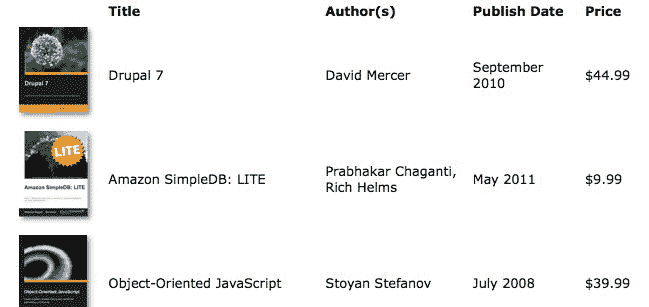
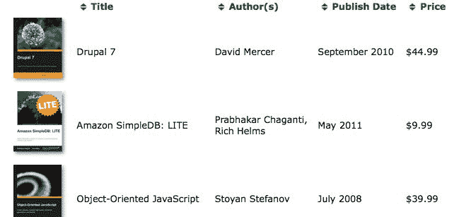
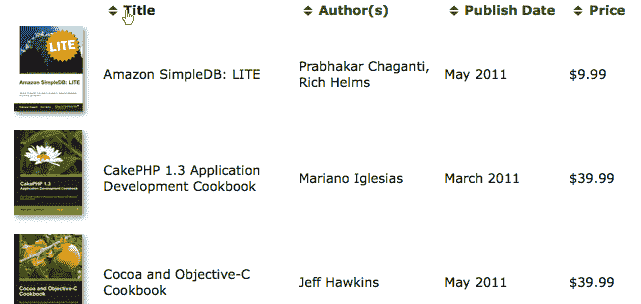
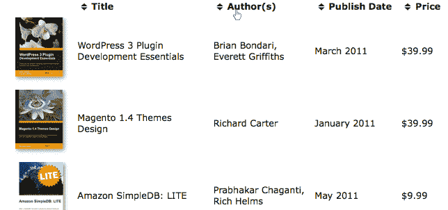
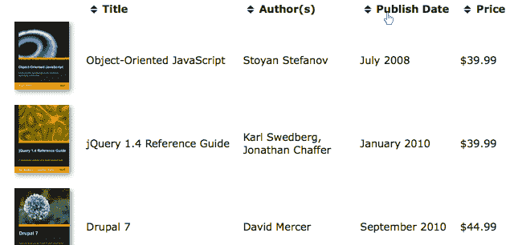
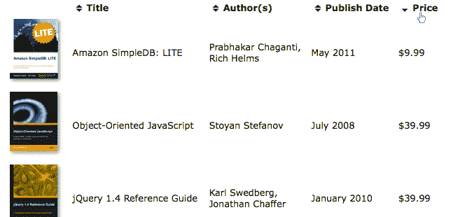

# 十二、高级 DOM 操作

在本书中，我们使用 jQuery 强大的 DOM 操作方法来更改文档的内容。我们现在看到了几种插入新内容、移动现有内容或完全删除内容的方法。我们还知道如何改变元素的属性和属性以满足我们的需要。

在[第 5 章](05.html#3BOFI0-fd25fd954efc4043b43c8b05f3cc53ef)*操作 DOM*中，我们介绍了这些重要技术。在这一更高级的章节中，我们将介绍：

*   使用`.append()`对页面元素进行排序
*   将自定义数据附着到元素
*   读取 HTML5 数据属性
*   从 JSON 数据创建元素
*   使用 CSS 挂钩扩展 DOM 操作系统

<footer style="margin-top: 5em;">

# 排序表行

我们在本章中研究的大多数主题都可以通过对表中的行进行排序来演示。此常见任务是帮助用户快速找到所需信息的有用方法。当然，有很多方法可以做到这一点。

<footer style="margin-top: 5em;">

# 对服务器上的表进行排序

数据排序的常见解决方案是在服务器上执行。表中的数据通常来自数据库，这意味着从数据库中提取数据的代码可以按照给定的排序顺序请求数据（例如，使用 SQL 语言的`ORDER BY`子句）。如果我们可以使用服务器端代码，那么可以直接从合理的默认排序顺序开始。

不过，当用户可以确定排序顺序时，排序是最有用的。一个常见的用户界面是将可排序列的表头（`<th>`）设置为链接。这些链接可以转到当前页面，但会附加一个查询字符串，指示要排序的列，如以下代码段所示：

```js
<table id="my-data"> 
  <thead> 
    <tr> 
      <th class="name"> 
        <a href="index.php?sort=name">Name</a> 
      </th> 
      <th class="date"> 
        <a href="index.php?sort=date">Date</a> 
      </th> 
    </tr> 
  </thead> 
  <tbody> 
    ... 
  </tbody> 
</table> 

```

服务器可以通过以不同的顺序返回数据库内容来响应查询字符串参数。

<footer style="margin-top: 5em;">

# 使用 Ajax 对表进行排序

此设置很简单，但每次排序操作都需要刷新页面。正如我们所看到的，jQuery 允许我们使用*Ajax*方法消除此类页面刷新。如果我们像以前一样将列标题设置为链接，我们可以添加 jQuery 代码，将这些链接转换为 Ajax 请求：

```js
$(() => { 
  $('#my-data th a')
    .click((e) => { 
      e.preventDefault(); 
      $('#my-data tbody')
        .load($(e.target).attr('href')); 
    }); 
}); 

```

现在，当锚点被单击时，jQuery 向服务器发送一个针对同一页面的 Ajax 请求。当使用 jQuery 使用 Ajax 发出页面请求时，它将`X-Requested-With`HTTP 头设置为`XMLHttpRequest`，以便服务器可以确定正在发出 Ajax 请求。当此参数存在时，可以编写服务器代码以仅发送回`<tbody>`元素本身的内容，而不发送周围页面的内容。这样，我们可以使用响应来替换现有`<tbody>`元素的内容。

这是**渐进增强**的一个例子。该页面在没有任何 JavaScript 的情况下运行良好，因为用于服务器端排序的链接仍然存在。但是，当 JavaScript 可用时，我们会劫持页面请求，并允许在没有完整页面加载的情况下进行排序。

<footer style="margin-top: 5em;">

# 在浏览器中对表进行排序

但是，有时我们不想在排序时等待服务器响应，或者没有可用的服务器端脚本语言。在这种情况下，一个可行的替代方法是使用 JavaScript 和 jQuery 的 DOM 操作方法完全在浏览器上执行排序。

为了演示本章中的各种技术，我们将设置三个单独的 jQuery 排序机制。每个人都将以独特的方式实现相同的目标。我们的示例将使用以下方法对表格进行排序：

*   从 HTML 内容中提取的数据
*   HTML5 自定义数据属性
*   表数据的 JSON 表示形式

我们将要排序的表将具有不同的 HTML 结构，以适应不同的 JavaScript 技术，但每个表都包含列，列出书籍、作者姓名、发布日期和价格。第一个表的结构很简单：

```js
<table id="t-1" class="sortable"> 
  <thead> 
    <tr> 
      <th></th> 
      <th class="sort-alpha">Title</th> 
      <th class="sort-alpha">Author(s)</th> 
      <th class="sort-date">Publish Date</th> 
      <th class="sort-numeric">Price</th> 
    </tr> 
  </thead> 
  <tbody> 
    <tr> 
      <td></td> 
      <td>Drupal 7</td> 
      <td>David <span class="sort-key">Mercer</span></td> 
      <td>September 2010</td> 
      <td>$44.99</td> 
    </tr> 
    <!-- code continues --> 
  </tbody> 
</table> 

```

Getting the example code
You can access the example code from the following GitHub repository: [https://github.com/PacktPublishing/Learning-jQuery-3](https://github.com/PacktPublishing/Learning-jQuery-3). 

在使用 JavaScript 增强表之前，前几行如下所示：



<footer style="margin-top: 5em;">

# 重新访问移动和插入元素

在接下来的示例中，我们将构建一个灵活的排序机制，该机制可以在每一列上工作。为此，我们将使用 jQueryDOM 操作方法插入一些新元素，并将其他现有元素移动到 DOM 中的新位置。我们将从拼图中最简单的部分开始——链接表标题。

<footer style="margin-top: 5em;">

# 围绕现有文本添加链接

我们希望将表头转换为链接，按照各自的列对数据进行排序。我们可以使用 jQuery 的`.wrapInner()`方法来添加它们；我们从[第 5 章](https://cdp.packtpub.com/learning_jquery_3_0/wp-admin/post.php?post=37&action=edit#post_30)*操作 DOM*中回忆起，`.wrapInner()`将一个新元素（在本例中是一个`<a>`元素）*放置在*匹配元素的内部，但在子元素的周围放置*：*

```js
$(() => {
  const $headers = $('#t-1')
    .find('thead th')
    .slice(1);

  $headers
    .wrapInner($('<a/>').attr('href', '#'))
    .addClass('sort');
});

```

Listing 12.1

我们跳过了每个表的第一个`<th>`元素（使用`.slice()`，因为它不包含除空白以外的文本，因为不需要对封面照片进行标签或排序。然后，我们在剩下的`<th>`元素中添加了一个`sort`类，这样我们就可以在 CSS 中将它们与不可排序的元素区分开来。现在，标题行如下所示：



这是渐进增强对应的**优雅降级**的一个例子。与前面讨论的 Ajax 解决方案不同，没有 JavaScript，这种技术无法正常工作；在本例中，我们假设服务器没有可用的脚本语言。由于排序工作需要 JavaScript，因此我们仅通过代码添加`sort`类和锚点，从而确保接口指示只有在脚本可以运行时才可以进行排序。由于我们实际上是在创建链接，而不是简单地添加视觉样式来表示可以单击标题，因此我们为需要通过键盘导航到标题的用户提供了额外的可访问性优势（通过按*选项卡*键）。页面**将**降级为仍然可用的页面，尽管没有可用的排序。

<footer style="margin-top: 5em;">

# 对简单 JavaScript 数组排序

为了执行排序，我们将利用 JavaScript 的内置`.sort()`方法。它对数组进行就地排序，可以将**比较器****函数**作为参数。此函数用于比较数组中的两个项目，并根据排序数组中的第一个项目返回正数或负数。

例如，以一个简单的数字数组为例：

```js
const arr = [52, 97, 3, 62, 10, 63, 64, 1, 9, 3, 4]; 

```

我们可以通过调用`arr.sort()`对该数组进行排序。在此之后，项目的顺序如下：

```js
[1, 10, 3, 3, 4, 52, 62, 63, 64, 9, 97] 

```

默认情况下，正如我们在这里看到的，项目是按照**字典顺序**（按字母顺序）排序的。在这种情况下，对项目*进行数字排序*可能更有意义。为此，我们可以为`.sort()`方法提供一个比较器函数：

```js
arr.sort((a, b) => a < b ? -1 : (a > b ? 1 : 0)); 

```

如果排序后的数组中`a`排在第一位，则此函数返回负数；如果`b`排在第一位，则返回正数；如果项目的顺序无关紧要，则返回零。有了这些信息，`.sort()`方法可以对项目进行适当排序：

```js
[1, 3, 3, 4, 9, 10, 52, 62, 63, 64, 97] 

```

接下来我们将把这个`.sort()`方法应用于我们的表行。

<footer style="margin-top: 5em;">

# 对 DOM 元素排序

让我们对表的`Title`列执行排序。请注意，当我们将`sort`类添加到该列和其他列中时，该列的标题单元格已经有一个由 HTML 提供的`sort-alpha`类。其他标题单元格也接受了类似的处理，这取决于每个单元格的排序类型，但现在我们将重点关注`Title`标题，它需要简单的字母排序：

```js
$(() => {
  const comparator = (a, b) => a < b ? -1 : (a > b ? 1 : 0);
  const sortKey = (element, column) => $.trim($(element)
    .children('td')
    .eq(column)
    .text()
    .toUpperCase()
  );

  $('#t-1')
    .find('thead th')
    .slice(1)
    .wrapInner($('<a/>').attr('href', '#'))
    .addClass('sort')
    .on('click', (e) => {
      e.preventDefault();

      const column = $(e.currentTarget).index();

      $('#t-1')
        .find('tbody > tr')
        .get()
        .sort((a, b) => comparator(
          sortKey(a, column),
          sortKey(b, column)
        ))
        .forEach((element) => {
          $(element)
            .parent()
            .append(element);
        });
    });
}); 

```

Listing 12.2

找到单击的标题单元格的索引后，我们将检索所有数据行的数组。这是一个很好的例子，说明了`.get()`在将 jQuery 对象转换为 DOM 节点数组时是多么有用；尽管 jQuery 对象在许多方面与数组类似，但它们并没有所有可用的本机数组方法，例如`.pop()`或`.shift()`。

Internally, jQuery actually does define a few methods that act like native array methods. For example, `.sort()`, `.push()`, and `.splice()` are methods of jQuery objects. However, since these methods are for internal use and not publicly documented, we cannot rely on them behaving in expected ways in our own code, and should thus avoid calling them on jQuery objects.

现在我们有了一个 DOM 节点数组，我们可以对它们进行排序，但要做到这一点，我们需要编写一个适当的比较器函数。我们希望根据相关表单元格的文本内容对行进行排序，因此这将是 comparator 函数将检查的信息。我们知道要查看哪个单元格，因为我们通过`.index()`调用捕获了列索引。我们使用 jQuery 的`$.trim()`函数去掉前导和尾随空格，然后将文本转换为大写，因为 JavaScript 中的字符串比较区分大小写，而排序应该不区分大小写。

我们的数组现在已排序，但请注意，`.sort()`的调用并没有改变 DOM 本身。为此，我们需要调用 DOM 操纵方法来移动行。我们一次只做一行，在循环时将每一行重新插入到表中。由于`.append()`不克隆节点，因此*会移动*节点，而不是复制节点。我们的表现在已排序：



<footer style="margin-top: 5em;">

# 与 DOM 元素一起存储数据

我们的代码可以工作，但速度相当慢。罪魁祸首是比较器函数，它正在做大量的工作。在排序过程中，将多次调用此比较器，这意味着它需要快速。

Array sorting performance
The actual sort algorithm used by JavaScript is not defined by the standard. It may be a simple sort such as a **bubble** **sort** (worst case of Θ(*n*<sup style=";color:black;">2</sup>) in computational complexity terms), or a more sophisticated approach such as a **quick sort** (which is Θ(*n* log *n*) on average). It is safe to say, though, that doubling the number of items in an array will more than double the number of times the comparator function is called.

我们的慢速比较器的补救方法是**预先计算**用于比较的键。我们可以在初始循环中完成大部分昂贵的工作，并使用 jQuery 的`.data()`方法存储结果，该方法设置或检索与页面元素相关的任意信息。然后我们可以简单地检查 comparator 函数中的键，我们的排序速度明显更快：

```js
$('#t-1')
  .find('thead th')
  .slice(1)
  .wrapInner($('<a/>').attr('href', '#'))
  .addClass('sort')
  .on('click', (e) => {
    e.preventDefault();

    const column = $(e.currentTarget).index();

    $('#t-1')
      .find('tbody > tr')
      .each((i, element) => {
        $(element)
          .data('sortKey', sortKey(element, column));
      })
      .get()
      .sort((a, b) => comparator(
        $(a).data('sortKey'),
        $(b).data('sortKey')
      ))
      .forEach((element) => {
        $(element)
          .parent()
          .append(element);
      });
  }); 

```

Listing 12.3

`.data()`方法及其补充`.removeData()`提供了一种数据存储机制，可以方便地替代**expando****属性**或直接添加到 DOM 元素的非标准属性

<footer style="margin-top: 5em;">

# 执行额外的预计算

现在，我们希望对表的 Author（s）列应用相同的排序行为。由于其表头单元格具有`sort-alpha`类，因此可以使用现有代码对作者列进行排序。不过，理想情况下，作者应该按姓氏排序，而不是按首字母排序。由于有些书有多个作者，有些作者有中间名或首字母缩写，我们需要外部指导来确定文本的哪一部分用作排序键。我们可以通过将单元格的相关部分包装在标签中来提供此指导：

```js
<td>David <span class="sort-key">Mercer</span></td> 

```

现在，我们必须修改我们的排序代码，以便在不干扰`Title`列的现有行为的情况下考虑该标记，该列已经运行良好。通过将标记的排序键前置到我们之前计算过的键，我们可以在调用姓氏时首先对其进行排序，但可以将整个字符串作为回退：

```js
const sortKey = (element, column) => {
  const $cell = $(element)
    .children('td')
    .eq(column);
  const sortText = $cell
    .find('span.sort-key')
    .text();
  const cellText = $cell
    .text()
    .toUpperCase();

  return $.trim(`${sortText} ${cellText}`);
}; 

```

Listing 12.4

按作者列排序现在使用提供的键，因此按姓氏排序：



如果两个姓氏相同，排序将使用整个字符串作为定位的分界符。

<footer style="margin-top: 5em;">

# 存储非字符串数据

我们的用户不仅可以按标题和作者列排序，还可以按发布日期和价格列排序。由于我们简化了比较器函数，它可以处理所有类型的数据，但首先需要针对其他数据类型调整计算键。例如，在价格的情况下，我们需要去掉前面的`<footer style="margin-top: 5em;"字符，并解析其余的字符，以便我们可以对它们进行数字比较：

```js
var key = parseFloat($cell.text().replace(/^[^\d.]*/, '')); 
if (isNaN(key)) { 
  key = 0; 
} 

```

此处使用的正则表达式删除除数字和小数点以外的任何前导字符，并将结果传递给`parseFloat()`。然后需要检查`parseFloat()`的结果，因为如果无法从文本中提取数字，则返回`NaN`（**不是数字**。这会对`.sort()`造成严重破坏，因此我们将任何非数字设置为`0`。

对于日期单元格，我们可以使用 JavaScript`Date`对象：

```js
var key = Date.parse(`1 ${$cell.text()}`); 

```

此表中的日期仅包含月份和年份；`Date.parse()`需要一个完全指定的日期。为了适应这种情况，我们在字符串前面加上了`1`，这样`September 2010`就变成了`1 September 2010`。现在我们有了一个完整的日期，`Date.parse()`可以将其转换为**时间戳**，可以使用我们的普通比较器对其进行排序。

我们可以将这些表达式放入三个单独的函数中，以便稍后我们可以根据应用于表头的类调用相应的函数：

```js
const sortKeys = {
  date: $cell => Date.parse(`1 ${$cell.text()}`),
  alpha: $cell => $.trim(
    $cell.find('span.sort-key').text() + ' ' +
    $cell.text().toUpperCase()
  ),
  numeric($cell) {
    const key = parseFloat(
      $cell
        .text()
        .replace(/^[^\d.]*/, '')
    );
    return isNaN(key) ? 0 : key;
  }
};

$('#t-1')
  .find('thead th')
  .slice(1)
  .each((i, element) => {
    $(element).data(
      'keyType',
      element.className.replace(/^sort-/,'')
    );
  })
  // ...

```

Listing 12.5

我们已经修改了脚本，根据每个列标题单元格的类名存储`keyType`数据。我们去掉了班上的`sort-`部分，剩下的是`alpha`、`numeric`或`date`。通过使每个排序函数成为`sortKeys`对象的一种方法，我们可以使用**数组表示法**并传入头单元`keyType`数据的值以调用适当的函数。

通常在调用方法时，我们使用**点符号**。事实上，这就是我们在本书中调用 jQuery 对象方法的方式。例如，要将一个类`bar`添加到`<div class="foo">`，我们需要编写`$('div.foo').addClass('bar')`。因为 JavaScript 允许以点或数组表示法表示属性和方法，所以我们也可以将其写成`$('div.foo')['addClass']('bar')`。大多数时候这样做没有多大意义，但这是一种不使用一堆`if`语句而有条件地调用方法的好方法。对于我们的`sortKeys`对象，我们可以调用`alpha`方法，如`sortKeys.alpha($cell)`或`sortKeys['alpha']($cell)`，或者，如果方法名称存储在`keyType`常量中，则调用`sortKeys[keyType]($cell)`。我们将在`click`处理程序中使用第三种变体：

```js
// ...
.on('click', (e) => {
  e.preventDefault();

  const column = $(e.currentTarget).index();
  const keyType = $(e.currentTarget).data('keyType');

  $('#t-1')
    .find('tbody > tr')
    .each((i, element) => {
      $(element).data(
        'sortKey',
        sortKeys[keyType](
          $(element)
            .children('td')
            .eq(column)
        )
      );
    })
    .get()
    .sort((a, b) => comparator(
      $(a).data('sortKey'),
      $(b).data('sortKey')
    ))
    .forEach((element) => {
      $(element)
        .parent()
        .append(element);
    });
}); 

```

Listing 12.6

我们现在还可以按发布日期或价格进行排序：



<footer style="margin-top: 5em;">

# 交替排序方向

我们最后的排序增强是允许**升序**和**降序**排序顺序。当用户单击已排序的列时，我们希望反转当前的排序顺序。

要反转排序，我们所要做的就是反转比较器返回的值。我们可以通过排序比较器的一个简单的`direction`参数来实现这一点：

```js
const comparator = (a, b, direction = 1) =>
  a < b ?
    -direction :
    (a > b ? direction : 0);

```

如果`direction`等于`1`，则排序将与之前相同。如果它等于`-1`，则排序将颠倒。通过将此概念与一些类相结合以跟踪列的当前排序顺序，实现交替排序方向非常简单：

```js
// ...
.on('click', (e) => {
  e.preventDefault();

  const $target = $(e.currentTarget);
  const column = $target.index();
  const keyType = $target.data('keyType');
  const sortDirection = $target.hasClass('sorted-asc') ?
    -1 : 1;

  $('#t-1')
    .find('tbody > tr')
    .each((i, element) => {
      $(element).data(
        'sortKey',
        sortKeys[keyType](
          $(element)
            .children('td')
            .eq(column)
        )
      );
    })
    .get()
    .sort((a, b) => comparator(
      $(a).data('sortKey'),
      $(b).data('sortKey'),
      sortDirection
    ))
    .forEach((element) => {
      $(element)
        .parent()
        .append(element);
    });

    $target
      .siblings()
      .addBack()
      .removeClass('sorted-asc sorted-desc')
      .end()
      .end()
      .addClass(
        sortDirection == 1 ?
          'sorted-asc' : 'sorted-desc'
      );
}); 

```

Listing 12.7

另一个好处是，由于我们使用类来存储排序方向，因此可以设置列标题的样式以指示当前顺序：



<footer style="margin-top: 5em;">

# 使用 HTML5 自定义数据属性

到目前为止，我们一直依靠表格单元格中的内容来确定排序顺序。虽然我们已经通过操作这些内容成功地对行进行了正确排序，但我们可以通过以**HTML5 数据属性**的形式从服务器输出更多 HTML 来提高代码的效率。示例页面中的第二个表包括以下属性：

```js
<table id="t-2" class="sortable"> 
  <thead> 
    <tr> 
      <th></th> 
      <th data-sort='{"key":"title"}'>Title</th> 
      <th data-sort='{"key":"authors"}'>Author(s)</th> 
      <th data-sort='{"key":"publishedYM"}'>Publish Date</th> 
      <th data-sort='{"key":"price"}'>Price</th> 
    </tr> 
  </thead> 
  <tbody> 
    <tr data-book='{"img":"2862_OS.jpg", 
      "title":"DRUPAL 7","authors":"MERCER DAVID",       
      "published":"September 2010","price":44.99,       
      "publishedYM":"2010-09"}'> 
      <td></td> 
      <td>Drupal 7</td> 
      <td>David Mercer</td> 
      <td>September 2010</td> 
      <td>$44.99</td> 
    </tr> 
    <!-- code continues --> 
  </tbody> 
</table> 

```

请注意，每个`<th>`元素（第一个除外）都有一个`data-sort`属性，而每个`<tr>`元素都有一个`data-book`属性。我们首先在[第 7 章](07.html#4KONO0-fd25fd954efc4043b43c8b05f3cc53ef)*使用插件*中看到了自定义数据属性，我们在属性中提供了插件代码要使用的信息。这里，我们将使用 jQuery 自己访问属性值。为了检索该值，我们将属性名称中位于`data-`之后的部分传递给`.data()`方法。例如，我们编写`$('th').first().data('sort')`来获取第一个`<th>`元素的`data-sort`属性的值。

当我们使用`.data()`方法获取数据属性的值时，jQuery 将该值转换为数字、数组、对象、布尔值或 null（如果它确定它是这些类型之一）。对象必须使用 JSON 语法表示，就像我们在这里所做的那样。由于 JSON 格式的键和字符串值需要双引号，因此我们需要使用单引号将属性值括起来：

```js
<th data-sort='{"key":"title"}'> 

```

由于 jQuery 为我们将此 JSON 字符串转换为对象，因此获取所需的值非常简单。例如，为了获取`key`属性的值，我们写下：

```js
$('th').first().data('sort').key 

```

以这种方式检索自定义数据属性后，jQuery 将在内部存储数据，并且不再访问或修改 HTML`data-*`属性本身。

在这里使用数据属性的一大好处是，存储的值可以不同于表单元格内容。换句话说，我们在第一个表中为精细排序所做的所有工作——将字符串转换为大写，更改日期格式，将价格转换为数字——都已经完成了。这使我们能够编写更简单、更高效的排序代码：

```js
$(() => {
  const comparator = (a, b, direction = 1) =>
    a < b ?
      -direction :
      (a > b ? direction : 0);

  $('#t-2')
    .find('thead th')
    .slice(1)
    .wrapInner($('<a/>').attr('href', '#'))
    .addClass('sort')
    .on('click', (e) => {
      e.preventDefault();

      const $target = $(e.currentTarget);
      const column = $target.index();
      const sortKey = $target.data('sort').key;
      const sortDirection = $target.hasClass('sorted-asc') ?
        -1 : 1;

      $('#t-2')
        .find('tbody > tr')
        .get()
        .sort((a, b) => comparator(
          $(a).data('book')[sortKey],
          $(b).data('book')[sortKey],
          sortDirection
        ))
        .forEach((element) => {
          $(element)
            .parent()
            .append(element);
        });

      $target
        .siblings()
        .addBack()
        .removeClass('sorted-asc sorted-desc')
        .end()
        .end()
        .addClass(
          sortDirection == 1 ?
            'sorted-asc' : 'sorted-desc'
        );
    });
}); 

```

Listing 12.8

这种方法的简单性很明显：`sortKey`常量设置为`.data('sort').key`，然后用于将行的排序值与`$(a).data('book')[sortKey]`和`$(b).data('book')[sortKey]`进行比较。效率很明显，在调用`sort`函数之前，不需要先循环行，每次调用`sortKeys`函数之一。通过这种简单性和效率的结合，我们还提高了代码的性能，并使其更易于维护。

<footer style="margin-top: 5em;">

# 使用 JSON 排序和构建行

到目前为止，在本章中，我们一直朝着将越来越多的信息从服务器输出到 HTML 的方向前进，这样我们的客户端脚本就可以保持尽可能精简和高效。现在让我们考虑一个不同的场景，其中一个新的信息集在 JavaScript 可用时显示。web 应用程序越来越依赖 JavaScript 来交付内容，并在内容到达时对其进行操作。在第三个表排序示例中，我们将执行相同的操作。

我们将从编写三个函数开始：

*   `buildAuthors()`：这将构建一个作者姓名的字符串列表
*   `buildRow()`：这将为单个表行构建 HTML
*   `buildRows()`：通过映射`buildRow()`生成的行，为整个表生成 HTML

```js
const buildAuthors = row =>
  row
    .authors
    .map(a => `${a.first_name} ${a.last_name}`)
    .join(', ');

const buildRow = row =>
  `
    <tr>
      <td></td>
      <td>${row.title}</td>
      <td>${buildAuthors(row)}</td>
      <td>${row.published}</td>
      <td>${row.price}</td>
    </tr>
  `;

const buildRows = rows =>
  rows
    .map(buildRow)
    .join(''); 

```

Listing 12.9

出于我们的目的，我们可以使用一个函数来处理这两个任务，但是通过使用三个单独的函数，我们可以在其他点构建和插入一行。这些函数将从对 Ajax 请求的响应中获取数据：

```js
Promise.all([$.getJSON('books.json'), $.ready])
  .then(([json]) => {
    $('#t-3')
      .find('tbody')
      .html(buildRows(json));
  })
  .catch((err) => {
    console.error(err);
  }); 

```

Listing 12.10

在进行 Ajax 调用之前，我们不必等待 DOM 准备就绪。在我们使用 JSON 数据调用`buildRows()`之前，有两个承诺需要解决。首先，我们需要从服务器返回实际的 JSON 数据。其次，我们需要确保 DOM 已准备好进行操作。因此，我们只需创建一个新的承诺，当这两件事发生时，通过使用`Promise.all()`来解决。`$.getJSON()`函数返回一个承诺，`$.ready`是一个承诺，在 DOM 准备就绪时解析。

另外值得注意的是，我们需要以不同的方式对待`authors`数据，因为它来自服务器，是一个具有`first_name`和`last_name`属性的对象数组，而其他所有内容都是以字符串或数字的形式到达的。我们循环遍历作者数组——即使对于大多数行，数组只包含一个——并连接名字和姓氏。然后我们用逗号和空格连接数组值，最后得到一个格式化的名称列表。

`buildRow()`函数假设我们从 JSON 文件获取的文本可以安全使用。由于我们将``、`<td>`和`<tr>`标记与文本内容一起连接成单个文本字符串，因此我们需要确保文本内容没有未替换的`<`、`>`或`&`字符。确保 HTML 安全字符串的一种方法是在服务器上处理它们，将所有的`<`实例转换为`&lt;`、`>`实例转换为`&gt;`、`&`实例转换为`&amp;`。

<footer style="margin-top: 5em;">

# 修改 JSON 对象

如果我们只计划调用一次`buildRows()`函数，那么我们对`authors`数组所做的工作就可以了。但是，由于我们打算在每次对行进行排序时调用它，因此最好提前格式化作者信息。在进行排序时，我们还可以设置标题和作者信息的格式，以便进行排序。与第二个表不同，在第二个表中，每一行在`data-book`属性中都有可排序的数据，在表单元格中显示数据，我们为第三个表检索的 JSON 数据只有一种风格。尽管如此，通过编写一个以上的函数，我们可以在使用表构建函数之前包含用于排序和显示的修改值：

```js
const buildAuthors = (row, separator = ', ') =>
  row
    .authors
    .map(a => `${a.first_name} ${a.last_name}`)
    .join(separator);

const prepRows = rows =>
  rows
    .map(row => $.extend({}, row, {
      title: row.title.toUpperCase(),
      titleFormatted: row.title,
      authors: buildAuthors(row, ' ').toUpperCase(),
      authorsFormatted: buildAuthors(row)
    }));

```

Listing 12.11

通过此函数传递 JSON 数据，我们为每行的对象添加了两个属性：`authorsFormatted`和`titleFormatted`。这些属性将用于显示的表内容，保留原始的`authors`和`title`属性进行排序。用于排序的属性也转换为大写，以使排序操作不区分大小写。我们还在`buildAuthors()`函数中添加了一个新的分隔符参数，以便在此处使用。

当我们在`$.getJSON()`回调函数中立即调用此`prepRows()`函数时，我们将修改后的 JSON 对象的返回值存储在`rows`变量中，并使用该变量进行排序和构建。这意味着我们还需要更改`buildRow()`功能，以利用我们预先准备的简单性：

```js
const buildRow = row =>
  `
    <tr>
      <td></td>
      <td>${row.titleFormatted}</td>
      <td>${row.authorsFormatted}</td>
      <td>${row.published}</td>
      <td>${row.price}</td>
    </tr>
  `;

Promise.all([$.getJSON('books.json'), $.ready])
  .then(([json]) => {
    $('#t-3')
      .find('tbody')
      .html(buildRows(prepRows(json)));
  })
  .catch((err) => {
    console.error(err);
  });

```

Listing 12.12

<footer style="margin-top: 5em;">

# 按需重建内容

现在我们已经为排序和显示准备好了内容，我们准备再次实施列标题修改和排序例程：

```js
Promise.all([$.getJSON('books.json'), $.ready])
  .then(([json]) => {
    $('#t-3')
      .find('tbody')
      .html(buildRows(prepRows(json)));

    const comparator = (a, b, direction = 1) =>
      a < b ?
        -direction :
        (a > b ? direction : 0);

    $('#t-3')
      .find('thead th')
      .slice(1)
      .wrapInner($('<a/>').attr('href', '#'))
      .addClass('sort')
      .on('click', (e) => {
        e.preventDefault();

        const $target = $(e.currentTarget);
        const column = $target.index();
        const sortKey = $target.data('sort').key;
        const sortDirection = $target.hasClass('sorted-asc') ?
          -1 : 1;
        const content = buildRows(
          prepRows(json).sort((a, b) => comparator(
            a[sortKey],
            b[sortKey],
            sortDirection
          ))
        );

        $('#t-3')
          .find('tbody')
          .html(content);

        $target
          .siblings()
          .addBack()
          .removeClass('sorted-asc sorted-desc')
          .end()
          .end()
          .addClass(
            sortDirection == 1 ?
              'sorted-asc' : 'sorted-desc'
          );
      });
})
.catch((err) => {
  console.error(err);
}); 

```

Listing 12.13

`click`处理程序中的代码与*清单 12.8*中第二个表的处理程序几乎相同。一个显著的区别是，在这里，每个排序只向 DOM 中插入一次元素。在表 1 和表 2 中，即使在我们进行了其他优化之后，我们也对实际的 DOM 元素进行了排序，然后逐个循环，依次添加每个元素以获得新的顺序。例如，在*清单 12.8*中，表行被重新插入循环中，如下所示：

```js
.forEach((element) => {
  $(element)
    .parent()
    .append(element);
}); 

```

从性能的角度来看，这种重复的 DOM 插入可能非常昂贵，特别是在有大量行的情况下。将其与*清单 12.13*中的最新方法进行比较：

```js
$('#t-3')
  .find('tbody')
  .html(content);

```

`buildRows()`函数返回表示行的 HTML 字符串，并一次性插入，替换行，而不是移动现有行。

<footer style="margin-top: 5em;">

# 重温属性操作

到目前为止，我们已经习惯于获取和设置与 DOM 元素关联的值。我们使用了简单的方法，如`.attr()`、`.prop()`和`.css()`，方便的速记，如`.addClass()`、`.css()`和`.val()`，以及复杂的行为组合，如`.animate()`。然而，即使是简单的方法，在幕后也为我们做了相当多的工作。如果我们更好地理解他们的工作，我们可以从他们身上获得更多的效用。

<footer style="margin-top: 5em;">

# 使用速记元素创建语法

我们通常通过向`$()`函数或 DOM 插入函数提供 HTML 字符串，在 jQuery 代码中创建新元素。例如，我们在清单 12.9 中创建了一个大型 HTML 片段，以生成许多 DOM 元素。这种技术是快速和简洁的。有时情况并不理想。例如，我们可能希望在使用文本之前从文本中转义特殊字符，或者应用依赖于浏览器的样式规则。在这些情况下，我们可以创建元素，然后链接其他 jQuery 方法来修改它，就像我们已经做过很多次的那样。除了这项标准技术之外，`$()`函数本身还提供了一种替代语法来实现相同的结果。

假设我们想在文档中的每个表之前引入标题。我们可以使用`.each()`循环对表进行迭代，并创建一个适当命名的标题：

```js
$(() => {
  $('table')
    .each((i, table) => {
      $('<h3/>', {
        'class': 'table-title',
        id: `table-title-${i}`,
        text: `Table ${i + 1}`,
        data: { index: i },
        click(e) {
          e.preventDefault();
          $(table).fadeToggle();
        },
        css: { glowColor: '#00ff00', cursor: 'pointer' }
      }).insertBefore(table);
    });
}); 

```

Listing 12.14

提供一个 options 对象作为`$()`函数的第二个参数与首先创建元素然后将该对象传递给`.attr()`方法的效果相同。我们知道，这个方法允许我们设置 DOM 属性，比如元素的`id`值及其`class`。

我们示例中的其他选项包括：

*   元素中的文本
*   自定义附加数据
*   单击处理程序
*   包含 CSS 属性的对象

这些不是 DOM 属性，但它们的设置是一样的。简写的`$()`语法能够处理这些问题，因为它首先检查给定名称的 jQuery 方法是否存在，如果存在，则调用它，而不是设置该名称的属性。

Because jQuery gives methods precedence over attribute names, we must take care in cases where meaning might be ambiguous; for example, the `size` attribute of `<input>` elements, which cannot be set this way because a `.size()` method also exists.

这种简写的`$()`语法，加上`.attr()`函数，可以通过**钩子**处理更多的功能。

<footer style="margin-top: 5em;">

# DOM 操作挂钩

许多获取和设置属性的 jQuery 方法可以通过定义适当的钩子来扩展，以适应特殊情况。这些钩子是 jQuery 名称空间中的数组，名称为`$.cssHooks`和`$.attrHooks`。通常，钩子是包含检索请求值的`get`方法和提供新值的`set`方法的对象。

吊钩类型包括：

| **吊钩类型** | **方法变更** | **示例用法** |
| `$.attrHooks` | `.attr()` | 防止更改元素的`type`属性。 |
| `$.cssHooks` | `.css()` | 为 Internet Explorer 中的`opacity`提供特殊处理。 |
| `$.propHooks` | `.prop()` | 更正 Safari 中`selected`属性的行为。 |
| `$.valHooks` | `.val()` | 允许单选按钮和复选框跨浏览器报告一致的值。 |

通常，这些钩子所完成的工作对我们来说是完全隐藏的，我们可以从中受益，而不用考虑太多正在发生的事情。不过，有时我们可能希望通过添加我们自己的钩子来扩展 jQuery 方法的行为。

<footer style="margin-top: 5em;">

# 编写 CSS 钩子

*清单 12.14*中的代码将名为`glowColor`的 CSS 属性注入页面。这目前对页面没有影响，因为这样的属性不存在。相反，我们将扩展`$.cssHooks`以增加对这个新发明属性的支持。当在元素上设置了`glowColor`时，我们将使用 CSS3`text-shadow`属性在文本周围添加柔和的光晕：

```js
(($) => {
  $.cssHooks.glowColor = {
    set(elem, value) {
      elem.style.textShadow = value == 'none' ?
        '' : `0 0 2px ${value}`;
    }
  };
})(jQuery);

```

Listing 12.15

钩子由元素的`get`方法和`set`方法组成。为了使我们的示例尽可能简洁，我们现在只定义了`set`。

有了这个钩子，我们现在在标题文本周围有了一个 2 像素的软绿色光晕：


虽然新的钩子可以像广告宣传的那样工作，但它缺少我们可能期望的许多特性。其中一些缺点包括：

*   光晕的大小不可自定义
*   该效果与`text-shadow`或`filter`的其他用途相互排斥
*   `get`回调未实现，因此无法测试属性的当前值
*   该属性无法设置动画

有了足够的工作和额外的代码，我们就能克服所有这些障碍。然而，在实践中，我们很少需要定义自己的钩子；熟练的插件开发人员已经为各种各样的需求创建了钩子，包括大多数 CSS3 属性。

Finding hooks
The plugin landscape changes rapidly, so new hooks will crop up all the time, and we cannot hope to list them all here. For a sampling of what is possible, see Brandon Aaron's collection of CSS hooks at
[https://github.com/brandonaaron/jquery-cssHooks](https://github.com/brandonaaron/jquery-cssHooks).

<footer style="margin-top: 5em;">

# 总结

在本章中，我们用三种不同的方法解决了一个常见的问题——对数据表进行排序，并比较了每种方法的优点。在这样做的过程中，我们练习了前面学习的 DOM 修改技术，并探索了获取和设置与任何 DOM 元素相关联的数据或使用 HTML5 数据属性附加的数据的`.data()`方法。我们还回顾了一些 DOM 修改例程，学习如何为自己的目的扩展它们。

<footer style="margin-top: 5em;">

# 进一步阅读

DOM 操作方法的完整列表可在本书的*附录 C*中找到，或在[的正式 jQuery 文档中找到 http://api.jquery.com/](http://api.jquery.com/) 。

<footer style="margin-top: 5em;">

# 练习

质询练习可能需要使用位于[的正式 jQuery 文档 http://api.jquery.com/](http://api.jquery.com/) 。

1.  修改第一个表的键计算，以便按长度而不是按字母顺序对标题和作者进行排序。
2.  使用第二个表中的 HTML5 数据计算所有图书价格的总和，并将该总和插入该列的标题中。
3.  更改用于第三个表的比较器，使包含 jQuery 一词的标题在按标题排序时排在第一位。
4.  挑战：为`glowColor`CSS 钩子实现`get`回调。

</footer>

</footer>

</footer>

</footer>

</footer>

</footer>

</footer>

</footer>

</footer>

</footer>

</footer>

</footer>

</footer>

</footer>

</footer>

</footer>

</footer>

</footer>

</footer>

</footer>

</footer>

</footer>

</footer>