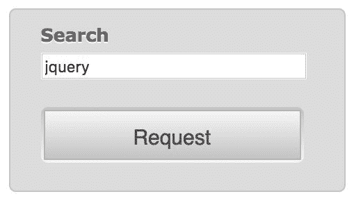
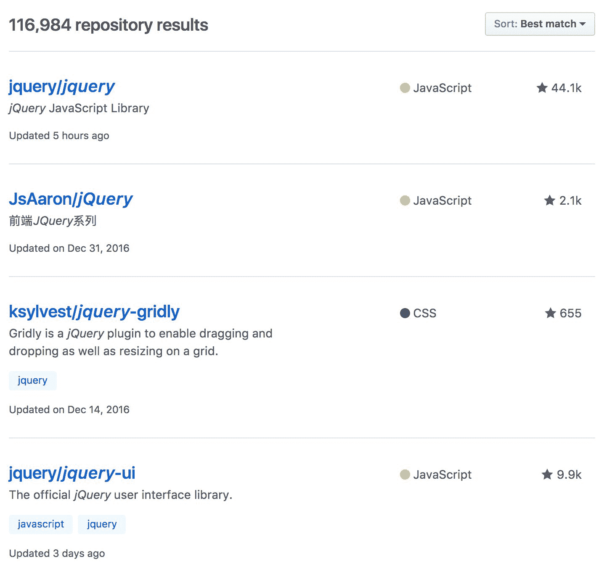
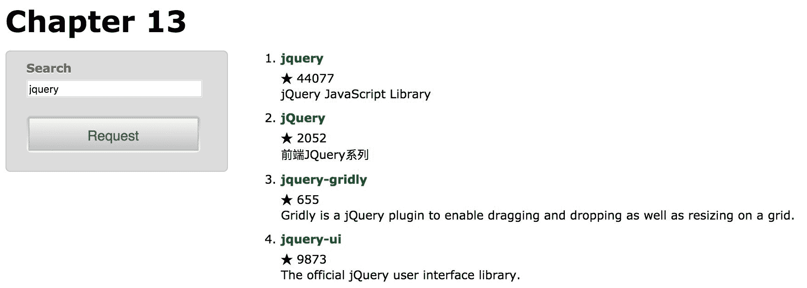
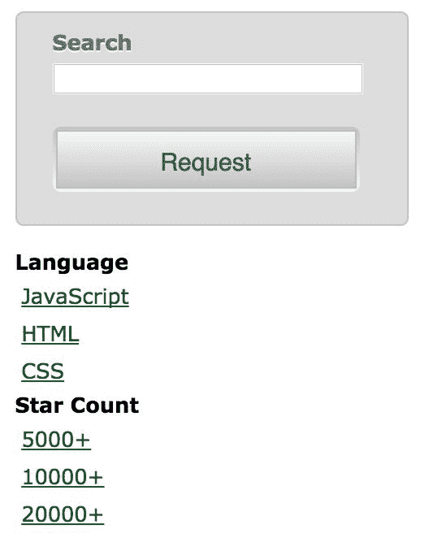
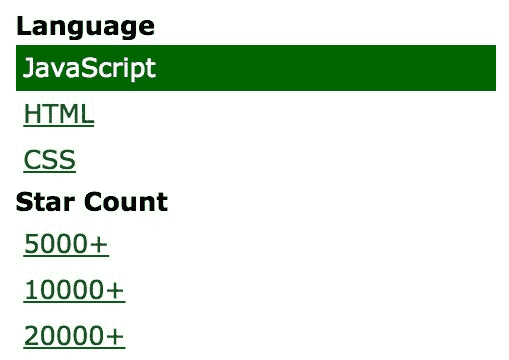
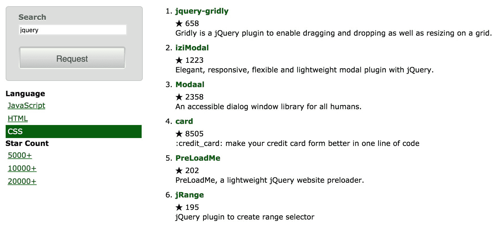
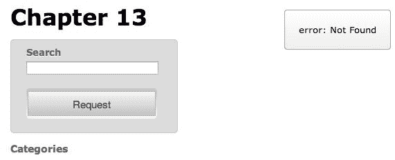

# 十三、高级 Ajax

许多 web 应用程序需要频繁的网络通信。使用 jQuery，我们的 web 页面可以与服务器交换信息，而无需在浏览器中加载新页面。

在[第 6 章](06.html#40NRU0-fd25fd954efc4043b43c8b05f3cc53ef)*使用 Ajax*发送数据中，您学习了与服务器异步交互的简单方法。在这一更高级的章节中，我们将介绍：

*   处理网络中断的错误处理技术
*   Ajax 与 jQuery 延迟对象系统之间的交互
*   用于减少网络流量的缓存和节流技术
*   使用传输、预过滤器和数据类型转换器扩展 Ajax 系统内部工作的方法

<footer style="margin-top: 5em;">

# 用 Ajax 实现渐进增强

在本书中，我们遇到了*渐进增强*的概念。重申一下，这一理念确保了所有用户都能获得积极的用户体验，因为它要求在为使用现代浏览器的用户添加额外的修饰之前，先安装一个工作产品。

例如，我们将构建一个搜索 GitHub 存储库的表单：

```js
<form id="ajax-form" action="https://github.com/search" method="get"> 
  <fieldset> 
    <div class="text"> 
      <label for="title">Search</label> 
      <input type="text" id="title" name="q"> 
    </div> 

    <div class="actions"> 
      <button type="submit">Request</button> 
    </div> 
  </fieldset> 
</form> 

```

Getting the example code
You can access the example code from the following GitHub repository: [https://github.com/PacktPublishing/Learning-jQuery-3](https://github.com/PacktPublishing/Learning-jQuery-3).

搜索表单是一个普通表单元素，具有文本输入和标记为请求的提交按钮：



点击此表单的请求按钮，表单正常提交；用户浏览器指向[https://github.com/search](https://github.com/search) 并显示结果：



但是，我们希望将此内容加载到搜索页面的`#response`容器中，而不是离开页面。如果数据存储在与搜索表单相同的服务器上，我们可以使用`.load()`方法获取页面的相关部分：

```js
$(() => {
  $('#ajax-form')
    .on('submit', (e) => {
      e.preventDefault();
      $('#response')
        .load(
          'https://github.com/search .container',
          $(e.target).serialize()
        );
    });
});

```

Listing 13.1

但是，由于 GitHub 位于不同的主机名下，浏览器的默认跨域策略将不允许发生此请求。

<footer style="margin-top: 5em;">

# 获取 JSONP 数据

在[第 6 章](06.html#40NRU0-fd25fd954efc4043b43c8b05f3cc53ef)中*使用 Ajax*发送数据，我们看到 JSONP 只是 JSON，添加了一层服务器行为，允许从不同站点发出请求。当请求 JSONP 数据时，会提供一个特殊的查询字符串参数，允许请求脚本处理数据。这个参数可以根据 JSONP 服务器的需要调用；对于 GitHub API，参数使用默认名称`callback`。

因为使用了默认的`callback`名称，所以发出 JSONP 请求所需的唯一设置是向 jQuery 声明`jsonp`是我们期望的数据类型：

```js
$(() => {
  $('#ajax-form')
    .on('submit', (e) => {
      e.preventDefault();

      $.ajax({
        url: 'https://api.github.com/search/repositories',
        dataType: 'jsonp',
        data: { q: $('#title').val() },
        success(data) {
          console.log(data);
        }
      });
    });
}); 

```

Listing 13.2

现在，我们可以在控制台中检查 JSON 数据。本例中的数据是一个对象数组，每个对象描述一个 GitHub 存储库：

```js
{
  "id": 167174,
  "name": "jquery",
  "open_issues": 78,
  "open_issues_count": 78,
  "pulls_url: "https://api.github.com/repos/jquery/jquery/pulls{/number}",
  "pushed_at": "2017-03-27T15:50:12Z",
  "releases_url": "https://api.github.com/repos/jquery/jquery/releases{/id}",
  "score": 138.81496,
  "size": 27250,
  "ssh_url": "git@github.com:jquery/jquery.git",
  "stargazers_count": 44069,
  "updated_at": "2017-03-27T20:59:42Z",
  "url": "https://api.github.com/repos/jquery/jquery",
  "watchers": 44069,
  // ...
} 

```

我们需要显示的关于存储库的所有数据都包含在此对象中。我们只需要对其进行适当的格式化以便于显示。为项目创建 HTML 有点复杂，因此我们将把这一步分解为它自己的帮助函数：

```js
const buildItem = item =>
  `
    <li>
      <h3><a href="${item.html_url}">${item.name}</a></h3>
      <div>★ ${item.stargazers_count}</div>
      <div>${item.description}</div>
    </li>
  `;

```

Listing 13.3

`buildItem()`函数将 JSON 对象转换为 HTML 列表项。这包括指向 GitHub 主存储库页面的链接，后面是描述。

在这一点上，我们有一个函数为单个项目创建 HTML。当 Ajax 调用完成时，我们需要对每个返回的对象调用此函数并显示所有结果：

```js
$(() => {
  $('#ajax-form')
    .on('submit', (e) => {
      e.preventDefault();

      $.ajax({
        url: 'https://api.github.com/search/repositories',
        dataType: 'jsonp',
        data: { q: $('#title').val() },
        success(json) {
          var output = json.data.items.map(buildItem);
          output = output.length ?
          output.join('') : 'no results found';

          $('#response').html(`<ol>${output}</ol>`);
        }
      });
    });
}); 

```

Listing 13.4

现在我们有了一个功能性的`success`处理程序，执行搜索可以很好地将结果显示在表单旁边的一列中：



<footer style="margin-top: 5em;">

# 处理 Ajax 错误

在应用程序中引入任何类型的网络交互都会带来一定程度的不确定性。用户的连接可能会在操作的中间出现，或者暂时的服务器问题会中断通信。由于这些可靠性问题，我们应该总是为最坏的情况做计划，并为错误场景做好准备。

在这些情况下，`$.ajax()`函数可以调用名为`error`的回调函数。在这个回调中，我们应该向用户提供某种反馈，指出发生了错误：

```js
$(() => {
  $('#ajax-form')
    .on('submit', (e) => {
      e.preventDefault();

      $.ajax({
        url: 'https://api.github.com/search/repositories',
        dataType: 'jsonp',
        data: { q: $('#title').val() },
        error() {
          $('#response').html('Oops. Something went wrong...');
        }
      });
    });
}); 

```

Listing 13.5

由于多种原因，可能会触发错误回调。其中包括：

*   服务器返回错误状态代码，例如 403 禁止、404 未找到或 500 内部服务器错误。
*   服务器返回了重定向状态代码，例如 301 永久移动。未修改异常，这不会触发错误，因为浏览器可以正确处理此情况。
*   无法按指定解析服务器返回的数据（例如，`dataType`为`json`时为无效 JSON 数据）。
*   在`XMLHttpRequest`对象上调用`.abort()`方法。

检测并响应这些条件对于提供最佳用户体验非常重要。我们在[第 6 章](06.html#40NRU0-fd25fd954efc4043b43c8b05f3cc53ef)*中看到，*使用 Ajax*发送数据，错误代码（如果有）在传递给错误回调的`jqXHR`对象的`.status`属性中提供给我们。如果合适的话，我们可以使用`jqXHR.status`的值对不同类型的错误做出不同的反应。*

但是，服务器错误只有在实际观察到时才有用。一些错误会立即被检测到，但其他情况可能会导致请求和最终错误响应之间的长时间延迟。

当可靠的服务器超时机制不可用时，我们可以强制执行自己的客户端请求超时。通过向超时选项提供以毫秒为单位的时间，我们告诉`$.ajax()`如果在收到响应之前经过了该时间，则自行触发`.abort()`：

```js
$.ajax({
  url: 'https://api.github.com/search/repositories',
  dataType: 'jsonp',
  data: { q: $('#title').val() },
  timeout: 10000,
  error() {
    $('#response').html('Oops. Something went wrong...');
  }
});

```

Listing 13.6

有了超时，我们可以确信，在 10 秒内，数据将被加载，或者用户将收到错误消息。

<footer style="margin-top: 5em;">

# 使用 jqXHR 对象

当发出 Ajax 请求时，jQuery 确定检索数据的最佳机制。此传输可以是标准的`XMLHttpRequest`对象、Microsoft ActiveX`XMLHTTP`对象或`<script>`标记。

由于所使用的传输因请求而异，因此我们需要一个公共接口来与通信进行交互。`jqXHR`对象为我们提供了这个接口。当使用该传输时，它是`XMLHttpRequest`对象的包装器，在其他情况下，它尽可能模拟`XMLHttpRequest`。它公开的属性和方法包括：

*   `.responseText`或`.responseXML`，包含返回的数据
*   `.status`和`.statusText`，包含状态代码和说明
*   `.setRequestHeader()`操作随请求发送的 HTTP 头
*   `.abort()`提前停止交易

这个`jqXHR`对象是从 jQuery 的所有 Ajax 方法返回的，因此如果需要访问这些属性或方法，我们可以存储结果。

<footer style="margin-top: 5em;">

# 阿贾克斯承诺

然而，`jqXHR`接口可能比`XMLHttpRequest`接口更重要的一个方面是，它也起到了承诺的作用。在[第 11 章](11.html#7DES20-fd25fd954efc4043b43c8b05f3cc53ef)*高级效果*中，您了解了延迟对象，它允许我们设置在某些操作完成时触发的回调。Ajax 调用就是这种操作的一个例子，`jqXHR`对象提供了我们期望从延迟对象的承诺中得到的方法。

使用 promise 的方法，我们可以重写我们的`$.ajax()`调用，用另一种语法替换成功和错误回调：

```js
$.ajax({
  url: 'https://api.github.com/search/repositories',
  dataType: 'jsonp',
  data: { q: $('#title').val() },
  timeout: 10000,
}).then((json) => {
  var output = json.data.items.map(buildItem);
  output = output.length ?
    output.join('') : 'no results found';

  $('#response').html(`<ol>${output}</ol>`);
}).catch(() => {
  $('#response').html('Oops. Something went wrong...');
});

```

Listing 13.7

乍一看，调用`.then()`和`.catch()`似乎并不比我们之前使用的回调语法更有用。然而，promise 方法有几个优点。首先，如果需要，可以多次调用这些方法来添加多个处理程序。第二，如果我们将`$.ajax()`调用的结果存储在一个常量中，我们可以在以后附加处理程序，如果这使我们的代码结构更具可读性的话。第三，如果在连接处理程序时 Ajax 操作已经完成，则将立即调用这些处理程序。最后，我们不应忽视使用与 jQuery 库的其他部分以及本机 JavaScript 承诺一致的语法的可读性优势。

作为使用 promise 方法的另一个示例，我们可以在发出请求时添加加载指示器。由于我们希望在请求完成时隐藏指示器，无论成功与否，`.always()`方法都会派上用场：

```js
$('#ajax-form')
  .on('submit', (e) => {
    e.preventDefault();

    $('#response')
      .addClass('loading')
      .empty();

    $.ajax({
      url: 'https://api.github.com/search/repositories',
      dataType: 'jsonp',
      data: { q: $('#title').val() },
      timeout: 10000,
    }).then((json) => {
      var output = json.data.items.map(buildItem);
      output = output.length ?
      output.join('') : 'no results found';

      $('#response').html(`<ol>${output}</ol>`);
    }).catch(() => {
      $('#response').html('Oops. Something went wrong...');
    }).always(() => {
      $('#response').removeClass('loading');
    });
}); 

```

Listing 13.8

在发出`$.ajax()`调用之前，我们将`loading`类添加到响应容器中。一旦加载完成，我们将再次移除它。通过这样做，我们进一步增强了用户体验，因为现在有了一个视觉指示器，表明后台正在发生一些事情。

然而，为了真正了解承诺行为如何帮助我们，我们需要看看如果我们存储`$.ajax()`调用的结果供以后使用，我们能做些什么。

<footer style="margin-top: 5em;">

# 缓存响应

如果我们需要重复使用同一段数据，那么每次发出 Ajax 请求都是浪费。为了防止这种情况，我们可以将返回的数据缓存在变量中。当我们需要使用一些数据时，我们可以检查数据是否已经在缓存中。如果是这样，我们将根据这些数据采取行动。如果没有，我们需要发出一个 Ajax 请求，并在其`.done()`处理程序中，将数据存储在缓存中，并对返回的数据执行操作。

如果我们利用承诺的特性，它可能非常简单：

```js
$(() => {
  const cache = new Map();

  $('#ajax-form')
    .on('submit', (e) => {
      e.preventDefault();

      const search = $('#title').val();

      if (search == '') {
        return;
      }

      $('#response')
        .addClass('loading')
        .empty();

      cache.set(search, cache.has(search) ?
        cache.get(search) :
        $.ajax({
          url: 'https://api.github.com/search/repositories',
          dataType: 'jsonp',
          data: { q: search },
          timeout: 10000,
        })
      ).get(search).then((json) => {
        var output = json.data.items.map(buildItem);
        output = output.length ?
          output.join('') : 'no results found';

        $('#response').html(`<ol>${output}</ol>`);
      }).catch(() => {
        $('#response').html('Oops. Something went wrong...');
      }).always(() => {
        $('#response').removeClass('loading');
      });
    });
}); 

```

Listing 13.9

我们引入了一个名为`cache`的新的`Map`常量来保持我们创建的`jqXHR`承诺。此映射的键对应于正在执行的搜索。提交表单时，我们会查看是否已经为该密钥存储了`jqXHR`承诺。如果没有，我们将像前面一样执行查询，将结果对象存储在`api`中。

然后，将`.then()`、`.catch()`和`.always()`处理程序附加到`jqXHR`承诺。请注意，无论是否发出 Ajax 请求，都会发生这种情况。这里有两种可能的情况需要考虑。

首先，如果以前没有发送过 Ajax 请求，那么可能会发送它。这与前面的行为类似：发出请求，我们使用 promise 方法将处理程序附加到`jqXHR`对象。当服务器返回响应时，将触发相应的回调，并将结果打印到屏幕上。

另一方面，如果我们过去执行过此搜索，`jqXHR`承诺已经存储在`cache`中。在这种情况下，不会执行新的搜索，但我们仍然对存储的对象调用 promise 方法。这会将新的处理程序附加到对象，但是由于延迟对象已经被解析，因此会立即触发相关的处理程序。

jQuery 延迟对象系统为我们处理了所有繁重的工作。通过几行代码，我们消除了应用程序中重复的网络请求。

<footer style="margin-top: 5em;">

# 限制 Ajax 请求

搜索的一个常见功能是在用户键入时显示结果的动态列表。通过将处理程序绑定到`keyup`事件，我们可以模拟 jQuery API 搜索的“实时搜索”功能：

```js
$('#title')
  .on('keyup', (e) => {
    $(e.target.form).triggerHandler('submit');
  });

```

Listing 13.10

在这里，只要用户在搜索字段中键入内容，我们就触发表单的提交处理程序。这可能会产生快速连续地通过网络发送多个请求的效果，具体取决于用户键入的速度。这种行为可能会影响 JavaScript 的性能；它可能会阻塞网络连接，服务器可能无法处理此类需求。

我们已经通过我们刚刚设置的请求缓存限制了请求的数量。但是，通过限制请求，我们可以进一步减轻服务器的负担。在[第 10 章](10.html#6S9HU0-fd25fd954efc4043b43c8b05f3cc53ef)*高级事件*中，我们在创建特殊`throttledScroll`事件时引入了节流的概念，以减少触发本机滚动事件的次数。在这种情况下，我们希望减少类似的活动；这次与`keyup`事件：

```js
const searchDelay = 300;
var searchTimeout;

$('#title')
  .on('keyup', (e) => {
    clearTimeout(searchTimeout);

    searchTimeout = setTimeout(() => {
      $(e.target.form).triggerHandler('submit');
    }, searchDelay);
  });

```

Listing 13.11

我们在这里的技术，有时被称为去抖动，与我们在[第 10 章](10.html#6S9HU0-fd25fd954efc4043b43c8b05f3cc53ef)、*高级事件*中使用的技术有点不同。而在那个例子中，我们需要`scroll`处理程序在滚动继续时多次生效，这里我们只需要`keyup`行为在键入停止后发生一次。为此，我们跟踪一个 JavaScript 计时器，每当用户按下一个键时，该计时器就会启动。每次击键都会重置计时器，因此只有当用户在指定的时间量（300 毫秒）内停止键入时，`submit`处理程序才会被触发并执行 Ajax 请求。

<footer style="margin-top: 5em;">

# 扩展 Ajax 功能

正如我们所看到的，jQueryAjax 框架功能强大，但即使如此，有时我们也可能希望改变它的行为方式。毫不奇怪，它提供了多个钩子，插件可以使用这些钩子赋予框架全新的功能。

<footer style="margin-top: 5em;">

# 数据类型转换器

在[第 6 章](06.html#40NRU0-fd25fd954efc4043b43c8b05f3cc53ef)*使用 Ajax 发送数据*中，我们看到`$.ajaxSetup()`函数允许我们更改`$.ajax()`使用的默认值，因此可能会影响到单个语句的许多 Ajax 操作。同样的功能也可以用于增加`$.ajax()`可以请求和解释的数据类型范围。

例如，我们可以添加一个理解 YAML 数据格式的转换器。YAML（[http://www.yaml.org/](http://www.yaml.org/) 是一种流行的数据表示形式，在许多编程语言中都有实现。如果我们的代码需要与这样的替代格式交互，jQuery 允许我们将其兼容性构建到本机 Ajax 函数中。

包含 GitHub 存储库搜索条件的简单 YAML 文件：

```js
Language:
 - JavaScript
 - HTML
 - CSS
Star Count:
 - 5000+
 - 10000+
 - 20000+

```

我们可以将 jQuery 封装在现有的 YAML 解析器（如 Diogo Costa 的（【T1）】中 http://code.google.com/p/javascript-yaml-parser/ 使`$.ajax()`也能说这种语言。

定义新的 Ajax 数据类型需要将三个属性传递给`$.ajaxSetup()`：`accepts`、`contents`和`converters`。`accepts`属性添加要发送到服务器的头，向服务器声明特定 MIME 类型可以被我们的脚本理解。`contents`属性处理事务的另一端，提供与响应 MIME 类型匹配的正则表达式，以尝试从该元数据自动检测数据类型。最后，`converters`包含解析返回数据的实际函数：

```js
$.ajaxSetup({ 
  accepts: { 
    yaml: 'application/x-yaml, text/yaml' 
  }, 
  contents: { 
    yaml: /yaml/ 
  }, 
  converters: { 
    'text yaml': (textValue) => { 
      console.log(textValue); 
      return ''; 
    } 
  } 
}); 

$.ajax({ 
  url: 'categories.yml', 
  dataType: 'yaml' 
}); 

```

Listing 13.12

*清单 13.12*中的部分实现使用`$.ajax()`读取 YAML 文件，并将其数据类型声明为`yaml`。因为传入数据被解析为`text`，jQuery 需要一种将一种数据类型转换为另一种数据类型的方法。`'text yaml'`的`converters`键告诉 jQuery，此转换函数将接受作为`text`接收的数据，并将其重新解释为`yaml`。

在转换函数中，我们只是记录文本的内容，以确保正确调用该函数。要实际执行转换，我们需要加载第三方 YAML 解析库（`yaml.js`并调用其方法：

```js
$.ajaxSetup({
  accepts: {
    yaml: 'application/x-yaml, text/yaml'
  },
  contents: {
    yaml: /yaml/
  },
  converters: {
    'text yaml': (textValue) => YAML.eval(textValue)
  }
});

Promise.all([
  $.getScript('yaml.js')
    .then(() =>
      $.ajax({
        url: 'categories.yml',
        dataType: 'yaml'
      })),
  $.ready
]).then(([data]) => {
  const output = Object.keys(data).reduce((result, key) =>
    result.concat(
      `<li><strong>${key}</strong></li>`,
      data[key].map(i => `<li> <a href="#">${i}</a></li>`)
    ),
    []
  ).join('');

  $('#categories')
    .removeClass('hide')
    .html(`<ul>${output}</ul>`);
}); 

```

Listing 13.13

`yaml.js`文件包含一个名为`YAML`的对象，其方法为`.eval()`。我们使用这种方法解析传入的文本并返回结果，结果是一个 JavaScript 对象，它以一种易于遍历的结构包含`categories.yml`文件的所有数据。由于我们正在加载的文件包含 GitHub repo 搜索字段，因此我们使用解析后的结构打印顶级字段，稍后将允许用户通过单击这些字段来过滤其搜索结果：



Ajax 操作可能会立即运行，而不需要访问 DOM，但一旦我们从中得到结果，我们需要等待 DOM 可用后再继续。将我们的代码结构化为使用`Promise.all()`允许尽早执行网络调用，从而提高用户对页面加载时间的感知。

接下来，我们需要处理类别链接上的点击：

```js
$(document)
  .on('click', '#categories a', (e) => {
    e.preventDefault();

    $(e.target)
      .parent()
      .toggleClass('active')
      .siblings('.active')
      .removeClass('active');
    $('#ajax-form')
      .triggerHandler('submit');
  }); 

```

Listing 13.14

通过将`click`处理程序绑定到`document`并依赖事件委托，我们避免了一些代价高昂的重复，我们还可以立即运行代码，而不用担心等待 Ajax 调用完成。
在处理程序内部，我们确保高亮显示正确的类别，然后触发表单上的`submit`处理程序。我们还没有让表单理解我们的类别列表，但是突出显示已经起作用了：



最后，我们需要更新表单的`submit`处理程序，以尊重活动类别（如果有）：

```js
$('#ajax-form')
  .on('submit', (e) => {
    e.preventDefault();

    const search = [
      $('#title').val(),
      new Map([
        ['JavaScript', 'language:"JavaScript"'],
        ['HTML', 'language:"HTML"'],
        ['CSS', 'language:"CSS"'],
        ['5000+', 'stars:">=5000"'],
        ['10000+', 'stars:">=10000"'],
        ['20000+', 'stars:">=20000"'],
        ['', '']
      ]).get($.trim(
        $('#categories')
          .find('li.active')
          .text()
      ))
    ].join('');

    if (search == '' && category == '') {
      return;
    }

    $('#response')
      .addClass('loading')
      .empty();

    cache.set(search, cache.has(search) ?
      cache.get(search) :
      $.ajax({
        url: 'https://api.github.com/search/repositories',
        dataType: 'jsonp',
        data: { q: search },
        timeout: 10000,
      })).get(search).then((json) => {
        var output = json.data.items.map(buildItem);
        output = output.length ?
          output.join('') : 'no results found';

        $('#response').html(`<ol>${output}</ol>`);
      }).catch(() => {
        $('#response').html('Oops. Something went wrong...');
      }).always(() => {
        $('#response').removeClass('loading');
      });
  }); 

```

Listing 13.15

现在我们不再简单地获取搜索字段的值，而是检索活动语言的文本或星号计数，通过 Ajax 调用传递这两条信息。我们使用一个`Map`实例将链接文本映射到适当的 GitHub API 语法

现在，我们可以按存储库的主要语言或星数查看存储库。一旦我们应用了这些过滤器，我们可以通过在搜索框中键入：

进一步细化显示内容

每当我们需要支持 jQuery 尚未处理的新数据类型时，我们都可以用类似于此 YAML 示例的方式定义它们。因此，我们可以根据具体项目的需要来设计 jQuery 的 Ajax 库。

<footer style="margin-top: 5em;">

# 添加 Ajax 预过滤器

`$.ajaxPrefilter()`函数可以添加预过滤器，它们是回调函数，允许我们在发送请求之前对请求进行操作。预过滤器是在`$.ajax()`更改或使用其任何选项之前调用的，因此它们是更改选项或对新自定义选项进行操作的好地方。

预过滤器还可以通过简单地返回要使用的新数据类型的名称来操作请求的数据类型。在我们的 YAML 示例中，我们将`yaml`指定为数据类型，因为我们不希望依赖服务器为响应提供正确的 MIME 类型。但是，如果我们请求的 URL 中有相应的文件扩展名（`.yml`），我们可以提供一个预过滤器，确保数据类型为`yaml`：

```js
$.ajaxPrefilter(({ url }) =>
  /.yml$/.test(url) ? 'yaml' : null
);

$.getScript('yaml.js')
  .then(() =>
    $.ajax({ url: 'categories.yml' })
  ); 

```

Listing 13.16

一个简短的正则表达式测试`.yml`是否位于`options.url`的末尾，如果是，则将数据类型定义为`yaml`。有了这个预过滤器，我们获取 YAML 文档的 Ajax 调用不再需要显式定义其数据类型。

<footer style="margin-top: 5em;">

# 定义备用传输

我们已经看到，jQuery 使用`XMLHttpRequest`、`ActiveX`或`<script>`标记来处理 Ajax 事务。如果我们愿意的话，我们可以用新的运输工具进一步扩展这个兵工厂。

**传输**是处理 Ajax 数据实际传输的对象。新的传输被定义为使用`.send()`和`.abort()`方法返回对象的工厂函数。`.send()`方法负责发出请求，处理响应，并通过回调函数发送回数据。`.abort()`方法应立即停止请求。

例如，自定义传输可以使用``元素获取外部数据。这允许以与其他 Ajax 请求相同的方式处理图像加载，这有助于提高代码的内部一致性。创建这种传输所需的 JavaScript 有点复杂，因此我们将查看最终产品，然后讨论其组件：

```js
$.ajaxTransport('img', ({ url }) => {
  var $img, img, prop;

  return {
    send(headers, complete) {
      const callback = (success) => {
        if (success) {
          complete(200, 'OK', { img });
        } else {
          $img.remove();
          complete(404, 'Not Found');
        }
      }

      $img = $('', { src: url });
      img = $img[0];
      prop = typeof img.naturalWidth === 'undefined' ?
        'width' : 'naturalWidth';

      if (img.complete) {
        callback(!!img[prop]);
      } else {
        $img.on('load error', ({ type }) => {
          callback(type == 'load');
        });
      }
    },

    abort() {
      if ($img) {
        $img.remove();
      } 
    }
  };
}); 

```

Listing 13.17

定义传输时，首先将数据类型名称传递到`$.ajaxTransport()`。这告诉 jQuery 何时使用我们的传输而不是内置机制。然后，我们提供了一个函数，返回包含适当的`.send()`和`.abort()`方法的新传输对象。

对于我们的`img`传输，`.send()`方法需要创建一个新的``元素，我们给它一个`src`属性。该属性的值来自于`url`，jQuery 从`$.ajax()`调用传递该值。浏览器将通过加载引用的图像文件来响应这个``元素的创建，因此我们只需要检测这个加载何时完成并触发完成回调。

如果我们想要处理各种各样的浏览器和版本，正确地检测图像加载的完成是很棘手的。在某些浏览器中，我们可以简单地将`load`和`error`事件处理程序附加到 image 元素。但是，在其他情况下，当缓存图像时，`load`和`error`不会按预期触发。

我们在*清单 13.17*中的代码通过检查适用于每个浏览器的`.complete`、`.width`和`.naturalWidth`属性的值来处理这些异常的浏览器行为。一旦检测到图像加载已成功完成或失败，我们将调用`callback()`函数，该函数反过来调用传递给`.send()`的`complete()`函数。这允许`$.ajax()`对图像加载做出反应。

处理中止的负载要简单得多。我们的`.abort()`方法只需在`.send()`之后清除``元素（如果已创建）。

接下来，我们需要编写使用新传输的`$.ajax()`调用：

```js
$.ajax({
  url: 'missing.jpg',
  dataType: 'img'
}).then((img) => {
  $('<div/>', {
    id: 'picture',
    html: img
  }).appendTo('body');
}).catch((xhr, textStatus, msg) => {
  $('<div/>', {
    id: 'picture',
    html: `${textStatus}: ${msg}`
  }).appendTo('body');
}); 

```

Listing 13.18

要使用特定的传输，`$.ajax()`需要给出相应的`dataType`值。然后，成功和失败处理程序需要考虑传递给它们的数据类型。我们的`img`传输成功后返回一个``DOM 元素，因此我们的`.done()`处理程序使用该元素作为插入文档的新创建的`<div>`元素的 HTML 内容。

然而，在这种情况下，指定的图像文件（`missing.jpg`）实际上并不存在。我们通过适当的`.catch()`处理程序考虑到了这种可能性，该处理程序将错误消息插入`<div>`中，否则图像将进入该位置：



我们可以通过引用确实存在的图像来更正此错误：

```js
$.ajax({
  url: 'sunset.jpg',
  dataType: 'img'
}).then((img) => {
  $('<div/>', {
    id: 'picture',
    html: img
  }).appendTo('body');
}).catch((xhr, textStatus, msg) => {
  $('<div/>', {
    id: 'picture',
    html: `${textStatus}: ${msg}`
  }).appendTo('body');
}); 

```

Listing 13.19

现在，我们的传输能够成功加载图像，我们可以在页面上看到此结果：


创建一个新的传输是不常见的，但即使在这种情况下，jQuery 的 Ajax 功能也可以满足我们的需要。例如，将图像加载视为承诺的能力意味着我们可以使用此 Ajax 调用来使用`Promise.all()`与其他异步行为同步。

<footer style="margin-top: 5em;">

# 总结

在最后一章中，我们深入了解了 jQuery 的 Ajax 框架。我们现在可以在单个页面上构建无缝的用户体验，在需要时获取外部资源，并适当注意错误处理、缓存和节流。我们探讨了 Ajax 框架内部操作的细节，包括承诺、传输、预过滤器和转换器。您还学习了如何扩展这些机制以满足脚本的需要。

<footer style="margin-top: 5em;">

# 进一步阅读

*Ajax 方法*的完整列表可在本书的[附录 B](15.html#9BEGK0-fd25fd954efc4043b43c8b05f3cc53ef)、*快速参考*中找到，或在[的正式 jQuery 文档中找到 http://api.jquery.com/](http://api.jquery.com/) 。

<footer style="margin-top: 5em;">

# 练习

挑战练习可能需要使用位于[的正式 jQuery 文档 http://api.jquery.com/](http://api.jquery.com/) ：

1.  修改`buildItem()`函数，使其包含所显示的每个 jQuery 方法的详细描述。
2.  这是给你的一个挑战。向页面添加指向 Flickr 公共照片搜索（[的表单 http://www.flickr.com/search/](http://www.flickr.com/search/) 并确保其具有`<input name="q">`和提交按钮。使用渐进增强从 Flickr 的 JSONP 提要服务[检索照片 http://api.flickr.com/services/feeds/photos_public.gne](http://api.flickr.com/services/feeds/photos_public.gne) 并将其插入页面的内容区域。向该服务发送数据时，使用`tags`代替`q`，并将`format`设置为`json`。还要注意，服务希望 JSONP 回调名称为`jsoncallback`，而不是`callback`。
3.  你还有一个挑战。为 Flickr 请求添加错误处理，以防导致`parsererror`。通过将 JSONP 回调名称设置回`callback`进行测试。

</footer>

</footer>

</footer>

</footer>

</footer>

</footer>

</footer>

</footer>

</footer>

</footer>

</footer>

</footer>

</footer>

</footer>