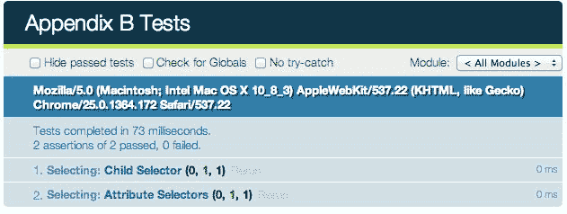
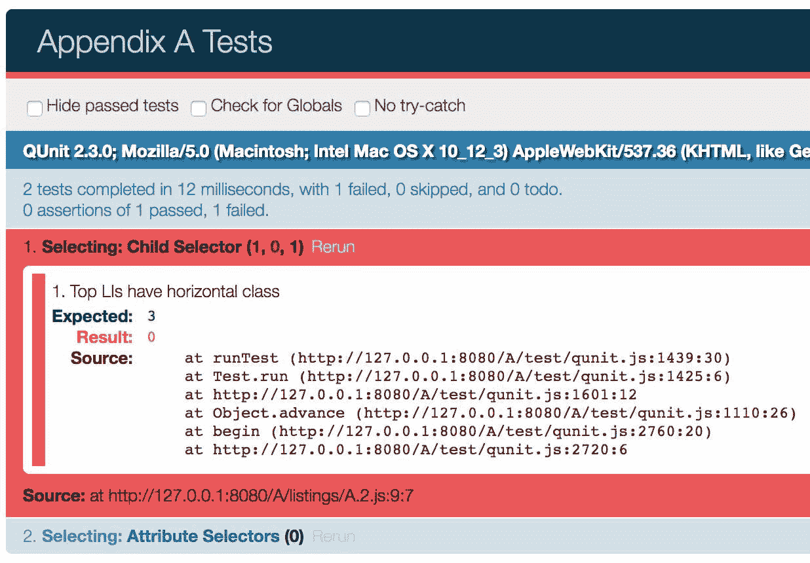
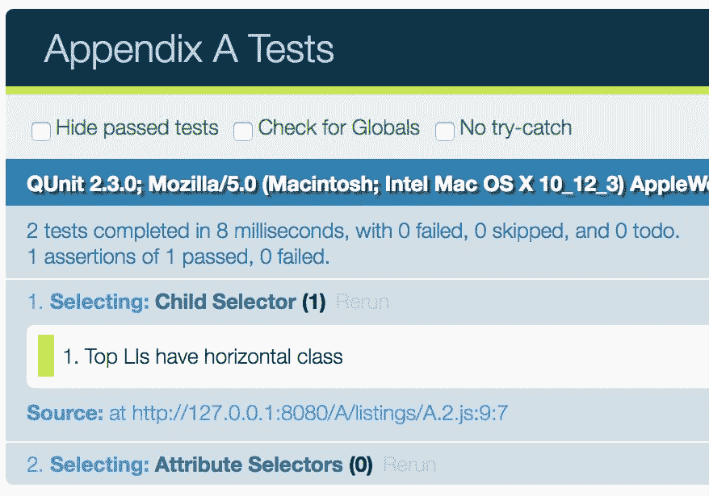
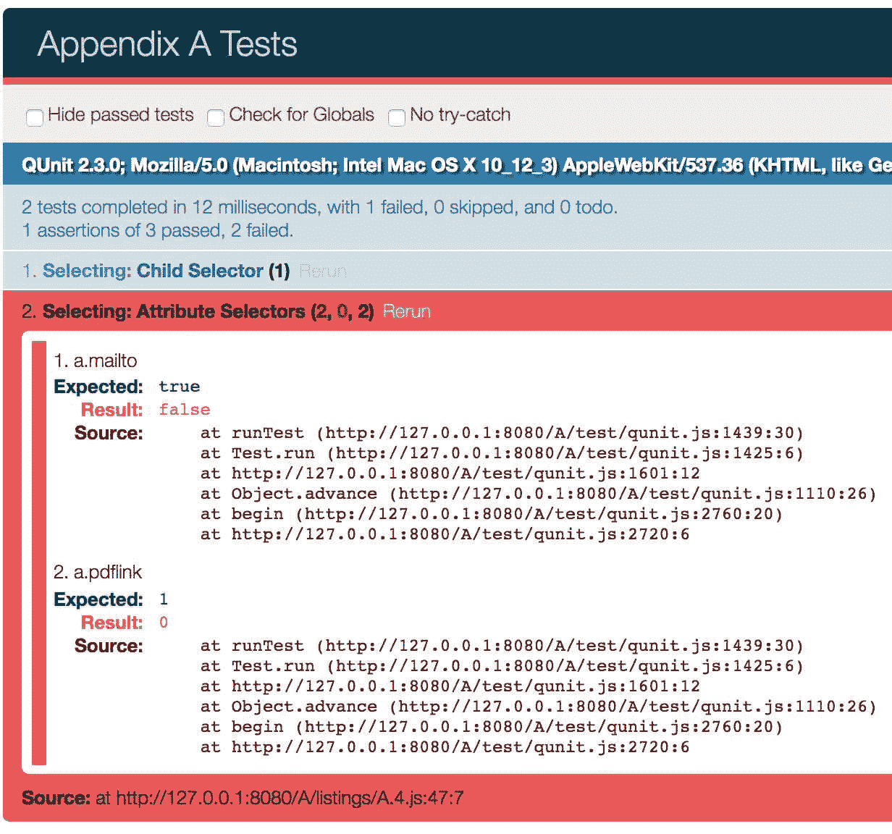
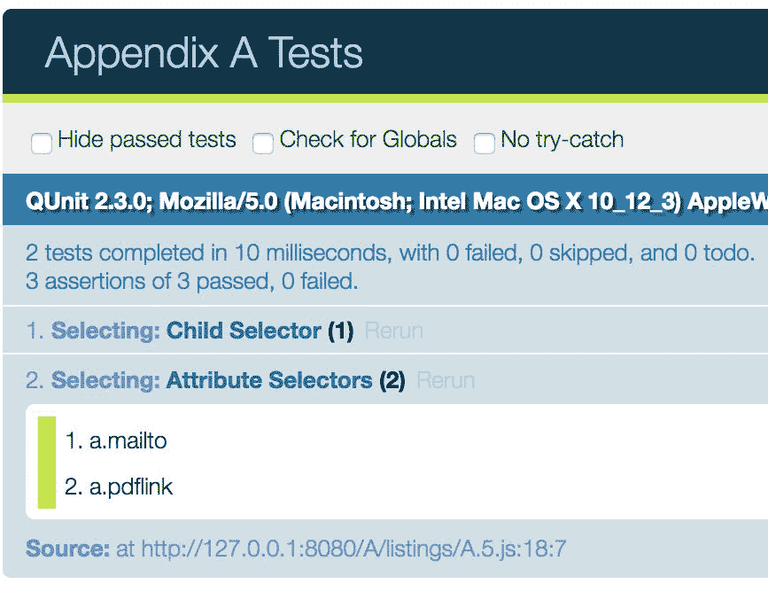

# 十四、附录 A：使用 QUnit 测试 JavaScript

在本书中，我们编写了大量 JavaScript 代码，并且我们看到了 jQuery 帮助我们相对轻松地编写这些代码的许多方法。然而，每当我们添加一个新功能时，我们都必须采取额外的步骤手动检查我们的网页，以确保一切都按预期工作。虽然这个过程可能适用于简单的任务，但随着项目规模和复杂性的增加，手动测试可能变得相当繁重。新的需求可能会引入*回归 bug*，从而破坏脚本中以前运行良好的部分。很容易忽略这些与最新代码更改无关的 bug，因为我们自然只测试刚刚完成的工作。

我们需要的是一个自动系统，为我们运行测试。**QUnit**测试框架就是这样一个系统。虽然还有许多其他的测试框架，它们都有自己的优点，但我们建议大多数 jQuery 项目使用 QUnit，因为它是由 jQuery 项目编写和维护的。事实上，jQuery 本身使用 QUnit。在本附录中，我们将介绍：

*   如何在项目中建立 QUnit 测试框架
*   帮助代码覆盖和维护的单元测试组织
*   QUnit 提供的各种类型的测试
*   确保测试是成功代码的可靠指标的常用做法
*   QUnit 提供的其他类型测试的建议

<footer style="margin-top: 5em;">

# 下载 QUnit

QUnit 框架可从 QUnit 官方网站[下载 http://qunitjs.com/](http://qunitjs.com/) 。在那里我们可以找到稳定版本（目前为 2.3.0）和开发版本（qunit git）的链接。这两个版本除了用于格式化测试输出的 JavaScript 文件外，还包括一个样式表。

<footer style="margin-top: 5em;">

# 设置文档

一旦我们有了 QUnit 文件，我们就可以设置测试 HTML 文档了。在一个典型的项目中，该文件将被命名为`index.html`，并放置在与`qunit.js`和`qunit.css`相同的测试子文件夹中。但是，对于这个演示，我们将把它放在父目录中。

文档的`<head>`元素包含 CSS 文件的`<link>`标记和 jQuery、QUnit、我们将要测试的 JavaScript（`A.js`和测试本身的`listings/A.*.js`标记。`<body>`标签由两个主要元素组成，用于运行和显示测试结果。

为了演示 QUnit，我们将使用[第 2 章](02.html#164MG0-fd25fd954efc4043b43c8b05f3cc53ef)、*选择元素*和[第 6 章](06.html#40NRU0-fd25fd954efc4043b43c8b05f3cc53ef)、*使用 Ajax 发送数据*的部分：

```js
<!DOCTYPE html> 
<html> 
<head> 
  <meta charset="utf-8"> 
  <title>Appendix A Tests</title> 
  <link rel="stylesheet" href="qunit.css" media="screen"> 
  <script src="jquery.js"></script> 
  <script src="test/qunit.js"></script> 
  <script src="A.js"></script> 
  <script src="test/test.js"></script> 
</head> 
<body> 
  <div id="qunit"></div> 
  <div id="qunit-fixture"> 
    <!-- Test Markup Goes Here --> 
  </div> 
</body> 
</html> 

```

由于[第 2 章](02.html#164MG0-fd25fd954efc4043b43c8b05f3cc53ef)、*选择元素*，我们要测试的代码依赖于 DOM；我们希望测试标记与我们在实际页面上使用的内容相匹配。我们可以简单地复制和粘贴我们在[第 2 章](02.html#164MG0-fd25fd954efc4043b43c8b05f3cc53ef)、*选择元素*中使用的 HTML 内容，它应该取代`<!-- Test Markup Goes Here -->`注释。

<footer style="margin-top: 5em;">

# 组织测试

QUnit 提供了两个级别的测试分组，以它们各自的函数调用命名：`QUnit.module()`和`QUnit.test()`。**模块**类似于运行测试的一般类别；该测试实际上是一组*测试；该函数接受一个回调，在该回调中运行该测试的所有特定**单元测试**。我们将按照章节主题对测试进行分组，并将代码放入我们的`test/test.js`文件中：*

```js
QUnit.module('Selecting');

QUnit.test('Child Selector', (assert) => {
  assert.expect(0);
});

QUnit.test('Attribute Selectors', (assert) => {
  assert.expect(0);
});

QUnit.module('Ajax'); 

```

Listing A.1

不必使用此测试结构设置文件，但最好考虑一些总体结构。除了`QUnit.module()`和`QUnit.test()`分组之外，我们还必须告诉测试预期的断言数量。因为我们刚刚开始组织，所以我们需要告诉测试还没有任何断言（`assert.expect(0)`），以便测试运行。

请注意，我们的模块和测试不需要放在`$(() => {})`调用中，因为默认情况下，QUnit 会等到窗口加载完毕后才开始运行测试。通过这个非常简单的设置，将测试 HTML 结果加载到如下页面：



请注意，模块名称为浅蓝色，测试名称为深蓝色。单击其中一个将展开该测试集的结果，默认情况下，当该测试集中的所有测试都通过时，该测试集将折叠。Ajax 模块还没有出现，因为我们还没有为它编写任何测试。

<footer style="margin-top: 5em;">

# 添加和运行测试

在**测试驱动开发**中，我们在编写代码之前先编写测试。通过这种方式，我们可以观察测试失败时，添加新代码，然后查看测试是否通过，从而验证我们的更改是否达到预期效果。

让我们首先测试我们在[第 2 章](02.html#164MG0-fd25fd954efc4043b43c8b05f3cc53ef)*选择元素*中使用的子选择器，以向属于`<ul id="selected-plays">`子元素的所有`<li>`元素添加`horizontal`类：

```js
QUnit.test('Child Selector', (assert) => {
  assert.expect(1);
  const topLis = $('#selected-plays > li.horizontal');
  assert.equal(topLis.length, 3, 'Top LIs have horizontal class');
}); 

```

Listing A.2

我们正在测试在页面上选择元素的能力，因此我们使用 assert`assert.equal()`测试来比较顶级`<li>`元素的数量与`3`元素的数量。如果两者相等，则测试成功并添加到通过测试的数量中。否则，测试失败：



当然，测试失败是因为我们还没有编写代码来添加`horizontal`类。不过，添加该代码很简单。我们在页面的主脚本文件中这样做，我们称之为`A.js`：

```js
$(() => { 
  $('#selected-plays > li').addClass('horizontal'); 
}); 

```

Listing A.3

现在运行测试时，测试按预期通过：



现在 Selecting:Child 选择器测试在括号中显示 1，表示测试总数为 1。现在，我们可以通过添加两个属性选择器测试进一步进行测试：

```js
QUnit.module('Selecting', { 
  beforeEach() { 
    this.topLis = $('#selected-plays > li.horizontal'); 
  } 
}); 

QUnit.test('Child Selector', function(assert) { 
  assert.expect(1); 
  assert.equal(this.topLis.length, 3,  
    'Top LIs have horizontal class'); 
}); 

QUnit.test('Attribute Selectors', function(assert) { 
  assert.expect(2); 
  assert.ok(this.topLis.find('.mailto').length == 1, 'a.mailto'); 
  assert.equal(this.topLis.find('.pdflink').length, 1, 'a.pdflink'); 
}); 

```

Listing A.4

这里我们介绍了另一种类型的测试：`ok()`。这一个包含两个参数：一个表达式，如果成功，则应计算为`true`，另一个是描述。还要注意的是，我们已经将本地`topLis`变量移出了子选择器测试，它位于*清单 A.2*中，并移到了模块的`beforeEach()`回调函数中。`QUnit.module()`函数采用可选的第二个参数，这是一个普通对象，可以包括`beforeEach()`和`afterEach()`函数。在这些函数中，我们可以使用`this`作为所有模块测试的共享上下文。

同样，如果没有相应的工作代码，新测试将失败：



在这里我们可以看到，`assert.ok()`测试和`assert.equal()`测试在测试失败输出上的差异，前者只显示测试的标签（a.mailto）和来源，后者也详细说明了预期结果（而不是总是预期`true`。因为它为测试失败提供了更多信息，`assert.equal()`通常优于`assert.ok()`。

让我们包含必要的代码：

```js
$(() => { 
  $('#selected-plays > li').addClass('horizontal'); 
  $('a[href^="mailto:"]').addClass('mailto'); 
  $('a[href$=".pdf"]').addClass('pdflink'); 
}); 

```

Listing A.5

这两个测试现在通过了，我们可以通过扩展集合看到：



失败时，`assert.equal()`呈现的信息比`assert.ok()`多。成功后，两个测试都只显示标签。

<footer style="margin-top: 5em;">

# 异步测试

测试 Ajax 请求等异步代码带来了额外的挑战。在异步测试发生时，其余测试必须暂停，然后在异步测试完成后重新开始。这种情况现在已经非常熟悉了；我们已经在 effects 队列、Ajax 回调函数和 promise 对象中看到了此类异步操作。QUnit 中的异步测试与常规的`QUnit.test()`函数类似，只是它会暂停测试的运行，直到我们通过调用`assert.async()`函数创建的函数来恢复测试：

```js
QUnit.test('JSON', (assert) => {
  assert.expect(0);
  const done = assert.async();

  $.getJSON('A.json', (json, textStatus) => {
    // add tests here
  }).always(done);
});

```

Listing A.6

在这里，我们只是从`a.json`请求 JSON，并通过在`.always()`回调函数中调用`done()`来允许测试在请求完成后继续进行，无论请求成功与否。对于实际测试，我们将检查`textStatus`值以确保请求成功，并检查响应 JSON 数组中一个对象的值：

```js
QUnit.test('JSON', (assert) => {
  const backbite = {
    term: 'BACKBITE',
    part: 'v.t.',
    definition: 'To speak of a man as you find him when he can't find you.'
  };

  assert.expect(2);
  const done = assert.async();

  $.getJSON('A.json', (json, textStatus) => {
    assert.equal(textStatus, 'success', 'Request successful');
    assert.deepEqual(
      json[1],
      backbite,
      'result array matches "backbite" map'
    );
  }).always(done);
}); 

```

Listing A.7

为了测试响应值，我们使用另一个测试函数：`assert.deepEqual()`。通常，当比较两个对象时，除非它们实际引用内存中的同一位置，否则它们被视为不相等。如果我们想比较对象的内容，应该使用`assert.deepEqual()`。此函数遍历两个对象，以确保它们具有相同的属性，并且这些属性具有相同的值。

<footer style="margin-top: 5em;">

# 其他类型的测试

QUnit 还附带了许多其他测试功能。有些，如`notEqual()`和`notDeepEqual()`只是我们使用的函数的倒数，而其他，如`strictEqual()`和`throws()`则有更为明显的用途。有关这些功能的更多信息，以及有关 QUnit 的详细信息和其他示例，请访问 QUnit 网站（[http://qunitjs.com/](http://qunitjs.com/) 以及 QUnit API 网站（[http://api.qunitjs.com/](http://api.qunitjs.com/) 。

<footer style="margin-top: 5em;">

# 实际考虑

本附录中的示例非常简单。在实践中，我们可以编写测试来确保相当复杂的行为的正确操作。

理想情况下，即使测试的行为错综复杂，我们也会尽可能保持测试的简洁。通过为一些特定场景编写测试，我们可以合理地确定我们正在完全测试行为，即使我们没有对每个可能的输入集进行测试。

然而，即使我们已经为代码编写了测试，也有可能在代码中观察到错误。当测试通过但出现错误时，正确的响应不是立即修复问题，而是首先为失败的行为编写新的测试。这样，我们不仅可以在更正代码时验证问题是否已解决，而且还可以引入一个额外的测试来帮助我们避免将来的回归。

除**单元测试**外，QUnit 还可用于**功能测试**。虽然单元测试旨在确认代码单元（方法和函数）的正确操作，但编写功能测试是为了确保对用户输入做出适当的接口响应。例如，在[第 12 章](12.html#7SN520-fd25fd954efc4043b43c8b05f3cc53ef)*高级 DOM 操作*中，我们实现了一个表排序行为。我们可以为排序方法编写一个单元测试，验证一旦调用了该方法，表就被排序了。或者，功能测试可以模拟用户点击表格标题，然后观察结果以检查表格是否确实已排序。

Functional testing frameworks that work alongside QUnit, such as dominator.js ([http://mwbrooks.github.io/dominator.js/](http://mwbrooks.github.io/dominator.js/)) and FuncUnit ([http://funcunit.com/](http://funcunit.com/)), can help make writing functional tests and simulating events much easier. To further automate tests in a variety of browsers, the **Selenium** ([http://seleniumhq.org/](http://seleniumhq.org/)) suite can be used in conjunction with these frameworks.

为了确保测试结果的一致性，我们需要使用可靠且不变的样本数据。在测试应用于动态站点的 jQuery 代码时，捕获并存储页面的静态版本以运行测试可能是有益的。这种方法还隔离了代码的组件，从而更容易确定错误是由服务器端代码还是由浏览器端代码引起的。

<footer style="margin-top: 5em;">

# 进一步阅读

这些考虑当然不是详尽的清单。测试驱动开发是一个很深的主题，一个简短的附录不足以完全涵盖它。包含有关该主题的更多信息的一些在线资源包括：

*   单元测试简介（[http://qunitjs.com/intro/](http://qunitjs.com/intro/) ）
*   *昆特食谱*[http://qunitjs.com/cookbook/](http://qunitjs.com/cookbook/)
*   Elijah Manor 的*jQuery 测试驱动开发*文章（[http://msdn.microsoft.com/en-us/scriptjunkie/ff452703.aspx](http://msdn.microsoft.com/en-us/scriptjunkie/ff452703.aspx)
*   Bob McCune 的*单元测试最佳实践*文章（[http://www.bobmccune.com/2006/12/09/unit-testing-best-practices/](http://www.bobmccune.com/2006/12/09/unit-testing-best-practices/)

也有许多关于这一主题的书籍，例如：

*   *测试驱动开发：举例说明，**Kent Beck*
*   *艾迪生·韦斯利签名系列*
*   *测试驱动 JavaScript 开发*、*Christian Johansen*、*Addison Wesley*。

<footer style="margin-top: 5em;">

# 总结

使用 QUnit 编写测试可以有效地帮助保持 jQuery 代码的干净性和可维护性。我们已经看到了一些可以在项目中实现测试的方法，以确保我们的代码按预期的方式运行。通过测试小的、离散的代码单元，我们可以减轻项目变得更复杂时出现的一些问题。同时，我们可以在整个项目中更有效地测试回归，为我们节省宝贵的编程时间。

</footer>

</footer>

</footer>

</footer>

</footer>

</footer>

</footer>

</footer>

</footer>