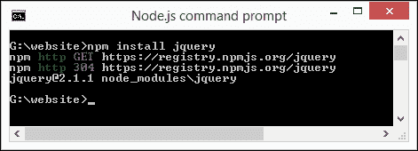
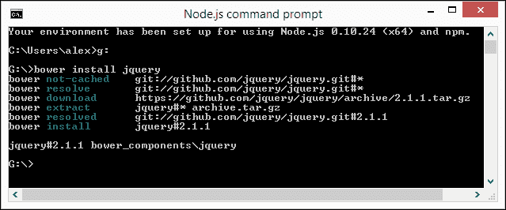
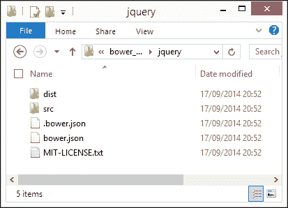
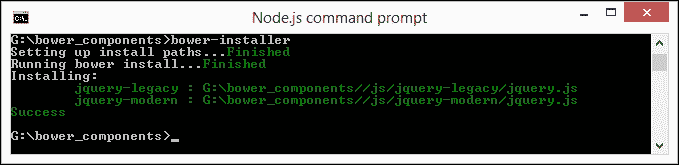
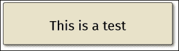
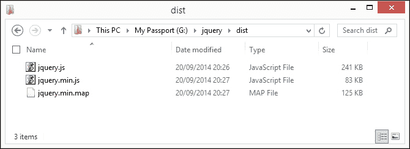
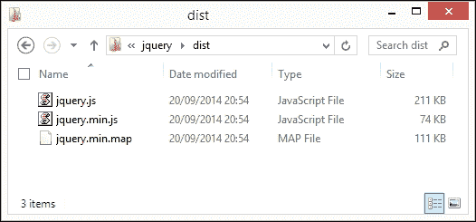
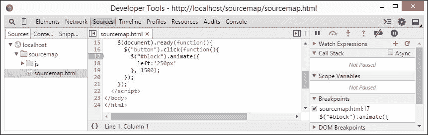
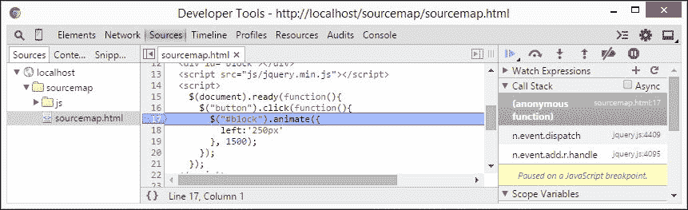
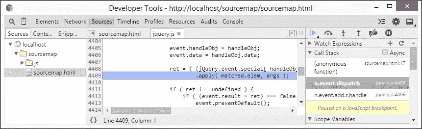

# 一、安装 jQuery

本地或 CDN，我想知道…？哪个版本…？我是否支持旧 IE…？

安装 jQuery 是一项吃力不讨好的任务，任何开发人员都要做无数次。很容易想象，这个人会问一些本章开头的问题。很容易想象为什么大多数人会选择使用**内容交付网络**（**CDN**链接），但安装 jQuery 不仅仅是简单的路线！

还有更多的选项可供选择，我们可以在本章中具体说明我们需要使用什么，我们将研究一些可供选择的选项，以帮助进一步发展您的技能。我们将讨论多个主题，包括：

*   下载和安装 jQuery
*   自定义 jQuery 下载
*   从 Git 构建
*   使用其他源安装 jQuery
*   添加源地图支持
*   与现代化者合作是一种退路

感兴趣的让我们开始吧。

# 下载并安装 jQuery

因为对于所有需要使用 jQuery 的项目，我们必须从开始，毫无疑问您已经下载并安装了一千次 jQuery；让我们快速回顾一下，让我们跟上进度。

如果我们浏览到[http://www.jquery.com/download](http://www.jquery.com/download) 我们可以使用以下两种方法之一下载 jQuery：下载压缩的生产版本或未压缩的开发版本。如果我们不需要支持旧的 IE（IE6、7 和 8），那么我们可以选择 2.x 分支。但是，如果仍然有一些顽固分子无法（或不想）升级，那么必须使用 1.x 分支。

要包含 jQuery，我们只需将此链接添加到页面：

```js
<script src="http://code.jquery.com/jquery-X.X.X.js"></script>
```

### 提示

**下载示例代码**

您可以从[下载从您的帐户购买的所有 Packt 书籍的示例代码文件 http://www.packtpub.com](http://www.packtpub.com) 。如果您在其他地方购买本书，您可以访问[http://www.packtpub.com/support](http://www.packtpub.com/support) 并注册，将文件直接通过电子邮件发送给您。

此处，`X.X.X`标记页面中使用的 jQuery 或迁移插件的版本号。

传统的智慧指出，jQuery 插件（这个也包括迁移插件）应该添加到`<head>`标记中，尽管有有效的参数将其添加为关闭`<body>`标记之前的最后一条语句；将其放置在此处可能有助于加快加载到站点的时间。

这一论点不是一成不变的；在某些情况下，可能需要将其放置在`<head>`标签中，此选择应留给开发人员的要求。我个人的偏好是将其放在`<head>`标记中，因为它将脚本（和 CSS）代码与页面主体中的主标记完全分离，尤其是在较轻的站点上。

我甚至看到一些开发人员争辩说，如果 jQuery 添加在顶部，而不是底部，那么*感觉到的*差别就很小；有些系统，如 WordPress，也在`<head>`部分包含 jQuery，因此两者都可以工作。但这里的关键是，如果您感觉到缓慢，那么将脚本移动到`<body>`标记之前，这被认为是一种更好的做法。

## 在开发能力中使用 jQuery

在此阶段需要注意的一点是，最佳实践建议 CDN 链接不应在开发能力范围内使用；相反，应下载未压缩的文件并在本地引用。一旦站点完成并准备好上传，就可以使用 CDN 链接。

## 添加 jQuery 迁移插件

如果您使用过 1.9 之前的任何版本的 jQuery，那么值得将 jQuery 迁移插件添加到您的页面中。jQuery 核心团队从此版本对 jQuery 进行了一些重大更改；迁移插件将临时恢复功能，直到旧代码可以更新或替换。

插件向 jQuery 对象添加了三个属性和一个方法，我们可以使用它们来控制其行为：

<colgroup><col> <col></colgroup> 
| 

性质或方法

 | 

评论

 |
| --- | --- |
| `jQuery.migrateWarnings` | 此是由页面上的代码按照生成顺序生成的字符串警告消息数组。消息仅在数组中出现一次，即使条件已发生多次，除非调用了`jQuery.migrateReset()`。 |
| `jQuery.migrateMute` | 将此属性设置为`true`，以防止在调试版本中生成控制台警告。如果设置了此属性，`jQuery.migrateWarnings`数组仍然保持不变，这允许在没有控制台输出的情况下进行编程检查。 |
| `jQuery.migrateTrace` | 如果希望警告但不希望跟踪显示在控制台上，请将此属性设置为`false`。 |
| `jQuery.migrateReset()` | 此方法清除`jQuery.migrateWarnings`数组并“忘记”已看到的消息列表。 |

添加插件同样简单只需添加一个类似于此的链接，`X`表示所使用插件的版本号：

```js
<script src="http://code.jquery.com/jquery-migrate-X.X.X.js"></script>
```

如果您想了解该插件的更多信息并获取源代码，可从[下载 https://github.com/jquery/jquery-migrate](https://github.com/jquery/jquery-migrate) 。

## 使用 CDN

我们同样可以使用 CDN 链接来提供我们的 jQuery 库主链接由**MaxCDN**为 jQuery 团队提供，当前版本在[提供 http://code.jquery.com](http://code.jquery.com) 。当然，我们可以使用其他来源的 CDN 链接，如果愿意的话，提醒如下：

*   谷歌（[https://developers.google.com/speed/libraries/devguide#jquery](https://developers.google.com/speed/libraries/devguide#jquery) ）
*   微软（[http://www.asp.net/ajaxlibrary/cdn.ashx#jQuery_Releases_on_the_CDN_0](http://www.asp.net/ajaxlibrary/cdn.ashx#jQuery_Releases_on_the_CDN_0) ）
*   CDNJS（[http://cdnjs.com/libraries/jquery/](http://cdnjs.com/libraries/jquery/) ）
*   JSDeliver（`http://www.jsdelivr.com/#%!jquery`）

但不要忘记，如果您需要，我们始终可以在本地保存 CDN 上提供的文件副本，并引用此副本。jQuery CDN 将始终具有最新版本，尽管可能需要几天时间才能通过其他链接显示更新。

# 使用其他来源安装 jQuery

正当好的，让我们继续开发一些代码！“下一步是什么？”我听到你问。

啊哈！如果你认为从主站点下载和安装 jQuery 是唯一的方法，那么你错了！毕竟，这本书是关于掌握 jQuery 的，所以你不会认为我只会谈论一些我相信你已经熟悉的东西，对吧？

是的，我们可以使用更多的选项来安装 jQuery，而不仅仅是使用 CDN 或主下载页面。让我们从使用节点开始。

### 注

每个演示都基于 Windows，因为这是作者的首选平台；在可能的情况下，给出了其他平台的替代方案。

## 使用 NodeJS 安装 jQuery

到目前为止，我们已经了解了如何下载和引用 jQuery，即使用从 jQuery 主站点或通过 CDN 下载的内容。这种方法的缺点是需要手动操作才能使 jQuery 版本保持最新！相反，我们可以使用包管理器来帮助管理我们的资产。Node.js 就是这样一个系统。让我们看一下为了获得 jQuery 安装需要执行的步骤：

1.  我们首先需要安装 Node.js-head 到[http://www.nodejs.org](http://www.nodejs.org) 下载所选平台的软件包；使用向导时接受所有默认设置（适用于 Mac 和 PC）。
2.  接下来，启动节点命令提示符，然后更改为项目文件夹。
3.  在提示中，输入以下命令：

    ```js
    npm install jquery

    ```

4.  Node will fetch and install jQuery—it displays a confirmation message when the installation is complete:

    

5.  然后，您可以使用以下链接引用 jQuery:

    ```js
    <name of drive>:\website\node_modules\jquery\dist\jquery.min.js.
    ```

节点现已安装并准备就绪，尽管我们已将其安装在本地文件夹中，但实际上，我们很可能将其安装在本地 web 服务器的子文件夹中。例如，如果我们正在运行 WampServer，我们可以安装它，然后将它复制到`/wamp/www/js`文件夹中，并使用`http://localhost/js/jquery.min.js`引用它。

### 注

如果您想查看 jQuery**节点包管理器**（**NPM**包）的源代码，那么请查看[https://www.npmjs.org/package/jquery](https://www.npmjs.org/package/jquery) 。

使用 Node 安装 jQuery 使我们的工作更简单，但要付出代价。Node.js（及其包管理器 NPM）主要用于安装和管理 JavaScript 组件，希望包遵循**CommonJS**标准。这样做的缺点是没有范围来管理网站中经常使用的任何其他资产，例如字体、图像、CSS 文件甚至 HTML 页面。

“为什么这会成为一个问题？”我听到你问。简单地说，既然我们可以自动管理所有这些资产，并且仍然使用 Node，为什么要让我们的生活变得艰难呢？

## 使用 Bower 安装 jQuery

库中增加了一个相对较新的功能，即支持使用基于节点的 Bower 进行安装，它是一个包管理器，负责通过 Internet 获取和安装包。它在管理多种类型的资产（如图像、字体和 CSS 文件）方面设计得更加灵活，并且不会干扰这些组件在页面中的使用方式（与节点不同）。

在本演示中，我假设您已经从上一节安装了它；如果没有，则需要在继续执行以下步骤之前重新访问它：

1.  调出 Node 命令提示符，切换到要安装 jQuery 的驱动器，输入以下命令：

    ```js
    bower install jquery

    ```

这将下载并安装脚本，完成后显示对安装版本的确认，如下图所示：



该库安装在您电脑上的`bower_components`文件夹中。它看起来类似于此示例，我已导航到下面的`jquery`子文件夹：



默认情况下，Bower 将在其`bower_components`文件夹中安装 jQuery。在`bower_components/jquery/dist/`中，我们将找到一个未压缩版本、压缩版本和源映射文件。然后，我们可以使用以下行在脚本中引用 jQuery：

```js
<script src="/bower_components/jquery/jquery.js"></script>
```

不过，我们可以更进一步。如果我们不想在默认情况下安装 Bower 安装附带的额外文件，我们只需在命令提示符中输入，而只需安装 jQuery 的 2.1 版：

```js
bower install http://code.jquery.com/jquery-2.1.0.min.js
```

现在，我们可以在这一点上真的很聪明；由于 Bower 使用 Node 的 JSON 文件来控制应该安装什么，因此我们可以使用它来进行真正的选择，并将 Bower 设置为同时安装其他组件。让我们来看一下，在下面的示例中，这将如何工作，我们将使用 BoWER 安装 jQuery 2.1 和 1.10（后者为 IE6—8 提供支持）：

1.  In the Node command prompt, enter the following command:

    ```js
    bower init

    ```

    这将提示您回答一系列问题，此时您可以填写信息或按*输入*接受默认值。

2.  查看项目文件夹；你应该在里面找到一个`bower.json`文件。在您喜爱的文本编辑器中打开它，然后更改代码，如图所示：

    ```js
    {
      "ignore": [ "**/.*", "node_modules", "bower_components", "test", "tests" ] ,
     "dependencies": {
     "jquery-legacy": "jquery#1.11.1",
     "jquery-modern": "jquery#2.10"
     }
    }
    ```

此时，您有一个`bower.json`文件可供使用。Bower 构建在 Git 之上，因此为了使用您的文件安装 jQuery，通常需要将其发布到 Bower 存储库。

相反，您可以安装额外的 Bower 软件包，这将允许您安装自定义软件包，而无需将其发布到 Bower 存储库：

1.  在节点命令提示窗口中，在提示处输入以下内容：

    ```js
    npm install -g bower-installer

    ```

2.  安装完成后，更改到项目文件夹，然后输入以下命令行：

    ```js
    bower-installer

    ```

3.  The `bower-installer` command will now download and install both the versions of jQuery, as shown here:

    

在这个阶段，您现在已经使用 Bower 安装了 jQuery。在将来的某个时候，您可以使用普通的 Bower 过程免费升级或删除 jQuery。

### 注

如果你想更多地了解如何使用鲍尔，网上有很多参考资料；[https://www.openshift.com/blogs/day-1-bower-manage-your-client-side-dependencies](https://www.openshift.com/blogs/day-1-bower-manage-your-client-side-dependencies) 是一个很好的教程示例，可以帮助您习惯使用 Bower。此外，还有一篇讨论 Bower 和 Node 的有用文章，可在[上找到 http://tech.pro/tutorial/1190/package-managers-an-introductory-guide-for-the-uninitiated-front-end-developer](http://tech.pro/tutorial/1190/package-managers-an-introductory-guide-for-the-uninitiated-front-end-developer) 。

Bower 并不是安装 jQuery 的唯一方法，尽管我们可以使用它安装多个版本的 jQuery，例如，我们仍然限于安装整个 jQuery 库。

我们可以通过只引用库中所需的元素来改进这一点。感谢 jQuery 核心团队所做的大量工作，我们可以使用**异步模块定义**（**AMD**方法仅引用我们网站或在线应用程序中需要的模块。

## 使用 AMD 方法加载 jQuery

在大多数情况下，当使用 jQuery 时，开发人员可能只是在代码中包含对主库的引用。它本身没有什么问题，但它加载了大量超出我们需求的额外代码。

一种更有效的方法是使用 AMD 方法，尽管这种方法需要一点努力来适应。简言之，jQuery 团队使库更加模块化；这允许您在需要时使用 require.js 等加载程序加载各个模块。

它并不适用于所有方法，特别是如果您大量使用库的不同部分。然而，对于那些只需要有限数量的模块的情况，这是一个完美的选择。让我们通过一个简单的例子来了解它在实践中是什么样子的。

### 注

在我们开始之前，我们需要一个额外的项目，代码使用 Fira Sans 常规自定义字体，可从[的 font Squirrel 获得 http://www.fontsquirrel.com/fonts/fira-sans](http://www.fontsquirrel.com/fonts/fira-sans) 。

让我们通过以下步骤开始：

1.  默认情况下，Fira Sans 字体没有 web 格式，因此我们需要将字体转换为 web 字体格式。继续并将`FiraSans-Regular.otf`文件上传到[的 Font Squirrel web 字体生成器 http://www.fontsquirrel.com/tools/webfont-generator](http://www.fontsquirrel.com/tools/webfont-generator) 。出现提示时，将转换后的文件保存到名为`fonts`的子文件夹中的项目文件夹中。
2.  我们需要将 jQuery 和 RequireJS 安装到项目文件夹中，因此启动 Node.js 命令提示符并更改到项目文件夹。
3.  接下来，依次输入这些命令，每次之后按*回车*：

    ```js
    bower install jquery
    bower install requirejs

    ```

4.  我们需要从本书附带的代码下载链接中提取一份`amd.html`和`amd.css`文件的副本。它包含一些简单的标记以及指向`require.js`的链接；`amd.css`文件包含一些我们将在演示中使用的基本样式。
5.  我们现在需要添加这个代码块，就在`require.js`链接的正下方—它处理对 jQuery 和 RequireJS 的调用，在这里我们同时调用 jQuery 和 Sizzle，jQuery 的选择器引擎：

    ```js
      <script>
        require.config({
          paths: {
            "jquery": "bower_components/jquery/src",
            "sizzle": "bower_components/jquery/src/sizzle/dist/sizzle"
          }
        });
        require(["js/app"]);
      </script>
    ```

6.  Now that jQuery has been defined, we need to call in the relevant modules. In a new file, go ahead and add the following code, saving it as `app.js` in a subfolder marked `js` within our project folder:

    ```js
    define(["jquery/core/init", "jquery/attributes/classes"], function($) {
      $("div").addClass("decoration");
    });
    ```

    ### 注

    我们使用`app.js`作为文件名，以与代码中的`require(["js/app"]);`引用相匹配。

7.  If all went well, when previewing the results of our work in a browser, we'll see this message:

    

尽管我们在这里只使用了一个简单的示例，但这足以说明只调用我们需要在代码中使用的模块而不是调用整个 jQuery 库是多么容易。诚然，我们仍然需要提供到库的链接，但这只是告诉我们的代码在哪里可以找到它；我们的模块代码为 29KB（gzip 时为 10KB），而完整库的未压缩版本为 242KB！

### 注

本书附带的代码下载链接中提供了完整版本的代码，请查找并运行`amd-finished.html`文件以查看结果。

现在，在某些情况下，使用这种方法简单地引用模块不是正确的方法；如果您需要定期参考许多不同的模块，这可能适用。

更好的替代方法是构建 jQuery 库的自定义版本，该版本只包含我们需要使用的模块，其余模块在构建过程中被删除。这有点牵涉其中，但值得我们努力，让我们来看看这个过程中所涉及的内容。

# 定制从 Git 下载 jQuery

如果我们这么想的话，我们真的可以利用 JavaScript 任务运行程序 Grunt 构建一个自定义版本的 jQuery。该过程相对简单，但涉及几个步骤；如果您对 Git 有一定的了解，这肯定会有所帮助！

### 注

演示假定您已经安装了 Node.js，如果没有安装，则需要先安装，然后再继续练习。

好的，让我们开始执行以下步骤：

1.  如果您的系统上还没有安装 Grunt，您首先需要安装 Grunt，然后调出 Node.js 命令提示符并输入以下命令：

    ```js
    npm install -g grunt-cli

    ```

2.  接下来，为此安装 Git，浏览到[http://msysgit.github.io/](http://msysgit.github.io/) 下载该软件包。
3.  Double-click on the setup file to launch the wizard, accepting all the defaults is sufficient for our needs.

    ### 注

    如果您想了解更多关于如何安装 Git 的信息，请浏览[https://github.com/msysgit/msysgit/wiki/InstallMSysGit](https://github.com/msysgit/msysgit/wiki/InstallMSysGit) 了解更多详情。

4.  安装 Git 后，从命令提示符中切换到`jquery`文件夹，输入此命令下载并安装构建 jQuery 所需的依赖项：

    ```js
    npm install

    ```

5.  构建过程的最后一个阶段是将图书馆构建成我们都知道和喜爱的文件；在同一命令提示符下，输入以下命令：

    ```js
    grunt

    ```

6.  Browse to the `jquery` folder—within this will be a folder called `dist`, which contains our custom build of jQuery, ready for use, as shown in the following screenshot:

    

## 拆除冗余模块

如果库中有我们不需要的模块，我们可以运行自定义构建。我们可以在构建库时设置 Grunt 任务来删除这些内容，留下项目所需的内容。

### 注

有关我们可以排除的所有模块的完整列表，请参见[https://github.com/jquery/jquery#modules](https://github.com/jquery/jquery#modules) 。

例如，要从构建中删除 AJAX 支持，我们可以运行此命令来代替步骤 5，如前所示：

```js
grunt custom:-ajax

```

这将导致文件保存在原始原始版本 30 KB 上，如以下屏幕截图所示：



JavaScript 和 map 文件现在可以以通常的方式合并到我们的项目中。

### 注

对于构建过程的详细教程，Dan Wellman 的这篇文章值得一读（[https://www.packtpub.com/books/content/building-custom-version-jquery](https://www.packtpub.com/books/content/building-custom-version-jquery) ）。

## 使用 GUI 作为替代方案

有一个在线 GUI 可用，它执行几乎相同的任务，而不需要安装 Git 或 Grunt。可在[处购买 http://projects.jga.me/jquery-builder/](http://projects.jga.me/jquery-builder/) ，虽然值得注意的是它已经有一段时间没有更新了！

好的，我们已经安装了 jQuery；让我们来看一个更有用的函数，它将帮助我们在代码中调试错误。从版本 1.9 开始，jQuery 中就提供了对源映射的支持。让我们看看它们是如何工作的，并在操作中看到一个简单的例子。

# 添加源地图支持

想象一下一个场景，如果你愿意的话，你已经创建了一个运行良好的杀手级网站，直到你开始抱怨网站上使用的一些基于 jQuery 的功能出现问题。听起来熟悉吗？

在生产站点上使用 jQuery 的未压缩版本不是一个选项；相反，我们可以使用源地图。简单地说，这些将 jQuery 的压缩版本映射到原始源代码中的相关行。

从历史上看，源映射在实现时给开发人员带来了很多痛苦，以至于 jQuery 团队不得不恢复到禁用映射的自动使用！

### 提示

为了获得最佳效果，建议您使用本地 web 服务器，如 WAMP（PC）或 MAMP（Mac）来查看此演示，并使用 Chrome 作为浏览器。

源地图不难实现；让我们详细介绍一下如何实现它们：

1.  从本书附带的代码下载链接中，提取`sourcemap`文件夹的副本，并将其保存到本地项目区域。
2.  按*Ctrl*+*Shift*+*I*键，在 Chrome 中调出**开发者工具**。
3.  Click on **Sources**, then double-click on the `sourcemap.html` file—in the code window, and finally click on **17**, as shown in the following screenshot:

    

4.  Now, run the demo in Chrome—we will see it paused; revert back to the developer toolbar where line **17** is highlighted. The relevant calls to the jQuery library are shown on the right-hand side of the screen:

    

5.  If we double-click on the `n.event.dispatch` entry on the right, Chrome refreshes the toolbar and displays the original source line (highlighted) from the jQuery library, as shown here:

    

花时间了解源代码地图是值得的，所有最新的浏览器都支持它，包括 IE11。尽管我们在这里只使用了一个简单的示例，但这并不重要，因为无论站点中使用了多少代码，其原理都是完全相同的。

### 注

要获得涵盖所有浏览器的更深入的教程，请访问[http://blogs.msdn.com/b/davrous/archive/2014/08/22/enhance-your-javascript-debugging-life-thanks-to-the-source-map-support-available-in-ie11-chrome-opera-amp-firefox.aspx](http://blogs.msdn.com/b/davrous/archive/2014/08/22/enhance-your-javascript-debugging-life-thanks-to-the-source-map-support-available-in-ie11-chrome-opera-amp-firefox.aspx) -值得一读！

## 增加对源地图的支持

在上一节中，我们刚刚预览了源代码映射，源代码映射支持已经添加到库中。值得注意的是，默认情况下，jQuery 的当前版本不包括源映射。如果您第一次需要下载最新版本或添加支持，请执行以下步骤：

1.  源地图可以使用`http://code.jquery.com/jquery-X.X.X.min.map`从主站点下载，其中`X`表示正在使用的 jQuery 版本号。
2.  打开库的缩小版本副本，然后在文件末尾添加此行：

    ```js
    //# sourceMappingURL=jquery.min.map
    ```

3.  保存它，然后将其存储在项目的 JavaScript 文件夹中。确保在同一文件夹中有库的压缩版本和未压缩版本的副本。

让我们继续看一看加载 jQuery 的另一个关键部分：如果由于未知原因，jQuery 变得完全不可用，那么我们可以向站点添加一个允许正常降级的后备位置。它是任何网站的一个小而关键的部分，它提供了一个更好的用户体验，而不是你的网站简单的崩溃！

# 与现代化者合作作为后援

使用 jQuery 时的最佳实践是确保在主版本不可用时为库提供回退。（是的，当它发生的时候是令人恼火的，但它可能发生！）

通常，我们可能会在最佳实践建议中使用一些 JavaScript，如下面的示例。这将很好地工作，但不能提供一个优雅的退路。相反，我们可以使用 Modernizer 为我们执行检查，并在所有操作都失败时提供优雅的降级。

### 注

Modernizr 是一个用于 HTML5/CSS3 的特性检测库，可用于在功能不可用时提供标准化的回退机制。您可以在[了解更多信息 http://www.modernizr.com](http://www.modernizr.com) 。

例如，在我们的网站页面末尾，代码可能如下所示。我们首先尝试使用 CDN 链接加载 jQuery，如果本地副本不起作用，则返回本地副本；如果两者都失败，则返回其他副本：

```js
<body>
  <script src="js/modernizr.js"></script>
  <script type="text/javascript">
    Modernizr.load([{
      load: 'http://code.jquery.com/jquery-2.1.1.min.js',
      complete: function () {
        // Confirm if jQuery was loaded using CDN link
        // if not, fall back to local version
        if ( !window.jQuery ) {
          Modernizr.load('js/jquery-latest.min.js');
        }
      }
    },
      // This script would wait until fallback is loaded, before loading
      { load: 'jquery-example.js' }
    ]);
  </script>
</body>
```

通过这种方式，我们可以确保 jQuery 要么本地加载，要么从 CDN 链接加载，如果其他所有操作都失败，那么我们至少可以优雅地退出。

# 加载 jQuery 的最佳实践

到目前为止，我们已经研究了几种将 jQuery 加载到页面中的方法，这些方法与本地下载库或在代码中使用 CDN 链接的常规方法不同。现在我们已经安装了它，这是一个很好的机会来介绍一些我们在加载 jQuery 时应该尝试合并到页面中的最佳实践：

*   始终尝试使用 CDN 在生产站点上包含 jQuery。我们可以利用 CDN 服务提供的高可用性和低延迟；该库也可能已经被预编译，避免了再次下载的需要。
*   尝试在相同版本的本地托管库上实施回退。如果 CDN 链接不可用（并且它们不是 100%无误的），则本地版本将自动启动，直到 CDN 链接再次可用：

    ```js
    <script type="text/javascript" src="//code.jquery.com/jquery-1.11.1.min.js"></script>
    <script>window.jQuery || document.write('<script src="js/jquery-1.11.1.min.js"><\/script>')</script>
    ```

*   请注意，尽管这与使用 Modernizer 同样有效，但如果两个版本的 jQuery 都不可用，它不会提供一个优雅的回退。虽然人们希望永远不要处于这种状态，但至少我们可以使用 CSS 提供一个优雅的退出！
*   使用协议相关/协议独立的 URL；浏览器将自动确定要使用的协议。如果 HTTPS 不可用，那么它将退回到 HTTP。如果您仔细查看上一点中的代码，它将显示一个与协议无关的 URL 的完美示例，其中包含从主 jQuery 核心站点对 jQuery 的调用。
*   如果可能，将所有 JavaScript 和 jQuery 包含内容保留在页面底部脚本会阻止页面其余部分的呈现，直到它们完全呈现为止。
*   使用 jQuery2.x 分支，除非您需要支持 IE6-8；在这种情况下，请使用 jQuery 1.x，而不要加载多个 jQuery 版本。
*   如果使用 CDN 链接加载 jQuery，请始终指定要加载的完整版本号，例如`jquery-1.11.1.min.js`。
*   如果您使用的是其他库，例如 Prototype、MooTools、Zepto 等，它们也使用了`$`符号，请尽量不要使用`$`来调用 jQuery 函数，而只使用 jQuery。您可以通过调用`$.noConflict()`函数将`$`的控制权返回给另一个库。
*   对于高级浏览器功能检测，请使用 Modernizer。

值得注意的是，在某些情况下，并非总是能够遵循最佳实践；环境可能会要求我们考虑需求，因为最佳实践无法使用。然而，这应尽可能保持在最低限度；有人可能会说，如果大多数代码没有遵循最佳实践，那么我们的设计就存在缺陷！

# 总结

如果你认为包括 jQuery 的唯一方法是通过手动下载或使用 CDN 链接，那么希望本章打开了你的眼睛，让我们花一些时间来回顾我们所学的东西。

在快速查看其他源代码之前，我们首先了解了大多数开发人员可能如何包括 jQuery。

在将注意力转向使用 Bower 包管理器之前，我们先看一下如何使用 Node。接下来，我们看看如何使用 AMD 方法引用 jQuery 中的各个模块。然后，我们继续关注使用 Git 创建库的自定义构建。然后，我们介绍了如何使用源代码映射来调试代码，并介绍了如何在 Google 的 Chrome 浏览器中支持源代码映射。

在加载 jQuery 的整个过程中，我们看到了如果根本无法加载 jQuery 会发生什么，以及如何通过使用 Modernizer 允许页面正常降级来解决这个问题。然后，我们在本章结束时介绍了在引用 jQuery 时可以遵循的一些最佳实践。

在下一章中，我们将通过了解如何定制 jQuery 来加快进度。这可以通过在运行时替换或修改函数或应用补丁来实现；你准备好陷入困境了吗？