# 二、定制 jQuery

好的，我们已经下载了 jQuery 的一个版本……我想知道我们接下来要做什么？

这是一个非常好的问题，让我来告诉大家！

多年来，jQuery 已成为一个成功的图书馆，并在全球数百万网站上使用。虽然我们通常可以通过使用库找到满足需求的方法，但在某些情况下，我们必须提供自己的补丁或修改，以满足我们的需求。

我们可以使用一个插件，但过了一段时间，它就变成了“插件这个，插件那个”综合症，我们变得太依赖插件了。相反，我们可以查看 jQuery 本身的覆盖功能；是的，它有一些风险，但正如我们将看到的，这是非常值得的努力。在本章中，我们将介绍覆盖 jQuery 的基础知识、覆盖 jQuery 的一些好处和缺点，并通过一些替换功能的示例进行介绍。我们将讨论以下主题：

*   鸭子打孔介绍
*   替换或修改现有行为
*   创建基本的猴子补丁
*   考虑到猴子修补的好处和陷阱
*   分发或应用补丁程序

准备好开始你的冒险了吗…？让我们开始吧！

# 准备

此时，我建议您在 PC 上的某个位置创建一个项目文件夹，以用于本演示，我将假定该文件夹名为`project`，位于主硬盘或`C:`驱动器的根目录下。

在文件夹中，继续创建多个子文件夹；这些需要被称为 `fonts`、`css`、 `js`和`img`。

# 在运行中修补库

多年来，数百名开发人员花了无数时间为 jQuery 创建补丁，要么修复某个描述的 bug，要么在库中提供新功能。

通常的方法是针对核心 jQuery 库提交一个 pull 请求，以供同行考虑。只要补丁按预期工作，并且不会在库的其他地方引起问题，那么它将被提交给 core。

这种方法的缺点是我们受到 jQuery 发布时间表的限制；虽然开发人员做了出色的工作，但在将补丁提交到核心之前可能需要时间。

## 引入猴子补丁

怎么办？我们是否希望我们的补丁能被提交而等待？

对一些人来说，这对其他人来说不是问题，耐心可能不是他们最大的美德，等待是他们最不想做的事情！幸运的是，我们可以通过使用一种叫做 monkey patching 的方法来解决这个问题。

在你提问之前，让我告诉你，我不是在提倡任何形式的虐待动物！**Monkey patching**或**duck punching**是一种有效的技术，可以在运行时创建临时覆盖 jQuery 核心库中现有功能的补丁。Monkey 补丁也有风险：如果更新在库中引入了同名的方法或函数，那么主要的风险是冲突。

### 注

在本章后面，我们将了解一些需要考虑的风险。

这就是说，如果谨慎和深思熟虑地使用 monkey patching，它可以用来更新功能，直到可以应用更持久的修复。现在是时候了，演示一下，我们将看看如何改进 jQuery 中的动画支持，但首先让我们看看在运行时替换或修改 jQuery 内核的基本知识。

# 更换或修改现有行为

那么，我们如何在 jQuery 的核心功能中实现（临时）更改？

这一切都始于使用一个**立即调用的函数表达式**（**IIFE**）；然后，我们只需保存原始函数的一个版本，然后再使用新函数覆盖它。

### 注

您可能听说过使用术语*自动执行匿名函数*；这是一个误导性的短语，虽然它的意思和生活是一样的，这是一个更准确的描述。

让我们看看基本框架在实际操作中是什么样子的：

```js
(function($){
  // store original reference to the method
  var _old = $.fn.method;
  $.fn.method = function(arg1,arg2){
    if ( ... condition ... ) {
      return ....
    } 
    else { // do the default
      return _old.apply(this,arguments);
    }
  };
})(jQuery);
```

如果你期待更复杂的事情，那么我很抱歉让你失望；基本的猴子补丁不需要太多的复杂性！进入补丁的内容的范围实际上取决于您试图在现有代码中修复或修改的内容。

为了证明这真的是所有需要的，让我们来看一个（尽管过于简化）的例子。在这个例子中，我们将使用一个标准的点击处理程序来显示狗对主人的反应……除了我们的狗似乎已经发展出了个性问题。

# 创建一个基本的猴子补丁

“性格改变？”我听到你问。是的，没错；我们的狗似乎很喜欢苗荣…。（我想不出原因；我不知道会有什么原因！）

在我们的示例中，我们将使用一个简单的点击处理程序来证明（在某些情况下）我们的狗会喵喵叫；然后，我们将完成所需的工作，以说服它做它应该做的事情。

1.  让我们从打开我们选择的文本编辑器开始，然后添加以下标记作为补丁的基础：

    ```js
    <!DOCTYPE html>
    <head>
      <title>Demo: Basic Duck Punching</title>
      <meta charset="utf-8">
      <script src="js/jquery.min.js"></script>
      <script src="js/duck.js"></script>
    </head>
    <body>
      <div>Hello World</div>
      <button>Make it a dog!</button>
    </body>
    </html>
    ```

2.  Save it as the `duck.html` file. In a separate file, we need to animate our button, so let's first add in a simple event handler for this purpose:

    ```js
    $(document).ready(function() {
      jQuery.fn.toBark = function() {
        this.text("The dog says: Miaow!")
        };
        $('button').on('click', function() {
          $('div').toBark();
        });
    })
    ```

    此时，如果我们在浏览器中运行演示，然后单击**使其成为狗！**我们可以肯定的看到我们可怜的宠物有一些问题，如下面的截图所示：

    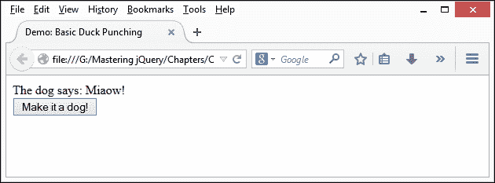

    我们显然需要向它展示其方式的错误，所以现在让我们来修复它。

3.  要解决问题，我们需要覆盖原来的`toBark()`函数。与我们新的固定替换；这将采取猴子补丁的形式。在`.on()`点击处理程序的正下方插入以下代码，为清晰起见，留出一行空格：

    ```js
    (function($) {
      var orig = $.fn.toBark;
      $.fn.toBark = function() {
        orig.apply(this,arguments);
        if (this.text() === 'The dog says: Miaow!') {
          this.append(" *Punch* Miaow! *Punch* *Punch* 
          Woof?... *Gives Dog a chew*");
        }
      };
    }(jQuery));
    ```

4.  If all is well, we should now at least see that our dog has come to its senses, albeit gradually, as shown in the following screenshot:

    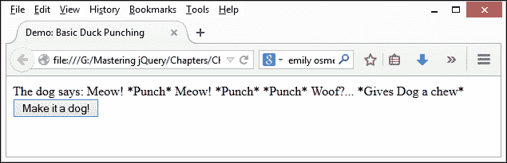

这个小小的练习，虽然大大简化了，但说明了一些关键点，值得花一点时间更详细地讨论一下，现在让我们来做吧。

## 解剖我们的猴子领地

核心库的修补应谨慎考虑；技术过程可能很简单，但它会提出一些需要首先回答的问题。我们将在本章后面讨论其中的一些问题，但现在，让我们假设我们需要应用补丁。

基本补丁采用 IIFE 的格式，我们在单个模块中包含所有功能；其范围受到保护，不受其所在环境的影响。

### 注

有关 IIFEs 的更详细说明，请参考[http://en.wikipedia.org/wiki/Immediately-invoked_ 函数\表达式](http://en.wikipedia.org/wiki/Immediately-invoked_%20function_expression)。

在我们的示例中，我们通过将原始函数的副本作为对象存储在`orig`中开始。然后，我们启动了新的替换，即`.toBark()` 函数，在该函数中，我们首先调用`.toBark()`函数，然后进行替换：

```js
(function($) {
  var orig = $.fn.toBark;
  $.fn.toBark = function() {
    orig.apply(this,arguments);
    if (this.text() === 'The dog says: Miaow!') {
      this.append(" *Punch* Miaow! *Punch* *Punch* 
      Woof?... *Gives Dog a chew*");
    }
  };
}(jQuery));
```

我们补丁的一个关键部分是`.apply()`函数的使用，它将调用一个函数，并将上下文设置为应用该函数的对象。在本例中，在函数中，引用`this`关键字将引用该对象。

以演示中使用的格式使用 IIFE 具有以下优点：

*   We can reduce the scope's lookup—IIFEs allow you to pass commonly used objects to the anonymous function, so they can be referenced within the IIFE at a local scope

    ### 注

    由于 JavaScript 首先在本地范围内查找属性，因此无需全局查找，从而提供更快的查找速度和性能。使用 IIFE 可以防止局部变量被全局变量覆盖。

*   IIFE 通过缩小帮助优化代码我们可以将对象作为局部值传递给 IIFE；如果不存在同名变量，则小型化器可以将每个全局对象的名称缩减为一个字母

使用 iLife 的缺点是可读性；如果我们的 iLife 包含大量代码，那么我们必须滚动到顶部，以确定传递的对象。在更复杂的例子中，我们可以考虑使用 Greg Franko 开发的模式来解决这个问题：

```js
(function (library) {
  // Call the second IIFE and locally pass in the global jQuery, 
  window, and document objects
  library(window, document, window.jQuery);
}
// Locally scoped parameters
(function (window, document, $) {
  // Library code goes here
}));
```

需要注意的是，这种模式将变量分成两部分，这样我们就可以避免频繁地上下滚动页面；它仍将产生相同的最终结果。

在[第 3 章](03.html#aid-TI1E1 "Chapter 3. Organizing Your Code")*组织代码*中，我们将深入探讨如何在 jQuery 中使用模式。现在我们看到了一个补丁的行动，让我们继续，并需要一些时间来考虑一些好处，我们可以从使用猴子补丁过程中获得的好处。

# 考虑猴子修补的好处

好的，我们已经看到了一个典型的补丁会是什么样子；然而，问题是，为什么我们要使用这种方法修补核心库功能？

这是一个很好的问题，它是一种有风险的方法（我们将在本章后面的*中看到，考虑猴子修补的陷阱*部分）。使用这种方法的关键是采取深思熟虑的方法；考虑到这一点，让我们花一点时间来考虑鸭子穿孔 jQuery 的好处：

*   我们可以在运行时替换方法、属性或函数，这些方法、属性或函数缺少功能或包含需要修复的错误，我们不能等待正式补丁
*   jQuery 允许您修改或扩展 jQuery 的现有行为，而无需维护源代码的私有副本
*   我们有一个安全网，可以对内存中运行的对象应用补丁，而不是源代码；换句话说，如果它完全出错，我们可以简单地从站点中取出补丁，保留原始源代码不变
*   Monkey 补丁是分发与原始源代码共存的安全性或行为修复的一种好方法；如果对修补程序的弹性有任何疑问，我们可以在将其提交到源代码之前对其进行压力测试

讨论够了，让我们开始编写一些演示！我们将学习一些可以同样应用于 jQuery 的示例补丁，从动画开始。

# 在 jQuery 中更新动画支持

如果您花过任何时间开发 jQuery，您很可能创建了某种形式的动画，包括以固定频率管理更改，这听起来熟悉吗？

当然，我们可以使用`setInterval()`函数来实现这一点，但是`setTimeOut()`函数似乎并不理想。这两种功能在启动前都有一个延迟，不同浏览器的延迟不同；它们都是同样的资源密集型！

相反，根据[caniuse.com](http://caniuse.com)的图表，我们可以使用**requestAnimationFrame**（**rAF**API，这是目前大多数现代浏览器所支持的，绿色标签显示了哪些浏览器版本支持**requestAnimationFrame**：

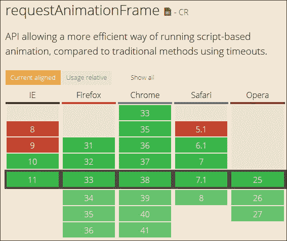

requestAnimationFrame API 的优点在于，它的资源密集度较低，不会影响页面上的其他元素，并且在失去焦点时被禁用（非常适合降低功耗！）。因此，您可能认为默认情况下在 jQuery 中实现它是有意义的，对吗？

## 探索 requestAnimationFrame API 的过去

讽刺的是，jQuery 在 1.6.2 版本中使用了 rAF；它是在 1.6.3 版本中推出的，主要原因是当 windows 重新获得焦点时，动画会堆积起来。部分原因可归因于 rAF 的使用方式（不正确），为了纠正这些问题，需要对其使用进行重大更改。

### 注

要查看一些与时间有关的问题，请浏览[http://xlo.co/requestanimationframe](http://xlo.co/requestanimationframe) -这个网站上有一些演示完美地说明了为什么时间如此关键！

## 今天使用 requestAnimationFrame 方法

谢天谢地，我们今天仍然可以在 jQuery 中使用 requestAnimationFrame；JQuery 的开发人员之一 Corey Frang 编写了一个插件，可以挂接并覆盖核心库中的`setInterval()`方法。

### 注

插件的原始版本可从 GitHub 下载，网址为[https://github.com/gnarf/jquery-requestAnimationFrame/blob/master/src/jquery.requestAnimationFrame.js](https://github.com/gnarf/jquery-requestAnimationFrame/blob/master/src/jquery.requestAnimationFrame.js) 。

这可能是我们在使用 jQuery 时所能做的最简单的更改之一。在本练习的最后，我们将进一步探讨这一点。现在，让我们开始创建一些代码！

## 创建我们的演示

对于我们的下一个演示，我们将使用一个代码笔示例的更新版本，由开发者 Matt West 创建。原始演示可从[获得 http://codepen.io/matt-west/pen/bGdEC/](http://codepen.io/matt-west/pen/bGdEC/) ；我已经刷新了外观，删除了 Corey 插件的供应商前缀元素，因为它们不再需要了。

为了让您了解我们将要实现的目标，我们将覆盖主要的`setInterval`方法；此方法不调用 jQuery 方法，尽管它看起来可能是；`setInterval`是一个普通的 JavaScript 函数，如下所示：

```js
jQuery.fx.start = function() {
  if ( !timerId ) {
    timerId = setInterval( jQuery.fx.tick, jQuery.fx.interval );
  }
};
```

我在这个演示中也加入了字体的变化，我使用了 Noto Sans 字体，可以从[下载 http://www.fontsquirrel.com/fonts/noto-sans](http://www.fontsquirrel.com/fonts/noto-sans) ；如果您想使用不同的字体，请随意相应地修改代码。

准备好的让我们从以下步骤开始：

1.  从本书附带的代码下载链接副本中，继续提取`raf.css`、`raf.js`和`raf.html`文件，并将它们保存到项目文件夹中。
2.  在新文件中，添加以下代码这是我们的 monkey 补丁或 Corey 原始插件的修改版本。我们首先启动一些变量，如下所示：

    ```js
    (function( jQuery ) {
      var animating,
          requestAnimationFrame = window.requestAnimationFrame,
          cancelAnimationFrame = window.cancelAnimationFrame;

          requestAnimationFrame = window["RequestAnimationFrame"];
          cancelAnimationFrame = window["CancelAnimationFrame"];
    ```

3.  接下来是动画功能，它是从主`requestAnimationFrame`方法

    ```js
      function raf() {
        if ( animating ) {
          requestAnimationFrame( raf );
          jQuery.fx.tick();
        }
      }
    ```

    调用的
4.  我们现在需要我们的主要`requestAnimationFrame`方法；继续并在`raf()`事件处理程序的正下方添加以下代码行：

    ```js
    if ( requestAnimationFrame ) {
      // use rAF
      window.requestAnimationFrame = requestAnimationFrame;
      window.cancelAnimationFrame = cancelAnimationFrame;
      jQuery.fx.timer = function( timer ) {
        if ( timer() && jQuery.timers.push( timer ) && !animating ) {
          animating = true;
          raf();
        }
      };
      jQuery.fx.stop = function() {
        animating = false;
      };
    } ( jQuery ));
    ```

5.  将文件另存为`jquery.requestAnimationFrame.js`，保存在主项目文件夹下名为`js`的子文件夹中。
6.  If you run the demo in a browser, you can expect to see the bar move when you press **Start Animation**, as shown in the following screenshot:

    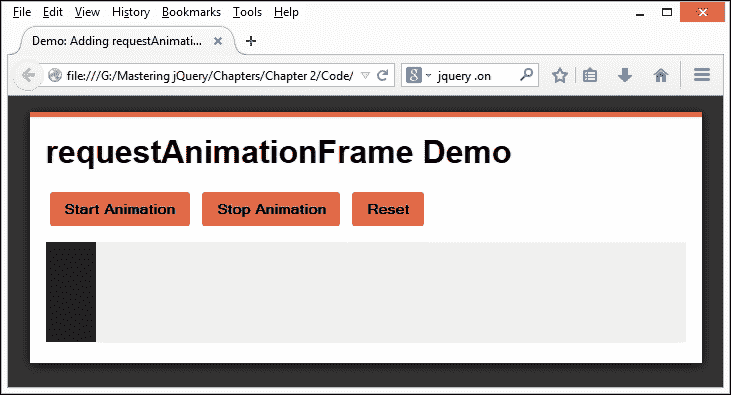

7.  To prove that the plugin is being used, we can use Google Chrome's **Timeline** option (within **Developer Tools**)—clicking on the red **Record** icon, then running the demo, and then stopping it produces this extract:

    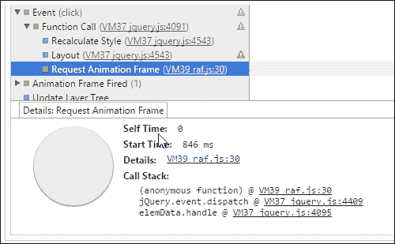

    ### 提示

    确保您在**时间线**下勾选了**JS Profiler**复选框-将显示详细信息；您可能需要向下滚动才能查看**事件**条目。

这可能是我们可以用来覆盖 jQuery 功能的最简单的更改之一，但可能是最有争议的更改之一——后者取决于我们如何使用它。但关键的一点是，我们可以使用多种格式覆盖功能。

最安全的方法是使用插件；在我们这里的示例中，我们使用了一个修改过的版本，原始版本是从 jQuery1.8 引入的，所以这里所做的更改只是将它带到了现代。我们可以完全朝着相反的方向去做，创建一个覆盖现有功能的功能，它会带来更高的风险，但是如果小心地做，它是值得努力的！让我们来看一个简单的例子，以覆盖的方式，在适当的时候切换 WebP 格式的图像。

# 向 jQuery 添加 WebP 支持

在这一点上，我有一点要坦白：向 jQuery 添加全面的 WebP 支持可能超出了本书的范围，更不用说填满大部分页面了！

### 注

WebP 是谷歌创建的一种相对较新的图像格式，它提供了比标准 PNG 文件更好的压缩，您可以在[上阅读更多关于它的信息 https://developers.google.com/speed/webp/](https://developers.google.com/speed/webp/) 。目前，Chrome 和 Opera 都在本地支持这种格式；添加支持后，其他浏览器将显示 WebP 图像。

下一个演示实际上是关于如何根据浏览器是否支持更新的格式，在屏幕上显示内容的两种不同方式之间切换。一个很好的例子是，我们可能在任何可能的地方使用 CSS3 动画，而对于那些本机不支持 CSS3 动画的浏览器，我们可以使用 jQuery。

在下一个演示中，我们将使用类似的原理创建一个覆盖`.hasClass()`方法的 monkey 补丁，以便在支持的情况下自动切换到 WebP 格式的图像。

### 注

如果您想了解更多信息，在[上有一个关于如何开始使用该格式的有用讨论 http://blog.teamtreehouse.com/getting-started-webp-image-format](http://blog.teamtreehouse.com/getting-started-webp-image-format) 。

## 开始

在本演示中，我们需要使用两种不同格式的图像；我假设 JPEG 已经被用作我们的基本格式。当然，另一个图像需要采用 WebP 格式！

如果您还没有将图像转换为 WebP 格式的方法，那么您可以使用谷歌提供的工具进行转换，这些工具可在[下载 https://developers.google.com/speed/webp/download](https://developers.google.com/speed/webp/download) 。Windows、Linux 和 Mac OS 的版本可在此处下载。在本练习中，我假设您使用的是 Windows：

1.  在下载页面上，点击[http://downloads.webmproject.org/releases/webp/index.html](http://downloads.webmproject.org/releases/webp/index.html) 然后查找`libwebp-0.4.2-windows-x64.zip`（如果您仍然使用 32 位 Windows 平台，请选择`x86`版本）。
2.  下载后，将`libwebp-0.4.2-windows-x64`文件夹解压缩到项目文件夹中的安全文件夹中，然后导航到其中的`bin`文件夹。
3.  打开第二个资源管理器视图，然后导航到存储图像的位置，并将其复制到`bin`文件夹中。
4.  打开命令提示符，然后导航到`C:\libwebp-0.4.2-windows-x64\bin`。
5.  在提示下，输入此命令，分别用 JPEG 和 WebP 图像的名称替换这两个名称：

    ```js
    cwebp <name of JPG image> -o <name of WebP image>

    ```

6.  If all is well, we will get a screen similar to the following screenshot, along with our WebP format image in the `bin` folder:

    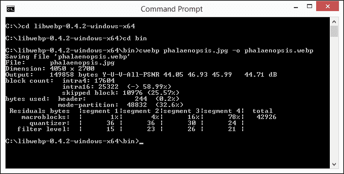

7.  最后一步是将图像复制到我们的项目文件夹中，以便它们可以用于演示的下一阶段。

## 创建我们的补丁

现在我们已经准备好了图像，我们可以继续为演示设置标记：

1.  继续，将以下代码复制到一个新文件中，并将其保存为`replacewebp.html`：

    ```js
    <!DOCTYPE html>
    <head>
      <title>Demo: supporting WebP images</title>
      <script src="js/jquery.js"></script>
      <script src="js/jquery.replacewebp.js"></script>
    </head>
    <body>
      
    </body>
    </html>
    ```

2.  接下来，我们需要在一个新文件中添加我们的 monkey 补丁，添加以下代码并将其保存为`jquery.replacewebp.js`。这有点复杂，所以我们将分块讨论，从标准声明开始：

    ```js
    (function($){
      var hasClass = $.fn.hasClass;
      $.fn.hasClass = function(value) {
        var orig = hasClass.apply(this, arguments);
        var supported, callback;
    ```

3.  接下来是执行测试的函数，看看我们的浏览器是否支持使用 WebP 图像格式；在变量赋值的正下方添加以下代码：

    ```js
    function testWebP(callback) {
      var webP = new Image();
      webP.src = "data:image/webp;   base64,UklGRi4AAABX"
      + "RUJQVlA4TCEAAAAvAUAAEB8wAiMw"
      + "AgSSNtse/cXjxyCCmrYNWPwmHRH9jwMA";
      webP.onload = webP.onerror = function () {
        callback(webP.height == 2);
      };
    };
    ```

4.  接下来，我们使用`testWebP`函数来确定我们的浏览器是否可以支持 WebP 图像格式。如果可以，我们将用于`.webp`的文件扩展名更改为：

    ```js
    window.onload = function() {
      testWebP(function(supported) {
        console.log("WebP 0.2.0 " + (supported ? "supported!" : "not 
        supported."));
        $('.webp').each(function() {
          if (supported) {
            src = $(this).attr('src');
            $(this).attr('src', src.substr(0, src.length-3) + 'webp');
            console.log("Image switched to WebP format");
          }
      })
    });
    }
    ```

5.  我们通过执行函数的原始版本来结束函数，然后使用通常与 IIFE 相关的结束括号终止函数：

    ```js
       return orig;
      };
    })(:jQuery);
    ```

6.  然后我们需要再添加一个函数，用于启动对`.hasClass()`的调用；继续，在 monkey patch 函数下面添加以下代码行：

    ```js
    $(document).ready(function(){
      if ($("img").hasClass("webp")) {
        $("img").css("width", "80%");
      }
    });
    ```

7.  If all went well, when we run our demo, we will see an image of an Phalaenopsis, or Moth Orchid, as shown in the following screenshot:

    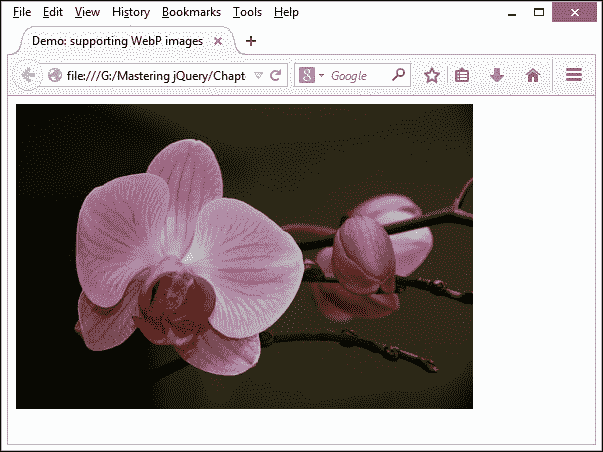

在这一点上并没有什么不寻常的事情；事实上，你可能想知道我们生产了什么，对吗？

啊哈！如果使用 DOM 检查器（如 Firebug）检查源代码，您将看到这个问题的答案，如下所示：

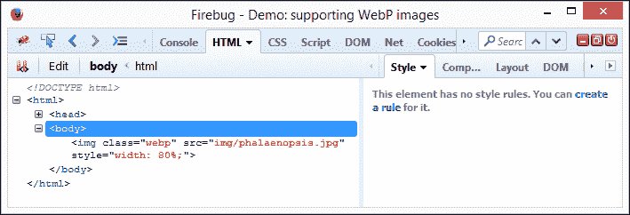

注意它是如何显示一幅 JPEG 格式的图像的吗？这是因为 Firefox 本机不支持这种开箱即用的格式；只有谷歌 Chrome 可以：

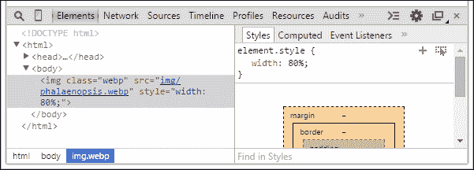

如果您切换到使用 Google Chrome，则您可以按*Ctrl*+*Shift*+*I*查看源代码。您可以清楚地看到所使用格式的变化。如果你仍然有疑问，你甚至可以看看谷歌 Chrome 的**控制台**标签。在这里，它清楚地显示了补丁已被引用，因为它显示了您希望看到的两条消息：

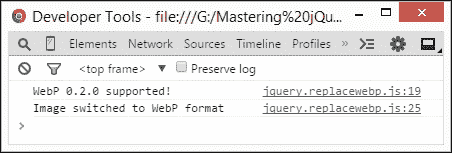

我们已经创建了我们的补丁，它似乎工作正常，这就是我们需要做的，对吗？错了，我们应该考虑更多的步骤，其中一些甚至可能阻止我们将补丁发布到更广泛的受众，至少暂时是这样。

我们需要考虑的一些要点和我们可能需要采取的一些行动；让我们暂停一下，从发展的角度考虑我们需要从哪里着手。

## 更进一步

在这个例子中，我们已经覆盖了一个现有的方法，作为说明鸭子出击的一种手段。实际上，我们需要花更多的时间来完善我们的补丁，然后才能发布它！

主要原因是下载的内容比我们真正需要的要多，这是一个由来已久的问题；为了证明这一点，在该浏览器中运行演示时，请查看 Google Chrome 的**资源**选项卡：

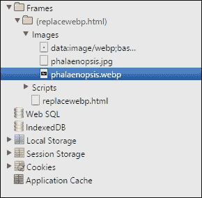

好像我们需要进一步的确认，从**时间线**选项卡中提取的这段信息也确认了正在调用的 JPEG 和 WebP 图像的存在，以及由此对下载时间的影响：

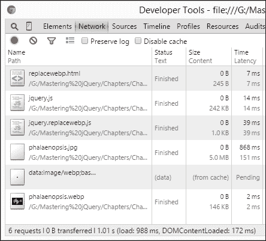

我们在这里创建了一个补丁来说明*可以做什么*；实际上，我们很可能会包含代码来对内容执行不同的操作。首先，我们可以执行以下操作：

*   包括对更多图像格式的支持，包括 JPEG、GIF 或 SVG。
*   硬编码接受一种图像格式的代码；我们可以通过使补丁更通用来扩展它的可用性。
*   jQuery 正在向基于插件的体系结构发展；我们真的应该考虑修补核心代码吗？在代码中创建一个钩子可能会有更多的好处，这样你就可以用一个新的插件扩展现有的功能。
*   我们使用`.hasClass()`作为覆盖现有方法的基础；这真的是最合适的做法吗？虽然在表面上看来，它可能是有用的，但实际上，其他人可能不同意我们选择超越的观点，并认为其他方法更有用。

可能会提出很多问题，需要回答；这只是由于仔细考虑，我们将最大限度地利用我们的补丁成功的机会，并可能考虑它提交到核心。

让我们改变策略，转而检查猴子修补的关键部分。这个过程有其风险，所以让我们花些时间考虑一下这些风险以及这些对我们工作的影响。

# 考虑猴子修补的陷阱

现在我们已经看到了一些在实践中的例子，值得花一些时间考虑猴子修补库的一些风险，例如 jQuery：

*   最主要的风险和最可能造成麻烦的风险是冲突。假设您创建了一个补丁，其中包含一些函数，我们将这些函数称为`1`、`2`和`3`。添加另一个补丁，我们必须*不要*使用相同的函数名；否则，很难确定功能`1`，还是`2`，甚至`3`是先到的？
*   另一个风险是安全。如果像 jQuery 这样的库可以被猴子修补，那么如何阻止任何人引入破坏现有代码的恶意构造呢？可以说，这种风险总是存在于客户端脚本中；与标准插件相比，覆盖核心 jQuery 功能的风险更大。
*   对核心库的升级可能会带来一种风险，这种风险不仅会破坏您的修补程序，还会删除或更改原本为您的修补程序提供工作基础的功能。这将防止使用 jQuery 的站点升级，并最终使其容易受到攻击。
*   添加太多的补丁而没有适当的注意和考虑将使您的 API 膨胀和缓慢；这将降低响应能力并使其更难管理，因为我们必须花更多时间剖析代码，才能找到问题的症结所在。
*   任何猴子补丁都应该放在你的网站内；它们将基于直接改变 jQuery 的代码，而不是使用标准 jQuery 插件提供的预定义机制。这可能是因为作者可能并没有像测试插件那样广泛地测试他们的猴子补丁；如果您正在使用其他人的修补程序，则风险更大。
*   如果一个补丁包含大量功能，那么改变核心功能的影响就更大、更广；进行这些更改可能会破坏其他人的补丁或插件。

哎哟这里有严重的问题！如果我们面临这些风险，那么为什么要使用这个过程呢？

这是一个好问题；如果使用得当，monkey 补丁是一种有用的技术，可以帮助提供少量额外功能或纠正问题。它甚至可以作为在提交交付之前对代码进行压力测试的一种手段。还有一种观点认为插件中应该包含该功能，理由很充分：

*   插件可以发布供他人使用；如果插件可用，他们可以通过 GitHub 等网站提供修复或更新
*   插件可能比一个简单的补丁更适用于范围更广的 jQuery 版本；后者可能是为了解决特定问题而定制的
*   生成一个补丁来覆盖多个补丁可能会导致较大的文件大小或对核心功能进行大量更改；这在插件的框架内得到更好的管理，插件可以包括其他功能，例如国际化
*   jQuery 核心正朝着更精简、更快的体系结构发展；添加大量补丁将增加冗余功能的级别，并降低其对其他开发人员的吸引力

猴子修补的关键是不要滥用它；这是一个有效的工具，但只有当你用尽所有其他可能的解决方案时，它才真正有效。如果您迫切需要修复一个问题，不能等待官方更新，那么考虑猴子修补 jQuery 只是要小心你怎么做！

# 分发或应用补丁

一旦我们的补丁完成，我们需要分发它；简单地更新 jQuery 的一个版本并将其与我们的插件一起发布或在我们的网站中使用是很有诱惑力的。但是，使用这种方法有一些缺点：

*   我们无法利用浏览器的缓存功能；如果我们使用 jQuery 的缓存版本，那么它要么不包含我们的补丁代码，要么从服务器中提取新的副本。
*   修补 jQuery 副本意味着我们被锁定在该版本的 jQuery 中。这会阻止最终用户使用自己版本的 jQuery、CDN 链接，甚至是更新版本的 jQuery（假设补丁仍然有效！）。
*   允许修补程序在运行时单独运行意味着它只修补源代码中的对象；如果它出现了可怕的错误，那么我们可以放弃补丁，仍然留下一个干净的（未补丁的）jQuery 版本。对源代码进行更改并不能让我们享受这种奢侈。

相反，我们可以使用一些替代方法来应用修补程序：

*   我们可以简单地将补丁包含在插件或网站中的一个单独的文件中，这样可以保持核心 jQuery 库的干净，尽管这意味着从服务器请求补丁文件会有一点开销。然后，用户只需从运行时链接到文件的副本，并在环境发生变化时放弃。
*   Patches can also be distributed as a Gist—this makes it independent of our site or plugin and allows others to comment or suggest tweaks that can be incorporated into our code.

    ### 注

    例如，我为`replacewebp.js`补丁创建了以下要点，该补丁可在[上找到 https://gist.github.com/alibby251/89765d464e03ed6e0bc1](https://gist.github.com/alibby251/89765d464e03ed6e0bc1) 并可作为分发代码的方式链接到项目中：

    ```js
    <script src="https://gist.github.com/alibby251/89765d464e03ed6e0bc1.js"></script>
    ```

*   如果该修补程序作为现有项目的一部分或单独存在于 GitHub 存储库中，那么我们可以更进一步。GitHub 将允许用户提交拉取请求，以便在考虑提交到 core 之前帮助改进现有补丁。
*   There is an alternative route that we can take: the patch can be packaged and delivered via a frontend package manager, such as Bower ([http://www.bower.io](http://www.bower.io)) or Jam ([http://www.jamjs.org](http://www.jamjs.org)).

    ### 注

    有关通过 Bower 下载的包装内容的更多信息，请参考[http://bower.io/docs/creating-packages/](http://bower.io/docs/creating-packages/) 。

这些是我们可以用来分发补丁的一些选项；使用这些方法的选择，我们可以使我们的补丁提供给尽可能广泛的观众，并希望受益于他们的测试和反馈！

# 总结

我们在过去几页中已经涵盖了很多内容，其中一些可能会让你头晕目眩，所以让我们喘口气，想想我们学到了什么。

我们首先介绍了库的补丁，如 jQuery 和术语 duck-punching（或 monkey-patching）。在继续创建一个基本的 monkey 补丁并通过其应用程序编写代码之前，我们研究了如何使用此方法替换或修改 jQuery 的现有行为。

接下来我们来看看使用猴子贴片可以带来的一些好处；我们谈到了涉及的风险和一些缺陷，我们需要考虑创建和应用补丁。

然后，我们转而进行了大量的演示，探索了一些我们可以临时修改代码的方法，最后我们看了一下如何将修补程序用于生产。

如果要成功开发任何形式的补丁或插件，都需要维护良好的代码。在下一章中，我们将通过使用设计模式更好地组织代码来了解如何提高这方面的技能。