# 三、组织代码

组织还是不组织，这是个问题…

到目前为止，在我们的旅程中，我们已经介绍了下载 jQuery 的各种方法，并了解了如何用自定义代码覆盖核心功能，但是错误地引用了著名侦探的话：我们应该如何组织代码？

好吧，你可能会认为我在这里失去了情节，但请容忍我；掌握 jQuery 这样的语言不仅要生成复杂的代码，还要生成结构良好、简洁、易读的代码。

在本章中，我们将回到基础知识，介绍 jQuery 中可用的一些设计模式。我们将看到本章中讨论的一些技术将如何帮助改进代码格式并使您成为更好的程序员。在本章中，我们将介绍以下主题：

*   介绍设计模式以及我们为什么要使用它们
*   剖析设计模式的结构
*   探索可用的不同设计模式的一些示例以及使用它们的好处
*   探索 jQuery 库中模式的使用

准备好开始了吗？让我们开始…

# 介绍设计模式

你有多少次浏览过一个网站，对这个美丽的设计感到敬畏，却发现代码看起来像谚语中的狗的晚餐？一个普遍存在的误解是外观是设计师的领域；这是不正确的，因为代码的设计也起着同样重要的作用。

我们怎样才能避开这个问题？简单地说，我们可以使用**设计模式**或一组结构来帮助提供解决方案，并使我们能够更加专注于我们希望在项目中提供的功能。

1977 年由建筑师克里斯托弗·亚历山大（Christopher Alexander）首次创建，此后工程师们使用了早期的原则，并将其发展成我们现在所知的设计模式。这项工作由**四人帮**（**GoF**）在其标志性著作*设计模式：可重用面向对象软件的元素*中进一步推动，该书于 1995 年出版。

他们帮助不仅将设计模式的使用推向了更远的领域，还提供了一些设计技巧和陷阱；它们也有助于提供当今常用的 23 种核心模式（其中，我们将介绍 jQuery 开发中使用的核心模式）。我们将看一看今天使用的一些模式，但是首先，让我们回答一个简单的问题。设计模式的真正含义是什么？它们如何帮助我们编写清晰简洁的代码，从而减少不必要的重复？

# 定义设计模式

在基本层面上，设计模式采用预定义模板的格式或一组可重用原则，帮助分类不同的方法，作为支持良好设计的一部分。

为什么要使用它们？简单地说，将设计模式纳入我们的项目有三个主要好处：

*   **设计模式是经过验证的解决方案**：它们基于解决软件开发中问题的可靠方法，并且基于帮助创建所用模式的开发人员的经验
*   **模式可以重复使用**：尽管它们通常代表一个现成的解决方案，但它们可以根据我们的需要轻松地进行调整
*   **模式富有表现力**：它们包含一套结构和词汇表，帮助您清晰优雅地表达大型解决方案

在这一点上，你可能会认为模式必须是一门精确的科学，我们受到我们所使用的模式框架的限制。事实并非如此；它们不是一个精确的解决方案，而只是一个帮助提供解决方案的方案。

进一步说，我们在工作中应该考虑使用设计模式的原因有很多：

*   我们可以使用久经考验的技术有效地编码或防止可能在开发过程中导致我们以后出现重大问题的小问题，从而消除了对代码结构的担忧，并使我们能够专注于解决方案的质量。
*   模式的设计目的是提供通用的解决方案，这些解决方案不会将它们与特定问题联系在一起，但可以应用于改进代码的结构。
*   一些模式，如果选择得当，可以通过避免重复来帮助减少代码量；他们鼓励我们仔细阅读我们的代码，减少重复，并继续使用**不要重复自己**（**DRY**原则，这是 jQuery 的原则之一。
*   模式不是一次性的时间点解决方案；我们的工作可能有助于改进现有设计，甚至为创建新图案提供空间！这种持续的改进有助于确保模式随着时间的推移变得更加健壮。

不管的目的是什么，设计模式的一个关键原则是，除非经过模式社区的严格测试，否则它们并不总是被视为设计模式。许多似乎是一种模式；实际上，它们更可能是一个原型模式，或者是一个已经创建但尚未经过充分测试的模式，被归类为真正的模式。

任何设计模式的核心原则都基于 Alexander 的信念，即它们应该始终代表一个过程和一个输出。后一个术语故意含糊其辞；它应该表示某种可视的东西，但该可视输出的确切上下文将取决于所选择的模式。

现在，我们已经了解了设计模式是什么，让我们讨论一下它们是什么样子的。它们是由特定的元素或结构组成的吗？在我们来看一些例子之前，让我们先考虑一下设计模式的构成，以及如何使用它来达到良好的效果。

# 剖析设计模式的结构

如果您仔细查看任何设计模式，您会发现它由一条规则组成，该规则建立了以下各项之间的关系：

*   上下文
*   在这种情况下产生的一种力量体系
*   允许这些力在上下文中自行解析的配置

除了模式名称和描述之外，这三个关键方面还可以进一步分解为不同元素的数量：

<colgroup><col> <col></colgroup> 
| 

要素

 | 

目的或功能

 |
| --- | --- |
| 上下文大纲 | 模式有效响应用户需求的上下文。 |
| 问题陈述 | 对正在解决的问题的陈述，以便我们能够理解模式的意图。 |
| 解决方案 | 在易于理解的步骤和感知列表中，描述如何解决用户的问题。 |
| 设计 | 模式设计的描述，特别是用户与模式交互时的行为。 |
| 实施 | 关于如何实现模式的指南。 |
| 插图 | 模式中类的可视化表示，如 UML 图。 |
| 例子 | 以最小形式实现模式。 |
| 共同征服者 | 可能需要哪些其他模式来支持所描述模式的使用？ |
| 关系 | 这种模式是否类似（或模仿）任何现有模式？ |
| 已知用法 | 这种模式已经在野外使用了吗？如果是，在哪里以及如何进行？ |
| 讨论 | 团队或作者对使用该模式的好处的看法。 |

使用模式的好处在于，尽管它们可能需要在规划和文档编制阶段付出一定的努力，但它们是有用的工具，有助于让团队中的所有开发人员都在同一页面上。

值得首先看看现有的模式，在创建新模式之前，可能已经有一个在使用中，这减少了从头开始设计的需要，并且在被其他开发人员接受之前需要经历一个漫长的测试过程。

# 分类模式

现在我们已经看到了一个典型设计模式的结构，让我们花一点时间考虑可用的模式类型。模式通常分为以下三类之一，这三类是最重要的：

*   **创造模式**：这些模式关注于我们如何创建对象或类。尽管这听起来很简单（在某些方面，如常识），但在需要控制对象创建过程的大型应用程序中，它们确实非常有效。创造模式的例子包括抽象模式、单一模式或构建模式。
*   **结构设计模式**：这些集中于管理对象之间关系的方法，以便以可扩展的方式构建应用程序。结构模式的一个关键方面是确保应用程序某个部分的更改不会影响所有其他部分。该组包括代理、适配器或 Façade 等模式。
*   **行为模式**：这些关注对象之间的沟通，包括观察者、迭代者和策略模式。

考虑到这一点，让我们花一点时间来探索一些更常用的设计，从 Po.??.复合模式 OutT1。

## 复合模式

如果您花时间使用 jQuery 进行开发，您多久编写一次类似的代码：

```js
// Single elements
$("#mnuFile").addClass("active");
$("#btnSubmit").addClass("active");

// Collections of elements
$("div").addClass("active");
```

在没有意识到的情况下，我们使用了复合模式的两个实例——模式结构组的一个成员；它允许您以相同的方式对单个对象或一组对象应用相同的处理，而不管我们针对多少项。

简而言之，当我们将方法应用于一个元素或一组元素时，就会应用 jQuery 对象；这意味着我们可以以统一的方式处理任意一个集合。

那么，这意味着什么？让我们来看看其他几个例子：

```js
// defining event handlers
$("#tablelist tbody tr").on("click", function(event) {
  alert($(this).text());
});
$('#btnDelete').on("click", function(event) {
  alert("This item was deleted.");
});
```

使用复合模式的好处在于，我们可以在每个实例中使用相同的方法，但对每个元素应用不同的值；在后台无缝应用变更的同时，它为最终用户提供了一个统一的界面。

### 复合模式的优缺点

使用复合模式可以是简单的，也可以是复杂的；使用此模式有优点和缺点，我们应该考虑：

*   我们可以在顶级对象上调用单个函数，并让它将相同的结果应用于结构中的任何或所有节点
*   组合设计中的所有对象都是松散耦合的，因为它们都遵循相同的接口
*   复合设计为对象提供了一个很好的结构，而不需要将它们保存在数组中或作为单独的变量

使用复合模式有一些缺点；以下是需要考虑的关键因素：

*   我们不能总是分辨出我们处理的是单个项目还是多个项目；API 对这两个应用程序使用相同的模式
*   如果复合模式增长超过一定的大小，那么站点的速度和性能将受到影响

让我们继续看更多的模式；下一个是**适配器模式**。

## 适配器模式

我们可以使用 jQuery 切换分配给选择器的类；但是，在某些情况下，这可能是对我们的需求的过度使用，或者将类分配给选择器可能会出现我们需要避免的问题。幸运的是，我们可以使用`.css()`函数直接将样式应用于元素。这是在 jQuery 中使用适配器模式的一个很好的例子。

基于结构设计模式的模式适配器模式将 jQuery 中元素的接口转换为与特定系统兼容的接口。在这种情况下，我们可以使用`.css()`形式的适配器为所选元素分配 CSS 样式：

```js
// Setting opacity
$(".container").css({ opacity: 0.7 });

// Getting opacity
var currentOpacity = $(".container").css('opacity');
```

这样做的好处是，一旦设置了样式，我们就可以使用相同的命令来获取样式值。

### 适配器模式的优缺点

使用适配器设计模式有几个关键好处；关键的一点是它能够链接两个不兼容的接口，否则就必须保持独立。

此外，值得注意以下额外好处：

*   适配器模式可用于围绕现有代码块（如类）创建外壳，而不影响其核心功能
*   这种模式有助于使代码可重用；我们可以调整 shell 以包含附加功能，或者在环境要求时修改现有代码

如果我们不小心，使用适配器模式会带来一些缺点：

*   使用`.css()`等关键词会带来性能成本——我们真的需要使用它们吗？或者，我们可以应用样式类或选择器并将 CSS 样式移到样式表中吗？
*   Using keywords, such as `.css()`, to manipulate the DOM can lead to a performance hit if we have not simplified our selectors and if we've used something like this:

    ```js
    $(".container input#elem").css("color", "red");
    ```

    这可能不会在小型场地或仅轻微使用此类操纵的地方引起注意；它将在更大的网站上引人注目！

*   适配器模式允许您链接 jQuery 命令；虽然这将有助于减少需要编写的代码量，但它在易读性方面有一个折衷。链接命令将使以后调试代码变得更加困难，特别是当涉及的开发人员发生变化时；如果仅仅是为了帮助保持一个人的理智，保持代码的简单和干净是值得一提的！

让我们继续看另一个模式，即**立面模式**。

## 立面图案

最初的来自法语，façade 翻译为*正面*或*面*——这是对下一个图案的完美描述；它的外观可能非常具有欺骗性，仅仅是可以隐藏的代码数量！

**立面模式**是模式结构组的另一成员，它为更大、更复杂的代码体提供了一个简单的接口；从某种意义上说，它抽象了一些复杂性，给我们留下了简单的定义，我们可以随意操作。Façade 模式的显著例子是 DOM 操作、动画，当然还有长期以来最受欢迎的 AJAX！

例如，`$.get`和`$.post`等简单的 AJAX 方法都调用相同的参数：

```js
$.get( url, data, callback, dataType );
$.post( url, data, callback, dataType );
```

这是另外两个功能的外观：

```js
// $.get()
$.ajax({ 
  url: url,
  data: data,
  dataType: dataType
}).done( callback );

// $.post
$.ajax({
  type: "POST",
  url: url,
  data: data,
  dataType: dataType
}).done( callback );
```

这反过来又是大量复杂代码的外表！本例中的复杂性源于需要消除 XHR 的跨浏览器差异，并使其易于处理 jQuery 中的`get`、`post`、`deferred`和`promises`等操作。

### 制作一个简单的动画

在一个非常简单的层次上，`$.fn.animate`函数是 jQuery 中 façade 函数的一个例子，因为它使用多个内部函数来实现所需的结果。下面是一个使用动画代码的简单演示：

```js
$(document).ready(function() {
  $("#go1").click(function() {
    $("#block1")
      .animate({width: "85%"}, {queue: false, duration: 3000})
      .animate({fontSize: "24px"}, 1500)
      .animate({borderRightWidth: "15px"}, 1500);
  });

  $("#go2").click(function() {
    $("#block2")
      .animate({ width: "85%" }, 1000 )
      .animate({ fontSize: "24px" }, 1000 )
      .animate({ borderLeftWidth: "15px" }, 1000 );
  });

  $("#go3").click(function() {
    $("#go1").add( "#go2").click();
  });

  $("#go4").click(function() {
    $("div").css({width: "", fontSize: "", borderWidth: ""});
  });
})
```

前面的代码将产生此动画效果：

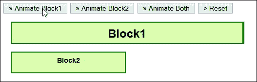

我们可以在 core 库中使用以下屏幕截图中显示的功能：

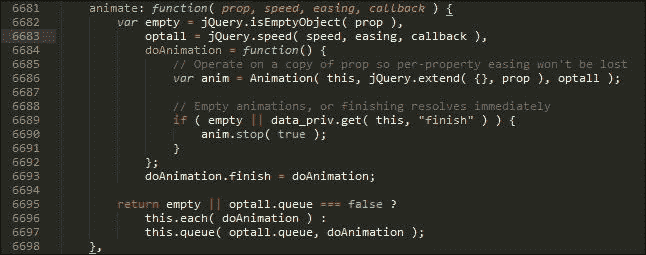

### 注

本节演示的代码可以在本书附带的代码下载链接中找到，即`animation.html`文件；您需要提取整个代码文件夹，此演示才能正常工作。

现在您已经看到了 FAUADE 模式在使用中，让我们考虑在代码中使用它的一些好处。

### 立面模式的优缺点

使用 Façade 模式隐藏复杂代码是一种非常有用的技术；除了易于实现之外，使用此模式还有其他优点，如下所示：

*   增强 web 应用程序的安全性
*   与其他模式结合使用效果良好
*   使修补内部代码变得容易
*   为最终用户提供更简单的公共界面

与其他模式相比，使用此模式时没有明显的缺点；作为最终用户，它为我们提供了一套统一的接口，因此我们不会被迫做出任何妥协。值得注意的是，在抽象代码时，在实现过程中会有成本，在使用 façade 模式时，我们应该始终牢记这一点。

## 观察者模式

由于它是行为模式组的成员，如果您花时间创建自定义事件，那么您已经在使用**观察者模式**，我们将已经熟悉下一个模式。

使用 jQuery 开发的一个关键部分是使用其成熟的发布/订阅系统创建自定义事件。可以使用`.trigger()`、`.on()`或`.off()`访问这些事件。我们可以将观察者模式定义为特定对象订阅给其他对象并在特定事件发生时由其通知的模式：

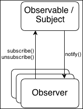

现在，让我们假设我们有以下 HTML：

```js
<div id="div1">This is div 1</div>
<div id="div2">This is div 2</div>
```

我们希望内部的`<div>`元素触发一个名为`customEvent`的事件；单击它们时会发生这种情况：

```js
$('div').on('click', function(e) {
  $(this).trigger('customEvent');
});
```

现在，让文档元素订阅`customEvent`：

```js
$(document).on('custom', function(e) {
  console.log('document is handling custom event triggered by ' + 
  e.target.id);
});
```

当`div`元素之一触发自定义事件时，会通知观察者/订阅者，并向控制台记录一条消息。

### 注

对于纯粹主义者来说，你们中的一些人可能更喜欢使用典型的发布/订阅模型[提供了一个示例 https://gist.github.com/cowboy/661855](https://gist.github.com/cowboy/661855) 。

让我们考虑使用这种模式的一些好处，以及在代码中需要注意的地方，以避免陷入与使用该设计模式相关的一些陷阱中。

### 观察者模式的优缺点

使用观察者模式，?? ?? 迫使我们考虑应用程序的各个组件之间的关系，远远高于我们可能已经考虑到的水平。它还擅长做以下工作：

*   在 jQuery 中促进松散耦合，每个组件都知道自己负责什么，而不关心其他模块，这鼓励了可重用代码。
*   允许您遵循关注点分离原则；如果代码块是自包含的，则可以在新项目中轻松重用它们。然后我们可以订阅单个事件，而不必担心每个块中会发生什么。
*   帮助我们确定依赖关系在项目中的位置，作为确定这些依赖关系是否可以减少或完全消除的潜在基础。

然而，使用观察者模式存在缺点；关键的缺点是，从一个发布者到另一个发布者的用户切换在代码方面代价高昂，而且维护代码的完整性变得更加困难。

为了说明这一点，让我们简单地看看一个简单的例子，在那里我们可以看到至少一个实例，我们必须为发行商的开关做额外的允许。

### 创建一个基本示例

了解观察者模式是如何工作的至关重要；它是比一组简单的协议（如 Façade 设计模式）更深入、提供更多机会的模式之一。考虑到这一点，让我们运行一个快速工作的演示来说明它是如何工作的，如下所示：

*   让我们从下载和提取本章代码的副本开始，我们需要`observer.html`文件，以及`css`和`js`文件夹
*   如果你运行演示，你会看到两个红色的标签，你可以点击它们；如果您尝试单击它们，您将看到计数增加，如此屏幕截图所示：

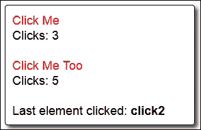

在这一点上，让我们考虑一下关键功能在代码中的代码，这是我在这里完全复制的。

```js
$(document).ready(function() {
  var clickCallbacks = $.Callbacks();
  clickCallbacks.add(function() {
    var count = parseInt(this.text(), 10);
    this.text(count + 1);
});
clickCallbacks.add(function(id) {
  $('span', '#last').text(id);
});
$('.click').click(function() {
  var $element = $(this).next('div') .find('[id^="clickCount"]');
  clickCallbacks.fireWith($element, [this.id]);
  });
});
```

注意`.click`类有一个单独的事件处理程序。我们在这里使用了回调来允许 jQuery 执行下一次单击，即使它可能尚未完成上一次执行。在本例中，这不是一个太大的问题，但是如果我们必须更新许多不同的语句或应用更多的更改（通过使用附加函数），那么回调将防止代码中生成错误。

这里，我们同意 observable，在本例中是两个**Click Me**语句；`.click`事件处理程序允许我们更新点击计数和**最后一个元素点击的**语句，而不会抛出错误。

### 注

要进一步了解在 jQuery 中使用回调的复杂性，您可能需要浏览 API 文档，可以在[上查看 http://api.jquery.com/jquery.callbacks/](http://api.jquery.com/jquery.callbacks/) 。

同时，让我们改变焦点，看一看不同的模式。我们都知道 jQuery 以其 DOM 操作能力而闻名；接下来是迭代器模式，它基于 jQuery 的这个特殊特性。

## 迭代器模式

现在，您听说或读过多少次 jQuery 以其 DOM 操作而闻名？我打赌这是相当多的次数，而且在这些例子中，`.each()`关键字在某些时候被使用。

jQuery 中的 DOM 操作使用了迭代器模式的一种特殊变体，它来自于听起来的行为模式组；我们可以使用此模式遍历（或迭代）集合的所有元素，让 jQuery 处理内部工作。这种模式的一个简单示例可能如下所示：

```js
$.each(["richard","kieran","dave","alex"], function (index, value) {
  console.log(index + ": "" + value);
});

$("li a").each(function (index) {
  console.log(index + ": " + $(this).text());
});
```

在这两种情况下，我们都使用了`.each`函数来迭代`li`选择器的数组或每个实例；无需担心迭代器的内部工作。

我们的示例包含最少的代码，以便迭代页面中的每个选择器或类；值得一看核心库中`jQuery.fn.each()`函数背后的代码量：

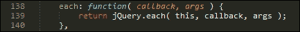

这反过来调用`jQuery.each()`函数，第一个函数仅供内部使用，如以下屏幕截图所示：

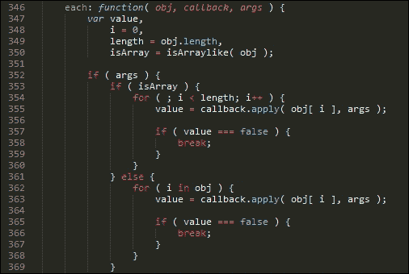

然后补充了一个特殊的 fast 案例，即`.each()`功能的最常见用途：

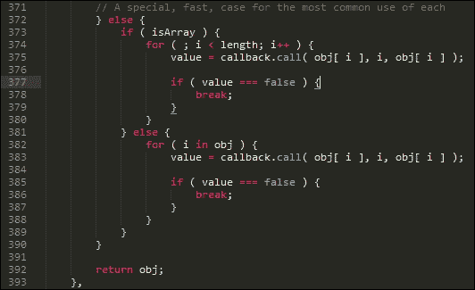

### 迭代器模式的优缺点

在 DOM 中迭代元素的能力是 jQuery 的关键元素之一，是迭代器模式的关键部分；以下是使用此模式的一些好处：

*   迭代器模式隐藏了遍历集合所需的大部分功能，而无需了解提供此功能的代码的内部工作原理
*   我们可以使用相同的一致模式来迭代任何对象或值集
*   使用迭代器过程也有助于减少或消除代码中典型的`for`循环语法，使代码更易于阅读

与其他模式不同，使用此模式的缺点很少。它是 jQuery 的一个关键方面，因此，如果不需要迭代过多的对象来滥用它，那么这个简单的模式将被证明是非常有用的！

## 惰性初始化模式

呵呵，这听起来像是我周日早上可能会做的事情！好吧，我知道这是一个很糟糕的笑话，但抛开所有笑话不谈，这种基于创造性的模式允许你推迟昂贵的流程，直到需要它们。

在最简单的层次上，我们可以使用许多不同的选项来配置插件，例如要显示的图像数量、是否应该显示覆盖，或者每个图像的显示方式。听起来很简单，对吧？那么，惰性初始化部分从何而来？啊哈！这比你想象的要简单。以以下代码为例：

```js
$(document).ready(function(){
  $("#wowslider-container1").wowSlider();
});
```

我们的示例使用了 WOW 滑块的初始化命令（可从[获得）http://www.wowslider.com](http://www.wowslider.com) ——使用此模式的关键在于初始化过程；直到我们页面上需要它的第一刻，它才被触发。

惰性初始化模式的一个更复杂的例子是回调；在 DOM 准备就绪之前，不会处理这些文件：

```js
$(document).ready( function () {
  var jqxhr = $.ajax({
    url: "http://domain.com/api/",
    data: "display=latest&order=ascending"
  })
  .done( function( data ) ){
  $(".status").html( "content loaded" );
  console.log( "Data output:" + data );
  });
});
```

我们可以在代码中直接使用这个例子的；我们更有可能在一个延迟加载插件中使用它，比如 Mika Tuupola 在[的版本 http://www.appelsiini.net/projects/lazyload](http://www.appelsiini.net/projects/lazyload) 。

### 惰性初始化模式的优缺点

使用这种设计模式的主要好处很简单：将昂贵资源的加载延迟到需要时；这有助于加快对站点的访问并减少带宽使用（至少在最初）。

然而，使用这种方法有一些缺点，其中包括：

*   需要仔细管理，通过设置一个标志来测试召唤对象是否可以使用；如果不是，则可以在多线程代码中生成竞争条件
*   先前使用任何惰性变量或对象都会绕过第一次访问原则上的初始化，这意味着我们失去了不加载这些大型对象或变量的任何好处
*   此方法需要使用映射来存储实例，以便在下次使用与先前使用的相同参数请求实例时获得相同的实例
*   如果需要加载大型对象，则使用此模式会带来时间损失；只有在最初没有加载这些对象并且它们很有可能不会被使用时，该模式才真正起作用

最终，使用这种模式需要一些考虑和仔细规划；可以说，如果我们选择不加载正确的对象，它将很好地工作！说到策略，让我们继续看另一种模式，它可以帮助我们确定当改变对象或变量的状态时会发生什么，即**策略模式**。

## 战略模式

回想几年前，使用 Flash 制作网站内容动画是最新的设计时尚；有一些设计得很好的例子，尽管网站通常都很慢，并不总是像它们应该的那样有效！向前看，CSS 动画现在是首选，它们不需要浏览器插件来操作，可以存储在样式表中，并且比 Flash 更少地消耗资源。

“为什么我们要谈论动画？”我听到你问，当这一章是关于设计模式的时候。这是个好问题；答案很简单：你们中的一些人可能没有意识到这一点，但动画是我们下一个设计模式的完美例子。在基本层面上，动画都是关于从一种状态到另一种状态的改变，这形成了策略模式的基础，从行为模式组。

策略模式也称为策略或状态模式，它允许您在运行时选择适当的行为。简而言之，这就是模式的作用：

*   定义一系列算法（或函数），用于确定在运行时应该发生什么
*   将每个算法（或函数）封装到其自包含的单元中，并使每个算法在该族中可互换

策略模式可以使用的一个很好的例子是验证表单中的条目，我们需要一些规则来确定哪些内容是有效的或无效的；在输入内容之前，我们显然不知道结果会是什么！

这里的关键点是，验证规则可以封装在它们自己的块中（可能是它们自己的对象）；一旦我们知道用户想要我们验证什么，我们就可以拉入相关的块（或规则）。

不过，在更基本的层面上，有一个更简单的战略模式示例；它采用动画内容的形式，例如使用`.toggle()`，从一种状态切换到另一种状态或再次切换：

```js
$('div').toggle(function(){}, function(){});
```

每个结果状态都可以按其自身的权限设置为一个类；一旦我们知道所要求的行动应该是什么，将在适当的时候召集他们。为了帮助设置上下文，让我们制作一个简单的演示，以便看到它的实际效果。

### 构建简单的切换效果

好吧，尽管这是 jQuery101，但当它完美地展示了我们需要的东西时，为什么要让事情复杂化呢？

在这个演示中，我们执行一个简单的切换操作来显示或隐藏两个`<p>`语句。这里的关键点是，在按下按钮之前，我们不知道接下来会发生什么。

要查看此操作，请下载本章的`code`文件夹副本；运行`strategy.html`演示，然后点击**切换**查看`<p>`语句出现或消失，如下图：

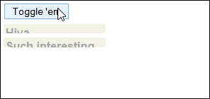

魔法发生在这个函数中；只需使用`.toggle()`命令即可根据需要切换每个`<p>`语句的可见性：

```js
$(document).ready(function(){
  $("button").click(function() {
    $("p").toggle("slow");
  });
});
```

但是，我们可以轻松地将 click 事件处理程序中包含的函数抽象为单独的 IIFE，然后在代码中简单地调用该函数，如下所示：

```js
$(document).ready(function(){
  var hideParagraphs = function() {
    $("p").toggle("slow");
  };

  $("button").click(hideParagraphs);
});
```

代码已经更容易阅读了，我们已经从事件处理程序中删除了大部分原始操作；如果以后需要更改代码，则无需编辑事件处理程序。

### 注

如果您有兴趣了解更多关于 IIFEs 的信息，那么您可能需要查看维基百科的条目以了解更多详细信息，该条目可在[上获得 https://en.wikipedia.org/wiki/Immediately-invoked_function_expression](https://en.wikipedia.org/wiki/Immediately-invoked_function_expression) 。

### 动作切换

虽然在我们的示例中，我们已经将注意力集中在动画上，但我们当中的观察者可能会想，同样的技术是否会应用于像`switch()`这样的命令。答案是肯定的；我们在这里没有讨论它，因为它是一个纯 JavaScript 命令，但您可以应用与替代方法相同的原则来使用它。

### 战略模式的优缺点

定义合理的策略是成功编码的关键；通过使用战略模式，我们可以获得以下好处：

*   代码更容易阅读；如果我们将函数抽象到它们自己的类中，我们可以将它们从决策过程中移开，或者将它们作为同一文件中的独立代码块，或者甚至作为它们自己的独立文件
*   代码更容易维护；我们只需要转到类来更改或重构代码，并且只需要对核心代码进行最小的更改，就可以添加到新类或对象事件处理程序的链接
*   我们可以保持关注点的分离，我们抽象的每个独立类或对象不知道其他组件，但是当提供每个策略对象的职责和相同的接口时，它们可以与其他对象通信
*   使用战略模式可以利用开放/封闭原则；可以通过启动现有行为的新类或对象实例来更改每个抽象类或对象的行为

### 提示

有关开启/关闭原理的更多详细信息，请参考[http://en.wikipedia.org/wiki/Open/closed_principle](http://en.wikipedia.org/wiki/Open/closed_principle) 。

这些是我们需要注意的一些缺点：

*   策略模式的使用允许您尊重开放/封闭原则，但同时，您可能会启动一个新的类或代码对象，其中包含许多不必要的函数或操作，从而使代码更加繁琐
*   在某些情况下，使用策略模式可能不适合您的目的；如果您的代码只包含少量函数，那么抽象它们所需的努力可能会超过这样做的好处
*   使用策略模式将增加代码中对象的数量，使其更加复杂，并可能需要更多的资源来管理

目前有足够的战略规划；让我们继续看一看另一个协议，**代理**设计模式的形式。

## 代理模式

当使用 jQuery 时，有时您可能需要编写一个通用事件处理程序来管理某些元素的样式——一个很好的例子可能是从活动状态切换到禁用状态，甚至是选择状态；然后，我们可以使用普通 CSS 为这些样式设置样式。

使用此方法，通用事件处理程序的外观如下所示：

```js
$(".myCheckbox").on( "click", function () {
  // Within this function, "this" refers to the clicked element 
  $(this).addClass("active");
});
```

从表面上看，这将非常有效，但是如果我们在更改 style 类之前引入延迟会怎么样？我们通常会使用`setTimeOut()`函数来实现这一点：

```js
$(".myCheckbox").on( "click", function () {
  setTimeout(function () {
    // "this" doesn't refer to our element, but to the window!
    $(this).addClass("selected");
    });
});
```

有人在这里发现了一个小但相当关键的问题吗？将任何函数传递给`setTimeout`将给您错误的值，它将引用窗口对象，而不是正在传递的对象！

解决这个问题的方法是 jQuery 的`proxy()`函数；我们可以使用此函数实现代理模式或中间人，以确保在正确的上下文中将正确的值传递给`.addClass()`方法。我们可以修改前面的示例，如以下代码段所示：

```js
$(".myCheckbox").on( "click", function () {
  setTimeout( $.proxy( function () {
    // "this" now refers to our element as we wanted
    $( this ).addClass( "active" );
    }, this), 500);
});
```

我们传递的最后一个`this`参数告诉`$.proxy()`我们的 DOM 元素是我们希望`this`在本例中引用的值，它是复选框而不是窗口。

### 代理模式的优缺点

代理模式是结构组的有用设计，有助于优化和维护快速站点；该模式的核心是基于在绝对必要之前不加载昂贵元素的原则。（如果可以的话，最好不要加载！）

通过使用此设计模式，我们可以获得以下好处：

*   我们可以使用代理模式为尚未加载或可能永远不会加载的更昂贵对象提供占位符；这包括可以从应用程序外部加载的对象
*   使用代理可以充当包装器，提供对真实对象的委托，同时保护它不受过度复杂性的影响
*   将代理模式合并到我们的页面中有助于降低代码密集型站点的响应速度或响应速度

使用此模式的缺点包括：

*   存在这样一种风险：代理模式可能会对其客户端隐藏易失性资源的生命周期和状态；这意味着代码必须等待正确的资源再次可用或产生错误。它需要知道它正在与原始资源交互，而不是与另一个看起来与原始资源类似的资源交互。
*   如果我们使用代理模式来表示远程资源，这将掩盖两者之间通信的使用；与远程资源的通信应区别于与本地资源的通信。

只要小心，代理模式可以证明是非常有用的，前提是我们对决定加载或不加载到页面中的内容非常明智。让我们改变策略，看看另一种设计模式；这是基于我们可能需要动态构造一个或多个元素的方式；这个概念是**构建器模式**的核心。

## 构建器模式

在任何项目的开发过程中，我们都可能需要动态地创建新元素；这可以从构建单个`<div>`元素到元素的复杂组合。

我们可能需要在代码中直接定义最终标记的灵活性，这可能会变得混乱，或者我们可以将元素分离到一个独立的机制中，该机制允许我们简单地构建这些元素，以备稍后在代码中使用。

后者，或者称之为建设者模式的技术名称，更可取；它更易于阅读，并允许您在变量和代码的其余部分之间保持清晰的区别。这个特定的模式属于创造性的模式组，并且是您将看到的这种类型的模式的少数常见示例之一。

### 注

你可能会在网上看到对**抽象模式**的引用，或者在书中看到它在风格上与 Builder 模式非常相似。

我们可以使用 jQuery 的美元符号来构建我们的对象；我们可以传递元素的完整标记、部分标记和内容，也可以简单地使用 jQuery 进行构造，如下所示：

```js
$('<div class="foo">bar</div>');

$('<p id="newText">foo <b>bar</b></p>').appendTo("body");

var newPara = $("<p />").text("Hello world");

$("<input />")
      .attr({ "type": "text", "id":"sample"})
      .appendTo("#container");
```

创建后，我们可以使用变量缓存这些对象，并减少对服务器的请求数量。

值得注意的是，设计模式并不是脚本代码所独有的；它们可以使用类似的原理应用于插件。我们将在[第 11 章](11.html#aid-2TEN41 "Chapter 11. Authoring Advanced Plugins")*创作高级 jQuery 插件*中介绍更多 jQuery 插件的设计模式。

### Builder 模式的优缺点

使用生成器模式并不适合所有情况；值得注意的是，使用它可以获得哪些好处，以查看这些好处是否适合您的需求。这些好处包括：

*   我们可以构造在 jQuery 中动态创建对象所需的标记，而无需显式创建每个对象
*   我们可以缓存标记，然后将其与主要功能分离，这样可以更容易地读取代码并减少对服务器的请求
*   核心标记将保持不变，但我们可以对其应用不同的函数以改变值或其外观
*   我们可以更进一步，将构建器模式变成一个状态机或一种公开公共方法或事件的机制，同时仍然维护私有构造函数或析构函数方法

使用 Builder 模式有一些缺点；关键的缺点是滥用链接，但我们也应该考虑以下内容：

*   可以定义不易重用的标记；这意味着我们可能需要创建一些包含标记的变量，所有这些变量都将占用应该在其他地方使用的资源。
*   Take an example of the following code snippet:

    ```js
    var input = new TagBuilder("button")
      .Attribute("name", "property.name")
      .Attribute("id", "property_id")
      .Class("btn btn-primary")
      .Html("Click me!");
    ```

    生成器模式的使用允许链接操作，提供一致的 API，并遵循生成器模式。然而，这种模式的主要缺点是它使代码更难阅读，因此更难调试。

我们在概念层面上探索了大量不同的设计模式类型；对于一些人来说，可能仍然很难将其与我们所知的 jQuery 核心联系起来。

然而，JQuery 使用这些模式来帮助把你学到的一些知识付诸实践，让我们花一点时间来检查核心库，看看这些模式是如何在内部使用的。

# 探索 jQuery 库中模式的使用

现在，你可能在想：我仍然不确定这些模式与我的工作有什么关系。正当

我想是的。在整个这一章中，我们花时间研究了一些更常用的模式，作为回到基础的一种手段；毕竟，提高自己的秘诀不仅仅是写代码！

这里的关键点是，如果您花时间开发 jQuery，那么您已经在使用设计模式了；为了帮助巩固您所学的知识，让我们看看 JQuery 库本身中的几个例子：

### 注

在本演示中，我使用了 jQuery 2.1.1；如果使用不同的版本，则可能会发现某些行号已更改。

1.  Start by opening up a copy of `jquery.js` within a text editor of your choice—we'll begin with the classic `document.ready()` function, which uses the Façade pattern and is run from this function at or around line **3375**, as shown in the following screenshot:

    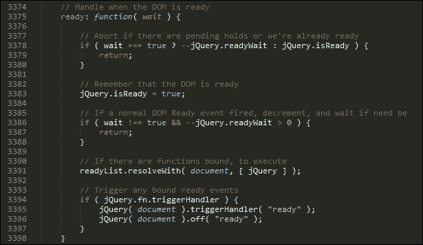

2.  How many times have you toggled the state of an element in your page? I'm guessing it will be a fair few times; the `toggle` command is a classic example of a Strategy design pattern, where we decide the state of an element, as shown here:

    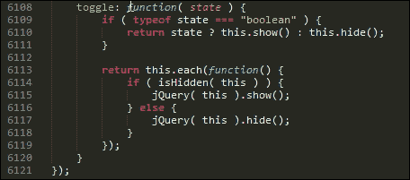

3.  Now, I'm sure you've clicked on countless elements or used the `click` event handler, right? I hope so, as it is one of the first event handlers we are likely to have started with when first learning about jQuery. It's also a good example of the Observer pattern. Here's the relevant code in jQuery, from around line **7453**:

    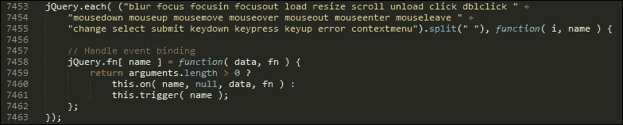

还有更多关于如何在 jQuery 核心库中使用设计模式的例子；希望这显示了在您自己的代码中使用它们的好处，并且它们不应该局限于 jQuery 本身的源代码！

# 总结

呸！我们当然涵盖了很多关于设计模式的理论；让我们休息一下，回顾一下本章所学的内容。

我们首先介绍了什么是设计模式以及它们是如何产生的；然后我们继续探索使用它们的好处，以及为什么我们应该考虑在我们的项目中使用它们。

接下来是设计模式的结构，我们将一个典型的设计分解为不同的元素，并了解每个元素在设计方案中所起的作用。我们还研究了如何将设计模式分为不同的类型，即创造性、结构性和行为性。

然后，我们继续研究了一些常见的设计模式，在这些模式中，我们了解了每种类型的功能，并研究了一些我们将如何使用它们的示例。然后，我们研究了本章中介绍的每种设计模式的优缺点，最后我们介绍了其中一些模式是如何在 jQuery 库中实际使用的，而不仅仅是在我们自己的代码中使用的。

我认为现在的理论已经足够了；让我们继续前进，务实一点。在下一章中，我们将看到如何通过掌握表单开发的一些技巧提高表单开发技能。