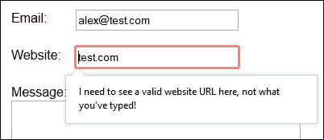

# 四、使用表单

你有多少次在网上购买产品，比如亚马逊？我敢打赌，答案是多年来有好几次，毕竟，你不能在深夜走进书店，阅读书籍，做出选择，而不担心书店的关门时间，也不知道你是否会找到某本书。

为在线站点构建表单可以说是您可能使用 jQuery 的关键领域之一；其成功的关键是确保正确验证，作为提供成功用户体验的一部分。

在本章中，我们将稍微回到基础知识，深入研究一些我们可以用来验证表单的技术，混合使用 HTML 和 jQuery 验证技巧。您还将看到，创建成功的表单并不需要大量复杂的代码，但过程同样需要确保我们同时考虑表单的功能需求。

在接下来的几页中，我们将介绍一些主题，如下所示：

*   探索验证的必要性
*   使用正则表达式添加表单验证
*   开发用于验证的插件体系结构
*   使用 jQuery/AJAX 创建高级联系人表单
*   使用 jQuery 开发高级文件上传表单

你准备好开始了吗？让我们开始吧…在开始之前，我建议您创建一个项目文件夹。在本章中，我假设您已经这样做了，并且它被称为`forms`。

# 探索表单验证的必要性

不同的方法有助于提高表单的可用性，但是验证是我们应该考虑的最重要的方面之一。有多少次你访问了一个网站并填写了你的详细信息，却被告知存在问题？听起来很熟悉，对吧？

验证表单是保持信息一致性的关键；表格将处理已输入的信息，以确保其正确性。以以下场景为例：

*   如果输入了电子邮件地址，请确保其格式有效。电子邮件地址应包含一个句号，并在地址的某处包含一个`@`符号。
*   打电话给某人？他们在哪个国家？如果我们已经将表单设置为显示所选国家/地区字段的特定格式，那么让我们确保电话号码遵循正确的格式。

我想你明白了。现在，这听起来好像我们在陈述显而易见的事情（不，我没有失去理智！），但表单验证往往要等到项目的最后阶段。最常见的错误通常由以下原因造成：

*   **格式化**：终端用户在字段中输入非法字符的，例如电子邮件地址中的空格。
*   **缺少必填字段**：您填写表单多少次，却发现您没有在必填字段中输入信息？
*   **匹配错误**：当两个字段需要匹配但不匹配时出现；一个典型的例子是密码或电子邮件字段。

在这个阶段，您可能会认为我们将被大量的 jQuery 所困扰，以产生一个全歌唱、全舞蹈的解决方案，对吗？

错误的对不起，让你失望了，但是我一直坚持的一个咒语是**亲吻**原则，或者**保持简单，愚蠢**！这并不是对任何人的反思，而是让我们的设计生活变得更轻松的一种方式。正如我在前一章中提到的，我相信掌握 jQuery 这样的技术并不总是与我们生成的代码有关！

以下是表单验证的关键要素：

*   告诉用户他们在表单上有问题
*   向用户显示问题所在
*   向他们展示一个您希望看到的示例（例如电子邮件地址）

在接下来的几页中，我们将了解如何向表单添加验证，以及如何减少（或消除）最常见的错误。我们还将使用颜色和接近度来帮助强化我们的信息。然而，在我们可以验证之前，我们需要一些东西来验证，所以让我们做一个快速的表格作为我们练习的基础。

# 创建基本表单

与所有项目一样，我们需要从某个地方开始；在本例中，我们需要一个表单，可以将其用作根据本章给出的各种示例添加验证的基础。

在本书附带的代码下载中，查找`basicform.html`和`basicform.css`文件并将其解压缩到项目文件夹中；当您运行`basicform.html`时，它将与此屏幕截图类似：


如果我们看一下所使用的标记，就会发现它并不是什么新东西；它包含我们在创建联系人表单时将使用的标准 HTML5 字段，例如文本字段或文本区域：

```js
<form class="contact_form" action="" method="post" name="contact_form">
  <ul>
  <li>
  <label for="name">Name:</label>
  <input type="text" name="username" required>
  </li>
  <li>
  <label for="name">Email:</label>
  <input type="email" name="email" required>
  </li>

  </ul>
  <button class="submit" type="submit">Submit Form</button>
</form>
```

但这里的关键是，我们的示例不包含任何形式的验证，它让我们很容易滥用垃圾输入、垃圾输出，用户可以输入任何内容，我们收到的提交表单都是垃圾！在本例中，当您点击**提交**时，您将看到以下截图：


不太好，是吗？大多数桌面浏览器都会接受任何内容，如果使用所需的标记时没有进行一些验证，那么只要它有一些内容，表单就会被提交。这个规则的例外是 Safari，它不会显示屏幕截图中显示的弹出通知。

我相信我们可以做得更好，但可能不是你期望看到的方式…好奇？

# 从简单的 HTML5 验证开始

表单验证的好处在于，修复表单可能简单，也可能复杂，这一切都取决于我们解决问题的方式。

这里的关键是我们*可以*使用 jQuery 提供表单验证；这是一个完全合适的解决方案。但是，对于名称或电子邮件地址等字段的简单验证，有一种替代方法：HTML5 验证，它使用 HTML5 约束验证 API。

### 注

约束验证 API 使用 HTML5 属性，如`min`、`step`、`pattern`和`required`；除了 Safari 之外，这些都可以在大多数浏览器中使用。

在我解释这种疯狂的逻辑之前，让我们来看看如何修改我们的演示，以便使用这种验证形式：

1.  在常用的文本编辑器中打开`basicform.html`文件的副本，然后查找以下行：

    ```js
    <li>
    <label for="name">Name:</label>
    <input type="text" name="username" required>
    </li>
    ```

2.  我们需要添加将用作验证检查的模式，因此继续修改代码，如图所示：

    ```js
    <li>
      <label for="name">Name:</label>
      <input id="name" name="username" value="" required="required" 
      pattern="[A-Za-z]+\s[A-Za-z]+" title="firstnamelastname">
    </li>
    ```

3.  为了引入 HTML5 验证，我们可以对`email`字段进行类似的更改；首先，查找以下行：

    ```js
    <li>
      <label for="email">Email:</label>
      <input type="email" name="email" id="email" required= 
      "required">
    </li>
    ```

4.  继续并如图所示修改代码，为`email`：

    ```js
    <li>
      <label for="email">Email:</label>
      <input type="email" name="email" id="email" 
      required="required" pattern="[^ @]*@[^ @]*\.[a-zA-Z]{2,}" 
      title="test@test.com">
    </li>
    ```

    添加 HTML 验证
5.  Save the file as `basicvalidation.html`; if you preview the results in a browser, you can immediately see a change:

    

这已经是一种进步；虽然文本对用户不是很友好，但您至少可以看到表单希望看到一个**firstname lastname**格式，而不仅仅是一个名，如图所示。当您按下**提交**以验证您的表格时，类似的更改也会出现在**电子邮件**中。

### 提示

如果您仔细查看代码，您可能会注意到我已经切换到使用`required="required"`标记，而不仅仅是`required`。这两种格式都能很好地工作。如果在浏览器中使用`required`时出现任何不一致的情况，您可能会发现需要使用前一种标记。

## 通过 jQuery 使用 HTML5

现在我们有了一个表单，它使用 HTML 验证了`name`和`email`字段，现在是兑现我的承诺并解释我疯狂的逻辑的时候了。

在某些情况下，为了处理所有事情，通常很容易恢复使用 jQuery。毕竟，如果我们已经在使用 jQuery，为什么还要引用另一个 JavaScript 库呢？

如果不是为了这两个小问题，这似乎是一个合乎逻辑的方法：

*   使用 jQuery 会给任何站点增加开销；对于简单的验证，这可以被看作是一种没有多少回报的过激行为。
*   如果关闭 JavaScript，则可能导致验证无法运行，或在屏幕或控制台日志中显示错误。这将影响用户体验，因为访问者将难以提交经过验证的表单，或者更糟糕的是，干脆离开网站，这可能会导致销售损失。

更好的方法是考虑使用 HTML5 验证标准文本字段，并保留使用 jQuery 进行更复杂的验证，正如我们在本章后面所见。这种方法的好处是，我们将能够完成一些有限的验证，减少对标准字段 jQuery 的依赖，并以更渐进的增强能力使用它。

考虑到这一点，让我们继续研究 jQuery 的使用，以进一步增强表单并提供更复杂的验证检查。

# 使用 jQuery 验证我们的表单

在某些情况下，如果所使用的输入类型在该浏览器中不受支持，则使用 HTML5 验证将失败；此时我们需要恢复使用 JavaScript，或者在本例中使用 jQuery。例如，IE11 不支持将日期作为输入类型，如下所示：

```js
<input type="date" name="dob"/>
```

这是前面代码的呈现方式：

```js
<input type="text" name="dob"/>
```

问题在于，当类型返回到文本时，浏览器将无法正确验证字段。为了解决这个问题，我们可以使用 jQuery 实现一个检查，然后我们可以开始使用 jQuery 添加一些基本的验证，这将覆盖在浏览器中进行的现有原生 HTML 检查。

让我们来看看我们在实践中如何实现这一点，一个简单的演示，如下：

1.  打开本书附带的代码下载中的`basicform.html`副本。
2.  在`<head>`部分，添加到 jQuery 的链接以及到验证脚本的链接：

    ```js
    <script src="js/jquery.js"></script>
    <script src="js/basicvalidation.js"></script>
    ```

3.  将文件另存为`basicvalidation.html`。在一个新文件中，添加以下代码，这将执行一项检查，以确保您仅验证`email`字段：

    ```js
    $(document).ready(function () {
       var emailField = $("#email");
        if (emailField.is("input") && emailField.prop("type") === "email") {
      }
    });
    ```

4.  在结束`}`之前，让我们添加两个函数中的第一个；第一个函数将添加一个 CSS 挂钩，允许您在成功或失败的情况下进行样式设置：

    ```js
    emailField.on("change", function(e) {
      emailField[0].checkValidity();
        if (!e.target.validity.valid) {
          $(this).removeClass("success").addClass("error")
        } else {
          $(this).removeClass("error").addClass("success")
        }
    });
    ```

5.  目光敏锐的人会发现添加了两个 CSS 样式的类；我们需要在样式表中允许这一点，所以继续添加以下代码行：

    ```js
    .error { color: #f00; }
    .success { color: #060; }
    ```

6.  我们现在可以添加 section 函数，它改变浏览器显示的默认消息，以显示自定义文本：

    ```js
    emailField.on("invalid", function(e) {
      e.target.setCustomValidity("");
      if (!e.target.validity.valid) {
      e.target.setCustomValidity("I need to see an email address 
      here, not what you've typed!");
    }
    else {
      e.target.setCustomValidity("");
    }
    });
    ```

7.  Save the file as `basicvalidation.js`. If you now run the demo in a browser, you can see that the text changes to green when you add a valid e-mail address, as shown in this screenshot:

    

8.  If you refresh your browser session and don't add an e-mail address this time, you will get a custom e-mail address error instead of the standard one offered by the browser, as shown in the following screenshot:

    

在这个例子中使用一个小 jQuery 可以让我们自定义显示的消息，这是一个很好的机会来使用一些更用户友好的东西。注意，通过标准 HTML5 验证给出的默认消息可以很容易地…改进！

既然您已经了解了如何更改显示的消息，那么让我们集中精力改进表单进行的检查。标准 HTML5 验证检查不足以满足所有实例；我们可以通过在代码中加入使用正则表达式检查的检查来改进它们。

# 使用 regex 语句验证表单

到目前为止，您已经看到了一些可以使用 jQuery 验证表单的命令，以及如何将检查限制为特定字段类型（如电子邮件地址）或覆盖屏幕上显示的错误消息。

但是，如果没有某种形式的验证模板，代码将失败，我们可以用它来检查敏锐的眼睛，您可能已经注意到，在我们的`basicvalidation.html`演示中：

```js
pattern = "[^ @]*@[^ @]*\.[a-zA-Z]{2,}";
```

`pattern`变量用于定义正则表达式或**正则表达式**语句。简单地说，这些是单行语句，指示我们应该如何验证表单中的任何条目。但是，这些并不是查询所独有的；它们同样可以用于任何脚本语言，如 PHP 或纯 JavaScript。让我们花些时间来看几个例子，看看这个例子是如何工作的：

*   `[^ @]*`：此语句匹配任意数量的非`@`符号或空格的字符
*   `@`：这是一个字面意思
*   `\.`：这是一个字面意思
*   `[a-zA-Z]`：此语句表示任何大写或小写字母
*   `[a-zA-Z]{2,}`：此语句表示两个或两个以上字母的任意组合

如果我们把这些放在一起，regex 模式将转换为一封包含任意字符集的电子邮件，除了一个`@`符号，后跟一个`@`符号，然后再后跟除`@`符号、句点和至少两个字母之外的任意字符集。

好了，理论够了；让我们开始编码吧！我们将学习几个示例，首先修改电子邮件验证，然后开发代码以涵盖网站地址的验证。

## 为电子邮件创建正则表达式验证功能

我们已经使用正则表达式来验证我们的`email`地址字段；虽然工作正常，但代码可以改进。我不喜欢在事件处理程序中包含验证检查；我更喜欢把它划分成一个单独的功能。

谢天谢地，这很容易纠正；现在，让我们通过执行以下步骤来解决这个问题：

1.  我们首先打开`basicvalidation.js`文件，并在`emailField.on()`事件处理程序

    ```js
    function checkEmail(email) {
      pattern = new RegExp("[^ @]*@[^ @]*\.[a-zA-Z]{2,}");
      return pattern.test(email);
    }
    ```

    之前添加一个 helper 函数
2.  此函数处理电子邮件地址的验证；为了使用它，我们需要修改`emailField.on()`处理程序，如下所示：

    ```js
    emailField.on("invalid", function(e) {
      e.target.setCustomValidity("");
     email = emailField.val();
     checkEmail(emailField);
      if (!e.target.validity.patternMismatch) {
        e.target.setCustomValidity("I need to see an email address 
        here, not what you've typed!");
    }
    ```

如果我们保存我们的工作并在浏览器中预览，我们应该在验证过程中看不到任何差异；我们可以放心，验证检查过程现在已经分离为一个独立的功能。

## 进一步进行 URL 验证

使用与前面示例中中使用的相同原理，我们可以为`urlField`字段开发类似的验证检查。只需复制两个`emailField.on()`事件处理程序和`checkEmail`函数，即可生成类似于以下屏幕截图所示的内容：


使用我们已经生成的代码，查看是否可以使用以下正则表达式创建验证网站 URL 条目的内容：

```js
/^(https?:\/\/)?([\da-z\.-]+)\.([a-z\.]{2,6})([\/\w \.-]*)*\/?$/
```

如果您的代码正常工作，它将生成一条类似于此屏幕截图所示的错误消息：



希望您已经成功地使用了我们迄今为止生成的代码。如果您陷入困境，本书附带的代码下载中有一个工作示例。

那么，假设我们有一些可以工作的东西，有人发现我们的代码有问题吗？肯定有一些问题需要解决,；现在让我们来看一下：

*   注意，反馈不是 100%动态的？为了使我们的代码能够识别从错误到成功条目的更改，我们需要刷新浏览器窗口，这一点都不理想！
*   我们在 jQuery 文件的体系结构中复制了大量代码，这是一种不好的做法，我们完全可以改进已经编写的代码。

与其重复代码，不如将 jQuery 完全重新编写成一个快速插件；在体系结构上，这将消除一些不必要的重复，并使我们更容易以最小的更改扩展功能。这并不完美，我们将在本章后面纠正这一点，但它将产生比我们现在的代码更有效的结果。

# 构建一个简单的验证插件

到目前为止，我们的示例都是基于单个字段，例如电子邮件地址或网站 URL。代码大量重复，导致解决方案臃肿且效率低下。

相反，让我们完全改变我们的方法，将代码转换为通用插件。我们将使用相同的核心过程来验证代码，具体取决于插件中设置的正则表达式。

在下一个练习中，我们将使用 Cedric Ruiz 制作的插件。虽然它已经有几年的历史了，但它说明了我们如何创建一个单核心验证过程，该过程使用多个过滤器来验证表单中输入的内容。让我们从执行以下步骤开始：

1.  从本书附带的代码下载中，提取`quickvalidate.html`、`info.png`和`quickvalidate.css`文件的副本，并将其保存在项目文件夹中。
2.  接下来，我们需要创建一个插件。在新文件中，在项目区域的`js`子文件夹中添加以下代码，并将其保存为`jquery.quickvalidate.js`：

    ```js
    $.fn.quickValidate = function() {
      return this;
    };
    ```

3.  您需要开始向插件添加功能，首先缓存表单和输入字段；在你的插件中的`return this`语句前面加上这个：

    ```js
    var $form = this, $inputs = $form.find('input:text, input:password');
    ```

4.  接下来是指示如何验证每个字段的过滤器，以及验证失败时应显示的错误消息，如下所示：

    ```js
    var filters = {
      required: {
        regex: /.+/,
        error: 'This field is required'
      },
      name: {
        regex: /^[A-Za-z]{3,}$/,
        error: 'Must be at least 3 characters long, and must only contain letters.'
      },
      pass: {
        regex: /(?=.*\d)(?=.*[a-z])(?=.*[A-Z]).{6,}/,
        error: 'Must be at least 6 characters long, and contain at least one number, one uppercase and one lowercase letter.'
      },
      email: {
        regex: /^[\w\-\.\+]+\@[a-zA-Z0-9\.\-]+\.[a-zA-z0-9]{2,4}$/,
        error: 'Must be a valid e-mail address (user@gmail.com)'
      },
      phone: {
        regex: /^[2-9]\d{2}-\d{3}-\d{4}$/,
        error: 'Must be a valid US phone number (999-999-9999)'
      }
    };
    ```

5.  现在我们来看看验证过程，这就是神奇发生的地方。继续并在过滤器的正下方添加以下代码：

    ```js
    var validate = function(klass, value) {

      var isValid = true, f, error = '';
      for (f in filters) {
        var regex = new RegExp(f);
        if (regex.test(klass)) {
          if (!filters[f].regex.test(value)) {
            error = filters[f].error;
            isValid = false;
            break;
          }
        }
      }
    return { isValid: isValid, error: error }
    };
    ```

6.  如果您的代码正确识别错误，需要通知用户；否则，他们将被蒙在鼓里，不知道为什么表格没有正确提交。现在让我们通过添加一个函数来解决这个问题，以确定验证测试失败时会发生什么，如下所示：

    ```js
    var printError = function($input) {
      var klass = $input.attr('class'),
      value = $input.val(),
      test = validate(klass, value),
      $error = $('<span class="error">' + test.error + '</span>'),
      $icon = $('<i class="error-icon"></i>');
      $input.removeClass('invalid').siblings('.error, .erroricon').remove();
      if (!test.isValid) {
        $input.addClass('invalid');
        $error.add($icon).insertAfter($input);
        $icon.hover(function() {
          $(this).siblings('.error').toggle();
        });
      }
    };
    ```

7.  我们已经确定了当验证过程失败时会发生什么，但还没有准备好调用函数的任何东西。现在，让我们根据字段是否标记为必需，通过添加适当的调用来解决这个问题，如下所示：

    ```js
    $inputs.each(function() {
      if ($(this).is('.required')) {
        printError($(this));
      }
    });
    ```

8.  如果我们领域的内容发生变化，我们需要确定它是否有效；这需要在输入文本时发生，现在让我们使用`keyup`事件处理程序

    ```js
    $inputs.keyup(function() {
    printError($(this));
    });
    ```

    来完成
9.  最后，如果在表单中发现错误，我们需要防止提交：

    ```js
    $form.submit(function(e) {
      if ($form.find('input.invalid').length) {
        e.preventDefault();
        alert('There are errors on this form – please check...');
      }
    return false;
    });
    ```

10.  Save your work; if all is well, you should see the form validate when previewing the results of your work in a browser:

    

在这个阶段，我们有了一个工作插件，我们已经将核心验证代码重构为一组可以应用于每个字段类型的过程（使用适当的过滤器）。

但是,我们可以做得更好,；以下是我们可以解决的一些问题，以进一步完善我们的代码：

*   尽管我们已经将代码重构为一组核心验证过程，但过滤器仍然是核心代码的一部分。虽然很容易扩展不同类型的过滤器，但我们仍然局限于文本或密码字段类型。添加任何标准 HTML5 字段类型，例如`url`或`email`，都会导致错误，因为 jQuery 中不支持伪类型。
*   从架构的角度来看，最好将验证器过滤器保持在核心插件之外；这有助于保持验证器精简，不受我们的目的所不需要的代码的影响。
*   我们的代码不允许任何特性，例如本地化、设置最大长度或验证表单对象，例如复选框。

我们可以花很多时间开发我们的插件，使其采用更模块化的方法，但值得付出努力吗？有几十个表单验证插件可供使用；更明智的做法是使用以下插件之一：

*   核心验证过程经过了尝试和测试，无需担心我们的字段是否能够正确验证。开发任何形式的验证器插件，其工作范围不仅仅局限于几个领域，这是出了名的棘手；毕竟，我们看什么或不看什么来验证？不同的语言？例如，邮政编码或邮政编码的不同格式？
*   大多数插件都有某种形式的体系结构，允许添加自定义验证器，作为标准示例的补充，包括使用语言、特定数字格式或奇偶数。我们将在本章后面充分利用这一点，以便在演示中添加一些自定义验证器。
*   使用现有的插件可以让您专注于提供特定于您的环境的功能，并在其中添加最大的价值。毕竟，在其他人已经为我们完成工作的地方，尝试添加有效的插件是没有意义的，对吗？

记住这一点，让我们继续看一看如何使用现有的插件。现在大多数插件都有某种形式的模块化体系结构，允许您轻松地对其进行自定义并添加额外的自定义验证器；毕竟，为什么要花时间重新发明轮子，对吗？

# 开发用于验证的插件架构

在本章中，我们使用了各种 HTML5 和 jQuery 技术来验证表单。总的来说，它们工作得很好，但它们过于简单化的本质意味着我们很容易很快就会失去它们的用处。

要真正利用表单验证的所有可能功能，从简单地尝试验证字段转向使用现有插件是有意义的，该插件负责基本的验证过程，并允许您集中精力进行定制，确保为表单提供正确的功能。

进入 jqueryformvalidator。这个插件由 VictorJonsson 创建，已经存在了很多年，所以它经过了尝试和测试；它还包含我们需要定制表单中提供的检查的模块化体系结构。让我们看看动作中的验证器。

### 注

原始的插件和相关文档可在[上找到 http://formvalidator.net/](http://formvalidator.net/) 。

## 创造我们的基本形态

在我们开始向代码中添加自定义验证器插件之前，我们需要一个基本表单进行验证。为此，我们将根据本章前面章节中`basicvalidation.html`中创建的表单的修改版本进行标记。

让我们开始使用基本表单，并进行标准验证。为此，请执行以下步骤：

1.  我们将从本书附带的代码下载中提取`formvalidator.html`和`formvalidator.css`文件的副本开始。将 HTML 文件保存在项目文件夹的根目录中，将 CSS 文件保存在`css`子文件夹中。
2.  在新文件中，添加以下代码行，并将其保存为项目区域的`js`子文件夹中的`formvalidator.js`：

    ```js
    $(document).ready(function() {
      $.validate();
    });
    ```

3.  This is all that is needed to get started with the Form Validator plugin; if you preview the form in a browser, you should see the following screenshot—if you enter a valid name and e-mail address but omit the website URL:

    

现在我们的表单已经就绪，让我们真正开始开发表单中使用的一些验证器，首先为`name`字段开发一个新的验证器。

## 创建自定义验证器

到目前为止，我们的表单依赖于使用标准 HTML5 技术来验证它；这将适用于大多数需求，但它的功能是有限的。进入 jQuery；我们可以使用 FormValidator 的强大功能来创建我们自己的自定义验证器，以便我们可以根据自己的需求定制它们。

创建自定义验证器的关键部分是`$.formutils.addValidator`配置对象；FormValidator 处理基本的插件架构，这让您可以通过为表单设计正确的检查来添加值。

在接下来的几页中，我们将学习两个基本示例：

1.  我们将从创建自定义验证器开始；在您选择的常用文本编辑器中，添加以下代码：

    ```js
    $.formUtils.addValidator({
      name : 'user_name',
      validatorFunction : function(value, $el, config, language, 
      $form) {
        return (value.indexOf(" ") !== -1)
      },
      errorMessage : 'Please enter your full name',
    });
    ```

2.  将文件另存为`user_name.js`，保存在项目区域的`js`子文件夹中。打开您在上一节中创建的`formvalidator.js`文件，并按如下所示进行更改：

    ```js
    $(document).ready(function() {
     $.formUtils.loadModules('user_name');
      $.validate({
     modules: 'user_name'
      });
    });
    ```

3.  尽管已将验证规则添加到验证器中，但您需要从 HTML 标记中激活它，如下所示：

    ```js
    <div class="form-group">
      <label class="control-name" for="name">Name: <span 
      class="asterisk">*</span></label>
      <input name="username" id="username" datavalidation="user_name">
    </div>
    ```

4.  如果一切正常，当您在浏览器中预览表单并按下**提交**按钮时，您将看到使用自定义验证程序的效果，如以下屏幕截图所示：


在这个阶段，您可以简单地将其保留在这个定制验证器中，但我认为还有更多的空间，那么电子邮件地址呢？

标准 HTML5 验证将确定给定的电子邮件地址是否采用合适的格式，例如确保其有一个`@`符号、域名后的小数点以及域名后缀是否有效。但是，它不会阻止用户提交带有特定地址类型的表单，例如[www.hotmail.com](http://www.hotmail.com)（或者现在的[www.outlook.com](http://www.outlook.com)）。

在这一点上，值得注意的是，使用正则表达式的电子邮件验证可能会打开一个问题雷区，因此，请谨慎行事，彻底测试您如何针对`mail+tag@hotmail.com`进行验证？这是一个完全有效的地址，但大多数正则表达式都会失败…

### 注

关于为什么使用正则表达式实际上弊大于利的有用讨论，请参见[http://davidcel.is/blog/2012/09/06/stop-validating-email-addresses-with-regex/](http://davidcel.is/blog/2012/09/06/stop-validating-email-addresses-with-regex/) 。

在我们的示例中，我们将添加一个简单的检查来阻止 Hotmail、Gmail 或 Yahoo！防止电子邮件地址被使用；让我们来看看我们如何做到这一点：

1.  在文本编辑器中，将以下代码添加到新文件中，并将其保存为`js`子文件夹中的`free_email.js`：

    ```js
    $.formUtils.addValidator({
      name : 'free_email',
      validatorFunction : function(value, $el, config, language, 
      $form) {
        varemailName = /^([\w-\.]+@(?!gmail.com)(?!yahoo.com)(?!hotmail.com)([\w-]+\.)+[\w- 
        ]{2,4})?$/;
        return (emailName.test(value))
      },
      errorMessage : 'Sorry - we do not accept free email accounts 
      such as Hotmail.com'
    });
    ```

2.  现在您的`free_email`验证器已经就位，您需要在验证表单时调用它；要执行此操作，请返回到您在上一练习中打开的`formvalidator.js`文件，并修改代码，如下所示：

    ```js
    $(document).ready(function() {
     $.formUtils.loadModules('free_email');
      $.validate({ modules: 'free_email'});
    });
    ```

3.  本练习的最后一步是从 HTML 标记激活自定义验证器，还记得我们在上一个练习中是如何更改的吗？同样的原则也适用于此：

    ```js
    <div class="form-group">
      <label class="control-name" for="email">Email: <span 
      class="asterisk">*</span></label>
      <input type="text" name="email" id="email" datavalidation="free_email">
    </div>
    ```

4.  Save both the `formvalidator.js` and `formvalidator.html` files; if you preview the results of your work, you can clearly see your custom message appear if you've entered an invalid e-mail address, as shown in the following screenshot:

    

现在，你们当中的观察者会发现我们一次加载一个验证器；我相信您一定想知道如何同时加载多个验证器，对吗？

没问题，我们已经准备好了验证器文件，所以我们需要做的就是修改验证器对象，以便它加载这两个模块。让我们来看看如何修改我们的 ToalT0U.ValueAtter 对象：

1.  打开一份`formvalidator.js`文件副本，修改代码如下：

    ```js
    $.formUtils.loadModules('free_email, user_name');
    $.validate({
      modules: 'free_email, user_name',
    });
    ```

这就是你需要做的。如果保存文件并在浏览器中预览结果，您会发现它同时验证了`name`和`email`字段，如前两个练习所示。

这打开了一个充满机遇的世界；在我们的两个示例中，我们创建了相当简单的验证器，但无论验证器多么复杂或简单，其原理都是相同的。

### 注

如果您想了解有关如何创建自定义验证器的更多信息，那么值得阅读[中的文档 http://formvalidator.net/index.html#custom-验证器](http://formvalidator.net/index.html#custom-validators)。然后，我们可以将创建模块的基本原则与正则表达式示例相结合，如[所示 http://www.sitepoint.com/jquery-basic-regex-selector-examples/](http://www.sitepoint.com/jquery-basic-regex-selector-examples/) 创建一些有用的验证程序检查。

让我们继续往下看，再看看 FormValidator 插件的一个有用部分——我们都不说同一种语言，是吗？如果我们这样做了，生活会很无聊；相反，您应该考虑本地化验证消息，以便国际访问者能够了解哪里有验证问题并知道如何修复。

## 本地化我们的内容

在这个在线工作的现代时代，可能会有一些用不同语言显示消息的情况，例如，如果大多数访问者都说荷兰语，那么用荷兰语替代标准消息将是有价值的。

虽然它需要一些仔细的思考和计划，但是添加语言支持是非常容易的；让我们来看看如何做到这一点：

1.  对于本练习，您需要修改 validator 对象。在`formvalidator.js`文件中，在`document.ready()`语句之后立即添加此代码：

    ```js
    varmyLanguage = {
      badUrl: "De ingangswaarde is geencorrecte URL"
    };
    ```

2.  我们需要引用语言中的更改，因此继续将此配置行添加到 validator 对象中：

    ```js
    $.validate({
      modules: 'free_email, user_name',
     language: myLanguage
    });
    ```

3.  Save the file. If you preview the results in a browser, you can see that the error message is now displayed in Dutch, as shown here:

    

4.  我们不仅限于荷兰人；这是相同的代码，但有一条法语错误消息：

    ```js
    varmyLanguage = { badUrl: "La valeur d'entrée n'est pas une URL correcte" };
    ```

这是一种快速简便的方法，可确保网站访问者了解表单未经验证的原因以及如何修复表单。值得注意的是，无论您的 PC 或移动设备上的区域设置如何，都会显示消息集；建议您在更改表单消息中使用的语言之前，检查所有分析日志以确认访问者来自的地区或国家。

## 集中我们的错误信息

在我们结束表单上的开发之前，我们可以再看一个功能，以便将其添加到表单中。

到目前为止，显示的任何验证错误消息都是针对每个字段的。这是可行的，但这意味着我们无法立即判断哪些字段可能未通过验证。当然，我们可以滚动浏览表单，但我很懒；如果我们可以修改代码以在顶部显示错误，为什么要向下滚动一个长表单，对吗？

当然，使用 FormValidator 做这件事是小菜一碟；现在让我们看一下所需的内容：

1.  打开`formvalidator.js`文件的副本，修改 validator 对象，如图所示；我们将`errMessagePosition`属性设置为`top`，将`validatorOnBlur`属性设置为`false`，以便在表单顶部显示消息：

    ```js
    $.validate({ modules: 'user_name, free_email', validateOnBlur: false, errorMessagePosition : 'top', language: myLanguage});
    ```

2.  如果您现在运行表单，任何已设置的错误消息都将显示在顶部，但它们看起来并不漂亮。现在我们来解决这个问题，对样式表做一些小的修改：

    ```js
    div.form-error { 
      font-size: 14px; 
      background: none repeat scroll 0 0 #ffe5ed;
      border-radius: 4px; color: #8b0000;
      margin-bottom: 22px; padding: 6px 12px;
      width: 88%; margin-left: 0px; margin: 10px;
    }
    ```

3.  Now, let's run the form in a browser; if all went well, you will see the errors at the top of the form, correctly formatted. The following screenshot shows what might appear if you were to not fill out the website URL; note that our code still shows the message in Dutch from the previous example:

    

在这一点上，我们已经介绍了许多与使用 jQuery 进行验证相关的主题。我们将继续，看一看两个示例表单。在我们这样做之前，我们需要涵盖一些最终的调整，作为结束开发的一部分。

## 结束开发

在预览最后一个练习时，观察力更强的人会发现一些样式似乎缺失了。这是有充分理由的；让我解释一下。

至少，我们可以提供指示成功或失败的消息。这会起作用，但不是很好；更好的选择是提供一些额外的样式，以真正启动我们的验证：


这很容易，让我们从以下步骤开始：

1.  打开`formvalidator.css`文件，添加以下代码行：

    ```js
    .has-error, .error { color: #f00; }
    .has-success, .valid { color: #060; }
    .error { background-image: url(../img/invalid.png); background-position: 98%; background-repeat: no-repeat; background-color: #ff9a9a; }
    .valid { background-image: url(../img/valid.png); background-position: 98%; background-repeat: no-repeat; background-color: #9aff9a; }
    ```

2.  我们需要在项目区域的`img`子文件夹中添加两个图标。为此，我使用了[中可用的红十字和绿色勾号图标 https://www.iconfinder.com/icons/32520/accept_check_good_green_ok_success_tick_valid_validation_vote_yes_icon](https://www.iconfinder.com/icons/32520/accept_check_good_green_ok_success_tick_valid_validation_vote_yes_icon) 。如果要使用不同的图标，则可能需要相应地调整样式规则。
3.  保存`formvalidator.css`。如果您在浏览器中预览结果并在表单中输入详细信息，当您单击**提交表单**时，您应该会看到类似于本练习开始时显示的屏幕截图的结果。

希望你会同意这看起来更好！本书附带的代码下载中有一份`formvalidator.css`；它在表单中还包含了一些样式，这些样式使它看起来像我们在本练习中看到的那样非常精致。

### 提示

如果您希望看到一个包含定制的工作示例，那么从代码下载中提取`formvalidatior-fullexample`JavaScript、CSS 和 HTML 文件，并分别将它们重命名为`formvalidator.js`、`formvalidator.css`和`formvalidator.html`。

## 注意到最佳实践的使用

在我们的每个例子中，我们已经设置了表格来显示 ONCE-所有的字段，这是一个考虑用户目标和期望的关键点。他们想达到什么目的？我们真的需要一次显示几十个字段吗？或者，我们可以简化表格吗？

尽管本书的重点自然是掌握 jQuery，但仅仅专注于编写代码是愚蠢的；我们还必须考虑表单的外观和感觉，并在构建表单及其相关验证时考虑任何视觉或功能因素。

作为一个小例子，当字段可用时，我们是否可以使用 CSS 来模糊或聚焦字段可能值得考虑。我们可以使用少量 CSS 来模糊或聚焦这些字段，使用类似于以下代码的内容来实现这一点：

```js
input[type=email], input[type=text] { filter: blur(3px); opacity: .4; transition: all .4s; }

input[type=email]:focus, input[type=text]:focus { filter: none; opacity: 1; }
```

这里的想法是淡出我们已经输入内容的字段，并关注我们尚未完成或即将完成的字段，如以下屏幕截图所示：


一个小小的警告：如果我们在使用这个样式时不小心，我们可能会有效地禁用字段，这将扼杀整个练习！现在让我们把焦点转移到表单设计的一个关键部分：如果一些浏览器不支持我们在本章中使用的 CSS 样式，会发生什么？

## 提供后备保障

在本章中，我们推出了适用于大多数现代浏览器的设计表单。但在某些情况下，这可能行不通；如果我们仍然需要迎合不支持的浏览器（比如 iOS7），那么我们需要提供某种形式的回退。

谢天谢地，如果我们通过在`html`元素上应用`formvalidation`类来使用 Modernizer 之类的东西来提供优雅的降级，那么这并不是一个太大的问题。然后，如果浏览器不支持使用（和样式）伪选择器（如`:valid`或`:invalid`），我们可以使用它来提供优雅的回退。

### 提示

如果您想使用 Modernizer 的自定义版本，该版本将测试表单验证支持，那么请转到[http://modernizr.com/download/#-shiv-cssclasses-teststyles-testprop-testallprops-prefixes-domprifixes-forms_validation-load](http://modernizr.com/download/#-shiv-cssclasses-teststyles-testprop-testallprops-prefixes-domprefixes-forms_validation-load)。

理论说得够多了，让我们玩一玩吧！在接下来的几页课程中，我们将通过两个练习来了解一个更复杂的示例。这将是基于一个简单的联系形式，我们将添加表单上传功能，但要小心，因为这将有一个尾巴刺…！

# 使用 AJAX 创建高级联系人表单

在我们复杂的示例的第一部分中，我们将开发一个表单，允许我们提交一些基本细节，并允许此提交的确认首先出现在表单消息面板上，然后通过电子邮件出现。

在本练习中，我们需要使用以下几种工具：

*   使用默认设置选项安装的本地 web 服务器包括 WAMP（用于 PC；[http://www.wampserver.de/en](http://www.wampserver.de/en) 或 MAMP（用于 Mac；[http://www.mamp.info/en/](http://www.mamp.info/en/) ）。Linux 用户很可能已经在他们的发行版中提供了一些东西。
*   免费的测试邮件服务器工具（仅适用于 Windows），可从[获得 http://www.toolheap.com/test-mail-server-tool/](http://www.toolheap.com/test-mail-server-tool/) ，因为从本地 web 服务器发送电子邮件可能很难设置，所以这个出色的工具监控端口 25 并提供本地电子邮件功能。对于 Mac，您可以尝试在[中提供的说明 https://discussions.apple.com/docs/DOC-4161](https://discussions.apple.com/docs/DOC-4161) ；Linux 用户可以尝试按照[中概述的步骤进行操作 http://cnedelcu.blogspot.co.uk/2014/01/how-to-set-up-simple-mail-server-debian-linux.html](http://cnedelcu.blogspot.co.uk/2014/01/how-to-set-up-simple-mail-server-debian-linux.html) 。
*   从正在使用的 PC 或笔记本电脑访问电子邮件包这是接收演示发送的电子邮件所必需的。

### 提示

另一个可能的选择，如果您更喜欢跨浏览器路线，是 XAMPP（[https://www.apachefriends.org/index.html](https://www.apachefriends.org/index.html) ；这包括 Mercury 邮件传输选项，因此如果您在 Windows 上工作，则不需要测试邮件服务器工具。

好的，工具就绪后，让我们开始执行以下步骤：

1.  我们将首先打开本书附带的代码下载副本并提取`ajaxform`文件夹；这包含我们演示的标记、样式和分类文件。我们需要将文件夹保存到 web 服务器的`WWW`文件夹中，该文件夹（用于 PC）通常为`C:\wamp\www`。
2.  标记相对简单，与我们在本章中已经看到的内容非常相似。
3.  我们需要对`mailer.php`文件做一个小改动；在您选择的文本编辑器中打开它，然后查找以下行：

    ```js
            $recipient = "<ENTER EMAIL HERE>";
    ```

4.  将`<ENTER EMAIL HERE>`更改为一个有效的电子邮件地址，您可以使用该地址来检查之后是否出现了电子邮件。
5.  这个演示的魔力发生在 Endot0 文件中，让我们现在来看看这个文件，并通过设置一些变量开始：
6.  我们在这里启动真正的魔法，当按下提交按钮时；我们首先阻止表单提交（因为这是默认操作），然后将表单数据序列化为字符串以供提交：

    ```js
    $(form).submit(function(e) {
      e.preventDefault();
      var formData = $(form).serialize();
    ```

7.  接下来是这个表单上 AJAX 操作的核心；此功能设置要发出的请求类型、发送到的内容和要发送的数据：

    ```js
    $.ajax({ 
      type: 'POST',
      url: $(form).attr('action'),
      data: formData
    })
    ```

8.  然后我们添加这两个函数来确定应该发生什么；第一个功能涉及成功提交我们的表格：

    ```js
    .done(function(response) {
      $(formMessages).removeClass('error');
      $(formMessages).addClass('success');
      $(formMessages).text(response);

      $('#name').val('');
      $('#email').val('');
      $('#message').val('');
    })
    ```

9.  接下来是处理表单提交失败结果的函数：

    ```js
    .fail(function(data) {
          $(formMessages).removeClass('success');
          $(formMessages).addClass('error');

          if (data.responseText !== '') {
            $(formMessages).text(data.responseText);
          } else {
            $(formMessages).text('Oops! An error occurred and your message could not be sent.');
           }
         });
       });
     });
    ```

10.  Start the Email Tool. If you preview the form in a browser and fill out some valid details, you should see this screenshot when you submit it:

    

我们的表格现在已经在位置，可以提交，确认信息会在几分钟内通过电子邮件出现。在下一章中，我们将更深入地回顾 AJAX 在 jQuery 中的使用；现在，让我们继续发展我们的形式。

# 使用 jQuery 开发高级文件上传表单

正如一位好人不久前所说，*“向前和向上！”*，现在是添加表单功能的第二部分的时候了，以文件上传选项的形式。

撇开这可能带来的风险不谈（比如上传病毒），添加文件上传功能相对简单；它需要客户端和服务器端组件才能正常工作。

在我们的示例中，我们将更加关注客户端功能；为了演示的目的，我们将把文件上传到项目区域内存储的假文件夹中。为了让您了解我们将构建什么，下面是一个完整示例的屏幕截图：


考虑到这一点，让我们开始执行以下步骤：

1.  在`ajaxform.html`文件的副本中，我们需要添加一些指向各种 JavaScript 和 CSS 文件的附加链接；本书附带的代码下载中提供了所有新增内容，如下所示：

    ```js
    <link rel="stylesheet" href="css/bootstrap.min.css">
    <link rel="stylesheet" href="css/styles.css">
    <link rel="stylesheet" href="css/fileupload.css">
    <script src="js/jquery.min.js"></script>
    <script src="js/ajax.js"></script>
    <script src="js/jquery.ui.widget.js"></script>
    <script src="js/jquery.iframe-transport.js"></script>
    <script src="js/jquery.fileupload.js"></script>
    <script src="js/uploadfiles.js"></script>

    ```

2.  接下来，我们需要在`index.html`中添加一些标记；因此，在`ajaxform.html`中，继续，首先修改标题，如图所示：

    ```js
    <div id="formtitle">
      <h2>File Upload Demo</h1>
    </div>
    <div id="form-messages"></div>
    ```

3.  我们现在需要添加文件上传代码；因此，在消息字段的结束`</div>`标记之后，立即添加以下代码：

    ```js
    <div class="container">
      Click the button to select files to send:
      <span class="btnbtn-success fileinput-button">
      <span>Select files...</span>
      <input id="fileupload" type="file" name="files[]" multiple>
      </span>
      <p>Upload progress</p>
      <div id="progress" class="progress progress-success 
      progress-striped">
      <div class="bar"></div>
      </div>
      <p>Files uploaded:</p>
      <ul id="files"></ul>
    </div>
    ```

4.  We need to make one small change to one of our jQuery files; in `uploadfiles.js`, look for the line that begins as follows:

    ```js
    $('#files').append('<li><img src="/5463OS/combined/files/thumb nail/' + file.name
    ```

    现在，修改突出显示的部分，使其与本地 web 服务器中承载文件的位置相匹配。`files`和`thumbnail`文件夹由脚本自动创建。

5.  为了完成演示，我们需要两个额外的文件：一个是`files.php`，另一个是`UploadHandler.php`；这些将处理文件的后端上传和电子邮件的发送。这些文件的副本在本书附带的代码下载中。
6.  保存所有文件。如果使用本地 web 服务器预览结果，则应看到一个工作表单，类似于本练习的第一部分；它现在还将显示您的上传表单。

### 注

本书附带的代码下载中的`combined`文件夹中有一个演示的工作版本。

此时，我们应该有一个工作表单。但是等等……有人注意到什么了吗？希望，在这一点上，您应该已经注意到在我们的表单中很少或没有验证…！“嗯？，”我听到你问。你是绝对正确的，但正如所有好事情一样，这是有原因的。

我故意没有在这里添加任何验证，因为我想首先集中讨论表单的功能，最后从验证中稍作休息，考虑到我们在过去几页中讨论了多少内容。

然而，它确实给了您一个完美的机会（是的，这里有一个刺痛）-检查您是否可以向示例中添加验证？我没有在代码下载中提供答案，毕竟，答案本身没有对错之分；验证取决于表单的要求。然而，这一章中应该有足够的内容让你开始学习。我强烈建议您在[formvalidator.net](http://formvalidator.net)主网站上查看文档，因为这将有助于提供更多答案！

# 总结

呸！我们终于到达了本章的结尾，所以让我们花一点时间来回顾一下我们迄今为止所涵盖的内容。

我们首先了解了为什么表单验证非常重要，以及关键点是如何使任何解决方案保持简单，以确保表单的成功。在讨论何时使用 jQuery 代替标准 HTML5 验证的优点之前，我们先从简单的 HTML5 验证开始。

然后，我们继续研究使用 jQuery 进行的简单验证，然后将其扩展到 regex 语句的使用。接下来，在检查是否需要维护一个更模块化的体系结构以通过使用自定义验证器来帮助扩展性之前，我们先来看看如何开发一个快速而肮脏的验证插件。

我们转而使用现有的插件来添加验证功能，因为这使我们能够花更多的时间来确保满足我们的需求，而不是简单地验证任何内容。我们还研究了如何本地化我们的内容并集中显示的错误消息，然后用一些额外的样式调整结束开发。

然后，在开发具有文件上载功能的复杂表单基础之前，我们通过关于最佳实践和提供回退支持的说明对本章进行了总结，以此作为使用本章中提供的一些技术进行未来个人发展的基础。

在下一章中，我们将对表单开发期间简要介绍的主题进行扩展；是时候来看看这项被称为 AJAX 的久经考验且值得信赖的技术了…