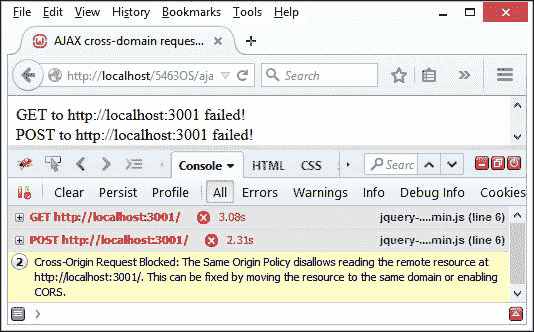
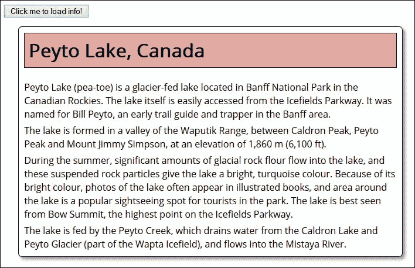
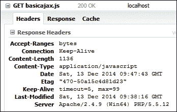
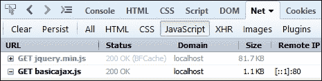
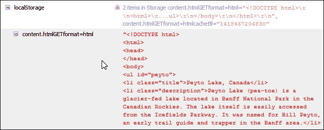
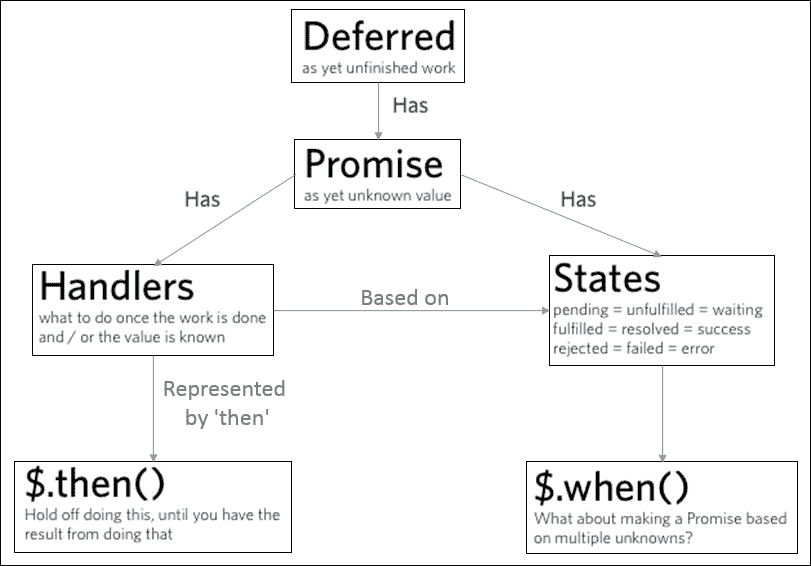
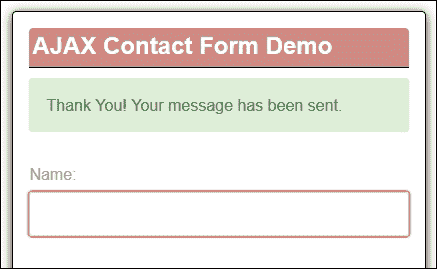
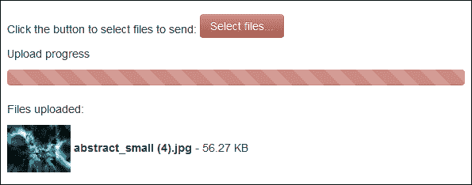

# 五、集成 AJAX

一个问题，**延期**、**承诺**和**延期**有什么共同点？

答案很简单——至少对其中两人而言；它们是使用 AJAX 的实用程序；第三个是 AJAX 的国际拼音。

纵观互联网的历史，作为最终用户，我们不得不忍受页面刷新——为了显示新内容，必须强制页面刷新。现在不是这样——我们可以使用 AJAX 的强大功能，在不需要清除页面的情况下刷新内容，但也不能没有它的问题。输入尊重和承诺-不是为初学者，而是一个有用的工具，一旦你了解它的工作原理！

在接下来的几页中，我们将研究一些与 jQuery 中使用 AJAX 相关的主题。这些措施包括：

*   详细介绍 AJAX 最佳实践
*   提高静态站点加载数据的速度
*   使用回调处理多个 AJAX 请求
*   使用 jQuery 延迟和承诺增强代码
*   在行动中看到尊重和承诺

让我们陷入…！

# 重温 AJAX

有人还记得无论我们在哪个网站上浏览，点击链接或按钮都会强制刷新页面的日子吗？在那些日子里，你知道要订购比萨饼外卖，或从网上书店订购书籍，就意味着要点击许多页面……呵欠！

值得庆幸的是，2006 年 AJAX 作为一种标准的出现满足了这一需求。今天，我们不再被完全刷新页面的需要所束缚；我们可以轻松地异步更新页面内容。好的–所以我们不需要刷新页面，但是…AJAX？这不是上个世纪的老技术吗？它在不久前就消亡了？

答案是，还没有——尽管 jQuery 的魔力允许我们异步更新页面，但 AJAX 仍然扮演着重要的角色。使用互联网的现象性增长意味着我们需要从另一个站点获取页面。众所周知，如果违反了**跨源资源共享**（**CORS**）策略，大多数浏览器中的安全设置都会阻止内容的访问，如下图所示：



为了规避与 CORS 相关的安全控制，我们可以使用 AJAX。在我们参与更复杂的用途之前，让我们花一点时间来回顾 Ajax 是什么，以及如何在行动中使用它。

### 注

要查看实际效果，可以运行本书附带的代码下载中提供的`ajaxblocked`演示。

## 定义 AJAX

如果您曾经使用过 AJAX，毫无疑问您会遇到一个或多个变体，例如使用类似原理的 AHAH、AJAH 或 AJAJ 工作。然而，数据交换不同；例如，AJAH 使用 HTML，AJAJ 使用 JSON，AHAH 基于 HTML。

无论使用哪种变体，这组相互关联的技术可能已经成熟，但向最终用户呈现数据仍然起着重要作用。在本章的整个过程中，我们将讨论可以说是它们的祖父的东西，即 AJAX。作为提醒，它由以下单独的技术组成：

*   用于表示的 HTML（或 XHTML）和 CSS
*   用于数据动态显示和交互的**文档对象模型**（**DOM**）
*   用于数据交换和操作的 XML 和**可扩展样式表语言转换**（**XSLT**）
*   异步通信的`XMLHttpRequest`对象
*   JavaScript 将这些技术结合在一起

在 jQuery 中使用时，我们可以使用`$.ajax`对象轻松配置 AJAX。有许多可用选项，但我们可能经常使用的一些选项包括：

<colgroup><col> <col></colgroup> 
| 

配置选项

 | 

意图

 |
| --- | --- |
| `url` | 请求的内容的 URL。 |
| `data` | 要发送到服务器的数据。 |
| `error` | 在请求失败的情况下调用此函数–该函数将被传递三个参数：一个`jqXHR`对象、一个描述错误的字符串和一个可选的异常对象（如果生成）。 |
| `dataType` | 描述了您希望看到从服务器返回的数据类型。默认情况下，jQuery 将尝试自动解决这个问题，但它可以是以下内容之一：XML、JSON、脚本或 HTML。 |
| `Success` | 请求成功时调用的函数。 |
| `type` | 请求的类型，例如`'POST'`、`'GET'`或`'PUT'`——默认为`'GET'`。 |

### 提示

还有更多的选项可供选择。作为提醒，值得浏览[http://api.jquery.com/jQuery.ajax/](http://api.jquery.com/jQuery.ajax/) 了解更多详情。

足够的理论——至少目前如此！让我们继续看一看使用 AJAX 和 jQuery 开发一个示例。

## 使用 AJAX 创建一个简单的示例

在我们陷入开发代码的泥潭并突破我们所能做的极限之前，让我们花一点时间来了解典型 AJAX 代码在实际操作中是什么样子的。

在依赖于导入内容的典型应用程序中，我们可能会遇到类似于以下摘录的内容：

```js
var jqxhr = $.ajax({
  url: url,
  type: "GET",
  cache: true,
  data: {},
  dataType: "json",
  jsonp: "callback",
  statusCode: {
    404: handler404,
    500: handler500
  }
});
jqxhr.done(successHandler);
jqxhr.fail(failureHandler);
```

这是支持 AJAX 的代码的标准配置对象。让我们来看看这些配置选项中的一些细节：

<colgroup><col> <col></colgroup> 
| 

选项

 | 

评论

 |
| --- | --- |
| `url` | 服务器的 URL |
| `type` | 默认为`GET`，但如果需要，可以使用其他动词代替 |
| `cache` | 默认为`true`，但`'script'`和`'jsonp'`数据类型为`false`，因此必须根据具体情况进行设置 |
| `data` | 任何请求参数都应该在`data`对象中设置 |
| `datatype` | 应设置`datatype`以备将来参考 |
| `jsonp` | 只有指定此参数以匹配 API 对 JSONP 请求所期望的回调参数的名称，JSONP 请求是由托管在不同域中的服务器发出的 |
| `statusCode` | 如果要处理特定错误代码，请使用状态代码映射设置 |

### 提示

jQuery 核心站点上有大量文档，非常值得一读！一个很好的起点是主`ajax()`对象，位于[http://api.jquery.com/jQuery.ajax/](http://api.jquery.com/jQuery.ajax/) 。

我们可以使用它来产生非常好的效果来制作一个简单的演示，例如显示来自 XML 文件的信息，甚至是普通 HTML，如下一个屏幕截图所示：



让我们更详细地看看这个演示：

1.  从本书附带的代码下载中，提取`basicajax.html`、`content.html,`和`basicajax.css`文件的副本–将 HTML 文件放在项目文件夹的根目录中，将样式表放在`css`子文件夹中。
2.  接下来，将以下代码添加到一个新文件中，并将其保存为`basicajax.js`在我们项目区域的`js`子文件夹中：

    ```js
    $(document).ready(function(){
    });
    ```

3.  在声明的`$description`变量的正下方，添加以下帮助函数来控制屏幕上提取文本的呈现：

    ```js
       var displaytext = function(data) {
         var $response = $(data), $info = $("#info");
         var $title = $('<h1>').text($response.find(".title") .text());
         $info.append($title);
         $response.find(".description").each(function(){
           $(this).appendTo($info);
         });
       };
    ```

4.  接下来是 jQuery 代码的核心——对`$.ajax`的调用。在助手函数的正下方添加以下事件处理程序：

    ```js
    $('#action-button').click(function() {
      $.ajax({
        url: 'content.html',
        data: { format: 'html' },
        error: function() {
            $('#info').html('<p>An error has occurred</p>');
        },
        dataType: 'html',
        success: displaytext,
        type: 'GET'
      });
    });
    ```

5.  如果我们在浏览器中预览结果，我们可以在单击按钮时看到显示的内容，如本演示开始时的屏幕截图所示。

在本例中，我们创建了一个简单的演示。它首先引用`content.html`文件，使用 HTML 格式将其导入我们的页面。然后，我们的 jQuery 代码提取内容并将其分配给`$response`，然后首先提取标题，然后提取每个段落，并将它们附加到`#info`div。

在这一点上，值得注意的是，我们本可以使用以下语句分别引用这些摘录的段落：

```js
var $description1 = $('<p>').text($response.find(".description:eq(0)").text());
```

然而，这是一种低效的文本提取方法——我们必须多次运行代码以引用后续值，这会给服务器带来不必要的负载。

# 提高静态站点加载数据的速度

现在我们已经看到了一个 AJAX 示例，您可能会惊讶地发现所使用的代码在*技术上并没有*所能达到的效率，即使屏幕上显示的文本量很小。

嗯？我听到你问——我们当然不能在这样一个简单的演示上真正改进，对吗？嗯，虽然看起来很奇怪，但我们已经可以做一个改进了。让我们来看看我们可以用来减少代码中的慢度的一些技巧——不是所有的技巧都与简单地改变代码有关：

*   减少 AJAX 请求的数量——不，我没有失去情节；改进代码并不总是对代码本身进行更改！如果我们考虑每次 Ajax 请求时，如果重新排序意味着我们可以达到相同的结果，那么就有机会减少这个数目。例如，如果我们在计时器上发出 AJAX 请求，我们可以设置一个标志，指示 AJAX 请求只应在做出更改后执行。
*   如果我们需要获取内容，那么简单地使用 GET 而不是 POST 通常更有效——前者只检索内容，而后者将引起服务器反应，例如更新数据库记录。如果我们不需要执行操作，那么使用 GET 就完全足够了。
*   更新页面内容时–确保只更新少量内容；如果我们的页面设置为更新广泛的内容，而不是定义的部分，那么 AJAX 性能将受到影响。
*   减少要传输的数据量–记得我说过我们可以对代码进行更改吗？这是我们可以做到的——虽然我们不需要限制检索的内容，但我们可以从使用 HTML 格式更改为纯文本。这允许我们删除标记标记，从而减少内容。我们可以一直朝着完全相反的方向走，转而使用 XML，但如果数据大小没有同样的增加，这是不可能的！
*   We should also check that our server has been properly configured – the two key areas to check are the use of ETags (or Entity Tags), and that the server is set to send the correct expires or Cache-Control headers for the content being served, as shown in the next example:

    

*   In a nutshell, server will not send any response if it detects that ETags for a URL have not changed.

    ### 提示

    前往[http://en.wikipedia.org/wiki/HTTP_ETag](http://en.wikipedia.org/wiki/HTTP_ETag) 如果您想了解更多关于 ETag 及其在浏览器中的工作方式。

*   我们可以通过在适当的时间创建和销毁`XMLHttpRequest`，进一步限制 AJAX 请求的影响——如果只在某些情况下需要它们，那么这将对 AJAX 性能产生显著影响。例如，如果我们的代码没有活动类：

    ```js
    if (!($this).hasClass("active")) {
    ...perform our ajax request here...
    }
    ```

    ，我们可能只会发起 AJAX 请求
*   确保您的回调设置正确-如果我们的代码已经更新，那么我们需要告诉我们的用户尽可能多，而不是让他们等待；毕竟，我们不想做的一件事就是掉进地狱的陷阱！（在本章后面，我们将更详细地介绍这一点。）

我们可以走得更远！我们可以减少对服务器不必要的调用的一种方法是缓存内容。但是——在你说“我知道”之前，我没有说在哪里！

是–在本例中，*其中*是键，*其中*是本地存储。这是内置在每个浏览器中的，可以用来消除持续访问服务器的需要。虽然您可以存储的内容量因浏览器而异（通常为 5 MB，但最高可达 20 MB），但它对每个浏览器都使用相同的原理—内容必须存储为文本，但可以包括图像和文本（在合理范围内！）。

感兴趣的使用一个简单的插件并对代码进行一些小的更改，我们可以快速实现一个可行的解决方案——让我们回顾一下前面的基本 AJAX 演示，现在就进行这些更改。

# 使用 localStorage 缓存 AJAX 内容

使用 AJAX 需要仔细考虑——在适当的时间点获取适当数量的内容，而不向服务器发出太多不必要的请求，这一点非常重要。

我们已经看到了一些可以用来帮助减少 AJAX 请求影响的技巧。一种更冒险的方法是将内容存储在每个浏览器的**localStorage**区域——我们可以使用 AJAX 预过滤器来实现这一点。开发人员 Paul Irish 已将完成此操作所需的代码封装在插件中，该插件可在[上获得 https://github.com/paulirish/jquery-ajax-localstorage-cache](https://github.com/paulirish/jquery-ajax-localstorage-cache) 。

我们将用它来改变我们之前的演示。让我们来看看我们将如何做到这一点：

1.  首先，我们从本书附带的代码下载中提取一份`basicajax`演示文件夹，并将其保存到我们的项目区域。
2.  下一步，我们需要下载该插件–该插件可在[获得 https://github.com/paulirish/jquery-ajax-localstorage-cache/archive/master.zip](https://github.com/paulirish/jquery-ajax-localstorage-cache/archive/master.zip) 。从 zip 文件中提取`jquery-ajax-localstorage-cache.js`，保存到`basicajax`中的`js`子文件夹中。
3.  我们需要对 JavaScript 和 HTML 标记进行一些更改。让我们首先更改 JavaScript。在`basicajax.js`中增加以下两行，如图所示：

    ```js
     localCache: true,
       error: function() {
     cacheTTL: 1,

    ```

4.  在`basicajax.html`中，我们需要引用新的插件，所以继续修改脚本调用，如下所示：

    ```js
      <script src="js/basicajax.js"></script>
      <script src="js/jquery-ajax-localstorage-cache.js"></script>
    </head>
    ```

5.  If we rerun the demo and click on the button to load the content, we should not see anything different visually; the change will be apparent if we fire up Firebug, switch to the **Net** tab, and then click on **JavaScript**:

    

6.  If we explore further, we can now see signs of our AJAX content being stored within the **localStorage** area of our browser:

    

    ### 提示

    如果您想查看所有 localStorage 设置，请尝试下载并安装 FireStorage Plus！来自[的插件 https://addons.mozilla.org/en-US/firefox/addon/firestorage-plus/](https://addons.mozilla.org/en-US/firefox/addon/firestorage-plus/) 。

我们在该区域缓存的所有内容现在都可以使用 jQuery 和`localStorage.getItem`或`localStorage.clearItem`方法进行操作。如果您想了解更多信息，请参阅我的书*HTML5 本地存储如何*，该书可从 Packt Publishing 获得。

### 注

在本书附带的代码下载中，`basicajax-localstorage`文件夹中提供了该代码的工作版本。

在某些情况下，您可能希望将缓存 TTL 值减少到分钟（甚至秒？）。您可以通过将`jquery-ajax-localstorage-cache.js`中的`70`行修改为`72`行，并删除其中一个乘法器，以保留以下内容：

```js
if ( ! ttl || ttl === 'expired' ) {
  localStorage.setItem( cacheKey  + 'cachettl', +new Date() + 1000 * 60 * hourstl );
}
```

我们换个方向吧。我们在前面提到过，在使用 AJAX 时提高性能的方法之一是确保将请求数量保持在最低限度。如果我们的代码包含多个请求，它将对性能产生不利影响，特别是如果我们必须等待每个请求完成，然后才能启动下一个请求。

我们可以潜在地使用本地存储来减少的影响，通过从浏览器而不是服务器中请求内容；它可以工作，但可能不适合所有类型的请求。相反，正如我们将在后面看到的，有更好的替代方案，允许轻松处理多个请求。让我们更详细地探讨这个问题，从使用回调管理多个请求的影响开始。

# 使用回调处理多个 AJAX 请求

当使用 AJAX 时，我们可以使用`$.Callbacks`对象来管理回调列表–回调将使用`callbacks.add()`方法添加，使用`.fire(),`激发，并使用`.remove()`方法删除。

通常，如果我们决定内容只在需要时出现，而不是一直存在，那么我们可能会启动一个 AJAX 请求。这没有什么错——这是一种非常有效的工作方式，并且减少了页面刷新的需要。

然而，如果我们决定必须同时执行多个请求，并且需要在继续之前完成每个请求，那么事情就会变得一团糟。

```js
// Get the HTML, then get the CSS and JavaScript
$.get("/feature/", function(html) {
  $.get("/assets/feature.css", function(css) {
    $.getScript("/assets/feature.js", function() {

      // All is ready now, so...add CSS and HTML to the page
      $("<style />").html(css).appendTo("head");
      $("body").append(html);
    });
  });
});
```

我们可以等一会儿！

这里的问题是在处理多个请求时响应速度慢，特别是在所有请求都必须完成才能继续的情况下。一、 首先，当然不想等待一个响应缓慢的页面完成！

为了避免许多亲切的术语**回调地狱**，我们可以使用另一种选择——jQuery 的尊重和承诺。这些可以看作是 AJAX 的一种特殊形式。在接下来的几页中，我们将深入研究这项技术的原因，并通过一个简单的示例进行研究，您可以将其作为将来开发自己想法的基础。

### 提示

甚至还有一个网站专门介绍地狱的恐怖——你可以在[上查看 http://callbackhell.com/](http://callbackhell.com/) -绝对值得一读！

让我们看看 DEFRIEDS 和承诺在 jQuery 中的工作方式，以及如何使用它来增强我们的代码。

# 通过 jQuery 延迟和承诺来增强代码

尽管延期和承诺听起来像是一项相对较新的技术，但它们自 1976 年就已经面世。简言之，在中：

*   延期代表尚未完成的任务
*   承诺是一种尚未可知的价值

如果我们必须使用标准 AJAX，那么我们可能必须等待每个请求完成，然后再进入下一个请求。对于延期/承诺而言，这是不必要的。在使用延期/承诺时，我们不必等待处理每个请求。我们可以通过`jQuery.Deferred()`对象将多个要同时触发的对象排队，并单独或一起管理它们，即使每个操作可能需要不同的时间来完成。

如果您的应用程序使用支持 AJAX 的请求，或者可以从中受益，那么花时间熟悉延迟和承诺是值得的。

在使用标准 AJAX 时，一个关键缺陷是缺乏来自任何 AJAX 调用的*标准*反馈—很难判断什么时候完成了。jqueryajax 现在创建并返回一个 Promise 对象，当绑定到它的所有操作完成时，该对象将返回一个 Promise。使用 jQuery，下面我们将如何实现，使用`when()`、`then()`和`fail()`方法：

```js
$.when($.get("content.txt"))
  .then(function(resp) {
    console.log("third code block, then() call");
    console.log(resp);
  })
  .fail(function(resp) { console.log(resp); });
```

我们可以使用下图来表示延期和承诺的工作原则：



使用延迟的关键好处是，我们可以开始将多个函数链接在一起，而不是局限于一次只调用一个函数（标准 AJAX 就是这样）。然后，我们可以使用`.success()`、`.fail(),`或`error()`事件处理程序，从`jQuery.Deferred`列表中选择`.resolve()`或`.reject()`个人延迟，并提供一致的机制，以确定延迟成功或失败时应采取的措施。

最后，我们可以调用`.done()`事件处理程序，以确定一旦绑定到我们承诺的操作完成后应该发生什么。

### 注

如果你想了解更多关于延期和承诺的内部运作，在[上有一篇有用的文章 https://github.com/promises-aplus/promises-spec](https://github.com/promises-aplus/promises-spec) ，尽管它确实会让阅读变得有些枯燥（没有双关语！）。

现在，我们已经介绍了延期和承诺的基本内容，让我们改变思路，看看如何在行动中使用这两种方法，并概述为什么花时间了解它们背后的概念是值得的。

# 与延期和承诺一起工作

改用延迟和承诺需要一些时间，但值得努力了解它们的工作原理。为了了解使用 DEFRIED 和承诺的好处，让我们来看看将它们纳入我们的 T3 代码中的一些优点：

*   **更干净的方法签名和统一返回**：我们可以分离出指示任何请求的结果会发生什么的代码，这使得读取更干净，如果需要，允许链接，如下所示：

    ```js
      $.ajax(url, settings);
      settings.success(data, status, xhr);
      settings.error(data, status, errorThrown);
      settings.always(xhr, status)
    ```

*   **易于组合**：我们不会被迫在每个请求中加入复杂的功能来管理处理；这意味着启动每个请求所需的核心代码大大简化，如以下示例所示：

    ```js
      function getEmail(userEmail, onSuccess, onError) {
         $.ajax("/email?" + userEmail, {
           success: onSuccess,
           error: onError
         });
       }
    ```

*   **易于将语句链接在一起**：延迟/承诺的体系结构允许我们将多个事件处理程序链接在一起，这样我们就可以用一个动作触发多个方法，如下所示：

    ```js
      $("#button").clickDeferred()
         .then(promptUserforEmail)
         .then(emailValidate)
    ```

*   **承诺始终异步运行**：即使在任务完成之前，我们不知道哪些回调将使用承诺生成的值，也可以触发承诺。承诺将存储结果值，我们可以从现有回调调用该值，或者在承诺生成后添加的任何回调调用该值。
*   **Exception-style error bubbling**: Typically with AJAX, we would have to use a series of `if…then…else` statements, which makes for a convoluted (and sometimes fragile) way of working. With Promises, we can simply chain together one or more `.then()` statements to handle any outcome, as shown next:

    ```js
    getUser("Alex")
      .then(getFriend, ui.error)
      .then(ui.showFriend, ui.error)
    ```

    ### 提示

    承诺的内容比我们在这里所能涵盖的要多得多。有关将承诺与标准 AJAX 请求进行比较的有用讨论，请访问[查看此讨论 http://stackoverflow.com/a/22562045](http://stackoverflow.com/a/22562045) 。

还记得我们在*中使用回调处理多个 AJAX 请求*中检查的代码吗？使用多个回调的主要缺点是导致的混乱（以及最终对网站性能的影响）——显然我们需要更好的替代方案！

尊重和承诺的美妙之处在于，它允许我们重新构造代码，使其更易于阅读。这不仅包括我们需要作为请求的一部分运行的命令，还包括如果它们成功或失败会发生什么。让我们重温一下前面的代码摘录，看看重写为使用延迟/承诺时会是什么样子：

```js
$.when(
  // Get the HTML, CSS and JS
  $.get("/feature/", function(html) {
    globalStore.html = html;
  }),
  $.get("/assets/feature.css", function(css) {
    globalStore.css = css;
  }),
  $.getScript("/assets/feature.js")
).then(function() {
  // All is ready now, so...add the CSS and HTML to the page
  $("<style />").html(globalStore.css).appendTo("head");
  $("body").append(globalStore.html);
});
```

希望您会同意，它看起来更干净，我们现在可以从一个进程运行多个请求，而无需等待每个请求完成后再转到下一个请求！

我认为，现在是编写一些代码的时候了——让我们利用延迟和承诺，构建一个使用 AJAX 的演示。我们将看到如何使用它来响应表单提交，而无需刷新页面。

# 修改我们的预先联系表

在现实世界示例的第一部分中，我们将重用并开发本章前面创建的基本 AJAX 表单，并从[第 4 章](04.html#aid-1394Q1 "Chapter 4. Working with Forms")中的*使用 jQuery*演示开发高级文件上传表单开始*使用表单*。我们将对其进行调整，以使用 AJAX 显示提交确认，并将确认也显示为电子邮件。

在本练习中，我们需要利用以下几个工具：

*   使用默认设置安装的本地 web 服务器–选项包括 WAMP（用于 PC—[http://www.wampserver.de](http://www.wampserver.de) 或[http://www.wampserver.com/en/](http://www.wampserver.com/en/) ）或 MAMP（对于 Mac，[http://www.mamp.info/en/](http://www.mamp.info/en/) 。Linux 用户可能已经有了一些可用的东西作为其发行版的一部分。您需要确保您的 PHP 版本为 5.4 或更高版本，因为代码依赖于使用旧版本时会中断的功能。您也可以尝试跨平台解决方案 XAMPP，可从[获得 https://www.apachefriends.org/index.html](https://www.apachefriends.org/index.html) （请注意，如果使用此选项，则不需要测试邮件工具–电子邮件支持包含在 XAMPP 中）。
*   免费测试邮件服务器工具（仅限 Windows），可从[获得 http://www.toolheap.com/test-mail-server-tool/](http://www.toolheap.com/test-mail-server-tool/) 从本地 web 服务器发送电子邮件可能很难设置，因此此出色的工具可监控端口 25 并提供本地电子邮件功能。对于 Mac，您可以在[尝试使用说明 https://discussions.apple.com/docs/DOC-4161](https://discussions.apple.com/docs/DOC-4161) ；Linux 用户可以尝试按照[中概述的步骤进行操作 http://cnedelcu.blogspot.co.uk/2014/01/how-to-set-up-simple-mail-server-debian-linux.html](http://cnedelcu.blogspot.co.uk/2014/01/how-to-set-up-simple-mail-server-debian-linux.html) 。
*   从正在使用的 PC 或笔记本电脑访问电子邮件包–这是接收使用测试邮件服务器工具发送的电子邮件所必需的。

好的–工具就绪后，让我们开始：

1.  我们将首先打开本书附带的代码下载副本，并提取`ajaxform`文件夹；这包含我们演示的标记、样式和分类文件。我们需要将文件夹保存到 web 服务器的`WWW`文件夹中，该文件夹（用于 PC）通常为`C:\wamp\www`。
2.  标记相对简单，与我们在本章中已经看到的非常相似。
3.  We need to make one small change to the `mailer.php` file – open it in your text editor of choice, and then look for the following line:

    ```js
            $recipient = "<ENTER EMAIL HERE>";
    ```

    将`<ENTER EMAIL HERE>`更改为一个有效的电子邮件地址，您可以使用该地址检查电子邮件是否在之后出现。

4.  这个演示的魔力发生在 Ont0 中，所以现在让我们来看一下，从设置一些变量开始：
5.  当按下**发送**按钮时，我们开始真正的魔术。我们首先阻止表单提交（作为默认操作），然后将表单数据序列化为字符串，以便提交：

    ```js
    $(form).submit(function(e) {
      e.preventDefault();
      var formData = $(form).serialize();
    ```

6.  此表单上 AJAX 操作的核心是 next。此功能设置要发出的请求类型、发送内容的目的地以及要发送的数据：

    ```js
    $.ajax({
      type: 'POST',
      url: $(form).attr('action'),
      data: formData
    })
    ```

7.  然后，我们添加两个函数来确定应该发生什么-第一个函数处理表单的成功提交：

    ```js
    .done(function(response) {
      $(formMessages).removeClass('error');
      $(formMessages).addClass('success');
      $(formMessages).text(response);
      $('#name').val('');
      $('#email').val('');
      $('#message').val('');
    })
    ```

8.  接下来是在表单提交失败时处理结果的函数：

    ```js
    .fail(function(data) {
      $(formMessages).removeClass('success');
      $(formMessages).addClass('error');
      if (data.responseText !== '') {
        $(formMessages).text(data.responseText);
      } 
      else {
        $(formMessages).text('Oops! An error occured and your 
        message could not be sent.');
      }
      });
      });
    });
    ```

9.  Start the Email Test Server Tool by double-clicking on it. If we preview the form in a browser, and fill out some valid details, we should see the following image when submitting:

    

我们的表格已经准备就绪，可以提交，确认信息会在几分钟内通过电子邮件出现。在下一章中，我们将更深入地回顾 AJAX 在 jQuery 中的使用；现在，让我们继续发展我们的形式。

## 使用 AJAX 添加文件上传功能

增加文件上传功能相对简单；需要客户端和服务器端组件才能正常工作。

在我们的示例中，我们将更加关注客户端功能。为了演示的目的，我们将把文件上传到项目区域内存储的假文件夹中。为了让您了解我们将构建的内容，以下是已完成示例的屏幕截图：



为了帮助我们进行演示，我们将使用 BlueImp 文件上传插件；超过 1300 行，这是一个非常全面的插件！这与 BlueImp 基于 PHP 的文件操作插件和一些额外的 jQuery UI 一起，将有助于创建一个可用的文件上传工具。

### 注

插件文件的副本可从本书附带的代码下载中获得，或从[获得 https://github.com/blueimp/jQuery-File-Upload](https://github.com/blueimp/jQuery-File-Upload) 。

让我们开始吧：

1.  我们将首先提取本书附带的代码下载中的`ajaxform-files`文件夹副本，其中包含 BlueImp 文件上载插件，以及一些其他自定义 CSS 和 JavaScript 文件。
2.  将`ajaxform-files`文件夹中的文件添加到存储在 webserver 文件夹中的`ajaxform`文件夹中；JavaScript 文件应该放在`js`文件夹中，CSS 样式表放在`css`文件夹中，2 个 PHP 文件可以放在`ajaxform`文件夹的根目录中。
3.  接下来，我们需要打开上一个练习中的`ajaxform.html`文件副本–我们首先需要添加一个指向`fileupload.css`的链接，该链接将包含我们上传表单的一些附加样式：

    ```js
      <link rel="stylesheet" href="css/bootstrap.min.css">
      <link rel="stylesheet" href="css/styles.css">
     <link rel="stylesheet" href="css/fileupload.css">

    ```

4.  我们还需要引用我们刚刚下载的其他 JavaScript 文件–在`ajax.js`引用下方添加突出显示的链接，如下所示：

    ```js
    <script src="js/ajax.js"></script>
    <script src="js/jquery.ui.widget.js"></script>
    <script src="js/jquery.iframe-transport.js"></script>
    <script src="js/jquery.fileupload.js"></script>
    <script src="js/uploadfiles.js"></script>

    ```

5.  接下来是对`index.html`的一些标记更改。所以在`ajaxform.html`中，继续，首先修改标题，如下所示：

    ```js
    <div id="formtitle"><h2>AJAX File Upload Demo</h1></div>
    <div id="form-messages"></div>
    ```

6.  我们现在需要添加文件上传代码，所以在关闭消息字段的`</div>`标签后，立即添加以下代码：

    ```js
    <div class="container">
      Click the button to select files to send:
      <span class="btn btn-success fileinput-button">
        <span>Select files...</span>
        <input id="fileupload" type="file" name="files[]" multiple>
      </span> 
      <p>Upload progress</p>
      <div id="progress" class="progress progress-success progress-striped">
       <div class="bar"></div>
      </div>
      <p>Files uploaded:</p>
      <ul id="files"></ul>
    </div>
    ```

7.  保存您的所有文件。-如果我们使用本地 web 服务器预览结果，那么我们将看到一个更新的表单，该表单现在在表单底部显示一个文件上载区域。

### 提示

如果您想查看已经进行了更改的版本，那么在本书附带的代码下载中，`ajaxform-completed`文件夹中有此代码的完整版本。

## 检查演示中承诺和延期的使用

尽管我们在本演示的第二部分中所做的更改相对来说简单易懂，但它们隐藏了丰富的功能。为了了解如何使用 AJAX，值得仔细阅读`jquery.fileupload.js`插件的源代码。

如果我们打开一个`ajax.js`的副本，我们可以看到 jQuery 的递延对象的清晰用法，以`.done()`的形式出现，如下摘录所示：

```js
.done(function(response) {
  $(formMessages).removeClass('error');
  ....
})
```

但是，如果我们的 AJAX 代码失败，jQuery 将执行`.fail()`事件处理程序中概述的方法或函数：

```js
.fail(function(data) {
  $(formMessages).removeClass('success');
  ....
});
```

如果我们转而看`uploadfiles.js`中的代码，我们会认为它根本不使用 AJAX，这是可以原谅的。相反，使用了 AJAX，但是在`jquery.fileupload.js`插件中。

如果我们在文本编辑器中打开插件文件，我们可以看到许多延迟和承诺的实例。让我们看一些摘录为例：

*   从到`upload`方法–第 762-766 行：

    ```js
      jqXHR = ((that._trigger('chunksend', null, o) !== false && $.ajax(o)) || that._getXHRPromise(false, o.context))
         .done(function (result, textStatus, jqXHR) {
    ```

*   在相同的方法中，但这次来自第 794-804 行：

    ```js
          .fail(function (jqXHR, textStatus, errorThrown) {
            o.jqXHR = jqXHR;
            o.textStatus = textStatus;
    ```

*   这一次，通过私有`_onSend`方法，在第 900-904 行：

    ```js
      ).done(function (result, textStatus, jqXHR) {
         that._onDone(result, textStatus, jqXHR, options);
       }).fail(function (jqXHR, textStatus, errorThrown) {
         that._onFail(jqXHR, textStatus, errorThrown, options);
       }).always(function (jqXHRorResult, textStatus, jqXHRorError) {
    ```

这些只是我们如何使用延迟和承诺来增强代码的一些示例。希望这能让我们了解到什么是可能的，以及我们如何显著提高代码的可读性，以及项目的最终性能。

# 详细介绍 AJAX 最佳实践

在本章中，我们回顾了基础知识，并探索了一些可以用来将 AJAX 知识提升到下一个层次的技术——关键在于它不一定只是关于编码，而是访问了一些帮助我们成为更全面的开发人员的技巧和窍门。

在*处理延迟和承诺*部分中，我们探讨了使用 jQuery 的延迟和承诺的基础知识，以及使用它们时架构的变化如何导致性能的显著提高。在总结本章之前，我们应该尽可能遵循一些其他最佳实践。下面的列表解释了它们：

1.  无需直接拨打`.getJson()`或`.get()` 。默认情况下，使用`$.ajax()`对象时会调用这些函数。
2.  在调用请求时不要混合使用协议。首选是尽可能使用无模式请求。
3.  如果您只是发出 GET 请求，请尽量避免将请求参数放入 URL 中，而是使用`data`对象设置发送它们，因此：

    ```js
    // Less readable
    $.ajax({
        url: "something.php?param1=test1&param2=test2",
        ....
    });

    // More readable
    $.ajax({
        url: "something.php",
     data: { param1: test1, param2: test2 }
    });
    ```

4.  尝试指定的`dataType`设置，以便更容易了解您正在处理的类型的数据。例如，请参阅本章前面部分中的*使用 AJAX*创建一个简单示例。
5.  使用委托事件处理程序将事件附加到使用 AJAX 加载的内容。委托事件可以处理来自子元素的事件，这些子元素在以后添加到文档中：

    ```js
    $("#parent-container").on("click", "a", delegatedClickHandler);
    ```

### 提示

欲了解更多信息，请参考[http://api.jquery.com/on/#direct-和委托事件](http://api.jquery.com/on/#direct-and-delegated-events)。

# 总结

AJAX 作为一种技术已经存在多年了。它可以被看作是一个游戏规则的改变者，JavaScript 的使用消除了在浏览器中不断刷新页面内容的需要。jQuery 帮助增强了这组技术。在本章中，我们回顾了一些基础知识，然后探讨了如何更好地进一步提高我们的开发技能。让我们回顾一下我们学到的知识：

我们首先简要回顾了什么是 AJAX，并提醒自己在 jQuery 中构造 AJAX 请求的基础知识。

接下来，我们看了一些可以用来提高静态站点加载速度的技巧和技巧；我们学习了另外一个技巧，即使用 localStorage 缓存内容。然后，我们讨论了实现回调如何使代码变得混乱和缓慢，然后讨论了延迟和承诺如何改善代码，最终提高网站的性能。

我们最后看了一个演示，在这里我们借用了[第 4 章](04.html#aid-1394Q1 "Chapter 4. Working with Forms")中的一个表单*处理表单*，并对其进行了扩展，首先添加了基于 AJAX 的通知，然后利用 BlueImp 插件合并了一个文件上传工具，该工具利用了延迟和承诺。

在下一章中，我们将详细介绍我个人的一个最爱。现在是时候做动画了，我们来看看如何使用 jQuery 为我们网站上的元素带来活力。