# 六、jQuery 中的动画

举手谁喜欢静态网站？尽管如此，动画网站给它带来了生命；做得过火可能是灾难性的！

我们经常使用的两种帮助给任何网站注入活力的常用效果是 AJAX 和动画；我们在上一章详细讨论了前者。在本章中，我们将了解何时在 CSS 上使用 jQuery（反之亦然），如何更好地管理队列，以及如何实现一些灵活的自定义动画效果。您还将看到如何轻松创建一些有用的自定义缓和效果，作为将来某个时候将其转换为 CSS 等效效果的基础。在本章中，我们将介绍以下主题：

*   何时在 jQuery 上使用 CSS
*   管理或避免 jQuery 动画队列
*   设计自定义动画
*   实现一些自定义动画
*   在快速响应的网站中制作动画

准备好开始了吗？我们走吧…

# 选择 CSS 还是 jQuery

让我们从一个问题开始这个主题。

看看 Dia do Baralho 网站，位于[http://www.diadobaralho.com.br](http://www.diadobaralho.com.br) -你们中有多少人认为你们看到的动画是用 jQuery 创建的？

如果你认为是的，那么很抱歉让你失望；答案其实是否定的！如果仔细查看源代码，您会发现混合使用了 CSS3 动画和 jQuery 的实例。现在，您可能会想：当本书是关于掌握 jQuery 时，我们为什么要谈论 CSS3 动画？

这有一个很好的理由；还记得我在本书前面提到过，任何具有正确技能的人都可以编写 jQuery 吗？一个普通的程序员和一个优秀的开发人员的区别在于：我为什么要使用 jQuery？现在，这听起来好像我真的失去了我的弹珠，但我没有。让我解释一下我的意思，如下：

*   CSS3 动画不依赖于外部库；考虑到 jQuery 仍然是一个很好的规模，少一个资源请求总是一件好事！
*   对于轻松、简单的动画，当 CSS3 动画足够时，引用 jQuery 没有任何好处。尽管需要提供相同语句的供应商前缀版本（不包括使用 jQuery），但所需的代码量可能小于使用 jQuery 时所需的代码量。

使用 jQuery 会对性能产生影响，这使得使用 CSS 动画更具诱惑力，原因如下：

*   该库从未被设计成一个高性能的动画引擎；它的代码库必须满足多种用途，这可能导致布局混乱
*   jQuery 的内存消耗通常意味着我们会进行垃圾收集，这会导致动画暂时冻结
*   jQuery 使用`setInterval`而不是`requestAnimationFrame`来管理动画（尽管这是由于 jQuery 即将发布的版本中发生了更改）

我们为什么更喜欢使用 jQuery 有同样多的原因；尽管它作为一个库有其局限性，但有时我们可能需要使用 jQuery 来代替本机 CSS3 动画，如下所述：

*   CSS animations are taxing on GPUs, which can result in stuttering and banding when the browser is under load—this is particularly prevalent in mobile devices.

    ### 注

    关于硬件加速和 CSS3 对[的影响，有一个有用的讨论 http://css-tricks.com/myth-busting-css-animations-vs-javascript/](http://css-tricks.com/myth-busting-css-animations-vs-javascript/) 。

*   除 IE9 或以下版本外，大多数浏览器支持 CSS3 动画；为此，必须使用 jQuery。
*   CSS3 动画没有（目前）jQuery 动画那样灵活，因为它们一直在发展，所以在某个时刻，两者变得非常相似。例如，在使用 CSS3 时，我们不能在关键帧中使用不同的 ease；必须对整个关键帧应用相同的轻松度。

这里的关键是我们有选择的自由；事实上，正如开发人员 DavidWalsh 所指出的，当我们只需要简单的状态更改时，使用 CSS3 动画更明智。他的论点是基于能够在样式表中保留动画逻辑和减少来自多个 JavaScript 库的页面膨胀。

但前提是，如果您的需求更复杂，那么 jQuery 就是前进的方向；开发者 Julian Shapiro 认为，使用动画库可以保持每个动画的性能，并使我们的工作流程易于管理。

### 注

要查看使用 JavaScript 或 CSS 设置多个对象动画的效果，请转到[http://css3.bradshawenterprises.com/blog/jquery-vs-css3-transitions/](http://css3.bradshawenterprises.com/blog/jquery-vs-css3-transitions/) ，这是一个非常有启发性的演示！

只要我们小心使用 CSS，对于简单、自包含的状态动画，更明智的做法是使用本机 CSS3，而不是总是依赖于使用 jQuery 来满足我们的所有需求。

另一方面，值得注意的是，正在考虑一个相对较新的 API：Web 动画 API。此 API 旨在使用 JavaScript 创建与本机 CSS3 动画一样高效运行的动画。考虑到使用 jQuery 的固有问题，这是值得注意的；仅在撰写本文时支持 Chrome 和 Opera。

### 提示

有关网络动画 API 支持的详细信息，请访问[上的“我可以使用吗？”http://caniuse.com/#search=Web%20animation](http://caniuse.com/#search=Web%20animation) ；[上还有一个有用的教程 http://updates.html5rocks.com/2014/05/Web-Animations---element-animate-is-now-in-Chrome-36](http://updates.html5rocks.com/2014/05/Web-Animations---element-animate-is-now-in-Chrome-36) -这只适用于铬合金！

理论够了，让我们做一些编码吧！假设我们需要在我们的动画项目中使用 jQuery，那么有一个关键问题很可能会影响到开发人员：快速循环队列中的动画，可以为任何使用动画的功能设置这些动画。让我们深入研究一下这意味着什么，以及我们可以做些什么来减少或消除这个问题。

# 控制 jQuery 动画队列

如果您花时间使用 jQuery 开发，毫无疑问，在使用动画时会遇到一个关键问题：当您切换到另一个浏览器窗口并再次切换时，您在多个排队的动画中看到了多少次浏览器循环？

我敢打赌答案是好几次；这个问题的关键归结为 jQuery 将要求它执行的所有动画排队。如果发生了太多的初始化，那么 jQuery 的动画队列就会变得混乱，因此它似乎变得疯狂！让我们先看一下这个问题，然后再简单地解决这个问题：

1.  从本书附带的代码下载中提取`blockedqueue.html`和`blockedqueue.css`文件开始，它们将提供一些简单的标记来说明我们的排队问题。
2.  在文本编辑器中，将以下内容添加到新文件中，并将其保存为我们项目区域的`js`子文件夹中的`blockedqueue.js` ：

    ```js
    $(document).ready(function() {
      $(".nostop li").hover(
        function () { $(this).animate({width:"100px"},500); },
        function () { $(this).animate({width:"80px"},500); } 
      );
    });
    ```

3.  If we run our demo now, then when we repeatedly move the mouse over each bar, we can see all of them increase or decrease in quick succession, with the next bar changing before the previous one has finished animating, as shown here:

    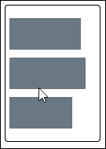

显然，这种行为是不可取的；如果这个演示已经自动化，并与`requestAnimationFrame`一起工作（我们将在[第 9 章](09.html#aid-2C9D01 "Chapter 9. Using the Web Performance APIs")中介绍，*使用 Web 性能 API*，那么当我们从选项卡切换到原始页面时，我们会看到大量的动画被完成。

## 解决问题

我们如何解决这个问题？非常简单；我们只需要在语句链中添加`.stop()`方法；这将在开始下一个动画之前清除上一个动画。让我们看一看，这意味着在实践中通过执行以下步骤：

1.  在`blockedqueue.html`文件的副本中，继续修改`<head>`部分，如下所示：

    ```js
    <title>Demo: Clearing the animation queue</title>
      <link rel="stylesheet" href="css/blockedqueue.css">
      <script src="js/jquery.min.js"></script>
     <script src="js/unblockqueue.js"></script>
    </head>
    ```

2.  我们需要稍微更改演示主体中的标记，因此修改突出显示的代码：

    ```js
    <div id="container">
     <ul class="stop">
        <li></li>
    ```

3.  另存为`unblockqueue.html`。在一个新文件中，添加以下代码，然后在我们项目区域的`js`子文件夹中将其另存为`unblockedqueue.js`。其中包含修改后的标记，并添加了`.stop()`：

    ```js
    $(document).ready(function() {
      $(".stop li").hover(
        function () {
          $(this).stop().animate({width:"100px"},500);
        },
        function () {
          $(this).stop().animate({width:"80px"},500);
        }
      );
    });
    ```

4.  If we run the demo now and then rapidly move over each of the bars in turn, we should see that the bars will increase and decrease in turn, but the next one will not change until the preceding bar has returned to its original size, as shown here:

    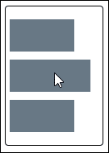

希望您会同意，添加`.stop()`对我们的代码有了显著的改进。添加`.stop()`将终止上一个动画，但将下一个动画排队，准备采取行动。

## 使过渡更加顺畅

我们可以更进一步。仔细查看`.stop()`可用的属性，我们可以使用`clearQueue`和`jumpToEnd`停止在匹配元素上运行动画，从而实现更清晰的过渡，如下图所示：

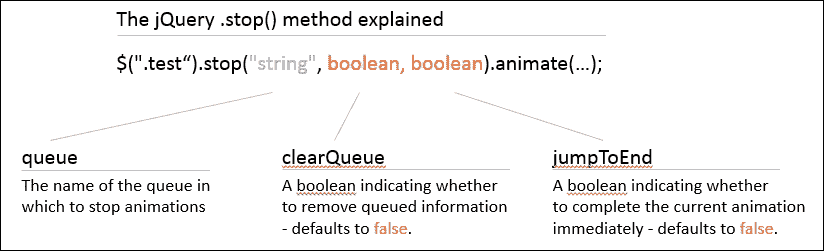

### 提示

有关使用`.stop()`的更多信息，请参阅[中的 jQuery 主文档 http://api.jquery.com/stop/](http://api.jquery.com/stop/) 。

让我们通过执行以下步骤来修改我们的 jQuery 代码，看看这在实践中意味着什么：

1.  返回到`unblockedqueue.js`文件，然后修改代码，如图所示：

    ```js
      function () {
        $(this).stop(true, false).animate({width:"100px"},500);
      },
      function () {
        $(this).stop(true, false).animate({width:"80px"},500);
      }
    ```

2.  保存您的工作，然后在浏览器中预览演示结果。如果一切顺利，您应该看不到条本身的任何更改，但当您将鼠标悬停在每个条上时，动画效果将更平滑。

在这个阶段，我们应该有一个动画，仍然可以工作，但更平滑的过渡值得注意的是，这个技巧将只适用于动画。如果您的项目使用其他功能队列，则需要使用`.clearQueue()`来清除这些功能队列。

### 注

为了比较使用`.stop()`的不同方式，值得一看 Chris Coyier 在[的演示 http://css-tricks.com/examples/jQueryStop/](http://css-tricks.com/examples/jQueryStop/) -这会产生一些有趣的效果！类似的解释也可在[上找到 http://www.2meter3.de/code/hoverFlow/](http://www.2meter3.de/code/hoverFlow/) 。

## 使用纯 CSS 解决方案

好的，我们有 jQuery 中的动画；对于一个简单的动画，如果我们使用纯 CSS，它会是什么样子？虽然我们无法复制与`.stop()`相同的效果，但我们可以非常接近。让我们来看看这意味着什么，在实践中，使用作为我们演示的基础：

1.  首先删除两个 JavaScript 链接，一个指向`unblockqueue.js`，另一个指向 jQuery 本身。
2.  在`blockedqueue.css`底部添加以下内容-这包含演示所需的动画样式规则：

    ```js
    li { width: 50%; transition: width 1s ease-in, padding-left 1s ease-in, padding-right 1s ease-in; }
    li:hover { width: 100%; transition: width 1s ease-out, padding-left 1s ease-out, padding-right 1s ease-out; }
    ```

此时，如果我们在浏览器中预览结果，我们应该看不到动画列表元素中的*可见*差异；如果我们使用 Google Chrome 的开发者工具栏来监控时间线，就会看到真正的变化。让我们看看变化是什么样子。

1.  启动谷歌浏览器。按*Shift*+*Ctrl*+*I*打开**开发者工具栏**（或*选项*+*Cmd*+*I*苹果 Mac）。
2.  单击**时间线**选项卡，然后单击放大镜正下方的灰色圆圈，圆圈将变为红色。
3.  尝试依次将鼠标悬停在列表项上；Chrome 将监视并收集所执行操作的详细信息。
4.  After a couple of minutes, click on the red-colored circle to stop generating the profile; you will end up with something that looks like this:

    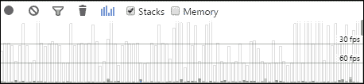

我们可以清楚地看到，仅使用 CSS 的解决方案几乎不会对浏览器的性能产生影响。相比之下，当我们运行`unblockedqueue.html`演示时，请查看相同的时间线：

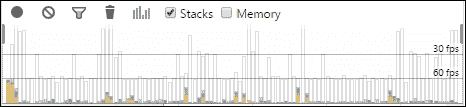

注意到区别了吗？虽然这是一个快速、非科学的测试，但当我们查看详细的数据时，我们可以清楚地看到差异。

在大约 3 秒钟的时间里，Google Chrome 在运行仅 CSS 的解决方案时花费了 33 毫秒的渲染和 48 毫秒的绘制时间。运行`unblockedqueue.html`显示数字几乎翻了一番：107 毫秒用于脚本编写，78 毫秒用于渲染，76 毫秒用于绘制！这绝对是一件值得思考的事情…

# 改进 jQuery 动画

从上一节中，我们可以很容易地看到 CSS 在浏览器中呈现时具有明显的优势，尽管演示中使用了一些不科学的方法！

但关键的一点是，我们在使用 jQuery 时获得了灵活性和全方位的浏览器支持，但在速度上却失去了 jQuery 在渲染动画时的性能。

为了帮助提高性能，您可以探索以下几个插件选项：

*   **Velocity.js**：该插件对`$.animate()`进行了重新设计，提供了更快的性能，可以与 jQuery 一起使用，也可以不使用 jQuery；这包括 IE8。插件可从[下载 http://julian.com/research/velocity/](http://julian.com/research/velocity/) 。这还包含一些预先注册的效果，我们将在本章后面介绍有关创建自定义缓和效果的更多内容。
*   **jQuery 动画增强**：该插件检测并重新设计动画，以自动使用 WebKit、Mozilla 和 IE10 或更高版本的本机 CSS 转换。可从[下载 http://playground.benbarnett.net/jquery-animate-enhanced/](http://playground.benbarnett.net/jquery-animate-enhanced/) 。

我们可以进一步深入研究使用 jQuery 在动画完成时通过`transitionend`事件得到通知。虽然这可能不会停止动画队列构建的原始问题，但使用 jQuery 将允许您将动画效果与 jQuery 逻辑分离。

### 注

有关使用`transitionend`（及其供应商前缀版本）的有趣文章和演示，请查看树屋网站[上的一篇文章 http://blog.teamtreehouse.com/using-jquery-to-detect-when-css3-animations-and-transitions-end](http://blog.teamtreehouse.com/using-jquery-to-detect-when-css3-animations-and-transitions-end) 。

现在，我们已经了解了如何使动画更平滑，接下来让我们看看如何生成自定义动画；理论上，我们可以利用一些知识来创建更复杂、更有趣的动画，同时减少运行队列时出现的一些问题。

然而，在我们这样做之前，我想给大家留下两个有用的提示来改进你的动画：

*   看一看[http://blog.teamtreehouse.com/create-smoother-animations-transitions-browser](http://blog.teamtreehouse.com/create-smoother-animations-transitions-browser) ；它探讨了我们在动画和过渡中遇到的一些问题，以及这些问题如何影响性能
*   [的文章 http://developer.telerik.com/featured/trimming-jquery-grunt/](http://developer.telerik.com/featured/trimming-jquery-grunt/) 探讨了如何裁剪 jQuery 版本，删除不需要的功能（从而减少运行动画时服务器上的负载）

让我们来看一下设计这些自定义动画的方法，从最初使用放松函数的角度开始。

# 引入缓解功能

在为页面上的任何对象或元素设置动画时，我们可以简单地将其上下滑动，或将其从页面上的一个位置移动到另一个位置。这些都是非常有效的效果，但它们缺乏你打开抽屉时可能得到的真实感。

动画并不总是以恒定的速度移动；相反，如果我们弹起一个球，或者在打开抽屉时放慢速度，我们可能会有一点反弹。为了达到这一效果，我们需要使用缓和函数来控制变化率。互联网上有很多例子，一个很好的起点是[http://www.easings.net](http://www.easings.net) -或者我们可以在[等网站上观看效果 http://matthewlein.com/ceaser/](http://matthewlein.com/ceaser/) 。在接下来的几页中，我们将更详细地探讨这些技巧，看看可以用来将动画技能提升到一个新水平的技巧和窍门。

# 设计定制动画

如果您花了任何时间开发用于为页面上的对象或元素设置动画的 jQuery 代码，您无疑会使用 jQuery UI 或可能的插件，例如 George Smith（[创建的 jQuery Easing）http://gsgd.co.uk/sandbox/jquery/easing/](http://gsgd.co.uk/sandbox/jquery/easing/) ）。

这两种方法都是在页面上设置对象动画的好方法，可以使用`easeIn()`或`easeOutShine()`等轻松方法。问题在于两者都需要使用插件，这给我们的代码增加了不必要的负担；它们也是实现我们需要的效果的非常安全的方法。如果我说我们不需要任何一个，只需使用 jQuery 本身就可以产生相同的效果，那会怎么样？

在我完成这个操作之前，让我们来看看一个演示的动作演示：

1.  Let's make a start by extracting the relevant files from the code download that accompanies this book—for this demo, we will need copies of the following:
    *   `customanimate.html`：将此文件保存在我们项目文件夹的根区域
    *   `customanimate.css`：将此文件保存在我们项目文件夹的`css`子文件夹中
    *   `customanimate.js`：将此文件保存在我们项目文件夹的`js`子文件夹中

    打开 Sans 字体；将保存在我们项目文件夹的`font`文件夹中；或者，字体可在[处找到 http://www.fontsquirrel.com/fonts/open-sans](http://www.fontsquirrel.com/fonts/open-sans) 。

2.  If you preview the `customanimate.html` file in a browser and then run the demo, you should see something akin to this screenshot, where the `<div>` tag is partway through running the animation:

    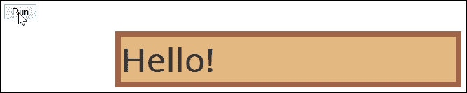

那么，这里发生了什么？好吧，我们用了一个标准的`.animate()`来增加`<div>`标签的尺寸并将其移动到新的位置，这是最惊天动地的。

那这里就没什么新鲜事了，对吧？错了，这里的“新”部分实际上是我们构建宽松的方式！如果您查看`customanimate.js`，您会发现以下代码：

```js
$(document).ready(function() {
  $.extend(jQuery.easing, {
    easeInBackCustom: function(x,t,b,c,d) {
      var s;
      if (s == undefined) s = 2.70158;
      return c*(t/=d)*t*((s+1)*t - s) + b;
    }
  })
```

我们所做的只是获取实现相同效果所需的数学知识，并将其封装在扩展`$.easing`的 jQuery 对象中。然后，我们可以在我们的代码中引用新的放松方法，如下所示：

```js
  $("#go").click(function() {
    $("#block").animate({
     ...
    }, 1500, 'easeInBackCustom');
  });
})
```

这打开了许多可能性；然后，我们可以用我们自己的创作来取代定制的放松功能。互联网带来了许多可能性，例如以下两个例子：

```js
$.easing.easeOutBack = function(t) {
  return 1 - (1 - t) * (1 - t) * (1 - 3*t);
};

$.easing.speedInOut = function(x, t, b, c, d) {
  return (sinh((x - 0.5) * 5) + sinh(-(x - 0.5)) + (sinh(2.5) + Math.sin(-2.5))) / (sinh(2.5) * 1.82);
};
```

如果你对其背后的数学感兴趣，那么要真正理解缓和函数是如何工作的就超出了本书的范围，那么互联网上有几个网站对此进行了更详细的解释。

### 注

如何使用缓解功能的两个示例包括[http://upshots.org/actionscript/jsas-understanding-easing](http://upshots.org/actionscript/jsas-understanding-easing) 和[http://www.brianwald.com/journal/creating-custom-jquery-easing-animations](http://www.brianwald.com/journal/creating-custom-jquery-easing-animations) -请注意，它们确实适合干燥阅读！

只需说，放松功能的最佳来源是 jQuery 的源代码，在 jQuery 中，我们可以查看所需的每个计算，并将其用作创建自己的放松效果的基础。

这一切都很好；这是在不产生难以理解或调试的复杂代码的情况下获得良好动画效果的一种好方法。但是…你知道我；我认为我们仍然可以做得更好。怎样这很简单，如果我们可以复制 jQuery 中 CSS 转换中可能看到的一些缓和效果，会怎么样？

## 转换为与 jQuery 一起使用

在这一点上，你可能认为我现在真的失去了它；CSS 转换使用贝塞尔曲线，这在使用 jQuery 的`animate()`方法时不受支持。那么，我们如何才能达到同样的效果呢？

答案是，和往常一样，在授予插件的情况下，这与我们在上一个演示中提到的相反！然而，有一点不同：这个插件在压缩时的重量为 0.8KB；这比使用 jqueryui 或 Easing 插件要小得多。

我们将要使用的插件是 Robert Grey 的 Bez 插件，可在[上找到 https://github.com/rdallasgray/bez](https://github.com/rdallasgray/bez) ；这将允许我们使用立方贝塞尔值，例如`0.23, 1, 0.32, 1`，它相当于`easeOutQuint`。让我们来看看这个动作：

1.  我们首先需要下载并安装 Bez 插件，我们可以从 GitHub 的[下载它 https://github.com/rdallasgray/bez](https://github.com/rdallasgray/bez) ；在`customanimate.html`中添加对它的引用，直接在 jQuery 链接下面。
2.  接下来，打开一份`customanimate.js`；继续，如图所示修改这一行，它取代了我们前面使用的`easeInBackCustom`操作：

    ```js
      }, 1500, $.bez([0.23, 1, 0.32, 1]));
    ```

保存两个文件；如果在浏览器中预览结果，则运行演示时将看到与上一示例中不同的操作。

那么，我们是如何来到这里的？这背后的诀窍是插件和 easings.net 网站的结合。使用`easeOutQuint`作为示例，如果我们第一次访问[http://easings.net/#easeOutQuint](http://easings.net/#easeOutQuint) ，我们可以看到产生效果所需的立方贝塞尔值：`0.86, 0, 0.07, 1`。我们所需要做的就是将其插入到对 Bez 插件的调用中，我们都已设置好：

```js
}, 1500, $.bez([0.86, 0, 0.07, 1]));
```

但是，如果我们想创建自己的立方贝塞尔效果，那么我们可以使用[cubic-bezier.com](http://cubic-bezier.com)来创建我们的效果；这将为我们提供需要使用的值，如以下屏幕截图所示：

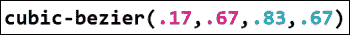

然后，我们可以用与上一个示例完全相同的方式将它们插入到对象调用中。使用这种方法的好处在于，如果我们以后决定减少 jQuery 的使用，我们可以很容易地将动画转换为 CSS3 等价物。

### 注

要了解更多关于贝塞尔曲线背后的理论，请查看维基百科文章[http://en.wikipedia.org/wiki/B%C3%A9zier_curve](http://en.wikipedia.org/wiki/B%C3%A9zier_curve) 。

好的，我们已经介绍了如何创建我们自己的动画缓和功能；如果我们想使用现有库中提供的效果，该怎么办？没问题，互联网上有一些很好的例子，包括：

*   [http://daneden.github.io/animate.css/](http://daneden.github.io/animate.css/) ：这是 Animate.css 库的所在地；我们可以使用[提供的`jQuery.Keyframes`插件在这个库中复制效果 https://github.com/jQueryKeyframes/jQuery.Keyframes](https://github.com/jQueryKeyframes/jQuery.Keyframes) 。
*   [https://github.com/yckart/jquery-custom-animations](https://github.com/yckart/jquery-custom-animations) ：这个库包含个不同的效果，以类似于 jQuery UI 的风格创建；可以将其插入，并以类似于本章前面的*设计自定义动画*演示的方式引用效果。
*   [https://github.com/ThrivingKings/animo.js](https://github.com/ThrivingKings/animo.js) ：Animo.JS 采用不同的方式；它没有使用 jQuery 的`animate()`函数，而是使用自己的`animo()`方法为对象设置动画。它使用了 Dan Eden 创建的`Animate.css`库中的效果，尽管有人可能会争论它是否值得额外的开销，但它仍然值得一看，作为项目动画的可能来源。
*   [http://lvivski.com/anima/](http://lvivski.com/anima/) ：值得仔细看看这个图书馆的；源代码在`easings.js`源文件中包含许多立方贝塞尔值。如果需要的话，可以很容易地将它们提升到您自己的代码项目中，或者可以为您自己的示例提供灵感。

是时候好好利用我们介绍的一些动画概念了；让我们继续看一些在我们自己的项目中使用动画的例子。

# 实现一些自定义动画

在本章中，我们已经探讨了使用 jQuery 制作对象动画，并看到了如何将其与基于 CSS 的动画进行比较；我们还研究了如何创建一些自定义的缓和模式，以控制元素在屏幕上的移动方式。

理论说得够多了，让我们深入实际应用吧！在接下来的几页中，我们将看一些动画元素的例子；我们将包括一些响应性网站的例子，因为这是一个热门话题，随着移动设备在互联网上访问内容的使用的增加。

让我们以一些按钮的形式开始制作一个简单元素的动画，注意演示结束时的扭曲！

## 设置滚动按钮动画

谦逊的按钮必须是任何网站上最重要的元素之一；按钮有各种形状和大小，可以从标准的`<button>`HTML 元素创建，也可以使用`<input>`字段创建。

在这个演示中，我们将使用 jQuery 不仅可以滑入和滑出按钮图标，还可以同时旋转它们。但是等等，我们都知道 jQuery 不支持元素的旋转，对吗？

我们可以使用像 QTTransform（[这样的插件 https://github.com/puppybits/QTransform](https://github.com/puppybits/QTransform) ）甚至 jQuery 动画增强（[http://playground.benbarnett.net/jquery-animate-enhanced/ 但是这有一个开销，让我们走一条不同的路线。取而代之的是，我们将使用猴子补丁来直接改装支架；为了证明它的有效性，我们将更新一个](http://playground.benbarnett.net/jquery-animate-enhanced/)**Codrops**演示，它的站点上有滚动按钮的原始版本，改为使用 jQuery 2.1。

### 注

此演示的原始版本可在[上获得 http://tympanus.net/codrops/2010/04/30/rocking-and-rolling-rounded-menu-with-jquery/](http://tympanus.net/codrops/2010/04/30/rocking-and-rolling-rounded-menu-with-jquery/) 。

让我们来看看演示：

1.  Extract the relevant files from the code download that accompanies this book; for this demo, we will need the following files:
    *   `rollingbuttons.html`：将此文件保存在项目区域的根文件夹中
    *   `style.css`：将此文件保存在项目区域的`css`子文件夹中
    *   `jquery-animate-css-rotate-scale.js`：将此文件保存在项目区域的`js`子文件夹中
    *   `rollingbuttons.js`：将此文件保存在项目区域的`js`子文件夹中
    *   `img`：将此文件夹复制到项目区域

    ### 注

    此猴子补丁的原始版本可在[上获得 http://www.zachstronaut.com/posts/2009/08/07/jquery-animate-css-rotate-scale.html](http://www.zachstronaut.com/posts/2009/08/07/jquery-animate-css-rotate-scale.html) ；它是为 jQuery1.3.1+开发的，但是当我将它与 jQuery2.1 一起使用时，我没有看到任何负面影响。

2.  Run the demo in a browser and then try hovering over one or more buttons. If all is working OK, then we will see the green-colored icon image start to spin out to the left while the gray background expands to form a long pill, with the links held within, as shown here:

    

### 更详细地探索代码

这个演示产生了一个漂亮的效果，同时也节省了空间；这些信息只有在访问者需要查看时才会公开，并且在其他任何时候都是隐藏的。

但是，如果我们更详细地研究代码，就会发现一个有趣的概念：jQuery 在使用`.animate()`时不提供对旋转元素使用的本机支持，如本演示开始时所述。

那么，我们该怎么解决这个问题呢？我们可以使用一个插件，但是我们使用一个 monkey 补丁（由开发者 Zachary Johnson 创建）来改进对 jQuery 的支持。值得注意的是，使用补丁总是有风险的（如[第 2 章](02.html#aid-K0RQ1 "Chapter 2. Customizing jQuery")、*定制 jQuery*中所述），但在这种情况下，似乎尽管更新了使用 jQuery 2.1，但没有明显的不良影响。

如果希望在使用补丁时看到差异，请在运行演示之前激活 DOM 检查器，例如 Firebug。将鼠标悬停在其中一个图标上；您应该会看到类似于此屏幕截图的内容：

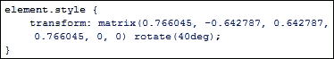

如果您想要更深入的关于`matrix()`工作原理的详细信息，请访问 Mozilla 网站上的[注释 https://developer.mozilla.org/en-US/docs/Web/CSS/transform](https://developer.mozilla.org/en-US/docs/Web/CSS/transform) 。

让我们继续看下一个动画示例。我肯定你用过某种形式的叠加，但我们要看一看一个叠加，它采用了一种全新的方法，去掉了大多数叠加中典型的灰色遮罩。

## 设置叠加效果的动画

如果你花时间访问互联网上的网站，你肯定会遇到使用某种形式的覆盖的网站，对吗？

你知道这个练习：他们首先用半透明的覆盖物遮住屏幕，然后开始显示放大的图像或视频。这是一种典型的效果，可以在全球数千个网站上找到，如果使用得当，效果会非常好。

然而，你比这更了解我；我喜欢走得更远！如果我们打破传统，有一个覆盖，不显示图像，但显示一个全面的显示？感兴趣的让我们来看看我在行动中的意义：

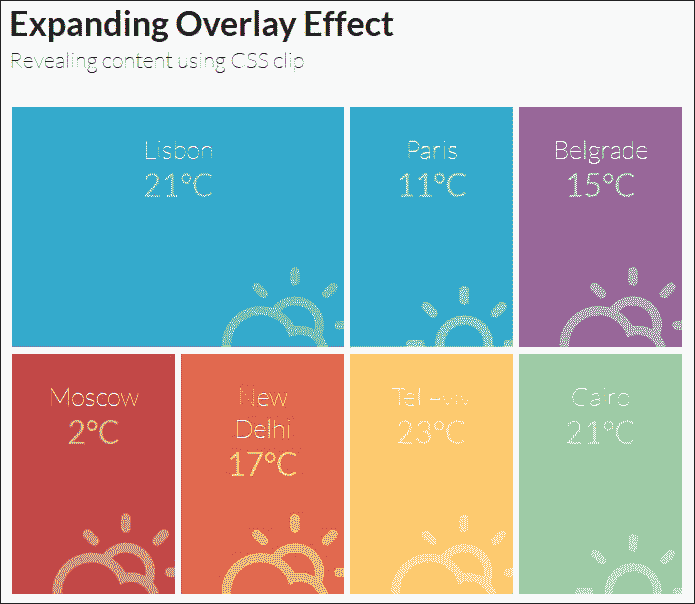

对于这个演示，我们将运行一个版本的叠加效果，如[所示 http://tympanus.net/Tutorials/ExpandingOverlayEffect/](http://tympanus.net/Tutorials/ExpandingOverlayEffect/) 。

1.  让我们先从本书附带的代码下载中提取以下文件；将它们保存在项目区域内的相关文件夹中：
    *   `jquery.min.js`：将此文件保存在项目区域的`js`子文件夹中
    *   `fittext.js`：将此文件保存在项目区域的`js`子文件夹中
    *   `boxgrid.js`：将此文件保存在项目区域的`js`子文件夹中
    *   `default.css`、`component.css`和`climacons.css`：将这些文件保存在项目区域的`css`子文件夹中
    *   `overlayeffect.html`：将此文件保存在项目区域的根目录中
2.  运行`overlayeffect.html`，然后尝试单击其中一个彩色框。

注意发生了什么？它按照您的预期显示叠加效果，但这一效果覆盖了整个浏览器窗口，并且没有更传统的叠加效果经常显示的遮罩效果。

在这个演示中，我们混合使用了 HTML 来生成初始网格；`fittext.js`插件用于帮助确保文本（以及随后的覆盖）调整大小以填充屏幕；叠加效果是使用我们代码中的`boxgrid.js`插件产生的。

神奇发生在`boxgrid.js`——包含路易·雷米的`jquery.debouncedresize.js`插件；虽然这是 2 岁；它在现代浏览器中仍然可以很好地工作。您可以从[下载原始插件 https://github.com/louisremi/jquery-smartresize/blob/master/jquery.debouncedresize.js](https://github.com/louisremi/jquery-smartresize/blob/master/jquery.debouncedresize.js) 。

让我们改变焦点，继续来看看如何将 jQuery 动画同样应用于响应性网站。在两个演示中的第一个演示中，您将看到如何混合应用 CSS3、jQuery 和`history.pushState`以创建一些令人愉悦的过渡效果，从而将多页面站点变成一个看起来像单页面的应用程序。

# 在响应性强的网站上制作动画

你多久访问一次网站，却发现每次页面加载之间都要等待很长时间？听起来熟悉吗？

在过去几年中，我们对页面转换的期望发生了变化，页面上重新排列元素的笨拙副作用是不够的；我们对网站的期望更高。基于 JavaScript 的**单页应用程序**（**SPA**框架通常被视为答案，但代价是必须使用突兀的代码。

我们可以做得更好。我们可以介绍 smoothState.js，这是 MiguelÁngel Pérez 创建的一个有用的插件，它允许我们添加过渡，使整个体验更加流畅，让访问者更加享受。在本例中，我们将使用插件作者提供的演示的修改版本；一些代码已经从原始代码中重新组织和清理。

让我们来看看插件的作用，看看它是如何使一个更流畅的体验。为此，请执行以下步骤：

1.  从本书附带的代码下载中，提取以下文件的副本：
    *   `smoothstate.html`和`smoothstate.css`：分别将这些文件保存在项目文件夹的根区域和`css`子文件夹中。
    *   `jquery.smoothstate.js`：保存在项目区域的`js`子文件夹中；最新版本可从[下载 https://github.com/miguel-perez/jquery.smoothState.js](https://github.com/miguel-perez/jquery.smoothState.js) 。
    *   `jquery.min.js`：保存在项目区域的子文件夹中。
    *   `animate.css`：保存在项目区域的子文件夹中；最新版本可在[上获得 http://daneden.github.io/animate.css/](http://daneden.github.io/animate.css/) 。
    *   Roboto 字体：本书附带的代码下载中有两种字体的副本。也可以从字体松鼠网站[下载 http://www.fontsquirrel.com/fonts/roboto](http://www.fontsquirrel.com/fonts/roboto) 。我们只需要选择 WOFF 字体；我们将在演示中使用浅色和常规字体。
2.  Run the `smoothstate.html` file in a browser; try clicking on the middle link of the three and see what happens. Notice how it displays the next page, which is `transitions.html`. Instead of the pause we frequently get when loading new pages, smoothState.js treats the site as if it were a SPA, or single page application. You should see a very simple page display, as shown in this screenshot:

    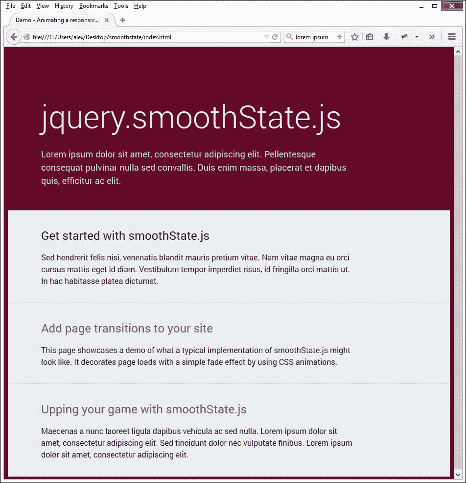

传统上，当面临这个问题时，许多人可能会求助于 SPA 框架来解决问题并改善过渡外观。使用这种方法是可行的，但代价是从使用不引人注目的代码中获得的好处。

相反，我们可以混合使用 jQuery、CSS3、`history.pushState()`和渐进式增强来实现相同的效果，从而为最终用户带来更好的体验。

### 注

值得一看网站文档，可在[上找到 http://weblinc.github.io/jquery.smoothState.js/index.html](http://weblinc.github.io/jquery.smoothState.js/index.html) 。CSS 技巧网站[上有一个有用的教程 https://css-tricks.com/add-page-transitions-css-smoothstate-js/](https://css-tricks.com/add-page-transitions-css-smoothstate-js/) 。

维护良好的用户体验应该始终是任何开发人员的首要考虑，这在处理响应性网站时更为重要。这其中的一个关键部分应该是监控动画的性能，以确保我们在用户体验和服务器需求之间取得良好的平衡。

在响应站点上使用基于 jQuery 的动画时，我们可以使用一些技巧来提高性能。让我们来看看一些问题，以及我们如何减轻或解决这些问题。

## 考虑响应站点的动画性能

在这个从任何设备访问互联网的现代时代，对用户体验的强调比以往任何时候都更为重要，这在使用 jQuery 时都无济于事。作为最低公分母，它有助于简化对内容的处理（特别是对于复杂的动画），但没有针对内容的使用进行优化。

在使用 jQuery 制作内容动画时，我们会遇到一些问题，我们在本章前面的*选择 CSS 或 jQuery*中介绍了其中一些问题；它们同样适用于响应站点。此外，我们还需要注意其他因素，包括：

*   使用 jQuery 的动画将消耗大量资源；这与可能不适合移动环境的内容（由于其容量）相结合，将在台式机上产生缓慢的体验。这在笔记本电脑和移动设备上会更糟糕！
*   移动设备上的最终用户通常只对获取所需信息感兴趣；动画可能会使网站看起来不错，但通常不会针对移动设备进行优化，可能会降低访问速度并导致浏览器崩溃。
*   jQuery's garbage collection process is frequently known to cause issues; its use of `setInterval()` in place of `requestAnimationFrame()` will result in high frame rates, making for an experience that is likely to stutter and show a high rate of frame dropouts.

    ### 提示

    在撰写本文时，有计划将 jQuery 中的`setInterval`（和`clearInterval`）替换为`requestAnimationFrame`（用`clearAnimationFrame`）。

*   如果我们同时使用动画 jQuery 或普通 CSS，那么在某些平台上，我们经常需要启用硬件加速。虽然这有助于提高移动设备的性能，但如果硬件加速元素与其他非硬件加速元素重叠，也可能导致闪烁。在本章后面的*改善动画外观*一节中，我们将讨论如何启用 3D 渲染。
*   jQuery 的`.animate`在每个动画帧上增加元素的`style`属性；这将强制浏览器重新计算布局，并导致持续刷新。这在响应性强的网站上尤为明显，每次调整屏幕大小时，每个元素都需要重新绘制；这将对服务器资源提出额外要求，并影响性能。如果需要，可以使用插件，例如 jQuery 计时器工具（[https://github.com/lolmaus/jquery.timer-tools](https://github.com/lolmaus/jquery.timer-tools) ）可用于限制或延迟操作，使其仅在必要时执行，或将多个重复调用有效合并为一个执行。
*   如果更改了元素的显示状态（使用`display`…或`display: none`，则这将产生从 DOM 中添加或删除元素的效果。如果 DOM 中有大量元素，这可能会影响性能。
*   Using jQuery leaves inline styles in the DOM that have very high specificity and that will override our well-maintained CSS. This is a big issue if the viewport is resized and triggers different breakpoints.

    ### 注

    CSS 专用性是浏览器决定哪些属性值与元素最相关，并作为结果应用的地方[https://css-tricks.com/specifics-on-css-specificity/](https://css-tricks.com/specifics-on-css-specificity/) 了解更多详情。

*   撇开不谈，我们失去了关注点分离（或为代码定义单独的部分），因为样式是在 JavaScript 文件中定义的。

是否有可能减少或消除这些问题？是的，但这可能需要一些牺牲；这些将取决于您的需求以及需要支持的目标设备。让我们花一点时间考虑一下我们可以做些什么改变：

*   考虑使用 CSS 在 JQuery 上的实用性，至少对于移动站点；大多数浏览器（Opera Mini 除外）支持 CSS 关键字，如`translate`或`transform`。由于它们是浏览器的本机代码，这就消除了对所引用的额外代码的依赖，从而节省了资源和带宽使用。
*   If animation isn't possible using jQuery or the effort required outweighs the benefits gained, then consider the use of a plugin such as Velocity.js (available from [https://github.com/julianshapiro/velocity](https://github.com/julianshapiro/velocity)), as this has been optimized to animate content.

    ### 注

    值得注意的是，正在讨论将 Velocity.js 集成到 jQuery 中，有关更多详细信息，请参见[https://github.com/jquery/jquery/issues/2053](https://github.com/jquery/jquery/issues/2053) 。[上还有一篇文章值得一读 http://www.smashingmagazine.com/2014/09/04/animating-without-jquery/](http://www.smashingmagazine.com/2014/09/04/animating-without-jquery/) ，其中更详细地讨论了速度的使用。

*   更好的选择是使用 jQuery.Animate 增强插件或 jQuery++中的 Animate 助手；在支持的情况下，默认情况下，两者都会将动画转换为使用 CSS3 等价物。

那么，在使用 jQuery 时，我们如何处理响应站点上的动画请求呢？有几种方法可以做到这一点；让我们更详细地探讨这个关键问题。

# 在响应站点上处理动画请求

在使用 jQuery 时，在响应性强的站点中制作内容动画的最佳途径可能看起来有点反常：除非你必须使用 jQuery，否则不要使用它！在这一点上，你可能会认为我完全失去了情节，但以下是一些很好的理由：

*   jQuery 没有针对动画进行优化；样式表中的样式、HTML 和 JavaScript 之间的界限将开始模糊，这意味着我们无法控制内容的样式。
*   使用 jQuery 时，动画在移动设备上无法正常工作；为了提高性能，必须使用额外的 CSS 样式。
*   由于 CSS 的特殊性，我们无法控制将哪些规则应用于特定元素。在 CSS 样式表中保留样式意味着我们可以保留控制权。
*   默认情况下，jQuery 动画需要大量资源。在一个简单的站点上，这将产生最小的影响，但在较大的站点上，影响将显著更大。
*   使用纯 CSS 方法的一个好处是，它允许您使用 CSS 预处理器，例如**语法上非常棒的样式表**（**SASS**）或更少，来处理媒体查询。这种形式的速记 CSS 允许您在保持最终所需输出的同时更高效地编写样式。

考虑到这一点，让我们来看看一些可以用来处理响应站点上的动画请求的指针：

*   首先考虑手机。如果您使用的是 CSS，那么首先以您希望容纳的最小屏幕为基础，然后添加额外的媒体查询，以处理在越来越大的设备上查看时对布局的更改。考虑使用 TysT0\. CSS 媒体查询样板，例如开发人员 Paul Lund 在 OutT1 上创建的查询。http://www.paulund.co.uk/boilerplate-css-media-queries ；然后，我们可以在每个适当的断点内插入动画规则。
*   避免在 jQuery 代码中使用`.css`语句，而是使用`.addClass()`或`.removeClass()`方法，这样可以保持关注点的分离，在内容层和表示层之间有明确的界限。贾斯汀·阿吉拉尔（Justin Aguilar）在[的动画备忘单网站上给出了一个很好的例子，说明了如何使用它（对于那些不确定的人而言）http://www.justinaguilar.com/animations/](http://www.justinaguilar.com/animations/) 。这会产生各种不同的动画，所有这些都可以使用`.addClass()`添加。
*   在代码中使用无前缀版本的属性，然后根据需要使用 autoprefixer 自动添加任何供应商前缀。当使用 Grunt 和一个插件（如 Grunt autoprefixer）之类的东西时，这就变得轻而易举了。
*   Consider making use of the jQuery.Animate-Enhanced plugin (available at [https://github.com/benbarnett/jQuery-Animate-Enhanced](https://github.com/benbarnett/jQuery-Animate-Enhanced)) where possible. Although it is a few years old, it still works with the current versions of jQuery; it extends `$.animate()` to detect transitions and replaces them with CSS equivalents.

    ### 提示

    另一个值得一看的插件是 Animation，可在[上找到 http://git.blivesta.com/animsition](http://git.blivesta.com/animsition) 。

*   这里的诀窍是不依赖它作为站点的永久部分，而是作为一种工具，用 CSS 等效样式替换现有的 jQuery 动画。您越能使用 CSS，对页面的影响就越小，因为对服务器资源的需求就会减少。
*   密切关注[上的眼睛 http://www.caniuse.com](http://www.caniuse.com) 。尽管浏览器对 CSS3 转换和转换的支持非常好，但仍有几个实例需要使用 WebKit 前缀，即 Safari 和 iOS Safari（移动版）。
*   在动画中尽可能使用`requestAnimationFrame`（和`clearAnimationFrame`）。这将有助于在动画不可见时节省资源。这将需要使用 jQuery，但由于我们的目标是在最复杂的动画中保留 jQuery，因此使用该库的影响将减小。
*   看看网站比如[http://cssanimate.com/](http://cssanimate.com/) -这些允许您生成复杂的基于关键帧的动画，可以将其放入现有代码中。如果您担心现有内容无法制作动画，那么这个网站可能会帮助您消除一些疑虑。
*   问自己这样一个问题：“如果我的动画真的很复杂，它会有效吗？”如果做得好，动画可以在视觉上令人惊叹，但这并不意味着它们需要复杂。通常，简单且经过深思熟虑的动画比复杂且资源匮乏的动画效果更好。

这里要考虑的重要一点是，使用 jQuery 来动画内容不应该完全打折；随着浏览器对 CSS 动画的支持不断发展，它为使用后者作为大多数动画的基础提供了强有力的支持。

jQuery 团队意识到，jQuery 从来不是为内容的高效动画设计的。在撰写本书时，围绕着 Velocity.js 版本的介绍正在进行讨论；原则上，这可能会提高使用 jQuery 制作内容动画的效率，但这离实现还有一段路要走！

同时，我们应该仔细考虑 jQuery 与所使用的 CSS 动画之间的平衡，如果可以使用 CSS 动画，我们的目标是删除正在使用的 jQuery 动画。

### 注

为了帮助证明这一点，Chris Coyier 制作了一个 CodePen 示例，说明如何使一个相当简单的站点具有响应性，并且可以包含基于 CSS 的动画，您可以在[上查看这些动画 http://codepen.io/chriscoyier/pen/tynas](http://codepen.io/chriscoyier/pen/tynas) 。

好的，让我们继续。我们将继续讨论动画的主题，但这次我们将看看如何在移动设备上实现这一点。我们需要注意一些考虑因素；让我们更详细地看看这些。

# 为移动设备制作内容动画

到目前为止，我们已经考虑过使用 jQuery 在响应性强的网站上制作内容动画，但是移动平台呢？使用非桌面设备（如笔记本电脑和智能手机）查看内容的情况显著增加。为了在移动设备上充分发挥性能，我们需要考虑一些额外的因素。

在移动平台上制作动画不是写代码，而是决定使用哪种技术；在大多数情况下，只需编写 jQuery 代码就可以了，但效果不如预期。

获得最佳体验的秘诀在于使用智能手机的**GPU**或**图形处理单元**；为此，我们可以通过启用 3D 渲染来卸载标准 jQuery 动画（速度较慢）。

### 提示

尽管这款浏览器可以在所有桌面和移动设备上使用，但在基于 WebKit 的浏览器（如 Google Chrome）中，您将获得最佳效果。

让我们通过一个启用 3D 渲染的简单示例来更详细地探讨这一点：

1.  对于这个演示，我们需要三个文件。继续，从代码下载中提取`mobileanimate.html`、`mobileanimate.css`和`jquery.min.js`，并将它们保存在项目区域的相关文件夹中。
2.  在新文件中，添加以下代码。它处理下拉框的动画。我们将详细介绍它，从分配代码所需的许多变量开始：

    ```js
    var thisBody = document.body || document.documentElement,
        thisStyle = thisBody.style,
        transitionEndEvent = 'webkitTransitionEnd transitionend',
        cssTransitionsSupported = thisStyle.transition !== undefined,
        has3D = ('WebKitCSSMatrix' in window && 'm11' in new WebKitCSSMatrix());
    ```

3.  接下来是初始检查，如果浏览器支持 CSS3 转换，`accordion_css3_support`类将添加到`ul`对象中：

    ```js
    // Switch to CSS3 Transform 3D if supported & accordion element exist
    if(cssTransitionsSupported && has3D ) {
      if($('.children').length > 0) { 
        $('.children').addClass("accordion_css3_support");
      }
    }
    ```

4.  魔法发生在这个事件处理程序中。如果不支持 CSS3 转换，则下拉菜单将使用`slideToggle`方法打开或关闭；否则，它将使用 CSS3 转换：

    ```js
    $('.parent a').on('touchstart click', function(e) {
      e.preventDefault();
      // If transitions or 3D transforms are not supported
      if(!cssTransitionsSupported || !has3D ) {
        $(this).siblings('.children').slideToggle(500);
      }
      else {
        $(this).siblings('.children').toggleClass("animated");
      }
    });
    ```

5.  Save the file as `mobileanimate.js`. If all went well, you will see a styled drop-down box ready to be opened, as shown here:

    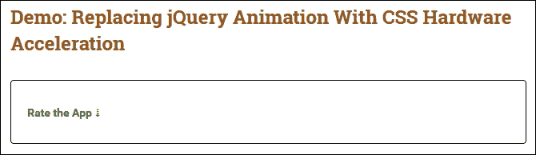

尝试单击下拉箭头。从表面上看，我们的下拉列表似乎与其他下拉列表没有什么不同；它以与任何其他下拉框相同的方式展开和收缩。实际上，我们的代码使用了两个重要的技巧来帮助管理动画；让我们花一点时间来研究 JQuery 时的二者的重要性。

## 改善动画外观

如果我们仔细看看代码，我们有两点感兴趣；第一个在 jQuery 代码中：

```js
if(!cssTransitionsSupported || !has3D ) {
  $(this).siblings('.children').slideToggle(500);
}
else {
  $(this).siblings('.children').toggleClass("animated");
}
```

第二个在 CSS 样式表中的两个位置显示：

```js
.accordion_css3_support { display: block; max-height: 0;
  overflow: hidden; transform: translate3d(0,0,0);
  transition: all 0.5s linear; -webkit-backface-visibility: hidden; -webkit-perspective: 1000; }
.children.animated { max-height: 1000px; transform: translate3d(0,0,0); }
```

“为什么这些很重要？”我听到你问。答案很简单。在大多数情况下，我们可能会使用`slideToggle()`事件处理程序。这没有什么错，只是动画不是硬件加速的（也需要您将其转换为 CSS），因此无法充分利用平台的功能。此外，它模糊了代码和样式之间的界限；如果我们在代码和样式表中都有样式，那么调试样式就会变得更加困难。

更好的选择是确定浏览器是否支持 CSS3 转换（或类似转换），并应用一个可以在样式表中设置样式的新类。如果浏览器不支持转换，那么我们只需在 jQuery 中使用`slideToggle()`方法。前者的好处是 CSS 样式将减少运行动画所需的资源，并有助于节约资源。

### 提示

如果仍然必须使用 jQuery，那么值得测试为`jQuery.fx.interval`设置的值-尝试大约 12 fps 的速度，看看这是否有助于提高性能；更多详细信息请参见[的主文档 http://api.jquery.com/jquery.fx.interval/](http://api.jquery.com/jquery.fx.interval/) 。

第二个关注点也许不那么明显；如果我们将转换`translate3d(0,0,0)`应用于任何包含动画的 CSS 规则，那么这就足以启用 3D 渲染，并允许浏览器通过将动画卸载到 GPU 提供平滑体验。在某些浏览器（如谷歌浏览器）中，我们可能会看到闪烁的实例；我们可能需要添加以下代码行以消除不必要的闪烁：

```js
-webkit-backface-visibility: hidden; -webkit-perspective: 1000;
```

也有可能`translate3d(x, y, z)`没有为某些平台（如 iOS 6）启用硬件加速；我们可以用`–webkit-transform: translate (0)`来代替。

最终，虽然我们可能需要（或更喜欢）使用 jQuery 来制作内容动画，但我们应该考虑它是否真的是正确的工具，以及是否可以使用 CSS 动画来代替它。

一个很好的例子显示在 JSFiddle（[http://jsfiddle.net/ezanker/Ry6rb/1/](http://jsfiddle.net/ezanker/Ry6rb/1/) ），它使用 Dan Eden 的 Animate.css 库来处理动画，将 jQuery 作为演示中使用的 jQuery Mobile 的依赖项。诚然，jQuery 的版本有点旧，但其原理仍然非常完善！

### 提示

Treehouse 团队发布了一篇很好的博客，探讨了动画和过渡如何影响性能的科学，值得一读；您可以在[找到它 http://blog.teamtreehouse.com/create-smoother-animations-transitions-browser](http://blog.teamtreehouse.com/create-smoother-animations-transitions-browser) 。

让我们改变焦点，继续前进。如果您访问过具有视差滚动效果的站点，请举手？视差…滚动…不确定是怎么回事？没问题，在接下来的几页中，我们将看一看什么已经成为 web 设计中最热门的技术之一，但是如果它没有在我们的项目中正确实现，同样会适得其反。

# 实现响应式视差滚动

视差滚动是关于什么的？简单地说，它涉及到在向下滚动页面时以低于前景的速度移动背景以创建 3D 效果。

视差滚动最初由伊恩·科伊尔在 2011 年为耐克公司创建，是一种流行的技术。它可以提供一个微妙的深度元素，但如果你没有正确使用它，它也同样会让人无法承受！

要了解可能发生的事情，请查看 Creative Bloq 网站上的文章[http://www.creativebloq.com/web-design/parallax-scrolling-1131762](http://www.creativebloq.com/web-design/parallax-scrolling-1131762) 。

有几十个视差滚动插件可用，例如 PixelCog 的 parallax.js 插件（位于[）http://pixelcog.github.io/parallax.js/ 马克·达格利什的](http://pixelcog.github.io/parallax.js/)或 Stellar.js，可在[上获得 http://markdalgleish.com/projects/stellar.js/](http://markdalgleish.com/projects/stellar.js/) 。可以说，最著名的插件是 Skrollr，可以从[下载 https://github.com/Prinzhorn/skrollr](https://github.com/Prinzhorn/skrollr) -这将构成我们下一次演示的基础。

## 构建视差滚动页面

如果你花时间在互联网上进行研究，毫无疑问，你会遇到很多教程，介绍如何在网站上添加视差滚动效果。在接下来的几页中，我们将使用澳大利亚前端开发人员 Petr Tichy 的教程作为下一个练习的基础。毕竟，试图重新发明轮子是没有意义的，对吗？

### 注

原始教程可在[查看 https://ihatetomatoes.net/how-to-create-a-parallax-scrolling-website/](https://ihatetomatoes.net/how-to-create-a-parallax-scrolling-website/) 。

我们的下一个演示将使用著名的 Skrollr 库（可在[上找到）https://github.com/Prinzhorn/skrollr](https://github.com/Prinzhorn/skrollr) ）构建一个可以滚动五幅图像的简单页面，但我们还将使用多种效果来控制图像如何向下滚动页面：

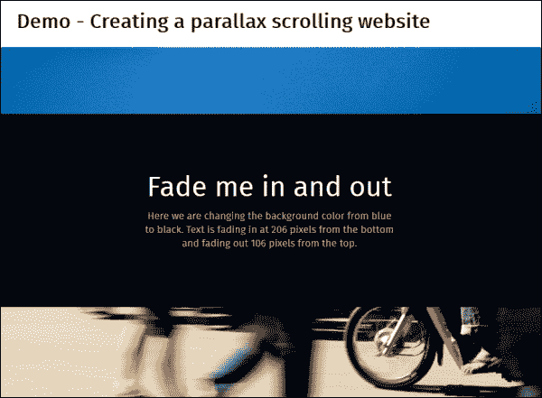

现在我们已经看到了我们的演示将产生什么，让我们执行以下步骤：

1.  我们将从本书附带的代码下载副本中提取`parallax`文件夹；将整个文件夹保存到项目区域。
2.  We need a couple of additional plugins for our demo to work, so go ahead and download the following:
    *   **图像添加**：[https://raw.githubusercontent.com/desandro/imagesloaded/master/imagesloaded.pkgd.js](https://raw.githubusercontent.com/desandro/imagesloaded/master/imagesloaded.pkgd.js) ；将文件另存为`imagesloaded.js`
    *   **Skrollr**：[https://raw.githubusercontent.com/Prinzhorn/skrollr/master/src/skrollr.js](https://raw.githubusercontent.com/Prinzhorn/skrollr/master/src/skrollr.js)
    *   **视口大小**：[https://github.com/tysonmatanich/viewportSize](https://github.com/tysonmatanich/viewportSize)

    将所有这些插件保存在`parallax`文件夹的`js`子文件夹中。

3.  在新文件中，添加以下代码；这将处理 Skrollr 插件的初始化。让我们详细介绍一下，从一个`ready`DOM 语句开始，该语句设置了许多变量，然后使用 ImagesLoaded 插件预加载图像，然后在每个部分中调整图像大小和淡入淡出：

    ```js
    $(document).ready(function($) {
      // Setup variables
      $window = $(window);
      $slide = $('.homeSlide');
      $slideTall = $('.homeSlideTall');
      $slideTall2 = $('.homeSlideTall2');
      $body = $('body');

      //FadeIn all sections
      $body.imagesLoaded( function() {
        setTimeout(function() {
          // Resize sections
          adjustWindow();

      // Fade in sections
      $body.removeClass('loading').addClass('loaded');
      }, 800);
    });
    ```

4.  在 DOM 函数的正下方和右括号之前，添加以下代码。这会将每个幻灯片的大小调整到适当的窗口高度或最小高度`550px`，以较大者为准：

    ```js
    function adjustWindow(){
      var s = skrollr.init();  // Init Skrollr
      winH = $window.height(); // Get window size

      // Keep minimum height 550
      if(winH <= 550) { winH = 550; } 

      // Resize our slides
      $slide.height(winH);
      $slideTall.height(winH*2);
      $slideTall2.height(winH*3);

      // Refresh Skrollr after resizing our sections
      s.refresh($('.homeSlide'));
    }
    ```

5.  If all is well, when you preview the results, images will cross from one to another when we scroll up or down, as shown in this screenshot:

    

视差滚动作为一种技术，如果使用得当，可以产生一些非常惊人的效果。关于一些很好的例子，请看科斯塔咖啡的网站[http://www.costa.co.uk](http://www.costa.co.uk) 或索尼的移动站点，位于[http://www.sony.com/be-moved/](http://www.sony.com/be-moved/) 。很难相信这样的原创设计是基于视差滚动的！

### 提示

请看一看 Petr 关于如何在[处使视差滚动响应的教程 https://ihatetomatoes.net/make-parallax-website-responsive/](https://ihatetomatoes.net/make-parallax-website-responsive/) 。

## 考虑视差滚动的影响

虽然很难相信这样美丽的网站可以通过视差滚动来创建，但必须警告一下：这种技术并非没有问题。诚然，大多数（如果不是全部的话）都可以通过一些小心和关注来克服；然而，如果在设计和实现过程中不小心，这些问题可能会绊倒任何设计师。让我们更详细地探讨其中一些问题：

*   最大的杀手是视差滚动在默认情况下不利于搜索引擎优化。有一些技术可以解决这个问题，比如 jQuery 或多页，但它们会影响分析或服务器资源。数字营销策略师卡拉·道森（Carla Dawson）写了一篇优秀的文章，讨论了这些变通方法的优点，可在[上找到 http://moz.com/blog/parallax-scrolling-websites-and-seo-a-collection-of-solutions-and-examples](http://moz.com/blog/parallax-scrolling-websites-and-seo-a-collection-of-solutions-and-examples) -值得一读！
*   视差滚动（自然）要求访客滚动；这里的关键是确保我们不会创建滚动时间过长的单个页面。这可能会对移动用户的性能产生影响，并使访问者望而却步。
*   使用 jQuery 创建基于此技术的效果本身就是一个缺点；jQuery 将影响页面加载时间，因为必须计算页面上每个元素的位置。我们可以通过使用我们在[第 1 章](01.html#aid-DB7S1 "Chapter 1. Installing jQuery")、*安装 jQuery*中介绍的技术来定制 jQuery 副本，从而在一定程度上缓解这种情况，但在使用库时总会有性能下降的因素。
*   视差滚动可以揭示许多可用性问题。如果视觉吸引力与内容和易访问性之间的平衡不平衡，最终用户可能会觉得布局杂乱无章。视差滚动将是一个合适的例子，你可能希望访问者浏览你的网站一次，或为一家公司展示他们可以做什么，这可能是有害的情况下，你正在推销的产品或业务。
*   在许多情况下，你会发现视差滚动在移动设备上不起作用；这在很大程度上是由于动画是如何在结尾执行的，这打破了视差滚动。人们已经试图解决这个问题，取得了不同程度的成功。以下是成功尝试的几个例子：
    *   使用 Stellar.js jQuery 视差插件，该插件可在[上获得 http://markdalgleish.com/projects/stellar.js/](http://markdalgleish.com/projects/stellar.js/) ；这与来自[的可滚动性插件配合使用 http://joehewitt.github.com/scrollability/](http://joehewitt.github.com/scrollability/) ，可用于产生触摸友好的视差滚动效果。该插件可在桌面和移动浏览器中使用，因此应考虑检查触摸支持和切换方法（视情况而定）。插件作者马克·达格利什在[中解释了如何使用 iScroll.js 实现这一点 http://markdalgleish.com/presentations/embracingtouch/](http://markdalgleish.com/presentations/embracingtouch/) 。
    *   Keith Clark 的纯 CSS 版本在[上提供 http://codepen.io/keithclark/pen/JycFw](http://codepen.io/keithclark/pen/JycFw) -他在[网站上详细解释了使用的原则 http://keithclark.co.uk/articles/pure-css-parallax-websites/](http://keithclark.co.uk/articles/pure-css-parallax-websites/) 。

视差滚动的关键信息是不要匆忙进入；的确，有些网站已经成功地创建了一些令人惊叹的视差滚动示例，但是在构建示例时需要进行大量的思考和规划，以确保其性能良好，满足 SEO 的要求，并且仍然为访问者提供可用的体验。

# 总结

如果做得好，项目中的动画内容会非常令人满意；这不仅取决于我们使用正确的代码，还取决于我们决定 jQuery 是否是正确的工具，或者 CSS 动画是否更适合我们的需要。在过去几页中我们已经讨论了很多内容，所以让我们花些时间复习一下我们学到的东西。

我们首先讨论了使用 jQuery 或 CSS 的优点，以及何时最好使用其中一种而不是另一种；我们看到了使用 CSS 的一些好处，环境可能决定了 jQuery 的使用。

然后我们继续看一看在 jQuery 开发人员生命中的某个时刻困扰他们的经典问题，即控制动画队列；我们看到了如何实现快速而肮脏的修复，以及随后的改进以减少或消除该问题。

接下来是关于使用缓和功能的讨论；我们看到，不仅依赖 jqueryui 等经过测试的源代码，而且开发扩展核心 jQuery 的简单操作是多么容易。我们研究了如何构建自己的自定义函数，然后将 CSS 中可能看到的函数转换为 jQuery 等价函数。

然后，我们以动画按钮的形式查看了一些动画示例，实现了扭曲的覆盖效果，并在响应站点上设置了内容动画，从而使本章更加完整。

在下一章中，我们将了解高级事件处理。在大多数情况下，人们使用`.on()`或`.off()`，但正如我们将看到的，这仅仅触及了 jQuery 可能实现的表面。